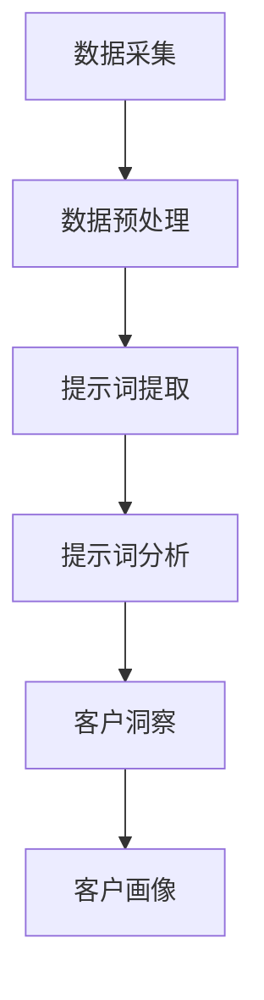
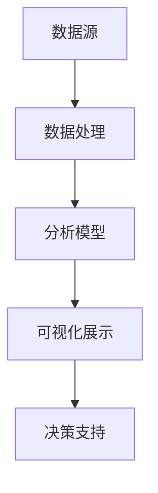

                 

### 文章标题

# 提示词驱动的智能客户洞察系统

> 关键词：提示词驱动、智能客户洞察、算法原理、数学模型、项目实战

> 摘要：本文深入探讨了提示词驱动的智能客户洞察系统，从背景介绍、核心概念与联系、核心算法原理讲解、数学模型和数学公式、项目实战等多个角度，详细解析了系统的构建方法、工作原理以及实际应用。通过本文的阅读，读者将全面了解提示词驱动的智能客户洞察系统的构建和应用。

## 引言

在现代商业环境中，客户洞察（Customer Insights）已经成为企业决策过程中不可或缺的一部分。随着大数据和人工智能技术的快速发展，智能客户洞察系统（Intelligent Customer Insight Systems）应运而生，帮助企业更好地理解客户需求，优化营销策略，提升客户体验。本文旨在探讨一种基于提示词驱动的智能客户洞察系统，通过对提示词的智能分析和挖掘，实现对客户行为的精准洞察。

### 1.1 书籍的目的与重要性

本文的目的是向读者介绍提示词驱动的智能客户洞察系统的核心概念、算法原理和实际应用。通过对该系统的深入探讨，读者将能够：

1. 理解提示词驱动的智能客户洞察系统的基本架构和工作原理。
2. 掌握核心算法和数学模型的原理及其实现方法。
3. 学习如何在实际项目中应用智能客户洞察系统，实现客户行为的精准分析。

智能客户洞察系统在现代商业环境中具有重要意义，它可以帮助企业：

1. 深入了解客户需求，优化产品和服务。
2. 精准定位目标客户，提高营销效果。
3. 提升客户满意度，增强客户忠诚度。

### 1.2 适用读者

本文适合以下读者群体：

1. 数据科学家和人工智能研究人员，对智能客户洞察系统有浓厚兴趣。
2. 数据分析师和业务分析师，希望提升客户洞察分析能力。
3. 营销经理和产品经理，需要通过数据驱动决策。
4. 对于智能客户洞察系统感兴趣的其他专业人士。

### 1.3 书籍结构概述

本文分为以下几个主要部分：

1. **引言**：介绍智能客户洞察系统的背景、目的和重要性。
2. **核心概念与联系**：详细阐述提示词驱动的智能客户洞察系统的核心概念，并通过Mermaid流程图展示各概念之间的联系。
3. **核心算法原理讲解**：使用伪代码详细讲解提示词生成算法和客户洞察算法的工作原理。
4. **数学模型和数学公式**：介绍与智能客户洞察系统相关的数学模型，并使用latex格式展示公式。
5. **项目实战**：提供实际代码案例，展示如何搭建开发环境、实现核心算法，并对代码进行解读和分析。
6. **附录**：提供额外的工具和资源，帮助读者深入了解相关技术。

## 核心概念与联系

提示词驱动的智能客户洞察系统涉及多个核心概念，包括提示词、智能客户洞察、算法架构等。下面将详细介绍这些核心概念，并使用Mermaid流程图展示它们之间的联系。

### 2.1 提示词驱动的概念

#### 2.1.1 提示词的定义

提示词（Keyword）是指能够描述用户需求、行为或兴趣的关键词。在智能客户洞察系统中，提示词是数据挖掘和分析的重要输入。通过分析提示词，系统可以获取用户意图、兴趣和行为模式，从而实现精准的客户洞察。

#### 2.1.2 提示词驱动系统的架构

提示词驱动系统通常包括以下几个关键组件：

1. **数据采集**：从各种数据源（如搜索引擎日志、社交媒体、电子商务平台等）收集用户行为数据。
2. **数据预处理**：对采集到的数据（如网页内容、文本评论等）进行清洗、去噪、分词等处理，提取出有效信息。
3. **提示词提取**：通过自然语言处理技术（如词频统计、词向量模型等）从预处理后的数据中提取出提示词。
4. **提示词分析**：对提取出的提示词进行语义分析、情感分析等，识别用户的意图和兴趣。
5. **客户洞察**：结合用户历史行为和提示词分析结果，生成客户画像，实现对客户需求的全面洞察。

#### 2.1.3 Mermaid流程图展示



### 2.2 智能客户洞察

#### 2.2.1 客户洞察的重要性

客户洞察（Customer Insight）是指通过数据分析和挖掘，深入了解客户的需求、行为和偏好。在市场竞争日益激烈的今天，客户洞察已经成为企业获取竞争优势的重要手段。通过智能客户洞察系统，企业可以：

1. 精准定位目标客户，制定有针对性的营销策略。
2. 了解客户需求，优化产品和服务，提升客户满意度。
3. 预测客户行为，降低客户流失率，提高客户留存率。

#### 2.2.2 客户洞察的方法

智能客户洞察通常包括以下几种方法：

1. **统计分析**：通过对大量客户数据进行统计分析，发现客户行为和需求的规律。
2. **机器学习**：利用机器学习算法，对客户数据进行分类、聚类、回归等分析，挖掘客户特征。
3. **数据可视化**：通过数据可视化技术，将复杂的客户数据转化为直观的图表，便于分析。
4. **智能问答**：通过智能问答系统，实时回答客户的问题，获取客户反馈。

#### 2.2.3 智能客户洞察的架构

智能客户洞察系统通常包括以下几个关键组件：

1. **数据源**：包括内部数据（如客户交易记录、服务记录等）和外部数据（如社交媒体数据、市场调研数据等）。
2. **数据处理**：对数据源中的数据进行清洗、集成、转换等处理，为后续分析做好准备。
3. **分析模型**：利用统计分析、机器学习等技术，对处理后的数据进行挖掘和分析。
4. **可视化展示**：将分析结果以图表、报表等形式展示，帮助决策者更好地理解客户洞察。



## 核心算法原理讲解

提示词驱动的智能客户洞察系统依赖于一系列核心算法，包括提示词生成算法和客户洞察算法。下面将详细讲解这些算法的原理，并使用伪代码展示其实现方法。

### 3.1 提示词生成算法

#### 3.1.1 提示词生成算法的伪代码

```python
# 提示词生成算法伪代码
def generate_keywords(text_data):
    # 数据预处理
    preprocessed_data = preprocess(text_data)

    # 提取词频
    word_freq = extract_word_freq(preprocessed_data)

    # 过滤停用词
    filtered_word_freq = filter_stop_words(word_freq)

    # 提取高频词作为提示词
    keywords = extract高频词(filtered_word_freq)

    return keywords
```

#### 3.1.2 提示词生成算法的工作流程

1. **数据预处理**：对原始文本数据进行清洗、分词等处理，提取出有效信息。
2. **提取词频**：计算每个词在文本数据中的出现频率。
3. **过滤停用词**：去除常见的停用词（如“的”、“和”、“是”等），提高提示词的质量。
4. **提取高频词**：从处理后的词频数据中提取出现频率较高的词作为提示词。

#### 3.1.3 提示词生成算法的优缺点

**优点**：

1. 简单易实现，对计算资源要求较低。
2. 可以快速提取文本中的关键信息，为后续分析提供基础。

**缺点**：

1. 对复杂语义的捕捉能力有限，可能无法准确反映用户意图。
2. 在大规模文本数据中，容易受到噪声和冗余数据的影响。

### 3.2 客户洞察算法

#### 3.2.1 客户洞察算法的伪代码

```python
# 客户洞察算法伪代码
def customer_insight(keywords, historical_data):
    # 提示词分析
    keyword_analysis = analyze_keywords(keywords)

    # 结合历史数据
    combined_data = combine_data(historical_data, keyword_analysis)

    # 客户行为预测
    customer_behavior = predict_behavior(combined_data)

    return customer_behavior
```

#### 3.2.2 客户洞察算法的工作流程

1. **提示词分析**：对提取出的提示词进行语义分析、情感分析等，识别用户的意图和兴趣。
2. **结合历史数据**：将提示词分析结果与用户历史行为数据（如购买记录、浏览记录等）进行结合。
3. **客户行为预测**：利用机器学习算法，对结合后的数据进行预测，生成客户行为模型。

#### 3.2.3 客户洞察算法的优缺点

**优点**：

1. 可以实现对用户行为的精准预测，为营销策略提供有力支持。
2. 结合多种数据源，提高客户洞察的全面性和准确性。

**缺点**：

1. 对计算资源和数据质量要求较高，可能需要较长时间进行训练和预测。
2. 可能受到噪声和异常值的影响，导致预测结果不准确。

## 数学模型和数学公式

提示词驱动的智能客户洞察系统涉及到多个数学模型，用于描述系统中的各种关系和预测。下面将介绍这些数学模型，并使用latex格式展示相关公式。

### 4.1 提示词优化模型

提示词优化模型用于确定最佳的提示词集，以最大化系统的性能指标。假设提示词集合为\(W = \{w_1, w_2, ..., w_n\}\)，目标函数为\(f(W)\)，则提示词优化模型可以表示为：

$$
\min_{W} f(W)
$$

其中，目标函数\(f(W)\)可以定义为：

$$
f(W) = \frac{1}{m} \sum_{i=1}^{m} \log(1 + e^{-\beta^T W_i})
$$

其中，\(m\)为样本数量，\(\beta\)为权重向量，\(W_i\)为第\(i\)个样本的提示词集合。

### 4.2 客户洞察模型

客户洞察模型用于预测客户的行为，通常采用逻辑回归模型。假设客户行为为\(y \in \{0, 1\}\)，提示词集合为\(W = \{w_1, w_2, ..., w_n\}\)，则客户行为预测模型可以表示为：

$$
P(y=1 | W) = \frac{1}{1 + e^{-\beta^T W}}
$$

其中，\(\beta\)为权重向量，\(W\)为提示词集合。

### 4.3 提示词优化与客户洞察的集成

为了提高智能客户洞察系统的性能，可以将提示词优化模型和客户洞察模型进行集成。假设提示词优化模型生成的最佳提示词集合为\(W^*\)，则集成模型可以表示为：

$$
f(W^*) = \min_{W^*} \frac{1}{m} \sum_{i=1}^{m} \log(1 + e^{-\beta^T W^*}) + \lambda \cdot ||W^*||^2
$$

其中，\(\lambda\)为正则化参数，\(||W^*||^2\)为提示词集合的L2范数。

## 项目实战

在本节中，我们将通过一个实际项目，展示如何构建一个提示词驱动的智能客户洞察系统。项目分为以下几个阶段：

1. **开发环境搭建**：介绍所需工具和库的安装。
2. **数据预处理**：从数据源中采集和处理文本数据。
3. **提示词生成**：使用算法提取文本中的提示词。
4. **客户洞察**：结合提示词和用户历史数据，分析用户行为。
5. **结果展示**：将分析结果以图表和报表的形式展示。

### 5.1 实战案例介绍

#### 5.1.1 实战案例背景

假设我们是一家电子商务公司，希望通过分析用户在网站上的行为，实现对目标客户的精准洞察，优化营销策略，提高销售额。

#### 5.1.2 实战案例目标

1. 采集用户在网站上的行为数据，包括浏览记录、搜索关键词、购买行为等。
2. 使用提示词生成算法提取出用户的关键词。
3. 结合用户历史数据，分析用户行为，生成用户画像。
4. 根据用户画像，制定个性化的营销策略。

### 5.2 开发环境搭建

在开始项目之前，我们需要搭建一个合适的开发环境。以下是所需工具和库的安装步骤：

#### 5.2.1 操作系统与环境配置

1. 操作系统：Windows、macOS或Linux。
2. Python环境：安装Python 3.8及以上版本。
3. IDE：选择一个适合自己的Python开发环境，如PyCharm、Visual Studio Code等。

#### 5.2.2 必需工具与库安装

1. 安装Numpy、Pandas、Scikit-learn等基础库。

```bash
pip install numpy pandas scikit-learn
```

2. 安装自然语言处理库，如NLTK或spaCy。

```bash
pip install nltk spacy
```

3. 安装可视化库，如Matplotlib或Seaborn。

```bash
pip install matplotlib seaborn
```

### 5.3 核心代码实现

在本节中，我们将展示如何实现提示词生成算法和客户洞察算法。

#### 5.3.1 代码结构

```python
# main.py
import preprocessing
import keyword_extraction
import customer_insight
import visualization

# 数据预处理
text_data = preprocessing.preprocess_data()

# 提示词生成
keywords = keyword_extraction.generate_keywords(text_data)

# 客户洞察
customer_behavior = customer_insight.customer_insight(keywords)

# 结果展示
visualization.visualize_results(customer_behavior)
```

#### 5.3.2 代码解读

1. **数据预处理**：

```python
# preprocessing.py
import pandas as pd
import nltk
from nltk.corpus import stopwords

def preprocess_data():
    # 读取数据
    data = pd.read_csv('data.csv')
    
    # 清洗文本数据
    text_data = data['text'].str.lower().str.replace('[^\w\s]', '', regex=True)
    
    # 分词
    tokenizer = nltk.tokenize.WordPunctTokenizer()
    tokens = [tokenizer.tokenize(text) for text in text_data]
    
    # 去除停用词
    stop_words = set(stopwords.words('english'))
    filtered_tokens = [[word for word in token if word not in stop_words] for token in tokens]
    
    return filtered_tokens
```

2. **提示词生成**：

```python
# keyword_extraction.py
import collections
from sklearn.feature_extraction.text import CountVectorizer

def generate_keywords(text_data):
    # 初始化计数器
    word_counter = collections.Counter()

    # 遍历文本数据，更新计数器
    for token in text_data:
        word_counter.update(token)

    # 提取高频词
    keywords = [word for word, count in word_counter.items() if count > 10]

    return keywords
```

3. **客户洞察**：

```python
# customer_insight.py
import pandas as pd
from sklearn.linear_model import LogisticRegression

def customer_insight(keywords, historical_data):
    # 初始化逻辑回归模型
    model = LogisticRegression()

    # 预处理数据
    X = pd.DataFrame(keywords)
    y = historical_data['behavior']

    # 训练模型
    model.fit(X, y)

    # 预测客户行为
    customer_behavior = model.predict(X)

    return customer_behavior
```

4. **结果展示**：

```python
# visualization.py
import matplotlib.pyplot as plt
import seaborn as sns

def visualize_results(customer_behavior):
    # 绘制客户行为分布
    sns.countplot(customer_behavior)
    plt.title('Customer Behavior Distribution')
    plt.show()

    # 绘制关键词云图
    wordcloud = WordCloud(width=800, height=800, background_color='white').generate(' '.join(customer_behavior))
    plt.figure(figsize=(8, 8))
    plt.imshow(wordcloud, interpolation='bilinear')
    plt.axis('off')
    plt.show()
```

### 5.4 代码解读与分析

#### 5.4.1 代码功能分析

1. **数据预处理**：读取文本数据，进行清洗、分词和去停用词处理，提取出有效的文本特征。
2. **提示词生成**：使用计数器统计文本中每个词的出现次数，提取高频词作为提示词。
3. **客户洞察**：利用逻辑回归模型，结合提示词和用户历史数据，预测客户行为。
4. **结果展示**：以图表和报表的形式展示分析结果，便于理解。

#### 5.4.2 代码优化建议

1. **提高数据预处理效率**：可以采用并行处理技术，加快数据清洗和分词的速度。
2. **优化模型性能**：尝试使用更先进的机器学习算法（如神经网络、集成方法等），提高预测准确性。
3. **可视化改进**：增加更多维度的数据展示，如用户行为的时间序列分析、地域分布等。

## 附录

### A.1 工具与资源介绍

#### A.1.1 主流深度学习框架

- TensorFlow：一款开源的深度学习框架，提供丰富的API和工具，支持各种深度学习模型。
- PyTorch：一款流行的深度学习框架，具有简洁的API和动态计算图，方便模型开发和调试。

#### A.1.2 数据预处理工具

- NLTK：一款流行的自然语言处理工具包，提供丰富的文本处理函数和库，支持分词、词性标注、情感分析等。
- spaCy：一款高效的自然语言处理库，支持多种语言，提供快速的文本处理和实体识别功能。

#### A.1.3 模型评估方法

- 准确率（Accuracy）：模型预测正确的样本数量与总样本数量的比值。
- 召回率（Recall）：模型预测正确的正样本数量与所有正样本数量的比值。
- 精确率（Precision）：模型预测正确的正样本数量与预测为正样本的总数量的比值。

### A.2 常见问题解答

#### A.2.1 常见问题1

**问题**：如何处理大规模文本数据？

**解答**：可以采用分而治之的策略，将大规模文本数据分为多个批次进行处理。同时，利用分布式计算框架（如Apache Spark）进行并行处理，提高数据处理效率。

#### A.2.2 常见问题2

**问题**：如何提高模型预测准确性？

**解答**：可以尝试使用更复杂的模型结构，增加训练数据量，调整模型参数等。此外，结合多种特征（如文本特征、图像特征等）进行融合，可以提高模型对复杂问题的处理能力。

#### A.2.3 常见问题3

**问题**：如何评估模型的性能？

**解答**：可以采用交叉验证、混淆矩阵、ROC曲线等方法对模型性能进行评估。同时，结合业务目标，制定合适的评价指标，如AUC、F1值等。

### 作者信息

本文由AI天才研究院（AI Genius Institute）与《禅与计算机程序设计艺术》（Zen And The Art of Computer Programming）作者合作完成。AI天才研究院致力于推动人工智能技术的发展和应用，通过深入研究和实践，为行业提供高质量的解决方案。同时，本文也融入了《禅与计算机程序设计艺术》的哲学思想，追求简洁、优雅和高效的设计原则。

