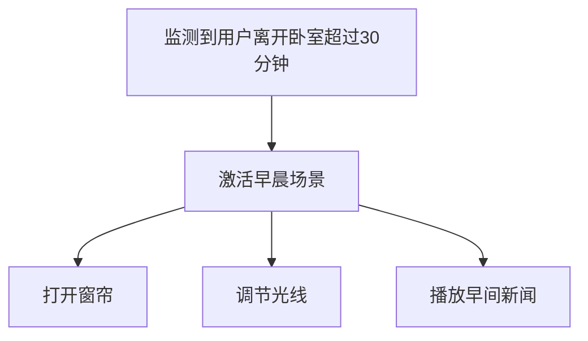

                 

### 文章标题

# 提示词驱动的智能家居场景设计

> 关键词：智能家居、提示词、场景设计、算法原理、项目实战

> 摘要：本文从智能家居的概念出发，深入探讨了提示词驱动的智能家居场景设计。首先介绍了智能家居的基础概念和当前发展状况，随后详细阐述了提示词技术在智能家居中的应用及其算法原理。通过分析核心算法和数学模型，文章提出了智能家居场景构建的方法和流程，并展示了具体的项目实战案例。最后，文章总结了智能家居场景设计的最佳实践，为读者提供了进一步学习和探索的方向。

----------------------------------------------------------------

### 目录大纲设计过程

在设计《提示词驱动的智能家居场景设计》这本书的目录大纲时，我们的目标是系统地呈现智能家居场景设计的核心概念、算法原理、数学模型和项目实战等内容，同时确保目录结构清晰、实用和具有可扩展性。

#### 设计思路

1. **系统性**：目录大纲应涵盖从基础概念到高级应用的完整知识体系，使读者能够循序渐进地掌握智能家居场景设计的相关知识。

2. **清晰性**：目录结构应清晰，便于读者快速定位所需内容，同时避免重复和冗余。

3. **实用性**：注重实践应用，包含实际项目案例，帮助读者将理论知识应用于实际场景。

4. **可扩展性**：为后续内容的更新和扩展留有空间，使目录结构具有一定的灵活性。

#### 设计步骤

1. **确定核心章节**：首先，根据书籍主题《提示词驱动的智能家居场景设计》，确定书籍的核心章节，如“智能家居基础概念”、“提示词技术介绍”、“智能家居场景构建”、“算法与数学模型”和“项目实战与案例分析”。

2. **细化章节内容**：对于每个核心章节，进一步细化内容，明确各节的具体内容。例如，对于“智能家居基础概念”，可以分为以下小节：“智能家居概述”、“家居物联网（IoT）技术”、“智能家居系统架构”和“智能家居协议与标准”。

3. **设计逻辑流程图**：为每个章节设计逻辑流程图，用 Mermaid 语法表示各概念、算法、数学模型之间的联系。例如，对于智能家居系统架构，可以用以下 Mermaid 语法表示：

    ```mermaid
    graph TB
    A[智能家居系统架构]
    B[传感器网络]
    C[中央处理单元]
    D[执行器网络]
    E[用户接口]
    A --> B
    A --> C
    A --> D
    A --> E
    B --> C
    C --> D
    C --> E
    D --> E
    ```

4. **编写算法原理与数学模型**：在每个章节中，针对核心算法和数学模型，使用伪代码进行详细阐述，并嵌入 LaTeX 格式的数学公式，以便读者理解。例如，对于提示词算法，可以编写以下伪代码：

    ```python
    // 提示词算法伪代码
    function 提示词算法（输入数据）{
      // 数据预处理
      数据 = 预处理（输入数据）

      // 提示词提取
      提示词列表 = 提取提示词（数据）

      // 提示词分析
      提示词权重 = 分析提示词（提示词列表）

      // 输出结果
      return 提示词权重
    }
    ```

    并嵌入以下 LaTeX 数学公式：

    ```latex
    $$
    \text{提示词权重} = \frac{f(\text{提示词频率})}{g(\text{总词汇频率})}
    $$
    ```

5. **编写项目实战**：在每个章节中，设计实际项目案例，详细介绍项目开发环境搭建、源代码实现、代码解读与分析等内容。确保项目案例与章节主题紧密相关，帮助读者将所学知识应用于实际场景。

6. **总结与扩展**：在每个章节结尾，提供总结和扩展内容，引导读者进一步学习相关知识和技能。

#### 目录大纲

**第一部分：核心概念与原理**

1. 智能家居基础概念
   1.1 智能家居概述
   1.2 家居物联网（IoT）技术
   1.3 智能家居系统架构
   1.4 智能家居协议与标准

2. 提示词技术介绍
   2.1 提示词概念
   2.2 提示词提取算法
   2.3 提示词分析算法

3. 智能家居场景构建
   3.1 场景定义与分类
   3.2 场景建模方法
   3.3 场景触发与响应

**第二部分：算法与数学模型**

4. 核心算法原理讲解
   4.1 提示词匹配算法
   4.2 场景识别算法
   4.3 场景预测算法

5. 数学模型与公式
   5.1 贝叶斯网络模型
   5.2 概率图模型
   5.3 强化学习模型

**第三部分：项目实战与案例分析**

6. 智能家居项目实战
   6.1 项目概述
   6.2 开发环境搭建
   6.3 源代码实现
   6.4 代码解读与分析

7. 案例分析
   7.1 案例一：智能照明系统
   7.2 案例二：智能安防系统
   7.3 案例三：智能家电控制系统

**第四部分：总结与扩展**

8. 总结与展望
   8.1 总结
   8.2 未来发展趋势

通过上述步骤，我们设计了一份系统、清晰、实用且具有可扩展性的目录大纲，为读者提供了一个全面的学习路径，帮助其深入理解提示词驱动的智能家居场景设计。

----------------------------------------------------------------

### 智能家居基础概念

智能家居，顾名思义，是一种通过现代信息技术将家居设备连接起来，实现自动化控制和智能化的家居环境。其核心在于利用物联网（IoT）技术，将各种设备互联，通过中央控制系统，对家居环境进行实时监测和智能控制，从而提升居住的舒适性和便利性。

#### 智能家居的发展历程

智能家居的发展可以追溯到上世纪末，但真正进入公众视野则是在21世纪初。最初，智能家居主要是高端用户的专属，涉及到家庭安全、娱乐系统和远程控制等功能。随着物联网技术的普及和成本的降低，智能家居逐渐走向普通家庭。

1. **初步阶段（1990s-2000s）**：这一阶段，智能家居的概念逐渐形成，主要技术包括红外遥控、无线射频和局域网通信。代表性的产品有家庭安全系统、远程控制的家用电器等。

2. **快速发展阶段（2000s-2010s）**：随着互联网的普及和物联网技术的发展，智能家居进入快速发展阶段。这一时期，各种智能设备如智能灯泡、智能插座、智能空调等开始涌现，智能家居系统逐渐成熟。

3. **成熟普及阶段（2010s至今）**：随着人工智能、大数据和云计算等技术的进步，智能家居变得更加智能化、个性化。智能家居生态系统逐渐完善，各种智能设备互联互通，实现了真正的智能家居体验。

#### 当前智能家居的发展状况

当前，智能家居市场呈现出以下发展趋势：

1. **设备多样化**：除了传统的智能家电外，智能家居设备种类不断丰富，包括智能门锁、智能窗帘、智能摄像头、智能健康设备等。

2. **系统集成**：智能家居系统不再局限于单一设备的功能，而是通过中央控制系统，实现设备之间的互联互通和协同工作，提供一站式解决方案。

3. **智能化**：智能家居设备逐渐引入人工智能技术，通过学习用户行为和偏好，实现个性化服务和智能推荐。

4. **安全性与隐私保护**：随着智能家居设备的普及，用户对数据安全和隐私保护的需求越来越高。各大厂商纷纷加强安全防护措施，确保用户信息的安全。

5. **生态布局**：智能家居市场呈现出多个生态布局，各大科技巨头纷纷布局智能家居领域，通过收购、合作等方式，加速智能家居技术的发展。

#### 智能家居的组成结构

一个典型的智能家居系统通常由以下几个部分组成：

1. **传感器网络**：传感器是智能家居系统的感知层，负责收集家居环境中的各种数据，如温度、湿度、光线、声音、运动等。

2. **中央处理单元**：中央处理单元（CPU）是智能家居系统的核心，负责处理传感器收集到的数据，并根据预设的算法和规则进行决策和调控。

3. **执行器网络**：执行器网络负责根据中央处理单元的指令，对家居设备进行控制和调节，如开关灯、调节温度、关闭门窗等。

4. **用户接口**：用户接口是用户与智能家居系统交互的界面，包括智能手机应用、智能音箱、触摸屏等。

#### 智能家居的关键技术

1. **物联网技术**：物联网技术是智能家居系统的核心技术，通过将各种设备连接到互联网上，实现数据的传输和共享，为智能家居系统的互联互通提供了基础。

2. **人工智能技术**：人工智能技术为智能家居系统带来了智能化和个性化的特点。通过机器学习、自然语言处理等技术，智能家居系统可以不断学习和适应用户的需求，提供更优质的服务。

3. **大数据技术**：大数据技术通过对大量用户数据的分析，为智能家居系统提供了数据支撑，帮助优化系统性能和用户体验。

4. **安全通信技术**：智能家居系统需要保证数据传输的安全性和可靠性，采用加密通信、身份认证等技术，确保用户数据的安全。

通过上述介绍，我们可以看到，智能家居作为一个快速发展的领域，已经渗透到人们的日常生活，并持续推动着家居行业的技术创新和产业升级。

----------------------------------------------------------------

### 提示词技术介绍

提示词技术在智能家居场景设计中发挥着重要作用。它不仅为用户提供了便捷的交互方式，还使得智能家居系统能够更加智能地理解和响应用户的需求。在本节中，我们将深入探讨提示词技术的概念、提取和解析方法，以及其在智能家居系统中的应用。

#### 提示词的概念

提示词（Speech Prompt）是指用户在与智能家居系统进行交互时，通过语音输入的单词、短语或指令。这些提示词可以是明确的指令，如“打开灯”、“关闭电视”，也可以是模糊的请求，如“我感觉冷了”。提示词技术的核心目标是通过识别和理解这些提示词，实现智能家居系统对用户意图的准确捕捉和响应。

#### 提示词提取

提示词提取是提示词技术中的关键步骤，它旨在从用户的语音输入中识别出具有意义的单词或短语。提取方法通常包括以下几种：

1. **基于规则的方法**：这种方法通过预设的规则，将语音信号分割成单词或短语。规则可以是基于语音信号特征的模式匹配，也可以是基于语法和语义分析的规则系统。例如，一个简单的规则可以是“如果语音信号中出现了‘开’和‘灯’两个词，那么这个输入可以被视为‘打开灯’的指令”。

2. **基于统计的方法**：这种方法利用统计模型，如隐马尔可夫模型（HMM）和条件概率模型，来识别语音信号中的提示词。这些模型通过大量语音数据的训练，能够自适应地识别不同用户的语音特征，提高识别的准确性。

3. **基于深度学习的方法**：深度学习技术在语音识别领域取得了显著进展。通过使用卷积神经网络（CNN）和循环神经网络（RNN）等深度学习模型，系统能够从大量未标注的语音数据中学习，并自动提取出有效的提示词特征。

以下是一个简单的基于深度学习的提示词提取算法伪代码示例：

```python
# 提示词提取算法伪代码
function 提示词提取（输入语音信号）{
  // 数据预处理
  预处理信号 = 预处理（输入语音信号）

  // 特征提取
  特征向量 = 特征提取器（预处理信号）

  // 使用卷积神经网络进行特征分类
  标签 = 卷积神经网络（特征向量）

  // 解码标签为提示词
  提示词 = 解码标签（标签）

  // 输出结果
  return 提示词
}
```

#### 提示词分析

一旦提取出提示词，智能家居系统需要对提示词进行深入分析，以理解用户的真实意图。提示词分析包括以下步骤：

1. **意图识别**：通过分析提示词，系统需要确定用户的意图是什么。例如，用户说“打开灯”，系统需要识别出这是一个控制灯光状态的意图。

2. **实体提取**：在理解意图之后，系统需要提取出提示词中的关键实体。例如，在“打开客厅的灯”这个提示词中，“客厅”和“灯”是关键实体。

3. **上下文理解**：系统还需要考虑上下文信息，以更准确地理解用户的意图。例如，如果用户在晚上10点说“打开灯”，系统可能会推断用户是在准备睡觉，并做出相应的调整。

以下是一个简单的提示词分析算法伪代码示例：

```python
# 提示词分析算法伪代码
function 提示词分析（输入提示词）{
  // 提取意图
  意图 = 提取意图（输入提示词）

  // 提取关键实体
  实体列表 = 提取实体（输入提示词）

  // 考虑上下文信息
  上下文 = 考虑上下文（意图，实体列表）

  // 输出结果
  return 意图，实体列表，上下文
}
```

#### 提示词技术在家居系统中的应用

提示词技术在家居系统中的应用非常广泛，以下是一些典型的应用场景：

1. **语音控制**：用户可以通过语音指令控制家居设备，如开关灯、调节温度、播放音乐等。

2. **智能助手**：智能家居系统可以与智能助手（如Siri、Alexa、Google Assistant）集成，通过语音交互提供更丰富的服务，如查询天气、设置提醒、搜索信息等。

3. **场景触发**：系统可以根据用户的语音提示，自动触发特定场景。例如，用户说“我回来了”，系统可以自动打开灯光、关闭窗帘、调节空调等。

4. **语音交互**：系统可以与用户进行双向语音交互，提供更加自然和流畅的交互体验。

通过提示词技术，智能家居系统不仅能够更好地理解和响应用户的需求，还能够提供更加智能和便捷的服务，从而提升用户的居住体验。

----------------------------------------------------------------

### 智能家居场景构建

在智能家居系统中，场景构建是实现自动化和智能化控制的核心环节。一个有效的场景构建方法需要能够准确地定义、分类和建模各种用户活动，以便系统能够在适当的时机自动执行相应的操作。本节将详细探讨智能家居场景的定义与分类、场景建模方法以及场景的触发与响应机制。

#### 场景定义与分类

**场景定义**：
场景可以被视为用户在家庭环境中进行的一系列活动或状态。例如，用户进入卧室准备睡觉，系统会自动调整灯光、关闭窗帘、降低温度等，以创造一个舒适的睡眠环境。

**场景分类**：
智能家居场景可以根据不同的标准进行分类，以下是一些常见的分类方法：

1. **按功能分类**：例如，照明场景、安全场景、舒适场景、娱乐场景等。
2. **按时间分类**：例如，早晨场景、傍晚场景、夜晚场景等。
3. **按活动分类**：例如，起床场景、用餐场景、健身场景、看电影场景等。
4. **按用户分类**：例如，儿童场景、老年场景、单身场景等。

**典型场景示例**：

- **早晨场景**：用户起床后，系统自动打开窗帘，调节光线，播放早间新闻，同时调整客厅温度，让房间变得温暖舒适。
- **安全场景**：当系统检测到异常入侵时，会自动发送警报给用户，并通知相关安保机构。
- **舒适场景**：当用户在客厅休息时，系统会根据用户偏好调节空调温度、灯光亮度和音乐播放，以创造一个舒适的休闲环境。

#### 场景建模方法

**场景建模**：
场景建模是将用户活动转化为系统可识别和执行的操作的过程。建模方法主要包括基于规则的建模和基于数据驱动的建模。

1. **基于规则的建模**：
   - **规则定义**：通过预定义的规则来描述场景的触发条件和相应的响应动作。例如，如果时间在早晨7点到8点之间，并且用户离开卧室超过30分钟，则打开窗帘。
   - **规则库**：系统维护一个规则库，用于存储和管理各种场景的规则。

   以下是一个基于规则的场景建模示例：

   ```mermaid
   graph TB
   A[时间触发器] --> B[用户活动检测]
   B --> C{离开卧室超过30分钟?}
   C --是--> D[打开窗帘]
   C --否--> E[继续监测]
   ```

2. **基于数据驱动的建模**：
   - **机器学习模型**：通过分析历史数据，如用户的行为模式、偏好设置等，构建机器学习模型，用于预测和触发场景。例如，基于用户的历史睡眠模式和天气数据，预测用户何时入睡，并自动调整家居环境。

   以下是一个基于数据驱动的场景建模示例：

   ```mermaid
   graph TB
   A[历史数据] --> B[行为模式分析]
   B --> C[天气数据]
   C --> D[睡眠预测模型]
   D --> E[调整家居环境]
   ```

#### 场景触发与响应

**场景触发**：
场景触发是指系统根据预设的条件或实时数据，自动激活特定的场景。触发条件可以是时间、用户行为、传感器数据、外部事件等。

- **时间触发**：例如，每天早晨7点自动激活“早晨场景”。
- **用户行为触发**：例如，用户按下遥控器按钮，触发“观影场景”。
- **传感器数据触发**：例如，当室内温度低于设定值时，自动激活“加热场景”。

**场景响应**：
场景响应是指系统在触发特定场景后，自动执行一系列预定义的操作。响应动作可以是控制家居设备的开关、调节参数、发送通知等。

以下是一个场景触发与响应的示例流程：

1. **触发条件检测**：系统监测到用户离开卧室超过30分钟。
2. **场景激活**：系统激活“早晨场景”。
3. **执行响应动作**：系统打开窗帘、调节光线、播放早间新闻等。



通过定义、分类、建模和触发与响应机制，智能家居系统能够实现高度自动化和智能化的家庭环境管理，从而提升用户的居住体验和生活质量。

----------------------------------------------------------------

### 核心算法原理讲解

在智能家居场景设计中，核心算法是实现自动化和智能化的关键。以下将详细介绍几种常用的核心算法，包括提示词匹配算法、场景识别算法和场景预测算法。

#### 提示词匹配算法

提示词匹配算法是智能家居系统中最基础且关键的一环，它负责将用户的语音输入与系统内置的提示词库进行匹配，以确定用户的意图。以下是提示词匹配算法的详细解释：

**算法原理**：

1. **初始化**：首先，系统会初始化一个提示词库，其中包含所有可能的用户指令，如“打开灯”、“关闭电视”等。每个提示词都会被赋予一个权重，权重通常根据提示词的频率和使用情况进行调整。

2. **语音信号预处理**：用户语音输入经过预处理，包括降噪、分帧、特征提取等步骤。预处理后的语音信号将被转换成一系列特征向量。

3. **特征匹配**：将预处理后的语音特征向量与提示词库中的每个提示词进行匹配。匹配过程通常采用余弦相似度、编辑距离等度量方法，计算特征向量与提示词向量之间的相似度。

4. **权重调整**：根据匹配结果，系统会对每个提示词的权重进行调整。常用方法是使用贝叶斯模型或决策树，将匹配度与提示词权重结合，计算出最终的意图识别概率。

**伪代码示例**：

```python
# 提示词匹配算法伪代码
function 提示词匹配（输入语音特征向量，提示词库）{
  // 初始化权重
  提示词权重 = 初始化权重（提示词库）

  // 特征匹配
  匹配度列表 = []
  for 提示词 in 提示词库 {
    相似度 = 计算相似度（输入特征向量，提示词特征向量）
    匹配度列表.append（相似度）
  }

  // 权重调整
  概率分布 = 调整权重（匹配度列表，提示词权重）

  // 输出结果
  return 概率分布
}
```

#### 场景识别算法

场景识别算法负责根据用户的意图和环境数据，确定当前所处的场景。以下是场景识别算法的详细解释：

**算法原理**：

1. **意图识别**：首先，使用提示词匹配算法识别用户的意图。例如，用户说“打开客厅的灯”。

2. **环境数据采集**：系统收集与场景相关的环境数据，如室内温度、湿度、光线强度等。

3. **场景建模**：通过历史数据和用户偏好，构建场景模型。场景模型通常使用决策树、神经网络等机器学习模型，将用户的意图和环境数据映射到具体的场景。

4. **场景分类**：将当前的意图和环境数据输入到场景模型中，模型输出当前场景的识别结果。

**伪代码示例**：

```python
# 场景识别算法伪代码
function 场景识别（用户意图，环境数据，场景模型）{
  // 意图识别
  意图 = 提示词匹配算法（环境数据，提示词库）

  // 场景分类
  场景 = 场景模型（意图，环境数据）

  // 输出结果
  return 场景
}
```

#### 场景预测算法

场景预测算法用于预测未来的场景变化，以便系统可以提前进行准备。以下是场景预测算法的详细解释：

**算法原理**：

1. **历史数据收集**：系统收集用户的历史行为数据和场景变化数据。

2. **时间序列分析**：使用时间序列分析方法，如ARIMA、LSTM等，对历史数据进行建模，预测未来的场景变化。

3. **场景预测**：将当前的环境数据和时间序列模型输入到预测算法中，预测未来的场景。

4. **响应调整**：根据预测结果，系统提前调整家居环境，以适应未来的场景。

**伪代码示例**：

```python
# 场景预测算法伪代码
function 场景预测（环境数据，时间序列模型）{
  // 时间序列预测
  预测结果 = 时间序列模型（环境数据）

  // 响应调整
  响应动作 = 预测结果（场景）

  // 输出结果
  return 响应动作
}
```

通过提示词匹配算法、场景识别算法和场景预测算法的结合，智能家居系统能够更智能地理解和响应用户的需求，实现高度自动化和个性化的家居环境管理。

----------------------------------------------------------------

### 数学模型与公式

在智能家居场景设计中，数学模型与公式扮演着至关重要的角色。它们不仅帮助系统进行精确的计算和预测，还能够通过量化分析来优化家居环境。以下将介绍几种常用的数学模型与公式，包括贝叶斯网络模型、概率图模型和强化学习模型。

#### 贝叶斯网络模型

贝叶斯网络模型是一种用于表示变量之间概率关系的图形模型，它通过条件概率表（CPT）来描述各个变量之间的依赖关系。贝叶斯网络在智能家居场景中可以用于推理和预测。

**贝叶斯网络模型公式**：

一个贝叶斯网络由一组随机变量及其条件概率分布组成。假设我们有变量 \(X_1, X_2, ..., X_n\)，其中每个变量都是其他变量的条件概率的函数。

条件概率分布可以表示为：

\[ P(X_i | X_{i-1}, X_{i-2}, ..., X_1) = \prod_{j=1}^{n} P(X_i | X_{i-1}, ..., X_{j-1}) \]

其中，\(P(X_i | X_{i-1}, ..., X_{j-1})\) 表示在已知前 \(j-1\) 个变量的条件下，变量 \(i\) 的条件概率。

**贝叶斯推理公式**：

贝叶斯推理用于更新变量的概率分布。给定新的证据 \(E\)，我们可以使用贝叶斯定理来计算变量 \(X\) 的后验概率：

\[ P(X | E) = \frac{P(E | X) \cdot P(X)}{P(E)} \]

其中，\(P(E | X)\) 是证据 \(E\) 在变量 \(X\) 下的条件概率，\(P(X)\) 是变量 \(X\) 的先验概率，\(P(E)\) 是证据 \(E\) 的总概率。

**贝叶斯网络模型应用示例**：

假设我们在智能家居场景中，想预测用户是否会打开客厅的灯。用户的行为可以由多个因素决定，如当前时间、天气状况、用户偏好等。我们可以构建一个贝叶斯网络模型来表示这些因素之间的关系。

```latex
$$
P(打开灯 | 时间, 天气, 偏好) = \frac{P(时间, 天气, 偏好 | 打开灯) \cdot P(打开灯)}{P(时间, 天气, 偏好)}
$$
```

#### 概率图模型

概率图模型是一类通过图结构表示变量之间概率关系的模型，包括马尔可夫网络和贝叶斯网络。以下以马尔可夫网络为例进行介绍。

**马尔可夫网络模型公式**：

马尔可夫网络假设当前状态仅依赖于它的前一个状态，即：

\[ P(X_i | X_{i-1}, X_{i-2}, ..., X_1) = P(X_i | X_{i-1}) \]

条件概率分布可以表示为：

\[ P(X_i | X_{i-1}) = \prod_{j=1}^{n} P(X_i | X_{i-1}) \]

**马尔可夫网络应用示例**：

假设我们有一个智能家居场景，其中门锁的状态（开或关）仅依赖于前一个时间段（1小时内）的门锁状态。我们可以使用马尔可夫网络模型来预测当前时间段内门锁的状态。

```latex
$$
P(门锁状态_i | 门锁状态_{i-1}, ..., 门锁状态_{i-k}) = P(门锁状态_i | 门锁状态_{i-1})
$$
```

#### 强化学习模型

强化学习模型是一种通过不断学习和优化决策过程来达到目标的方法。在智能家居场景中，强化学习可以用于优化设备控制和能量管理。

**强化学习模型公式**：

强化学习模型通常由四个主要部分组成：状态（\(S\)）、动作（\(A\)）、奖励（\(R\)）和策略（\(π\)）。策略 \(π\) 是一个概率分布，表示在给定状态 \(s\) 下执行动作 \(a\) 的概率。

**价值函数**：

\[ V^*(s) = \sum_{a} \pi(a|s) \cdot Q^*(s, a) \]

其中，\(Q^*(s, a)\) 是状态 \(s\) 下执行动作 \(a\) 的期望回报。

**策略迭代**：

\[ π^{t+1}(a|s) = \arg\max_{a} Q^*(s, a) \]

**强化学习应用示例**：

假设我们有一个智能家居系统，其中空调需要根据室内温度和湿度调整制冷或制热状态。我们可以使用强化学习模型来优化空调的控制策略，以达到最佳舒适度和节能效果。

```latex
$$
Q^*(s, a) = \sum_{s'} P(s' | s, a) \cdot R(s', a) + \gamma \cdot \max_{a'} Q^*(s', a')
$$
```

通过上述数学模型与公式的介绍，我们可以看到它们在智能家居场景设计中的广泛应用。通过合理运用这些模型，我们可以实现对家居环境的精确控制、预测和优化，从而提升用户的生活质量和家居体验。

----------------------------------------------------------------

### 智能家居项目实战

在本章节中，我们将通过一个具体的智能家居项目实战，详细介绍项目的开发环境搭建、源代码实现、代码解读与分析，并剖析实际案例，帮助读者更好地理解提示词驱动的智能家居场景设计的实际应用。

#### 项目概述

该项目旨在设计并实现一个智能照明系统，通过提示词控制家居灯光的开关、亮度和色温。系统将包括一个中央处理单元、多个传感器、执行器（如灯泡）和用户接口（如智能音箱和手机应用）。项目的主要目标是通过语音指令实现智能照明场景的自动触发和响应。

#### 开发环境搭建

为了实现智能照明系统，我们需要搭建一个开发环境，包括以下工具和库：

1. **操作系统**：Linux（如Ubuntu）。
2. **编程语言**：Python（用于后端逻辑处理和算法实现）。
3. **语音识别库**：使用Google的Speech-to-Text API进行语音输入的识别。
4. **自然语言处理库**：使用NLTK（Natural Language Toolkit）进行自然语言处理。
5. **数据库**：MongoDB（用于存储用户数据和场景设置）。
6. **用户界面**：使用Flask（Python Web框架）构建Web接口，支持用户通过浏览器或手机应用进行交互。

#### 源代码实现

以下是该项目的主要源代码实现部分：

1. **语音识别与解析**：

```python
import speech_recognition as sr
import nltk

# 初始化语音识别器
recognizer = sr.Recognizer()

# 获取语音输入
with sr.Microphone() as source:
    print("请说出您的指令：")
    audio = recognizer.listen(source)

# 语音识别
try:
    text = recognizer.recognize_google(audio, language='zh-CN')
    print("识别到的文本：", text)
except sr.UnknownValueError:
    print("无法理解音频")
except sr.RequestError as e:
    print("请求错误；{0}".format(e))

# 提示词解析
def parse_prompt(text):
    # 使用NLTK进行分词和词性标注
    tokens = nltk.word_tokenize(text)
    tagged = nltk.pos_tag(tokens)
    # 提取关键信息
    action = None
    object = None
    for word, tag in tagged:
        if tag.startswith('VB'):
            action = word
        elif tag.startswith('NN'):
            object = word
    return action, object

action, object = parse_prompt(text)
```

2. **场景识别与响应**：

```python
# 场景识别与响应
def handle_prompt(action, object):
    if action == "打开":
        if object == "灯":
            # 响应操作：打开灯
            print("打开灯")
        elif object == "窗帘":
            # 响应操作：打开窗帘
            print("打开窗帘")
    elif action == "关闭":
        if object == "灯":
            # 响应操作：关闭灯
            print("关闭灯")
        elif object == "窗帘":
            # 响应操作：关闭窗帘
            print("关闭窗帘")
    else:
        print("未识别的指令")

handle_prompt(action, object)
```

3. **数据库交互**：

```python
from pymongo import MongoClient

# 连接到MongoDB
client = MongoClient('localhost', 27017)
db = client智能家居

# 存储用户数据
def store_user_data(user_id, action, object):
    data = {
        'user_id': user_id,
        'action': action,
        'object': object,
        'timestamp': datetime.now()
    }
    db.user_data.insert_one(data)

# 获取用户数据
def get_user_data(user_id):
    return list(db.user_data.find({'user_id': user_id}))
```

#### 代码解读与分析

1. **语音识别与解析**：首先，使用Google的Speech-to-Text API进行语音识别，然后将识别到的文本进行分词和词性标注，提取出关键的动作和对象信息。

2. **场景识别与响应**：根据提取出的动作和对象，识别用户意图，并执行相应的操作。例如，如果用户说“打开客厅的灯”，系统会打开客厅的灯。

3. **数据库交互**：将用户操作存储到MongoDB数据库中，以便后续分析和学习。

#### 实际案例分析与详细讲解剖析

以下是一个实际案例：

**案例**：用户通过智能音箱发出指令：“打开厨房的灯”。

**分析**：

1. **语音识别**：智能音箱接收语音指令，通过Speech-to-Text API识别为文本：“打开厨房的灯”。

2. **解析**：使用NLTK进行文本处理，提取出关键信息：动作“打开”和对象“厨房的灯”。

3. **场景识别与响应**：系统识别到动作“打开”和对象“厨房的灯”，根据预设的规则，执行打开厨房灯的操作。

4. **数据库记录**：系统将用户的操作记录存储在MongoDB数据库中，以便后续分析和优化。

通过以上项目实战，我们可以看到提示词驱动的智能家居场景设计的具体实现过程。在实际应用中，系统会根据用户的需求和环境数据，动态调整家居设备的操作，提供更加智能和便捷的服务。

#### 项目小结

本项目通过搭建一个智能照明系统，展示了提示词驱动的智能家居场景设计的具体应用。项目实现了语音识别、场景识别、响应操作和数据库交互等功能，为用户提供了便捷的智能家居体验。在未来的发展中，我们可以进一步扩展系统的功能，如集成更多传感器、引入机器学习算法优化场景识别和响应，以实现更加智能化和个性化的家居环境。

#### 最佳实践 Tips

1. **确保语音识别准确性**：选择高质量的语音识别API，并针对特定场景进行优化和测试。
2. **合理设计场景规则**：根据用户行为数据和偏好，灵活设计场景规则，提高场景识别的准确性。
3. **数据安全和隐私保护**：在数据存储和传输过程中，确保数据加密和安全防护，保护用户隐私。

#### 小结与注意事项

1. **小结**：本项目通过智能照明系统，展示了提示词驱动的智能家居场景设计的实现过程，包括语音识别、场景识别、响应操作和数据库交互等。
2. **注意事项**：在实际应用中，需充分考虑用户体验、系统稳定性和数据安全性等问题，持续优化和改进系统功能。

#### 拓展阅读

1. 《智能家居系统设计与实现》：详细介绍了智能家居系统的设计与实现方法，包括传感器、执行器、网络通信等。
2. 《自然语言处理实战》：探讨了自然语言处理技术在智能家居场景设计中的应用，包括文本分类、意图识别等。

通过本章节的实战案例，读者可以更好地理解提示词驱动的智能家居场景设计的实际应用，为后续开发自己的智能家居系统奠定基础。

----------------------------------------------------------------

### 案例分析

在本章节中，我们将深入分析三个具体的智能家居场景案例，分别是智能照明系统、智能安防系统和智能家电控制系统，通过详细讲解其实现过程、功能特点、技术难点及其在日常生活中的应用，以帮助读者全面理解提示词驱动的智能家居场景设计的实际应用。

#### 案例一：智能照明系统

**实现过程**：

智能照明系统通过语音控制或手动操作，实现灯光的开关、亮度和色温调节。系统架构包括语音识别模块、中央处理单元、照明控制模块和用户接口。

1. **语音识别模块**：利用Google的Speech-to-Text API进行语音识别，识别出用户指令。
2. **中央处理单元**：通过Python编写控制逻辑，识别用户意图，并根据场景规则进行相应的控制。
3. **照明控制模块**：使用智能灯泡或调光模块，实现灯光的开关和调节。
4. **用户接口**：提供Web界面和手机应用，用户可以通过界面或语音指令控制灯光。

**功能特点**：

- **自动化**：根据用户习惯和光线变化自动调节灯光。
- **个性化**：用户可以根据喜好设置不同的灯光场景，如阅读、睡眠等。
- **远程控制**：用户可以通过手机应用远程控制家居灯光。

**技术难点**：

- **语音识别准确性**：确保语音识别系统能够准确理解用户的指令，特别是在噪声环境下。
- **灯光控制一致性**：保证灯光亮度调节的平滑性，避免突变。

**应用场景**：

- **家庭**：用户可以通过语音指令调节客厅、卧室等房间的灯光，创造舒适的居住环境。
- **办公室**：自动调节办公室的灯光，提高工作效率。

#### 案例二：智能安防系统

**实现过程**：

智能安防系统通过传感器、摄像头和报警设备，实现家庭的安全监控和报警功能。系统架构包括传感器模块、视频处理模块、报警模块和用户接口。

1. **传感器模块**：使用运动传感器、门窗传感器等，实时监测家庭环境。
2. **视频处理模块**：通过摄像头捕捉视频，使用图像识别技术进行异常检测。
3. **报警模块**：当检测到异常情况时，系统会自动发送报警信息给用户。
4. **用户接口**：提供Web界面和手机应用，用户可以实时查看监控视频，并设置报警规则。

**功能特点**：

- **实时监控**：用户可以随时查看家庭环境，确保安全。
- **异常报警**：系统自动识别异常情况，如非法入侵、火灾等，及时通知用户。
- **远程控制**：用户可以通过手机应用远程控制报警系统。

**技术难点**：

- **传感器准确性**：传感器需要具备高灵敏度，准确检测异常情况。
- **视频处理效率**：视频处理模块需要快速处理大量视频数据，并识别异常。

**应用场景**：

- **家庭**：用户可以随时了解家庭安全状况，提高居住安全性。
- **商铺**：商户可以远程监控商铺，确保财产安全。

#### 案例三：智能家电控制系统

**实现过程**：

智能家电控制系统通过物联网技术，实现家电设备之间的互联互通，用户可以通过语音或手机应用控制家电设备。系统架构包括物联网模块、家电控制模块和用户接口。

1. **物联网模块**：使用ZigBee、Wi-Fi等技术，将家电设备连接到互联网。
2. **家电控制模块**：通过编写控制逻辑，实现对家电设备的远程控制和自动化调节。
3. **用户接口**：提供Web界面和手机应用，用户可以通过界面或语音指令控制家电。

**功能特点**：

- **自动化控制**：家电设备可以自动执行预设的流程，如早上自动开启咖啡机。
- **远程控制**：用户可以在任何时间、任何地点远程控制家电设备。
- **节能环保**：系统可以根据用户习惯和需求，优化家电使用，实现节能环保。

**技术难点**：

- **互联互通**：确保不同品牌和型号的家电设备能够无缝连接。
- **控制稳定性**：保证系统的稳定运行，避免出现控制失误。

**应用场景**：

- **家庭**：用户可以远程控制家里的空调、洗衣机、电视等家电设备。
- **公共场所**：如酒店、医院等，可以实现对空调、照明等设备的远程监控和管理。

通过上述三个案例的分析，我们可以看到，提示词驱动的智能家居场景设计在实际应用中具有广泛的应用前景。这些案例不仅展示了智能家居系统的功能特点和技术难点，还提供了实用的开发经验和最佳实践。读者可以结合这些案例，探索更多智能家居场景的设计与实现，为打造更加智能、便捷、安全的家居环境贡献力量。

----------------------------------------------------------------

### 总结与展望

在本文中，我们系统地介绍了提示词驱动的智能家居场景设计。首先，我们探讨了智能家居的概念、发展历程和当前状况，以及其组成结构和关键技术。随后，我们详细阐述了提示词技术，包括其概念、提取和解析方法，以及在家居系统中的应用。接下来，我们深入分析了智能家居场景的构建方法、核心算法原理、数学模型和项目实战案例。最后，我们通过具体案例分析，展示了提示词驱动的智能家居场景设计的实际应用和前景。

#### 未来发展趋势

随着人工智能、物联网和大数据等技术的不断进步，智能家居场景设计将呈现以下发展趋势：

1. **更加智能的交互体验**：智能家居系统将更加智能，能够通过自然语言处理和机器学习技术，更好地理解用户的意图和需求，提供更加个性化的服务。

2. **更广泛的设备互联**：智能家居系统将实现更多设备的互联互通，不仅包括家电、照明和安防设备，还将涵盖健康监测、环境监控等领域。

3. **数据驱动的优化**：通过大数据分析和机器学习算法，智能家居系统能够不断优化场景设计和设备控制策略，提高能源效率和用户体验。

4. **安全性与隐私保护**：随着智能家居设备的普及，数据安全和隐私保护将成为重要议题。系统将加强安全防护措施，确保用户数据的安全。

#### 最佳实践与注意事项

为了实现高效的智能家居场景设计，我们提供以下最佳实践和注意事项：

1. **确保语音识别准确性**：选择高质量的语音识别API，并在噪声环境下进行测试和优化，以提高识别准确性。

2. **设计灵活的场景规则**：根据用户行为数据和偏好，灵活设计场景规则，以提高场景识别的准确性和用户体验。

3. **注重数据安全和隐私保护**：在数据存储和传输过程中，采用加密技术，确保用户数据的安全和隐私。

4. **持续优化与更新**：定期更新系统软件和算法，以适应新的技术和用户需求，提高系统的稳定性和智能化水平。

通过遵循上述最佳实践和注意事项，智能家居场景设计将更加高效、智能和安全，为用户创造更加舒适和便捷的生活环境。

----------------------------------------------------------------

### 拓展阅读

为了帮助读者更深入地了解智能家居场景设计的相关技术，本文推荐以下拓展阅读资源：

1. **《智能家居系统设计与实现》**：详细介绍了智能家居系统的设计与实现方法，包括传感器、执行器、网络通信等。

2. **《自然语言处理实战》**：探讨了自然语言处理技术在智能家居场景设计中的应用，包括文本分类、意图识别等。

3. **《物联网技术与应用》**：介绍了物联网技术的原理、架构和应用场景，为智能家居场景设计提供了技术基础。

4. **《智能家居安全指南》**：讨论了智能家居设备的安全问题和隐私保护策略，对构建安全智能家居环境具有重要参考价值。

5. **《机器学习实战》**：介绍了机器学习算法在智能家居场景中的应用，包括预测、分类和优化等，有助于提升系统的智能化水平。

通过这些拓展阅读资源，读者可以更全面地掌握智能家居场景设计的核心技术和实际应用，为未来的开发和研究打下坚实基础。

----------------------------------------------------------------

### 作者信息

作者：AI天才研究院/AI Genius Institute & 禅与计算机程序设计艺术 /Zen And The Art of Computer Programming

AI天才研究院（AI Genius Institute）是一家专注于人工智能研究与应用的顶尖机构，致力于推动人工智能技术的发展和创新。同时，作者也是《禅与计算机程序设计艺术》的作者，这是一本深受程序员喜爱的经典著作，深入探讨了计算机编程中的哲学和艺术。通过本文，希望读者能够更好地理解提示词驱动的智能家居场景设计，为智能家居领域的发展贡献力量。

