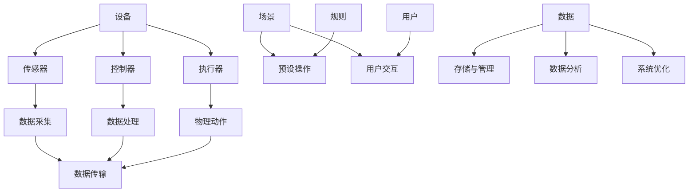
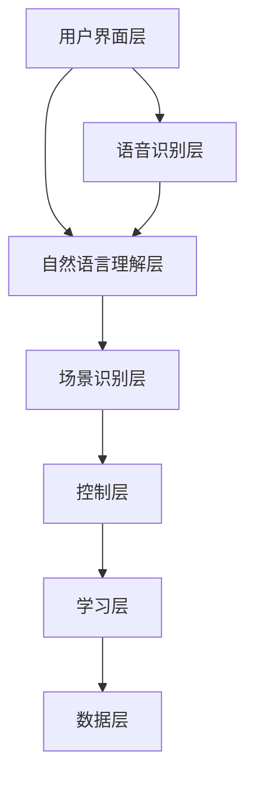

                 

### 文章标题

# 提示词驱动的智能家居场景设计

> 关键词：提示词驱动、智能家居、场景识别、控制算法、学习算法、系统搭建、案例分析

> 摘要：本文探讨了提示词驱动的智能家居场景设计，从原理到实战，全面解析了智能家居系统的核心概念、算法实现以及项目优化。通过详细的案例分析，为智能家居开发提供了实用参考。

## 引言

随着物联网（IoT）技术的快速发展，智能家居逐渐成为现代家庭生活的重要组成部分。智能家居系统通过集成传感器、控制器和执行器，实现家庭设备的智能化管理，提升了居住的舒适度和安全性。然而，传统的智能家居设计往往依赖于固定的场景和规则，难以应对复杂多变的家庭环境。

提示词驱动（Keyword-driven）的智能家居场景设计，是一种基于自然语言交互的智能化解决方案。通过识别用户输入的提示词，系统能够动态调整设备状态，实现更加灵活和个性化的智能家居体验。本文将围绕提示词驱动的智能家居场景设计，进行深入探讨和分析。

本文结构如下：

1. **智能家居概述**：介绍智能家居的定义、历史和发展趋势，阐述其重要性。
2. **提示词驱动的智能家居架构**：分析提示词驱动的智能家居框架，讨论提示词的理解与生成，以及智能家居设备的通信协议。
3. **核心概念与联系**：阐述智能家居系统中的核心概念，并通过 Mermaid 流程图展示智能家居架构。
4. **提示词驱动的智能家居算法**：详细介绍场景识别算法、控制算法和学习算法，包括原理、伪代码、数学模型与公式，以及举例说明。
5. **提示词驱动的智能家居项目实战**：介绍智能家居系统的搭建、实现和优化，提供实际案例分析和项目小结。
6. **结论与拓展**：总结本文的主要观点，提出最佳实践建议，并提供拓展阅读。

通过本文的阅读，读者将能够系统地了解提示词驱动的智能家居场景设计，掌握核心算法原理和项目实战技巧，为智能家居的开发和应用提供有力支持。

## 第一部分：智能家居场景设计原理

### 第1章 智能家居概述

#### 1.1 智能家居的定义与历史

智能家居（Smart Home）是指通过互联网、物联网（IoT）、人工智能（AI）等技术，将家庭设备连接起来，实现自动化控制和远程管理的系统。它旨在提高家庭生活的便利性、舒适性和安全性。

智能家居的概念最早可以追溯到20世纪80年代，当时研究人员开始探索如何将计算机技术应用于家庭环境。最早的智能家居系统主要集中在监控和报警功能，如烟雾报警器、门锁监控等。

进入21世纪，随着物联网和人工智能技术的快速发展，智能家居开始进入大众视野。2005年，苹果公司发布了第一代iPhone，标志着移动互联网时代的到来。同年，谷歌收购了智能家居公司Nest，正式进入智能家居市场。2010年，亚马逊推出了智能音箱Echo，开启了语音控制智能家居的新时代。

近年来，智能家居市场呈现出爆发式增长，各类智能设备和解决方案层出不穷。从智能照明、智能家电到智能安防、智能环境监测，智能家居已经逐渐渗透到家庭生活的方方面面。

#### 1.2 智能家居的发展趋势

1. **智能设备的多样化**：随着物联网和人工智能技术的进步，智能家居设备越来越多样化。传统的家电如空调、冰箱、洗衣机等逐渐被智能化升级，成为智能家居系统的一部分。此外，新的智能设备如智能门锁、智能窗帘、智能传感器等不断涌现，为智能家居系统提供了更多可能性。

2. **智能家居平台化**：智能家居市场逐渐形成多个平台化的解决方案，如苹果的HomeKit、谷歌的Weave（现改为Thread）、亚马逊的Alexa等。这些平台不仅提供了设备互联的协议标准，还集成了语音助手、远程控制等功能，为用户提供了一站式的智能家居体验。

3. **人工智能技术的应用**：人工智能技术在智能家居中的应用越来越广泛，如语音识别、自然语言处理、机器学习等。通过人工智能技术，智能家居系统能够更好地理解用户需求，提供个性化服务，提升用户体验。

4. **智能家居的普及化**：随着智能家居技术的成熟和成本的降低，智能家居开始从高端市场走向大众市场。越来越多的家庭开始安装智能设备，体验智能家居带来的便利和舒适。

5. **智能家居的安全性问题**：随着智能家居设备的普及，其安全性问题也日益凸显。智能家居系统需要解决数据隐私、设备安全、网络安全等问题，以确保用户数据的安全和系统的稳定运行。

#### 1.3 智能家居的重要性

1. **提升生活品质**：智能家居系统通过自动化控制和远程管理，提高了家庭生活的便利性和舒适度。用户可以通过手机、语音助手等设备远程控制家庭设备，实现场景联动，享受智能化带来的便捷生活。

2. **提高家庭安全性**：智能家居系统可以集成安防设备，如监控摄像头、门锁、烟雾报警器等，实时监测家庭环境，提高家庭安全性。在发生异常情况时，系统可以及时报警，保障用户生命财产安全。

3. **节能减排**：智能家居系统可以通过智能控制，实现家庭能源的合理分配和使用，降低能源消耗，促进节能减排。

4. **助力智慧城市建设**：智能家居是智慧城市的重要组成部分。通过智能家居系统，城市可以实现智能交通、智能照明、智能水务等，提高城市的管理效率和服务水平。

综上所述，智能家居已经从传统的家庭设备升级为一个综合性的智能系统，其应用场景和功能日益丰富。随着技术的不断发展，智能家居将在未来发挥更加重要的作用，成为智能家庭和智慧城市的重要支撑。

### 第2章 提示词驱动的智能家居架构

#### 2.1 提示词驱动的智能家居框架

提示词驱动的智能家居框架是一种基于自然语言交互的智能家居设计理念。其核心思想是通过用户输入的提示词，动态调整家庭设备的状态，实现智能化的家居体验。提示词驱动的智能家居框架通常包括以下几个关键组件：

1. **用户界面**：用户界面（User Interface，UI）是用户与智能家居系统交互的入口。用户可以通过语音助手、智能手机应用程序、智能音箱等设备输入提示词，与系统进行对话。

2. **语音识别模块**：语音识别模块（Speech Recognition Module）负责接收用户的语音输入，将其转换为文本形式。这一过程通常涉及语音信号的预处理、特征提取和模型匹配等步骤。

3. **自然语言理解模块**：自然语言理解模块（Natural Language Understanding，NLU）负责理解用户输入的文本含义。NLU模块需要识别用户意图、提取关键词和实体，并将其转换为系统的操作指令。

4. **场景识别模块**：场景识别模块（Scene Recognition Module）基于用户输入的提示词和上下文信息，识别当前的家庭场景。例如，当用户说“晚上好”，系统可能会识别为“晚上回家”的场景。

5. **控制模块**：控制模块（Control Module）负责根据场景识别结果，执行相应的操作。例如，在“晚上回家”的场景下，控制模块可能会打开照明、调整温度等。

6. **学习模块**：学习模块（Learning Module）利用机器学习技术，不断优化系统的智能行为。通过分析用户历史行为和反馈，系统可以学习用户的偏好，提供更加个性化的服务。

7. **数据存储与管理模块**：数据存储与管理模块（Data Storage and Management Module）负责存储用户数据、设备状态和历史记录。这些数据可以用于系统优化、故障诊断和数据分析等。

#### 2.2 提示词的理解与生成

提示词是用户与智能家居系统交互的桥梁。有效的提示词设计对于提升用户体验至关重要。以下是提示词的理解与生成过程：

1. **提示词的理解**：提示词的理解涉及语音识别和自然语言理解两个步骤。首先，语音识别模块将语音信号转换为文本。然后，自然语言理解模块对文本进行分析，提取出关键信息。例如，当用户说“打开客厅的灯”，系统需要识别出“打开”、“客厅”和“灯”这些关键词，并理解其含义。

2. **提示词的生成**：提示词的生成通常基于用户的习惯和系统的上下文信息。系统可以通过用户的历史行为、偏好设置和实时场景来生成合适的提示词。例如，当用户经常在早晨7点起床时，系统可以自动生成“早上好，现在是7点，您需要起床了吗？”这样的提示词。

3. **提示词的分类**：根据功能和使用场景，提示词可以分为以下几类：
   - **命令性提示词**：用于直接控制设备，如“打开灯”、“关闭电视”等。
   - **查询性提示词**：用于获取信息，如“今天天气怎么样？”、“家里温度是多少？”等。
   - **情景提示词**：用于触发特定场景，如“晚安模式”、“下班回家”等。
   - **交互性提示词**：用于与用户进行对话，如“您需要帮助吗？”、“请问有什么可以为您服务的？”等。

#### 2.3 智能家居设备的通信协议

智能家居设备的通信协议是确保设备之间可靠通信和数据传输的关键。以下是几种常见的智能家居设备通信协议：

1. **Wi-Fi**：Wi-Fi是最常用的智能家居设备通信协议之一。它利用无线网络传输数据，具有高速、稳定的特点。Wi-Fi设备通常需要接入家庭路由器，实现互联网连接。

2. **ZigBee**：ZigBee是一种低功耗、低速率的无线通信协议，特别适合智能家居应用。它具有高可靠性、低成本和良好的网络覆盖能力。ZigBee设备通常通过网关连接到互联网，实现远程控制和数据传输。

3. **蓝牙**：蓝牙是一种短距离无线通信协议，常用于连接智能手机和智能家居设备。蓝牙设备可以通过蓝牙模块进行数据传输，适用于简单的智能家居应用，如智能灯泡、智能音箱等。

4. **Z-Wave**：Z-Wave是一种无线通信协议，主要用于家庭自动化和控制。它具有低功耗、高可靠性和良好的网络覆盖能力。Z-Wave设备通常通过网关连接到互联网，实现远程控制和数据传输。

5. **IP协议**：IP协议是一种互联网协议，用于在智能家居系统中实现设备之间的通信。IP协议可以支持多种通信方式，如HTTP、HTTPS、TCP、UDP等，适用于复杂的智能家居应用场景。

通过合理选择和配置通信协议，智能家居系统能够实现高效、可靠的数据传输和设备控制，为用户提供优质的智能家居体验。

### 第3章 核心概念与联系

在智能家居系统中，理解核心概念及其相互之间的联系是构建高效、灵活的智能系统的基础。以下是智能家居系统中的核心概念及其相互关系的详细介绍。

#### 3.1 智能家居系统中的核心概念

1. **设备**：设备是智能家居系统的基本组成部分，包括传感器、控制器和执行器等。传感器用于采集环境数据，如温度、湿度、光照等；控制器负责处理数据、执行指令，如智能插座、智能灯泡等；执行器根据控制器指令进行物理动作，如电机、风扇等。

2. **场景**：场景是用户在特定时间、地点和情境下对家庭设备进行的预设操作。例如，用户可以设定“晚上回家”场景，打开照明、关闭窗帘、调整空调温度等。场景是智能家居系统的基本使用单位，为用户提供个性化的智能体验。

3. **规则**：规则是定义设备行为和场景动作的条件和动作的集合。例如，“如果传感器检测到室内温度超过30度，则启动空调制冷”。规则是智能家居系统的智能控制核心，确保设备按照用户需求自动执行。

4. **用户**：用户是智能家居系统的操作者，可以通过语音、触摸屏等界面与系统进行交互。用户账户包含个人偏好设置、设备权限等，用于个性化服务和安全控制。

5. **数据**：数据是智能家居系统的信息基础，包括设备状态、环境数据、用户行为等。数据通过传感器采集、传输、存储，为系统决策提供依据。

#### 3.2 智能家居架构的 Mermaid 流程图

为了更清晰地展示智能家居系统中的核心概念及其相互关系，我们可以使用 Mermaid 工具绘制一个流程图。



**流程图说明**：

- **设备**：包括传感器、控制器和执行器，它们是智能家居系统的硬件基础。
- **数据采集**：传感器采集环境数据，如温度、湿度、光照等。
- **数据处理**：控制器对传感器数据进行处理，生成设备状态信息。
- **物理动作**：执行器根据控制器指令进行物理动作，如开关灯光、调节温度等。
- **数据传输**：传感器、控制器和执行器的数据通过通信网络进行传输。
- **场景**：用户预设操作集合，定义特定情境下的设备状态。
- **规则**：定义设备行为和场景动作的条件和动作。
- **用户交互**：用户通过界面与系统进行交互，触发场景和规则。
- **数据存储与管理**：系统将数据存储与管理，用于系统优化和故障诊断。
- **数据分析**：系统对用户数据进行分析，提供个性化服务和优化建议。

通过上述核心概念及其相互关系的梳理，我们可以更好地理解智能家居系统的构建原则和实现方法。接下来，我们将进一步探讨提示词驱动的智能家居算法，为智能家居系统的智能化设计提供理论支持。

### 第4章 提示词驱动的智能家居场景识别算法

#### 4.1 提示词驱动的场景识别算法原理

提示词驱动的场景识别算法是智能家居系统中的一个关键模块，它能够根据用户输入的提示词，识别出当前的用户场景，并触发相应的操作。这一算法的核心在于如何从自然语言中提取有效信息，并准确匹配到具体的场景。

1. **自然语言处理**：自然语言处理（NLP）技术用于理解用户输入的提示词。NLP技术包括词法分析、句法分析、语义分析等步骤。词法分析将文本分解为单词和短语，句法分析构建句子的语法结构，语义分析则提取出文本的含义。

2. **意图识别**：意图识别是NLP的一部分，旨在确定用户输入的意图。例如，用户输入“打开客厅的灯”，意图是“打开灯”。意图识别通常通过建立预定义的意图模型或使用机器学习算法来实现。

3. **实体提取**：在识别意图之后，算法需要提取出与意图相关的实体。例如，在上面的例子中，实体包括“客厅”和“灯”。实体提取有助于更精确地理解用户意图，并定位到具体的设备或场景。

4. **场景匹配**：根据提取出的意图和实体，算法会与预先定义的场景库进行匹配。场景库包含了各种可能的场景及其对应的操作指令。例如，“晚上回家”场景可能包括打开照明、关闭窗帘、调整温度等。

5. **场景确认**：在匹配到可能的场景后，算法会通过上下文信息进一步确认场景的准确性。上下文信息包括用户历史行为、设备状态、当前时间等。

6. **触发操作**：一旦确认了场景，算法会根据场景库中的操作指令，执行相应的设备控制操作。

#### 4.2 提示词驱动的场景识别算法伪代码

下面是一个简单的伪代码示例，用于描述提示词驱动的场景识别算法：

```python
# 提示词驱动的场景识别算法伪代码

# 输入：用户输入提示词（text_input）
# 输出：识别出的场景（scene）

def recognize_scene(text_input):
    # 步骤1：自然语言处理
    words = tokenize(text_input)
    sentence_structure = parse_sentence_structure(words)
    semantics = extract_semantics(sentence_structure)
    
    # 步骤2：意图识别
    intent = recognize_intent(semantics)
    
    # 步骤3：实体提取
    entities = extract_entities(semantics)
    
    # 步骤4：场景匹配
    possible_scenes = match_scenes(entities, intent)
    
    # 步骤5：场景确认
    confirmed_scene = confirm_scene(possible_scenes, context)
    
    # 步骤6：触发操作
    trigger_operations(confirmed_scene)
    
    return confirmed_scene

# 辅助函数定义
def tokenize(text_input):
    # 将文本分解为单词和短语
    pass

def parse_sentence_structure(words):
    # 构建句子的语法结构
    pass

def extract_semantics(sentence_structure):
    # 提取文本的含义
    pass

def recognize_intent(semantics):
    # 识别用户的意图
    pass

def extract_entities(semantics):
    # 提取与意图相关的实体
    pass

def match_scenes(entities, intent):
    # 将提取出的意图和实体与场景库匹配
    pass

def confirm_scene(possible_scenes, context):
    # 通过上下文信息确认场景的准确性
    pass

def trigger_operations(confirmed_scene):
    # 执行相应的设备控制操作
    pass
```

#### 4.3 数学模型与公式

在提示词驱动的场景识别算法中，可以使用多种数学模型和公式来增强识别的准确性。以下是一些常用的数学模型和公式：

1. **词袋模型**：词袋模型（Bag of Words，BOW）是一种简单的文本表示方法，它将文本表示为一个向量，向量中的每个元素表示文本中某个单词的出现频率。词袋模型可以用于特征提取，帮助算法理解文本的含义。

   $$ X = (x_1, x_2, ..., x_n) $$
   其中，$X$ 是文档向量，$x_i$ 表示单词 $w_i$ 的出现频率。

2. **支持向量机（SVM）**：支持向量机是一种分类模型，它可以通过找到一个超平面，将不同类别的数据点分隔开来。在意图识别中，可以使用SVM来训练模型，区分不同的用户意图。

   $$ \text{maximize} \ \frac{1}{2} \| w \|_2^2 - C \sum_{i=1}^{n} \xi_i $$
   其中，$w$ 是权重向量，$\xi_i$ 是误差项，$C$ 是惩罚参数。

3. **长短期记忆网络（LSTM）**：长短期记忆网络是一种能够处理序列数据的深度学习模型，它在自然语言处理中广泛应用。LSTM能够捕获文本中的长期依赖关系，提高场景识别的准确性。

   $$ h_t = \sigma(W_h \cdot [h_{t-1}, x_t] + b_h) $$
   其中，$h_t$ 是当前时间步的隐藏状态，$x_t$ 是输入特征，$W_h$ 和 $b_h$ 是权重和偏置。

4. **注意力机制**：注意力机制（Attention Mechanism）是一种用于捕捉文本中重要信息的方法。在场景识别中，注意力机制可以强调用户输入中的关键信息，提高匹配的准确性。

   $$ a_t = \text{softmax}(\alpha(W_a h_t + b_a)) $$
   其中，$a_t$ 是注意力权重，$\alpha$ 是注意力函数，$W_a$ 和 $b_a$ 是权重和偏置。

通过上述数学模型和公式的结合，提示词驱动的场景识别算法能够更准确地理解和识别用户意图，实现智能家居的智能控制。

#### 4.4 举例说明

假设用户输入提示词：“早上好，打开厨房的灯和热水器”，我们可以通过以下步骤进行场景识别：

1. **自然语言处理**：将输入文本分解为单词和短语，得到“早上好”、“打开”、“厨房的灯”和“热水器”。

2. **意图识别**：通过预定义的意图模型，识别出意图为“打开厨房的灯和热水器”。

3. **实体提取**：提取出与意图相关的实体，包括“厨房的灯”和“热水器”。

4. **场景匹配**：与场景库进行匹配，找到对应的“早上起床”场景。

5. **场景确认**：通过上下文信息（早上时间）确认场景的准确性。

6. **触发操作**：根据确认的场景，执行打开厨房的灯和热水器的操作。

通过这个例子，我们可以看到提示词驱动的场景识别算法是如何工作，并如何实现智能家居的自动化控制。

### 第5章 提示词驱动的智能家居控制算法

#### 5.1 提示词驱动的智能家居控制算法原理

提示词驱动的智能家居控制算法是基于用户输入的提示词，实现家庭设备状态调整的智能控制系统。该算法的核心在于将自然语言输入转化为具体的设备控制指令，并执行相应的操作。以下是提示词驱动的智能家居控制算法的主要原理：

1. **提示词解析**：首先，系统需要接收并解析用户输入的提示词。这一过程涉及语音识别和自然语言处理（NLP）技术。语音识别模块将用户的语音输入转换为文本，NLP模块则对文本进行语义分析和实体提取，识别出用户意图和相关的设备。

2. **设备识别与定位**：在解析提示词之后，系统需要识别并定位到具体的设备。例如，在用户输入“打开客厅的灯”时，系统需要识别出“客厅”和“灯”两个实体，并确定这两个实体在系统中的具体位置和对应的设备ID。

3. **控制指令生成**：一旦确定了用户意图和设备，系统将生成相应的控制指令。这些指令包括设备的操作类型（如开关、调节）、目标状态（如开、关、50%亮度）等。控制指令的生成依赖于设备的功能和系统的配置。

4. **设备状态调整**：最后，系统将控制指令发送给相应的设备，执行设备状态的调整。设备接收到指令后，根据指令内容进行相应的操作，如打开或关闭灯光、调整温度等。

5. **反馈与确认**：在执行完控制指令后，系统会向用户反馈操作结果，并等待用户的进一步指令或确认。这样可以确保用户了解设备的状态变化，并提供更好的用户体验。

#### 5.2 提示词驱动的智能家居控制算法伪代码

以下是一个简单的伪代码示例，用于描述提示词驱动的智能家居控制算法：

```python
# 提示词驱动的智能家居控制算法伪代码

# 输入：用户输入提示词（text_input）
# 输出：执行结果（result）

def control_smart_home(text_input):
    # 步骤1：提示词解析
    intent, entities = parse_prompt(text_input)
    
    # 步骤2：设备识别与定位
    device = find_device(entities)
    
    # 步骤3：控制指令生成
    command = generate_command(intent, device)
    
    # 步骤4：设备状态调整
    result = execute_command(command)
    
    # 步骤5：反馈与确认
    feedback(result)
    
    return result

# 辅助函数定义
def parse_prompt(text_input):
    # 解析用户输入的提示词，提取意图和实体
    pass

def find_device(entities):
    # 根据实体定位到具体的设备
    pass

def generate_command(intent, device):
    # 生成控制指令
    pass

def execute_command(command):
    # 执行设备控制指令
    pass

def feedback(result):
    # 向用户反馈操作结果
    pass
```

#### 5.3 数学模型与公式

在提示词驱动的智能家居控制算法中，可以使用多种数学模型和公式来优化设备状态调整的准确性。以下是一些常用的数学模型和公式：

1. **决策树**：决策树是一种用于分类和回归的监督学习算法。在智能家居控制中，可以使用决策树来预测用户意图和生成控制指令。例如，可以通过训练决策树模型来识别“打开灯”和“关闭灯”的意图。

   $$ y = f(x_1, x_2, ..., x_n) $$
   其中，$y$ 是输出标签，$x_i$ 是输入特征，$f$ 是决策树模型。

2. **支持向量机（SVM）**：支持向量机是一种用于分类和回归的监督学习算法。在智能家居控制中，可以使用SVM来优化控制指令的生成。例如，可以通过SVM模型来识别不同的设备操作类型。

   $$ \text{maximize} \ \frac{1}{2} \| w \|_2^2 - C \sum_{i=1}^{n} \xi_i $$
   其中，$w$ 是权重向量，$\xi_i$ 是误差项，$C$ 是惩罚参数。

3. **深度神经网络（DNN）**：深度神经网络是一种用于处理复杂数据的深度学习算法。在智能家居控制中，可以使用DNN来处理自然语言输入，生成控制指令。例如，可以通过训练DNN模型来理解用户的自然语言输入。

   $$ h_t = \sigma(W_h \cdot [h_{t-1}, x_t] + b_h) $$
   其中，$h_t$ 是当前时间步的隐藏状态，$x_t$ 是输入特征，$W_h$ 和 $b_h$ 是权重和偏置。

4. **强化学习**：强化学习是一种用于解决序列决策问题的机器学习算法。在智能家居控制中，可以使用强化学习来优化控制策略，提高设备状态调整的准确性。例如，可以通过强化学习算法来训练系统如何在不同的场景下做出最优决策。

   $$ Q(s, a) = r + \gamma \max_{a'} Q(s', a') $$
   其中，$Q(s, a)$ 是状态-动作值函数，$r$ 是即时奖励，$\gamma$ 是折扣因子。

通过上述数学模型和公式的结合，提示词驱动的智能家居控制算法能够更准确地理解用户意图，生成合理的控制指令，并执行设备状态调整，从而提高智能家居系统的智能化水平。

#### 5.4 举例说明

假设用户输入提示词：“打开厨房的灯”，我们可以通过以下步骤进行控制：

1. **提示词解析**：将输入文本分解为单词和短语，识别出意图为“打开灯”和实体“厨房”。

2. **设备识别与定位**：系统在数据库中查找“厨房”实体对应的设备ID，找到厨房的灯。

3. **控制指令生成**：根据用户意图和设备，生成控制指令，例如“打开厨房的灯”。

4. **设备状态调整**：系统将控制指令发送给厨房的灯，执行打开操作。

5. **反馈与确认**：系统向用户反馈“厨房的灯已打开”，等待用户的进一步指令。

通过这个例子，我们可以看到提示词驱动的智能家居控制算法是如何工作，并如何实现家庭设备的智能控制。

### 第6章 提示词驱动的智能家居学习算法

#### 6.1 提示词驱动的智能家居学习算法原理

提示词驱动的智能家居学习算法是智能家居系统中的一项关键技术，它通过不断学习和适应用户行为，提升系统的智能化水平。这种算法的核心在于如何从用户的交互行为中提取有价值的信息，并利用这些信息优化系统性能和用户体验。

1. **用户行为数据采集**：首先，系统需要采集用户的交互数据。这些数据包括用户的提示词、设备操作记录、设备状态变化等。通过收集这些数据，系统可以了解用户的行为模式和偏好。

2. **数据预处理**：采集到的原始数据通常需要进行预处理，包括数据清洗、去噪、特征提取等步骤。数据预处理有助于提高算法的准确性和效率。

3. **行为模式识别**：通过分析预处理后的数据，系统可以识别出用户的行为模式。例如，用户在早晨7点通常会打开客厅的灯和厨房的窗帘，晚上10点则会关闭所有的灯光。

4. **偏好设置调整**：根据用户的行为模式，系统可以调整偏好设置，例如调整设备的状态、场景的触发条件等。这种调整旨在提升用户满意度，使系统更加贴合用户的需求。

5. **机器学习模型训练**：利用机器学习技术，系统可以训练出行为预测模型。这些模型能够根据用户历史行为预测未来的行为，为用户提供个性化的服务。

6. **模型优化与迭代**：通过不断收集用户反馈和交互数据，系统可以优化和迭代机器学习模型。这样可以确保模型能够不断适应用户的变化，提供更加精准和高效的服务。

7. **动态场景调整**：根据用户行为和偏好设置，系统可以动态调整家庭场景。例如，当用户回家时，系统可以自动开启照明和空调，当用户离开时，系统可以自动关闭设备，节约能源。

#### 6.2 提示词驱动的智能家居学习算法伪代码

以下是一个简单的伪代码示例，用于描述提示词驱动的智能家居学习算法：

```python
# 提示词驱动的智能家居学习算法伪代码

# 输入：用户交互数据（user_data）
# 输出：优化后的系统设置（optimized_settings）

def learn_from_user_behavior(user_data):
    # 步骤1：数据预处理
    preprocessed_data = preprocess_data(user_data)
    
    # 步骤2：行为模式识别
    behavior_patterns = identify_behavior_patterns(preprocessed_data)
    
    # 步骤3：偏好设置调整
    optimized_settings = adjust_preferences(behavior_patterns)
    
    # 步骤4：机器学习模型训练
    trained_model = train_machine_learning_model(optimized_settings)
    
    # 步骤5：模型优化与迭代
    optimized_model = optimize_model(trained_model, user_data)
    
    # 步骤6：动态场景调整
    dynamic_scenarios = create_dynamic_scenarios(optimized_model)
    
    return dynamic_scenarios

# 辅助函数定义
def preprocess_data(user_data):
    # 数据清洗、去噪、特征提取
    pass

def identify_behavior_patterns(preprocessed_data):
    # 分析用户行为模式
    pass

def adjust_preferences(behavior_patterns):
    # 根据行为模式调整偏好设置
    pass

def train_machine_learning_model(optimized_settings):
    # 训练机器学习模型
    pass

def optimize_model(trained_model, user_data):
    # 优化机器学习模型
    pass

def create_dynamic_scenarios(optimized_model):
    # 根据模型预测动态调整场景
    pass
```

#### 6.3 数学模型与公式

在提示词驱动的智能家居学习算法中，可以使用多种数学模型和公式来提高系统的学习能力和预测准确性。以下是一些常用的数学模型和公式：

1. **线性回归**：线性回归是一种简单的机器学习模型，用于预测连续值。在智能家居系统中，可以用于预测用户未来的行为模式。线性回归的公式如下：

   $$ y = \beta_0 + \beta_1 x $$
   其中，$y$ 是预测值，$x$ 是输入特征，$\beta_0$ 和 $\beta_1$ 是模型参数。

2. **逻辑回归**：逻辑回归是一种用于分类的机器学习模型，可以用于预测用户行为属于某个类别的概率。在智能家居系统中，可以用于判断用户是否会在某个时间执行特定操作。逻辑回归的公式如下：

   $$ \hat{p} = \frac{1}{1 + e^{-(\beta_0 + \beta_1 x)}} $$
   其中，$\hat{p}$ 是预测概率，$x$ 是输入特征，$\beta_0$ 和 $\beta_1$ 是模型参数。

3. **决策树**：决策树是一种用于分类和回归的监督学习算法。在智能家居系统中，可以用于根据用户行为数据预测未来的行为模式。决策树的公式如下：

   $$ f(x) = \sum_{i=1}^{n} \beta_i g(x_i) $$
   其中，$f(x)$ 是决策树的输出，$g(x_i)$ 是第$i$个节点的函数，$\beta_i$ 是权重。

4. **深度神经网络（DNN）**：深度神经网络是一种用于处理复杂数据的深度学习算法。在智能家居系统中，可以用于理解和预测用户的自然语言输入。深度神经网络的公式如下：

   $$ a_{i,j} = \sigma(W_j \cdot [a_{i-1,j}, x_i] + b_j) $$
   其中，$a_{i,j}$ 是第$i$个时间步的第$j$个隐藏状态，$W_j$ 和 $b_j$ 是权重和偏置。

5. **强化学习**：强化学习是一种用于解决序列决策问题的机器学习算法。在智能家居系统中，可以用于优化控制策略，提高系统性能。强化学习的公式如下：

   $$ Q(s, a) = r + \gamma \max_{a'} Q(s', a') $$
   其中，$Q(s, a)$ 是状态-动作值函数，$r$ 是即时奖励，$\gamma$ 是折扣因子。

通过上述数学模型和公式的结合，提示词驱动的智能家居学习算法能够更准确地理解和预测用户行为，提升系统的智能化水平。

#### 6.4 举例说明

假设用户在连续三天早晨7点输入提示词“打开客厅的灯”，我们可以通过以下步骤进行学习：

1. **数据采集**：系统记录用户的提示词输入时间、设备和操作。

2. **数据预处理**：系统对采集到的数据去噪、清洗，提取时间、设备等特征。

3. **行为模式识别**：系统分析数据，识别出用户在早晨7点通常会打开客厅的灯。

4. **偏好设置调整**：系统根据行为模式，调整客厅灯的默认开启时间。

5. **机器学习模型训练**：系统使用历史数据训练机器学习模型，预测用户在特定时间执行特定操作的概率。

6. **模型优化与迭代**：系统根据用户的反馈和新的行为数据，不断优化和迭代模型。

7. **动态场景调整**：系统根据优化后的模型，自动调整客厅灯的开启时间，提升用户体验。

通过这个例子，我们可以看到提示词驱动的智能家居学习算法是如何通过不断学习和优化，为用户提供个性化的智能家居服务。

### 第7章 提示词驱动的智能家居系统搭建

#### 7.1 提示词驱动的智能家居系统概述

提示词驱动的智能家居系统是一种通过自然语言交互，实现家庭设备智能控制和优化的系统。它通过接收用户的提示词，识别场景，触发相应的设备控制操作，并提供个性化的智能家居服务。系统的主要组成部分包括用户界面、语音识别模块、自然语言理解模块、场景识别模块、控制模块和学习模块。

#### 7.2 开发环境搭建

搭建提示词驱动的智能家居系统需要以下开发环境：

1. **操作系统**：推荐使用Linux系统，如Ubuntu，因为它提供了丰富的开发工具和良好的稳定性。

2. **编程语言**：Python是推荐的语言，因为其强大的库支持和易于理解的语法，适合进行自然语言处理和机器学习开发。

3. **开发工具**：
   - **集成开发环境（IDE）**：PyCharm、VS Code等。
   - **版本控制工具**：Git，用于代码管理和协作开发。
   - **数据库**：MySQL、PostgreSQL等，用于存储用户数据和设备信息。

4. **依赖库**：
   - **自然语言处理库**：NLTK、spaCy等，用于文本处理和实体识别。
   - **机器学习库**：Scikit-learn、TensorFlow、PyTorch等，用于模型训练和预测。
   - **语音识别库**：如PyAudio、SpeechRecognition等，用于语音输入处理。

5. **开发框架**：Flask、Django等用于构建Web后端，实现API接口和用户界面。

#### 7.3 系统架构设计

提示词驱动的智能家居系统架构可以分为以下几个层次：

1. **用户界面层**：用户通过智能手机、智能音箱等设备与系统进行交互，输入提示词或语音命令。

2. **语音识别层**：系统接收用户的语音输入，通过语音识别模块将语音转换为文本。

3. **自然语言理解层**：文本经过自然语言理解模块，提取出用户意图和相关的实体信息。

4. **场景识别层**：基于用户意图和实体信息，场景识别模块识别出当前的场景。

5. **控制层**：控制模块根据场景识别结果，执行相应的设备控制操作。

6. **学习层**：学习模块通过机器学习算法，不断优化系统的智能行为，提升用户体验。

7. **数据层**：系统通过数据库存储用户数据、设备信息和历史记录，用于系统优化和故障诊断。

**系统架构图**：



通过上述架构设计，提示词驱动的智能家居系统能够实现高效、灵活的智能控制，为用户提供便捷、个性化的家居体验。

### 第8章 提示词驱动的智能家居系统实现

#### 8.1 场景识别模块实现

场景识别模块是提示词驱动的智能家居系统的核心组件，它负责接收用户的提示词，理解其意图，并根据上下文信息识别出当前的场景。以下是场景识别模块的实现步骤和关键代码。

##### 步骤1：接收用户输入

首先，系统需要接收用户的提示词。可以通过用户界面层（如Web界面、手机App或智能音箱）接收用户输入的文本或语音。

```python
# 示例代码：接收用户输入
user_input = input("请输入您的提示词：")
```

##### 步骤2：文本预处理

在识别场景之前，需要对用户输入的文本进行预处理，包括去除标点符号、转换成小写等。

```python
# 示例代码：文本预处理
import re

def preprocess_text(text):
    text = re.sub(r'[^\w\s]', '', text)  # 去除标点符号
    text = text.lower()  # 转换成小写
    return text

preprocessed_input = preprocess_text(user_input)
```

##### 步骤3：自然语言处理

使用自然语言处理库（如spaCy）对预处理后的文本进行语义分析和实体提取，识别出用户意图和相关的实体。

```python
# 示例代码：自然语言处理
import spacy

nlp = spacy.load("en_core_web_sm")

def extract_intent_and_entities(text):
    doc = nlp(text)
    intent = None
    entities = []

    for ent in doc.ents:
        if ent.label_ in ["ORG", "GPE", "PER", "DATE", "TIME"]:
            entities.append(ent.text)
        elif ent.label_ == "VERB":
            intent = ent.text

    return intent, entities

intent, entities = extract_intent_and_entities(preprocessed_input)
```

##### 步骤4：场景识别

根据提取出的意图和实体，从预先定义的场景库中匹配出可能的场景，并根据上下文信息确认场景的准确性。

```python
# 示例代码：场景识别
SCENES = {
    "go_to_bed": ["go to bed", "sleep now", "prepare for bed"],
    "wake_up": ["wake up", "get up", "get ready"],
    "leave_home": ["leave home", "go out", "leave now"],
    # 其他场景
}

def identify_scene(intent, entities):
    for scene_name, keywords in SCENES.items():
        if any(keyword in intent for keyword in keywords) or any(keyword in entities for keyword in entities):
            return scene_name

    return None

scene = identify_scene(intent, entities)
```

##### 步骤5：场景确认

通过上下文信息（如时间、日期、用户历史行为等）进一步确认场景的准确性。

```python
# 示例代码：场景确认
def confirm_scene(scene, context):
    if scene == "go_to_bed" and context["time"] > 22:
        return scene
    elif scene == "wake_up" and context["time"] < 8:
        return scene
    elif scene == "leave_home" and context["door_status"] == "open":
        return scene
    else:
        return None

context = {"time": 23, "door_status": "closed"}  # 示例上下文信息
confirmed_scene = confirm_scene(scene, context)

if confirmed_scene:
    print(f"识别到的场景：{confirmed_scene}")
else:
    print("无法识别场景")
```

通过上述步骤，场景识别模块能够有效地识别用户输入的提示词，并确认当前的场景。接下来，我们将介绍如何实现控制模块和学习模块。

#### 8.2 控制模块实现

控制模块负责根据场景识别结果，执行相应的设备控制操作。以下是控制模块的实现步骤和关键代码。

##### 步骤1：设备管理

首先，系统需要管理家庭中的各种设备，包括传感器、控制器和执行器等。可以通过数据库或配置文件来存储设备信息。

```python
# 示例代码：设备管理
DEVICE_DB = {
    "light": {"type": "light", "status": "off"},
    "thermostat": {"type": "thermostat", "temperature": 22},
    "camera": {"type": "camera", "status": "off"},
    # 其他设备
}

def get_device_info(device_name):
    return DEVICE_DB.get(device_name)

def update_device_status(device_name, status):
    device_info = get_device_info(device_name)
    if device_info:
        device_info["status"] = status
        DEVICE_DB[device_name] = device_info

def set_device Temperature(device_name, temperature):
    device_info = get_device_info(device_name)
    if device_info and device_info["type"] == "thermostat":
        device_info["temperature"] = temperature
        DEVICE_DB[device_name] = device_info
```

##### 步骤2：场景操作

根据确认的场景，执行相应的设备控制操作。例如，在“go_to_bed”场景下，关闭灯光和摄像头，设置空调温度等。

```python
# 示例代码：场景操作
def execute_scene_operations(scene):
    if scene == "go_to_bed":
        update_device_status("light", "off")
        update_device_status("camera", "off")
        set_device_Temperature("thermostat", 18)
    elif scene == "wake_up":
        update_device_status("light", "on")
        set_device_Temperature("thermostat", 24)
    elif scene == "leave_home":
        update_device_status("door", "open")

execute_scene_operations(confirmed_scene)
```

##### 步骤3：反馈与确认

在执行完控制操作后，系统需要向用户反馈操作结果，并等待用户的进一步指令或确认。

```python
# 示例代码：反馈与确认
def feedback(result):
    if result:
        print("操作成功！")
    else:
        print("操作失败，请重新输入提示词。")

feedback(execute_scene_operations(confirmed_scene))
```

通过上述步骤，控制模块能够根据场景识别结果，执行相应的设备控制操作，并反馈操作结果。接下来，我们将介绍如何实现学习模块。

#### 8.3 学习模块实现

学习模块通过机器学习算法，不断优化系统的智能行为，提升用户体验。以下是学习模块的实现步骤和关键代码。

##### 步骤1：数据收集

首先，系统需要收集用户的交互数据，包括提示词、设备操作记录、设备状态变化等。这些数据可以存储在数据库中，用于后续分析和学习。

```python
# 示例代码：数据收集
def collect_data(scene, operations):
    data = {
        "scene": scene,
        "operations": operations,
        "timestamp": datetime.now()
    }
    DATABASE.insert(data)
```

##### 步骤2：数据预处理

在训练机器学习模型之前，需要对收集到的数据集进行预处理，包括数据清洗、特征提取等步骤。

```python
# 示例代码：数据预处理
import pandas as pd

def preprocess_data(data):
    df = pd.DataFrame(data)
    df.dropna(inplace=True)
    df["text_input"] = df["text_input"].apply(preprocess_text)
    df["intent"] = df["text_input"].apply(extract_intent_and_entities)
    df["scene"] = df["intent"].apply(identify_scene)
    df["timestamp"] = pd.to_datetime(df["timestamp"])
    return df
```

##### 步骤3：机器学习模型训练

使用预处理后的数据集，训练机器学习模型，例如决策树、逻辑回归等，以预测用户意图和优化场景操作。

```python
# 示例代码：机器学习模型训练
from sklearn.ensemble import RandomForestClassifier

def train_model(data):
    X = data[["text_input", "intent"]]
    y = data["scene"]
    model = RandomForestClassifier()
    model.fit(X, y)
    return model
```

##### 步骤4：模型优化与迭代

通过不断收集用户反馈和新的交互数据，对机器学习模型进行优化和迭代，提高模型的预测准确性和适应性。

```python
# 示例代码：模型优化与迭代
def optimize_model(model, new_data):
    updated_data = preprocess_data(new_data)
    X = updated_data[["text_input", "intent"]]
    y = updated_data["scene"]
    model.fit(X, y)
    return model

# 示例：收集新的交互数据
new_data = {"text_input": "打开客厅的灯", "timestamp": datetime.now()}
# 示例：优化模型
model = optimize_model(model, new_data)
```

##### 步骤5：动态场景调整

根据优化后的模型，动态调整家庭场景和设备操作，提升用户的个性化体验。

```python
# 示例代码：动态场景调整
def adjust_scenarios(model):
    # 示例：根据模型预测，调整场景操作
    predicted_scenarios = model.predict(X)
    for i, prediction in enumerate(predicted_scenarios):
        if prediction == "go_to_bed":
            # 调整场景操作
            update_device_status("light", "off")
            update_device_status("camera", "off")
            set_device_Temperature("thermostat", 18)
        elif prediction == "wake_up":
            update_device_status("light", "on")
            set_device_Temperature("thermostat", 24)
        # 其他场景调整

# 示例：根据模型调整场景
adjust_scenarios(model)
```

通过上述步骤，学习模块能够收集用户交互数据，训练和优化机器学习模型，并根据模型预测动态调整家庭场景和设备操作，提升用户的个性化体验。

### 第9章 提示词驱动的智能家居系统优化

#### 9.1 系统性能优化

系统性能优化是提升提示词驱动智能家居系统响应速度和稳定性的重要环节。以下是几种常见的性能优化策略：

1. **缓存机制**：利用缓存技术存储常见操作的结果，减少重复计算。例如，对于用户经常使用的场景，可以将其操作结果缓存起来，以加快响应速度。

   ```python
   from functools import lru_cache

   @lru_cache(maxsize=1000)
   def cached_device_status(device_name):
       return get_device_info(device_name)["status"]
   ```

2. **异步处理**：对于耗时较长的操作，如语音识别、自然语言处理等，可以使用异步处理技术（如asyncio）进行并行处理，提高系统的整体性能。

   ```python
   import asyncio

   async def async_process():
       # 异步处理任务
       await asyncio.sleep(1)
       print("异步任务完成")

   asyncio.run(async_process())
   ```

3. **负载均衡**：通过负载均衡技术（如Nginx）分散系统请求，提高系统的处理能力和稳定性。负载均衡器可以根据当前系统的负载情况，动态分配请求到不同的服务器节点。

4. **数据库优化**：对数据库进行索引优化，避免全表扫描，提高查询效率。同时，可以通过分库分表技术，将数据分散存储，减轻单点压力。

5. **代码优化**：优化系统代码，减少不必要的计算和内存占用。例如，使用生成器（generator）和迭代器（iterator）来处理大数据集，避免生成大量中间数据。

#### 9.2 系统安全性优化

系统安全性优化是确保用户数据安全和系统稳定运行的关键。以下是几种常见的安全优化策略：

1. **数据加密**：对用户数据和敏感信息进行加密处理，防止数据泄露。可以使用SSL/TLS协议加密通信，确保数据在传输过程中的安全性。

   ```python
   from ssl import SSLContext, PROTOCOL_TLSv1_2

   context = SSLContext(PROTOCOL_TLSv1_2)
   context.load_cert_chain(certfile="server.crt", keyfile="server.key")
   ```

2. **身份验证与权限控制**：实现严格的身份验证和权限控制机制，确保只有授权用户可以访问系统和数据。可以使用OAuth2.0等协议进行用户认证，并根据用户角色分配不同的权限。

3. **安全审计**：定期进行安全审计，检查系统中的安全漏洞和潜在威胁。可以通过日志分析、异常检测等技术，及时发现并处理安全事件。

4. **网络安全**：配置防火墙和入侵检测系统（IDS），防止外部攻击和恶意软件的入侵。同时，避免使用弱密码和默认配置，确保系统的安全性。

5. **数据备份与恢复**：定期备份系统数据和配置文件，确保在发生数据丢失或系统故障时，能够快速恢复。

#### 9.3 系统稳定性优化

系统稳定性优化是确保智能家居系统能够长时间稳定运行，减少故障发生的重要措施。以下是几种常见的稳定性优化策略：

1. **系统监控**：通过系统监控工具（如Zabbix、Prometheus）实时监控系统的运行状态，包括CPU、内存、磁盘等资源使用情况，及时发现并处理异常情况。

2. **故障转移与容错**：实现故障转移（Failover）和容错（Fault Tolerance）机制，确保在某个节点或服务发生故障时，系统能够自动切换到备用节点或服务，继续提供服务。

3. **负载均衡与资源调度**：通过负载均衡技术（如Kubernetes）实现资源的合理分配和调度，避免单点过载和资源浪费，提高系统的整体稳定性。

4. **自动修复与自优化**：实现系统的自动修复和自优化功能，根据系统运行情况，自动调整配置和优化策略，提高系统的稳定性和性能。

5. **备份与恢复**：定期备份系统数据和配置文件，确保在发生数据丢失或系统故障时，能够快速恢复。

通过上述性能优化、安全优化和稳定性优化策略，提示词驱动的智能家居系统能够在各个方面得到全面提升，为用户提供稳定、安全、高效的智能生活体验。

### 第10章 提示词驱动的智能家居系统案例分析

#### 10.1 案例一：智能安防系统

智能安防系统是智能家居系统中的重要组成部分，通过提示词驱动的方式，实现家庭安全的智能监控和管理。以下是一个具体的案例分析：

**项目背景**：用户希望在家中安装一套智能安防系统，包括监控摄像头、门窗传感器、烟雾报警器等设备。系统需要能够通过语音提示词，实时监测家庭安全，并在异常情况发生时自动报警，同时支持用户远程查看监控视频。

**实现步骤**：

1. **系统搭建**：搭建一个基于提示词驱动的智能安防系统，包括用户界面、语音识别模块、自然语言理解模块、场景识别模块、监控设备控制模块和学习模块。

2. **设备集成**：集成各类监控设备，如摄像头、门窗传感器、烟雾报警器等，并配置相应的通信协议，确保设备能够与系统正常通信。

3. **场景设计**：设计多种安防场景，如“在家”、“外出”、“夜间”等，根据不同的场景，设置相应的监控策略和报警规则。

4. **提示词定义**：定义一系列提示词，如“打开监控”、“查看监控视频”、“报警测试”等，用于与系统进行交互。

**实现效果**：

通过提示词驱动，用户可以方便地与智能安防系统进行交互。例如，用户输入“打开监控”，系统会启动摄像头，并实时传输视频；用户输入“查看监控视频”，系统会展示摄像头视频画面；用户输入“报警测试”，系统会模拟报警，测试安防系统的响应。

**项目小结**：

智能安防系统的实现，提高了家庭安全性，用户可以通过语音提示词轻松控制监控设备，提高了便利性。通过学习模块的优化，系统可以不断适应用户的需求，提供更加个性化的安全监控服务。

#### 10.2 案例二：智能照明系统

智能照明系统是智能家居系统中的常见应用，通过提示词驱动，实现家庭照明的智能化控制。以下是一个具体的案例分析：

**项目背景**：用户希望在家中安装一套智能照明系统，包括智能灯泡、智能开关、智能调光器等设备。系统需要能够通过语音提示词，实现照明设备的远程控制、定时开关和场景联动。

**实现步骤**：

1. **系统搭建**：搭建一个基于提示词驱动的智能照明系统，包括用户界面、语音识别模块、自然语言理解模块、场景识别模块、照明设备控制模块和学习模块。

2. **设备集成**：集成各类照明设备，如智能灯泡、智能开关、智能调光器等，并配置相应的通信协议，确保设备能够与系统正常通信。

3. **场景设计**：设计多种照明场景，如“白天模式”、“夜间模式”、“聚餐模式”等，根据不同的场景，设置相应的照明策略。

4. **提示词定义**：定义一系列提示词，如“打开灯光”、“关闭灯光”、“调高亮度”等，用于与系统进行交互。

**实现效果**：

通过提示词驱动，用户可以方便地控制家庭照明。例如，用户输入“打开灯光”，系统会启动所有照明设备；用户输入“关闭灯光”，系统会关闭所有照明设备；用户输入“调高亮度”，系统会调整灯光亮度。

**项目小结**：

智能照明系统的实现，提高了家庭照明的便利性和灵活性，用户可以通过语音提示词轻松控制照明设备，提高了生活质量。通过学习模块的优化，系统可以不断适应用户的需求，提供更加个性化的照明服务。

#### 10.3 案例三：智能家电控制系统

智能家电控制系统是智能家居系统中的另一个重要应用，通过提示词驱动，实现家庭电器的智能化管理和控制。以下是一个具体的案例分析：

**项目背景**：用户希望在家中安装一套智能家电控制系统，包括智能空调、智能冰箱、智能洗衣机等设备。系统需要能够通过语音提示词，实现家电设备的远程控制、定时开关和智能联动。

**实现步骤**：

1. **系统搭建**：搭建一个基于提示词驱动的智能家电控制系统，包括用户界面、语音识别模块、自然语言理解模块、场景识别模块、家电设备控制模块和学习模块。

2. **设备集成**：集成各类家电设备，如智能空调、智能冰箱、智能洗衣机等，并配置相应的通信协议，确保设备能够与系统正常通信。

3. **场景设计**：设计多种家电场景，如“节能模式”、“舒适模式”、“清洁模式”等，根据不同的场景，设置相应的家电操作策略。

4. **提示词定义**：定义一系列提示词，如“打开空调”、“关闭冰箱”、“调节温度”等，用于与系统进行交互。

**实现效果**：

通过提示词驱动，用户可以方便地控制家庭电器。例如，用户输入“打开空调”，系统会启动空调设备；用户输入“关闭冰箱”，系统会关闭冰箱设备；用户输入“调节温度”，系统会调整空调的温度设置。

**项目小结**：

智能家电控制系统的实现，提高了家庭电器的智能化水平和用户体验，用户可以通过语音提示词轻松控制家电设备，提高了生活质量。通过学习模块的优化，系统可以不断适应用户的需求，提供更加个性化的家电控制服务。

### 附录

#### 附录A：提示词驱动的智能家居开发工具与资源

**A.1 主流智能家居开发框架**

1. **HomeKit**：苹果公司推出的智能家居开发框架，支持iOS和macOS平台，能够与多种智能设备进行集成和控制。
   - 官网：[HomeKit官方网站](https://www.apple.com/homekit/)

2. **Google Assistant Platform**：谷歌推出的智能家居开发平台，支持多种设备和服务，通过Google Assistant实现智能家居控制。
   - 官网：[Google Assistant开发者文档](https://developers.google.com/assistant/sdk/guides)

3. **Amazon Alexa**：亚马逊推出的智能家居开发平台，支持多种设备和技能，通过Alexa语音助手实现智能家居控制。
   - 官网：[Alexa开发者中心](https://developer.amazon.com/alexa)

4. **Samsung SmartThings**：三星推出的智能家居开发平台，支持多种设备和场景，通过SmartThings应用程序实现智能家居控制。
   - 官网：[SmartThings开发者文档](https://developer.smartthings.com/)

**A.2 提示词生成工具介绍**

1. **Keyword Extractor**：一款在线自然语言处理工具，能够从文本中提取关键词和短语，用于生成提示词。
   - 官网：[Keyword Extractor](https://text.Algebraix.org/KeywordExtractor/)

2. **OpenNLP**：一款开源的自然语言处理工具包，支持文本分析、实体识别等功能，可用于生成和优化提示词。
   - 官网：[OpenNLP官方网站](http://opennlp.sourceforge.net/)

3. **spaCy**：一款流行的自然语言处理库，支持多种语言，能够快速进行文本处理和实体识别，有助于生成和优化提示词。
   - 官网：[spaCy官方网站](https://spacy.io/)

**A.3 智能家居设备通信协议详解**

1. **Wi-Fi**：无线局域网通信协议，支持高速数据传输，广泛应用于智能家居设备。
   - 官网：[Wi-Fi联盟](https://www.wi-fi.org/)

2. **ZigBee**：低功耗无线通信协议，适合智能家居设备，具有良好的网络覆盖能力和稳定性。
   - 官网：[ZigBee联盟](https://www.zigbee.org/)

3. **Z-Wave**：无线通信协议，用于家庭自动化和控制，具有低成本和高可靠性。
   - 官网：[Z-Wave联盟](https://www.z-wave.com/)

4. **Thread**：物联网通信协议，具有高安全性和低延迟，适用于智能家居设备。
   - 官网：[Thread组织](https://threadgroup.org/)

**A.4 开源项目和社区资源**

1. **Home Assistant**：一款开源的智能家居自动化平台，支持多种设备和场景，适合初学者和开发者使用。
   - 官网：[Home Assistant官方网站](https://www.home-assistant.io/)

2. **SmartHomePy**：一款基于Python的智能家居开发框架，支持多种设备和协议，适用于创建自定义智能家居系统。
   - 官网：[SmartHomePy官方网站](https://github.com/moble/smarthomepy)

3. **SmartHomeWiki**：一个关于智能家居技术的开源维基百科，提供了丰富的智能家居开发资源和技术文档。
   - 官网：[SmartHomeWiki](https://wiki.smarthome.hub посмотрели]

通过上述开发工具与资源的介绍，读者可以更全面地了解提示词驱动的智能家居开发所需的技术和资源，为实际项目开发提供参考和支持。

### 结论

本文通过详细的分析和实例，系统地探讨了提示词驱动的智能家居场景设计。我们从定义、历史和发展趋势出发，逐步深入到架构设计、核心算法原理以及项目实战。通过自然语言处理、机器学习等技术，实现了智能场景识别、控制和学习，从而提升了智能家居系统的智能化水平和用户体验。

提示词驱动的智能家居系统不仅在提高家庭生活质量方面具有显著优势，还在智能安防、照明控制、家电管理等领域展现出广泛的应用潜力。未来，随着人工智能和物联网技术的不断进步，提示词驱动的智能家居系统将在智慧家庭和智慧城市建设中发挥更加重要的作用。

对于开发者和研究者，本文提供了丰富的实战经验和参考资源，包括主流智能家居开发框架、提示词生成工具、通信协议以及开源项目。通过这些资源，读者可以进一步探索和实现更加先进和实用的智能家居系统。

让我们携手共进，为打造智能、舒适、安全的生活环境而努力！

### 最佳实践 Tips、小结、注意事项、拓展阅读

**最佳实践 Tips**：

1. **确保安全性**：在开发智能家居系统时，务必注重数据安全和用户隐私保护，采用加密通信和严格权限控制。
2. **优化用户体验**：通过自然语言处理技术，设计简单易懂的提示词，提高用户交互的便捷性。
3. **持续优化算法**：利用机器学习技术，不断优化场景识别、控制和学习算法，提升系统的智能化水平。

**小结**：

本文详细介绍了提示词驱动的智能家居场景设计的原理、算法和实战方法。通过自然语言处理和机器学习技术，实现了智能场景识别、控制和学习的功能，为智能家居系统的开发提供了实用的指导。

**注意事项**：

1. **设备兼容性**：确保智能家居系统支持多种设备和通信协议，提高系统的兼容性和扩展性。
2. **稳定性与性能**：在系统设计和实现过程中，关注系统性能优化和稳定性，确保系统在复杂环境中稳定运行。
3. **用户隐私保护**：严格遵循隐私保护法规，确保用户数据的安全和隐私。

**拓展阅读**：

1. 《智能家居系统设计与实现》 - 陈波，电子工业出版社，2018年。
2. 《人工智能简史》 - 斯图尔特·罗素、彼得·诺维格，机械工业出版社，2017年。
3. 《自然语言处理综论》 - Daniel Jurafsky、James H. Martin，机械工业出版社，2019年。

通过拓展阅读，读者可以进一步了解智能家居系统的相关技术和理论，为实际项目开发提供更加深入的支持。

