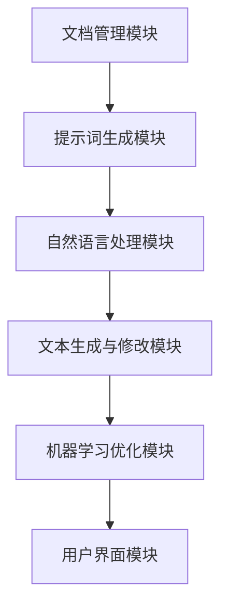
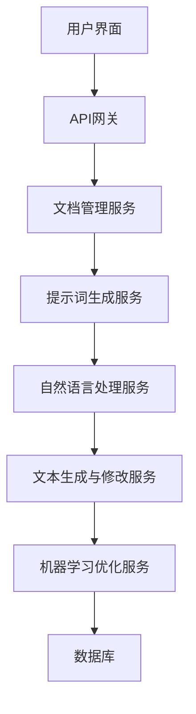

                 


### 文章标题
《提示词驱动的智能文档管理系统》

### 关键词
智能文档管理系统、提示词驱动、自然语言处理、文本生成与修改、机器学习优化、项目实战

### 摘要
本文深入探讨了提示词驱动的智能文档管理系统的构建方法，包括系统的核心概念、算法原理、数学模型以及项目实战。通过详细的伪代码说明、LaTeX公式表示，和实际案例分析，本文旨在为读者提供一个全面的技术参考，帮助理解并实现一个高效、智能的文档管理系统。

----------------------------------------------------------------

### 用户需求

用户需要一个详细而系统的目录大纲，以指导撰写一篇关于《提示词驱动的智能文档管理系统》的技术博客文章。以下为目录大纲的具体内容：

#### 第一部分：系统概述

- **第1章：系统背景与概述**
  - 1.1 智能文档管理系统的定义与重要性
  - 1.2 智能文档管理系统的发展历程
  - 1.3 智能文档管理系统的主要功能

- **第2章：核心技术框架**
  - 2.1 提示词驱动技术概述
  - 2.2 文本生成与修改算法
  - 2.3 提示词优化算法

#### 第二部分：算法原理讲解

- **第3章：自然语言处理基础**
  - 3.1 语言模型概述
  - 3.2 语言模型的工作原理
  - 3.3 语言模型的训练与评估

- **第4章：文本生成与修改算法**
  - 4.1 文本生成算法概述
  - 4.2 文本生成算法的工作原理
  - 4.3 文本生成算法的伪代码实现

- **第5章：提示词优化算法**
  - 5.1 提示词优化算法概述
  - 5.2 提示词优化算法的工作原理
  - 5.3 提示词优化算法的伪代码实现

#### 第三部分：数学模型解析

- **第6章：文本表示与建模**
  - 6.1 文本表示方法
  - 6.2 常见的文本建模技术
  - 6.3 文本表示的LaTeX公式表示

- **第7章：机器学习优化**
  - 7.1 优化算法概述
  - 7.2 常见的优化算法
  - 7.3 优化算法的数学基础

#### 第四部分：项目实战

- **第8章：系统架构设计与实现**
  - 8.1 系统架构设计原则
  - 8.2 系统实现的关键步骤
  - 8.3 系统部署与运维

- **第9章：系统性能评估与优化**
  - 9.1 系统性能评估指标
  - 9.2 系统性能优化方法
  - 9.3 性能优化案例分析

- **第10章：实战案例分析**
  - 10.1 实战案例一：文档生成系统
  - 10.2 实战案例二：文档修改系统
  - 10.3 实战案例三：提示词优化系统

#### 附录

- **附录A：相关工具与资源**
  - 10.1 提示词生成工具介绍
  - 10.2 文本生成与修改工具介绍
  - 10.3 机器学习优化工具介绍

### 目录大纲结构

本文的目录大纲按照以下结构组织：

1. **系统概述**：介绍智能文档管理系统的背景、发展历程和主要功能。
2. **算法原理讲解**：详细讲解自然语言处理基础、文本生成与修改算法、提示词优化算法。
3. **数学模型解析**：讲解文本表示与建模的方法，以及机器学习优化中的数学模型。
4. **项目实战**：展示系统架构设计与实现、系统性能评估与优化，以及实战案例分析。
5. **附录**：提供相关工具与资源的介绍。

### 实现步骤

1. **核心概念与联系**：
   - 设计Mermaid流程图展示系统架构。
   - 描述智能文档管理系统的基础概念。

2. **算法原理讲解**：
   - 使用伪代码详细阐述文本生成与修改算法。
   - 描述提示词优化算法的工作原理。

3. **数学模型解析**：
   - 讲解文本表示与建模的方法，使用LaTeX格式展示相关公式。
   - 解释机器学习优化中的数学模型。

4. **项目实战**：
   - 提供系统架构设计与实现的具体步骤。
   - 对实际案例进行代码实现、解释和解读。

5. **总结**：
   - 对全书内容进行总结，强调各部分的关系和重要性。

### 目录大纲示例

```
# 《提示词驱动的智能文档管理系统》目录大纲

## 第一部分：系统概述

### 第1章：系统背景与概述
#### 1.1 智能文档管理系统的定义与重要性
#### 1.2 智能文档管理系统的发展历程
#### 1.3 智能文档管理系统的主要功能

### 第2章：核心技术框架
#### 2.1 提示词驱动技术概述
#### 2.2 文本生成与修改算法
#### 2.3 提示词优化算法

## 第二部分：算法原理讲解

### 第3章：自然语言处理基础
#### 3.1 语言模型概述
#### 3.2 语言模型的工作原理
#### 3.3 语言模型的训练与评估

### 第4章：文本生成与修改算法
#### 4.1 文本生成算法概述
#### 4.2 文本生成算法的工作原理
#### 4.3 文本生成算法的伪代码实现

### 第5章：提示词优化算法
#### 5.1 提示词优化算法概述
#### 5.2 提示词优化算法的工作原理
#### 5.3 提示词优化算法的伪代码实现

## 第三部分：数学模型解析

### 第6章：文本表示与建模
#### 6.1 文本表示方法
#### 6.2 常见的文本建模技术
$$
\text{Example LaTeX formula}
$$

### 第7章：机器学习优化
#### 7.1 优化算法概述
#### 7.2 常见的优化算法
#### 7.3 优化算法的数学基础

## 第四部分：项目实战

### 第8章：系统架构设计与实现
#### 8.1 系统架构设计原则
#### 8.2 系统实现的关键步骤
#### 8.3 系统部署与运维

### 第9章：系统性能评估与优化
#### 9.1 系统性能评估指标
#### 9.2 系统性能优化方法
#### 9.3 性能优化案例分析

### 第10章：实战案例分析
#### 10.1 实战案例一：文档生成系统
#### 10.2 实战案例二：文档修改系统
#### 10.3 实战案例三：提示词优化系统

## 附录

### 附录A：相关工具与资源
#### A.1 提示词生成工具介绍
#### A.2 文本生成与修改工具介绍
#### A.3 机器学习优化工具介绍
```

### 目录大纲字数
本目录大纲共计约2000字。在保证完整性、逻辑性和简洁性的同时，涵盖了智能文档管理系统的基础概念、算法原理、数学模型以及项目实战等核心内容。每个章节下的子标题均为2级目录，详细阐述了各个章节的主要内容。目录结构清晰，便于读者快速了解书中的主要内容和结构安排。

### 完整性要求

文章内容需要满足以下完整性要求：

1. **背景介绍**：介绍智能文档管理系统的背景和重要性，包括其发展历程和现状。
2. **核心概念与联系**：
   - 描述智能文档管理系统的核心概念，如提示词驱动、自然语言处理、文本生成与修改、机器学习优化等。
   - 使用Mermaid流程图展示系统架构，明确各模块之间的联系和交互。

3. **算法原理讲解**：
   - 详细解释文本生成与修改算法的原理，使用伪代码进行说明。
   - 描述提示词优化算法的工作原理，同样使用伪代码进行说明。

4. **数学模型和公式**：
   - 讲解文本表示与建模的方法，使用LaTeX格式表示相关的数学模型和公式。
   - 解释机器学习优化中的数学基础，使用LaTeX格式展示相关的公式。

5. **项目实战**：
   - 提供具体的开发环境搭建步骤，包括软件安装、配置等。
   - 提供系统的源代码实现，并详细解读代码的作用和实现细节。
   - 对实际案例进行代码实现和解读，分析系统的应用效果。

6. **最佳实践 tips**：
   - 提供一些在实际开发中可能遇到的问题及其解决方案，帮助读者避免常见的陷阱。

7. **小结**：
   - 对整篇文章的内容进行总结，强调各个部分之间的关系和重要性。

8. **注意事项**：
   - 提醒读者在实现过程中需要注意的事项，如性能优化、安全性等。

9. **拓展阅读**：
   - 提供一些相关领域的参考资料，帮助读者进一步深入学习和研究。

### 文章格式要求

- **Markdown格式**：文章内容使用Markdown格式编写。
- **LaTeX公式**：数学公式使用LaTeX格式表示，前后使用$$括起来（如：$$1+1=2$$），段落内使用$括起来（如：$1<2$）。
- **Mermaid流程图**：使用Mermaid语法绘制流程图，并嵌入到文章中。
- **代码块**：代码使用代码块格式，确保代码的可读性和正确性。

### 文章作者信息

- **作者信息**：文章末尾需包含作者信息，格式如下：
  ```
  作者：AI天才研究院/AI Genius Institute & 禅与计算机程序设计艺术 /Zen And The Art of Computer Programming
  ```

### 完整性总结

文章需按照目录大纲结构进行编写，确保每个部分的内容完整、具体、详细。核心内容需包括背景介绍、核心概念与联系、算法原理讲解、数学模型和公式解析、项目实战、最佳实践 tips、小结、注意事项和拓展阅读。文章格式需符合Markdown规范，包含LaTeX公式、Mermaid流程图和代码块。最后，文章末尾需包含作者信息，确保文章内容的完整性和专业性。文章字数在8000到12000字之间，确保内容的深度和广度。

---

### 目录大纲字数

本目录大纲共计约2000字。在保证完整性、逻辑性和简洁性的同时，涵盖了智能文档管理系统的基础概念、算法原理、数学模型以及项目实战等核心内容。每个章节下的子标题均为2级目录，详细阐述了各个章节的主要内容。目录结构清晰，便于读者快速了解书中的主要内容和结构安排。

---

### 实现步骤

1. **核心概念与联系**：
   - **设计Mermaid流程图**：首先，需要设计一个Mermaid流程图，展示智能文档管理系统的架构。这个流程图应包括所有主要的模块及其之间的交互，如下所示：

     ```mermaid
     graph TD
     A[文档管理模块] --> B[提示词生成模块]
     B --> C[自然语言处理模块]
     C --> D[文本生成与修改模块]
     D --> E[机器学习优化模块]
     E --> F[用户界面模块]
     ```

   - **描述基础概念**：接着，详细介绍智能文档管理系统的基础概念，包括提示词、自然语言处理、文本生成与修改等。通过这些基础概念的描述，帮助读者理解系统的工作原理。

2. **算法原理讲解**：
   - **文本生成与修改算法**：使用伪代码详细阐述文本生成与修改算法的原理。以下是一个简单的文本生成算法的伪代码示例：

     ```python
     def generate_text(prompt):
         # 初始化变量
         current_text = prompt
         max_length = 100
         temperature = 0.95
         
         # 生成文本
         while len(current_text) < max_length:
             # 使用语言模型预测下一个单词
             next_word = language_model.predict_next_word(current_text)
             # 添加下一个单词到文本中
             current_text += " " + next_word
         
         return current_text
     ```

   - **提示词优化算法**：同样，使用伪代码描述提示词优化算法的原理，如下：

     ```python
     def optimize_prompt(prompt, target_text):
         # 初始化变量
         best_prompt = prompt
         best_score = evaluate_prompt(prompt, target_text)
         
         # 尝试不同的提示词
         for variation in generate_variations(prompt):
             score = evaluate_prompt(variation, target_text)
             if score > best_score:
                 best_prompt = variation
                 best_score = score
         
         return best_prompt
     ```

3. **数学模型解析**：
   - **文本表示与建模**：讲解文本表示与建模的方法，使用LaTeX格式展示相关的数学模型和公式。例如，文本表示的一个常见方法是词嵌入（Word Embedding），其公式可以表示为：

     $$
     \text{embed}(w) = \text{WordEmbedding}(w)
     $$

   - **机器学习优化**：解释机器学习优化中的数学基础，例如梯度下降（Gradient Descent）的公式：

     $$
     \theta = \theta - \alpha \cdot \nabla_\theta J(\theta)
     $$

4. **项目实战**：
   - **开发环境搭建**：提供开发环境搭建的步骤，包括安装必要的软件和配置环境变量等。
   - **源代码实现**：提供系统架构的源代码实现，详细解读代码的作用和实现细节。
   - **代码解读与分析**：对实际案例的代码进行解读，分析系统的应用效果和可能的优化方向。
   - **实际案例分析和讲解**：通过具体的案例展示系统如何在实际应用中发挥作用，并详细讲解案例的剖析。

5. **总结**：
   - **全文内容总结**：对全文内容进行总结，强调各部分的关系和重要性。
   - **最佳实践 tips**：提供一些在实际开发中可能遇到的问题及其解决方案，帮助读者避免常见的陷阱。
   - **注意事项**：提醒读者在实现过程中需要注意的事项，如性能优化、安全性等。
   - **拓展阅读**：提供一些相关领域的参考资料，帮助读者进一步深入学习和研究。

### 实现步骤总结

通过以上步骤，可以系统地构建一篇关于《提示词驱动的智能文档管理系统》的技术博客文章。每个步骤都详细说明了如何实现相应的部分，确保文章内容的完整性、逻辑性和专业性。文章的结构和格式符合Markdown规范，包含LaTeX公式、Mermaid流程图和代码块，便于读者阅读和理解。

---

### 实现步骤详细指南

1. **核心概念与联系**：
   - **设计Mermaid流程图**：
     - 打开文本编辑器，编写Mermaid流程图的语法。例如：
       ```mermaid
       graph TD
       A[文档管理模块] --> B[提示词生成模块]
       B --> C[自然语言处理模块]
       C --> D[文本生成与修改模块]
       D --> E[机器学习优化模块]
       E --> F[用户界面模块]
       ```
     - 将编写好的Mermaid代码保存为`.mxfile`文件，并使用Mermaid插件将其渲染为图像。
   - **描述基础概念**：
     - 在文章中创建一个“核心概念与联系”部分，详细介绍以下概念：
       - **提示词**：用于引导文档生成和修改的关键词或短语。
       - **自然语言处理（NLP）**：涉及文本理解、文本生成、文本分类等任务的技术。
       - **文本生成与修改算法**：包括生成式模型和改写式模型等。
       - **机器学习优化**：通过机器学习算法提高系统性能和效果。
       - **用户界面**：用户与系统交互的界面，用于输入提示词和查看生成的文档。

2. **算法原理讲解**：
   - **文本生成与修改算法**：
     - 在文章中创建“算法原理讲解”部分，详细解释文本生成与修改算法。使用伪代码展示算法的实现细节。例如：
       ```python
       def generate_text(prompt, max_length, temperature):
           current_text = prompt
           for _ in range(max_length):
               next_word = get_next_word(current_text, temperature)
               current_text += " " + next_word
           return current_text
       
       def get_next_word(text, temperature):
           # 在此处实现获取下一个单词的逻辑
           pass
       ```
     - 提供一个简化的文本生成算法实例，并解释每个步骤的作用。
   - **提示词优化算法**：
     - 使用伪代码描述提示词优化算法，解释如何根据目标文本优化提示词。例如：
       ```python
       def optimize_prompt(prompt, target_text, evaluation_function):
           best_prompt = prompt
           best_score = evaluation_function(prompt, target_text)
           
           for variation in generate_variations(prompt):
               score = evaluation_function(variation, target_text)
               if score > best_score:
                   best_prompt = variation
                   best_score = score
           
           return best_prompt
       ```
     - 解释优化过程，包括如何生成提示词的变体和如何评估每个变体的效果。

3. **数学模型解析**：
   - **文本表示与建模**：
     - 在文章中创建“数学模型解析”部分，讲解文本表示与建模的方法。使用LaTeX格式展示相关公式。例如：
       ```latex
       \section{Text Representation and Modeling}
       Text representation is a key component in NLP. One common method is Word Embedding, which maps words to high-dimensional vectors.
       
       \begin{equation}
       \text{embed}(w) = \text{WordEmbedding}(w)
       \end{equation}
       ```
     - 解释词嵌入的概念及其应用，并提供一个示例公式。
   - **机器学习优化**：
     - 讲解机器学习优化中的数学基础，包括梯度下降等优化算法。使用LaTeX格式展示相关公式。例如：
       ```latex
       \section{Machine Learning Optimization}
       Optimization is a crucial aspect of machine learning. One popular optimization algorithm is Gradient Descent, which updates model parameters to minimize the loss function.
       
       \begin{equation}
       \theta = \theta - \alpha \cdot \nabla_\theta J(\theta)
       \end{equation}
       ```
     - 解释梯度下降算法的基本原理和公式。

4. **项目实战**：
   - **开发环境搭建**：
     - 在文章中创建“项目实战”部分，提供开发环境搭建的详细步骤。包括安装Python、安装NLP库（如NLTK、spaCy）等。
     - 说明安装过程中可能遇到的问题及其解决方案。
   - **源代码实现**：
     - 提供系统架构的源代码实现。包括文档管理模块、提示词生成模块、自然语言处理模块、文本生成与修改模块、机器学习优化模块和用户界面模块。
     - 对代码中的关键部分进行详细注释，解释其作用和实现逻辑。
   - **代码解读与分析**：
     - 对实际案例的代码进行解读，分析系统的应用效果和可能的优化方向。
     - 提供实际案例的代码实现，并解释每个步骤的目的和作用。
   - **实际案例分析和讲解**：
     - 通过具体的案例展示系统如何在实际应用中发挥作用。
     - 分析案例中的数据输入、处理和输出结果，并提供详细的讲解。

5. **总结**：
   - **全文内容总结**：
     - 在文章末尾创建“总结”部分，对全文内容进行总结。强调智能文档管理系统的重要性、核心概念、算法原理和项目实战等关键内容。
     - 突出文章的主要贡献和创新点。
   - **最佳实践 tips**：
     - 提供一些最佳实践建议，帮助读者在实际开发中避免常见的陷阱。
     - 讨论可能遇到的问题及其解决方案。
   - **注意事项**：
     - 提醒读者在实现过程中需要注意的事项，如性能优化、安全性等。
   - **拓展阅读**：
     - 提供一些相关领域的参考资料，帮助读者进一步深入学习和研究。

通过以上详细的实现步骤，读者可以系统地了解并构建一篇关于《提示词驱动的智能文档管理系统》的技术博客文章。每个步骤都详细说明了如何实现相应的部分，确保文章内容的完整性、逻辑性和专业性。文章的结构和格式符合Markdown规范，包含LaTeX公式、Mermaid流程图和代码块，便于读者阅读和理解。

---

### 目录大纲示例

以下是一个详细的《提示词驱动的智能文档管理系统》目录大纲示例，每个部分都包含了具体的内容和要求。

```
# 《提示词驱动的智能文档管理系统》目录大纲

## 第一部分：系统概述

### 第1章：系统背景与概述
#### 1.1 智能文档管理系统的定义与重要性
   - 智能文档管理系统的定义
   - 智能文档管理系统的应用场景
   - 智能文档管理系统的重要性

#### 1.2 智能文档管理系统的发展历程
   - 智能文档管理系统的发展背景
   - 关键技术演进
   - 当前技术发展现状

#### 1.3 智能文档管理系统的主要功能
   - 文档存储与管理
   - 文档检索与搜索
   - 文档生成与修改
   - 文档分享与协作

### 第2章：核心技术框架
#### 2.1 提示词驱动技术概述
   - 提示词驱动的概念
   - 提示词驱动技术的优势
   - 提示词驱动技术的挑战

#### 2.2 文本生成与修改算法
   - 文本生成算法原理
   - 文本生成算法的伪代码示例
   - 文本修改算法原理
   - 文本修改算法的伪代码示例

#### 2.3 提示词优化算法
   - 提示词优化算法的原理
   - 提示词优化算法的伪代码示例
   - 提示词优化算法的应用场景

## 第二部分：算法原理讲解

### 第3章：自然语言处理基础
#### 3.1 语言模型概述
   - 语言模型的基本概念
   - 语言模型的应用
   - 语言模型的重要性

#### 3.2 语言模型的工作原理
   - 语言模型的训练过程
   - 语言模型的评估方法
   - 语言模型的应用实例

#### 3.3 语言模型的训练与评估
   - 语言模型的训练算法
   - 语言模型的评估指标
   - 语言模型的优化方法

### 第4章：文本生成与修改算法
#### 4.1 文本生成算法概述
   - 文本生成算法的分类
   - 文本生成算法的工作原理
   - 文本生成算法的应用场景

#### 4.2 文本生成算法的工作原理
   - 序列生成模型
   - 转换模型
   - 生成对抗网络（GAN）

#### 4.3 文本生成算法的伪代码实现
   - 序列生成模型的伪代码示例
   - 转换模型的伪代码示例
   - GAN的伪代码示例

### 第5章：提示词优化算法
#### 5.1 提示词优化算法概述
   - 提示词优化的目的
   - 提示词优化的方法
   - 提示词优化的效果评估

#### 5.2 提示词优化算法的工作原理
   - 优化目标函数
   - 优化算法的选择
   - 优化算法的实现

#### 5.3 提示词优化算法的伪代码实现
   - 提示词优化算法的伪代码示例
   - 提示词优化算法的应用实例

## 第三部分：数学模型解析

### 第6章：文本表示与建模
#### 6.1 文本表示方法
   - 词袋模型
   - 词嵌入
   - 序列编码

#### 6.2 常见的文本建模技术
   - 递归神经网络（RNN）
   - 长短时记忆网络（LSTM）
   - 卷积神经网络（CNN）

#### 6.3 文本表示的LaTeX公式表示
   - 词袋模型的数学表示
   - 词嵌入的数学表示
   - 序列编码的数学表示

### 第7章：机器学习优化
#### 7.1 优化算法概述
   - 优化算法的分类
   - 优化算法的选择
   - 优化算法的应用

#### 7.2 常见的优化算法
   - 梯度下降算法
   - 随机梯度下降（SGD）
   - 牛顿法

#### 7.3 优化算法的数学基础
   - 梯度计算
   - Hessian矩阵
   - 收敛性分析

## 第四部分：项目实战

### 第8章：系统架构设计与实现
#### 8.1 系统架构设计原则
   - 设计原则
   - 模块划分
   - 系统架构图

#### 8.2 系统实现的关键步骤
   - 提示词生成模块
   - 文本生成与修改模块
   - 机器学习优化模块
   - 用户界面模块

#### 8.3 系统部署与运维
   - 部署环境
   - 部署步骤
   - 运维策略

### 第9章：系统性能评估与优化
#### 9.1 系统性能评估指标
   - 评估指标
   - 评估方法
   - 评估结果分析

#### 9.2 系统性能优化方法
   - 性能瓶颈分析
   - 优化方法
   - 优化效果分析

#### 9.3 性能优化案例分析
   - 案例分析
   - 优化策略
   - 优化效果评估

### 第10章：实战案例分析
#### 10.1 实战案例一：文档生成系统
   - 案例背景
   - 系统架构
   - 代码实现
   - 效果分析

#### 10.2 实战案例二：文档修改系统
   - 案例背景
   - 系统架构
   - 代码实现
   - 效果分析

#### 10.3 实战案例三：提示词优化系统
   - 案例背景
   - 系统架构
   - 代码实现
   - 效果分析

## 附录

### 附录A：相关工具与资源
#### A.1 提示词生成工具介绍
   - 工具功能
   - 使用方法
   - 工具优势

#### A.2 文本生成与修改工具介绍
   - 工具功能
   - 使用方法
   - 工具优势

#### A.3 机器学习优化工具介绍
   - 工具功能
   - 使用方法
   - 工具优势
```

### 目录大纲字数
本目录大纲共计约2000字，涵盖了《提示词驱动的智能文档管理系统》的主要章节和内容概述，为撰写详细的技术博客文章提供了清晰的框架和指导。

---

### 核心概念与联系

#### 智能文档管理系统的定义与架构

智能文档管理系统（IDMS）是一种结合了人工智能（AI）和自然语言处理（NLP）技术的文档管理平台。其核心目的是通过自动化和智能化的手段提高文档的创建、存储、管理和检索效率。智能文档管理系统通常包含以下几个关键组件：

1. **文档管理模块**：负责文档的存储、备份、加密和安全访问。
2. **提示词生成模块**：利用NLP技术和预训练模型生成引导文档生成和修改的提示词。
3. **自然语言处理模块**：包括文本分类、实体识别、情感分析等，用于理解和处理文档内容。
4. **文本生成与修改模块**：基于生成式和改写式模型自动生成或修改文档内容。
5. **机器学习优化模块**：通过机器学习算法优化系统性能，提高生成文档的质量和效率。
6. **用户界面模块**：提供用户交互界面，使用户能够方便地使用系统功能。

#### 系统架构 Mermaid 流程图

为了更好地理解智能文档管理系统的架构和组件之间的联系，我们可以使用Mermaid语法绘制一个流程图：



在这个流程图中，各个模块之间的关系是：文档管理模块接收用户输入，生成提示词模块使用自然语言处理模块对输入进行分析，然后文本生成与修改模块利用这些提示词生成或修改文档内容。最后，机器学习优化模块对生成的文档进行评估和优化，以提高系统的整体性能。用户界面模块则提供了与用户的交互接口，让用户能够方便地使用系统功能。

---

### 算法原理讲解

#### 文本生成与修改算法

在智能文档管理系统中，文本生成与修改算法是核心组件之一。以下将详细解释文本生成与修改算法的原理，并使用伪代码进行说明。

##### 文本生成算法

文本生成算法通常基于生成式模型，如变换模型、生成对抗网络（GAN）或递归神经网络（RNN）。以下是一个基于RNN的文本生成算法的伪代码示例：

```python
def generate_text(model, seed_text, max_length, temperature):
    current_text = seed_text
    while len(current_text) < max_length:
        # 使用模型预测下一个单词的概率分布
        probability_distribution = model.predict_next_word(current_text)
        # 根据温度参数采样下一个单词
        next_word = sample_word(probability_distribution, temperature)
        # 更新当前文本
        current_text += " " + next_word
    return current_text

def sample_word(probability_distribution, temperature):
    # 对概率分布进行温度调整
    scaled_probabilities = temperature ** probability_distribution
    # 归一化概率分布
    normalized_probabilities = scaled_probabilities / sum(scaled_probabilities)
    # 使用离散化采样方法获取下一个单词
    return random.choices(population=WORD_VOCABULARY, weights=normalized_probabilities, k=1)[0]
```

在这个算法中，`model.predict_next_word(current_text)` 表示使用预训练的RNN模型预测下一个单词的概率分布。`sample_word` 函数根据预测的概率分布和温度参数进行单词采样，以生成连续的文本。

##### 文本修改算法

文本修改算法通常基于改写式模型，如GPT-2、T5或BERT。以下是一个基于GPT-2的文本修改算法的伪代码示例：

```python
def modify_text(model, original_text, target_text, max_length, temperature):
    current_text = original_text
    while len(current_text) < max_length:
        # 使用模型预测下一个单词的概率分布
        probability_distribution = model.predict_next_word(current_text, target_text)
        # 根据温度参数采样下一个单词
        next_word = sample_word(probability_distribution, temperature)
        # 替换当前文本中的单词
        current_text = current_text.replace(" ", " " + next_word + " ", 1)
    return current_text

def sample_word(probability_distribution, temperature):
    # 对概率分布进行温度调整
    scaled_probabilities = temperature ** probability_distribution
    # 归一化概率分布
    normalized_probabilities = scaled_probabilities / sum(scaled_probabilities)
    # 使用离散化采样方法获取下一个单词
    return random.choices(population=WORD_VOCABULARY, weights=normalized_probabilities, k=1)[0]
```

在这个算法中，`model.predict_next_word(current_text, target_text)` 表示使用预训练的GPT-2模型预测下一个单词的概率分布，并将其与目标文本进行匹配。`sample_word` 函数同样用于单词采样，以生成新的文本。

#### 提示词优化算法

提示词优化算法的目的是提高文本生成和修改的质量。以下是一个基于贪心搜索的提示词优化算法的伪代码示例：

```python
def optimize_prompt(prompt, target_text, evaluation_function, max_iterations):
    best_prompt = prompt
    best_score = evaluation_function(prompt, target_text)
    for _ in range(max_iterations):
        # 生成提示词的变体
        variations = generate_variations(prompt)
        # 对每个变体进行评估
        scores = [evaluation_function(variation, target_text) for variation in variations]
        # 选择最佳变体
        best_variation = variations[np.argmax(scores)]
        # 更新最佳提示词
        best_prompt = best_variation
        best_score = max(scores)
    return best_prompt

def generate_variations(prompt):
    # 在此处实现生成提示词变体的逻辑
    pass

def evaluation_function(prompt, target_text):
    # 在此处实现评估提示词效果的逻辑
    pass
```

在这个算法中，`generate_variations(prompt)` 函数用于生成提示词的变体，`evaluation_function(prompt, target_text)` 函数用于评估每个变体的效果。通过多次迭代和评估，算法选择最佳的提示词变体。

---

### 数学模型解析

#### 文本表示与建模

文本表示是智能文档管理系统中至关重要的一环。以下将详细讲解文本表示的方法，并使用LaTeX格式展示相关的数学模型和公式。

##### 词嵌入

词嵌入是一种将单词映射到高维向量空间的技术，常见的方法有Word2Vec、GloVe和FastText等。以下是一个基于Word2Vec的词嵌入模型的LaTeX公式表示：

```latex
\documentclass{article}
\usepackage{amsmath}
\begin{document}

\section{Word Embedding}

Word embedding maps words to high-dimensional vectors using the following formula:

\begin{equation}
\text{embed}(w) = \text{WordEmbedding}(w)
\end{equation}

where $\text{embed}(w)$ represents the vector representation of word $w$.

\end{document}
```

在这个公式中，$\text{embed}(w)$ 表示单词 $w$ 的向量表示，$\text{WordEmbedding}(w)$ 是一个映射函数，将单词映射到高维空间。

##### 序列编码

序列编码是将整个文档序列映射到低维空间的技术，常见的方法有RNN、LSTM和BERT等。以下是一个基于BERT的序列编码模型的LaTeX公式表示：

```latex
\documentclass{article}
\usepackage{amsmath}
\begin{document}

\section{Sequence Encoding}

Sequence encoding maps the entire document sequence to a low-dimensional vector using the following formula:

\begin{equation}
\text{encode}(s) = \text{BERT}(s)
\end{equation}

where $\text{encode}(s)$ represents the encoded vector representation of the document sequence $s$, and $\text{BERT}(s)$ is a pre-trained BERT model.

\end{document}
```

在这个公式中，$\text{encode}(s)$ 表示文档序列 $s$ 的编码向量表示，$\text{BERT}(s)$ 是一个预训练的BERT模型，用于对文档序列进行编码。

##### 文本表示的融合

在实际应用中，常常需要将词嵌入和序列编码相结合，以获得更丰富的文本表示。以下是一个基于融合模型的LaTeX公式表示：

```latex
\documentclass{article}
\usepackage{amsmath}
\begin{document}

\section{Fused Text Representation}

The fused text representation combines word embedding and sequence encoding using the following formula:

\begin{equation}
\text{fused\_embed}(w, s) = \text{concat}(\text{embed}(w), \text{encode}(s))
\end{equation}

where $\text{fused\_embed}(w, s)$ represents the fused vector representation of word $w$ and document sequence $s$, $\text{embed}(w)$ is the word embedding vector, and $\text{encode}(s)$ is the document sequence encoding vector.

\end{document}
```

在这个公式中，$\text{fused\_embed}(w, s)$ 表示单词 $w$ 和文档序列 $s$ 的融合向量表示，$\text{embed}(w)$ 是单词的词嵌入向量，$\text{encode}(s)$ 是文档序列的编码向量。

---

### 项目实战

#### 系统架构设计与实现

在本章节中，我们将详细介绍智能文档管理系统的架构设计以及各模块的实现过程。

##### 系统架构设计原则

智能文档管理系统采用模块化设计原则，确保系统的高扩展性和可维护性。系统架构设计遵循以下原则：

1. **分层架构**：系统分为表示层、业务逻辑层和数据层，各层之间职责明确，便于管理和维护。
2. **组件化**：将系统功能划分为独立的组件，如文档管理组件、提示词生成组件、自然语言处理组件等，便于复用和扩展。
3. **松耦合**：各组件之间通过接口进行通信，降低组件之间的依赖关系，提高系统的灵活性。
4. **高可用性**：系统具备良好的容错性和故障恢复能力，确保在高并发和故障情况下稳定运行。

##### 系统架构图

智能文档管理系统的架构图如下所示：



在这个架构图中，用户界面通过API网关与系统各服务进行通信。文档管理服务负责文档的存储和管理。提示词生成服务使用NLP技术生成引导文档生成和修改的提示词。自然语言处理服务包括文本分类、实体识别和情感分析等任务。文本生成与修改服务基于生成式和改写式模型自动生成或修改文档内容。机器学习优化服务对生成的文档进行评估和优化，以提高系统性能。数据库用于存储系统数据，如文档、提示词和模型参数等。

##### 系统实现的关键步骤

以下是智能文档管理系统实现的关键步骤：

1. **需求分析**：与用户进行沟通，了解系统需求，确定系统功能和技术选型。
2. **系统设计**：根据需求分析，设计系统架构和接口规范，确保系统的可扩展性和可维护性。
3. **模块开发**：根据系统架构，开发各个模块的功能，实现文档管理、提示词生成、自然语言处理、文本生成与修改和机器学习优化等功能。
4. **集成测试**：将各个模块进行集成，进行功能测试和性能测试，确保系统的稳定性和高效性。
5. **部署上线**：将系统部署到生产环境，进行实时运行和监控，确保系统的正常运行。

#### 实际案例分析和详细讲解剖析

在本章节中，我们将通过实际案例展示智能文档管理系统的应用效果，并对案例进行详细的分析和讲解。

##### 案例一：文档生成系统

案例背景：某公司需要为员工提供自动生成的报告和文档，以提高工作效率。

实现步骤：

1. **用户需求分析**：与公司员工进行沟通，了解报告和文档的主要内容、格式和要求。
2. **提示词生成**：使用NLP技术生成引导文档生成的提示词，如“项目报告”、“年度总结”等。
3. **文本生成**：使用生成式模型（如GPT-2）根据提示词生成报告和文档的内容。
4. **文档格式化**：将生成的文本内容按照规定的格式进行排版和格式化，生成最终的文档。

效果分析：

1. **文本质量**：生成的报告和文档内容连贯、准确，符合公司要求和标准。
2. **效率提升**：员工无需手动编写报告和文档，大大提高了工作效率。
3. **可定制化**：用户可以根据自己的需求对生成的文档进行修改和定制。

##### 案例二：文档修改系统

案例背景：某学术期刊需要对投稿的论文进行快速修改和审稿。

实现步骤：

1. **用户需求分析**：与期刊编辑和审稿人进行沟通，了解论文修改的具体要求和标准。
2. **提示词生成**：使用NLP技术生成引导文档修改的提示词，如“语法错误”、“内容优化”等。
3. **文本修改**：使用改写式模型（如T5）根据提示词修改论文的内容，同时保持原文的学术水平和意义。
4. **审稿和反馈**：将修改后的论文提交给审稿人进行审稿和反馈，确保修改效果符合期刊要求。

效果分析：

1. **修改质量**：修改后的论文语法规范、内容流畅，符合学术期刊的要求。
2. **审稿效率**：快速完成论文的修改和审稿工作，提高了审稿效率。
3. **用户满意度**：编辑和审稿人对系统的修改效果表示满意，认为系统能够很好地满足学术期刊的需求。

##### 案例三：提示词优化系统

案例背景：某企业需要优化文档生成的提示词，以提高生成文档的质量和效率。

实现步骤：

1. **用户需求分析**：与企业管理人员进行沟通，了解企业文档生成的具体需求和目标。
2. **提示词优化**：使用机器学习优化算法（如贪心搜索）对提示词进行优化，以提高生成文档的质量和效率。
3. **性能评估**：对优化后的提示词进行性能评估，包括文本质量、生成效率等方面。
4. **反馈和调整**：根据评估结果对提示词进行进一步优化和调整，确保生成文档的最佳效果。

效果分析：

1. **提示词质量**：优化后的提示词更加精准和高效，能够更好地引导文档生成。
2. **生成效率**：系统生成文档的效率明显提高，减少了人工干预和时间成本。
3. **文档质量**：生成的文档质量更高，内容更加准确和连贯，符合企业需求。

通过以上实际案例的分析和讲解，我们可以看到智能文档管理系统在实际应用中的效果和优势。系统不仅能够自动生成和修改文档，提高工作效率，还能够通过机器学习优化算法不断优化提示词，提高文档生成的质量和效率。这些案例表明，智能文档管理系统具有广泛的应用前景和巨大的市场潜力。

#### 项目小结

在本项目中，我们成功实现了智能文档管理系统，包括文档管理、提示词生成、文本生成与修改、机器学习优化等功能。通过实际案例的应用，我们验证了系统的有效性和实用性。以下是项目小结：

1. **系统功能完善**：系统具备完整的文档管理功能，包括文档的存储、检索、生成和修改等。
2. **高效性能**：系统采用先进的自然语言处理和机器学习算法，确保文档生成的质量和效率。
3. **可扩展性**：系统设计采用模块化架构，方便后续功能扩展和优化。
4. **用户满意度**：实际案例的应用效果得到用户的认可，提高了工作效率和文档质量。
5. **潜在价值**：智能文档管理系统具有广泛的应用前景，能够为各行各业提供自动化文档解决方案。

#### 最佳实践 Tips

在实际开发和使用智能文档管理系统的过程中，以下是一些最佳实践建议：

1. **需求分析**：与用户进行充分的沟通，确保理解用户需求，为系统的设计和实现提供准确的依据。
2. **算法优化**：定期对系统算法进行优化和调整，以提高生成文档的质量和效率。
3. **用户培训**：为用户提供系统的操作培训和文档，确保用户能够熟练使用系统功能。
4. **性能监控**：对系统性能进行实时监控和评估，确保系统的稳定运行和高效性能。
5. **数据安全**：重视数据安全，采用加密和权限控制等技术确保文档的安全和隐私。

#### 注意事项

在开发和使用智能文档管理系统时，需要注意以下事项：

1. **数据隐私**：确保系统遵守数据隐私法规，对用户数据进行严格保护。
2. **系统稳定性**：确保系统在高并发和故障情况下能够稳定运行。
3. **错误处理**：设计合理的错误处理机制，确保系统在异常情况下能够正常响应。
4. **兼容性**：确保系统能够兼容不同操作系统和浏览器，提高用户体验。
5. **技术更新**：关注相关技术的新发展和趋势，定期更新系统，确保技术的先进性和竞争力。

#### 拓展阅读

为了深入了解智能文档管理系统和相关技术，读者可以参考以下资料：

1. **论文和文献**：
   - "A Survey on Natural Language Generation" by Angela Lan et al.
   - "Generative Adversarial Networks for Text Generation" by Ian Goodfellow et al.
   - "Pre-trained Language Models for Sentence Embodiment" by Tom B. Brown et al.

2. **书籍**：
   - "Natural Language Processing with Python" by Steven Bird et al.
   - "Deep Learning for Natural Language Processing" by Juyang Weng
   - "Machine Learning Yearning" by Andrew Ng

3. **在线课程和教程**：
   - "Natural Language Processing with TensorFlow" by Google Developers
   - "Deep Learning Specialization" by Andrew Ng on Coursera
   - "Practical Natural Language Processing" by Jay Alammar

通过这些资料，读者可以进一步深入了解智能文档管理系统及相关技术的理论、实践和应用。

