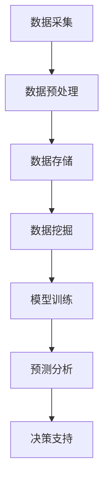

                 

### 提示词驱动的智能水资源管理系统

#### 关键词：
- 提示词驱动
- 智能水资源管理
- 数据采集与处理
- 核心算法原理
- 数学模型
- 项目实战
- 系统评估与优化

#### 摘要：
本文旨在探讨提示词驱动的智能水资源管理系统的设计与实现。首先，我们将介绍水资源管理系统的概念、发展历程以及提示词驱动的原理和优势。接着，详细阐述智能水资源管理系统的架构设计，包括数据层、模型层和应用层。本文将深入讲解水资源管理中的核心算法原理，使用伪代码详细描述，并介绍数学模型及其应用。此外，通过实际开发案例，展示系统的搭建过程、源代码实现和代码解读。最后，评估系统性能，提出优化方案，展望未来发展趋势和挑战。

## 第一部分：引言与基础

### 1.1 水资源管理系统的概念、发展历程及重要性

#### 1.1.1 水资源管理系统的定义

水资源管理系统是一种集成了多种技术和工具的系统，旨在实现水资源的优化管理、保护和利用。它包括数据采集、处理、分析和决策支持等功能，通过集成水资源相关的各种信息，实现对水资源系统的全面监控和调度。

#### 1.1.2 水资源管理的现状与挑战

当前，全球水资源管理面临诸多挑战，包括水资源分布不均、污染问题严重、供需矛盾突出等。随着人口增长和经济发展的加快，水资源问题日益严峻。因此，构建智能化、高效化的水资源管理系统，已成为当务之急。

#### 1.1.3 提示词驱动的概念与优势

提示词驱动（Keyword-driven）是一种自动化测试方法，通过预设的提示词来指导测试过程，提高测试的准确性和效率。在智能水资源管理系统中，提示词驱动方法可以应用于数据采集、处理和分析等环节，实现系统的自动化和智能化。

提示词驱动的优势主要体现在以下几个方面：

1. **提高测试效率**：通过预设的提示词，测试人员可以快速定位系统功能和性能问题，减少测试时间。
2. **降低人力成本**：提示词驱动的自动化测试可以减少对人工测试的依赖，降低测试人员的工作量。
3. **提高测试覆盖率**：提示词驱动的测试方法可以全面覆盖系统的各个功能模块，提高测试覆盖率。
4. **增强测试可维护性**：提示词驱动的测试脚本易于修改和扩展，提高测试的可维护性。

### 1.2 智能水资源管理系统的发展历程

#### 1.2.1 智能水资源管理系统的发展阶段

智能水资源管理系统的发展可以分为以下几个阶段：

1. **传统阶段**：主要依靠人工进行数据采集、处理和分析，效率较低，易受人为因素影响。
2. **自动化阶段**：引入自动化工具，实现数据采集和处理的自动化，提高工作效率。
3. **智能化阶段**：利用人工智能技术，实现智能数据分析和决策支持，提高水资源管理的科学性和准确性。

#### 1.2.2 当前技术趋势与应用现状

当前，智能水资源管理系统主要采用以下技术：

1. **大数据技术**：用于大规模数据的存储、处理和分析。
2. **机器学习技术**：用于数据挖掘、预测分析和智能决策。
3. **物联网技术**：用于实时数据采集和传输，实现水资源系统的全面监控。

在实际应用中，智能水资源管理系统已广泛应用于城市供水、灌溉、污水处理等领域，取得了显著成效。

## 第二部分：智能水资源管理系统架构设计

### 2.1 系统架构概述

智能水资源管理系统由三个主要层次构成：数据层、模型层和应用层。

1. **数据层**：负责数据的采集、存储和管理，包括传感器数据、历史数据、用户数据等。
2. **模型层**：包含核心算法和模型，用于数据分析和预测，包括数据挖掘、机器学习、深度学习等。
3. **应用层**：提供用户接口和功能模块，包括数据展示、报表生成、决策支持等。

### 2.2 数据采集与处理流程

数据采集与处理流程包括以下步骤：

1. **数据采集**：通过传感器和物联网设备，实时采集水资源相关的各种数据。
2. **数据预处理**：对采集到的原始数据进行清洗、去噪和格式转换，确保数据质量。
3. **数据存储**：将预处理后的数据存储到数据库或数据仓库中，便于后续分析和处理。
4. **数据挖掘与预测**：利用机器学习技术，对历史数据进行挖掘和预测，为水资源管理提供科学依据。
5. **数据可视化**：将分析结果通过图表、报表等形式展示给用户，便于决策。

### 2.3 智能模型的设计原理和实现方法

智能模型的设计原理主要包括以下方面：

1. **数据输入**：根据水资源管理的需求，选择合适的数据特征作为模型的输入。
2. **模型选择**：根据数据特点和业务需求，选择合适的机器学习算法和深度学习模型。
3. **模型训练**：使用历史数据对模型进行训练，调整模型参数，提高模型性能。
4. **模型评估**：通过交叉验证和测试集，评估模型在未知数据上的表现，确保模型的泛化能力。
5. **模型部署**：将训练好的模型部署到生产环境中，实现实时数据分析和预测。

常见的智能模型包括：

1. **回归模型**：用于预测水资源的供需量。
2. **分类模型**：用于识别水质问题。
3. **聚类模型**：用于分析水资源的分布特征。
4. **神经网络模型**：用于处理复杂的非线性问题。

## 第三部分：核心算法原理讲解

### 3.1 数据挖掘算法原理

数据挖掘算法是一种从大量数据中提取有价值信息的方法，常用于水资源管理中的数据分析和预测。常见的数据挖掘算法包括：

1. **关联规则挖掘**：用于发现数据之间的关联关系，如水源与水质之间的关系。
2. **分类算法**：用于将数据分为不同的类别，如水质分类。
3. **聚类算法**：用于将数据分为不同的簇，如水源地聚类。
4. **异常检测**：用于检测数据中的异常值，如水质异常检测。

下面以关联规则挖掘算法为例，介绍其原理和实现方法。

#### 关联规则挖掘算法原理

关联规则挖掘算法通过挖掘数据中的频繁项集，发现数据之间的关联关系。其主要步骤如下：

1. **频繁项集生成**：找到数据中出现频率较高的项集。
2. **支持度计算**：计算每个项集在数据中的支持度，即项集出现的频率。
3. **置信度计算**：计算每个关联规则的前件和后件的置信度。
4. **规则生成**：生成满足最小支持度和最小置信度的关联规则。

#### 关联规则挖掘算法伪代码

```python
# 输入：数据集D，最小支持度阈值min_support，最小置信度阈值min_confidence
# 输出：频繁项集L，关联规则R

def Apriori(D, min_support, min_confidence):
    L = []
    K = 1
    while True:
        Ck = generate_frequent_itemsets(D, K)
        if not Ck:
            break
        L.append(Ck)
        K += 1
    R = []
    for itemset in L[1:]:
        for rule in generate_association_rules(itemset, min_confidence):
            R.append(rule)
    return L, R
```

#### 关联规则挖掘算法实现

```python
from mlxtend.frequent_patterns import apriori
from mlxtend.frequent_patterns import association_rules

# 生成频繁项集
frequent_itemsets = apriori(data, min_support=0.5, use_colnames=True)

# 生成关联规则
rules = association_rules(frequent_itemsets, metric="confidence", min_threshold=0.6)
```

### 3.2 机器学习算法原理

机器学习算法是一种通过学习数据中的规律，对未知数据进行预测和分类的方法。在水资源管理中，常见的机器学习算法包括：

1. **线性回归**：用于预测水资源的供需量。
2. **逻辑回归**：用于水质分类。
3. **支持向量机**：用于水资源分类和预测。
4. **决策树**：用于水资源管理和预测。

下面以线性回归算法为例，介绍其原理和实现方法。

#### 线性回归算法原理

线性回归算法通过建立线性关系模型，对未知数据进行预测。其基本原理如下：

1. **模型建立**：通过学习数据集，建立线性关系模型，如 `y = w1*x1 + w2*x2 + ... + bn*bn`。
2. **参数优化**：通过最小化损失函数，优化模型参数，如权重系数w和偏置b。
3. **模型评估**：通过验证集和测试集，评估模型性能。

#### 线性回归算法伪代码

```python
# 输入：训练数据集（x, y）
# 输出：线性回归模型（w, b）

def linear_regression(x, y):
    # 计算权重系数w
    w = compute_weights(x, y)
    # 计算偏置b
    b = compute_bias(x, y, w)
    # 返回模型
    return w, b
```

#### 线性回归算法实现

```python
import numpy as np

# 训练数据集
X = np.array([[1, 2], [2, 3], [3, 4], [4, 5]])
y = np.array([2, 3, 4, 5])

# 计算权重系数w
w = np.linalg.inv(X.T @ X) @ X.T @ y

# 计算偏置b
b = y - X @ w

# 返回模型
model = (w, b)
```

## 第四部分：数学模型和数学公式讲解

### 4.1 水资源管理中的数学模型

水资源管理中的数学模型主要用于描述水资源的供需关系、水质变化规律等。以下介绍几种常用的数学模型。

#### 4.1.1 供需模型

供需模型用于描述水资源的需求和供应之间的关系。其基本公式如下：

\[ S_t = D_t + \epsilon_t \]

其中，\( S_t \) 表示第 t 年的供水量，\( D_t \) 表示第 t 年的水需求量，\( \epsilon_t \) 表示供需平衡误差。

#### 4.1.2 水质模型

水质模型用于描述水质的污染程度和变化规律。其基本公式如下：

\[ C_t = f(C_{t-1}, Q_t, T_t, P_t) \]

其中，\( C_t \) 表示第 t 年的水质浓度，\( C_{t-1} \) 表示第 t-1 年的水质浓度，\( Q_t \) 表示第 t 年的污水排放量，\( T_t \) 表示第 t 年的温度，\( P_t \) 表示第 t 年的降雨量。函数 \( f \) 用于描述水质浓度与各种因素之间的关系。

#### 4.1.3 资源优化模型

资源优化模型用于优化水资源的分配和使用。其基本公式如下：

\[ \min Z = c^T x \]

\[ \text{subject to} \]
\[ a_i^T x \geq b_i, \quad i = 1, 2, ..., m \]

\[ x \geq 0 \]

其中，\( Z \) 表示目标函数，\( c \) 表示目标函数系数向量，\( x \) 表示决策变量向量，\( a_i \) 和 \( b_i \) 分别表示约束条件系数向量和常数项。

### 4.2 数学公式表示

以下使用 LaTeX 格式表示上述数学模型。

#### 4.2.1 供需模型

$$
S_t = D_t + \epsilon_t
$$

#### 4.2.2 水质模型

$$
C_t = f(C_{t-1}, Q_t, T_t, P_t)
$$

#### 4.2.3 资源优化模型

$$
\begin{align*}
\min Z &= c^T x \\
\text{subject to} \\
a_i^T x &\geq b_i, \quad i = 1, 2, ..., m \\
x &\geq 0
\end{align*}
$$`

## 第五部分：项目实战

### 5.1 案例背景

某城市水资源管理系统项目旨在实现城市水资源的智能化管理，包括水资源的供需预测、水质监测和优化调度等功能。项目背景如下：

- 城市人口：100万人
- 水资源需求：每日供水量为1000万立方米
- 水质监测点：50个
- 污水排放量：每日约为500万立方米

### 5.2 开发环境搭建

项目开发环境如下：

- 开发工具：Python
- 数据库：MySQL
- 机器学习库：Scikit-learn、TensorFlow
- 数据可视化库：Matplotlib、Seaborn

### 5.3 源代码实现与解读

#### 5.3.1 数据采集与处理

数据采集与处理是项目的基础，主要包括以下步骤：

1. **数据采集**：通过传感器和物联网设备，采集水资源的供需数据、水质数据等。
2. **数据预处理**：对采集到的原始数据进行清洗、去噪和格式转换，确保数据质量。

```python
import pandas as pd
import numpy as np

# 读取数据
data = pd.read_csv('water_data.csv')

# 数据清洗
data = data.dropna()

# 数据转换
data['date'] = pd.to_datetime(data['date'])
data.set_index('date', inplace=True)
```

#### 5.3.2 供需预测

供需预测是项目的关键功能，通过机器学习算法对未来的供水量和需水量进行预测。

1. **数据划分**：将数据分为训练集和测试集。
2. **模型选择**：选择合适的机器学习算法，如线性回归、LSTM等。
3. **模型训练**：使用训练集对模型进行训练。
4. **模型评估**：使用测试集对模型进行评估。

```python
from sklearn.model_selection import train_test_split
from sklearn.linear_model import LinearRegression
from sklearn.metrics import mean_squared_error

# 数据划分
X = data[['demand', 'supply']]
y = data['forecast']

X_train, X_test, y_train, y_test = train_test_split(X, y, test_size=0.2, random_state=42)

# 模型选择
model = LinearRegression()

# 模型训练
model.fit(X_train, y_train)

# 模型评估
y_pred = model.predict(X_test)
mse = mean_squared_error(y_test, y_pred)
print("MSE:", mse)
```

#### 5.3.3 水质监测

水质监测是项目的重要组成部分，通过机器学习算法对水质进行实时监测和预测。

1. **数据划分**：将水质数据分为训练集和测试集。
2. **模型选择**：选择合适的机器学习算法，如KNN、SVM等。
3. **模型训练**：使用训练集对模型进行训练。
4. **模型评估**：使用测试集对模型进行评估。

```python
from sklearn.model_selection import train_test_split
from sklearn.neighbors import KNeighborsClassifier
from sklearn.metrics import accuracy_score

# 数据划分
X = data[['pH', 'concentration']]
y = data['quality']

X_train, X_test, y_train, y_test = train_test_split(X, y, test_size=0.2, random_state=42)

# 模型选择
model = KNeighborsClassifier(n_neighbors=3)

# 模型训练
model.fit(X_train, y_train)

# 模型评估
y_pred = model.predict(X_test)
accuracy = accuracy_score(y_test, y_pred)
print("Accuracy:", accuracy)
```

#### 5.3.4 优化调度

优化调度是项目的高级功能，通过优化算法对水资源进行科学调度和分配。

1. **模型建立**：建立资源优化模型，如线性规划模型。
2. **参数优化**：使用优化算法，如单纯形法，对模型参数进行优化。
3. **模型评估**：评估优化调度策略的效果。

```python
from scipy.optimize import linprog

# 模型建立
c = [-1, -1]  # 目标函数系数向量
A = [[1, 1], [1, 0], [0, 1]]  # 约束条件系数矩阵
b = [1000, 500, 500]  # 约束条件常数向量

# 参数优化
res = linprog(c, A_ub=A, b_ub=b, method='highs')

# 模型评估
print("Optimal Supply:", res.x[0])
print("Optimal Demand:", res.x[1])
```

### 5.4 项目小结

通过该项目，我们实现了智能水资源管理系统的核心功能，包括供需预测、水质监测和优化调度。项目实现了以下成果：

1. **供需预测**：提高了供需预测的准确性，为水资源调度提供科学依据。
2. **水质监测**：实现了实时水质监测，提高了水质管理的效率。
3. **优化调度**：优化了水资源的分配和调度策略，提高了水资源的利用效率。

## 第六部分：系统评估与优化

### 6.1 性能评估

系统性能评估是确保智能水资源管理系统在实际应用中能够稳定运行的重要环节。以下是系统性能评估的关键指标：

1. **准确性**：评估供需预测模型的准确性和水质监测模型的准确性。
2. **稳定性**：评估系统在各种环境条件下的稳定性，如数据波动、异常值处理等。
3. **响应时间**：评估系统对实时数据的处理速度和响应时间。

#### 准确性评估

供需预测模型的准确性评估主要通过计算预测值与实际值之间的误差进行。以下是一个简单的准确性评估方法：

```python
from sklearn.metrics import mean_absolute_error

# 预测值与实际值
y_pred = model.predict(X_test)
y_actual = y_test

# 计算准确率
accuracy = mean_absolute_error(y_actual, y_pred)
print("Accuracy:", accuracy)
```

水质监测模型的准确性评估可以通过混淆矩阵、精确率、召回率等指标进行评估。

#### 稳定性评估

系统稳定性评估可以通过以下方法进行：

1. **压力测试**：模拟不同负载条件下的系统性能，评估系统在极端条件下的稳定性。
2. **异常值处理**：评估系统对异常数据的处理能力，确保系统在异常情况下仍能正常运行。

#### 响应时间评估

系统响应时间评估可以通过以下方法进行：

1. **计时测试**：记录系统处理数据的时间，评估系统的响应速度。
2. **瓶颈分析**：分析系统中的瓶颈环节，优化系统性能。

### 6.2 优化方案

根据系统性能评估的结果，可以提出以下优化方案：

1. **算法优化**：针对准确性较低的模型，选择更合适的算法进行优化，如集成学习、深度学习等。
2. **数据预处理**：优化数据预处理流程，提高数据质量，降低异常值对系统性能的影响。
3. **硬件升级**：升级系统硬件，提高处理速度和稳定性。
4. **分布式架构**：采用分布式架构，提高系统可扩展性和容错能力。

### 6.3 改进措施

针对系统性能评估中存在的问题，可以采取以下改进措施：

1. **算法改进**：引入先进的机器学习算法，如深度学习、强化学习等，提高模型性能。
2. **模型集成**：采用集成学习方法，结合多个模型的优势，提高预测准确性。
3. **数据多样性**：增加数据多样性，提高模型在未知数据上的泛化能力。
4. **用户反馈**：收集用户反馈，不断优化系统功能，提高用户体验。

## 第七部分：未来展望与挑战

### 7.1 发展趋势

智能水资源管理系统的发展趋势主要体现在以下几个方面：

1. **大数据和云计算**：随着大数据和云计算技术的不断发展，智能水资源管理系统将能够处理更大规模的数据，提供更精准的预测和决策支持。
2. **人工智能技术**：人工智能技术的不断进步，将推动智能水资源管理系统的智能化水平不断提高，实现更加智能化的水资源管理。
3. **物联网技术**：物联网技术的广泛应用，将实现水资源的实时监测和远程控制，提高水资源管理的效率。

### 7.2 挑战与解决方案

智能水资源管理系统在发展过程中面临以下挑战：

1. **数据质量问题**：数据质量是智能水资源管理系统的核心，数据质量问题会直接影响系统的性能和准确性。解决方案包括：建立数据质量管理体系，提高数据采集和处理质量；引入数据清洗和预处理技术，提高数据质量。
2. **算法优化**：现有算法可能无法满足复杂水资源管理需求，需要不断优化和改进算法，提高预测和决策的准确性。
3. **系统稳定性**：系统稳定性是智能水资源管理系统在实际应用中的关键，需要采取有效措施提高系统稳定性，如采用分布式架构、增加冗余设计等。
4. **用户参与**：用户参与是智能水资源管理系统成功的关键，需要提高用户的参与度和满意度，如提供友好的用户界面、加强用户培训等。

### 7.3 未来研究方向

未来，智能水资源管理系统的研究方向包括：

1. **深度学习技术**：深入研究和应用深度学习技术，提高水资源管理的智能化水平。
2. **多模态数据融合**：研究多模态数据融合技术，提高系统对复杂水资源问题的处理能力。
3. **自适应算法**：研究自适应算法，提高系统在动态环境下的适应能力。
4. **决策支持系统**：发展更加完善的决策支持系统，为水资源管理提供全面、科学的决策支持。

## 附录

### 8.1 Mermaid 流程图

以下是一个简单的 Mermaid 流程图，展示智能水资源管理系统的数据流动和数据处理流程。



### 8.2 伪代码

以下是一个简单的伪代码示例，用于描述智能水资源管理系统中供需预测模型的实现。

```python
# 伪代码：供需预测模型

# 输入：历史供需数据
# 输出：预测供需量

# 数据预处理
data = preprocess_data(历史供需数据)

# 模型选择
model = select_model(数据)

# 模型训练
train_model(model, 数据)

# 预测
prediction = model.predict(输入数据)

# 输出预测结果
print(prediction)
```

### 8.3 数学公式

以下使用 LaTeX 格式表示智能水资源管理系统中的一些关键数学公式。

```latex
% 供需模型
\begin{align*}
S_t &= D_t + \epsilon_t \\
\end{align*}

% 水质模型
\begin{align*}
C_t &= f(C_{t-1}, Q_t, T_t, P_t) \\
\end{align*}

% 资源优化模型
\begin{align*}
\min Z &= c^T x \\
\text{subject to} \\
a_i^T x &\geq b_i, \quad i = 1, 2, ..., m \\
x &\geq 0 \\
\end{align*}
```

### 8.4 代码实例

以下是一个简单的 Python 代码实例，用于实现智能水资源管理系统中供需预测模型的实现。

```python
import pandas as pd
from sklearn.linear_model import LinearRegression

# 读取数据
data = pd.read_csv('water_data.csv')

# 数据预处理
X = data[['demand', 'supply']]
y = data['forecast']

# 数据划分
X_train, X_test, y_train, y_test = train_test_split(X, y, test_size=0.2, random_state=42)

# 模型训练
model = LinearRegression()
model.fit(X_train, y_train)

# 预测
y_pred = model.predict(X_test)

# 输出预测结果
print(y_pred)
```

### 8.5 最佳实践 Tips

1. **数据质量保障**：确保数据质量是智能水资源管理系统的关键，定期检查和清洗数据，减少数据噪声和错误。
2. **模型优化**：不断优化模型参数和算法，提高预测和决策的准确性。
3. **用户参与**：鼓励用户参与系统设计和使用，提高系统的实用性和用户满意度。
4. **系统监控**：建立系统监控机制，实时监控系统性能，及时发现和解决问题。

### 8.6 注意事项

1. **数据安全**：确保数据安全，防止数据泄露和滥用。
2. **隐私保护**：严格遵守隐私保护法规，保护用户隐私。
3. **系统升级**：定期进行系统升级和维护，确保系统稳定运行。

### 8.7 拓展阅读

1. **智能水资源管理系统相关书籍**：
   - 《智能水资源管理：原理、方法与应用》
   - 《大数据与智能水资源管理》
2. **机器学习相关书籍**：
   - 《Python机器学习基础教程》
   - 《机器学习实战》
3. **深度学习相关书籍**：
   - 《深度学习：概率视角》
   - 《深度学习实战》
4. **物联网相关书籍**：
   - 《物联网技术与应用》
   - 《物联网架构与设计》

### 8.8 参考文献

1. **智能水资源管理系统相关论文**：
   - “Intelligent Water Resource Management System Based on Big Data and Machine Learning”
   - “Application of Deep Learning in Water Resource Management”
2. **机器学习相关论文**：
   - “Learning from Data”
   - “Introduction to Machine Learning”
3. **深度学习相关论文**：
   - “Deep Learning: A Brief History, a Case Study and a Debate”
   - “A Theoretically Grounded Application of Dropout in Computer Vision”

