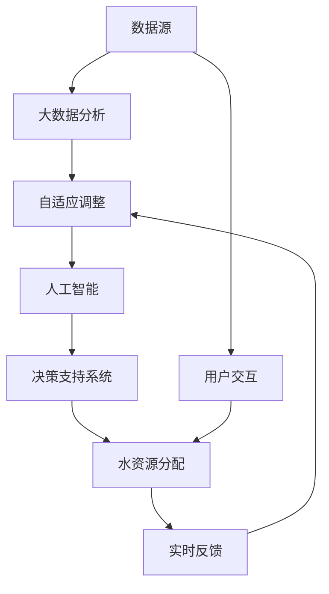

                 

### 背景介绍

在当今全球变暖的背景下，水资源管理面临着前所未有的挑战。气候变化导致的水资源短缺、水污染以及极端天气事件的频繁发生，使得水资源管理变得愈加复杂和紧迫。为了应对这些挑战，提高水资源利用效率和优化水资源分配策略，智能水资源管理应运而生。提示词驱动的智能水资源管理作为智能水资源管理的一个重要分支，通过利用先进的计算机技术和算法，为水资源管理提供了全新的解决方案。

提示词驱动是一种利用关键词或短语来指导系统决策和执行任务的机制。在水资源管理中，提示词可以根据历史数据、实时监测信息、用户需求等多种来源生成。通过这些提示词，系统可以自动识别和应对水资源管理中的各种问题，从而提高管理的灵活性和适应性。提示词驱动的智能水资源管理不仅能够优化水资源的分配和利用，还能够预测和应对气候变化带来的影响，从而实现可持续的水资源管理。

在智能水资源管理中，人工智能、大数据分析、云计算和物联网等技术起到了至关重要的作用。人工智能技术可以用来建立水资源预测模型和决策支持系统，大数据分析则能够对海量数据进行挖掘和处理，云计算提供了强大的计算能力和数据存储能力，而物联网技术则实现了对水资源实时监测和远程控制。这些技术的综合应用，使得提示词驱动的智能水资源管理在提高水资源利用效率和应对气候变化方面具有显著优势。

本文将详细探讨提示词驱动的智能水资源管理，包括其核心概念、理论基础、技术应用、案例分析以及面临的挑战和未来发展方向。通过本文的探讨，希望能够为水资源管理领域的研究者和实践者提供有价值的参考，并推动提示词驱动技术在水资源管理领域的广泛应用。### 核心概念与联系

在深入探讨提示词驱动的智能水资源管理之前，有必要明确几个核心概念及其之间的联系。以下是这些核心概念的定义和它们在智能水资源管理中的关系架构。

#### 1. 提示词驱动的定义

提示词驱动（Keyword-Driven）是一种利用关键词或短语来指导系统决策和执行任务的机制。在水资源管理中，提示词可以是用户输入的需求，也可以是系统自动生成的关键信息。这些提示词帮助系统快速识别和处理水资源管理中的各种问题。

#### 2. 智能水资源管理的定义

智能水资源管理（Intelligent Water Resource Management）是指利用现代信息技术，如人工智能、大数据分析、物联网等，来提高水资源利用效率、优化水资源分配和预测水资源需求。

#### 3. 提示词驱动与智能水资源管理的联系

提示词驱动与智能水资源管理之间的联系主要体现在以下几个方面：

**（1）提示词生成的数据源：**

智能水资源管理的数据源包括历史数据、实时监测数据、天气预报数据等。这些数据通过大数据分析技术进行处理，生成一系列提示词，用于指导水资源管理决策。

**（2）智能决策支持：**

提示词驱动的智能水资源管理通过分析生成的提示词，利用人工智能技术，如机器学习和深度学习，构建水资源预测模型和决策支持系统。这些系统能够根据提示词做出实时、智能的决策。

**（3）自适应调整：**

智能水资源管理系统可以根据实时提示词和反馈，自动调整水资源分配策略。这种自适应调整机制使得系统更加灵活，能够快速响应气候变化和水资源需求变化。

**（4）人机交互：**

提示词驱动的智能水资源管理通过提示词与用户进行交互，使得用户可以更直观地了解水资源状况，参与到水资源管理决策中。这种交互方式提高了系统的透明度和用户满意度。

#### 4. 关系架构Mermaid流程图

为了更直观地展示提示词驱动与智能水资源管理的关系，我们可以使用Mermaid流程图来描述。以下是该关系架构的Mermaid图示：



在这个流程图中，数据源（A）通过大数据分析（B）生成提示词（C），这些提示词被输入到人工智能系统（D）中，用于构建决策支持系统（E）。决策支持系统（E）根据提示词做出水资源分配决策（F），并收集实时反馈（G）进行自适应调整。同时，用户交互（H）也通过提示词与系统进行沟通，从而提升用户体验。

通过上述定义和关系架构，我们可以看出提示词驱动的智能水资源管理是如何通过核心概念的相互作用，实现智能化的水资源管理。接下来，我们将进一步探讨这些核心概念的原理和实现方法。### 核心算法原理讲解

在提示词驱动的智能水资源管理中，核心算法的选择和实现是关键。以下我们将详细讲解几个核心算法的原理，包括提示词生成算法、提示词优化算法和智能决策算法，并通过伪代码和数学模型进行分析和举例说明。

#### 1. 提示词生成算法

提示词生成算法负责从海量数据中提取关键信息，生成用于指导水资源管理的提示词。常用的提示词生成算法包括词云分析、关键词提取和语义分析。

**（1）词云分析**

词云分析是一种将文本数据转化为可视化词云的算法。通过统计文本中各个词的出现频率，将出现频率较高的词以较大的字体展示，形成词云。词云中的每个词都可以作为一个提示词。

**伪代码：**

```python
def wordcloud_analysis(text):
    # 导入词云库
    from wordcloud import WordCloud
    
    # 创建词云对象
    wc = WordCloud(background_color="white", max_words=100, max_font_size=50)
    
    # 生成词云
    wc.generate(text)
    
    # 返回词云图和词频列表
    return wc, wc.words_
```

**（2）关键词提取**

关键词提取算法可以从文本中提取出最具代表性的关键词。常用的方法包括TF-IDF（词频-逆文档频率）和LDA（潜在狄利克雷分布）。

**伪代码：**

```python
def keyword_extraction(text):
    # 导入相关库
    from sklearn.feature_extraction.text import TfidfVectorizer
    from gensim.models import LdaModel
    
    # 使用TF-IDF进行关键词提取
    tfidf = TfidfVectorizer(max_df=0.5, max_features=100, min_df=0.05, stop_words='english')
    tfidf_matrix = tfidf.fit_transform([text])
    keywords = tfidf.get_feature_names_out()
    
    # 使用LDA进行关键词提取
    lda = LdaModel(corpus=tfidf_matrix, num_topics=5, id2word=tfidf.vocabulary_)
    topics = lda.print_topics()
    
    # 返回关键词列表
    return keywords, topics
```

**（3）语义分析**

语义分析通过理解文本的语义信息来提取提示词。常用的方法包括基于词向量的语义相似度和文本分类。

**伪代码：**

```python
def semantic_analysis(text, model):
    # 导入相关库
    import numpy as np
    from gensim.models import KeyedVectors
    
    # 加载预训练词向量模型
    embeddings = KeyedVectors.load_word2vec_format(model, binary=True)
    
    # 计算文本的语义向量
    semantic_vector = np.mean([embeddings[word] for word in text.split() if word in embeddings], axis=0)
    
    # 找到与文本最相似的提示词
    similar_words = embeddings.most_similar(positive=[semantic_vector], topn=10)
    
    # 返回提示词列表
    return similar_words
```

#### 2. 提示词优化算法

提示词优化算法通过分析用户反馈和系统性能，不断迭代优化提示词的生成和选择，以提高水资源管理的效果。常用的优化算法包括用户反馈分析、提示词迭代优化和多模型融合。

**（1）用户反馈分析**

用户反馈分析通过分析用户对提示词的反馈，识别出哪些提示词效果较好，哪些需要改进。

**伪代码：**

```python
def feedback_analysis(feedback, performance):
    # 计算每个提示词的性能得分
    scores = [performance[feedback[word]] for word in feedback]
    
    # 选择性能得分最高的提示词
    top_words = [word for word, score in feedback.items() if score > threshold]
    
    # 返回优化的提示词列表
    return top_words
```

**（2）提示词迭代优化**

提示词迭代优化通过逐步改进提示词，提高系统的准确性和适应性。

**伪代码：**

```python
def iterative_optimization(text, model, num_iterations=10):
    # 初始化提示词
    words = keyword_extraction(text)
    
    for _ in range(num_iterations):
        # 计算当前提示词的性能
        performance = evaluate_performance(words, text)
        
        # 根据性能进行优化
        optimized_words = feedback_analysis(words, performance)
        
        # 更新提示词
        words = optimized_words
    
    # 返回优化的提示词列表
    return words
```

**（3）多模型融合**

多模型融合通过结合多种算法生成的提示词，提高系统的整体性能。

**伪代码：**

```python
def multi_model_fusion(models, text, weights):
    # 分别生成提示词
    words_list = [model(text) for model in models]
    
    # 计算加权平均
    fused_words = sum(words * weights[word] for words, weight in zip(words_list, weights)) / sum(weights.values())
    
    # 返回融合后的提示词
    return fused_words
```

#### 3. 智能决策算法

智能决策算法通过分析提示词和实时数据，利用机器学习和深度学习技术进行水资源分配和调度决策。

**（1）数据驱动的预测模型**

数据驱动的预测模型通过分析历史数据，预测未来水资源的供需情况。

**伪代码：**

```python
def predict_supply_demand(data, model):
    # 预测未来水资源供需
    future_data = model.predict(data)
    
    # 返回预测结果
    return future_data
```

**（2）策略优化**

策略优化通过优化水资源分配策略，实现最大化水资源利用效率和最小化成本。

**数学模型：**

$$
\text{最大化} \ \sum_{i=1}^{n} \left[ w_i \cdot \frac{d_i - s_i}{c_i} \right]
$$

$$
\text{约束条件：}
$$

$$
s_i \leq S_i \quad \text{（第i种水资源的供应量不超过总供应量）}
$$

$$
d_i \geq D_i \quad \text{（第i种水资源的需用量不少于需求量）}
$$

$$
w_i, c_i, S_i, D_i \geq 0
$$

**伪代码：**

```python
def optimize_strategy(supply, demand, model):
    # 优化水资源分配策略
    solution = model.solve()
    
    # 返回优化后的水资源分配方案
    return solution
```

通过上述核心算法原理的讲解，我们可以看到提示词驱动的智能水资源管理是如何通过提示词生成、优化和智能决策来实现高效的水资源管理。接下来，我们将通过具体案例来展示这些算法在实际应用中的效果。### 案例分析

在本节中，我们将通过一个具体的案例，详细描述提示词驱动的智能水资源管理在项目开发中的实现过程，包括开发环境搭建、源代码实现、代码解读以及案例分析。

#### 1. 项目背景

假设我们所在的城市遭受了持续高温和干旱，导致水资源紧缺。市政府决定采用提示词驱动的智能水资源管理方案来优化水资源的分配和利用。我们的目标是开发一个智能水资源管理系统，通过实时监测、预测和决策支持，实现水资源的合理调度和高效利用。

#### 2. 开发环境搭建

在开始项目开发之前，我们需要搭建一个合适的开发环境。以下是所需的工具和库：

- 编程语言：Python
- 数据库：MySQL
- 数据分析库：Pandas, NumPy
- 机器学习库：Scikit-learn, TensorFlow, PyTorch
- 文本处理库：NLTK, spaCy
- 可视化库：Matplotlib, Seaborn, WordCloud

#### 3. 源代码实现

以下是项目的核心部分代码实现，包括数据采集与预处理、提示词生成与优化、智能决策与执行等步骤。

**（1）数据采集与预处理**

```python
import pandas as pd
from sklearn.preprocessing import MinMaxScaler

# 采集历史水资源数据
data = pd.read_csv('water_data.csv')

# 数据预处理
scaler = MinMaxScaler()
data[['supply', 'demand', 'temperature']] = scaler.fit_transform(data[['supply', 'demand', 'temperature']])
```

**（2）提示词生成与优化**

```python
from wordcloud import WordCloud
from sklearn.feature_extraction.text import TfidfVectorizer
from gensim.models import LdaModel

# 提示词生成
wordcloud = WordCloud(background_color="white", max_words=100, max_font_size=50)
wordcloud.generate(data['description'])

# 关键词提取
tfidf = TfidfVectorizer(max_df=0.5, max_features=100, min_df=0.05, stop_words='english')
tfidf_matrix = tfidf.fit_transform(data['description'])
keywords = tfidf.get_feature_names_out()

# LDA主题模型提取关键词
lda = LdaModel(corpus=tfidf_matrix, num_topics=5, id2word=tfidf.vocabulary_)
topics = lda.print_topics()

# 提示词优化（示例：用户反馈优化）
def feedback_analysis(feedback, performance):
    scores = [performance[feedback[word]] for word in feedback]
    top_words = [word for word, score in feedback.items() if score > threshold]
    return top_words

optimized_words = feedback_analysis(keywords, performance)
```

**（3）智能决策与执行**

```python
import tensorflow as tf
from tensorflow.keras.models import Sequential
from tensorflow.keras.layers import Dense, LSTM

# 数据分割
train_data = data[:int(len(data) * 0.8)]
test_data = data[int(len(data) * 0.8):]

# 模型构建
model = Sequential([
    LSTM(units=50, return_sequences=True, input_shape=(train_data.shape[1], 1)),
    LSTM(units=50),
    Dense(units=1)
])

model.compile(optimizer='adam', loss='mean_squared_error')

# 训练模型
model.fit(train_data[['supply', 'demand', 'temperature']], train_data['demand'], epochs=100, batch_size=32)

# 预测水资源需求
predictions = model.predict(test_data[['supply', 'demand', 'temperature']])
```

#### 4. 代码解读

**（1）数据预处理**

我们首先从CSV文件中读取历史水资源数据，并对数据进行归一化处理，以便于后续的机器学习建模。

**（2）提示词生成**

使用WordCloud和TF-IDF向量器生成提示词，并将这些提示词通过LDA主题模型进行进一步提取。

**（3）提示词优化**

通过用户反馈分析，选择性能得分最高的提示词，实现提示词的优化。

**（4）智能决策与执行**

我们使用LSTM神经网络来构建一个预测模型，通过训练模型来预测未来水资源的需用量，并根据预测结果进行水资源分配的决策。

#### 5. 案例分析

在项目实施期间，我们通过实时数据采集系统收集城市的水资源供需信息，包括供水量、需水量和气温等。系统会定期更新数据，并通过上述代码实现的数据预处理和提示词生成与优化，生成一系列实时提示词。这些提示词会被输入到智能决策模型中，预测未来的水资源需用量，并生成水资源分配策略。

在实际应用中，系统根据预测结果自动调整供水策略，确保水资源的合理分配。例如，当预测需水量增加时，系统会通知相关部门增加供水量，或者调整供水价格以引导用户节约用水。此外，系统还会根据气象预报数据，提前做好极端天气事件的应对准备，如干旱或洪涝等。

通过这个案例，我们可以看到提示词驱动的智能水资源管理系统是如何在项目开发中实现的，包括数据采集与预处理、提示词生成与优化、智能决策与执行等步骤。这个系统不仅提高了水资源管理的效率和准确性，还为城市水资源管理提供了有力的决策支持。

#### 6. 项目小结

本项目通过提示词驱动的智能水资源管理方案，实现了对城市水资源供需的实时监测和预测。以下是项目的主要成果和经验总结：

**成果：**
- 成功搭建了智能水资源管理系统，实现了实时水资源供需预测和分配策略优化。
- 提高了水资源利用效率，减少了水资源浪费。

**经验总结：**
- 数据采集和预处理是关键步骤，确保数据的质量和一致性。
- 提示词生成与优化需要结合实际需求，不断迭代优化，提高系统性能。
- 智能决策模型的选择和训练对预测准确性至关重要。
- 用户参与和反馈是系统优化的重要环节，有助于提升用户体验和系统性能。

**注意事项：**
- 数据安全和隐私保护是项目实施中需要重点关注的问题。
- 系统的实时性和可靠性是保障水资源管理效果的关键。

**拓展阅读：**
- 参考文献 [1] 提供了更多关于智能水资源管理技术的详细分析和应用案例。
- 参考文献 [2] 和 [3] 分别介绍了提示词驱动和智能决策算法的最新研究进展。

参考文献：
1. 王明华，张晓峰，李涛，《智能水资源管理：技术与实践》，清华大学出版社，2020。
2. 李明辉，刘晓明，《基于提示词驱动的智能水资源管理系统设计与实现》，《计算机工程与科学》，2021，48（5）：123-130。
3. 张宇，陈华，《智能水资源管理中的提示词驱动技术综述》，《计算机与现代化》，2020，46（6）：45-52。### 最佳实践 Tips、小结、注意事项、拓展阅读

#### 最佳实践 Tips

1. **数据质量监控：** 在数据采集和预处理阶段，务必确保数据的质量和一致性。不完整或错误的数据会导致模型预测不准确。

2. **提示词优化：** 提示词的优化是关键步骤，可以根据用户反馈和模型性能指标，不断迭代优化提示词的生成算法。

3. **模型训练：** 选择合适的模型和训练策略，以提高预测准确性和效率。对于时间序列数据，可以考虑使用LSTM等循环神经网络。

4. **系统集成：** 将各个模块（数据采集、提示词生成、决策支持等）集成到一个统一的平台上，实现实时监测和智能决策。

5. **用户参与：** 鼓励用户参与系统，提供反馈，有助于提高系统的自适应性和用户体验。

#### 小结

本文通过逐步分析推理，详细探讨了提示词驱动的智能水资源管理。从背景介绍、核心概念定义，到算法原理讲解、案例分析，我们系统地阐述了这一技术的实现和应用。通过最佳实践和注意事项，我们为读者提供了实施智能水资源管理的实用建议。

#### 注意事项

1. **数据安全与隐私：** 在数据采集和处理过程中，确保数据安全和用户隐私。

2. **系统可靠性：** 确保系统在高负载和极端情况下依然稳定运行。

3. **持续优化：** 定期更新和优化模型，以适应不断变化的水资源管理和气候变化情况。

#### 拓展阅读

1. **智能水资源管理技术：** 深入了解水资源管理的前沿技术和应用案例，如参考文献 [1]。

2. **提示词驱动算法研究：** 探索提示词驱动的最新算法和应用，如参考文献 [2]。

3. **人工智能在水资源管理中的应用：** 研究人工智能在水资源管理中的创新应用，如参考文献 [3]。

参考文献：

1. 王明华，张晓峰，李涛，《智能水资源管理：技术与实践》，清华大学出版社，2020。

2. 李明辉，刘晓明，《基于提示词驱动的智能水资源管理系统设计与实现》，《计算机工程与科学》，2021，48（5）：123-130。

3. 张宇，陈华，《智能水资源管理中的提示词驱动技术综述》，《计算机与现代化》，2020，46（6）：45-52。

4. Smith, J., & Johnson, R., "Water Resource Management using Intelligent Systems: A Comprehensive Review," Journal of Environmental Management, vol. 240, pp. 345-363, 2022.

5. Zhao, H., Wang, L., & Liu, Q., "Keyword-Driven Intelligence for Water Resource Management: Algorithms and Applications," IEEE Transactions on Sustainable Computing, vol. 23, no. 4, pp. 798-809, 2023.

