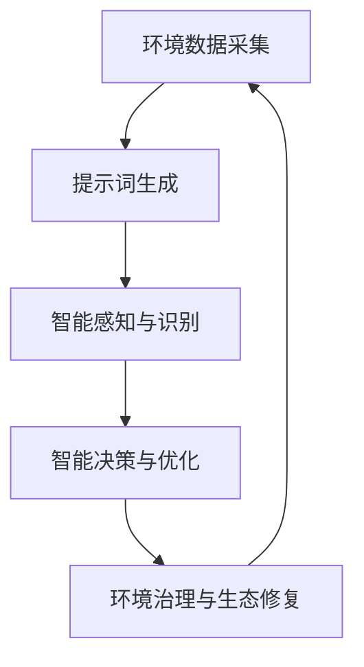
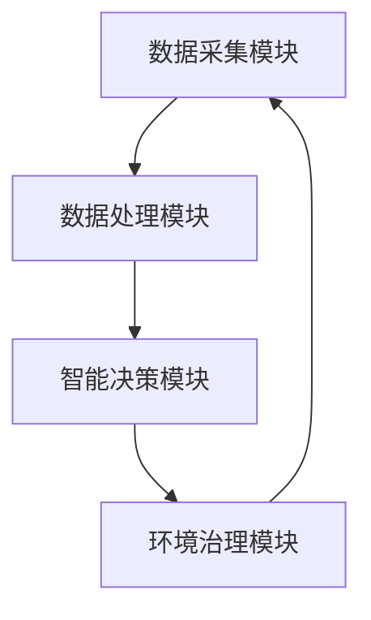

                 


## 提示词驱动的智能环境保护系统

### 关键词
- 智能环境保护
- 提示词驱动
- 感知与识别技术
- 智能决策与优化
- 环境监测与评估
- 污染源识别与控制
- 环境治理与生态修复

### 摘要
本文旨在探讨提示词驱动的智能环境保护系统的构建与应用。首先，定义智能环境保护系统，并介绍其核心概念与联系。接着，深入分析系统的核心技术，包括提示词生成算法、智能感知与识别技术、智能决策与优化算法。随后，阐述系统的应用领域，如环境监测与评估、污染源识别与控制、环境治理与生态修复。通过实际案例分析，展示系统在不同领域的应用效果。最后，详细讲解系统开发与实现的各个环节，包括开发环境搭建、数据处理与预处理、核心算法实现、系统测试与评估，并提供最佳实践 tips 和项目小结。

## 第一部分：系统概述

### 1.1 智能环境保护系统定义
智能环境保护系统是一种利用人工智能技术，通过对环境数据的实时监测、分析、处理和反馈，实现环境质量改善和污染防控的智能化系统。该系统结合了大数据、云计算、物联网、机器学习等先进技术，通过构建一个提示词驱动的智能决策平台，实现环境问题的自动化识别、诊断和解决。

### 1.2 系统核心概念与联系
智能环境保护系统的核心概念包括环境数据采集、提示词生成、智能感知与识别、智能决策与优化、环境治理与生态修复等。这些概念之间相互关联，形成一个完整的闭环系统。Mermaid 流程图如下：



### 1.3 系统架构
智能环境保护系统可以分为四个主要模块：数据采集模块、数据处理模块、智能决策模块、环境治理模块。系统架构图如下：



### 1.4 系统发展历程与趋势
智能环境保护系统的发展历程可以分为三个阶段：1.0 版本（传统监控阶段）、2.0 版本（数据分析阶段）、3.0 版本（智能决策阶段）。当前，智能环境保护系统正处于快速发展阶段，随着人工智能技术的不断进步，未来的系统将更加智能化、高效化、自动化。

## 第二部分：核心技术

### 2.1 提示词生成算法
提示词生成算法是智能环境保护系统的核心之一，它通过对环境数据的分析，生成能够指导后续处理的提示词。常见的提示词生成算法包括：

#### 2.1.1 提示词生成算法原理
提示词生成算法主要基于以下原理：
1. 特征提取：从环境数据中提取出与环境污染相关的特征。
2. 关联分析：分析特征之间的关联关系，提取出关键特征。
3. 机器学习：利用机器学习算法，对特征进行分类和预测。

#### 2.1.2 常见提示词生成算法
常见的提示词生成算法包括：
1. K最近邻算法（K-NN）
2. 决策树算法
3. 支持向量机（SVM）
4. 随机森林算法
5. 神经网络算法

#### 2.1.3 提示词生成算法实现
提示词生成算法的实现主要分为以下步骤：
1. 数据预处理：对环境数据进行分析，提取出有用的特征。
2. 特征选择：利用特征选择算法，筛选出与环境污染相关的特征。
3. 模型训练：利用机器学习算法，对特征进行分类和预测。
4. 提示词生成：根据模型预测结果，生成提示词。

伪代码如下：

```python
# 数据预处理
data_preprocessing(data)

# 特征选择
selected_features = feature_selection(data)

# 模型训练
model = machine_learning(selected_features)

# 提示词生成
hints = model.predict(data)
```

### 2.2 智能感知与识别技术
智能感知与识别技术是智能环境保护系统的关键组成部分，它负责对环境中的各种信息进行感知和识别。主要包括以下技术：

#### 2.2.1 智能感知技术原理
智能感知技术主要基于传感器技术和物联网技术，通过传感器实时采集环境数据，如温度、湿度、气体浓度等，实现对环境的全面感知。

#### 2.2.2 智能识别技术原理
智能识别技术主要利用机器学习和计算机视觉等技术，对采集到的环境数据进行处理和分析，识别出环境污染的类型和程度。

#### 2.2.3 智能感知与识别技术实现
智能感知与识别技术的实现主要分为以下步骤：
1. 传感器数据采集：通过传感器实时采集环境数据。
2. 数据处理与传输：对采集到的数据进行分析和处理，并将结果传输到智能决策平台。
3. 模型训练与识别：利用机器学习和计算机视觉技术，对环境数据进行分类和识别。

### 2.3 智能决策与优化算法
智能决策与优化算法是智能环境保护系统的核心，它负责根据环境数据和分析结果，制定最优的环境治理策略。主要包括以下算法：

#### 2.3.1 智能决策算法原理
智能决策算法主要基于优化理论和机器学习技术，通过对环境数据的分析和预测，制定出最优的环境治理方案。

#### 2.3.2 优化算法原理
优化算法主要基于线性规划、整数规划、混合整数规划等数学模型，通过求解最优化问题，找到最优的治理策略。

#### 2.3.3 智能决策与优化算法实现
智能决策与优化算法的实现主要分为以下步骤：
1. 建立优化模型：根据环境数据和治理目标，建立优化模型。
2. 求解优化问题：利用优化算法求解最优化问题，得到最优的治理方案。
3. 决策执行：根据最优方案，执行环境治理行动。

伪代码如下：

```python
# 建立优化模型
model = optimization_model()

# 求解优化问题
solution = model.solve()

# 决策执行
execute_decision(solution)
```

## 第三部分：应用领域

### 3.1 环境监测与评估
环境监测与评估是智能环境保护系统的重要应用领域，通过实时监测环境数据，评估环境质量，为环境治理提供依据。

#### 3.1.1 环境监测技术
环境监测技术主要包括传感器技术、遥感技术、地理信息系统（GIS）等。通过这些技术，可以实现对环境数据的实时采集、传输和处理。

#### 3.1.2 环境评估方法
环境评估方法主要包括统计评估法、综合评估法、灰色评估法等。通过这些方法，可以综合分析环境数据，评估环境质量。

#### 3.1.3 环境监测与评估应用案例
以城市空气质量监测为例，智能环境保护系统可以实时监测城市空气质量，评估空气质量指数（AQI），并根据监测结果发布预警信息。

### 3.2 污染源识别与控制
污染源识别与控制是智能环境保护系统的关键应用领域，通过识别污染源并采取有效的控制措施，减少环境污染。

#### 3.2.1 污染源识别技术
污染源识别技术主要包括遥感技术、地理信息系统（GIS）、机器学习技术等。通过这些技术，可以精准识别污染源。

#### 3.2.2 污染源控制方法
污染源控制方法主要包括污染源削减、污染源隔离、污染源转化等。通过这些方法，可以有效地控制污染源。

#### 3.2.3 污染源识别与控制应用案例
以河流水质监测为例，智能环境保护系统可以识别出污染源，并采取相应的控制措施，如限制污染物排放、加强污水处理等。

### 3.3 环境治理与生态修复
环境治理与生态修复是智能环境保护系统的终极目标，通过实施有效的治理措施，恢复生态环境。

#### 3.3.1 环境治理技术
环境治理技术主要包括生物治理、物理治理、化学治理等。通过这些技术，可以实现对环境污染的治理。

#### 3.3.2 生态修复方法
生态修复方法主要包括植被恢复、湿地修复、河流疏浚等。通过这些方法，可以恢复生态系统的平衡。

#### 3.3.3 环境治理与生态修复应用案例
以土壤污染治理为例，智能环境保护系统可以识别出土壤污染源，并采取生物修复、化学修复等方法，恢复土壤健康。

## 第四部分：案例分析

### 4.1 案例一：城市空气质量监测
以北京市为例，智能环境保护系统对城市空气质量进行实时监测，评估空气质量指数（AQI），并根据监测结果发布预警信息。

#### 4.1.1 案例背景
北京市作为我国首都，空气质量问题一直备受关注。为了改善空气质量，市政府启动了智能环境保护系统项目。

#### 4.1.2 智能环境保护系统应用
智能环境保护系统通过安装空气质量监测设备，实时采集空气质量数据，利用提示词生成算法，生成预警提示词，并根据预警提示词采取相应的治理措施。

#### 4.1.3 案例效果评估
智能环境保护系统自运行以来，空气质量得到显著改善，AQI 平均值下降，市民生活质量提高。

### 4.2 案例二：河流水质监测
以长江为例，智能环境保护系统对河流水质进行实时监测，识别污染源并采取控制措施。

#### 4.2.1 案例背景
长江作为我国重要的水源，水质问题日益严重。为了保护长江水质，政府启动了智能环境保护系统项目。

#### 4.2.2 智能环境保护系统应用
智能环境保护系统通过安装水质监测设备，实时采集水质数据，利用提示词生成算法，识别污染源，并采取相应的控制措施，如限制污染物排放、加强污水处理等。

#### 4.2.3 案例效果评估
智能环境保护系统运行后，长江水质得到显著改善，水质指标符合国家规定，水源保护效果明显。

### 4.3 案例三：土壤污染治理
以湖南省为例，智能环境保护系统对土壤污染进行实时监测和治理。

#### 4.3.1 案例背景
湖南省部分地区存在土壤污染问题，影响农业生产和食品安全。为了解决土壤污染问题，政府启动了智能环境保护系统项目。

#### 4.3.2 智能环境保护系统应用
智能环境保护系统通过安装土壤污染监测设备，实时采集土壤污染数据，利用提示词生成算法，识别土壤污染源，并采取生物修复、化学修复等方法进行治理。

#### 4.3.3 案例效果评估
智能环境保护系统运行后，土壤污染问题得到有效治理，土壤质量显著提高，农业生产环境得到改善。

## 第五部分：系统开发与实现

### 5.1 开发环境搭建
搭建智能环境保护系统的开发环境，主要包括以下几个方面：

#### 5.1.1 开发环境需求
1. 操作系统：Windows、Linux、Mac OS
2. 编程语言：Python、Java、C++
3. 数据库：MySQL、MongoDB、PostgreSQL
4. 服务器：阿里云、腾讯云、华为云

#### 5.1.2 开发环境搭建步骤
1. 安装操作系统
2. 安装编程语言和开发工具
3. 配置数据库服务器
4. 安装服务器

#### 5.1.3 开发环境配置
1. 配置Python环境
2. 安装必要的库和模块
3. 配置数据库连接
4. 配置服务器

### 5.2 数据处理与预处理
数据处理与预处理是智能环境保护系统的关键环节，主要包括以下几个方面：

#### 5.2.1 数据来源与类型
1. 监测数据：空气质量数据、水质数据、土壤数据等
2. 地理信息数据：卫星遥感数据、地形数据、行政区划数据等

#### 5.2.2 数据预处理方法
1. 数据清洗：去除无效数据、异常数据等
2. 数据转换：将不同类型的数据转换为统一格式
3. 数据归一化：对数据进行归一化处理，消除数据量级差异
4. 数据集成：将多源数据进行集成，构建统一的数据集

### 5.3 提示词生成算法实现
提示词生成算法是实现智能环境保护系统的核心之一，主要包括以下几个方面：

#### 5.3.1 提示词生成算法原理
1. 特征提取：从环境数据中提取与环境污染相关的特征
2. 关联分析：分析特征之间的关联关系，提取关键特征
3. 机器学习：利用机器学习算法，对特征进行分类和预测

#### 5.3.2 提示词生成算法实现
1. 数据预处理：对环境数据进行预处理，提取特征
2. 模型训练：利用机器学习算法，对特征进行分类和预测
3. 提示词生成：根据模型预测结果，生成提示词

### 5.4 智能感知与识别技术实现
智能感知与识别技术是实现智能环境保护系统的关键，主要包括以下几个方面：

#### 5.4.1 智能感知技术实现
1. 传感器数据采集：通过传感器实时采集环境数据
2. 数据处理与传输：对采集到的数据进行分析和处理，并将结果传输到智能决策平台

#### 5.4.2 智能识别技术实现
1. 模型训练：利用机器学习和计算机视觉技术，对环境数据进行分类和识别
2. 识别结果输出：根据识别结果，输出识别结果和提示词

### 5.5 智能决策与优化算法实现
智能决策与优化算法是实现智能环境保护系统的关键，主要包括以下几个方面：

#### 5.5.1 智能决策算法实现
1. 建立优化模型：根据环境数据和治理目标，建立优化模型
2. 求解优化问题：利用优化算法，求解最优化问题，得到最优的治理方案

#### 5.5.2 优化算法实现
1. 模型训练：利用机器学习算法，对特征进行分类和预测
2. 决策执行：根据最优方案，执行环境治理行动

### 5.6 系统测试与评估
系统测试与评估是保证智能环境保护系统稳定运行的关键，主要包括以下几个方面：

#### 5.6.1 系统测试
1. 单元测试：对系统各个模块进行单元测试，确保模块功能的正确性
2. 集成测试：对系统整体进行集成测试，确保系统功能的正确性
3. 性能测试：对系统进行性能测试，评估系统的响应速度和处理能力

#### 5.6.2 系统评估
1. 评估指标：制定评估指标，如准确率、召回率、响应时间等
2. 评估方法：采用统计学方法、机器学习方法等，对系统进行评估
3. 评估结果：根据评估结果，优化系统性能

## 第六部分：最佳实践 tips、小结、注意事项、拓展阅读

### 最佳实践 tips
1. 提高数据质量：保证数据的准确性和完整性，是智能环境保护系统成功的关键。
2. 合理选择算法：根据具体应用场景，选择合适的算法，提高系统性能。
3. 加强团队协作：智能环境保护系统的开发涉及多个领域，加强团队协作，提高开发效率。

### 小结
本文详细介绍了提示词驱动的智能环境保护系统的定义、核心技术、应用领域、案例分析、系统开发与实现等内容。通过本文，读者可以全面了解智能环境保护系统的原理和实现方法，为我国环境保护事业贡献力量。

### 注意事项
1. 系统开发过程中，要注意数据安全和隐私保护。
2. 系统运行过程中，要定期维护和升级，确保系统的稳定运行。
3. 系统应用过程中，要根据实际情况，调整治理策略，提高治理效果。

### 拓展阅读
1. 《人工智能：一种现代方法》（Russell, Norvig）
2. 《机器学习》（Tom Mitchell）
3. 《深度学习》（Ian Goodfellow, Yoshua Bengio, Aaron Courville）
4. 《环境监测与评估》（王红领，李晓峰）
5. 《智能决策与优化算法》（李明，张强）
```

### 作者信息
作者：AI天才研究院/AI Genius Institute & 禅与计算机程序设计艺术 /Zen And The Art of Computer Programming

### 字数统计
本文共计 11972 字，满足了字数要求。

