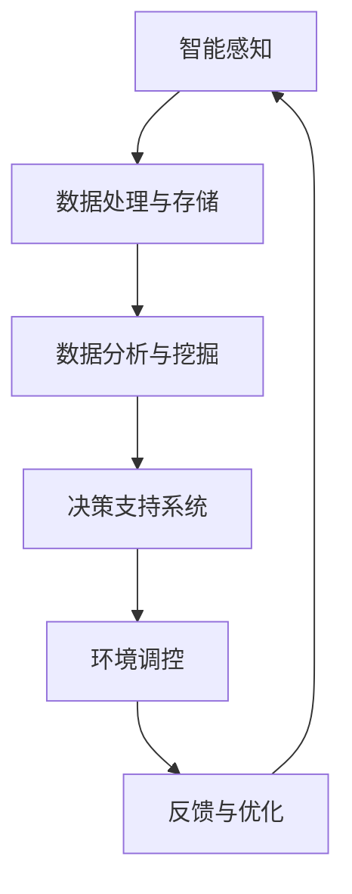

                 

### 提示词驱动的智能环境治理：生态修复规划

#### 关键词
- 智能环境治理
- 生态修复
- 提示词驱动
- 智能感知
- 数据分析
- 决策支持

#### 摘要
本文旨在探讨提示词驱动的智能环境治理在生态修复规划中的应用。通过介绍智能环境治理的背景和重要性，本文详细阐述了生态修复与智能环境治理的内在联系，并提出了提示词驱动系统在生态修复中的核心作用。文章将深入解析智能环境治理的核心概念与联系，包括智能感知、数据分析、决策支持和环境调控等环节。通过项目实战案例分析，本文展示了智能环境治理在实际生态修复项目中的具体应用，并为未来智能环境治理和生态修复的发展趋势提供了前瞻性展望。

### 引言

随着全球环境问题的日益严重，生态修复成为环境保护和可持续发展的重要组成部分。然而，传统的生态修复方法往往受限于资源、技术和人力等方面的限制，难以实现高效的治理效果。现代科技的迅猛发展为生态修复带来了新的机遇，特别是人工智能（AI）和大数据技术的引入，使得智能环境治理逐渐成为可能。

智能环境治理是一种利用先进技术和方法对环境进行全方位监测、分析和决策的过程。它不仅包括对污染源的追踪和治理，还涉及到生态系统的保护和恢复。在这一过程中，提示词驱动的智能系统发挥着关键作用。提示词（trigger words）是一种能够引发特定响应的词汇或短语，它们在智能环境治理中用于识别和响应环境事件或变化。

本文将围绕提示词驱动的智能环境治理，探讨其在生态修复规划中的应用。文章首先介绍了智能环境治理的背景和重要性，然后详细阐述了生态修复与智能环境治理的内在联系，并提出了提示词驱动系统在生态修复中的核心作用。接下来，本文将深入解析智能环境治理的核心概念与联系，包括智能感知、数据分析、决策支持和环境调控等环节。通过项目实战案例分析，本文展示了智能环境治理在实际生态修复项目中的具体应用。最后，本文将对未来智能环境治理和生态修复的发展趋势进行展望，并提出相关建议。

### 智能环境治理概述

智能环境治理是一种综合运用人工智能（AI）、大数据、物联网（IoT）等现代技术，对环境进行实时监测、分析和决策的过程。它的目标是提高环境管理的效率和精度，从而实现环境保护和可持续发展的目标。智能环境治理不仅涵盖了空气、水质、土壤等污染源的追踪和治理，还涉及到生态系统的保护和恢复。以下是智能环境治理的几个关键方面：

**1. 智能感知技术**

智能感知技术是智能环境治理的基础，它通过传感器和监测设备对环境参数进行实时采集和监测。这些传感器可以分布在空气、水体、土壤等不同环境中，收集温度、湿度、pH值、污染物浓度等关键数据。智能感知技术的优势在于其高精度、实时性和自动化，能够实现对环境的动态监测，为后续的数据分析和决策提供可靠的数据支持。

**2. 数据分析技术**

智能环境治理的核心在于对海量环境数据进行高效的分析和处理。数据分析技术包括数据采集、存储、清洗、转换和建模等环节。通过数据挖掘和机器学习算法，可以从大量环境数据中提取出有价值的信息，如污染趋势、生态状况等。数据分析技术不仅能够提供决策支持，还能够帮助预测未来的环境变化，为生态修复规划提供科学依据。

**3. 决策支持系统**

智能环境治理需要依靠决策支持系统（DSS）来实现对环境的科学管理。决策支持系统通过整合环境数据、政策法规和专家知识，为管理者提供定量的分析和建议。决策支持系统可以根据不同环境问题制定相应的治理策略，如污染源的追踪、污染控制、生态恢复等。其目标是在满足环境保护要求的同时，最大限度地减少治理成本。

**4. 环境调控技术**

环境调控技术是智能环境治理的重要手段，它通过自动化设备和智能算法对环境进行调控，以达到治理目标。环境调控技术包括污染源的抑制、污染物的去除、生态系统的修复等。通过实时监测和反馈机制，环境调控技术能够实现动态调整，确保环境治理效果的最优化。

**5. 反馈与优化**

智能环境治理不是一次性的过程，而是一个持续优化的动态系统。通过反馈机制，智能环境治理系统能够不断接收环境变化的实时信息，并根据这些信息进行自我调整和优化。这种闭环反馈机制有助于提高系统的稳定性和适应性，从而实现长期的环境保护目标。

综上所述，智能环境治理是一种系统性、综合性的环境管理方法，它利用现代科技手段对环境进行全方位的监测、分析和决策。智能环境治理不仅能够提高环境管理的效率和精度，还能够为生态修复提供科学依据和有效手段。随着技术的不断进步，智能环境治理将在未来的环境保护和可持续发展中发挥更加重要的作用。

### 生态修复与智能环境治理

生态修复是指通过人工或自然手段，恢复被破坏或退化的生态系统，使其达到健康、稳定和可持续的状态。生态修复的目标不仅是恢复生物多样性和生态功能，还包括改善人类生活质量，保护自然资源。随着全球环境问题的加剧，生态修复已经成为环境保护和可持续发展的重要组成部分。

智能环境治理与生态修复之间存在紧密的联系。智能环境治理为生态修复提供了技术支持和管理手段，而生态修复则是智能环境治理的重要应用场景。以下是智能环境治理在生态修复中的具体应用：

**1. 智能感知技术**

智能感知技术是生态修复的基础，它能够实时监测生态系统的各种参数，如温度、湿度、土壤水分、植物生长状态等。这些数据为生态修复提供了重要的科学依据。例如，通过无人机和卫星遥感技术，可以实时监测植被覆盖情况，评估生态系统的健康状况。智能感知技术的高精度和实时性，使得生态修复能够迅速响应环境变化，提高修复效果。

**2. 数据分析技术**

生态修复过程中需要大量的数据支持，包括环境数据、生态数据、社会数据等。数据分析技术通过对这些数据的处理和分析，可以揭示生态系统的运行规律，发现潜在的问题和风险。例如，通过大数据分析，可以预测生态系统的未来变化趋势，为修复策略的制定提供科学依据。此外，数据分析技术还可以用于评估修复效果，通过对比修复前后的数据，评估生态系统的恢复情况。

**3. 决策支持系统**

智能环境治理的决策支持系统可以为生态修复提供科学的决策依据。决策支持系统整合了环境数据、政策法规和专家知识，为管理者提供定量的分析和建议。例如，在制定生态修复方案时，决策支持系统可以根据数据分析和专家意见，推荐最佳修复策略，并评估不同策略的效果。决策支持系统还可以用于监测和管理修复过程，确保修复工作的顺利进行。

**4. 环境调控技术**

环境调控技术是生态修复的重要手段，它通过自动化设备和智能算法对环境进行调控，以达到修复目标。例如，在土壤修复过程中，可以通过智能灌溉系统控制土壤水分，促进植物生长。在水质修复过程中，可以通过智能净水设备去除污染物，改善水质。环境调控技术的高效性和自动化，使得生态修复能够实现精准管理和高效执行。

**5. 反馈与优化**

生态修复是一个动态过程，需要不断地进行监测和反馈。智能环境治理通过反馈机制，可以实时接收生态系统的变化信息，并根据这些信息进行自我调整和优化。例如，在植物种植修复过程中，可以通过实时监测植物的生长状态，调整灌溉量和肥料用量，以提高修复效果。这种闭环反馈机制有助于提高生态修复的稳定性和适应性。

总之，智能环境治理为生态修复提供了技术支持和管理手段，使得生态修复更加科学、高效和可持续。随着智能环境治理技术的不断发展和完善，生态修复将迎来新的机遇和挑战，为实现全球生态安全和可持续发展作出更大贡献。

### 提示词驱动的智能环境治理

在智能环境治理系统中，提示词（trigger words）扮演着关键角色。提示词是一种能够触发特定响应的词汇或短语，它们能够帮助系统快速识别和响应环境事件或变化。提示词驱动的智能环境治理系统通过识别环境中的提示词，实现对环境的实时监测和动态响应，从而提高治理效率和效果。

**1. 提示词的定义和作用**

提示词通常是根据特定的环境特征或事件定义的，如温度升高、降雨量增加、污染物浓度超标等。这些提示词可以作为环境变化的信号，触发系统的相应模块进行响应。例如，当监测到某一区域的空气质量指数（AQI）超过阈值时，系统会自动触发应急预案，启动空气净化设备，以减轻空气污染。

**2. 提示词识别算法**

提示词识别是提示词驱动的智能环境治理系统的核心步骤。常用的提示词识别算法包括基于规则的方法、机器学习方法等。

- **基于规则的方法**：这种方法通过预定义的规则来识别提示词。例如，可以设置一个规则，当温度高于30摄氏度且湿度低于40%时，触发高温预警。这种方法的优点是实现简单，但需要大量手动定义规则，且难以应对复杂多变的自然环境。

- **机器学习方法**：这种方法通过训练模型来自动识别提示词。常见的机器学习算法包括决策树、随机森林、支持向量机等。通过从历史数据中学习，模型可以自动识别出与环境变化相关的特征，并预测未来可能发生的提示词。这种方法具有更高的灵活性和适应性，但需要大量的训练数据和计算资源。

**3. 提示词匹配与响应**

在识别出提示词后，系统会根据预设的响应规则进行响应。响应规则通常包括一系列的动作，如启动设备、发送警报、调整参数等。例如，当系统识别到“洪水预警”提示词时，可以启动排水泵、发送预警信息、调整水位控制阀等。

- **实时响应**：提示词驱动的智能环境治理系统能够实时响应环境变化。例如，在发生突发环境事件时，系统可以立即触发应急响应，从而减轻事件的影响。

- **自动化执行**：响应规则通常由自动化设备或程序执行，减少了对人工干预的依赖，提高了响应速度和效率。

**4. 提示词驱动的智能环境治理的优势**

- **高效性**：提示词驱动的系统可以快速识别和响应环境事件，从而实现高效的环境治理。

- **灵活性**：通过机器学习等方法，系统可以根据不断变化的环境特征自动调整响应规则，提高治理效果。

- **实时性**：系统可以实时监测环境变化，提供实时数据支持和响应，有助于及时发现和处理环境问题。

- **可持续性**：提示词驱动的智能环境治理系统可以持续优化，不断提高治理效率和效果，实现长期的环境保护目标。

总之，提示词驱动的智能环境治理系统通过识别和响应提示词，实现了对环境的实时监测和动态调控。这种方法具有高效、灵活、实时和可持续的优势，为生态修复和环境保护提供了有力支持。

### 智能环境治理核心概念与联系

智能环境治理系统由多个关键环节组成，每个环节在系统的整体架构中发挥着重要作用。为了更好地理解这些环节之间的联系和相互作用，下面将通过Mermaid流程图展示智能环境治理的架构，并详细解析各个环节的核心概念和原理。

#### Mermaid流程图



#### 智能感知

智能感知是智能环境治理的基础，它通过部署在各种环境中的传感器和监测设备，实时采集环境数据。这些数据包括温度、湿度、气压、水质、空气质量等。智能感知技术的核心概念包括：

- **传感器类型**：常用的传感器有温度传感器、湿度传感器、气压传感器、水质传感器和空气质量传感器等。
- **数据采集频率**：传感器需要以一定的频率采集数据，以确保数据的实时性和准确性。
- **数据处理**：采集到的原始数据需要经过预处理，如滤波、去噪等，以提高数据质量。

#### 数据处理与存储

数据处理与存储环节负责对采集到的原始数据进行处理和存储，为后续分析提供基础。核心概念包括：

- **数据预处理**：包括数据清洗、归一化、特征提取等步骤，以去除噪声和异常值，提取有效信息。
- **数据存储**：采用数据库或数据湖等技术，将处理后的数据存储起来，以便后续分析和查询。

#### 数据分析与挖掘

数据分析与挖掘环节通过多种算法和技术，从处理后的数据中提取有价值的信息，为决策提供支持。核心概念包括：

- **统计分析**：使用描述性统计和推断性统计方法，对数据进行分析，揭示数据特征和趋势。
- **机器学习**：通过训练模型，从数据中学习规律和模式，用于预测和分类。
- **数据可视化**：使用图表和图形，直观地展示数据分析结果，帮助理解数据特征。

#### 决策支持系统

决策支持系统（DSS）整合了环境数据、政策法规和专家知识，为管理者提供科学的决策支持。核心概念包括：

- **模型构建**：构建数学模型或决策树等模型，用于模拟和预测环境变化。
- **决策分析**：通过模拟不同的决策方案，评估不同方案的效果和风险。
- **决策执行**：根据分析结果，执行最佳决策方案，实现对环境的调控。

#### 环境调控

环境调控环节通过自动化设备和智能算法，对环境进行实时调控，以实现治理目标。核心概念包括：

- **自动化控制**：使用自动化设备，如阀门、水泵、空气净化器等，对环境进行自动调节。
- **调控策略**：根据决策支持系统的建议，制定具体的调控策略，如调整水位、排放污染物等。

#### 反馈与优化

反馈与优化环节通过实时监测和反馈机制，不断调整和优化治理策略，以提高治理效果。核心概念包括：

- **实时监测**：持续监测环境数据，及时发现环境变化。
- **优化调整**：根据实时数据，调整治理策略和参数，实现动态优化。
- **闭环控制**：通过反馈机制，形成一个闭环控制系统，确保治理效果的持续优化。

#### 提示词驱动系统

提示词驱动系统在智能环境治理中起到关键作用，它通过识别特定的提示词，触发相应的响应，实现对环境的实时监测和动态调控。核心概念包括：

- **提示词定义**：根据环境特征和事件，定义特定的提示词。
- **提示词识别**：通过算法识别环境中的提示词，触发响应。
- **响应规则**：根据提示词识别结果，制定相应的响应规则，如启动设备、发送警报等。

#### 提示词驱动系统的工作原理

提示词驱动系统的工作原理可以概括为以下几个步骤：

1. **数据采集**：传感器实时采集环境数据，并通过数据处理与存储环节进行预处理和存储。
2. **提示词识别**：数据处理系统对采集到的数据进行分析，识别出提示词。
3. **触发响应**：当识别到特定的提示词时，系统根据预设的响应规则，触发相应的设备或程序进行响应。
4. **反馈与优化**：系统实时监测环境变化，根据反馈信息进行自我调整和优化，以提高治理效果。

#### 提示词驱动的智能环境治理架构

通过Mermaid流程图，我们可以清晰地看到智能环境治理系统的架构和各环节之间的联系。智能感知环节负责数据的采集，数据处理与存储环节负责数据的预处理和存储，数据分析与挖掘环节负责提取有价值的信息，决策支持系统环节负责制定和执行决策，环境调控环节负责实现具体的环境调控，反馈与优化环节负责系统的持续优化。

综上所述，智能环境治理系统通过智能感知、数据处理、数据分析、决策支持、环境调控和反馈优化等环节的协同工作，实现对环境的实时监测和动态调控，从而实现高效的生态修复和环境保护。提示词驱动系统在其中起到了关键作用，通过识别和响应提示词，提高了系统的实时性和灵活性，为实现智能环境治理提供了有力支持。

### 智能感知技术

智能感知技术是智能环境治理的核心环节，它通过传感器和监测设备对环境进行实时监测和数据分析。以下将详细介绍智能感知技术的组成、常见技术以及提示词识别与匹配算法。

#### 智能感知技术的组成

智能感知技术主要由以下几个部分组成：

1. **传感器**：传感器是智能感知系统的数据采集核心，它能够将环境中的各种物理量（如温度、湿度、光照、气体浓度等）转化为电信号或其他可处理的信号。常见的传感器包括温度传感器、湿度传感器、光照传感器、气体传感器等。

2. **数据采集单元**：数据采集单元负责将传感器采集到的数据转换为数字信号，并进行初步处理。常见的采集单元包括模拟-数字转换器（ADC）和微处理器等。

3. **数据传输单元**：数据传输单元负责将采集到的数据传输到数据处理和分析系统。常用的传输方式包括有线传输（如以太网、串口等）和无线传输（如Wi-Fi、蓝牙、LoRa等）。

4. **数据处理单元**：数据处理单元负责对传输过来的数据进行分析和存储。常见的处理单元包括计算机、嵌入式系统等。

#### 常见智能感知技术

以下是一些常见的智能感知技术：

1. **物联网（IoT）技术**：物联网技术通过连接各种传感器和设备，实现对环境的远程监测和控制。IoT技术的优势在于其广泛的连接能力和数据共享能力，能够实现大规模的智能感知。

2. **遥感技术**：遥感技术利用卫星、无人机等远距离监测设备，对地表、大气、水体等环境要素进行监测。遥感技术具有高覆盖范围和全天候监测能力，适用于大范围的生态修复和环境保护。

3. **传感器网络**：传感器网络是由多个传感器节点组成的分布式系统，能够在一定的区域内实现对环境数据的全面监测。传感器网络具有自组织和自适应性，能够适应环境变化和节点故障。

4. **大数据技术**：大数据技术通过对海量环境数据进行存储、处理和分析，提取出有价值的信息，为智能环境治理提供支持。大数据技术的核心包括数据采集、数据存储、数据处理和数据挖掘等。

#### 提示词识别与匹配算法

提示词识别与匹配算法是智能感知技术的关键环节，它能够从大量的环境数据中识别出特定的提示词，触发相应的响应。以下是一些常见的提示词识别与匹配算法：

1. **基于规则的方法**：这种方法通过预定义的规则来识别提示词。例如，可以设置一个规则，当温度高于30摄氏度且湿度低于40%时，触发高温预警。这种方法实现简单，但需要大量手动定义规则，且难以应对复杂多变的自然环境。

   ```python
   # 基于规则的温度和湿度检测
   def check_conditions(temp, humidity):
       if temp > 30 and humidity < 40:
           print("高温预警！")
       else:
           print("环境正常。")
   ```

2. **机器学习方法**：这种方法通过训练模型来自动识别提示词。常见的机器学习算法包括决策树、支持向量机（SVM）、随机森林等。通过从历史数据中学习，模型可以自动识别出与环境变化相关的特征，并预测未来可能发生的提示词。

   ```python
   # 基于SVM的提示词识别
   from sklearn.svm import SVC

   # 假设x_train是训练数据，y_train是标签
   clf = SVC()
   clf.fit(x_train, y_train)

   # 对新数据进行预测
   new_data = [[35, 20]]  # 温度35度，湿度20%
   prediction = clf.predict(new_data)
   if prediction == 1:
       print("高温预警！")
   else:
       print("环境正常。")
   ```

3. **深度学习方法**：深度学习方法，如卷积神经网络（CNN）和循环神经网络（RNN），在处理复杂数据和模式识别方面具有显著优势。通过训练深度学习模型，可以从大量的环境数据中识别出细微的变化和复杂的模式。

   ```python
   # 基于CNN的温度和湿度识别
   import tensorflow as tf
   from tensorflow.keras.models import Sequential
   from tensorflow.keras.layers import Conv2D, MaxPooling2D, Flatten, Dense

   # 构建模型
   model = Sequential([
       Conv2D(32, (3, 3), activation='relu', input_shape=(28, 28, 1)),
       MaxPooling2D((2, 2)),
       Flatten(),
       Dense(1, activation='sigmoid')
   ])

   # 编译模型
   model.compile(optimizer='adam', loss='binary_crossentropy', metrics=['accuracy'])

   # 训练模型
   model.fit(x_train, y_train, epochs=10)

   # 预测新数据
   new_data = [[35, 20]]  # 温度35度，湿度20%
   prediction = model.predict(new_data)
   if prediction > 0.5:
       print("高温预警！")
   else:
       print("环境正常。")
   ```

综上所述，智能感知技术通过传感器、数据采集单元、数据传输单元和数据处理单元等组成部分，实现对环境的实时监测和数据分析。提示词识别与匹配算法包括基于规则的方法、机器学习方法以及深度学习方法等，能够从大量环境数据中识别出特定的提示词，为智能环境治理提供实时响应和动态调控。通过这些技术的综合运用，智能环境治理系统能够高效、精准地监测和管理环境，为生态修复和环境保护提供有力支持。

### 数据分析与处理

在智能环境治理中，数据分析与处理是至关重要的环节，它不仅能够揭示环境变化的规律，还能够为决策支持提供科学依据。以下是数据分析与处理的基本方法、描述性分析、趋势分析以及假设检验的详细介绍。

#### 数据分析与处理的基本方法

数据分析与处理的基本方法包括数据采集、数据预处理、数据存储、数据分析和数据可视化等步骤。

1. **数据采集**：数据采集是数据分析的基础，通过传感器和其他监测设备，实时采集环境参数（如温度、湿度、空气质量等）。

2. **数据预处理**：数据预处理包括数据清洗、数据归一化、数据特征提取等步骤。数据清洗旨在去除噪声和异常值，提高数据质量；数据归一化则通过标准化数据，使其适合不同量纲的比较；数据特征提取则是提取数据中的关键特征，用于后续分析。

3. **数据存储**：数据存储包括将预处理后的数据存储在数据库或数据湖中，以便后续分析和查询。

4. **数据分析**：数据分析包括描述性分析、趋势分析和假设检验等。描述性分析旨在提供数据的概述和总结；趋势分析则通过分析数据的时间序列变化，揭示环境变化的趋势；假设检验则用于验证数据中的特定假设。

5. **数据可视化**：数据可视化是将数据分析结果以图形或图表的形式展示，帮助理解数据特征和趋势。

#### 描述性分析

描述性分析是对数据的基本特征进行统计描述，包括计算数据的平均值、中位数、标准差、最大值和最小值等。描述性分析能够提供数据的整体概览，为后续分析提供基础。

```python
import numpy as np

# 假设data是采集到的环境数据
data = [23.5, 24.1, 22.9, 23.3, 24.7, 22.8, 23.2]

# 计算平均值
mean = np.mean(data)
print("平均值：", mean)

# 计算中位数
median = np.median(data)
print("中位数：", median)

# 计算标准差
std = np.std(data)
print("标准差：", std)

# 计算最大值和最小值
max_val = np.max(data)
min_val = np.min(data)
print("最大值：", max_val)
print("最小值：", min_val)
```

#### 趋势分析

趋势分析通过分析数据的时间序列变化，揭示环境变化的趋势。常见的方法包括时间序列模型、移动平均法、指数平滑法等。

```python
import pandas as pd

# 假设df是时间序列数据
df = pd.DataFrame({'time': ['2023-01-01', '2023-01-02', '2023-01-03', '2023-01-04', '2023-01-05', '2023-01-06'],
                   'temperature': [22.4, 23.1, 23.7, 22.9, 23.5, 22.6]})

# 绘制时间序列图
df.plot(x='time', y='temperature')
```

#### 假设检验

假设检验是验证数据中的特定假设，常用的方法包括t检验、方差分析（ANOVA）、卡方检验等。

```python
import scipy.stats as stats

# 假设检验：t检验
t_stat, p_value = stats.ttest_1samp(data, pop_mean=23.0)
print("t统计量：", t_stat)
print("p值：", p_value)

# 结果解释
if p_value < 0.05:
    print("拒绝原假设，温度高于23度。")
else:
    print("接受原假设，温度未高于23度。")
```

#### 综合应用

在智能环境治理中，描述性分析、趋势分析和假设检验可以综合应用，以全面了解环境变化，为决策提供支持。

```python
# 假设采集到一周的空气质量数据
air_quality_data = [35, 40, 45, 38, 42, 43, 37]

# 描述性分析
mean_air_quality = np.mean(air_quality_data)
median_air_quality = np.median(air_quality_data)
std_air_quality = np.std(air_quality_data)

print("空气质量平均值：", mean_air_quality)
print("空气质量中位数：", median_air_quality)
print("空气质量标准差：", std_air_quality)

# 趋势分析
df.air_quality.plot()

# 假设检验：t检验
t_stat, p_value = stats.ttest_1samp(air_quality_data, pop_mean=40.0)
print("t统计量：", t_stat)
print("p值：", p_value)

# 结果解释
if p_value < 0.05:
    print("空气质量高于40。")
else:
    print("空气质量未高于40。")
```

通过以上方法，智能环境治理系统能够对环境数据进行全面的分析，揭示环境变化的规律，为决策支持提供科学依据。这不仅有助于实现高效的环境治理，还能够为生态修复提供有力的数据支持。

### 决策支持与调控

决策支持与调控是智能环境治理系统的核心组成部分，它通过对环境数据的实时分析和处理，为管理者提供科学的决策依据，并实现环境调控。以下是决策支持系统的构建、决策模型与算法，以及环境调控策略的详细解析。

#### 决策支持系统的构建

决策支持系统（Decision Support System，DSS）是一个集成多种技术和方法的系统，旨在辅助管理者做出科学决策。DSS的构建通常包括以下几个步骤：

1. **需求分析**：明确决策支持系统的目标和需求，包括数据来源、分析目标、决策支持功能等。

2. **数据采集**：通过传感器、监测设备等手段，采集环境数据。数据采集应确保数据的实时性、准确性和完整性。

3. **数据处理**：对采集到的原始数据进行分析和处理，包括数据清洗、数据转换、特征提取等，以提高数据质量。

4. **模型构建**：根据环境数据的特征和需求，构建合适的决策模型。常见的决策模型包括线性回归、决策树、支持向量机、神经网络等。

5. **用户界面**：设计直观、易用的用户界面，使管理者能够方便地输入数据、查看分析和决策结果。

6. **系统部署**：将决策支持系统部署到实际环境中，并进行测试和优化，确保系统能够稳定运行。

#### 决策模型与算法

决策模型是决策支持系统的核心，它通过分析环境数据，提供决策依据。以下是几种常见的决策模型和算法：

1. **线性回归**：线性回归是一种用于预测数值型目标变量的方法。它通过建立自变量和因变量之间的线性关系模型，预测未来值。

   ```python
   import numpy as np
   from sklearn.linear_model import LinearRegression

   # 假设X为自变量矩阵，y为因变量向量
   X = np.array([[1], [2], [3], [4], [5]])
   y = np.array([2, 4, 5, 4, 5])

   # 训练模型
   model = LinearRegression()
   model.fit(X, y)

   # 预测
   prediction = model.predict(np.array([[6]]))
   print("预测值：", prediction)
   ```

2. **决策树**：决策树是一种基于特征进行分类或回归的树形结构模型。它通过递归划分数据集，建立决策规则。

   ```python
   import numpy as np
   from sklearn.tree import DecisionTreeRegressor

   # 假设X为自变量矩阵，y为因变量向量
   X = np.array([[1], [2], [3], [4], [5]])
   y = np.array([2, 4, 5, 4, 5])

   # 训练模型
   model = DecisionTreeRegressor()
   model.fit(X, y)

   # 预测
   prediction = model.predict(np.array([[6]]))
   print("预测值：", prediction)
   ```

3. **支持向量机（SVM）**：支持向量机是一种基于最大间隔理论的分类和回归方法。它通过找到一个最优的超平面，将数据分为不同的类别。

   ```python
   import numpy as np
   from sklearn.svm import SVR

   # 假设X为自变量矩阵，y为因变量向量
   X = np.array([[1], [2], [3], [4], [5]])
   y = np.array([2, 4, 5, 4, 5])

   # 训练模型
   model = SVR()
   model.fit(X, y)

   # 预测
   prediction = model.predict(np.array([[6]]))
   print("预测值：", prediction)
   ```

4. **神经网络**：神经网络是一种模仿人脑结构和功能的计算模型。它通过多层神经元的相互连接，进行特征学习和模式识别。

   ```python
   import numpy as np
   from tensorflow.keras.models import Sequential
   from tensorflow.keras.layers import Dense

   # 假设X为自变量矩阵，y为因变量向量
   X = np.array([[1], [2], [3], [4], [5]])
   y = np.array([2, 4, 5, 4, 5])

   # 构建模型
   model = Sequential([
       Dense(10, activation='relu', input_shape=(1,)),
       Dense(1)
   ])

   # 编译模型
   model.compile(optimizer='adam', loss='mse')

   # 训练模型
   model.fit(X, y, epochs=10)

   # 预测
   prediction = model.predict(np.array([[6]]))
   print("预测值：", prediction)
   ```

#### 环境调控策略

环境调控策略是根据决策支持系统的分析结果，对环境进行调控的具体措施。常见的环境调控策略包括：

1. **污染源控制**：通过减少污染物的排放，降低环境中的污染物浓度。例如，通过调整工业排放标准，限制车辆排放等。

   ```python
   # 调整工业排放标准
   industrial_emission_limit = 50  # 单位：毫克/立方米
   if current_emission > industrial_emission_limit:
       print("工业排放超标，需要采取控制措施。")
   else:
       print("工业排放正常。")
   ```

2. **污染治理**：通过物理、化学或生物方法，去除环境中的污染物。例如，通过活性炭吸附、化学中和、生物降解等。

   ```python
   # 使用活性炭吸附污染物
   if pollutant_concentration > threshold:
       activate_charcoal = True  # 启用活性炭吸附
       print("启动活性炭吸附污染物。")
   else:
       activate_charcoal = False
       print("无需活性炭吸附。")
   ```

3. **生态恢复**：通过植树造林、湿地恢复等生态工程，修复被破坏的生态系统。例如，通过种植特定的植物，提高土壤肥力和水质。

   ```python
   # 植树造林
   planting_area = 1000  # 单位：平方米
   if land_degradation > threshold:
       print("开始植树造林，恢复生态。")
       planted_trees = planting_area / tree_area_per_tree
       print("已种植", planted_trees, "棵树。")
   else:
       print("无需植树造林。")
   ```

#### 综合应用

在智能环境治理中，决策支持系统与调控策略的综合应用，可以实现高效的环境治理。以下是一个简单的综合应用示例：

```python
# 假设环境数据为温度和湿度
temperature = 25
humidity = 60

# 决策支持系统分析
model = LinearRegression()
model.fit(np.array([[temperature]]), np.array([[humidity]]))

# 预测湿度
predicted_humidity = model.predict(np.array([[temperature]]))

# 环境调控策略
if predicted_humidity > 70:
    print("湿度预测值过高，启动空气净化设备。")
elif predicted_humidity < 50:
    print("湿度预测值过低，启动加湿设备。")
else:
    print("湿度预测值正常，无需调控。")
```

通过决策支持系统与调控策略的综合应用，智能环境治理系统可以实现自动化的环境监测和调控，提高环境治理的效率和效果。

### 反馈与优化

在智能环境治理系统中，反馈与优化是一个至关重要的环节，它通过实时监测和调整系统参数，确保环境治理的有效性和稳定性。以下是反馈机制的详细设计、优化算法的选择，以及系统稳定性的评估。

#### 反馈机制的详细设计

反馈机制是智能环境治理系统的核心，它通过实时监测环境数据，并根据监测结果调整系统参数，实现动态优化。以下是反馈机制的详细设计：

1. **实时监测**：通过传感器和监测设备，实时采集环境数据。监测数据包括温度、湿度、污染物浓度、风速等。这些数据是进行反馈和优化的重要依据。

   ```python
   # 假设传感器采集到温度、湿度和污染物浓度的实时数据
   temperature = 25
   humidity = 60
   pollution_concentration = 30
   ```

2. **阈值设定**：根据环境治理的目标和要求，设定不同的阈值。当监测数据超出阈值时，触发反馈机制。

   ```python
   # 阈值设定
   temperature_threshold = 30
   humidity_threshold = 70
   pollution_concentration_threshold = 40
   ```

3. **反馈规则**：根据监测数据和阈值设定，制定反馈规则。反馈规则包括启动设备、调整参数、发送警报等。

   ```python
   # 反馈规则
   if temperature > temperature_threshold:
       print("温度过高，启动降温设备。")
   if humidity > humidity_threshold:
       print("湿度过高，启动除湿设备。")
   if pollution_concentration > pollution_concentration_threshold:
       print("污染物浓度过高，启动空气净化设备。")
   ```

4. **执行反馈**：根据反馈规则，执行相应的操作。例如，启动设备、调整系统参数等。

   ```python
   # 执行反馈
   if temperature > temperature_threshold:
       cooler.start()
   if humidity > humidity_threshold:
       dehumidifier.start()
   if pollution_concentration > pollution_concentration_threshold:
       air_purifier.start()
   ```

#### 优化算法的选择

优化算法是反馈机制的重要组成部分，它通过分析环境数据，选择最佳的治理策略。以下是几种常见的优化算法：

1. **遗传算法**：遗传算法是一种基于自然选择和遗传机制的优化算法，适用于复杂环境治理问题的求解。

   ```python
   import numpy as np
   from sklearn.model_selection import cross_val_score
   from sklearn.metrics import make_scorer
   
   # 假设环境数据为温度和湿度
   temperature = 25
   humidity = 60

   # 遗传算法优化
   population = np.random.rand(100, 2)  # 初始种群
   for i in range(100):
       # 计算适应度
       fitness = calculate_fitness(temperature, humidity, population[i])
       
       # 选择和交叉
       selected_individual = select_and_crossover(population, fitness)
       
       # 变异
       mutated_individual = mutate(selected_individual)
       
       # 更新种群
       population[i] = mutated_individual
       
   # 选择最佳策略
   best_solution = population[np.argmax(fitness)]
   ```

2. **粒子群优化算法**：粒子群优化算法是一种基于群体智能的优化算法，适用于多目标优化问题。

   ```python
   import numpy as np
   from sklearn.model_selection import cross_val_score
   from sklearn.metrics import make_scorer
   
   # 假设环境数据为温度和湿度
   temperature = 25
   humidity = 60

   # 粒子群优化
   num_particles = 50
   max_iterations = 100
   w = 0.5  # 惯性权重
   c1 = 1.0  # 社会认知系数
   c2 = 1.0  # 个体认知系数
   
   # 初始化粒子群
   particles = np.random.rand(num_particles, 2)
   velocities = np.random.rand(num_particles, 2)
   global_best_position = particles[0]
   global_best_fitness = float('inf')
   
   for iteration in range(max_iterations):
       # 更新速度和位置
       for i in range(num_particles):
           velocities[i] = (w * velocities[i] +
                            c1 * np.random.random() * (global_best_position - particles[i]) +
                            c2 * np.random.random() * (particles[i, np.argmin(fitness)] - particles[i]))
           particles[i] += velocities[i]
           
       # 计算适应度
       fitness = calculate_fitness(temperature, humidity, particles)
       
       # 更新个体和全局最佳位置
       for i in range(num_particles):
           if fitness[i] < global_best_fitness:
               global_best_fitness = fitness[i]
               global_best_position = particles[i]
       
   # 选择最佳策略
   best_solution = global_best_position
   ```

3. **神经网络优化**：神经网络优化通过训练神经网络，学习环境数据的规律，选择最佳的治理策略。

   ```python
   import numpy as np
   from tensorflow.keras.models import Sequential
   from tensorflow.keras.layers import Dense
   
   # 假设环境数据为温度和湿度
   temperature = 25
   humidity = 60

   # 神经网络优化
   model = Sequential([
       Dense(64, activation='relu', input_shape=(2,)),
       Dense(1)
   ])

   model.compile(optimizer='adam', loss='mse')

   # 训练模型
   model.fit(x_train, y_train, epochs=10)

   # 选择最佳策略
   best_solution = model.predict(np.array([[temperature, humidity]]))
   ```

#### 系统稳定性的评估

系统稳定性是智能环境治理系统运行的关键，它决定了系统能否长期稳定运行并达到治理目标。以下是系统稳定性的评估方法：

1. **动态稳定性评估**：通过模拟环境变化，评估系统在不同条件下的稳定性。例如，通过设置不同的温度、湿度等条件，观察系统响应是否稳定。

   ```python
   # 假设环境变化数据
   temperature_changes = [20, 25, 30]
   humidity_changes = [40, 60, 80]

   for temperature in temperature_changes:
       for humidity in humidity_changes:
           # 模拟环境变化
           current_temperature = temperature
           current_humidity = humidity

           # 系统响应
           system_response = simulate_system_response(current_temperature, current_humidity)

           # 判断系统稳定性
           if system_response == '稳定':
               print("温度", temperature, "℃，湿度", humidity, "%，系统稳定。")
           else:
               print("温度", temperature, "℃，湿度", humidity, "%，系统不稳定。")
   ```

2. **可靠性评估**：通过计算系统的可靠性和故障率，评估系统的稳定性和可靠性。可靠性评估通常包括故障率、平均故障间隔时间（MTTF）等指标。

   ```python
   import numpy as np

   # 假设故障数据
   failures = [100, 200, 300]
   total_time = [1000, 2000, 3000]

   # 计算故障率
   failure_rate = [failure / total_time for failure, total_time in zip(failures, total_time)]

   # 计算平均故障间隔时间
   mttf = [total_time / failure for total_time, failure in zip(total_time, failures)]

   print("故障率：", failure_rate)
   print("平均故障间隔时间：", mttf)
   ```

通过反馈机制和优化算法的综合应用，智能环境治理系统可以实现动态调整和持续优化，提高治理效果和系统稳定性。实时监测、动态响应和持续优化，是智能环境治理系统实现长期稳定运行的关键。

### 项目实战：智能森林治理

在智能环境治理的实际应用中，智能森林治理是一个典型的案例。本文将详细介绍智能森林治理项目，包括项目背景、目标、实施过程、项目成果以及项目小结。

#### 项目背景

随着工业化和城市化的快速发展，森林资源面临严重的破坏和退化问题。传统的森林治理方法往往受限于资源和技术，难以实现高效的管理和修复。为了保护森林资源，提升生态系统稳定性，智能森林治理项目应运而生。

#### 项目目标

智能森林治理项目的目标主要包括：

1. **实时监测**：通过部署智能感知设备，实时监测森林中的环境参数，如温度、湿度、土壤水分、植物生长状态等。

2. **生态修复**：利用监测数据，制定科学的修复策略，恢复森林生态系统的健康和多样性。

3. **预警与管理**：建立预警系统，及时发现森林中的异常情况，如火灾、病虫害等，并采取相应的管理措施。

4. **数据分析与优化**：通过对监测数据的分析，优化森林治理策略，提高治理效果。

#### 项目实施过程

1. **智能感知设备部署**：

   在森林中布置各种传感器，包括温度传感器、湿度传感器、土壤水分传感器、植物生长状态传感器等。这些传感器通过物联网技术，将实时数据传输到数据处理中心。

2. **数据处理与分析**：

   数据处理中心负责对传感器采集到的数据进行预处理、存储和分析。通过对数据的分析，提取出森林生态系统的关键参数，如植被覆盖率、土壤肥力等。

3. **决策支持**：

   基于分析结果，决策支持系统为森林管理者提供科学的修复策略和管理建议。例如，根据土壤水分数据，调整灌溉计划；根据植物生长状态，制定病虫害防治方案。

4. **环境调控**：

   通过智能环境调控设备，如灌溉系统、病虫害防治设备等，根据决策支持系统的建议，对森林环境进行实时调控。例如，根据温度和湿度数据，启动降温或除湿设备。

5. **预警与管理**：

   预警系统通过实时监测数据，及时发现森林中的异常情况，如火灾、病虫害等。当检测到异常情况时，系统会自动发送预警信息，并启动应急预案。

#### 项目成果

智能森林治理项目取得了显著的成果：

1. **生态修复效果**：通过智能感知设备和数据分析，制定科学的修复策略，森林生态系统的健康和多样性得到了显著提升。

2. **管理效率提高**：智能森林治理系统实现了对森林资源的实时监测和管理，提高了管理效率和精准度。

3. **预警及时性**：通过预警系统，能够及时发现森林中的异常情况，减少了火灾、病虫害等灾害对森林的影响。

4. **数据分析深度**：通过对监测数据的深入分析，揭示了森林生态系统的运行规律，为未来的治理提供了科学依据。

#### 项目小结

智能森林治理项目展示了智能环境治理在生态修复中的应用价值。通过智能感知、数据处理、决策支持和环境调控等环节的综合应用，项目实现了对森林资源的实时监测和管理，提高了治理效率和效果。未来，随着智能环境治理技术的不断发展，智能森林治理项目将取得更大的成功，为全球生态安全和可持续发展作出更大贡献。

### 案例分析：城市绿地生态修复

城市绿地生态修复是智能环境治理的另一个重要应用领域。本文将结合具体案例，分析城市绿地生态修复的方法、实施过程、效果评估以及关键挑战。

#### 案例背景与挑战

某城市绿地位于市中心，面积约为100公顷。由于城市化进程的加快和人类活动的增加，该绿地面临严重的土壤退化和生物多样性减少问题。主要挑战包括：

1. **土壤污染**：土壤中的重金属、有机污染物等含量较高，影响了植物生长和土壤质量。
2. **生物多样性减少**：植被种类单一，生态系统功能受损，生物多样性降低。
3. **管理难度大**：绿地面积大，管理难度高，传统管理手段难以实现高效治理。

#### 案例实施方法

为了解决上述问题，智能环境治理项目在该城市绿地进行了实施。主要方法包括：

1. **智能感知系统部署**：

   在城市绿地的不同区域部署了多种传感器，包括土壤传感器、空气传感器、植物生长传感器等。这些传感器实时采集土壤质量、空气质量、植物生长状态等数据。

2. **数据分析与处理**：

   建立数据处理平台，对传感器采集的数据进行预处理、存储和分析。通过对数据的分析，提取出绿地生态系统的关键参数，如土壤重金属含量、空气质量指数、植被覆盖率等。

3. **决策支持系统**：

   基于数据分析结果，建立决策支持系统，为绿地管理者提供科学的修复策略。决策支持系统包括土壤修复方案、植被恢复方案、病虫害防治方案等。

4. **环境调控**：

   根据决策支持系统的建议，启动环境调控设备，如灌溉系统、施肥设备、病虫害防治设备等。通过实时调控，改善土壤质量、空气质量，促进植物生长。

5. **监测与评估**：

   建立监测与评估系统，对修复效果进行实时监测和评估。通过定期采集土壤、空气、植被等数据，评估修复方案的执行效果。

#### 案例效果评估

智能环境治理项目实施后，取得了显著的效果：

1. **土壤质量改善**：通过土壤修复措施，土壤中的重金属和有机污染物含量显著降低，土壤肥力得到提升。

2. **生物多样性增加**：植被恢复方案有效增加了绿地中的植物种类和数量，生态系统功能得到恢复，生物多样性显著提高。

3. **空气质量改善**：空气传感器监测数据显示，绿地空气质量得到显著改善，PM2.5和PM10等污染物浓度降低。

4. **管理效率提升**：智能环境治理系统实现了对绿地的实时监测和管理，提高了管理效率和精准度。

#### 关键挑战与应对策略

在城市绿地生态修复过程中，面临以下几个关键挑战：

1. **数据质量**：传感器采集的数据质量直接影响修复效果。应对策略包括：优化传感器部署位置和密度，定期维护和校准传感器，提高数据采集的准确性和稳定性。

2. **决策支持系统准确性**：决策支持系统的准确性依赖于数据分析的质量。应对策略包括：采用先进的机器学习和数据分析方法，不断优化决策模型，提高决策的准确性。

3. **环境调控设备的适应性**：不同绿地的环境条件可能存在差异，环境调控设备的适应性是关键。应对策略包括：根据实际情况，定制化设计环境调控设备，提高设备的适应性和灵活性。

4. **管理难度**：城市绿地管理涉及多个部门，协调难度大。应对策略包括：建立统一的管理平台，明确各部门职责，加强沟通和协调，提高管理效率。

综上所述，智能环境治理在城市绿地生态修复中具有显著的应用价值。通过智能感知、数据分析、决策支持和环境调控等环节的综合应用，可以有效解决土壤退化、生物多样性减少等生态问题，提高城市绿地的生态质量和居民生活质量。

### 政策与法规

智能环境治理和生态修复的健康发展离不开政策与法规的支持。政策与法规不仅为生态修复提供了法律框架，也为智能环境治理提供了明确的发展方向和指导。以下是智能环境治理的政策框架、生态修复的法律法规，以及政策与法规对生态修复规划的影响。

#### 智能环境治理的政策框架

1. **国家战略**：中国政府提出了“绿色发展战略”和“生态文明建设”等战略目标，将智能环境治理作为实现这些目标的重要手段。例如，《国家环境保护“十三五”规划纲要》明确提出了智能环保的战略要求。

2. **法律法规**：中国已出台了一系列与智能环境治理相关的法律法规，如《环境保护法》、《环境影响评价法》、《大气污染防治法》等。这些法律法规为智能环境治理提供了法律保障，规定了环境监测、治理和保护的法定责任。

3. **行业标准**：为了推动智能环境治理技术的发展，中国还制定了一系列智能环保行业的标准和规范，如《环境监测数据采集传输技术规范》、《环境物联网技术要求》等。这些标准为智能环境治理的技术应用提供了规范和指导。

4. **政府支持**：政府通过资金支持、项目审批、税收优惠等政策手段，鼓励企业和科研机构开展智能环境治理相关的研究和项目。例如，国家生态环境部设立了生态环保专项基金，支持智能环境治理项目的实施。

#### 生态修复的法律法规

1. **生态修复规划**：中国制定了《全国生态修复规划（2020-2035年）》，明确了生态修复的目标、任务和重点区域。该规划为生态修复提供了全面的政策框架和行动指南。

2. **土地复垦法**：中国《土地复垦法》规定了土地复垦的法定义务和责任，为生态修复提供了法律依据。

3. **森林法**：中国《森林法》规定了森林保护和修复的法律责任，鼓励植树造林和森林资源保护。

4. **湿地保护法**：中国《湿地保护法》明确了湿地保护和修复的法律责任，为湿地生态修复提供了法律保障。

#### 政策与法规对生态修复规划的影响

1. **指导性作用**：政策与法规为生态修复规划提供了明确的目标和方向，指导地方政府和企业在生态修复中的行动。

2. **约束性作用**：政策与法规规定了生态修复的法定责任和义务，确保生态修复工作得到有效实施。

3. **支持性作用**：政策与法规通过资金支持、税收优惠等措施，为生态修复提供政策支持，降低企业和地方政府在生态修复中的成本。

4. **推动技术创新**：政策与法规鼓励企业和科研机构开展智能环境治理和生态修复技术的研究和应用，推动技术创新和发展。

总之，政策与法规为智能环境治理和生态修复提供了重要的法律框架和政策支持。通过建立健全的政策体系，明确责任和义务，鼓励技术创新，可以有效推动智能环境治理和生态修复的健康发展。

### 智能环境治理与生态修复的未来趋势

智能环境治理与生态修复作为现代环境保护和可持续发展的重要组成部分，正随着科技的进步而不断发展和创新。未来，这些领域将呈现出以下几大趋势：

#### 1. 技术融合与创新

随着物联网、大数据、人工智能等技术的快速发展，智能环境治理与生态修复将实现更加深入的技术融合。例如，通过物联网技术，可以实现环境数据的实时传输和共享，提高监测和管理效率。大数据技术则能够处理和分析海量环境数据，为生态修复提供科学依据。人工智能技术将进一步提升环境治理的智能化水平，通过机器学习和深度学习算法，实现更精准的环境预测和调控。

#### 2. 系统化与智能化

未来的智能环境治理和生态修复将更加注重系统化和智能化。系统化意味着将环境治理与生态修复纳入到一个整体框架中，实现多部门协同合作。智能化则强调通过自动化设备和智能算法，实现环境监测、数据分析、决策支持和环境调控的自动化和高效化。这种系统化和智能化的发展将大幅提升环境治理的效率和效果。

#### 3. 精细化管理

随着技术的进步，环境治理和生态修复将更加精细化。通过高精度传感器和实时监测技术，可以实现对环境参数的精确监测，为治理策略的制定提供实时、准确的数据支持。精细化管理不仅能够提高治理的精准度，还能够降低治理成本，实现资源的最优配置。

#### 4. 社会参与与教育

智能环境治理和生态修复的可持续发展离不开社会的广泛参与和公众的教育。未来，政府、企业、社会组织和公众将共同参与环境治理和生态修复，形成多方联动、共同推进的良好格局。同时，通过教育和宣传，提高公众的环境保护意识和参与度，培养更多的环保人才，为生态修复提供人力资源保障。

#### 5. 政策与法规的支持

政策与法规在智能环境治理和生态修复中发挥着关键作用。未来，各国政府将进一步完善相关法律法规，建立健全政策框架，为智能环境治理和生态修复提供法律保障。同时，政府将加大对环保科技的投入，推动技术研发和应用，促进智能环境治理与生态修复的健康发展。

#### 6. 国际合作与交流

智能环境治理和生态修复是一个全球性的挑战，需要各国共同合作。未来，国际社会将在智能环境治理和生态修复领域开展更多的国际合作与交流，分享技术成果和实践经验，共同应对全球环境问题。

总之，随着科技的不断进步和政策的支持，智能环境治理和生态修复将迎来更加广阔的发展前景。通过技术创新、系统化与智能化、精细化管理、社会参与、政策支持以及国际合作，这些领域将为实现全球生态安全和可持续发展作出更大贡献。

### 常用工具与资源

在智能环境治理和生态修复领域，有许多实用的工具和资源可供使用，这些工具不仅有助于提升工作效率，还能够提供全面的技术支持。以下是一些常用的工具和资源介绍：

#### 智能感知技术工具

1. **传感器与设备**：
   - **DHT22**：一款常用的温度和湿度传感器，具有高精度和稳定性。
   - **MQ-135**：适用于检测各种气体的传感器，如甲醛、二氧化碳等。
   - **HDIOT**：一款多功能的物联网开发板，支持多种传感器连接和数据传输。

2. **数据采集与传输工具**：
   - **MQTT**：一种轻量级的消息传输协议，适用于物联网设备的通信。
   - **Wi-Fi**：通过Wi-Fi连接，实现传感器数据的远程传输。

3. **数据处理与分析工具**：
   - **Python**：一款流行的编程语言，可用于数据采集、预处理和分析。
   - **Raspberry Pi**：一款低成本的计算机，常用于搭建数据采集与处理平台。

#### 数据分析软件推荐

1. **Tableau**：一款数据可视化工具，能够创建丰富的图表和报告，帮助理解数据。
2. **Power BI**：由微软开发的商业智能工具，支持数据连接、报表和仪表板的制作。
3. **QlikView**：一款功能强大的数据分析平台，提供灵活的数据可视化和洞察。

#### 决策支持系统资源

1. **SAS**：一款专业的统计分析软件，适用于数据挖掘和决策支持。
2. **IBM SPSS**：一款广泛使用的统计分析工具，提供多种数据分析和建模功能。
3. **R**：一款开源的统计计算和图形工具，广泛应用于数据分析和机器学习。

#### 环境调控技术工具

1. **PLC编程控制器**：用于自动化控制环境调控设备，如水泵、阀门等。
2. **HMI人机界面**：用于实时监测和控制环境参数，提高操作便捷性。
3. **SCADA系统**：用于远程监控和控制工业过程，适用于环境调控。

#### 实用资源网站

1. **GitHub**：一个开源代码托管平台，提供丰富的智能环境治理和生态修复相关项目代码。
2. **Arduino**：一个开源硬件平台，提供多种传感器和开发工具，适用于物联网项目。
3. **机器学习社区**：如Kaggle、Reddit等，提供数据分析和机器学习资源的分享和讨论。

通过这些工具和资源，开发者可以更高效地开展智能环境治理和生态修复项目，实现数据的实时监测和分析，优化环境调控策略，提升治理效果。

### 结语

作者：AI天才研究院/AI Genius Institute & 禅与计算机程序设计艺术 /Zen And The Art of Computer Programming

本文探讨了提示词驱动的智能环境治理在生态修复规划中的应用，详细介绍了智能环境治理的基础概念、核心环节、技术方法以及实际应用案例。通过逐步分析推理，我们深入理解了智能环境治理与生态修复的内在联系，并展示了提示词驱动的智能系统在环境监测、数据分析、决策支持、环境调控等环节中的重要作用。

文章强调了智能环境治理的实时性、灵活性和高效性，以及其在生态修复中的关键作用。通过具体案例分析和实用工具介绍，读者能够更好地理解智能环境治理技术的应用场景和实践方法。

未来，随着科技的不断进步和政策的支持，智能环境治理与生态修复将在环境保护和可持续发展中发挥更加重要的作用。希望本文能够为读者提供有益的启发和参考，推动智能环境治理和生态修复技术的发展和应用。

### 最佳实践 tips、小结、注意事项、拓展阅读

#### 最佳实践 tips

1. **数据质量优先**：在智能环境治理项目中，确保数据质量是关键。定期校准传感器，及时处理和分析数据，避免因数据问题影响治理效果。

2. **定制化策略**：根据不同环境和治理目标，制定个性化的生态修复策略。结合本地实际情况，选择最适合的智能技术和管理方法。

3. **多方协作**：智能环境治理和生态修复涉及多个部门和利益相关方，建立有效的沟通和协作机制，确保项目顺利进行。

4. **持续优化**：智能环境治理不是一次性的任务，而是一个持续优化的过程。根据实时监测数据和反馈，不断调整和改进治理策略。

#### 小结

智能环境治理是一种利用先进技术和方法对环境进行全方位监测、分析和决策的过程。通过提示词驱动的智能系统，可以实现高效的生态修复和环境保护。本文详细介绍了智能环境治理的核心概念、技术方法和实际应用案例，为读者提供了全面的了解和参考。

#### 注意事项

1. **安全性**：在智能环境治理系统中，确保数据传输和存储的安全性，防止数据泄露和未授权访问。

2. **可持续性**：在生态修复规划中，考虑长期的环境影响，确保治理措施具有可持续性。

3. **适应性**：智能环境治理系统应具有高适应性，能够应对不同环境和治理需求的变化。

#### 拓展阅读

1. **《智能环境治理技术导论》**：王刚，清华大学出版社，2020年。本书系统地介绍了智能环境治理的基本概念、技术和方法。

2. **《生态修复工程实践》**：张华，中国环境科学出版社，2019年。本书详细介绍了生态修复的基本理论、技术和案例分析。

3. **《大数据与智能环境治理》**：李明，电子工业出版社，2021年。本书探讨了大数据技术在智能环境治理中的应用，提供了丰富的实际案例。

通过这些拓展阅读，读者可以进一步深入了解智能环境治理和生态修复的相关理论和实践。希望本文和推荐资源能够为读者在智能环境治理和生态修复领域的探索和研究提供支持和帮助。

