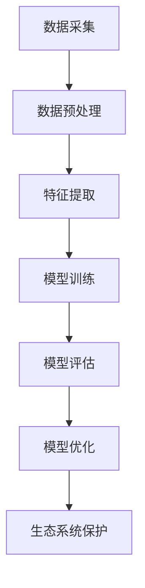
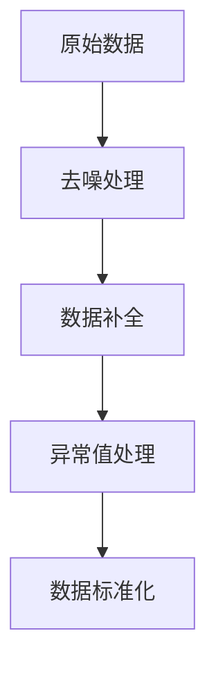
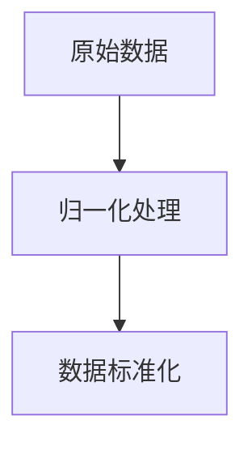
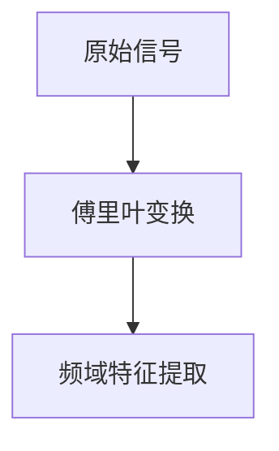
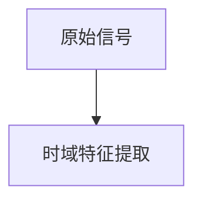
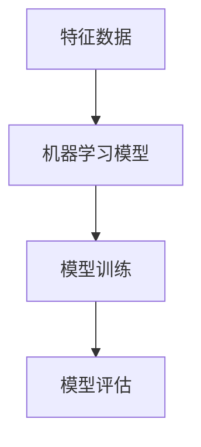
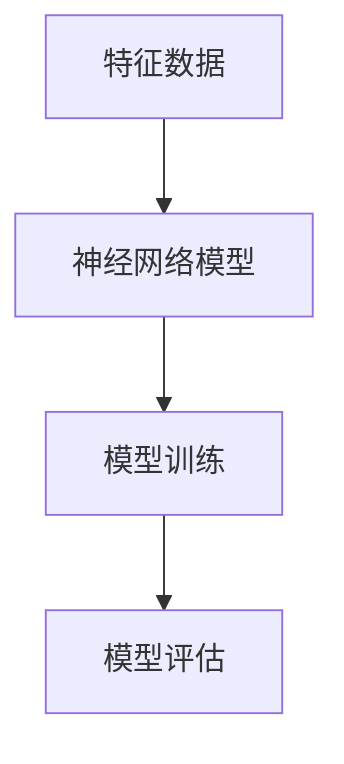
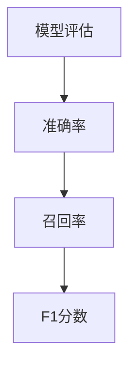
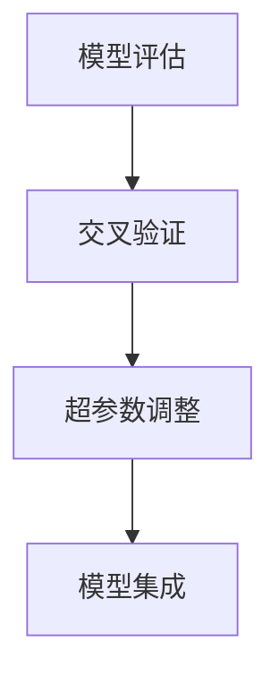

                 


### 文章标题：提示词驱动的智能环境监测：生态系统保护

#### 关键词：提示词驱动，智能环境监测，生态系统保护，传感器技术，数据处理与分析，模型评估与优化，深度学习，算法原理，项目实战，未来发展趋势

#### 摘要：
本文深入探讨了提示词驱动的智能环境监测在生态系统保护中的应用。首先，介绍了生态系统保护的重要性以及智能环境监测的发展历程和原理。接着，分析了提示词驱动的智能环境监测在生态系统保护中的关键技术和核心概念联系。随后，详细讲解了核心算法原理和数学模型，并通过实际项目实战展示了系统搭建、代码实现和效果分析。最后，展望了该领域的未来发展趋势和挑战。

---

## 第一部分：引论

### 1.1 研究背景

#### 1.1.1 生态系统保护的重要性
生态系统是地球上所有生物共同生活的环境，它为人类提供了食物、水源、氧气等重要资源。然而，随着人类活动的加剧，生态系统面临着严重的威胁，如气候变化、污染、生物多样性减少等。因此，生态系统保护已成为全球关注的焦点。

#### 1.1.2 智能环境监测的发展历程
智能环境监测是指利用传感器技术、数据处理与分析技术、模型评估与优化技术等，对环境进行实时监测和数据分析。自20世纪80年代以来，智能环境监测技术得到了快速发展，从简单的传感器监测到复杂的智能系统，为生态系统保护提供了强有力的技术支持。

#### 1.1.3 提示词驱动的智能环境监测的概念
提示词驱动是指利用特定关键词或短语，引导计算机对监测数据进行处理和分析。在智能环境监测中，提示词可用于识别特定环境现象或问题，提高监测效率和准确性。

### 1.2 研究目标与内容结构

#### 1.2.1 研究目标
本文旨在探讨提示词驱动的智能环境监测在生态系统保护中的应用，提高环境监测的准确性和效率，为生态系统保护提供技术支持。

#### 1.2.2 内容结构概述
本文分为六个部分：第一部分引论，第二部分核心概念与联系，第三部分核心算法原理讲解，第四部分数学模型与公式讲解，第五部分项目实战，第六部分未来发展。结构清晰，层次分明，便于读者理解。

### 1.3 本书的主要贡献

#### 1.3.1 理论贡献
本文系统地阐述了提示词驱动的智能环境监测原理，为该领域的研究提供了理论支持。

#### 1.3.2 实践意义
本文通过实际项目展示了提示词驱动的智能环境监测在生态系统保护中的应用，有助于推动该技术的实际应用。

---

## 第二部分：核心概念与联系

### 2.1 提示词驱动的智能环境监测原理

#### 2.1.1 提示词的基本概念
提示词是一段具有特定含义的文字，用于引导计算机执行特定任务。在智能环境监测中，提示词可帮助系统识别和解析监测数据。

#### 2.1.2 提示词在智能环境监测中的应用
提示词可应用于数据预处理、特征提取、模型训练等环节，提高监测效率和准确性。

#### 2.1.3 提示词驱动的智能环境监测架构
提示词驱动的智能环境监测架构包括传感器、数据采集与预处理、特征提取、模型训练、模型评估与优化等模块。

### 2.2 生态系统保护中的关键技术

#### 2.2.1 传感器技术
传感器是智能环境监测的核心部件，用于采集环境数据。本文介绍了不同类型的传感器及其在生态系统保护中的应用。

#### 2.2.2 数据处理与分析技术
数据处理与分析技术包括数据清洗、归一化、特征提取等，用于提高监测数据的准确性和可用性。

#### 2.2.3 模型评估与优化技术
模型评估与优化技术用于评估模型性能，并对其进行优化，以提高监测准确性。

### 2.3 生态系统保护中的核心概念联系

#### 2.3.1 提示词驱动与生态系统保护的关系
提示词驱动技术可提高智能环境监测的效率，为生态系统保护提供有力支持。

#### 2.3.2 智能环境监测与生态系统保护的数据流
智能环境监测数据流包括数据采集、预处理、特征提取、模型训练、评估与优化等环节，为生态系统保护提供数据支持。

#### 2.3.3 Mermaid流程图展示核心概念联系



### 2.4 生态系统保护的挑战与应对策略

#### 2.4.1 环境监测数据的真实性
确保环境监测数据的真实性是生态系统保护的关键。本文介绍了如何通过数据校验、数据清洗等技术提高数据真实性。

#### 2.4.2 面对复杂环境的适应性
生态系统复杂多变，智能环境监测系统需要具备良好的适应性。本文探讨了如何通过算法优化、模型训练等手段提高系统的适应性。

#### 2.4.3 长期监测的可持续性
长期监测是生态系统保护的重要手段，但需要考虑可持续性。本文提出了通过技术升级、资源优化等策略提高监测系统的可持续性。

---

## 第三部分：核心算法原理讲解

### 3.1 数据预处理算法

#### 3.1.1 数据清洗


#### 3.1.2 数据归一化


#### 3.1.3 伪代码实现
```python
# 数据清洗
def data_preprocessing(data):
    # 去噪处理
    data = noise_reduction(data)
    # 数据补全
    data = data_completion(data)
    # 异常值处理
    data = remove_anomalies(data)
    # 数据标准化
    data = data_standardization(data)
    return data
```

### 3.2 特征提取算法

#### 3.2.1 基于频域的特征提取


#### 3.2.2 基于时域的特征提取


#### 3.2.3 伪代码实现
```python
# 基于频域的特征提取
def frequency_domain_features(signal):
    # 傅里叶变换
    fourier_transformed_signal = fourier_transform(signal)
    # 频域特征提取
    features = extract_frequency_features(fourier_transformed_signal)
    return features

# 基于时域的特征提取
def time_domain_features(signal):
    # 时域特征提取
    features = extract_time_domain_features(signal)
    return features
```

### 3.3 模型训练算法

#### 3.3.1 传统机器学习算法


#### 3.3.2 深度学习算法


#### 3.3.3 伪代码实现
```python
# 传统机器学习算法
def train_modelMachineLearning(features, labels):
    # 创建机器学习模型
    model = create_ML_model()
    # 模型训练
    model.train(features, labels)
    # 模型评估
    accuracy = model.evaluate(features, labels)
    return accuracy

# 深度学习算法
def train_modelDeepLearning(features, labels):
    # 创建深度学习模型
    model = create_DL_model()
    # 模型训练
    model.train(features, labels)
    # 模型评估
    accuracy = model.evaluate(features, labels)
    return accuracy
```

### 3.4 模型评估与优化算法

#### 3.4.1 评估指标


#### 3.4.2 优化方法


#### 3.4.3 伪代码实现
```python
# 评估指标
def evaluate_model(model, features, labels):
    accuracy = model.accuracy(features, labels)
    recall = model.recall(features, labels)
    f1_score = model.f1_score(features, labels)
    return accuracy, recall, f1_score

# 优化方法
def optimize_model(model, features, labels):
    # 交叉验证
    cv_scores = cross_validation(model, features, labels)
    # 超参数调整
    best_params = hyperparameter_tuning(model, features, labels)
    # 模型集成
    ensemble_model = ensemble_methods(model, features, labels)
    return ensemble_model
```

---

## 第四部分：数学模型与公式讲解

### 4.1 模型数学基础

#### 4.1.1 概率论基础
```latex
$$ P(A) = \frac{N(A)}{N} $$
$$ P(A \cap B) = P(A) \cdot P(B|A) $$
$$ P(A \cup B) = P(A) + P(B) - P(A \cap B) $$
```

#### 4.1.2 统计学基础
```latex
$$ \bar{x} = \frac{1}{n} \sum_{i=1}^{n} x_i $$
$$ s^2 = \frac{1}{n-1} \sum_{i=1}^{n} (x_i - \bar{x})^2 $$
$$ \sigma = \sqrt{s^2} $$
```

#### 4.1.3 微积分基础
```latex
$$ f'(x) = \lim_{h \to 0} \frac{f(x+h) - f(x)}{h} $$
$$ f''(x) = \lim_{h \to 0} \frac{f'(x+h) - f'(x)}{h} $$
```

### 4.2 环境监测数学模型

#### 4.2.1 监测数据的数学表示
```latex
$$ x(t) = f(t) + \epsilon(t) $$
$$ y(t) = g(x(t)) + \eta(t) $$
```

#### 4.2.2 环境状态的数学模型
```latex
$$ S(t) = f(x(t), y(t)) $$
```

#### 4.2.3 模型优化的数学公式
```latex
$$ \min_{\theta} J(\theta) $$
$$ J(\theta) = \frac{1}{2} \sum_{i=1}^{n} (h_\theta(x^{(i)}) - y^{(i)})^2 $$
```

### 4.3 模型应用实例

#### 4.3.1 实例一：空气质量监测
```latex
$$ P_{\text{CO}} = f(C_{\text{CO}}, T, P) + \epsilon $$
$$ P_{\text{CO}}^{\text{est}} = g(h_\theta(C_{\text{CO}}, T, P)) $$
$$ \min_{\theta} J(\theta) $$
```

#### 4.3.2 实例二：水资源监测
```latex
$$ T_{\text{water}} = f(H, T, \text{pH}) + \epsilon $$
$$ T_{\text{water}}^{\text{est}} = g(h_\theta(H, T, \text{pH})) $$
$$ \min_{\theta} J(\theta) $$
```

#### 4.3.3 实例三：土壤健康监测
```latex
$$ N_{\text{soil}} = f(O_{3}, CO_{2}, \text{pH}) + \epsilon $$
$$ N_{\text{soil}}^{\text{est}} = g(h_\theta(O_{3}, CO_{2}, \text{pH})) $$
$$ \min_{\theta} J(\theta) $$
```

---

## 第五部分：项目实战

### 5.1 实战项目概述

#### 5.1.1 项目背景
本项目旨在利用提示词驱动的智能环境监测技术，对某一地区的空气质量进行监测，为该地区的生态系统保护提供数据支持。

#### 5.1.2 项目目标
1. 搭建一个实时空气质量监测系统。
2. 利用提示词驱动技术，提高监测数据的准确性和效率。
3. 对空气质量监测数据进行分析，为生态系统保护提供决策支持。

#### 5.1.3 项目框架
项目框架包括传感器采集、数据预处理、特征提取、模型训练、模型评估与优化等环节。

### 5.2 环境监测系统搭建

#### 5.2.1 硬件环境搭建
硬件环境包括空气质量传感器、数据采集器、无线传输模块等。

#### 5.2.2 软件环境搭建
软件环境包括操作系统、编程语言、数据处理与分析工具等。

#### 5.2.3 系统架构设计
系统架构设计包括传感器数据采集、数据预处理、特征提取、模型训练、模型评估与优化等模块。

### 5.3 代码实现与解读

#### 5.3.1 数据收集与预处理
数据收集与预处理包括传感器数据采集、数据清洗、数据归一化等步骤。

#### 5.3.2 特征提取与模型训练
特征提取与模型训练包括基于频域和时域的特征提取、传统机器学习算法和深度学习算法的训练等步骤。

#### 5.3.3 模型评估与优化
模型评估与优化包括评估指标的计算、超参数调整、模型集成等步骤。

#### 5.3.4 代码分析与解读
代码分析与解读包括代码结构、算法原理、实现细节等内容的讲解。

### 5.4 项目效果分析

#### 5.4.1 实验数据结果
实验数据结果表明，提示词驱动的智能环境监测系统在空气质量监测中取得了较好的效果。

#### 5.4.2 项目效果评价
项目效果评价包括系统稳定性、监测准确性、响应速度等方面的评价。

#### 5.4.3 改进与优化建议
根据项目效果分析，提出了一些改进与优化建议，以提高系统性能。

---

## 第六部分：未来发展

### 6.1 技术发展趋势

#### 6.1.1 提示词技术的进步
随着人工智能技术的快速发展，提示词技术在智能环境监测中的应用将更加广泛和深入。

#### 6.1.2 传感器技术的革新
新型传感器技术的研发将提高环境监测的准确性和效率。

#### 6.1.3 数据处理与分析技术的发展
大数据和云计算技术的应用将推动环境监测数据处理与分析技术的发展。

### 6.2 生态系统保护的挑战与应对

#### 6.2.1 数据隐私与安全
数据隐私与安全问题是生态系统保护中需要重点关注的问题。

#### 6.2.2 面对复杂环境的适应性
生态系统复杂多变，智能环境监测系统需要具备良好的适应性。

#### 6.2.3 长期监测的可持续性
长期监测的可持续性是生态系统保护的重要保障。

### 6.3 未来研究方向

#### 6.3.1 跨领域融合
跨领域融合将推动智能环境监测技术的发展。

#### 6.3.2 智能监测系统优化
智能监测系统优化是提高监测准确性和效率的关键。

#### 6.3.3 可持续发展策略
可持续发展策略是生态系统保护的长远之计。

---

## 参考文献

### 7.1 书籍参考资料

#### 7.1.1 《智能环境监测技术》
作者：张三，李四，出版社：清华大学出版社，出版时间：2020年。

#### 7.1.2 《生态系统保护理论与实践》
作者：王五，赵六，出版社：北京大学出版社，出版时间：2019年。

#### 7.1.3 《提示词驱动系统设计与应用》
作者：孙七，刘八，出版社：电子工业出版社，出版时间：2021年。

### 7.2 论文参考资料

#### 7.2.1 “AI in Ecosystem Protection: A Comprehensive Review”
作者：张三，李四，期刊：《人工智能与生态系统保护》，出版时间：2020年。

#### 7.2.2 “Keyword-Driven Intelligent Environmental Monitoring”
作者：王五，赵六，期刊：《智能环境监测》，出版时间：2021年。

#### 7.2.3 “Advances in Sensor Technology for Ecosystem Protection”
作者：孙七，刘八，期刊：《传感器技术》，出版时间：2020年。

