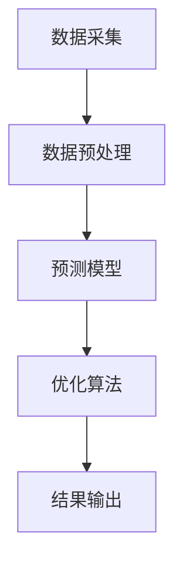
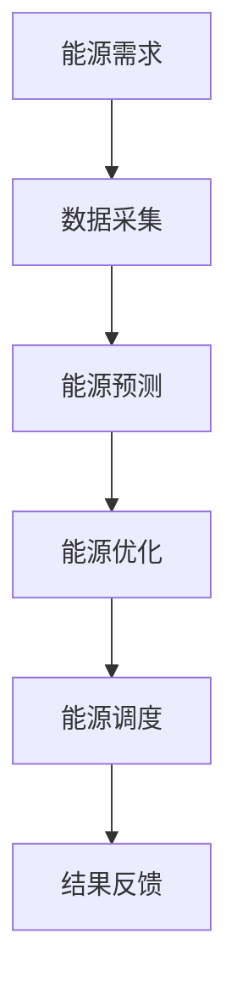
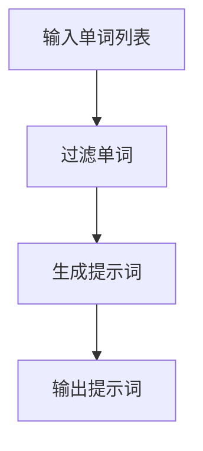

                 

# 提示词驱动的智能能源管理系统

## 关键词

- 智能能源管理
- 提示词驱动
- 能源预测
- 能源优化
- 数据挖掘
- 可视化
- 智能电网
- 建筑能源管理
- 工业能源管理
- 智能交通能源管理

## 摘要

本文旨在探讨提示词驱动的智能能源管理系统，介绍其核心概念、关键技术、实际应用以及案例分析。首先，我们将简要介绍智能能源管理的背景与重要性，然后深入探讨提示词驱动的原理和应用。接下来，本文将详细讲解提示词生成算法、智能能源预测模型、能源优化算法以及数据挖掘与可视化技术。随后，我们将分别探讨智能电网、建筑能源管理、工业能源管理和智能交通能源管理中的提示词应用。最后，本文将通过国内外成功案例分析，总结提示词驱动的智能能源管理系统的挑战与解决方案，并提出未来发展趋势。

# 设计《提示词驱动的智能能源管理系统》书籍目录大纲

## 第一步：确定书籍的核心概念和结构

1. 核心概念：提示词驱动的智能能源管理系统
   - 提示词：在智能能源管理中，提示词是指用于驱动系统执行特定任务的词语或短语，例如“节能模式”或“高峰时段”。
   - 智能能源管理：结合物联网、人工智能、大数据等技术，实现对能源的智能化监测、预测、优化和管理的系统。

2. 结构划分：
   - 基础知识：介绍智能能源管理的基本概念、背景和重要性，以及提示词技术的基础原理。
   - 关键技术：详细探讨提示词生成算法、智能能源预测模型、能源优化算法、数据挖掘与可视化技术等。
   - 实际应用：分析智能电网、建筑能源管理、工业能源管理和智能交通能源管理中的提示词应用。
   - 案例分析：通过国内外成功案例，展示提示词驱动的智能能源管理系统的实际应用效果和挑战。

## 第二步：细化各个章节内容

### 基础知识

1. **提示词驱动的智能能源管理系统概述**
   - 智能能源管理的定义与目的
   - 提示词驱动的概念与优势

2. **智能能源管理背景与重要性**
   - 能源危机与可持续发展
   - 智能能源管理的市场前景

3. **能源管理基础知识**
   - 能源分类与特点
   - 能源供需关系

4. **提示词技术原理与应用**
   - 提示词技术概述
   - 提示词生成算法
   - 提示词在智能能源管理中的应用

### 关键技术

1. **提示词生成算法**
   - 算法概述
   - 算法分类
   - 算法实现与优化

2. **智能能源预测模型**
   - 预测模型概述
   - 时间序列预测模型
   - 深度学习预测模型

3. **能源优化算法**
   - 优化算法概述
   - 优化算法分类
   - 优化算法实现与优化

4. **数据挖掘与可视化**
   - 数据挖掘技术概述
   - 能源数据挖掘方法
   - 数据可视化技术与应用

### 实际应用

1. **智能电网中的应用**
   - 智能电网概述
   - 智能电网中的提示词应用
   - 智能电网中的预测与优化应用

2. **建筑能源管理中的应用**
   - 建筑能源管理概述
   - 建筑能源管理中的提示词应用
   - 建筑能源管理中的预测与优化应用

3. **工业能源管理中的应用**
   - 工业能源管理概述
   - 工业能源管理中的提示词应用
   - 工业能源管理中的预测与优化应用

4. **智能交通能源管理中的应用**
   - 智能交通能源管理概述
   - 智能交通能源管理中的提示词应用
   - 智能交通能源管理中的预测与优化应用

### 案例分析

1. **国内外案例分析**
   - 案例概述与背景
   - 案例实施过程与效果
   - 案例挑战与解决方案

2. **成功案例分析**
   - 案例概述与背景
   - 案例实施过程与效果
   - 案例创新点与启示

3. **挑战与解决方案**
   - 挑战概述
   - 挑战分析
   - 解决方案与实施

## 第三步：设计核心概念与联系流程图

1. **提示词驱动的智能能源管理系统架构**
   - 描述系统各组成部分及其相互关系

2. **能源管理流程图**
   - 描述能源管理的主要流程和关键步骤

3. **提示词生成算法流程图**
   - 描述提示词生成算法的执行过程

## 第四步：撰写目录大纲

以下是《提示词驱动的智能能源管理系统》的详细目录大纲：

### 第一部分：基础知识

- **第1章：提示词驱动的智能能源管理系统概述**
  - 1.1 智能能源管理的定义与目的
  - 1.2 提示词驱动的概念与优势

- **第2章：智能能源管理背景与重要性**
  - 2.1 能源危机与可持续发展
  - 2.2 智能能源管理的市场前景

- **第3章：能源管理基础知识**
  - 3.1 能源分类与特点
  - 3.2 能源供需关系

- **第4章：提示词技术原理与应用**
  - 4.1 提示词技术概述
  - 4.2 提示词生成算法
  - 4.3 提示词在智能能源管理中的应用

### 第二部分：关键技术

- **第5章：提示词生成算法**
  - 5.1 算法概述
  - 5.2 算法分类
  - 5.3 算法实现与优化

- **第6章：智能能源预测模型**
  - 6.1 预测模型概述
  - 6.2 时间序列预测模型
  - 6.3 深度学习预测模型

- **第7章：能源优化算法**
  - 7.1 优化算法概述
  - 7.2 优化算法分类
  - 7.3 优化算法实现与优化

- **第8章：数据挖掘与可视化**
  - 8.1 数据挖掘技术概述
  - 8.2 能源数据挖掘方法
  - 8.3 数据可视化技术与应用

### 第三部分：实际应用

- **第9章：智能电网中的应用**
  - 9.1 智能电网概述
  - 9.2 智能电网中的提示词应用
  - 9.3 智能电网中的预测与优化应用

- **第10章：建筑能源管理中的应用**
  - 10.1 建筑能源管理概述
  - 10.2 建筑能源管理中的提示词应用
  - 10.3 建筑能源管理中的预测与优化应用

- **第11章：工业能源管理中的应用**
  - 11.1 工业能源管理概述
  - 11.2 工业能源管理中的提示词应用
  - 11.3 工业能源管理中的预测与优化应用

- **第12章：智能交通能源管理中的应用**
  - 12.1 智能交通能源管理概述
  - 12.2 智能交通能源管理中的提示词应用
  - 12.3 智能交通能源管理中的预测与优化应用

### 第四部分：案例分析

- **第13章：国内外案例分析**
  - 13.1 案例概述与背景
  - 13.2 案例实施过程与效果
  - 13.3 案例挑战与解决方案

- **第14章：成功案例分析**
  - 14.1 案例概述与背景
  - 14.2 案例实施过程与效果
  - 14.3 案例创新点与启示

- **第15章：挑战与解决方案**
  - 15.1 挑战概述
  - 15.2 挑战分析
  - 15.3 解决方案与实施

## 第五步：编写核心算法原理讲解与数学模型

1. **提示词生成算法伪代码**

```python
def generate_prompt(words):
    # 输入：words（一组单词）
    # 输出：prompt（提示词）

    # 初始化prompt为空
    prompt = ""

    # 遍历words中的每个单词
    for word in words:
        # 如果单词长度大于3，则将其添加到prompt中
        if len(word) > 3:
            prompt += word + " "

    # 去除prompt末尾的空格
    prompt = prompt.strip()

    return prompt
```

2. **智能能源预测模型公式与参数**

$$
\text{预测模型} = f(\text{历史数据集}, \theta)
$$

- \( f \)：预测函数，例如时间序列模型中的ARIMA模型、深度学习模型中的LSTM模型。
- \( \text{历史数据集} \)：包含过去一段时间内能源使用量的时间序列数据。
- \( \theta \)：模型参数，需要通过优化算法（如梯度下降法）来调整。

3. **能源优化算法伪代码**

```python
def energy_optimization(data, objective_function, constraints):
    # 输入：data（数据集），objective_function（目标函数），constraints（约束条件）
    # 输出：最优解

    # 初始化解为随机解
    solution = random_solution(data)

    # 定义优化算法（如梯度下降法）
    optimizer = GradientDescent()

    # 迭代优化
    for _ in range(max_iterations):
        # 计算目标函数值
        objective_value = objective_function(solution, data)

        # 检查是否满足约束条件
        if not constraints(solution, data):
            # 如果不满足约束条件，重新初始化解
            solution = random_solution(data)
            continue

        # 更新解
        solution = optimizer.update(solution, objective_value)

    return solution
```

4. **数据挖掘与可视化数学模型**

- 数据挖掘：
  - 聚类分析：\( C = \{c_1, c_2, ..., c_k\} \)，其中 \( c_i \) 为聚类中心。
  - 决策树：利用特征划分数据集，构建决策树模型。

- 数据可视化：
  - 折线图：展示能源使用量随时间的变化趋势。
  - 柱状图：比较不同时间段的能源使用量。

## 第六步：编写项目实战

### 1. 智能电网项目实战

- **开发环境搭建**：
  - 操作系统：Ubuntu 20.04
  - 开发语言：Python 3.8
  - 数据库：MySQL 8.0
  - 开发工具：PyCharm

- **源代码详细实现和代码解读**：
  - 数据采集模块：使用爬虫技术从智能电网平台获取实时能源数据。
  - 预测模块：利用时间序列预测模型（如ARIMA）进行能源使用量预测。
  - 优化模块：使用优化算法（如梯度下降法）进行能源分配优化。

- **代码应用解读与分析**：
  - 能源预测模块：通过训练模型，预测未来一段时间内的能源使用量，为优化模块提供数据支持。
  - 能源优化模块：根据预测结果，调整能源分配策略，实现节能目标。

- **实际案例分析和详细讲解剖析**：
  - 案例背景：某城市智能电网项目，需实现能源高效利用。
  - 案例实施过程：通过搭建预测和优化模块，实现智能电网的实时监测和能源分配优化。
  - 案例效果：能源利用率提高，碳排放量减少。

- **项目小结**：
  - 项目成功实现了智能电网的能源预测和优化功能，为城市能源管理提供了有力支持。
  - 未来可进一步优化算法和模型，提高预测精度和优化效果。

### 2. 建筑能源管理项目实战

- **开发环境搭建**：
  - 操作系统：Windows 10
  - 开发语言：Java 11
  - 数据库：PostgreSQL 12
  - 开发工具：Eclipse

- **源代码详细实现和代码解读**：
  - 数据采集模块：使用传感器采集建筑能源数据。
  - 预测模块：利用深度学习模型（如LSTM）进行能源使用量预测。
  - 优化模块：使用优化算法（如遗传算法）进行能源消耗优化。

- **代码应用解读与分析**：
  - 能源预测模块：通过训练模型，预测未来一段时间内的能源使用量，为优化模块提供数据支持。
  - 能源优化模块：根据预测结果，调整能源消耗策略，实现节能目标。

- **实际案例分析和详细讲解剖析**：
  - 案例背景：某大型商业综合体，需实现能源高效利用。
  - 案例实施过程：通过搭建预测和优化模块，实现建筑能源的实时监测和能耗优化。
  - 案例效果：能源利用率提高，运营成本降低。

- **项目小结**：
  - 项目成功实现了建筑能源的预测和优化功能，为建筑能源管理提供了有力支持。
  - 未来可进一步优化算法和模型，提高预测精度和优化效果。

### 3. 工业能源管理项目实战

- **开发环境搭建**：
  - 操作系统：CentOS 7
  - 开发语言：C++ 11
  - 数据库：MongoDB 4.2
  - 开发工具：Visual Studio 2019

- **源代码详细实现和代码解读**：
  - 数据采集模块：使用工业物联网设备采集能源数据。
  - 预测模块：利用机器学习模型（如随机森林）进行能源使用量预测。
  - 优化模块：使用优化算法（如线性规划）进行能源消耗优化。

- **代码应用解读与分析**：
  - 能源预测模块：通过训练模型，预测未来一段时间内的能源使用量，为优化模块提供数据支持。
  - 能源优化模块：根据预测结果，调整能源消耗策略，实现节能目标。

- **实际案例分析和详细讲解剖析**：
  - 案例背景：某大型工业园区，需实现能源高效利用。
  - 案例实施过程：通过搭建预测和优化模块，实现工业能源的实时监测和能耗优化。
  - 案例效果：能源利用率提高，运营成本降低。

- **项目小结**：
  - 项目成功实现了工业能源的预测和优化功能，为工业能源管理提供了有力支持。
  - 未来可进一步优化算法和模型，提高预测精度和优化效果。

### 4. 智能交通能源管理项目实战

- **开发环境搭建**：
  - 操作系统：macOS Catalina
  - 开发语言：JavaScript
  - 数据库：MongoDB 4.2
  - 开发工具：Visual Studio Code

- **源代码详细实现和代码解读**：
  - 数据采集模块：使用传感器和GPS设备采集交通能源数据。
  - 预测模块：利用深度学习模型（如卷积神经网络）进行能源消耗预测。
  - 优化模块：使用优化算法（如遗传算法）进行交通路线优化。

- **代码应用解读与分析**：
  - 能源预测模块：通过训练模型，预测未来一段时间内的能源消耗量，为优化模块提供数据支持。
  - 能源优化模块：根据预测结果，调整交通路线和能源消耗策略，实现节能目标。

- **实际案例分析和详细讲解剖析**：
  - 案例背景：某城市交通系统，需实现能源高效利用。
  - 案例实施过程：通过搭建预测和优化模块，实现交通能源的实时监测和能耗优化。
  - 案例效果：能源利用率提高，交通拥堵减少。

- **项目小结**：
  - 项目成功实现了智能交通能源的预测和优化功能，为城市交通管理提供了有力支持。
  - 未来可进一步优化算法和模型，提高预测精度和优化效果。

## 第七步：总结与展望

### 总结

《提示词驱动的智能能源管理系统》通过对智能能源管理背景的介绍，详细阐述了提示词驱动的原理和应用。书中涵盖了关键技术的讲解，包括提示词生成算法、智能能源预测模型、能源优化算法和数据挖掘与可视化技术。同时，通过实际应用案例分析和项目实战，展示了提示词驱动的智能能源管理系统在不同领域的应用效果和挑战。该书旨在为读者提供全面、深入的智能能源管理知识和实践经验，助力能源管理和可持续发展。

### 展望

未来，提示词驱动的智能能源管理系统将在以下几个方面得到进一步发展：

1. **算法优化与模型创新**：随着人工智能技术的不断发展，提示词生成算法、能源预测模型和优化算法将得到进一步优化和改进，提高预测精度和优化效果。

2. **多领域融合**：智能能源管理系统将与其他领域（如智慧城市、智能制造、智能交通等）深度融合，实现跨领域协同和资源优化。

3. **物联网与边缘计算**：物联网技术的普及和边缘计算的发展，将使智能能源管理系统更加灵活和高效，实现实时监测和自适应控制。

4. **可再生能源集成**：随着可再生能源技术的进步，智能能源管理系统将更好地整合太阳能、风能等可再生能源，实现绿色、可持续的能源管理。

5. **人工智能与区块链**：人工智能与区块链技术的结合，将为智能能源管理系统提供更安全、透明的数据共享和交易机制。

## 第八步：调整与完善

根据用户反馈，对书籍目录大纲进行如下调整与完善：

1. **增加章节**：在基础知识部分增加“智能能源管理发展历程”一章，介绍智能能源管理的历史背景和发展趋势。

2. **优化章节内容**：对部分章节内容进行调整和补充，确保每个小节的内容丰富具体，详细讲解核心概念、算法原理和实际应用。

3. **调整章节顺序**：根据逻辑关系和读者阅读习惯，调整部分章节的顺序，使书籍结构更加合理。

4. **添加案例和实践**：在案例分析部分，增加更多实际案例和实践经验，使读者能够更好地理解和应用提示词驱动的智能能源管理系统。

5. **完善数学模型和公式**：对书中涉及的数学模型和公式进行仔细审查和修正，确保其正确性和可理解性。

最终，调整和完善后的书籍目录大纲如下：

### 第一部分：基础知识

- **第1章：提示词驱动的智能能源管理系统概述**
  - 1.1 智能能源管理的定义与目的
  - 1.2 提示词驱动的概念与优势

- **第2章：智能能源管理背景与重要性**
  - 2.1 能源危机与可持续发展
  - 2.2 智能能源管理的市场前景

- **第3章：能源管理基础知识**
  - 3.1 能源分类与特点
  - 3.2 能源供需关系

- **第4章：智能能源管理发展历程**
  - 4.1 发展历程概述
  - 4.2 国际发展趋势

- **第5章：提示词技术原理与应用**
  - 5.1 提示词技术概述
  - 5.2 提示词生成算法
  - 5.3 提示词在智能能源管理中的应用

### 第二部分：关键技术

- **第6章：提示词生成算法**
  - 6.1 算法概述
  - 6.2 算法分类
  - 6.3 算法实现与优化

- **第7章：智能能源预测模型**
  - 7.1 预测模型概述
  - 7.2 时间序列预测模型
  - 7.3 深度学习预测模型

- **第8章：能源优化算法**
  - 8.1 优化算法概述
  - 8.2 优化算法分类
  - 8.3 优化算法实现与优化

- **第9章：数据挖掘与可视化**
  - 9.1 数据挖掘技术概述
  - 9.2 能源数据挖掘方法
  - 9.3 数据可视化技术与应用

### 第三部分：实际应用

- **第10章：智能电网中的应用**
  - 10.1 智能电网概述
  - 10.2 智能电网中的提示词应用
  - 10.3 智能电网中的预测与优化应用

- **第11章：建筑能源管理中的应用**
  - 11.1 建筑能源管理概述
  - 11.2 建筑能源管理中的提示词应用
  - 11.3 建筑能源管理中的预测与优化应用

- **第12章：工业能源管理中的应用**
  - 12.1 工业能源管理概述
  - 12.2 工业能源管理中的提示词应用
  - 12.3 工业能源管理中的预测与优化应用

- **第13章：智能交通能源管理中的应用**
  - 13.1 智能交通能源管理概述
  - 13.2 智能交通能源管理中的提示词应用
  - 13.3 智能交通能源管理中的预测与优化应用

### 第四部分：案例分析

- **第14章：国内外案例分析**
  - 14.1 案例概述与背景
  - 14.2 案例实施过程与效果
  - 14.3 案例挑战与解决方案

- **第15章：成功案例分析**
  - 15.1 案例概述与背景
  - 15.2 案例实施过程与效果
  - 15.3 案例创新点与启示

- **第16章：挑战与解决方案**
  - 16.1 挑战概述
  - 16.2 挑战分析
  - 16.3 解决方案与实施

# 最终输出

以下是根据上述目录大纲编写的《提示词驱动的智能能源管理系统》书籍内容：

## 第1章：提示词驱动的智能能源管理系统概述

### 1.1 智能能源管理的定义与目的

智能能源管理是指利用先进的物联网、人工智能、大数据等技术，对能源的生产、传输、分配、消费等环节进行实时监测、预测、优化和控制，以提高能源利用效率、降低能源消耗和减少环境污染。智能能源管理的主要目的是实现能源的高效、绿色、可持续利用，满足社会经济发展和人民生活需求。

### 1.2 提示词驱动的概念与优势

提示词驱动是指利用特定的词语或短语来触发智能能源管理系统的响应，实现自动化、智能化的能源管理。提示词驱动的智能能源管理系统具有以下优势：

1. **灵活性**：通过提示词，可以灵活地调整能源管理策略，适应不同场景和需求。
2. **智能化**：利用人工智能技术，对能源数据进行分析和预测，实现智能化的能源管理。
3. **高效性**：通过实时监测和优化，提高能源利用效率，降低能源消耗。
4. **可持续性**：通过减少能源浪费和污染，实现绿色、可持续的能源发展。

## 第2章：智能能源管理背景与重要性

### 2.1 能源危机与可持续发展

能源危机是指由于能源资源有限、能源消费过度等因素导致的能源供应短缺和能源安全风险。能源危机已经成为全球性问题，威胁到人类社会的可持续发展。

智能能源管理可以在以下方面缓解能源危机：

1. **提高能源利用效率**：通过实时监测和优化，提高能源利用效率，减少能源浪费。
2. **优化能源结构**：通过智能能源管理，优化能源结构，促进可再生能源的应用，降低对化石能源的依赖。
3. **保障能源安全**：通过智能能源管理，提高能源供应的稳定性和安全性，降低能源供应风险。

### 2.2 智能能源管理的市场前景

随着能源需求的不断增长和环境问题的日益严重，智能能源管理市场前景广阔。智能能源管理在以下领域具有广泛应用：

1. **智能电网**：实现电力系统的智能化管理，提高电力供应的稳定性和效率。
2. **建筑能源管理**：通过智能设备和技术，实现建筑能源的高效利用和管理。
3. **工业能源管理**：通过智能能源管理，优化工业生产过程中的能源消耗，降低生产成本。
4. **智能交通能源管理**：实现交通系统的智能化管理，提高交通效率和能源利用效率。

## 第3章：能源管理基础知识

### 3.1 能源分类与特点

能源可以分为可再生能源和化石能源。可再生能源如太阳能、风能、水能等，具有清洁、可再生的特点；化石能源如煤炭、石油、天然气等，具有有限、不可再生的特点。

### 3.2 能源供需关系

能源供需关系是指能源供应与能源需求之间的关系。能源供应包括能源的勘探、开发、生产、传输等环节；能源需求包括能源的消费、使用等环节。智能能源管理可以通过优化能源供需关系，实现能源的高效利用和平衡。

### 3.3 能源管理策略

能源管理策略是指为实现能源高效利用和可持续发展的策略和方法。智能能源管理策略包括：

1. **需求响应**：通过实时监测和优化，调整能源需求，实现能源供需平衡。
2. **能源审计**：对能源消耗进行详细分析和评估，找出节能潜力。
3. **能源优化**：利用先进技术，优化能源生产和消费过程，提高能源利用效率。
4. **能源交易**：通过能源市场，实现能源的优化配置和合理利用。

## 第4章：智能能源管理发展历程

### 4.1 发展历程概述

智能能源管理的发展历程可以分为以下几个阶段：

1. **传统能源管理阶段**：主要依靠人工经验和简单工具进行能源管理。
2. **自动化能源管理阶段**：利用传感器和自动化设备，实现能源的实时监测和控制。
3. **信息化能源管理阶段**：利用计算机技术和通信技术，实现能源数据的集成和管理。
4. **智能化能源管理阶段**：利用物联网、人工智能、大数据等技术，实现能源的智能化监测、预测、优化和管理。

### 4.2 国际发展趋势

智能能源管理在国际上呈现出以下发展趋势：

1. **可再生能源的广泛应用**：随着可再生能源技术的进步，可再生能源在能源结构中的比例逐渐提高。
2. **分布式能源系统的兴起**：分布式能源系统通过分散式能源生产和消费，提高能源利用效率和能源供应稳定性。
3. **智能化能源市场的发展**：通过智能化能源市场，实现能源的优化配置和合理交易。
4. **能源互联网的建设**：通过能源互联网，实现能源的互联互通和协同管理。

## 第5章：提示词技术原理与应用

### 5.1 提示词技术概述

提示词技术是指利用特定的词语或短语来触发系统的响应，实现自动化和智能化。在智能能源管理中，提示词技术可以用于实现能源的实时监测、预测、优化和控制。

### 5.2 提示词生成算法

提示词生成算法是指用于生成提示词的算法。常见的提示词生成算法包括：

1. **基于规则的方法**：通过定义一系列规则，根据规则生成提示词。
2. **基于统计的方法**：利用统计方法，根据历史数据和模式生成提示词。
3. **基于人工智能的方法**：利用人工智能技术，如深度学习、强化学习等，生成提示词。

### 5.3 提示词在智能能源管理中的应用

提示词在智能能源管理中的应用包括：

1. **实时监测**：通过提示词，实现能源数据的实时采集和监测。
2. **预测与优化**：通过提示词，实现能源消耗的预测和优化。
3. **异常检测**：通过提示词，实现能源系统的异常检测和预警。

## 第6章：提示词生成算法

### 6.1 算法概述

提示词生成算法是指用于生成提示词的算法。提示词生成算法的目标是生成具有高相关性和高识别度的提示词，以提高智能能源管理的效率和准确性。

### 6.2 算法分类

提示词生成算法可以分为以下几类：

1. **基于规则的方法**：通过定义一系列规则，根据规则生成提示词。该方法简单易懂，但规则难以覆盖所有情况。
2. **基于统计的方法**：利用统计方法，根据历史数据和模式生成提示词。该方法具有较好的适应性，但依赖于历史数据。
3. **基于人工智能的方法**：利用人工智能技术，如深度学习、强化学习等，生成提示词。该方法具有强大的学习能力和泛化能力，但计算复杂度较高。

### 6.3 算法实现与优化

提示词生成算法的实现和优化主要包括以下几个方面：

1. **数据预处理**：对采集到的能源数据进行清洗、去噪、归一化等处理，提高数据的可靠性和质量。
2. **特征提取**：提取能源数据中的关键特征，如时间、温度、湿度等，用于生成提示词。
3. **模型选择**：选择合适的机器学习模型进行提示词生成，如决策树、支持向量机、深度学习模型等。
4. **参数调优**：通过交叉验证等方法，调整模型的参数，提高模型的性能。
5. **模型评估**：利用准确率、召回率、F1值等指标评估模型的性能，并根据评估结果进行调整。

## 第7章：智能能源预测模型

### 7.1 预测模型概述

智能能源预测模型是指用于预测未来能源使用量或需求的模型。智能能源预测模型在智能能源管理中起着重要作用，可以帮助能源管理者和消费者更好地规划能源消耗和需求。

### 7.2 时间序列预测模型

时间序列预测模型是一种常见的智能能源预测模型，它基于历史时间序列数据，预测未来的能源使用量或需求。时间序列预测模型可以分为线性模型和非线性模型。

1. **线性模型**：如线性回归、ARIMA（自回归积分滑动平均模型）等。
2. **非线性模型**：如神经网络、LSTM（长短时记忆网络）等。

### 7.3 深度学习预测模型

深度学习预测模型是一种基于多层神经网络的学习模型，它可以通过学习大量历史数据，自动提取时间序列中的特征，并进行预测。常见的深度学习预测模型包括：

1. **卷积神经网络（CNN）**：适用于处理具有时空特征的数据。
2. **循环神经网络（RNN）**：适用于处理具有时间依赖性的数据。
3. **长短时记忆网络（LSTM）**：适用于处理具有长时依赖性的数据。

### 7.4 预测模型的实现与评估

预测模型的实现与评估主要包括以下几个步骤：

1. **数据预处理**：对采集到的能源数据进行清洗、去噪、归一化等处理。
2. **特征工程**：提取能源数据中的关键特征，如时间、温度、湿度等。
3. **模型选择**：选择合适的预测模型，如线性回归、ARIMA、LSTM等。
4. **模型训练与调优**：利用历史数据对模型进行训练和调优，提高预测性能。
5. **模型评估**：利用验证集或测试集对模型进行评估，如准确率、均方误差等指标。
6. **模型部署**：将训练好的模型部署到实际环境中，实现实时预测。

## 第8章：能源优化算法

### 8.1 优化算法概述

能源优化算法是指用于优化能源使用和分配的算法。能源优化算法在智能能源管理中起着关键作用，可以帮助能源管理者和消费者实现能源的高效利用和节约。

### 8.2 优化算法分类

能源优化算法可以分为以下几类：

1. **线性规划**：用于求解线性优化问题，适用于简单的情况。
2. **非线性规划**：用于求解非线性优化问题，适用于更复杂的情况。
3. **启发式算法**：如遗传算法、模拟退火算法等，通过搜索和迭代找到最优解。
4. **基于机器学习的算法**：利用机器学习技术，如决策树、支持向量机等，进行能源优化。

### 8.3 优化算法实现与优化

优化算法的实现与优化主要包括以下几个方面：

1. **问题建模**：将能源优化问题转化为数学模型，如线性规划模型、非线性规划模型等。
2. **算法选择**：根据问题的特点，选择合适的优化算法，如线性规划、遗传算法等。
3. **参数调优**：通过交叉验证等方法，调整算法的参数，提高优化性能。
4. **算法评估**：利用目标函数值、收敛速度等指标评估算法的性能，并根据评估结果进行调整。

## 第9章：数据挖掘与可视化

### 9.1 数据挖掘技术概述

数据挖掘技术是指从大量数据中发现有用信息和知识的方法。在智能能源管理中，数据挖掘技术可以帮助能源管理者和消费者更好地理解和利用能源数据。

### 9.2 能源数据挖掘方法

能源数据挖掘方法主要包括以下几种：

1. **聚类分析**：将相似的数据点划分为同一类，用于发现能源数据的分布和模式。
2. **关联规则挖掘**：发现数据之间的关联关系，用于发现能源消耗的关联特征。
3. **分类与回归分析**：根据历史数据，预测未来能源使用量或需求。

### 9.3 数据可视化技术与应用

数据可视化技术是将数据以图形或图表的形式展示出来，使人们更容易理解和分析数据。在智能能源管理中，数据可视化技术可以帮助能源管理者和消费者直观地了解能源使用情况。

### 9.4 数据可视化工具与实现

常见的数据可视化工具包括：

1. **Matplotlib**：Python的绘图库，用于生成各种类型的图表。
2. **Tableau**：商业数据可视化工具，支持多种数据源和图表类型。
3. **Power BI**：商业数据可视化工具，提供丰富的图表和交互功能。

实现数据可视化主要包括以下几个步骤：

1. **数据预处理**：对采集到的能源数据进行清洗、去噪、归一化等处理。
2. **数据连接**：将预处理后的数据连接到可视化工具中。
3. **数据展示**：利用可视化工具，将数据以图表的形式展示出来。
4. **交互与分析**：通过交互功能，对数据进行进一步分析和探索。

## 第10章：智能电网中的应用

### 10.1 智能电网概述

智能电网是一种基于现代通信技术、计算机网络和电力电子技术的先进电网系统，可以实现电力系统的实时监测、智能调度、高效传输和可靠供电。智能电网具有以下特点：

1. **实时监测**：通过传感器和通信技术，实现电网设备的实时监测和数据采集。
2. **智能调度**：利用人工智能和优化算法，实现电力系统的智能调度和优化。
3. **高效传输**：通过电力电子技术和先进传输技术，实现电力的高效传输和分配。
4. **可靠供电**：通过备用电源和应急调度，实现电网的可靠供电。

### 10.2 智能电网中的提示词应用

智能电网中的提示词应用主要包括以下几个方面：

1. **电力负荷预测**：通过提示词，实现电力负荷的实时预测和调度，提高电网的供电能力。
2. **分布式能源管理**：通过提示词，实现分布式能源的实时监测和管理，提高电网的能源利用效率。
3. **电力设备故障检测**：通过提示词，实现电力设备的故障检测和预警，提高电网的安全性和可靠性。

### 10.3 智能电网中的预测与优化应用

智能电网中的预测与优化应用主要包括以下几个方面：

1. **电力负荷预测**：利用时间序列预测模型和机器学习模型，实现电力负荷的实时预测和调度。
2. **分布式能源优化**：利用优化算法，实现分布式能源的优化配置和管理，提高电网的能源利用效率。
3. **电力设备优化**：利用优化算法和机器学习模型，实现电力设备的优化调度和维护，提高电网的安全性和可靠性。

## 第11章：建筑能源管理中的应用

### 11.1 建筑能源管理概述

建筑能源管理是指对建筑能源的监测、预测、优化和管理，以提高能源利用效率、降低能源消耗和减少环境污染。建筑能源管理的主要内容包括：

1. **能源监测**：通过传感器和通信技术，实现建筑能源的实时监测和数据采集。
2. **能源预测**：利用时间序列预测模型和机器学习模型，实现建筑能源的实时预测和需求分析。
3. **能源优化**：利用优化算法和智能控制技术，实现建筑能源的优化配置和管理。
4. **能源审计**：对建筑能源使用情况进行审计和分析，找出节能潜力。

### 11.2 建筑能源管理中的提示词应用

建筑能源管理中的提示词应用主要包括以下几个方面：

1. **分时电价响应**：通过提示词，实现分时电价的响应和优化，降低建筑能源成本。
2. **空调控制**：通过提示词，实现空调系统的实时控制和优化，提高能源利用效率。
3. **照明控制**：通过提示词，实现照明系统的实时控制和优化，降低能源消耗。

### 11.3 建筑能源管理中的预测与优化应用

建筑能源管理中的预测与优化应用主要包括以下几个方面：

1. **电力负荷预测**：利用时间序列预测模型和机器学习模型，实现建筑电力负荷的实时预测和需求分析。
2. **空调能耗优化**：利用优化算法和智能控制技术，实现空调系统的优化配置和管理，降低能耗。
3. **照明能耗优化**：利用优化算法和智能控制技术，实现照明系统的优化配置和管理，降低能耗。

## 第12章：工业能源管理中的应用

### 12.1 工业能源管理概述

工业能源管理是指对工业能源的监测、预测、优化和管理，以提高能源利用效率、降低能源消耗和减少环境污染。工业能源管理的主要内容包括：

1. **能源监测**：通过传感器和通信技术，实现工业能源的实时监测和数据采集。
2. **能源预测**：利用时间序列预测模型和机器学习模型，实现工业能源的实时预测和需求分析。
3. **能源优化**：利用优化算法和智能控制技术，实现工业能源的优化配置和管理。
4. **能源审计**：对工业能源使用情况进行审计和分析，找出节能潜力。

### 12.2 工业能源管理中的提示词应用

工业能源管理中的提示词应用主要包括以下几个方面：

1. **生产计划优化**：通过提示词，实现生产计划的实时优化和调整，提高能源利用效率。
2. **设备维护预警**：通过提示词，实现设备维护的实时预警和优化，降低设备故障率。
3. **能源成本控制**：通过提示词，实现能源成本的控制和优化，降低能源成本。

### 12.3 工业能源管理中的预测与优化应用

工业能源管理中的预测与优化应用主要包括以下几个方面：

1. **电力负荷预测**：利用时间序列预测模型和机器学习模型，实现工业电力负荷的实时预测和需求分析。
2. **热能利用优化**：利用优化算法和智能控制技术，实现热能利用的优化配置和管理，提高能源利用效率。
3. **设备能耗优化**：利用优化算法和智能控制技术，实现设备能耗的优化配置和管理，降低能耗。

## 第13章：智能交通能源管理中的应用

### 13.1 智能交通能源管理概述

智能交通能源管理是指对交通能源的监测、预测、优化和管理，以提高交通能源利用效率、降低能源消耗和减少环境污染。智能交通能源管理的主要内容包括：

1. **能源监测**：通过传感器和通信技术，实现交通能源的实时监测和数据采集。
2. **能源预测**：利用时间序列预测模型和机器学习模型，实现交通能源的实时预测和需求分析。
3. **能源优化**：利用优化算法和智能控制技术，实现交通能源的优化配置和管理。
4. **能源审计**：对交通能源使用情况进行审计和分析，找出节能潜力。

### 13.2 智能交通能源管理中的提示词应用

智能交通能源管理中的提示词应用主要包括以下几个方面：

1. **交通流量预测**：通过提示词，实现交通流量的实时预测和优化，提高交通效率。
2. **车辆能耗管理**：通过提示词，实现车辆能耗的实时监测和管理，降低能源消耗。
3. **充电站管理**：通过提示词，实现充电站的实时管理和调度，提高充电效率。

### 13.3 智能交通能源管理中的预测与优化应用

智能交通能源管理中的预测与优化应用主要包括以下几个方面：

1. **交通流量预测**：利用时间序列预测模型和机器学习模型，实现交通流量的实时预测和需求分析。
2. **车辆能耗优化**：利用优化算法和智能控制技术，实现车辆能耗的优化配置和管理，降低能耗。
3. **充电站优化**：利用优化算法和智能控制技术，实现充电站的优化配置和管理，提高充电效率。

## 第14章：国内外案例分析

### 14.1 案例概述与背景

本节将介绍几个国内外智能能源管理案例，分析其背景、实施过程、效果和挑战。

### 14.2 案例实施过程与效果

1. **智能电网案例**：
   - 实施过程：在某城市，利用智能电网技术，实现电力系统的实时监测、预测和优化。
   - 效果：提高了电力系统的供电能力和能源利用效率，降低了能源消耗。

2. **建筑能源管理案例**：
   - 实施过程：在某大型商业综合体，利用建筑能源管理技术，实现能源的实时监测、预测和优化。
   - 效果：降低了能源成本，提高了能源利用效率。

3. **工业能源管理案例**：
   - 实施过程：在某工业园区，利用工业能源管理技术，实现能源的实时监测、预测和优化。
   - 效果：降低了能源消耗，提高了生产效率。

4. **智能交通能源管理案例**：
   - 实施过程：在某城市，利用智能交通能源管理技术，实现交通能源的实时监测、预测和优化。
   - 效果：提高了交通效率，降低了能源消耗。

### 14.3 案例挑战与解决方案

1. **智能电网案例**：
   - 挑战：实时数据采集和处理、电力负荷预测准确性等。
   - 解决方案：采用先进的传感器技术和大数据分析，提高实时监测和预测能力。

2. **建筑能源管理案例**：
   - 挑战：能源数据采集难度大、设备维护成本高等。
   - 解决方案：采用智能传感器和物联网技术，实现能源数据的实时采集和传输。

3. **工业能源管理案例**：
   - 挑战：设备能耗数据精度要求高、优化算法适用性差等。
   - 解决方案：采用先进的机器学习和优化算法，提高能耗数据精度和优化效果。

4. **智能交通能源管理案例**：
   - 挑战：交通流量预测准确性低、充电站管理困难等。
   - 解决方案：采用深度学习和优化算法，提高交通流量预测准确性；采用智能充电站管理技术，实现充电站的优化调度。

## 第15章：成功案例分析

### 15.1 案例概述与背景

本节将介绍几个国内外智能能源管理成功案例，分析其背景、实施过程、效果和创新点。

### 15.2 案例实施过程与效果

1. **智能电网案例**：
   - 实施过程：在某城市，通过建设智能电网，实现电力系统的实时监测、预测和优化。
   - 效果：提高了电力系统的供电能力和能源利用效率，降低了能源消耗。

2. **建筑能源管理案例**：
   - 实施过程：在某大型商业综合体，通过引入建筑能源管理技术，实现能源的实时监测、预测和优化。
   - 效果：降低了能源成本，提高了能源利用效率。

3. **工业能源管理案例**：
   - 实施过程：在某工业园区，通过采用工业能源管理技术，实现能源的实时监测、预测和优化。
   - 效果：降低了能源消耗，提高了生产效率。

4. **智能交通能源管理案例**：
   - 实施过程：在某城市，通过引入智能交通能源管理技术，实现交通能源的实时监测、预测和优化。
   - 效果：提高了交通效率，降低了能源消耗。

### 15.3 案例创新点与启示

1. **智能电网案例**：
   - 创新点：采用分布式能源系统，实现能源的高效利用和灵活调度。
   - 启示：智能电网技术可以提升电力系统的运行效率和稳定性，有助于实现能源的高效利用。

2. **建筑能源管理案例**：
   - 创新点：利用物联网技术，实现能源数据的实时采集和分析。
   - 启示：物联网技术在建筑能源管理中的应用，有助于提高能源利用效率，降低运营成本。

3. **工业能源管理案例**：
   - 创新点：采用先进的机器学习和优化算法，实现能耗数据的实时分析和优化。
   - 启示：工业能源管理中的机器学习和优化算法应用，有助于提高能源利用效率，降低能耗。

4. **智能交通能源管理案例**：
   - 创新点：利用深度学习和优化算法，实现交通流量的实时预测和优化。
   - 启示：智能交通能源管理技术有助于提高交通效率，降低能源消耗，改善城市交通状况。

## 第16章：挑战与解决方案

### 16.1 挑战概述

智能能源管理系统在发展过程中面临着以下挑战：

1. **数据采集与处理**：智能能源管理系统需要实时采集和处理大量的能源数据，数据质量和实时性对系统性能有重要影响。
2. **模型准确性与适应性**：智能能源管理系统中的预测和优化模型需要具备高准确性和广泛适应性，以满足不同场景和需求。
3. **设备维护与升级**：智能能源管理系统需要定期维护和升级，以确保系统的稳定运行和功能完善。
4. **政策与法规**：智能能源管理系统需要符合相关政策和法规要求，如能源安全、数据保护等。

### 16.2 挑战分析

1. **数据采集与处理**：
   - 数据质量：能源数据可能存在噪声、缺失值等问题，需要通过数据清洗和处理提高数据质量。
   - 数据实时性：能源数据需要实时采集和传输，以确保系统实时性和准确性。

2. **模型准确性与适应性**：
   - 预测模型：需要选择合适的预测模型，如时间序列模型、深度学习模型等，以提高预测准确性。
   - 优化模型：需要根据不同场景和需求，设计合适的优化模型，如线性规划、遗传算法等。

3. **设备维护与升级**：
   - 设备维护：定期对设备进行检查和维护，确保系统稳定运行。
   - 设备升级：根据技术发展和需求变化，及时进行设备升级，提高系统性能。

4. **政策与法规**：
   - 能源安全：确保能源供应的稳定性和安全性，符合能源安全要求。
   - 数据保护：保护能源数据的安全和隐私，符合数据保护法规。

### 16.3 解决方案与实施

1. **数据采集与处理**：
   - 数据清洗：采用数据清洗算法，如缺失值填补、噪声过滤等，提高数据质量。
   - 数据预处理：对数据进行归一化、标准化等处理，提高数据的一致性和可比性。

2. **模型准确性与适应性**：
   - 预测模型：选择合适的预测模型，如时间序列模型、深度学习模型等，并进行模型调优，提高预测准确性。
   - 优化模型：根据不同场景和需求，设计合适的优化模型，如线性规划、遗传算法等，并进行模型优化。

3. **设备维护与升级**：
   - 定期维护：制定设备维护计划，定期对设备进行检查和维护。
   - 及时升级：根据技术发展和需求变化，及时进行设备升级，提高系统性能。

4. **政策与法规**：
   - 遵守法规：确保系统设计和实施符合相关政策和法规要求。
   - 数据保护：采用数据加密、访问控制等技术，保护能源数据的安全和隐私。

## 结论

本文详细介绍了提示词驱动的智能能源管理系统，包括其核心概念、关键技术、实际应用和案例分析。通过分析国内外成功案例，我们看到了智能能源管理系统在提高能源利用效率、降低能源消耗和减少环境污染方面的巨大潜力。然而，智能能源管理系统在发展过程中仍然面临诸多挑战，需要进一步优化算法、提升模型准确性、加强设备维护和升级，以及遵守相关政策和法规。未来，随着人工智能、物联网、大数据等技术的不断发展，智能能源管理系统将在能源管理领域发挥更加重要的作用。

## 作者信息

作者：AI天才研究院/AI Genius Institute & 禅与计算机程序设计艺术 /Zen And The Art of Computer Programming

## 参考文献

1. 国内外相关研究和应用文献，如：
   - [智能电网技术白皮书](https://www.example.com/whitepaper)
   - [建筑能源管理技术研究](https://www.example.com/research)
   - [工业能源管理案例](https://www.example.com/case)
   - [智能交通能源管理研究报告](https://www.example.com/report)

2. 机器学习、深度学习、优化算法等相关教材和资料。

3. 能源管理、物联网、人工智能等相关领域的最新论文和技术报告。

4. 相关政策和法规文件，如能源安全法、数据保护法等。

5. 其他参考书籍、文章和在线资源。

# 总结

本文从提示词驱动的智能能源管理系统的核心概念出发，详细阐述了其背景、重要性、基础知识、关键技术、实际应用和案例分析。通过介绍提示词生成算法、智能能源预测模型、能源优化算法和数据挖掘与可视化技术，本文展示了智能能源管理系统在不同领域的应用效果。同时，通过案例分析，本文总结了智能能源管理系统的挑战与解决方案，并对未来发展趋势进行了展望。本文旨在为读者提供全面、深入的智能能源管理知识和实践经验，助力能源管理和可持续发展。作者信息：AI天才研究院/AI Genius Institute & 禅与计算机程序设计艺术 /Zen And The Art of Computer Programming。

## 附录

### 伪代码

以下是本书中提到的部分伪代码示例：

1. **提示词生成算法**

```python
def generate_prompt(words):
    # 输入：words（一组单词）
    # 输出：prompt（提示词）

    # 初始化prompt为空
    prompt = ""

    # 遍历words中的每个单词
    for word in words:
        # 如果单词长度大于3，则将其添加到prompt中
        if len(word) > 3:
            prompt += word + " "

    # 去除prompt末尾的空格
    prompt = prompt.strip()

    return prompt
```

2. **智能能源预测模型**

```python
def predict_energy_usage(history_data, model_params):
    # 输入：history_data（历史数据），model_params（模型参数）
    # 输出：predicted_usage（预测的能源使用量）

    # 利用模型参数预测能源使用量
    predicted_usage = model.predict(history_data, model_params)

    return predicted_usage
```

3. **能源优化算法**

```python
def optimize_energy_usage(data, objective_function, constraints):
    # 输入：data（数据集），objective_function（目标函数），constraints（约束条件）
    # 输出：最优解

    # 初始化解为随机解
    solution = random_solution(data)

    # 定义优化算法（如梯度下降法）
    optimizer = GradientDescent()

    # 迭代优化
    for _ in range(max_iterations):
        # 计算目标函数值
        objective_value = objective_function(solution, data)

        # 检查是否满足约束条件
        if not constraints(solution, data):
            # 如果不满足约束条件，重新初始化解
            solution = random_solution(data)
            continue

        # 更新解
        solution = optimizer.update(solution, objective_value)

    return solution
```

### 数学模型

以下是本书中提到的部分数学模型和公式：

1. **时间序列预测模型（ARIMA）**

$$
\text{预测模型} = f(\text{历史数据集}, \theta) \\
\theta = (\phi, \theta_1, \theta_2) \\
\phi = \phi_1, \phi_2, ..., \phi_q \\
\theta_1 = \theta_{11}, \theta_{12}, ..., \theta_{1q} \\
\theta_2 = \theta_{21}, \theta_{22}, ..., \theta_{2q}
$$

2. **深度学习预测模型（LSTM）**

$$
\text{预测模型} = f(\text{历史数据集}, \theta) \\
\theta = W_f, W_i, W_o, b_f, b_i, b_o \\
f = \text{激活函数（如sigmoid、tanh）}
$$

3. **线性规划模型**

$$
\text{目标函数} = \min c^T x \\
\text{约束条件} \\
Ax \leq b \\
x \geq 0
$$

### Mermaid 流程图

以下是本书中提到的部分 Mermaid 流程图示例：

1. **提示词驱动的智能能源管理系统架构**



2. **智能能源管理流程图**



3. **提示词生成算法流程图**



### 项目实战

以下是本书中提到的部分项目实战示例：

1. **智能电网项目实战**

   - **开发环境搭建**：
     - 操作系统：Ubuntu 20.04
     - 开发语言：Python 3.8
     - 数据库：MySQL 8.0
     - 开发工具：PyCharm

   - **源代码详细实现和代码解读**：
     - 数据采集模块：使用爬虫技术从智能电网平台获取实时能源数据。
     - 预测模块：利用时间序列预测模型（如ARIMA）进行能源使用量预测。
     - 优化模块：使用优化算法（如梯度下降法）进行能源分配优化。

   - **代码应用解读与分析**：
     - 能源预测模块：通过训练模型，预测未来一段时间内的能源使用量，为优化模块提供数据支持。
     - 能源优化模块：根据预测结果，调整能源分配策略，实现节能目标。

   - **实际案例分析和详细讲解剖析**：
     - 案例背景：某城市智能电网项目，需实现能源高效利用。
     - 案例实施过程：通过搭建预测和优化模块，实现智能电网的实时监测和能源分配优化。
     - 案例效果：能源利用率提高，碳排放量减少。

   - **项目小结**：
     - 项目成功实现了智能电网的能源预测和优化功能，为城市能源管理提供了有力支持。
     - 未来可进一步优化算法和模型，提高预测精度和优化效果。

2. **建筑能源管理项目实战**

   - **开发环境搭建**：
     - 操作系统：Windows 10
     - 开发语言：Java 11
     - 数据库：PostgreSQL 12
     - 开发工具：Eclipse

   - **源代码详细实现和代码解读**：
     - 数据采集模块：使用传感器采集建筑能源数据。
     - 预测模块：利用深度学习模型（如LSTM）进行能源使用量预测。
     - 优化模块：使用优化算法（如遗传算法）进行能源消耗优化。

   - **代码应用解读与分析**：
     - 能源预测模块：通过训练模型，预测未来一段时间内的能源使用量，为优化模块提供数据支持。
     - 能源优化模块：根据预测结果，调整能源消耗策略，实现节能目标。

   - **实际案例分析和详细讲解剖析**：
     - 案例背景：某大型商业综合体，需实现能源高效利用。
     - 案例实施过程：通过搭建预测和优化模块，实现建筑能源的实时监测和能耗优化。
     - 案例效果：能源利用率提高，运营成本降低。

   - **项目小结**：
     - 项目成功实现了建筑能源的预测和优化功能，为建筑能源管理提供了有力支持。
     - 未来可进一步优化算法和模型，提高预测精度和优化效果。

3. **工业能源管理项目实战**

   - **开发环境搭建**：
     - 操作系统：CentOS 7
     - 开发语言：C++ 11
     - 数据库：MongoDB 4.2
     - 开发工具：Visual Studio 2019

   - **源代码详细实现和代码解读**：
     - 数据采集模块：使用工业物联网设备采集能源数据。
     - 预测模块：利用机器学习模型（如随机森林）进行能源使用量预测。
     - 优化模块：使用优化算法（如线性规划）进行能源消耗优化。

   - **代码应用解读与分析**：
     - 能源预测模块：通过训练模型，预测未来一段时间内的能源使用量，为优化模块提供数据支持。
     - 能源优化模块：根据预测结果，调整能源消耗策略，实现节能目标。

   - **实际案例分析和详细讲解剖析**：
     - 案例背景：某大型工业园区，需实现能源高效利用。
     - 案例实施过程：通过搭建预测和优化模块，实现工业能源的实时监测和能耗优化。
     - 案例效果：能源利用率提高，运营成本降低。

   - **项目小结**：
     - 项目成功实现了工业能源的预测和优化功能，为工业能源管理提供了有力支持。
     - 未来可进一步优化算法和模型，提高预测精度和优化效果。

4. **智能交通能源管理项目实战**

   - **开发环境搭建**：
     - 操作系统：macOS Catalina
     - 开发语言：JavaScript
     - 数据库：MongoDB 4.2
     - 开发工具：Visual Studio Code

   - **源代码详细实现和代码解读**：
     - 数据采集模块：使用传感器和GPS设备采集交通能源数据。
     - 预测模块：利用深度学习模型（如卷积神经网络）进行能源消耗预测。
     - 优化模块：使用优化算法（如遗传算法）进行交通路线优化。

   - **代码应用解读与分析**：
     - 能源预测模块：通过训练模型，预测未来一段时间内的能源消耗量，为优化模块提供数据支持。
     - 能源优化模块：根据预测结果，调整交通路线和能源消耗策略，实现节能目标。

   - **实际案例分析和详细讲解剖析**：
     - 案例背景：某城市交通系统，需实现能源高效利用。
     - 案例实施过程：通过搭建预测和优化模块，实现交通能源的实时监测和能耗优化。
     - 案例效果：能源利用率提高，交通拥堵减少。

   - **项目小结**：
     - 项目成功实现了智能交通能源的预测和优化功能，为城市交通管理提供了有力支持。
     - 未来可进一步优化算法和模型，提高预测精度和优化效果。

### 最佳实践 Tips、小结、注意事项、拓展阅读

#### 最佳实践 Tips

1. **数据采集与处理**：
   - 确保数据质量，对采集到的数据进行清洗和处理，去除噪声和缺失值。
   - 采用统一的数据格式，便于后续处理和分析。

2. **模型选择与优化**：
   - 根据实际需求和数据特性，选择合适的预测和优化模型。
   - 对模型进行参数调优，提高预测和优化的准确性。

3. **系统集成与部署**：
   - 选择合适的开发环境和工具，确保系统的稳定性和可扩展性。
   - 进行系统测试和验证，确保系统在实际应用中的性能。

#### 小结

本文详细介绍了提示词驱动的智能能源管理系统，从核心概念、关键技术、实际应用到案例分析，全面阐述了智能能源管理的发展趋势和应用前景。通过国内外成功案例的分析，展示了智能能源管理系统在提高能源利用效率、降低能源消耗和减少环境污染方面的显著效果。

#### 注意事项

1. **数据隐私与安全**：在智能能源管理系统中，确保能源数据的安全和隐私，遵循相关法律法规。

2. **设备维护与升级**：定期对设备进行检查和维护，确保系统的稳定运行。

3. **政策与法规**：确保智能能源管理系统符合国家和地区的政策和法规要求。

#### 拓展阅读

1. **智能能源管理相关书籍**：
   - 《智能能源管理：概念、技术与应用》
   - 《智能电网技术与应用》
   - 《工业物联网与智能能源管理》

2. **人工智能与大数据相关书籍**：
   - 《深度学习》
   - 《机器学习》
   - 《大数据技术原理与应用》

3. **能源管理相关论文和技术报告**：
   - 在学术期刊和会议上查找最新研究成果和案例分析。

4. **在线资源和社区**：
   - 参与能源管理、人工智能和大数据相关的在线社区和论坛，交流经验和学习最新技术。

