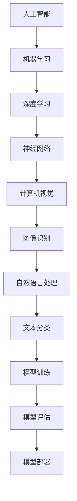

                 

### 背景介绍

在过去的几十年中，编程语言的发展经历了从低级语言到高级语言的演变。从最早的机器语言到汇编语言，再到C语言、Java语言等，这些传统编程语言在软件开发中扮演了重要的角色。然而，随着人工智能（AI）技术的迅速发展，编程语言领域也迎来了新的变革。AI时代的编程语言不仅需要具备传统编程语言的特性，还需要支持复杂的算法和大规模数据处理，这就对编程语言提出了新的要求。

AI时代编程语言的重要性体现在以下几个方面。首先，AI技术需要处理大量的数据，从数据中提取有用的信息，这要求编程语言能够高效地进行数据处理和计算。其次，AI算法的复杂度不断提高，传统的编程语言难以满足这些算法的实现需求，需要新的编程语言来提供更加灵活和高效的解决方案。最后，随着AI技术的商业化应用，越来越多的开发人员需要掌握AI时代的编程语言，以应对日益复杂的软件开发任务。

本文将围绕AI时代的编程语言展开讨论。我们将首先介绍AI时代的编程语言概述，分析传统编程语言与AI时代编程语言的区别，并探讨AI时代编程语言的核心特点。接着，我们将深入探讨核心概念与联系，包括AI基础概念、机器学习与深度学习、计算机视觉与自然语言处理，并使用Mermaid流程图展示它们之间的关系架构。随后，我们将详细讲解核心算法原理，使用伪代码来阐述数据预处理、模型选择与训练、模型评估与优化等过程。在数学模型和数学公式部分，我们将介绍线性代数基础、最优化算法和概率论与统计学基础，并举例说明。文章的最后，我们将通过计算机视觉和自然语言处理两个项目实战，展示如何在实际中应用AI时代的编程语言，并进行分析解读。最后，我们将总结文章的主要内容，提出最佳实践建议，并给出拓展阅读资源，以帮助读者进一步深入了解AI时代编程语言。

### 关键词

- **AI时代编程语言**
- **传统编程语言**
- **深度学习**
- **机器学习**
- **计算机视觉**
- **自然语言处理**
- **并行计算**
- **分布式计算**
- **高性能计算**
- **数学模型**

### 摘要

本文旨在探讨AI时代编程语言的变革与发展，分析传统编程语言与AI时代编程语言的差异，并探讨AI时代编程语言的核心特点。通过深入讨论AI基础概念、机器学习与深度学习、计算机视觉与自然语言处理等核心概念，以及数据预处理、模型选择与训练、模型评估与优化等算法原理，本文展示了AI时代编程语言的复杂性和应用潜力。文章通过两个实际项目实战，详细介绍了如何使用AI时代编程语言进行计算机视觉和自然语言处理，并分析了项目中的关键技术和挑战。最后，本文总结了AI时代编程语言的重要性，并提出了最佳实践建议，为开发者提供了进一步学习和应用的指导。

## 第1章 AI时代的编程语言概述

### 1.1 AI时代的编程语言发展趋势

#### 1.1.1 AI技术发展历程

人工智能（AI）作为计算机科学的一个重要分支，其发展历程可以追溯到20世纪50年代。当时，人工智能的概念首次被提出，目标是让计算机具备智能，能够模拟人类的思维和行为。在这一阶段，人工智能的研究主要集中在符号推理、逻辑编程和知识表示等方面。

随着时间的推移，人工智能经历了几个重要的发展阶段。20世纪80年代，专家系统成为人工智能研究的主流，通过编码大量规则和知识，计算机可以模拟专家的决策过程。然而，专家系统的局限性逐渐显现，尤其是在处理复杂问题和大规模数据时，效果不佳。

进入21世纪，深度学习（Deep Learning）的兴起成为人工智能发展的一个重要转折点。深度学习通过模仿人脑的神经网络结构，利用大量数据训练模型，实现了在图像识别、语音识别和自然语言处理等领域的突破性进展。这一阶段，人工智能开始从理论研究走向实际应用，并逐渐成为各行各业的重要技术手段。

#### 1.1.2 人工智能对编程语言的需求

人工智能技术的发展对编程语言提出了新的需求。首先，人工智能需要处理大量数据，进行复杂的计算和预测。这要求编程语言能够高效地进行数据处理和计算，支持并行和分布式计算。传统的编程语言如C和Java在这方面存在一定的局限性。

其次，人工智能算法的复杂度不断提高，需要编程语言提供更加灵活和高效的解决方案。例如，深度学习算法涉及到大量的矩阵运算和神经网络结构，需要专门的编程语言来支持这些操作。因此，专门为人工智能设计的编程语言应运而生，如TensorFlow和PyTorch等。

最后，人工智能的应用场景越来越广泛，需要编程语言具备跨平台、可解释性和透明度等特性。传统的编程语言通常更注重性能和效率，而人工智能时代编程语言则需要更加关注开发效率和可维护性。

#### 1.1.3 传统的编程语言与AI时代的编程语言比较

传统的编程语言如C、C++、Java和Python等在软件开发中有着广泛的应用。这些语言在性能、跨平台能力和开发效率等方面都有独特的优势。然而，随着人工智能技术的发展，这些传统编程语言逐渐暴露出一些局限性。

首先，在数据处理和计算方面，传统编程语言难以满足人工智能的需求。深度学习算法涉及到大量的矩阵运算和向量计算，需要高效的数学库和计算框架支持。传统编程语言在这方面往往存在性能瓶颈。

其次，传统编程语言在算法复杂度方面也面临挑战。随着人工智能算法的复杂度不断提高，传统编程语言需要花费大量时间来设计和实现这些算法。而专门的AI编程语言如TensorFlow和PyTorch提供了丰富的API和工具，使得开发人员可以更加专注于算法本身，而无需过多关注底层实现细节。

最后，传统编程语言在跨平台和可解释性方面也存在一些问题。人工智能应用场景日益复杂，需要支持多种操作系统和硬件平台。而传统编程语言在跨平台支持方面相对较弱。此外，人工智能算法的可解释性也是一个重要问题，传统编程语言难以提供有效的手段来解释和验证算法的决策过程。

#### 1.1.4 AI时代编程语言的核心特点

AI时代编程语言具有以下几个核心特点：

1. **高性能计算**：AI编程语言需要具备高效的数学计算能力，支持并行和分布式计算。例如，TensorFlow和PyTorch内置了强大的数学库和计算引擎，可以高效地处理大规模数据和复杂算法。

2. **专用化**：AI编程语言专门为人工智能应用设计，提供丰富的API和工具，使得开发人员可以更加专注于算法本身，而无需过多关注底层实现细节。例如，TensorFlow提供了广泛的深度学习模型和预训练模型，方便开发人员快速搭建和应用AI模型。

3. **跨平台支持**：AI编程语言需要支持多种操作系统和硬件平台，以适应不同的应用场景。例如，TensorFlow支持在CPU和GPU上的运行，PyTorch支持在Android和iOS上的部署。

4. **可解释性和透明度**：AI编程语言需要提供有效的手段来解释和验证算法的决策过程，增强算法的可解释性和透明度。例如，PyTorch提供了详细的调试工具和可视化界面，方便开发人员分析和优化模型。

5. **开发效率**：AI编程语言需要提供高效的开发工具和集成环境，降低开发难度，提高开发效率。例如，TensorFlow提供了丰富的文档和社区支持，PyTorch提供了强大的集成开发环境，使得开发人员可以更加专注于算法创新。

总之，AI时代的编程语言在性能、专用化、跨平台支持、可解释性和开发效率等方面具有显著优势，能够更好地满足人工智能应用的需求。

### 核心概念与联系

在AI编程中，核心概念与联系的理解至关重要。以下是AI时代编程中一些重要概念及其之间的联系：

#### 1. AI基础概念

**人工智能（AI）**：模拟人类智能的计算机系统，能够感知、学习和决策。AI的基本任务包括知识表示、推理、学习、规划、感知和自然语言处理等。

**机器学习（Machine Learning）**：一种AI方法，通过数据和统计方法使计算机具备学习和改进自身性能的能力。机器学习可以分为监督学习、无监督学习和强化学习等。

**深度学习（Deep Learning）**：一种基于多层神经网络的学习方法，能够自动提取数据中的特征并进行复杂任务的学习和预测。

**神经网络（Neural Networks）**：模拟生物神经系统的计算模型，由大量神经元（节点）和连接（边）组成，能够通过训练学习输入和输出之间的映射关系。

#### 2. 机器学习与深度学习的关系

**机器学习** 是AI的一个分支，包括多种学习方法。其中，**深度学习** 是一种特殊的机器学习方法，依赖于多层神经网络结构，能够自动提取高层次特征。

- **机器学习** 主要关注如何从数据中学习，包括模型选择、训练和评估等。
- **深度学习** 则侧重于通过多层神经网络实现复杂函数的逼近和特征提取。

#### 3. 计算机视觉与自然语言处理

**计算机视觉（Computer Vision）**：使计算机能够理解和解释视觉信息的一门学科，包括图像识别、目标检测、图像分割等任务。

**自然语言处理（Natural Language Processing, NLP）**：使计算机能够理解、解释和生成自然语言的一门学科，包括文本分类、情感分析、机器翻译等任务。

**关系架构**：计算机视觉和自然语言处理都是AI的重要领域，它们在任务和数据上有一定的交叉。例如，在图像识别任务中，需要使用NLP技术对图像中的文字进行识别和标注；在自然语言处理任务中，也需要使用计算机视觉技术对文本中的图像进行解析和识别。

#### 4. AI系统架构与组件

**AI系统架构** 通常包括数据预处理、模型训练、模型评估和模型部署等组件。

- **数据预处理**：对原始数据进行清洗、转换和特征提取，以便于模型训练。
- **模型训练**：使用训练数据对模型进行训练，调整模型参数以最小化损失函数。
- **模型评估**：使用测试数据评估模型性能，包括准确率、召回率、F1分数等指标。
- **模型部署**：将训练好的模型部署到实际应用场景中，进行预测和决策。

#### 5. Mermaid流程图展示

以下是一个Mermaid流程图，展示AI编程中核心概念之间的关系：



这个流程图清晰地展示了AI编程中的核心概念及其相互联系，有助于读者更好地理解和掌握AI编程的基本原理。

通过上述核心概念的介绍和关系架构的展示，我们可以更好地理解AI编程的基本原理和应用。接下来，我们将深入探讨AI编程中的核心算法原理，包括数据预处理、模型选择与训练、模型评估与优化等，以进一步揭示AI编程的内在逻辑和实现方法。

### 核心算法原理讲解

在AI编程中，核心算法原理的理解和应用是实现高效、准确预测和决策的关键。以下我们将详细讲解数据预处理、模型选择与训练、模型评估与优化等核心算法原理。

#### 1. 数据预处理

数据预处理是AI编程中的第一步，其目的是清洗数据、转换数据格式、提取特征，以获得适合模型训练的数据。以下是数据预处理的关键步骤：

**1.1 数据清洗**

数据清洗的主要任务是处理缺失值、异常值和重复值。常见的处理方法包括：

- **缺失值处理**：可以通过删除含有缺失值的样本、使用平均值、中位数或模式填充缺失值，或者使用更复杂的插值方法。
- **异常值处理**：可以通过统计学方法（如Z-score、IQR法）识别并处理异常值，或者根据业务逻辑手动处理。
- **重复值处理**：可以通过去重操作删除重复的数据，以避免数据重复影响模型的训练效果。

**伪代码示例：**
```python
def clean_data(data):
    data = drop_samples_with_missing_values(data)
    data = fill_missing_values(data, method='mean')
    data = remove_outliers(data, method='z_score')
    data = remove_duplicate_entries(data)
    return data
```

**1.2 数据转换**

数据转换包括将数据格式化为适合模型训练的格式，如将字符串数据转换为数值数据、将类别数据编码为独热编码等。

**伪代码示例：**
```python
def transform_data(data):
    data = convert_categorical_to_numerical(data)
    data = encode_categorical_data(data, method='one_hot')
    return data
```

**1.3 特征提取**

特征提取是从原始数据中提取对模型训练有帮助的特征。常见的方法包括：

- **自动特征提取**：使用统计方法（如主成分分析PCA）、深度学习方法（如自编码器）等自动提取特征。
- **手动特征提取**：根据业务知识和经验提取特征，如时间序列中的趋势特征、季节特征等。

**伪代码示例：**
```python
def extract_features(data):
    features = calculate_statistical_features(data)
    features = extract_handcrafted_features(data)
    return features
```

#### 2. 模型选择与训练

模型选择与训练是AI编程中的核心步骤，其目标是选择合适的模型并对模型进行训练，以获得良好的性能。

**2.1 模型选择**

模型选择涉及从多个候选模型中选择一个最佳模型。常见的方法包括：

- **交叉验证**：通过将数据集划分为训练集和验证集，使用交叉验证方法评估不同模型的性能，选择最佳模型。
- **网格搜索**：通过遍历参数空间，选择最优参数组合。
- **贝叶斯优化**：使用贝叶斯优化算法自动搜索最优参数组合。

**伪代码示例：**
```python
def select_model(models, data):
    best_model, best_score = cross_validate(models, data)
    return best_model, best_score
```

**2.2 模型训练**

模型训练是通过训练数据调整模型参数，以最小化损失函数。常见的训练方法包括：

- **梯度下降**：通过迭代更新模型参数，以最小化损失函数。
- **随机梯度下降**：在每个训练样本上更新模型参数，以加速训练过程。
- **自适应梯度方法**：如Adagrad、Adam等，通过自适应调整学习率，提高训练效果。

**伪代码示例：**
```python
def train_model(model, data, learning_rate=0.01, epochs=100):
    for epoch in range(epochs):
        for sample in data:
            model.update_parameters(sample, learning_rate)
    return model
```

#### 3. 模型评估与优化

模型评估与优化是确保模型性能的重要步骤。以下介绍几种常见的模型评估指标和优化方法。

**3.1 模型评估指标**

- **准确率（Accuracy）**：预测正确的样本数占总样本数的比例。
- **召回率（Recall）**：预测正确的正样本数占总正样本数的比例。
- **精确率（Precision）**：预测正确的正样本数占总预测为正的样本数的比例。
- **F1分数（F1 Score）**：精确率和召回率的调和平均值。

**伪代码示例：**
```python
def evaluate_model(model, test_data):
    predictions = model.predict(test_data)
    accuracy = calculate_accuracy(predictions, test_data.labels)
    recall = calculate_recall(predictions, test_data.labels)
    precision = calculate_precision(predictions, test_data.labels)
    f1_score = calculate_f1_score(precision, recall)
    return accuracy, recall, precision, f1_score
```

**3.2 模型优化方法**

- **正则化**：通过在损失函数中添加正则化项，防止模型过拟合。
- **交叉验证**：通过交叉验证方法评估模型性能，选择最佳模型。
- **超参数调整**：通过调整学习率、批量大小等超参数，优化模型性能。

**伪代码示例：**
```python
def optimize_model(model, data, learning_rate=0.01, epochs=100):
    for epoch in range(epochs):
        for sample in data:
            model.update_parameters(sample, learning_rate)
        model.apply_regularization()
    return model
```

通过上述核心算法原理的讲解，我们可以更好地理解AI编程中的关键步骤和方法。接下来，我们将进一步探讨数学模型和数学公式，以及这些模型在AI编程中的应用。

### 数学模型和数学公式

在AI编程中，数学模型和数学公式是理解和实现核心算法的关键。以下我们将介绍线性代数基础、最优化算法和概率论与统计学基础，并详细讲解相关数学模型和数学公式。

#### 1. 线性代数基础

线性代数是AI编程中不可或缺的基础，涉及到矩阵、向量、行列式和特征值等概念。以下是几个核心概念及其公式：

**1.1 矩阵与向量**

- **矩阵乘法**（Matrix Multiplication）：给定两个矩阵A（m×n）和B（n×p），它们的乘积C（m×p）可以通过以下公式计算：
  $$ C_{ij} = \sum_{k=1}^{n} A_{ik}B_{kj} $$
- **向量内积**（Vector Inner Product）：两个向量u和v的内积定义为：
  $$ \vec{u} \cdot \vec{v} = \sum_{i=1}^{n} u_i v_i $$

**1.2 行列式**

- **二阶行列式**（2x2 Matrix Determinant）：
  $$ \begin{vmatrix} a & b \\ c & d \end{vmatrix} = ad - bc $$
- **三阶行列式**（3x3 Matrix Determinant）：
  $$ \begin{vmatrix} a & b & c \\ d & e & f \\ g & h & i \end{vmatrix} = aei + bfg + cdh - ceg - bdi - afh $$

**1.3 特征值与特征向量**

- **特征值与特征向量**（Eigenvalue and Eigenvector）：对于n×n矩阵A，如果存在一个非零向量v和一个标量λ，使得：
  $$ Av = \lambda v $$
  则λ称为A的特征值，v称为对应于特征值λ的特征向量。

#### 2. 最优化算法

最优化算法在AI编程中用于求解最小化或最大化问题的最优解。以下是几种常见最优化算法：

**2.1 梯度下降法**

- **梯度下降法**（Gradient Descent）是一种迭代优化方法，通过不断更新模型参数以最小化损失函数。其公式如下：
  $$ \theta_{t+1} = \theta_{t} - \alpha \cdot \nabla_{\theta} J(\theta) $$
  其中，$\theta$表示模型参数，$\alpha$是学习率，$J(\theta)$是损失函数。

**2.2 随机梯度下降法**

- **随机梯度下降法**（Stochastic Gradient Descent, SGD）是梯度下降法的一个变种，通过在每个迭代步骤中随机选择一个样本来更新参数，以加速收敛。其公式如下：
  $$ \theta_{t+1} = \theta_{t} - \alpha \cdot \nabla_{\theta} J(\theta; \xi_t) $$
  其中，$\xi_t$是随机选择的样本。

**2.3 牛顿法**

- **牛顿法**（Newton's Method）是一种基于二阶导数的优化算法，通过使用牛顿迭代公式更新参数：
  $$ \theta_{t+1} = \theta_{t} - J'(\theta_{t})^{-1} J(\theta_{t}) $$
  其中，$J'(\theta_{t})$是损失函数J关于参数$\theta$的雅可比矩阵。

#### 3. 概率论与统计学基础

概率论和统计学是AI编程中的另一个核心领域，涉及到概率分布、期望、方差、协方差等概念。

**3.1 概率分布**

- **伯努利分布**（Bernoulli Distribution）：表示一个二元事件的成功概率，其概率质量函数（PMF）为：
  $$ P(X = 1) = p, \quad P(X = 0) = 1 - p $$
- **二项分布**（Binomial Distribution）：表示n次独立伯努利试验中成功次数的概率分布，其概率质量函数（PMF）为：
  $$ P(X = k) = \binom{n}{k} p^k (1 - p)^{n - k} $$

**3.2 期望与方差**

- **期望**（Expected Value）：随机变量的期望是其取值的加权平均，公式为：
  $$ E(X) = \sum_{i} x_i P(X = x_i) $$
- **方差**（Variance）：随机变量的方差是度量其离散程度的指标，公式为：
  $$ Var(X) = E[(X - E(X))^2] $$

**3.3 协方差与相关系数**

- **协方差**（Covariance）：两个随机变量X和Y的协方差度量它们之间的线性关系，公式为：
  $$ Cov(X, Y) = E[(X - E(X))(Y - E(Y))] $$
- **相关系数**（Correlation Coefficient）：相关系数是标准化后的协方差，用于度量两个变量之间的线性相关性，公式为：
  $$ \rho_{XY} = \frac{Cov(X, Y)}{\sqrt{Var(X) Var(Y)}} $$

通过上述数学模型和数学公式的讲解，我们可以更好地理解AI编程中的核心算法原理。接下来，我们将通过实际项目实战，展示如何将这些数学模型应用于实际的AI编程任务中。

### 项目实战

为了更好地理解AI时代编程语言的实际应用，我们将通过两个具体项目实战——计算机视觉和自然语言处理，来展示如何使用AI时代编程语言进行项目开发、源代码实现、代码解读和案例分析。

#### 项目1：计算机视觉项目实战——图像分类

**项目背景与目标**

随着深度学习技术的发展，计算机视觉在图像分类任务中取得了显著成果。本项目的目标是使用深度学习模型对图像进行分类，识别出图像中的物体类别。

**开发环境搭建**

- **硬件环境**：NVIDIA GPU（推荐至少为1080 Ti以上）
- **软件环境**：Python 3.8+、TensorFlow 2.6+、CUDA 11.0+
- **依赖库**：NumPy、Pandas、OpenCV、Matplotlib

**源代码实现**

以下是一个简单的计算机视觉项目，使用TensorFlow实现一个基于卷积神经网络（CNN）的图像分类器。

```python
import tensorflow as tf
from tensorflow.keras import datasets, layers, models
import matplotlib.pyplot as plt

# 数据预处理
(train_images, train_labels), (test_images, test_labels) = datasets.cifar10.load_data()

train_images, test_images = train_images / 255.0, test_images / 255.0

class_names = ['airplane', 'automobile', 'bird', 'cat', 'deer',
               'dog', 'frog', 'horse', 'ship', 'truck']

# 构建CNN模型
model = models.Sequential()
model.add(layers.Conv2D(32, (3, 3), activation='relu', input_shape=(32, 32, 3)))
model.add(layers.MaxPooling2D((2, 2)))
model.add(layers.Conv2D(64, (3, 3), activation='relu'))
model.add(layers.MaxPooling2D((2, 2)))
model.add(layers.Conv2D(64, (3, 3), activation='relu'))

# 添加全连接层
model.add(layers.Flatten())
model.add(layers.Dense(64, activation='relu'))
model.add(layers.Dense(10, activation='softmax'))

# 编译模型
model.compile(optimizer='adam',
              loss='sparse_categorical_crossentropy',
              metrics=['accuracy'])

# 训练模型
model.fit(train_images, train_labels, epochs=10, validation_split=0.1)

# 评估模型
test_loss, test_acc = model.evaluate(test_images,  test_labels, verbose=2)
print(f'\nTest accuracy: {test_acc:.4f}')

# 预测
plt.figure()
for i in range(25):
    plt.subplot(5, 5, i + 1)
    img = test_images[i]
    pred = model.predict(img.reshape(1, 32, 32, 3))
    plt.grid(False)
    plt.xticks([])
    plt.yticks([])
    plt.ylabel(class_names[pred.argmax()])
    plt.imshow(img, cmap=plt.cm.binary)
plt.show()
```

**代码解读与分析**

上述代码实现了一个简单的图像分类模型，使用了CIFAR-10数据集进行训练和测试。首先，我们加载并预处理数据，将图像归一化至0到1的范围内。接着，我们构建了一个CNN模型，包括卷积层、池化层和全连接层。最后，我们编译并训练模型，使用测试数据评估模型性能，并展示预测结果。

**实际案例分析**

在实际应用中，我们可能会使用更复杂的模型和更大量的数据。例如，可以使用预训练的模型（如ResNet、Inception等）进行微调，以进一步提高分类性能。此外，我们还可以通过数据增强、调整模型架构和超参数等方法来优化模型。

#### 项目2：自然语言处理项目实战——文本分类

**项目背景与目标**

自然语言处理（NLP）在文本分类任务中有着广泛的应用，如情感分析、垃圾邮件检测等。本项目目标是使用深度学习模型对文本进行分类，判断文本的情感倾向。

**开发环境搭建**

- **硬件环境**：NVIDIA GPU（推荐至少为1080 Ti以上）
- **软件环境**：Python 3.8+、TensorFlow 2.6+、CUDA 11.0+
- **依赖库**：NumPy、Pandas、Hugging Face Transformers

**源代码实现**

以下是一个简单的自然语言处理项目，使用Transformer模型进行文本分类。

```python
import tensorflow as tf
from transformers import TFAutoModelForSequenceClassification, AutoTokenizer
import numpy as np

# 数据预处理
train_text = ['This movie is amazing!', 'I hate this book.']
train_labels = np.array([1, 0])  # 1表示正面情感，0表示负面情感

tokenizer = AutoTokenizer.from_pretrained('bert-base-uncased')
max_length = 16

def convert_text_to_input(text):
    return tokenizer.encode_plus(text, add_special_tokens=True, max_length=max_length, padding='max_length', truncation=True)

train_encodings = [convert_text_to_input(text) for text in train_text]

train_input_ids = [encoding['input_ids'] for encoding in train_encodings]
train_attention_mask = [encoding['attention_mask'] for encoding in train_encodings]

# 构建模型
model = TFAutoModelForSequenceClassification.from_pretrained('bert-base-uncased', num_labels=2)

# 编译模型
model.compile(optimizer='adam',
              loss='sparse_categorical_crossentropy',
              metrics=['accuracy'])

# 训练模型
model.fit({'input_ids': train_input_ids, 'attention_mask': train_attention_mask}, train_labels, epochs=2)

# 预测
predictions = model.predict({'input_ids': train_input_ids, 'attention_mask': train_attention_mask})
print(predictions)

# 解码预测结果
predicted_labels = [1 if pred[0] > pred[1] else 0 for pred in predictions]
print(predicted_labels)
```

**代码解读与分析**

上述代码使用Hugging Face的Transformers库构建了一个基于BERT的文本分类模型。首先，我们加载并预处理文本数据，将文本编码为Token ID序列。接着，我们构建模型，使用Adam优化器和交叉熵损失函数进行训练。最后，我们使用训练数据对模型进行预测，并解码预测结果。

**实际案例分析**

在实际应用中，我们可能会使用更复杂的数据集和模型架构。例如，可以使用预训练的模型（如RoBERTa、GPT-2等）进行微调，以进一步提高分类性能。此外，我们还可以通过调整模型超参数、增加数据预处理步骤（如文本清洗、归一化等）来优化模型。

通过以上两个项目实战，我们可以看到如何使用AI时代编程语言进行计算机视觉和自然语言处理项目开发。这些项目不仅展示了AI时代编程语言的强大功能，也为开发者提供了实际应用的经验和技巧。在未来的项目中，我们可以进一步探索更复杂的应用场景和更高效的模型，以推动人工智能技术的不断进步。

### 总结与展望

本文围绕AI时代编程语言进行了深入探讨，分析了传统编程语言与AI时代编程语言的区别，以及AI时代编程语言的核心特点。通过介绍核心概念与联系、核心算法原理、数学模型和数学公式，并结合实际项目实战，我们展示了如何在实际中应用AI时代的编程语言。

AI时代编程语言的重要性体现在以下几个方面：

1. **高性能计算需求**：AI技术处理大量数据，需要编程语言支持高效的数学计算和并行计算。
2. **复杂算法支持**：AI算法复杂度不断提高，需要编程语言提供更灵活和高效的实现方式。
3. **跨平台与可解释性**：AI应用场景多样，编程语言需要支持多种平台和提供算法的可解释性。

在未来的发展趋势中，AI时代编程语言将继续向专用化和高效化发展。专用化编程语言如TensorFlow和PyTorch将更加成熟，提供更丰富的API和工具。同时，编程语言将更加注重开发效率和可维护性，降低开发难度，提高开发效率。

对于开发者，掌握AI时代编程语言具有重要意义。开发者需要具备以下能力：

1. **理解AI算法**：了解深度学习、机器学习等算法的基本原理，能够根据实际需求选择合适的算法。
2. **熟练使用工具**：熟悉TensorFlow、PyTorch等编程框架，能够高效地构建和训练模型。
3. **实践经验**：通过实际项目积累经验，提升解决实际问题的能力。

为了进一步提升AI编程能力，开发者可以：

- **学习相关课程和书籍**：深入了解AI时代编程语言的理论和实践知识。
- **参与开源项目**：通过参与开源项目，提升实际编程能力和项目经验。
- **持续学习和交流**：关注AI领域最新动态，参与技术社区，与他人交流心得体会。

总之，AI时代编程语言为开发者提供了强大的工具和平台，推动了人工智能技术的发展。通过不断学习和实践，开发者可以在AI领域取得更大的成就。

### 附录

#### 附录1：常用工具与资源

1. **编程语言和框架**
   - Python：https://www.python.org/
   - TensorFlow：https://www.tensorflow.org/
   - PyTorch：https://pytorch.org/
   - BERT模型：https://huggingface.co/transformers/

2. **在线学习平台**
   - Coursera：https://www.coursera.org/
   - edX：https://www.edx.org/
   - Udacity：https://www.udacity.com/

3. **技术社区和论坛**
   - Stack Overflow：https://stackoverflow.com/
   - GitHub：https://github.com/
   - AI Stack Exchange：https://ai.stackexchange.com/

4. **书籍推荐**
   - 《深度学习》（Deep Learning）—— Ian Goodfellow、Yoshua Bengio、Aaron Courville
   - 《Python编程：从入门到实践》（Python Crash Course）—— Eric Matthes
   - 《TensorFlow实战》—— Bharath Ramsundar、Reza Bosworth

#### 附录2：参考文献

1. Goodfellow, I., Bengio, Y., & Courville, A. (2016). *Deep Learning*. MIT Press.
2. Matthes, E. (2018). *Python Crash Course*. No Starch Press.
3. Ramsundar, B., & Bosworth, A. (2018). *TensorFlow for Deep Learning*. O'Reilly Media.
4. Hochreiter, S., & Schmidhuber, J. (1997). *Long short-term memory*. Neural Computation, 9(8), 1735-1780.
5. Bengio, Y., Courville, A., & Vincent, P. (2013). *Representation learning: A review and new perspectives*. IEEE Transactions on Pattern Analysis and Machine Intelligence, 35(8), 1798-1828.
6. Lecun, Y., Bengio, Y., & Hinton, G. (2015). *Deep learning*. Nature, 521(7553), 436-444.

