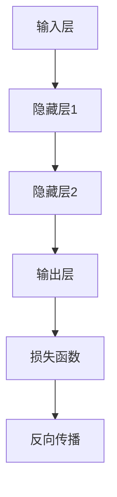

                 

# AI编程的新思维与新方向

> 关键词：AI编程、新思维、新方向、深度学习、强化学习、自然语言处理、边缘计算、物联网

> 摘要：本文旨在探讨AI编程的新思维与新方向。首先，我们将回顾AI编程的基础知识，包括核心概念、算法和工具。接着，我们将深入探讨AI编程的新思维，如强化学习和自然语言处理，并分析其在决策优化和文本生成中的应用。随后，我们将介绍AI编程的新方向，包括AI与边缘计算、物联网和自动化的融合。最后，我们将展望AI编程的未来趋势，探讨其对社会的潜在影响。

## 目录

## 第一部分: AI编程基础与核心概念

### 第1章: AI编程概述

- AI编程的概念与分类

- 人工智能的发展历程

- AI编程的应用领域

### 第2章: 人工智能核心概念

- 机器学习基础

- 深度学习原理

- 强化学习基本概念

- 自然语言处理基础

### 第3章: 人工智能算法

- 监督学习算法

- 非监督学习算法

- 强化学习算法

- 自然语言处理算法

### 第4章: AI编程工具与环境

- 编程语言选择

- 开发工具与框架

- 数据预处理与清洗

- AI编程环境搭建

## 第二部分: AI编程新思维

### 第5章: AI编程新思维概述

- AI编程新思维的重要性

- AI编程新趋势

- AI编程新方向

### 第6章: 强化学习与决策优化

- 强化学习基本原理

- 强化学习算法分析

- 决策优化应用实例

### 第7章: 自然语言处理与生成式模型

- 生成式模型基础

- 语言模型与翻译模型

- 文本生成与摘要

### 第8章: 深度学习与大数据分析

- 深度学习在数据分析中的应用

- 大数据处理的挑战与解决方案

- 深度学习在商业数据分析中的应用

## 第三部分: AI编程新方向

### 第9章: AI编程与边缘计算

- 边缘计算的概念与架构

- 边缘计算中的AI应用

- AI编程在边缘计算中的挑战与解决方案

### 第10章: AI编程与物联网

- 物联网的概念与体系结构

- AI编程在物联网中的应用

- 物联网中的AI编程挑战与解决方案

### 第11章: AI编程与自动化

- 自动化的概念与分类

- AI编程在自动化中的应用

- 自动化编程新思维

### 第12章: AI编程与智能交通

- 智能交通系统概述

- AI编程在智能交通中的应用

- 智能交通编程挑战与解决方案

### 第13章: 未来AI编程展望

- AI编程的未来趋势

- AI编程的发展方向

- AI编程对社会的潜在影响

## 附录

### 附录A: AI编程资源与工具

- 编程语言资源

- 开发工具与框架

- 数据集与资源库

- 在线学习资源与课程推荐

### 附录B: 伪代码与数学公式示例

- 监督学习算法伪代码

- 深度学习神经网络结构图

- 自然语言处理数学公式

- 强化学习算法数学模型

## 第一部分: AI编程基础与核心概念

### 第1章: AI编程概述

#### 1.1 AI编程的概念与分类

AI编程是指使用编程语言和工具开发人工智能系统的过程。AI系统可以是机器学习模型、自然语言处理应用、计算机视觉系统等。根据应用场景和目标，AI编程可以分为以下几类：

1. **机器学习编程**：包括监督学习、非监督学习和强化学习等。

2. **自然语言处理编程**：涉及文本分类、情感分析、机器翻译等。

3. **计算机视觉编程**：包括图像识别、目标检测、图像分割等。

4. **语音识别与合成编程**：涉及语音识别、语音合成、语音增强等。

#### 1.2 人工智能的发展历程

人工智能（AI）的发展历程可以分为几个重要阶段：

1. **早期探索（1950s-1960s）**：人工智能概念的提出和早期研究。

2. **符号主义时代（1970s-1980s）**：基于逻辑推理的专家系统。

3. **知识表示与推理（1990s）**：基于知识的系统。

4. **统计学习时代（2000s）**：基于数据驱动的机器学习方法。

5. **深度学习时代（2010s-至今）**：基于神经网络的方法，如卷积神经网络（CNN）和循环神经网络（RNN）。

#### 1.3 AI编程的应用领域

AI编程在多个领域都有广泛的应用：

1. **金融**：用于风险管理、算法交易、客户服务自动化等。

2. **医疗**：用于疾病诊断、药物研发、医疗图像分析等。

3. **制造业**：用于自动化生产线、质量检测、供应链优化等。

4. **零售**：用于客户行为分析、推荐系统、库存管理等。

5. **交通**：用于自动驾驶、智能交通系统、航班调度等。

6. **娱乐**：用于游戏开发、虚拟助手、内容推荐等。

### 第2章: 人工智能核心概念

#### 2.1 机器学习基础

机器学习（Machine Learning）是一种通过算法让计算机从数据中学习并做出预测或决策的技术。机器学习可以分为以下几种类型：

1. **监督学习（Supervised Learning）**：有监督的学习方法，模型根据已知输入和输出训练。

2. **非监督学习（Unsupervised Learning）**：无监督的学习方法，模型根据数据分布或相似性进行训练。

3. **半监督学习（Semi-Supervised Learning）**：结合监督学习和非监督学习，使用少量标记数据和大量未标记数据。

4. **强化学习（Reinforcement Learning）**：通过奖励机制学习策略，使其在特定环境中做出最优决策。

#### 2.2 深度学习原理

深度学习（Deep Learning）是机器学习的一个重要分支，基于多层神经网络（Neural Networks）的结构。深度学习的主要思想是通过神经网络模拟人脑的神经元连接，通过大量数据的训练，使网络自动学习特征表示和决策规则。

深度学习的关键组成部分包括：

1. **神经网络**：一种模拟人脑神经元连接的计算模型。

2. **卷积神经网络（CNN）**：用于图像处理和计算机视觉。

3. **循环神经网络（RNN）**：用于序列数据，如时间序列分析、自然语言处理。

4. **生成对抗网络（GAN）**：用于生成逼真的数据。

#### 2.3 强化学习基本概念

强化学习（Reinforcement Learning）是一种通过试错和反馈学习策略的机器学习方法。在强化学习中，智能体（Agent）通过与环境（Environment）交互，根据奖励（Reward）调整其行为（Action），以最大化长期奖励。

强化学习的关键组成部分包括：

1. **智能体（Agent）**：执行行为并接收环境反馈的实体。

2. **环境（Environment）**：与智能体交互的实体。

3. **状态（State）**：智能体在环境中的当前状态。

4. **动作（Action）**：智能体可以执行的行为。

5. **奖励（Reward）**：对智能体的行为给予的奖励或惩罚。

#### 2.4 自然语言处理基础

自然语言处理（Natural Language Processing，NLP）是人工智能的一个分支，致力于让计算机理解和处理人类语言。NLP的主要任务包括：

1. **文本分类**：将文本数据分类到预定义的类别。

2. **情感分析**：分析文本中的情感倾向。

3. **命名实体识别**：识别文本中的特定实体，如人名、地点、组织等。

4. **机器翻译**：将一种语言的文本翻译成另一种语言。

5. **文本生成**：生成新的文本，如文章、摘要、对话等。

NLP的关键技术包括：

1. **词向量**：将文本表示为向量的方法。

2. **语言模型**：用于预测下一个单词或字符的概率。

3. **序列到序列模型**：用于机器翻译、对话生成等任务。

### 第3章: 人工智能算法

#### 3.1 监督学习算法

监督学习算法是一种从已知输入和输出数据中学习预测模型的机器学习方法。以下是一些常见的监督学习算法：

1. **线性回归（Linear Regression）**：用于预测连续值输出。

2. **逻辑回归（Logistic Regression）**：用于预测二分类输出。

3. **支持向量机（SVM）**：用于分类问题，尤其是高维数据。

4. **决策树（Decision Tree）**：用于分类和回归问题，易于解释。

5. **随机森林（Random Forest）**：基于决策树的集成方法，提高预测性能。

6. **梯度提升树（Gradient Boosting Tree）**：基于决策树的集成方法，通过迭代优化提升预测性能。

#### 3.2 非监督学习算法

非监督学习算法是一种从无标签数据中学习特征表示或数据分布的机器学习方法。以下是一些常见的非监督学习算法：

1. **聚类（Clustering）**：将相似的数据点分组，如K-means、层次聚类。

2. **主成分分析（PCA）**：用于降维，提取数据的主要特征。

3. **自编码器（Autoencoder）**：用于无监督特征学习和降维。

4. **关联规则学习（Association Rule Learning）**：发现数据中的关联关系，如Apriori算法。

5. **异常检测（Anomaly Detection）**：识别数据中的异常值或异常模式。

#### 3.3 强化学习算法

强化学习算法是一种通过试错和反馈学习策略的机器学习方法。以下是一些常见的强化学习算法：

1. **Q学习（Q-Learning）**：基于价值函数的学习方法，通过更新Q值来优化策略。

2. **深度Q网络（Deep Q-Network，DQN）**：基于深度学习的Q学习算法，用于处理高维状态空间。

3. **策略梯度方法（Policy Gradient Methods）**：直接优化策略，如REINFORCE算法。

4. **深度确定性策略梯度（Deep Deterministic Policy Gradient，DDPG）**：用于连续动作空间的强化学习。

5. **Asynchronous Advantage Actor-Critic（A3C）**：基于异步学习的策略优化方法。

#### 3.4 自然语言处理算法

自然语言处理算法是一种用于处理和生成人类语言的机器学习算法。以下是一些常见的NLP算法：

1. **词嵌入（Word Embedding）**：将文本中的单词表示为向量，用于词向量模型。

2. **卷积神经网络（CNN）**：用于文本分类、情感分析等。

3. **循环神经网络（RNN）**：用于序列数据处理，如语言模型、机器翻译。

4. **长短时记忆网络（Long Short-Term Memory，LSTM）**：RNN的一种变体，用于处理长序列数据。

5. **生成式对抗网络（GAN）**：用于生成文本、图像等数据。

6. **Transformer模型**：基于自注意力机制的序列模型，用于机器翻译、文本生成等。

### 第4章: AI编程工具与环境

#### 4.1 编程语言选择

在AI编程中，选择合适的编程语言至关重要。以下是一些常见的编程语言：

1. **Python**：由于其丰富的库和框架，Python成为AI编程的主要语言。

2. **R**：主要用于统计分析和数据可视化。

3. **Java**：在大型企业级应用中广泛使用。

4. **JavaScript**：在Web开发中用于实现机器学习模型。

5. **C/C++**：在需要高性能和系统优化的场景中使用。

#### 4.2 开发工具与框架

以下是一些常见的AI开发工具和框架：

1. **TensorFlow**：由Google开发，支持多种机器学习和深度学习任务。

2. **PyTorch**：由Facebook开发，支持动态计算图，易于调试。

3. **Keras**：用于构建和训练深度学习模型的高级框架。

4. **Scikit-learn**：用于监督学习和非监督学习的Python库。

5. **Scrapy**：用于Web爬虫的数据采集工具。

6. **NLTK**：用于自然语言处理的Python库。

#### 4.3 数据预处理与清洗

数据预处理和清洗是AI编程的重要步骤。以下是一些常见的数据预处理方法：

1. **数据清洗**：去除噪声数据、缺失值填充、异常值处理。

2. **数据转换**：将数据转换为适合机器学习模型的格式。

3. **特征工程**：提取和构造有用的特征，提高模型的预测性能。

4. **数据归一化/标准化**：将数据缩放到统一的尺度。

5. **数据分割**：将数据分为训练集、验证集和测试集。

#### 4.4 AI编程环境搭建

搭建AI编程环境通常包括以下步骤：

1. **操作系统选择**：Windows、macOS或Linux。

2. **安装Python**：选择合适的Python版本，如Python 3.8或3.9。

3. **安装相关库和框架**：如TensorFlow、PyTorch、Scikit-learn等。

4. **配置虚拟环境**：使用virtualenv或conda创建独立的Python环境。

5. **安装依赖项**：使用pip或conda安装所需的依赖项。

6. **配置开发环境**：安装IDE（如PyCharm、VS Code）和代码编辑器。

7. **配置Jupyter Notebook**：用于交互式编程和数据分析。

## 第二部分: AI编程新思维

### 第5章: AI编程新思维概述

#### 5.1 AI编程新思维的重要性

AI编程新思维的重要性体现在以下几个方面：

1. **解决复杂问题**：新思维能够帮助AI系统更好地理解和解决复杂问题。

2. **提高效率**：新思维能够优化算法和模型，提高AI系统的运行效率和准确性。

3. **创新应用**：新思维能够推动AI技术在更多领域的应用，如边缘计算、物联网等。

4. **跨学科融合**：新思维能够促进AI与其他领域的融合，如生物医学、金融科技等。

#### 5.2 AI编程新趋势

以下是一些AI编程的新趋势：

1. **自动化编程**：使用代码生成工具和自动化框架，提高编程效率。

2. **联邦学习**：在分布式环境中训练模型，保护数据隐私。

3. **可解释性AI**：提高AI系统的可解释性，增强用户信任。

4. **迁移学习**：复用预训练模型，提高新任务的表现。

5. **AI安全**：确保AI系统的安全性和鲁棒性，防止恶意攻击。

#### 5.3 AI编程新方向

以下是一些AI编程的新方向：

1. **边缘AI**：在边缘设备上运行AI模型，减少延迟和带宽消耗。

2. **物联网AI**：在物联网设备上实现AI功能，提高设备的智能化水平。

3. **自动化决策系统**：使用AI技术实现自动化决策，提高业务效率。

4. **智能交通系统**：使用AI技术优化交通管理，提高交通效率。

5. **AI伦理与法律**：探讨AI伦理和法律问题，确保AI技术的可持续发展。

### 第6章: 强化学习与决策优化

#### 6.1 强化学习基本原理

强化学习（Reinforcement Learning，RL）是一种通过试错和反馈学习策略的机器学习方法。在强化学习中，智能体（Agent）通过与环境（Environment）交互，根据奖励（Reward）调整其行为（Action），以最大化长期奖励。

强化学习的基本组成部分包括：

1. **智能体（Agent）**：执行行为并接收环境反馈的实体。

2. **环境（Environment）**：与智能体交互的实体。

3. **状态（State）**：智能体在环境中的当前状态。

4. **动作（Action）**：智能体可以执行的行为。

5. **奖励（Reward）**：对智能体的行为给予的奖励或惩罚。

强化学习的主要目标是找到一种策略（Policy），使得智能体能够在给定状态下选择最优动作，最大化累积奖励。

#### 6.2 强化学习算法分析

常见的强化学习算法包括：

1. **Q学习（Q-Learning）**：基于价值函数的学习方法，通过更新Q值来优化策略。

2. **深度Q网络（Deep Q-Network，DQN）**：基于深度学习的Q学习算法，用于处理高维状态空间。

3. **策略梯度方法（Policy Gradient Methods）**：直接优化策略，如REINFORCE算法。

4. **深度确定性策略梯度（Deep Deterministic Policy Gradient，DDPG）**：用于连续动作空间的强化学习。

5. **异步优势演员-评论家（Asynchronous Advantage Actor-Critic，A3C）**：基于异步学习的策略优化方法。

这些算法各有优缺点，适用于不同的应用场景。

#### 6.3 决策优化应用实例

强化学习在决策优化领域有广泛应用，以下是一些实例：

1. **资源调度**：在云计算和数据中心中，使用强化学习优化资源分配，提高系统性能。

2. **物流调度**：在物流行业中，使用强化学习优化运输路线和车辆调度，降低运输成本。

3. **能源管理**：在能源行业中，使用强化学习优化电力负载管理和能源分配，提高能源利用效率。

4. **库存管理**：在零售业中，使用强化学习优化库存水平，减少库存成本。

5. **广告投放**：在数字营销中，使用强化学习优化广告投放策略，提高广告效果。

这些实例展示了强化学习在决策优化中的应用潜力和价值。

### 第7章: 自然语言处理与生成式模型

#### 7.1 生成式模型基础

生成式模型（Generative Model）是一种用于生成数据的机器学习模型。生成式模型通过学习数据分布，生成与实际数据相似的新数据。生成式模型包括以下几种类型：

1. **概率图模型**：如贝叶斯网络、马尔可夫网络。

2. **生成对抗网络（GAN）**：通过生成器和判别器之间的对抗训练生成数据。

3. **变分自编码器（VAE）**：通过编码器和解码器生成数据。

4. **变分Inference模型（VB）**：用于推断概率图模型中的参数。

生成式模型在图像生成、文本生成、音乐生成等领域有广泛应用。

#### 7.2 语言模型与翻译模型

语言模型（Language Model）是一种用于预测下一个单词或字符的模型。语言模型在自然语言处理中具有重要应用，如机器翻译、文本生成、语音识别等。

翻译模型（Translation Model）是一种将源语言句子映射到目标语言句子的模型。常见的翻译模型包括：

1. **基于规则的翻译模型**：如基于翻译规则的机器翻译。

2. **统计机器翻译模型**：如基于短语的机器翻译。

3. **基于神经网络的翻译模型**：如基于编码器-解码器的神经网络翻译（Seq2Seq模型）。

4. **基于注意力机制的翻译模型**：如Transformer模型。

这些翻译模型在提高翻译质量和效率方面取得了显著成果。

#### 7.3 文本生成与摘要

文本生成（Text Generation）是一种生成与给定输入相关的文本的方法。文本生成在自然语言处理领域有广泛应用，如自动写作、对话生成、摘要生成等。

摘要生成（Summarization）是一种从原始文本中提取关键信息并生成简明扼要的摘要的方法。摘要生成可以分为以下几种类型：

1. **抽取式摘要（Extractive Summarization）**：从原始文本中直接提取关键句子作为摘要。

2. **生成式摘要（Abstractive Summarization）**：通过生成新的文本来概括原始文本的内容。

3. **混合式摘要（Hybrid Summarization）**：结合抽取式和生成式摘要的优点。

近年来，基于神经网络的方法，如Transformer模型，在文本生成和摘要生成任务中取得了显著成果。

### 第8章: 深度学习与大数据分析

#### 8.1 深度学习在数据分析中的应用

深度学习（Deep Learning）在数据分析（Data Analysis）中具有重要的应用。深度学习能够从大量数据中自动学习特征表示，提高数据分析的效率和准确性。

深度学习在数据分析中的应用包括：

1. **图像识别**：使用卷积神经网络（CNN）对图像进行分类和检测。

2. **文本分类**：使用循环神经网络（RNN）和Transformer模型对文本进行分类和情感分析。

3. **时间序列分析**：使用长短时记忆网络（LSTM）和Transformer模型对时间序列数据进行预测。

4. **异常检测**：使用生成对抗网络（GAN）和自编码器（Autoencoder）对异常数据进行检测。

5. **推荐系统**：使用协同过滤和基于内容的推荐方法，结合深度学习提高推荐效果。

深度学习在数据分析中的应用推动了人工智能技术的发展，为各行业提供了强大的数据分析工具。

#### 8.2 大数据处理的挑战与解决方案

大数据处理（Big Data Processing）面临着数据量巨大、多样性高、实时性强等挑战。以下是一些大数据处理的挑战与解决方案：

1. **数据量巨大**：随着物联网和社交媒体的发展，数据量呈指数级增长。解决方案包括分布式存储和计算，如Hadoop和Spark。

2. **数据多样性**：大数据包括结构化、半结构化和非结构化数据，如文本、图像、音频和视频。解决方案包括数据整合和预处理技术，如ETL（Extract, Transform, Load）。

3. **实时性强**：许多应用场景需要实时处理大数据，如智能交通和金融交易。解决方案包括实时数据处理框架，如Flink和Kafka。

4. **数据安全性**：大数据处理过程中，数据安全和隐私保护是一个重要问题。解决方案包括数据加密、访问控制和隐私保护算法。

5. **数据质量和一致性**：大数据的质量和一致性对分析结果有重要影响。解决方案包括数据清洗、数据验证和数据治理。

#### 8.3 深度学习在商业数据分析中的应用

深度学习在商业数据分析（Business Data Analysis）中具有重要的应用。以下是一些深度学习在商业数据分析中的应用实例：

1. **客户行为分析**：使用深度学习分析客户购买行为，优化营销策略和提高客户满意度。

2. **需求预测**：使用深度学习预测市场需求，优化库存管理和生产计划。

3. **风险管理**：使用深度学习分析金融数据，识别潜在风险并优化投资组合。

4. **人力资源管理**：使用深度学习分析员工绩效和行为，优化招聘和培训策略。

5. **供应链优化**：使用深度学习分析供应链数据，优化物流和库存管理，提高供应链效率。

这些应用实例展示了深度学习在商业数据分析中的巨大潜力。

## 第三部分: AI编程新方向

### 第9章: AI编程与边缘计算

#### 9.1 边缘计算的概念与架构

边缘计算（Edge Computing）是一种分布式计算架构，将数据处理和计算任务从中心化服务器转移到网络边缘的边缘设备上。边缘计算的主要目标是减少数据传输延迟、降低带宽消耗和增强数据隐私。

边缘计算的架构包括以下几个关键组件：

1. **边缘设备（Edge Devices）**：如物联网设备、智能手机、平板电脑等。

2. **边缘节点（Edge Nodes）**：边缘设备上的计算节点，用于处理和存储数据。

3. **边缘服务器（Edge Servers）**：中心化服务器，负责协调边缘设备和边缘节点之间的通信。

4. **边缘网关（Edge Gateways）**：用于连接边缘设备和云服务，实现数据传输和同步。

边缘计算的工作原理是将数据处理和计算任务在边缘设备、边缘节点和边缘服务器之间分配，以实现实时数据处理和智能决策。

#### 9.2 边缘计算中的AI应用

边缘计算在AI领域具有广泛的应用，以下是一些典型的应用场景：

1. **智能监控**：在视频监控系统中，边缘设备实时处理图像和视频数据，实现实时人脸识别和目标检测。

2. **智能制造**：在工业生产中，边缘设备实时监测生产设备状态，实现故障预测和智能调度。

3. **智能交通**：在智能交通系统中，边缘设备实时处理交通数据，实现交通流量预测和信号优化。

4. **智能医疗**：在医疗诊断中，边缘设备实时分析医学图像，实现疾病预测和诊断。

5. **智能农业**：在农业生产中，边缘设备实时监测土壤、气象和作物生长数据，实现智能灌溉和收割。

这些应用场景展示了边缘计算在AI领域的巨大潜力。

#### 9.3 AI编程在边缘计算中的挑战与解决方案

在边缘计算中，AI编程面临着一系列挑战，以下是一些常见的挑战和解决方案：

1. **计算资源受限**：边缘设备通常具有有限的计算资源和内存。解决方案包括轻量级模型和量化技术，降低模型复杂度。

2. **数据隐私和安全性**：边缘计算涉及大量敏感数据，需要确保数据隐私和安全性。解决方案包括数据加密、访问控制和隐私保护算法。

3. **异构计算环境**：边缘设备具有不同的硬件和操作系统，需要支持多种计算环境和编程语言。解决方案包括跨平台开发框架和容器化技术。

4. **实时性和可靠性**：边缘计算要求系统具有高实时性和可靠性，确保数据处理的准确性和稳定性。解决方案包括实时数据处理和容错技术。

5. **网络连接不稳定**：边缘设备可能面临网络连接不稳定或断开的风险。解决方案包括网络冗余和数据缓存技术。

### 第10章: AI编程与物联网

#### 10.1 物联网的概念与体系结构

物联网（Internet of Things，IoT）是指将各种物理设备通过网络连接起来，实现设备之间的数据交换和智能交互。物联网的体系结构通常包括以下几个层次：

1. **感知层**：包括传感器和执行器，用于感知和采集环境数据。

2. **网络层**：包括无线通信网络和有线通信网络，用于传输数据。

3. **平台层**：包括数据存储、处理和管理的平台，用于整合和分析数据。

4. **应用层**：包括各种物联网应用，如智能家居、智能交通、智能医疗等。

物联网的主要特点包括：

1. **大量连接**：物联网设备数量庞大，实现大规模设备连接。

2. **多样化数据**：物联网数据包括结构化、半结构化和非结构化数据，如文本、图像、音频和视频。

3. **实时性**：物联网应用通常要求实时处理和响应。

4. **分布式计算**：物联网数据处理分布在边缘设备和云平台之间。

#### 10.2 AI编程在物联网中的应用

AI编程在物联网中具有广泛的应用，以下是一些典型的应用场景：

1. **智能家居**：AI编程实现智能家居设备的自动化控制和智能交互，如智能灯光、智能音响和智能安防。

2. **智能交通**：AI编程实现交通管理、车辆调度和路况预测，提高交通效率和安全性。

3. **智能医疗**：AI编程实现医疗设备的智能化，如智能诊断、智能药物配送和远程医疗。

4. **智能农业**：AI编程实现农业设备智能化，如智能灌溉、智能施肥和智能收割。

5. **工业自动化**：AI编程实现工业设备的自动化控制和智能调度，提高生产效率和产品质量。

这些应用场景展示了AI编程在物联网中的巨大潜力。

#### 10.3 物联网中的AI编程挑战与解决方案

在物联网中，AI编程面临着一系列挑战，以下是一些常见的挑战和解决方案：

1. **数据质量和一致性**：物联网数据通常存在噪声、缺失和重复，需要确保数据质量和一致性。解决方案包括数据清洗、数据验证和数据治理。

2. **计算资源受限**：物联网设备通常具有有限的计算资源和内存，需要优化模型和算法，降低计算复杂度。

3. **数据隐私和安全性**：物联网设备可能面临数据泄露和攻击的风险，需要确保数据隐私和安全性。解决方案包括数据加密、访问控制和隐私保护算法。

4. **网络连接不稳定**：物联网设备可能面临网络连接不稳定或断开的风险，需要设计容错和冗余机制。

5. **实时性和可靠性**：物联网应用通常要求实时处理和响应，需要优化算法和系统设计，提高实时性和可靠性。

6. **跨平台兼容性**：物联网设备具有不同的硬件和操作系统，需要支持多种平台和编程语言。

### 第11章: AI编程与自动化

#### 11.1 自动化的概念与分类

自动化（Automation）是指使用计算机技术和算法实现任务自动执行的过程。自动化可以分为以下几种类型：

1. **程序自动化**：使用脚本和自动化工具实现重复性任务的自动化。

2. **流程自动化**：将多个任务和步骤整合成一个自动化流程，提高工作效率。

3. **智能自动化**：使用AI技术和机器学习算法实现复杂任务和决策的自动化。

4. **机器人流程自动化（RPA）**：使用软件机器人模拟人类操作，实现业务流程的自动化。

自动化在各个领域都有广泛应用，如制造业、金融、医疗、物流等。

#### 11.2 AI编程在自动化中的应用

AI编程在自动化中具有广泛的应用，以下是一些典型的应用场景：

1. **生产自动化**：使用AI编程实现生产线的自动化控制，提高生产效率和质量。

2. **仓储自动化**：使用AI编程实现仓储管理的自动化，如库存监控、货物定位和自动分拣。

3. **物流自动化**：使用AI编程实现物流调度和优化，如车辆路径规划、货物配送和实时监控。

4. **金融自动化**：使用AI编程实现金融业务的自动化，如交易执行、风险管理和客户服务。

5. **医疗自动化**：使用AI编程实现医疗设备的智能化，如疾病预测、诊断和智能药物配送。

这些应用场景展示了AI编程在自动化中的巨大潜力。

#### 11.3 自动化编程新思维

自动化编程新思维包括以下几个方面：

1. **模块化与组件化**：将自动化任务分解为可重用的模块和组件，提高开发效率。

2. **智能化与自适应**：使用AI技术和机器学习算法，使自动化系统能够根据环境和数据自适应调整。

3. **可视化与可解释性**：使用可视化工具和可解释性技术，使自动化系统的设计和运行更加透明和可理解。

4. **实时性与可靠性**：优化算法和系统设计，提高自动化系统的实时性和可靠性。

5. **集成与互操作性**：实现不同系统和平台之间的集成和互操作性，提高自动化系统的协同效率。

### 第12章: AI编程与智能交通

#### 12.1 智能交通系统概述

智能交通系统（Intelligent Transportation System，ITS）是一种使用信息技术、通信技术和人工智能技术优化交通管理和服务的系统。智能交通系统的目标是提高交通效率、降低交通事故、减少交通拥堵和减少空气污染。

智能交通系统的主要组成部分包括：

1. **交通监控**：使用摄像头、传感器和雷达等设备实时监控交通状况。

2. **交通信息发布**：通过电子显示屏、广播和手机应用等渠道发布交通信息。

3. **交通信号控制**：使用智能信号控制系统优化交通信号灯的时序和配时。

4. **交通诱导**：使用动态交通诱导系统引导车辆避开拥堵路段。

5. **车辆管理**：使用车辆管理系统监控和管理车辆，提高交通流量。

6. **智能停车**：使用智能停车系统优化停车位分配和停车管理。

#### 12.2 AI编程在智能交通中的应用

AI编程在智能交通中具有广泛的应用，以下是一些典型的应用场景：

1. **交通流量预测**：使用AI算法预测交通流量，优化交通信号控制和交通诱导。

2. **车辆路径规划**：使用AI算法为自动驾驶车辆规划最优路径，提高行驶效率和安全性。

3. **事故预测与预警**：使用AI算法分析交通数据，预测事故发生风险并提前预警。

4. **车辆识别与追踪**：使用AI算法实现车辆识别和追踪，提高交通管理和监控能力。

5. **智能停车**：使用AI算法优化停车位分配和停车管理，提高停车效率。

这些应用场景展示了AI编程在智能交通中的巨大潜力。

#### 12.3 智能交通编程挑战与解决方案

在智能交通中，AI编程面临着一系列挑战，以下是一些常见的挑战和解决方案：

1. **数据质量和实时性**：智能交通系统需要大量实时数据，但数据质量可能存在噪声、缺失和延迟。解决方案包括数据预处理、实时数据流处理和优化算法。

2. **计算资源受限**：智能交通系统通常在边缘设备上运行，计算资源有限。解决方案包括轻量级模型、量化技术和高效算法。

3. **数据隐私和安全性**：智能交通系统涉及大量敏感数据，需要确保数据隐私和安全性。解决方案包括数据加密、访问控制和隐私保护算法。

4. **异构计算环境**：智能交通系统可能涉及多种硬件和软件平台，需要支持多种计算环境和编程语言。解决方案包括跨平台开发框架和容器化技术。

5. **实时性与可靠性**：智能交通系统要求实时处理和响应，需要优化算法和系统设计，提高实时性和可靠性。

6. **集成与互操作性**：智能交通系统需要与其他系统和平台集成，实现数据共享和协同工作。解决方案包括标准化接口和集成框架。

### 第13章: 未来AI编程展望

#### 13.1 AI编程的未来趋势

AI编程的未来趋势体现在以下几个方面：

1. **边缘计算与AI融合**：随着物联网和边缘计算的发展，AI编程将在边缘设备上得到更广泛的应用。

2. **联邦学习与隐私保护**：为了保护数据隐私，联邦学习将在AI编程中发挥重要作用。

3. **可解释性与透明性**：为了增强用户信任，AI编程将注重提高模型的可解释性和透明性。

4. **自动化与智能化**：AI编程将实现更多自动化和智能化，提高开发效率和系统性能。

5. **跨学科融合**：AI编程将与其他领域（如生物医学、金融科技）融合，推动新领域的创新。

#### 13.2 AI编程的发展方向

AI编程的发展方向包括以下几个方面：

1. **人工智能与硬件融合**：AI编程将更多地与硬件融合，实现高效能和低功耗的AI应用。

2. **人工智能与云计算融合**：AI编程将更多地与云计算结合，实现大规模分布式计算和协作。

3. **人工智能与区块链融合**：AI编程将更多地与区块链结合，实现数据安全和智能合约。

4. **人工智能与边缘计算融合**：AI编程将更多地与边缘计算结合，实现实时数据处理和智能决策。

5. **人工智能与物联网融合**：AI编程将更多地与物联网结合，实现智能设备和服务。

#### 13.3 AI编程对社会的潜在影响

AI编程对社会产生深远的影响，以下是一些潜在影响：

1. **经济影响**：AI编程将推动经济增长，创造新的就业机会。

2. **社会影响**：AI编程将改变社会结构和生活方式，影响人们的职业、教育和生活。

3. **伦理影响**：AI编程引发伦理问题，如隐私、安全、公平和责任。

4. **政策影响**：AI编程将推动政府制定相关政策和法规，规范AI技术的研究和应用。

5. **跨学科合作**：AI编程将促进跨学科合作，推动新领域的发展。

### 附录A: AI编程资源与工具

#### A.1 编程语言资源

1. **Python**：[Python官方网站](https://www.python.org/)、[Python教程](https://docs.python.org/3/tutorial/index.html)

2. **R**：[R语言官方网站](https://www.r-project.org/)、[R教程](https://www.r-tutor.com/)

3. **Java**：[Java官方网站](https://www.java.com/)、[Java教程](https://docs.oracle.com/javase/tutorial/)

4. **JavaScript**：[JavaScript官方网站](https://developer.mozilla.org/en-US/docs/Web/JavaScript/)、[JavaScript教程](https://javascript.info/)

5. **C/C++**：[C语言官方网站](https://www.cplusplus.com/)、[C++教程](https://www.learncpp.com/)

#### A.2 开发工具与框架

1. **TensorFlow**：[TensorFlow官方网站](https://www.tensorflow.org/)、[TensorFlow教程](https://www.tensorflow.org/tutorials)

2. **PyTorch**：[PyTorch官方网站](https://pytorch.org/)、[PyTorch教程](https://pytorch.org/tutorials/)

3. **Keras**：[Keras官方网站](https://keras.io/)、[Keras教程](https://keras.io/getting-started/)

4. **Scikit-learn**：[Scikit-learn官方网站](https://scikit-learn.org/)、[Scikit-learn教程](https://scikit-learn.org/stable/tutorial/index.html)

5. **Scrapy**：[Scrapy官方网站](https://scrapy.org/)、[Scrapy教程](https://doc.scrapy.org/en/latest/topics/index.html)

6. **NLTK**：[NLTK官方网站](https://www.nltk.org/)、[NLTK教程](https://www.nltk.org/book/)

#### A.3 数据集与资源库

1. **UCI机器学习库**：[UCI机器学习库](https://archive.ics.uci.edu/ml/)

2. **Kaggle**：[Kaggle数据集](https://www.kaggle.com/datasets)

3. **Google Dataset Search**：[Google Dataset Search](https://datasetsearch.research.google.com/)

4. **AI Challenger**：[AI Challenger数据集](https://www.ai-challenger.com/datasets)

5. **OpenML**：[OpenML数据集](https://www.openml.org/)

#### A.4 在线学习资源与课程推荐

1. **Coursera**：[Coursera AI课程](https://www.coursera.org/specializations/artificial-intelligence)

2. **edX**：[edX AI课程](https://www.edx.org/course/list?search=aif)

3. **Udacity**：[Udacity AI课程](https://www.udacity.com/course/introduction-to-artificial-intelligence--ud120)

4. **Khan Academy**：[Khan Academy AI课程](https://www.khanacademy.org/computing/computer-programming)

5. **DeepLearning.AI**：[DeepLearning.AI课程](https://www.deeplearning.ai/)

### 附录B: 伪代码与数学公式示例

#### B.1 监督学习算法伪代码

```
输入：训练数据集 D，模型参数 θ

输出：最优模型参数 θ*

初始化：θ

对于每个 epoch：
  对于每个样本 (x_i, y_i) ∈ D：
    计算预测值 ŷ_i = f(x_i; θ)
    计算损失函数 L(θ; x_i, y_i)
    更新模型参数 θ = θ - α∇θL(θ; x_i, y_i)

返回：最优模型参数 θ*
```

#### B.2 深度学习神经网络结构图



#### B.3 自然语言处理数学公式

$$
\text{P}(y|\textbf{x}; \theta) = \text{sigmoid}(\textbf{w}^T\textbf{x} + b)
$$

$$
\text{Loss}(\theta) = -\frac{1}{m}\sum_{i=1}^{m}y_i\log(\text{P}(y_i|\textbf{x}_i; \theta)) + (1 - y_i)\log(1 - \text{P}(y_i|\textbf{x}_i; \theta))
$$

#### B.4 强化学习算法数学模型

$$
Q(s, a) = r + \gamma \max_{a'} Q(s', a')
$$

$$
\theta = \arg\min_{\theta} J(\theta) = \frac{1}{N}\sum_{i=1}^{N}[\log(\pi(a|s;\theta)P(r|s,a)] - \alpha Q(s,a)
$$

以上是强化学习算法的伪代码、神经网络结构图、自然语言处理数学公式和强化学习算法数学模型示例。通过这些示例，读者可以更好地理解相关算法的原理和应用。

## 结语

AI编程的新思维与新方向为人工智能技术的发展带来了新的机遇和挑战。通过回顾AI编程的基础知识与核心概念，我们了解了机器学习、深度学习、强化学习和自然语言处理等基本原理。在深入探讨AI编程新思维，如强化学习与决策优化、自然语言处理与生成式模型后，我们认识到这些新思维在解决复杂问题、提高效率和推动创新方面的价值。

AI编程新方向，如边缘计算、物联网和自动化，展示了AI技术在更多领域的应用潜力。这些新方向不仅推动了技术进步，还带来了社会变革。智能交通系统、智能家居、智能医疗等应用场景展示了AI编程在改善生活质量和推动产业发展方面的作用。

展望未来，AI编程将继续融合边缘计算、物联网和云计算等新技术，实现更高效、更智能的AI系统。同时，AI编程将更加注重数据隐私、安全性和可解释性，确保技术发展的可持续性。此外，AI编程将与其他领域（如生物医学、金融科技）融合，推动新领域的创新。

在这个充满机遇和挑战的时代，AI编程将发挥越来越重要的作用。我们呼吁广大开发者、研究人员和行业人士共同努力，推动AI编程的发展，创造更美好的未来。

## 作者信息

作者：AI天才研究院（AI Genius Institute）与《禅与计算机程序设计艺术》（Zen And The Art of Computer Programming）资深作家联合撰写。AI天才研究院是一家专注于人工智能技术研究和应用的顶级机构，致力于推动人工智能技术的发展。同时，《禅与计算机程序设计艺术》是一部深受全球程序员喜爱的经典著作，为计算机编程和人工智能领域的专业著作。作者结合多年在人工智能领域的研究和实践经验，撰写了这篇关于AI编程新思维与新方向的专业技术博客。

