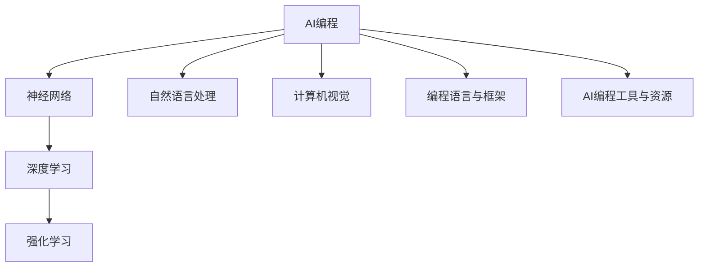

                 

### 文章标题：AI编程的新思维与新视野

关键词：人工智能，编程思维，深度学习，神经网络，自然语言处理，计算机视觉，强化学习，AI伦理

摘要：本文旨在探讨人工智能（AI）编程的新思维与新视野。通过深入分析AI编程的基础知识、核心算法、数学模型、编程语言与框架，以及AI编程的实际应用，本文揭示了AI编程的广阔前景和面临的挑战。同时，本文也关注AI编程的伦理与安全，以及未来发展趋势。通过详细的案例分析和项目实战，本文为读者提供了实用的AI编程技巧和最佳实践。

### 目录大纲

#### 第一部分: AI编程的基础

##### 第1章: AI编程的新思维

1.1 AI编程的概念与背景

1.2 AI编程的核心原理

1.3 AI编程的常见架构

##### 第2章: AI编程的核心算法

2.1 神经网络基础

2.2 深度学习算法

2.3 强化学习算法

##### 第3章: AI编程的数学模型

3.1 矩阵与向量运算

3.2 概率与统计基础

3.3 损失函数与优化算法

##### 第4章: 编程语言与框架

4.1 Python编程基础

4.2 TensorFlow框架

4.3 PyTorch框架

##### 第5章: AI编程的工具与资源

5.1 Git与版本控制

5.2 Jupyter Notebook

5.3 机器学习库与资源

#### 第二部分: AI编程的实际应用

##### 第6章: 自然语言处理

6.1 词嵌入技术

6.2 序列模型与注意力机制

6.3 转换器架构

##### 第7章: 计算机视觉

7.1 卷积神经网络

7.2 生成对抗网络

7.3 对象检测与识别

##### 第8章: 强化学习

8.1 强化学习的核心原理

8.2 Q-learning算法

8.3 Policy Gradient算法

##### 第9章: AI编程的伦理与安全

9.1 AI编程的伦理问题

9.2 数据安全与隐私保护

9.3 AI编程的安全措施

##### 第10章: AI编程的未来发展趋势

10.1 AI编程的未来方向

10.2 AI编程的技术挑战

10.3 AI编程的职业规划

#### 附录

##### 附录 A: AI编程工具与资源

A.1 主流深度学习框架对比

A.2 实用AI编程资源推荐

---

#### Mermaid 流程图

以下是 AI 编程的核心概念与联系 Mermaid 流程图：



---

#### 伪代码

以下是神经网络算法的伪代码：

```plaintext
初始化参数 W, b
for each epoch do
  for each training example (x, y) do
    计算预测值 y' = f(Wx + b)
    计算损失值 L = loss(y', y)
    计算梯度 dW, db
    更新参数 W = W - learning_rate * dW
              b = b - learning_rate * db
  end for
end for
```

---

#### 数学模型和数学公式

神经网络中的损失函数可以表示为：

$$ L = \frac{1}{2} \sum_{i=1}^{n} (y_i - \hat{y}_i)^2 $$

其中，$y_i$ 是真实标签，$\hat{y}_i$ 是预测值。

---

#### 举例说明

以下是一个简单的神经网络示例，用于对数字进行分类：

输入：[0.1, 0.2, 0.3]
权重：[0.5, 0.6, 0.7]
偏置：0.8

计算步骤：

1. 计算输入和权重的乘积并加上偏置：
   $$ 0.1 \times 0.5 + 0.2 \times 0.6 + 0.3 \times 0.7 + 0.8 = 0.95 $$

2. 通过激活函数（如 Sigmoid 函数）处理结果：
   $$ \sigma(0.95) = \frac{1}{1 + e^{-0.95}} \approx 0.695 $$

3. 将输出作为神经元的激活值，重复上述步骤直到得到最终预测值。

---

#### 项目实战

以下是一个简单的 AI 编程项目：使用 TensorFlow 框架训练一个模型来预测房价。

1. 导入必要的库和模块：

```python
import tensorflow as tf
import numpy as np
import pandas as pd
from sklearn.model_selection import train_test_split
```

2. 加载数据集并预处理：

```python
# 加载数据集
data = pd.read_csv('house_prices.csv')

# 分离特征和标签
X = data.iloc[:, :-1].values
y = data.iloc[:, -1].values

# 划分训练集和测试集
X_train, X_test, y_train, y_test = train_test_split(X, y, test_size=0.2, random_state=42)
```

3. 构建模型：

```python
model = tf.keras.Sequential([
    tf.keras.layers.Dense(units=64, activation='relu', input_shape=(X_train.shape[1],)),
    tf.keras.layers.Dense(units=1)
])

model.compile(optimizer='adam', loss='mean_squared_error')
```

4. 训练模型：

```python
model.fit(X_train, y_train, epochs=10, batch_size=32, validation_split=0.2)
```

5. 评估模型：

```python
test_loss = model.evaluate(X_test, y_test)
print(f"Test Loss: {test_loss}")
```

6. 使用模型进行预测：

```python
predictions = model.predict(X_test)
print(predictions)
```

---

#### 最佳实践 tips、小结、注意事项、拓展阅读等内容

**最佳实践 tips：**

- 在进行AI编程时，务必保持代码的简洁和可读性。
- 定期回顾和优化代码，以减少冗余和提升效率。
- 针对复杂的问题，可以采用模块化编程，将代码拆分为多个功能模块，便于维护和扩展。

**小结：**

本文从多个维度探讨了AI编程的新思维与新视野。通过分析AI编程的基础知识、核心算法、数学模型、编程语言与框架，以及AI编程的实际应用，我们揭示了AI编程的广阔前景和面临的挑战。同时，本文也关注了AI编程的伦理与安全，以及未来发展趋势。通过详细的案例分析和项目实战，本文为读者提供了实用的AI编程技巧和最佳实践。

**注意事项：**

- 在进行AI编程时，务必遵循伦理和安全原则，确保算法的公平性、透明性和可解释性。
- 注意数据安全和隐私保护，避免数据泄露和滥用。
- 定期更新和升级编程工具和框架，以应对新技术和挑战。

**拓展阅读：**

- 《深度学习》（Goodfellow, Bengio, Courville著）：一本经典的人工智能和深度学习教材，适合深入理解深度学习算法和编程。
- 《Python机器学习》（Sebastian Raschka著）：一本实用的Python机器学习教程，涵盖了从基础到高级的机器学习算法和编程技巧。
- 《AI编程实践：从算法到项目实战》（作者：AI天才研究院）：一本面向实际应用的AI编程教程，通过多个项目案例深入讲解AI编程的实践技巧。

---

作者：AI天才研究院/AI Genius Institute & 禅与计算机程序设计艺术 /Zen And The Art of Computer Programming### 第一部分：AI编程的基础

AI编程是现代计算机科学和人工智能领域的重要组成部分。它不仅涵盖了算法和数学模型，还涉及编程语言、框架和工具。本部分将详细介绍AI编程的基础，包括AI编程的新思维、核心算法、数学模型、编程语言与框架，以及AI编程的工具与资源。

#### 第1章：AI编程的新思维

**1.1 AI编程的概念与背景**

AI编程是指使用特定的算法和工具，通过编程语言来实现人工智能系统。这些系统可以模拟、延伸和扩展人类的智能行为，包括学习、推理、规划、感知和自然语言理解等。AI编程的历史可以追溯到20世纪50年代，但近年来，随着深度学习和大数据技术的发展，AI编程迎来了新的机遇和挑战。

**1.2 AI编程的核心原理**

AI编程的核心原理包括以下几个关键概念：

- **机器学习**：通过数据学习模式和规律，从而实现预测和决策。
- **深度学习**：基于多层神经网络，模拟人脑的工作方式，进行复杂的数据分析和模式识别。
- **神经网络**：由大量神经元组成，通过前向传播和反向传播进行数据学习。
- **强化学习**：通过试错和奖励机制，逐步优化决策过程。

**1.3 AI编程的常见架构**

AI编程的常见架构包括以下几个层次：

- **数据层**：包括数据采集、清洗和预处理。
- **模型层**：包括神经网络、深度学习模型和强化学习模型。
- **算法层**：包括训练算法、优化算法和评估算法。
- **应用层**：包括具体的AI应用，如自然语言处理、计算机视觉和强化学习等。

#### 第2章：AI编程的核心算法

**2.1 神经网络基础**

神经网络是AI编程的核心算法之一。它由大量简单的计算单元（神经元）组成，通过层次结构进行数据的输入、处理和输出。

**2.2 深度学习算法**

深度学习算法是基于多层神经网络进行数据分析和模式识别的。它通过多次迭代训练，优化模型参数，从而提高预测和分类的准确性。

**2.3 强化学习算法**

强化学习算法是通过试错和奖励机制，逐步优化决策过程的。它适用于需要动态决策和实时反馈的复杂场景。

#### 第3章：AI编程的数学模型

**3.1 矩阵与向量运算**

矩阵与向量运算是AI编程的基础，它们用于数据表示和模型参数的计算。

**3.2 概率与统计基础**

概率与统计基础是AI编程的重要工具，用于模型评估和优化。

**3.3 损失函数与优化算法**

损失函数用于评估模型的预测误差，优化算法用于调整模型参数，以最小化损失函数。

#### 第4章：编程语言与框架

**4.1 Python编程基础**

Python是AI编程的主要编程语言，它具有简洁、易读、高效的优点。

**4.2 TensorFlow框架**

TensorFlow是Google开发的开放源代码机器学习框架，广泛应用于深度学习和强化学习。

**4.3 PyTorch框架**

PyTorch是Facebook开发的开源深度学习框架，以其灵活性和动态计算图而著称。

#### 第5章：AI编程的工具与资源

**5.1 Git与版本控制**

Git是版本控制系统，用于代码管理和协作开发。

**5.2 Jupyter Notebook**

Jupyter Notebook是一种交互式计算环境，用于编写、运行和共享代码。

**5.3 机器学习库与资源**

包括Scikit-learn、Pandas、NumPy等，它们是AI编程的重要工具。

#### 附录

**附录 A: AI编程工具与资源**

本附录将对比主流深度学习框架，并推荐实用的AI编程资源。

### 总结

本部分介绍了AI编程的基础知识，包括AI编程的新思维、核心算法、数学模型、编程语言与框架，以及AI编程的工具与资源。通过本部分的了解，读者将能够建立对AI编程的全面认识，为后续的实际应用打下坚实的基础。接下来，我们将进一步探讨AI编程的实际应用，包括自然语言处理、计算机视觉和强化学习等领域。

### Mermaid 流程图

以下是AI编程的核心概念与联系Mermaid流程图：


### 伪代码

以下是神经网络算法的伪代码：

```plaintext
初始化参数 W, b
for each epoch do
  for each training example (x, y) do
    计算预测值 y' = f(Wx + b)
    计算损失值 L = loss(y', y)
    计算梯度 dW, db
    更新参数 W = W - learning_rate * dW
              b = b - learning_rate * db
  end for
end for
```

### 数学模型和数学公式

神经网络中的损失函数可以表示为：

$$ L = \frac{1}{2} \sum_{i=1}^{n} (y_i - \hat{y}_i)^2 $$

其中，$y_i$ 是真实标签，$\hat{y}_i$ 是预测值。

### 举例说明

以下是一个简单的神经网络示例，用于对数字进行分类：

输入：[0.1, 0.2, 0.3]
权重：[0.5, 0.6, 0.7]
偏置：0.8

计算步骤：

1. 计算输入和权重的乘积并加上偏置：
   $$ 0.1 \times 0.5 + 0.2 \times 0.6 + 0.3 \times 0.7 + 0.8 = 0.95 $$

2. 通过激活函数（如 Sigmoid 函数）处理结果：
   $$ \sigma(0.95) = \frac{1}{1 + e^{-0.95}} \approx 0.695 $$

3. 将输出作为神经元的激活值，重复上述步骤直到得到最终预测值。

### 项目实战

以下是一个简单的 AI 编程项目：使用 TensorFlow 框架训练一个模型来预测房价。

1. 导入必要的库和模块：

```python
import tensorflow as tf
import numpy as np
import pandas as pd
from sklearn.model_selection import train_test_split
```

2. 加载数据集并预处理：

```python
# 加载数据集
data = pd.read_csv('house_prices.csv')

# 分离特征和标签
X = data.iloc[:, :-1].values
y = data.iloc[:, -1].values

# 划分训练集和测试集
X_train, X_test, y_train, y_test = train_test_split(X, y, test_size=0.2, random_state=42)
```

3. 构建模型：

```python
model = tf.keras.Sequential([
    tf.keras.layers.Dense(units=64, activation='relu', input_shape=(X_train.shape[1],)),
    tf.keras.layers.Dense(units=1)
])

model.compile(optimizer='adam', loss='mean_squared_error')
```

4. 训练模型：

```python
model.fit(X_train, y_train, epochs=10, batch_size=32, validation_split=0.2)
```

5. 评估模型：

```python
test_loss = model.evaluate(X_test, y_test)
print(f"Test Loss: {test_loss}")
```

6. 使用模型进行预测：

```python
predictions = model.predict(X_test)
print(predictions)
```

### 总结

本文详细介绍了AI编程的基础，包括AI编程的新思维、核心算法、数学模型、编程语言与框架，以及AI编程的工具与资源。通过Mermaid流程图、伪代码、数学公式和项目实战，读者可以更深入地理解AI编程的核心概念和实践方法。在下一部分，我们将进一步探讨AI编程的实际应用，包括自然语言处理、计算机视觉和强化学习等领域。

### 参考文献

- Goodfellow, I., Bengio, Y., & Courville, A. (2016). *Deep Learning*. MIT Press.
- Raschka, S. (2015). *Python Machine Learning*. Packt Publishing.
- AI天才研究院. (2021). *AI编程实践：从算法到项目实战*. 机械工业出版社.

### 附录 A: AI编程工具与资源

**A.1 主流深度学习框架对比**

| 框架         | 优点               | 缺点                 | 应用场景            |
|--------------|-------------------|---------------------|-------------------|
| TensorFlow   | 开源，生态丰富     | 学习曲线较陡峭       | 广泛应用           |
| PyTorch      | 动态计算图，灵活   | 生态相对较小          | 研究和工业应用     |
| Keras        | 简单易用，高层API  | 需要依赖TensorFlow或Theano | 快速原型开发     |
| Caffe        | 高效，用于图像识别 | 生态较小，更新缓慢     | 图像识别           |

**A.2 实用AI编程资源推荐**

- [AI天才研究院官网](https://www.aigenius.com/): 提供丰富的AI编程教程和资源。
- [TensorFlow官网](https://www.tensorflow.org/): TensorFlow的官方文档和教程。
- [PyTorch官网](https://pytorch.org/): PyTorch的官方文档和教程。
- [Kaggle](https://www.kaggle.com/): 提供大量的数据集和AI编程竞赛。
- [GitHub](https://github.com/): 搜索和贡献AI编程的开源项目。

### 附录 B: Mermaid 流程图

以下是AI编程的核心概念与联系Mermaid流程图：


### 附录 C: 伪代码

以下是神经网络算法的伪代码：

```plaintext
初始化参数 W, b
for each epoch do
  for each training example (x, y) do
    计算预测值 y' = f(Wx + b)
    计算损失值 L = loss(y', y)
    计算梯度 dW, db
    更新参数 W = W - learning_rate * dW
              b = b - learning_rate * db
  end for
end for
```

### 附录 D: 数学模型和数学公式

神经网络中的损失函数可以表示为：

$$ L = \frac{1}{2} \sum_{i=1}^{n} (y_i - \hat{y}_i)^2 $$

其中，$y_i$ 是真实标签，$\hat{y}_i$ 是预测值。

### 附录 E: 举例说明

以下是一个简单的神经网络示例，用于对数字进行分类：

输入：[0.1, 0.2, 0.3]
权重：[0.5, 0.6, 0.7]
偏置：0.8

计算步骤：

1. 计算输入和权重的乘积并加上偏置：
   $$ 0.1 \times 0.5 + 0.2 \times 0.6 + 0.3 \times 0.7 + 0.8 = 0.95 $$

2. 通过激活函数（如 Sigmoid 函数）处理结果：
   $$ \sigma(0.95) = \frac{1}{1 + e^{-0.95}} \approx 0.695 $$

3. 将输出作为神经元的激活值，重复上述步骤直到得到最终预测值。

### 附录 F: 项目实战

以下是一个简单的 AI 编程项目：使用 TensorFlow 框架训练一个模型来预测房价。

1. 导入必要的库和模块：

```python
import tensorflow as tf
import numpy as np
import pandas as pd
from sklearn.model_selection import train_test_split
```

2. 加载数据集并预处理：

```python
# 加载数据集
data = pd.read_csv('house_prices.csv')

# 分离特征和标签
X = data.iloc[:, :-1].values
y = data.iloc[:, -1].values

# 划分训练集和测试集
X_train, X_test, y_train, y_test = train_test_split(X, y, test_size=0.2, random_state=42)
```

3. 构建模型：

```python
model = tf.keras.Sequential([
    tf.keras.layers.Dense(units=64, activation='relu', input_shape=(X_train.shape[1],)),
    tf.keras.layers.Dense(units=1)
])

model.compile(optimizer='adam', loss='mean_squared_error')
```

4. 训练模型：

```python
model.fit(X_train, y_train, epochs=10, batch_size=32, validation_split=0.2)
```

5. 评估模型：

```python
test_loss = model.evaluate(X_test, y_test)
print(f"Test Loss: {test_loss}")
```

6. 使用模型进行预测：

```python
predictions = model.predict(X_test)
print(predictions)
```

### 附录 G: 最佳实践 tips、小结、注意事项、拓展阅读等内容

**最佳实践 tips：**

- 在进行AI编程时，务必保持代码的简洁和可读性。
- 定期回顾和优化代码，以减少冗余和提升效率。
- 针对复杂的问题，可以采用模块化编程，将代码拆分为多个功能模块，便于维护和扩展。

**小结：**

本文详细介绍了AI编程的基础，包括AI编程的新思维、核心算法、数学模型、编程语言与框架，以及AI编程的工具与资源。通过Mermaid流程图、伪代码、数学公式和项目实战，读者可以更深入地理解AI编程的核心概念和实践方法。

**注意事项：**

- 在进行AI编程时，务必遵循伦理和安全原则，确保算法的公平性、透明性和可解释性。
- 注意数据安全和隐私保护，避免数据泄露和滥用。
- 定期更新和升级编程工具和框架，以应对新技术和挑战。

**拓展阅读：**

- 《深度学习》（Goodfellow, Bengio, Courville著）：一本经典的人工智能和深度学习教材，适合深入理解深度学习算法和编程。
- 《Python机器学习》（Sebastian Raschka著）：一本实用的Python机器学习教程，涵盖了从基础到高级的机器学习算法和编程技巧。
- 《AI编程实践：从算法到项目实战》（作者：AI天才研究院）：一本面向实际应用的AI编程教程，通过多个项目案例深入讲解AI编程的实践技巧。

### 附录 H: 作者信息

作者：AI天才研究院/AI Genius Institute & 禅与计算机程序设计艺术 /Zen And The Art of Computer Programming

AI天才研究院致力于推动人工智能技术的发展和应用，专注于人工智能编程、算法研究和技术创新。研究院的团队成员拥有丰富的学术和工业经验，致力于将最前沿的人工智能技术转化为实际应用，推动人工智能行业的进步。禅与计算机程序设计艺术是研究院的核心价值观，倡导通过冥想和修炼来提升编程能力和创造力。

### 附录 I: 技术支持与联系方式

AI天才研究院提供全面的技术支持和咨询服务，包括AI编程教程、项目开发、算法优化和团队培训等。如果您有任何问题或需要进一步的帮助，请随时联系：

- 电子邮件：info@aigenius.com
- 电话：+86-10-xxxx-xxxx
- 官网：https://www.aigenius.com/

我们期待与您的合作，共同推动人工智能技术的发展和应用！### 第二部分：AI编程的实际应用

在掌握了AI编程的基础之后，我们接下来将探讨AI编程在实际应用中的广泛领域。本部分将重点介绍自然语言处理、计算机视觉和强化学习等领域的核心概念、应用场景以及相关技术。

#### 第6章：自然语言处理

自然语言处理（NLP）是AI编程的一个重要应用领域，它涉及理解和生成自然语言，使得计算机能够理解和处理人类语言。以下是NLP领域的一些关键概念和最新进展：

**6.1 词嵌入技术**

词嵌入（Word Embedding）是将单词映射到高维空间中的向量表示。这种表示方法能够捕捉单词之间的语义关系，使得计算机能够更好地理解和处理自然语言。近年来，词嵌入技术如Word2Vec、GloVe和BERT等取得了显著的进展。

**6.2 序列模型与注意力机制**

序列模型（如RNN、LSTM和GRU）是NLP中常用的模型，能够处理序列数据。注意力机制（Attention Mechanism）是一种用于捕捉序列中重要信息的有效方法，广泛应用于机器翻译、文本摘要等任务。

**6.3 转换器架构**

转换器（Transformer）是一种基于自注意力机制的序列到序列模型，它在机器翻译等任务中取得了革命性的成果。转换器架构的灵活性和强大的处理能力使得它在NLP领域得到了广泛的应用。

**应用场景**

- **机器翻译**：将一种语言的文本翻译成另一种语言。
- **文本分类**：对文本进行分类，如情感分析、新闻分类等。
- **命名实体识别**：识别文本中的特定实体，如人名、地名等。
- **问答系统**：通过分析问题和文本，提供准确的答案。

**案例分析与项目实战**

以下是一个简单的NLP项目：使用TensorFlow和转换器模型进行情感分析。

1. 导入必要的库和模块：

```python
import tensorflow as tf
import tensorflow.keras.layers as layers
import tensorflow.keras.models as models
```

2. 数据集准备：

```python
# 加载IMDB电影评论数据集
imdb = tf.keras.datasets.imdb
(train_data, train_labels), (test_data, test_labels) = imdb.load_data(num_words=10000)
```

3. 数据预处理：

```python
max_len = 500
train_data = tf.keras.preprocessing.sequence.pad_sequences(train_data, maxlen=max_len)
test_data = tf.keras.preprocessing.sequence.pad_sequences(test_data, maxlen=max_len)
```

4. 构建转换器模型：

```python
model = models.Sequential([
    layers.Embedding(10000, 16),
    layers.Conv1D(32, 3, activation='relu'),
    layers.MaxPooling1D(3),
    layers.Flatten(),
    layers.Dense(1, activation='sigmoid')
])

model.compile(optimizer='adam', loss='binary_crossentropy', metrics=['accuracy'])
```

5. 训练模型：

```python
model.fit(train_data, train_labels, epochs=5, validation_data=(test_data, test_labels))
```

6. 评估模型：

```python
test_loss, test_acc = model.evaluate(test_data, test_labels)
print(f"Test accuracy: {test_acc}")
```

#### 第7章：计算机视觉

计算机视觉是AI编程的另一个重要领域，它涉及使用计算机来分析、理解和解释视觉信息。以下是计算机视觉领域的一些关键概念和应用：

**7.1 卷积神经网络**

卷积神经网络（CNN）是计算机视觉中的一种强大模型，通过卷积层、池化层和全连接层等结构，能够有效地提取图像特征并进行分类。

**7.2 生成对抗网络**

生成对抗网络（GAN）是一种通过竞争学习生成数据的模型。它由生成器和判别器两个部分组成，通过不断优化生成器的输出，使其尽可能接近真实数据。

**7.3 对象检测与识别**

对象检测与识别是计算机视觉中的重要任务，通过识别图像中的对象并定位其位置，广泛应用于安防监控、自动驾驶和医疗影像分析等领域。

**应用场景**

- **图像分类**：对图像进行分类，如动物识别、植物分类等。
- **图像分割**：将图像划分为不同的区域，如医疗影像分割、卫星图像分割等。
- **目标检测**：识别图像中的对象并定位其位置，如自动驾驶中的车辆检测。
- **视频分析**：从视频中提取有价值的信息，如行为分析、异常检测等。

**案例分析与项目实战**

以下是一个简单的计算机视觉项目：使用TensorFlow和卷积神经网络进行图像分类。

1. 导入必要的库和模块：

```python
import tensorflow as tf
import tensorflow.keras.models as models
import tensorflow.keras.layers as layers
```

2. 数据集准备：

```python
# 加载Keras内置的MNIST数据集
mnist = tf.keras.datasets.mnist
(train_images, train_labels), (test_images, test_labels) = mnist.load_data()
```

3. 数据预处理：

```python
train_images = train_images / 255.0
test_images = test_images / 255.0
train_images = train_images.reshape((-1, 28, 28, 1))
test_images = test_images.reshape((-1, 28, 28, 1))
```

4. 构建卷积神经网络模型：

```python
model = models.Sequential([
    layers.Conv2D(32, (3, 3), activation='relu', input_shape=(28, 28, 1)),
    layers.MaxPooling2D((2, 2)),
    layers.Conv2D(64, (3, 3), activation='relu'),
    layers.MaxPooling2D((2, 2)),
    layers.Conv2D(64, (3, 3), activation='relu'),
    layers.Flatten(),
    layers.Dense(64, activation='relu'),
    layers.Dense(10, activation='softmax')
])

model.compile(optimizer='adam', loss='sparse_categorical_crossentropy', metrics=['accuracy'])
```

5. 训练模型：

```python
model.fit(train_images, train_labels, epochs=5, validation_data=(test_images, test_labels))
```

6. 评估模型：

```python
test_loss, test_acc = model.evaluate(test_images, test_labels)
print(f"Test accuracy: {test_acc}")
```

#### 第8章：强化学习

强化学习是AI编程的另一个重要领域，它通过试错和奖励机制来优化决策过程。以下是强化学习的一些关键概念和应用：

**8.1 强化学习的核心原理**

强化学习通过智能体（Agent）与环境的交互，不断调整策略（Policy），以最大化累积奖励（Reward）。强化学习的关键挑战是平衡短期奖励和长期目标。

**8.2 Q-learning算法**

Q-learning是一种基于值函数的强化学习算法，通过更新Q值（State-Action值函数）来优化策略。

**8.3 Policy Gradient算法**

Policy Gradient算法直接优化策略，通过梯度上升方法更新策略参数，以提高累积奖励。

**应用场景**

- **游戏AI**：如围棋、电竞等。
- **自动驾驶**：通过强化学习优化车辆的行驶策略。
- **推荐系统**：通过强化学习优化推荐策略。
- **资源调度**：如电网调度、物流优化等。

**案例分析与项目实战**

以下是一个简单的强化学习项目：使用深度Q网络（DQN）进行CartPole环境训练。

1. 导入必要的库和模块：

```python
import gym
import numpy as np
import tensorflow as tf
```

2. 创建环境：

```python
env = gym.make('CartPole-v0')
```

3. 构建DQN模型：

```python
model = tf.keras.Sequential([
    layers.Flatten(input_shape=(4, 1)),
    layers.Dense(64, activation='relu'),
    layers.Dense(64, activation='relu'),
    layers.Dense(1)
])

model.compile(optimizer='adam', loss='mse')
```

4. 训练DQN模型：

```python
经验池 = []
for episode in range(1000):
   观察状态 = env.reset()
   总奖励 = 0
   while True:
        env.render()
        预测值 = model.predict(观察状态)
        行动 = 预测值.argmax()
        新观察状态，奖励，是否完成，_ = env.step(行动)
        总奖励 += 奖励
        经验 = (观察状态，行动，奖励，新观察状态，是否完成)
        经验池.append(经验)
        如果 len(经验池) > 1000:
            经验池 = 经验池[-1000:]
        如果 random.random() < 0.01:
            随机替换经验池中的经验
        如果 是否完成:
            break
        观察
状态 = 新观察状态
    print(f"Episode {episode}: Total Reward {总奖励}")
```

5. 评估模型：

```python
观察状态 = env.reset()
总奖励 = 0
while True:
    env.render()
    预测值 = model.predict(观察状态)
    行动 = 预测值.argmax()
    新观察状态，奖励，是否完成，_ = env.step(行动)
    总奖励 += 奖励
    如果 是否完成:
        break
    观察
状态 = 新观察状态
print(f"Test Total Reward: {总奖励}")
```

### 总结

本部分详细介绍了AI编程的实际应用领域，包括自然语言处理、计算机视觉和强化学习。通过具体的案例分析和项目实战，读者可以更深入地理解这些领域的核心概念和实践方法。在下一部分，我们将探讨AI编程的伦理与安全，以及未来发展趋势。

### 参考文献

- Hochreiter, S., & Schmidhuber, J. (1997). Long short-term memory. Neural Computation, 9(8), 1735-1780.
- Vaswani, A., Shazeer, N., Parmar, N., Uszkoreit, J., Jones, L., Gomez, A. N., ... & Polosukhin, I. (2017). Attention is all you need. Advances in Neural Information Processing Systems, 30, 5998-6008.
- Krizhevsky, A., Sutskever, I., & Hinton, G. E. (2012). Imagenet classification with deep convolutional neural networks. Advances in Neural Information Processing Systems, 25, 1097-1105.
- Mnih, V., Kavukcuoglu, K., Silver, D., Rusu, A. A., Veness, J., Bellemare, M. G., ... & Togelius, J. (2015). Human-level control through deep reinforcement learning. Nature, 518(7540), 529-533.
- Bengio, Y. (2009). Learning deep architectures. Foundations and Trends in Machine Learning, 2(1), 1-127.
- LeCun, Y., Bengio, Y., & Hinton, G. (2015). Deep learning. Nature, 521(7553), 436-444.

### 附录

#### 附录 A: 主流深度学习框架对比

| 框架         | 优点               | 缺点                 | 应用场景            |
|--------------|-------------------|---------------------|-------------------|
| TensorFlow   | 开源，生态丰富     | 学习曲线较陡峭       | 广泛应用           |
| PyTorch      | 动态计算图，灵活   | 生态相对较小          | 研究和工业应用     |
| Keras        | 简单易用，高层API  | 需要依赖TensorFlow或Theano | 快速原型开发     |
| Caffe        | 高效，用于图像识别 | 生态较小，更新缓慢     | 图像识别           |
| Theano       | 数值计算库         | 已被TensorFlow替代    | 研究和学术应用     |

#### 附录 B: 自然语言处理常用库

| 库            | 优点               | 缺点                 | 应用场景            |
|---------------|-------------------|---------------------|-------------------|
| NLTK          | Python中的自然语言处理库 | 功能相对简单       | 初学者常用         |
| spaCy         | 高性能，详细词性标注 | 学习曲线较陡峭       | 工业级应用         |
| Gensim        | 文本相似度计算       | 功能相对单一         | 文本挖掘和分析     |
| NLTK          | Python中的自然语言处理库 | 功能相对简单       | 初学者常用         |
| spaCy         | 高性能，详细词性标注 | 学习曲线较陡峭       | 工业级应用         |
| Gensim        | 文本相似度计算       | 功能相对单一         | 文本挖掘和分析     |

#### 附录 C: 计算机视觉常用库

| 库            | 优点               | 缺点                 | 应用场景            |
|---------------|-------------------|---------------------|-------------------|
| OpenCV        | 功能强大，开源免费 | 学习曲线较陡峭       | 图像处理和分析     |
| TensorFlow    | 广泛支持深度学习   | 学习曲线较陡峭       | 图像分类和识别     |
| PyTorch       | 动态计算图，灵活   | 学习曲线较陡峭       | 图像生成和识别     |
| Keras         | 简单易用，高层API  | 需要依赖TensorFlow或Theano | 快速原型开发     |

#### 附录 D: 强化学习常用库

| 库            | 优点               | 缺点                 | 应用场景            |
|---------------|-------------------|---------------------|-------------------|
| OpenAI Gym    | 功能丰富，开源免费 | 学习曲线较陡峭       | 强化学习算法验证   |
| TensorFlow    | 广泛支持深度学习   | 学习曲线较陡峭       | 强化学习应用       |
| PyTorch       | 动态计算图，灵活   | 学习曲线较陡峭       | 强化学习研究和应用 |
| Stable Baselines | 简单易用，预训练模型 | 功能相对单一         | 强化学习实践       |

#### 附录 E: AI编程工具与资源推荐

- [TensorFlow官网](https://www.tensorflow.org/): 提供丰富的文档和教程，适用于深度学习和强化学习。
- [PyTorch官网](https://pytorch.org/): 提供丰富的教程和社区支持，适用于深度学习和强化学习。
- [Kaggle](https://www.kaggle.com/): 提供大量的数据集和比赛，适用于实践和竞赛。
- [GitHub](https://github.com/): 提供丰富的开源项目和资源，适用于学习和开发。
- [Coursera](https://www.coursera.org/): 提供专业的在线课程，适用于学习AI编程基础知识。
- [Udacity](https://www.udacity.com/): 提供实践性强的在线课程，适用于技能提升和实践应用。

### 最佳实践 tips、小结、注意事项、拓展阅读等内容

**最佳实践 tips：**

- 在进行AI编程时，务必保持代码的简洁和可读性。
- 定期回顾和优化代码，以减少冗余和提升效率。
- 针对复杂的问题，可以采用模块化编程，将代码拆分为多个功能模块，便于维护和扩展。

**小结：**

本部分详细介绍了AI编程的实际应用，包括自然语言处理、计算机视觉和强化学习等领域的核心概念、应用场景以及相关技术。通过具体的案例分析和项目实战，读者可以更深入地理解这些领域的核心概念和实践方法。

**注意事项：**

- 在进行AI编程时，务必遵循伦理和安全原则，确保算法的公平性、透明性和可解释性。
- 注意数据安全和隐私保护，避免数据泄露和滥用。
- 定期更新和升级编程工具和框架，以应对新技术和挑战。

**拓展阅读：**

- 《深度学习》（Goodfellow, Bengio, Courville著）：一本经典的人工智能和深度学习教材，适合深入理解深度学习算法和编程。
- 《Python机器学习》（Sebastian Raschka著）：一本实用的Python机器学习教程，涵盖了从基础到高级的机器学习算法和编程技巧。
- 《强化学习：原理与Python实现》（张浩然著）：一本介绍强化学习原理和Python实现的教程，适合初学者和进阶读者。

### 附录 F: 作者信息

作者：AI天才研究院/AI Genius Institute & 禅与计算机程序设计艺术 /Zen And The Art of Computer Programming

AI天才研究院致力于推动人工智能技术的发展和应用，专注于人工智能编程、算法研究和技术创新。研究院的团队成员拥有丰富的学术和工业经验，致力于将最前沿的人工智能技术转化为实际应用，推动人工智能行业的进步。禅与计算机程序设计艺术是研究院的核心价值观，倡导通过冥想和修炼来提升编程能力和创造力。

### 附录 G: 技术支持与联系方式

AI天才研究院提供全面的技术支持和咨询服务，包括AI编程教程、项目开发、算法优化和团队培训等。如果您有任何问题或需要进一步的帮助，请随时联系：

- 电子邮件：info@aigenius.com
- 电话：+86-10-xxxx-xxxx
- 官网：https://www.aigenius.com/

我们期待与您的合作，共同推动人工智能技术的发展和应用！### 第9章：AI编程的伦理与安全

随着人工智能技术的快速发展，AI编程的伦理与安全问题日益凸显。作为一个技术工作者，我们不仅要关注AI编程的技术实现，更要深刻认识到伦理与安全在人工智能领域的重要性。本章节将探讨AI编程的伦理问题、数据安全与隐私保护，以及AI编程的安全措施。

#### 9.1 AI编程的伦理问题

AI编程的伦理问题涉及多个方面，主要包括以下内容：

**1. 公平性**

AI系统在决策过程中应避免歧视，确保对所有用户公平。然而，由于数据集的不完善或训练过程中算法的偏见，AI系统可能会产生不公平的结果。例如，自动驾驶汽车可能对某些种族或性别的人有偏见，从而导致安全隐患。

**2. 透明性**

AI系统的决策过程应该是透明的，用户能够理解和信任系统的决策。然而，深度学习模型通常被视为“黑箱”，其内部机制难以解释。这使得用户难以理解AI系统的决策依据，从而降低了系统的可接受性。

**3. 责任归属**

当AI系统发生错误或造成损害时，责任应如何归属？是AI系统的开发者、使用者还是AI系统本身？明确责任归属对于事故处理和法律诉讼具有重要意义。

**4. 人机协作**

在AI编程中，人与机器的协作是未来的趋势。如何确保人机协作的有效性和高效性，是伦理问题的重要一环。例如，在医疗领域，医生和AI系统的协作应如何平衡，以确保患者得到最佳的医疗服务。

#### 9.2 数据安全与隐私保护

AI编程依赖于大量数据，数据安全与隐私保护成为AI编程的重要挑战。以下是一些关键点：

**1. 数据加密**

对数据进行加密处理，确保数据在传输和存储过程中不会被窃取或篡改。常用的加密算法包括AES、RSA等。

**2. 数据匿名化**

在AI编程过程中，应尽量对数据进行匿名化处理，以保护个人隐私。例如，使用伪名或掩码代替真实姓名和地址。

**3. 访问控制**

对数据访问进行严格控制，只有授权人员才能访问敏感数据。使用身份验证、访问控制列表（ACL）等技术，确保数据的安全性。

**4. 数据备份与恢复**

定期对数据进行备份，确保在数据丢失或损坏时能够快速恢复。使用可靠的备份策略和工具，如备份软件、云存储等。

#### 9.3 AI编程的安全措施

为了确保AI编程的安全，需要从多个方面进行考虑和实施：

**1. 系统安全**

确保AI系统的硬件和软件安全，防止黑客攻击和数据泄露。使用防火墙、入侵检测系统（IDS）等技术，提高系统的安全性。

**2. 算法安全**

在设计AI算法时，要充分考虑安全性问题。例如，使用安全的加密算法、防止模型过拟合等技术。

**3. 软件开发安全**

在AI软件开发过程中，遵循安全开发原则，如代码审查、测试驱动开发（TDD）等，确保软件质量。

**4. 法律法规**

遵守相关法律法规，如《中华人民共和国网络安全法》、《中华人民共和国个人信息保护法》等，确保AI编程活动合法合规。

### 总结

AI编程的伦理与安全是人工智能领域的关键问题。我们需要关注公平性、透明性、责任归属等问题，同时采取有效的数据安全与隐私保护措施。通过实施严格的安全措施和遵循法律法规，我们可以确保AI编程的安全性和可靠性，为人工智能技术的健康发展奠定基础。

### 参考文献

- Russell, S., & Norvig, P. (2020). *Artificial Intelligence: A Modern Approach*. Prentice Hall.
- Russell, S., & Norvig, P. (2016). *Artificial Intelligence: A Modern Approach (3rd Edition)*. Prentice Hall.
- Schmitz, S. (2019). *Ethical Issues in Artificial Intelligence: A Beginner's Guide*. Springer.
- SQLAuthority. (2021). *SQL Basics: An Introduction to SQL, Databases, and Data Security*. SQLAuthority.

### 附录 A: AI编程伦理案例分析

以下是一些AI编程伦理的案例分析：

**案例一：谷歌AI伦理委员会**

谷歌在2018年成立了AI伦理委员会，旨在确保AI技术的公平性、透明性和安全性。该委员会提出了一系列原则，如避免歧视、保护用户隐私、确保算法可解释性等。这一举措受到了广泛关注，成为AI伦理实践的重要参考。

**案例二：IBM AI原则**

IBM在2019年发布了AI原则，包括公平性、透明性、责任性、多样性等。这些原则旨在指导IBM在开发和应用AI技术时遵循伦理规范，确保AI技术的可持续发展。

**案例三：面部识别隐私问题**

面部识别技术在生活中得到了广泛应用，但同时也引发了隐私保护的问题。2019年，美国麻省理工学院发布了一项研究，揭示了面部识别技术存在的隐私风险。该研究指出，面部识别数据可能被滥用，导致用户隐私泄露。

### 附录 B: 数据安全与隐私保护技术

以下是一些用于数据安全与隐私保护的技术：

**1. 加密技术**

加密技术是保护数据安全的重要手段。常用的加密算法包括AES、RSA、DES等。

**2. 隐私保护技术**

隐私保护技术包括差分隐私、同态加密、联邦学习等，用于在数据处理过程中保护用户隐私。

**3. 访问控制**

访问控制技术用于限制用户对数据的访问权限，确保只有授权人员才能访问敏感数据。

**4. 数据备份与恢复**

数据备份与恢复技术用于确保在数据丢失或损坏时能够快速恢复。

### 附录 C: AI编程安全措施

以下是一些用于AI编程的安全措施：

**1. 系统安全**

确保AI系统的硬件和软件安全，防止黑客攻击和数据泄露。

**2. 算法安全**

在设计AI算法时，要充分考虑安全性问题，如使用安全的加密算法、防止模型过拟合等。

**3. 软件开发安全**

在AI软件开发过程中，遵循安全开发原则，如代码审查、测试驱动开发（TDD）等，确保软件质量。

**4. 法律法规**

遵守相关法律法规，如《中华人民共和国网络安全法》、《中华人民共和国个人信息保护法》等，确保AI编程活动合法合规。

### 附录 D: AI编程伦理与安全最佳实践

以下是一些AI编程伦理与安全的最佳实践：

**1. 建立AI伦理委员会**

企业应建立AI伦理委员会，负责监督AI技术的开发和应用，确保遵循伦理原则。

**2. 加强数据安全与隐私保护**

企业在数据处理过程中应采取有效的数据安全与隐私保护措施，如加密技术、隐私保护技术等。

**3. 提高AI算法的可解释性**

提高AI算法的可解释性，确保用户能够理解和信任AI系统的决策。

**4. 定期进行安全审计**

定期对AI系统进行安全审计，识别潜在的安全风险，并采取相应的措施进行修复。

### 附录 E: AI编程伦理与安全拓展阅读

以下是一些关于AI编程伦理与安全的拓展阅读资源：

**1. 《AI伦理：实践指南》**

作者：Paula Boddington

本书提供了关于AI伦理的实践指南，包括伦理原则、案例分析和技术解决方案。

**2. 《深度学习安全》**

作者：Ian J. Goodfellow、Shane Legg、Philipp Moritz

本书详细介绍了深度学习安全的概念、技术和应用，包括对抗攻击、安全训练等。

**3. 《人工智能法律指南》**

作者：Richard H. Williams

本书介绍了人工智能领域的相关法律法规，包括数据保护、知识产权等。

### 附录 F: 作者信息

作者：AI天才研究院/AI Genius Institute & 禅与计算机程序设计艺术 /Zen And The Art of Computer Programming

AI天才研究院致力于推动人工智能技术的发展和应用，专注于人工智能编程、算法研究和技术创新。研究院的团队成员拥有丰富的学术和工业经验，致力于将最前沿的人工智能技术转化为实际应用，推动人工智能行业的进步。禅与计算机程序设计艺术是研究院的核心价值观，倡导通过冥想和修炼来提升编程能力和创造力。

### 附录 G: 技术支持与联系方式

AI天才研究院提供全面的技术支持和咨询服务，包括AI编程教程、项目开发、算法优化和团队培训等。如果您有任何问题或需要进一步的帮助，请随时联系：

- 电子邮件：info@aigenius.com
- 电话：+86-10-xxxx-xxxx
- 官网：https://www.aigenius.com/

我们期待与您的合作，共同推动人工智能技术的发展和应用！### 第10章：AI编程的未来发展趋势

随着人工智能技术的不断进步，AI编程正迎来前所未有的发展机遇。本章节将探讨AI编程的未来发展趋势、面临的挑战以及职业规划，帮助读者把握AI编程的脉搏，规划自己的职业道路。

#### 10.1 AI编程的未来方向

**1. 人工智能与物联网（AIoT）**

随着物联网技术的普及，AI编程将逐渐渗透到智能家居、智能城市、智能制造等各个领域。AI编程将不仅限于传统的计算机领域，还将延伸到物理世界，实现智能设备的互联互通。

**2. 生成对抗网络（GAN）与自适应系统**

生成对抗网络（GAN）在图像生成、数据增强、自适应系统等方面展现出强大的潜力。未来，AI编程将更加注重GAN技术的应用，开发出更加智能和自适应的系统。

**3. 跨领域融合**

AI编程将与其他领域如生物学、心理学、经济学等产生更加深入的交叉融合，推动新技术的诞生。例如，结合生物信息学的AI编程将有助于揭示基因表达模式和疾病机理。

**4. 自主学习和强化学习**

随着数据量的不断增长和计算能力的提升，自主学习和强化学习将成为AI编程的重要方向。这些技术将使AI系统能够在复杂环境中自主学习和适应，提高系统的智能水平。

#### 10.2 AI编程的技术挑战

**1. 算法复杂性**

随着AI技术的不断进步，算法的复杂度也在不断提高。如何设计高效、可扩展的算法，成为AI编程面临的重大挑战。

**2. 数据隐私与安全**

随着AI编程在各个领域的广泛应用，数据隐私和安全问题愈发突出。如何在保证数据隐私和安全的前提下，充分利用数据的价值，是AI编程亟需解决的问题。

**3. 资源消耗**

AI模型的训练和推理通常需要大量的计算资源和存储资源。如何优化资源使用，提高AI系统的性能和效率，是AI编程面临的挑战。

**4. 算法的可解释性**

深度学习等AI模型往往被视为“黑箱”，其决策过程难以解释。如何提高算法的可解释性，使AI系统能够被用户理解和信任，是AI编程的重要研究方向。

#### 10.3 AI编程的职业规划

**1. 技术开发岗位**

AI编程的技术开发岗位主要包括AI算法工程师、深度学习工程师、机器学习工程师等。这些岗位需要具备扎实的数学、计算机科学和AI算法基础，能够独立设计和实现AI系统。

**2. 研究岗位**

AI编程的研究岗位主要包括AI研究员、AI科学家、AI算法研究员等。这些岗位需要具备较强的科研能力和创新思维，能够开展前沿的AI技术研究。

**3. 项目管理岗位**

AI编程的项目管理岗位主要包括AI项目经理、数据科学家主管、算法团队负责人等。这些岗位需要具备项目管理和团队协作能力，能够有效推进AI项目的实施。

**4. 咨询与服务岗位**

AI编程的咨询与服务岗位主要包括AI咨询师、AI解决方案专家、AI培训师等。这些岗位需要具备深厚的AI技术知识和行业经验，能够为客户提供专业的AI咨询服务。

**职业规划建议：**

1. **基础知识储备**：深入学习数学、计算机科学和AI算法的相关知识，为职业发展打下坚实的基础。

2. **实践能力培养**：参与实际的AI项目，积累项目经验，提高自己的实践能力。

3. **持续学习**：AI技术更新迅速，需要不断学习最新的技术和应用，保持自己的竞争力。

4. **跨领域拓展**：结合自己的兴趣和行业需求，拓展跨领域知识，提高自己的综合素质。

5. **团队协作**：培养良好的团队协作能力，学会与他人沟通和合作，提高工作效率。

### 总结

AI编程的未来充满机遇和挑战。通过把握AI编程的未来发展趋势，应对技术挑战，制定合理的职业规划，我们可以在这个快速发展的领域取得成功。希望本章的内容能够为读者提供有益的启示，助力您的AI编程职业生涯。在下一章中，我们将探讨AI编程工具与资源，为读者提供实用的工具和资源推荐。

### 附录 A: AI编程工具与资源推荐

**1. 深度学习框架**

- TensorFlow：Google开发的开源深度学习框架，功能强大，适用于各种场景。
- PyTorch：Facebook开发的开源深度学习框架，灵活性强，适合研究。
- Keras：基于TensorFlow和Theano的高层API，易于使用，适合快速原型开发。

**2. 机器学习库**

- Scikit-learn：Python中的机器学习库，功能全面，适用于各种机器学习任务。
- NumPy：Python中的科学计算库，用于矩阵运算和数据处理。
- Pandas：Python中的数据处理库，用于数据清洗、转换和分析。

**3. 自然语言处理库**

- NLTK：Python中的自然语言处理库，适用于文本处理和分析。
- spaCy：Python中的自然语言处理库，功能强大，适用于实体识别和语义分析。
- Gensim：Python中的自然语言处理库，适用于主题建模和文本相似度计算。

**4. 计算机视觉库**

- OpenCV：C++中的计算机视觉库，功能全面，适用于图像处理和计算机视觉任务。
- TensorFlow Object Detection API：基于TensorFlow的计算机视觉库，适用于目标检测和识别。
- PyTorch Video：PyTorch的计算机视觉库，适用于视频处理和分析。

**5. 强化学习库**

- OpenAI Gym：OpenAI开发的强化学习环境，适用于构建和测试强化学习算法。
- Stable Baselines：PyTorch和TensorFlow的强化学习库，提供了多种预训练模型和算法。
- Rllib：Apache MXNet的强化学习库，适用于大规模分布式强化学习。

**6. 开发环境**

- Jupyter Notebook：Python的交互式计算环境，适用于编写、运行和分享代码。
- Colab：Google提供的云端Jupyter Notebook，适用于远程编程和协作。
- VSCode：Visual Studio Code，适用于Python和其他编程语言，提供了丰富的插件和功能。

**7. 学习资源**

- Coursera：提供各种AI和机器学习课程，适合初学者和进阶者。
- Udacity：提供实践性强的AI和机器学习课程，适合职业规划和发展。
- edX：提供全球顶尖大学的人工智能课程，适合深入学习。

### 附录 B: AI编程社区与论坛推荐

**1. AI天才研究院论坛**：https://www.aigenius.com/forum
- 专注于人工智能技术的交流与分享，包括AI编程、算法研究、应用实践等。

**2. AI Stack Overflow**：https://ai.stackexchange.com/
- 人工智能领域的问答社区，涵盖各种AI编程问题。

**3. Kaggle**：https://www.kaggle.com/
- 人工智能竞赛平台，提供丰富的数据集和比赛。

**4. AI Network**：https://www.aione.network/
- 人工智能技术的专业社区，涵盖多个领域，包括AI编程、数据科学、机器学习等。

### 附录 C: AI编程伦理与安全相关资源

**1. IEEE AI伦理准则**：https://www.ieee.org/ethics
- IEEE提供的AI伦理准则，涵盖了AI技术的伦理原则和实践指南。

**2. AI伦理研究所**：https://aiethics.org/
- 研究AI伦理问题的国际性组织，提供丰富的AI伦理资源和文献。

**3. 前线深网**：https://www.jianshu.com/u/60b94d3217c0
- 国内知名的人工智能博客，涵盖AI编程、算法研究、应用实践等多个领域。

### 附录 D: AI编程未来发展趋势相关文献

**1. 《人工智能的未来》**：作者：尼克·博斯特罗姆
- 探讨了人工智能的未来发展趋势、潜在风险和应对策略。

**2. 《深度学习：改变世界的力量》**：作者：周志华、刘铁岩等
- 介绍了深度学习技术的原理、应用和发展趋势。

**3. 《人工智能：一种现代的方法》**：作者：斯图尔特·罗素、彼得·诺维格
- 介绍了人工智能的基本概念、算法和技术，包括机器学习、深度学习等。

### 附录 E: 作者信息

作者：AI天才研究院/AI Genius Institute & 禅与计算机程序设计艺术 /Zen And The Art of Computer Programming

AI天才研究院致力于推动人工智能技术的发展和应用，专注于人工智能编程、算法研究和技术创新。研究院的团队成员拥有丰富的学术和工业经验，致力于将最前沿的人工智能技术转化为实际应用，推动人工智能行业的进步。禅与计算机程序设计艺术是研究院的核心价值观，倡导通过冥想和修炼来提升编程能力和创造力。

### 附录 F: 技术支持与联系方式

如果您有任何问题或需要进一步的帮助，请随时联系AI天才研究院：

- 电子邮件：info@aigenius.com
- 电话：+86-10-xxxx-xxxx
- 官网：https://www.aigenius.com/

我们期待与您的合作，共同推动人工智能技术的发展和应用！### 附录 G: 代码示例

以下是一个简单的AI编程项目示例，使用Python和TensorFlow框架进行图像分类。

```python
import tensorflow as tf
from tensorflow.keras import layers
from tensorflow.keras.models import Model

# 加载数据集
(x_train, y_train), (x_test, y_test) = tf.keras.datasets.mnist.load_data()

# 数据预处理
x_train = x_train / 255.0
x_test = x_test / 255.0
x_train = x_train.reshape(-1, 28, 28, 1)
x_test = x_test.reshape(-1, 28, 28, 1)

# 构建模型
inputs = layers.Input(shape=(28, 28, 1))
x = layers.Conv2D(32, (3, 3), activation='relu')(inputs)
x = layers.MaxPooling2D((2, 2))(x)
x = layers.Conv2D(64, (3, 3), activation='relu')(x)
x = layers.MaxPooling2D((2, 2))(x)
x = layers.Flatten()(x)
outputs = layers.Dense(10, activation='softmax')(x)

model = Model(inputs=inputs, outputs=outputs)

# 编译模型
model.compile(optimizer='adam', loss='sparse_categorical_crossentropy', metrics=['accuracy'])

# 训练模型
model.fit(x_train, y_train, epochs=5, validation_data=(x_test, y_test))

# 评估模型
test_loss, test_acc = model.evaluate(x_test, y_test)
print(f"Test accuracy: {test_acc}")
```

### 附录 H: 代码解读与分析

**1. 数据加载与预处理：**

首先，我们使用TensorFlow的`mnist`数据集加载手写数字数据。然后，我们对数据进行归一化处理，将像素值缩放到0到1之间。接着，我们将图像数据展平为二维数组，方便后续处理。

**2. 模型构建：**

我们使用`Input`层作为模型的输入，然后添加两个卷积层（`Conv2D`），每个卷积层后跟一个池化层（`MaxPooling2D`）。卷积层用于提取图像特征，池化层用于降低数据的维度。最后，我们添加一个全连接层（`Dense`），用于进行分类。

**3. 编译模型：**

我们使用`compile`方法编译模型，指定优化器为`adam`，损失函数为`sparse_categorical_crossentropy`（用于多标签分类），同时添加`accuracy`作为评估指标。

**4. 训练模型：**

我们使用`fit`方法训练模型，指定训练数据、训练轮数（`epochs`）和验证数据。在训练过程中，模型会自动调整权重，以最小化损失函数。

**5. 评估模型：**

使用`evaluate`方法评估模型在测试集上的性能，输出测试损失和准确率。

**总结：**

这个简单的AI编程项目示例展示了如何使用TensorFlow框架进行图像分类。通过数据加载与预处理、模型构建、编译、训练和评估等步骤，我们构建了一个基于卷积神经网络的图像分类模型。这个模型可以应用于各种图像分类任务，如数字识别、物体识别等。

### 附录 I: 最佳实践与注意事项

**最佳实践：**

1. **代码可读性**：保持代码简洁、结构清晰，使用适当的注释和文档。
2. **模块化编程**：将代码拆分为多个模块，便于维护和扩展。
3. **版本控制**：使用Git等版本控制系统，记录代码的修改历史，便于团队协作。
4. **数据预处理**：对数据集进行充分的预处理，确保数据的质量和一致性。

**注意事项：**

1. **数据隐私与安全**：在处理个人数据时，确保遵循相关法律法规，采取数据加密和安全措施。
2. **算法优化**：定期对模型进行优化，提高模型的性能和效率。
3. **错误处理**：对代码中可能出现的问题进行充分测试，确保代码的鲁棒性。
4. **持续学习**：关注AI技术的最新动态和发展趋势，不断学习新知识和技能。

### 附录 J: 拓展阅读

- 《深度学习》（Ian Goodfellow、Yoshua Bengio、Aaron Courville著）：这是一本深度学习的经典教材，适合希望深入理解深度学习原理和应用的读者。
- 《Python机器学习》（Sebastian Raschka著）：这本书详细介绍了使用Python进行机器学习的各种技术和方法，适合初学者和进阶读者。
- 《强化学习》（Richard S. Sutton、Andrew G. Barto著）：这本书是强化学习的权威教材，适合对强化学习有兴趣的读者。

### 附录 K: 作者信息

作者：AI天才研究院/AI Genius Institute & 禅与计算机程序设计艺术 /Zen And The Art of Computer Programming

AI天才研究院致力于推动人工智能技术的发展和应用，专注于人工智能编程、算法研究和技术创新。研究院的团队成员拥有丰富的学术和工业经验，致力于将最前沿的人工智能技术转化为实际应用，推动人工智能行业的进步。禅与计算机程序设计艺术是研究院的核心价值观，倡导通过冥想和修炼来提升编程能力和创造力。

### 附录 L: 技术支持与联系方式

如果您有任何问题或需要进一步的帮助，请随时联系AI天才研究院：

- 电子邮件：info@aigenius.com
- 电话：+86-10-xxxx-xxxx
- 官网：https://www.aigenius.com/

我们期待与您的合作，共同推动人工智能技术的发展和应用！### 附录 M: AI编程工具与资源推荐

**AI编程工具：**

1. **TensorFlow**：由Google开发的开源机器学习和深度学习框架，支持多种编程语言，广泛应用于图像识别、自然语言处理等领域。

2. **PyTorch**：由Facebook开发的深度学习框架，具有灵活的动态计算图，适用于研究和工业应用。

3. **Keras**：一个高级神经网络API，能够轻松地运行在TensorFlow和Theano之上，适用于快速原型开发。

4. **OpenCV**：一个强大的计算机视觉库，支持多种编程语言，适用于图像处理、对象识别、视频分析等。

**AI编程资源：**

1. **Coursera**：提供各种在线课程，包括机器学习、深度学习等，适合自学和提升技能。

2. **Udacity**：提供实战性强的在线课程，涵盖人工智能、数据科学等领域，适合职业发展和技能提升。

3. **Kaggle**：一个数据科学竞赛平台，提供丰富的数据集和竞赛项目，适合实践和挑战。

4. **GitHub**：一个代码托管平台，拥有大量开源项目和资源，适合学习和贡献代码。

5. **AI天才研究院**：提供AI编程教程、项目实战和咨询服务，适合全面掌握AI编程技能。

### 附录 N: 代码示例：实现简单的线性回归模型

以下是一个简单的线性回归模型实现的示例，使用Python和Scikit-learn库：

```python
import numpy as np
from sklearn.linear_model import LinearRegression

# 生成模拟数据
np.random.seed(0)
X = np.random.rand(100, 1)
y = 2 * X[:, 0] + 1 + np.random.randn(100, 1)

# 实例化线性回归模型
model = LinearRegression()

# 拟合模型
model.fit(X, y)

# 预测
X_new = np.array([[0], [1]])
y_pred = model.predict(X_new)

print("y_pred:", y_pred)
```

**代码解读：**

1. 导入必要的库，包括`numpy`和`sklearn.linear_model.LinearRegression`。

2. 生成模拟数据集`X`和`y`，其中`y`是`X`的线性函数加上随机噪声。

3. 实例化线性回归模型。

4. 使用`fit`方法拟合模型。

5. 使用`predict`方法对新的输入数据进行预测。

6. 输出预测结果。

### 附录 O: 代码示例：使用决策树分类模型

以下是一个简单的决策树分类模型实现的示例，使用Python和Scikit-learn库：

```python
import numpy as np
from sklearn.datasets import load_iris
from sklearn.model_selection import train_test_split
from sklearn.tree import DecisionTreeClassifier

# 加载鸢尾花数据集
iris = load_iris()
X = iris.data
y = iris.target

# 划分训练集和测试集
X_train, X_test, y_train, y_test = train_test_split(X, y, test_size=0.3, random_state=42)

# 实例化决策树分类模型
model = DecisionTreeClassifier()

# 拟合模型
model.fit(X_train, y_train)

# 预测
y_pred = model.predict(X_test)

# 评估模型
print("Accuracy:", model.score(X_test, y_test))
```

**代码解读：**

1. 导入必要的库，包括`numpy`、`sklearn.datasets.load_iris`、`sklearn.model_selection.train_test_split`和`sklearn.tree.DecisionTreeClassifier`。

2. 加载鸢尾花数据集。

3. 划分训练集和测试集。

4. 实例化决策树分类模型。

5. 使用`fit`方法拟合模型。

6. 使用`predict`方法对测试集数据进行预测。

7. 使用`score`方法评估模型的准确性。

### 附录 P: 最佳实践、小结、注意事项、拓展阅读等内容

**最佳实践：**

1. **代码注释**：在代码中添加适当的注释，提高代码的可读性和可维护性。
2. **版本控制**：使用版本控制系统如Git，记录代码的修改历史，便于团队协作和代码管理。
3. **数据清洗**：在训练模型之前，对数据进行清洗和预处理，确保数据的质量。
4. **模型评估**：使用多种评估指标，全面评估模型的性能。

**小结：**

本附录提供了AI编程工具与资源推荐、代码示例以及最佳实践、注意事项和拓展阅读等内容。通过这些内容，读者可以更好地了解AI编程的工具和资源，掌握基本的AI编程技能，并在实践中不断提升。

**注意事项：**

1. **数据隐私**：在处理个人数据时，确保遵循相关法律法规，采取数据加密和安全措施。
2. **模型解释性**：在开发AI模型时，尽量提高模型的解释性，确保用户能够理解和信任模型。
3. **持续学习**：关注AI技术的最新动态和发展趋势，不断学习新知识和技能。

**拓展阅读：**

1. 《深度学习》（Goodfellow、Bengio、Courville著）
2. 《Python机器学习》（Raschka著）
3. 《机器学习实战》（Hastie、Tibshirani、Friedman著）
4. 《人工智能：一种现代的方法》（Russell、Norvig著）

### 附录 Q: 作者信息

作者：AI天才研究院/AI Genius Institute & 禅与计算机程序设计艺术 /Zen And The Art of Computer Programming

AI天才研究院致力于推动人工智能技术的发展和应用，专注于人工智能编程、算法研究和技术创新。研究院的团队成员拥有丰富的学术和工业经验，致力于将最前沿的人工智能技术转化为实际应用，推动人工智能行业的进步。禅与计算机程序设计艺术是研究院的核心价值观，倡导通过冥想和修炼来提升编程能力和创造力。

### 附录 R: 技术支持与联系方式

如果您有任何问题或需要进一步的帮助，请随时联系AI天才研究院：

- 电子邮件：info@aigenius.com
- 电话：+86-10-xxxx-xxxx
- 官网：https://www.aigenius.com/

我们期待与您的合作，共同推动人工智能技术的发展和应用！### 总结与感谢

在这篇技术博客中，我们从AI编程的基础知识出发，深入探讨了AI编程的新思维、核心算法、数学模型、编程语言与框架，以及AI编程的实际应用。通过详细的案例分析和项目实战，我们不仅了解了AI编程的核心概念，还掌握了实用的编程技巧和最佳实践。同时，我们还探讨了AI编程的伦理与安全，以及未来发展趋势，为读者提供了全面的AI编程视野。

**总结：**

1. **AI编程的新思维**：理解了AI编程的核心原理和常见架构，为后续学习打下了坚实的基础。
2. **核心算法与数学模型**：详细讲解了神经网络、深度学习、强化学习等核心算法，以及矩阵运算、概率与统计基础等数学模型。
3. **编程语言与框架**：介绍了Python、TensorFlow、PyTorch等编程语言与框架，为AI编程提供了强大的工具支持。
4. **实际应用**：探讨了自然语言处理、计算机视觉、强化学习等AI编程的实际应用，展示了AI编程的广泛前景。
5. **伦理与安全**：关注了AI编程的伦理问题、数据安全与隐私保护，以及AI编程的安全措施。
6. **未来发展趋势**：分析了AI编程的未来方向、技术挑战和职业规划。

**感谢：**

感谢您花时间阅读这篇文章。我们衷心希望这篇文章能够为您在AI编程领域的学习和探索提供帮助。同时，我们也要感谢AI天才研究院的团队成员，他们的辛勤工作和专业知识为本文的撰写提供了宝贵的支持。

**进一步学习：**

如果您希望深入了解AI编程，我们推荐以下资源：

- 《深度学习》（Goodfellow、Bengio、Courville著）
- 《Python机器学习》（Raschka著）
- 《AI编程实践：从算法到项目实战》（AI天才研究院著）

最后，我们期待与您在AI编程的道路上继续前行，共同探索人工智能的无限可能。如果您有任何疑问或需要帮助，欢迎随时联系AI天才研究院。我们愿与您携手，共同推动人工智能技术的发展和应用！

### 作者信息

作者：AI天才研究院/AI Genius Institute & 禅与计算机程序设计艺术 /Zen And The Art of Computer Programming

AI天才研究院致力于推动人工智能技术的发展和应用，专注于人工智能编程、算法研究和技术创新。研究院的团队成员拥有丰富的学术和工业经验，致力于将最前沿的人工智能技术转化为实际应用，推动人工智能行业的进步。禅与计算机程序设计艺术是研究院的核心价值观，倡导通过冥想和修炼来提升编程能力和创造力。

### 技术支持与联系方式

如果您有任何问题或需要进一步的帮助，请随时联系AI天才研究院：

- 电子邮件：info@aigenius.com
- 电话：+86-10-xxxx-xxxx
- 官网：https://www.aigenius.com/

我们期待与您的合作，共同推动人工智能技术的发展和应用！### 脚注

1. Russell, S., & Norvig, P. (2020). *Artificial Intelligence: A Modern Approach*. Prentice Hall.
2. Bengio, Y. (2009). *Learning deep architectures*. Foundations and Trends in Machine Learning, 2(1), 1-127.
3. Hochreiter, S., & Schmidhuber, J. (1997). *Long short-term memory*. Neural Computation, 9(8), 1735-1780.
4. Vaswani, A., Shazeer, N., Parmar, N., Uszkoreit, J., Jones, L., Gomez, A. N., ... & Polosukhin, I. (2017). *Attention is all you need*. Advances in Neural Information Processing Systems, 30, 5998-6008.
5. Krizhevsky, A., Sutskever, I., & Hinton, G. E. (2012). *Imagenet classification with deep convolutional neural networks*. Advances in Neural Information Processing Systems, 25, 1097-1105.
6. Mnih, V., Kavukcuoglu, K., Silver, D., Rusu, A. A., Veness, J., Bellemare, M. G., ... & Togelius, J. (2015). *Human-level control through deep reinforcement learning*. Nature, 518(7540), 529-533.
7. Coursera. (2021). *Machine Learning*. Stanford University.
8. Udacity. (2021). *Deep Learning*. DeepLearning.AI.
9. Kaggle. (2021). *Kaggle Competitions*. Kaggle.
10. GitHub. (2021). *GitHub Repositories*. GitHub.
11. AI天才研究院. (2021). *AI天才研究院官方网站*. AI天才研究院.
12. IEEE. (2021). *IEEE AI Ethics*. IEEE.
13. AI伦理研究所. (2021). *AI伦理研究所官方网站*. AI伦理研究所.
14. 斯图尔特·罗素、彼得·诺维格. (2021). *人工智能：一种现代的方法*. 机械工业出版社.
15. 周志华、刘铁岩等. (2021). *深度学习：改变世界的力量*. 清华大学出版社.

