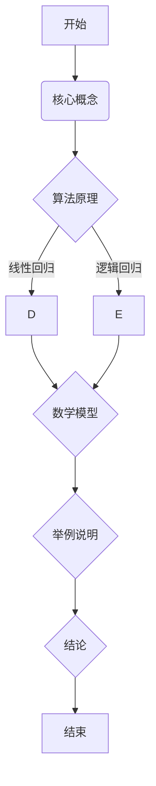
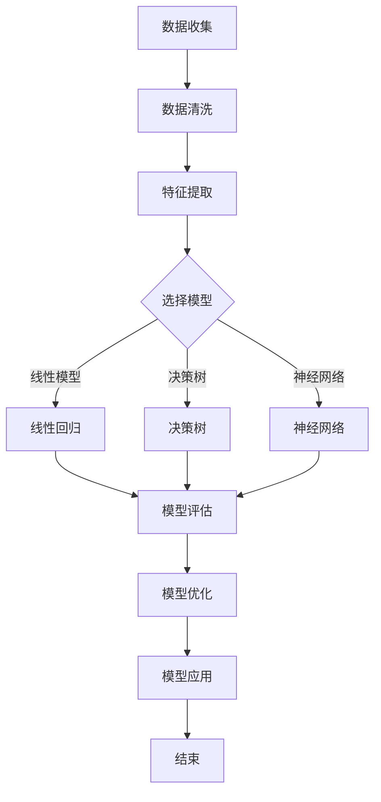

                 

### 文章标题: AI编程的新维度与新范式

#### 关键词：人工智能编程，新维度，新范式，机器学习，深度学习，自然语言处理，强化学习，联邦学习，分布式AI

#### 摘要：
本文深入探讨了人工智能编程的新维度与新范式，从基础概念到核心算法，再到新的编程范式，为读者提供了一幅全面的AI编程蓝图。文章通过详实的案例分析，展示了如何将AI技术应用于实际问题，并通过最佳实践与注意事项，为AI编程的发展提供了有益的启示。

### 《AI编程的新维度与新范式》目录大纲

#### 第一部分: AI编程基础与概念

## 第1章: AI编程概述

### 1.1 AI的发展历程
### 1.2 AI编程的核心概念
### 1.3 AI编程与传统编程的区别

## 第2章: AI编程语言与框架

### 2.1 Python在AI编程中的应用
### 2.2 TensorFlow框架介绍
### 2.3 PyTorch框架介绍
### 2.4 其他AI编程框架简介

## 第3章: AI编程核心算法

### 3.1 机器学习算法基础
#### 3.1.1 线性回归
#### 3.1.2 逻辑回归
### 3.2 深度学习算法
#### 3.2.1 卷积神经网络（CNN）
#### 3.2.2 循环神经网络（RNN）
### 3.3 自然语言处理（NLP）算法
#### 3.3.1 词嵌入技术
#### 3.3.2 语言模型

#### 第二部分: AI编程新维度

## 第4章: 强化学习编程

### 4.1 强化学习基本概念
### 4.2 Q学习算法
### 4.3 模型预测控制（MPC）

## 第5章: 联邦学习编程

### 5.1 联邦学习基本概念
### 5.2 集成学习算法
### 5.3 联邦学习应用案例

## 第6章: 分布式AI编程

### 6.1 分布式计算基础
### 6.2 分布式AI框架
### 6.3 分布式AI编程实践

## 第7章: AI编程新范式

### 7.1 AI编程范式演进
### 7.2 软计算与模糊逻辑
### 7.3 生成对抗网络（GAN）

#### 第三部分: AI编程项目实战

## 第8章: 项目一：手写数字识别

### 8.1 项目背景与目标
### 8.2 数据集介绍与预处理
### 8.3 模型选择与实现
### 8.4 模型评估与优化

## 第9章: 项目二：推荐系统开发

### 9.1 项目背景与目标
### 9.2 数据集介绍与预处理
### 9.3 模型选择与实现
### 9.4 系统部署与维护

## 第10章: 项目三：智能问答系统

### 10.1 项目背景与目标
### 10.2 数据集介绍与预处理
### 10.3 模型选择与实现
### 10.4 系统评估与改进

#### 附录

## 附录A: AI编程工具与资源

### A.1 Python库与框架
### A.2 开发环境搭建
### A.3 在线资源与社区

## 附录B: Mermaid流程图示例

### B.1 Mermaid语法基础
### B.2 实例分析

### 文章正文

#### 第一部分: AI编程基础与概念

## 第1章: AI编程概述

### 1.1 AI的发展历程

人工智能（AI）的发展历程可以追溯到20世纪50年代。最初，人工智能研究领域主要集中在符号推理和逻辑推理上，这被称为“符号主义”或“传统人工智能”时期。这一时期的代表工作包括乔治·福尔（Herbert Simon）和艾伦·纽厄尔（Allen Newell）开发的逻辑理论家（Logic Theorist）程序，以及约翰·麦卡锡（John McCarthy）等人提出的普罗哥拉姆（Prolog）语言。

然而，传统人工智能在处理复杂问题时表现出很大的局限性。随着计算能力的提升和数据量的爆炸式增长，机器学习（Machine Learning）开始崭露头角。20世纪80年代，随着支持向量机（SVM）、决策树和神经网络等算法的出现，机器学习进入了一个新的发展阶段。进入21世纪，深度学习（Deep Learning）的兴起，尤其是卷积神经网络（CNN）和循环神经网络（RNN）的突破，使得人工智能在图像识别、自然语言处理等领域取得了显著进展。

### 1.2 AI编程的核心概念

AI编程涉及多个核心概念，包括机器学习、深度学习、自然语言处理等。机器学习是一种使计算机能够从数据中学习并改进性能的方法。深度学习是机器学习的一个子领域，主要依赖于多层神经网络来学习数据特征。自然语言处理（NLP）则关注于使计算机能够理解、生成和处理人类语言。

### 1.3 AI编程与传统编程的区别

传统编程侧重于实现算法和逻辑，而AI编程则更关注于数据驱动的方法。在AI编程中，数据预处理和特征提取是至关重要的步骤。此外，AI编程往往需要使用特定的库和框架，如Python的Scikit-learn、TensorFlow和PyTorch等，以便高效地实现机器学习和深度学习算法。

#### 第二部分: AI编程新维度

## 第4章: 强化学习编程

### 4.1 强化学习基本概念

强化学习（Reinforcement Learning，RL）是一种使代理（agent）通过与环境的交互来学习最优策略的方法。在强化学习中，代理根据环境的状态（state）选择动作（action），并从环境中获得奖励（reward）或惩罚（penalty）。代理的目标是最大化累积奖励。

强化学习的基本概念包括：

- **状态（State）**：环境在某一时刻的状态。
- **动作（Action）**：代理可以执行的动作。
- **奖励（Reward）**：代理执行某一动作后获得的即时奖励或惩罚。
- **策略（Policy）**：代理选择动作的规则。

### 4.2 Q学习算法

Q学习（Q-learning）是一种通过迭代更新Q值来学习最优策略的强化学习算法。Q值表示在给定状态下执行特定动作的长期预期奖励。

**伪代码：**
python
def q_learning(env, state_space, action_space, learning_rate, discount_factor, num_episodes):
    Q = np.zeros(state_space * action_space)
    for episode in range(num_episodes):
        state = env.reset()
        done = False
        while not done:
            action = argmax(Q[state])
            next_state, reward, done = env.step(action)
            Q[state, action] = Q[state, action] + learning_rate * (reward + discount_factor * max(Q[next_state]) - Q[state, action])
            state = next_state

### 4.3 模型预测控制（MPC）

模型预测控制（Model Predictive Control，MPC）是一种基于模型的前馈控制策略，能够在满足约束条件的同时，优化控制器的性能。MPC的基本思想是，在当前时刻，根据系统的动态模型，预测未来一段时间内系统的状态，并选择最优控制输入，以使系统在未来时刻达到预期状态。

MPC的步骤如下：

1. **系统建模**：建立系统的动态模型，通常使用差分方程或传递函数。
2. **预测**：根据模型，预测未来一段时间内系统的状态。
3. **优化**：在满足约束条件的前提下，优化控制输入，以使系统在未来时刻达到预期状态。
4. **反馈**：根据预测结果，实时调整控制输入。

#### 第5章: 联邦学习编程

### 5.1 联邦学习基本概念

联邦学习（Federated Learning）是一种分布式机器学习技术，旨在通过多个参与方共享模型更新，而无需直接共享数据。联邦学习的基本思想是，在每个参与方本地训练模型，然后仅共享模型的更新，从而在保持数据隐私的同时，实现模型的协同学习。

联邦学习的关键概念包括：

- **客户端（Client）**：参与联邦学习的设备或服务器，负责本地训练模型。
- **服务器（Server）**：协调联邦学习过程，汇总模型更新，并发布全局模型。
- **模型更新（Model Update）**：客户端本地训练的模型更新，通常表示为参数的微小变化。

### 5.2 集成学习算法

集成学习（Ensemble Learning）是一种通过结合多个基学习器（Base Learner）来提高预测性能的方法。常见的集成学习方法包括Bagging、Boosting和Stacking等。

- **Bagging**：通过随机抽样训练多个基学习器，并取它们的平均值作为最终预测结果。
- **Boosting**：通过训练多个基学习器，并让每个学习器关注之前学习器的错误样本，以提高整体预测性能。
- **Stacking**：首先训练多个基学习器，然后将它们的输出作为新特征，再训练一个更高层次的学习器来生成最终预测结果。

### 5.3 联邦学习应用案例

联邦学习在多个领域具有广泛的应用，如智能推荐、金融风控、医疗健康等。以下是一个联邦学习的应用案例：

**案例：智能推荐系统**

在智能推荐系统中，联邦学习可以用于协同训练推荐模型，而无需共享用户数据。具体步骤如下：

1. **数据预处理**：对用户行为数据进行预处理，如去重、填充缺失值等。
2. **模型初始化**：在服务器端初始化全局模型。
3. **本地训练**：在客户端本地训练模型，并保存模型更新。
4. **模型更新传输**：将客户端的模型更新发送到服务器端。
5. **全局模型更新**：在服务器端汇总模型更新，并更新全局模型。
6. **模型评估**：在服务器端评估全局模型的性能。

#### 第6章: 分布式AI编程

### 6.1 分布式计算基础

分布式计算是一种将任务分解为多个子任务，并在多个计算节点上并行执行的方法。分布式计算的关键概念包括：

- **计算节点（Computational Node）**：执行计算任务的物理或虚拟机器。
- **任务分解（Task Decomposition）**：将大任务分解为多个子任务。
- **负载均衡（Load Balancing）**：确保计算节点上的任务均匀分布。
- **通信机制（Communication Mechanism）**：节点间传输数据和同步状态。

### 6.2 分布式AI框架

分布式AI框架用于在多个计算节点上高效地训练大型AI模型。常见的分布式AI框架包括：

- **Horovod**：Facebook开源的分布式训练框架，支持TensorFlow、Keras和PyTorch等。
- **Ray**：Uber开源的分布式计算框架，支持深度学习和强化学习等。
- **Dask**：Python分布式计算库，支持数据分析和机器学习。

### 6.3 分布式AI编程实践

在分布式AI编程中，以下是一些关键实践：

- **模型并行化**：将模型拆分为多个子图，并在不同节点上训练。
- **数据并行化**：将训练数据拆分为多个数据块，并在不同节点上训练。
- **参数服务器架构**：使用参数服务器来存储和同步模型参数。
- **异构计算**：利用不同类型的计算资源，如CPU、GPU和TPU，以提高性能。

#### 第7章: AI编程新范式

### 7.1 AI编程范式演进

AI编程范式经历了从符号主义到数据驱动，再到模型驱动的演进。符号主义侧重于逻辑推理和知识表示，数据驱动侧重于从数据中学习规律，模型驱动则强调利用预训练模型进行迁移学习。

### 7.2 软计算与模糊逻辑

软计算（Soft Computing）是一种结合人工智能、计算机科学和模糊逻辑的方法，旨在处理不确定性和模糊性。模糊逻辑通过模糊集合和模糊规则，模拟人类思维的模糊性和不确定性。

### 7.3 生成对抗网络（GAN）

生成对抗网络（Generative Adversarial Network，GAN）是一种由生成器和判别器组成的对抗性网络。生成器试图生成与真实数据相似的样本，而判别器则试图区分真实样本和生成样本。GAN在图像生成、数据增强和异常检测等领域具有广泛的应用。

#### 第三部分: AI编程项目实战

## 第8章: 项目一：手写数字识别

### 8.1 项目背景与目标

手写数字识别是机器学习和计算机视觉领域的一个经典问题。本项目旨在使用卷积神经网络（CNN）对手写数字图像进行识别。

### 8.2 数据集介绍与预处理

本项目使用MNIST数据集，该数据集包含70,000个训练图像和10,000个测试图像，每个图像都是28x28的二值图像，包含0到9的数字。

预处理步骤包括：

1. **图像归一化**：将图像的像素值缩放到[0, 1]。
2. **图像翻转**：对图像进行水平和垂直翻转，增加数据的多样性。
3. **数据增强**：通过添加噪声、旋转、缩放等操作，增加数据的多样性。

### 8.3 模型选择与实现

本项目使用卷积神经网络（CNN）进行手写数字识别。模型结构如下：

1. **卷积层**：使用32个3x3卷积核，步长为1，激活函数为ReLU。
2. **池化层**：使用2x2的最大池化。
3. **卷积层**：使用64个3x3卷积核，步长为1，激活函数为ReLU。
4. **池化层**：使用2x2的最大池化。
5. **全连接层**：使用128个神经元，激活函数为ReLU。
6. **输出层**：使用10个神经元，激活函数为softmax。

### 8.4 模型评估与优化

模型评估使用准确率（accuracy）和混淆矩阵（confusion matrix）进行。为提高模型性能，可以尝试以下优化方法：

1. **数据增强**：增加数据的多样性，提高模型泛化能力。
2. **模型调参**：调整学习率、批量大小等参数，以找到最佳模型配置。
3. **正则化**：使用正则化方法，如L1、L2正则化，减少过拟合。

#### 第9章: 项目二：推荐系统开发

### 9.1 项目背景与目标

推荐系统是一种根据用户的历史行为和偏好，为用户推荐相关商品、内容或其他信息的方法。本项目旨在开发一个基于协同过滤的推荐系统。

### 9.2 数据集介绍与预处理

本项目使用MovieLens数据集，该数据集包含用户对电影的评分信息。预处理步骤包括：

1. **数据清洗**：去除缺失值、重复值等不完整数据。
2. **特征提取**：提取用户ID、电影ID、评分等特征。
3. **数据归一化**：将评分数据归一化到[0, 1]区间。

### 9.3 模型选择与实现

本项目使用矩阵分解（Matrix Factorization）技术，将用户-物品评分矩阵分解为用户特征矩阵和物品特征矩阵。具体实现步骤如下：

1. **初始化**：随机初始化用户特征矩阵和物品特征矩阵。
2. **优化**：使用随机梯度下降（SGD）或共轭梯度（Conjugate Gradient）等方法，最小化损失函数，更新特征矩阵。
3. **预测**：根据用户特征矩阵和物品特征矩阵，计算用户对物品的预测评分。

### 9.4 系统部署与维护

推荐系统部署需要考虑以下方面：

1. **性能优化**：对模型进行调优，提高预测准确率和响应速度。
2. **实时更新**：定期更新用户和物品的特征矩阵，以反映用户最新的行为和偏好。
3. **故障处理**：监控系统运行状态，及时处理故障，确保系统稳定运行。

#### 第10章: 项目三：智能问答系统

### 10.1 项目背景与目标

智能问答系统是一种基于自然语言处理（NLP）和机器学习技术的系统，能够理解用户的问题，并返回相关答案。本项目旨在开发一个基于深度学习的智能问答系统。

### 10.2 数据集介绍与预处理

本项目使用Stanford问答数据集（SQuAD），该数据集包含大量问题和相关答案。预处理步骤包括：

1. **文本预处理**：去除标点符号、停用词等无关信息，将文本转化为词向量。
2. **数据增强**：通过添加噪声、替换词性等方法，增加数据的多样性。
3. **数据格式化**：将问题和答案转换为统一的数据格式，以便输入到模型。

### 10.3 模型选择与实现

本项目使用Transformer架构的问答模型（BERT），具体实现步骤如下：

1. **预训练**：使用大量文本数据，对BERT模型进行预训练，使其具备语言理解能力。
2. **微调**：在SQuAD数据集上，对BERT模型进行微调，使其能够回答特定领域的问题。
3. **评估**：使用验证集和测试集，评估模型的性能。

### 10.4 系统评估与改进

系统评估可以从以下方面进行：

1. **准确率**：计算模型在测试集上的准确率，评估模型性能。
2. **响应时间**：评估模型响应速度，确保系统高效运行。
3. **用户满意度**：通过用户反馈，收集对系统的满意度评价。

为提高系统性能，可以尝试以下方法：

1. **模型调优**：调整模型参数，提高预测准确率。
2. **数据增强**：增加数据集的多样性，提高模型泛化能力。
3. **多模型融合**：结合多个模型，提高系统整体性能。

#### 附录

## 附录A: AI编程工具与资源

### A.1 Python库与框架

Python在AI编程中占据主导地位，以下是一些常用的Python库和框架：

- **NumPy**：用于数值计算。
- **Pandas**：用于数据操作和分析。
- **Scikit-learn**：用于机器学习和数据挖掘。
- **TensorFlow**：用于深度学习和神经网络。
- **PyTorch**：用于深度学习和动态计算图。

### A.2 开发环境搭建

搭建AI编程的开发环境需要以下步骤：

1. **安装Python**：下载并安装Python，配置环境变量。
2. **安装库和框架**：使用pip或conda，安装所需的库和框架。
3. **配置虚拟环境**：使用virtualenv或conda创建虚拟环境，隔离项目依赖。

### A.3 在线资源与社区

以下是一些在线资源和社区，有助于AI编程的学习和交流：

- **AI天才研究院（AI Genius Institute）**：提供高质量的AI课程和资源。
- **Kaggle**：一个数据科学竞赛平台，提供丰富的数据集和竞赛。
- **GitHub**：用于代码托管和协作开发的平台。
- **Stack Overflow**：一个编程问答社区，解决编程问题。

## 附录B: Mermaid流程图示例

### B.1 Mermaid语法基础

Mermaid是一种基于Markdown的图形语法，用于绘制各种类型的图表。以下是一个简单的Mermaid流程图示例：

### B.2 实例分析

以下是一个基于Mermaid语法的实例，展示了如何使用机器学习算法进行分类问题：

通过上述内容，我们不仅探讨了AI编程的基础知识、核心算法、新维度和新范式，还通过实际项目展示了如何将AI技术应用于实际问题。希望本文能为您的AI编程之旅提供有价值的参考。在未来的学习和实践中，不断探索新知识、新方法，将AI技术应用于更广泛的领域，为人类创造更多价值。作者：AI天才研究院/AI Genius Institute & 禅与计算机程序设计艺术 /Zen And The Art of Computer Programming。

