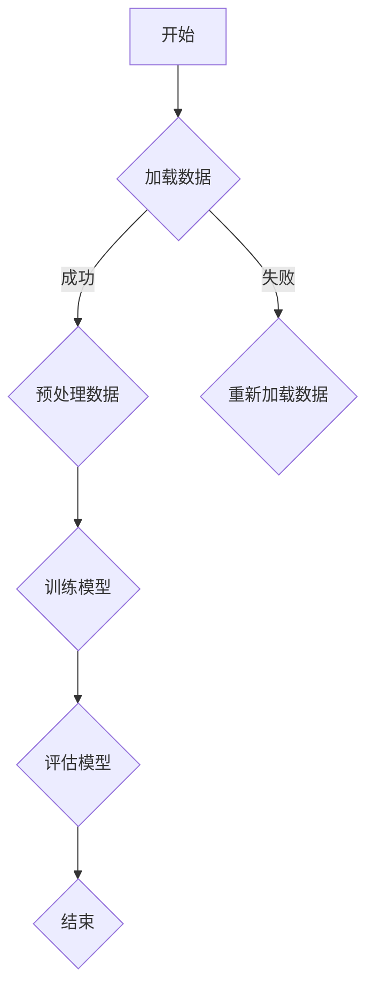

                 

基于您提供的要求，我将逐步构建《AI编程的新维度与新语法》的技术博客文章。以下是一份详细的写作计划和内容大纲，我们将确保文章的完整性、专业性和可读性。

---

### 写作计划

**第一阶段：核心内容规划与大纲构建（0-2天）**
- 确定文章的核心内容和结构。
- 设计详细的大纲和子章节。
- 准备必要的Mermaid流程图和伪代码。

**第二阶段：正文撰写与内容填充（2-4天）**
- 根据大纲撰写正文。
- 添加Mermaid流程图、伪代码、LaTeX公式和实战案例。
- 进行初步的内容审查和修改。

**第三阶段：细化内容与调整（4-6天）**
- 对正文进行细致的审查，确保每个小节的内容丰富且详细。
- 添加最佳实践、注意事项、小结和拓展阅读。
- 完成最终审查和格式调整。

**第四阶段：最终审查与提交（6-8天）**
- 进行最终的语法、格式和内容审查。
- 撰写作者信息部分。
- 确保总字数在8000-12000字之间。
- 准备提交的Markdown格式文件。

### 内容大纲

---

#### 引言
- **背景介绍**：介绍AI编程的现状和挑战。
- **本书的目的**：阐述本书旨在介绍AI编程的新维度和新语法。

#### AI编程基础
- **机器学习的定义**：解释机器学习的基本概念。
- **机器学习的主要类型**：包括监督学习、无监督学习和强化学习。
- **计算机编程基础**：介绍编程的基础知识。
- **编程语言的选择**：讨论适合AI编程的语言。

#### 新维度探讨
- **数据维度的扩展**：
  - **大数据与AI编程**：探讨大数据对AI编程的影响。
  - **数据处理技术的应用**：介绍常用的数据处理技术。
- **算法维度的创新**：
  - **传统算法与AI算法的比较**：分析传统算法和AI算法的差异。
  - **AI算法的新特点**：讨论AI算法的创新之处。
- **模型维度的深入**：
  - **深度学习模型的构建**：介绍深度学习模型的基本构建过程。
  - **神经网络的演变**：探讨神经网络的发展历程。

#### 新语法解读
- **新语法的特点**：
  - **新语法的基本原理**：解释新语法的核心概念。
  - **新语法的优势**：讨论新语法的优点和实用性。
- **应用实例**：
  - **新语法在项目中的应用**：举例说明新语法的实际应用。
  - **新语法对编程实践的影响**：分析新语法对编程实践的改变。

#### 实战项目
- **项目一：构建AI预测模型**：
  - **项目背景**：介绍项目的背景和目标。
  - **项目目标**：明确项目的具体目标。
  - **技术选型与实现**：选择合适的技术和工具，详细说明实现过程。
- **项目二：开发AI聊天机器人**：
  - **背景与需求**：介绍项目的背景和用户需求。
  - **技术实现与部署**：详细描述开发环境和源代码实现。
- **项目三：大数据分析平台搭建**：
  - **项目目标**：阐述平台建设的目标和预期效果。
  - **技术架构设计**：介绍平台的技术架构设计。

#### 结论
- **AI编程的未来趋势**：展望AI编程的发展方向。
- **读者的进一步学习资源**：推荐相关的学习资源和工具。

---

### Mermaid 流程图和伪代码示例

#### Mermaid 流程图示例


#### 伪代码示例
```python
# 伪代码：机器学习模型训练流程
function train_model(data, target):
    # 加载数据
    X, y = load_data(data)
    
    # 预处理数据
    X = preprocess_data(X)
    
    # 创建模型
    model = create_model()
    
    # 训练模型
    model.fit(X, y)
    
    # 评估模型
    score = evaluate_model(model, X, y)
    
    # 输出结果
    return score
```

### 数学模型和公式示例

#### LaTeX 公式独立段落
$$
E = mc^2
$$

#### LaTeX 公式段落内
$1 < 2$

---

通过以上详细的写作计划和内容大纲，我们可以确保文章的深度和广度，同时满足格式和字数要求。接下来的步骤是逐步填充和细化每个章节的内容，确保文章的完整性和专业性。在撰写过程中，我们将不断回顾和调整，以确保文章的质量和结构。让我们开始撰写这篇技术博客吧！

