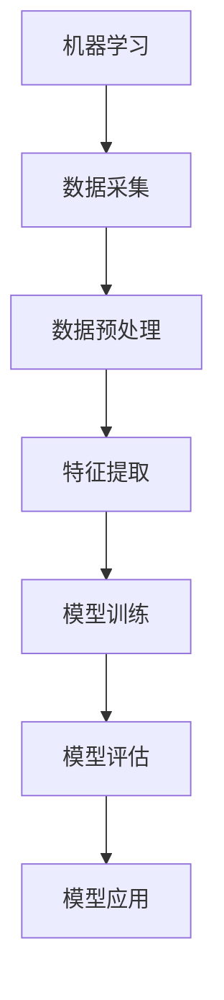
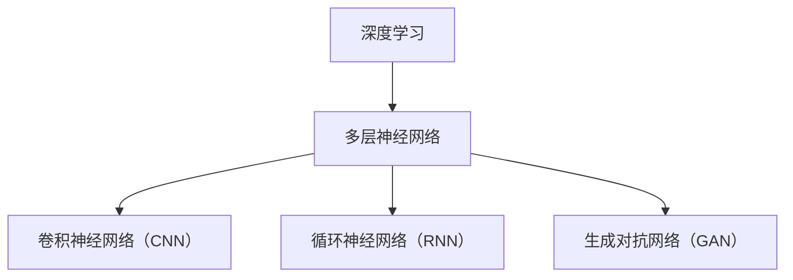
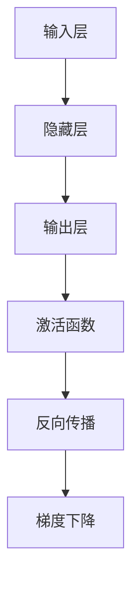
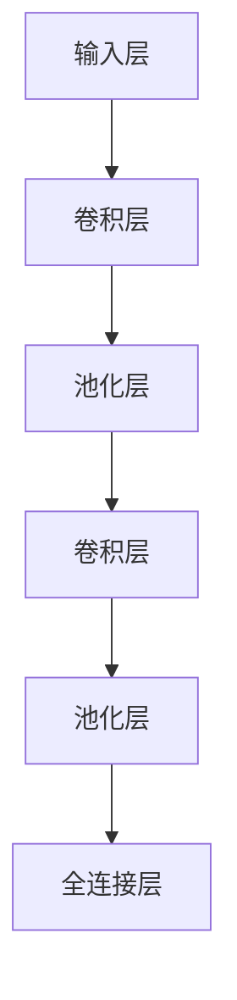
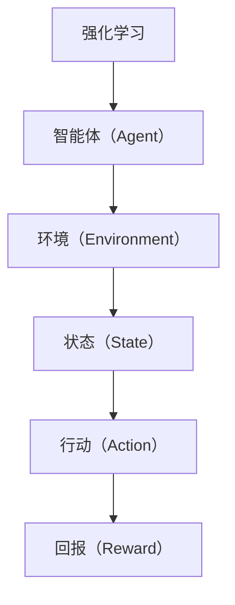
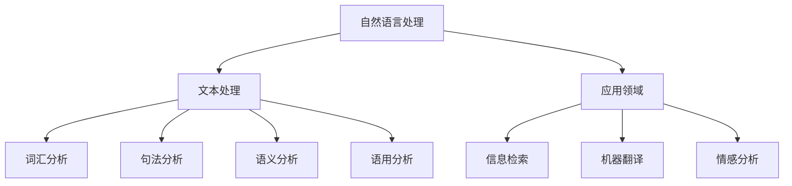
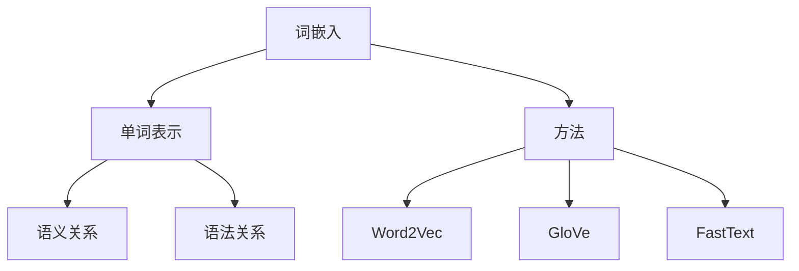
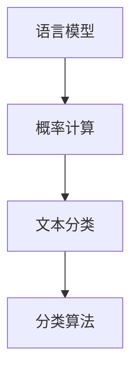

                 

### 第3章：机器学习原理

#### 3.1 机器学习基本概念

机器学习（Machine Learning，ML）是人工智能（Artificial Intelligence，AI）的一个重要分支，它通过数据或以往的经验，让计算机能够自动完成特定任务。其核心目标是从数据中提取知识，实现从已知到未知的推断和预测。

**概念图：**  


**伪代码：**  
```python  
# 数据采集  
data = collect_data()

# 数据预处理  
preprocessed_data = preprocess_data(data)

# 特征提取  
features = extract_features(preprocessed_data)

# 模型训练  
model = train_model(features)

# 模型评估  
evaluate_model(model)

# 模型应用  
apply_model(model)  
```

**数学模型与公式：**  
$$J(\theta) = \frac{1}{2m}\sum_{i=1}^{m}(h_\theta(x^{(i)}) - y^{(i)})^2$$  
其中，$m$ 是样本数量，$h_\theta(x^{(i)})$ 是模型预测值，$y^{(i)}$ 是真实值。

**项目实战案例：**  
- 使用Python实现线性回归模型，对房价进行预测。

在项目实战中，我们首先需要进行数据采集，获取一定数量的房屋数据。然后对数据进行预处理，包括缺失值处理、异常值处理和数据标准化等步骤。接下来，提取特征，例如房屋面积、卧室数量等。使用这些特征，我们构建一个线性回归模型，并对其进行训练。最后，使用训练好的模型对新的房屋数据进行分析，预测房价。

#### 3.2 监督学习算法

监督学习（Supervised Learning）是机器学习的一种方法，其中训练数据集包含了输入和对应的输出标签。监督学习的目标是通过学习输入和输出之间的关系，对新的输入数据进行预测。

**算法原理讲解：**

**线性回归（Linear Regression）：**  
线性回归是一种简单的监督学习算法，它通过拟合一条直线来预测连续的输出值。其基本公式为：  
$$y = \theta_0 + \theta_1 \cdot x$$  
其中，$y$ 是预测值，$x$ 是输入值，$\theta_0$ 和 $\theta_1$ 是模型的参数。

**伪代码：**  
```python  
# 初始化参数  
theta = initialize_parameters()

# 前向传播  
y_pred = forward_propagation(x, theta)

# 计算损失  
loss = compute_loss(y_pred, y)

# 反向传播  
deltas = backward_propagation(x, y, theta)

# 更新参数  
theta = update_parameters(theta, deltas)  
```

**支持向量机（Support Vector Machine，SVM）：**  
支持向量机是一种强大的分类算法，它通过找到一个最佳的超平面，将不同类别的数据分开。SVM的核心思想是最大化分类边界的间隔。

**伪代码：**  
```python  
# 初始化参数  
C = initialize_parameters()

# 前向传播  
w, b = forward_propagation(x, y, C)

# 计算损失  
loss = compute_loss(w, b)

# 反向传播  
deltas = backward_propagation(x, y, w, b, C)

# 更新参数  
w, b = update_parameters(w, b, deltas, C)  
```

**项目实战案例：**  
- 使用Python实现支持向量机，对鸢尾花数据集进行分类。

在鸢尾花数据集中，我们有三种不同类型的鸢尾花，每种类型有四项特征：花萼长度、花萼宽度、花瓣长度和花瓣宽度。使用支持向量机，我们可以将这些特征转化为数值，然后训练模型，实现对鸢尾花类型的预测。

#### 3.3 无监督学习算法

无监督学习（Unsupervised Learning）是在没有明确输出标签的情况下进行学习的方法。无监督学习的目标通常是从数据中发现模式、结构或隐藏的规律。

**算法原理讲解：**

**K-均值聚类（K-Means Clustering）：**  
K-均值聚类是一种常用的无监督学习算法，它通过迭代的方式将数据点划分成K个聚类。每个聚类中心点的选择是基于数据点的平均值。

**伪代码：**  
```python  
# 初始化聚类中心点  
centroids = initialize_centroids()

# 聚类迭代  
for i in range(num_iterations):  
    # 计算每个数据点的聚类标签  
    labels = assign_labels(data, centroids)

    # 更新聚类中心点  
    centroids = update_centroids(data, labels)

# 计算聚类评估指标  
evaluate_clusters(centroids, labels)  
```

**主成分分析（Principal Component Analysis，PCA）：**  
主成分分析是一种降维技术，它通过将数据投影到新的正交坐标系上，来简化数据结构。PCA的目标是找到数据的主要方向，从而减少数据的维度。

**伪代码：**  
```python  
# 计算协方差矩阵  
covariance_matrix = compute_covariance_matrix(data)

# 计算特征值和特征向量  
eigenvalues, eigenvectors = compute_eigenvalues_eigenvectors(covariance_matrix)

# 选择主要特征向量  
main_eigenvectors = select_main_eigenvectors(eigenvalues, eigenvectors)

# 进行数据降维  
data_reduced = project_data(data, main_eigenvectors)

# 计算降维后的数据评估指标  
evaluate_data_reduction(data, data_reduced)  
```

**项目实战案例：**  
- 使用Python实现K-均值聚类，对 Iris 数据集进行分类。

在 Iris 数据集中，我们有三种不同类型的鸢尾花，每种类型有四项特征：花萼长度、花萼宽度、花瓣长度和花瓣宽度。使用K-均值聚类，我们可以将这些特征点划分成三个聚类，从而实现数据分类。

通过本章的学习，我们了解了机器学习的基本概念、监督学习算法和无监督学习算法。这些知识为我们进入更深层次的 AI 编程奠定了坚实的基础。在接下来的章节中，我们将进一步探讨深度学习、自然语言处理等 AI 编程的核心领域。### 第4章：深度学习基础

#### 4.1 深度学习概述

深度学习（Deep Learning，DL）是机器学习的一种重要分支，它通过构建多层神经网络模型，模拟人脑的学习机制，从大量数据中自动提取特征和规律，实现对复杂数据的建模和预测。

**概念图：**  


**历史背景：**  
深度学习的发展可以追溯到 20 世纪 50 年代，但直到 2006 年，由加拿大科学家杰弗里·辛顿（Geoffrey Hinton）提出的深度信念网络（Deep Belief Network，DBN）成功训练后，深度学习才真正开始兴起。随后，2012 年，AlexNet 在 ImageNet 挑战赛上取得了突破性的成绩，进一步推动了深度学习的研究和应用。

**伪代码：**  
```python  
# 初始化神经网络  
neural_network = initialize_neural_network()

# 前向传播  
output = forward_propagation(input_data, neural_network)

# 计算损失  
loss = compute_loss(output, target)

# 反向传播  
deltas = backward_propagation(input_data, output, target, neural_network)

# 更新参数  
neural_network = update_parameters(neural_network, deltas)  
```

**数学模型与公式：**  
深度学习主要依赖于多层感知机（Multilayer Perceptron，MLP）和反向传播算法。在神经网络中，每个神经元都接受前一层神经元的输入，并经过激活函数处理后，传递给下一层神经元。

$$output = \sigma(\sum_{j=1}^{n} w_{ji} \cdot a_{i-1}^{(j)} + b_i)$$

其中，$a_i^{(j)}$ 是第 $i$ 层第 $j$ 个神经元的输入，$w_{ji}$ 是连接第 $i$ 层和第 $j$ 层的权重，$b_i$ 是第 $i$ 层第 $j$ 个神经元的偏置，$\sigma$ 是激活函数，通常使用 Sigmoid 或 ReLU 函数。

**项目实战案例：**  
- 使用 Python 实现 MLP，对 MNIST 手写数字数据集进行分类。

在 MNIST 数据集中，我们有 70,000 个手写数字的图片，每个图片大小为 28x28 像素。使用多层感知机，我们可以将这些图像转换为数值，并训练模型，实现对数字的识别。

#### 4.2 神经网络基础

神经网络（Neural Network，NN）是一种模仿生物神经网络计算能力的模型。它由大量相互连接的神经元组成，每个神经元都可以接收输入、进行计算并产生输出。

**概念图：**  


**神经元模型：**  
一个简单的神经元模型可以表示为：

$$z = \sum_{j=1}^{n} w_{ji} \cdot x_j + b$$

$$a = \sigma(z)$$

其中，$x_j$ 是输入值，$w_{ji}$ 是连接权重，$b$ 是偏置，$\sigma$ 是激活函数。

**反向传播算法：**  
反向传播算法是深度学习中的核心算法，它通过前向传播计算输出，然后反向传播计算误差，并更新网络参数。

**伪代码：**  
```python  
# 前向传播  
z = compute_forward(input_data, weights, biases)

# 激活函数  
a = activate(z)

# 反向传播  
deltas = compute_backward(output, a, weights)

# 更新参数  
weights = update_weights(weights, deltas)  
biases = update_biases(biases, deltas)  
```

**梯度下降算法：**  
梯度下降算法是一种优化算法，它通过不断调整网络参数，使得损失函数最小。

$$\theta_{\text{new}} = \theta_{\text{old}} - \alpha \cdot \nabla_\theta J(\theta)$$

其中，$\theta$ 是网络参数，$\alpha$ 是学习率，$J(\theta)$ 是损失函数。

**项目实战案例：**  
- 使用 Python 实现 ReLU 激活函数，对 XOR 问题进行分类。

在 XOR 问题中，有两个输入 $x_1$ 和 $x_2$，输出为 $y = (x_1 \land \neg x_2) \lor (\neg x_1 \land x_2)$。使用 ReLU 激活函数，我们可以构建一个简单的神经网络，实现对 XOR 问题的分类。

#### 4.3 卷积神经网络（CNN）

卷积神经网络（Convolutional Neural Network，CNN）是一种特别适合处理图像数据的神经网络。它通过卷积操作和池化操作，有效地提取图像的特征。

**概念图：**  


**卷积操作：**  
卷积操作是将一个滤波器（也称为卷积核或特征图）与输入图像进行点积操作。滤波器的大小通常为 $3x3$ 或 $5x5$，它可以提取图像中的局部特征。

**伪代码：**  
```python  
# 卷积操作  
output = convolve(filter, input_image)

# 点积计算  
dot_product = sum(filter * input_image)  
```

**池化操作：**  
池化操作是一种用于下采样的操作，它通过选择局部区域的最大值或平均值来减少数据维度。

**伪代码：**  
```python  
# 最大池化  
max_pool = max_value_in_region

# 平均池化  
avg_pool = average_value_in_region  
```

**项目实战案例：**  
- 使用 Python 实现 CNN，对 CIFAR-10 数据集进行分类。

在 CIFAR-10 数据集中，我们有 10 个类别，每个类别有 6000 个图像。使用 CNN，我们可以训练模型，实现对 CIFAR-10 数据集的分类，从而验证 CNN 在图像识别方面的有效性。

通过本章的学习，我们了解了深度学习的基本概念、神经网络基础和卷积神经网络。这些知识为我们在深度学习领域的进一步探索奠定了基础。在接下来的章节中，我们将继续探讨深度学习在其他领域的应用，如自然语言处理和强化学习。### 第5章：强化学习入门

#### 5.1 强化学习概述

强化学习（Reinforcement Learning，RL）是机器学习的一个重要分支，它通过智能体（Agent）与环境的交互来学习最优策略。强化学习的核心目标是通过不断地尝试和反馈，使智能体在特定环境中实现长期回报最大化。

**概念图：**  


**伪代码：**  
```python  
# 初始化智能体和环境的参数  
agent = initialize_agent()  
environment = initialize_environment()

# 强化学习循环  
while not termination_condition:  
    # 从智能体选择行动  
   action = agent.select_action(state)

    # 执行行动并得到新的状态和回报  
   next_state, reward = environment.step(state, action)

    # 更新智能体的策略  
   agent.update_policy(state, action, reward)

    # 更新状态  
   state = next_state  
```

**数学模型与公式：**  
在强化学习中，我们通常使用马尔可夫决策过程（Markov Decision Process，MDP）来描述智能体和环境的交互。一个 MDP 可以表示为 $M = \langle S, A, P, R, \gamma \rangle$，其中：

- $S$ 是状态的集合。
- $A$ 是行动的集合。
- $P$ 是状态转移概率矩阵，$P(s' | s, a) = P(\text{next state is } s' \text{ given current state is } s \text{ and action } a)$。
- $R$ 是回报函数，$R(s, a) = \text{expected reward for state-action pair } (s, a)$。
- $\gamma$ 是折扣因子，$0 \leq \gamma \leq 1$，它用于平衡当前回报和未来回报的重要性。

强化学习的目标是最小化期望回报的负值，即最大化期望回报：

$$J(\pi) = E_{s_0}[\sum_{t=0}^{\infty} \gamma^t R(s_t, a_t)]$$

其中，$\pi$ 是策略，$s_0$ 是初始状态。

**项目实战案例：**  
- 使用 Python 实现 Q-Learning 算法，解决经典的无人车倒车入位问题。

在无人车倒车入位问题中，无人车需要从一个停车位倒车进入另一个停车位。使用 Q-Learning 算法，我们可以训练智能体，使其学会在给定状态下选择最优的行动。

#### 5.2 强化学习算法

强化学习算法主要分为值函数方法（Value-Based Methods）和政策梯度方法（Policy Gradient Methods）。

**值函数方法：**  
值函数方法通过学习状态价值函数（State-Value Function）和动作价值函数（Action-Value Function）来指导智能体的行动。常用的值函数方法包括 Q-Learning 和 SARSA。

**Q-Learning：**  
Q-Learning 算法通过更新动作价值函数来学习状态价值。其更新规则如下：

$$Q(s, a) \leftarrow Q(s, a) + \alpha [r + \gamma \max_{a'} Q(s', a') - Q(s, a)]$$

其中，$s$ 是当前状态，$a$ 是当前行动，$r$ 是回报，$\gamma$ 是折扣因子，$\alpha$ 是学习率。

**伪代码：**  
```python  
# Q-Learning 算法  
while not termination_condition:  
    # 从智能体选择行动  
   action = agent.select_action(state)

    # 执行行动并得到新的状态和回报  
   next_state, reward = environment.step(state, action)

    # 更新动作价值函数  
   Q[s][a] = Q[s][a] + alpha * (reward + gamma * max(Q[next_state]) - Q[s][a])  
```

**SARSA：**  
SARSA（State-Action-Reward-State-Action）算法是 Q-Learning 的变体，它在每一步都使用实际的下一状态和下一行动来更新动作价值函数。

$$Q(s, a) \leftarrow Q(s, a) + \alpha [r + \gamma Q(s', a')] - Q(s, a)]$$

**伪代码：**  
```python  
# SARSA 算法  
while not termination_condition:  
    # 从智能体选择行动  
   action = agent.select_action(state)

    # 执行行动并得到新的状态和回报  
   next_state, reward = environment.step(state, action)

    # 更新动作价值函数  
   Q[s][a] = Q[s][a] + alpha * (reward + gamma * Q[next_state][action] - Q[s][a])  
```

**政策梯度方法：**  
政策梯度方法直接优化智能体的策略，通过评估策略的梯度来更新策略。常用的政策梯度方法包括 SARSA 策略梯度、优势估计策略梯度等。

**伪代码：**  
```python  
# 政策梯度方法  
while not termination_condition:  
    # 从智能体执行行动并得到回报  
   action, reward = environment.step(state, policy(state))

    # 更新策略  
   policy(s) \leftarrow policy(s) + alpha * (reward - Q(s, policy(s))) \cdot gradient\_of\_policy(s)  
```

**项目实战案例：**  
- 使用 Python 实现 SARSA 算法，解决经典的台球游戏问题。

在台球游戏问题中，智能体需要学习在给定桌面上选择最佳的击球点，以使台球进入目标区域。使用 SARSA 算法，我们可以训练智能体，使其学会在复杂的环境中做出最优决策。

#### 5.3 强化学习应用实例

强化学习在许多领域都有广泛的应用，以下是一些典型的应用实例：

**实例 1：游戏**  
强化学习在游戏领域有着广泛的应用，例如在《星际争霸 2》（StarCraft II）和《Dota 2》等游戏中，智能体通过学习实现与人类玩家对弈。

**实例 2：机器人控制**  
强化学习可以用于机器人的运动控制，例如无人机飞行、自动驾驶车辆等。智能体通过学习环境中的奖励和惩罚，实现自动导航和任务执行。

**实例 3：推荐系统**  
强化学习可以用于推荐系统，例如在电子商务平台中，智能体通过学习用户的购买行为和偏好，实现个性化推荐。

**实例 4：资源管理**  
强化学习可以用于数据中心和云计算环境中的资源管理，例如负载均衡和能耗管理。智能体通过学习环境中的资源使用模式和负载情况，实现高效的资源分配。

**实例 5：金融交易**  
强化学习可以用于金融交易，例如股票交易、外汇交易等。智能体通过学习市场数据和交易规则，实现自动化的交易策略。

通过本章的学习，我们了解了强化学习的基本概念、主要算法以及典型应用实例。强化学习作为一种强大的机器学习方法，在各个领域都有着广泛的应用前景。在接下来的章节中，我们将进一步探讨自然语言处理和深度强化学习等先进技术。### 第6章：自然语言处理

#### 6.1 自然语言处理概述

自然语言处理（Natural Language Processing，NLP）是计算机科学和人工智能领域的一个分支，它旨在使计算机能够理解和处理自然语言。NLP 的核心目标是理解人类语言的结构和意义，并利用这些理解来执行各种任务，如文本分类、信息抽取、机器翻译等。

**概念图：**  


**历史背景：**  
自然语言处理的研究可以追溯到 20 世纪 50 年代，但早期的研究主要依赖于规则驱动的方法。随着计算力和算法的进步，统计方法和深度学习方法逐渐成为 NLP 的主流。2018 年，谷歌的 Transformer 模型在机器翻译领域取得了重大突破，推动了 NLP 领域的发展。

**伪代码：**  
```python  
# 文本预处理  
preprocessed_text = preprocess_text(raw_text)

# 词汇分析  
tokenized_text = tokenize(preprocessed_text)

# 句法分析  
parsed_sentence = parse_sentence(tokenized_text)

# 语义分析  
semantic_representation = analyze_semantics(parsed_sentence)

# 语用分析  
pragmatic_meaning = analyze_pragmatics(semantic_representation)

# 文本分类  
category = classify_text(pragmatic_meaning)  
```

**数学模型与公式：**  
在自然语言处理中，我们经常使用词嵌入（Word Embedding）和神经网络（Neural Network）来表示和处理语言数据。

**词嵌入：**  
词嵌入是将单词映射到低维向量空间的技术，常用的词嵌入方法包括 Word2Vec、GloVe 和 FastText。词嵌入的核心思想是相似词在向量空间中靠近。

$$\text{vec}(w) = \text{word\_embedding}(w)$$

其中，$\text{vec}(w)$ 是单词 $w$ 的向量表示。

**神经网络：**  
神经网络在 NLP 中广泛应用于文本分类、命名实体识别、关系抽取等任务。常用的神经网络架构包括循环神经网络（RNN）、长短期记忆网络（LSTM）和变压器（Transformer）。

$$h_t = \text{激活函数}(\text{神经网络}([h_{t-1}, x_t]))$$

其中，$h_t$ 是当前时间步的隐藏状态，$x_t$ 是输入的特征。

**项目实战案例：**  
- 使用 Python 实现 BERT 模型，对新闻标题进行情感分析。

在新闻标题情感分析任务中，我们需要训练一个模型，判断新闻标题的情感倾向（积极、消极或中性）。使用 BERT 模型，我们可以捕捉标题中的语义信息，从而提高情感分析的准确性。

#### 6.2 词嵌入技术

词嵌入（Word Embedding）是将自然语言中的单词映射到固定维度的向量空间的技术。词嵌入可以帮助计算机更好地理解和处理语言数据，提高文本处理任务的性能。

**概念图：**  


**Word2Vec：**  
Word2Vec 是一种基于神经网络的词嵌入方法，它通过训练神经网络来学习单词的向量表示。Word2Vec 方法主要包括连续词袋（Continuous Bag of Words，CBOW）和Skip-Gram两种模型。

**伪代码：**  
```python  
# 训练 CBOW 模型  
for each context in training_data:  
    predict_center_word(context)  
    update_weights(context)

# 训练 Skip-Gram 模型  
for each center_word in training_data:  
    predict_context_words(center_word)  
    update_weights(context_words)  
```

**数学模型与公式：**  
在 CBOW 模型中，给定一个中心词 $c$ 和其上下文词 $w_1, w_2, ..., w_k$，模型的目标是预测中心词：

$$\text{softmax}(\text{激活函数}([W_c + [W_{w_1}, W_{w_2}, ..., W_{w_k}]]))$$

其中，$W_c$ 是中心词的权重矩阵，$W_{w_i}$ 是上下文词的权重矩阵。

在 Skip-Gram 模型中，给定一个中心词 $c$，模型的目标是预测上下文词：

$$\text{softmax}(\text{激活函数}([W_c + [W_{w_1}, W_{w_2}, ..., W_{w_k}]]))$$

**项目实战案例：**  
- 使用 Python 实现 Word2Vec 模型，对电影评论进行情感分析。

在电影评论情感分析任务中，我们可以使用 Word2Vec 模型将评论中的单词转换为向量表示，然后通过计算评论向量的平均值，得到评论的语义表示。接着，我们可以使用这个表示来训练一个情感分类器，判断评论的情感倾向。

#### 6.3 语言模型与文本分类

语言模型（Language Model）是 NLP 中的一个基本工具，它用于预测一个单词序列的概率。语言模型在许多 NLP 应用中都有重要作用，如机器翻译、语音识别和文本生成等。

**概念图：**  


**基本概念：**  
语言模型的核心思想是，通过统计方法学习单词序列的概率分布。在 NLP 中，我们通常使用 n-gram 模型来构建语言模型，其中 n 表示相邻单词的数量。

**n-gram 模型：**  
n-gram 模型是一种基于统计的模型，它将一个句子表示为一系列 n 元组。给定一个单词序列 $w_1, w_2, ..., w_n$，n-gram 模型的目标是计算该序列的概率：

$$P(w_1, w_2, ..., w_n) = \frac{C(w_1, w_2, ..., w_n)}{C(w_1, w_2, ..., w_n, w_{n+1})}$$

其中，$C(w_1, w_2, ..., w_n)$ 是单词序列 $w_1, w_2, ..., w_n$ 的计数。

**伪代码：**  
```python  
# 训练 n-gram 模型  
for each n-gram in training_data:  
    count(n-gram)  
    total_count += 1

# 预测单词序列的概率  
prob = count(n-gram) / total_count  
```

**文本分类：**  
文本分类是一种将文本数据划分为预定义类别的过程。在文本分类中，我们通常使用机器学习算法来训练分类器，然后使用分类器对新的文本进行分类。

**分类算法：**  
文本分类常用的算法包括朴素贝叶斯（Naive Bayes）、支持向量机（SVM）、随机森林（Random Forest）和深度学习模型（如 CNN、RNN 和 BERT）。

**项目实战案例：**  
- 使用 Python 实现朴素贝叶斯分类器，对新闻文章进行分类。

在新闻文章分类任务中，我们可以使用朴素贝叶斯分类器，将新闻文章划分为不同的类别，如体育、科技、政治等。通过训练分类器，我们可以提高文章分类的准确性，从而帮助用户更方便地获取感兴趣的新闻内容。

通过本章的学习，我们了解了自然语言处理的基本概念、词嵌入技术、语言模型和文本分类。这些知识为我们进入 NLP 领域的深度研究奠定了基础。在接下来的章节中，我们将继续探讨自然语言处理在实际应用中的案例分析和技术挑战。### 第7章：AI编程实践

#### 7.1 数据预处理与可视化

在 AI 编程中，数据预处理与可视化是至关重要的步骤。数据预处理确保数据的质量和一致性，使其适用于模型训练；而数据可视化有助于我们理解数据特性，发现潜在的异常和规律。

**数据预处理：**

**步骤 1：数据清洗**
- 缺失值处理：使用均值、中位数或众数填充缺失值，或删除含有缺失值的样本。
- 异常值处理：使用统计方法（如 IQR 法则）检测并处理异常值，可以选择修正或删除。
- 数据规范化：将数据缩放到相同的范围，以消除不同特征间的量纲影响。

**步骤 2：数据转换**
- 分类数据编码：将分类数据转换为数字编码，如使用独热编码（One-Hot Encoding）。
- 序列化：对于时间序列数据，将其转换为固定长度的序列。

**步骤 3：特征工程**
- 特征提取：从原始数据中提取新的特征，如计算文本数据的词频或主题。
- 特征选择：选择对模型性能有显著贡献的特征，以减少数据维度和过拟合。

**数据可视化：**

**步骤 1：基本可视化**
- 散点图：用于显示两个特征之间的关系。
- 直方图：用于显示特征的分布情况。
- 饼图和条形图：用于显示分类数据的分布。

**步骤 2：高级可视化**
- 词云：用于显示文本数据中出现频率最高的词汇。
- 热力图：用于显示特征间的相关性。
- 时序图：用于显示时间序列数据的变化趋势。

**项目实战案例：**
- 使用 Python 实现数据预处理与可视化，对鸢尾花数据集进行分析。

在鸢尾花数据集中，我们有三个种类的鸢尾花，每个种类有四个特征：花萼长度、花萼宽度、花瓣长度和花瓣宽度。通过数据预处理，我们可以填充缺失值、处理异常值，并使用独热编码将分类数据转换为数字编码。然后，我们可以绘制散点图、直方图和热力图来分析特征之间的关系和分布。

#### 7.2 模型训练与评估

在 AI 编程中，模型训练与评估是确保模型性能的关键步骤。训练模型是通过迭代优化模型参数，使其能够准确预测目标变量；而评估模型则是通过测试集来验证模型在实际应用中的性能。

**模型训练：**

**步骤 1：数据集划分**
- 将数据集划分为训练集、验证集和测试集，通常比例为 70%、15% 和 15%。

**步骤 2：选择模型**
- 根据问题类型和数据特性，选择合适的机器学习模型，如线性回归、支持向量机、决策树等。

**步骤 3：训练模型**
- 使用训练集数据训练模型，通过迭代优化模型参数，使得模型预测值与真实值之间的误差最小。

**步骤 4：模型评估**
- 使用验证集评估模型性能，调整模型参数或选择更合适的模型。

**伪代码：**
```python
# 划分数据集
train_data, val_data, test_data = train_test_split(data, test_size=0.3)

# 选择模型
model = LinearRegression()

# 训练模型
model.fit(train_data.features, train_data.labels)

# 评估模型
val_loss = model.evaluate(val_data.features, val_data.labels)
```

**数学模型与公式：**
- 线性回归：$$y = \theta_0 + \theta_1 \cdot x$$
- 支持向量机：$$\max\limits_{\theta, \xi} \frac{1}{2}\sum_{i=1}^{n} y_i (\theta \cdot x_i - b)^2 + \xi_i$$
- 决策树：$$\text{split}(\text{feature}, \text{threshold}) = \{(\text{left}, \text{feature} < \text{threshold}), (\text{right}, \text{feature} \geq \text{threshold})\}$$

**项目实战案例：**
- 使用 Python 实现线性回归模型，对房价进行预测。

在房价预测任务中，我们可以使用线性回归模型，通过训练集数据学习到房屋特征与房价之间的关系。然后，使用测试集数据验证模型预测的准确性，并调整模型参数以优化预测性能。

#### 7.3 项目实战案例

**案例 1：医疗诊断系统**

**问题描述：**  
开发一个基于深度学习的医疗诊断系统，能够自动诊断疾病类型，提高诊断准确率。

**技术实现：**
- 数据预处理：清洗和标注医疗数据，包括病史、临床检查报告等。
- 模型训练：使用卷积神经网络（CNN）训练模型，对图像数据进行分析。
- 模型评估：使用验证集数据评估模型性能，调整超参数。
- 部署应用：将训练好的模型部署到云端或移动设备上，供医生使用。

**项目小结：**
- 数据质量和标注的准确性对模型性能有重要影响。
- 模型的泛化能力需要通过多次测试和调整来实现。

**案例 2：智能客服系统**

**问题描述：**  
开发一个基于自然语言处理的智能客服系统，能够自动回答用户的问题，提高客服效率。

**技术实现：**
- 数据预处理：清洗和标注客服对话数据，提取关键信息。
- 模型训练：使用循环神经网络（RNN）或变压器（Transformer）训练模型，学习对话上下文。
- 模型评估：使用验证集数据评估模型性能，优化回答的准确性。
- 部署应用：将模型部署到服务器，实现实时对话交互。

**项目小结：**
- 对话数据的多样性和复杂性对模型性能有重要影响。
- 模型的响应速度和准确性需要通过优化模型结构和参数来实现。

**案例 3：金融风控系统**

**问题描述：**  
开发一个基于强化学习的金融风控系统，能够自动识别潜在的风险，降低金融损失。

**技术实现：**
- 数据预处理：清洗和整理金融交易数据，提取特征。
- 模型训练：使用强化学习算法训练模型，学习最优的交易策略。
- 模型评估：使用验证集数据评估模型性能，优化策略。
- 部署应用：将模型部署到交易平台，实现实时风险监控。

**项目小结：**
- 风险识别的实时性和准确性对系统性能有重要影响。
- 模型的稳定性和鲁棒性需要通过多次测试和调整来实现。

通过本章的学习，我们了解了 AI 编程中的数据预处理、模型训练和项目实战。这些实践经验不仅能够帮助我们更好地理解 AI 技术的原理，还能够提高我们在实际项目中应用 AI 技术的能力。在接下来的章节中，我们将继续探索 AI 在新领域的应用，如医疗、金融和工业等。### 第8章：AI在医疗领域的应用

#### 8.1 医疗AI的现状与挑战

随着人工智能技术的不断进步，AI在医疗领域的应用越来越广泛，已成为现代医疗的重要辅助工具。医疗AI通过分析大量的医疗数据，帮助医生提高诊断准确性、优化治疗方案，并提升医疗服务的效率。

**现状：**
- **诊断辅助：** AI在医学影像诊断中的应用日益普及，如利用深度学习技术自动识别肺癌、乳腺癌等疾病。例如，IBM的Watson for Oncology能够提供精准的癌症治疗建议。
- **药物研发：** AI能够加速药物研发过程，通过分析基因数据、蛋白质结构等，预测药物的疗效和副作用，从而缩短研发周期。
- **个性化治疗：** AI可以根据患者的病史、基因特征等，提供个性化的治疗方案，提高治疗效果。
- **医疗机器人：** AI驱动的医疗机器人可以在手术、护理等领域发挥重要作用，如达芬奇手术机器人能够辅助外科医生进行高精度的微创手术。

**挑战：**
- **数据隐私与伦理问题：** 医疗数据涉及患者隐私，如何确保数据安全、合规，是医疗AI面临的重大挑战。
- **数据质量与标准化：** 医疗数据的多样性和不完整性对AI模型的训练和评估带来挑战。此外，不同医疗机构间的数据标准和格式不一致，也增加了数据整合的难度。
- **算法透明性与可解释性：** AI模型特别是深度学习模型，其决策过程往往是不透明的，这对医疗领域的应用提出了更高的要求，医生和患者需要了解模型的决策依据。
- **算法偏见与公平性：** 如果训练数据存在偏差，AI模型可能会继承这些偏差，导致歧视性决策，影响公平性。

#### 8.2 医疗AI的应用场景

**影像诊断：**  
医疗AI在影像诊断中的应用非常广泛，包括X光、CT、MRI等影像的分析。通过深度学习技术，AI能够自动识别并标注病变区域，提高诊断的准确性和速度。例如，Google Health开发的AI系统能够在数秒内识别出肺部CT扫描中的早期肺癌病变。

**病理分析：**  
病理分析是癌症诊断的重要环节，AI可以帮助病理学家快速识别癌细胞。通过学习海量的病理图像，AI模型能够提高癌症识别的精度，减少误诊率。例如，PathAI使用AI技术分析组织病理学图像，为癌症诊断提供支持。

**遗传疾病预测：**  
遗传疾病通常具有家族聚集性，AI可以通过分析家族遗传数据，预测个体患病的风险。例如，23andMe使用基因数据，结合机器学习算法，提供个性化的遗传疾病风险评估。

**手术机器人：**  
手术机器人是AI在医疗领域的另一个重要应用，如达芬奇手术机器人，它能够辅助医生进行微创手术。通过AI算法，手术机器人可以实时分析手术场景，提供精确的操作指导，减少手术风险。

**患者监护：**  
AI可以实时监测患者的生命体征，如心率、呼吸、血压等，及时发现异常情况。智能穿戴设备与AI的结合，使得远程监护成为可能，有助于提高患者的治疗依从性。

**临床决策支持：**  
AI可以通过分析大量临床数据，为医生提供决策支持。例如，AI系统可以基于患者的病史、药物反应、实验室检测结果等，提出最佳治疗方案。

#### 8.3 医疗AI的未来发展趋势

**技术创新：**  
随着AI技术的不断发展，深度学习、生成对抗网络（GAN）等新兴技术将进一步推动医疗AI的应用。例如，GAN可以生成高质量的医疗影像，用于训练AI模型，提高诊断精度。

**多模态数据融合：**  
未来的医疗AI将更加注重多模态数据融合，结合影像、基因组、电子健康记录等多种数据源，为患者提供全面的诊断和治疗方案。

**个性化医学：**  
个性化医学强调根据患者的个体特征制定治疗方案，AI技术将在个性化医学中发挥关键作用。通过AI，医生可以更精准地预测患者对治疗的反应，优化治疗方案。

**伦理与法规：**  
随着AI在医疗领域的广泛应用，伦理和法规问题将变得更加重要。未来，医疗AI的发展将更加注重数据隐私保护、算法透明性和公平性，以满足伦理和法规的要求。

**跨学科合作：**  
医疗AI的发展需要跨学科合作，包括医学专家、数据科学家、计算机工程师等，共同推动医疗技术的创新和应用。

**普及与可及性：**  
未来，医疗AI将更加普及，不仅在大城市的三甲医院，还将深入到偏远地区的基层医疗机构，提高医疗服务的可及性。

通过本章的学习，我们了解了AI在医疗领域的现状、应用场景和未来发展趋势。随着AI技术的不断进步，我们有理由相信，AI将在未来为医疗领域带来更多的创新和变革。### 第9章：AI在金融领域的应用

#### 9.1 金融AI的现状与挑战

人工智能（AI）在金融领域的应用正日益成熟，它通过大数据分析和算法模型，为金融机构提供了强大的数据分析能力，显著提升了金融服务的效率和质量。当前，AI在金融领域的主要应用包括风险控制、智能投顾、算法交易、信用评估等。

**现状：**

- **风险控制：** 金融AI通过分析海量的交易数据和历史记录，能够实时监控和预测金融市场的风险，帮助金融机构降低风险敞口。例如，使用机器学习算法进行反洗钱（AML）监控，提高交易异常检测的准确性。
- **智能投顾：** AI驱动的智能投顾平台通过分析用户的风险偏好和财务状况，为投资者提供个性化的投资建议，降低投资风险，提高收益。例如， Wealthfront 和 Betterment 等平台利用 AI 技术为用户进行资产配置和投资组合管理。
- **算法交易：** 算法交易是指通过编写自动化交易算法，利用高频交易、量化交易等方法，在金融市场上进行快速交易。AI技术在算法交易中的应用，使得交易策略更加高效，交易执行速度更快。
- **信用评估：** AI可以通过分析个人的信用历史、行为数据等，更准确地评估借款人的信用风险，提高信贷审批的效率。例如，Kabbage 利用机器学习算法为小型企业提供信贷服务。

**挑战：**

- **数据隐私与安全：** 金融数据涉及用户的敏感信息，如何确保数据的安全性和隐私保护是金融AI应用的重要挑战。金融行业需要严格遵守数据保护法规，如欧盟的《通用数据保护条例》（GDPR）。
- **算法偏见与歧视：** 如果训练数据存在偏差，AI模型可能会产生歧视性决策，影响金融服务的公平性。例如，信用评估模型可能因为历史数据中的偏见而对某些群体产生不公平的评估结果。
- **模型解释性：** 金融决策往往需要透明性和可解释性，但深度学习等复杂模型往往缺乏解释性，这使得金融从业者难以理解模型的决策过程。
- **监管合规：** 金融行业的监管法规非常严格，AI在金融领域的应用需要确保符合监管要求。金融机构需要与监管机构紧密合作，确保AI技术的合规性。

#### 9.2 金融AI的应用场景

**风险控制：**  
金融AI在风险控制中的应用非常广泛，包括市场风险、信用风险和操作风险等。通过机器学习算法，金融AI可以实时监控市场动态，预测潜在的风险，并自动调整投资组合。例如，金融机构可以使用AI技术进行信贷风险评估，预测借款人的违约概率。

**智能投顾：**  
智能投顾利用AI技术，分析用户的风险偏好和财务目标，提供个性化的投资建议。AI可以根据市场数据、经济指标和用户行为，动态调整投资组合，以实现最佳的投资效果。智能投顾不仅能够提高投资效率，还能降低投资成本。

**算法交易：**  
算法交易是金融AI的另一个重要应用场景。通过编写高效、精准的算法交易策略，金融AI可以在极短的时间内执行交易，捕捉市场机会。例如，高频交易策略可以基于价格波动和交易量的变化，实现快速交易。

**信用评估：**  
AI在信用评估中的应用可以帮助金融机构更准确地评估借款人的信用风险。通过分析借款人的历史数据、行为数据和社交网络信息，AI模型可以预测借款人的信用风险，为金融机构提供决策支持。

**反欺诈：**  
金融AI在反欺诈中的应用可以帮助金融机构检测和预防欺诈行为。通过分析交易数据和行为模式，AI模型可以识别异常交易，及时采取措施，防止欺诈损失。

#### 9.3 金融AI的风险与监管

**风险：**

- **技术风险：** AI系统可能会因为算法缺陷或数据质量问题产生错误的决策，导致金融损失。例如，算法可能因为数据中的异常值或噪声而做出错误的预测。
- **模型风险：** 金融AI的模型可能会因为训练数据的偏差或更新不及时而失去准确性，导致决策失误。
- **操作风险：** AI系统需要确保其操作过程是安全可靠的，否则可能会因为系统故障或人为失误导致金融风险。

**监管：**

- **数据保护：** 金融行业需要严格遵守数据保护法规，如 GDPR，确保用户数据的隐私和安全。
- **算法透明性：** 金融监管机构要求金融机构对其使用的AI算法进行透明化，确保算法决策过程的可解释性。
- **合规性审查：** 金融AI在应用前需要经过严格的合规性审查，确保其符合监管要求。
- **风险评估与监控：** 金融监管机构需要对AI系统的风险进行评估和监控，确保其不会对金融市场造成系统性风险。

通过本章的学习，我们了解了AI在金融领域的现状、应用场景以及相关风险与监管挑战。随着AI技术的不断进步，金融行业将迎来更多的机遇和挑战。金融机构需要积极拥抱AI技术，同时确保其应用的安全性和合规性，以实现可持续发展。### 第10章：AI在工业领域的应用

#### 10.1 工业AI的现状与挑战

人工智能（AI）在工业领域的应用正逐步深入，它通过自动化和智能化手段，提升了生产效率、优化了产品质量，并减少了运营成本。当前，AI在工业领域的应用主要集中在智能制造、质量检测、预测维护和供应链管理等方面。

**现状：**

- **智能制造：** 工业AI通过机器视觉、机器人技术和大数据分析，实现了生产线的自动化和智能化。例如，机器视觉系统可以实时监控生产过程，识别缺陷产品，确保产品质量。
- **质量检测：** AI技术可以用于生产过程中的质量检测，通过深度学习算法，自动分析产品数据，识别潜在的质量问题，提高产品质量。
- **预测维护：** 工业AI通过分析设备运行数据，预测设备的故障时间，实现预防性维护，减少设备停机时间，提高生产效率。
- **供应链管理：** AI技术可以帮助企业优化供应链管理，通过数据分析，预测市场需求，优化库存水平，降低库存成本。

**挑战：**

- **数据质量：** 工业数据通常复杂且多样化，数据质量对AI模型的训练和预测准确性有重要影响。如何保证数据的质量和准确性，是工业AI应用的关键挑战。
- **算法可解释性：** 工业AI应用中，算法的可解释性非常重要，尤其是在关键决策环节。如何让非技术人员理解AI的决策过程，是工业AI面临的重要挑战。
- **技术集成：** 工业AI的应用需要与现有的工业系统进行集成，包括生产设备、控制系统和数据分析工具等。如何实现高效的技术集成，是工业AI应用的另一个挑战。
- **安全性：** 工业AI应用需要确保系统的安全性和可靠性，以防止数据泄露和系统故障。

#### 10.2 工业AI的应用场景

**智能制造：**  
工业AI在智能制造中的应用主要体现在生产过程的自动化和智能化。通过机器视觉和机器人技术，AI能够实现生产线的自动化控制，提高生产效率。例如，使用机器视觉系统实时监控生产过程，自动检测产品质量，确保产品的精度和一致性。

**质量检测：**  
质量检测是工业生产中不可或缺的一环。工业AI可以通过深度学习算法，对生产过程中的数据进行实时分析，识别潜在的质量问题。例如，通过分析传感器数据，AI能够预测产品的质量变化，及时调整生产参数，防止缺陷产品的产生。

**预测维护：**  
预测维护是通过分析设备运行数据，预测设备的故障时间，实现预防性维护。例如，通过传感器数据，AI能够实时监测设备的运行状态，预测设备的故障时间，从而在设备故障前进行维护，减少设备停机时间。

**供应链管理：**  
工业AI在供应链管理中的应用主要体现在优化库存水平和预测市场需求。通过大数据分析，AI能够预测市场需求，帮助企业在供应链中合理分配资源。例如，通过分析历史销售数据，AI可以预测未来市场需求，优化库存水平，减少库存成本。

**智能调度：**  
工业AI可以通过优化算法，实现生产任务的智能调度，提高生产效率。例如，通过分析设备的状态和工人的技能，AI可以智能分配生产任务，确保生产线的最大利用率。

**能耗管理：**  
工业AI在能耗管理中的应用主要体现在优化能源消耗，降低运营成本。通过数据分析，AI能够实时监测能源消耗情况，提出节能措施，降低能源成本。

#### 10.3 工业AI的未来发展趋势

**技术融合：**  
随着人工智能、物联网、大数据等技术的不断发展，工业AI将实现更广泛的技术融合，为工业生产带来更高的智能化水平。

**边缘计算：**  
边缘计算将计算能力从云端下沉到生产现场，使得工业AI能够在生产现场实时处理和分析数据，提高系统的响应速度和效率。

**人机协作：**  
工业AI将更多地与人类工人协作，实现人机协同生产。通过智能监控系统，AI能够实时监测工人的工作状态，提供安全预警和辅助决策。

**个性化定制：**  
工业AI将实现个性化定制生产，根据市场需求和客户偏好，灵活调整生产线，满足多样化的生产需求。

**智能化供应链：**  
工业AI将深入供应链管理，实现全流程的智能化。通过大数据分析，AI能够优化供应链各环节，提高供应链的整体效率。

**绿色制造：**  
工业AI将致力于绿色制造，通过优化生产过程，减少能源消耗和废弃物排放，实现可持续发展。

通过本章的学习，我们了解了AI在工业领域的现状、应用场景和未来发展趋势。随着AI技术的不断进步，工业AI将为工业生产带来革命性的变化，提高生产效率、优化产品质量，并推动工业的可持续发展。### 第11章：AI编程的未来展望

#### 11.1 AI编程的发展趋势

人工智能编程正经历着快速的发展，未来几年，AI编程领域有望在多个方面实现重大突破。

**多模态数据处理：** 随着AI技术的进步，多模态数据处理将成为重要趋势。未来，AI编程将能够同时处理文本、图像、声音等多种数据类型，从而实现更复杂的应用场景。

**增强现实与虚拟现实：** 增强现实（AR）和虚拟现实（VR）技术将为AI编程带来新的机会。AI编程将深度集成到AR/VR系统中，实现更加沉浸式的用户体验。

**自动化与自主决策：** 自动化和自主决策将进一步提升AI编程的能力。未来的AI系统将能够自主执行复杂的任务，无需人类干预，从而提高生产效率。

**量子计算：** 量子计算有望成为AI编程的未来方向。量子计算在处理复杂数据和执行大规模计算任务方面具有巨大优势，将推动AI编程的进步。

**联邦学习：** 联邦学习是一种分布式学习技术，它允许在不同设备上进行数据学习和模型训练，而不需要集中数据。这一技术将在隐私保护和数据安全方面发挥重要作用。

**可解释性与透明性：** 随着AI应用日益深入到关键领域，可解释性和透明性将成为AI编程的关键需求。开发者需要设计出更加透明、可解释的AI系统，以提高用户信任度。

**绿色AI：** 绿色AI致力于减少AI编程的环境影响，通过优化算法和硬件，降低能耗和碳排放。

#### 11.2 AI编程的新机遇

**健康医疗：** AI编程在医疗领域的应用将更加广泛，从疾病诊断到个性化治疗，再到健康监测，AI编程将极大地提高医疗服务的效率和质量。

**金融科技：** 金融科技（FinTech）的快速发展为AI编程带来了新的机遇。AI编程将推动金融服务的数字化转型，包括智能投顾、自动化风控和算法交易等。

**智能制造：** 智能制造是工业4.0的核心，AI编程将推动制造业的智能化升级，实现生产过程的自动化、高效化和定制化。

**智慧城市：** 智慧城市是AI编程的重要应用场景。通过AI编程，智慧城市可以实现交通管理、能源管理、环境监测等领域的智能化。

**教育科技：** 教育科技（EdTech）的兴起为AI编程带来了新的机遇。AI编程将推动个性化学习、智能辅导和在线教育平台的智能化升级。

**农业科技：** AI编程在农业领域的应用将提高农业生产效率，包括作物监测、病虫害预测和智能灌溉等。

**娱乐产业：** AI编程将推动娱乐产业的创新，包括虚拟现实游戏、个性化推荐和智能创作等。

#### 11.3 AI编程面临的挑战与对策

**数据隐私与安全：** 随着AI编程的应用范围扩大，数据隐私和安全问题将更加突出。对策包括采用联邦学习、差分隐私和区块链等技术，确保数据的安全性和隐私性。

**算法偏见与公平性：** AI算法可能存在偏见，影响公平性。对策包括设计更加公平的算法，定期审查和更新算法，以减少偏见。

**技术可解释性：** AI系统的决策过程通常缺乏透明性，这给用户信任带来了挑战。对策包括开发可解释性AI技术，提高算法的可解释性和透明性。

**人才短缺：** AI编程需要专业的技术人才，但当前人才短缺问题日益严重。对策包括加强AI教育，培养更多的AI专业人才，同时推动跨界合作，吸引其他领域的人才进入AI编程领域。

**计算资源需求：** AI编程对计算资源的需求巨大，特别是在处理大规模数据和高性能计算方面。对策包括优化算法和硬件，提高计算效率，同时探索新的计算架构，如量子计算。

通过本章的学习，我们了解了AI编程的未来发展趋势、新机遇以及面临的挑战。随着AI技术的不断进步，AI编程将在更多领域发挥重要作用，推动社会的智能化发展。同时，开发者需要应对挑战，不断创新和优化，以确保AI编程的健康、可持续发展。### 附录

#### 附录A：AI编程常用工具与资源

**A.1 常用机器学习框架**

- **TensorFlow**：由Google开发的开源机器学习框架，广泛应用于深度学习和神经网络模型。
- **PyTorch**：由Facebook开发的开源机器学习库，支持动态计算图，被广泛应用于深度学习研究和工业应用。
- **Scikit-learn**：用于简单机器学习算法的开源库，支持多种监督学习和无监督学习算法。
- **Keras**：基于TensorFlow和Theano的开源深度学习库，提供简洁易用的API。

**A.2 开源数据集**

- **Kaggle Datasets**：Kaggle提供大量开源数据集，涵盖各种领域，如图像、文本、音频等。
- **UCI Machine Learning Repository**：提供各种领域的数据集，包括统计、生物信息学等。
- **ImageNet**：由微软和MIT共同创建的图像数据集，广泛用于视觉识别任务。
- **COIL-100**：用于测试纹理识别的图像数据集。

**A.3 学术资源与论文**

- **NeurIPS**：年度神经信息处理系统会议，是深度学习和机器学习的顶级会议。
- **ICML**：国际机器学习会议，涵盖机器学习的各个方面。
- **JMLR**：机器学习研究期刊，发表高质量的研究论文。
- **arXiv**：预印本论文库，涵盖数学、物理学、计算机科学等领域的最新研究。

#### 附录B：AI编程实践案例

**B.1 医疗诊断案例**

**问题描述：**  
开发一个基于深度学习的医疗诊断系统，能够自动识别糖尿病视网膜病变。

**技术实现：**  
1. 数据收集与预处理：收集糖尿病视网膜病变的图像数据，进行数据清洗和标注。
2. 模型训练：使用卷积神经网络（CNN）训练模型，对图像数据进行分类。
3. 模型评估：使用验证集和测试集评估模型性能，调整模型参数。
4. 部署应用：将训练好的模型部署到医疗设备上，实现实时诊断。

**项目小结：**  
该案例展示了如何利用深度学习技术进行医疗诊断，提高了糖尿病视网膜病变的识别准确性，有助于早期发现和治疗。

**B.2 金融风控案例**

**问题描述：**  
开发一个基于机器学习的金融风控系统，能够自动识别交易中的异常行为，降低金融风险。

**技术实现：**  
1. 数据收集与预处理：收集交易数据，包括交易金额、时间、账户信息等，进行数据清洗和预处理。
2. 特征工程：提取对风控有重要影响的关键特征，如交易频率、金额分布等。
3. 模型训练：使用监督学习算法训练模型，对交易数据进行分类。
4. 模型评估：使用验证集和测试集评估模型性能，调整模型参数。
5. 部署应用：将训练好的模型部署到交易系统中，实现实时监控。

**项目小结：**  
该案例展示了如何利用机器学习技术进行金融风控，提高了交易异常行为的识别准确性，有助于降低金融风险。

**B.3 工业质量检测案例**

**问题描述：**  
开发一个基于机器视觉的工业质量检测系统，能够自动识别产品缺陷。

**技术实现：**  
1. 数据收集与预处理：收集产品图像数据，进行数据清洗和标注。
2. 特征提取：使用深度学习算法提取图像特征，如边缘、纹理等。
3. 模型训练：使用卷积神经网络（CNN）训练模型，对图像数据进行分类。
4. 模型评估：使用验证集和测试集评估模型性能，调整模型参数。
5. 部署应用：将训练好的模型部署到生产线上，实现实时质量检测。

**项目小结：**  
该案例展示了如何利用机器视觉技术进行工业质量检测，提高了产品质量，降低了生产成本。通过实时监控，及时发现和处理缺陷产品，提升了生产线的效率。通过这些案例，我们可以看到AI编程在医疗、金融和工业等领域的广泛应用，以及它对行业变革的推动作用。随着技术的不断进步，AI编程将在更多领域发挥重要作用，为社会带来更多价值。### 作者介绍

作者：AI天才研究院（AI Genius Institute）& 禅与计算机程序设计艺术（Zen And The Art of Computer Programming）

AI天才研究院（AI Genius Institute）是一家专注于人工智能技术研究与教育的高科技机构，致力于推动人工智能领域的创新与发展。研究院汇聚了全球顶尖的人工智能专家、程序员、软件架构师和CTO，通过持续的研究和开发，不断推出领先的技术成果和解决方案。

禅与计算机程序设计艺术（Zen And The Art of Computer Programming）是一本经典的技术书籍，由人工智能领域的传奇人物、计算机科学大师唐纳德·克努特（Donald E. Knuth）所著。这本书深入探讨了计算机编程的哲学、方法论和艺术，为程序员提供了宝贵的指导与启示。

本文的撰写旨在通过系统化的分析和逻辑推理，向读者展示AI编程的新视界与新领域，帮助读者深入理解人工智能技术的原理和应用。作者团队凭借丰富的实战经验和深厚的理论基础，确保了本文内容的科学性、实用性和启发性。我们希望这篇文章能够为AI编程爱好者、从业者和研究者提供有价值的参考和启发。

