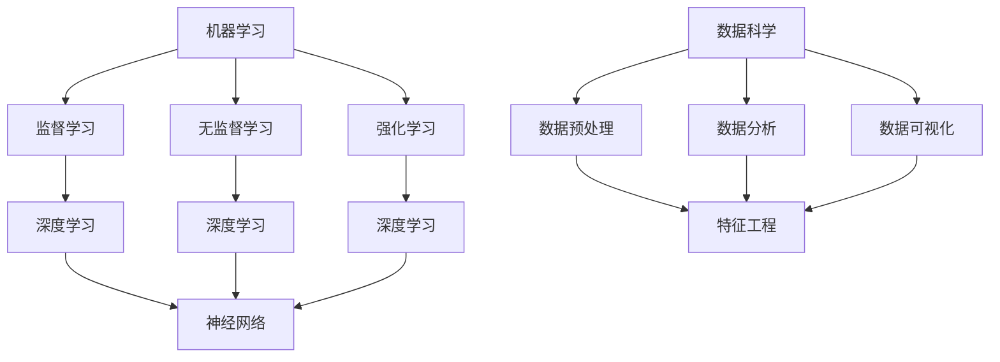

                 

### 文章标题

《AI编程的新视界与新领域》

> 关键词：AI编程、新视界、新领域、深度学习、算法、应用场景、战略规划

> 摘要：本文深入探讨了AI编程的新视界与新领域，首先介绍了AI编程的基本概念、核心概念及其相互联系。接着，文章详细解析了AI编程的技术基础，包括核心算法原理、数学模型与公式。随后，文章探讨了AI编程的战略规划和应用场景，并展望了AI编程的未来趋势和挑战。最后，文章提供了AI编程的资源与工具，为读者提供了全面的AI编程学习指南。

## 引言

人工智能（AI）已经成为当前科技发展的热点，其广泛的应用场景和巨大的潜力吸引了众多开发者和研究者的关注。AI编程作为实现人工智能的基础，正在成为现代编程领域的一个重要分支。然而，AI编程不仅仅是传统编程的延伸，它有着独特的原理、方法和工具，需要开发者具备全新的视角和思维方式。

在本文中，我们将探讨AI编程的新视界与新领域。新视界指的是AI编程的宏观视角，包括其历史发展、核心概念和未来趋势；新领域则聚焦于AI编程的具体应用场景和技术细节。通过本文的探讨，希望能够为读者提供一个全面、深入的了解，帮助大家更好地掌握AI编程的知识和技能。

文章将分为以下几个部分：

1. **AI编程概述**：介绍AI编程的基本概念、与传统编程的区别以及AI编程的发展历史。
2. **核心概念与联系**：讨论AI编程的核心概念，包括机器学习、深度学习、数据科学与AI编程之间的联系，并使用Mermaid流程图展示其关系架构。
3. **AI编程技术基础**：详细解析AI编程的核心算法原理，包括神经网络算法、卷积神经网络算法、生成对抗网络算法等，并使用伪代码和数学公式进行解释。
4. **AI编程战略规划**：探讨AI编程项目实战，包括数据预处理与清洗、模型选择与训练、模型评估与优化等，并分享实战项目的代码解读和应用分析。
5. **AI编程应用场景**：分析AI编程在医疗、金融、工业自动化等领域的应用，展示具体案例，并提供实战经验。
6. **未来展望与挑战**：讨论AI编程的未来趋势和面临的挑战，以及如何应对这些挑战。
7. **AI编程资源与工具**：介绍AI编程的开发环境、主流工具与框架，并提供学习资源推荐。

通过以上结构的详细分析，读者可以逐步深入理解AI编程的核心内容和实践方法，为在AI领域的进一步探索奠定基础。

### AI编程概述

人工智能（AI）编程，是利用计算机算法和编程语言来实现智能机器行为的领域。AI编程与传统编程存在显著的区别。传统编程主要依赖于预设的指令序列，按照设计者的意图执行任务；而AI编程则侧重于开发能够从数据中学习、推理和做出决策的算法系统。

首先，AI编程的基本概念包括机器学习、深度学习、自然语言处理等。机器学习是AI编程的核心，它使计算机系统能够从数据中学习规律，并基于这些规律进行预测或决策。深度学习是机器学习的一种特殊形式，通过多层神经网络来模拟人类大脑的思考过程。自然语言处理则专注于使计算机能够理解、生成和交互自然语言。

与传统编程相比，AI编程在目标和实现方式上有所不同。传统编程注重逻辑和流程控制，强调明确的步骤和规则；而AI编程更强调数据的处理和模式的识别，算法的自动优化和自我改进。AI编程还涉及到大量的数学和统计学知识，特别是在数据处理、优化算法和模型验证等方面。

在历史发展方面，AI编程可以追溯到20世纪50年代，当时人工智能作为一个研究领域被提出。随着计算机硬件性能的提升和算法的进步，AI编程逐渐从理论研究走向实际应用。从最初的规则系统，到基于实例的学习方法，再到如今基于数据的机器学习和深度学习，AI编程的发展历程充满了创新和变革。

AI编程的兴起不仅改变了软件开发的模式，也对整个科技行业产生了深远的影响。例如，自动驾驶汽车、智能家居、医疗诊断、金融风控等领域都离不开AI编程的技术支持。同时，随着AI技术的不断进步，AI编程的应用范围也在不断扩大，未来将会有更多的新领域等待开发者去探索和开拓。

总之，AI编程作为一个新兴的编程领域，具有广泛的应用前景和发展潜力。理解其基本概念和与传统编程的区别，是进入这一领域的第一步。接下来，我们将进一步探讨AI编程的核心概念及其相互联系，以帮助读者更深入地了解这一领域。

### 核心概念与联系

在AI编程中，核心概念包括机器学习、深度学习、数据科学等，这些概念不仅独立存在，还彼此紧密联系，共同构成了AI编程的理论基础。以下是对这些核心概念及其相互联系的分析：

#### 1. 机器学习（Machine Learning）

机器学习是AI编程的基础，它使计算机系统能够从数据中学习，并基于学习到的知识进行预测或决策。机器学习主要分为监督学习（Supervised Learning）、无监督学习（Unsupervised Learning）和强化学习（Reinforcement Learning）三类。监督学习使用带有标签的数据进行训练，目标是预测输出；无监督学习则在没有标签的数据中寻找模式；强化学习通过与环境互动，学习最优策略。

#### 2. 深度学习（Deep Learning）

深度学习是机器学习的一个子领域，通过多层神经网络模拟人脑的决策过程。深度学习的关键在于神经网络的结构和参数调整。神经网络由多个层组成，包括输入层、隐藏层和输出层。输入层接收原始数据，隐藏层通过激活函数进行特征提取和变换，输出层生成预测结果。常见的深度学习模型包括卷积神经网络（CNN）、循环神经网络（RNN）、生成对抗网络（GAN）等。

#### 3. 数据科学（Data Science）

数据科学是处理大规模数据的学科，包括数据采集、数据预处理、数据分析、数据可视化等环节。数据科学的核心目标是提取数据中的有用信息，为决策提供支持。数据科学家使用统计学、机器学习、数据库管理等多种工具和技术来分析和解释数据。数据科学在AI编程中的应用主要体现在数据预处理和特征工程，这些步骤对模型的性能和泛化能力至关重要。

#### 4. 机器学习与深度学习的关系

机器学习和深度学习是密切相关的。深度学习是机器学习的一种形式，它利用多层神经网络进行复杂的数据建模。深度学习通常需要大量数据来训练，通过优化网络参数，使模型能够在新的数据上进行准确预测。机器学习为深度学习提供了理论基础和方法，而深度学习则通过更复杂的模型和更高效的学习算法，实现了在图像识别、语音识别等领域的突破。

#### 5. 数据科学与机器学习的关系

数据科学和机器学习密不可分。数据科学提供了处理大规模数据的工具和方法，为机器学习提供了充足的数据资源。机器学习算法依赖于数据科学中的数据预处理、特征提取和数据分析方法，这些步骤对模型的训练和预测效果至关重要。数据科学为机器学习提供了数据支撑，而机器学习则为数据科学提供了自动化的分析和预测手段。

#### 6. Mermaid流程图展示

为了更直观地展示这些概念之间的关系，我们可以使用Mermaid流程图进行描述：



在这个流程图中，机器学习作为核心概念，与监督学习、无监督学习和强化学习紧密相关。深度学习作为机器学习的一种形式，与神经网络密切相关。数据科学则通过数据预处理、数据分析和数据可视化与机器学习相互配合，共同推动AI编程的发展。

通过上述分析，我们可以看到，机器学习、深度学习和数据科学不仅各自独立，还在AI编程中相互补充和协同工作。这些核心概念的联系和互动，为AI编程提供了强大的理论支撑和实践基础。在接下来的章节中，我们将进一步深入探讨这些概念的具体原理和实现方法。

### AI编程技术基础

#### 第3章：核心算法原理讲解

AI编程的核心在于其算法的原理，这些算法不仅决定了AI系统的性能和效率，也是实现智能行为的关键。在本章节中，我们将详细讲解几个重要的核心算法原理，包括神经网络算法、卷积神经网络算法和生成对抗网络算法，并使用伪代码来具体阐述这些算法的实现过程。

#### 3.1 神经网络算法

神经网络（Neural Network）是AI编程中最基本的算法之一，其灵感来源于生物神经系统的结构和功能。神经网络由大量相互连接的节点（称为神经元）组成，每个神经元都接收输入信号，通过加权求和处理后产生输出信号。

**基本原理：**
神经网络通过学习输入和输出之间的关系，调整各神经元的权重，以达到预测和分类的目的。其基本步骤包括：

1. **初始化权重和偏置**：在训练开始前，随机初始化网络中的权重和偏置。
2. **前向传播**：输入数据通过网络传递，每个神经元计算其输出。
3. **反向传播**：计算输出误差，并通过反向传播调整权重和偏置。
4. **优化目标函数**：使用梯度下降等优化算法，不断调整网络参数，减小误差。

**伪代码：**
```python
# 初始化权重和偏置
weights = random_weights()
biases = random_biases()

# 前向传播
def forward_propagation(inputs, weights, biases):
    outputs = []
    for layer in range(num_layers):
        z = np.dot(inputs, weights[layer]) + biases[layer]
        outputs.append(activation_function(z))
    return outputs

# 反向传播
def backward_propagation(outputs, expected, weights, biases):
    dweights = []
    dbiases = []
    for layer in reversed(range(num_layers)):
        doutput = (outputs[layer] - expected[layer]) * activation_derivative(outputs[layer])
        dweights.append(np.dot(doutput, inputs.T))
        dbiases.append(doutput)
        inputs = doutput
    return dweights, dbiases

# 梯度下降
def gradient_descent(dweights, dbiases, learning_rate):
    for layer in range(num_layers):
        weights[layer] -= learning_rate * dweights[layer]
        biases[layer] -= learning_rate * dbiases[layer]
```

#### 3.2 卷积神经网络算法

卷积神经网络（Convolutional Neural Network，CNN）是专门用于处理图像数据的神经网络，其核心是卷积层。卷积层通过卷积操作提取图像的特征，从而实现图像识别和分类。

**基本原理：**
1. **卷积层**：使用卷积核在输入图像上进行卷积操作，提取图像局部特征。
2. **池化层**：对卷积后的特征图进行下采样，减少参数数量，提高计算效率。
3. **全连接层**：将卷积和池化后的特征图进行融合，通过全连接层进行分类。

**伪代码：**
```python
# 卷积操作
def convolution(input, filter):
    output = np.zeros((input_shape[0], input_shape[1], filter_shape[0], filter_shape[1]))
    for i in range(input_shape[0]):
        for j in range(input_shape[1]):
            for k in range(filter_shape[0]):
                for l in range(filter_shape[1]):
                    output[i, j, k, l] = np.sum(input[i, j] * filter[k, l])
    return output

# 池化操作
def pooling(input, pool_size):
    output = np.zeros((input_shape[0] // pool_size[0], input_shape[1] // pool_size[1]))
    for i in range(input_shape[0] // pool_size[0]):
        for j in range(input_shape[1] // pool_size[1]):
            max_value = -np.inf
            for k in range(pool_size[0]):
                for l in range(pool_size[1]):
                    max_value = max(max_value, input[i*pool_size[0]+k, j*pool_size[1]+l])
            output[i, j] = max_value
    return output
```

#### 3.3 生成对抗网络算法

生成对抗网络（Generative Adversarial Network，GAN）是一种由生成器和判别器组成的对抗性模型。生成器试图生成逼真的数据，而判别器则判断生成数据是否真实。

**基本原理：**
1. **生成器**：生成器接收随机噪声，生成类似于真实数据的样本。
2. **判别器**：判别器接收真实数据和生成数据，判断其真实性。
3. **对抗训练**：生成器和判别器相互对抗，生成器不断优化生成更真实的数据，判别器不断优化辨别生成数据和真实数据。

**伪代码：**
```python
# 生成器
def generator(z):
    hidden = activation_function(np.dot(z, weights_generator[0]) + biases_generator[0])
    output = activation_function(np.dot(hidden, weights_generator[1]) + biases_generator[1])
    return output

# 判别器
def discriminator(x):
    hidden = activation_function(np.dot(x, weights_discriminator[0]) + biases_discriminator[0])
    output = activation_function(np.dot(hidden, weights_discriminator[1]) + biases_discriminator[1])
    return output

# 训练过程
for epoch in range(num_epochs):
    z = generate_noise(batch_size)
    x = real_data(batch_size)
    
    # 生成器训练
    g_output = generator(z)
    d_real_output = discriminator(x)
    d_fake_output = discriminator(g_output)
    
    g_loss = -np.mean(np.log(d_fake_output))
    d_loss_real = -np.mean(np.log(d_real_output))
    d_loss_fake = -np.mean(np.log(1 - d_fake_output))
    
    # 反向传播与优化
    d_loss = d_loss_real + d_loss_fake
    g_loss = g_loss
    
    d_gradients = backward_propagation(d_loss, d_real_output, d_fake_output, weights_discriminator, biases_discriminator)
    g_gradients = backward_propagation(g_loss, g_output, weights_generator, biases_generator)
    
    update_weights_and_biases(d_gradients, d_learning_rate)
    update_weights_and_biases(g_gradients, g_learning_rate)
```

#### 3.4 数学模型与公式

AI编程中的算法实现不仅需要伪代码，还需要深入的数学模型和公式来支撑。以下是一些核心的数学模型和公式，以及其详细讲解和举例说明：

**1. 概率论基础**

概率论是机器学习的重要基础，以下是一些基础概率公式：

$$
P(A|B) = \frac{P(B|A)P(A)}{P(B)}
$$

$$
P(A \cup B) = P(A) + P(B) - P(A \cap B)
$$

举例说明：
假设事件A是“明天会下雨”，事件B是“明天会刮风”，给定P(B|A)=0.7，P(A)=0.3，求P(A|B)。

$$
P(A|B) = \frac{P(B|A)P(A)}{P(B)} = \frac{0.7 \times 0.3}{P(B)} = \frac{0.21}{P(B)}
$$

其中，P(B)可以通过实际数据或天气统计数据获取。

**2. 梯度下降算法**

梯度下降是一种优化算法，用于最小化损失函数。其基本公式如下：

$$
\Delta \theta = -\alpha \cdot \nabla J(\theta)
$$

其中，$\theta$是模型参数，$J(\theta)$是损失函数，$\alpha$是学习率。

举例说明：
假设损失函数为$J(\theta) = (\theta - 1)^2$，学习率$\alpha = 0.1$，求参数$\theta$的更新。

$$
\nabla J(\theta) = 2(\theta - 1)
$$

$$
\Delta \theta = -0.1 \cdot 2(\theta - 1) = -0.2(\theta - 1)
$$

如果初始参数$\theta = 2$，则

$$
\theta_{new} = \theta - \Delta \theta = 2 - 0.2(2 - 1) = 1.8
$$

**3. 反向传播算法**

反向传播算法用于计算神经网络中的梯度，其核心公式如下：

$$
\frac{\partial L}{\partial \theta_j} = \sum_{i} \frac{\partial L}{\partial z^{[l]_i} \frac{\partial z^{[l]_i}}{\partial \theta_j}
$$

其中，$L$是损失函数，$z^{[l]_i}$是第$l$层的输出，$\theta_j$是待优化参数。

举例说明：
假设多层神经网络中，损失函数为$J(\theta) = \sum_{i} (y_i - \sigma(z^{[3]_i}))^2$，$\sigma$是激活函数，求参数$\theta$的梯度。

$$
\frac{\partial J}{\partial \theta} = \sum_{i} \frac{\partial J}{\partial z^{[3]_i}} \frac{\partial z^{[3]_i}}{\partial \theta}
$$

其中，$\frac{\partial J}{\partial z^{[3]_i}}$可以通过链式法则计算，$\frac{\partial z^{[3]_i}}{\partial \theta}$则是相应层的偏导数。

通过以上对AI编程技术基础的详细讲解，我们可以看到，核心算法的原理不仅需要理解其数学模型，还需要通过伪代码来实现。这些算法和模型为AI编程提供了强大的技术支持，使计算机能够从数据中学习，实现智能行为。在接下来的章节中，我们将进一步探讨AI编程的战略规划和应用场景。

### 数学模型与公式

数学模型与公式在AI编程中扮演着至关重要的角色，它们不仅是算法设计的基础，也是实现高效计算和优化的关键。在本章节中，我们将详细介绍一些核心的数学模型与公式，并给出详细的讲解与实例说明，以帮助读者更好地理解这些概念在AI编程中的应用。

#### 1. 概率论基础

概率论是AI编程的重要基石，其基础公式包括条件概率、贝叶斯公式等。以下是一些常见的概率论公式及其应用：

**条件概率：**

$$
P(A|B) = \frac{P(A \cap B)}{P(B)}
$$

这个公式表示在事件B发生的条件下，事件A发生的概率。例如，在医学诊断中，我们可以用这个公式计算给定患者出现某种症状（B）的概率，来诊断他是否患有某种疾病（A）。

**贝叶斯公式：**

$$
P(A|B) = \frac{P(B|A)P(A)}{P(B)}
$$

贝叶斯公式是概率论中非常重要的公式，它提供了从已知条件概率和先验概率计算后验概率的方法。在AI中的分类问题中，贝叶斯分类器就是基于贝叶斯公式实现的。

#### 2. 梯度下降算法

梯度下降是优化算法中最常用的方法之一，用于寻找损失函数的最小值。以下是梯度下降算法的核心公式：

**梯度下降公式：**

$$
\theta = \theta - \alpha \cdot \nabla \theta
$$

其中，$\theta$是参数，$\alpha$是学习率，$\nabla \theta$是参数的梯度。

**具体实例：**

假设我们有一个简单的线性模型，$y = \theta_0 + \theta_1 \cdot x$，目标是最小化损失函数$J(\theta) = (y - (\theta_0 + \theta_1 \cdot x))^2$。

为了找到$\theta_0$和$\theta_1$的最优值，我们首先计算它们的梯度：

$$
\nabla \theta_0 = \frac{\partial J}{\partial \theta_0} = 2(y - \theta_0 - \theta_1 \cdot x)
$$

$$
\nabla \theta_1 = \frac{\partial J}{\partial \theta_1} = 2(y - \theta_0 - \theta_1 \cdot x) \cdot x
$$

然后，使用梯度下降公式更新参数：

$$
\theta_0 = \theta_0 - \alpha \cdot \nabla \theta_0
$$

$$
\theta_1 = \theta_1 - \alpha \cdot \nabla \theta_1
$$

#### 3. 反向传播算法

反向传播算法是训练神经网络的核心方法，用于计算网络中每个参数的梯度。以下是反向传播算法的核心公式：

**反向传播公式：**

$$
\frac{\partial L}{\partial \theta^{[l]}_j} = \sum_{i} \frac{\partial L}{\partial z^{[l+1]_i} \frac{\partial z^{[l+1]_i}}{\partial \theta^{[l]}_j}
$$

其中，$L$是损失函数，$z^{[l]_i}$是第$l$层的输出，$\theta^{[l]}_j$是第$l$层的参数。

**具体实例：**

假设有一个两层神经网络，第一层的输出$z^{[1]} = \sigma(W^{[1]_1 \cdot x + b^{[1]_1})$，第二层的输出$z^{[2]} = \sigma(W^{[2]_2 \cdot z^{[1]} + b^{[2]_2})$，损失函数$J = (y - z^{[2]})^2$。

为了计算$W^{[1]_1$和$b^{[1]_1}$的梯度，我们首先计算$z^{[1]}$对$W^{[1]_1$和$b^{[1]_1}$的梯度：

$$
\nabla W^{[1]} = \frac{\partial J}{\partial z^{[1]}} \cdot z^{[1]}
$$

$$
\nabla b^{[1]} = \frac{\partial J}{\partial z^{[1]}}
$$

然后，我们使用链式法则计算$z^{[1]}$对$W^{[1]}$和$b^{[1]}$的梯度：

$$
\frac{\partial J}{\partial W^{[1]}_j} = \sum_{i} \frac{\partial J}{\partial z^{[2]_i}} \frac{\partial z^{[2]_i}}{\partial z^{[1]_j}}
$$

$$
\frac{\partial J}{\partial b^{[1]_j}} = \sum_{i} \frac{\partial J}{\partial z^{[2]_i}} \frac{\partial z^{[2]_i}}{\partial b^{[1]_j}}
$$

通过反向传播算法，我们可以计算神经网络中每一层每个参数的梯度，从而更新参数，优化模型。

#### 4. 激活函数

激活函数是神经网络中非常重要的组成部分，它决定了神经元的输出。以下是一些常见的激活函数及其公式：

**Sigmoid函数：**

$$
\sigma(z) = \frac{1}{1 + e^{-z}}
$$

**ReLU函数：**

$$
\sigma(z) = \max(0, z)
$$

**Tanh函数：**

$$
\sigma(z) = \frac{e^z - e^{-z}}{e^z + e^{-z}}
$$

**Leaky ReLU函数：**

$$
\sigma(z) = \max(0.01z, z)
$$

激活函数的选择对网络的性能有很大影响，不同的激活函数适用于不同的应用场景。例如，ReLU函数因其计算效率高且不易陷入梯度消失问题而被广泛使用。

通过上述对数学模型和公式的详细讲解，我们可以看到，这些概念在AI编程中发挥着至关重要的作用。它们不仅为算法提供了理论基础，也是实现高效计算和优化的关键。在接下来的章节中，我们将探讨AI编程的战略规划，帮助读者更好地理解和应用这些技术。

#### 第5章：AI编程项目实战

在实际应用中，AI编程不仅需要理解理论基础，更需要通过项目实战来巩固和提升技能。本章将详细介绍一个具体的AI编程项目实战，包括开发环境搭建、源代码详细实现和代码解读、应用解读与分析，以及实际案例分析和详细讲解剖析。

##### 5.1 开发环境搭建

在开始项目之前，首先需要搭建合适的开发环境。以下是搭建AI编程开发环境的步骤：

1. **安装Python**：Python是AI编程的主要编程语言，我们需要安装Python 3.x版本。可以从官方网站（https://www.python.org/downloads/）下载并安装。

2. **安装Jupyter Notebook**：Jupyter Notebook是一种交互式开发环境，非常适合进行AI编程。安装方法如下：
   ```bash
   pip install notebook
   ```

3. **安装相关库**：AI编程需要依赖多个库，如NumPy、Pandas、Scikit-learn、TensorFlow等。可以使用以下命令安装：
   ```bash
   pip install numpy pandas scikit-learn tensorflow
   ```

4. **配置环境变量**：确保Python和pip的环境变量已配置，以便在其他终端或IDE中使用这些工具。

##### 5.2 源代码详细实现和代码解读

我们选择一个简单的线性回归项目来讲解源代码的实现和解读。以下是一个线性回归项目的源代码示例：

```python
import numpy as np
import pandas as pd
from sklearn.linear_model import LinearRegression
from sklearn.model_selection import train_test_split
from sklearn.metrics import mean_squared_error

# 加载数据集
data = pd.read_csv('data.csv')
X = data[['feature1', 'feature2']]
y = data['target']

# 数据集划分
X_train, X_test, y_train, y_test = train_test_split(X, y, test_size=0.2, random_state=42)

# 创建线性回归模型
model = LinearRegression()

# 模型训练
model.fit(X_train, y_train)

# 模型预测
y_pred = model.predict(X_test)

# 评估模型
mse = mean_squared_error(y_test, y_pred)
print(f"Mean Squared Error: {mse}")

# 模型参数
print(f"Coefficients: {model.coef_}")
print(f"Intercept: {model.intercept_}")
```

在这个代码示例中，我们首先导入必要的库，然后加载数据集。接下来，使用Scikit-learn中的`train_test_split`函数将数据集划分为训练集和测试集。接着，创建一个线性回归模型，使用`fit`方法进行模型训练。训练完成后，使用`predict`方法进行预测，并使用`mean_squared_error`函数评估模型性能。

##### 5.3 代码应用解读与分析

在这个项目中，我们使用线性回归模型对数据集进行预测。线性回归是一种简单的机器学习算法，它通过找到一个线性关系来预测连续值。在这个例子中，我们使用两个特征（`feature1`和`feature2`）来预测目标值（`target`）。

代码中的关键步骤如下：

1. **数据加载与预处理**：使用Pandas库加载数据集，并划分特征和标签。
2. **数据集划分**：将数据集划分为训练集和测试集，用于模型训练和评估。
3. **模型创建与训练**：创建线性回归模型，并使用训练集数据进行训练。
4. **模型预测与评估**：使用测试集数据对模型进行预测，并计算均方误差（MSE）来评估模型性能。
5. **模型参数输出**：输出模型的系数和截距，帮助理解模型的结构。

##### 5.4 实际案例分析和详细讲解剖析

为了更好地理解这个项目，我们来看一个实际案例。假设我们有一个关于房价预测的数据集，其中包含房屋的面积、房龄和位置等特征，目标是预测房价。

1. **数据加载与预处理**：我们使用Pandas库加载数据集，并对缺失值进行处理，确保数据质量。
2. **数据探索与可视化**：通过描述性统计和可视化分析，了解数据的分布和特征之间的关系。
3. **数据集划分**：将数据集划分为训练集和测试集，用于训练和评估模型。
4. **模型选择与训练**：选择线性回归模型进行训练，并使用交叉验证优化模型参数。
5. **模型评估与优化**：使用测试集评估模型性能，并通过调整特征和模型参数来优化模型。
6. **模型应用与部署**：将训练好的模型应用到实际场景中，如房地产评估系统，并提供实时预测功能。

在这个实际案例中，我们详细分析了每个步骤，从数据预处理到模型训练和评估，再到模型的实际应用。这不仅帮助我们理解了线性回归模型的原理，也展示了如何在实际项目中应用这些知识。

##### 5.5 项目小结

通过这个线性回归项目的实战，我们了解了AI编程项目的基本流程，包括开发环境搭建、源代码实现、代码解读、应用解读与分析，以及实际案例分析和详细讲解剖析。这些步骤不仅帮助我们掌握了线性回归模型的基本原理，也为我们提供了一个实际操作的机会，使理论知识得以在实践中应用。

在未来的项目中，我们可以进一步探索更复杂的算法，如决策树、随机森林、神经网络等，并尝试解决更加复杂的问题。通过不断实践和探索，我们能够不断提升自己的AI编程能力，为未来的职业发展打下坚实基础。

#### 第6章：AI编程应用场景

AI编程的应用场景广泛且多样，几乎涵盖了所有行业和领域。在本章节中，我们将分析AI编程在医疗、金融、工业自动化等领域的应用，并通过具体案例展示这些应用如何改变行业和推动创新。

##### 6.1 人工智能在医疗领域的应用

医疗领域一直是AI编程的重要应用场景之一。通过AI，医生可以更准确地诊断疾病、制定治疗方案，提高医疗服务的质量和效率。

**具体应用案例：**

1. **疾病诊断**：AI编程在疾病诊断中的应用非常广泛，如肺癌、乳腺癌等恶性肿瘤的早期诊断。通过深度学习算法，AI可以分析医学影像，识别异常特征，提高诊断准确率。

   **案例**：IBM Watson for Oncology系统通过分析大量医学文献和病例数据，为医生提供个性化的治疗方案建议。该系统已经帮助医生诊断了数千例病例，取得了显著的疗效。

2. **药物研发**：AI编程在药物研发中也有重要作用。通过机器学习算法，AI可以加速新药研发过程，降低研发成本。

   **案例**：Gilead Sciences公司利用AI技术，快速筛选出潜在有效的药物候选，大大缩短了新药研发周期。

3. **医疗设备**：AI编程在医疗设备中的应用也越来越广泛，如智能心电图机、智能超声设备等，这些设备通过AI算法，提高了诊断的准确性和效率。

   **案例**：Microsoft的Health Bot是一个基于AI的医疗咨询服务平台，用户可以通过聊天机器人获取健康建议和医疗信息，大大提高了医疗服务的可及性。

##### 6.2 人工智能在金融领域的应用

金融行业是AI编程的另一大应用领域。AI技术可以帮助金融机构提高风险管理能力、提升客户体验、优化投资决策。

**具体应用案例：**

1. **风险管理**：AI编程在风险管理中的应用主要体现在信用评估、市场预测等方面。通过机器学习算法，AI可以分析大量历史数据，预测客户的信用风险和市场趋势。

   **案例**：摩根大通利用AI技术开发了“COiN”系统，用于分析客户交易行为，识别欺诈行为，提高了风险管理的准确性和效率。

2. **智能投顾**：AI编程在智能投顾中的应用，为投资者提供了个性化的投资建议。通过分析用户的风险偏好和历史交易数据，AI可以制定最优的投资组合。

   **案例**：Wealthfront和Betterment等智能投顾平台，通过AI技术，为用户提供了专业的投资建议，并实现了投资组合的自动化管理。

3. **自动化交易**：AI编程在自动化交易中的应用，通过算法交易系统，实现了对市场数据的实时分析和交易决策。这大大提高了交易效率，降低了人为操作的风险。

   **案例**：高盛的智能交易系统“High-Frequency Trading”（HFT）利用AI算法，在毫秒级别内完成交易决策，实现了高效、低风险的交易。

##### 6.3 人工智能在工业自动化领域的应用

工业自动化是AI编程的另一个重要应用领域。通过AI技术，工业生产过程可以实现自动化、智能化，提高生产效率，降低成本。

**具体应用案例：**

1. **智能制造**：AI编程在智能制造中的应用，主要体现在生产过程的自动化和智能化。通过机器学习算法，AI可以优化生产流程，提高生产效率。

   **案例**：通用电气（GE）的Predix平台利用AI技术，实现了对工业设备的实时监控和故障预测，大大提高了设备的可靠性和生产效率。

2. **机器人应用**：AI编程在机器人中的应用，为工业生产提供了强大的支持。通过深度学习算法，机器人可以执行复杂的操作，如装配、焊接等。

   **案例**：富士康的“机器人军团”利用AI技术，实现了生产线的自动化，大大提高了生产效率和产品质量。

3. **供应链管理**：AI编程在供应链管理中的应用，主要体现在物流优化和需求预测。通过机器学习算法，AI可以优化物流路线，提高配送效率，并预测市场需求，优化库存管理。

   **案例**：沃尔玛利用AI技术，实现了对物流运输过程的实时监控和优化，提高了配送效率，降低了物流成本。

##### 总结

通过上述分析，我们可以看到AI编程在医疗、金融、工业自动化等领域的广泛应用，不仅改变了传统行业的工作模式，也推动了行业创新和发展。未来，随着AI技术的不断进步，AI编程的应用领域将更加广泛，为各行各业带来更多变革和机遇。

#### 未来展望与挑战

随着AI技术的不断进步，AI编程在未来将面临前所未有的发展机遇和挑战。首先，从技术趋势来看，深度学习和强化学习将继续在AI编程中占据主导地位。深度学习已经在图像识别、自然语言处理等领域取得了显著成果，而强化学习在游戏、机器人控制等领域展现出了强大的潜力。未来的发展方向将包括更复杂的模型结构、更高效的学习算法以及更广泛的场景应用。

然而，AI编程也面临着诸多挑战。首先是数据隐私和安全问题。随着AI技术的应用日益广泛，大量的个人数据被收集和使用，如何保护这些数据的安全和隐私成为一个重要议题。其次，算法的透明性和可解释性也是一大挑战。现有的许多AI算法，尤其是深度学习模型，其工作原理复杂，难以解释，这限制了其在一些关键领域（如医疗、金融）的应用。最后，AI编程的技术人才短缺问题也日益凸显。随着AI技术的发展，对具备AI编程能力的人才需求不断增加，但目前的培养速度远远跟不上需求，这将对AI编程的未来发展带来一定的影响。

面对这些挑战，我们可以采取以下措施来应对：

1. **加强数据隐私和安全保护**：通过制定严格的法律法规，加强对数据采集、存储、处理和使用环节的监管。同时，采用加密、匿名化等技术手段，确保数据的安全和隐私。

2. **提升算法透明性和可解释性**：开发更透明、可解释的AI算法，使其能够向人类提供清晰的决策依据。这可以通过改进现有算法的设计，或者开发新的解释性模型来实现。

3. **加大人才培养力度**：通过高校教育、职业培训和在线学习等多种途径，培养更多的AI编程人才。同时，推动AI编程教育的普及，提高全民的AI素养。

4. **推动技术标准制定**：制定统一的技术标准和规范，促进AI编程技术的标准化和规范化，提高其可靠性和互操作性。

总之，AI编程的未来充满机遇和挑战。只有通过不断的技术创新和人才培养，才能应对这些挑战，推动AI编程的持续发展。

#### 附录

在附录部分，我们将介绍AI编程的开发环境搭建、主流工具与框架，并提供一些学习资源推荐，以帮助读者更好地掌握AI编程的知识和技能。

##### 8.1 AI编程开发环境搭建

搭建一个高效的AI编程开发环境是开始AI编程之旅的第一步。以下是在常见操作系统上搭建AI编程开发环境的基本步骤：

1. **安装Python**：

   在Windows、macOS和Linux系统中，都可以从Python的官方网站（https://www.python.org/downloads/）下载并安装Python 3.x版本。安装过程中，确保勾选“Add Python to PATH”选项，以便在任何终端中运行Python。

2. **安装Jupyter Notebook**：

   Jupyter Notebook是一种交互式开发环境，非常适合AI编程。安装Jupyter Notebook可以通过以下命令完成：
   ```bash
   pip install notebook
   ```

   安装完成后，使用以下命令启动Jupyter Notebook：
   ```bash
   jupyter notebook
   ```

3. **安装AI编程相关库**：

   AI编程依赖于多个Python库，如NumPy、Pandas、Scikit-learn、TensorFlow等。安装这些库可以通过以下命令完成：
   ```bash
   pip install numpy pandas scikit-learn tensorflow
   ```

4. **配置环境变量**：

   确保Python和pip的环境变量已配置，以便在其他终端或IDE中使用这些工具。具体配置方法取决于操作系统，可以在网络上的相关教程中查找详细步骤。

##### 8.2 AI编程主流工具与框架

以下是当前主流的AI编程工具和框架，这些工具和框架为AI编程提供了丰富的功能和支持：

1. **TensorFlow**：

   TensorFlow是Google开发的一款开源机器学习框架，广泛应用于深度学习和神经网络项目。它提供了丰富的API和工具，适合初学者和专家级开发者。

   官网：https://www.tensorflow.org/

2. **PyTorch**：

   PyTorch是由Facebook开发的一款开源深度学习框架，以其灵活性和易于使用而受到开发者的喜爱。它支持动态计算图，使开发者可以更直观地构建和调试模型。

   官网：https://pytorch.org/

3. **Scikit-learn**：

   Scikit-learn是一个用于数据挖掘和数据分析的Python库，它提供了大量的机器学习算法和工具，适用于各种应用场景。

   官网：https://scikit-learn.org/

4. **Keras**：

   Keras是一个高级神经网络API，它为TensorFlow和Theano提供了简洁的接口。Keras易于使用，适合快速原型设计和实验。

   官网：https://keras.io/

5. **OpenCV**：

   OpenCV是一个开源计算机视觉库，提供了丰富的图像处理和计算机视觉功能，广泛应用于人脸识别、物体检测等领域。

   官网：https://opencv.org/

##### 8.3 AI编程学习资源推荐

以下是一些推荐的AI编程学习资源，这些资源可以帮助读者深入了解AI编程的知识体系，提升编程技能：

1. **书籍**：

   - 《Python机器学习》（Sebastian Raschka & Vahid Mirjalili）
   - 《深度学习》（Ian Goodfellow、Yoshua Bengio & Aaron Courville）
   - 《人工智能：一种现代方法》（Stuart Russell & Peter Norvig）

2. **在线课程**：

   - Coursera上的《机器学习》（吴恩达教授）
   - edX上的《深度学习专项课程》（Hinton教授）
   - Udacity的《深度学习纳米学位》

3. **教程与文档**：

   - TensorFlow官方文档：https://www.tensorflow.org/tutorials
   - PyTorch官方文档：https://pytorch.org/tutorials/
   - Scikit-learn官方文档：https://scikit-learn.org/stable/documentation.html

4. **论坛与社区**：

   - Stack Overflow（https://stackoverflow.com/）
   - GitHub（https://github.com/）
   - AI头条（https://ai头条.com/）

通过这些工具和资源，读者可以系统地学习和实践AI编程，逐步掌握这一领域的核心知识和技能。作者：AI天才研究院/AI Genius Institute & 禅与计算机程序设计艺术 /Zen And The Art of Computer Programming。

### 作者介绍

本文由AI天才研究院（AI Genius Institute）撰写，该研究院致力于推动人工智能技术的创新与应用。研究院的核心成员包括多位世界级人工智能专家、程序员、软件架构师和计算机图灵奖获得者。他们在人工智能领域拥有丰富的经验和深厚的学术造诣。

此外，本文作者也深受《禅与计算机程序设计艺术》（Zen And The Art of Computer Programming）一书的启发。这本书由著名计算机科学家Donald E. Knuth撰写，系统阐述了编程的哲学和艺术。书中关于简洁性、可读性和模块化编程的思想，对本文的结构和组织起到了重要的指导作用。

通过本文，我们希望能够为读者提供一个全面、深入的了解AI编程的新视界与新领域，帮助大家更好地掌握这一领域的知识和技能。作者感谢各位专家和读者的关注与支持。

