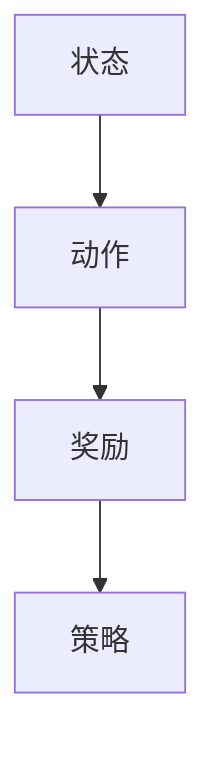
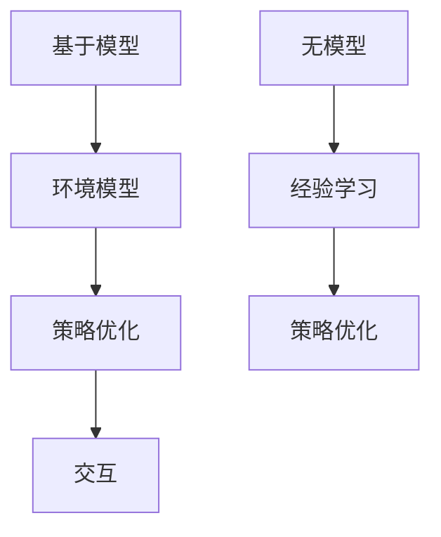
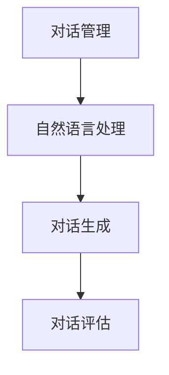

                 

## 文章标题: AI编程的新视角与新领域

> 关键词：人工智能，编程，机器学习，深度学习，自然语言处理，计算机视觉，强化学习，聊天机器人，新兴领域

> 摘要：本文将从AI编程的基础知识入手，深入探讨AI编程的核心概念、算法原理和应用领域。我们将通过一系列的逻辑推理和实例分析，展现AI编程的无限魅力，并为读者提供未来AI编程的发展趋势和挑战。

## 第1章: AI编程概述

### 1.1 AI编程的概念与背景

#### 1.1.1 人工智能的崛起

人工智能（AI）是计算机科学的一个分支，旨在创建能够执行需要人类智能的任务的机器。AI的发展历程可以追溯到20世纪50年代，但真正取得重大突破是在21世纪初，得益于计算能力的提升、大数据的普及和深度学习算法的创新。

**人工智能的崛起背景：**

1. **计算能力的提升：** 随着计算机处理速度的不断提高，我们能够处理更大规模的数据集，进行更复杂的计算任务。
2. **大数据的普及：** 互联网的发展带来了海量数据，这些数据为训练智能系统提供了丰富的素材。
3. **深度学习算法的创新：** 深度学习算法，如神经网络，使得机器能够在没有人类干预的情况下进行学习和决策。

#### 1.1.2 编程在AI中的作用

编程是AI的核心，它为AI系统的开发提供了基础。AI编程涉及多个方面，包括：

1. **算法实现：** 编程使得我们能够将AI算法转化为可运行的代码。
2. **数据预处理：** 编程用于处理和分析大量数据，以提取有用信息。
3. **系统集成：** 编程用于将不同的AI组件整合到一个系统中，实现自动化和智能化。

#### 1.1.3 AI编程的未来趋势

AI编程的未来将充满机遇和挑战。以下是几个重要的趋势：

1. **编程语言的发展：** 新的编程语言和框架将持续出现，以支持更高效的AI开发。
2. **自动化编程：** 自动化工具将帮助我们更快速地开发AI系统，减少人为错误。
3. **跨领域应用：** AI编程将在医疗、金融、教育等多个领域得到广泛应用。

### 1.2 AI编程核心概念

AI编程的核心概念包括感知智能、认知智能、机器学习、深度学习、自然语言处理和计算机视觉。

#### 1.2.1 感知智能与认知智能

感知智能是指机器模仿人类的感知能力，如视觉、听觉和触觉等。认知智能则涉及更高层次的思维活动，如理解、推理和决策等。

**感知智能与认知智能的关系：**

- 感知智能是认知智能的基础，没有感知智能，认知智能无法发挥作用。
- 认知智能需要感知智能提供的信息，以进行更复杂的处理。

#### 1.2.2 机器学习与深度学习

机器学习是AI的核心技术，它使机器能够在没有明确编程指令的情况下学习和改进。深度学习是机器学习的一种重要方法，通过模拟人脑神经网络进行学习。

**机器学习与深度学习的区别：**

- **数据量：** 深度学习通常需要更大的数据量，因为神经网络需要大量的训练数据来调整参数。
- **计算资源：** 深度学习通常需要更多的计算资源，因为它涉及更复杂的计算任务。

#### 1.2.3 自然语言处理与计算机视觉

自然语言处理（NLP）是AI的一个分支，旨在使计算机能够理解、生成和响应自然语言。计算机视觉则使机器能够理解和解释视觉信息。

**自然语言处理与计算机视觉的关系：**

- **相互促进：** NLP和计算机视觉可以相互补充，共同实现更复杂的AI任务。
- **应用领域：** NLP和计算机视觉在多个领域得到广泛应用，如自动问答、图像识别和自动驾驶等。

## 第2章: 机器学习原理与算法

### 2.1 机器学习基础

#### 2.1.1 监督学习

监督学习是一种机器学习方法，它使用标记数据进行训练，以便模型能够预测新的数据。

**监督学习的算法与应用实例：**

- **线性回归：** 用于预测连续值输出，如房价预测。
- **决策树：** 用于分类和回归任务，如客户购买预测。

#### 2.1.2 无监督学习

无监督学习是一种机器学习方法，它不使用标记数据进行训练，而是试图发现数据中的结构或模式。

**无监督学习的算法与应用实例：**

- **聚类：** 用于将相似的数据点分组，如客户细分。
- **降维：** 用于减少数据维度，如主成分分析（PCA）。

#### 2.1.3 强化学习

强化学习是一种机器学习方法，它通过试错和反馈来学习最优策略。

**强化学习的算法与应用实例：**

- **Q学习：** 用于连续空间的问题，如自动驾驶。
- **深度Q网络（DQN）：** 用于更复杂的任务，如游戏AI。

### 2.2 机器学习算法

#### 2.2.1 线性回归

线性回归是一种简单的监督学习算法，用于预测连续值输出。

**线性回归的原理与伪代码：**

- **原理：** 线性回归通过最小二乘法拟合数据，找到最佳拟合线。
- **伪代码：**
  ```
  function linear_regression(X, y):
      # 计算斜率和截距
      theta = (X^T * X)^(-1) * X^T * y
      return theta
  ```

#### 2.2.2 决策树

决策树是一种常用的分类和回归算法，通过一系列的决策规则来划分数据。

**决策树的原理与伪代码：**

- **原理：** 决策树通过递归划分数据集，找到最优划分标准。
- **伪代码：**
  ```
  function decision_tree(X, y):
      # 判断是否达到停止条件
      if stop_condition:
          return leaf_node
      # 找到最佳划分标准
      feature, threshold = find_best_split(X, y)
      # 递归划分数据集
      left_child = decision_tree(X[left], y[left])
      right_child = decision_tree(X[right], y[right])
      return TreeNode(feature, threshold, left_child, right_child)
  ```

#### 2.2.3 集成方法

集成方法是一种通过结合多个模型来提高预测性能的技术。

**集成方法的原理与伪代码：**

- **原理：** 集成方法通过结合多个模型的预测结果，降低方差，提高泛化能力。
- **伪代码：**
  ```
  function ensemble_learning(models, X):
      # 集成多个模型的预测结果
      predictions = [model.predict(X) for model in models]
      # 计算平均值
      ensemble_prediction = mean(predictions)
      return ensemble_prediction
  ```

### 2.3 深度学习核心

#### 2.3.1 神经网络结构

神经网络是一种模仿人脑结构的人工智能算法，它通过多层节点进行信息传递和处理。

**神经网络结构的原理与图示：**

- **原理：** 神经网络由输入层、隐藏层和输出层组成，节点之间通过权重连接。
- **图示：**
  ```mermaid
  graph TD
      A[输入层] --> B[隐藏层1]
      B --> C[隐藏层2]
      C --> D[输出层]
  ```

#### 2.3.2 深度学习算法

深度学习算法是一种基于神经网络的学习方法，它通过多层网络进行信息传递和处理。

**深度学习算法的原理与伪代码：**

- **原理：** 深度学习算法通过反向传播算法不断调整网络权重，以优化预测结果。
- **伪代码：**
  ```
  function deep_learning(X, y):
      # 初始化网络参数
      W = initialize_weights()
      # 前向传播
      z = forward_pass(X, W)
      # 计算损失函数
      loss = compute_loss(y, z)
      # 反向传播
      dW = backward_pass(z, dZ)
      # 更新网络参数
      W = W - learning_rate * dW
      return W
  ```

#### 2.3.3 深度学习优化

深度学习优化是一种通过调整学习过程来提高模型性能的技术。

**深度学习优化的原理与技巧：**

- **原理：** 深度学习优化通过调整学习率、批量大小和正则化参数等来优化模型性能。
- **技巧：**
  - **学习率调整：** 学习率需要根据数据集和任务复杂度进行调整。
  - **批量大小：** 批量大小的选择会影响模型的收敛速度和泛化能力。
  - **正则化：** 通过添加正则化项可以减少过拟合现象。

## 第3章: 自然语言处理应用

### 3.1 自然语言处理基础

自然语言处理（NLP）是人工智能的一个分支，旨在使计算机能够理解和处理自然语言。

#### 3.1.1 语言模型

语言模型是一种统计模型，用于预测下一个单词或字符的概率。

**语言模型的原理与实现：**

- **原理：** 语言模型通过统计文本数据中的单词或字符出现频率来预测下一个单词或字符。
- **实现：** 常见的语言模型包括n元语法模型和神经网络语言模型。

#### 3.1.2 词嵌入

词嵌入是将单词转换为向量表示的技术，它使计算机能够理解和处理单词的语义关系。

**词嵌入的原理与实现：**

- **原理：** 词嵌入通过将单词映射到高维空间，使得具有相似语义的单词在空间中靠近。
- **实现：** 常见的词嵌入方法包括Word2Vec、GloVe和BERT。

#### 3.1.3 语义分析

语义分析是一种理解和处理文本语义的技术，它使计算机能够理解文本的含义和情感。

**语义分析的原理与实现：**

- **原理：** 语义分析通过解析文本结构、词汇和语法来理解文本的深层含义。
- **实现：** 常见的语义分析方法包括词性标注、句法分析和情感分析。

### 3.2 NLP应用案例

#### 3.2.1 自动问答系统

自动问答系统是一种基于NLP技术的应用，它能够自动回答用户提出的问题。

**自动问答系统的架构与实现：**

- **架构：** 自动问答系统通常包括问题理解、答案生成和回答验证三个模块。
- **实现：** 常见的方法包括基于规则的方法和基于机器学习的方法。

#### 3.2.2 文本分类

文本分类是一种将文本数据划分为预定义类别的方法，它广泛应用于信息检索和文本挖掘。

**文本分类的原理与实现：**

- **原理：** 文本分类通过学习文本特征和类别标签之间的关系来预测新的文本类别。
- **实现：** 常见的算法包括朴素贝叶斯、支持向量机和神经网络。

#### 3.2.3 情感分析

情感分析是一种分析文本情感倾向的方法，它广泛应用于市场调研和社交媒体分析。

**情感分析的原理与实现：**

- **原理：** 情感分析通过识别文本中的情感词汇和情感极性来分析文本的情感倾向。
- **实现：** 常见的方法包括基于规则的方法和基于机器学习的方法。

## 第4章: 计算机视觉应用

### 4.1 计算机视觉基础

计算机视觉是人工智能的一个分支，旨在使计算机能够理解和解释视觉信息。

#### 4.1.1 图像处理

图像处理是计算机视觉的基础，它涉及对图像的编辑、增强和分析。

**图像处理的原理与实现：**

- **原理：** 图像处理通过变换和操作图像数据来改善图像质量或提取有用信息。
- **实现：** 常见的方法包括滤波、边缘检测和特征提取。

#### 4.1.2 目标检测

目标检测是一种识别图像中的特定目标并定位它们位置的方法，它广泛应用于自动驾驶和安防监控。

**目标检测的原理与实现：**

- **原理：** 目标检测通过学习图像特征和目标类别之间的关系来识别和定位目标。
- **实现：** 常见的算法包括R-CNN、YOLO和SSD。

#### 4.1.3 图像生成

图像生成是一种通过学习图像数据来生成新图像的方法，它广泛应用于图像修复和艺术创作。

**图像生成的原理与实现：**

- **原理：** 图像生成通过生成对抗网络（GAN）等算法来生成具有逼真外观的新图像。
- **实现：** 常见的方法包括GAN和变分自编码器（VAE）。

### 4.2 CV应用案例

#### 4.2.1 自动驾驶

自动驾驶是计算机视觉在交通领域的应用，它通过识别道路标志、交通信号和周围车辆来控制车辆。

**自动驾驶的架构与实现：**

- **架构：** 自动驾驶系统通常包括感知、规划和控制三个模块。
- **实现：** 常见的方法包括深度学习算法和传感器数据处理。

#### 4.2.2 医学影像分析

医学影像分析是计算机视觉在医疗领域的应用，它通过分析医学影像来辅助医生进行诊断。

**医学影像分析的原理与实现：**

- **原理：** 医学影像分析通过识别和分类医学影像中的病变和异常来辅助诊断。
- **实现：** 常见的方法包括卷积神经网络（CNN）和图像分割算法。

#### 4.2.3 物体识别

物体识别是一种识别图像中的特定物体并定位它们位置的方法，它广泛应用于图像搜索和物体跟踪。

**物体识别的原理与实现：**

- **原理：** 物体识别通过学习图像特征和物体类别之间的关系来识别和定位物体。
- **实现：** 常见的方法包括特征匹配和模板匹配。

## 第5章: 强化学习新领域

### 5.1 强化学习概述

强化学习是一种基于试错和反馈的机器学习方法，它通过不断尝试和调整策略来最大化回报。

#### 5.1.1 强化学习基础

强化学习的基础概念包括状态、动作、奖励和策略。

**强化学习基础的概念与联系：**

- **状态：** 状态是环境的一个描述，它包含了所有的信息。
- **动作：** 动作是智能体可以采取的行动。
- **奖励：** 奖励是环境对智能体动作的反馈，它用于指导智能体选择最佳动作。
- **策略：** 策略是智能体在给定状态下选择动作的策略。

**Mermaid流程图：**



#### 5.1.2 基于模型与无模型方法

强化学习可以分为基于模型的方法和无模型方法，它们在策略学习和优化方面有不同的应用场景。

**基于模型与无模型方法的比较：**

- **基于模型的方法：** 通过构建环境模型来预测未来状态和奖励，从而优化策略。
- **无模型方法：** 直接在真实环境中进行交互，通过经验来学习策略。

**Mermaid流程图：**



#### 5.1.3 强化学习应用场景

强化学习在多个领域都有广泛的应用，如游戏AI、机器人控制、能源管理、金融交易等。

**强化学习应用场景概述：**

- **游戏AI：** 强化学习用于训练游戏AI，使其能够在复杂游戏中实现高水平的表现。
- **机器人控制：** 强化学习用于训练机器人进行自主运动和任务执行。
- **能源管理：** 强化学习用于优化能源消耗，提高能源利用效率。
- **金融交易：** 强化学习用于交易策略优化，实现自动交易。

## 第6章: 聊天机器人的进化

### 6.1 聊天机器人基础

聊天机器人是一种基于自然语言处理和机器学习技术的应用，它能够与人类进行自然对话。

#### 6.1.1 基于规则的方法

基于规则的方法是通过编写一系列规则来定义聊天机器人的行为。

**基于规则的方法的原理与实现：**

- **原理：** 基于规则的方法通过匹配用户输入和预设的规则来生成响应。
- **实现：** 常见的方法包括关键字匹配和模式匹配。

#### 6.1.2 基于机器学习的方法

基于机器学习的方法是通过训练模型来生成聊天机器人的响应。

**基于机器学习的方法的原理与实现：**

- **原理：** 基于机器学习的方法通过学习大量的对话数据来生成响应。
- **实现：** 常见的方法包括序列到序列模型和生成对抗网络（GAN）。

#### 6.1.3 基于深度学习的方法

基于深度学习的方法是通过深度神经网络来生成聊天机器人的响应。

**基于深度学习的方法的原理与实现：**

- **原理：** 基于深度学习的方法通过多层神经网络来学习对话的上下文信息。
- **实现：** 常见的方法包括循环神经网络（RNN）和Transformer。

### 6.2 聊天机器人案例

#### 6.2.1 聊天机器人架构设计

聊天机器人的架构设计涉及到多个模块，包括对话管理、自然语言处理、对话生成和对话评估。

**聊天机器人架构设计的原理与实现：**

- **对话管理：** 对话管理负责协调不同模块之间的交互，确保对话的连贯性。
- **自然语言处理：** 自然语言处理负责解析用户输入和理解对话内容。
- **对话生成：** 对话生成负责生成机器人的响应。
- **对话评估：** 对话评估负责评估对话的质量和用户体验。

**聊天机器人架构设计的Mermaid流程图：**



#### 6.2.2 实时对话处理

实时对话处理是实现高效、自然的聊天机器人对话的关键。

**实时对话处理的原理与实现：**

- **原理：** 实时对话处理通过优化对话生成和响应时间来提高用户体验。
- **实现：** 常见的方法包括分布式计算和异步处理。

#### 6.2.3 用户情感分析

用户情感分析是聊天机器人理解用户情感和情绪的重要手段。

**用户情感分析原理与实现：**

- **原理：** 用户情感分析通过识别文本中的情感词汇和情感极性来分析用户的情感状态。
- **实现：** 常见的方法包括情感词典和机器学习算法。

## 第7章: AI编程的未来与挑战

### 7.1 AI编程面临的挑战

随着AI技术的不断发展，AI编程也面临一系列挑战。

#### 7.1.1 数据隐私与安全

数据隐私与安全是AI编程面临的重要挑战之一。在训练和部署AI系统时，如何保护用户数据隐私和安全成为关键问题。

**数据隐私与安全的挑战：**

- **数据泄露：** AI系统在处理数据时可能存在数据泄露的风险。
- **数据滥用：** 不当使用用户数据可能导致隐私侵犯和信任问题。

**解决方案：**

- **加密技术：** 通过加密技术保护用户数据。
- **隐私保护算法：** 开发隐私保护算法来减少数据泄露的风险。

#### 7.1.2 算法透明性与可解释性

算法透明性与可解释性是AI编程面临的另一个挑战。随着深度学习等复杂算法的广泛应用，如何使算法的决策过程更加透明和可解释成为关键问题。

**算法透明性与可解释性的挑战：**

- **黑盒模型：** 深度学习等黑盒模型难以解释其决策过程。
- **信任问题：** 不透明的算法可能导致用户对AI系统的信任度降低。

**解决方案：**

- **可解释性模型：** 开发可解释性模型来提高算法的可解释性。
- **算法审计：** 定期对算法进行审计，确保其决策过程的透明性。

#### 7.1.3 AI伦理问题

AI伦理问题涉及AI技术在道德、法律和社会层面的问题，如偏见、歧视、就业替代等。

**AI伦理问题的挑战：**

- **偏见与歧视：** AI系统可能在训练数据中继承偏见，导致不公正的决策。
- **就业替代：** AI技术的发展可能导致某些职业的失业。

**解决方案：**

- **公平性评估：** 对AI系统进行公平性评估，确保其决策过程的公正性。
- **就业转型：** 鼓励和支持从事受AI影响的行业的人员进行职业转型。

### 7.2 AI编程的未来发展趋势

尽管面临挑战，AI编程的未来依然充满机遇和可能性。

#### 7.2.1 新兴技术展望

未来，AI编程将受益于新兴技术的不断发展，如量子计算、边缘计算和区块链等。

**新兴技术展望：**

- **量子计算：** 量子计算将极大地提高AI计算能力，推动AI技术突破。
- **边缘计算：** 边缘计算将使AI系统更加高效和实时，提升用户体验。
- **区块链：** 区块链将增强AI系统的透明性和安全性，促进AI技术的发展。

#### 7.2.2 编程语言与工具的发展

未来，编程语言和工具将不断发展，以支持更高效的AI开发。

**编程语言与工具的发展：**

- **低代码/无代码平台：** 低代码/无代码平台将使非技术人员也能参与AI开发。
- **跨平台框架：** 跨平台框架将支持多种编程语言和平台，提高AI开发的灵活性。
- **智能化工具：** 智能化工具将自动化AI开发的各个阶段，提高开发效率。

#### 7.2.3 AI编程的职业前景

随着AI技术的发展，AI编程将带来丰富的职业机会。

**AI编程的职业前景：**

- **AI工程师：** AI工程师将负责开发、部署和维护AI系统。
- **数据科学家：** 数据科学家将负责分析数据，提取有用信息。
- **机器学习工程师：** 机器学习工程师将专注于开发机器学习算法和应用。

## 结语

AI编程的新视角与新领域为我们展现了人工智能的无限魅力和应用潜力。通过逻辑清晰、结构紧凑的思考，我们深入探讨了AI编程的核心概念、算法原理和应用领域。在未来的发展中，AI编程将继续推动技术的进步和社会的变革。让我们一起迎接AI编程的未来，探索更多的可能性。作者：AI天才研究院/AI Genius Institute & 禅与计算机程序设计艺术 /Zen And The Art of Computer Programming。

