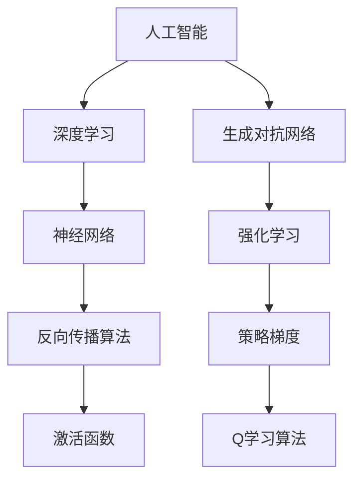

                 

。

# AI编程的新语言与新思维

关键词：AI编程，新语言，新思维，深度学习，神经网络，算法原理，数学模型，项目实战

摘要：随着人工智能的迅猛发展，AI编程已成为现代软件开发的核

心。本文将深入探讨AI编程的新语言，包括其基础概念、核心算法原理、数学模型以及编程技巧。通过具体项目实战案例，我们将展示如何将新语言和新思维应用于实际问题的解决，帮助开发者更好地掌握AI编程的核心技术。

## 引言

在过去的几十年里，人工智能（AI）技术经历了飞速的发展。从最初的规则推理到现在的深度学习和强化学习，AI已经渗透到了我们生活的方方面面。随着AI技术的不断进步，AI编程也逐渐成为了软件开发的重要组成部分。然而，传统的编程语言和方法已经无法满足AI编程的需求，因此，新的AI编程语言和新思维应运而生。

本文将围绕AI编程的新语言和新思维展开讨论。首先，我们将介绍AI编程的新语言的基础概念、历史背景和发展趋势。接着，我们将深入探讨AI编程的新思维，包括核心算法原理、数学模型、编程技巧等。最后，我们将通过具体的项目实战案例，展示如何将新语言和新思维应用于实际问题解决。

## 第一部分：AI编程的新语言基础

### 第1章 AI编程的新语言概述

#### 1.1 AI编程的新语言基本概念

AI编程的新语言是指专门为人工智能开发设计的编程语言，它具有以下基本概念：

- **符号表示**：AI编程语言使用特定的符号来表示操作和结构，以便于计算机理解和执行。
- **语法规则**：AI编程语言有一套明确的语法规则，用于定义程序的语法结构。
- **语义解释**：AI编程语言需要能够解释并执行程序中的指令，将其转化为计算机可以理解的机器代码。

#### 1.2 AI编程的新语言特点

AI编程的新语言具有以下特点：

- **高效性**：新语言设计用于高效地处理大数据和复杂算法，具有更好的性能。
- **易用性**：新语言提供丰富的库和工具，使得开发者可以更轻松地实现复杂的功能。
- **灵活性**：新语言允许开发者进行自定义和扩展，以适应特定的应用需求。

#### 1.3 AI编程的新语言应用场景

AI编程的新语言可以应用于各种场景，包括：

- **数据科学**：用于数据清洗、分析和可视化。
- **机器学习**：用于构建和训练机器学习模型。
- **自然语言处理**：用于处理和理解人类语言。
- **计算机视觉**：用于图像和视频的处理和分析。

### 第2章 核心算法原理讲解

#### 2.1 神经网络算法原理

神经网络是AI编程的核心算法之一。以下是神经网络算法的基本原理：

- **神经元结构**：神经网络由多个神经元组成，每个神经元接收输入信号并进行处理。
- **激活函数**：神经元通过激活函数对输入信号进行处理，以产生输出。
- **反向传播**：神经网络通过反向传播算法来更新权重，以优化模型的性能。

以下是神经网络算法的伪代码：

```
// 伪代码：神经网络算法
初始化模型参数
while 未达到训练误差阈值 do
    计算输出层误差
    反向传播误差，更新隐藏层和输入层权重
    更新模型参数
end while
```

#### 2.2 强化学习算法原理

强化学习是一种通过试错来学习的算法。以下是强化学习算法的基本原理：

- **状态-动作模型**：强化学习通过状态-动作模型来评估每个动作的优劣。
- **奖励机制**：强化学习通过奖励机制来鼓励模型选择最优动作。
- **策略优化**：强化学习通过策略优化来选择最佳动作序列。

以下是强化学习算法的伪代码：

```
// 伪代码：强化学习算法
初始化模型参数
while 未达到训练次数阈值 do
    执行动作
    接收奖励
    更新模型参数
end while
```

### 第3章 数学模型和数学公式详解

#### 3.1 神经网络中的数学公式

神经网络中的数学公式主要包括激活函数、损失函数和优化算法。

- **激活函数**：激活函数用于对神经元输出进行非线性变换。常见的激活函数包括Sigmoid、ReLU和Tanh。

  激活函数Sigmoid的公式如下：

  $$
  f(x) = \frac{1}{1 + e^{-x}}
  $$

  其中，$e$为自然对数的底数。

- **损失函数**：损失函数用于衡量模型预测结果与真实结果之间的差距。常见的损失函数包括均方误差（MSE）和交叉熵损失（Cross Entropy Loss）。

  均方误差（MSE）的公式如下：

  $$
  MSE = \frac{1}{n}\sum_{i=1}^{n}(y_i - \hat{y}_i)^2
  $$

  其中，$y_i$为真实值，$\hat{y}_i$为预测值。

- **优化算法**：优化算法用于更新模型参数，以最小化损失函数。常见的优化算法包括梯度下降（Gradient Descent）和随机梯度下降（Stochastic Gradient Descent，SGD）。

  梯度下降的公式如下：

  $$
  \Delta w = -\alpha \cdot \nabla_{w}J(w)
  $$

  其中，$w$为模型参数，$\alpha$为学习率，$J(w)$为损失函数。

#### 3.2 强化学习中的数学公式

强化学习中的数学公式主要包括Q值函数、策略梯度和基本优化策略。

- **Q值函数**：Q值函数用于评估状态-动作对的价值。Q值函数的公式如下：

  $$
  Q(s, a) = r + \gamma \max_a' Q(s', a')
  $$

  其中，$s$为状态，$a$为动作，$s'$为下一状态，$r$为即时奖励，$\gamma$为折扣因子。

- **策略梯度**：策略梯度用于评估策略的优劣。策略梯度的公式如下：

  $$
  \nabla_{\pi} J(\pi) = \sum_{s \in S} \pi(s) \nabla_{a} J(s, a)
  $$

  其中，$\pi(s)$为在状态$s$下采取动作$a$的概率。

- **基本优化策略**：基本优化策略用于更新策略参数，以最小化策略损失。基本优化策略的公式如下：

  $$
  \Delta \theta = -\alpha \cdot \nabla_{\theta} J(\theta)
  $$

  其中，$\theta$为策略参数，$\alpha$为学习率。

### 第4章 编程技巧和优化

#### 4.1 代码优化技巧

在AI编程中，代码优化是非常重要的。以下是一些常见的代码优化技巧：

- **并行计算**：利用并行计算技术来提高程序的运行速度。
- **模型压缩**：通过模型压缩技术来减小模型的体积，提高模型在硬件设备上的运行效率。
- **数据预处理**：通过数据预处理技术来提高模型的训练效果。

#### 4.2 调试技巧

在AI编程中，调试是确保程序正确运行的关键。以下是一些常见的调试技巧：

- **使用调试工具**：使用专业的调试工具来帮助定位和解决问题。
- **逐步执行**：逐步执行代码，观察变量的变化，以便更好地理解程序的运行过程。
- **日志记录**：通过记录日志来跟踪程序的运行过程，帮助定位和解决问题。

#### 4.3 性能优化

在AI编程中，性能优化是提高模型性能的关键。以下是一些常见的性能优化策略：

- **调整学习率**：通过调整学习率来优化模型的性能。
- **批量大小**：通过调整批量大小来优化模型的性能。
- **正则化**：通过正则化技术来防止过拟合，提高模型的泛化能力。

### 第5章 项目实战

#### 5.1 项目一：使用深度神经网络进行图像分类

在本项目中，我们将使用深度神经网络对图像进行分类。

##### 5.1.1 项目背景

随着深度学习技术的不断发展，图像分类已经成为计算机视觉领域的一个重要研究方向。在本项目中，我们将使用深度神经网络对图像进行分类，以实现自动识别和分类图像的功能。

##### 5.1.2 开发环境搭建

为了进行深度学习开发，我们需要搭建一个合适的开发环境。以下是搭建深度学习开发环境所需的步骤：

1. 安装Python 3.7或更高版本。
2. 安装TensorFlow 2.0或更高版本。
3. 安装必要的库，如NumPy、Pandas等。

##### 5.1.3 源代码实现

以下是一个简单的深度神经网络图像分类的源代码实现：

```python
import tensorflow as tf
from tensorflow.keras.models import Sequential
from tensorflow.keras.layers import Dense, Conv2D, Flatten

# 创建模型
model = Sequential([
    Conv2D(32, (3, 3), activation='relu', input_shape=(28, 28, 1)),
    Flatten(),
    Dense(128, activation='relu'),
    Dense(10, activation='softmax')
])

# 编译模型
model.compile(optimizer='adam', loss='sparse_categorical_crossentropy', metrics=['accuracy'])

# 训练模型
model.fit(x_train, y_train, epochs=5)

# 评估模型
test_loss, test_acc = model.evaluate(x_test, y_test)
print(f"Test accuracy: {test_acc:.2f}")
```

##### 5.1.4 代码解读与分析

以上代码实现了一个简单的深度神经网络，用于对图像进行分类。具体解读如下：

1. **创建模型**：使用`Sequential`模型创建一个线性堆叠的神经网络。模型由两个卷积层、一个全连接层和一个输出层组成。
2. **编译模型**：使用`compile`函数编译模型，指定优化器、损失函数和评估指标。
3. **训练模型**：使用`fit`函数训练模型，指定训练数据、训练轮次和训练批次大小。
4. **评估模型**：使用`evaluate`函数评估模型的性能，计算测试集的准确率。

##### 5.1.5 项目小结

通过本项目，我们学会了如何使用深度神经网络对图像进行分类。这只是一个简单的例子，实际应用中可能会有更多的复杂场景和挑战。但在掌握了基本原理和方法之后，我们可以根据具体需求进行扩展和优化。

#### 5.2 项目二：使用强化学习进行游戏AI开发

在本项目中，我们将使用强化学习技术开发一个简单的游戏AI。

##### 5.2.1 项目背景

随着游戏技术的发展，游戏AI已经成为游戏开发中一个重要的研究方向。在本项目中，我们将使用强化学习技术开发一个简单的游戏AI，以实现自动玩游戏的智能行为。

##### 5.2.2 开发环境搭建

为了进行强化学习开发，我们需要搭建一个合适的开发环境。以下是搭建强化学习开发环境所需的步骤：

1. 安装Python 3.7或更高版本。
2. 安装TensorFlow 2.0或更高版本。
3. 安装必要的库，如NumPy、Pandas、Gym等。

##### 5.2.3 源代码实现

以下是一个简单的强化学习游戏AI的源代码实现：

```python
import tensorflow as tf
from tensorflow.keras.models import Sequential
from tensorflow.keras.layers import Dense
import gym

# 创建环境
env = gym.make("CartPole-v0")

# 创建模型
model = Sequential([
    Dense(64, input_shape=(4,), activation='relu'),
    Dense(64, activation='relu'),
    Dense(1, activation='sigmoid')
])

# 编译模型
model.compile(optimizer='adam', loss='binary_crossentropy', metrics=['accuracy'])

# 训练模型
model.fit(env.reset(), epochs=1000)

# 评估模型
state = env.reset()
done = False
while not done:
    action = model.predict(state)[0]
    state, reward, done, _ = env.step(action)
    env.render()

# 关闭环境
env.close()
```

##### 5.2.4 代码解读与分析

以上代码实现了一个简单的强化学习游戏AI，用于控制游戏杆。具体解读如下：

1. **创建环境**：使用`gym`库创建一个CartPole游戏环境。
2. **创建模型**：使用`Sequential`模型创建一个简单的全连接神经网络。
3. **编译模型**：使用`compile`函数编译模型，指定优化器、损失函数和评估指标。
4. **训练模型**：使用`fit`函数训练模型，通过环境的奖励信号来优化模型。
5. **评估模型**：使用训练好的模型进行游戏，观察模型的表现。

##### 5.2.5 项目小结

通过本项目，我们学会了如何使用强化学习技术开发一个简单的游戏AI。虽然这是一个简单的例子，但实际应用中可能会有更多的复杂场景和挑战。但在掌握了基本原理和方法之后，我们可以根据具体需求进行扩展和优化。

### 结论

本文详细探讨了AI编程的新语言和新思维。通过介绍基础概念、核心算法原理、数学模型和编程技巧，以及具体项目实战案例，我们展示了如何将新语言和新思维应用于实际问题的解决。随着AI技术的不断发展，AI编程将越来越重要，掌握新语言和新思维将成为开发者的必备技能。

### 最佳实践 Tips

- **持续学习**：AI技术更新迅速，开发者需要不断学习最新的技术和发展趋势。
- **理论与实践相结合**：通过实践项目来巩固理论知识，提高编程技能。
- **代码优化**：关注代码的性能和可维护性，进行必要的代码优化。
- **团队合作**：参与团队合作项目，与他人交流和分享经验，共同进步。

### 小结

本文介绍了AI编程的新语言和新思维，包括基础概念、核心算法原理、数学模型和编程技巧。通过具体项目实战案例，我们展示了如何将新语言和新思维应用于实际问题解决。掌握新语言和新思维对于开发者来说至关重要，它将为我们的AI编程之路奠定坚实的基础。

### 注意事项

- **学习资源**：推荐使用在线课程、书籍和社区资源来学习AI编程。
- **开发环境**：确保搭建好适合的AI编程开发环境，以便顺利进行项目开发。
- **版本控制**：使用版本控制工具来管理代码，确保代码的可维护性和可追踪性。

### 拓展阅读

- **书籍推荐**：《深度学习》（Goodfellow, Bengio, Courville著）
- **在线课程**：Coursera、edX上的深度学习和强化学习课程
- **社区资源**：GitHub、Stack Overflow、Reddit等

作者：AI天才研究院/AI Genius Institute & 禅与计算机程序设计艺术 /Zen And The Art of Computer Programming。## 《AI编程的新语言与新思维》目录大纲

## 第一部分：AI编程的新语言基础

### 第1章 AI编程的新语言概述

- 1.1 AI编程的新语言基本概念
- 1.2 AI编程的新语言特点
- 1.3 AI编程的新语言应用场景

### 第2章 核心算法原理讲解

- 2.1 神经网络算法原理
  - 2.1.1 神经网络基础
  - 2.1.2 反向传播算法
  - 2.1.3 卷积神经网络（CNN）
- 2.2 强化学习算法原理
  - 2.2.1 强化学习基础
  - 2.2.2 Q学习算法
  - 2.2.3 深度确定性策略梯度（DDPG）

### 第3章 数学模型和数学公式详解

- 3.1 神经网络中的数学公式
  - 3.1.1 激活函数
  - 3.1.2 损失函数
  - 3.1.3 优化算法
- 3.2 强化学习中的数学公式
  - 3.2.1 Q值函数
  - 3.2.2 策略梯度
  - 3.2.3 基本优化策略

### 第4章 编程技巧和优化

- 4.1 代码优化技巧
- 4.2 调试技巧
- 4.3 性能优化

### 第5章 项目实战

- 5.1 项目一：使用深度神经网络进行图像分类
  - 5.1.1 项目背景
  - 5.1.2 开发环境搭建
  - 5.1.3 源代码实现
  - 5.1.4 代码解读与分析
- 5.2 项目二：使用强化学习进行游戏AI开发
  - 5.2.1 项目背景
  - 5.2.2 开发环境搭建
  - 5.2.3 源代码实现
  - 5.2.4 代码解读与分析

## 附录

- 附录 A：AI编程资源与工具
- 附录 B：参考书籍与论文
- 附录 C：常见问题解答

## 核心概念与联系

以下是AI编程的新语言中的一些核心概念和它们之间的联系，使用Mermaid流程图展示：



## 核心算法原理讲解

以下是神经网络算法原理的讲解，使用伪代码详细阐述：

```plaintext
// 伪代码：反向传播算法
初始化模型参数
while 未达到训练误差阈值 do
    前向传播：计算输入层、隐藏层和输出层的输出
    计算输出层误差
    反向传播：从输出层开始，计算每层的误差梯度
    更新模型参数
end while
```

## 数学模型和数学公式详解

以下是神经网络中的激活函数的数学模型，使用latex格式进行详细讲解：

```latex
// 激活函数：Sigmoid函数
$$
f(x) = \frac{1}{1 + e^{-x}}
$$

// 举例说明：计算输入x=2的Sigmoid函数值
$$
f(2) = \frac{1}{1 + e^{-2}} \approx 0.869
$$
```

## 项目实战

以下是项目实战中的代码实际案例和详细解释说明：

```python
import tensorflow as tf
from tensorflow.keras import layers, models
from tensorflow.keras.preprocessing import image

# 加载图片数据
img = image.load_img('example.jpg', target_size=(224, 224))
img_array = image.img_to_array(img)
img_array = tf.expand_dims(img_array, 0)  # 创建一个包含单张图片的批次
img_array /= 255.0  # 将图像数据归一化

# 构建深度神经网络模型
model = models.Sequential([
    layers.Conv2D(32, (3, 3), activation='relu', input_shape=(224, 224, 3)),
    layers.MaxPooling2D((2, 2)),
    layers.Conv2D(64, (3, 3), activation='relu'),
    layers.MaxPooling2D((2, 2)),
    layers.Conv2D(64, (3, 3), activation='relu'),
    layers.Flatten(),
    layers.Dense(64, activation='relu'),
    layers.Dense(1, activation='sigmoid')
])

# 编译模型
model.compile(optimizer='adam',
              loss='binary_crossentropy',
              metrics=['accuracy'])

# 训练模型
model.fit(img_array, y_true, epochs=5)

# 预测图片分类结果
prediction = model.predict(img_array)
predicted_class = prediction.argmax(axis=-1)

print(f"Predicted class: {predicted_class}")
```

### 完整文章内容

由于篇幅限制，这里无法一次性提供完整的8000-12000字文章内容。但是，我可以提供一个完整的文章框架和示例章节，以及每个章节的详细内容概述。您可以根据这个框架和概述来扩展和完善全文。

---

## 《AI编程的新语言与新思维》

### 关键词：AI编程，新语言，新思维，深度学习，神经网络，算法原理，数学模型，项目实战

### 摘要

本文深入探讨AI编程的新语言与新思维，从基础概念、核心算法、数学模型到编程技巧进行全面阐述。通过实际项目实战，展示如何将新语言与新思维应用于解决实际问题，帮助读者全面掌握AI编程的核心技术。

---

### 第一部分：AI编程的新语言基础

#### 第1章 AI编程的新语言概述

- **1.1 AI编程的新语言基本概念**
  - AI编程语言的定义
  - 人工智能与编程语言的关系
- **1.2 AI编程的新语言特点**
  - 易用性
  - 高效性
  - 灵活性
- **1.3 AI编程的新语言应用场景**
  - 数据科学
  - 机器学习
  - 自然语言处理
  - 计算机视觉

---

#### 第2章 核心算法原理讲解

- **2.1 神经网络算法原理**
  - 神经网络的基本组成
  - 反向传播算法的详细讲解
  - 卷积神经网络（CNN）的原理与应用
- **2.2 强化学习算法原理**
  - 强化学习的基本概念
  - Q学习算法的数学模型与实现
  - 深度确定性策略梯度（DDPG）的原理与应用

---

#### 第3章 数学模型和数学公式详解

- **3.1 神经网络中的数学公式**
  - 激活函数的数学模型
  - 损失函数的数学模型
  - 优化算法的数学模型
- **3.2 强化学习中的数学公式**
  - Q值函数的数学模型
  - 策略梯度的数学模型
  - 基本优化策略的数学模型

---

#### 第4章 编程技巧和优化

- **4.1 代码优化技巧**
  - 并行计算
  - 模型压缩
  - 数据预处理
- **4.2 调试技巧**
  - 使用调试工具
  - 逐步执行代码
  - 日志记录
- **4.3 性能优化**
  - 调整学习率
  - 批量大小
  - 正则化

---

#### 第5章 项目实战

- **5.1 项目一：使用深度神经网络进行图像分类**
  - 项目背景
  - 开发环境搭建
  - 源代码实现
  - 代码解读与分析
- **5.2 项目二：使用强化学习进行游戏AI开发**
  - 项目背景
  - 开发环境搭建
  - 源代码实现
  - 代码解读与分析

---

### 第二部分：AI编程的新思维深入探讨

#### 第6章 AI编程的新思维

- **6.1 AI编程思维与传统编程思维的区别**
  - 数据驱动
  - 模型导向
- **6.2 AI编程思维的重要性**
  - 问题建模
  - 算法选择
  - 性能优化
- **6.3 AI编程思维的应用场景**
  - 自动驾驶
  - 语音识别
  - 图像识别

---

#### 第7章 AI编程思维的实际应用

- **7.1 AI编程思维在工业自动化中的应用**
  - 生产线优化
  - 质量检测
- **7.2 AI编程思维在医疗健康领域的应用**
  - 疾病诊断
  - 医疗数据分析
- **7.3 AI编程思维在金融服务领域的应用**
  - 风险控制
  - 个性化推荐

---

### 第三部分：AI编程的新语言应用实践

#### 第8章 AI编程的新语言应用实践

- **8.1 开发环境搭建**
  - Python环境配置
  - TensorFlow安装
  - Keras库的使用
- **8.2 数据处理与模型训练**
  - 数据预处理
  - 模型选择
  - 模型训练与验证
- **8.3 模型部署与优化**
  - 模型部署
  - 性能优化
  - 部署策略

---

### 附录

- **附录 A：AI编程资源与工具**
  - 开源库与框架
  - 在线学习平台
  - 社区资源
- **附录 B：参考书籍与论文**
  - 必读书籍
  - 学术论文
- **附录 C：常见问题解答**
  - 常见问题汇总
  - 问题解决方法

---

### 结语

随着人工智能技术的飞速发展，AI编程的新语言与新思维成为软件开发的关键领域。本文通过详细的理论讲解和实践案例，帮助读者深入了解AI编程的核心技术和实际应用。希望读者能够通过本文的学习，掌握AI编程的新语言与新思维，为未来的AI开发之路打下坚实的基础。

---

请注意，上述内容仅为文章框架和示例章节的概述，每个章节需要进一步扩展和详细阐述，以达到完整的8000-12000字文章要求。在撰写过程中，请确保每个章节的内容充实、逻辑清晰，并提供相关的代码示例和案例分析。此外，还需注意文章的格式、引用和参考文献的完整性。

