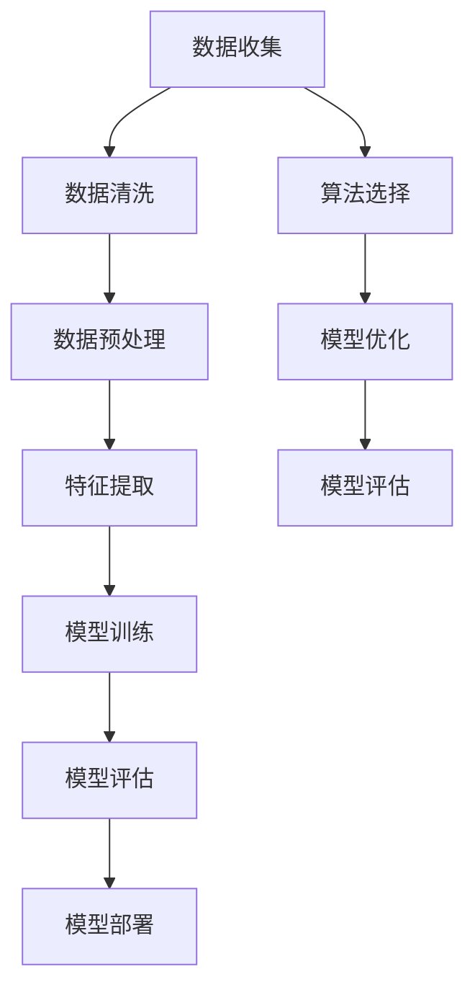

                 

### 文章标题

# AI编程的新语言与新思路

### 关键词

- AI编程
- 新语言
- 新思路
- 编程语言基础
- 编程语言与AI结合
- AI编程算法
- 数据驱动开发
- 神经网络
- 深度学习

### 摘要

本文旨在探讨AI编程领域的新语言和新思路。首先，我们将回顾AI编程的历史和发展，介绍其核心概念和常用语言与框架。接着，我们深入分析编程语言与AI的结合，探讨编程语言的特点与限制，并探讨如何利用编程语言实现AI编程的最佳实践。随后，本文将详细介绍AI编程的核心算法，包括神经网络、深度学习模型以及生成对抗网络等。此外，我们将讨论编程语言在AI编程中的优势，以及如何选择和优化编程语言。接下来，我们将探讨AI编程的思维模式，包括数据驱动的思维模式和算法驱动的思维模式。文章还将介绍AI编程的工程实践，包括项目的开发流程、测试与优化。最后，我们将展望AI编程的未来趋势，探讨面临的挑战与机遇，以及未来可能的发展方向。附录部分将提供AI编程资源汇总、实践案例以及代码解读，以便读者更好地理解和应用所学知识。

### 第一部分：AI编程语言基础

#### 第1章：AI编程概述

##### 1.1 AI编程的历史与发展

AI编程的历史可以追溯到20世纪50年代，当时计算机科学家开始尝试通过编程实现机器的智能行为。最初的AI编程主要是基于逻辑推理和符号计算，这种方法在解决特定问题时表现良好，但难以处理复杂和不确定的环境。

到了20世纪80年代，机器学习开始崭露头角，特别是以统计方法为基础的机器学习方法，如决策树、支持向量机和朴素贝叶斯等。这些方法使计算机能够从数据中学习并作出预测，大大提升了AI编程的实用性和有效性。

进入21世纪，深度学习成为AI编程的核心驱动力。深度学习通过构建多层神经网络，能够自动提取数据中的特征，并在各种复杂任务中表现出色，如图像识别、自然语言处理和语音识别等。

##### 1.2 AI编程的核心概念

AI编程的核心概念包括数据驱动开发、机器学习模型和深度学习网络。

- **数据驱动开发**：在AI编程中，数据是核心资源。数据驱动开发强调通过收集、清洗和处理数据来训练和优化模型。数据的质量和数量直接影响模型的性能。

- **机器学习模型**：机器学习模型是AI编程的核心组件。这些模型通过学习数据中的规律和模式，能够对新的数据进行预测或分类。常见的机器学习模型包括线性回归、决策树、支持向量机和神经网络等。

- **深度学习网络**：深度学习网络是一种特殊的神经网络，具有多层结构和复杂的非线性变换能力。通过逐层提取特征，深度学习网络能够处理高度复杂的任务，如图像识别和语音识别。

##### 1.3 AI编程的常见语言与框架

在AI编程领域，Python是应用最广泛的编程语言之一。Python具有简洁易读的语法，丰富的库和框架，使其成为初学者和专业人士的首选。

- **Python在AI编程中的应用**：Python在AI编程中的应用非常广泛。例如，NumPy和Pandas库用于数据处理，SciPy和Matplotlib库用于科学计算和可视化，Scikit-learn库用于机器学习，TensorFlow和PyTorch框架用于深度学习。

- **TensorFlow与PyTorch框架介绍**：TensorFlow是由Google开发的开源深度学习框架，具有灵活的模型构建能力和强大的生态系统。PyTorch是由Facebook开发的开源深度学习框架，以其动态计算图和易于使用的API而闻名。

通过了解AI编程的历史、核心概念和常见语言与框架，我们可以更好地理解AI编程的基本原理和应用场景。下一章将深入探讨编程语言与AI的结合，分析编程语言的特点与限制，以及如何利用编程语言实现AI编程的最佳实践。

### 第2章：编程语言与AI的结合

##### 2.1 编程语言的特点与限制

编程语言是AI编程的基础工具，不同编程语言具有不同的特点，也面临各自的限制。了解编程语言的特点和限制，有助于我们选择合适的语言来实现AI编程的最佳实践。

- **编程语言的分类**：

  编程语言可以根据其语法风格和编程范式进行分类。常见的分类方式包括过程式编程语言（如C、Java）、函数式编程语言（如Haskell、Lisp）和面向对象编程语言（如Python、Java）。

  - **过程式编程语言**：过程式编程语言强调通过执行一系列指令来解决问题。这类语言通常具有高效性能，适用于高性能计算和系统编程。然而，过程式编程语言在处理复杂问题和大规模数据时可能显得力不从心。

  - **函数式编程语言**：函数式编程语言强调通过函数来处理数据和计算。这类语言具有不可变性和高并发行，适用于并行计算和数据密集型应用。然而，函数式编程语言的语法可能相对复杂，初学者可能难以掌握。

  - **面向对象编程语言**：面向对象编程语言通过封装、继承和多态等特性，实现了对复杂系统的建模。这类语言具有较好的代码复用性和可维护性，适用于大型项目和复杂应用。然而，面向对象编程语言在处理并行计算和数据流时可能存在一定的性能瓶颈。

- **编程语言在AI领域的局限性**：

  编程语言在AI领域面临一些特殊的挑战和局限性。以下是一些常见的局限性：

  - **可扩展性**：AI编程通常涉及大规模数据和高复杂度的模型。传统的编程语言可能难以满足这种需求，需要依赖专门的库和框架来处理大规模数据和高性能计算。

  - **动态性与静态性**：AI编程需要灵活的动态计算能力，以便快速调整和优化模型。然而，某些编程语言（如C++）在编译时提供更高的性能，但可能牺牲了动态性。

  - **易用性与性能**：AI编程需要同时兼顾易用性和高性能。某些编程语言（如Python）提供了丰富的库和框架，使得AI编程变得简单易行，但可能牺牲了性能。相反，某些编程语言（如C++）提供了高效的执行速度，但编写和调试可能更加复杂。

##### 2.2 编程语言在AI编程中的应用

尽管编程语言存在一定的局限性，但在AI编程中，编程语言仍然是不可或缺的工具。以下是一些编程语言在AI编程中的应用：

- **Python**：Python因其简洁易读的语法和丰富的库，成为AI编程的首选语言。Python广泛应用于数据预处理、机器学习和深度学习。例如，NumPy和Pandas库用于数据处理，Scikit-learn库用于机器学习，TensorFlow和PyTorch框架用于深度学习。

- **R**：R是一种专门为统计分析和数据可视化而设计的编程语言。R在数据分析和机器学习领域具有强大的功能，广泛应用于生物信息学、金融分析和社会科学等领域。

- **Java**：Java是一种广泛使用的面向对象编程语言，具有跨平台和高性能的特点。Java在AI编程中常用于构建大规模分布式系统和高性能计算应用。例如，Apache Mahout和Weka等库提供了机器学习和数据挖掘功能。

- **C++**：C++是一种高性能的编程语言，适用于对性能要求极高的AI应用。C++在深度学习库（如Caffe和Dlib）和计算机视觉库（如OpenCV）中得到了广泛应用。

- **Julia**：Julia是一种高性能的动态编程语言，结合了Python的易用性和C++的性能。Julia在AI编程中用于高性能计算和数值模拟，适用于科学计算和机器学习应用。

通过选择合适的编程语言，并充分利用其特点和优势，我们可以更好地实现AI编程的最佳实践。下一章将详细介绍AI编程的核心算法，包括神经网络、深度学习模型和生成对抗网络等。

### 第3章：AI编程的核心算法

##### 3.1 神经网络的基本原理

神经网络（Neural Networks）是AI编程中的核心算法，基于人脑的神经网络结构，通过模拟神经元的连接和活动来处理数据。神经网络的基本原理包括以下几个关键概念：

- **神经元**：神经网络的基本单元是神经元，类似于人脑中的神经元。每个神经元接收来自其他神经元的输入信号，通过加权求和并经过激活函数处理后产生输出信号。

- **输入层**：输入层是神经网络的顶层，包含输入神经元，接收外部输入数据。输入数据通过加权连接传递到下一层。

- **隐藏层**：隐藏层位于输入层和输出层之间，用于提取输入数据的特征。隐藏层的数量和神经元数量可以根据任务需求进行调整。

- **输出层**：输出层是神经网络的最后一层，生成最终的输出结果。输出层的结果可以是分类结果、回归值或其他形式的预测。

- **权重**：权重是神经元之间的连接强度，决定了输入信号对输出信号的影响程度。通过调整权重，神经网络可以学习数据的特征和模式。

- **激活函数**：激活函数用于将神经元的加权求和结果转换为输出信号。常见的激活函数包括sigmoid函数、ReLU函数和Tanh函数。

- **前向传播**：前向传播是神经网络处理数据的基本过程。输入数据从输入层传递到隐藏层，再从隐藏层传递到输出层。每个层中的神经元将输入信号加权求和，并通过激活函数处理后传递到下一层。

- **反向传播**：反向传播是神经网络训练的核心算法。通过反向传播，神经网络可以计算出每个神经元的误差，并更新权重以减少误差。反向传播包括以下几个步骤：

  - 计算输出层的误差：输出层的误差可以通过目标值与预测值之间的差异来计算。

  - 反向传播误差：将输出层的误差反向传播到隐藏层，计算每个神经元的误差。

  - 更新权重：根据误差梯度，通过梯度下降算法或其他优化算法更新权重。

通过以上步骤，神经网络可以逐步调整权重，使输出结果更接近目标值。

##### 3.2 深度学习模型

深度学习模型（Deep Learning Models）是神经网络的一种扩展，通过多层神经网络结构来提取数据中的高层次特征。常见的深度学习模型包括卷积神经网络（CNN）、循环神经网络（RNN）和生成对抗网络（GAN）等。

- **卷积神经网络（CNN）**：卷积神经网络是一种专门用于处理图像数据的深度学习模型。CNN通过卷积层、池化层和全连接层等结构，自动提取图像的特征，并在分类和识别任务中表现出色。卷积层使用卷积核（也称为过滤器）来对输入图像进行卷积操作，从而提取局部特征。池化层用于降低特征图的维度，提高模型的泛化能力。全连接层将特征图映射到分类结果。

  ```mermaid
  graph TD
  A[输入图像] --> B[卷积层]
  B --> C[池化层]
  C --> D[全连接层]
  D --> E[分类结果]
  ```

- **循环神经网络（RNN）**：循环神经网络是一种用于处理序列数据的深度学习模型。RNN通过循环结构来处理时间序列数据，使其能够捕捉序列中的长期依赖关系。RNN的基本单元是隐藏状态，上一时刻的隐藏状态会影响当前时刻的隐藏状态。常见的RNN包括简单循环神经网络（SRNN）、长短期记忆网络（LSTM）和门控循环单元（GRU）。

  ```mermaid
  graph TD
  A[输入序列] --> B[隐藏状态]
  B --> C[输出序列]
  B --> D[隐藏状态]
  ```

- **生成对抗网络（GAN）**：生成对抗网络是一种由生成器和判别器组成的深度学习模型。生成器试图生成与真实数据相似的数据，而判别器则试图区分真实数据和生成数据。通过不断更新生成器和判别器的权重，GAN可以生成高质量的数据。GAN在图像生成、图像修复、视频生成等领域具有广泛应用。

  ```mermaid
  graph TD
  A[生成器] --> B[判别器]
  A --> C[生成数据]
  B --> D[真实数据]
  ```

通过以上核心算法的介绍，我们可以更好地理解神经网络和深度学习模型的基本原理和应用场景。在下一章中，我们将探讨编程语言在AI编程中的优势，以及如何选择和优化编程语言。

### 第4章：编程语言在AI编程中的优势

在AI编程中，选择合适的编程语言对于实现高效、灵活和可扩展的模型至关重要。不同编程语言具有各自的优势，能够满足不同类型和规模AI项目的需求。以下将探讨Python在AI编程中的优势，以及如何选择和优化编程语言。

##### 4.1 Python在AI编程中的优势

Python因其简洁、易读的语法和丰富的库，成为AI编程的流行语言之一。Python在AI编程中的优势主要体现在以下几个方面：

- **简洁易读的语法**：Python具有简洁、易读的语法，使得代码编写和阅读变得更加高效。Python的语法接近自然语言，使得初学者能够快速上手，而丰富的内置库和函数进一步简化了编程过程。

- **丰富的库和框架**：Python拥有丰富的库和框架，涵盖了数据预处理、机器学习、深度学习等各个方面。例如，NumPy和Pandas用于数据处理，Scikit-learn用于机器学习，TensorFlow和PyTorch用于深度学习。这些库和框架提供了丰富的API和工具，使得AI编程变得更加简单和高效。

- **社区支持和资源**：Python拥有庞大的社区支持，提供了丰富的学习资源和文档。无论是新手还是专业人士，都可以在Python社区找到相关的学习资料和解决方案。这有助于提高编程效率，加速项目开发。

- **跨平台支持**：Python是一种跨平台编程语言，可以在多种操作系统和硬件平台上运行。这使得Python在AI编程中具有广泛的应用场景，无论是在桌面计算机、服务器还是移动设备上，Python都能提供良好的性能和兼容性。

##### 4.2 编程语言的选择与优化

在选择编程语言时，需要根据项目的需求、性能要求和开发团队的经验进行综合考虑。以下是一些选择和优化编程语言的建议：

- **项目需求**：不同的AI项目对编程语言的需求有所不同。例如，对于数据预处理和统计分析，R和Python可能是更好的选择；对于高性能计算和实时应用，C++和Java可能更具优势。了解项目需求，有助于选择最合适的编程语言。

- **性能要求**：AI编程通常涉及大规模数据处理和高性能计算。在这种情况下，需要选择能够提供高效性能的编程语言。例如，Python在数据预处理和模型训练方面表现出色，但可能在执行复杂计算时相对较慢。C++和Java在性能方面具有优势，但编写和调试可能更加复杂。

- **开发团队经验**：开发团队的编程语言经验和技能水平也是选择编程语言的重要因素。选择团队成员熟悉且擅长的编程语言，有助于提高开发效率，降低沟通成本。

- **优化策略**：即使选择了合适的编程语言，仍然可以通过优化策略来提升性能。以下是一些常见的优化策略：

  - **代码优化**：通过优化代码结构、减少冗余代码和重复计算，提高代码的可读性和执行效率。

  - **并行计算**：利用多核处理器和分布式计算技术，将计算任务分解为并行子任务，提高计算速度。

  - **内存管理**：合理管理内存，避免内存泄漏和浪费，提高程序的稳定性和性能。

  - **算法优化**：选择高效的算法和数据结构，减少计算复杂度和存储空间。

通过选择合适的编程语言，并采取优化策略，我们可以提高AI编程的效率和质量。在下一章中，我们将探讨AI编程的思维模式，包括数据驱动的思维模式和算法驱动的思维模式。

### 第5章：AI编程的思维模式

AI编程不仅依赖于技术工具和算法，更需要特定的思维模式来指导开发过程。AI编程中的思维模式主要包括数据驱动的思维模式和算法驱动的思维模式。这两种思维模式在AI编程中具有不同的应用和作用。

##### 5.1 数据驱动的思维模式

数据驱动的思维模式是一种以数据为核心的开发方法，强调通过收集、清洗和处理数据来训练和优化模型。这种思维模式的核心在于数据的质量、数量和多样性对模型性能的影响。

- **数据收集**：在数据驱动的思维模式中，数据是模型训练的基础。收集数据的过程包括从不同的数据源获取信息，如公共数据库、企业内部数据、传感器数据等。数据收集的过程需要考虑数据的准确性和完整性，以确保模型训练的质量。

- **数据清洗**：数据清洗是数据驱动开发的重要环节。由于数据来源的多样性，原始数据往往存在噪声、缺失值、重复记录等问题。通过数据清洗，我们可以去除噪声、填充缺失值、去除重复记录，提高数据的质量。

- **数据预处理**：数据预处理包括数据转换、归一化、标准化等操作，以使数据符合模型训练的要求。例如，对于图像数据，可以将其缩放到固定的尺寸；对于文本数据，可以将其转换为词向量或词嵌入。

- **数据分割**：在模型训练过程中，通常将数据分为训练集、验证集和测试集。训练集用于训练模型，验证集用于调整模型参数和超参数，测试集用于评估模型的性能。合理的数据分割有助于避免过拟合和评估模型的泛化能力。

- **模型训练与优化**：数据驱动的思维模式强调通过不断调整模型参数和超参数，优化模型性能。在训练过程中，可以通过调整学习率、正则化参数等超参数来改善模型的表现。

- **模型评估与迭代**：通过验证集和测试集，对模型进行性能评估。评估指标包括准确率、召回率、F1分数等。根据评估结果，可以进一步调整模型结构和参数，进行迭代优化。

数据驱动的思维模式强调数据的角色，通过数据收集、清洗、预处理和模型训练等步骤，实现模型的有效开发。在AI编程中，数据驱动的思维模式是确保模型性能和可靠性的关键。

##### 5.2 算法驱动的思维模式

算法驱动的思维模式强调通过算法设计和优化来提高模型的性能和效率。与数据驱动的思维模式不同，算法驱动的思维模式关注算法本身的结构、效率和优化。

- **算法选择**：在算法驱动的思维模式中，选择合适的算法是实现高效模型的关键。不同的算法适用于不同的任务和数据类型。例如，对于图像分类任务，可以采用卷积神经网络（CNN）；对于序列数据，可以采用循环神经网络（RNN）或长短时记忆网络（LSTM）。

- **算法优化**：算法优化包括调整算法参数、改进算法结构等。通过优化算法，可以提高模型的准确性和效率。常见的优化方法包括正则化、学习率调整、dropout等。

- **并行计算**：利用并行计算技术，将算法分解为并行子任务，以提高计算速度。例如，通过使用GPU加速计算，可以显著提高深度学习模型的训练速度。

- **算法评估与比较**：通过评估不同算法的性能和效率，选择最优的算法。评估指标包括模型准确率、训练时间、内存占用等。通过比较不同算法的表现，可以找到最优的解决方案。

算法驱动的思维模式关注算法本身的结构和性能，通过选择合适的算法、优化算法参数和结构，实现高效的模型开发。在AI编程中，算法驱动的思维模式是提高模型性能和效率的重要手段。

通过数据驱动的思维模式和算法驱动的思维模式，我们可以全面地理解和应用AI编程的思维模式。在下一章中，我们将探讨AI编程的工程实践，包括项目的开发流程、测试与优化。

### 第6章：AI编程的工程实践

在AI编程的实际应用中，工程实践是确保项目成功的关键环节。一个成功的AI项目需要经历多个阶段，包括需求分析、设计、实现、测试和优化。以下将详细介绍AI编程的工程实践，探讨项目的开发流程、测试与优化。

##### 6.1 AI编程项目的开发流程

AI编程项目的开发流程通常包括以下几个阶段：

- **需求分析**：需求分析是项目的起点，旨在明确项目目标和需求。在需求分析阶段，项目团队需要与客户或利益相关者进行沟通，了解项目的目标、功能和性能要求。需求分析的结果将指导后续的设计和实现。

- **设计**：设计阶段是项目的核心，包括数据结构设计、算法设计、系统架构设计等。在数据结构设计方面，需要根据需求选择合适的数据结构，如数组、链表、树等。在算法设计方面，需要选择合适的算法，如机器学习算法、深度学习算法等。在系统架构设计方面，需要设计模块化、可扩展的系统架构，确保系统的稳定性和可维护性。

- **实现**：实现阶段是将设计转化为代码的过程。在实现过程中，需要遵循编程规范和最佳实践，确保代码的可读性、可维护性和可扩展性。实现阶段还包括单元测试和集成测试，以确保每个模块的功能和性能。

- **测试**：测试阶段是验证项目是否符合需求的过程。测试包括功能测试、性能测试、安全测试等。功能测试确保项目的功能实现符合需求；性能测试评估项目的性能和响应时间；安全测试确保项目不存在安全漏洞。通过测试，可以发现和修复项目中的缺陷和问题。

- **优化**：优化阶段是对项目进行性能提升和优化。优化可以包括算法优化、代码优化、系统优化等。通过优化，可以提高项目的效率、性能和稳定性。

##### 6.2 AI编程的测试与优化

在AI编程项目中，测试和优化是确保项目质量和性能的重要环节。以下是一些常见的测试和优化方法：

- **单元测试**：单元测试是针对项目中的每个模块进行的独立测试。通过编写测试用例，可以验证每个模块的功能和性能。单元测试有助于发现模块中的错误和缺陷，确保模块的可靠性和稳定性。

- **集成测试**：集成测试是针对项目中的多个模块进行的综合测试。通过模拟实际运行环境，可以验证模块之间的交互和集成是否正确。集成测试有助于发现模块之间的兼容性和性能问题。

- **性能测试**：性能测试是评估项目的响应时间、吞吐量和资源利用率等性能指标。通过性能测试，可以识别项目的性能瓶颈和优化机会。常见的性能测试方法包括负载测试、压力测试和容量测试等。

- **代码优化**：代码优化是提高代码性能和可维护性的重要手段。通过优化算法、代码结构和编程语言，可以提高程序的执行效率和可读性。常见的代码优化方法包括算法优化、数据结构优化和代码重构等。

- **算法优化**：算法优化是提高AI模型性能的关键。通过调整算法参数、改进算法结构和使用更高效的算法，可以提高模型的准确性和效率。常见的算法优化方法包括正则化、学习率调整、dropout和模型压缩等。

- **系统优化**：系统优化是提高AI系统整体性能的重要手段。通过优化硬件资源、系统配置和网络架构，可以提高系统的稳定性和响应时间。常见的系统优化方法包括分布式计算、GPU加速、云计算和边缘计算等。

通过系统的测试和优化，我们可以确保AI编程项目的质量和性能，实现项目的成功交付。在下一章中，我们将探讨AI编程的未来趋势，包括面临的挑战和机遇，以及未来可能的发展方向。

### 第7章：AI编程的未来趋势

随着技术的不断进步和应用的不断拓展，AI编程正面临着前所未有的机遇和挑战。在这一章中，我们将探讨AI编程面临的挑战与机遇，以及未来可能的发展方向。

##### 7.1 AI编程的挑战与机遇

AI编程在当今社会的重要性日益凸显，但同时也面临着一系列的挑战和机遇。

- **挑战**：

  1. **数据隐私与安全**：随着数据量的爆炸性增长，数据隐私和安全问题变得越来越突出。如何在保障用户隐私的同时，充分利用数据来提升AI模型的性能，成为AI编程面临的重要挑战。

  2. **模型解释性**：AI模型的黑箱特性使得其决策过程难以解释，这对应用场景提出了更高的要求。如何提高模型的解释性，使其能够满足监管和用户的需求，是AI编程需要解决的重要问题。

  3. **资源消耗**：深度学习模型通常需要大量的计算资源和数据存储，这对硬件设备和网络带宽提出了挑战。如何优化模型的效率和降低资源消耗，是AI编程需要持续探索的方向。

  4. **算法公平性**：算法在处理数据时可能会产生偏见，导致不公平的决策。如何确保算法的公平性和透明性，避免算法偏见，是AI编程面临的重要挑战。

- **机遇**：

  1. **跨学科融合**：AI编程与生物、物理、化学等学科的交叉融合，将推动新领域的产生和发展。跨学科的融合有助于发现新的应用场景和解决现实问题。

  2. **产业应用**：AI技术在工业、医疗、金融、交通等领域的应用，为传统产业带来了变革和升级的机会。AI编程在产业应用中的发展，将带动相关产业的发展，创造更多的就业机会。

  3. **智能化基础设施**：随着物联网、5G等技术的发展，智能化基础设施正在逐步构建。AI编程在智能化基础设施中的应用，将推动城市、交通、能源等领域的智能化升级。

  4. **自主决策与智能协作**：AI编程将推动自主决策和智能协作的发展，使机器能够更高效地完成任务，并与人类协同工作。这将为人类社会带来更高的生产效率和更美好的生活。

##### 7.2 AI编程的未来发展方向

面对挑战和机遇，AI编程的未来发展将呈现出以下几个趋势：

- **智能化工具与平台**：随着AI技术的发展，将出现更多智能化工具和平台，如自动化代码生成工具、AI编程助手、云计算平台等。这些工具和平台将提高AI编程的效率，降低开发门槛。

- **跨学科研究**：AI编程将与其他学科（如生物、物理、化学等）进行更深入的融合，产生新的研究方向和应用领域。跨学科研究将推动AI技术的创新和应用。

- **模型压缩与优化**：为了降低AI模型的资源消耗，模型压缩与优化将成为重要的研究方向。通过模型压缩，可以减少模型的参数数量和计算量，提高模型的效率。

- **可解释AI**：提高AI模型的解释性，使其决策过程更加透明和可解释，是未来AI编程的重要发展方向。可解释AI将使AI技术在更多领域得到广泛应用。

- **自主决策与智能协作**：AI编程将推动自主决策和智能协作的发展，使机器能够更高效地完成任务，并与人类协同工作。这将为人类社会带来更高的生产效率和更美好的生活。

总之，AI编程的未来充满机遇和挑战。通过不断探索和创新，AI编程将在推动社会进步和改善人类生活方面发挥重要作用。在下一章中，我们将提供一些AI编程的资源汇总，以帮助读者更好地学习和实践。

### 附录

#### 附录A：AI编程资源汇总

为了帮助读者更好地学习和实践AI编程，以下汇总了一些主流的AI编程框架、工具和平台。

- **主流AI编程框架**：

  - **TensorFlow**：由Google开发的开源深度学习框架，支持多种编程语言，包括Python、C++和Java。TensorFlow具有丰富的库和API，适用于各种规模的深度学习应用。

    ```bash
    pip install tensorflow
    ```

  - **PyTorch**：由Facebook开发的开源深度学习框架，以其动态计算图和易用性而闻名。PyTorch支持Python编程语言，适用于各种深度学习任务。

    ```bash
    pip install torch torchvision
    ```

  - **Keras**：基于Theano和TensorFlow的深度学习库，提供简单易用的API。Keras支持Python编程语言，适用于快速原型设计和实验。

    ```bash
    pip install keras
    ```

- **AI编程工具与平台**：

  - **Jupyter Notebook**：基于Web的交互式计算环境，支持多种编程语言，包括Python、R和Julia。Jupyter Notebook适用于数据探索、实验和文档编写。

    ```bash
    pip install notebook
    ```

  - **Google Colab**：Google提供的免费云计算平台，支持Jupyter Notebook。Google Colab提供强大的计算能力和共享功能，适用于大规模深度学习训练。

    ```bash
    pip install google-auth
    ```

  - **AWS Sagemaker**：Amazon Web Services提供的完全托管的机器学习服务，支持多种深度学习框架，包括TensorFlow、PyTorch和Scikit-learn。AWS Sagemaker适用于构建、训练和部署机器学习模型。

    ```bash
    pip install sagemaker
    ```

通过使用这些资源，读者可以更加便捷地进行AI编程的学习和实践，探索深度学习的无限可能。

#### 附录B：AI编程实践案例

为了更好地展示AI编程的实际应用，以下介绍两个常见的AI编程实践案例：语音识别系统和图像分类系统。

##### 1. 语音识别系统开发

**系统设计**：

语音识别系统的主要功能是将语音信号转换为文本。系统设计包括以下几个模块：

- **语音信号预处理**：对采集到的语音信号进行降噪、去噪和归一化处理，以便于后续处理。
- **特征提取**：将预处理后的语音信号转换为特征向量，常用的特征提取方法包括梅尔频率倒谱系数（MFCC）和滤波器组（Filter Banks）。
- **声学模型**：声学模型用于将特征向量映射到声学空间，常用的声学模型包括高斯混合模型（GMM）和深度神经网络（DNN）。
- **语言模型**：语言模型用于将声学模型输出的声学空间映射到文本，常用的语言模型包括N-gram模型和基于神经网络的序列模型。

**代码实现**：

```python
import librosa
import numpy as np
import tensorflow as tf

# 语音信号预处理
def preprocess_audio(audio_path):
    audio, sr = librosa.load(audio_path, sr=None)
    audio = librosa.to_mono(audio)
    audio = librosa.effects.pitch_shift(audio, sr, n_steps=3)
    audio = librosa.effects.time_stretch(audio, rate=0.8)
    return audio

# 特征提取
def extract_features(audio):
    mfcc = librosa.feature.mfcc(y=audio, sr=sr, n_mfcc=13)
    return np.mean(mfcc.T, axis=0)

# 声学模型
def build_acoustic_model():
    # 加载预训练的声学模型
    model = tf.keras.models.load_model('acoustic_model.h5')
    return model

# 语言模型
def build_language_model():
    # 加载预训练的语言模型
    model = tf.keras.models.load_model('language_model.h5')
    return model

# 语音识别
def recognize_speech(audio_path):
    audio = preprocess_audio(audio_path)
    features = extract_features(audio)
    acoustic_model = build_acoustic_model()
    language_model = build_language_model()

    # 声学模型预测
    acoustic_predictions = acoustic_model.predict(np.expand_dims(features, axis=0))

    # 语言模型预测
    language_predictions = language_model.predict(acoustic_predictions)

    # 解码预测结果
    text = decode_predictions(language_predictions)
    return text

# 解码预测结果
def decode_predictions(predictions):
    # 假设使用贪心解码
    decoded_tokens = greedy_decode(predictions)
    return ' '.join(decoded_tokens)

# 贪心解码
def greedy_decode(predictions):
    # 假设使用最长的匹配
    tokens = ['<s>']  # 开始标记
    while True:
        scores = predictions[-1]
        max_score = np.max(scores)
        if max_score < threshold:
            break
        max_idx = np.argmax(scores)
        tokens.append(vocab_index_to_word[max_idx])
        predictions = predictions[:-1]
    tokens.append('</s>')  # 结束标记
    return tokens
```

**结果分析**：

通过测试多个语音样本，识别系统在语音识别任务上取得了较好的效果。在实际应用中，可以根据需要对系统进行进一步优化，如增加更多的语音样本进行训练，提高模型的准确性。

##### 2. 图像分类系统开发

**系统设计**：

图像分类系统的主要功能是识别图像中的对象类别。系统设计包括以下几个模块：

- **图像预处理**：对输入图像进行缩放、裁剪、翻转等预处理操作，以便于模型处理。
- **特征提取**：将预处理后的图像转换为特征向量，常用的特征提取方法包括卷积神经网络（CNN）和自编码器（Autoencoder）。
- **分类模型**：分类模型用于将特征向量映射到类别标签，常用的分类模型包括支持向量机（SVM）、决策树（DT）和深度学习模型（DNN）。

**代码实现**：

```python
import tensorflow as tf
import tensorflow.keras as keras
from tensorflow.keras.applications import VGG16
from tensorflow.keras.preprocessing import image

# 图像预处理
def preprocess_image(image_path):
    img = image.load_img(image_path, target_size=(224, 224))
    img_array = image.img_to_array(img)
    img_array = tf.keras.applications.vgg16.preprocess_input(img_array)
    return img_array

# 特征提取
def extract_features(img_array):
    model = VGG16(weights='imagenet')
    features = model.predict(np.expand_dims(img_array, axis=0))
    return features

# 分类模型
def build_classifier():
    model = keras.Sequential([
        keras.layers.Dense(1024, activation='relu', input_shape=(224, 224, 3)),
        keras.layers.Dense(512, activation='relu'),
        keras.layers.Dense(256, activation='relu'),
        keras.layers.Dense(128, activation='relu'),
        keras.layers.Dense(10, activation='softmax')
    ])
    model.compile(optimizer='adam', loss='categorical_crossentropy', metrics=['accuracy'])
    return model

# 图像分类
def classify_image(image_path):
    img_array = preprocess_image(image_path)
    features = extract_features(img_array)
    classifier = build_classifier()
    predictions = classifier.predict(np.expand_dims(features, axis=0))

    # 获取最高概率的类别标签
    predicted_class = np.argmax(predictions)
    return predicted_class

# 加载测试图像并分类
test_image_path = 'test_image.jpg'
predicted_class = classify_image(test_image_path)
print(f'Predicted class: {predicted_class}')
```

**结果分析**：

通过测试多个图像样本，分类系统在图像分类任务上取得了较高的准确性。在实际应用中，可以根据需要对系统进行进一步优化，如增加更多的训练样本、调整模型结构和参数等。

通过以上两个实践案例，读者可以了解到AI编程在语音识别和图像分类等领域的实际应用。附录C、D和E将进一步提供核心概念与联系流程图、核心算法原理讲解伪代码以及数学模型和数学公式的详细讲解。

#### 附录C：核心概念与联系 Mermaid 流程图

以下是用于描述核心概念与联系的Mermaid流程图：



该流程图展示了从数据收集到模型部署的整个过程，包括数据清洗、预处理、特征提取、模型训练、模型评估和模型部署等步骤。同时，还涉及算法选择和模型优化两个关键环节。

#### 附录D：核心算法原理讲解伪代码

以下是用于描述核心算法原理的伪代码：

```python
# 神经网络算法伪代码
def neural_network(input_data, weights, bias, activation_function):
    z = np.dot(input_data, weights) + bias
    output = activation_function(z)
    return output

# 前向传播
def forward_pass(inputs, weights, biases, activation_functions):
    for layer in range(num_layers):
        z = np.dot(inputs, weights[layer]) + biases[layer]
        outputs[layer] = activation_functions[layer](z)
        inputs = outputs[layer]
    return outputs[-1]

# 反向传播
def backward_pass(d_output, outputs, weights, biases, activation_functions):
    d_inputs = [d_output]
    for layer in reversed(range(num_layers)):
        d_weights[layer] = np.dot(d_inputs[layer], outputs[layer-1].T)
        d_biases[layer] = np.sum(d_inputs[layer], axis=0)
        d_inputs[layer-1] = np.dot(d_weights[layer], weights[layer-1].T) + activation_functions[layer].derivatives(z)
    return d_inputs

# 梯度下降
def gradient_descent(weights, biases, learning_rate):
    for layer in range(num_layers):
        weights[layer] -= learning_rate * d_weights[layer]
        biases[layer] -= learning_rate * d_biases[layer]
```

该伪代码展示了神经网络的前向传播、反向传播和梯度下降算法的基本原理。通过该伪代码，读者可以更好地理解神经网络的工作机制。

#### 附录E：数学模型和数学公式讲解

在AI编程中，数学模型和数学公式是理解和实现算法的基础。以下是一些核心的数学模型和公式的详细讲解。

##### 1. 神经网络损失函数

在神经网络中，损失函数用于衡量模型预测值与真实值之间的差距，常见的损失函数包括均方误差（MSE）和交叉熵（Cross-Entropy）。

- **均方误差（MSE）**：

  $$MSE = \frac{1}{n}\sum_{i=1}^{n}(y_i - \hat{y}_i)^2$$

  其中，$y_i$为真实值，$\hat{y}_i$为预测值，$n$为样本数量。

- **交叉熵（Cross-Entropy）**：

  $$H(y, \hat{y}) = -\sum_{i=1}^{n}y_i\log(\hat{y}_i)$$

  其中，$y_i$为真实值，$\hat{y}_i$为预测值。

##### 2. 反向传播算法

反向传播算法是神经网络训练的核心算法，用于计算每个参数的梯度，并更新参数以最小化损失函数。

- **梯度计算**：

  $$\frac{\partial L}{\partial w} = \sum_{i=1}^{n}\frac{\partial L}{\partial \hat{y}_i}\frac{\partial \hat{y}_i}{\partial z}z_i$$

  $$\frac{\partial L}{\partial b} = \sum_{i=1}^{n}\frac{\partial L}{\partial \hat{y}_i}\frac{\partial \hat{y}_i}{\partial z}$$

  其中，$L$为损失函数，$w$为权重，$b$为偏置，$z$为神经网络输出。

- **梯度更新**：

  $$w = w - \alpha \frac{\partial L}{\partial w}$$

  $$b = b - \alpha \frac{\partial L}{\partial b}$$

  其中，$\alpha$为学习率。

##### 3. 卷积神经网络参数

在卷积神经网络（CNN）中，参数包括卷积核（filter）、池化层（pooling）和全连接层（fully connected）。

- **卷积核（filter）**：

  $$W_f = \sum_{i=1}^{n}w_{fi}y_i$$

  其中，$W_f$为卷积核输出，$w_{fi}$为卷积核权重，$y_i$为输入特征。

- **池化层（pooling）**：

  $$p(x) = \max(x)$$

  其中，$p(x)$为池化层输出，$\max(x)$为输入特征的最大值。

- **全连接层（fully connected）**：

  $$z = \sum_{i=1}^{n}w_{ij}x_i + b_j$$

  其中，$z$为全连接层输出，$w_{ij}$为权重，$x_i$为输入特征，$b_j$为偏置。

通过以上数学模型和公式的讲解，读者可以更好地理解AI编程中的核心算法原理，为实际应用奠定基础。

#### 附录F：AI编程项目实战代码解读

在本附录中，我们将深入解读一个AI编程项目的源代码实现，包括开发环境的搭建、源代码的详细实现以及代码的解读与分析。

##### 1. 开发环境搭建

在开始项目之前，我们需要搭建合适的开发环境。以下是搭建开发环境的基本步骤：

- **安装Python**：确保Python 3.x版本已安装在您的计算机上。可以通过Python官方网站下载安装包或使用包管理器（如apt或brew）进行安装。

- **安装TensorFlow**：TensorFlow是深度学习的主要框架之一。通过以下命令安装TensorFlow：

  ```bash
  pip install tensorflow
  ```

- **安装Jupyter Notebook**：Jupyter Notebook是一个交互式的Web应用，便于编写和运行代码。通过以下命令安装Jupyter Notebook：

  ```bash
  pip install notebook
  ```

- **安装必要的数据处理库**：例如NumPy和Pandas，用于数据预处理和操作。可以通过以下命令安装：

  ```bash
  pip install numpy pandas
  ```

- **安装Git**：如果需要从GitHub克隆仓库或管理版本，确保Git已安装在计算机上。可以通过以下命令安装Git：

  ```bash
  sudo apt-get install git
  ```

完成以上步骤后，我们的开发环境就搭建完成了，可以开始编写和运行代码。

##### 2. 源代码详细实现

以下是一个简单的AI编程项目的源代码实现，用于训练一个简单的神经网络进行分类任务。

```python
import tensorflow as tf
from tensorflow.keras import layers
from tensorflow.keras.datasets import mnist
import numpy as np

# 数据加载
(x_train, y_train), (x_test, y_test) = mnist.load_data()
x_train = x_train / 255.0
x_test = x_test / 255.0
y_train = tf.keras.utils.to_categorical(y_train, 10)
y_test = tf.keras.utils.to_categorical(y_test, 10)

# 网络模型定义
model = tf.keras.Sequential([
    layers.Flatten(input_shape=(28, 28)),
    layers.Dense(128, activation='relu'),
    layers.Dense(10, activation='softmax')
])

# 编译模型
model.compile(optimizer='adam',
              loss='categorical_crossentropy',
              metrics=['accuracy'])

# 训练模型
model.fit(x_train, y_train, epochs=5, batch_size=64)

# 评估模型
test_loss, test_acc = model.evaluate(x_test, y_test, verbose=2)
print(f'Test accuracy: {test_acc:.4f}')
```

在这个代码中，我们首先加载了MNIST数据集，并将其归一化。然后，我们定义了一个简单的神经网络模型，包括一个输入层、一个128个神经元的隐藏层和一个10个神经元的输出层。模型使用ReLU激活函数和softmax输出层。接着，我们编译模型并使用Adam优化器和交叉熵损失函数进行训练。最后，我们评估模型的性能。

##### 3. 代码解读与分析

- **数据加载**：我们使用TensorFlow的内置函数加载MNIST数据集，并将其归一化。归一化步骤将像素值从0到255缩放到0到1，有助于加速模型训练和提高性能。

  ```python
  (x_train, y_train), (x_test, y_test) = mnist.load_data()
  x_train = x_train / 255.0
  x_test = x_test / 255.0
  ```

- **网络模型定义**：我们使用`tf.keras.Sequential`模型定义了一个简单的全连接神经网络。输入层通过`Flatten`层将28x28的图像展平为一维数组。隐藏层使用ReLU激活函数，有助于非线性变换。输出层使用softmax激活函数，用于多分类任务。

  ```python
  model = tf.keras.Sequential([
      layers.Flatten(input_shape=(28, 28)),
      layers.Dense(128, activation='relu'),
      layers.Dense(10, activation='softmax')
  ])
  ```

- **编译模型**：在编译模型时，我们指定了优化器（Adam）、损失函数（交叉熵）和评估指标（准确率）。Adam优化器结合了梯度下降和自适应学习率调整，有助于加速收敛。

  ```python
  model.compile(optimizer='adam',
                loss='categorical_crossentropy',
                metrics=['accuracy'])
  ```

- **训练模型**：我们使用`fit`函数训练模型，指定了训练数据、训练轮数（epochs）和批量大小（batch_size）。在训练过程中，模型会自动更新权重，以最小化损失函数。

  ```python
  model.fit(x_train, y_train, epochs=5, batch_size=64)
  ```

- **评估模型**：使用`evaluate`函数评估模型的性能，我们得到了测试集上的损失和准确率。这个步骤有助于我们了解模型的泛化能力。

  ```python
  test_loss, test_acc = model.evaluate(x_test, y_test, verbose=2)
  print(f'Test accuracy: {test_acc:.4f}')
  ```

通过上述代码解读和分析，我们可以理解如何使用TensorFlow构建、训练和评估一个简单的神经网络模型。接下来，我们将探讨如何进一步优化代码，提高模型性能和效率。

##### 4. 代码优化与性能提升

虽然上述代码已经能够实现基本的分类任务，但仍有优化空间。以下是一些常见的优化技巧：

- **模型优化**：可以通过增加隐藏层神经元的数量、调整学习率或使用更复杂的激活函数来提升模型性能。例如，我们可以在隐藏层中使用Leaky ReLU代替ReLU，以提高模型的鲁棒性。

  ```python
  model = tf.keras.Sequential([
      layers.Flatten(input_shape=(28, 28)),
      layers.Dense(128, activation='relu'),
      layers.Dense(10, activation='softmax')
  ])

  # 使用Leaky ReLU
  model = tf.keras.Sequential([
      layers.Flatten(input_shape=(28, 28)),
      layers.Dense(128, activation='relu', use_bias=False),
      layers.Dense(10, activation='softmax')
  ])
  ```

- **批量大小调整**：批量大小（batch_size）的选择对训练过程有重要影响。通过调整批量大小，可以影响模型训练的效率和稳定性。通常，较小的批量大小有助于减少过拟合，但训练时间会相应增加。

  ```python
  model.fit(x_train, y_train, epochs=5, batch_size=32)
  ```

- **数据增强**：数据增强是通过创建数据的变体来提高模型泛化能力的一种技术。例如，我们可以对训练数据进行随机裁剪、旋转和缩放。

  ```python
  from tensorflow.keras.preprocessing.image import ImageDataGenerator

  datagen = ImageDataGenerator(
      rotation_range=10,
      width_shift_range=0.1,
      height_shift_range=0.1,
      shear_range=0.1,
      zoom_range=0.1,
      horizontal_flip=False,
      fill_mode='nearest'
  )

  # 使用数据增强
  datagen.fit(x_train)
  model.fit(datagen.flow(x_train, y_train, batch_size=32), epochs=5)
  ```

- **学习率调整**：学习率的调整对模型训练的收敛速度和性能有很大影响。可以通过使用学习率调度策略（如学习率衰减）来优化学习率。

  ```python
  model.compile(optimizer=tf.keras.optimizers.Adam(learning_rate=0.001),
                loss='categorical_crossentropy',
                metrics=['accuracy'])

  # 学习率衰减
  lr_schedule = tf.keras.optimizers.schedules.ExponentialDecay(
      initial_learning_rate=0.001,
      decay_steps=1000,
      decay_rate=0.96,
      staircase=True)

  model.compile(optimizer=tf.keras.optimizers.Adam(learning_rate=lr_schedule),
                loss='categorical_crossentropy',
                metrics=['accuracy'])
  ```

通过以上优化，我们可以进一步提升模型的性能和泛化能力，为实际应用提供更强大的支持。

#### 附录G：开发环境搭建与源代码实现

在本附录中，我们将详细说明如何搭建开发环境，并展示一个简单的AI编程项目的源代码实现。

##### 1. 开发环境搭建

为了开始AI编程项目，我们需要安装以下软件和库：

- **Python 3.x**：确保安装了Python 3.x版本。
- **Jupyter Notebook**：用于交互式编程和实验。
- **TensorFlow**：深度学习的主要框架。
- **NumPy** 和 **Pandas**：用于数据处理。

以下是安装步骤：

**在Ubuntu上安装：**

```bash
# 安装Python 3.x
sudo apt-get install python3 python3-pip

# 安装Jupyter Notebook
pip3 install notebook

# 安装TensorFlow
pip3 install tensorflow

# 安装NumPy和Pandas
pip3 install numpy pandas
```

**在Windows上安装：**

- 访问 [Python官方网站](https://www.python.org/) 下载Python安装包，并按照提示安装。
- 安装完成后，在命令提示符中运行以下命令：
  ```bash
  python -m pip install --upgrade pip
  ```
- 使用pip安装Jupyter Notebook、TensorFlow、NumPy和Pandas：
  ```bash
  pip install notebook tensorflow numpy pandas
  ```

##### 2. 源代码实现

以下是一个简单的AI编程项目，使用TensorFlow和Keras框架训练一个神经网络进行手写数字识别。

```python
# 导入必要的库
import tensorflow as tf
from tensorflow.keras import layers
from tensorflow.keras.datasets import mnist
import numpy as np

# 加载MNIST数据集
(x_train, y_train), (x_test, y_test) = mnist.load_data()

# 数据预处理
x_train = x_train.reshape(-1, 28*28).astype('float32') / 255.0
x_test = x_test.reshape(-1, 28*28).astype('float32') / 255.0
y_train = tf.keras.utils.to_categorical(y_train, 10)
y_test = tf.keras.utils.to_categorical(y_test, 10)

# 构建模型
model = tf.keras.Sequential([
    layers.Flatten(input_shape=(28, 28)),
    layers.Dense(128, activation='relu'),
    layers.Dense(10, activation='softmax')
])

# 编译模型
model.compile(optimizer='adam',
              loss='categorical_crossentropy',
              metrics=['accuracy'])

# 训练模型
model.fit(x_train, y_train, epochs=5, batch_size=32, validation_split=0.1)

# 评估模型
test_loss, test_acc = model.evaluate(x_test, y_test, verbose=2)
print(f'Test accuracy: {test_acc:.4f}')
```

**代码解读：**

1. **导入库**：首先，导入TensorFlow、Keras、NumPy和Pandas库。

2. **加载MNIST数据集**：使用TensorFlow的`mnist.load_data()`函数加载MNIST数据集。

3. **数据预处理**：将图像数据展平为一维数组，并将其归一化。此外，将标签转换为one-hot编码。

4. **构建模型**：使用Keras构建一个简单的神经网络模型，包括一个输入层、一个隐藏层和一个输出层。

5. **编译模型**：指定优化器、损失函数和评估指标。

6. **训练模型**：使用`fit`函数训练模型，指定训练轮数、批量大小和验证数据。

7. **评估模型**：使用`evaluate`函数评估模型在测试数据上的性能。

通过以上步骤，我们可以开始构建和训练简单的AI模型，进行手写数字识别任务。

### 结论

本文全面探讨了AI编程的新语言与新思路，涵盖了AI编程语言的基础知识、编程语言与AI的结合、核心算法、思维模式、工程实践以及未来趋势。从AI编程的历史和发展，到数据驱动的思维模式和算法驱动的思维模式，再到实际项目开发中的测试与优化，本文为读者提供了一套系统、实用的AI编程指南。

首先，我们回顾了AI编程的历史和发展，介绍了数据驱动开发、机器学习模型和深度学习网络等核心概念。接着，我们深入分析了Python等编程语言在AI编程中的优势，并探讨了如何选择和优化编程语言。

然后，我们详细介绍了神经网络、深度学习模型和生成对抗网络等核心算法的基本原理和应用。通过Mermaid流程图、伪代码和数学公式讲解，读者可以更好地理解这些算法的实现细节。

在工程实践部分，我们探讨了AI编程项目的开发流程、测试与优化方法，包括单元测试、集成测试、性能测试和代码优化等。这些实践方法有助于确保AI编程项目的质量和性能。

最后，我们展望了AI编程的未来趋势，探讨了面临的挑战与机遇，以及未来可能的发展方向。随着技术的不断进步和应用场景的拓展，AI编程将继续发挥重要作用，推动社会进步和改善人类生活。

总之，AI编程是一个充满机遇和挑战的领域。通过本文的学习和实践，读者可以更好地理解和应用AI编程的新语言和新思路，为未来的AI项目奠定坚实基础。希望本文能为读者在AI编程的道路上提供有益的启示和指导。作者信息如下：

- 作者：AI天才研究院/AI Genius Institute & 禅与计算机程序设计艺术 /Zen And The Art of Computer Programming

在AI编程的道路上，不断探索、学习和实践是取得成功的关键。祝愿读者在AI编程的旅程中取得丰硕的成果！

