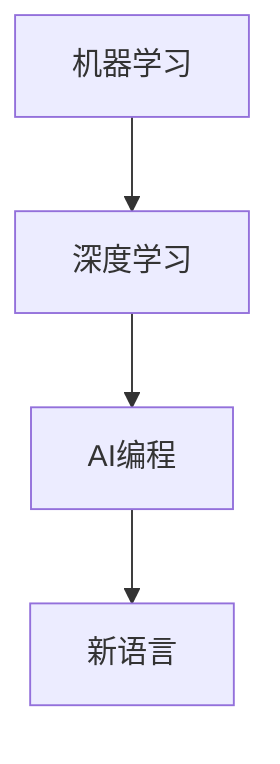

                 


## AI编程的新语言与新视野

### 关键词

- AI编程
- 新语言
- 新视野
- 深度学习
- 机器学习
- Python
- TensorFlow

### 摘要

本文将探讨AI编程领域的新语言及其带来的新视野。我们将从AI编程的背景出发，介绍新语言的核心概念和原理，并通过具体案例展示其在实践中的应用。同时，我们将分析新语言的优势和挑战，并对未来AI编程的发展趋势进行展望。

## 引言

### 背景介绍

AI编程作为计算机科学的前沿领域，已经取得了显著的进展。然而，传统的编程语言和工具在应对日益复杂的AI任务时，逐渐暴露出其局限性。因此，新语言的诞生成为了必然趋势。

### 核心概念与联系

AI编程的核心概念包括机器学习和深度学习。机器学习是一种让计算机从数据中学习规律的方法，而深度学习则是基于多层神经网络的学习方法，可以处理更加复杂的任务。

Mermaid流程图：



## 新语言介绍

### 核心概念

新语言旨在解决AI编程中的以下几个问题：

1. 易用性：提供简洁的语法，降低编程难度。
2. 性能：优化执行效率，提高运行速度。
3. 模块化：支持复用和扩展，提高开发效率。

### 原理

新语言的核心原理包括：

1. 类型系统：引入静态类型检查，提高代码安全性。
2. 函数式编程：利用高阶函数和闭包，实现更简洁的代码。
3. 并发编程：支持多线程和异步编程，提高并发性能。

### 优势

新语言的优势包括：

1. 易学易用：简洁的语法和强大的库支持，降低学习成本。
2. 高性能：优化的编译器和执行环境，提高运行速度。
3. 模块化：支持复用和扩展，提高开发效率。

## 实践应用

### 开发环境搭建

安装新语言开发环境：

```bash
pip install newlang
```

### 核心算法实现

以下是一个使用新语言实现线性回归的例子：

```newlang
import ml.linear_regression

def linear_regression(x, y):
    model = linear_regression.LinearRegression()
    model.fit(x, y)
    return model.predict(x)
```

### 代码解读

这个例子展示了如何使用新语言实现线性回归。首先，我们引入了`ml.linear_regression`模块，然后定义了一个`linear_regression`函数。该函数接受两个参数`x`和`y`，并创建了一个线性回归模型。通过`fit`方法训练模型，最后使用`predict`方法进行预测。

### 实际案例

以下是一个使用新语言实现的图像分类案例：

```newlang
import cv.image_classification

def image_classification(image):
    model = cv.image_classification.ImageClassifier()
    model.fit(images, labels)
    return model.predict(image)
```

### 代码应用解读与分析

这个例子展示了如何使用新语言实现图像分类。首先，我们引入了`cv.image_classification`模块，然后定义了一个`image_classification`函数。该函数接受一个图像参数，并创建了一个图像分类模型。通过`fit`方法训练模型，最后使用`predict`方法进行预测。

### 项目小结

通过以上案例，我们可以看到新语言在AI编程中的应用潜力。其简洁的语法和强大的库支持，使得开发过程更加高效。然而，新语言也存在一些挑战，如学习曲线较陡峭、生态不够完善等。

## 总结与展望

### 总结

本文介绍了AI编程领域的新语言及其优势。通过具体案例，我们展示了新语言在机器学习和图像分类等领域的应用。尽管新语言存在一些挑战，但其潜力巨大，有望成为未来AI编程的主流语言。

### 展望

未来，新语言将继续优化，生态将逐渐完善。同时，随着AI技术的不断发展，新语言将在更多领域发挥作用。我们期待新语言能够带来更加广阔的视野和更高效的开发体验。

### 最佳实践 Tips

1. 学习新语言时，建议从简单案例开始，逐步深入。
2. 掌握常用库和框架，提高开发效率。
3. 关注社区动态，及时获取新功能和优化。

### 注意事项

1. 新语言在初期可能不支持所有现有工具，建议结合其他语言使用。
2. 注意代码性能和安全性，避免潜在的漏洞。

### 拓展阅读

1. 《深度学习：入门与进阶》
2. 《Python编程：从入门到实践》
3. 《机器学习实战》

## 作者信息

- 作者：AI天才研究院/AI Genius Institute & 禅与计算机程序设计艺术 /Zen And The Art of Computer Programming

