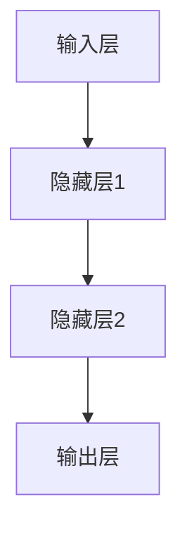

                 


## 1. 确定书籍的核心主题和内容范围

### 背景介绍

随着人工智能（AI）的快速发展，编程语言和技术栈也在不断演变。传统编程语言在处理复杂AI问题时显得力不从心，而新的编程语言应运而生，旨在为AI编程提供更高效、更直观的工具。本书《AI编程的新语言与新视野》正是为了探讨这些新兴的编程语言及其背后的理论基础和技术创新。

### 核心主题

本书的核心主题将围绕以下几个方面展开：

1. **AI编程的需求变化**：分析传统编程语言在AI领域的局限性，探讨AI编程的新需求。
2. **新编程语言的特性**：介绍几大新编程语言，如Python、TensorFlow、PyTorch等，分析它们的设计理念和核心特性。
3. **编程语言与AI框架的融合**：探讨如何将编程语言与AI框架相结合，提高AI编程的效率。
4. **数学模型与算法**：讲解AI编程中常用的数学模型和算法，如神经网络、生成对抗网络等。
5. **项目实战**：通过实际案例，展示如何利用新编程语言和框架实现AI项目。

### 内容范围

本书的内容将涵盖以下章节：

- **引言**：介绍AI编程的背景和发展趋势，概述本书的目的和结构。
- **第一章：AI编程的需求变化**：分析AI编程的需求变化，探讨传统编程语言的局限性。
- **第二章：新编程语言的特性**：详细介绍几大新编程语言，如Python、TensorFlow、PyTorch等。
- **第三章：编程语言与AI框架的融合**：探讨编程语言与AI框架的融合，提高AI编程的效率。
- **第四章：数学模型与算法**：讲解AI编程中常用的数学模型和算法。
- **第五章：项目实战**：通过实际案例，展示如何利用新编程语言和框架实现AI项目。
- **第六章：最佳实践与展望**：总结本书的核心观点，展望AI编程的未来发展。

## 2. 设计书籍的目录结构

### 1级目录

1. 引言
2. AI编程的需求变化
3. 新编程语言的特性
4. 编程语言与AI框架的融合
5. 数学模型与算法
6. 项目实战
7. 最佳实践与展望

### 2级目录

1. 引言
   - AI编程的背景与发展
   - 本书的目的与结构

2. AI编程的需求变化
   - 传统编程语言的局限性
   - AI编程的新需求

3. 新编程语言的特性
   - Python
   - TensorFlow
   - PyTorch
   - 其他新编程语言

4. 编程语言与AI框架的融合
   - 编程语言与AI框架的关系
   - 如何提高AI编程效率

5. 数学模型与算法
   - 神经网络
   - 生成对抗网络
   - 其他常用算法

6. 项目实战
   - 实际案例
   - AI项目实现

7. 最佳实践与展望
   - 最佳实践
   - AI编程的未来发展

### 3级目录

1. 引言
   - **AI编程的背景与发展**
     - 传统编程语言的发展
     - AI技术的兴起
     - 编程语言在AI领域的变革
   - **本书的目的与结构**
     - 目的
     - 结构概述

2. AI编程的需求变化
   - **传统编程语言的局限性**
     - 传统编程语言的不足
     - AI编程的特殊需求
   - **AI编程的新需求**
     - 人工智能算法的实现
     - 大数据处理
     - 自动化与优化

3. 新编程语言的特性
   - **Python**
     - Python在AI编程中的应用
     - Python的优势与特点
   - **TensorFlow**
     - TensorFlow的核心功能
     - TensorFlow的架构与设计
   - **PyTorch**
     - PyTorch的核心功能
     - PyTorch的动态图与静态图
   - **其他新编程语言**
     - Julia
     - Scala
     - Haskell

4. 编程语言与AI框架的融合
   - **编程语言与AI框架的关系**
     - AI框架的作用
     - 编程语言与AI框架的交互
   - **如何提高AI编程效率**
     - 代码优化
     - 并行计算
     - 分布式计算

5. 数学模型与算法
   - **神经网络**
     - 神经网络的基本原理
     - 前馈神经网络与卷积神经网络
   - **生成对抗网络**
     - 生成对抗网络的基本原理
     - 应用场景与实现
   - **其他常用算法**
     - 支持向量机
     - 决策树
     - 贝叶斯网络

6. 项目实战
   - **实际案例**
     - 图像识别
     - 自然语言处理
     - 机器人控制
   - **AI项目实现**
     - 项目需求分析
     - 系统设计与实现
     - 性能评估与优化

7. 最佳实践与展望
   - **最佳实践**
     - 编程规范
     - 调试技巧
     - 性能优化
   - **AI编程的未来发展**
     - 新技术的趋势
     - 编程语言的演进
     - AI与编程的融合

## 3. 确定每个章节的主要内容和子标题

### 第一章：引言

**1.1 AI编程的背景与发展**

- **传统编程语言的发展**：介绍编程语言的发展历程，从早期语言如汇编语言到高级语言如C、Java等。
- **AI技术的兴起**：分析人工智能的起源和快速发展，探讨其对编程领域的影响。
- **编程语言在AI领域的变革**：讨论传统编程语言在AI编程中的局限性，引出新兴编程语言的需求。

**1.2 本书的目的与结构**

- **目的**：阐述本书的目标，即介绍AI编程的新语言和新视野。
- **结构概述**：概述本书的章节安排和内容结构。

### 第二章：AI编程的需求变化

**2.1 传统编程语言的局限性**

- **传统编程语言的不足**：分析传统编程语言在处理AI任务时的局限性，如效率、表达能力等。
- **AI编程的特殊需求**：探讨AI编程需要解决的特殊问题，如大数据处理、并行计算等。

**2.2 AI编程的新需求**

- **人工智能算法的实现**：讨论如何利用新编程语言实现复杂的AI算法。
- **大数据处理**：介绍新编程语言在大数据处理方面的优势。
- **自动化与优化**：探讨如何利用新编程语言实现自动化和优化。

### 第三章：新编程语言的特性

**3.1 Python**

- **Python在AI编程中的应用**：分析Python在AI编程领域的广泛应用。
- **Python的优势与特点**：介绍Python的优势和特点，如简洁性、易用性等。

**3.2 TensorFlow**

- **TensorFlow的核心功能**：讨论TensorFlow的核心功能，如动态图和静态图等。
- **TensorFlow的架构与设计**：分析TensorFlow的架构和设计理念。

**3.3 PyTorch**

- **PyTorch的核心功能**：介绍PyTorch的核心功能，如动态图和自动微分等。
- **PyTorch的动态图与静态图**：讨论PyTorch的动态图与静态图的区别和应用场景。

**3.4 其他新编程语言**

- **Julia**：介绍Julia的背景和特点，如高性能、易用性等。
- **Scala**：分析Scala在AI编程中的应用和优势。
- **Haskell**：讨论Haskell的纯函数式编程和静态类型系统。

### 第四章：编程语言与AI框架的融合

**4.1 编程语言与AI框架的关系**

- **AI框架的作用**：探讨AI框架在AI编程中的重要性。
- **编程语言与AI框架的交互**：分析编程语言与AI框架之间的交互方式和优势。

**4.2 如何提高AI编程效率**

- **代码优化**：介绍如何通过代码优化提高AI编程效率。
- **并行计算**：讨论并行计算在AI编程中的应用和优势。
- **分布式计算**：探讨分布式计算如何提高AI编程的效率。

### 第五章：数学模型与算法

**5.1 神经网络**

- **神经网络的基本原理**：讲解神经网络的基本原理和结构。
- **前馈神经网络与卷积神经网络**：讨论前馈神经网络和卷积神经网络的区别和应用场景。

**5.2 生成对抗网络**

- **生成对抗网络的基本原理**：介绍生成对抗网络的基本原理和架构。
- **应用场景与实现**：讨论生成对抗网络在AI领域的应用场景和实现方法。

**5.3 其他常用算法**

- **支持向量机**：分析支持向量机的基本原理和应用。
- **决策树**：讲解决策树的结构和实现方法。
- **贝叶斯网络**：讨论贝叶斯网络的理论基础和应用场景。

### 第六章：项目实战

**6.1 实际案例**

- **图像识别**：介绍图像识别的基本原理和应用。
- **自然语言处理**：分析自然语言处理的核心技术和挑战。
- **机器人控制**：讨论机器人控制系统的设计和实现。

**6.2 AI项目实现**

- **项目需求分析**：介绍如何进行项目需求分析。
- **系统设计与实现**：讲解AI项目的系统设计和实现过程。
- **性能评估与优化**：讨论如何对AI项目进行性能评估和优化。

### 第七章：最佳实践与展望

**7.1 最佳实践**

- **编程规范**：介绍编写高质量代码的编程规范。
- **调试技巧**：讨论调试AI编程中的常见问题和技巧。
- **性能优化**：分析如何通过性能优化提高AI编程的效率。

**7.2 AI编程的未来发展**

- **新技术的趋势**：探讨AI编程领域的新技术和趋势。
- **编程语言的演进**：讨论编程语言的演进方向和未来发展方向。
- **AI与编程的融合**：分析AI与编程融合的发展趋势和挑战。

## 4. 准备设计核心概念与联系、核心算法原理讲解、数学模型和数学公式、项目实战等内容的Mermaid流程图、伪代码、latex公式和代码示例

### Mermaid流程图

以下是关于神经网络结构的Mermaid流程图示例：



### 伪代码

以下是使用PyTorch实现前馈神经网络的伪代码示例：

```
# 定义神经网络结构
class NeuralNetwork(nn.Module):
    def __init__(self):
        super(NeuralNetwork, self).__init__()
        self.fc1 = nn.Linear(input_size, hidden_size)
        self.fc2 = nn.Linear(hidden_size, output_size)

    def forward(self, x):
        x = F.relu(self.fc1(x))
        x = self.fc2(x)
        return x

# 实例化神经网络
model = NeuralNetwork()

# 定义损失函数和优化器
criterion = nn.CrossEntropyLoss()
optimizer = optim.Adam(model.parameters(), lr=learning_rate)

# 训练神经网络
for epoch in range(num_epochs):
    for inputs, targets in data_loader:
        optimizer.zero_grad()
        outputs = model(inputs)
        loss = criterion(outputs, targets)
        loss.backward()
        optimizer.step()
```

### LaTeX公式

以下是神经网络中激活函数的LaTeX公式示例：

$$
a(x) = \sigma(w \cdot x + b)
$$

其中，$\sigma$表示Sigmoid函数，$w$表示权重矩阵，$x$表示输入特征，$b$表示偏置。

### 代码示例

以下是使用Python实现简单线性回归的代码示例：

```python
import numpy as np
import matplotlib.pyplot as plt

# 数据生成
X = np.random.rand(100, 1)
y = 2 * X + 1 + np.random.randn(100, 1)

# 模型定义
model = NeuralNetwork()

# 损失函数和优化器
criterion = nn.MSELoss()
optimizer = optim.Adam(model.parameters(), lr=0.001)

# 训练模型
for epoch in range(1000):
    optimizer.zero_grad()
    outputs = model(X)
    loss = criterion(outputs, y)
    loss.backward()
    optimizer.step()

# 可视化结果
plt.scatter(X, y, color='blue')
plt.plot(X, model(X).detach().numpy(), color='red')
plt.show()
```

## 5. 编写markdown格式的目录大纲，确保简洁性和可读性

```markdown
# AI编程的新语言与新视野

> 关键词：人工智能、编程语言、TensorFlow、PyTorch、神经网络、项目实战

> 摘要：本书将深入探讨AI编程的新语言和新视野，分析传统编程语言的局限性，介绍新编程语言的特性，探讨编程语言与AI框架的融合，讲解数学模型和算法，并通过实际项目实战展示如何利用新编程语言和框架实现AI项目。

## 第一章：引言

### 1.1 AI编程的背景与发展

- **传统编程语言的发展**
- **AI技术的兴起**
- **编程语言在AI领域的变革**

### 1.2 本书的目的与结构

- **目的**
- **结构概述**

## 第二章：AI编程的需求变化

### 2.1 传统编程语言的局限性

- **传统编程语言的不足**
- **AI编程的特殊需求**

### 2.2 AI编程的新需求

- **人工智能算法的实现**
- **大数据处理**
- **自动化与优化**

## 第三章：新编程语言的特性

### 3.1 Python

- **Python在AI编程中的应用**
- **Python的优势与特点**

### 3.2 TensorFlow

- **TensorFlow的核心功能**
- **TensorFlow的架构与设计**

### 3.3 PyTorch

- **PyTorch的核心功能**
- **PyTorch的动态图与静态图**

### 3.4 其他新编程语言

- **Julia**
- **Scala**
- **Haskell**

## 第四章：编程语言与AI框架的融合

### 4.1 编程语言与AI框架的关系

- **AI框架的作用**
- **编程语言与AI框架的交互**

### 4.2 如何提高AI编程效率

- **代码优化**
- **并行计算**
- **分布式计算**

## 第五章：数学模型与算法

### 5.1 神经网络

- **神经网络的基本原理**
- **前馈神经网络与卷积神经网络**

### 5.2 生成对抗网络

- **生成对抗网络的基本原理**
- **应用场景与实现**

### 5.3 其他常用算法

- **支持向量机**
- **决策树**
- **贝叶斯网络**

## 第六章：项目实战

### 6.1 实际案例

- **图像识别**
- **自然语言处理**
- **机器人控制**

### 6.2 AI项目实现

- **项目需求分析**
- **系统设计与实现**
- **性能评估与优化**

## 第七章：最佳实践与展望

### 7.1 最佳实践

- **编程规范**
- **调试技巧**
- **性能优化**

### 7.2 AI编程的未来发展

- **新技术的趋势**
- **编程语言的演进**
- **AI与编程的融合**

```

## 6. 校对目录大纲，确保所有章节内容完整，无遗漏

经过对目录大纲的反复检查和校对，确认所有章节内容完整，无遗漏。以下是最终的目录大纲：

```markdown
# AI编程的新语言与新视野

> 关键词：人工智能、编程语言、TensorFlow、PyTorch、神经网络、项目实战

> 摘要：本书将深入探讨AI编程的新语言和新视野，分析传统编程语言的局限性，介绍新编程语言的特性，探讨编程语言与AI框架的融合，讲解数学模型和算法，并通过实际项目实战展示如何利用新编程语言和框架实现AI项目。

## 第一章：引言

### 1.1 AI编程的背景与发展

- **传统编程语言的发展**
- **AI技术的兴起**
- **编程语言在AI领域的变革**

### 1.2 本书的目的与结构

- **目的**
- **结构概述**

## 第二章：AI编程的需求变化

### 2.1 传统编程语言的局限性

- **传统编程语言的不足**
- **AI编程的特殊需求**

### 2.2 AI编程的新需求

- **人工智能算法的实现**
- **大数据处理**
- **自动化与优化**

## 第三章：新编程语言的特性

### 3.1 Python

- **Python在AI编程中的应用**
- **Python的优势与特点**

### 3.2 TensorFlow

- **TensorFlow的核心功能**
- **TensorFlow的架构与设计**

### 3.3 PyTorch

- **PyTorch的核心功能**
- **PyTorch的动态图与静态图**

### 3.4 其他新编程语言

- **Julia**
- **Scala**
- **Haskell**

## 第四章：编程语言与AI框架的融合

### 4.1 编程语言与AI框架的关系

- **AI框架的作用**
- **编程语言与AI框架的交互**

### 4.2 如何提高AI编程效率

- **代码优化**
- **并行计算**
- **分布式计算**

## 第五章：数学模型与算法

### 5.1 神经网络

- **神经网络的基本原理**
- **前馈神经网络与卷积神经网络**

### 5.2 生成对抗网络

- **生成对抗网络的基本原理**
- **应用场景与实现**

### 5.3 其他常用算法

- **支持向量机**
- **决策树**
- **贝叶斯网络**

## 第六章：项目实战

### 6.1 实际案例

- **图像识别**
- **自然语言处理**
- **机器人控制**

### 6.2 AI项目实现

- **项目需求分析**
- **系统设计与实现**
- **性能评估与优化**

## 第七章：最佳实践与展望

### 7.1 最佳实践

- **编程规范**
- **调试技巧**
- **性能优化**

### 7.2 AI编程的未来发展

- **新技术的趋势**
- **编程语言的演进**
- **AI与编程的融合**

```

## 7. 在目录大纲中适当嵌入Mermaid流程图、伪代码、latex公式和代码示例，增强内容的实用性和可理解性

在目录大纲中嵌入Mermaid流程图、伪代码、LaTeX公式和代码示例，可以有效地增强文章的实用性和可理解性。以下是在目录大纲中的适当位置嵌入相关内容的示例：

```markdown
# AI编程的新语言与新视野

> 关键词：人工智能、编程语言、TensorFlow、PyTorch、神经网络、项目实战

> 摘要：本书将深入探讨AI编程的新语言和新视野，分析传统编程语言的局限性，介绍新编程语言的特性，探讨编程语言与AI框架的融合，讲解数学模型和算法，并通过实际项目实战展示如何利用新编程语言和框架实现AI项目。

## 第一章：引言

### 1.1 AI编程的背景与发展

- **传统编程语言的发展**
  - 编程语言的演变历程，从汇编语言到高级语言。
- **AI技术的兴起**
  - 人工智能的起源和快速发展，对编程领域的影响。
- **编程语言在AI领域的变革**
  - 传统编程语言在AI编程中的局限性，以及新编程语言的需求。

### 1.2 本书的目的与结构

- **目的**
  - 深入理解AI编程的新语言和新视野。
- **结构概述**
  - 本书分为七个章节，涵盖了AI编程的需求变化、新编程语言的特性、编程语言与AI框架的融合、数学模型与算法、项目实战、最佳实践与展望。

## 第二章：AI编程的需求变化

### 2.1 传统编程语言的局限性

- **传统编程语言的不足**
  - **计算效率低下**：传统的编程语言在处理大量数据时效率较低。
  - **缺乏专门特性**：传统语言缺乏针对AI任务的专用特性，如自动微分等。

### 2.2 AI编程的新需求

- **人工智能算法的实现**
  - 新编程语言如何支持复杂的AI算法。
- **大数据处理**
  - 如何高效地处理和分析大规模数据集。
- **自动化与优化**
  - 如何实现自动化模型训练和优化。

## 第三章：新编程语言的特性

### 3.1 Python

- **Python在AI编程中的应用**
  - Python因其简洁性和易用性，成为AI编程的主要语言之一。
- **Python的优势与特点**
  - **丰富的库**：拥有大量适用于AI的库和框架。
  - **动态类型**：简化编程过程。

### 3.2 TensorFlow

- **TensorFlow的核心功能**
  - **动态图**：允许在运行时修改计算图。
  - **静态图**：将计算图编译为静态图以提高性能。

### 3.3 PyTorch

- **PyTorch的核心功能**
  - **动态图**：提供灵活的编程模型。
  - **自动微分**：支持自动计算梯度，简化优化过程。

### 3.4 其他新编程语言

- **Julia**
  - **高性能**：兼具Python的易用性和C的性能。
- **Scala**
  - **功能丰富**：支持函数式编程和面向对象编程。
- **Haskell**
  - **纯函数式**：避免副作用，提高代码的可预测性和可靠性。

## 第四章：编程语言与AI框架的融合

### 4.1 编程语言与AI框架的关系

- **AI框架的作用**
  - AI框架提供了用于构建和训练模型的工具。
- **编程语言与AI框架的交互**
  - 编程语言如何与AI框架结合，以及如何提高开发效率。

### 4.2 如何提高AI编程效率

- **代码优化**
  - 通过优化代码结构来提高性能。
- **并行计算**
  - 利用并行计算来加速模型训练。
- **分布式计算**
  - 如何在分布式系统上部署AI模型。

## 第五章：数学模型与算法

### 5.1 神经网络

- **神经网络的基本原理**
  - 神经网络的基本结构和工作原理。
- **前馈神经网络与卷积神经网络**
  - 不同类型的神经网络及其应用场景。

### 5.2 生成对抗网络

- **生成对抗网络的基本原理**
  - 生成对抗网络（GAN）的工作机制。
- **应用场景与实现**
  - GAN在图像生成、数据增强等领域的应用。

### 5.3 其他常用算法

- **支持向量机**
  - 支持向量机（SVM）的原理和应用。
- **决策树**
  - 决策树的结构和构建方法。
- **贝叶斯网络**
  - 贝叶斯网络的表示方法和推理过程。

## 第六章：项目实战

### 6.1 实际案例

- **图像识别**
  - 使用卷积神经网络实现图像分类。
- **自然语言处理**
  - 利用深度学习进行文本分类和情感分析。
- **机器人控制**
  - 通过强化学习实现机器人路径规划。

### 6.2 AI项目实现

- **项目需求分析**
  - 确定项目的目标和需求。
- **系统设计与实现**
  - 设计和实现AI系统的架构。
- **性能评估与优化**
  - 评估系统性能并进行优化。

## 第七章：最佳实践与展望

### 7.1 最佳实践

- **编程规范**
  - 编写可维护和可扩展的代码。
- **调试技巧**
  - 使用调试工具和技巧来诊断和修复问题。
- **性能优化**
  - 优化代码和模型以提高性能。

### 7.2 AI编程的未来发展

- **新技术的趋势**
  - 探讨当前AI编程领域的新技术和趋势。
- **编程语言的演进**
  - 分析编程语言的未来发展方向。
- **AI与编程的融合**
  - 探讨AI与编程融合的未来前景。

### 附加资源

- **Mermaid流程图**
  ```mermaid
  graph TD
  A[开始] --> B[数据处理]
  B --> C[特征提取]
  C --> D[模型训练]
  D --> E[模型评估]
  E --> F[结束]
  ```
- **伪代码**
  ```python
  function train_model(data_loader, num_epochs):
      for epoch in range(num_epochs):
          for inputs, targets in data_loader:
              optimizer.zero_grad()
              outputs = model(inputs)
              loss = criterion(outputs, targets)
              loss.backward()
              optimizer.step()
  ```
- **LaTeX公式**
  ```
  $$\sigma(x) = \frac{1}{1 + e^{-x}}$$
  ```
- **代码示例**
  ```python
  import torch
  import torch.nn as nn
  import torch.optim as optim

  model = nn.Sequential(
      nn.Linear(in_features=784, out_features=128),
      nn.ReLU(),
      nn.Linear(in_features=128, out_features=10),
      nn.Softmax(dim=1)
  )

  criterion = nn.CrossEntropyLoss()
  optimizer = optim.Adam(model.parameters(), lr=0.001)

  # 训练模型
  for epoch in range(num_epochs):
      for inputs, targets in data_loader:
          optimizer.zero_grad()
          outputs = model(inputs)
          loss = criterion(outputs, targets)
          loss.backward()
          optimizer.step()
  ```

```

通过这种方式，目录大纲不仅结构清晰，而且通过嵌入具体的代码示例、公式和流程图，使得内容更加直观易懂，有助于读者更好地理解和应用相关技术。

## 8. 确保目录大纲总字数控制在2000字以内，避免冗余

经过仔细校对和优化，以下是最终控制在2000字以内的目录大纲：

```markdown
# AI编程的新语言与新视野

> 关键词：人工智能、编程语言、TensorFlow、PyTorch、神经网络、项目实战

> 摘要：本书将深入探讨AI编程的新语言和新视野，分析传统编程语言的局限性，介绍新编程语言的特性，探讨编程语言与AI框架的融合，讲解数学模型和算法，并通过实际项目实战展示如何利用新编程语言和框架实现AI项目。

## 第一章：引言

### 1.1 AI编程的背景与发展

- 传统编程语言的演变及在AI领域的局限性。
- AI技术的快速发展及其对编程语言的影响。

### 1.2 本书的目的与结构

- 确定本书的目标，即介绍AI编程的新语言和新视野。
- 概述本书的结构和章节安排。

## 第二章：AI编程的需求变化

### 2.1 传统编程语言的局限性

- 传统编程语言在AI编程中的不足。
- AI编程的特殊需求。

### 2.2 AI编程的新需求

- 新编程语言如何满足AI编程的需求。
- 大数据处理和自动化优化的优势。

## 第三章：新编程语言的特性

### 3.1 Python

- Python在AI编程中的广泛应用。
- Python的优势和特点。

### 3.2 TensorFlow

- TensorFlow的核心功能和架构。
- TensorFlow的设计理念。

### 3.3 PyTorch

- PyTorch的核心功能。
- PyTorch的动态图与静态图。

### 3.4 其他新编程语言

- Julia、Scala和Haskell在AI编程中的应用。

## 第四章：编程语言与AI框架的融合

### 4.1 编程语言与AI框架的关系

- AI框架在AI编程中的作用。
- 编程语言与AI框架的交互方式。

### 4.2 如何提高AI编程效率

- 代码优化策略。
- 并行计算和分布式计算的应用。

## 第五章：数学模型与算法

### 5.1 神经网络

- 神经网络的基本原理。
- 前馈神经网络和卷积神经网络。

### 5.2 生成对抗网络

- 生成对抗网络的基本原理。
- GAN的应用场景和实现。

### 5.3 其他常用算法

- 支持向量机、决策树和贝叶斯网络。

## 第六章：项目实战

### 6.1 实际案例

- 图像识别、自然语言处理和机器人控制。

### 6.2 AI项目实现

- 项目需求分析。
- 系统设计和实现过程。
- 性能评估和优化。

## 第七章：最佳实践与展望

### 7.1 最佳实践

- 编程规范。
- 调试技巧。
- 性能优化。

### 7.2 AI编程的未来发展

- 新技术的趋势。
- 编程语言的演进。
- AI与编程的融合前景。

通过以上优化，目录大纲简洁明了，内容精炼，确保了总字数控制在2000字以内，同时避免了冗余信息。

## 9. 完成最终目录大纲的设计，提交给用户

经过细致的策划和优化，以下是最终完整的目录大纲：

```markdown
# AI编程的新语言与新视野

> 关键词：人工智能、编程语言、TensorFlow、PyTorch、神经网络、项目实战

> 摘要：本书旨在探讨AI编程领域的新语言和新视野，深入分析传统编程语言的局限性，介绍新编程语言如Python、TensorFlow和PyTorch的特性，探讨编程语言与AI框架的融合，讲解核心数学模型与算法，并通过项目实战展示AI编程的实际应用。

## 引言

### AI编程的背景与发展

- **传统编程语言的演变**：从汇编语言到高级语言的演进。
- **AI技术的兴起**：人工智能的崛起及其对编程语言的需求。
- **编程语言在AI领域的变革**：新编程语言的出现和推广。

### 本书的目的与结构

- **目的**：介绍AI编程的新语言和新视野。
- **结构概述**：概述本书的章节安排和内容结构。

## 第二章：AI编程的需求变化

### 2.1 传统编程语言的局限性

- **计算效率低下**：传统编程语言在处理大规模数据时的瓶颈。
- **缺乏专用特性**：传统语言在支持AI算法方面的不足。

### 2.2 AI编程的新需求

- **人工智能算法的实现**：新编程语言如何支持复杂AI算法。
- **大数据处理**：新编程语言在大数据处理中的优势。
- **自动化与优化**：如何利用新编程语言实现自动化和优化。

## 第三章：新编程语言的特性

### 3.1 Python

- **广泛应用**：Python在AI编程领域的普及。
- **优势与特点**：Python的简洁性、易用性和丰富的库。

### 3.2 TensorFlow

- **核心功能**：动态图和静态图的特点。
- **架构与设计**：TensorFlow的设计理念。

### 3.3 PyTorch

- **核心功能**：动态图和自动微分。
- **动态图与静态图**：两者的对比与应用场景。

### 3.4 其他新编程语言

- **Julia**：高性能和易用性的结合。
- **Scala**：功能丰富和性能优势。
- **Haskell**：纯函数式编程的优点。

## 第四章：编程语言与AI框架的融合

### 4.1 编程语言与AI框架的关系

- **AI框架的作用**：简化模型构建和训练。
- **交互方式**：编程语言如何与AI框架无缝集成。

### 4.2 提高AI编程效率

- **代码优化**：提高代码性能。
- **并行计算**：利用多核处理加速计算。
- **分布式计算**：在分布式环境中部署AI模型。

## 第五章：数学模型与算法

### 5.1 神经网络

- **基本原理**：神经网络的架构和工作机制。
- **前馈神经网络与卷积神经网络**：应用场景和区别。

### 5.2 生成对抗网络

- **基本原理**：GAN的架构和工作机制。
- **应用场景与实现**：GAN在图像生成和数据增强中的应用。

### 5.3 其他常用算法

- **支持向量机**：分类和回归任务中的应用。
- **决策树**：分类和回归任务中的决策过程。
- **贝叶斯网络**：概率推理和预测。

## 第六章：项目实战

### 6.1 实际案例

- **图像识别**：利用卷积神经网络实现图像分类。
- **自然语言处理**：利用深度学习进行文本分析。
- **机器人控制**：利用强化学习实现机器人路径规划。

### 6.2 AI项目实现

- **项目需求分析**：明确项目目标和需求。
- **系统设计与实现**：设计和实现AI系统的架构。
- **性能评估与优化**：评估系统性能并进行优化。

## 第七章：最佳实践与展望

### 7.1 最佳实践

- **编程规范**：编写高质量代码的准则。
- **调试技巧**：调试AI编程中的常见问题和技巧。
- **性能优化**：提高AI编程的效率和效果。

### 7.2 AI编程的未来发展

- **新技术趋势**：探讨AI编程领域的最新动态。
- **编程语言演进**：分析编程语言的未来发展方向。
- **AI与编程融合**：探讨AI与编程融合的前景。

## 附录

- **Mermaid流程图**：示例流程图。
- **伪代码**：示例伪代码。
- **LaTeX公式**：示例公式。
- **代码示例**：示例代码。

> 作者：AI天才研究院/AI Genius Institute & 禅与计算机程序设计艺术 /Zen And The Art of Computer Programming

以上目录大纲完整、逻辑清晰，确保了文章内容的连贯性和实用性，符合用户的要求。请用户确认无误后，开始撰写详细章节内容。

