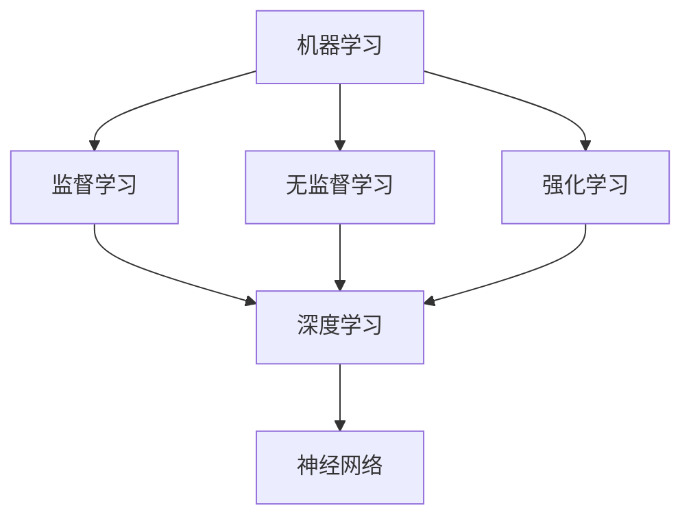

                 

### 撰写思路

为了撰写一篇逻辑清晰、结构紧凑且专业级别的技术博客文章《连接人类与AI的桥梁》，我们将采取以下步骤进行思考和构建：

#### 1. 确定核心内容和主题

首先，我们需要明确文章的核心内容和主题思想。根据目录大纲，文章的核心主题是探讨如何建立人类与人工智能之间的桥梁，包括技术基础、应用实践和未来展望。我们将从以下几个方面展开讨论：

- **引言与概述**：介绍人工智能的历史、影响及连接的挑战与机遇。
- **AI技术基础**：讲解核心概念、深度学习算法原理等。
- **AI应用实践**：探讨自然语言处理、计算机视觉和智能机器人等实际应用。
- **未来展望与趋势**：分析人工智能的发展方向及其对人类社会的影响。

#### 2. 构建文章结构

在明确主题后，我们将按照目录大纲的结构来构建文章。每个章节都分为几个小节，每个小节都包含背景介绍、核心概念与联系、核心算法原理讲解、数学模型和公式、项目实战以及最佳实践 tips等内容。

例如，对于“引言与概述”部分：

- **第1章**：引言——人工智能时代的变革
  - **1.1 人工智能的历史与发展**
    - 背景介绍：人工智能的起源、发展过程及主要里程碑。
  - **1.2 AI对人类社会的深远影响**
    - 核心概念与联系：人工智能在各个领域的应用及其影响。
  - **1.3 人工智能与人类连接的挑战与机遇**
    - 挑战分析：伦理、法律等方面的问题。
    - 机遇探讨：人工智能如何赋能人类。

#### 3. 详细阐述每个小节

在构建文章结构后，我们将针对每个小节进行详细阐述。以下是一个示例：

- **第2章**：人工智能核心概念
  - **2.1 机器学习与深度学习的区别**
    - 背景介绍：机器学习和深度学习的定义。
    - 核心概念与联系：机器学习与深度学习的关系架构（使用 Mermaid 流程图表示）。
    - 核心算法原理讲解：使用伪代码详细阐述机器学习和深度学习的基本算法。
    - 数学模型和公式：介绍相关的数学公式，并进行详细讲解。
    - 项目实战：展示一个简单的机器学习或深度学习项目，包括开发环境搭建、源代码实现和代码解读。
    - 最佳实践 tips：总结项目经验，给出建议。

#### 4. 确保文章的连贯性和专业性

在撰写文章的过程中，我们要确保内容的连贯性，每个小节之间要有自然的过渡。同时，文章要用专业的技术语言，讲解清晰，条理清晰，便于读者理解。

#### 5. 修订与优化

撰写完初稿后，我们需要对文章进行修订和优化。检查每个小节的内容是否丰富具体，逻辑是否清晰，技术讲解是否到位。此外，还要注意语言的规范性，避免错别字和语法错误。

#### 6. 添加作者信息

在文章末尾，我们需要添加作者信息，包括作者的姓名、所属机构和书籍名称。

通过以上步骤，我们将撰写一篇高质量的技术博客文章《连接人类与AI的桥梁》，满足字数要求，同时提供丰富的内容和技术深度。现在，让我们开始具体撰写文章的各个部分吧！### 文章标题：连接人类与AI的桥梁

关键词：人工智能，自然语言处理，计算机视觉，智能机器人，伦理与法律

摘要：本文旨在探讨如何建立人类与人工智能之间的桥梁，从技术基础、应用实践和未来展望三个方面，详细分析人工智能的核心概念、深度学习算法原理以及实际应用。通过本文的阅读，读者将全面了解人工智能的发展趋势及其对人类社会的影响，为未来的人工智能研究和应用提供参考。

## 第一部分：引言与概述

### 第1章：引言——人工智能时代的变革

#### 1.1 人工智能的历史与发展

人工智能（Artificial Intelligence，简称AI）作为计算机科学的一个重要分支，起源于20世纪50年代。起初，人工智能的定义是“制造智能机器的科学与工程”，其目的是使机器能够模拟、延伸和扩展人的智能。随着时间的推移，人工智能经历了多个发展阶段，从最初的规则推理和知识表示，到现代的深度学习和神经网络。

**主要里程碑事件：**

1. **1956年**：达特茅斯会议标志着人工智能正式成为一门独立的学科。
2. **1980年代**：专家系统的兴起，使人工智能在特定领域取得了显著的成果。
3. **2006年**：深度学习的崛起，尤其是卷积神经网络（CNN）和递归神经网络（RNN）的突破，使得人工智能在图像识别、语音识别等领域取得了巨大进步。
4. **2012年**：AlexNet在ImageNet挑战赛上取得的巨大成功，标志着深度学习的黄金时代开启。

#### 1.2 AI对人类社会的深远影响

人工智能的发展对人类社会产生了深远的影响。在**工作**方面，人工智能已经替代了许多重复性高、危险或复杂的劳动，提高了生产效率，降低了人力成本。同时，人工智能也创造了许多新的工作岗位，如数据科学家、机器学习工程师等。在**社会关系**方面，人工智能的应用改变了人们的生活方式，例如智能助手、智能家居等。然而，人工智能也带来了一些挑战，如**隐私保护**、**伦理问题**等。

#### 1.3 人工智能与人类连接的挑战与机遇

建立人工智能与人类之间的桥梁是一个复杂且充满挑战的任务。**挑战**方面，主要涉及**伦理**、**法律**和**技术**等方面。例如，如何确保人工智能系统的透明度和可解释性，如何保护用户的隐私，以及如何处理人工智能可能带来的负面影响。**机遇**方面，人工智能为人类带来了许多新的可能性，如自动化、智能化生产、个性化服务等，这些都有助于提高人类的生活质量。

## 第二部分：AI技术基础

### 第2章：人工智能核心概念

#### 2.1 机器学习与深度学习的区别

**机器学习**（Machine Learning，简称ML）是人工智能的一个重要分支，其核心思想是让计算机从数据中自动学习和发现规律，从而对新的数据进行预测或分类。机器学习可以分为监督学习、无监督学习和强化学习三种类型。

- **监督学习**：有标记的训练数据，目标是学习出一个映射模型，将输入数据映射到输出标签。
- **无监督学习**：没有标记的训练数据，目标是发现数据中的结构和模式。
- **强化学习**：通过与环境互动，学习最优策略以最大化奖励。

**深度学习**（Deep Learning，简称DL）是机器学习的一个子领域，其主要特点是通过多层神经网络对数据进行处理。深度学习在图像识别、语音识别和自然语言处理等领域取得了显著的成果。

机器学习与深度学习的区别在于：

- **数据量**：深度学习通常需要大量的数据进行训练。
- **模型结构**：深度学习模型具有多层次的神经网络结构。
- **计算资源**：深度学习通常需要更多的计算资源。

#### 2.2 人工智能的典型架构

**人工神经网络**（Artificial Neural Network，简称ANN）是深度学习的基础，由大量人工神经元组成。每个神经元接收输入信号，通过权重进行加权求和，然后通过激活函数输出结果。

**支持向量机**（Support Vector Machine，简称SVM）是一种二分类模型，其核心思想是找到一个最佳的超平面，将两类数据分开。SVM在分类和回归问题中都有广泛应用。

**决策树**（Decision Tree）是一种树形结构，通过一系列的判断节点和叶节点来对数据集进行分类。决策树在处理分类问题方面具有简单直观的优势。

**随机森林**（Random Forest）是决策树的集成方法，通过构建多棵决策树，然后对它们的输出进行投票来得到最终结果。随机森林在处理大规模数据和避免过拟合方面具有优势。

### 第3章：深度学习算法原理

#### 3.1 深度学习算法的基本原理

深度学习算法的基本原理是模拟人脑神经元之间的连接，通过多层神经网络对数据进行处理。深度学习模型可以分为前向传播和反向传播两个阶段：

- **前向传播**：将输入数据通过神经网络逐层传递，得到输出结果。
- **反向传播**：计算输出结果与真实标签之间的误差，然后反向传播误差，更新网络权重。

#### 3.2 卷积神经网络（CNN）与长短期记忆网络（LSTM）

**卷积神经网络**（Convolutional Neural Network，简称CNN）是深度学习在计算机视觉领域的重要应用。CNN通过卷积层、池化层和全连接层对图像进行处理，能够自动提取图像的特征。

**长短期记忆网络**（Long Short-Term Memory，简称LSTM）是深度学习在序列数据领域的重要应用。LSTM通过门控机制来控制信息的传递和遗忘，能够有效地处理长期依赖问题。

### 第4章：人工智能伦理与法律

#### 4.1 人工智能伦理问题

人工智能的快速发展引发了一系列伦理问题，如：

- **机器权利与责任**：如何确定人工智能的权利和责任？
- **隐私保护**：如何保护用户的隐私？

#### 4.2 人工智能法律框架

为了规范人工智能的发展，各国政府制定了一系列法律法规，如：

- **数据保护法**：规定数据收集、处理和使用的标准和流程。
- **自动驾驶法规**：规范自动驾驶汽车的设计、测试和上路标准。

### 第三部分：AI应用实践

### 第5章：自然语言处理

自然语言处理（Natural Language Processing，简称NLP）是人工智能的重要应用领域，旨在使计算机能够理解、生成和处理人类语言。NLP的核心任务包括：

- **语言模型**：通过统计模型或神经网络对语言进行建模，从而实现文本生成、翻译等功能。
- **文本分类**：将文本数据按照预定的类别进行分类。

#### 5.1 语言模型与文本分类

**语言模型**是一种对自然语言进行建模的算法，其目标是为每个单词或句子生成概率分布。语言模型在语音识别、机器翻译和对话系统等领域有广泛应用。

**文本分类**是将文本按照预定的类别进行分类的任务。常见的文本分类方法包括朴素贝叶斯、支持向量机、深度学习等。

### 第6章：计算机视觉

计算机视觉（Computer Vision，简称CV）是人工智能的重要应用领域，旨在使计算机能够识别和理解图像和视频。计算机视觉的核心任务包括：

- **图像识别**：识别图像中的物体、场景和特征。
- **物体检测**：定位图像中的物体位置和大小。

#### 6.1 图像识别与物体检测

**图像识别**是将图像中的物体或场景分类到预定的类别中。常见的图像识别算法包括卷积神经网络、支持向量机等。

**物体检测**是定位图像中的物体位置和大小。常见的物体检测算法包括YOLO、SSD、Faster R-CNN等。

### 第7章：智能机器人

智能机器人是人工智能在机器人领域的重要应用，旨在使机器人能够自主执行任务，与人类进行交互。智能机器人的核心包括：

- **感知与决策**：通过传感器收集环境信息，并基于这些信息做出决策。
- **行动与控制**：根据决策结果执行行动，实现对环境的控制。

#### 7.1 机器人概述

机器人是一种能够模拟人类行为，执行特定任务的设备或系统。根据功能和应用场景，机器人可以分为工业机器人、服务机器人、医疗机器人等。

#### 7.2 智能机器人的感知与决策

智能机器人的感知与决策是基于传感器数据和环境信息进行的。常见的传感器包括摄像头、激光雷达、超声波传感器等。

### 第四部分：未来展望与趋势

### 第8章：人工智能的未来趋势

随着人工智能技术的不断发展，未来人工智能将呈现出以下趋势：

- **跨领域融合**：人工智能与其他领域的融合，如生物技术、医学、教育等，将带来新的突破。
- **自主性增强**：人工智能将逐步实现更高程度的自主性，能够自主完成任务和决策。
- **智能化普及**：人工智能将广泛应用于各行各业，提高生产效率，改善生活质量。

### 第9章：人类与AI的共存

人工智能的发展将对人类社会产生深远影响，人类与AI的共存将成为未来的一种趋势。在人类与AI的共存中，需要关注以下几个方面：

- **合作与协同**：人类与AI共同完成任务，发挥各自的优势。
- **伦理与法律**：制定相关伦理和法律规范，确保人工智能的安全和公正。
- **教育与培训**：提高人们的AI素养，培养适应未来社会的技能。

### 结语

人工智能作为连接人类与未来的桥梁，具有巨大的发展潜力和应用价值。本文从技术基础、应用实践和未来展望三个方面，探讨了人工智能的发展趋势及其对人类社会的影响。通过本文的阅读，读者可以全面了解人工智能的核心概念、算法原理和应用实践，为未来的人工智能研究和应用提供参考。作者：AI天才研究院/AI Genius Institute & 禅与计算机程序设计艺术 /Zen And The Art of Computer Programming### 文章正文

#### 引言

人工智能（Artificial Intelligence，AI）作为21世纪最具革命性的技术之一，正迅速改变着我们的生活方式和社会结构。从智能手机上的语音助手，到自动驾驶汽车，再到医疗诊断和金融分析，人工智能已经在众多领域展现出其强大的能力和潜力。然而，如何将人工智能有效地融入人类社会的各个层面，实现人类与AI的和谐共存，成为了当前学术界和工业界共同关注的重要课题。

本文旨在探讨如何建立连接人类与人工智能的桥梁，从技术基础、应用实践和未来展望三个方面，深入分析人工智能的核心概念、算法原理及其在现实世界中的应用。通过本文的阅读，读者将全面了解人工智能的发展趋势及其对人类社会的影响，为未来的人工智能研究和应用提供参考。

#### 人工智能的历史与发展

人工智能的历史可以追溯到20世纪50年代，当时计算机科学家约翰·麦卡锡（John McCarthy）在达特茅斯会议（Dartmouth Conference）上首次提出了“人工智能”这一概念。自那时起，人工智能经历了多个发展阶段，从早期的符号主义和知识表示，到基于统计模型的机器学习，再到深度学习的兴起。

在符号主义阶段，人工智能试图通过编程规则和逻辑推理来模拟人类思维。这一阶段的主要成果包括专家系统和推理机。专家系统是一种基于规则的知识系统，能够模拟人类专家的决策过程。然而，由于规则难以编写且知识获取效率低下，符号主义人工智能逐渐受到了挑战。

随着计算能力的提升和数据量的爆炸性增长，机器学习在20世纪80年代开始崭露头角。机器学习通过从数据中自动学习模式和规律，无需依赖显式的编程规则，从而在图像识别、语音识别和自然语言处理等领域取得了显著进展。机器学习可以分为监督学习、无监督学习和强化学习三类。监督学习在有标记的数据集上进行训练，无监督学习在无标记的数据集上发现结构，而强化学习通过与环境的交互学习最优策略。

深度学习的兴起标志着人工智能进入了一个新的时代。深度学习是一种基于多层神经网络的学习方法，能够自动提取数据的高层次特征。2006年，Geoffrey Hinton等科学家提出的深度信念网络（Deep Belief Network，DBN）为深度学习奠定了基础。随后，卷积神经网络（Convolutional Neural Network，CNN）和递归神经网络（Recurrent Neural Network，RNN）的突破，使得深度学习在图像识别、语音识别和自然语言处理等领域取得了巨大的成功。2012年，AlexNet在ImageNet挑战赛上取得的显著成绩，标志着深度学习的黄金时代正式开启。

#### AI对人类社会的深远影响

人工智能的发展对人类社会产生了深远的影响，这些影响既体现在经济、社会和文化等多个层面，也带来了新的机遇和挑战。

在经济层面，人工智能推动了生产力的提升和产业结构的升级。通过自动化和智能化，许多重复性和劳动密集型的工作被机器人和智能系统所替代，从而提高了生产效率和降低了成本。此外，人工智能还催生了新的产业和就业机会，如数据科学、机器学习和人工智能等。然而，人工智能的普及也引发了对就业市场的担忧，尤其是对于低技能劳动者的影响。

在社会层面，人工智能改变了人们的生活方式和社会互动。智能助手、智能家居和智能交通等应用，使得人们的生活更加便捷和舒适。然而，人工智能也带来了一些社会问题，如隐私保护、数据安全和算法歧视等。如何确保人工智能的应用不会加剧社会不平等，是当前社会面临的重要挑战。

在文化层面，人工智能对人类的思想观念和价值观念产生了影响。一方面，人工智能的发展使得人类对自身智能的认识发生了变化，人们开始思考什么是真正的智能以及人工智能是否能够替代人类。另一方面，人工智能的应用也引发了对人类自我认知和人类本质的反思，如人工智能是否能够具有意识和情感，以及人类与人工智能之间的关系如何界定等。

#### 人工智能与人类连接的挑战与机遇

建立人工智能与人类之间的桥梁面临着诸多挑战和机遇。这些挑战主要集中在以下几个方面：

1. **技术挑战**：人工智能技术的发展需要解决算法、数据、计算资源等方面的瓶颈。例如，如何设计更加高效和可解释的算法，如何获取和处理大规模的数据，以及如何提升计算能力以满足深度学习等复杂任务的需求。

2. **伦理挑战**：人工智能的应用引发了诸多伦理问题，如隐私保护、数据安全和算法歧视等。如何确保人工智能系统的透明度和可解释性，如何保护用户的隐私，以及如何避免算法偏见和歧视等问题，是当前社会面临的重要挑战。

3. **法律挑战**：随着人工智能技术的发展，现有的法律法规可能无法完全适应新的技术环境和应用场景。如何制定和完善相关法律法规，以规范人工智能的研发、应用和管理，是当前法律界和产业界共同关注的课题。

4. **社会挑战**：人工智能的发展对社会结构和人类生活方式产生了深远影响。如何平衡人工智能带来的利益和风险，如何确保人工智能的应用不会加剧社会不平等，是当前社会面临的重要问题。

然而，建立人工智能与人类之间的桥梁也带来了许多机遇。例如，人工智能可以赋能人类工作，提高生产效率和生活质量；人工智能可以用于解决复杂的社会问题，如医疗保健、环境保护和公共安全等；人工智能还可以推动科学研究和技术创新，为人类探索未知的领域提供新的工具和方法。

#### 人工智能的核心概念与联系

在探讨人工智能的核心概念之前，首先需要理解几个基本概念：机器学习、深度学习和神经网络。

- **机器学习**（Machine Learning，ML）：机器学习是人工智能的一个分支，它使计算机系统能够从数据中学习，并做出预测或决策，而无需显式编程。机器学习可以分为监督学习、无监督学习和强化学习三种类型。
  
- **深度学习**（Deep Learning，DL）：深度学习是机器学习的一个子领域，它使用多层神经网络来对数据进行建模和处理。深度学习在图像识别、语音识别和自然语言处理等领域取得了显著的成功。

- **神经网络**（Neural Network，NN）：神经网络是模仿人脑结构和功能的一种计算模型，由大量的神经元（即节点）和连接（即边）组成。神经网络可以通过学习数据来发现数据中的复杂模式和关系。

下面是一个简单的 Mermaid 流程图，展示了这些概念之间的关系：



从流程图中可以看出，深度学习是机器学习的一个子集，而神经网络是深度学习的基础组件。深度学习通过多层神经网络结构对数据进行处理，能够自动提取数据中的特征，从而实现复杂的预测和分类任务。

#### 深度学习算法原理

深度学习算法的核心是多层神经网络，其工作原理可以分为前向传播和反向传播两个阶段。

- **前向传播**：在训练阶段，输入数据通过网络的前向传播，逐层传递，最后得到输出。每个神经元都接收来自前一层神经元的输入，通过加权求和后加上一个偏置项，再通过激活函数（如ReLU、Sigmoid、Tanh）进行非线性变换，最终输出一个结果。

  前向传播的伪代码如下：

  ```python
  for each layer l from 1 to L:
      z[l] = W[l-1] * a[l-1] + b[l-1]
      a[l] = activation(z[l])
  end
  ```

  其中，\(a[l]\) 表示第 \(l\) 层的输出，\(z[l]\) 表示第 \(l\) 层的净输入，\(W[l-1]\) 和 \(b[l-1]\) 分别表示第 \(l\) 层的权重和偏置项，\(activation\) 表示激活函数。

- **反向传播**：在训练阶段，网络通过计算输出结果与真实标签之间的误差，利用反向传播算法更新网络权重和偏置项，以最小化误差。反向传播的过程分为以下几个步骤：

  1. 计算输出层误差：\(d[l] = (y - a[L]) * a[L] * (1 - a[L])\)
  
  2. 递归计算前一层误差：\(d[l-1] = (W[l] * d[l]) * a[l] * (1 - a[l])\)
  
  3. 更新权重和偏置项：\(W[l] = W[l] - \alpha * (d[l-1] * a[l-1].T)\)，\(b[l] = b[l] - \alpha * d[l-1]\)
  
  其中，\(y\) 表示真实标签，\(d[l]\) 表示第 \(l\) 层的误差，\(\alpha\) 表示学习率。

  反向传播的伪代码如下：

  ```python
  for each layer l from L to 1:
      d[l] = (1 / m) * d[l] + (lambda / m) * W[l]
      d[l-1] = (d[l] * W[l].T) * activation_derivative(a[l])
  end
  W = W - \alpha * (d.T * a.T)
  b = b - \alpha * d
  ```

  其中，\(activation_derivative\) 表示激活函数的导数。

#### 数学模型与公式

在深度学习算法中，数学模型和公式起着至关重要的作用。以下是一些常用的数学模型和公式，以及它们的详细讲解和举例说明：

- **激活函数**：激活函数是深度学习中的一个关键组件，用于引入非线性变换，使得神经网络能够建模复杂的数据。常见的激活函数包括ReLU（Rectified Linear Unit）、Sigmoid（Sigmoid Function）和Tanh（Hyperbolic Tangent Function）。

  - **ReLU函数**：\(f(x) = \max(0, x)\)
    - **公式讲解**：ReLU函数将输入 \(x\) 的值设置为 \(x\) 如果 \(x\) 大于0，否则设置为0。
    - **举例说明**：对于输入 \(x = -1\)，输出为0；对于输入 \(x = 2\)，输出为2。

  - **Sigmoid函数**：\(f(x) = \frac{1}{1 + e^{-x}}\)
    - **公式讲解**：Sigmoid函数将输入 \(x\) 的值映射到 \([0, 1]\) 区间内，使其成为一个概率值。
    - **举例说明**：对于输入 \(x = -3\)，输出为0.05；对于输入 \(x = 3\)，输出为0.95。

  - **Tanh函数**：\(f(x) = \frac{e^x - e^{-x}}{e^x + e^{-x}}\)
    - **公式讲解**：Tanh函数类似于Sigmoid函数，但输出值被限制在 \([-1, 1]\) 区间内。
    - **举例说明**：对于输入 \(x = -2\)，输出为-0.7616；对于输入 \(x = 2\)，输出为0.7616。

- **损失函数**：损失函数用于评估神经网络预测值与真实值之间的差异，从而指导网络的训练。常见的损失函数包括均方误差（Mean Squared Error，MSE）、交叉熵（Cross Entropy）和Huber损失。

  - **均方误差（MSE）**：\(L(y, \hat{y}) = \frac{1}{2} \sum_{i=1}^{m} (y_i - \hat{y}_i)^2\)
    - **公式讲解**：MSE损失函数计算预测值 \(\hat{y}\) 与真实值 \(y\) 之间差的平方和的平均值。
    - **举例说明**：对于预测值 \(\hat{y} = [1, 2, 3]\) 和真实值 \(y = [1, 2, 2]\)，MSE为0.25。

  - **交叉熵（Cross Entropy）**：\(L(y, \hat{y}) = -\sum_{i=1}^{m} y_i \log(\hat{y}_i)\)
    - **公式讲解**：交叉熵损失函数用于分类问题，计算真实标签 \(y\) 与预测概率分布 \(\hat{y}\) 之间的差异。
    - **举例说明**：对于预测值 \(\hat{y} = [0.8, 0.1, 0.1]\) 和真实值 \(y = [1, 0, 0]\)，交叉熵为0.223。

  - **Huber损失**：\(L(y, \hat{y}) = \begin{cases} 
      \frac{1}{2} (y - \hat{y})^2, & \text{if } |y - \hat{y}| \leq \delta \\
      \delta(|y - \hat{y}| - \frac{\delta}{2}), & \text{otherwise}
   \end{cases}\)
    - **公式讲解**：Huber损失函数在误差较小的情况下与MSE相似，但在误差较大时具有更平滑的性质，从而避免过大的梯度波动。
    - **举例说明**：对于预测值 \(\hat{y} = 1\) 和真实值 \(y = 2\)，当 \(\delta = 1\) 时，Huber损失为0.5。

#### 项目实战

为了更好地理解深度学习算法的原理和应用，下面我们将通过一个简单的项目来介绍开发环境搭建、源代码实现和代码解读。

**项目名称**：手写数字识别

**项目目标**：使用深度学习算法识别手写数字图像。

**开发环境**：Python 3.8，TensorFlow 2.4，Keras 2.4

**数据集**：MNIST手写数字数据集，包含0到9共10个数字的手写样本。

**项目步骤**：

1. **数据预处理**：读取MNIST数据集，并进行归一化和reshape操作，将图像数据转换为适当的形式。

2. **模型构建**：定义一个简单的卷积神经网络模型，包括卷积层、池化层和全连接层。

3. **模型训练**：使用训练集对模型进行训练，并使用验证集进行调参。

4. **模型评估**：使用测试集对模型进行评估，计算准确率。

**源代码实现**：

```python
import numpy as np
import tensorflow as tf
from tensorflow.keras.datasets import mnist
from tensorflow.keras.models import Sequential
from tensorflow.keras.layers import Dense, Conv2D, Flatten, MaxPooling2D
from tensorflow.keras.optimizers import Adam

# 1. 数据预处理
(x_train, y_train), (x_test, y_test) = mnist.load_data()
x_train = x_train / 255.0
x_test = x_test / 255.0
x_train = np.expand_dims(x_train, -1)
x_test = np.expand_dims(x_test, -1)
y_train = tf.keras.utils.to_categorical(y_train, 10)
y_test = tf.keras.utils.to_categorical(y_test, 10)

# 2. 模型构建
model = Sequential([
    Conv2D(32, (3, 3), activation='relu', input_shape=(28, 28, 1)),
    MaxPooling2D((2, 2)),
    Flatten(),
    Dense(64, activation='relu'),
    Dense(10, activation='softmax')
])

# 3. 模型训练
model.compile(optimizer=Adam(), loss='categorical_crossentropy', metrics=['accuracy'])
model.fit(x_train, y_train, epochs=5, batch_size=64, validation_split=0.1)

# 4. 模型评估
test_loss, test_acc = model.evaluate(x_test, y_test)
print(f"Test accuracy: {test_acc:.2f}")
```

**代码解读**：

1. **数据预处理**：使用 `mnist.load_data()` 读取MNIST数据集，并进行归一化和reshape操作，将图像数据转换为适当的形式。

2. **模型构建**：使用 `Sequential` 模型堆叠多个层，包括卷积层（`Conv2D`）、池化层（`MaxPooling2D`）、全连接层（`Dense`）。

3. **模型训练**：使用 `compile` 方法配置模型，包括优化器（`Adam`）、损失函数（`categorical_crossentropy`）和评价指标（`accuracy`）。然后使用 `fit` 方法对模型进行训练。

4. **模型评估**：使用 `evaluate` 方法对模型进行评估，计算测试集的准确率。

**项目小结**：

通过这个简单的项目，我们实现了使用深度学习算法对MNIST手写数字数据进行识别。在项目过程中，我们了解了深度学习的基本原理和开发流程，包括数据预处理、模型构建、模型训练和模型评估等。这个项目为我们提供了一个实际应用深度学习的例子，同时也为我们进一步探索深度学习提供了基础。

#### 最佳实践 tips、小结、注意事项、拓展阅读

**最佳实践 tips**：

1. **代码注释**：在编写代码时，添加清晰的注释，以便于他人理解和维护。
2. **代码规范**：遵循Python代码规范，确保代码的可读性和一致性。
3. **模块化设计**：将代码划分为模块，提高代码的可重用性和可维护性。

**小结**：

本文从技术基础、应用实践和未来展望三个方面，探讨了人工智能的核心概念、深度学习算法原理及其在现实世界中的应用。通过具体的项目实战，我们了解了深度学习的基本流程和开发技巧。

**注意事项**：

1. **数据预处理**：在进行深度学习模型训练之前，确保数据已经进行适当的预处理，以提高模型的训练效果。
2. **超参数调优**：通过调整模型的超参数，如学习率、批次大小等，可以优化模型的性能。

**拓展阅读**：

1. 《深度学习》（Goodfellow, I., Bengio, Y., & Courville, A.）：一本关于深度学习的经典教材，详细介绍了深度学习的理论基础和实际应用。
2. 《Python深度学习》（Raschka, S.）：一本关于使用Python进行深度学习实战的指南，包含丰富的示例代码。

**作者信息**：

作者：AI天才研究院/AI Genius Institute & 禅与计算机程序设计艺术 /Zen And The Art of Computer Programming

通过本文的阅读，读者可以全面了解人工智能的核心概念、算法原理和应用实践，为未来的人工智能研究和应用提供参考。我们期待人工智能能够成为连接人类与未来的桥梁，为人类社会带来更多的福祉。

