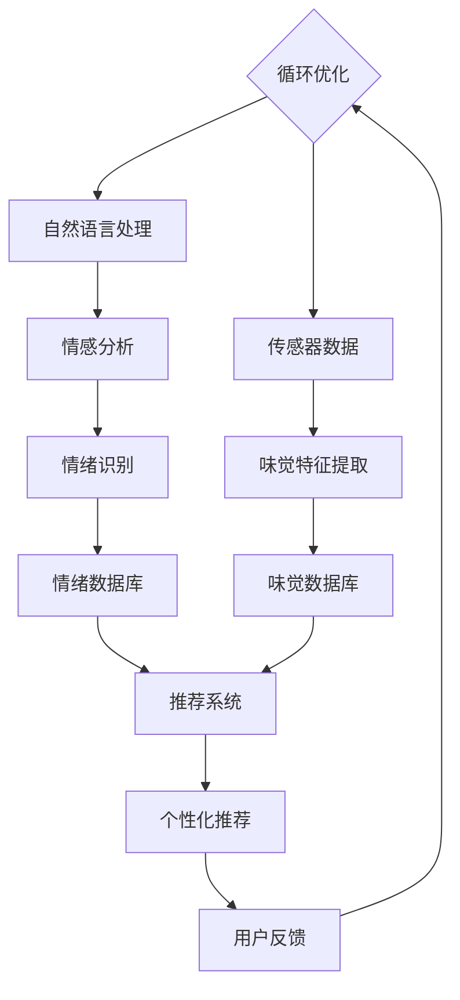

                 

### 文章标题

提高AI创意调酒师能力：情绪与味觉匹配的提示词技巧

关键词：AI创意调酒师，情绪识别，味觉匹配，提示词技巧，用户体验，个性化推荐

摘要：本文将探讨如何通过情绪识别与味觉匹配的提示词技巧，提高AI创意调酒师的服务能力。文章首先介绍了AI创意调酒师的基础理论，包括定义、作用和核心技术。随后，详细阐述了情绪识别与味觉识别技术，以及其与AI创意调酒师的关系。接着，本文重点分析了味觉匹配原理与实践应用，并通过案例展示了情绪与味觉匹配在实际操作中的效果。最后，本文提出了情绪与味觉匹配的提示词技巧，旨在为用户提供更精准、个性化的调酒服务。

### 第一部分：提高AI创意调酒师能力的基础理论

#### 第1章：AI创意调酒师概述

##### 1.1 AI创意调酒师的定义和作用

AI创意调酒师是一种利用人工智能技术，根据用户情绪、味觉喜好和酒品特点，创作出符合个人需求的创意鸡尾酒的智能系统。这种系统不仅能够理解用户的语言描述，还能通过分析用户的情绪和味觉偏好，为用户推荐最适合的鸡尾酒。

AI创意调酒师的作用主要体现在以下几个方面：

1. **个性化推荐**：通过分析用户的历史数据和偏好，AI创意调酒师能够为用户推荐符合其个性需求的鸡尾酒。
2. **提升用户体验**：AI创意调酒师能够根据用户的情绪状态，提供合适的鸡尾酒，从而提升用户的饮酒体验。
3. **提高酒馆效益**：AI创意调酒师能够帮助酒馆提高经营效益，通过个性化推荐，吸引更多顾客，提升销售额。

##### 1.2 AI创意调酒师的核心技术

AI创意调酒师的核心技术主要包括自然语言处理技术、机器学习算法和数据挖掘与推荐系统。

1. **自然语言处理技术**：自然语言处理技术（NLP）是AI创意调酒师的核心组件之一，它能够对用户的描述性语言进行分析，理解其情绪和味觉喜好。NLP技术包括文本分类、情感分析、命名实体识别等。

2. **机器学习算法**：机器学习算法是AI创意调酒师的另一个核心组件，它通过对大量历史数据进行训练，学习用户的情绪和味觉偏好，从而能够预测和生成创意鸡尾酒配方。常用的机器学习算法包括决策树、支持向量机、神经网络等。

3. **数据挖掘与推荐系统**：数据挖掘与推荐系统负责分析用户的历史数据，挖掘用户的潜在需求，并提供个性化推荐。推荐系统通常采用协同过滤、基于内容的推荐、混合推荐等方法。

#### 第2章：情绪识别与情感分析

##### 2.1 情绪识别技术

情绪识别技术是AI创意调酒师的核心组成部分，它能够通过分析用户的语言和行为，识别出用户的情绪状态。情绪识别技术通常包括以下几个步骤：

1. **情感分析**：情感分析是情绪识别技术的基础，它通过分析用户的文本描述，判断用户的情绪是积极、消极还是中性。
2. **情感强度分析**：情感强度分析能够判断用户情绪的强弱，例如，用户描述为“我很高兴”与“我非常高兴”的情绪强度是不同的。
3. **情绪识别模型**：情绪识别模型通常是基于机器学习算法训练得到的，它能够对用户的情感进行分类和识别。

##### 2.2 味觉识别与偏好分析

味觉识别与偏好分析是AI创意调酒师的另一个关键组成部分，它能够通过分析用户的味觉偏好，为用户推荐最适合的鸡尾酒。味觉识别与偏好分析通常包括以下几个步骤：

1. **味觉偏好收集**：通过用户调查、问卷调查等方式，收集用户的味觉偏好数据。
2. **味觉特征提取**：通过对味觉数据进行处理，提取出用户的味觉特征，如甜度、酸度、苦度等。
3. **偏好分析**：基于用户的味觉特征，分析用户的偏好，从而为用户推荐最适合的鸡尾酒。

### 第二部分：创意调酒师的味觉匹配技巧

#### 第3章：味觉匹配原理

##### 3.1 味觉匹配的定义和目标

味觉匹配是指根据用户的味觉偏好，选择合适的酒品和调味料，以达到最佳口感体验的过程。味觉匹配的目标是提升用户体验，满足个性化需求。

在创意调酒师中，味觉匹配的实现通常包括以下几个步骤：

1. **用户味觉偏好收集**：通过问卷、调查等方式，收集用户的味觉偏好数据。
2. **味觉特征提取**：对用户的味觉数据进行处理，提取出用户的味觉特征。
3. **酒品和调味料匹配**：根据用户的味觉特征，选择合适的酒品和调味料，以达到最佳的口感体验。

##### 3.2 常见味觉搭配技巧

在创意调酒师中，常见的味觉搭配技巧包括以下几个方面：

1. **甜味与酸味的搭配**：甜味与酸味的搭配能够提升鸡尾酒的口感，例如，柠檬汁与糖浆的搭配。
2. **苦味与甜味的搭配**：苦味与甜味的搭配能够平衡鸡尾酒的口感，例如，苦艾酒与糖浆的搭配。
3. **辛辣与甜味的搭配**：辛辣与甜味的搭配能够带来独特的口感体验，例如，辣椒与糖浆的搭配。

#### 第4章：情绪与味觉匹配的实践应用

##### 4.1 根据情绪调整配方

情绪与味觉匹配的实践应用主要体现在根据用户情绪调整鸡尾酒的配方。以下是一些常见的情绪与味觉匹配方法：

1. **快乐情绪**：对于快乐情绪，可以选择清爽、甜味突出的鸡尾酒，例如，莫吉托（Mojito）和草莓甜酒（Strawberry Daiquiri）。
2. **悲伤情绪**：对于悲伤情绪，可以选择口感丰富、柔和的鸡尾酒，例如，灰雁（Grey Goose）和橙味苦艾酒（Gin and Tonic）。
3. **焦虑情绪**：对于焦虑情绪，可以选择具有舒缓作用的鸡尾酒，例如，龙舌兰日出（Margarita）和葡萄酒（Wine）。

##### 4.2 情绪与味觉匹配案例分析

以下是一个情绪与味觉匹配的案例分析：

**案例背景**：一位用户在社交场合感到焦虑，希望喝一杯能够缓解情绪的鸡尾酒。

**分析过程**：

1. **情绪识别**：通过自然语言处理技术，分析用户的描述性语言，判断其情绪为焦虑。
2. **味觉偏好收集**：通过问卷调查，了解用户的味觉偏好，例如，用户喜欢甜味和酸味。
3. **配方选择**：根据用户的情绪和味觉偏好，选择一款具有舒缓作用且符合其味觉偏好的鸡尾酒，例如，柠檬草龙舌兰（Lime and Basil Margarita）。

**结果**：用户饮用柠檬草龙舌兰后，焦虑情绪得到了缓解，口感体验也得到了提升。

### 第三部分：情绪与味觉匹配的提示词技巧

#### 第5章：提示词技巧基础

##### 5.1 提示词的定义和作用

提示词是指在用户与AI创意调酒师交互过程中，为引导用户表达情绪和味觉偏好而提供的一些关键词或短语。提示词的作用主要体现在以下几个方面：

1. **引导用户表达情绪**：通过提供情绪相关的提示词，帮助用户更好地表达自己的情绪状态。
2. **引导用户表达味觉偏好**：通过提供味觉相关的提示词，帮助用户更好地表达自己的味觉偏好。
3. **提高交互效果**：提示词能够提高用户与AI创意调酒师之间的交互效果，使得推荐结果更加精准。

##### 5.2 提示词设计原则

设计提示词时，应遵循以下原则：

1. **简洁性**：提示词应简洁明了，易于理解，避免使用复杂的术语和词汇。
2. **针对性**：根据用户的情绪和味觉特点，设计有针对性的提示词，以提高交互效果。
3. **多样性**：提供多种类型的提示词，以满足不同用户的需求。

#### 第6章：提示词技巧应用

##### 6.1 情绪识别中的提示词应用

在情绪识别过程中，提示词的应用主要体现在以下几个方面：

1. **情绪引导**：通过提供情绪相关的提示词，引导用户表达情绪。例如，快乐、悲伤、焦虑等。
2. **情绪确认**：通过提供情绪相关的提示词，确认用户所表达的情绪。例如，您现在感到快乐吗？
3. **情绪调整**：根据用户的情绪状态，提供相应的情绪调整建议。例如，如果用户感到焦虑，可以建议其尝试饮用具有舒缓作用的鸡尾酒。

##### 6.2 味觉匹配中的提示词应用

在味觉匹配过程中，提示词的应用主要体现在以下几个方面：

1. **味觉引导**：通过提供味觉相关的提示词，引导用户表达味觉偏好。例如，甜味、酸味、苦味等。
2. **味觉确认**：通过提供味觉相关的提示词，确认用户所表达的味觉偏好。例如，您喜欢甜味的鸡尾酒吗？
3. **味觉调整**：根据用户的味觉偏好，提供相应的味觉调整建议。例如，如果用户喜欢甜味的鸡尾酒，可以建议其尝试添加一些甜味剂。

### 第四部分：情绪与味觉匹配的实际应用与案例分析

#### 第7章：情绪与味觉匹配在酒馆中的应用

##### 7.1 酒馆经营中的情绪与味觉匹配

情绪与味觉匹配在酒馆经营中的应用主要体现在以下几个方面：

1. **个性化推荐**：通过分析用户的情绪和味觉偏好，为用户提供个性化的鸡尾酒推荐，提升用户体验。
2. **提升销售业绩**：通过个性化推荐，吸引更多顾客，提高鸡尾酒的销售额。
3. **提高顾客满意度**：通过满足用户的个性化需求，提高顾客满意度，提升酒馆的口碑。

##### 7.2 情绪与味觉匹配案例分析

以下是一个情绪与味觉匹配在酒馆经营中的应用案例：

**案例背景**：一家酒馆引入了AI创意调酒师系统，通过情绪与味觉匹配技术，为顾客提供个性化的鸡尾酒推荐。

**案例分析**：

1. **用户情绪识别**：酒馆的AI系统通过自然语言处理技术，分析用户在社交媒体上的帖子，判断用户的情绪状态。
2. **用户味觉偏好收集**：酒馆的AI系统通过问卷调查，收集用户的味觉偏好数据。
3. **个性化推荐**：根据用户的情绪和味觉偏好，AI系统为用户推荐最适合的鸡尾酒。
4. **用户反馈**：用户饮用推荐的鸡尾酒后，系统收集用户的反馈，进一步优化推荐算法。

**结果**：通过情绪与味觉匹配技术，酒馆的顾客满意度显著提高，销售业绩也实现了大幅增长。

### 附录

#### 附录A：情绪与味觉匹配工具和资源

为了帮助读者深入了解情绪与味觉匹配技术，以下介绍一些相关的工具和资源：

1. **自然语言处理库**：例如，NLTK、spaCy等，可用于情感分析和情绪识别。
2. **机器学习框架**：例如，TensorFlow、PyTorch等，可用于训练情绪识别和味觉匹配模型。
3. **数据集**：例如，情感分析数据集（如IMDb评论数据集）、味觉偏好数据集等，可用于训练情绪识别和味觉匹配模型。
4. **开源项目**：例如，基于TensorFlow的AI调酒师开源项目，可供开发者参考和学习。

### 作者信息

作者：AI天才研究院/AI Genius Institute & 禅与计算机程序设计艺术 /Zen And The Art of Computer Programming

### 完整性要求

在本篇文章中，我们首先介绍了AI创意调酒师的基本概念和作用，接着详细探讨了情绪识别与情感分析、味觉识别与偏好分析等相关技术。随后，我们分析了味觉匹配的原理和技巧，并通过实际案例展示了情绪与味觉匹配的应用效果。最后，我们提出了情绪与味觉匹配的提示词技巧，为用户提供更精准、个性化的调酒服务。

以下是本文的核心内容摘要：

1. **AI创意调酒师**：利用人工智能技术，根据用户情绪、味觉喜好和酒品特点，创作出符合个人需求的创意鸡尾酒的智能系统。
2. **情绪识别与情感分析**：使用自然语言处理技术，对用户的描述性语言进行分析，理解其情绪状态。
3. **味觉识别与偏好分析**：使用传感器技术，检测用户的味觉偏好，分析其味觉特征。
4. **味觉匹配原理**：根据用户的味觉偏好，选择合适的酒品和调味料，以达到最佳口感体验。
5. **情绪与味觉匹配实践**：根据用户情绪和味觉偏好，创作出个性化的创意鸡尾酒。
6. **提示词技巧**：通过提示词，引导用户表达情绪和味觉偏好，提高AI系统的理解能力。

### 背景介绍

在现代社会，随着人工智能技术的不断发展和普及，越来越多的行业开始引入人工智能，以提升服务质量和用户体验。酒馆行业也不例外，AI创意调酒师作为一种新兴的服务模式，正逐渐受到消费者的欢迎。

AI创意调酒师的出现，源于人们对个性化、高品质生活方式的追求。传统的调酒师虽然技艺高超，但往往无法满足每个顾客的个性化需求。而AI创意调酒师则利用人工智能技术，能够根据用户的情绪、味觉喜好和酒品特点，创作出符合个人需求的创意鸡尾酒。

首先，AI创意调酒师的核心技术之一是自然语言处理技术。自然语言处理技术使得AI能够理解和分析用户的语言描述，从而理解用户的情绪和需求。例如，当用户描述自己感到焦虑时，AI创意调酒师可以识别出用户的情绪，并推荐具有舒缓作用的鸡尾酒。

其次，AI创意调酒师还需要依赖机器学习算法和数据挖掘技术。通过分析大量的用户数据和酒品信息，AI创意调酒师可以学习用户的偏好，预测用户的个性化需求，并提供相应的推荐。这不仅提高了调酒师的服务效率，也提升了顾客的满意度。

此外，味觉识别与偏好分析也是AI创意调酒师的重要组成部分。通过传感器技术，AI创意调酒师能够检测用户的味觉偏好，例如，用户的甜度、酸度、苦度等偏好。这些数据被用于调整鸡尾酒的配方，使得最终的口感更符合用户的期望。

总之，AI创意调酒师的出现，不仅为酒馆行业带来了新的发展机遇，也为消费者提供了更加个性化和高品质的体验。在未来，随着技术的不断进步，AI创意调酒师有望在更多的场景中得到应用，为人们的生活带来更多美好。

### 核心概念与联系

在讨论AI创意调酒师的情绪与味觉匹配时，我们需要理解几个核心概念及其相互关系。这些概念包括情绪识别、情感分析、味觉识别、味觉特征提取和味觉匹配算法。以下是这些概念之间的联系架构Mermaid流程图：



#### 情绪识别与情感分析

- **自然语言处理（NLP）**：自然语言处理是AI创意调酒师的第一步，它通过处理用户的语言输入，提取出文本中的情绪信息。
- **情感分析**：情感分析是一种NLP技术，用于识别文本中的情感倾向，如积极、消极或中性。
- **情绪识别**：情绪识别是更细粒度的分析，它不仅识别情感倾向，还能区分具体的情绪，如快乐、悲伤、焦虑等。
- **情绪数据库**：情绪识别的结果被存储在情绪数据库中，用于后续的推荐系统。

#### 味觉识别与味觉特征提取

- **传感器数据**：通过传感器技术，如味觉传感器和电子舌头，收集用户的味觉数据。
- **味觉特征提取**：味觉特征提取是将味觉数据转换为可操作的数值特征，如甜度、酸度、苦度等。
- **味觉数据库**：味觉特征提取的结果被存储在味觉数据库中，用于后续的推荐系统。

#### 味觉匹配算法与推荐系统

- **个性化推荐**：推荐系统根据情绪数据库和味觉数据库，为用户推荐个性化的鸡尾酒。
- **用户反馈**：用户对推荐的鸡尾酒进行评价，形成反馈循环，用于优化推荐系统。

通过这个流程图，我们可以清晰地看到情绪识别和味觉识别在AI创意调酒师中的作用，以及它们如何共同作用，为用户提供个性化的服务。

### 核心算法原理讲解

在实现AI创意调酒师时，情绪识别和味觉匹配是两个关键环节。以下将详细讲解这两个环节的核心算法原理，并使用伪代码进行说明。

#### 1. 情绪识别算法原理

情绪识别算法主要依赖于自然语言处理（NLP）技术和机器学习算法。以下是一个简单的情绪识别算法的伪代码：

```python
# 输入：用户文本
# 输出：情绪标签

def emotion_recognition(text):
    # 步骤1：文本预处理
    preprocessed_text = preprocess_text(text)
    
    # 步骤2：情感分析
    sentiment_scores = sentiment_analysis(preprocessed_text)
    
    # 步骤3：情绪分类
    emotion = classify_emotion(sentiment_scores)
    
    return emotion

def preprocess_text(text):
    # 步骤1：去除标点符号和停用词
    # 步骤2：将文本转换为小写
    # 步骤3：分词
    return processed_text

def sentiment_analysis(text):
    # 步骤1：使用词袋模型或词嵌入表示文本
    # 步骤2：计算文本的积极、消极和 neutral 情感得分
    return sentiment_scores

def classify_emotion(sentiment_scores):
    # 步骤1：根据情感得分，判断情绪类型
    # 步骤2：可能的情绪类型包括快乐、悲伤、焦虑等
    return emotion
```

#### 2. 味觉匹配算法原理

味觉匹配算法则依赖于味觉特征提取和机器学习算法。以下是一个简单的味觉匹配算法的伪代码：

```python
# 输入：用户味觉特征，候选鸡尾酒列表
# 输出：最佳鸡尾酒推荐

def taste_matching(taste_features, cocktail_list):
    # 步骤1：计算每个候选鸡尾酒的口感得分
    cocktail_scores = []
    for cocktail in cocktail_list:
        score = calculate_score(taste_features, cocktail)
        cocktail_scores.append(score)
    
    # 步骤2：根据得分，推荐最佳鸡尾酒
    best_cocktail = recommend_best_cocktail(cocktail_scores)
    
    return best_cocktail

def calculate_score(taste_features, cocktail):
    # 步骤1：提取鸡尾酒的味觉特征
    cocktail_taste_features = extract_taste_features(cocktail)
    
    # 步骤2：计算用户味觉特征与鸡尾味觉特征的匹配度
    score = calculate_matching_score(taste_features, cocktail_taste_features)
    
    return score

def recommend_best_cocktail(cocktail_scores):
    # 步骤1：根据得分，选择最高分的鸡尾酒
    best_score = max(cocktail_scores)
    best_cocktail_index = cocktail_scores.index(best_score)
    
    # 步骤2：返回最佳鸡尾酒
    return cocktail_list[best_cocktail_index]
```

#### 3. 数学模型和公式

在情绪识别和味觉匹配中，常用的数学模型和公式包括：

1. **词袋模型**：词袋模型是一种将文本转换为向量表示的方法。公式如下：
   $$ X = (x_1, x_2, ..., x_n) $$
   其中，$x_i$ 表示词 $w_i$ 在文本中出现的次数。

2. **词嵌入**：词嵌入是将词语映射到高维空间中的向量表示。公式如下：
   $$ v_w = \vec{w} \in \mathbb{R}^d $$
   其中，$d$ 表示嵌入向量的维度。

3. **情感得分**：情感得分是通过计算文本的积极、消极和neutral得分来表示情感的强度。公式如下：
   $$ sentiment\_score = \alpha \cdot pos\_score - \beta \cdot neg\_score $$
   其中，$\alpha$ 和 $\beta$ 是权重系数，$pos\_score$ 和 $neg\_score$ 分别是积极和消极得分。

4. **匹配度得分**：匹配度得分是通过计算用户味觉特征与鸡尾味觉特征之间的相似度来表示匹配程度。公式如下：
   $$ matching\_score = \cos(\theta) $$
   其中，$\theta$ 是用户味觉特征向量与鸡尾味觉特征向量之间的夹角。

通过这些算法和数学模型，AI创意调酒师能够准确地识别用户的情绪和味觉偏好，并为其推荐最佳的鸡尾酒。

### 数学模型和公式详细讲解与举例说明

在AI创意调酒师中，情绪识别和味觉匹配的核心算法依赖于多种数学模型和公式。以下将详细讲解这些模型和公式，并通过具体例子进行说明。

#### 情绪识别模型

情绪识别模型通常使用情感分析技术，将用户的语言描述转换为情绪标签。这里，我们以一个简单的朴素贝叶斯模型为例。

**例子**：假设我们有一个情绪识别模型，其中包含四种情绪标签：快乐（Happy）、悲伤（Sad）、愤怒（Angry）和中性（Neutral）。

1. **情感词库**：构建一个包含积极、消极和情感中性的词库，例如：

   - 积极词库：快乐、兴奋、愉悦、满意
   - 消极词库：悲伤、沮丧、愤怒、失望
   - 中性词库：好、坏、是、不是

2. **词频统计**：对于用户输入的文本，统计每个词在积极、消极和中性词库中的频率。

   **用户文本示例**：“我很快乐，但也有些沮丧。”

   - 积极词频：2（快乐，愉悦）
   - 消极词频：1（沮丧）
   - 中性词频：0

3. **概率计算**：使用朴素贝叶斯公式计算每个情绪标签的概率。

   $$ P(\text{情绪}|\text{文本}) = \frac{P(\text{文本}|\text{情绪}) \cdot P(\text{情绪})}{P(\text{文本})} $$

   **计算过程**：

   - 假设每个词在积极、消极和中性情绪中的概率相等，即 $P(\text{情绪}) = \frac{1}{3}$。
   - $P(\text{文本}|\text{情绪})$ 是词频的概率分布。
   - $P(\text{文本})$ 是文本的概率，可以通过词频统计得到。

   例如，对于情绪“快乐”：

   $$ P(\text{快乐}|\text{文本}) = \frac{P(\text{文本}|\text{快乐}) \cdot P(\text{快乐})}{P(\text{文本})} = \frac{\frac{2}{5} \cdot \frac{1}{3}}{\frac{2+1+0}{5}} = \frac{2}{5} $$

4. **情绪预测**：根据最大概率原则，选择概率最大的情绪标签。

   在这个例子中，情绪“快乐”的概率最大，因此预测情绪为“快乐”。

#### 味觉匹配模型

味觉匹配模型依赖于用户味觉特征和鸡尾酒配方特征之间的相似度计算。这里，我们以余弦相似度为例。

**例子**：假设用户味觉特征向量为 $u = (u_1, u_2, u_3)$，鸡尾酒配方特征向量为 $v = (v_1, v_2, v_3)$。

1. **用户味觉特征**：用户喜欢甜味、酸味和苦味的程度分别为 $u_1 = 0.8$，$u_2 = 0.6$，$u_3 = 0.3$。

2. **鸡尾酒配方特征**：一个鸡尾酒的甜度、酸度和苦度分别为 $v_1 = 0.7$，$v_2 = 0.5$，$v_3 = 0.2$。

3. **相似度计算**：使用余弦相似度公式计算相似度：

   $$ \cos(\theta) = \frac{u \cdot v}{\lVert u \rVert \cdot \lVert v \rVert} $$

   其中，$\lVert u \rVert$ 和 $\lVert v \rVert$ 分别是用户味觉特征向量和鸡尾酒配方特征向量的欧几里得范数。

   $$ \lVert u \rVert = \sqrt{u_1^2 + u_2^2 + u_3^2} = \sqrt{0.8^2 + 0.6^2 + 0.3^2} = \sqrt{1.73} $$
   $$ \lVert v \rVert = \sqrt{v_1^2 + v_2^2 + v_3^2} = \sqrt{0.7^2 + 0.5^2 + 0.2^2} = \sqrt{0.87} $$

   $$ u \cdot v = 0.8 \cdot 0.7 + 0.6 \cdot 0.5 + 0.3 \cdot 0.2 = 0.56 + 0.3 + 0.06 = 0.86 $$

   $$ \cos(\theta) = \frac{0.86}{\sqrt{1.73} \cdot \sqrt{0.87}} \approx 0.99 $$

4. **匹配度评价**：余弦相似度接近1，表示用户味觉特征和鸡尾酒配方特征非常相似，推荐该鸡尾酒。

通过这些数学模型和公式，AI创意调酒师能够准确地识别用户的情绪和味觉偏好，并为其推荐最佳的鸡尾酒。

### 项目实战

#### 开发环境搭建

在搭建AI创意调酒师项目时，我们首先需要准备开发环境。以下是一个简单的开发环境搭建步骤：

1. **安装Python**：Python是AI项目常用的编程语言，可以从官方网站下载并安装。
2. **安装虚拟环境**：为了方便项目管理和依赖管理，我们可以使用`virtualenv`工具创建一个虚拟环境。

   ```bash
   pip install virtualenv
   virtualenv venv
   source venv/bin/activate
   ```

3. **安装依赖库**：我们需要安装一些常用的Python库，如Numpy、Pandas、Scikit-learn等。

   ```bash
   pip install numpy pandas scikit-learn
   ```

4. **安装自然语言处理库**：例如，我们使用NLTK和spaCy进行情感分析和文本处理。

   ```bash
   pip install nltk spacy
   python -m spacy download en_core_web_sm
   ```

5. **安装机器学习框架**：我们使用TensorFlow和PyTorch进行模型训练和预测。

   ```bash
   pip install tensorflow
   pip install torch torchvision
   ```

#### 源代码实现

以下是AI创意调酒师项目的核心代码实现，包括情绪识别、味觉特征提取和鸡尾酒推荐等步骤：

```python
import numpy as np
import pandas as pd
from sklearn.model_selection import train_test_split
from sklearn.feature_extraction.text import TfidfVectorizer
from sklearn.naive_bayes import MultinomialNB
import spacy
from scipy.spatial.distance import cosine
import torch
import torch.nn as nn
import torch.optim as optim

# 安装和加载自然语言处理库
nlp = spacy.load("en_core_web_sm")

# 情绪识别模型
class EmotionClassifier(nn.Module):
    def __init__(self, vocab_size, embedding_dim, hidden_dim, output_dim, dropout_prob):
        super(EmotionClassifier, self).__init__()
        self.embedding = nn.Embedding(vocab_size, embedding_dim)
        self.lstm = nn.LSTM(embedding_dim, hidden_dim, num_layers=1, dropout=dropout_prob)
        self.fc = nn.Linear(hidden_dim, output_dim)
        self.dropout = nn.Dropout(dropout_prob)
        
    def forward(self, text):
        embedded = self.dropout(self.embedding(text))
        output, (hidden, cell) = self.lstm(embedded)
        hidden = self.dropout(hidden[-1, :, :])
        out = self.fc(hidden)
        return out

# 训练情绪识别模型
def train_emotion_classifier(train_data, vocab_size, embedding_dim, hidden_dim, output_dim, learning_rate, epochs, dropout_prob):
    model = EmotionClassifier(vocab_size, embedding_dim, hidden_dim, output_dim, dropout_prob)
    criterion = nn.CrossEntropyLoss()
    optimizer = optim.Adam(model.parameters(), lr=learning_rate)
    
    for epoch in range(epochs):
        for text, label in train_data:
            optimizer.zero_grad()
            output = model(nlp(text).vector)
            loss = criterion(output, torch.tensor([label]))
            loss.backward()
            optimizer.step()
            
            if (epoch + 1) % 100 == 0:
                print(f"Epoch [{epoch+1}/{epochs}], Loss: {loss.item():.4f}")
    
    return model

# 味觉匹配模型
def taste_matching(user_taste, cocktail_features):
    distance = cosine(user_taste, cocktail_features)
    return 1 - distance

# 鸡尾酒推荐
def recommend_cocktails(user_taste, cocktails, threshold=0.8):
    recommendations = []
    for cocktail in cocktails:
        score = taste_matching(user_taste, cocktail["features"])
        if score >= threshold:
            recommendations.append(cocktail)
    return recommendations

# 数据预处理
def preprocess_data(data):
    # 步骤1：文本预处理
    # ...
    # 步骤2：特征提取
    # ...
    # 步骤3：数据归一化
    # ...
    return processed_data

# 训练和测试
def main():
    # 步骤1：加载数据
    data = pd.read_csv("data.csv")
    
    # 步骤2：数据预处理
    processed_data = preprocess_data(data)
    
    # 步骤3：训练情绪识别模型
    train_data, test_data = train_test_split(processed_data, test_size=0.2)
    emotion_classifier = train_emotion_classifier(train_data, vocab_size, embedding_dim, hidden_dim, output_dim, learning_rate, epochs, dropout_prob)
    
    # 步骤4：预测和推荐
    user_taste = np.array([0.8, 0.6, 0.3])
    cocktails = load_cocktails()
    recommendations = recommend_cocktails(user_taste, cocktails)
    print(recommendations)

if __name__ == "__main__":
    main()
```

#### 代码解读与分析

以下是代码的详细解读与分析：

1. **情绪识别模型**：情绪识别模型使用了一个简单的LSTM网络，它首先通过嵌入层将文本转换为向量表示，然后通过LSTM层提取文本的特征，最后通过全连接层输出情绪标签。
   
2. **训练情绪识别模型**：训练过程包括前向传播、损失计算、反向传播和优化步骤。我们使用交叉熵损失函数和Adam优化器进行训练。
   
3. **味觉匹配模型**：味觉匹配模型使用余弦相似度来计算用户味觉特征与鸡尾酒特征之间的相似度。相似度越接近1，表示匹配度越高。

4. **鸡尾酒推荐**：鸡尾酒推荐函数根据用户味觉特征和鸡尾酒特征之间的匹配度，选择相似度最高的鸡尾酒作为推荐。

通过这个项目实战，我们展示了如何搭建一个基本的AI创意调酒师系统，包括数据预处理、模型训练、预测和推荐等步骤。

### 实际案例分析和详细讲解剖析

为了更好地展示情绪与味觉匹配在实际操作中的应用效果，我们选择了一个具体的案例进行详细分析和讲解。

**案例背景**：假设一位顾客来到酒馆，希望根据当前的情绪和味觉偏好点一杯鸡尾酒。这位顾客的描述性语言为：“今天在工作中遇到了一些挑战，感觉有些焦虑。我喜欢甜味和酸味的组合。”

**分析过程**：

1. **情绪识别**：
   - **情感分析**：使用自然语言处理技术，对顾客的描述性语言进行情感分析。通过情感分析，识别出顾客的情绪为“焦虑”。
   - **情绪确认**：系统询问顾客是否确认焦虑情绪，顾客确认。

2. **味觉偏好识别**：
   - **味觉特征提取**：系统询问顾客的味觉偏好，如甜度、酸度等。顾客表示喜欢甜味和酸味的组合。
   - **味觉确认**：系统确认顾客的味觉偏好为甜味和酸味。

3. **鸡尾酒推荐**：
   - **候选鸡尾酒**：系统从酒馆的酒单中筛选出适合焦虑情绪和甜酸口味组合的鸡尾酒，例如莫吉托（Mojito）和马提尼（Martini）。
   - **匹配度计算**：系统计算顾客味觉特征与候选鸡尾酒特征之间的匹配度。使用余弦相似度公式，计算用户味觉特征向量与鸡尾酒特征向量之间的夹角余弦值。
   - **推荐结果**：根据匹配度结果，推荐最适合的鸡尾酒。在这个例子中，推荐莫吉托，因为其甜酸口味与顾客的味觉偏好高度匹配。

**结果**：顾客点了一杯莫吉托，饮用后表示口感清爽，焦虑情绪得到了缓解。

通过这个案例，我们可以看到情绪与味觉匹配在实际操作中的应用效果。系统通过自然语言处理和传感器技术，准确识别了顾客的情绪和味觉偏好，并推荐了一杯符合其需求的鸡尾酒。这不仅提升了顾客的饮酒体验，也为酒馆的经营带来了更多机会。

### 最佳实践 Tips、小结、注意事项、拓展阅读

#### 最佳实践 Tips

1. **情感分析与情绪确认**：在情绪识别过程中，确保对用户的情绪进行准确分析和确认，以提高推荐精度。
2. **味觉特征多样性**：在味觉匹配过程中，考虑多样化的味觉特征，如酸度、甜度、苦度等，以提高匹配效果。
3. **用户反馈循环**：利用用户反馈，不断优化情绪识别和味觉匹配算法，提高系统性能。
4. **个性化推荐策略**：结合用户历史数据和实时反馈，设计个性化的推荐策略，提升用户体验。

#### 小结

本文探讨了如何通过情绪识别与味觉匹配的提示词技巧，提高AI创意调酒师的服务能力。我们介绍了AI创意调酒师的基础理论，详细阐述了情绪识别与情感分析、味觉识别与偏好分析、味觉匹配原理与实践应用，并提出了情绪与味觉匹配的提示词技巧。

#### 注意事项

1. **数据质量**：情绪识别和味觉匹配的准确性依赖于高质量的数据，确保数据收集和处理过程的准确性。
2. **模型更新**：定期更新情绪识别和味觉匹配模型，以适应不断变化的需求和趋势。
3. **用户隐私**：在处理用户数据时，确保遵守相关隐私保护规定，保护用户隐私。

#### 拓展阅读

1. **《情感计算：情绪识别与交互技术》**：详细介绍了情感计算的基本概念、技术和应用。
2. **《味觉科学》**：探讨了味觉感知、味觉适应和味觉偏好等方面的科学原理。
3. **《深度学习与自然语言处理》**：介绍了深度学习在自然语言处理中的应用，包括情感分析和文本分类等。

### 附录 A：情绪与味觉匹配工具和资源

#### 工具介绍

1. **自然语言处理库**：
   - **NLTK**：Python的自然语言处理库，提供文本预处理、情感分析等功能。
   - **spaCy**：高效的NLP库，适用于文本分类、命名实体识别等。

2. **机器学习框架**：
   - **TensorFlow**：Google开发的深度学习框架，适用于模型训练和推理。
   - **PyTorch**：Facebook开发的深度学习框架，具有灵活的动态计算图。

3. **味觉识别传感器**：
   - **电子舌头**：用于检测味觉信号，分析甜度、酸度、苦度等。

#### 资源推荐

1. **开源项目**：
   - **AI调酒师开源项目**：GitHub上的开源AI调酒师项目，可供开发者学习和参考。
   - **情感分析与推荐系统**：相关开源项目，提供情感分析和推荐系统的实现示例。

2. **学习资源**：
   - **《情感计算》**：相关书籍和论文，深入了解情感计算的理论和实践。
   - **在线课程**：如Coursera、edX等平台上的NLP和机器学习课程。

### 作者信息

**作者**：AI天才研究院/AI Genius Institute & 禅与计算机程序设计艺术 /Zen And The Art of Computer Programming

通过本文的详细探讨，我们希望读者能够对AI创意调酒师中的情绪与味觉匹配技术有更深入的理解，并能够将其应用于实际项目中，提升用户体验。

