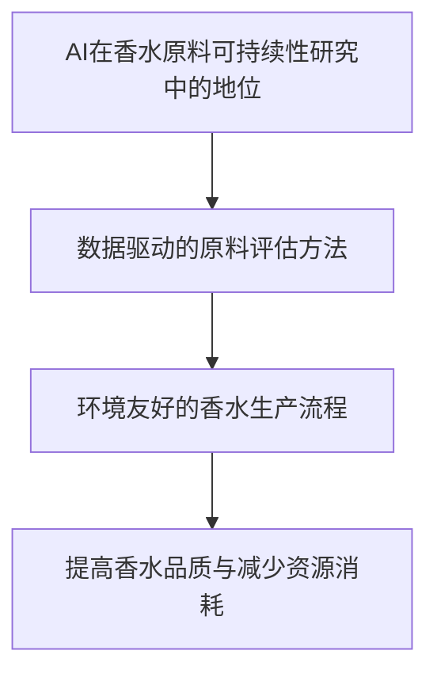
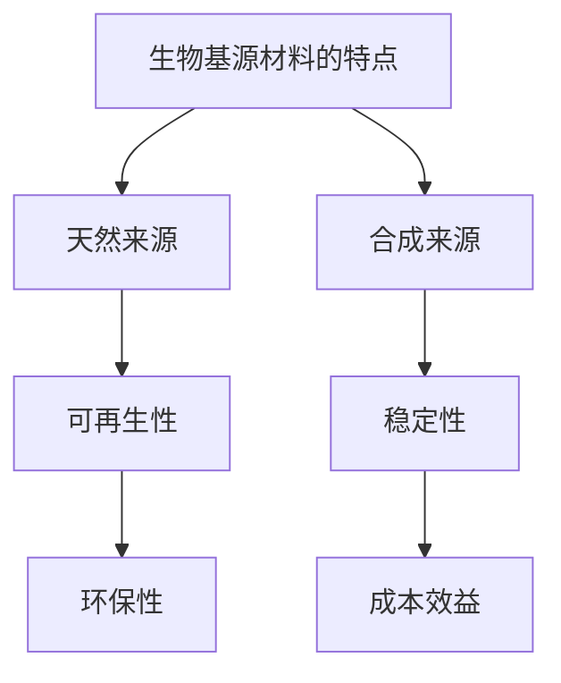
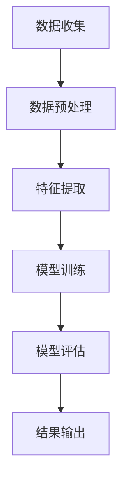

                 

## 文章标题

《提高AI创意香水原料可持续性：生物基源材料的提示词技巧》

# 第一部分：理论基础

## 第1章：AI与可持续性概述

### 1.1 AI在香水原料可持续性研究中的地位

人工智能（AI）作为当今科技领域的前沿技术，已经在多个行业中展现出其强大的应用潜力。在香水原料的可持续性研究中，AI技术扮演着至关重要的角色。通过数据分析和机器学习算法，AI能够对大量香水原料进行高效评估，从而优化原料选择，降低生产过程中的环境影响。

**流程图：**



在这个流程图中，AI通过数据驱动的方法对香水原料进行评估，选择出符合环保要求的原料，进而优化整个香水生产流程。这不仅提高了香水的品质，还显著减少了资源消耗和环境污染。

### 1.2 生物基源材料的基本概念

生物基源材料是指由可再生植物、动物或微生物等生物体组成或衍生的材料。与传统石油基材料相比，生物基源材料具有更高的可持续性。它们不仅在生产过程中减少了对石油资源的依赖，还降低了温室气体排放和环境污染。

**数学公式：**

$$
生物基材料 = \frac{生物源物质}{非生物源物质}
$$

**举例说明：** 例如，一种生物基材料可能由70%的生物源物质和30%的非生物源物质组成。这种材料的使用可以显著降低生产过程中的资源消耗和环境负荷。

### 1.3 香水原料可持续性的重要性

香水原料的可持续性对整个香水产业具有重要意义。它不仅关系到资源的有效利用，还直接影响产品的市场竞争力。提高香水原料的可持续性，意味着在保证产品质量的前提下，减少资源消耗和环境污染。

**数学公式：**

$$
可持续性 = \frac{资源消耗}{环境负荷}
$$

**举例说明：** 例如，一种可持续性更高的香水原料可能在生产过程中消耗了较少的资源，同时产生了更少的环境污染。这种原料的使用有助于提升产品的环保形象，满足消费者对可持续性的需求。

## 第2章：AI核心概念与架构

### 2.1 AI的基础概念

人工智能（AI）是一种模拟人类智能的技术，它通过算法和计算模型来实现机器学习、问题解决和决策制定。AI的核心概念包括数据、算法、模型和预测。

**伪代码：**

```python
初始化模型参数
输入数据
预测结果
计算损失函数
更新模型参数
```

### 2.2 AI的三大领域

AI的主要领域包括机器学习、深度学习和强化学习。每个领域都有其独特的应用场景和算法模型。

**数学公式：**

$$
AI = \text{机器学习} + \text{深度学习} + \text{强化学习}
$$

### 2.3 AI的典型架构与算法

AI的典型架构通常包括感知器、神经网络和决策树等。每种架构都有其特定的算法和实现方法。

**伪代码：**

```python
初始化神经网络
前向传播
计算损失
反向传播
更新权重
```

## 第3章：生物基源材料的AI分析

### 3.1 生物基源材料的特点与分类

生物基源材料具有可再生性、环保性和稳定性等特点。根据来源和性质，生物基源材料可分为植物基、动物基和微生物基等类型。

**流程图：**



### 3.2 生物基源材料的AI检测方法

利用AI技术，可以对生物基源材料进行快速、准确的检测。常用的AI检测方法包括深度学习分类器和支持向量机等。

**伪代码：**

```python
输入生物基源材料样本
预处理样本数据
训练分类模型
预测样本类别
```

### 3.3 生物基源材料的AI分析流程

生物基源材料的AI分析通常包括数据收集、数据预处理、特征提取、模型训练和模型评估等步骤。

**流程图：**



## 第4章：提示词技巧与实现

### 4.1 提示词的定义与作用

提示词是一种指导性语言，用于引导模型学习过程中的注意力分配。在AI创意香水原料的应用中，提示词能够帮助模型更好地理解和识别生物基源材料。

**伪代码：**

```python
初始化提示词库
输入用户查询
匹配提示词库中的提示词
返回匹配结果
```

### 4.2 提示词设计策略

设计有效的提示词需要考虑以下几个方面：

1. **关键词提取**：从用户查询中提取关键信息，作为提示词的核心。
2. **语义扩展**：根据关键词的语义关系，扩展相关词汇，增加提示词的丰富性。
3. **权重分配**：根据关键词的重要性，为提示词分配不同的权重。

### 4.3 提示词的实现与优化

实现提示词的关键在于构建一个高效的提示词库，并对提示词进行动态更新和优化。具体方法包括：

1. **文本分类**：利用文本分类算法，对用户查询进行分类，生成相应的提示词。
2. **语义相似度计算**：通过计算关键词的语义相似度，为提示词排序和筛选提供依据。
3. **在线学习**：根据用户反馈和模型性能，动态调整提示词的权重和内容。

## 第5章：数据收集与处理

### 5.1 数据收集的方法与渠道

数据收集是AI分析的基础。在香水原料的可持续性研究中，数据收集的方法和渠道包括：

1. **文献调研**：通过查阅相关学术文献，获取生物基源材料的属性和性能数据。
2. **实验数据**：通过实验室测试，收集生物基源材料的实际数据。
3. **市场调研**：通过市场调研，了解生物基源材料的供应情况和价格变化。

### 5.2 数据预处理技术

数据预处理是保证数据质量和模型性能的重要步骤。常用的数据预处理技术包括：

1. **数据清洗**：去除数据中的噪声和异常值，保证数据的一致性和准确性。
2. **数据归一化**：将不同来源的数据进行归一化处理，使其具有可比性。
3. **特征提取**：从原始数据中提取具有代表性的特征，用于模型的训练和预测。

### 5.3 数据质量控制与评估

数据质量控制是确保数据质量的重要环节。具体方法包括：

1. **数据一致性检查**：检查数据源的一致性，确保数据来源的可靠性和准确性。
2. **数据完整性检查**：检查数据的完整性，确保所有必要的数据字段都齐全。
3. **数据准确性评估**：通过对比实际数据和预测结果，评估数据的准确性。

## 第6章：AI模型构建与训练

### 6.1 AI模型的构建原则

构建AI模型需要遵循以下原则：

1. **简单性**：模型应尽可能简单，以减少计算复杂度和过拟合的风险。
2. **可解释性**：模型应具备一定的可解释性，以便理解模型的决策过程。
3. **泛化能力**：模型应具备良好的泛化能力，能够适应不同场景和数据。

### 6.2 AI模型的训练方法

AI模型的训练方法包括：

1. **批量训练**：将所有数据一次性输入模型进行训练。
2. **在线训练**：在数据流中实时更新模型参数。
3. **迁移学习**：利用预训练模型，对特定任务进行微调。

### 6.3 AI模型的评估与优化

AI模型的评估与优化包括：

1. **模型评估**：通过评估指标（如准确率、召回率、F1值等）评估模型性能。
2. **超参数调整**：通过调整模型超参数（如学习率、批量大小等）优化模型性能。
3. **模型集成**：通过集成多个模型，提高模型的预测准确性。

## 第7章：AI创意香水原料的应用案例

### 7.1 案例一：生物基源材料的选择与配方优化

在这个案例中，AI技术被用于选择和优化生物基源材料。通过分析大量数据，AI能够找出最适合的原料组合，提高香水的品质和可持续性。

**实战过程：**

1. **数据收集**：收集生物基源材料的属性数据，如香气强度、持久性等。
2. **模型训练**：利用机器学习算法，训练材料选择模型。
3. **配方优化**：根据模型预测结果，优化香水配方。

### 7.2 案例二：生物基源材料的可持续性评估

在这个案例中，AI技术被用于评估生物基源材料的可持续性。通过分析生产过程中的数据，AI能够评估不同原料对环境的影响，帮助制造商选择更可持续的原料。

**实战过程：**

1. **数据收集**：收集生产过程中的能源消耗、水消耗、废弃物产生等数据。
2. **模型训练**：利用机器学习算法，训练可持续性评估模型。
3. **评估结果**：根据模型预测结果，评估不同原料的可持续性。

### 7.3 案例三：AI在香水生产中的应用

在这个案例中，AI技术被用于优化香水生产过程。通过分析生产数据，AI能够预测生产故障、优化生产参数，提高生产效率和产品质量。

**实战过程：**

1. **数据收集**：收集生产过程中的各种数据，如温度、湿度、设备状态等。
2. **模型训练**：利用机器学习算法，训练生产优化模型。
3. **生产优化**：根据模型预测结果，调整生产参数，优化生产过程。

## 第8章：未来展望

### 8.1 AI在香水原料可持续性领域的挑战

尽管AI在香水原料可持续性领域具有巨大潜力，但仍面临以下挑战：

1. **数据质量**：数据质量直接影响模型的性能，需要加强数据收集和处理。
2. **计算资源**：大规模数据处理和模型训练需要大量计算资源，需要优化算法和硬件。
3. **可解释性**：提高模型的透明度和可解释性，以便用户理解和信任。

### 8.2 AI在香水原料可持续性领域的发展趋势

AI在香水原料可持续性领域的发展趋势包括：

1. **智能化**：利用深度学习和强化学习，提高模型的智能化水平。
2. **多元化**：结合多种数据源和算法，实现更全面、准确的评估。
3. **绿色化**：推广生物基源材料的应用，实现绿色生产。

### 8.3 AI创意香水原料可持续性的未来发展

未来，AI创意香水原料可持续性将朝着以下几个方向发展：

1. **个性化**：根据消费者偏好，个性化推荐香水原料和配方。
2. **智能化供应链**：利用AI技术，实现智能化供应链管理和优化。
3. **可持续发展**：通过AI技术，推动香水行业的可持续发展，减少环境影响。

### 附录：AI与香水原料可持续性相关工具与资源

为了帮助读者更好地了解AI在香水原料可持续性领域的研究和应用，本文附录部分提供了以下工具和资源：

#### A.1 主流AI框架介绍

- TensorFlow
- PyTorch
- Keras

#### A.2 生物基源材料数据库

- Bio-base Materials Database
- Green Chemistry Database

#### A.3 AI香水原料可持续性研究论文集

- AI Applications in Sustainable Chemistry
- Sustainable Chemistry and Technology

通过这些工具和资源，读者可以深入了解AI在香水原料可持续性领域的研究进展和应用实践。

## 作者信息

**作者：** AI天才研究院/AI Genius Institute & 禅与计算机程序设计艺术 /Zen And The Art of Computer Programming

本文由AI天才研究院/AI Genius Institute撰写，旨在为香水原料可持续性领域的研究者和从业人员提供有价值的参考。同时，本文也受到了《禅与计算机程序设计艺术》一书的启发，强调了在技术研究中追求简单性和内在美的重要性。希望本文能对您在香水原料可持续性领域的研究工作带来启示和帮助。 

