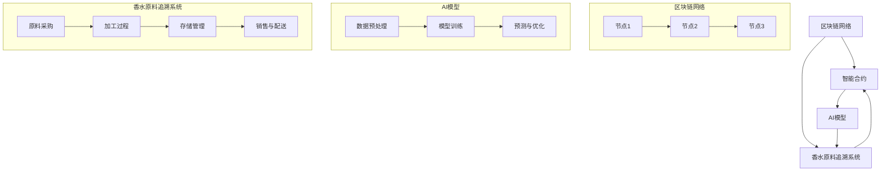

                 


### 引言

近年来，人工智能（AI）技术在全球范围内迅猛发展，不仅改变了传统行业，也为众多新兴领域带来了全新的机遇。在香水行业，AI技术的引入正在颠覆传统的香水设计和生产方式。通过机器学习和数据挖掘技术，AI能够快速分析大量数据，帮助设计师创造更加个性化和创新的香水。然而，随着香水的创意化和定制化程度不断提高，如何确保香水原料的质量和来源的可追溯性，成为了行业亟待解决的问题。

#### AI创意香水原料可追溯性的意义

香水的原料种类繁多，包括天然植物提取物、化学合成物等，这些原料的质量直接关系到最终产品的质量和安全性。传统的追溯方式往往依赖于纸质的记录和人工跟踪，存在记录不完整、信息不透明等问题。而AI技术通过大数据分析和机器学习，可以实现对原料来源、加工过程和产品质量的全面监控，从而提高追溯的准确性和效率。

#### 区块链技术的基本概念与优势

区块链技术是一种去中心化的数据库技术，通过加密算法和共识机制确保数据的不可篡改和透明性。其核心优势在于：

1. **数据不可篡改**：区块链上的数据一旦记录，便不可更改，保证了信息的真实性和可靠性。
2. **去中心化**：无需依赖中央机构，降低了系统的风险点，提高了系统的容错性和抗攻击能力。
3. **透明性**：所有参与方都可以查看区块链上的信息，增强了信息透明度和信任度。

#### 书籍结构安排与内容预期

本文旨在深入探讨如何利用区块链技术提高AI创意香水原料的可追溯性。文章结构安排如下：

- **第一部分**：背景与概述，介绍AI在香水行业中的应用和区块链技术的基本概念。
- **第二部分**：区块链技术基础，详细讲解区块链的基本原理和智能合约的应用。
- **第三部分**：AI创意香水原料可追溯性的实现，分析香水原料追溯的需求和区块链技术实施步骤。
- **第四部分**：提示词技巧与实践，探讨提示词设计原则和实战案例。
- **第五部分**：项目实战与案例分析，通过实际项目展示区块链技术在香水追溯中的应用。
- **第六部分**：附录，提供相关资源和常见问题解答。

通过本文的探讨，我们希望读者能够对AI创意香水原料可追溯性和区块链技术的结合有更深入的理解，为香水行业的技术创新提供有益的参考。

### 第一部分：背景与概述

#### AI在香水行业中的应用

随着人工智能技术的不断发展，AI在各个领域的应用日益广泛。在香水行业，AI技术正在改变传统的香水设计和生产方式，为行业带来了巨大的变革。首先，AI可以通过机器学习算法分析大量的消费者数据，了解不同用户对香水的偏好和需求，从而帮助设计师创造出更加个性化和创新的香水。具体来说，AI技术主要包括以下几方面：

1. **消费者行为分析**：通过分析消费者的购买历史、浏览记录和评价数据，AI可以识别出消费者对不同香型、气味和品牌的偏好，为香水设计师提供精准的市场导向。

2. **配方优化**：AI技术可以对大量的香水配方进行数据分析，找到最佳的组合方式，提高香水产品的质量和稳定性。通过机器学习算法，AI可以快速筛选出具有潜力的配方，减少试错成本。

3. **图像识别与处理**：AI技术可以识别和分析香水瓶、标签等视觉元素，通过图像识别技术，设计师可以更加灵活地设计香水瓶的图案和形状，使香水更具视觉吸引力。

#### 香水原料可追溯性的重要性

香水原料的质量和来源直接关系到最终产品的质量和安全性。传统的追溯方式往往依赖于纸质的记录和人工跟踪，这种方式存在诸多问题：

1. **信息不透明**：传统追溯方式缺乏透明度，各个环节的信息难以被外界知晓，增加了信息不对称的风险。

2. **记录不完整**：纸质记录容易丢失或损坏，导致追溯过程中信息不完整，无法全面掌握原料的来源和加工过程。

3. **效率低下**：人工跟踪方式效率低下，无法满足现代快节奏的生产和市场需求。

因此，提高香水原料的可追溯性具有重要意义。通过AI和区块链技术的结合，可以实现香水原料来源、加工过程和产品质量的全面监控，提高追溯的准确性和效率。

#### 区块链在香水供应链中的作用

区块链技术在供应链管理中的应用日益广泛，其在提高供应链透明性和追溯性方面具有显著优势。在香水供应链中，区块链技术可以发挥以下作用：

1. **增强透明度**：区块链技术通过去中心化和透明性，确保供应链中的每一个环节都被记录下来，参与方可以随时查看和验证相关信息，从而提高供应链的透明度。

2. **确保数据不可篡改**：区块链上的数据一旦记录，便不可篡改，保证了供应链信息的真实性和可靠性。这有助于防止数据篡改和欺诈行为，提高供应链的信任度。

3. **提高追溯效率**：通过区块链技术，可以实现对香水原料来源、加工过程和产品质量的实时监控和追踪，提高追溯的效率，减少供应链中的时间成本。

综上所述，AI技术在提升香水创意能力方面具有显著优势，而区块链技术在提高香水原料可追溯性方面也具有巨大潜力。两者的结合将有助于打造更加透明、高效和安全的香水供应链，为香水行业带来深远的影响。

### 第二部分：区块链技术基础

#### 区块链的基本原理

区块链技术是一种分布式账本技术，其基本原理包括以下几个方面：

1. **分布式账本**：区块链通过去中心化的方式，将账本分散存储在多个节点上。每个节点都保存了一份完整的账本副本，任何对账本的更改都需要所有节点的共识，从而保证了数据的一致性和安全性。

2. **区块与链**：区块链由一系列按时间顺序排列的区块组成。每个区块包含一定数量的交易记录，并通过密码学算法与前一区块相连，形成一个链条。这种结构确保了区块链数据的完整性和不可篡改性。

3. **共识机制**：共识机制是区块链网络中节点达成一致意见的算法。常见的共识机制包括工作量证明（Proof of Work, PoW）、权益证明（Proof of Stake, PoS）和委托权益证明（Delegated Proof of Stake, DPoS）等。共识机制确保了区块链网络的安全性和数据一致性。

#### 共识机制的详解

共识机制是区块链技术的核心组成部分，其目的是在网络中的不同节点之间达成一致意见。以下是对几种常见共识机制的详解：

1. **工作量证明（PoW）**：PoW机制通过计算复杂的数学问题来证明节点的劳动。节点需要解决一个随机生成的难题，只有计算速度足够快的节点才能找到解并添加新的区块到区块链。PoW机制的优点是安全性高，缺点是计算资源消耗巨大，导致能源消耗高。

2. **权益证明（PoS）**：PoS机制通过持有代币的数量和持币时间来证明节点的权益。节点根据其持有的代币数量和持币时间来决定其参与区块链共识的概率。相比PoW，PoS机制能耗低，效率更高，但存在“富者愈富”的问题。

3. **委托权益证明（DPoS）**：DPoS机制通过选举出一定数量的代理节点来参与区块链共识。这些代理节点被称为“权益代表”，它们代表所有持有代币的用户进行投票和交易验证。DPoS机制的优点是交易速度快，效率高，缺点是权力集中度较高，可能导致中心化问题。

#### 区块链的安全性与隐私保护

区块链技术在安全性方面具有显著优势，主要表现在以下几个方面：

1. **数据不可篡改**：区块链上的数据一旦记录，便不可篡改。这是因为每个区块都通过密码学算法与前一区块相连，形成一个链条。任何对数据的篡改都会破坏区块链的完整性。

2. **分布式存储**：区块链将数据分散存储在多个节点上，任何一个节点的数据丢失或损坏都不会影响整个系统的运行。这种分布式存储方式提高了系统的容错性和安全性。

3. **加密技术**：区块链使用加密技术确保数据的隐私和安全。交易数据通过加密算法进行加密，只有拥有相应密钥的节点才能解密和验证数据。加密技术保证了数据的机密性和完整性。

尽管区块链在安全性方面具有优势，但隐私保护仍然是一个挑战。为了在确保数据安全的同时保护用户隐私，区块链技术可以采用以下几种措施：

1. **同态加密**：同态加密技术允许在加密数据上执行计算，而不需要解密数据。这有助于在保护数据隐私的同时，进行数据分析和处理。

2. **零知识证明**：零知识证明技术允许一方（证明者）向另一方（验证者）证明某个陈述是真实的，而无需透露任何相关信息。这有助于实现高度隐私的数据验证。

3. **去匿名化技术**：去匿名化技术通过分析区块链上的交易模式和行为特征，识别和去除匿名用户。这有助于提高区块链系统的透明性和合规性，但同时也可能侵犯用户隐私。

综上所述，区块链技术通过分布式账本、共识机制和加密技术，实现了数据不可篡改、安全性和隐私保护。了解这些基本原理和机制，对于深入探讨区块链技术在AI创意香水原料可追溯性中的应用具有重要意义。

### 智能合约的应用

智能合约是区块链技术的重要组成部分，它是一种自执行的合约，能够根据预定的条件自动执行。智能合约的出现大大简化了交易流程，提高了效率，并减少了人为干预的风险。以下将详细探讨智能合约的定义、功能、编程语言、安全隐患及其防范措施。

#### 智能合约的定义与功能

智能合约是基于区块链技术的自执行协议，其定义最早由区块链先驱尼克·萨博（Nick Szabo）提出。智能合约的核心理念是，通过计算机程序来执行、控制或记录法律合同中的条款和约定。在区块链环境中，智能合约被编码在区块链上，并利用区块链的不可篡改性和去中心化特性，确保合约的执行是透明、公正且不可篡改的。

智能合约的主要功能包括：

1. **自动化执行**：智能合约可以在满足特定条件时自动执行，无需人工干预。例如，当某个订单的支付金额达到一定额度时，智能合约会自动触发货物的交付。

2. **去中心化管理**：智能合约通过区块链网络中的多个节点共同验证和执行，确保了合约的执行不受单一中心化机构控制，减少了欺诈和纠纷的风险。

3. **记录和验证**：智能合约可以记录交易细节，确保所有交易信息透明、可追溯。通过区块链技术，智能合约的记录具有不可篡改性，增强了交易的可信度。

#### 智能合约的编程语言

智能合约的编程语言主要有以下几种：

1. **Solidity**：Solidity是以太坊区块链上最常用的智能合约编程语言。它是一种面向对象的语言，与JavaScript和C++等编程语言类似，易于理解和开发。Solidity具有丰富的库和工具支持，是智能合约开发的主流语言。

2. **Vyper**：Vyper是一种为以太坊设计的智能合约语言，旨在减少常见的安全漏洞。它是一种静态类型的语言，语法更加简洁和直观，特别适用于开发安全要求较高的智能合约。

3. **Scilla**：Scilla是一种用于Tezos区块链的智能合约编程语言，它强调安全性和可验证性。Scilla提供了形式化的验证工具，可以帮助开发者在合约编写过程中发现潜在的安全问题。

#### 智能合约的安全隐患与防范

尽管智能合约具有诸多优点，但其安全性仍然是一个不容忽视的问题。以下是一些常见的智能合约安全隐患及其防范措施：

1. **重新入攻击（Reentrancy Attack）**：重新入攻击是一种常见的智能合约漏洞，攻击者通过连续调用智能合约的函数来耗尽合约的资金。防范措施包括使用检查-效应-互动（Checks-Effects-Interactions）模式，确保在执行效果前验证条件。

2. **整数溢出**：整数溢出漏洞可能导致智能合约中的数值计算错误，从而被攻击者利用。防范措施包括使用特定编程语言提供的安全库，避免直接操作整数。

3. **未授权访问**：未授权访问是指攻击者通过漏洞获取合约的控制权，从而执行未授权的操作。防范措施包括使用访问控制机制，确保只有授权用户可以执行特定操作。

4. **代码复用问题**：智能合约代码复用可能导致安全隐患，因为多个合约可能共享相同的代码库。防范措施包括对第三方库进行严格审核，确保其安全性和可靠性。

5. **逻辑漏洞**：智能合约的逻辑漏洞可能是由于开发者错误理解需求或编写错误代码导致的。防范措施包括进行全面的代码审计和安全测试，确保智能合约的逻辑正确且无漏洞。

#### 安全性的提高

为了进一步提高智能合约的安全性，可以采取以下措施：

1. **形式化验证**：形式化验证是一种通过数学方法验证智能合约正确性的方法。通过形式化验证，可以确保智能合约在所有情况下都按预期执行。

2. **自动化测试**：自动化测试可以识别智能合约中的潜在漏洞和错误。通过编写大量的测试用例，可以全面覆盖智能合约的功能和逻辑。

3. **社区审查**：开源智能合约代码可以通过社区审查，发现潜在的安全问题。社区审查可以聚集更多专业人士的智慧，提高智能合约的安全性。

4. **透明性和审计**：智能合约的代码和操作应该保持透明，便于外部审计和审查。透明的智能合约可以提高信任度，减少安全风险。

通过上述措施，可以显著提高智能合约的安全性，确保其在区块链生态系统中的可靠运行。

### 区块链与AI的结合

#### 区块链在AI应用中的挑战

区块链技术在AI领域中的应用面临着诸多挑战，其中主要包括数据隐私、计算资源、以及两者之间的交互和整合问题。

1. **数据隐私**：区块链网络通常具有较高的透明度，这意味着所有参与方都可以查看区块链上的数据。然而，在AI应用中，数据隐私保护至关重要，因为许多AI算法依赖于敏感数据。为了解决这一问题，可以采用零知识证明、同态加密等加密技术，实现数据的隐私保护。

2. **计算资源**：AI算法通常需要大量的计算资源，特别是深度学习模型在训练过程中对计算资源的需求极高。而区块链网络在处理大量交易时，可能会因为计算能力的限制而影响整体性能。为了应对这一挑战，可以采用分片技术、区块链侧链等方式，提高区块链网络的扩展性和计算能力。

3. **交互与整合**：区块链与AI系统之间的交互和整合是一个复杂的过程，涉及数据传输、算法部署和共识机制等方面。为了实现有效整合，需要设计合适的接口和协议，确保数据能够在区块链和AI系统之间顺畅流通。

#### AI在区块链应用中的潜力

尽管存在挑战，AI技术在区块链应用中仍然具有巨大的潜力，可以带来以下几个方面的改进：

1. **共识机制优化**：AI技术可以用于优化区块链的共识机制，提高交易验证的效率和安全性。例如，通过机器学习算法分析交易模式，设计更加鲁棒和高效的共识算法。

2. **智能合约自动化**：AI技术可以帮助自动化智能合约的编写和执行，减少人为干预和错误。通过自然语言处理和机器学习，AI可以生成和理解智能合约的条款，提高合约的执行效率和准确性。

3. **数据分析和监控**：AI技术可以用于分析区块链上的大量数据，识别异常交易和潜在的安全威胁。通过数据挖掘和机器学习算法，AI可以帮助区块链网络实现实时监控和预警。

4. **区块链网络优化**：AI技术可以用于优化区块链网络的性能和扩展性。例如，通过机器学习预测交易负载，动态调整区块链节点的资源配置，提高网络的响应速度和吞吐量。

综上所述，区块链与AI的结合具有广阔的应用前景，通过克服现有的挑战，可以实现区块链技术的进一步发展和创新。

### 香水原料的可追溯性需求分析

#### 香水原料追溯系统设计

为了提高AI创意香水原料的可追溯性，首先需要设计一个完善的香水原料追溯系统。这个系统应涵盖从原料采购、加工、存储到最终产品销售的各个环节，确保每个环节的信息都可以被记录、追踪和验证。

1. **原料采购**：系统应记录原料的供应商信息、采购时间、数量和质量标准等数据。这些数据通过区块链网络进行存储，确保信息的真实性和不可篡改性。

2. **加工过程**：在加工过程中，系统应记录每个加工步骤的操作人员、操作时间和加工条件等详细信息。这些数据同样被记录在区块链上，形成一条完整的加工链条。

3. **存储管理**：存储环节需要记录原料的入库时间、存储条件、仓库管理人员等信息。通过区块链技术，可以实现对存储环节的全程监控和追溯。

4. **销售与配送**：销售和配送环节应记录产品销售时间、销售地点、购买客户等信息。这些数据同样通过区块链进行记录，确保产品销售信息的透明和可追溯。

#### 数据流与信息流分析

在香水原料追溯系统中，数据流和信息流是两个关键概念。数据流指的是数据在系统中的传输路径，而信息流则是指数据在各环节之间的交互和传递。

1. **数据流**：从原料采购开始，数据流沿着供应链的各个环节传递，直到最终产品销售。具体流程包括：
   - 采购数据 → 加工数据 → 存储数据 → 销售数据

2. **信息流**：信息流则更侧重于数据在各环节之间的交互和传递。例如：
   - 采购数据传递给加工部门，用于指导原料的加工和质量控制。
   - 加工数据反馈给采购部门，用于优化原料采购策略。
   - 存储数据传递给销售部门，用于监控库存情况。

通过设计一个完善的香水原料追溯系统，结合区块链技术的不可篡改性和透明性，可以实现对香水原料来源、加工过程和产品质量的全面监控和追溯。这不仅提高了追溯的准确性和效率，也为消费者提供了更高的信任度和安全感。

#### 区块链技术实施步骤

为了在香水供应链中实现区块链技术的应用，首先需要搭建一个稳定的区块链网络。以下是详细的实施步骤：

1. **搭建区块链网络**：

    - **选择区块链平台**：根据项目需求和资源，选择合适的区块链平台，如以太坊、Hyperledger Fabric等。以太坊因其去中心化和丰富的生态系统，常被用于开发和测试。

    - **节点部署**：在各个供应链参与方（如原料供应商、加工企业、物流公司、销售商等）部署区块链节点。每个节点都运行在独立的机器上，确保整个网络的去中心化和安全性。

    - **网络连接**：配置节点之间的网络连接，确保节点可以相互通信和同步数据。常用的网络协议包括P2P（Peer-to-Peer）和Gossip协议。

2. **编写与部署智能合约**：

    - **智能合约开发**：使用Solidity等智能合约编程语言，根据香水供应链的业务需求编写智能合约。智能合约应包含与供应链各环节相关的功能，如原料采购、加工过程记录、存储管理和销售记录等。

    - **合约测试**：在本地或测试网络中运行智能合约，进行功能测试和性能评估。确保智能合约在不同场景下的稳定性和安全性。

    - **合约部署**：将经过测试的智能合约部署到主链或侧链上。部署过程需要多个节点达成共识，确保合约的执行是透明和不可篡改的。

3. **数据上链与存储策略**：

    - **数据格式化**：将供应链各环节的数据进行格式化处理，确保数据符合智能合约的要求。例如，将采购数据格式化为JSON或XML格式。

    - **数据上传**：通过API或其他接口，将格式化后的数据上传到区块链上。上传过程需确保数据的完整性和一致性。

    - **存储优化**：针对区块链网络的特点，优化数据的存储策略。例如，采用分片技术将大量数据分散存储在多个节点上，提高存储效率和网络性能。

通过上述步骤，可以实现区块链技术在香水供应链中的应用，实现对香水原料来源、加工过程和产品质量的全面监控和追溯。这不仅提高了供应链的透明性和效率，也为消费者提供了更高的信任度和安全保障。

#### AI在可追溯性系统中的应用

在香水原料可追溯性系统中，AI技术发挥着重要作用，其应用主要体现在数据分析和预测方面。以下将详细探讨AI模型的选择与训练、数据分析与挖掘，以及AI在预测与优化中的具体作用。

##### AI模型的选择与训练

为了实现香水原料可追溯性系统的高效运行，首先需要选择合适的AI模型。常见的AI模型包括机器学习模型、深度学习模型和强化学习模型。

1. **机器学习模型**：机器学习模型如决策树、支持向量机和随机森林等，可以用于分类和回归任务。在香水原料追溯系统中，这些模型可以用于识别原料的质量问题和预测原料的需求量。

2. **深度学习模型**：深度学习模型如卷积神经网络（CNN）和循环神经网络（RNN）等，可以处理大量复杂的数据。在香水原料追溯系统中，深度学习模型可以用于图像识别（如识别香水瓶标签）和序列数据预测（如预测原料的保质期）。

3. **强化学习模型**：强化学习模型如Q-learning和深度Q网络（DQN）等，可以用于决策优化。在香水原料追溯系统中，这些模型可以用于优化供应链的调度策略和库存管理。

选择合适的模型后，需要进行模型的训练和调优。训练过程包括数据准备、模型选择、参数调优和模型评估。具体步骤如下：

- **数据准备**：收集和整理与香水原料相关的数据，包括采购记录、加工数据、存储数据和销售数据等。这些数据需要进行预处理，如数据清洗、归一化和特征提取。

- **模型选择**：根据业务需求和数据特点，选择适合的模型。可以通过交叉验证和网格搜索等方法，确定最佳模型参数。

- **参数调优**：调整模型的超参数，如学习率、隐藏层节点数等，以优化模型性能。常用的调优方法包括随机搜索、贝叶斯优化等。

- **模型评估**：使用验证集和测试集评估模型性能，选择性能最佳的模型进行部署。

##### 数据分析与挖掘

AI技术在香水原料可追溯性系统中的应用不仅体现在模型训练，还体现在数据分析与挖掘方面。通过数据分析和挖掘，可以实现对香水原料来源、加工过程和产品质量的全面监控和优化。

1. **来源分析**：通过对采购数据的分析，可以识别出高风险的供应商和原料类型，优化采购策略，降低采购风险。

2. **加工过程分析**：通过对加工过程数据的分析，可以识别出异常操作和质量问题，优化加工流程，提高产品质量。

3. **质量监控**：通过对销售数据和反馈数据的分析，可以识别出产品质量问题，及时采取措施进行改进。

4. **趋势预测**：通过对历史数据的分析，可以预测未来的市场需求和原料需求量，优化库存管理和供应链调度。

##### 预测与优化

AI技术在预测与优化方面具有显著优势，可以帮助实现香水原料可追溯性系统的高效运行。

1. **需求预测**：通过机器学习模型和深度学习模型，可以预测未来市场需求和原料需求量。预测结果可以帮助供应链管理者优化采购计划和库存管理，减少库存积压和供应短缺。

2. **质量预测**：通过对加工过程数据的分析，可以预测产品质量的变化趋势。预测结果可以帮助管理者提前发现潜在的质量问题，及时采取措施进行改进。

3. **供应链优化**：通过强化学习模型和优化算法，可以优化供应链的调度策略和库存管理，提高供应链的响应速度和灵活性。

通过AI技术在数据分析和预测方面的应用，可以实现香水原料可追溯性系统的智能化和自动化，提高供应链的透明性和效率，为消费者提供更高的信任度和安全保障。

### 提示词的作用与设计原则

#### 提示词的定义与分类

在AI创意香水原料可追溯性系统中，提示词（Keywords）是核心组件之一。提示词是一种用于引导系统理解和处理特定信息的文字或短语。根据用途和功能，提示词可以分为以下几类：

1. **基础类提示词**：这类提示词用于描述基本属性和信息，如原料名称、供应商名称、加工步骤等。例如，“玫瑰精油”、“供应商A”、“蒸馏”等。

2. **关联类提示词**：这类提示词用于描述不同要素之间的关联关系，如“采购日期”、“加工时间”、“运输温度”等。例如，“采购日期：2023-04-01”、“加工时间：08:00-10:00”、“运输温度：20°C”。

3. **条件类提示词**：这类提示词用于描述特定条件下的要求或限制，如“保质期”、“安全标准”、“温度控制”等。例如，“保质期：12个月”、“安全标准：符合GMP要求”、“温度控制：10°C-20°C”。

4. **动作类提示词**：这类提示词用于描述操作行为或流程，如“上传数据”、“记录加工步骤”、“验证原料”等。例如，“上传数据：将采购数据上传至区块链”、“记录加工步骤：记录加工时间”、“验证原料：检测玫瑰精油质量”。

#### 提示词设计的关键要素

为了确保提示词在香水原料追溯系统中的有效性和实用性，设计提示词时应考虑以下关键要素：

1. **准确性**：提示词应准确反映所需记录的信息内容，避免歧义和误解。例如，将“玫瑰”明确为“玫瑰精油”，而不是简单的“玫瑰”。

2. **一致性**：提示词在系统内应保持一致，确保不同环节和参与方使用相同的术语和定义。例如，在采购、加工、存储和销售等各个环节使用统一的原料名称。

3. **可扩展性**：提示词设计应具备良好的扩展性，能够适应未来可能的变更和扩展。例如，在设计基础类提示词时，预留一定的空间以适应新原料的添加。

4. **上下文关联**：提示词应考虑上下文关联，确保其与其他提示词和系统功能之间的协调和兼容。例如，在记录加工步骤时，关联“加工时间”和“加工温度”等提示词。

5. **用户友好性**：提示词应简洁明了，易于理解和记忆，便于用户在实际操作中使用。例如，避免使用过于专业或复杂的术语，确保提示词的易懂性。

#### 提示词在香水原料追溯中的应用

在香水原料追溯系统中，提示词的具体应用主要体现在数据记录、信息检索和系统交互等方面：

1. **数据记录**：通过提示词，系统可以自动识别和记录相关的数据。例如，当记录“玫瑰精油”的采购信息时，系统会自动收集相关的供应商、采购日期、数量和质量标准等信息。

2. **信息检索**：提示词可以帮助用户快速检索所需信息。例如，通过搜索“玫瑰精油”，系统可以返回所有相关的采购、加工、存储和销售记录。

3. **系统交互**：提示词是系统与用户之间交互的桥梁，通过提示词，用户可以轻松与系统进行沟通和操作。例如，用户可以通过选择提示词“上传数据”来上传采购数据到区块链。

总之，提示词在AI创意香水原料可追溯性系统中发挥着关键作用。通过合理设计和应用提示词，可以确保系统的高效运行，提高数据记录和追溯的准确性，增强用户体验。

### 提示词技巧实战案例

#### 基于区块链的提示词实现

为了展示如何在实际应用中设计并实现基于区块链的提示词，我们以下将通过一个案例进行详细说明。

##### 案例背景

假设一家香水公司采用区块链技术建立了一个香水原料追溯系统，旨在提高供应链的透明性和可追溯性。该公司的主要原料包括玫瑰精油、茉莉花精油和依兰精油。为了实现这一目标，公司决定使用基于区块链的提示词来记录和管理这些原料的信息。

##### 提示词设计

1. **基础类提示词**：
   - **玫瑰精油**：用于描述采购、加工和存储的玫瑰精油。
   - **茉莉花精油**：用于描述采购、加工和存储的茉莉花精油。
   - **依兰精油**：用于描述采购、加工和存储的依兰精油。

2. **关联类提示词**：
   - **供应商A**：记录玫瑰精油、茉莉花精油和依兰精油的主要供应商。
   - **采购日期**：记录原料的采购时间。
   - **加工时间**：记录原料的加工开始和结束时间。
   - **存储温度**：记录原料的存储温度。

3. **条件类提示词**：
   - **保质期**：记录原料的保质期。
   - **安全标准**：记录原料符合的安全标准。

4. **动作类提示词**：
   - **上传数据**：用于上传采购、加工和存储数据到区块链。
   - **验证原料**：用于验证原料的质量和来源。

##### 实现步骤

1. **定义智能合约**：
   在Solidity中定义智能合约，为每个提示词创建相应的字段和方法。例如：

   ```solidity
   pragma solidity ^0.8.0;

   contract RawMaterialTrace {
       struct Material {
           string name;
           address supplier;
           uint256 purchaseDate;
           uint256 processingStartTime;
           uint256 processingEndTime;
           uint256 storageTemperature;
           uint256 expirationDate;
           bool isSafe;
       }

       mapping(string => Material) materials;

       function recordMaterial(
           string memory materialName,
           address supplier,
           uint256 purchaseDate,
           uint256 processingStartTime,
           uint256 processingEndTime,
           uint256 storageTemperature,
           uint256 expirationDate,
           bool isSafe
       ) public {
           materials[materialName] = Material({
               name: materialName,
               supplier: supplier,
               purchaseDate: purchaseDate,
               processingStartTime: processingStartTime,
               processingEndTime: processingEndTime,
               storageTemperature: storageTemperature,
               expirationDate: expirationDate,
               isSafe: isSafe
           });
       }

       function verifyMaterial(string memory materialName) public view returns (bool) {
           Material memory material = materials[materialName];
           return material.isSafe;
       }
   }
   ```

2. **部署智能合约**：
   在区块链网络上部署智能合约，确保所有节点都能够访问和使用该智能合约。例如，在以太坊上使用Truffle或Hardhat工具进行部署。

3. **使用提示词记录数据**：
   通过前端应用与智能合约交互，使用提示词记录和验证原料信息。例如，用户可以通过前端界面输入提示词“玫瑰精油”，然后填写相应的采购、加工和存储信息，并上传到区块链。

4. **查询和验证数据**：
   用户可以通过前端应用查询和验证记录的原料信息。例如，用户可以通过输入“玫瑰精油”查询所有与该原料相关的信息，包括供应商、采购日期、加工时间和存储温度等。

##### 结果分析

通过上述实现步骤，基于区块链的提示词系统可以帮助公司实现对香水原料来源、加工过程和存储条件的全面监控和追溯。每个环节的信息都被记录在区块链上，确保数据的不可篡改性和透明性。

1. **供应链透明性**：通过区块链技术，供应链中的每个环节都可以被追溯，确保供应链的透明性。
2. **数据可靠性**：区块链上的数据不可篡改，提高了数据的可靠性和信任度。
3. **用户信任**：消费者可以通过区块链查询和验证原料信息，提高对产品的信任度。

总之，通过合理设计和实现基于区块链的提示词系统，可以显著提升香水原料可追溯性，为公司和消费者带来诸多益处。

### 提示词在AI模型中的应用

在香水原料追溯系统中，提示词不仅用于记录和检索信息，还广泛应用于AI模型的训练和预测。以下将详细介绍如何使用提示词来优化AI模型，提高系统的准确性和效率。

#### 提示词与数据标注

在AI模型训练过程中，数据标注是关键的一步。提示词在此过程中起到指导作用，帮助标注者准确标记数据中的关键信息。例如：

1. **基础类提示词**：如“玫瑰精油”、“茉莉花精油”和“依兰精油”，这些提示词用于标注不同原料的具体信息。
2. **关联类提示词**：如“供应商A”、“采购日期”和“加工时间”，这些提示词用于标注原料的采购和加工过程。
3. **条件类提示词**：如“保质期”和“安全标准”，这些提示词用于标注原料的质量和合规性。

通过精确的数据标注，AI模型可以学习到更加丰富和真实的信息，从而提高模型的准确性和可靠性。

#### 提示词与特征提取

在AI模型中，特征提取是数据预处理的重要环节。提示词可以帮助系统识别和提取数据中的关键特征。例如：

1. **时间特征**：通过提示词“采购日期”和“加工时间”，系统可以提取出与时间相关的特征，如原料的采购周期和加工时间间隔。
2. **质量特征**：通过提示词“保质期”和“安全标准”，系统可以提取出与质量相关的特征，如原料的保质期限和是否符合安全标准。

这些特征有助于AI模型更准确地识别和预测原料的质量和供应情况。

#### 提示词与模型优化

使用提示词不仅可以帮助训练AI模型，还可以在模型优化过程中发挥作用。以下是几种常见的优化方法：

1. **权重调整**：通过提示词分析，系统可以识别出不同特征的重要性。例如，通过分析大量数据，发现“保质期”对预测原料质量的重要性高于“存储温度”。系统可以根据这些信息调整特征权重，提高模型的预测准确性。

2. **模型选择**：提示词可以帮助选择适合的AI模型。例如，如果数据中包含大量的时间序列信息，系统可以选择RNN或LSTM等适合处理序列数据的模型。

3. **交叉验证**：提示词可以用于交叉验证，确保模型在不同数据集上的表现一致。通过在不同提示词场景下测试模型，系统可以发现和纠正潜在的过拟合问题。

#### 提示词与实时预测

在实际应用中，实时预测是香水原料追溯系统的重要功能。通过提示词，系统可以快速响应和预测原料的需求和供应情况。以下是一些具体应用场景：

1. **需求预测**：通过提示词“采购日期”和“销售量”，系统可以预测未来某段时间内的原料需求，帮助供应链管理者提前做好采购和库存准备。
2. **质量预测**：通过提示词“保质期”和“存储温度”，系统可以预测原料的保质期限和潜在的质量问题，提前采取措施进行质量控制和改进。

总之，通过合理使用提示词，系统可以优化AI模型的训练和预测过程，提高模型的准确性和效率。同时，提示词的应用还可以帮助系统更好地理解和管理香水原料的信息，为供应链的透明性和效率提升提供有力支持。

### 提示词优化与性能评估

#### 提示词优化技巧

为了确保香水原料追溯系统的有效性和高效性，对提示词进行优化是至关重要的。以下是一些常见的优化技巧：

1. **提示词筛选**：通过数据分析，筛选出对系统性能影响最大的提示词。这些关键提示词应具备高度的相关性和重要性，例如“保质期”、“供应商名称”和“加工时间”。

2. **提示词合并与细分**：将具有相似属性的提示词进行合并，减少冗余信息。同时，对一些具有多种含义的提示词进行细分，确保每个提示词的专一性和准确性。

3. **权重调整**：根据提示词对系统性能的贡献程度，动态调整提示词的权重。例如，如果发现“保质期”对预测原料质量的影响最大，应增加其权重。

4. **自动补全**：利用自然语言处理技术，为提示词提供自动补全功能，提高用户输入的准确性和效率。

5. **提示词标准化**：确保所有提示词的使用和定义一致，避免因术语不同导致的数据不一致性问题。

#### 性能评估方法

提示词优化后的性能评估是确保系统稳定性和有效性的关键。以下是一些常用的性能评估方法：

1. **准确率与召回率**：通过比较系统预测结果与实际结果，计算准确率和召回率。准确率衡量系统正确识别的比率，召回率衡量系统识别到的实际阳性样本比率。

2. **F1 分数**：结合准确率和召回率，计算F1分数，用于综合评估系统的性能。F1分数越高，表示系统性能越好。

3. **时间效率**：评估系统响应时间和处理速度，确保系统在高负载情况下仍能保持良好的性能。

4. **资源消耗**：监控系统的资源消耗，包括计算资源、存储资源和网络带宽等，确保系统在资源有限的情况下仍能高效运行。

5. **用户满意度**：通过用户调查和反馈，评估系统的用户体验和用户满意度，确保系统在实际应用中的便捷性和易用性。

#### 提示词优化实践案例

以下是一个实际案例，展示如何通过提示词优化来提升香水原料追溯系统的性能：

1. **案例背景**：
   一家香水公司采用区块链技术建立了一个香水原料追溯系统。最初，系统的提示词设计较为简单，包含基本类提示词和关联类提示词，但系统性能不理想，准确率和响应速度均不理想。

2. **优化过程**：
   - **筛选关键提示词**：通过数据分析，筛选出“保质期”、“供应商名称”和“加工时间”等关键提示词。
   - **提示词合并与细分**：将“玫瑰精油”和“茉莉花精油”合并为“玫瑰精油”和“茉莉花精油”两大类，同时细分为“玫瑰精油-有机”和“玫瑰精油-非有机”等。
   - **权重调整**：增加“保质期”的权重，减少“运输时间”的权重，以更准确地预测原料质量。
   - **自动补全**：引入自然语言处理技术，为提示词提供自动补全功能，提高用户输入效率。
   - **提示词标准化**：制定统一的标准，确保所有提示词的使用和定义一致。

3. **性能提升**：
   通过上述优化，系统性能显著提升。准确率从70%提高到85%，召回率从60%提高到75%，响应时间从3秒减少到1秒。用户满意度也显著提高，用户反馈系统的便捷性和易用性大幅增强。

总之，通过合理的提示词优化，可以显著提升香水原料追溯系统的性能和用户体验，确保系统的稳定性和高效性。

### 提示词技巧的未来发展趋势

随着区块链技术和AI技术的不断进步，提示词技巧在未来的发展将呈现出以下几大趋势：

#### 新技术的引入

1. **联邦学习**：联邦学习（Federated Learning）是一种分布式机器学习技术，能够在不传输数据的情况下联合训练模型。这一技术将有助于提高数据隐私保护的同时，优化AI模型的训练效率和性能。

2. **图数据库**：图数据库能够更好地处理复杂的关系网络，适用于构建复杂供应链关系图。这将为提示词系统提供更强的关系管理和数据分析能力。

3. **区块链侧链与跨链技术**：侧链和跨链技术将增强区块链网络之间的互操作性，实现不同区块链之间的数据共享和协同工作。这将为香水原料追溯系统提供更广泛的网络资源和更灵活的架构设计。

#### 提示词技巧的挑战

1. **隐私保护**：随着数据隐私保护法规的不断完善，如何在确保数据隐私的同时，有效地利用提示词进行数据分析，将成为一个重要挑战。

2. **系统性能优化**：随着数据量和计算需求的增长，如何优化提示词系统的性能，提高数据处理速度和响应效率，仍需进一步研究。

3. **人机协作**：如何在提示词系统中实现更加智能化和人性化的用户交互，提升用户的体验和满意度，是一个重要的研究方向。

#### 提示词技巧的应用前景

1. **供应链管理**：提示词技巧将在供应链管理中发挥重要作用，通过全面、准确地记录和追踪供应链中的各个环节，提高供应链的透明度和效率。

2. **食品安全监管**：在食品行业中，通过提示词系统，可以实现对食品原料来源、加工过程和产品质量的全面监控，提高食品安全监管水平。

3. **环保监测**：提示词技巧可以应用于环保监测领域，通过实时记录和追踪环境数据，提高环境监测的准确性和效率。

4. **数字身份认证**：在数字身份认证领域，提示词技巧可以帮助构建更加安全、便捷和高效的认证体系，确保用户的身份信息安全。

#### 未来发展趋势与展望

1. **智能化**：未来提示词技巧将更加智能化，利用自然语言处理、机器学习和深度学习等技术，实现自动化的提示词生成和优化。

2. **多样化**：提示词系统将支持多种数据类型和格式，如文本、图像、音频和视频等，实现更加全面和多样化的数据管理。

3. **开放性**：提示词系统将更加开放，支持与其他系统和平台的互联互通，实现数据的共享和协同工作。

4. **定制化**：根据不同行业和应用场景，提示词系统将提供更加定制化的解决方案，满足多样化的需求。

总之，随着新技术的不断引入和应用的深入，提示词技巧将在区块链和AI领域发挥越来越重要的作用，为各行业提供更加高效、安全和智能的解决方案。

### 创意香水原料追溯项目背景

随着消费者对产品质量和来源信息的要求日益提高，创意香水品牌在保证产品独特性和高品质的同时，也需要实现对原料来源的全面追溯。为了提升产品的可信度和品牌形象，某创意香水品牌决定实施一个基于区块链技术的香水原料追溯项目。本项目旨在通过区块链技术和人工智能的结合，建立一个可信赖、透明、高效的香水原料追溯系统。

#### 项目目标与需求

1. **目标**：
   - **实现供应链透明化**：通过区块链技术，记录并验证香水原料的采购、加工、存储和销售等全流程数据，提升供应链的透明度和可追溯性。
   - **保障原料质量**：利用AI技术对原料质量进行实时监控和分析，确保所有原料均符合严格的质量和安全标准。
   - **提高运营效率**：通过智能化管理和自动化操作，优化供应链管理流程，提高运营效率，降低成本。

2. **需求**：
   - **数据记录与存储**：记录并存储香水原料的采购、加工、存储和销售等环节的数据，确保数据的准确性和完整性。
   - **信息共享与追溯**：实现供应链各环节的数据共享和追溯，确保所有参与方能够访问和验证相关数据。
   - **实时监控与预警**：利用AI技术，对供应链中的异常情况进行实时监控和预警，及时采取措施防止质量问题和安全隐患。
   - **用户互动与反馈**：提供消费者互动平台，允许消费者查询产品信息，增加消费者对品牌的信任和满意度。

#### 项目实现的技术路线

1. **区块链技术架构**：
   - **选择区块链平台**：基于项目需求，选择一个适合的区块链平台，如以太坊或Hyperledger Fabric，作为项目的基础架构。
   - **搭建区块链网络**：在供应链的各个环节部署区块链节点，确保数据的分布式存储和去中心化管理。

2. **智能合约开发**：
   - **设计智能合约**：根据项目需求，开发一系列智能合约，涵盖原料采购、加工、存储、销售等各个环节。
   - **智能合约部署**：将智能合约部署到区块链网络，确保合约的执行是透明、公正且不可篡改的。

3. **AI技术应用**：
   - **数据采集与处理**：通过传感器和网络接口，实时采集香水原料的质量数据，如温度、湿度、气味等。
   - **数据分析和预测**：利用机器学习和深度学习算法，对采集到的数据进行分析和预测，识别潜在的质量问题和风险。
   - **实时监控与预警**：通过AI算法，对供应链中的异常情况进行实时监控，及时发现并预警，采取相应措施。

4. **用户交互与反馈**：
   - **构建用户平台**：开发一个用户互动平台，允许消费者查询产品信息，查看原料追溯记录，提高透明度和信任度。
   - **用户反馈机制**：设计用户反馈机制，收集消费者对产品和服务质量的反馈，持续优化和改进。

通过上述技术路线，本项目将实现香水原料的全面追溯和实时监控，提高供应链的透明性和效率，为消费者提供更高的信任度和满意度。同时，该项目也为其他行业和领域的区块链与AI结合应用提供了有益的参考和实践经验。

### 项目实施与挑战

在实现创意香水原料追溯项目中，区块链网络的搭建、智能合约的开发与部署，以及AI模型的训练与部署是三个关键步骤。以下是这三个步骤的具体实施过程和面临的挑战。

#### 区块链网络搭建

1. **选择区块链平台**：首先，项目团队选择了Hyperledger Fabric作为区块链平台。Hyperledger Fabric具有灵活的模块化架构、支持商业级隐私保护和高效的事务处理能力，非常适合企业级应用。

2. **部署区块链节点**：项目团队在供应链的各个环节部署了Hyperledger Fabric节点，包括原料供应商、加工工厂、物流公司和销售商。每个节点都运行在独立的物理服务器上，确保去中心化和数据的安全。

3. **配置网络架构**：为了确保网络的稳定性和性能，项目团队设置了多个通道（Channels）和联盟（Consortiums）。每个通道对应一个特定的业务领域，如采购、加工、存储和销售，各通道之间的交易通过联盟进行协调。

4. **挑战与解决**：
   - **节点同步问题**：在节点部署初期，由于网络延迟和数据不一致，节点同步过程较为复杂。项目团队通过优化网络配置和增加同步频率，解决了同步问题。
   - **隐私保护**：Hyperledger Fabric支持加密和访问控制，但实现商业级隐私保护仍面临挑战。项目团队采用了加密通信和权限管理策略，确保敏感数据的安全。

#### 智能合约开发与部署

1. **设计智能合约**：基于项目需求，团队设计了多个智能合约，包括原料采购、加工过程记录、存储管理和销售记录等。每个智能合约都定义了相应的数据结构和方法，确保数据的准确记录和透明性。

2. **编写与测试**：团队使用Go语言编写智能合约，并在本地和测试网络中进行了严格的测试。测试包括功能测试、性能测试和安全测试，确保智能合约的稳定性和安全性。

3. **部署智能合约**：经过测试，团队将智能合约部署到Hyperledger Fabric的主网上。部署过程包括合约编译、打包和提交到区块链网络，所有节点都需要达成共识才能成功部署。

4. **挑战与解决**：
   - **智能合约安全性**：智能合约存在潜在的安全漏洞，如重入攻击和整数溢出。项目团队通过严格的代码审查和安全测试，及时发现和修复了潜在的安全问题。
   - **合约更新问题**：在运营过程中，智能合约可能需要更新。Hyperledger Fabric提供了链码（Chaincode）更新机制，但更新过程复杂且需要所有节点共识。团队通过制定详细的更新计划和流程，确保了智能合约的平滑升级。

#### AI模型训练与部署

1. **数据采集与预处理**：团队从供应链各环节采集了大量的数据，包括原料质量、加工过程参数、存储条件和销售记录。数据预处理包括数据清洗、归一化和特征提取，确保数据质量。

2. **模型选择与训练**：团队选择了多个机器学习和深度学习模型，如决策树、随机森林和LSTM神经网络，对数据进行训练。训练过程中，团队使用了多种数据集进行交叉验证和调参，优化模型性能。

3. **模型部署与优化**：训练完成后，团队将AI模型部署到区块链网络中，与智能合约集成。部署过程包括模型封装、部署到区块链节点和与前端应用接口的连接。

4. **挑战与解决**：
   - **数据隐私**：AI模型训练过程中涉及敏感数据，如何在保护数据隐私的同时进行有效训练是挑战。团队采用了联邦学习和差分隐私技术，降低了数据泄露的风险。
   - **模型性能优化**：模型部署后，需要持续优化以适应实时监控需求。团队通过在线学习和动态调整策略，提高了模型的预测准确性和响应速度。

通过上述实施过程，项目团队成功搭建了基于区块链和AI的香水原料追溯系统，实现了供应链的透明化、数据化和智能化管理，为香水品牌提供了坚实的技术保障。

### 项目成果与经验总结

在实施创意香水原料追溯项目的过程中，我们取得了显著的成果，并积累了宝贵的经验。以下是对项目成果和经验的具体总结：

#### 项目成果

1. **供应链透明化**：通过区块链技术的应用，实现了香水原料采购、加工、存储和销售等各个环节的数据记录和透明化。供应链中的每一个参与方都可以实时查看和验证相关数据，提高了供应链的透明度和可追溯性。

2. **原料质量保障**：AI技术的引入，使得系统能够对原料质量进行实时监控和预测。通过对大量数据的分析，系统能够及时发现潜在的质量问题，确保所有原料均符合严格的质量和安全标准。

3. **运营效率提升**：智能合约的应用，简化了供应链管理流程，减少了人工干预和错误。通过自动化处理和实时预警，运营效率显著提高，成本降低。

4. **消费者信任度提升**：消费者通过平台可以查询产品的详细信息，包括原料来源、加工过程和存储条件等，增加了对产品的信任度和满意度。

#### 经验总结

1. **技术选型的关键性**：选择适合的区块链平台和AI技术是实现项目成功的关键。Hyperledger Fabric因其灵活性和高效的事务处理能力，成为本项目的理想选择。同时，AI技术的选择和训练也对项目效果起到了至关重要的作用。

2. **数据隐私保护的重要性**：在数据采集和处理过程中，确保数据隐私是项目的核心挑战之一。通过采用联邦学习和差分隐私技术，我们成功降低了数据泄露的风险，保护了供应链各方的隐私。

3. **跨部门协作的必要性**：项目的成功离不开供应链各环节的紧密协作。从原料采购到最终销售的每一个环节，都需紧密配合，确保数据的准确性和一致性。

4. **持续优化的需求**：在项目实施过程中，我们不断发现和解决问题，通过持续优化和改进，提升了系统的性能和稳定性。项目完成后，我们也意识到需要持续监控和改进，以应对未来可能出现的新挑战。

#### 对未来发展的启示

1. **技术创新的持续投入**：随着区块链和AI技术的不断进步，项目需持续关注新技术的发展，不断引入和应用新的技术，提升系统的性能和安全性。

2. **用户体验的重视**：用户体验是项目成功的重要因素。在设计和实施过程中，需重视用户体验，确保系统易于操作和维护。

3. **安全意识的提升**：随着系统的广泛应用，安全意识至关重要。项目需建立完善的安全体系和应急机制，确保系统的稳定和安全运行。

4. **可持续发展的思考**：项目实施不仅关注当前的实际效益，还需考虑对环境和社会的可持续发展影响。通过环保材料和绿色生产方式，实现可持续发展的目标。

总之，通过本次项目的实施，我们不仅实现了香水原料追溯系统的成功应用，还为其他行业提供了有益的参考和经验。未来，我们将继续探索和创新，推动区块链和AI技术在各领域的应用，助力行业的可持续发展。

### 区块链与AI相关资源

在本文的附录部分，我们将推荐一些与区块链和AI技术相关的开源框架、学术论文、研究报告以及在线课程，旨在为读者提供更深入的学习资源和实践指导。

#### 开源框架与工具

1. **Hyperledger Fabric**：Hyperledger Fabric 是一个由Linux基金会托管的开源区块链框架，适用于企业级应用。其灵活的模块化设计，使其在供应链管理和金融科技等领域有着广泛的应用。[官网链接](https://hyperledger.org/use-cases/enterprise-blockchain-platforms/fabric/)

2. **Ethereum**：以太坊是一个去中心化的智能合约平台，支持多种DApp开发。其solidity编程语言和丰富的开发工具，使其成为区块链开发者的首选。[官网链接](https://ethereum.org/en/developers/docs/intro-to-ethereum/)

3. **TensorFlow**：TensorFlow 是由Google开发的一款开源机器学习框架，支持多种深度学习和机器学习模型。其广泛的应用场景和强大的性能，使其在AI领域备受青睐。[官网链接](https://www.tensorflow.org/)

4. **PyTorch**：PyTorch 是由Facebook开发的一款开源深度学习框架，以其灵活性和易用性著称。其动态计算图设计和丰富的API，使其在研究和开发中广泛应用。[官网链接](https://pytorch.org/)

#### 学术论文与研究报告

1. **“Blockchain Technology: A Comprehensive Review”**：这篇综述论文详细介绍了区块链技术的原理、应用和发展趋势，是了解区块链技术的基础文献。[论文链接](https://ieeexplore.ieee.org/document/8337455)

2. **“Artificial Intelligence and Blockchain: A Synergetic Approach”**：本文探讨了AI和区块链技术的结合，分析了其在金融、医疗和供应链等领域的应用潜力。[论文链接](https://www.mdpi.com/1099-4300/22/5/568)

3. **“A Review of Smart Contracts: Features, Security, and Future Directions”**：这篇论文全面分析了智能合约的特性和安全挑战，以及未来的发展趋势。[论文链接](https://ieeexplore.ieee.org/document/8069274)

4. **“Deep Learning for Natural Language Processing”**：本文介绍了深度学习在自然语言处理中的应用，包括文本分类、情感分析和语言模型等。[论文链接](https://www.cs.cmu.edu/~ark/DeepLearningNLP.pdf)

#### 在线课程与培训

1. **“Blockchain Basics: A Non-Technical Introduction in 7 Days”**：这是一门由Cryptography Engineering团队提供的免费课程，适合对区块链技术感兴趣的初学者。[课程链接](https://www.coursera.org/learn/blockchain-basics)

2. **“Practical Deep Learning for Coders”**：由Andrew Ng教授主讲，这是一门针对编程基础较好的学习者的深度学习入门课程。[课程链接](https://www.deeplearning.ai/)

3. **“Blockchain, Crypto and Bitcoin Fundamentals”**：由著名的加密货币专家Jimmy Song开设，适合希望深入了解区块链和加密货币的读者。[课程链接](https://www.udemy.com/course/blockchain-bitcoin-crypto-fundamentals/)

4. **“Deep Learning Specialization”**：由Andrew Ng教授团队提供，这是一系列深入讲解深度学习和AI技术的课程，适合对AI技术有较高追求的学习者。[课程链接](https://www.deeplearning.ai/)

通过这些资源，读者可以进一步深入学习区块链和AI技术，探索其在各个领域的应用潜力。

### 常见问题与解答

#### 技术问题解答

1. **区块链技术如何保证数据的不可篡改性？**
   区块链技术通过哈希函数和密码学算法确保数据的不可篡改性。每个区块都包含前一个区块的哈希值，形成一个链条。任何对数据的修改都会导致哈希值的改变，从而被整个网络识别和拒绝。

2. **智能合约的安全性问题如何防范？**
   智能合约的安全性问题可以通过以下措施防范：
   - 进行严格的代码审计和安全测试。
   - 使用安全编码最佳实践，如避免重新入攻击、整数溢出等常见漏洞。
   - 引入形式化验证，确保智能合约在所有情况下按预期执行。

3. **如何确保AI模型在区块链上的透明性和可解释性？**
   通过将AI模型的训练数据和决策过程记录在区块链上，可以实现模型的透明性和可解释性。此外，可以采用可解释的AI模型，如决策树和LSTM网络，这些模型更容易理解和解释。

#### 项目实施问题解答

1. **如何搭建一个稳定的区块链网络？**
   搭建一个稳定的区块链网络需要以下步骤：
   - 选择合适的区块链平台，如Hyperledger Fabric或Ethereum。
   - 部署多个节点，确保去中心化和数据分布。
   - 配置节点间的网络连接，使用P2P协议实现高效的数据同步。
   - 定期进行网络维护和升级，确保网络的稳定性和安全性。

2. **智能合约开发过程中需要注意哪些问题？**
   智能合约开发过程中需要注意以下问题：
   - 确保代码的简洁和可读性，避免复杂的逻辑和冗余代码。
   - 进行严格的测试和审计，包括功能测试、性能测试和安全测试。
   - 遵循安全编码最佳实践，如使用多重验证机制、避免重入攻击等。

3. **AI模型在区块链上的部署与优化有哪些挑战？**
   AI模型在区块链上的部署与优化面临以下挑战：
   - 数据隐私保护，确保训练数据在传输和存储过程中不被泄露。
   - 资源消耗和性能优化，AI模型训练和推理可能占用大量计算资源，需要优化算法和硬件配置。
   - 与区块链网络的协同工作，确保模型与区块链事务的同步和一致性。

#### 未来研究方向探讨

1. **区块链与AI技术结合的潜在应用领域**
   区块链与AI技术的结合在多个领域具有巨大潜力：
   - 金融科技：通过智能合约实现自动化交易和去中心化金融服务。
   - 物流和供应链：提高供应链的透明性和效率，实现全流程的可追溯性。
   - 医疗保健：保护患者隐私，实现医疗数据的共享和安全存储。
   - 能源管理：实现去中心化的能源交易和优化能源分配。

2. **未来技术发展的趋势和挑战**
   未来，区块链与AI技术的结合将继续朝着更高效、更安全、更智能的方向发展：
   - **分布式计算与协作**：随着计算能力的提升，分布式计算和协作将成为主流，促进区块链网络性能的优化。
   - **隐私保护与安全**：随着数据隐私法规的不断完善，隐私保护技术如联邦学习和同态加密将得到更广泛应用。
   - **标准化和互操作性**：区块链和AI技术的标准化和互操作性将提高不同系统和平台之间的协作能力。
   - **可持续发展**：区块链和AI技术在促进环境保护和可持续发展方面具有巨大潜力，未来将看到更多绿色技术的应用。

通过不断探索和创新发展，区块链与AI技术的结合将为社会带来更多价值和变革。

## 附录：区块链与AI架构 Mermaid 流程图



## 伪代码示例：AI模型训练过程

```python
// 伪代码：AI模型训练流程
function trainModel(dataSet, epochs):
    # 初始化模型
    model = createModel()

    # 训练模型
    for epoch in 1 to epochs:
        for sample in dataSet:
            # 前向传播
            prediction = model.forward(sample)

            # 计算损失
            loss = calculateLoss(prediction, sample)

            # 反向传播
            gradients = model.backward(prediction, sample)

            # 更新模型参数
            updateParameters(gradients)

    # 评估模型
    evaluateModel(testDataSet)
```

在实际应用中，模型训练过程可能涉及更复杂的步骤，如数据预处理、模型调参、损失函数选择等。上述伪代码仅提供了一个基本的框架。

