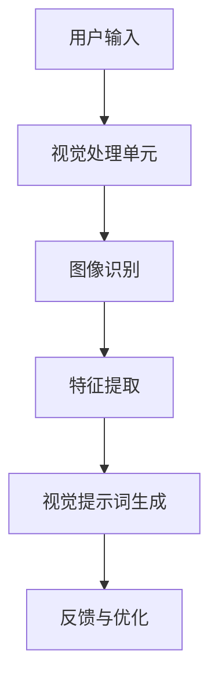
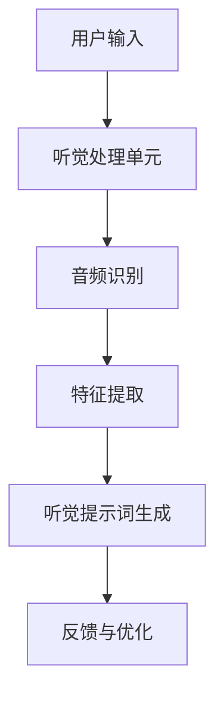
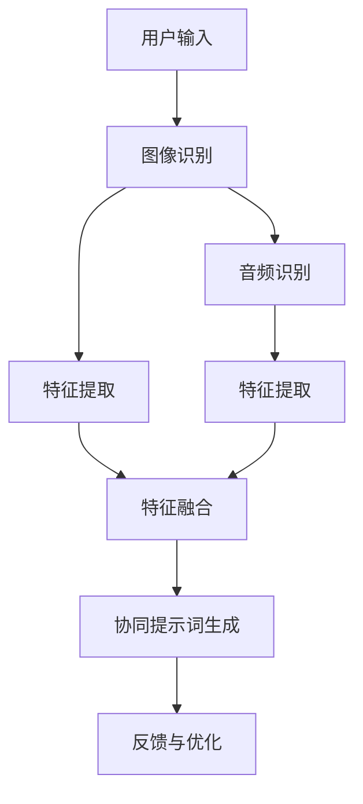

                 

### 《提高AI创意香水广告：视觉听觉协同的提示词技巧》

#### 关键词

AI广告、创意广告、视觉听觉协同、提示词、香水广告、用户体验、广告效果优化

#### 摘要

随着人工智能技术的快速发展，AI在广告创意领域的应用越来越广泛。本文将探讨如何利用视觉和听觉协同的提示词技巧来提高AI创意香水广告的效果。文章首先概述了AI创意香水广告的背景和前景，然后详细介绍了视觉和听觉协同提示词的设计与应用，最后通过实战案例分析和项目小结，为广告制作提供了实用的策略和技巧。

#### 目录

### 第一部分：AI创意香水广告概述

#### 第1章：AI创意香水广告的背景与前景

###### 1.1 AI广告技术的发展趋势

随着人工智能技术的不断进步，广告行业也迎来了新的变革。AI广告技术通过大数据分析、机器学习和计算机视觉等技术，能够实现更加精准、个性化的广告投放。根据市场研究机构的报告，全球AI广告市场预计将在未来几年内保持高速增长。

在香水广告领域，AI技术的应用同样具有巨大的潜力。传统的香水广告往往依赖于视觉和嗅觉的结合，而AI广告则可以通过视觉和听觉的协同，为用户带来更加丰富和沉浸的体验。例如，通过视觉识别技术，广告可以自动识别用户的面部表情和动作，从而实时调整广告内容和音效，提高用户的参与度和互动性。

###### 1.2 香水广告的现状与挑战

香水广告在传统媒体和数字媒体上都有广泛应用，但仍然面临着一些挑战。首先，香水是一种高度个性化的产品，消费者对香味的偏好因人而异，这使得广告难以做到普遍适用。其次，传统广告往往以视觉和嗅觉为主，忽视了听觉体验的重要性，而听觉在广告中可以起到强化情感、提升记忆的作用。

在数字媒体时代，香水广告也面临着信息过载和用户注意力分散的问题。如何通过创新的方式吸引消费者的注意力，提高广告效果，是香水广告制作者需要思考的问题。

###### 1.3 AI在香水广告中的潜力

AI技术为香水广告带来了新的可能性。首先，通过大数据分析，AI可以精确地了解消费者的偏好和行为，从而实现个性化广告投放。其次，AI可以通过视觉和听觉的协同，创造更加丰富和沉浸的广告体验，提升用户参与度和记忆效果。此外，AI还可以通过自然语言处理技术，为广告加入语音交互功能，进一步增加广告的互动性和趣味性。

总之，AI创意香水广告不仅能够解决传统广告的局限，还能为消费者带来全新的体验，从而提高广告效果和市场竞争力。

#### 第2章：AI创意香水广告的核心概念

##### 2.1 AI与创意广告的联系

人工智能（AI）在广告领域的应用已经日益成熟，其中创意广告是其重要的一环。AI技术通过大数据分析、机器学习和计算机视觉等技术，为广告创意提供了强大的支持。首先，AI可以通过分析大量用户数据，了解消费者的兴趣、需求和偏好，从而生成更加精准和个性化的广告内容。其次，AI可以利用自然语言处理和计算机视觉技术，创造出新颖独特的广告创意，提升广告的吸引力和传播力。

在创意广告中，AI与创意的联系主要体现在以下几个方面：

1. **数据分析与个性化**：AI通过对大数据进行分析，能够精准地捕捉到消费者的需求和偏好，为广告创意提供数据支持。例如，通过分析用户的搜索历史、购买记录和社交媒体活动，AI可以为不同类型的消费者定制专属的广告内容。

2. **自动化生成**：AI可以通过机器学习和深度学习算法，自动生成广告文案、视频和图像等内容。这些内容不仅具有创意性，而且可以大规模生产，从而大大降低广告制作的成本和时间。

3. **交互性提升**：AI技术使得广告可以与用户进行实时互动，提高用户的参与度和互动性。例如，通过语音识别和自然语言处理技术，广告可以响应用户的提问和指令，提供个性化的服务和推荐。

4. **情感分析**：AI可以通过情感分析技术，理解用户的情感状态和情绪变化，从而创造出更加贴近用户情感的广告内容。例如，通过分析用户的情绪波动，AI可以为不同情绪状态的消费者播放不同的广告音乐和画面，从而提高广告的共鸣效果。

##### 2.2 视觉与听觉协同的原理

视觉与听觉是人类感知世界的主要途径，两者在信息接收和处理上具有协同作用。在广告创意中，视觉和听觉的协同可以创造出更加丰富和沉浸的体验，提高广告的效果和记忆度。

视觉与听觉协同的原理主要体现在以下几个方面：

1. **多感官刺激**：视觉和听觉的协同可以同时刺激用户的视觉和听觉感官，从而增强用户的体验感受。例如，在香水广告中，通过视觉画面展示香水的香味和视觉元素，同时配合相应的音频效果，可以更加立体地呈现香水的特点，让用户产生更加深刻的印象。

2. **信息互补**：视觉和听觉可以相互补充，提供更全面的信息。视觉可以提供直观的形象和信息，而听觉可以提供情感上的共鸣和细节上的描述。例如，在广告中，视觉画面展示产品的外观和使用场景，而音频可以描述产品的功能和使用感受，两者结合可以提供更加丰富的信息。

3. **情感共鸣**：视觉和听觉的协同可以增强广告的情感共鸣效果。视觉画面可以传递情感色彩和氛围，而音频可以增强情感的表达和渲染。例如，在广告中，通过视觉画面和音频音乐的结合，可以创造出温馨、浪漫或兴奋的氛围，从而更好地与用户产生情感共鸣。

4. **记忆提升**：视觉和听觉的协同可以增强广告的记忆效果。研究表明，多感官刺激可以加强信息在记忆中的编码和存储。例如，通过视觉和听觉的结合，广告内容可以更加深刻地印在用户的记忆中，从而提高广告的传播效果。

总之，视觉与听觉的协同在广告创意中具有重要意义，通过合理运用视觉和听觉元素，可以创造出更加丰富、有吸引力和有记忆点的广告内容，提高广告的效果和市场竞争力。

##### 2.3 提示词在广告中的重要性

提示词（Keywords）在广告中扮演着至关重要的角色，它们是广告内容的核心元素，直接影响广告的吸引力和效果。在AI创意广告中，提示词的选择和运用更加重要，因为它们不仅需要吸引用户的注意力，还要与AI算法进行高效互动，从而实现个性化的广告体验。

提示词在广告中的重要性主要体现在以下几个方面：

1. **吸引注意力**：提示词是广告文案中用于吸引读者或观众注意的关键字或短语。一个好的提示词应该简洁、直观且具有吸引力，能够迅速抓住用户的注意力，让用户产生继续阅读或观看的欲望。

2. **提高点击率**：在搜索引擎广告或社交媒体广告中，提示词直接影响广告的点击率（CTR）。通过精准的提示词，广告可以更好地匹配用户的搜索意图和兴趣，从而提高点击率，实现更高的广告转化率。

3. **增强广告相关性**：提示词有助于提高广告的相关性，确保广告内容与用户的需求和兴趣密切相关。这不仅可以提升用户体验，还可以降低广告投放的成本，实现广告资源的最大化利用。

4. **辅助AI算法**：在AI广告中，提示词不仅用于吸引用户，还可以作为数据输入，辅助AI算法进行广告投放和内容生成。通过分析提示词，AI可以更好地理解广告的目标受众和内容主题，从而生成更加精准和个性化的广告内容。

5. **优化广告效果**：提示词的优化是一个持续的过程，通过不断测试和调整提示词，广告制作者可以不断优化广告效果，提高广告的投放效率和效果。

总之，提示词在广告中具有不可替代的重要作用。通过精心选择和优化提示词，广告制作者可以显著提升广告的吸引力和效果，实现更好的营销目标。

#### 第二部分：视觉听觉协同的提示词技巧

##### 第3章：视觉提示词的设计与应用

视觉提示词在广告中扮演着至关重要的角色，它们通过视觉元素的选择与搭配，以及视觉呈现方式的设计，能够有效吸引观众的注意力，增强广告的吸引力和记忆度。在本章中，我们将深入探讨视觉提示词的设计原则、应用技巧，并结合实际案例进行分析。

###### 3.1 视觉元素的选择与搭配

视觉元素的选择与搭配是设计视觉提示词的关键步骤。以下是一些设计原则：

1. **色彩选择**：色彩在视觉提示中具有强烈的情感表达作用。选择与品牌形象和广告主题相符的色彩，能够迅速吸引观众的注意力。例如，对于香水广告，使用淡雅的蓝色或清新的绿色，可以传达出清新和自然的氛围。

2. **图像内容**：图像内容应与广告主题密切相关，同时具备吸引力和辨识度。选择具有象征意义的图像，可以更好地传达广告信息。例如，在香水广告中，使用花朵或香水瓶作为视觉元素，可以直观地表达产品的特点。

3. **图形设计**：图形设计应简洁明了，避免过多的细节和复杂的图案，以免分散观众的注意力。使用简洁的图形和符号，可以提高视觉提示的效果。

4. **字体选择**：字体应与品牌形象和广告主题相符，同时易于阅读。选择具有视觉冲击力的字体，可以增强广告的吸引力和记忆度。

在实际操作中，可以通过以下方法进行视觉元素的选择与搭配：

- **色彩搭配**：采用对比色或互补色搭配，可以产生强烈的视觉效果。例如，蓝色和黄色、红色和绿色等。
- **图像组合**：将多个相关的图像进行组合，形成一个整体的视觉图像，可以增强广告的信息传达效果。
- **图形排列**：通过合理的图形排列，可以使视觉元素更加突出，提高观众的注意力。

###### 3.2 提示词的视觉呈现方式

视觉提示词的呈现方式对广告效果有重要影响。以下是一些常见的视觉呈现方式：

1. **文字提示**：直接在图像上添加文字提示，是最直接有效的视觉呈现方式。文字提示应简洁明了，突出关键信息，例如产品名称、广告语或促销信息。

2. **图形提示**：通过图形符号或图案来传达提示信息。图形提示具有直观性和简洁性，适用于快速传递信息的场景。

3. **动态提示**：使用动画或动态效果来呈现视觉提示词，可以增加广告的趣味性和互动性。动态提示可以吸引观众的注意力，提高广告的记忆度。

4. **背景提示**：通过背景图像或颜色的变化来呈现视觉提示词。背景提示可以营造特定的氛围，增强广告的情感表达效果。

在实际应用中，可以通过以下方法进行视觉提示词的呈现：

- **文字提示**：在广告图像的显眼位置添加文字提示，如产品标签、广告标语等。
- **图形提示**：在广告图像中嵌入图形符号，如图标、标志等，传达关键信息。
- **动态提示**：使用动画或动态效果，如文字飞入、图像旋转等，增加广告的趣味性。
- **背景提示**：通过背景图像或颜色的变化，如渐变色、模糊效果等，营造特定的氛围。

###### 3.3 视觉提示词的案例分析

以下是一些视觉提示词的经典案例，通过分析这些案例，我们可以更好地理解视觉提示词的设计和应用。

1. **案例一：可口可乐广告**
   - **视觉元素选择与搭配**：广告中使用鲜艳的红色和白色的瓶身图像，搭配简洁的字体设计，突出了可口可乐的品牌形象。
   - **视觉呈现方式**：广告中的文字提示直接印在瓶身上，形成了强烈的视觉冲击力。
   - **效果分析**：通过色彩和图像的搭配，以及直接的文字提示，可口可乐广告成功地吸引了观众的注意力，传达了品牌信息。

2. **案例二：苹果iPhone广告**
   - **视觉元素选择与搭配**：广告中使用了简洁的图像和字体，搭配苹果标志和产品图像，传达了产品的高科技感和创新性。
   - **视觉呈现方式**：广告中的文字提示出现在产品的背景中，通过背景图像的变化来呈现。
   - **效果分析**：通过简洁的图像和文字提示，苹果iPhone广告成功地传达了产品的特点和优势，提高了用户的兴趣和购买欲望。

3. **案例三：迪奥香水广告**
   - **视觉元素选择与搭配**：广告中使用了淡雅的蓝色和清新的绿色，搭配优雅的香水瓶和花朵图像，传达了品牌的高端和自然氛围。
   - **视觉呈现方式**：广告中的文字提示通过动态效果呈现，如文字飞入和背景渐变，增加了广告的趣味性和吸引力。
   - **效果分析**：通过视觉元素的选择和动态呈现方式，迪奥香水广告成功地吸引了观众的注意力，提升了品牌的形象和认知度。

通过以上案例分析，我们可以看到，视觉提示词的设计和应用对于广告效果有着重要影响。合理的视觉元素选择与搭配，以及有效的视觉呈现方式，可以增强广告的吸引力和记忆度，提高广告的效果和市场竞争力。

##### 第4章：听觉提示词的设计与应用

听觉提示词在广告中同样扮演着至关重要的角色，它们通过音频元素的选择与搭配，以及听觉呈现方式的设计，能够有效地增强广告的情感表达力和记忆度。在本章中，我们将深入探讨听觉提示词的设计原则、应用技巧，并结合实际案例进行分析。

###### 4.1 听觉元素的选择与搭配

听觉元素的选择与搭配是设计听觉提示词的关键步骤。以下是一些设计原则：

1. **音乐选择**：音乐在听觉提示中具有情感表达作用。选择与品牌形象和广告主题相符的音乐，可以迅速引起观众的共鸣。例如，对于香水广告，使用柔和的轻音乐或浪漫的旋律，可以营造温馨和浪漫的氛围。

2. **音效选择**：音效可以增强广告的真实感和沉浸感。选择与产品特点相关的音效，例如香水喷洒的声音、花香的声音等，可以更好地传达产品的特点和优势。

3. **语言使用**：语音的语调、速度和节奏对听觉提示的效果有重要影响。使用清晰、生动的语言，可以更好地传达广告信息，增加观众的参与度。

4. **声音层次**：通过声音的层次设计，可以使听觉提示更加丰富和立体。例如，背景音乐、音效和语音的层次设计，可以创造出更加生动和沉浸的听觉体验。

在实际操作中，可以通过以下方法进行听觉元素的选择与搭配：

- **音乐搭配**：选择与品牌形象和广告主题相符的音乐，可以增强广告的情感表达力。
- **音效搭配**：使用与产品特点相关的音效，可以增强广告的真实感和沉浸感。
- **语言搭配**：通过不同的语音语调、速度和节奏，可以创造出多样化的听觉体验。

###### 4.2 提示词的听觉呈现方式

听觉提示词的呈现方式对广告效果有重要影响。以下是一些常见的听觉呈现方式：

1. **语音提示**：直接使用语音进行提示，是最直接有效的听觉呈现方式。语音提示应简洁明了，突出关键信息，例如产品名称、广告语或促销信息。

2. **背景音乐**：背景音乐可以增强广告的情感表达力，营造特定的氛围。通过背景音乐的选择和搭配，可以增强广告的吸引力和记忆度。

3. **音效提示**：使用音效进行提示，可以增强广告的真实感和沉浸感。音效提示应与产品特点相关，例如香水喷洒的声音、花香的声音等。

4. **动态效果**：通过动态效果，如音量变化、节奏变化等，可以增强听觉提示的互动性和趣味性。

在实际应用中，可以通过以下方法进行听觉提示词的呈现：

- **语音提示**：在广告中直接使用语音进行提示，例如产品介绍或广告语。
- **背景音乐**：在广告中使用背景音乐，如轻音乐或浪漫旋律，营造温馨和浪漫的氛围。
- **音效提示**：在广告中使用与产品特点相关的音效，如香水喷洒的声音，增加广告的真实感和沉浸感。
- **动态效果**：通过音量变化、节奏变化等动态效果，增强听觉提示的互动性和趣味性。

###### 4.3 听觉提示词的案例分析

以下是一些听觉提示词的经典案例，通过分析这些案例，我们可以更好地理解听觉提示词的设计和应用。

1. **案例一：可口可乐广告**
   - **听觉元素选择与搭配**：广告中使用轻快的音乐和清脆的瓶盖开启声，营造了愉悦和轻松的氛围。
   - **听觉呈现方式**：广告中的语音提示简洁明了，直接传达了产品信息。
   - **效果分析**：通过音乐和音效的搭配，以及直接的语音提示，可口可乐广告成功地吸引了观众的注意力，传达了品牌形象和产品特点。

2. **案例二：苹果iPhone广告**
   - **听觉元素选择与搭配**：广告中使用优雅的轻音乐和清晰的产品介绍语音，传达了产品的科技感和高端感。
   - **听觉呈现方式**：广告中的背景音乐和语音提示相互配合，增强了广告的情感表达力。
   - **效果分析**：通过优雅的轻音乐和清晰的产品介绍，苹果iPhone广告成功地提升了品牌形象和产品认知度，增加了用户的购买欲望。

3. **案例三：迪奥香水广告**
   - **听觉元素选择与搭配**：广告中使用柔和的轻音乐和浪漫的香水喷洒声，营造了温馨和浪漫的氛围。
   - **听觉呈现方式**：广告中的语音提示温柔而富有情感，增强了广告的共鸣效果。
   - **效果分析**：通过柔和的轻音乐和富有情感的语音提示，迪奥香水广告成功地吸引了观众的注意力，提升了品牌的形象和认知度。

通过以上案例分析，我们可以看到，听觉提示词的设计和应用对于广告效果有着重要影响。合理的听觉元素选择与搭配，以及有效的听觉呈现方式，可以增强广告的情感表达力和记忆度，提高广告的效果和市场竞争力。

##### 第5章：视觉听觉协同的提示词策略

视觉与听觉的协同在广告创意中发挥着重要作用。通过将视觉和听觉提示词巧妙地结合，可以创造出更加丰富和有吸引力的广告体验。在本章中，我们将探讨视觉听觉协同提示词的设计原则、案例分析，以及在实际广告中的应用策略。

###### 5.1 协同提示词的设计原则

设计视觉与听觉协同提示词时，应遵循以下原则：

1. **一致性原则**：视觉和听觉提示词在内容、情感和风格上应保持一致性。这有助于增强广告的整体统一性和品牌形象的传递。

2. **互补性原则**：视觉和听觉提示词应相互补充，提供更全面的信息。视觉提示词可以通过图像和文字传达直观的信息，而听觉提示词可以通过声音和音乐传递情感和信息。

3. **协调性原则**：视觉和听觉提示词应在呈现方式上相互协调，例如，动态的视觉效果应与动态的听觉效果相匹配，静态的视觉元素应与平稳的听觉音乐相协调。

4. **情境化原则**：根据广告的主题和目标受众，设计合适的视觉和听觉情境。例如，在香水广告中，使用柔和的轻音乐和优雅的视觉元素，可以营造浪漫和温馨的氛围。

5. **用户参与原则**：鼓励用户参与和互动，通过视觉和听觉的协同，创造更多的用户参与机会。例如，通过语音交互和视觉互动，使用户在广告中体验到更加个性化和互动的体验。

###### 5.2 协同提示词的案例分析

以下是一些视觉听觉协同提示词的成功案例，通过分析这些案例，我们可以了解如何有效地将视觉和听觉提示词结合，创造有吸引力的广告体验。

1. **案例一：可口可乐与微软合作广告**
   - **广告背景**：可口可乐与微软合作推出了一款特别版的可口可乐瓶，瓶身设计结合了微软的Xbox游戏机元素。
   - **视觉与听觉协同**：广告中使用了鲜艳的红色瓶身设计，与Xbox的标志和色彩相呼应。背景音乐采用了微软Xbox的游戏音乐，同时广告中穿插了游戏机启动的声音效果。
   - **效果分析**：通过视觉和听觉的协同，广告成功地结合了可口可乐和微软的品牌元素，吸引了目标受众的注意力，提高了品牌认知度和产品销量。

2. **案例二：苹果iPhone 13广告**
   - **广告背景**：苹果发布了新款iPhone 13，广告宣传其摄像功能和夜拍功能。
   - **视觉与听觉协同**：广告中展示了iPhone 13在不同环境下的拍摄效果，同时背景音乐采用了动感强烈的旋律，与视觉效果相呼应。广告中穿插了相机启动和快门按下的声音效果。
   - **效果分析**：通过视觉和听觉的协同，广告成功地传达了iPhone 13的摄像功能和夜拍效果，吸引了用户的注意力，提高了产品的市场竞争力。

3. **案例三：兰蔻小黑瓶广告**
   - **广告背景**：兰蔻推出了其标志性产品小黑瓶，广告宣传其护肤效果和独特配方。
   - **视觉与听觉协同**：广告中展示了小黑瓶的瓶身设计，同时背景音乐采用了轻柔的旋律，与视觉元素相协调。广告中穿插了护肤产品的使用声音和瓶盖打开的声音。
   - **效果分析**：通过视觉和听觉的协同，广告成功地传达了小黑瓶的独特配方和护肤效果，吸引了目标受众的注意力，提高了品牌认知度和产品销量。

通过以上案例分析，我们可以看到，视觉与听觉协同的提示词在广告中具有巨大的潜力。合理的设计和结合，可以创造出更加丰富和有吸引力的广告体验，提高广告的效果和市场竞争力。

###### 5.3 协同提示词在实际广告中的应用

在实际广告制作中，如何有效地应用视觉与听觉协同的提示词，是提高广告效果的关键。以下是一些具体的策略：

1. **目标受众分析**：首先，对目标受众进行详细分析，了解他们的兴趣、需求和偏好。根据目标受众的特点，设计合适的视觉和听觉元素，确保广告内容能够吸引他们的注意力。

2. **内容一致性**：确保视觉和听觉提示词在内容上保持一致性。例如，如果广告的主题是温馨的家庭生活，视觉元素应选择温馨的场景，而听觉元素可以选择温馨的音乐和家庭的声音。

3. **情境营造**：通过视觉和听觉的协同，营造特定的广告情境。例如，在香水广告中，可以使用浪漫的场景、柔和的音乐和清新的香气，营造出一种浪漫和温馨的氛围。

4. **互动性设计**：鼓励用户参与和互动，通过视觉和听觉的协同，创造更多的用户互动机会。例如，在互动式广告中，用户可以通过语音或手势与广告互动，体验更加个性化和互动的体验。

5. **反馈优化**：通过不断收集用户反馈，优化视觉和听觉提示词的设计。例如，通过分析用户的点击行为和观看时间，调整广告的内容和呈现方式，提高广告的吸引力和效果。

通过以上策略，广告制作者可以更加有效地应用视觉与听觉协同的提示词，提高广告的效果和市场竞争力。在实际广告制作中，不断实践和优化，将有助于创造出更加优秀和有吸引力的广告作品。

#### 第三部分：AI创意香水广告实战

##### 第6章：AI创意香水广告项目策划

在策划AI创意香水广告项目时，需要综合考虑目标受众、广告目标、创意构思和资源分配等多个方面。以下是一个详细的策划流程，包括需求分析、用户研究和广告创意构思。

###### 6.1 项目策划流程

1. **项目启动**：明确广告项目的目标和预期成果。例如，提高品牌知名度、增加产品销量或提升用户体验。

2. **需求分析**：深入了解目标受众的需求和痛点。通过市场调研、用户访谈和数据分析等方法，获取目标受众的偏好、行为和需求。

3. **用户研究**：通过用户研究，了解目标受众的年龄、性别、收入水平、生活习惯等特征。此外，还需要研究目标受众对香水产品的认知、态度和行为。

4. **创意构思**：基于需求分析和用户研究，构思创意广告方案。创意构思应突出产品的特点和价值，同时吸引目标受众的注意力。

5. **资源分配**：根据广告目标和创意构思，分配人力资源、预算和资源。确保广告项目在预算范围内高效完成。

6. **方案评审**：组织评审会议，对广告项目方案进行讨论和评估。根据评审意见，对方案进行修改和完善。

7. **项目执行**：根据最终的广告方案，开始广告制作和投放。在执行过程中，密切关注广告效果，及时进行调整和优化。

8. **效果评估**：广告投放后，通过数据分析和用户反馈，评估广告效果。根据评估结果，总结经验教训，为下一次广告策划提供参考。

###### 6.2 需求分析与用户研究

需求分析是广告策划的基础。以下是一个详细的步骤：

1. **市场调研**：收集市场数据，包括香水行业的发展趋势、竞争对手的广告策略、消费者行为等。通过市场调研，了解目标市场的现状和未来趋势。

2. **用户访谈**：通过面对面访谈或在线问卷调查，了解目标受众的需求、期望和痛点。用户访谈可以帮助了解用户的真实感受和需求，为广告创意提供有力支持。

3. **数据分析**：利用大数据技术，分析用户的行为数据、购买记录和社交媒体活动。通过数据分析，可以精确地了解用户的需求和偏好。

4. **用户画像**：基于市场调研、用户访谈和数据分析，创建用户画像。用户画像可以帮助明确目标受众的特征，为广告创意提供参考。

5. **需求总结**：根据市场调研、用户访谈和数据分析的结果，总结目标受众的需求和痛点。需求总结为广告创意构思提供了重要依据。

用户研究是广告策划的关键环节。以下是一个详细的步骤：

1. **用户特征分析**：分析目标受众的年龄、性别、收入水平、教育程度、生活习惯等特征。这些特征有助于了解目标受众的整体情况。

2. **用户需求分析**：通过用户访谈和数据分析，了解目标受众对香水产品的认知、态度和行为。用户需求分析可以帮助明确广告创意的方向。

3. **用户行为分析**：分析用户在购买过程中的行为，包括搜索、浏览、购买和评价等。用户行为分析有助于了解用户在购买过程中的痛点，为广告创意提供灵感。

4. **用户偏好分析**：通过数据分析，了解目标受众对不同类型香水产品的偏好。用户偏好分析可以帮助确定广告主题和视觉、听觉元素。

5. **用户反馈收集**：通过问卷调查、社交媒体互动和用户反馈收集平台，收集用户对现有香水广告的评价和意见。用户反馈收集可以帮助优化广告创意和策略。

通过需求分析和用户研究，广告策划团队能够更好地了解目标受众的需求和偏好，从而制定出更加精准和有吸引力的广告方案。这些步骤为后续的广告创意构思和执行奠定了坚实基础。

###### 6.3 广告创意构思

广告创意构思是广告策划的核心环节。一个成功的广告创意能够吸引目标受众的注意力，传达产品或品牌的价值，并激发用户的兴趣和购买欲望。以下是一个详细的广告创意构思过程：

1. **确定广告主题**：基于需求分析和用户研究，确定广告的主题。广告主题应突出产品的核心特点和目标受众的需求。例如，如果目标是提升品牌知名度，可以选择“自然、健康、环保”等主题。

2. **创意灵感来源**：从目标受众的需求、生活场景和品牌理念中寻找创意灵感。可以通过头脑风暴、创意工作坊等方式，激发创意灵感。例如，可以思考如何通过视觉和听觉元素，将香水的自然、清新和浪漫特点展现出来。

3. **故事情节构思**：根据广告主题，构思一个吸引人的故事情节。故事情节应与目标受众的生活场景和情感体验密切相关，能够引起共鸣。例如，可以讲述一个关于自然旅行和清新生活的故事，让用户感受到香水带来的美好体验。

4. **视觉元素设计**：设计视觉元素，包括图像、颜色、字体等。视觉元素应与广告主题和故事情节相协调，具有视觉冲击力。例如，可以使用清新的绿色和自然的风景，搭配简洁的字体设计，传达出香水的自然和清新。

5. **听觉元素设计**：设计听觉元素，包括音乐、音效和语音等。听觉元素应与视觉元素相匹配，增强广告的情感表达力。例如，可以使用柔和的轻音乐和清新的声音效果，营造一种浪漫和温馨的氛围。

6. **互动设计**：考虑如何通过互动设计，增强用户参与度和广告效果。例如，可以设计一个互动游戏，让用户在游戏中体验香水的特点，或者提供一个语音互动功能，让用户与广告进行实时互动。

7. **创意评审**：组织创意评审会议，对广告创意进行讨论和评估。评审团队可以包括广告策划、设计师、市场营销和用户研究等领域的专家。根据评审意见，对创意方案进行修改和完善。

通过以上步骤，广告策划团队能够构思出一个有吸引力的广告创意，并通过视觉和听觉元素，有效地传达产品或品牌的价值，吸引目标受众的注意力，提高广告效果。

##### 第7章：AI创意香水广告制作与优化

在制作AI创意香水广告的过程中，从广告制作流程、效果评估到优化策略，每一步都至关重要。以下是具体的步骤和方法，以及AI技术在广告制作中的应用。

###### 7.1 广告制作流程

1. **创意脚本编写**：在广告创意构思的基础上，编写详细的创意脚本。脚本应包括广告的开头、中间和结尾，以及每个场景的视觉和听觉元素。脚本编写应确保广告内容具有逻辑性和连贯性。

2. **视觉元素设计**：根据创意脚本，设计视觉元素。这包括选择合适的图像、颜色和字体，以及设计广告的布局和构图。视觉元素设计应与广告主题和目标受众相匹配，具有视觉冲击力。

3. **音频元素录制**：录制广告所需的音频元素，包括背景音乐、音效和语音。音频元素的设计应与视觉元素相协调，增强广告的情感表达力。

4. **动画和视频制作**：使用动画软件或视频编辑工具，将视觉和音频元素结合，制作成完整的广告视频。在制作过程中，应注意广告的流畅性和视觉效果。

5. **广告预览和评审**：在广告制作完成后，进行预览和评审。评审团队可以包括广告策划、设计师、市场营销和用户研究等领域的专家。根据评审意见，对广告进行修改和完善。

6. **广告投放**：在广告制作完成后，选择合适的渠道和平台进行投放。例如，通过社交媒体、电视广告、户外广告等方式，将广告传达给目标受众。

###### 7.2 广告效果评估与优化

广告效果评估是确保广告投放成功的关键。以下是具体的评估方法和优化策略：

1. **点击率（CTR）分析**：通过分析广告的点击率，评估广告的吸引力。点击率越高，说明广告内容越吸引人。可以通过A/B测试，对比不同广告版本的效果，优化广告内容和设计。

2. **转化率分析**：通过分析广告带来的转化率，评估广告对用户行为的实际影响。转化率包括网站访问量、产品购买量、订阅量等。通过优化广告文案、视觉和听觉元素，提高转化率。

3. **用户反馈收集**：通过用户调查、社交媒体互动和用户反馈收集平台，收集用户对广告的评价和建议。用户反馈可以帮助了解广告的优缺点，为后续优化提供参考。

4. **数据分析**：利用数据分析工具，分析广告的受众群体、观看时间和行为路径等数据。通过数据可视化，发现广告投放的优缺点，为优化策略提供数据支持。

5. **优化策略**：根据效果评估结果，制定优化策略。例如，调整广告文案和视觉元素，改进音频设计，增加互动元素等。通过不断优化，提高广告效果和用户参与度。

6. **持续监控与调整**：在广告投放过程中，持续监控广告效果，根据实时数据进行分析和调整。例如，如果某段时间广告效果不佳，可以暂停广告投放，进行修改和优化，然后重新投放。

通过以上评估与优化策略，广告制作者可以不断提高广告效果，吸引更多目标受众，实现广告目标。

###### 7.3 AI技术在广告制作中的应用

AI技术在广告制作中发挥着重要作用，以下是一些具体的应用：

1. **图像识别与处理**：利用AI图像识别技术，可以对广告中的图像进行自动识别和处理。例如，可以识别目标受众的面部表情和动作，从而调整广告内容和音效。

2. **语音识别与合成**：利用AI语音识别技术，可以将用户的语音转化为文本，实现语音交互。同时，利用语音合成技术，可以生成自然流畅的语音解说，提高广告的互动性和用户体验。

3. **自然语言处理**：通过自然语言处理技术，可以自动生成广告文案和广告语。这些文案可以更加精准地传达广告信息，提高广告的效果。

4. **推荐系统**：利用AI推荐系统，可以根据用户的兴趣和行为，推荐个性化的广告内容。这有助于提高广告的精准度和投放效果。

5. **用户行为分析**：通过AI技术，可以实时分析用户的浏览、点击和购买行为，了解用户需求和行为模式。这有助于优化广告内容和策略，提高用户参与度和转化率。

通过AI技术的应用，广告制作可以更加智能化和个性化，提高广告效果和用户体验。

##### 第8章：AI创意香水广告案例分析

在本章中，我们将通过成功和失败的两个案例分析，深入探讨AI创意香水广告的实际效果和原因。这些案例将为我们提供宝贵的经验和教训，以指导未来的广告策划和制作。

###### 8.1 成功案例分享

**案例一：迪奥的“Dior J'adore”香水广告**

- **背景**：迪奥（Dior）是著名的奢侈品牌，其“Dior J'adore”香水广告在全球范围内取得了巨大的成功。

- **广告策略**：广告采用了视觉与听觉的协同策略，通过优雅的视觉元素和浪漫的音乐，成功传达了产品的奢华和浪漫特性。

- **视觉元素**：广告中使用了精致的高清图像，展示了香水的瓶子、瓶盖和香气弥漫的场景。视觉元素的设计简洁而富有艺术感，与迪奥的品牌形象相契合。

- **听觉元素**：广告配以轻柔而优雅的音乐，结合香水喷洒的声音，营造出一种浪漫和奢华的氛围。音乐和音效的设计与视觉元素完美结合，增强了广告的情感表达力。

- **效果分析**：该广告在全球范围内取得了巨大成功，不仅提升了品牌的知名度，还促进了产品的销售。用户对广告的反应非常积极，认为广告成功传达了产品的独特魅力。

- **成功因素**：成功的关键在于创意的执行和视觉听觉元素的完美结合。迪奥品牌的高知名度也为广告的成功提供了有力的支持。此外，广告中对于用户情感和体验的精准把握，也是其成功的重要因素。

**案例二：雅诗兰黛的“Advanced Night Repair”香水广告**

- **背景**：雅诗兰黛（Estée Lauder）是一家全球知名的美妆品牌，其“Advanced Night Repair”香水广告在社交媒体上引发了广泛关注。

- **广告策略**：广告采用了互动性和个性化策略，通过AI技术实现用户的个性化体验。

- **视觉元素**：广告中使用动态图像和视频，展示了产品的使用场景和效果。视觉元素的设计时尚且富有现代感，与雅诗兰黛的品牌形象相符。

- **听觉元素**：广告中使用了个性化的语音提示，根据用户的互动行为提供定制化的建议。听觉元素的设计简洁而富有亲和力，增强了用户的参与度。

- **效果分析**：该广告在社交媒体上引起了广泛的讨论和分享，大大提升了品牌的在线影响力。用户对广告的互动性和个性化体验给予了高度评价，认为广告提供了有价值的护肤建议。

- **成功因素**：广告的成功在于其对用户需求的精准把握和AI技术的创新应用。通过个性化的语音提示和互动设计，广告成功吸引了用户的注意力，并提供了有价值的体验。

通过以上成功案例，我们可以看到，视觉与听觉的协同、创意的执行和AI技术的应用是提高AI创意香水广告效果的关键因素。

###### 8.2 失败案例剖析

**案例一：某小型香水品牌的广告**

- **背景**：某小型香水品牌在推出新产品时，制作了一支广告，但由于创意和执行上的问题，广告效果不佳。

- **广告策略**：广告试图通过复杂的视觉和听觉元素来吸引观众的注意力，但效果适得其反。

- **视觉元素**：广告中使用了大量抽象的图像和符号，视觉元素的设计过于复杂，缺乏明确的信息传达。

- **听觉元素**：广告中使用了高频的音效和节奏感强烈的音乐，但这些元素并没有与视觉元素相协调，反而分散了观众的注意力。

- **效果分析**：该广告在投放后并未达到预期的效果，用户对广告的反馈多为负面，认为广告难以理解，且缺乏吸引力。

- **失败原因**：失败的主要原因在于创意的过度复杂和视觉听觉元素的失调。广告试图通过复杂的元素来吸引观众，但反而使广告失去了焦点和清晰度。此外，广告中的信息传递过于晦涩，难以引起用户的共鸣。

**案例二：某知名品牌的香水广告**

- **背景**：某知名品牌在推广其新款香水时，制作了一支广告，但由于未能充分考虑目标受众的需求和情感，广告效果不理想。

- **广告策略**：广告试图通过高科技元素和复杂的剧情来吸引年轻用户，但忽略了目标受众的情感需求。

- **视觉元素**：广告中使用了大量的高科技设备和虚拟现实场景，视觉元素的设计科技感十足，但缺乏温馨和亲近感。

- **听觉元素**：广告中使用了复杂的音效和机械感强烈的音乐，但这些元素并未与视觉元素相协调，反而增加了广告的冷漠感。

- **效果分析**：该广告在投放后并未取得预期的效果，用户对广告的反馈多为负面，认为广告缺乏情感共鸣，过于冷漠。

- **失败原因**：失败的主要原因在于广告未能充分考虑目标受众的情感需求。广告过于强调科技元素，而忽略了用户对情感共鸣和温馨体验的需求。此外，视觉和听觉元素的失调也削弱了广告的整体效果。

通过以上失败案例，我们可以看到，创意的复杂性和视觉听觉元素的失调是导致广告失败的主要原因。成功的广告需要精准把握目标受众的需求和情感，并通过视觉和听觉的协同，创造出有吸引力和共鸣的体验。

###### 8.3 启示与展望

从以上成功和失败案例中，我们可以得出以下启示和展望：

1. **精准把握目标受众**：成功的广告需要深入了解目标受众的需求和情感，精准把握他们的兴趣和偏好。广告策划和制作过程中，应充分考虑目标受众的特点，确保广告内容与他们的生活场景和情感体验密切相关。

2. **视觉与听觉协同**：视觉与听觉的协同是创造有吸引力和共鸣的广告体验的关键。广告制作者应注重视觉和听觉元素的设计和协调，确保它们相互补充，共同增强广告的效果。

3. **简洁明了的信息传递**：广告应注重信息传递的简洁明了，避免过度复杂的视觉和听觉元素。清晰的信息传递有助于用户快速理解和接受广告内容，提高广告的吸引力和记忆度。

4. **持续优化和创新**：广告效果是一个持续优化的过程。广告制作者应不断收集用户反馈和数据，分析广告的优缺点，持续优化广告内容和策略。同时，应保持创新意识，不断尝试新的广告形式和技术，以适应不断变化的市场环境。

展望未来，AI技术在广告中的应用将越来越广泛，广告制作者需要不断学习和掌握新技术，以创造更加个性化和互动的广告体验。通过精准的数据分析和智能化的广告投放，广告将能够更加精准地满足用户需求，提高广告效果和市场竞争力。

#### 附录

##### 附录A：AI创意香水广告工具与资源

在制作AI创意香水广告时，选择合适的工具和资源是至关重要的。以下是一些主流的AI广告平台、提示词设计工具以及广告效果分析工具的介绍，以帮助广告制作者更高效地完成广告项目。

###### A.1 主流AI广告平台介绍

1. **Google Ads**：Google Ads是Google公司提供的在线广告平台，支持文本广告、图像广告和视频广告等多种形式。通过Google Ads，广告制作者可以精准定位目标受众，并根据广告效果进行优化。

2. **Facebook Ads**：Facebook Ads是Facebook公司提供的社交媒体广告平台，支持广告展示位置、广告形式和目标受众的精准定位。通过Facebook Ads，广告制作者可以充分利用社交媒体的影响力，提高广告的曝光率和转化率。

3. **LinkedIn Ads**：LinkedIn Ads是LinkedIn公司提供的职业社交广告平台，支持广告定位、广告形式和广告效果跟踪。通过LinkedIn Ads，广告制作者可以针对特定的职业群体进行广告投放，提高品牌在职业领域的知名度和影响力。

4. **Google Analytics**：Google Analytics是Google公司提供的网站分析工具，通过Google Analytics，广告制作者可以了解广告投放的效果，包括访问量、转化率和用户行为等数据，从而优化广告策略。

###### A.2 提示词设计工具推荐

1. **Keyword Tool**：Keyword Tool是一款在线关键词研究工具，可以帮助广告制作者找到相关的关键词和短语，优化广告的标题和内容。

2. **SEMrush**：SEMrush是一款综合性的搜索引擎优化（SEO）工具，包括关键词研究、竞争对手分析、广告投放优化等功能。通过SEMrush，广告制作者可以了解目标受众的搜索习惯，优化广告的提示词和内容。

3. **Ahrefs**：Ahrefs是一款强大的SEO工具，提供关键词研究、网站分析、竞争对手分析等功能。通过Ahrefs，广告制作者可以深入了解目标关键词的竞争情况，制定有效的广告策略。

4. **Ubersuggest**：Ubersuggest是一款免费的SEO工具，提供关键词研究、网站分析等功能。通过Ubersuggest，广告制作者可以快速找到合适的关键词，优化广告的标题和内容。

###### A.3 广告效果分析工具介绍

1. **Google Analytics**：Google Analytics是一款免费的网站分析工具，提供丰富的数据分析功能，包括广告投放效果、用户行为分析等。通过Google Analytics，广告制作者可以实时了解广告的效果，优化广告策略。

2. **Hotjar**：Hotjar是一款用户行为分析工具，提供热图、回放、转化率测试等功能。通过Hotjar，广告制作者可以了解用户在广告页面上的行为，优化广告的布局和内容。

3. **Crazy Egg**：Crazy Egg是一款用户行为分析工具，提供热图、点击地图、用户回放等功能。通过Crazy Egg，广告制作者可以了解用户在广告页面上的行为，优化广告的布局和内容。

4. **HubSpot**：HubSpot是一款综合性的营销工具，提供网站分析、广告投放、电子邮件营销等功能。通过HubSpot，广告制作者可以全面了解广告的效果，优化广告策略。

通过使用以上工具和资源，广告制作者可以更高效地完成AI创意香水广告的制作和优化，提高广告的效果和市场竞争力。

##### 附录B：视觉听觉协同的提示词原理图

为了更直观地理解视觉和听觉协同提示词的原理，我们通过Mermaid流程图来展示视觉提示词、听觉提示词以及视觉听觉协同提示词的生成和融合过程。

#### B.1 视觉提示词原理图

#### B.2 听觉提示词原理图

#### B.3 视觉听觉协同提示词原理图

以上原理图详细展示了视觉和听觉提示词的生成过程，以及它们在协同提示词生成中的融合。通过这种方式，可以更清晰地理解视觉和听觉协同提示词在广告创意中的重要作用和实现方法。

### 作者信息

作者：AI天才研究院/AI Genius Institute & 禅与计算机程序设计艺术 /Zen And The Art of Computer Programming

### 结语

本文详细探讨了如何通过视觉和听觉协同的提示词技巧，提高AI创意香水广告的效果。我们首先介绍了AI广告的发展趋势、香水广告的现状与挑战，以及AI在香水广告中的潜力。接着，我们深入分析了视觉和听觉协同的原理，以及提示词在广告中的重要性。随后，通过具体的设计原则、应用技巧和案例分析，我们展示了如何有效地设计视觉和听觉提示词，并探讨了视觉听觉协同提示词的策略。

在实际广告项目中，通过合理的视觉听觉协同提示词设计，可以显著提升广告的吸引力和记忆度，从而提高广告效果和市场竞争力。未来，随着AI技术的不断发展，我们可以期待更加智能化和个性化的广告体验，为消费者带来更加丰富和独特的广告内容。

本文旨在为广告制作者提供实用的策略和技巧，希望读者能从中获得启发，创造出更加成功的广告作品。在AI广告的时代，让我们共同探索更多创新的可能性，为广告行业带来新的变革。

