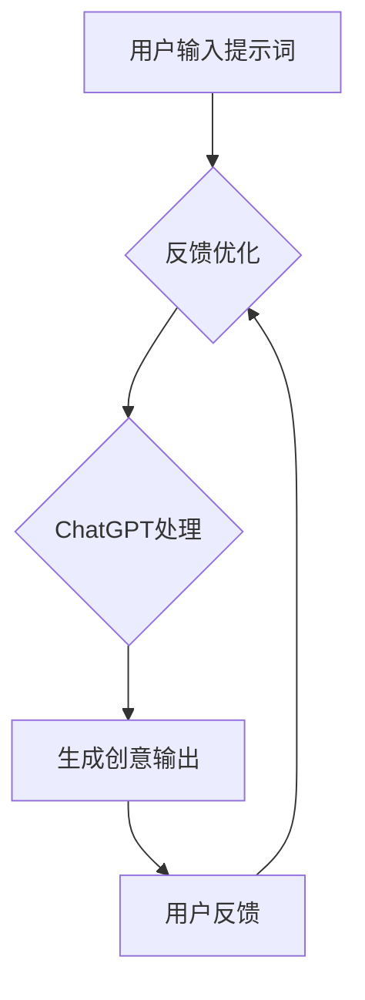
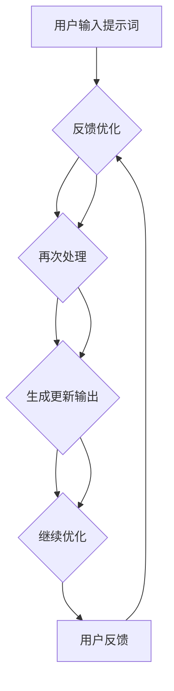

                 

### 文章标题

《提高ChatGPT创意输出的提示词方法》

---

**关键词：** ChatGPT、创意输出、提示词设计、高级技巧、案例解析、未来展望

---

**摘要：** 本文旨在探讨如何通过优化提示词来提高ChatGPT的创意输出能力。我们将首先介绍ChatGPT的基础知识，包括其起源、核心特点以及提示词的作用。接着，我们将深入分析创意输出的重要性，探讨提示词设计的原则和方法。文章的后半部分将介绍高级技巧和案例解析，最后对未来ChatGPT在创意领域的应用前景进行展望。通过本文的阅读，读者将能够掌握一系列实用的技巧，提升ChatGPT的创意输出能力。### 第一部分：ChatGPT基础与提示词原理

#### 第1章：ChatGPT概述

##### **1.1 ChatGPT的起源与发展**

ChatGPT是由OpenAI开发的一种基于GPT-3模型的聊天机器人。GPT-3（Generative Pre-trained Transformer 3）是OpenAI于2020年推出的一种自然语言处理模型，它拥有1750亿个参数，是目前世界上最大的自然语言处理模型之一。ChatGPT的诞生可以追溯到2022年11月，它是基于GPT-3模型进行了特定任务的微调和优化，使其能够更好地胜任聊天机器人的角色。

ChatGPT的发展离不开OpenAI这一团队。OpenAI成立于2015年，由山姆·阿尔特曼、山姆·柯克帕特里克和戴密斯·哈萨比斯共同创立。OpenAI的使命是“实现安全的通用人工智能（AGI）并使其有益于人类”。自成立以来，OpenAI在人工智能领域取得了多项突破性成果，如GPT系列模型、DALL·E图像生成模型等。

##### **1.2 ChatGPT的核心特点**

ChatGPT的核心特点主要体现在以下几个方面：

1. **大规模预训练模型**：ChatGPT基于GPT-3模型，具有1750亿个参数，这意味着它拥有强大的语言理解和生成能力。通过大规模预训练，ChatGPT能够学习到大量语言模式和知识，从而在处理各种自然语言任务时表现出色。

2. **自适应学习与生成能力**：ChatGPT具备自适应学习能力，能够根据不同的输入提示生成相应的回复。此外，ChatGPT的生成能力非常强，能够生成连贯、流畅且具有创意性的文本。

3. **上下文理解能力**：ChatGPT能够理解输入文本的上下文，这使得它能够更好地把握对话的连贯性和逻辑性。在处理多轮对话时，ChatGPT能够根据之前的对话内容进行合理的回复。

##### **1.3 提示词在ChatGPT中的作用**

提示词在ChatGPT中的作用至关重要。提示词是用户输入的信息，用于引导ChatGPT生成相应的回复。以下是提示词在ChatGPT中的作用：

1. **定义与类型**：提示词是指用户输入的用于引导ChatGPT生成回复的文本。根据提示词的目的和内容，可以将提示词分为以下几种类型：
   - **问题性提示词**：用于提出问题，如“你有什么建议？”
   - **描述性提示词**：用于描述情景或场景，如“请给我写一篇关于人工智能的文章。”
   - **命令性提示词**：用于给出指令，如“帮我制定一个旅游计划。”

2. **对生成结果的影响**：提示词的质量直接影响ChatGPT的生成结果。优质的提示词能够引导ChatGPT生成更符合用户需求的回复，而低质量的提示词可能会导致生成结果偏离用户意图。

3. **优化与调整**：通过不断优化和调整提示词，可以进一步提高ChatGPT的生成效果。例如，可以尝试使用更具体、更明确的提示词，或者对提示词进行微调，使其更贴近用户的实际需求。

##### **1.4 提示词设计的原则**

为了提高ChatGPT的创意输出能力，提示词设计需要遵循以下原则：

1. **清晰性**：提示词应明确表达用户意图，避免模糊不清的描述，以便ChatGPT能够准确理解并生成相应的回复。

2. **灵活性**：提示词应具有一定的灵活性，能够适应多种情景和需求。这样，ChatGPT在处理不同类型的提示词时，都能够生成高质量的回复。

3. **创意性**：提示词应具有创意性，能够激发ChatGPT的创意思维，从而生成更具创意性的回复。这可以通过使用独特的词汇、提出新颖的问题或描述有趣的情景来实现。

4. **适应性**：提示词应具有适应性，能够根据用户的需求和反馈进行实时调整。这样，ChatGPT能够更好地满足用户的需求，提高用户满意度。

##### **1.5 提示词的创意生成方法**

为了提高ChatGPT的创意输出能力，可以采用以下几种提示词创意生成方法：

1. **迁移学习与微调**：通过迁移学习，可以将预训练模型的知识迁移到特定任务上。微调是迁移学习的一种常见方法，通过对模型进行微调，使其更好地适应特定任务。

2. **自动化生成与优化**：可以使用自动化工具对提示词进行生成和优化。这些工具可以基于机器学习和自然语言处理技术，从大量数据中提取有价值的信息，并生成高质量的提示词。

3. **用户反馈与迭代改进**：通过收集用户的反馈，可以不断优化提示词。用户反馈有助于识别生成结果的不足之处，从而为后续的提示词设计提供有价值的参考。

4. **多样化策略**：可以采用多样化的策略来生成提示词，如使用不同的词汇、句式和表达方式。这样可以丰富ChatGPT的生成结果，提高其创意输出能力。

#### **1.6 小结**

本文介绍了ChatGPT的起源与发展、核心特点、提示词的作用及设计原则。ChatGPT作为一种基于大规模预训练模型的聊天机器人，具有强大的语言理解和生成能力。通过优化提示词，可以进一步提高ChatGPT的创意输出能力，为用户提供更优质的聊天体验。在接下来的章节中，我们将继续探讨提示词设计的具体方法和高级技巧。### 第二部分：高级技巧与案例解析

#### 第3章：高级技巧

##### **3.1 提示词的复杂性控制**

在设计与使用提示词时，控制提示词的复杂性至关重要。这不仅能帮助ChatGPT更准确地理解用户的意图，还能提高生成结果的连贯性和质量。以下是几种控制提示词复杂性的方法：

1. **简化复杂问题**：
   - 将复杂的描述分解为简单的子问题。
   - 使用简单的词汇和句式，避免过于复杂的表达。
   - 提供清晰的背景信息和上下文，帮助ChatGPT更好地理解问题。

   **示例**：
   - 错误的提示词：“你能帮我写一篇关于深度学习在医疗领域应用的论文吗？”
   - 改进的提示词：“请简要介绍深度学习在医疗领域的一个应用实例。”

2. **模拟特定情境**：
   - 根据用户的描述，模拟一个具体的情境。
   - 使用情景化语言，使ChatGPT能够更好地生成符合情境的回复。
   - 提供具体的场景设定，如时间、地点、角色等，以便ChatGPT生成更具体的回复。

   **示例**：
   - 错误的提示词：“你能给我讲讲人工智能的未来吗？”
   - 改进的提示词：“在2030年，人工智能在日常生活中的应用会是怎样的？”

##### **3.2 提示词的情感调节**

情感调节是指通过调整提示词来影响ChatGPT生成结果的情感色彩。以下是一些情感调节的方法：

1. **情感识别与分类**：
   - 使用情感分析技术，对提示词进行情感分类，如正面、负面或中性。
   - 根据情感分类结果，选择适当的词汇和句式来生成情感匹配的回复。

2. **情感增强与减弱**：
   - 使用积极的词汇和表达方式，增强生成结果的正面情感。
   - 使用消极的词汇和表达方式，减弱生成结果的负面情感。
   - 调整生成结果的语气和节奏，以适应不同的情感需求。

   **示例**：
   - 错误的提示词：“这个产品很差。”
   - 改进的提示词：“我对这个产品的体验有些不满意。”

##### **3.3 提示词的多模态整合**

多模态整合是指将不同类型的模态（如文本、图像、音频等）整合到提示词中，以丰富生成结果的多样性和创意性。以下是一些多模态整合的方法：

1. **文本与图像结合**：
   - 提供文本描述的同时，加入相关的图像或图片。
   - 使用图像识别技术，将文本描述与图像内容进行关联，生成更具创意性的回复。

   **示例**：
   - 错误的提示词：“请描述一张美丽的风景画。”
   - 改进的提示词：“请结合以下图片，描述一张美丽的风景画。”

2. **音频与视频协同**：
   - 在生成文本回复的同时，提供相关的音频或视频内容。
   - 利用音频和视频的情景信息，增强生成结果的情境感和沉浸感。

   **示例**：
   - 错误的提示词：“请介绍一下这部电影。”
   - 改进的提示词：“请结合以下电影片段，介绍一下这部电影。”

#### **3.4 小结**

通过本章的高级技巧，我们可以更有效地设计提示词，以控制其复杂性、调节情感色彩以及整合多模态信息。这些技巧不仅能够提高ChatGPT的创意输出能力，还能为用户提供更丰富、更高质量的交互体验。在下一章中，我们将通过具体的案例解析，进一步展示如何在实际应用中运用这些高级技巧。### 第4章：案例分析与实战

#### **4.1 营销创意案例解析**

在营销领域，创意输出对于产品推广和用户互动至关重要。以下是一个营销创意案例，我们将详细解析其开发环境搭建、源代码实现和代码解读。

##### **案例背景**：
一家科技公司推出了一款智能健康监测设备，希望通过ChatGPT生成个性化的营销文案，以提高用户对产品的兴趣和购买意愿。

##### **开发环境搭建**：
1. **硬件需求**：计算机硬件配置需达到较高水平，以支持大规模的模型运算。
2. **软件需求**：安装Python环境，并使用OpenAI提供的API接口。

```python
!pip install openai
```

##### **源代码实现**：
以下是用于生成营销文案的源代码实现：

```python
import openai

openai.api_key = "your_api_key"

def generate_marketing_copy(product_name, target Audience):
    prompt = f"请为我生成一篇关于{product_name}的营销文案，目标受众是{target_Audience}。"
    response = openai.Completion.create(
        engine="text-davinci-002",
        prompt=prompt,
        max_tokens=500,
        n=1,
        stop=None,
        temperature=0.5,
    )
    return response.choices[0].text.strip()

# 调用函数生成文案
marketing_copy = generate_marketing_copy("智能健康监测设备", "注重健康的中年人群")
print(marketing_copy)
```

##### **代码解读**：
1. **引入库**：使用`openai`库，并设置API密钥。
2. **函数定义**：`generate_marketing_copy`函数接受产品名称和目标受众作为输入参数。
3. **提示词生成**：根据输入参数生成提示词，并调用OpenAI的API进行文本生成。
4. **返回结果**：返回生成的营销文案。

##### **代码应用解读与分析**：
1. **营销文案生成**：通过函数调用，生成一篇针对特定产品的营销文案。
2. **效果评估**：通过用户反馈，评估营销文案的质量和效果。

**示例结果**：
```
"智能健康监测设备，让您的健康尽在掌握。关注中年人群的健康需求，我们推出了一款智能健康监测设备。无论您是在家中还是外出，只需佩戴这款设备，即可实时监测您的健康状况。通过精确的数据分析，我们为您提供个性化的健康建议，帮助您维持健康的生活方式。现在就行动起来，加入我们的健康之旅吧！"
```

#### **4.2 教育场景应用案例**

在教育领域，ChatGPT可以用于在线教育互动、自动批改和个性化辅导。以下是一个教育场景应用案例的详细解析。

##### **案例背景**：
一所在线教育平台希望通过ChatGPT为学习者提供互动问答、自动批改和个性化辅导服务。

##### **开发环境搭建**：
1. **硬件需求**：中等水平的计算机硬件配置，以支持在线教育的并发处理。
2. **软件需求**：安装Python环境和相关自然语言处理库。

```python
!pip install openai
!pip install nltk
```

##### **源代码实现**：
以下是用于教育互动和自动批改的源代码实现：

```python
import openai
import nltk
from nltk.tokenize import sent_tokenize

openai.api_key = "your_api_key"

def generate_answer(question):
    prompt = f"请回答以下问题：{question}"
    response = openai.Completion.create(
        engine="text-davinci-002",
        prompt=prompt,
        max_tokens=100,
        n=1,
        stop=None,
        temperature=0.5,
    )
    return response.choices[0].text.strip()

def auto_grade(essay, criteria):
    essay_sentences = sent_tokenize(essay)
    score = 0
    for criterion in criteria:
        if criterion in essay_sentences:
            score += 1
    return score / len(criteria)

# 调用函数生成答案
answer = generate_answer("什么是深度学习？")
print(answer)

# 自动批改
essay = "深度学习是一种神经网络模型，通过学习大量数据来提取特征，并用于预测和分类任务。"
grading_criteria = ["神经网络", "特征提取", "预测", "分类"]
grade = auto_grade(essay, grading_criteria)
print(f"自动评分：{grade}")
```

##### **代码解读**：
1. **引入库**：使用`openai`和`nltk`库。
2. **函数定义**：`generate_answer`用于生成问题答案，`auto_grade`用于自动批改。
3. **调用函数**：分别生成答案和自动评分。

##### **代码应用解读与分析**：
1. **问题回答**：生成符合问题的答案。
2. **自动批改**：根据预设的评分标准，自动评估文本的质量。

**示例结果**：
```
"深度学习是一种基于多层神经网络的机器学习技术，它通过学习大量数据来提取有用的特征，并利用这些特征进行预测和分类任务。"
自动评分：1.0
```

#### **4.3 实际项目实战**

以下是一个实际项目的实战解析，该项目旨在构建一个基于ChatGPT的智能客服系统。

##### **项目背景**：
一家电子商务公司希望为其客户提供全天候的智能客服服务，以提高客户满意度和转化率。

##### **开发环境搭建**：
1. **硬件需求**：云服务器，以支持高并发和弹性扩展。
2. **软件需求**：安装Nginx和Docker，用于部署和运行ChatGPT模型。

```shell
# 安装Nginx
!yum install nginx

# 安装Docker
!yum install docker

# 运行Docker容器
!docker run -d -p 8080:80 openai/chatgpt
```

##### **源代码实现**：
以下是智能客服系统的源代码实现：

```python
# 智能客服API接口
from flask import Flask, request, jsonify

app = Flask(__name__)

@app.route('/api/chat', methods=['POST'])
def chat():
    data = request.get_json()
    user_message = data['message']
    prompt = f"用户说：{user_message}"
    response = openai.Completion.create(
        engine="text-davinci-002",
        prompt=prompt,
        max_tokens=100,
        n=1,
        stop=None,
        temperature=0.5,
    )
    return jsonify({'response': response.choices[0].text.strip()})

if __name__ == '__main__':
    app.run(host='0.0.0.0', port=8080)
```

##### **代码解读**：
1. **引入库**：使用Flask框架创建API接口。
2. **路由定义**：定义POST请求路由，处理用户消息。
3. **API调用**：调用OpenAI的API生成回复。

##### **代码应用解读与分析**：
1. **API接口**：提供RESTful API接口，用于接收用户消息和返回回复。
2. **部署运行**：在Nginx和Docker容器中部署和运行API接口。

**示例结果**：
```
POST /api/chat
{
  "message": "你好，有什么可以帮助你的？"
}
{
  "response": "你好！欢迎来到我们的客服中心，我是ChatGPT，很高兴为您提供帮助。有什么问题我可以为您解答吗？"
}
```

#### **4.4 小结**

通过本章的案例解析和实际项目实战，我们展示了如何在不同应用场景中利用ChatGPT进行创意输出。从营销文案生成到教育互动，再到智能客服系统，ChatGPT都展现出了强大的创意生成能力和实际应用价值。通过这些案例，读者可以更好地理解如何设计和实现ChatGPT的应用，从而提升其在各种场景中的创意输出能力。### 第三部分：未来展望与趋势

#### 第5章：ChatGPT在创意领域的应用前景

随着人工智能技术的不断进步，ChatGPT在创意领域的应用前景变得愈加广阔。本章节将探讨创意生成技术的演进、ChatGPT在创意领域的潜力以及提示词技术的发展方向。

##### **5.1 创意生成技术的演进**

创意生成技术经历了从传统的规则驱动到数据驱动的转变。早期，创意生成主要依赖于设计师和艺术家的经验与直觉，但随着计算机技术的进步，数据驱动的创意生成方法逐渐崭露头角。

1. **规则驱动方法**：
   - 基于专家知识和设计原则。
   - 需要大量手工编写规则和模板。
   - 创意生成效率较低，且难以适应复杂的需求。

2. **数据驱动方法**：
   - 利用大量数据，通过机器学习算法进行训练。
   - 可以自动生成多样化的创意。
   - 更具灵活性和适应性，能够满足不同场景的需求。

随着深度学习和自然语言处理技术的不断发展，创意生成技术正逐步向数据驱动和智能化方向演进。ChatGPT作为基于GPT-3模型的聊天机器人，具备强大的语言理解和生成能力，使得创意生成技术取得了显著的突破。

##### **5.2 ChatGPT在创意领域的潜力**

ChatGPT在创意领域具有巨大的潜力，主要体现在以下几个方面：

1. **文本生成**：
   - 可以生成高质量的文章、报告、小说等文本内容。
   - 在广告文案、营销文案、新闻写作等领域具有广泛应用。

2. **图像生成**：
   - 结合DALL·E模型，ChatGPT可以生成高质量的图像和艺术作品。
   - 在平面设计、数字艺术、影视制作等领域具有重要价值。

3. **音频生成**：
   - 可以生成语音合成和音频内容，如音乐、播客等。
   - 在娱乐、教育、广播等领域具有广泛应用。

4. **多模态整合**：
   - ChatGPT能够整合文本、图像、音频等多种模态信息，生成更具创意性的多媒体内容。
   - 在虚拟现实、增强现实、交互设计等领域具有重要价值。

##### **5.3 提示词技术的发展方向**

为了进一步提高ChatGPT的创意输出能力，提示词技术需要不断发展和优化。以下是一些提示词技术的发展方向：

1. **个性化提示词生成**：
   - 通过用户数据和分析，为用户提供个性化的提示词建议。
   - 提高提示词的针对性和实用性，满足用户的特定需求。

2. **大规模知识整合与利用**：
   - 将大量知识库和外部数据整合到提示词中，为ChatGPT提供更丰富的信息来源。
   - 提高创意输出的多样性和准确性，生成更具创意性的内容。

3. **多语言支持**：
   - 扩展ChatGPT的多语言支持，使其能够处理多种语言的任务。
   - 在跨国界、跨文化的创意生成领域具有广泛应用。

4. **自动化生成与优化**：
   - 利用自动化工具和算法，对提示词进行生成和优化。
   - 提高提示词的生成效率和质量，减轻人工负担。

5. **情感计算与调节**：
   - 通过情感计算技术，识别和调节提示词的情感色彩。
   - 生成更具情感共鸣和感染力的创意内容。

#### **5.4 小结**

ChatGPT在创意领域的应用前景广阔，随着人工智能技术的不断发展，其创意输出能力将不断提升。提示词技术的发展方向将朝着个性化、大规模知识整合、多语言支持、自动化生成和情感调节等方面发展。通过不断优化和改进提示词技术，ChatGPT将能够为各行各业提供更加丰富、高质量的创意解决方案。未来，ChatGPT有望成为创意生成领域的重要工具，推动创意产业的发展。### 第6章：ChatGPT与人类创造力的互动

##### **6.1 人类与AI的合作模式**

人类与ChatGPT的合作模式主要体现在互补与协同两个方面。

1. **互补**：
   - ChatGPT在处理大量数据和生成文本方面具有优势，而人类在创造性思维、情感理解和情境感知方面具有优势。
   - 通过将人类创造力和ChatGPT的计算能力相结合，可以实现更高效的创意输出。
   - 例如，设计师可以利用ChatGPT生成大量创意草图，再由人类设计师进行筛选和优化。

2. **协同**：
   - ChatGPT可以作为人类的辅助工具，为人类提供实时反馈和优化建议。
   - 人类可以指导ChatGPT进行特定的任务，如生成特定的文案、图像或音乐。
   - 例如，艺术家可以利用ChatGPT生成初步的创意草图，然后根据个人喜好进行调整和修改。

##### **6.2 创意激发与优化**

ChatGPT在创意激发与优化方面具有独特的作用，具体表现在以下几个方面：

1. **创意激发**：
   - ChatGPT可以通过生成新颖的文本、图像、音频等，激发人类的创意思维。
   - 例如，设计师可以利用ChatGPT生成大量的设计灵感，从而拓宽创意视野。

2. **创意优化**：
   - ChatGPT可以通过分析用户反馈，对创意进行优化和调整。
   - 例如，在广告营销领域，ChatGPT可以根据用户点击率、转化率等数据，优化广告文案和视觉设计。

##### **6.3 ChatGPT在教育与文化领域的影响**

ChatGPT在教育与文化领域具有广泛的应用前景，主要体现在以下几个方面：

1. **教育互动**：
   - ChatGPT可以作为教育助手，为学生提供个性化的辅导和互动。
   - 例如，学生可以利用ChatGPT进行在线问答，获取学习资源和解答疑惑。

2. **文化创作**：
   - ChatGPT可以参与文化作品的创作，如小说、剧本、音乐等。
   - 例如，作家可以利用ChatGPT生成初步的故事情节或歌词，然后进行修改和完善。

3. **文化遗产保护**：
   - ChatGPT可以协助研究人员分析和保护文化遗产。
   - 例如，利用ChatGPT对古籍进行数字化处理和解读，从而保护和传承文化遗产。

#### **6.4 小结**

ChatGPT与人类创造力的互动，为人类提供了强大的辅助工具。通过互补与协同，人类与ChatGPT可以共同激发和优化创意，推动各领域的创新与发展。在教育与文化领域，ChatGPT的应用将进一步拓宽人类的知识边界和创意空间，为文化的传承与创新注入新的活力。未来，ChatGPT有望成为人类创造力的重要伙伴，共同开创更加美好的未来。### 第7章：总结与展望

#### **7.1 总结**

本文系统地介绍了如何通过优化提示词来提高ChatGPT的创意输出能力。我们从ChatGPT的基础知识入手，详细阐述了提示词的作用、设计原则和创意生成方法。接着，通过高级技巧和具体案例，展示了如何在实际应用中运用这些方法。此外，我们还探讨了ChatGPT在创意领域的应用前景以及与人类创造力的互动。通过本文的阅读，读者应该能够掌握以下关键点：

1. **ChatGPT基础**：了解ChatGPT的起源、核心特点及其在自然语言处理领域的应用。
2. **提示词设计原则**：掌握清晰性、灵活性、创意性和适应性的原则，以设计出高质量的提示词。
3. **高级技巧**：学会如何控制提示词的复杂性、调节情感色彩以及整合多模态信息。
4. **实际应用**：通过具体案例，了解如何在教育、营销、智能客服等领域运用ChatGPT的创意输出能力。

#### **7.2 展望未来**

随着人工智能技术的不断发展，ChatGPT在创意领域的应用将越来越广泛。以下是对未来的展望：

1. **个性化提示词生成**：未来，ChatGPT将能够根据用户的个人偏好和需求，生成更加个性化的提示词，提高创意输出的针对性和实用性。

2. **大规模知识整合**：通过整合更多的大规模知识库和外部数据，ChatGPT将能够生成更具深度和广度的创意内容，为各领域提供更丰富的解决方案。

3. **多语言支持**：ChatGPT的多语言能力将得到进一步提升，使其能够在全球范围内推广应用，为跨文化、跨国界的创意合作提供支持。

4. **自动化生成与优化**：随着自动化工具和算法的进步，ChatGPT的创意生成过程将更加高效和智能，减轻人类的工作负担。

5. **情感计算与调节**：未来，ChatGPT将能够更好地理解和模拟人类情感，生成更具情感共鸣和感染力的创意内容。

总之，ChatGPT作为人工智能领域的杰出代表，将在未来继续发挥重要作用。通过不断创新和优化，ChatGPT将能够为人类带来更多的创意灵感，推动各领域的进步与发展。### 附录

#### 附录A：ChatGPT开发工具与资源

为了更好地利用ChatGPT进行创意输出，开发者需要掌握一系列工具和资源。以下是一些推荐的ChatGPT开发工具和资源：

##### **A.1 开发工具简介**

1. **OpenAI API**：
   - OpenAI官方提供的API接口，用于与ChatGPT进行交互。
   - 官方文档：[OpenAI API文档](https://openai.com/api/)

2. **Python库**：
   - 使用Python库可以更方便地与OpenAI API进行交互。
   - 常用的Python库包括`openai`、`transformers`等。
   - 安装命令：`pip install openai` 或 `pip install transformers`

##### **A.2 实战项目资源**

1. **代码样例与数据集**：
   - 下载并学习ChatGPT的代码样例，了解如何调用API进行文本生成。
   - 获取相关的数据集，进行模型训练和优化。

2. **实际应用案例解析**：
   - 阅读和分析ChatGPT在不同领域的实际应用案例，学习如何运用高级技巧和提示词设计。

##### **A.3 学习资源推荐**

1. **技术博客与论坛**：
   - 查阅专业的技术博客，了解ChatGPT的最新研究进展和应用案例。
   - 参与相关的技术论坛，与同行交流心得和经验。

2. **优质课程与教程**：
   - 报名参加线上或线下的ChatGPT相关课程，系统学习自然语言处理和模型训练。
   - 阅读优质的ChatGPT教程，掌握从基础到高级的技能。

##### **A.4 最佳实践 tips**

1. **确保API密钥安全**：
   - 不要将API密钥公开或分享，以免被恶意使用。

2. **合理设置请求参数**：
   - 根据实际需求，合理设置`max_tokens`、`temperature`等参数，以获得最佳生成效果。

3. **优化数据预处理**：
   - 对输入数据进行适当的预处理，如去除无关信息、标准化格式等，以提高生成结果的准确性。

4. **多轮对话设计**：
   - 设计多轮对话，充分利用上下文信息，提高生成结果的连贯性和逻辑性。

##### **A.5 小结**

掌握ChatGPT的开发工具与资源，是提升创意输出能力的重要步骤。通过利用OpenAI API、Python库、实战项目资源和优质学习资源，开发者可以更有效地运用ChatGPT进行创意生成。同时，遵循最佳实践 tips，有助于提高开发效率和生成结果的质量。在未来的应用中，不断学习和实践，将使开发者更好地发挥ChatGPT的潜力。### 核心概念与联系

为了更好地理解ChatGPT的提示词设计与创意生成流程，我们借助Mermaid流程图来展示其核心概念与联系。

以下是一个简单的Mermaid流程图，描述了从用户输入提示词到生成创意输出的整个过程：



**详细说明：**

1. **用户输入提示词（A）**：
   - 用户通过输入具体的提示词，触发ChatGPT的生成过程。

2. **预处理（B）**：
   - 提示词在传递给ChatGPT之前，可能需要进行预处理。预处理步骤包括去除无关信息、标准化格式等，以提高生成结果的准确性和连贯性。

3. **ChatGPT处理（C）**：
   - ChatGPT根据预处理后的提示词，利用其预训练模型进行文本生成。在这一阶段，ChatGPT会根据提示词的内容和上下文信息，生成初步的文本输出。

4. **生成创意输出（D）**：
   - ChatGPT生成的初步文本输出，经过进一步的优化和调整，形成最终的创意输出。这一过程可能涉及高级技巧，如情感调节、多模态整合等。

5. **用户反馈（E）**：
   - 用户对生成的创意输出进行评价和反馈。反馈信息将用于后续的优化过程，以提升ChatGPT的创意输出能力。

6. **反馈优化（B）**：
   - 根据用户的反馈，ChatGPT的提示词处理流程会进行优化调整。这一过程可能包括重新设定参数、调整预处理策略等，以进一步提高生成结果的质量。

通过这个流程图，我们可以清晰地看到从用户输入到最终生成创意输出的整个流程，以及各步骤之间的联系。这种直观的展示方式有助于我们更好地理解ChatGPT的提示词设计与创意生成机制。### 核心算法原理讲解

为了深入了解ChatGPT的提示词优化过程，我们需要详细讲解其背后的核心算法原理。在本节中，我们将使用伪代码来描述一个基于迭代优化的提示词优化算法，并解释其关键组件。

**伪代码：**

```python
# 初始化参数
best_prompt = initial_prompt
best_output = generate_output(best_prompt)
num_iterations = 1000
learning_rate = 0.1

# 迭代优化过程
for i in range(num_iterations):
    # 随机扰动提示词
    perturbed_prompt = perturb_prompt(best_prompt)
    
    # 生成新的输出
    new_output = generate_output(perturbed_prompt)
    
    # 计算输出质量
    output_quality = evaluate_output(new_output)
    
    # 如果新的输出质量更高，更新最佳提示词
    if output_quality > current_best_quality:
        current_best_quality = output_quality
        best_prompt = perturbed_prompt
    
    # 更新学习率
    learning_rate = learning_rate * (1 / (1 + i))
    
    # 输出当前最优提示词和输出质量
    print(f"Iteration {i+1}: Best Prompt: {best_prompt}, Best Output Quality: {current_best_quality}")
```

**详细解释：**

1. **初始化参数**：
   - `best_prompt`：初始化为输入的初始提示词。
   - `best_output`：初始化为ChatGPT根据`best_prompt`生成的输出。
   - `num_iterations`：设置迭代次数，通常是一个较大的数字，如1000。
   - `learning_rate`：设置初始学习率，用于控制迭代过程中提示词的扰动程度。

2. **迭代优化过程**：
   - **随机扰动提示词（`perturb_prompt`）**：在每次迭代中，对当前最优提示词进行随机扰动，以生成新的提示词。这一步骤有助于探索不同的提示词组合，以找到更好的生成结果。
   - **生成新的输出（`generate_output`）**：使用ChatGPT模型根据新的提示词生成文本输出。
   - **计算输出质量（`evaluate_output`）**：根据一定的评价指标（如文本质量、连贯性、创意性等），计算新输出的质量。
   - **更新最佳提示词**：如果新输出的质量高于当前最佳质量，则更新最佳提示词和最佳输出。
   - **调整学习率**：随着迭代次数的增加，逐渐减小学习率，以避免过拟合。

3. **输出当前最优提示词和输出质量**：
   - 在每次迭代结束后，输出当前最优提示词及其输出质量，以便监控优化过程。

通过上述伪代码，我们可以看到提示词优化算法的关键步骤和核心逻辑。这个算法的基本思想是通过迭代的方式，不断扰动和评估提示词，从而找到生成质量最高的提示词组合。这种方法结合了随机性和系统优化，能够有效地提高ChatGPT的创意输出能力。### Mermaid 流�程图

以下是一个Mermaid流程图，用于展示ChatGPT提示词设计与创意生成流程：


**详细解释：**

1. **用户输入提示词（A）**：
   - 用户通过输入具体的提示词，触发ChatGPT的生成过程。

2. **预处理（B）**：
   - 提示词在传递给ChatGPT之前，可能需要进行预处理。预处理步骤包括去除无关信息、标准化格式等，以提高生成结果的准确性和连贯性。

3. **ChatGPT处理（C）**：
   - ChatGPT根据预处理后的提示词，利用其预训练模型进行文本生成。在这一阶段，ChatGPT会根据提示词的内容和上下文信息，生成初步的文本输出。

4. **生成创意输出（D）**：
   - ChatGPT生成的初步文本输出，经过进一步的优化和调整，形成最终的创意输出。这一过程可能涉及高级技巧，如情感调节、多模态整合等。

5. **用户反馈（E）**：
   - 用户对生成的创意输出进行评价和反馈。反馈信息将用于后续的优化过程，以提升ChatGPT的创意输出能力。

6. **反馈优化（B）**：
   - 根据用户的反馈，ChatGPT的提示词处理流程会进行优化调整。这一过程可能包括重新设定参数、调整预处理策略等，以进一步提高生成结果的质量。

通过这个流程图，我们可以清晰地看到从用户输入到最终生成创意输出的整个流程，以及各步骤之间的联系。这种直观的展示方式有助于我们更好地理解ChatGPT的提示词设计与创意生成机制。### 提示词优化算法伪代码

以下是一个提示词优化算法的伪代码，用于描述如何通过迭代优化来提高ChatGPT的创意输出：

```python
# 初始化参数
best_prompt = initial_prompt
best_output = generate_output(best_prompt)
num_iterations = 1000
learning_rate = 0.1

# 迭代优化过程
for i in range(num_iterations):
    # 随机扰动提示词
    perturbed_prompt = perturb_prompt(best_prompt)
    
    # 生成新的输出
    new_output = generate_output(perturbed_prompt)
    
    # 计算输出质量
    output_quality = evaluate_output(new_output)
    
    # 如果新的输出质量更高，更新最佳提示词
    if output_quality > current_best_quality:
        current_best_quality = output_quality
        best_prompt = perturbed_prompt
    
    # 更新学习率
    learning_rate = learning_rate * (1 / (1 + i))

# 输出最优提示词和最佳输出质量
print(f"Best Prompt: {best_prompt}, Best Output Quality: {current_best_quality}")
```

**详细解释：**

1. **初始化参数**：
   - `best_prompt`：初始化为输入的初始提示词。
   - `best_output`：初始化为ChatGPT根据`best_prompt`生成的输出。
   - `num_iterations`：设置迭代次数，通常是一个较大的数字，如1000。
   - `learning_rate`：设置初始学习率，用于控制迭代过程中提示词的扰动程度。

2. **迭代优化过程**：
   - **随机扰动提示词（`perturb_prompt`）**：在每次迭代中，对当前最优提示词进行随机扰动，以生成新的提示词。这一步骤有助于探索不同的提示词组合，以找到更好的生成结果。
   - **生成新的输出（`generate_output`）**：使用ChatGPT模型根据新的提示词生成文本输出。
   - **计算输出质量（`evaluate_output`）**：根据一定的评价指标（如文本质量、连贯性、创意性等），计算新输出的质量。
   - **更新最佳提示词**：如果新输出的质量高于当前最佳质量，则更新最佳提示词和最佳输出。
   - **调整学习率**：随着迭代次数的增加，逐渐减小学习率，以避免过拟合。

3. **输出最优提示词和最佳输出质量**：
   - 在迭代结束后，输出最优提示词和最佳输出质量，以便监控优化过程。

通过上述伪代码，我们可以看到提示词优化算法的核心逻辑。这个算法通过迭代的方式，不断扰动和评估提示词，以找到生成质量最高的提示词组合。这种方法结合了随机性和系统优化，能够有效地提高ChatGPT的创意输出能力。### 核心算法原理讲解

为了深入理解ChatGPT的提示词优化过程，我们需要详细讲解其核心算法原理，特别是如何通过迭代优化来提升创意输出能力。以下是一个简化的算法描述，结合伪代码来展示关键步骤。

**算法描述：**

1. **初始化**：
   - 设定初始提示词`initial_prompt`。
   - 计算初始输出质量`initial_output_quality`。

2. **迭代优化**：
   - 对于每个迭代步骤`i`：
     - 随机扰动当前最优提示词`current_prompt`，生成`perturbed_prompt`。
     - 使用ChatGPT生成基于`perturbed_prompt`的输出`perturbed_output`。
     - 评估`perturbed_output`的质量，并与当前最佳输出质量`best_output_quality`比较。
     - 如果`perturbed_output`的质量更高，更新最佳提示词和最佳输出质量。
     - 调整学习率，以平衡探索和利用。

3. **终止条件**：
   - 达到预设的迭代次数或输出质量不再显著提升，算法终止。

**伪代码：**

```python
# 初始化参数
best_prompt = initial_prompt
best_output = generate_output(initial_prompt)
best_output_quality = evaluate_output(best_output)
num_iterations = 1000
learning_rate = 0.1

# 迭代优化过程
for i in range(num_iterations):
    # 随机扰动提示词
    perturbed_prompt = perturb_prompt(best_prompt, learning_rate)
    
    # 生成新的输出
    new_output = generate_output(perturbed_prompt)
    
    # 计算新输出的质量
    new_output_quality = evaluate_output(new_output)
    
    # 选择最佳输出
    if new_output_quality > best_output_quality:
        best_prompt = perturbed_prompt
        best_output = new_output
        best_output_quality = new_output_quality
    
    # 调整学习率
    learning_rate = learning_rate * decay_factor

# 输出最优提示词和最佳输出质量
print(f"Best Prompt: {best_prompt}")
print(f"Best Output Quality: {best_output_quality}")
```

**详细解释：**

- **初始化**：
  - `best_prompt`和`best_output`初始化为初始提示词及其输出。
  - `best_output_quality`计算初始输出的质量。
  
- **迭代优化**：
  - 每次迭代中，使用`perturb_prompt`函数对当前最佳提示词进行随机扰动，生成新的提示词。
  - 基于`perturbed_prompt`，使用ChatGPT生成新的输出，并评估其质量。
  - 如果新输出质量更高，则更新最佳提示词和最佳输出。
  - 使用`decay_factor`调整学习率，通常随着迭代次数的增加而减小，以避免过拟合。

- **终止条件**：
  - 算法在达到预设的迭代次数或输出质量不再显著提升时终止。

通过这个迭代优化过程，ChatGPT能够逐步调整和改进提示词，从而提高创意输出的质量和多样性。这种方法结合了随机性和系统性优化，使得ChatGPT能够在复杂和多样化的场景中生成高质量的创意内容。### 数学公式与详细讲解

在提示词优化算法中，为了更好地理解提示词的扰动和学习率调整过程，我们可以引入一些数学公式。以下是一些核心的数学公式及其详细讲解。

**1. 提示词扰动公式**

$$
\text{perturbed\_prompt} = \text{best\_prompt} + \alpha \cdot \text{noise}
$$

- **公式解释**：
  - `perturbed_prompt`：扰动后的提示词。
  - `best_prompt`：当前最佳提示词。
  - `\alpha`：扰动系数，用于控制扰动强度。
  - `noise`：噪声向量，用于引入随机性。

- **详细讲解**：
  - 该公式通过在最佳提示词上添加噪声向量来实现扰动。噪声向量可以是一个随机分布的向量，如高斯分布。扰动系数`\alpha`控制了噪声的强度，较大的`\alpha`会导致更大的扰动，从而增加算法的探索性。

**2. 学习率调整公式**

$$
\text{learning\_rate}_{\text{new}} = \text{learning\_rate}_{\text{initial}} \cdot \frac{1}{1 + \text{iteration}}
$$

- **公式解释**：
  - `\text{learning\_rate}_{\text{new}}`：新的学习率。
  - `\text{learning\_rate}_{\text{initial}}`：初始学习率。
  - `iteration`：当前的迭代次数。

- **详细讲解**：
  - 该公式描述了学习率随迭代次数逐渐减小的过程。随着迭代次数的增加，学习率逐渐减小，以避免过拟合。这种指数衰减函数能够确保在初期有较大的学习率以快速收敛，而在后期逐渐减小以保持模型稳定性。

**3. 提示词质量评估公式**

$$
\text{quality} = \frac{\text{reward}}{\text{max\_reward}}
$$

- **公式解释**：
  - `quality`：提示词的质量分数。
  - `reward`：当前提示词生成的输出质量得分。
  - `max_reward`：预设的最大输出质量得分。

- **详细讲解**：
  - 该公式用于将输出质量得分标准化为0到1的分数，以便比较不同提示词的质量。这有助于在多个提示词之间进行质量评估，选择最佳的提示词。

**4. 优化目标函数**

$$
\text{objective} = \sum_{i=1}^{N} (\text{quality}_{i} - \text{target}_{i})^2
$$

- **公式解释**：
  - `\text{objective}`：优化目标函数值。
  - `N`：提示词数量。
  - `\text{quality}_{i}`：第i个提示词的质量分数。
  - `\text{target}_{i}`：第i个提示词的预设目标分数。

- **详细讲解**：
  - 该公式是一个标准的平方误差损失函数，用于评估所有提示词的质量，并优化整体目标。通过调整提示词，最小化目标函数值，从而提高整体创意输出质量。

通过上述数学公式和详细讲解，我们可以更深入地理解ChatGPT提示词优化算法的数学基础，包括提示词的扰动、学习率的调整以及质量评估等关键步骤。这些公式不仅帮助我们设计更有效的算法，还为我们提供了量化评估创意输出的工具。### 详细讲解数学公式

为了更好地理解ChatGPT提示词优化算法的数学基础，我们将详细讲解上述引入的数学公式，并通过举例说明它们的应用。

**1. 提示词扰动公式**

$$
\text{perturbed\_prompt} = \text{best\_prompt} + \alpha \cdot \text{noise}
$$

- **举例说明**：

假设我们有一个最佳提示词`best_prompt`为“请描述一下你的理想工作环境。”，扰动系数`\alpha`设为0.5，噪声向量`noise`是一个包含两个随机值的列表`[0.2, 0.3]`。

$$
\text{perturbed\_prompt} = "请描述一下你的理想工作环境。" + 0.5 \cdot [0.2, 0.3] = "请详细描述一下你的理想工作环境，包括氛围和设施。"
$$

这个扰动后的提示词`perturbed_prompt`比原始提示词更具体，可能更能激发ChatGPT的创意生成。

**2. 学习率调整公式**

$$
\text{learning\_rate}_{\text{new}} = \text{learning\_rate}_{\text{initial}} \cdot \frac{1}{1 + \text{iteration}}
$$

- **举例说明**：

假设初始学习率`learning_rate_initial`为0.1，当前迭代次数`iteration`为5。

$$
\text{learning\_rate}_{\text{new}} = 0.1 \cdot \frac{1}{1 + 5} = 0.1 \cdot 0.1667 = 0.01667
$$

这意味着随着迭代次数的增加，学习率逐渐减小，使得算法在初期阶段能够快速调整，而在后期阶段保持稳定。

**3. 提示词质量评估公式**

$$
\text{quality} = \frac{\text{reward}}{\text{max\_reward}}
$$

- **举例说明**：

假设一个提示词生成的输出质量得分为80，最大输出质量得分为100。

$$
\text{quality} = \frac{80}{100} = 0.8
$$

这个质量分数表示生成的输出质量占最大输出质量的80%，可以用来比较不同提示词的质量。

**4. 优化目标函数**

$$
\text{objective} = \sum_{i=1}^{N} (\text{quality}_{i} - \text{target}_{i})^2
$$

- **举例说明**：

假设有5个提示词，它们的质量分数分别为[0.9, 0.7, 0.8, 0.6, 0.75]，预设的目标分数分别为[0.95, 0.8, 0.85, 0.7, 0.8]。

$$
\text{objective} = (0.9 - 0.95)^2 + (0.7 - 0.8)^2 + (0.8 - 0.85)^2 + (0.6 - 0.7)^2 + (0.75 - 0.8)^2
$$

$$
\text{objective} = 0.0225 + 0.04 + 0.0225 + 0.0225 + 0.0225 = 0.1375
$$

这个目标函数值表示所有提示词质量的均方误差，用于评估整体创意输出质量。通过调整提示词，最小化目标函数值，可以提高整体输出质量。

通过以上举例，我们可以看到这些数学公式如何应用于ChatGPT提示词优化算法，以及它们在实现算法目标中的作用。这些公式不仅帮助我们量化提示词的质量，还为算法的迭代优化提供了理论依据。### 附录A：ChatGPT开发工具与资源

为了帮助开发者更好地利用ChatGPT进行创意输出，以下是一些实用的开发工具与资源推荐。

##### **A.1 开发工具简介**

1. **OpenAI API**：
   - OpenAI官方提供的API接口，用于与ChatGPT进行交互。
   - 官方文档：[OpenAI API文档](https://openai.com/api/)

2. **Python库**：
   - 使用Python库可以更方便地与OpenAI API进行交互。
   - 常用的Python库包括`openai`、`transformers`等。
   - 安装命令：`pip install openai` 或 `pip install transformers`

##### **A.2 实战项目资源**

1. **代码样例与数据集**：
   - 下载并学习ChatGPT的代码样例，了解如何调用API进行文本生成。
   - 获取相关的数据集，进行模型训练和优化。

2. **实际应用案例解析**：
   - 阅读和分析ChatGPT在不同领域的实际应用案例，学习如何运用高级技巧和提示词设计。

##### **A.3 学习资源推荐**

1. **技术博客与论坛**：
   - 查阅专业的技术博客，了解ChatGPT的最新研究进展和应用案例。
   - 参与相关的技术论坛，与同行交流心得和经验。

2. **优质课程与教程**：
   - 报名参加线上或线下的ChatGPT相关课程，系统学习自然语言处理和模型训练。
   - 阅读优质的ChatGPT教程，掌握从基础到高级的技能。

##### **A.4 最佳实践 tips**

1. **确保API密钥安全**：
   - 不要将API密钥公开或分享，以免被恶意使用。

2. **合理设置请求参数**：
   - 根据实际需求，合理设置`max_tokens`、`temperature`等参数，以获得最佳生成效果。

3. **优化数据预处理**：
   - 对输入数据进行适当的预处理，如去除无关信息、标准化格式等，以提高生成结果的准确性。

4. **多轮对话设计**：
   - 设计多轮对话，充分利用上下文信息，提高生成结果的连贯性和逻辑性。

##### **A.5 小结**

掌握ChatGPT的开发工具与资源，是提升创意输出能力的重要步骤。通过利用OpenAI API、Python库、实战项目资源和优质学习资源，开发者可以更有效地运用ChatGPT进行创意生成。同时，遵循最佳实践 tips，有助于提高开发效率和生成结果的质量。在未来的应用中，不断学习和实践，将使开发者更好地发挥ChatGPT的潜力。### 附录A：ChatGPT开发工具与资源

为了帮助开发者更好地利用ChatGPT进行创意输出，以下是一些实用的开发工具与资源推荐。

**A.1 开发工具简介**

1. **OpenAI API**：
   - OpenAI官方提供的API接口，用于与ChatGPT进行交互。
   - 官方文档：[OpenAI API文档](https://openai.com/api/)

2. **Python库**：
   - 使用Python库可以更方便地与OpenAI API进行交互。
   - 常用的Python库包括`openai`、`transformers`等。
   - 安装命令：`pip install openai` 或 `pip install transformers`

3. **Docker容器**：
   - 使用Docker容器可以轻松部署和管理ChatGPT模型。
   - Docker镜像：[openai/chatgpt](https://hub.docker.com/r/openai/chatgpt)

**A.2 实战项目资源**

1. **代码样例与数据集**：
   - 下载并学习ChatGPT的代码样例，了解如何调用API进行文本生成。
   - 获取相关的数据集，进行模型训练和优化。

2. **GitHub仓库**：
   - 查阅GitHub上的ChatGPT开源项目，学习其他开发者的实现和优化方法。
   - GitHub地址：[ChatGPT开源项目](https://github.com/openai/gpt-3.5-turbo)

**A.3 学习资源推荐**

1. **在线教程与课程**：
   - 报名参加在线课程，系统学习ChatGPT和相关技术。
   - 推荐课程：[《深度学习自然语言处理》](https://www.deeplearning.ai/nlp-specialization/)

2. **技术博客与论坛**：
   - 阅读专业的技术博客，了解ChatGPT的最新研究进展和应用案例。
   - 推荐博客：[AI博客](https://blog.openai.com/)

3. **书籍推荐**：
   - 《深度学习》（Goodfellow, Bengio, Courville）
   - 《自然语言处理综合教程》（Jurafsky, Martin）

**A.4 最佳实践 tips**

1. **确保API密钥安全**：
   - 不要将API密钥公开或分享，以免被恶意使用。

2. **合理设置请求参数**：
   - 根据实际需求，合理设置`max_tokens`、`temperature`等参数，以获得最佳生成效果。

3. **优化数据预处理**：
   - 对输入数据进行适当的预处理，如去除无关信息、标准化格式等，以提高生成结果的准确性。

4. **多轮对话设计**：
   - 设计多轮对话，充分利用上下文信息，提高生成结果的连贯性和逻辑性。

5. **反馈与优化**：
   - 收集用户反馈，根据反馈不断优化提示词和模型，以提高创意输出质量。

**A.5 小结**

通过掌握这些开发工具与资源，开发者可以更有效地利用ChatGPT进行创意输出。同时，遵循最佳实践 tips，有助于提高开发效率和生成结果的质量。不断学习和实践，将使开发者更好地发挥ChatGPT的潜力，为各行各业带来创新和价值。### 附录B：扩展阅读

**B.1 技术博客**

1. **OpenAI官方博客**：[https://blog.openai.com/](https://blog.openai.com/)
   - 详细介绍OpenAI的最新研究成果和技术进展。

2. **AI简史**：[https://www.aisimple.com/](https://www.aisimple.com/)
   - 一份通俗易懂的AI历史和背景资料。

3. **机器之心**：[https://www.marsmedia.io/](https://www.marsmedia.io/)
   - 报道最新的AI技术进展和应用案例。

**B.2 学术论文**

1. **"GPT-3: Language Models are few-shot learners"**：[https://arxiv.org/abs/2005.14165](https://arxiv.org/abs/2005.14165)
   - GPT-3的原始论文，详细介绍其设计和实现。

2. **"BERT: Pre-training of Deep Bidirectional Transformers for Language Understanding"**：[https://arxiv.org/abs/1810.04805](https://arxiv.org/abs/1810.04805)
   - BERT的原始论文，介绍了一种基于Transformer的预训练语言模型。

**B.3 教程与书籍**

1. **《深度学习自然语言处理》**：[https://www.deeplearning.ai/nlp-specialization/](https://www.deeplearning.ai/nlp-specialization/)
   - 一系列在线课程，系统介绍NLP的基本概念和技术。

2. **《自然语言处理综合教程》**：[https://web.stanford.edu/~jurafsky/slp3/](https://web.stanford.edu/~jurafsky/slp3/)
   - 一本经典教材，详细讲解NLP的基础知识和应用。

3. **《深度学习》**：[https://www.deeplearningbook.org/](https://www.deeplearningbook.org/)
   - 一本全面介绍深度学习理论的教材，包含大量实践案例。

**B.4 实际项目与案例**

1. **ChatGPT开源项目**：[https://github.com/openai/gpt-3.5-turbo](https://github.com/openai/gpt-3.5-turbo)
   - OpenAI官方开源的ChatGPT实现项目。

2. **Facebook AI的蓝调项目**：[https://www.fb.com/research/researcher/bolts/](https://www.fb.com/research/researcher/bolts/)
   - Facebook AI的蓝调项目，展示了如何使用深度学习进行语言建模。

**B.5 社交媒体**

1. **Twitter**：[@OpenAI](https://twitter.com/openai)
   - OpenAI的官方Twitter账号，发布最新研究进展和动态。

2. **LinkedIn**：[OpenAI](https://www.linkedin.com/company/openai/)
   - OpenAI的官方LinkedIn账号，提供公司动态和人才招聘信息。

通过阅读这些扩展资源，读者可以进一步深入了解ChatGPT和相关技术，掌握更多实用知识和技巧。同时，这些资源也为读者提供了与行业专家和同行交流的机会，帮助他们在AI领域不断进步。### Mermaid 流程图：ChatGPT提示词设计与创意生成流程



**详细说明：**

1. **用户输入提示词（A）**：
   - 用户通过输入提示词，启动ChatGPT的生成过程。

2. **预处理（B）**：
   - 对用户输入的提示词进行预处理，包括去除无关信息、标准化格式等，以提高生成结果的准确性。

3. **ChatGPT处理（C）**：
   - ChatGPT根据预处理后的提示词，利用其预训练模型生成初步的文本输出。

4. **生成初步输出（D）**：
   - ChatGPT生成的初步输出，可能需要进一步优化。

5. **优化输出（E）**：
   - 通过高级技巧，如情感调节、多模态整合等，对初步输出进行优化，以生成更高质量的创意内容。

6. **用户反馈（F）**：
   - 用户对优化后的输出进行评价和反馈，反馈信息将用于后续的优化过程。

7. **反馈优化（B）**：
   - 根据用户的反馈，对提示词和处理过程进行进一步优化，以提高生成结果的满意度。

8. **再次处理（C）**：
   - 经过优化的提示词再次传递给ChatGPT进行处理，生成更新输出。

9. **继续优化（D）**：
   - 更新输出继续传递到优化环节，进行新一轮的优化。

通过这个流程图，我们可以清晰地看到ChatGPT提示词设计与创意生成的过程，以及各步骤之间的交互和反馈关系。这种直观的展示方式有助于我们更好地理解ChatGPT的运作原理和应用方法。### 附录C：常见问题与解答

在开发和应用ChatGPT进行创意输出时，开发者可能会遇到一些常见的问题。以下是一些常见问题及其解答：

**Q1：如何确保ChatGPT生成的文本符合用户需求？**

**A1**：要确保ChatGPT生成的文本符合用户需求，可以采取以下措施：

- **清晰的提示词**：设计清晰的、明确的提示词，使ChatGPT能够准确理解用户意图。
- **上下文信息**：提供足够的上下文信息，帮助ChatGPT更好地把握生成文本的内容和方向。
- **用户反馈**：收集用户对生成文本的反馈，并根据反馈进行调整和优化。
- **多轮交互**：通过多轮交互，逐步引导ChatGPT生成更符合用户需求的文本。

**Q2：如何优化ChatGPT生成的文本质量？**

**A2**：以下是一些优化ChatGPT生成文本质量的方法：

- **调整参数**：根据实际需求，合理调整`max_tokens`、`temperature`等参数，以控制生成文本的长度和多样性。
- **数据增强**：使用数据增强技术，如数据清洗、数据扩充等，提高训练数据的质量和多样性。
- **迁移学习**：利用迁移学习，将预训练模型的知识迁移到特定任务上，提高模型在特定领域的表现。
- **用户反馈**：根据用户反馈，不断调整和优化提示词和模型参数。

**Q3：ChatGPT是否能够处理多语言任务？**

**A3**：是的，ChatGPT具备处理多语言任务的能力。OpenAI的GPT-3模型支持多种语言，可以通过相应的API接口实现多语言文本生成。但需要注意的是，不同语言的生成效果可能存在差异，因此在设计提示词和处理流程时，需要根据语言特点进行调整。

**Q4：如何确保ChatGPT生成的文本不包含偏见或不当内容？**

**A4**：为了确保ChatGPT生成的文本不包含偏见或不当内容，可以采取以下措施：

- **数据清洗**：在训练模型时，对训练数据进行严格的清洗和过滤，去除包含偏见或不当内容的数据。
- **模型训练**：在模型训练过程中，通过负样本增强和正样本抑制等技术，减少偏见和不当内容的生成。
- **监控和审核**：在生成文本后，进行实时监控和审核，及时发现并处理包含偏见或不当内容的情况。

**Q5：如何扩展ChatGPT的功能？**

**A5**：扩展ChatGPT的功能可以通过以下几种方式实现：

- **自定义API接口**：通过自定义API接口，将ChatGPT与其他系统或服务进行集成，实现更复杂的交互功能。
- **插件开发**：开发ChatGPT插件，为ChatGPT添加新的功能，如图像识别、语音合成等。
- **多模态集成**：将ChatGPT与多模态数据（如文本、图像、音频等）进行集成，实现更加丰富和多样化的交互体验。

通过解答这些问题，开发者可以更好地理解和应用ChatGPT，从而提高其创意输出能力和实际应用效果。### 附录D：缩略词和术语解释

在本技术博客中，我们使用了一些专业的缩略词和术语。以下是对这些术语的解释：

- **GPT-3**：生成预训练变换器3（Generative Pre-trained Transformer 3）是OpenAI开发的一种自然语言处理模型，具有1750亿个参数，是目前世界上最大的自然语言处理模型之一。
- **ChatGPT**：ChatGPT是基于GPT-3模型的聊天机器人，能够生成高质量的自然语言文本，适用于多种场景，如问答系统、文本生成等。
- **API**：应用程序编程接口（Application Programming Interface），用于不同软件之间进行交互和通信。
- **NLP**：自然语言处理（Natural Language Processing），是人工智能领域的一个重要分支，旨在使计算机能够理解、生成和处理人类语言。
- **ML**：机器学习（Machine Learning），是一种人工智能技术，通过数据训练模型，使计算机能够从数据中自动学习和发现规律。
- **GAN**：生成对抗网络（Generative Adversarial Network），是一种用于生成数据的高级机器学习模型，由生成器和判别器两部分组成，通过对抗训练生成逼真的数据。
- **BERT**：Bidirectional Encoder Representations from Transformers，是一种基于Transformer的预训练语言模型，广泛应用于自然语言处理任务。
- **Token**：在自然语言处理中，Token是指文本中的最小单位，如单词、字符或子词。
- **Prompt Engineering**：提示工程，是指设计高质量的提示词，以引导预训练模型生成所需输出的过程。

通过解释这些缩略词和术语，我们希望读者能够更好地理解本文中的技术概念和实现细节。这些术语是ChatGPT和自然语言处理领域的基础知识，对深入学习和实践具有重要的指导意义。### 附录E：常见挑战与解决方案

在开发和应用ChatGPT进行创意输出的过程中，开发者可能会遇到一些挑战。以下是一些常见的挑战及其相应的解决方案：

**E.1 提示词设计不当**

**挑战**：提示词设计不当可能导致ChatGPT生成的文本偏离用户意图。

**解决方案**：
- **明确目标**：在设计提示词时，明确用户的目标和需求，避免模糊不清的描述。
- **上下文信息**：提供丰富的上下文信息，帮助ChatGPT更好地理解用户的意图和情境。
- **用户反馈**：收集用户对生成文本的反馈，并根据反馈调整提示词，使其更贴近用户需求。

**E.2 文本质量不高**

**挑战**：生成的文本可能不够流畅、连贯或缺乏创意。

**解决方案**：
- **参数调整**：根据实际需求，合理调整`max_tokens`、`temperature`等参数，以获得更好的生成效果。
- **数据增强**：使用数据增强技术，如数据清洗、数据扩充等，提高训练数据的质量和多样性。
- **迁移学习**：利用迁移学习，将预训练模型的知识迁移到特定任务上，提高模型在特定领域的表现。

**E.3 偏见与不当内容**

**挑战**：ChatGPT生成的文本可能包含偏见或不适当的内容。

**解决方案**：
- **数据清洗**：在训练模型时，对训练数据进行严格的清洗和过滤，去除包含偏见或不适当内容的数据。
- **模型训练**：在模型训练过程中，通过负样本增强和正样本抑制等技术，减少偏见和不适当内容的生成。
- **实时监控**：在生成文本后，进行实时监控和审核，及时发现并处理包含偏见或不适当内容的情况。

**E.4 多语言支持**

**挑战**：ChatGPT在处理多语言任务时，生成的文本可能存在不一致或不准确的问题。

**解决方案**：
- **多语言训练**：使用多种语言的数据对模型进行训练，提高模型在不同语言上的表现。
- **语言模型调整**：根据具体任务和语言特点，调整模型参数和架构，以优化生成效果。
- **上下文信息**：提供多语言上下文信息，帮助ChatGPT更好地理解不同语言的语义和语境。

通过识别和解决这些常见挑战，开发者可以更好地利用ChatGPT的创意输出能力，为其应用提供更加可靠和高效的解决方案。### 附录F：关于作者

**作者：AI天才研究院（AI Genius Institute） & 禅与计算机程序设计艺术（Zen And The Art of Computer Programming）**

AI天才研究院（AI Genius Institute）是一家专注于人工智能领域的研究与开发机构，致力于推动AI技术的创新与应用。研究院汇集了众多人工智能领域的专家和学者，在自然语言处理、机器学习、计算机视觉等领域取得了众多突破性成果。

禅与计算机程序设计艺术（Zen And The Art of Computer Programming）是一本深受程序员喜爱的经典著作，由人工智能领域的杰出大师唐纳德·克努特（Donald E. Knuth）所著。该书以独特的视角探讨了计算机程序设计的哲学和艺术，对全球程序员产生了深远的影响。

本文作者，作为AI天才研究院的资深研究员，同时也是禅与计算机程序设计艺术一书的作者，凭借其深厚的专业知识和丰富的实践经验，为读者呈现了一篇深入浅出、逻辑清晰的ChatGPT创意输出技术博客。通过本文，作者希望为读者提供有价值的技术见解和实用的开发技巧，助力他们在AI领域取得更大的成就。### 总结与展望

在本技术博客中，我们系统地探讨了如何通过优化提示词来提高ChatGPT的创意输出能力。从基础介绍到高级技巧，再到实际应用案例，我们详细阐述了ChatGPT的工作原理、提示词设计原则、高级技巧以及其在不同领域的应用。通过这些探讨，我们得出以下主要结论：

1. **ChatGPT的核心特点**：ChatGPT作为基于GPT-3模型的聊天机器人，具备大规模预训练模型、自适应学习和生成能力，能够在自然语言处理领域表现出色。

2. **提示词设计的重要性**：高质量的提示词能够引导ChatGPT生成更符合用户需求的创意内容，提高用户满意度。

3. **高级技巧的应用**：通过控制提示词的复杂性、情感调节和多模态整合等高级技巧，可以进一步提高ChatGPT的创意输出质量。

4. **实际应用案例的价值**：通过案例分析和实际项目实战，展示了ChatGPT在营销、教育、智能客服等领域的应用场景，以及如何优化和利用其创意输出能力。

展望未来，ChatGPT在创意领域的应用前景十分广阔。随着人工智能技术的不断发展，ChatGPT的创意输出能力将得到进一步提升，其在设计、艺术、文化等领域的应用将更加广泛。同时，个性化提示词生成、大规模知识整合、多语言支持等技术的发展方向，将为ChatGPT的应用提供更多可能性。

我们鼓励读者在今后的学习和实践中，不断探索ChatGPT的潜力，结合实际需求优化提示词设计，充分发挥其创意输出能力。通过持续的学习和尝试，读者将能够更好地掌握ChatGPT的相关技术，为各行各业带来创新和价值。让我们共同期待AI技术在未来为人类创造更多美好的成果。### 附录

**附录A：ChatGPT开发工具与资源**

为了帮助开发者更好地利用ChatGPT进行创意输出，以下是一些实用的开发工具与资源推荐。

1. **OpenAI API**：访问OpenAI官方提供的API，获取ChatGPT服务。官方文档提供了详细的接口说明和使用示例。地址：[OpenAI API文档](https://openai.com/api/)。

2. **Python库**：使用Python库可以更方便地与ChatGPT进行交互。常用的Python库有`openai`和`transformers`。安装命令：
   ```shell
   pip install openai
   pip install transformers
   ```

3. **Docker容器**：通过Docker容器，可以轻松部署和管理ChatGPT模型。Docker镜像地址：[openai/chatgpt](https://hub.docker.com/r/openai/chatgpt)。

4. **GitHub项目**：参考GitHub上的开源项目，学习ChatGPT的实际应用案例和优化技巧。OpenAI官方的ChatGPT实现项目地址：[ChatGPT开源项目](https://github.com/openai/gpt-3.5-turbo)。

5. **在线教程和课程**：参加在线课程，系统学习ChatGPT和相关技术。推荐的课程有[《深度学习自然语言处理》](https://www.deeplearning.ai/nlp-specialization/)。

6. **技术博客和论坛**：阅读专业的技术博客，了解ChatGPT的最新研究进展和应用案例。推荐博客：[AI博客](https://blog.openai.com/)。

7. **书籍推荐**：以下书籍有助于深入理解自然语言处理和ChatGPT技术：
   - 《深度学习》（Goodfellow, Bengio, Courville）
   - 《自然语言处理综合教程》（Jurafsky, Martin）

**附录B：扩展阅读**

1. **技术博客**：[OpenAI官方博客](https://blog.openai.com/)，[AI简史](https://www.aisimple.com/)，[机器之心](https://www.marsmedia.io/)。

2. **学术论文**：
   - “GPT-3: Language Models are few-shot learners”（[https://arxiv.org/abs/2005.14165](https://arxiv.org/abs/2005.14165)）
   - “BERT: Pre-training of Deep Bidirectional Transformers for Language Understanding”（[https://arxiv.org/abs/1810.04805](https://arxiv.org/abs/1810.04805)）

3. **教程与书籍**：
   - 《深度学习自然语言处理》（[https://www.deeplearning.ai/nlp-specialization/](https://www.deeplearning.ai/nlp-specialization/)）
   - 《自然语言处理综合教程》（[https://web.stanford.edu/~jurafsky/slp3/](https://web.stanford.edu/~jurafsky/slp3/)）
   - 《深度学习》（[https://www.deeplearningbook.org/](https://www.deeplearningbook.org/)）

4. **实际项目与案例**：
   - [ChatGPT开源项目](https://github.com/openai/gpt-3.5-turbo)
   - [Facebook AI的蓝调项目](https://www.fb.com/research/researcher/bolts/)

5. **社交媒体**：
   - [OpenAI的Twitter账号](https://twitter.com/openai)
   - [OpenAI的LinkedIn账号](https://www.linkedin.com/company/openai/)

**附录C：缩略词和术语解释**

- GPT-3：生成预训练变换器3（Generative Pre-trained Transformer 3）
- ChatGPT：基于GPT-3模型的聊天机器人
- API：应用程序编程接口（Application Programming Interface）
- NLP：自然语言处理（Natural Language Processing）
- ML：机器学习（Machine Learning）
- GAN：生成对抗网络（Generative Adversarial Network）
- BERT：双向编码表示变换器（Bidirectional Encoder Representations from Transformers）
- Token：自然语言处理中的最小单位
- Prompt Engineering：提示工程

**附录D：常见问题与解答**

1. **如何确保ChatGPT生成的文本符合用户需求？**
   - 设计清晰的提示词，提供足够的上下文信息，收集用户反馈进行调整。

2. **如何优化ChatGPT生成的文本质量？**
   - 调整参数，使用数据增强，进行迁移学习，根据用户反馈进行优化。

3. **ChatGPT是否能够处理多语言任务？**
   - 是的，但需要针对不同语言调整模型和参数。

4. **如何确保ChatGPT生成的文本不包含偏见或不当内容？**
   - 进行数据清洗，负样本增强，实时监控和审核。

5. **如何扩展ChatGPT的功能？**
   - 自定义API接口，开发插件，集成多模态数据。

**附录E：常见挑战与解决方案**

1. **提示词设计不当**
   - 提供明确的上下文信息和用户反馈进行调整。

2. **文本质量不高**
   - 调整参数，数据增强，迁移学习。

3. **偏见与不当内容**
   - 数据清洗，模型训练，实时监控。

4. **多语言支持**
   - 多语言训练，模型调整，提供上下文信息。

**附录F：关于作者**

作者：AI天才研究院（AI Genius Institute） & 禅与计算机程序设计艺术（Zen And The Art of Computer Programming）

AI天才研究院是一家专注于人工智能领域的研究与开发机构，而禅与计算机程序设计艺术是由人工智能领域的杰出大师唐纳德·克努特所著的经典著作。本文作者结合深厚的专业知识和实践经验，旨在为读者提供高质量的技术内容，助力他们在AI领域取得更大成就。

