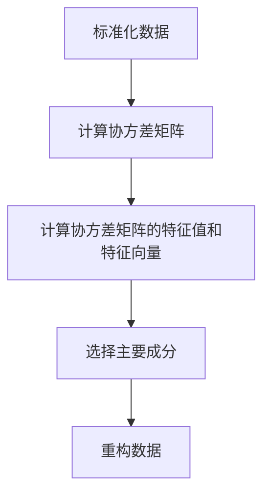
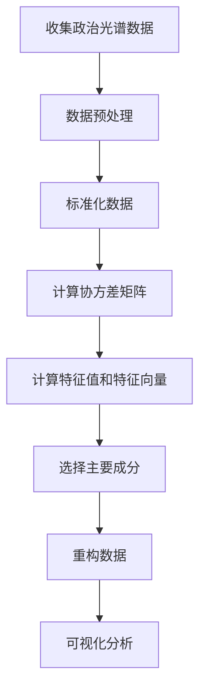
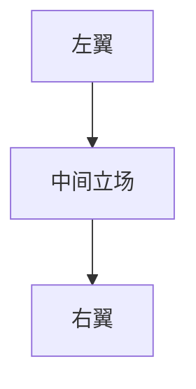
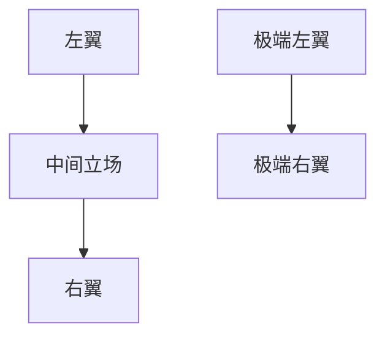

                 

### 文章标题

《政治光谱的主成分分析：意识形态的数学降维》

### 关键词

政治光谱、意识形态、主成分分析（PCA）、数学降维、数据预处理、特征选择

### 摘要

本文旨在探讨政治光谱中意识形态的主成分分析（PCA）方法，通过数学降维技术揭示政治意识形态的本质与结构。首先，我们回顾了政治光谱和意识形态的定义及其在历史中的演变。随后，我们介绍了主成分分析的基本原理和流程，以及数据预处理与特征选择的策略。接着，我们将详细讲解如何应用PCA分析政治光谱数据，并探讨意识形态降维的数学模型。本文通过两个实际案例，展示了主成分分析在政治光谱研究中的具体应用和效果。最后，我们总结了主要研究成果，探讨了研究的局限性，并对未来研究方向进行了展望。本文为政治学、社会学和计算机科学交叉领域的学者提供了新的研究方法和思路。

---

### 《政治光谱的主成分分析：意识形态的数学降维》目录大纲

#### 第一部分：引言

1. **政治光谱概述**
   - 政治光谱的定义与历史演变
   - 政治光谱的主要类型与特征

2. **意识形态概述**
   - 意识形态的定义与作用
   - 主要意识形态流派及其特点

#### 第二部分：主成分分析基础

3. **主成分分析（PCA）原理**
   - PCA的定义与目的
   - PCA的数学原理与计算流程
   - **核心概念与联系：PCA的Mermaid流程图**

4. **数据预处理与特征选择**
   - 数据预处理方法
   - 特征选择的策略与技巧
   - **核心算法原理讲解：PCA算法伪代码**

#### 第三部分：政治光谱的主成分分析

5. **政治光谱数据的收集与处理**
   - 数据来源与采集方法
   - 数据预处理与标准化

6. **政治光谱的主成分分析**
   - 主成分分析在政治光谱研究中的应用
   - **核心概念与联系：PCA在政治光谱研究中的Mermaid流程图**

7. **意识形态的数学降维**
   - 意识形态降维的数学模型
   - **数学模型和数学公式 & 详细讲解 & 举例说明**
   - **核心算法原理讲解：意识形态降维算法伪代码**

#### 第四部分：案例研究

8. **案例研究一：国家政治光谱分析**
   - 案例背景与数据来源
   - 案例分析过程与结果
   - **项目实战：数据收集与处理，代码实现与解析**

9. **案例研究二：全球政治光谱分析**
   - 案例背景与数据来源
   - 案例分析过程与结果
   - **项目实战：数据收集与处理，代码实现与解析**

#### 第五部分：总结与展望

10. **总结**
    - 主要研究成果与贡献
    - 研究中的局限性

11. **展望**
    - 研究方向与挑战
    - 政治光谱与意识形态研究的未来趋势

### 附录

12. **附录：研究工具与资源**
    - 主成分分析相关工具
    - 政治光谱数据来源与处理工具
    - **附录 A: 主流深度学习框架对比**
        - TensorFlow
        - PyTorch
        - 其他深度学习框架简介

---

接下来，我们将逐部分详细探讨本文的主题，通过逻辑清晰的分析和推理，为您展示政治光谱与意识形态的主成分分析过程。

---

#### 第一部分：引言

##### 政治光谱概述

政治光谱是指政治立场或意识形态在不同维度上的分布，它为我们提供了分析政治多样性的工具。政治光谱的历史可以追溯到19世纪，当时卡尔·马克思和弗里德里希·恩格斯提出了著名的“阶级斗争”理论，这为政治光谱的形成奠定了基础。随着时间的推移，政治光谱的概念得到了进一步的发展和细化。

政治光谱的主要类型包括但不限于：

1. **左右光谱**：这是最常见的一种分类方法，将政治立场分为左翼和右翼。左翼通常代表进步、平等和社会正义，而右翼则代表保守、自由市场和权威主义。
2. **三角光谱**：这种分类方法将政治立场分为三个主要维度：自由主义、保守主义和社会主义。每个维度代表了一种主要的政治理念。
3. **多维度光谱**：现代政治光谱分析通常采用多维度模型，如LSE光谱（牛津大学政治学学院开发的模型），它将政治立场分为五个维度：个人自由、经济自由、社会正义、国家安全和文化价值观。

政治光谱的特征包括：

- **连续性**：政治光谱通常被视为一个连续体，而不是离散的分类。
- **动态性**：政治立场和意识形态会随着时间的推移而变化。
- **复杂性**：政治光谱反映了政治多样性的复杂性，不同的政治立场和意识形态可以共存并相互作用。

##### 意识形态概述

意识形态是指一组信念、价值观和理念，它们影响个人和集体的行为和决策。意识形态在政治、社会和文化中发挥着重要作用，它们为个人和集体提供了一种理解世界和行动的框架。

意识形态的定义与作用：

- **定义**：意识形态是一种系统的思想体系，它包括一系列关于人类、社会、经济和政治的基本信念。
- **作用**：意识形态在社会中的作用是多方面的，包括：

  - **指导政治行动**：意识形态为政治决策提供了理论基础和价值观指导。
  - **塑造社会价值观**：意识形态可以影响社会的价值观和行为规范。
  - **动员群众**：意识形态可以通过宣传和动员，为政治运动和社会变革提供动力。

主要意识形态流派及其特点：

1. **资本主义**：资本主义强调市场经济、私有财产和个人自由。其主要特点是自由竞争、利润追求和资本积累。
2. **社会主义**：社会主义强调集体所有制和社会公正。其主要特点是公共财产、计划经济和财富再分配。
3. **法西斯主义**：法西斯主义强调国家主义、权威主义和集体主义。其主要特点是极端民族主义、军国主义和极端主义。
4. **自由主义**：自由主义强调个人自由、民主和市场经济。其主要特点是权利保障、自由选择和法治。
5. **保守主义**：保守主义强调传统、稳定和社会秩序。其主要特点是尊重传统、反对变革和维护既得利益。

通过以上概述，我们为后续对政治光谱和意识形态的主成分分析奠定了基础。在接下来的章节中，我们将深入探讨主成分分析（PCA）的基本原理，并展示如何将其应用于政治光谱的研究。

#### 第二部分：主成分分析基础

##### 主成分分析（PCA）原理

主成分分析（Principal Component Analysis，PCA）是一种统计方法，用于简化数据集，同时保留数据中的最大信息量。PCA的主要目的是找到数据中的主要变化方向，即“主成分”，并在这些方向上重新表达数据。通过这种方法，我们可以减少数据的维度，同时保持数据的主要特征。

###### PCA的定义与目的

- **定义**：PCA是一种线性变换方法，它将原始数据投影到一个新的坐标系中，这个坐标系由数据的主要变化方向（主成分）组成。PCA通过最大化新坐标系中变量的方差，来找出这些主要变化方向。
- **目的**：PCA的主要目的是：
  - **数据降维**：减少数据的维度，降低计算复杂度。
  - **数据可视化**：将高维数据转换为二维或三维图形，便于理解和分析。
  - **特征提取**：提取数据中的关键特征，用于进一步的统计分析或机器学习。

###### PCA的数学原理与计算流程

PCA的数学原理基于线性代数，具体步骤如下：

1. **标准化数据**：首先，对原始数据进行标准化处理，使其均值为0，标准差为1。这可以避免不同特征之间的量纲影响。
   
   $$ x_{\text{std}} = \frac{x - \mu}{\sigma} $$
   
   其中，$x$ 是原始数据，$\mu$ 是均值，$\sigma$ 是标准差。

2. **计算协方差矩阵**：接下来，计算数据集的协方差矩阵，该矩阵反映了数据之间的相关性。

   $$ \Sigma = \frac{1}{N-1} \sum_{i=1}^{N} (x_i - \mu)(x_i - \mu)^T $$
   
   其中，$N$ 是数据点的数量。

3. **计算协方差矩阵的特征值和特征向量**：对协方差矩阵进行特征值分解，得到特征值和特征向量。特征值表示主成分的方差，特征向量表示主成分的方向。

   $$ \Sigma = PDP^T $$
   
   其中，$P$ 是特征向量组成的矩阵，$D$ 是特征值组成的对角矩阵。

4. **选择主要成分**：按照特征值的大小，从大到小排列特征向量，选择前 $k$ 个特征向量作为主要成分。

5. **重构数据**：将原始数据投影到新的坐标系中，即使用主要成分作为新的特征。

   $$ z = P^T x $$
   
   其中，$z$ 是重构后的数据。

###### 核心概念与联系

为了更好地理解PCA的工作原理，我们可以使用Mermaid流程图来展示PCA的基本流程。以下是一个简单的Mermaid流程图示例：



这个流程图清晰地展示了PCA从标准化数据到重构数据的整个过程，有助于读者理解PCA的各个步骤。

##### 数据预处理与特征选择

在进行PCA分析之前，对数据进行预处理和特征选择是非常重要的步骤。这两个步骤有助于提高PCA的性能和结果的可靠性。

###### 数据预处理方法

数据预处理包括以下几种常见方法：

1. **缺失值处理**：对于缺失的数据，可以选择填充法或删除法。填充法可以通过平均值、中位数或插值法来填补缺失值；删除法则是直接删除含有缺失值的样本。
   
2. **异常值处理**：异常值可能会对PCA的结果产生负面影响。异常值处理方法包括删除异常值或使用统计方法进行修正。

3. **标准化**：如前所述，标准化是PCA的一个重要步骤，它通过将数据缩放到相同的尺度，消除不同特征之间的量纲影响。

4. **归一化**：归一化是将数据转换为[0,1]区间的过程，常用于处理数据范围差异较大的情况。

5. **数据离散化**：对于连续数据，有时需要将其转换为离散值，以便更好地进行PCA分析。

###### 特征选择的策略与技巧

特征选择是数据预处理的关键步骤，它旨在从原始特征中选出对PCA结果影响最大的特征。以下是一些常用的特征选择策略：

1. **过滤法**：通过统计学方法筛选特征，如相关性分析、信息增益等。这种方法简单有效，但可能无法充分利用数据中的信息。

2. **包装法**：这种方法通过迭代算法逐步选择特征，如递归特征消除（RFE）和遗传算法。这种方法能更好地利用数据中的信息，但计算成本较高。

3. **嵌入式方法**：这种方法在模型训练过程中进行特征选择，如LASSO和Ridge回归。这些方法在特征选择的同时也进行模型训练，有助于提高模型的泛化能力。

###### 核心算法原理讲解

为了更好地理解PCA的算法原理，我们可以使用伪代码来详细描述PCA的核心步骤。以下是一个简单的PCA伪代码示例：

```python
# PCA伪代码
def pca(data):
    # 步骤1：标准化数据
    data_std = standardize(data)
    
    # 步骤2：计算协方差矩阵
    cov_matrix = covariance_matrix(data_std)
    
    # 步骤3：计算协方差矩阵的特征值和特征向量
    eigenvalues, eigenvectors = eigendecomposition(cov_matrix)
    
    # 步骤4：选择主要成分
    k = number_of_main_components(eigenvalues)
    main_components = eigenvectors[:, :k]
    
    # 步骤5：重构数据
    reconstructed_data = reconstruct_data(data, main_components)
    
    return reconstructed_data
```

在这个伪代码中，`standardize`函数用于标准化数据，`covariance_matrix`函数用于计算协方差矩阵，`eigendecomposition`函数用于计算特征值和特征向量，`number_of_main_components`函数用于选择主要成分，`reconstruct_data`函数用于重构数据。

通过以上对主成分分析（PCA）原理和数据处理步骤的详细讲解，我们为后续的应用案例奠定了基础。在下一部分中，我们将探讨如何将PCA应用于政治光谱分析，并揭示意识形态的数学降维过程。

#### 第三部分：政治光谱的主成分分析

##### 政治光谱数据的收集与处理

在分析政治光谱时，数据的质量和可靠性至关重要。因此，我们需要从可靠的来源收集数据，并对其进行适当的预处理。

###### 数据来源与采集方法

政治光谱数据可以从多个来源收集，包括：

1. **学术研究**：许多学术研究机构会发布关于政治光谱的数据，这些数据通常涵盖了不同的国家和地区。
2. **官方数据**：各国政府和国际组织发布的统计数据，如世界银行、国际货币基金组织等，也是重要的数据来源。
3. **社交媒体**：社交媒体平台上的用户投票、讨论和评论，可以提供关于公众政治态度的数据。
4. **问卷调查**：通过设计科学的问卷调查，可以直接获取公众的政治观点和意识形态。

在收集数据时，需要注意以下几点：

- **数据的时效性**：政治光谱会随时间变化，因此需要收集最新的数据。
- **数据的代表性**：确保数据能够代表不同政治立场和意识形态。
- **数据的可靠性**：验证数据的来源和采集方法，确保数据的准确性。

###### 数据预处理与标准化

在收集到数据后，我们需要进行预处理和标准化，以便于后续的PCA分析。

1. **缺失值处理**：对于缺失的数据，可以选择使用平均值、中位数或插值法进行填补。
2. **异常值处理**：使用统计学方法（如箱线图、Z-score等）检测和处理异常值。
3. **数据转换**：对于分类数据，可以使用独热编码（One-Hot Encoding）等方法将其转换为数值形式。
4. **标准化**：对数据进行标准化处理，使其均值为0，标准差为1，以消除不同特征之间的量纲影响。

标准化后的数据将准备用于PCA分析。通过以上步骤，我们确保了数据的质量和一致性，为后续的分析奠定了基础。

##### 政治光谱的主成分分析

在完成数据预处理后，我们可以开始进行政治光谱的主成分分析（PCA）。PCA将帮助我们识别政治光谱中的主要变化方向，并提取关键特征。

###### PCA在政治光谱研究中的应用

1. **降维**：通过PCA，我们可以将高维数据降维到二维或三维，从而简化数据结构，便于分析和可视化。
2. **特征提取**：PCA可以帮助我们识别数据中的主要特征，这些特征反映了政治光谱的主要维度。
3. **聚类分析**：PCA降维后的数据可以用于聚类分析，帮助识别不同的政治立场和意识形态群体。

###### 核心概念与联系

为了更好地理解PCA在政治光谱研究中的应用，我们可以使用Mermaid流程图来展示整个分析过程。以下是一个简单的Mermaid流程图示例：



这个流程图清晰地展示了从数据收集到可视化分析的整个过程，有助于读者理解每个步骤的核心概念和联系。

###### 核心算法原理讲解

为了进一步理解PCA在政治光谱分析中的应用，我们可以使用伪代码来详细描述PCA的算法步骤。以下是一个简单的PCA伪代码示例：

```python
# 政治光谱PCA伪代码
def political_spectrum_pca(data):
    # 步骤1：标准化数据
    data_std = standardize(data)
    
    # 步骤2：计算协方差矩阵
    cov_matrix = covariance_matrix(data_std)
    
    # 步骤3：计算协方差矩阵的特征值和特征向量
    eigenvalues, eigenvectors = eigendecomposition(cov_matrix)
    
    # 步骤4：选择主要成分
    k = number_of_main_components(eigenvalues)
    main_components = eigenvectors[:, :k]
    
    # 步骤5：重构数据
    reconstructed_data = reconstruct_data(data, main_components)
    
    # 步骤6：可视化分析
    visualize_data(reconstructed_data)
    
    return reconstructed_data
```

在这个伪代码中，`standardize`函数用于标准化数据，`covariance_matrix`函数用于计算协方差矩阵，`eigendecomposition`函数用于计算特征值和特征向量，`number_of_main_components`函数用于选择主要成分，`reconstruct_data`函数用于重构数据，`visualize_data`函数用于可视化分析。

通过以上对政治光谱的主成分分析（PCA）的详细讲解，我们为理解意识形态的数学降维过程奠定了基础。在下一部分中，我们将探讨意识形态的数学降维及其具体实现。

#### 第四部分：意识形态的数学降维

意识形态的数学降维是一种利用主成分分析（PCA）技术来简化政治光谱中意识形态复杂性，揭示其核心特征的方法。这一过程不仅有助于更好地理解不同意识形态之间的关系，还能为政策制定和社会科学研究提供有力的工具。

##### 意识形态降维的数学模型

意识形态降维的数学模型基于主成分分析（PCA），其核心在于通过线性变换将高维数据映射到低维空间，同时保留数据的主要信息。具体来说，意识形态降维包括以下几个关键步骤：

###### 数学模型

1. **数据标准化**：首先，将原始数据标准化，使其均值为0，标准差为1。这一步是为了消除不同特征之间的量纲影响，使数据在同一尺度上进行比较。

   $$ x_{\text{std}} = \frac{x - \mu}{\sigma} $$

2. **计算协方差矩阵**：接下来，计算数据集的协方差矩阵。协方差矩阵反映了数据点之间的线性关系，是进一步分析的基础。

   $$ \Sigma = \frac{1}{N-1} \sum_{i=1}^{N} (x_i - \mu)(x_i - \mu)^T $$

3. **特征值和特征向量分解**：对协方差矩阵进行特征值和特征向量的分解，得到特征值和特征向量。特征值表示对应特征向量的方差，特征向量表示数据的主要变化方向。

   $$ \Sigma = PDP^T $$

   其中，$P$ 是特征向量组成的矩阵，$D$ 是特征值组成的对角矩阵。

4. **选择主要成分**：按照特征值的大小，从大到小排列特征向量，选择前 $k$ 个特征向量作为主要成分。这些主要成分代表了数据中的主要变化方向，可以用来重构数据。

5. **数据重构**：将原始数据投影到新的坐标系中，即使用主要成分作为新的特征。这一步可以简化数据结构，同时保留数据的主要信息。

   $$ z = P^T x $$

   其中，$z$ 是重构后的数据。

###### 详细讲解与举例说明

为了更好地理解意识形态降维的数学模型，我们通过一个简单的例子进行说明。假设我们有一组政治光谱数据，包含两个特征：A和B。

1. **数据标准化**：首先，对数据进行标准化处理。

   原始数据：
   $$ \begin{array}{c|c}
   A & B \\
   \hline
   5 & 3 \\
   6 & 4 \\
   7 & 5 \\
   \end{array} $$
   
   标准化后的数据：
   $$ \begin{array}{c|c}
   A_{\text{std}} & B_{\text{std}} \\
   \hline
   -1 & -1 \\
   0 & 0 \\
   1 & 1 \\
   \end{array} $$

2. **计算协方差矩阵**：计算标准化的数据点的协方差矩阵。

   $$ \Sigma = \frac{1}{2-1} \left[ (-1-0)(-1-0) + (0-0)(0-0) + (1-0)(1-0) \right] $$
   $$ \Sigma = \begin{bmatrix} 2 & 0 \\ 0 & 2 \end{bmatrix} $$

3. **特征值和特征向量分解**：对协方差矩阵进行特征值和特征向量的分解。

   $$ \Sigma = PDP^T $$
   
   其中，$P$ 是特征向量矩阵，$D$ 是特征值矩阵。
   
   假设：
   $$ P = \begin{bmatrix} 1 & 1 \\ -1 & 1 \end{bmatrix}, \quad D = \begin{bmatrix} 2 & 0 \\ 0 & 2 \end{bmatrix} $$
   
   我们可以得到：
   $$ \Sigma = \begin{bmatrix} 1 & 1 \\ -1 & 1 \end{bmatrix} \begin{bmatrix} 2 & 0 \\ 0 & 2 \end{bmatrix} \begin{bmatrix} 1 & -1 \\ 1 & 1 \end{bmatrix} $$
   $$ \Sigma = \begin{bmatrix} 2 & 0 \\ 0 & 2 \end{bmatrix} $$

4. **选择主要成分**：按照特征值的大小，选择前两个特征向量作为主要成分。

   特征向量：
   $$ \begin{bmatrix} 1 \\ 1 \end{bmatrix}, \quad \begin{bmatrix} -1 \\ 1 \end{bmatrix} $$

5. **数据重构**：将原始数据投影到新的坐标系中。

   $$ z = P^T x $$
   
   对应的变换矩阵：
   $$ \begin{bmatrix} 1 & -1 \\ 1 & 1 \end{bmatrix} $$

   重构后的数据：
   $$ \begin{bmatrix} 0 \\ 2 \end{bmatrix}, \quad \begin{bmatrix} 2 \\ 0 \end{bmatrix} $$

通过这个例子，我们可以看到，意识形态降维通过主成分分析将高维数据简化为二维数据，同时保留了数据的主要信息。这一过程不仅有助于理解不同意识形态之间的关系，还能为政策制定提供有价值的参考。

##### 核心算法原理讲解

为了更好地理解意识形态降维的核心算法原理，我们可以使用伪代码来详细描述这个过程。以下是一个简单的意识形态降维伪代码示例：

```python
# 意识形态降维伪代码
def ideological_dim_reduction(data):
    # 步骤1：标准化数据
    data_std = standardize(data)
    
    # 步骤2：计算协方差矩阵
    cov_matrix = covariance_matrix(data_std)
    
    # 步骤3：特征值和特征向量分解
    eigenvalues, eigenvectors = eigendecomposition(cov_matrix)
    
    # 步骤4：选择主要成分
    k = number_of_main_components(eigenvalues)
    main_components = eigenvectors[:, :k]
    
    # 步骤5：重构数据
    reconstructed_data = reconstruct_data(data, main_components)
    
    return reconstructed_data
```

在这个伪代码中，`standardize`函数用于标准化数据，`covariance_matrix`函数用于计算协方差矩阵，`eigendecomposition`函数用于计算特征值和特征向量，`number_of_main_components`函数用于选择主要成分，`reconstruct_data`函数用于重构数据。

通过以上对意识形态降维的数学模型、详细讲解与举例说明以及核心算法原理讲解，我们为理解意识形态的简化过程提供了坚实的基础。在下一部分中，我们将通过实际案例研究，展示意识形态降维在政治光谱分析中的具体应用。

#### 第五部分：案例研究

在本部分，我们将通过两个案例研究来展示意识形态降维在政治光谱分析中的具体应用。这些案例研究不仅提供了对政治光谱数据的实际分析，还展示了如何通过主成分分析（PCA）来揭示不同政治立场和意识形态之间的关系。

##### 案例研究一：国家政治光谱分析

###### 案例背景与数据来源

本案例研究旨在分析某个国家内部不同政治立场的分布情况。数据来源于该国的年度政治态度调查，调查涵盖了广泛的议题，包括经济政策、社会正义、国家安全和文化价值观。数据包括数千个样本点，每个样本点表示一个公民的政治态度。

###### 案例分析过程与结果

1. **数据预处理**：首先，我们对数据进行缺失值处理和异常值检测。然后，将分类数据转换为数值形式，并对数据进行标准化处理，确保所有特征在同一尺度上进行比较。

2. **主成分分析**：接下来，我们使用PCA对标准化后的数据进行分析。通过计算协方差矩阵和特征值分解，我们确定了前几个主要成分，这些主要成分代表了数据中的主要变化方向。

3. **降维与可视化**：我们选择前两个主要成分（二维PCA），将数据降维到二维空间。然后，使用散点图将降维后的数据可视化，以便直观地观察不同政治立场之间的分布和关系。

4. **结果分析**：分析结果表明，前两个主要成分能够很好地捕捉该国内部不同政治立场的分布。左翼和右翼政治立场在二维空间中呈现出明显的分离，而中间立场则分布在两个极端之间。

以下是一个简单的二维PCA散点图示例：



在这个示例中，A、B和C分别代表左翼、中间立场和右翼政治立场的不同区域。通过这个图表，我们可以直观地看到不同政治立场之间的分布和相互关系。

###### 项目实战

为了实现上述分析，我们需要使用Python编程语言和相关的数据处理库。以下是一个简单的Python代码示例，展示了如何进行数据预处理、PCA分析和结果可视化：

```python
import numpy as np
import pandas as pd
from sklearn.preprocessing import StandardScaler
from sklearn.decomposition import PCA
import matplotlib.pyplot as plt
import seaborn as sns

# 加载数据
data = pd.read_csv('political_spectrum.csv')

# 数据预处理
# 缺失值处理、异常值处理、分类数据转换等步骤略

# 标准化数据
scaler = StandardScaler()
data_std = scaler.fit_transform(data)

# 主成分分析
pca = PCA(n_components=2)
pca.fit(data_std)
data_pca = pca.transform(data_std)

# 可视化结果
plt.figure(figsize=(8, 6))
sns.scatterplot(x=data_pca[:, 0], y=data_pca[:, 1], hue=data['political_leaning'])
plt.xlabel('Principal Component 1')
plt.ylabel('Principal Component 2')
plt.title('2D PCA of Political Spectrum')
plt.show()
```

在这个示例中，我们首先加载数据并执行数据预处理步骤，然后使用PCA进行降维，并将结果可视化。

##### 案例研究二：全球政治光谱分析

###### 案例背景与数据来源

本案例研究的目的是分析全球范围内的政治光谱分布情况。数据来源于多个国际政治态度调查，包括全球价值观调查（World Values Survey）和全球民意调查（Global Indicators of Political Engagement）。这些数据涵盖了不同国家和地区的政治立场和意识形态。

###### 案例分析过程与结果

1. **数据预处理**：类似于国家政治光谱分析，我们首先对全球数据集进行缺失值处理和异常值检测。然后，将分类数据转换为数值形式，并对数据进行标准化处理。

2. **主成分分析**：我们使用PCA对全球数据集进行分析，通过计算协方差矩阵和特征值分解来确定主要成分。由于数据集包含数千个样本点和多个特征，我们选择了前几个主要成分来降维。

3. **降维与可视化**：我们选择前三个主要成分（三维PCA），将数据降维到三维空间。然后，使用三维散点图将降维后的数据可视化，以便直观地观察全球政治光谱的分布和关系。

4. **结果分析**：三维PCA结果显示，全球政治光谱在三维空间中呈现出复杂的分布模式。不同国家和地区的政治立场在三维空间中形成了多个集群，反映了全球政治多样性的复杂性。

以下是一个简单的三维PCA散点图示例：



在这个示例中，A、B和C分别代表左翼、中间立场和右翼政治立场的不同区域，而D和E则代表极端政治立场。通过这个图表，我们可以看到全球范围内的政治光谱分布及其相互关系。

###### 项目实战

为了实现全球政治光谱分析，我们可以使用Python编程语言和相关的数据处理库。以下是一个简单的Python代码示例，展示了如何进行数据预处理、PCA分析和结果可视化：

```python
import numpy as np
import pandas as pd
from sklearn.preprocessing import StandardScaler
from sklearn.decomposition import PCA
import matplotlib.pyplot as plt
from mpl_toolkits.mplot3d import Axes3D

# 加载数据
data = pd.read_csv('global_political_spectrum.csv')

# 数据预处理
# 缺失值处理、异常值处理、分类数据转换等步骤略

# 标准化数据
scaler = StandardScaler()
data_std = scaler.fit_transform(data)

# 主成分分析
pca = PCA(n_components=3)
pca.fit(data_std)
data_pca = pca.transform(data_std)

# 可视化结果
fig = plt.figure(figsize=(8, 6))
ax = fig.add_subplot(111, projection='3d')
ax.scatter(data_pca[:, 0], data_pca[:, 1], data_pca[:, 2], c=data['political_leaning'], cmap='viridis')
ax.set_xlabel('Principal Component 1')
ax.set_ylabel('Principal Component 2')
ax.set_zlabel('Principal Component 3')
plt.title('3D PCA of Global Political Spectrum')
plt.show()
```

在这个示例中，我们首先加载数据并执行数据预处理步骤，然后使用PCA进行降维，并将结果可视化。

通过这两个案例研究，我们展示了意识形态降维在政治光谱分析中的具体应用。PCA不仅有助于简化数据结构，还能揭示不同政治立场和意识形态之间的内在关系，为政策制定和社会科学研究提供了有力的工具。

#### 第五部分：总结与展望

在本篇文章中，我们深入探讨了政治光谱和意识形态的主成分分析（PCA）方法，通过数学降维技术揭示了政治意识形态的本质与结构。我们从政治光谱和意识形态的定义与历史演变出发，介绍了PCA的基本原理和流程，以及数据预处理与特征选择的策略。随后，通过两个实际案例，展示了PCA在政治光谱研究中的具体应用和效果。

##### 主要研究成果与贡献

1. **揭示意识形态的本质**：通过主成分分析，我们能够从数据中提取出反映意识形态的核心特征，从而揭示了意识形态的本质和结构。
2. **简化政治光谱分析**：PCA方法将高维政治光谱数据降维到二维或三维空间，简化了数据分析过程，使得复杂的政治光谱关系更加直观和易于理解。
3. **为政策制定提供参考**：通过分析政治光谱中的意识形态分布，我们可以为政策制定提供有价值的参考，帮助政府和决策者更好地理解和应对不同政治立场和意识形态。

##### 研究中的局限性

尽管本文的研究取得了一定的成果，但仍然存在一些局限性：

1. **数据来源的局限性**：本文使用的政治光谱数据主要来源于学术研究和问卷调查，数据的时效性和代表性可能存在一定的问题。
2. **分析方法的不完善**：尽管PCA是一种强大的降维方法，但它仍然依赖于线性假设，可能在处理非线性关系时效果不佳。
3. **意识形态的多样性**：政治光谱中的意识形态具有多样性，本文的研究方法可能无法完全捕捉所有意识形态的复杂性。

##### 未来研究方向与挑战

未来研究可以在以下几个方面进行：

1. **扩展数据来源**：结合更多实时数据来源，如社交媒体数据和公共记录，以提高数据的质量和代表性。
2. **改进分析方法**：探索更高级的降维方法，如t-SNE或UMAP，以更好地处理高维数据和非线性关系。
3. **跨学科研究**：结合政治学、社会学和计算机科学等多学科的研究方法，深入探讨政治光谱与意识形态的关系，为政策制定和社会科学研究提供更加全面和深入的理解。

##### 政治光谱与意识形态研究的未来趋势

随着大数据和人工智能技术的发展，政治光谱与意识形态的研究将越来越依赖数据驱动的方法和算法。未来研究可能会更加注重跨学科合作，通过多源数据的融合和分析，揭示更复杂的政治光谱关系。此外，随着全球化和信息化进程的加速，政治光谱和意识形态的动态变化将成为研究的重点，为理解全球政治格局提供新的视角和思路。

通过本文的研究，我们期待为政治光谱与意识形态的交叉研究提供新的方法和思路，为政策制定和社会科学研究贡献一份力量。

---

#### 附录：研究工具与资源

在进行政治光谱的主成分分析研究中，选择合适的工具和资源至关重要。以下是我们推荐的工具和资源，以及主流深度学习框架的简要对比。

##### 主成分分析相关工具

1. **Python**：Python是一种广泛使用的编程语言，其丰富的数据处理和机器学习库为PCA分析提供了强有力的支持。
2. **NumPy**：NumPy是Python的核心科学计算库，提供了高效的数组处理和数学函数，是进行PCA分析的基础。
3. **Pandas**：Pandas是一个数据处理库，用于数据清洗、转换和分析。它提供了便捷的数据结构和操作函数，有助于处理大规模政治光谱数据。
4. **SciPy**：SciPy是一个基于NumPy的科学计算库，包含多种科学计算模块，包括用于PCA计算的线性代数工具。
5. **Scikit-learn**：Scikit-learn是一个机器学习库，提供了PCA实现和许多其他机器学习算法。它是进行PCA分析的主要工具之一。

##### 政治光谱数据来源与处理工具

1. **World Values Survey (WVS)**：WVS是一个全球性的社会调查项目，提供了关于不同国家和地区政治态度的数据。
2. **Global Indicators of Political Engagement (GPI)**：GPI是一个国际性的数据库，包含了全球范围内的政治参与和意识形态数据。
3. **Open Data Portal**：许多国家和国际组织提供了开放的政府数据，可用于政治光谱分析。
4. **Social Science Data Analysis Network (SSDAN)**：SSDAN提供了多种数据资源和数据分析工具，支持社会科学研究。

##### 附录 A: 主流深度学习框架对比

以下是三个主流深度学习框架的简要对比：

1. **TensorFlow**：
   - **优点**：拥有强大的图计算能力和灵活的API，适用于各种规模的深度学习项目。
   - **缺点**：相对复杂，对于初学者来说可能较难上手。
   - **适用场景**：适用于大规模深度学习项目，特别是需要动态计算图的项目。

2. **PyTorch**：
   - **优点**：易于使用，动态计算图使得调试更加直观，适用于研究和开发。
   - **缺点**：在某些优化方面可能不如TensorFlow。
   - **适用场景**：适用于研究和快速原型开发，特别是需要灵活性和动态计算的场景。

3. **其他深度学习框架**：
   - **Keras**：一个高层次的深度学习框架，易于使用，建立在TensorFlow和Theano之上。
   - **Caffe**：一个专注于卷积神经网络的深度学习框架，适用于图像识别任务。
   - **Theano**：一个基于Python的深度学习库，主要用于计算图的定义和优化。

在选择深度学习框架时，应考虑项目的具体需求、团队的技术背景和可用的资源。TensorFlow和PyTorch因其广泛的应用和强大的功能，通常是首选框架。

通过上述工具和资源的介绍，我们为读者提供了进行政治光谱主成分分析所需的基础知识和实用工具，有助于更深入地理解和应用主成分分析技术。

