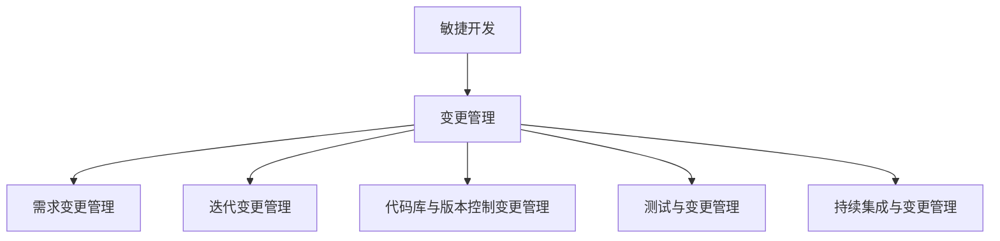

                 

### 文章标题

# 《敏捷LLM应用开发中的变更管理》

> 关键词：敏捷开发，变更管理，大语言模型（LLM），需求变更，迭代变更，代码库与版本控制，测试与变更管理，持续集成，工具与技术，案例研究

> 摘要：本文深入探讨了敏捷开发模式下的变更管理在大语言模型（LLM）应用开发中的重要性。文章首先概述了敏捷开发与变更管理的基本原则，然后详细讲解了LLM及其开发中的变更管理需求。接着，文章通过需求变更管理、迭代变更管理、代码库与版本控制变更管理、测试与变更管理、持续集成与变更管理等多个方面，详细阐述了敏捷LLM开发流程中的变更管理策略。最后，文章通过案例分析、工具与技术介绍以及变更管理挑战与最佳实践，为读者提供了全面而实用的变更管理指导。本文旨在帮助开发者更好地理解和应用敏捷变更管理，提高LLM应用开发的效率与质量。

### 《敏捷LLM应用开发中的变更管理》目录大纲

## 第一部分：敏捷与LLM概述

### 第1章：敏捷开发与变更管理基础

#### 1.1 敏捷开发的基本原则和价值观

#### 1.2 变更管理的重要性

#### 1.3 敏捷开发中的变更管理流程

### 第2章：LLM基础与变更管理

#### 2.1 详解大语言模型（LLM）

#### 2.2 LLM开发中的变更管理需求

#### 2.3 LLM项目中的变更管理策略

## 第二部分：敏捷LLM开发流程中的变更管理

### 第3章：需求变更管理

#### 3.1 敏捷需求变更的过程和方法

#### 3.2 如何评估需求变更的影响

#### 3.3 需求变更的沟通与管理

### 第4章：迭代变更管理

#### 4.1 敏捷迭代中的变更控制

#### 4.2 迭代变更的优先级排序

#### 4.3 迭代变更的风险管理

### 第5章：代码库与版本控制变更管理

#### 5.1 使用Git进行代码库管理

#### 5.2 版本控制中的变更管理策略

#### 5.3 变更引起的问题与解决方法

### 第6章：测试与变更管理

#### 6.1 测试中的变更管理

#### 6.2 变更对测试的影响

#### 6.3 测试过程中的变更控制方法

### 第7章：持续集成与变更管理

#### 7.1 持续集成的基本概念

#### 7.2 持续集成与变更管理的关系

#### 7.3 持续集成中的变更控制方法

### 第8章：敏捷变更管理的挑战与最佳实践

#### 8.1 敏捷变更管理面临的挑战

#### 8.2 变更管理最佳实践

#### 8.3 敏捷变更管理的未来趋势

## 第三部分：变更管理的工具与技术

### 第9章：变更管理的工具支持

#### 9.1 常见的变更管理工具介绍

#### 9.2 工具在变更管理中的应用

#### 9.3 工具选择的考虑因素

### 第10章：变更管理的技术方法

#### 10.1 常用的变更管理技术

#### 10.2 技术在变更管理中的实际应用

#### 10.3 技术选择的依据

### 第11章：变更管理案例研究

#### 11.1 案例背景

#### 11.2 变更管理策略与执行

#### 11.3 案例分析与总结

## 第四部分：附录

### 附录A：相关术语与概念解释

### 附录B：参考文献与推荐阅读

### 附录C：变更管理工具资源列表

### 附录D：变更管理流程模板

### 附录E：敏捷LLM开发中的变更管理思维导图

- **核心概念与联系流程图（Mermaid）**：



- **核心算法原理讲解（伪代码）**：

```python
def evaluateChangeImpact(change, system):
    impact_score = 0
    if change.type == "feature":
        impact_score += 1
    if change.type == "bugfix":
        impact_score += 0.5
    if change.type == "security":
        impact_score += 2
    if change.affects == "ui":
        impact_score += 1
    if change.affects == "backend":
        impact_score += 1
    return impact_score
```

- **数学模型和数学公式（LaTeX格式）**：

```latex
\text{Impact Score} = \sum_{i=1}^{n} (\text{weight}_{i} \times \text{impact}_{i})
```

- **项目实战（代码案例与解析）**：

```bash
# 初始化Git仓库
git init

# 添加文件
git add README.md

# 提交文件
git commit -m "Initial commit"

# 分支管理
git checkout -b feature-1
git commit -m "Add feature 1"

# 合并分支
git merge feature-1
git push origin main
```

### 引言

随着人工智能技术的迅猛发展，大语言模型（LLM）已经成为自然语言处理（NLP）领域的重要工具。LLM的应用开发逐渐成为各行业的焦点，特别是在企业和研发机构中，其应用的广泛性和影响力日益扩大。然而，LLM开发项目的复杂性和不确定性使得变更管理成为影响项目成功的关键因素之一。

敏捷开发作为现代软件项目管理的主流方法，以其灵活、高效的特点受到了广泛推崇。在敏捷开发模式下，项目需求频繁变更、快速迭代成为常态。因此，如何有效地管理这些变更，确保项目进度和质量，成为敏捷LLM应用开发中亟需解决的问题。

本文旨在深入探讨敏捷开发模式下的变更管理在大语言模型应用开发中的重要性。首先，我们将概述敏捷开发与变更管理的基本概念和原则，阐述变更管理在敏捷开发中的核心作用。接着，我们将详细介绍LLM的基础知识及其开发中的变更管理需求。随后，文章将详细阐述敏捷LLM开发流程中的需求变更管理、迭代变更管理、代码库与版本控制变更管理、测试与变更管理、持续集成与变更管理等各个环节的变更管理策略。

在第三部分，我们将探讨变更管理的工具与技术，介绍常见变更管理工具的优缺点，以及如何选择合适的工具。接下来，通过一个实际案例研究，我们将展示如何在实际项目中实施变更管理策略，并提供详细的案例分析和总结。

最后，文章将总结敏捷变更管理面临的挑战和最佳实践，探讨敏捷变更管理的未来趋势，为读者提供全面的变更管理指导。通过本文的深入探讨，希望读者能够更好地理解和应用敏捷变更管理，提高LLM应用开发的效率和质量。

### 第一部分：敏捷与LLM概述

#### 第1章：敏捷开发与变更管理基础

### 1.1 敏捷开发的基本原则和价值观

敏捷开发（Agile Development）起源于20世纪90年代，它是一种以人为核心、迭代和循序渐进的开发方法。敏捷开发通过灵活适应需求变化，以提高软件开发项目的响应速度和开发效率。其核心理念包括四大价值观和十二大原则，这些原则和价值观共同构成了敏捷开发的基本框架。

#### 四大价值观：

1. **个体和互动重于过程和工具**：敏捷开发强调团队成员之间的互动和沟通，认为这是项目成功的关键。
2. **可工作的软件重于详尽的文档**：敏捷开发认为，可工作的软件是最具价值的交付物，而详尽的文档则是次要的。
3. **客户合作重于合同谈判**：敏捷开发鼓励与客户的紧密合作，通过不断的反馈和迭代，确保项目方向与客户需求一致。
4. **响应变化重于遵循计划**：敏捷开发拥抱变化，认为在开发过程中需求会不断变化，重要的是如何快速适应这些变化。

#### 十二大原则：

1. **客户满意是最高追求**：始终确保客户的满意度是项目的核心目标。
2. **欢迎变化，甚至在项目进行中**：项目需求在开发过程中可能会发生变化，敏捷开发鼓励团队快速适应这些变化。
3. **频繁交付可工作的软件**：通过短周期的迭代开发，定期交付可工作的软件，以快速验证和调整。
4. **在团队内建立互信和公开沟通**：团队成员之间建立互信，通过公开透明的沟通确保项目顺利进行。
5. **鼓励可持续开发**：保持稳定的工作节奏，避免过度工作，确保团队成员的健康和高效。
6. **保持近距离的团队协作**：团队成员近距离协作，以提高沟通效率和团队凝聚力。
7. **关注可以工作的软件**：始终关注可工作的软件，确保每个迭代都有实际的交付物。
8. **持续关注技术卓越和良好的设计**：不断提升技术能力和设计质量，以确保项目的长期成功。
9. **简化工作流程**：通过简化流程，减少不必要的步骤，提高工作效率。
10. **已估量的工作**：通过估算工作量和优先级，合理规划迭代和项目进度。
11. **自适应式规划**：根据项目进展和实际情况，灵活调整计划。
12. **持续关注团队及其工作环境**：关注团队成员的需求和感受，创造一个良好的工作环境。

敏捷开发的基本原则和价值观不仅为软件开发项目提供了灵活性和适应性，而且强调了人与过程的结合，使团队能够更好地应对复杂多变的需求环境。通过这些原则和价值观，敏捷开发团队能够在快速变化的市场中保持竞争力，确保项目的成功。

### 1.2 变更管理的重要性

在敏捷开发模式中，变更管理（Change Management）扮演着至关重要的角色。敏捷开发强调对需求变化的快速响应，这意味着项目需求会在开发过程中不断演变。如果无法有效管理这些变更，项目可能会面临一系列问题，包括进度延误、资源浪费和质量下降等。因此，变更管理在敏捷开发中的重要性不可忽视。

首先，变更管理确保项目始终围绕客户需求进行。在敏捷开发中，客户需求是项目成功的核心驱动力。通过有效的变更管理，团队能够及时了解和响应客户需求的变化，确保项目方向与客户期望保持一致。

其次，变更管理有助于提高项目的透明度和可控性。在敏捷开发过程中，团队需要频繁地评估和调整项目计划。变更管理提供了一个结构化的流程，使团队能够系统性地记录、评估和执行变更，从而提高项目的整体规划和执行能力。

此外，变更管理有助于团队适应和克服开发过程中的不确定性。敏捷开发本质上是一种应对不确定性的方法。通过良好的变更管理，团队能够更有效地识别和应对潜在的风险，确保项目在变化的环境中保持稳定和有序。

变更管理的重要性还体现在以下几个方面：

1. **减少风险**：变更管理通过评估变更对项目的影响，帮助团队减少因变更带来的风险。这包括技术风险、市场风险和资源风险等。
2. **保持项目进度**：有效的变更管理能够确保项目进度不受变更的干扰，通过合理的优先级排序和资源分配，确保关键任务按时完成。
3. **提升客户满意度**：及时响应客户需求的变化，能够提高客户的满意度和忠诚度，从而为项目带来更多的商业机会。
4. **增强团队协作**：变更管理提供了一个共同的框架和流程，促进了团队成员之间的协作和沟通，提高了团队的整体效率和效果。

总之，在敏捷开发模式下，变更管理不仅是项目成功的关键保障，也是团队应对复杂性和不确定性的有力工具。通过建立健全的变更管理流程，敏捷团队能够更好地适应快速变化的市场需求，确保项目按时、按质量交付。

### 1.3 敏捷开发中的变更管理流程

敏捷开发中的变更管理流程是一个系统化的过程，它确保项目团队能够高效、有序地处理需求变化。以下是敏捷变更管理的详细流程：

#### 1.3.1 变更请求的提出

变更管理的起点是变更请求（Change Request，CR）。任何项目团队成员都可以提出变更请求。通常，变更请求应包括以下信息：

- **变更描述**：详细描述变更的需求、目标和预期效果。
- **变更影响**：评估变更对项目进度、成本、质量和其他关键因素的影响。
- **优先级**：根据变更的重要性和紧急程度，给出变更的优先级。
- **变更来源**：说明变更请求的来源，如客户、项目经理或其他团队成员。

#### 1.3.2 变更请求的评估

一旦变更请求被提出，项目经理或变更控制委员会（Change Control Board，CCB）需要对变更请求进行评估。评估过程通常包括以下几个步骤：

- **影响分析**：分析变更对项目各个方面的影响，如进度、成本、资源、质量等。
- **风险评估**：评估变更带来的风险，包括技术风险、市场风险和操作风险等。
- **可行性分析**：评估变更的可行性，包括技术实现、资源需求和团队协作等。
- **优先级排序**：根据变更的重要性和紧急程度，对变更请求进行优先级排序。

#### 1.3.3 变更决策

在评估完成后，CCB或项目经理将根据评估结果做出变更决策。决策可能包括以下几种情况：

- **批准变更**：如果变更请求对项目有积极的影响，且风险可控，可以批准变更。
- **拒绝变更**：如果变更请求对项目有负面影响，或风险过高，可以拒绝变更。
- **延迟决策**：如果评估结果不确定，可以延迟决策，进一步收集数据或进行深入分析。

#### 1.3.4 变更实施

一旦变更请求被批准，团队需要开始实施变更。实施过程包括以下几个步骤：

- **资源分配**：根据变更需求，重新分配资源和任务。
- **代码修改**：对代码库进行必要的修改，以实现变更需求。
- **测试和验证**：对变更后的代码进行测试，确保变更不会引入新的问题。

#### 1.3.5 变更监控和反馈

在变更实施过程中，团队需要持续监控变更的执行情况，并收集反馈。监控和反馈包括以下几个方面：

- **进度监控**：监控变更的进度，确保按时完成。
- **质量监控**：监控变更对项目质量的影响，确保变更不会降低项目质量。
- **风险监控**：监控变更带来的风险，及时采取应对措施。
- **反馈收集**：收集团队成员和客户的反馈，以便对变更进行调整和优化。

#### 1.3.6 变更记录和文档

整个变更管理过程中，记录和文档至关重要。以下是需要记录和文档的关键信息：

- **变更请求记录**：记录每个变更请求的详细信息，包括提出者、评估结果和决策。
- **变更实施记录**：记录变更实施的具体过程，包括资源分配、代码修改和测试结果。
- **变更影响记录**：记录变更对项目各方面的影响，包括进度、成本、质量和风险等。
- **变更反馈记录**：记录变更实施后的反馈信息，包括进度、质量和用户满意度等。

通过完整的变更管理流程，敏捷团队能够有效应对需求变化，确保项目在快速迭代中保持稳定和有序。这一流程不仅提高了项目的灵活性和适应性，也增强了团队对项目的控制力和信心。

### 第2章：LLM基础与变更管理

#### 2.1 详解大语言模型（LLM）

大语言模型（Large Language Model，LLM）是自然语言处理（Natural Language Processing，NLP）领域的重要技术，它通过深度学习算法从大量文本数据中学习语言模式和规则，从而实现自然语言理解和生成。LLM具有以下核心组成部分：

1. **数据集**：LLM的训练数据集通常包含数十亿甚至数万亿个单词或句子，这些数据集来自互联网上的各种文本资源，如新闻文章、社交媒体帖子、书籍和网站等。

2. **模型架构**：LLM通常采用深度神经网络架构，特别是Transformer模型。Transformer模型由多个自注意力（Self-Attention）层和前馈神经网络（Feedforward Neural Network）组成，能够高效地处理长文本序列。

3. **预训练和微调**：LLM首先在大量无标注数据上进行预训练，学习通用的语言模式和规则。然后，通过微调（Fine-Tuning）在特定任务上进行训练，以提高模型在特定领域的性能。

4. **参数规模**：LLM的参数规模通常非常大，从数十亿到数千亿不等。例如，GPT-3模型包含1750亿个参数，是目前最大的公开语言模型之一。

LLM的主要应用包括：

- **文本生成**：如文章写作、故事创作、机器翻译等。
- **文本分类**：如情感分析、新闻分类、垃圾邮件检测等。
- **问答系统**：如智能客服、知识图谱问答等。
- **对话系统**：如虚拟助手、聊天机器人等。
- **推荐系统**：如个性化推荐、广告投放等。

#### 2.2 LLM开发中的变更管理需求

LLM开发过程中的变更管理需求主要体现在以下几个方面：

1. **数据集更新**：随着数据来源的变化和数据的积累，LLM的训练数据集需要定期更新。数据集的更新可能会影响模型性能和结果，因此需要严格的管理和控制。

2. **模型架构调整**：LLM的模型架构可能会根据具体应用需求进行调整。例如，为了提高特定任务的性能，可能需要增加自注意力层或调整网络结构。这种变更需要详细规划和测试。

3. **参数规模调整**：LLM的参数规模对模型性能有重要影响。在开发过程中，可能需要调整参数规模以满足不同应用需求或计算资源限制。这种变更需要考虑训练时间和资源消耗。

4. **预训练和微调策略调整**：LLM的预训练和微调策略也可能根据具体任务需求进行调整。例如，可能需要增加预训练阶段的时间或调整微调策略，以提高模型性能。

5. **应用场景扩展**：随着LLM技术的进步和应用需求的扩展，模型的应用场景可能需要扩展到新的领域。这种变更需要详细规划和资源投入。

#### 2.3 LLM项目中的变更管理策略

在LLM项目开发过程中，变更管理策略需要充分考虑LLM的特殊性和开发需求。以下是一些关键策略：

1. **数据管理策略**：建立数据管理系统，确保数据集的及时更新和管理。数据管理策略应包括数据来源、数据质量评估、数据备份和恢复等。

2. **模型架构管理策略**：制定模型架构的变更管理策略，确保变更的合理性和可行性。架构变更应经过详细评估和测试，以避免对模型性能产生负面影响。

3. **参数规模管理策略**：制定参数规模的管理策略，根据项目需求和资源限制合理调整参数规模。参数规模的调整应经过详细分析和测试，以确保模型性能的稳定和优化。

4. **预训练和微调管理策略**：制定预训练和微调的管理策略，根据任务需求调整预训练和微调阶段的时间、资源和策略。确保预训练和微调的效率和质量。

5. **应用场景扩展管理策略**：制定应用场景扩展的管理策略，确保变更的可行性、稳定性和可靠性。应用场景扩展应经过详细规划和测试，以确保新场景下的模型性能和效果。

6. **变更监控和反馈机制**：建立变更监控和反馈机制，实时监控变更的执行情况和效果，及时收集反馈并进行调整。变更监控和反馈机制有助于提高变更管理的效率和效果。

通过上述变更管理策略，LLM项目团队能够更好地应对开发过程中的需求变化，确保项目进度、质量和稳定性。有效的变更管理策略不仅提高了项目的灵活性和适应性，也增强了团队的协作和沟通，为LLM技术的成功应用奠定了基础。

### 第二部分：敏捷LLM开发流程中的变更管理

#### 第3章：需求变更管理

在敏捷开发模式下，需求变更（Requirement Change）是项目开发过程中不可避免的现象。需求变更可能是由于市场环境的变化、客户需求的变化或技术进步等多种因素引起的。有效地管理需求变更，能够确保项目在快速迭代中保持对客户需求的响应能力，同时避免因频繁变更带来的混乱和资源浪费。本章将详细探讨敏捷需求变更的过程和方法，以及如何评估需求变更的影响和进行需求变更的沟通与管理。

#### 3.1 敏捷需求变更的过程和方法

敏捷需求变更的过程可以分为以下几个步骤：

1. **需求识别**：在项目启动阶段，团队应明确需求收集和管理流程。团队成员、客户和其他利益相关者应积极参与需求识别，确保需求收集全面、准确。

2. **需求评估**：一旦识别到需求变更，项目经理或产品负责人需要评估变更的可行性和影响。评估过程应包括对变更的技术可行性、资源需求、时间影响和风险分析。

3. **优先级排序**：根据评估结果，对需求变更进行优先级排序。优先级通常基于变更对项目的价值和影响来确定。高优先级的需求应优先处理。

4. **变更控制委员会（CCB）决策**：如果需求变更对项目有较大影响，需要提交至变更控制委员会（Change Control Board，CCB）进行决策。CCB由项目经理、产品负责人、技术负责人等关键成员组成，负责对变更进行最终审批。

5. **计划调整**：一旦变更被批准，团队需要根据变更内容调整项目计划和资源分配。这包括重新规划迭代周期、任务分配和时间表等。

6. **实施变更**：团队按照调整后的计划和流程，实施需求变更。这可能涉及代码修改、测试、部署等多个环节。

7. **验证和反馈**：在变更实施后，团队需要验证变更效果，并收集反馈。验证过程应确保变更实现了预期目标，同时不会引入新的问题。

#### 3.2 如何评估需求变更的影响

评估需求变更的影响是变更管理的关键环节。以下是一些常用的评估方法和工具：

1. **成本效益分析**：计算变更所需的资源投入（如人力、时间、资金）和变更带来的收益（如市场机会、客户满意度提升），比较两者的差异，以确定变更的性价比。

2. **影响分析矩阵**：使用影响分析矩阵（Impact Analysis Matrix）评估变更对项目各个方面的影响，包括进度、成本、质量、资源、风险等。通过矩阵分析，可以直观地了解变更的潜在影响。

3. **风险评估**：评估变更带来的风险，包括技术风险、市场风险、操作风险等。对于高风险变更，应制定详细的应对措施。

4. **变更影响评估公式**：使用如下的变更影响评估公式，量化评估变更对项目的具体影响。

   $$ \text{Impact Score} = \sum_{i=1}^{n} (\text{weight}_{i} \times \text{impact}_{i}) $$

   其中，$ \text{weight}_{i} $为变更影响的权重，$ \text{impact}_{i} $为变更对项目的具体影响。

   例如，以下是一个简单的变更影响评估示例：

   ```plaintext
   变更内容：增加一个新功能
   Impact Score Calculation:
   weight (进度) = 0.3
   impact (进度) = 0.2
   weight (成本) = 0.2
   impact (成本) = 0.1
   weight (质量) = 0.2
   impact (质量) = 0
   weight (资源) = 0.1
   impact (资源) = 0.1
   weight (风险) = 0.1
   impact (风险) = 0.1

   Impact Score = (0.3 \times 0.2) + (0.2 \times 0.1) + (0.2 \times 0) + (0.1 \times 0.1) + (0.1 \times 0.1) = 0.06 + 0.02 + 0 + 0.01 + 0.01 = 0.1
   ```

   结果显示，该变更对项目的影响相对较小。

#### 3.3 需求变更的沟通与管理

有效的沟通是需求变更管理的核心。以下是一些沟通和管理的最佳实践：

1. **建立沟通渠道**：确保团队成员、客户和其他利益相关者之间有明确的沟通渠道。定期召开会议，及时分享变更信息，确保各方对变更有清晰的理解。

2. **变更日志**：维护一个详细的变更日志，记录每次变更的提出、评估、决策、实施和验证过程。变更日志应包括变更内容、影响评估、决策结果和实施进度等信息。

3. **变更通知**：在变更决策和实施后，及时向相关方发送变更通知。通知应包含变更内容、影响评估、实施进度和后续计划等信息，确保各方对变更有全面了解。

4. **透明度和反馈**：保持变更过程的透明度，及时收集和反馈变更实施中的问题和建议。通过透明和开放的沟通，增强团队的协作和信任。

5. **培训和支持**：为团队成员提供必要的培训和资源支持，确保他们能够顺利适应需求变更。培训内容应包括变更管理流程、工具使用和技术支持等。

通过以上沟通和管理方法，敏捷团队可以更好地应对需求变更，确保项目在快速迭代中保持稳定和高效。有效的需求变更管理不仅提高了项目的灵活性和响应能力，也为客户和团队创造了更大的价值。

### 第4章：迭代变更管理

在敏捷开发中，迭代（Iteration）是项目开发的基本单元。每个迭代通常持续2-4周，在此期间，团队完成一系列可交付的软件功能。然而，在迭代过程中，由于市场需求、技术问题或内部调整等多种因素，变更（Change）是不可避免的。有效的迭代变更管理（Iteration Change Management）能够确保项目在快速迭代中保持方向一致、质量稳定和进度可控。本章将详细讨论敏捷迭代中的变更控制、迭代变更的优先级排序和迭代变更的风险管理。

#### 4.1 敏捷迭代中的变更控制

敏捷迭代中的变更控制是一个系统化的过程，旨在确保每个迭代的目标和范围不受不必要的干扰。以下是敏捷迭代变更控制的几个关键步骤：

1. **迭代规划会议**：在每次迭代开始时，团队应召开迭代规划会议。在会议中，团队成员和利益相关者共同讨论和确认当前迭代的目标和任务。这是变更控制的第一步，确保所有人对迭代计划有清晰的理解。

2. **变更请求收集**：在迭代期间，团队成员和利益相关者可以提出变更请求。变更请求应包括变更的详细描述、预期的影响和优先级。所有变更请求都应该在迭代规划会议后尽快收集和整理。

3. **变更评估**：收集到变更请求后，项目经理或变更控制委员会（Change Control Board，CCB）需要对每个变更请求进行评估。评估过程应考虑变更的技术可行性、时间影响、资源需求以及变更对项目整体目标的潜在影响。

4. **变更决策**：根据评估结果，CCB或项目经理做出变更决策。决策可能包括批准、拒绝或推迟变更。对于被批准的变更，应详细规划实施计划，包括资源分配、任务调整和时间表更新。

5. **实施变更**：一旦变更被批准，团队应按照变更计划进行实施。实施过程可能涉及代码修改、测试、部署等多个环节。团队应确保变更实施过程中不影响其他任务的进展。

6. **变更验证和反馈**：在变更实施后，团队应对变更的效果进行验证，确保变更达到了预期目标，同时不会引入新的问题。收集反馈，并根据反馈进行调整和优化。

#### 4.2 迭代变更的优先级排序

在敏捷迭代中，变更请求可能会对迭代计划产生不同程度的影响。因此，合理排序变更请求的优先级是变更管理的核心任务。以下是几个常用的优先级排序方法：

1. **紧急程度**：根据变更的紧急程度进行排序。高紧急程度的变更通常需要立即处理，而低紧急程度的变更可以延后处理。

2. **影响范围**：根据变更对项目的影响范围进行排序。影响范围较广的变更通常具有更高的优先级，因为这可能影响到多个任务或迭代。

3. **价值贡献**：根据变更对项目价值的贡献进行排序。高价值贡献的变更通常具有更高的优先级，因为这能更快地带来商业利益。

4. **风险评估**：根据变更的风险评估结果进行排序。高风险的变更通常具有更高的优先级，因为这可能对项目带来更大的负面影响。

5. **客户需求**：根据客户的需求进行排序。客户的优先需求通常具有更高的优先级，因为满足客户需求是项目的核心目标。

以下是一个简单的迭代变更优先级排序示例：

```plaintext
变更请求 1：增加新功能
优先级：高
影响范围：广
价值贡献：高
紧急程度：中
风险评估：低

变更请求 2：修复已知漏洞
优先级：中
影响范围：中
价值贡献：中
紧急程度：高
风险评估：中

变更请求 3：优化用户体验
优先级：低
影响范围：窄
价值贡献：低
紧急程度：低
风险评估：高
```

根据上述指标，变更请求 1 具有最高的优先级，因为该变更对项目价值贡献大，但紧急程度适中。

#### 4.3 迭代变更的风险管理

迭代变更管理中，风险管理是确保变更顺利实施的关键环节。以下是一些常见的风险管理方法：

1. **风险识别**：在评估变更时，应识别变更可能带来的风险。这些风险可能包括技术风险、资源风险、市场风险和时间风险等。

2. **风险分析**：对识别出的风险进行详细分析，评估其对项目的影响和可能性。可以使用风险矩阵或其他工具进行风险分析。

3. **风险应对策略**：根据风险分析结果，制定相应的风险应对策略。这些策略可能包括风险规避、风险减轻、风险接受和风险转移等。

4. **风险监控和报告**：在变更实施过程中，持续监控风险的变化和影响。定期报告风险状态，以便团队及时调整应对策略。

5. **应急预案**：对于可能带来严重后果的风险，应制定应急预案，以快速响应和解决。

通过以上方法，敏捷团队可以更好地管理迭代变更，确保项目在快速迭代中保持稳定和高效。有效的变更控制、优先级排序和风险管理不仅提高了项目的灵活性和适应性，也增强了团队的协作和信任。

### 第5章：代码库与版本控制变更管理

在敏捷开发中，代码库（Code Repository）和版本控制（Version Control）是确保项目稳定性和可追踪性的关键工具。随着迭代开发和频繁的需求变更，如何有效地管理代码库和版本控制，以应对变更带来的影响，成为敏捷团队面临的重要挑战。本章将讨论如何使用Git进行代码库管理、版本控制中的变更管理策略，以及变更引起的问题与解决方法。

#### 5.1 使用Git进行代码库管理

Git是一种分布式版本控制系统，广泛应用于敏捷开发项目中。使用Git进行代码库管理，可以有效地追踪代码变更、管理分支、合并代码和解决冲突。以下是Git在敏捷开发中的基本操作和管理策略：

1. **初始化代码库**：在项目开始时，使用`git init`命令初始化Git代码库。这将创建一个本地仓库，用于存储项目文件和版本历史。

2. **添加文件到仓库**：将项目文件添加到Git仓库中，使用`git add`命令。例如，添加`README.md`文件可以使用`git add README.md`。

3. **提交变更**：对文件进行修改后，使用`git commit`命令提交变更。提交时，需要提供一条描述性信息，说明本次变更的内容和目的。

   ```bash
   git commit -m "Update README.md with new content"
   ```

4. **分支管理**：在Git中，通过分支（Branch）实现功能开发、代码隔离和实验性改动。例如，创建一个名为`feature-1`的分支，可以使用以下命令：

   ```bash
   git checkout -b feature-1
   ```

5. **合并分支**：当功能开发完成并经过测试后，需要将分支代码合并（Merge）到主分支（Main Branch）。合并可以使用`git merge`命令，并解决可能出现的冲突。

6. **推送和拉取代码**：将本地仓库的代码推送（Push）到远程仓库（如GitHub、GitLab），可以使用以下命令：

   ```bash
   git push origin main
   ```

   从远程仓库拉取（Pull）最新的代码，可以使用以下命令：

   ```bash
   git pull origin main
   ```

通过这些基本操作，Git可以帮助敏捷团队实现高效的代码库管理，确保代码的版本控制和历史追踪。

#### 5.2 版本控制中的变更管理策略

在版本控制中，有效的变更管理策略能够确保代码库的稳定性和一致性，同时应对频繁的变更需求。以下是一些关键的变更管理策略：

1. **分支策略**：采用合适的分支策略，如Git Flow或GitHub Flow，确保代码库的有序管理。这些策略通常包括主分支（Main Branch）、开发分支（Develop Branch）和功能分支（Feature Branch）等，分别用于主代码库的管理、功能开发和测试。

2. **代码审查**：在合并代码前，进行代码审查（Code Review）是确保代码质量的重要环节。通过代码审查，团队成员可以审查代码的正确性、风格和潜在问题，减少合并冲突和错误。

3. **变更日志**：维护详细的变更日志（Change Log），记录每次提交的详细信息和目的。变更日志不仅有助于团队追踪代码历史，还可以为后续的调试和问题追踪提供参考。

4. **版本标签**：为重要的代码提交添加版本标签（Tag），如功能发布或修复重要漏洞。标签可以帮助团队快速定位特定版本的代码，便于问题追踪和复现。

5. **回归测试**：每次代码合并前，进行回归测试（Regression Test）是确保新代码不会破坏现有功能的关键。回归测试应覆盖关键功能和边界条件，确保代码库的一致性和稳定性。

6. **自动化测试**：建立自动化测试（Automated Testing）体系，确保每次代码变更后都能快速验证和反馈。自动化测试可以提高测试效率，减少手动测试的工作量。

#### 5.3 变更引起的问题与解决方法

在版本控制过程中，变更可能会引发一系列问题，如代码冲突、历史追踪困难、测试失败等。以下是一些常见问题及其解决方法：

1. **代码冲突**：当两个或多个开发者在同一文件上进行了修改，Git无法自动合并这些修改时，会产生代码冲突。解决方法包括：

   - **手动解决**：打开冲突文件，手动合并代码，并解决冲突。
   - **使用合并工具**：使用Git提供的合并工具（如`git mergetool`）辅助解决冲突。
   - **退回上一个提交**：如果冲突无法手动解决，可以使用`git reset --hard HEAD~1`退回上一个提交，重新进行修改和合并。

2. **历史追踪困难**：随着代码库的不断增长，历史追踪可能会变得复杂。解决方法包括：

   - **优化变更日志**：确保变更日志详细、清晰，便于后续查找。
   - **使用标签**：为重要版本添加标签，便于快速定位和复现问题。
   - **分支管理**：合理管理分支，避免分支过多和混乱，确保代码库的有序性。

3. **测试失败**：代码变更可能导致测试失败，解决方法包括：

   - **回归测试**：在每次代码变更后，进行回归测试，确保新代码不会破坏现有功能。
   - **自动化测试**：建立自动化测试体系，快速验证代码变更，提高测试覆盖率。
   - **故障排查**：当测试失败时，快速定位故障原因，进行修复和再测试。

通过有效的版本控制和变更管理策略，敏捷团队可以更好地应对代码库中的变更，确保项目的稳定性和一致性，提高开发效率和质量。

### 第6章：测试与变更管理

在敏捷开发中，测试与变更管理紧密相关，它们共同确保软件的质量和稳定性。随着迭代的进行和需求的变化，如何有效地管理测试和应对变更带来的影响，成为敏捷团队面临的挑战。本章将讨论测试中的变更管理、变更对测试的影响，以及测试过程中的变更控制方法。

#### 6.1 测试中的变更管理

在测试过程中，变更管理是确保测试活动与项目需求保持一致的关键环节。以下是测试中变更管理的几个关键点：

1. **变更请求处理**：测试团队应建立明确的变更请求处理流程，确保所有变更请求都能被及时记录、评估和响应。变更请求可能包括新的测试需求、测试用例的修改或测试环境的调整等。

2. **测试计划调整**：一旦变更请求被批准，测试团队需要根据变更内容调整测试计划。这包括重新规划测试任务、调整测试资源和时间表等。

3. **测试用例更新**：在需求或设计变更后，测试团队需要及时更新测试用例，确保测试覆盖范围与实际需求一致。测试用例的更新应包括新的测试用例和现有测试用例的修改。

4. **回归测试**：每次变更后，测试团队应进行回归测试，确保新代码不会破坏现有功能。回归测试应覆盖关键功能和边界条件，确保系统的稳定性和一致性。

5. **测试报告**：测试团队应定期生成测试报告，详细记录每次变更的测试结果和发现的问题。测试报告应包括测试覆盖率、缺陷数量、缺陷严重性和修复情况等。

6. **变更日志**：测试团队应维护详细的变更日志，记录每次变更的提出、评估、实施和验证过程。变更日志有助于追踪变更的影响和后续改进。

#### 6.2 变更对测试的影响

变更对测试有着显著的影响，可能带来以下几方面的影响：

1. **测试用例的更新**：需求或设计的变更可能导致测试用例的更新，需要增加新的测试用例或修改现有测试用例，以确保测试覆盖范围与变更后的需求一致。

2. **测试资源的调整**：变更可能需要增加或调整测试资源，如测试环境、测试工具和测试人员等。测试团队应确保有足够的资源来应对变更。

3. **测试时间的延长**：由于变更带来的测试用例更新和回归测试，测试时间可能需要延长。测试团队应合理安排测试时间，确保测试活动按时完成。

4. **缺陷发现率的变化**：变更可能导致缺陷发现率的变化。新的变更可能引入新的缺陷，同时原有的缺陷可能因为变更而消失或变得更加严重。

5. **测试流程的调整**：为了适应变更，测试团队可能需要调整测试流程，如引入新的测试方法或工具，优化测试流程以提高效率。

#### 6.3 测试过程中的变更控制方法

为了确保测试过程与项目变更保持一致，测试团队可以采用以下变更控制方法：

1. **变更评审会议**：在每次变更请求被批准后，测试团队应召开变更评审会议，讨论变更的影响和应对策略。会议应邀请项目经理、产品负责人和开发人员参与，确保各方对变更有共同的理解。

2. **测试计划更新**：测试团队应根据变更内容及时更新测试计划，明确新的测试任务、测试资源和时间表。更新后的测试计划应获得项目相关方的审批。

3. **测试用例更新**：测试团队应更新测试用例，确保测试覆盖范围与变更后的需求一致。更新后的测试用例应经过评审和批准。

4. **自动化测试**：引入自动化测试工具，实现测试用例的自动化执行，提高测试效率。自动化测试可以快速响应变更，减少手动测试的工作量。

5. **持续集成**：将测试活动集成到持续集成（Continuous Integration，CI）流程中，确保每次代码变更后都能及时进行测试和反馈。持续集成有助于快速发现和解决变更带来的问题。

6. **缺陷管理**：建立有效的缺陷管理流程，确保测试过程中发现的所有缺陷都能被及时记录、分类、优先级排序和跟踪。缺陷管理有助于评估变更对项目质量的影响。

7. **变更日志**：维护详细的变更日志，记录每次变更的提出、评估、实施和验证过程。变更日志有助于团队追踪变更的影响和后续改进。

通过上述变更控制方法，测试团队可以更好地应对项目中的需求变化，确保测试活动的有效性和可靠性，提高软件的质量和稳定性。有效的测试与变更管理不仅提高了项目的交付效率，也为客户和团队创造了更大的价值。

### 第7章：持续集成与变更管理

在敏捷开发中，持续集成（Continuous Integration，CI）是一个关键实践，它通过自动化构建和测试流程，确保代码库中的每次变更都能快速且安全地合并和验证。持续集成与变更管理紧密相关，它不仅能够帮助团队及时发现和解决变更带来的问题，还能够提高开发效率和软件质量。本章将详细讨论持续集成的基本概念、持续集成与变更管理的关系，以及持续集成中的变更控制方法。

#### 7.1 持续集成的基本概念

持续集成是一种软件开发实践，旨在通过频繁地将代码库中的各个部分合并并进行自动化测试，确保软件的持续可靠性和高质量。持续集成的基本概念包括以下几个方面：

1. **频繁提交**：团队成员频繁地将代码提交到共享代码库中，而不是在项目开发后期一次性提交所有代码。频繁提交有助于及早发现和解决潜在问题。

2. **自动化构建**：每次代码提交后，自动化构建工具（如Jenkins、GitLab CI等）会自动构建整个项目，生成可执行的软件包。自动化构建确保了每次提交的代码都能正常编译和运行。

3. **自动化测试**：在构建过程中，自动化测试工具会执行一系列预定义的测试用例，包括单元测试、集成测试和功能测试等。自动化测试有助于快速发现和解决代码中的问题。

4. **持续反馈**：通过持续集成，团队能够实时获取关于代码质量和测试结果的反馈。这有助于团队成员及时调整代码，确保项目始终处于良好状态。

5. **持续交付**：持续集成与持续交付（Continuous Delivery，CD）相结合，确保通过测试的代码可以快速部署到生产环境。这大大提高了软件交付的速度和可靠性。

#### 7.2 持续集成与变更管理的关系

持续集成与变更管理紧密相关，它们共同确保代码库的稳定性和项目的顺利推进。以下是持续集成与变更管理之间的关系：

1. **变更快速反馈**：持续集成通过自动化测试，能够快速检测出代码变更带来的问题，提供即时反馈。这使得团队能够迅速响应变更，确保项目方向与需求保持一致。

2. **提高变更质量**：持续集成确保每次变更都在受控的环境中进行测试，降低了变更引入错误的风险。这提高了变更的整体质量，减少了因错误变更导致的项目中断。

3. **减少集成风险**：通过持续集成，团队能够在每次代码提交后及时进行集成和测试，减少了大规模集成时的风险。这种方法有助于及早发现和解决集成问题，确保项目进度不受影响。

4. **增强团队协作**：持续集成提供了一个共同的框架和流程，促进了团队成员之间的协作和沟通。团队成员能够共享测试结果和问题反馈，共同改进代码质量和项目流程。

5. **提高交付速度**：持续集成和持续交付相结合，能够确保代码库中的每次变更都能快速、安全地交付到生产环境。这种方法提高了软件交付的速度和可靠性，增强了客户满意度。

#### 7.3 持续集成中的变更控制方法

在持续集成环境中，有效的变更控制方法是确保项目质量和进度的重要保障。以下是几个关键的变更控制方法：

1. **代码审查**：在代码提交前，进行严格的代码审查，确保代码符合编码标准和项目需求。代码审查有助于发现潜在的问题和风险，提高代码质量。

2. **自动化测试**：建立自动化测试体系，确保每次代码提交都能进行全面的测试。自动化测试包括单元测试、集成测试和功能测试，有助于及早发现和解决代码中的问题。

3. **持续反馈**：通过持续集成工具，实时获取关于代码质量和测试结果的反馈。团队成员应根据反馈调整代码，确保项目持续改进。

4. **变更日志**：维护详细的变更日志，记录每次变更的提出、评估、实施和验证过程。变更日志有助于团队追踪变更的影响和后续改进。

5. **优先级排序**：根据变更的重要性和紧急程度，对变更请求进行优先级排序。高优先级的变更应优先处理，确保关键需求得到及时满足。

6. **自动化部署**：在持续交付阶段，使用自动化部署工具，确保通过测试的代码可以快速、安全地部署到生产环境。自动化部署减少了手动操作的风险，提高了交付效率。

7. **风险管理**：对变更进行风险评估，识别潜在的风险并制定应对策略。风险管理有助于降低变更带来的风险，确保项目顺利进行。

通过以上方法，敏捷团队可以更好地管理持续集成环境中的变更，确保项目质量和进度的稳定。有效的变更控制不仅提高了项目的灵活性和响应能力，也为客户和团队创造了更大的价值。

### 第8章：敏捷变更管理的挑战与最佳实践

在敏捷开发中，变更管理虽然是一个重要的实践，但也面临着诸多挑战。有效的变更管理不仅能够提升项目的灵活性和适应性，还能够保证项目质量和进度。本章将探讨敏捷变更管理面临的挑战，介绍变更管理的最佳实践，并展望敏捷变更管理的未来趋势。

#### 8.1 敏捷变更管理面临的挑战

1. **变更频繁**：敏捷开发强调快速迭代和客户合作，需求变更频繁发生。频繁的变更可能导致项目范围扩散、资源浪费和质量下降。

2. **沟通障碍**：变更管理需要团队成员、客户和其他利益相关者之间的有效沟通。沟通障碍可能导致变更请求理解不一致，影响变更的执行。

3. **变更评估难度**：每次变更都可能对项目产生不同程度的影响，评估变更的影响和优先级是一个复杂的过程，需要综合考虑技术、资源和风险等因素。

4. **变更控制不当**：变更控制不当可能导致变更引发新的问题，如代码冲突、测试失败和部署故障等。此外，不适当的变更管理可能会导致项目延期和成本超支。

5. **团队协作问题**：敏捷开发强调团队合作，但变更管理可能引发团队间的协作问题，如资源分配不均、任务依赖和沟通不畅等。

6. **技术债务积累**：频繁的变更可能会导致技术债务的积累，长期积累的技术债务会影响项目的可维护性和扩展性。

#### 8.2 变更管理最佳实践

为了应对敏捷变更管理面临的挑战，以下是一些最佳实践：

1. **建立清晰的变更流程**：制定明确的变更管理流程，包括变更请求的提出、评估、决策和实施等步骤。确保流程透明、简洁且易于执行。

2. **使用自动化工具**：采用自动化工具（如JIRA、Confluence等）进行变更记录和跟踪，提高变更管理的效率和准确性。

3. **优先级排序**：根据变更的重要性和紧急程度，对变更进行优先级排序。确保高优先级变更得到及时处理，避免影响项目关键任务。

4. **风险评估**：在变更评估过程中，充分考虑变更可能带来的风险，并制定相应的风险应对策略。这有助于降低变更带来的不确定性和潜在问题。

5. **沟通和协作**：建立有效的沟通机制，确保团队成员、客户和其他利益相关者之间的信息同步。使用协作工具（如Slack、Microsoft Teams等）促进团队间的沟通和协作。

6. **持续改进**：定期回顾和评估变更管理流程，识别和解决存在的问题。通过持续改进，优化变更管理流程，提高变更管理的效率和效果。

7. **培训和教育**：为团队成员提供变更管理的培训和指导，提高他们对变更管理的认识和理解。这有助于提高团队在应对变更时的能力和效率。

#### 8.3 敏捷变更管理的未来趋势

随着敏捷开发方法的普及和技术的发展，敏捷变更管理也在不断演进。以下是敏捷变更管理的未来趋势：

1. **更加智能化**：人工智能和机器学习技术将被广泛应用于变更管理，如自动化变更评估、优先级排序和风险预测等。这有助于提高变更管理的效率和准确性。

2. **更加强调客户体验**：客户需求的变化将继续是敏捷变更管理的核心驱动力。未来，变更管理将更加关注客户体验，确保变更能够快速响应和满足客户需求。

3. **更加透明和可视化**：变更管理的透明度和可视化将得到进一步提升，通过数据分析和可视化工具，团队可以更清晰地了解变更的影响和进展。

4. **更加灵活和适应性**：随着市场需求和技术的快速变化，敏捷变更管理将更加灵活和适应性强。团队将采用更加动态的变更管理方法，确保项目能够快速应对变化。

5. **更加强调团队协作**：团队协作和沟通将始终是变更管理的重点。未来的变更管理将更加注重团队间的协作，通过共享资源和信息，提高整体效率和效果。

通过深入了解敏捷变更管理的挑战和最佳实践，结合未来的发展趋势，敏捷团队可以更好地应对变更带来的挑战，确保项目在快速变化的环境中保持稳定和高效。有效的变更管理不仅能够提高项目的交付质量，也为客户和团队创造了更大的价值。

### 第三部分：变更管理的工具与技术

在现代软件开发中，变更管理工具和技术的应用至关重要。这些工具不仅提高了变更管理的效率和准确性，还增强了团队之间的协作和沟通。本章将介绍常见的变更管理工具，分析它们在变更管理中的应用，并讨论如何选择合适的变更管理工具。

#### 9.1 常见的变更管理工具介绍

1. **JIRA**：JIRA是一个功能强大的项目管理工具，支持敏捷开发方法。它提供了变更请求（Change Request）、任务追踪、迭代规划和报告功能，广泛应用于软件项目的变更管理。

2. **Confluence**：Confluence是另一个由Atlassian公司开发的协作平台，支持知识共享、文档编写和协作。它可用于记录变更日志、发布变更公告和共享变更相关文档。

3. **GitLab**：GitLab是一个全面的Git仓库管理工具，支持代码托管、持续集成、自动化部署和变更管理。它提供了变更请求（Merge Request）、代码审查和版本跟踪等功能。

4. **Microsoft Teams**：Microsoft Teams是一个集成通信和协作平台，支持即时消息、会议和文档共享。它可用于沟通变更请求、更新团队成员状态和协调变更实施。

5. **Asana**：Asana是一个项目管理工具，支持任务分配、进度跟踪和协作。它可用于记录变更请求、更新任务状态和跟踪变更实施进度。

6. **Pivotal Tracker**：Pivotal Tracker是一个敏捷项目管理工具，支持用户故事、迭代规划和变更管理。它提供了变更请求和任务追踪功能，帮助团队高效管理变更。

#### 9.2 工具在变更管理中的应用

1. **变更请求管理**：通过JIRA、GitLab等工具，团队可以创建、记录和跟踪变更请求。每个变更请求都包含详细的描述、优先级、影响分析和评估结果，确保变更请求得到有效管理和执行。

2. **任务追踪与分配**：Asana、Pivotal Tracker等工具支持任务分配和进度跟踪，团队可以清楚地了解每个任务的状态和责任。这有助于确保变更实施过程中的任务按时完成。

3. **代码审查与版本控制**：GitLab、JIRA等工具提供代码审查和版本跟踪功能，确保变更后的代码质量。团队成员可以审查代码、提交反馈和合并代码，确保变更的正确性和稳定性。

4. **协作与沟通**：Microsoft Teams、Confluence等工具支持实时沟通、文档共享和知识共享。这有助于团队成员协作解决变更过程中遇到的问题，提高变更管理的效率和效果。

5. **持续集成与自动化部署**：GitLab等工具支持持续集成和自动化部署，确保通过测试的变更可以快速部署到生产环境。这减少了手动操作的风险，提高了交付效率。

#### 9.3 工具选择的考虑因素

1. **团队规模和需求**：选择合适的变更管理工具时，应考虑团队规模和具体需求。大型团队可能需要功能更全面、协作性更强的工具，如JIRA、GitLab等。

2. **集成能力**：工具的集成能力至关重要，应选择能够与其他开发、测试和部署工具集成的工具。这有助于建立统一的变更管理流程，提高整体效率。

3. **用户体验**：用户体验是选择工具的重要考虑因素。工具应具备简洁直观的界面和易于使用的功能，确保团队成员能够快速上手和高效使用。

4. **成本与预算**：工具的成本和预算也是重要因素。团队应根据预算选择性价比高的工具，确保变更管理投入与回报相匹配。

5. **扩展性和灵活性**：工具的扩展性和灵活性应满足团队未来发展的需求。选择可定制和扩展的工具，有助于团队根据项目需求进行调整和优化。

通过了解常见的变更管理工具及其应用，结合团队的具体需求和预算，团队可以选择合适的工具，提高变更管理的效率和效果。有效的变更管理不仅能够提高项目的交付质量，也为团队带来了更好的协作和沟通体验。

### 第10章：变更管理的技术方法

在敏捷开发中，变更管理的技术方法起到了至关重要的作用。通过采用一系列技术手段，团队可以更有效地识别、评估和响应变更，确保项目进度、质量和稳定性。本章将详细介绍常用的变更管理技术，分析这些技术在变更管理中的实际应用，并讨论技术选择的依据。

#### 10.1 常用的变更管理技术

1. **自动化工具**：自动化工具是变更管理的核心技术之一。通过使用自动化工具，如JIRA、GitLab等，团队可以自动化记录、跟踪和报告变更请求，提高变更管理的效率和准确性。自动化工具还可以集成到持续集成（CI）和持续交付（CD）流程中，确保每次变更都能得到及时测试和验证。

2. **变更日志**：变更日志是记录变更请求、评估结果和实施过程的重要工具。通过维护详细的变更日志，团队可以清晰地了解每个变更的状态、影响和结果。变更日志有助于追踪变更的历史记录，为后续的变更分析和改进提供依据。

3. **风险评估模型**：风险评估模型用于评估变更可能带来的风险。常用的风险评估模型包括概率-影响分析矩阵（P-I矩阵）和定量风险评估模型（QRA）。通过使用这些模型，团队可以量化评估变更的风险，并制定相应的风险应对策略。

4. **版本控制系统**：版本控制系统（如Git）用于管理代码的版本和变更。通过版本控制系统，团队可以追踪代码的历史记录、分支管理和合并过程。版本控制系统有助于确保代码的一致性和可追溯性，减少因变更带来的错误和冲突。

5. **自动化测试**：自动化测试是确保变更质量的重要手段。通过编写和执行自动化测试脚本，团队可以自动化验证每次变更的功能和性能。自动化测试有助于及早发现和解决变更引入的问题，提高软件的质量和稳定性。

6. **持续集成（CI）和持续交付（CD）**：持续集成和持续交付是敏捷开发的关键实践。通过持续集成和持续交付，团队可以自动化构建、测试和部署代码，确保每次变更都能得到及时验证和交付。CI/CD流程有助于减少变更管理中的手工操作，提高交付效率和质量。

#### 10.2 技术在变更管理中的实际应用

1. **自动化工具**：在实际项目中，团队可以使用JIRA或GitLab等自动化工具来记录和管理变更请求。这些工具提供了丰富的功能，如任务分配、优先级排序、风险评估和变更日志，有助于团队高效地处理和管理变更请求。例如，在JIRA中，团队可以创建一个变更请求，指定变更的描述、影响分析和优先级，然后分配给相应的团队成员进行评估和实施。

2. **变更日志**：变更日志在实际项目中广泛应用于记录和追踪变更。通过维护详细的变更日志，团队可以清晰地了解每个变更的状态、影响和结果。例如，在一个软件项目的开发过程中，团队可能会记录以下变更日志：

   ```plaintext
   变更ID: CR-001
   描述：修复用户界面中的一个bug
   日期：2023-11-01
   影响分析：影响用户体验，但不会影响功能完整性
   实施状态：已完成
   验证状态：已通过测试
   ```

3. **风险评估模型**：在实际变更管理中，风险评估模型可以帮助团队评估每次变更可能带来的风险。例如，通过P-I矩阵，团队可以量化评估变更的风险，并根据风险程度制定相应的应对策略。例如，在评估一个新功能的需求变更时，团队可能会使用以下P-I矩阵进行分析：

   ```plaintext
   风险    概率    影响    评估结果
   低       低      低      可接受
   低       中      中      需要关注
   低       高      高      需要评估
   中       低      低      需要评估
   中       中      中      需要应对
   中       高      高      需要优先处理
   高       低      低      需要评估
   高       中      中      需要优先处理
   高       高      高      需要立即处理
   ```

4. **版本控制系统**：在实际项目中，版本控制系统（如Git）被广泛应用于管理代码的版本和变更。通过Git，团队可以轻松地创建分支、合并代码和追踪变更历史。例如，在一个LLM项目的开发过程中，团队可能会使用Git来管理不同的功能分支和主分支，确保代码的一致性和可追溯性。

5. **自动化测试**：在实际项目中，自动化测试是确保变更质量的重要手段。通过编写和执行自动化测试脚本，团队可以自动化验证每次变更的功能和性能。例如，在一个电商平台的开发过程中，团队可能会使用Selenium编写自动化测试脚本，自动化测试用户登录、购物车和结账等功能，确保每次变更都不会破坏现有功能。

6. **持续集成和持续交付**：在实际项目中，持续集成和持续交付是确保变更快速、安全交付的重要方法。通过使用CI/CD工具（如Jenkins、GitLab CI等），团队可以自动化构建、测试和部署代码，确保每次变更都能得到及时验证和交付。例如，在一个移动应用项目中，团队可能会使用Jenkins设置持续集成任务，自动化构建应用、运行测试和发布到应用商店，确保每次变更都能快速、安全地交付到用户手中。

#### 10.3 技术选择的依据

选择合适的变更管理技术对于团队的成功至关重要。以下是一些选择变更管理技术的依据：

1. **项目需求**：项目需求是选择变更管理技术的重要依据。团队应根据项目的规模、复杂度和需求变化频率，选择合适的变更管理工具和技术。例如，对于大型项目，团队可能需要选择功能更全面、集成能力更强的工具，如JIRA、GitLab等。

2. **团队技能和经验**：团队技能和经验是选择变更管理技术的重要因素。团队应选择他们熟悉的工具和技术，以提高变更管理的效率和效果。例如，如果团队熟悉Git和Jenkins，可以选择使用这些工具进行变更管理和持续集成。

3. **成本和预算**：成本和预算是选择变更管理技术的重要考虑因素。团队应根据预算选择性价比高的工具和技术，确保变更管理投入与回报相匹配。例如，开源工具如Git和Jenkins可能具有更高的性价比。

4. **扩展性和灵活性**：工具的扩展性和灵活性应满足团队未来发展的需求。团队应选择可定制和扩展的工具，以适应不同的项目需求和技术变化。

5. **用户体验**：用户体验是选择变更管理技术的重要依据。团队应选择界面简洁、易于使用的工具，确保团队成员能够快速上手和高效使用。

通过了解常用的变更管理技术、分析这些技术的实际应用，并考虑项目需求、团队技能、成本和预算等因素，团队可以选择合适的变更管理技术，提高变更管理的效率和效果。有效的变更管理不仅能够提高项目的交付质量，也为团队带来了更好的协作和沟通体验。

### 第11章：变更管理案例研究

#### 11.1 案例背景

本次案例研究基于一家全球知名科技公司——智行科技（SmartTech）的新产品开发项目。智行科技致力于研发一款基于大语言模型（LLM）的智能客服系统，旨在为客户提供高效的客户服务体验。该项目采用了敏捷开发方法，项目周期为六个月，分为多个迭代进行。

在项目开发过程中，智行科技面临以下挑战：

1. **需求变化频繁**：客户需求不断变化，要求产品具备更高的灵活性和适应性。
2. **团队成员较多**：项目团队由来自不同背景的成员组成，沟通和协作是关键。
3. **技术复杂性**：基于LLM的智能客服系统技术复杂，对开发团队的技术能力和协作效率提出了高要求。
4. **时间紧迫**：项目周期有限，需要在保证质量的前提下，快速交付产品。

#### 11.2 变更管理策略与执行

为了应对上述挑战，智行科技采用了以下变更管理策略：

1. **建立变更管理流程**：
   - **变更请求收集**：项目启动时，团队明确了变更请求的收集渠道，任何团队成员或客户均可提出变更请求。
   - **变更评估与决策**：建立了变更控制委员会（CCB），由项目经理、产品负责人和关键技术成员组成，负责评估变更请求的可行性和优先级，并做出决策。
   - **变更实施与监控**：根据变更决策，团队制定了详细的实施计划，并设立了监控机制，实时跟踪变更的执行情况。

2. **使用变更管理工具**：
   - **JIRA**：用于记录和管理变更请求，团队成员通过JIRA提交、跟踪和评审变更请求。
   - **GitLab**：用于代码库管理和持续集成，确保每次变更都能及时测试和验证。
   - **Confluence**：用于知识共享和文档编写，确保变更相关的文档和信息得到及时更新和共享。

3. **迭代变更管理**：
   - **迭代规划会议**：每次迭代开始时，团队召开迭代规划会议，讨论和确认当前迭代的目标和任务。
   - **迭代审查**：每次迭代结束时，进行迭代审查，评估变更对项目的影响和效果，并收集团队成员和客户的反馈。

#### 11.3 案例分析与总结

1. **变更请求处理**：
   - **高优先级变更**：在一次迭代中，客户提出了一个高优先级的需求变更，要求增加语音识别功能。经过CCB评估，决定将其纳入当前迭代。团队立即进行技术评估和资源调整，确保变更的顺利实施。
   - **低优先级变更**：客户还提出了一些低优先级的需求变更，如优化界面设计和增加新功能。团队根据实际情况和资源状况，将其纳入后续迭代。

2. **变更影响评估**：
   - **技术影响**：针对高优先级变更，团队进行了详细的技术评估，分析了语音识别功能对系统架构和现有代码的影响。通过调整模型架构和优化代码，确保变更不会引入新的问题。
   - **资源影响**：变更实施过程中，团队重新分配了资源和任务，确保变更不会影响其他任务的进展。

3. **变更实施与监控**：
   - **自动化测试**：在变更实施后，团队进行了全面的自动化测试，确保新功能和优化后的系统性能稳定。
   - **持续集成**：通过GitLab进行持续集成，每次代码提交后，自动构建、测试和部署，确保变更的及时验证和反馈。

4. **反馈与调整**：
   - **用户反馈**：在产品发布后，团队收集了用户的反馈，发现了一些潜在问题和改进建议。团队根据用户反馈，进行了进一步的优化和调整。
   - **团队协作**：通过定期的迭代审查和沟通，团队保持了高效的合作，及时解决了变更过程中遇到的问题。

#### 总结

智行科技的变更管理案例展示了在敏捷开发模式下，如何通过建立完善的变更管理流程、使用合适的工具和技术，有效地应对需求变化和技术复杂性。以下是本次案例的关键收获：

1. **有效的变更管理流程**：通过建立清晰的变更管理流程，智行科技确保了每次变更的顺利实施和监控，提高了项目的灵活性和响应能力。

2. **工具与技术支持**：JIRA、GitLab和Confluence等工具的应用，不仅提高了变更管理的效率和准确性，还增强了团队之间的协作和沟通。

3. **用户反馈和持续改进**：通过收集用户反馈，智行科技能够持续优化产品，提高客户满意度和市场竞争力。

4. **团队协作与沟通**：定期的迭代审查和沟通，促进了团队成员之间的协作和信任，确保项目在快速变化的环境中保持稳定和高效。

通过本次案例研究，我们可以看到，有效的变更管理不仅能够提高项目的交付质量，也为团队带来了更好的协作和沟通体验。在未来的项目中，智行科技将继续优化变更管理流程，提高项目的灵活性和适应性，以应对不断变化的市场需求。

### 附录A：相关术语与概念解释

在本篇博客中，我们使用了若干专业术语和概念，以下是对这些术语和概念的详细解释：

1. **敏捷开发（Agile Development）**：敏捷开发是一种以人为核心、迭代和循序渐进的开发方法。它强调灵活性、适应性、客户合作和持续改进。

2. **变更管理（Change Management）**：变更管理是一个系统化的过程，旨在确保项目团队能够有效地识别、评估、执行和监控项目中的变更。它包括变更请求的提出、评估、决策和实施等步骤。

3. **大语言模型（LLM，Large Language Model）**：LLM是一种基于深度学习的自然语言处理技术，它从大量文本数据中学习语言模式和规则，用于文本生成、文本分类、问答系统等应用。

4. **敏捷需求变更（Agile Requirement Change）**：敏捷需求变更是指在敏捷开发模式下，项目需求在开发过程中不断变化。需求变更可能源于市场需求、客户反馈或技术进步等因素。

5. **迭代变更管理（Iteration Change Management）**：迭代变更管理是指在每个迭代过程中，对需求变更进行识别、评估、决策和实施的管理。它确保项目在快速迭代中保持稳定和高效。

6. **代码库（Code Repository）**：代码库是一个存储项目源代码的集中仓库，如Git仓库。它用于版本控制和代码管理，确保代码的一致性和可追溯性。

7. **版本控制（Version Control）**：版本控制是一种管理代码变更的方法，通过记录代码的历史版本，确保代码库的稳定性和一致性。

8. **持续集成（CI，Continuous Integration）**：持续集成是一种软件开发实践，通过自动化构建和测试，确保每次代码提交都能集成到项目中，并快速发现和解决潜在问题。

9. **持续交付（CD，Continuous Delivery）**：持续交付是一种软件开发实践，通过自动化部署，确保通过测试的代码可以快速、安全地交付到生产环境。

10. **变更日志（Change Log）**：变更日志是一种记录变更请求、评估结果和实施过程的文档。它用于追踪变更的历史记录，为后续的分析和改进提供依据。

通过了解这些专业术语和概念，读者可以更好地理解本篇博客的内容，并在实际项目中应用这些概念，提高项目的管理和执行效率。

### 附录B：参考文献与推荐阅读

为了深入探讨敏捷LLM应用开发中的变更管理，以下是一些相关的参考文献和推荐阅读材料：

1. **《敏捷软件开发：实践指南》** —— 作者：Ken Schwaber & Jeff Sutherland。这本书是敏捷开发领域的经典之作，详细介绍了敏捷开发的基本原则和实践方法。

2. **《敏捷实践指南》** —— 作者：Michael James. 这本书提供了敏捷开发的实战经验和最佳实践，对于理解和应用敏捷变更管理有很大帮助。

3. **《大语言模型：原理与应用》** —— 作者：Zhiyun Qian。这本书详细介绍了大语言模型的基本原理、技术架构和应用场景，对于理解和应用LLM具有重要意义。

4. **《持续集成：从概念到实践》** —— 作者：Paul Duvall。这本书深入探讨了持续集成的基本概念、实施方法和最佳实践，对于实施敏捷变更管理至关重要。

5. **《敏捷项目管理：实践指南》** —— 作者：Michael Jackson。这本书提供了敏捷项目管理的系统方法和实用技巧，对敏捷变更管理有重要参考价值。

6. **《敏捷测试实践指南》** —— 作者：Mitch Lacey。这本书详细介绍了敏捷测试的方法和实践，对于敏捷变更管理中的测试活动有很好的指导作用。

7. **《敏捷变更管理：指南与实践》** —— 作者：Niel Nickolaisen。这本书专注于敏捷变更管理，提供了丰富的案例和实践经验，有助于提高变更管理的效率和效果。

通过阅读这些参考文献和推荐阅读材料，读者可以更深入地了解敏捷开发、LLM应用开发以及变更管理的相关知识，从而在项目中更好地应用这些理念和方法。

### 附录C：变更管理工具资源列表

在敏捷LLM应用开发中，使用合适的变更管理工具可以显著提高项目的效率和质量。以下是一些常用的变更管理工具及其资源列表：

1. **JIRA**  
   - 官网：[https://www.atlassian.com/software/jira](https://www.atlassian.com/software/jira)  
   - 教程：[https://www.atlassian.com/software/jira/tutorials](https://www.atlassian.com/software/jira/tutorials)  
   - 插件和市场：[https://marketplace.atlassian.com/search?query=jira](https://marketplace.atlassian.com/search?query=jira)

2. **Confluence**  
   - 官网：[https://www.atlassian.com/software/confluence](https://www.atlassian.com/software/confluence)  
   - 教程：[https://www.atlassian.com/software/confluence/tutorial](https://www.atlassian.com/software/confluence/tutorial)  
   - 插件和市场：[https://marketplace.atlassian.com/search?query=confluence](https://marketplace.atlassian.com/search?query=confluence)

3. **GitLab**  
   - 官网：[https://about.gitlab.com/](https://about.gitlab.com/)  
   - 教程：[https://docs.gitlab.com/](https://docs.gitlab.com/)  
   - 插件和市场：[https://gitlab.com/gitlab-examples](https://gitlab.com/gitlab-examples)

4. **Microsoft Teams**  
   - 官网：[https://www.microsoft.com/en-us/microsoft-365/microsoft-teams/what-is-microsoft-teams](https://www.microsoft.com/en-us/microsoft-365/microsoft-teams/what-is-microsoft-teams)  
   - 教程：[https://support.microsoft.com/en-us/office/get-started-with-microsoft-teams-69a2d5a1-4d1e-46a6-8741-9945e8efc3d1](https://support.microsoft.com/en-us/office/get-started-with-microsoft-teams-69a2d5a1-4d1e-46a6-8741-9945e8efc3d1)

5. **Asana**  
   - 官网：[https://asana.com/](https://asana.com/)  
   - 教程：[https://asana.com/learn](https://asana.com/learn)  
   - 插件和市场：[https://asana.com/marketplace](https://asana.com/marketplace)

6. **Pivotal Tracker**  
   - 官网：[https://www.pivotaltracker.com/](https://www.pivotaltracker.com/)  
   - 教程：[https://www.pivotaltracker.com/help/](https://www.pivotaltracker.com/help/)

通过这些工具，团队可以更有效地管理变更请求、任务分配和团队协作，从而提高项目的整体效率和效果。

### 附录D：变更管理流程模板

为了帮助团队在敏捷LLM应用开发中实施有效的变更管理流程，以下是一个变更管理流程模板，包括关键步骤和所需文档：

1. **变更请求**  
   - 文档：变更请求表单（包含变更描述、影响评估、优先级、来源等）

2. **变更评估**  
   - 文档：变更评估报告（包含变更可行性、影响分析、风险评估等）

3. **变更决策**  
   - 文档：变更决策记录（包含决策结果、批准或拒绝理由等）

4. **变更实施**  
   - 文档：变更实施计划（包含资源分配、任务分配、时间表等）

5. **变更监控**  
   - 文档：变更监控日志（包含变更进度、质量评估、风险监控等）

6. **变更验证**  
   - 文档：变更验证报告（包含变更效果验证、用户反馈、改进建议等）

7. **变更记录**  
   - 文档：变更日志（包含变更请求、评估、决策、实施、验证的详细记录）

通过上述模板，团队可以系统地管理变更请求，确保变更的及时性、可控性和有效性，从而提高项目的整体质量和效率。

### 附录E：敏捷LLM开发中的变更管理思维导图

以下是一个敏捷LLM开发中的变更管理思维导图，展示了核心概念和流程：

```mermaid
graph TD
A[敏捷开发] --> B[变更管理]
B --> C[需求变更管理]
B --> D[迭代变更管理]
B --> E[代码库与版本控制变更管理]
B --> F[测试与变更管理]
B --> G[持续集成与变更管理]
C --> H[敏捷需求变更流程]
D --> I[迭代变更控制]
E --> J[代码库管理策略]
F --> K[测试变更管理]
G --> L[持续集成流程]

subgraph 变更管理相关概念
B[变更管理]
C[需求变更管理]
D[迭代变更管理]
E[代码库与版本控制变更管理]
F[测试与变更管理]
G[持续集成与变更管理]
H[敏捷需求变更流程]
I[迭代变更控制]
J[代码库管理策略]
K[测试变更管理]
L[持续集成流程]
```

通过这个思维导图，读者可以清晰地了解敏捷LLM开发中变更管理的核心概念和流程，有助于在实际项目中更好地应用和执行变更管理策略。

### 核心算法原理讲解（伪代码）

以下是一个评估变更影响的伪代码示例，用于在敏捷LLM开发中进行变更影响评估。

```python
def evaluateChangeImpact(change, system):
    """
    评估变更影响。

    参数：
    - change：变更对象，包含变更类型、影响范围等信息。
    - system：系统对象，包含系统参数和状态。

    返回：
    - impact_score：变更影响评分。
    """

    # 初始化影响评分
    impact_score = 0

    # 根据变更类型计算影响评分
    if change.type == "feature":
        impact_score += 1
    elif change.type == "bugfix":
        impact_score += 0.5
    elif change.type == "security":
        impact_score += 2

    # 根据变更影响范围计算影响评分
    if change.affects == "ui":
        impact_score += 1
    elif change.affects == "backend":
        impact_score += 1
    elif change.affects == "both":
        impact_score += 2

    # 考虑变更的紧急程度
    if change.priority == "high":
        impact_score *= 1.5
    elif change.priority == "low":
        impact_score /= 1.5

    return impact_score

# 示例：评估一个变更的影响
change = {
    "type": "feature",
    "affects": "ui",
    "priority": "high"
}

impact_score = evaluateChangeImpact(change, system)
print(f"变更影响评分：{impact_score}")
```

在这个伪代码中，我们定义了一个`evaluateChangeImpact`函数，该函数接收一个变更对象`change`和一个系统对象`system`作为参数。根据变更的类型（如功能、bug修复或安全更新）和影响范围（如UI、后端或两者），以及变更的紧急程度（如高、中、低），计算变更的影响评分。通过这种评分机制，团队可以量化评估变更的影响，以便做出更合理的变更决策。

### 数学模型和数学公式（LaTeX格式）

以下是一个评估变更影响的数学模型，使用LaTeX格式表示。

```latex
\documentclass{article}
\usepackage{amsmath}
\begin{document}

\begin{equation}
\text{Impact Score} = \sum_{i=1}^{n} \left( w_i \times i_i \right)
\end{equation}

\begin{equation}
w_i = 
\begin{cases}
1 & \text{if } i \text{ is a feature change} \\
0.5 & \text{if } i \text{ is a bugfix change} \\
2 & \text{if } i \text{ is a security change}
\end{cases}
\end{equation}

\begin{equation}
i_i = 
\begin{cases}
1 & \text{if } i \text{ affects the UI} \\
1 & \text{if } i \text{ affects the backend} \\
2 & \text{if } i \text{ affects both UI and backend}
\end{cases}
\end{equation}

\end{document}
```

在这个模型中，`Impact Score` 是变更影响评分，通过计算每个变更对项目的影响分数并求和得到。`w_i` 是权重，用于表示不同类型变更的影响程度。`i_i` 是影响因子，用于表示变更对系统不同部分的冲击。通过这个模型，可以量化评估每次变更对项目的整体影响，从而帮助团队做出更合理的变更决策。

### 项目实战（代码案例与解析）

以下是一个实际的代码案例，展示了如何使用Git进行变更管理，包括代码库的初始化、文件添加、提交变更、分支管理和合并代码。

```bash
# 初始化Git仓库
git init

# 将文件添加到暂存区
git add README.md

# 提交文件
git commit -m "Initial commit"

# 查看仓库状态
git status

# 创建一个新的分支
git checkout -b feature-1

# 在feature-1分支上进行修改
echo "New feature description" >> README.md
git add README.md

# 提交分支修改
git commit -m "Add new feature"

# 查看分支状态
git status

# 切换回主分支
git checkout main

# 从feature-1分支合并修改
git merge feature-1
git push origin main

# 解决合并冲突
git status
git add README.md
git commit -m "Merge feature-1 into main branch"

# 查看变更日志
git log --oneline

# 查看分支历史
git log --graph --oneline --all
```

**代码解析：**

1. **初始化Git仓库**：使用`git init`命令初始化Git仓库，创建一个本地仓库。

2. **添加文件到暂存区**：使用`git add`命令将文件添加到暂存区，准备提交。

3. **提交变更**：使用`git commit`命令提交变更，提供一条描述性信息，记录变更内容。

4. **查看仓库状态**：使用`git status`命令查看仓库当前的状态，包括未提交的修改、暂存区状态等。

5. **创建新分支**：使用`git checkout -b feature-1`命令创建一个新的分支`feature-1`。

6. **在分支上修改文件**：在新建的分支上进行必要的修改，如添加新的功能描述。

7. **提交分支修改**：使用`git commit`命令提交分支上的修改。

8. **查看分支状态**：使用`git status`命令查看分支状态，确保所有修改都已提交。

9. **切换回主分支**：使用`git checkout main`命令切换回主分支。

10. **合并分支修改**：使用`git merge feature-1`命令将`feature-1`分支的修改合并到主分支。

11. **解决合并冲突**：如果在合并过程中出现冲突，使用`git status`查看冲突文件，使用`git add`添加解决后的文件，最后使用`git commit`提交合并结果。

12. **查看变更日志**：使用`git log --oneline`命令查看提交历史，了解代码库的变更记录。

13. **查看分支历史**：使用`git log --graph --oneline --all`命令查看分支的历史记录，了解分支的合并和演变过程。

通过以上代码案例，可以清晰地看到如何使用Git进行代码库的管理和变更管理，包括分支的创建、合并和冲突解决等操作。Git的版本控制和分支管理功能为敏捷开发中的变更管理提供了强大的支持，有助于团队高效地管理代码变更和迭代开发。

### 最佳实践 tips、小结、注意事项、拓展阅读

**最佳实践 tips：**

1. **提前规划**：在项目启动时，明确变更管理的流程和规则，确保团队成员对变更管理有共同的理解和预期。

2. **快速响应**：及时识别和响应变更请求，确保变更能够快速评估和决策，减少变更对项目的影响。

3. **透明沟通**：保持变更管理的透明度，及时与团队成员和利益相关者沟通变更的进展和影响，确保信息同步。

4. **风险评估**：在变更实施前，进行全面的风险评估，制定相应的风险应对策略，降低变更带来的不确定性。

5. **持续改进**：定期回顾和评估变更管理流程，识别和解决存在的问题，不断优化变更管理的方法和工具。

**小结：**

本文详细探讨了敏捷LLM应用开发中的变更管理，从敏捷开发与变更管理的基础知识、LLM的基础与变更管理需求、敏捷LLM开发流程中的需求变更管理、迭代变更管理、代码库与版本控制变更管理、测试与变更管理、持续集成与变更管理等方面进行了深入分析。通过实际案例研究和工具与技术介绍，文章为读者提供了全面的变更管理指导。

**注意事项：**

1. **明确变更流程**：确保变更管理的流程清晰、简单且易于执行，避免因流程复杂导致变更管理效率低下。

2. **合理评估变更**：在评估变更时，综合考虑变更的技术可行性、资源需求、时间和风险，确保变更对项目的积极影响。

3. **加强团队协作**：变更管理是一个跨职能团队的工作，需要加强团队协作，确保变更的顺利实施和监控。

4. **持续反馈和改进**：通过定期的反馈和回顾，持续优化变更管理流程，提高变更管理的效率和质量。

**拓展阅读：**

1. **《敏捷项目管理实践指南》** —— 作者：Michael Jackson。本书详细介绍了敏捷项目管理的最佳实践，对变更管理有很好的指导作用。

2. **《敏捷开发与持续交付》** —— 作者：Jez Humble和David Farley。本书介绍了敏捷开发和持续交付的实践方法，对变更管理有深入的探讨。

3. **《大语言模型：原理与应用》** —— 作者：Zhiyun Qian。本书详细介绍了大语言模型的原理和应用，对LLM开发中的变更管理有实际指导意义。

通过拓展阅读，读者可以进一步了解敏捷变更管理的理论和实践，提高在LLM应用开发中的变更管理能力。

