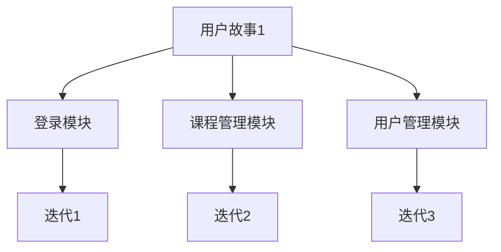

                 

### 文章标题

# 敏捷LLM应用开发中的需求管理

> 关键词：敏捷开发、LLM应用、需求管理、用户故事、迭代规划

> 摘要：本文将探讨敏捷方法在大型语言模型（LLM）应用开发中的需求管理实践。通过分析敏捷开发的核心原则与需求管理的流程，我们旨在为读者提供一套完整的敏捷需求管理方法论，包括需求收集、分析、计划、验证和迭代优化等关键步骤。此外，本文还将结合实际案例，深入剖析敏捷需求管理的最佳实践，帮助读者理解和掌握在LLM应用开发中实施敏捷需求管理的策略和技巧。

### 第一部分：敏捷LLM应用开发中的需求管理概述

#### 第1章：敏捷LLM应用开发与需求管理的理念

##### 1.1 敏捷开发方法与LLM应用开发

敏捷开发（Agile Development）是一种以人为核心、迭代和渐进式的软件开发方法。其核心原则包括快速反馈、持续交付、热爱变化和强调协作与沟通等。敏捷开发方法最初由软件开发者提出，旨在应对传统开发过程中存在的高风险、低效率等问题。随着人工智能技术的发展，尤其是大型语言模型（Large Language Model，简称LLM）的出现，敏捷开发方法在LLM应用开发中也得到了广泛应用。

LLM应用开发具有以下几个特点：

1. **复杂性高**：LLM模型通常包含数亿甚至数十亿个参数，其结构和参数量远超传统软件。这使得LLM应用开发过程更加复杂，需要高效的开发和管理方法。
2. **数据依赖性强**：LLM模型的训练和优化高度依赖高质量的数据集。因此，数据管理、数据清洗和数据处理在LLM应用开发中占有重要地位。
3. **迭代速度快**：由于LLM模型具有自我学习和优化的能力，开发团队需要快速响应需求变化，不断迭代和优化模型性能。

敏捷开发方法在LLM应用开发中的适用性：

1. **快速反馈**：敏捷开发强调快速反馈和持续交付，有助于开发团队及时了解用户需求和市场变化，快速调整和优化开发方向。
2. **协作与沟通**：敏捷开发强调团队合作和跨职能协作，有助于提高LLM应用开发效率，减少沟通成本。
3. **拥抱变化**：敏捷开发方法鼓励开发团队拥抱变化，灵活调整开发计划，以应对LLM应用开发过程中的不确定性。

##### 1.1.1 敏捷开发的核心原则

敏捷开发方法的核心原则包括：

1. **个体和互动重于过程与工具**：敏捷开发强调团队中个体的能力和互动，认为有效的沟通和协作比单纯依赖工具和流程更为重要。
2. **可工作的软件重于详尽的文档**：敏捷开发认为可工作的软件是验证需求的最佳方式，相对于冗长的文档，更注重实际成果。
3. **客户合作重于合同谈判**：敏捷开发鼓励与客户的紧密合作，通过不断沟通和反馈，确保最终产品符合客户需求。
4. **响应变化重于遵循计划**：敏捷开发方法强调对变化和不确定性的应对，通过迭代和渐进式开发，不断调整和优化开发计划。

##### 1.1.2 敏捷开发在LLM应用开发中的适用性

敏捷开发方法在LLM应用开发中的适用性体现在以下几个方面：

1. **快速迭代与反馈**：LLM应用开发过程复杂且涉及大量数据，通过敏捷迭代，开发团队可以更快地获取用户反馈，优化模型性能。
2. **持续交付与优化**：敏捷开发方法强调持续交付，有助于开发团队在保证质量的前提下，持续优化LLM应用性能。
3. **数据依赖管理**：敏捷开发方法中的需求管理和迭代管理可以帮助团队更好地管理数据依赖，确保数据质量和数据流顺畅。
4. **团队合作与协作**：敏捷开发方法强调团队合作和跨职能协作，有助于提高LLM应用开发效率，减少沟通成本。

##### 1.1.3 敏捷开发与传统开发方法的比较

传统开发方法（如瀑布模型）通常遵循以下流程：

1. **需求分析**：在项目初期，对需求进行详细分析和规划。
2. **设计**：根据需求分析结果进行系统设计。
3. **开发**：按照设计文档进行编码和开发。
4. **测试**：对开发完成的软件进行测试和验证。
5. **部署与维护**：将软件部署到生产环境，并进行维护和更新。

与传统开发方法相比，敏捷开发方法具有以下优势：

1. **灵活性**：敏捷开发方法更灵活，可以快速响应需求变化，减少开发风险。
2. **迭代与反馈**：敏捷开发强调迭代和持续反馈，有助于团队更好地了解用户需求和市场变化。
3. **团队合作**：敏捷开发方法强调团队合作和跨职能协作，有助于提高开发效率和质量。
4. **持续交付**：敏捷开发方法强调持续交付，可以确保软件在开发过程中始终保持可用状态。

##### 1.2 需求管理的核心概念

##### 1.2.1 需求的定义与分类

需求（Requirement）是指系统必须具备的功能、性能、可靠性、可维护性等特性。根据需求来源和性质，需求可以分为以下几类：

1. **功能性需求**：描述系统应具备的功能和操作，如用户界面、数据输入输出、算法实现等。
2. **非功能性需求**：描述系统的性能、安全性、可靠性、可维护性等方面的要求，如响应时间、错误处理、数据备份等。
3. **业务需求**：描述系统应满足的业务规则、流程和政策，如合规性、审计要求、业务逻辑等。
4. **用户需求**：描述用户对系统的期望和需求，如易用性、用户体验、满意度等。

##### 1.2.2 需求管理的流程与挑战

需求管理的流程包括以下关键步骤：

1. **需求识别**：收集和分析用户需求，识别系统应具备的功能和性能要求。
2. **需求分析**：对收集到的需求进行分析和分类，确保需求的完整性和一致性。
3. **需求定义**：将分析后的需求进行详细定义，明确需求的范围、目标和约束条件。
4. **需求验证**：通过测试和评审，验证需求是否满足预期目标。
5. **需求管理**：对需求进行版本控制、变更管理和需求文档的管理。

需求管理面临的挑战包括：

1. **需求变更**：在项目开发过程中，需求可能会因各种原因发生变化，需求变更管理是需求管理的核心挑战之一。
2. **需求冲突**：不同需求之间可能存在冲突，需求分析过程中需要识别和解决这些冲突。
3. **需求完整性**：确保需求覆盖系统的所有功能和性能要求，避免遗漏重要功能。
4. **需求质量**：需求质量直接影响系统开发的质量，需求分析过程中需要关注需求的质量。

##### 1.2.3 需求管理的重要性

需求管理在软件开发过程中具有以下重要性：

1. **确保项目成功**：清晰、明确和完整的需求是项目成功的基石，需求管理有助于确保项目按照预期目标进行。
2. **降低开发风险**：需求管理有助于识别和解决需求变更、需求冲突等潜在风险，降低项目开发风险。
3. **提高开发效率**：需求管理有助于提高团队协作效率，减少因需求不明导致的返工和沟通成本。
4. **满足用户需求**：需求管理确保系统开发符合用户需求，提高用户满意度和系统市场竞争力。

##### 1.3 敏捷需求管理的特点与原则

##### 1.3.1 敏捷需求管理的核心原则

敏捷需求管理的核心原则包括：

1. **用户故事驱动**：敏捷需求管理以用户故事（User Story）为核心，通过用户故事的编写和迭代，实现需求的逐步实现和优化。
2. **迭代与反馈**：敏捷需求管理强调迭代和持续反馈，通过快速迭代和持续反馈，不断优化需求和管理流程。
3. **需求优先级**：敏捷需求管理强调根据需求优先级进行开发，确保关键需求和紧急需求得到优先处理。
4. **协作与沟通**：敏捷需求管理强调团队协作和跨职能沟通，确保需求从识别到实现的各个环节顺畅进行。

##### 1.3.2 敏捷需求管理的工作方式

敏捷需求管理的工作方式包括：

1. **用户故事编写**：用户故事是敏捷需求管理的基本单元，通过编写用户故事，将需求分解为可管理的任务。
2. **迭代规划**：在迭代开始前，团队进行迭代规划，确定本次迭代的目标、任务和资源分配。
3. **任务分解**：将用户故事分解为具体任务，分配给团队成员，确保任务可执行、可追踪和可验收。
4. **持续反馈**：在迭代过程中，团队持续收集用户反馈，对需求和任务进行调整和优化。
5. **迭代回顾**：在迭代结束后，团队进行迭代回顾，总结经验教训，优化需求管理和开发流程。

##### 1.3.3 敏捷需求管理的关键成功因素

敏捷需求管理的关键成功因素包括：

1. **团队协作**：敏捷需求管理强调团队协作和跨职能沟通，确保需求从识别到实现的各个环节顺畅进行。
2. **用户参与**：用户参与是敏捷需求管理的核心，通过用户故事和持续反馈，确保系统开发符合用户需求。
3. **迭代与反馈**：敏捷需求管理强调迭代和持续反馈，通过快速迭代和持续反馈，不断优化需求和管理流程。
4. **需求优先级**：敏捷需求管理强调根据需求优先级进行开发，确保关键需求和紧急需求得到优先处理。
5. **敏捷文化**：敏捷需求管理需要团队具备敏捷文化，拥抱变化、鼓励创新和协作，确保敏捷需求管理的顺利实施。

#### 第2章：敏捷需求收集与分析

##### 2.1 敏捷需求收集的技巧

##### 2.1.1 用户访谈与反馈

用户访谈是敏捷需求收集的重要手段之一，通过与用户进行面对面交流，可以深入了解用户需求、痛点和期望。以下是一些用户访谈的技巧：

1. **准备充分**：在用户访谈前，准备好相关问题和背景资料，确保访谈过程的流畅和高效。
2. **开放式问题**：使用开放式问题引导用户表达观点和需求，避免封闭式问题的限制性。
3. **倾听与理解**：倾听用户的观点和需求，确保准确理解用户的意图，避免误解和歧义。
4. **记录与总结**：在访谈过程中，记录关键信息和用户需求，访谈结束后进行总结和整理。
5. **反馈与确认**：向用户反馈记录的信息，确保用户对需求的理解和认可。

##### 2.1.2 故事会与用户故事

故事会（Story Meeting）是一种通过团队协作，共同讨论和确定用户需求的会议形式。故事会包括以下关键步骤：

1. **准备会议**：确定会议议程、时间和地点，邀请相关利益相关者参加。
2. **讨论需求**：团队成员围绕用户需求展开讨论，明确需求的背景、目标和使用场景。
3. **编写用户故事**：根据讨论结果，编写用户故事，用户故事通常遵循“作为…，我想…，以便…”的格式。
4. **评审与确认**：对编写的用户故事进行评审，确保故事表述清晰、完整和可执行。
5. **更新需求文档**：将评审通过的用户故事更新到需求文档，作为后续开发和管理的基础。

##### 2.1.3 真实案例分享

以下是一个真实案例，说明如何通过用户访谈和故事会收集需求：

**案例背景**：某电商平台希望开发一款智能客服系统，以提高客户服务质量和效率。

**用户访谈**：项目经理与客服团队进行了多次用户访谈，了解了客服人员在工作中的痛点，如重复性问题、复杂问题解决时间过长等。

**故事会**：项目经理组织了一次故事会，邀请产品经理、技术团队和客服团队共同参加。在故事会上，团队成员围绕智能客服系统应具备的功能和性能要求进行了讨论，如自动回复常见问题、智能分类和转接问题等。

**用户故事编写**：根据讨论结果，编写了以下用户故事：

- **用户故事1**：作为客服人员，我想快速回复常见问题，以便提高客户满意度。
- **用户故事2**：作为客服人员，我想智能分类和转接复杂问题，以便提高问题解决效率。

**评审与确认**：团队成员对编写的用户故事进行了评审，确认了用户故事的完整性和可执行性，并将其更新到需求文档。

##### 2.2 需求分析的方法与工具

##### 2.2.1 费舍尔需求模型

费舍尔需求模型（Fishburne Demand Model）是一种用于需求分析的方法，旨在确保需求覆盖系统的所有功能和性能要求。费舍尔需求模型包括以下三个关键步骤：

1. **需求识别**：通过用户访谈、故事会和其他需求收集方法，识别系统的需求和功能。
2. **需求分类**：将识别到的需求进行分类，包括功能性需求、非功能性需求和业务需求等。
3. **需求验证**：通过评审、测试和用户反馈，验证需求是否满足预期目标，确保需求的完整性和一致性。

##### 2.2.2 用户画像与需求细分

用户画像（User Profile）是一种用于描述目标用户特征的方法，通过构建用户画像，可以更好地理解用户需求和偏好。用户画像通常包括以下关键信息：

1. **基本信息**：如年龄、性别、职业、教育背景等。
2. **行为特征**：如使用习惯、购买偏好、浏览路径等。
3. **需求特征**：如功能需求、性能需求、安全性需求等。

需求细分（Requirement Segmentation）是一种基于用户画像的需求分析方法，旨在将用户需求划分为不同的细分市场。需求细分可以帮助团队更好地了解用户需求，制定更有针对性的开发策略。以下是一个需求细分的示例：

**用户画像**：

- **用户A**：年龄25-35岁，男性，IT行业从业者，经常使用在线教育平台学习编程技能。
- **用户B**：年龄40-50岁，女性，全职妈妈，关注家庭教育和儿童教育。

**需求细分**：

- **用户A**：需求关注点包括编程课程推荐、学习进度跟踪、在线讨论社区等。
- **用户B**：需求关注点包括儿童教育课程推荐、亲子互动活动建议、教育资源分享等。

##### 2.2.3 故事地图与需求优先级

故事地图（Story Map）是一种用于需求分析和优先级排序的工具，通过故事地图，可以直观地展示用户需求、功能模块和迭代计划。故事地图通常包括以下关键信息：

1. **用户故事**：列出系统应实现的所有用户故事。
2. **功能模块**：将用户故事按功能模块进行分类，如登录模块、课程管理模块、用户管理模块等。
3. **迭代计划**：根据需求优先级和开发资源，确定每个迭代的目标和任务。

以下是一个故事地图的示例：



在故事地图的基础上，可以采用以下方法进行需求优先级排序：

1. **MoSCoW方法**：根据需求的紧急程度和重要性，将需求分为“必须（Must）”、“应该（Should）”、“可以（Could）”、“不会（Won't）”四个等级。
2. **用户调研**：通过用户调研和反馈，了解用户对需求的优先级和满意度。
3. **专家评审**：邀请相关专家和利益相关者对需求进行评审，确定需求优先级。

##### 2.3 需求文档编写与版本管理

##### 2.3.1 需求文档的基本格式

需求文档是需求分析和管理的重要成果，用于描述系统的功能和性能要求。以下是一个需求文档的基本格式：

1. **封面**：包括文档标题、版本号、编写人、评审人和日期等基本信息。
2. **目录**：列出需求文档的主要章节和子章节，方便读者快速查找。
3. **摘要**：简要概述需求文档的主要内容和目的。
4. **引言**：介绍需求文档的背景、目的和范围。
5. **功能需求**：详细描述系统应实现的功能和操作。
6. **非功能性需求**：详细描述系统的性能、安全性、可靠性、可维护性等方面的要求。
7. **业务需求**：详细描述系统应满足的业务规则、流程和政策。
8. **用户需求**：详细描述用户的期望和需求。
9. **需求分析**：介绍需求分析的流程和方法，包括用户访谈、故事会、用户画像等。
10. **需求验证**：介绍需求验证的流程和方法，包括测试、评审和用户反馈等。
11. **需求管理**：介绍需求管理的流程和方法，包括版本控制、变更管理和需求文档管理等。
12. **附录**：包括相关参考资料、用户故事、需求表格等。

##### 2.3.2 需求变更管理

需求变更管理是需求管理的重要环节，用于处理项目开发过程中出现的需求变更。以下是一些需求变更管理的最佳实践：

1. **需求变更记录**：建立需求变更记录表，记录每次变更的原因、影响范围和变更内容。
2. **变更评估**：对每次需求变更进行评估，包括变更的影响范围、成本和风险。
3. **变更审批**：根据评估结果，对需求变更进行审批，确保变更符合项目目标和约束条件。
4. **变更实施**：根据审批结果，实施需求变更，确保变更内容的准确性和一致性。
5. **变更验证**：对变更后的需求进行验证，确保变更符合预期目标和需求文档要求。

##### 2.3.3 需求文档的版本控制

需求文档的版本控制是确保需求文档准确性和一致性的关键。以下是一些需求文档版本控制的最佳实践：

1. **版本标记**：在每个需求文档版本中，标记版本号和日期，以便追溯和管理版本历史。
2. **文档更新**：在需求变更或更新时，及时更新需求文档，确保文档反映最新的需求变化。
3. **文档共享**：将需求文档存储在共享平台上，确保团队成员可以方便地访问和更新文档。
4. **文档备份**：定期备份需求文档，防止文档丢失或损坏。
5. **文档评审**：在每次需求变更或更新后，对需求文档进行评审，确保文档的准确性和一致性。

### 第二部分：敏捷需求计划与优先级排序

#### 第3章：敏捷需求计划与优先级排序

##### 3.1 敏捷需求计划的策略

敏捷需求计划是敏捷开发方法中至关重要的一环，它指导开发团队如何有序、高效地实现需求。以下是敏捷需求计划的几种关键策略：

##### 3.1.1 迭代规划与冲刺计划

迭代规划（Iteration Planning）是敏捷开发中的核心活动，它通常在每一迭代周期的开始进行。迭代规划包括以下步骤：

1. **目标设定**：团队根据产品愿景和用户故事，设定本次迭代的目标。
2. **任务分配**：根据目标，将用户故事分解为具体任务，并分配给团队成员。
3. **资源评估**：评估团队在本次迭代中可用的资源，包括人力、时间和预算等。
4. **风险评估**：识别本次迭代可能面临的风险，并制定相应的应对策略。

冲刺计划（Sprint Planning）是迭代规划的具体实施，通常在每一冲刺周期的开始进行。冲刺计划包括以下步骤：

1. **回顾上次迭代**：回顾上次迭代的完成情况和存在的问题，为本次冲刺计划提供参考。
2. **确定冲刺目标**：根据迭代规划的目标，确定本次冲刺的具体目标和任务。
3. **任务分解**：将冲刺目标分解为具体的任务，并分配给团队成员。
4. **时间估算**：对每个任务的完成时间进行估算，并制定冲刺时间表。

##### 3.1.2 用户故事地图与看板管理

用户故事地图（User Story Map）是一种可视化工具，用于展示用户需求、功能模块和迭代计划。用户故事地图通常包括以下内容：

1. **用户故事**：列出系统应实现的所有用户故事。
2. **功能模块**：将用户故事按功能模块进行分类，如登录模块、课程管理模块、用户管理模块等。
3. **迭代计划**：根据需求优先级和开发资源，确定每个迭代的目标和任务。

看板管理（Kanban Management）是一种基于可视化工具的需求管理方法，它通过看板（Kanban Board）展示任务的进展情况。看板管理包括以下关键步骤：

1. **任务创建**：将用户故事分解为具体任务，并将其添加到看板中。
2. **任务流转**：根据任务的状态（如待办、进行中、测试、已完成等），将任务拖动到相应的看板区域。
3. **任务监控**：通过看板实时监控任务的进展情况，确保任务按计划进行。
4. **任务优化**：根据任务进展情况，对任务流程和看板布局进行优化。

##### 3.1.3 需求优先级排序的方法

在敏捷开发中，需求优先级排序（Requirement Prioritization）是确保团队聚焦于最重要和最紧急需求的关键。以下是几种常用的需求优先级排序方法：

1. **MoSCoW方法**：MoSCoW方法将需求分为“必须（Must）”、“应该（Should）”、“可以（Could）”、“不会（Won't）”四个等级。其中，“必须”级需求是项目成功的关键，“应该”级需求是项目成功的必要条件，“可以”级需求是项目的增值需求，“不会”级需求则暂时不纳入开发计划。

2. **Kano模型**：Kano模型将需求分为五种类型：一类需求（基本型）、二类需求（满足型）、三类需求（激励型）、四类需求（破坏型）、五类需求（未知型）。一类需求是用户基本期望，二类需求是用户期望的功能，三类需求是用户激励因素，四类需求是用户不希望出现的问题，五类需求是用户未意识到的需求。

3. **用户调研**：通过用户调研和反馈，了解用户对需求的优先级和满意度。用户调研可以采用问卷调查、用户访谈、用户测试等方法。

4. **专家评审**：邀请相关专家和利益相关者对需求进行评审，根据专家意见确定需求的优先级。

##### 3.2 用户故事与任务分解

##### 3.2.1 用户故事的格式

用户故事（User Story）是敏捷开发中的核心概念，它以用户的视角描述系统的功能和需求。一个典型的用户故事遵循以下格式：

```
作为 [角色]，我想 [功能]，以便 [目的]
```

例如：

```
作为用户，我想搜索课程，以便快速找到所需的学习资源。
```

用户故事的格式包括以下三个要素：

1. **角色（Role）**：描述用户故事的目标用户，如用户、管理员、教师等。
2. **功能（Function）**：描述用户希望系统实现的具体功能。
3. **目的（Purpose）**：描述用户实现该功能的理由和目的。

##### 3.2.2 故事地图的应用

故事地图是一种可视化工具，用于展示用户需求、功能模块和迭代计划。以下是一个故事地图的示例：


故事地图的应用包括：

1. **需求梳理**：通过故事地图，团队可以清晰地梳理出系统的功能和需求，确保需求的完整性和一致性。
2. **迭代规划**：根据故事地图，团队可以确定每个迭代的目标和任务，确保需求按照优先级逐步实现。
3. **任务分配**：根据故事地图，团队可以将任务分配给不同的成员，确保任务明确、可执行和可追踪。
4. **进度监控**：通过故事地图，团队可以实时监控任务的进展情况，确保任务按计划进行。

##### 3.2.3 任务分解的技巧

任务分解是将用户故事分解为具体任务的过程，它有助于确保任务明确、可执行和可追踪。以下是一些任务分解的技巧：

1. **任务粒度**：任务粒度是指任务的大小和复杂度。合理的任务粒度应既能保证任务的明确性，又能确保任务的可行性。通常，任务粒度应适中，不宜过细或过粗。

2. **任务分解**：将用户故事分解为具体任务时，应遵循以下原则：
   - **可追踪性**：每个任务都应有明确的任务名称、任务描述、任务目标和任务负责人。
   - **可执行性**：每个任务都应具备可执行的条件，如所需资源、技术支持、时间安排等。
   - **相关性**：任务之间应保持相关性，确保任务能够协同完成用户故事。

3. **任务分配**：根据任务的特点和团队成员的能力，合理分配任务。在任务分配过程中，应充分考虑团队成员的技能、经验和兴趣，确保任务能够得到有效执行。

4. **任务评审**：在任务分解完成后，对任务进行评审，确保任务分解合理、可行和可追踪。任务评审可以采用小组讨论、专家评审等方式。

##### 3.3 需求优先级排序的实际操作

##### 3.3.1 MoSCoW方法

MoSCoW方法是一种常用的需求优先级排序方法，它将需求分为“必须（Must）”、“应该（Should）”、“可以（Could）”、“不会（Won't）”四个等级。以下是一个MoSCoW方法的实际操作示例：

1. **识别需求**：列出所有需求，包括功能性需求、非功能性需求和业务需求等。
2. **分类需求**：根据需求的紧急程度和重要性，将需求分为MoSCoW四个等级。
3. **优先级排序**：根据MoSCoW等级，对需求进行优先级排序。通常，“必须”级需求应优先考虑，“应该”级需求次之，“可以”级需求再次之，“不会”级需求则暂时不纳入开发计划。
4. **需求验证**：对排序后的需求进行验证，确保需求的完整性和一致性。

##### 3.3.2 灰度发布与A/B测试

灰度发布（Gray Release）和A/B测试（A/B Testing）是需求验证和优先级排序的重要手段。以下是一个灰度发布与A/B测试的实际操作示例：

1. **灰度发布**：
   - **需求验证**：在正式发布前，对需求进行灰度发布，即在一个小范围内（如1%的用户）进行验证。
   - **用户反馈**：收集灰度发布期间的用户反馈，包括使用体验、功能效果、用户满意度等。
   - **优化调整**：根据用户反馈，对需求进行优化调整，确保需求的可行性和用户体验。
   - **正式发布**：在灰度发布验证成功后，正式向所有用户发布需求。

2. **A/B测试**：
   - **测试设计**：设计A/B测试方案，包括测试组（A组）和对照组（B组），以及测试指标（如用户转化率、使用时长、功能点击率等）。
   - **用户分配**：将用户随机分配到A组和B组，确保测试的随机性和有效性。
   - **数据收集**：在A/B测试期间，收集用户行为数据，包括测试组和对照组的使用情况。
   - **结果分析**：分析A/B测试结果，确定哪个方案（A组或B组）更符合用户需求和预期效果。
   - **优化调整**：根据A/B测试结果，对需求进行优化调整，确保需求的最优实现。

### 第三部分：敏捷需求验证与迭代优化

#### 第4章：敏捷需求验证与迭代优化

##### 4.1 敏捷需求验证的流程

敏捷需求验证（Agile Requirement Validation）是确保系统需求满足用户期望和业务需求的关键环节。以下是一个敏捷需求验证的基本流程：

1. **需求评审**：在需求文档编写完成后，组织相关利益相关者（如产品经理、开发人员、测试人员等）对需求进行评审，确保需求的完整性、一致性和可行性。

2. **验收测试**：验收测试（Acceptance Testing）是验证需求是否满足用户期望和业务需求的重要手段。验收测试通常包括以下步骤：
   - **测试计划**：制定验收测试计划，明确测试目标、测试方法、测试环境和测试资源等。
   - **测试执行**：根据验收测试计划，执行测试用例，验证系统功能和性能。
   - **测试报告**：编写验收测试报告，记录测试结果和发现的问题。

3. **用户验收**：在验收测试完成后，组织用户进行验收测试，确保系统功能符合用户需求和期望。用户验收包括以下步骤：
   - **用户参与**：邀请用户参与验收测试，提供测试环境和测试用例。
   - **用户测试**：用户根据测试用例进行测试，记录测试结果和反馈意见。
   - **用户评审**：组织用户对验收测试结果进行评审，确定系统功能是否满足用户需求和期望。

4. **回归测试**：回归测试（Regression Testing）是确保新需求和功能变更不会破坏现有功能的重要手段。回归测试包括以下步骤：
   - **测试计划**：制定回归测试计划，明确测试目标、测试方法、测试环境和测试资源等。
   - **测试执行**：根据回归测试计划，执行测试用例，验证系统功能和性能。
   - **测试报告**：编写回归测试报告，记录测试结果和发现的问题。

5. **质量保证**：质量保证（Quality Assurance）是确保系统开发过程和质量的重要环节。质量保证包括以下步骤：
   - **过程监控**：监控系统开发过程，确保开发过程符合敏捷开发方法和流程。
   - **代码审查**：对开发完成的代码进行审查，确保代码质量、规范性和可维护性。
   - **测试用例管理**：建立和维护测试用例库，确保测试用例的完整性和可执行性。

##### 4.2 敏捷迭代的优化实践

敏捷迭代（Agile Iteration）是敏捷开发方法的核心，通过迭代和反馈，不断优化系统功能和用户体验。以下是一些敏捷迭代的优化实践：

1. **增量开发与持续交付**：增量开发（Incremental Development）是一种逐步交付和完善功能的方法，通过持续交付（Continuous Delivery），确保系统功能逐步实现，并及时交付用户。增量开发和持续交付包括以下步骤：
   - **需求分析**：确定本次迭代的需求，包括功能需求、性能需求和用户体验等。
   - **开发与测试**：根据需求分析结果，进行开发和测试，确保系统功能逐步实现。
   - **交付与部署**：将开发完成的系统功能部署到生产环境，并进行用户验收测试，确保系统功能稳定和可靠。
   - **用户反馈**：收集用户反馈，分析用户需求和问题，为下一次迭代提供改进方向。

2. **DevOps与敏捷融合**：DevOps（Development and Operations）是一种将开发（Development）和运维（Operations）紧密结合的方法，通过自动化和持续集成/持续交付（CI/CD），提高开发效率和系统质量。DevOps与敏捷融合包括以下步骤：
   - **自动化测试**：建立自动化测试框架，包括单元测试、集成测试和验收测试，确保测试效率和质量。
   - **持续集成**：将开发完成的代码集成到主分支，通过自动化测试和持续集成工具，确保集成过程的快速和稳定。
   - **持续交付**：通过持续交付工具，将开发完成的系统功能部署到生产环境，确保系统的稳定和可靠。

3. **数据驱动与敏捷优化**：数据驱动（Data-Driven）是一种基于数据分析的方法，通过收集和分析用户行为数据，优化系统功能和用户体验。数据驱动与敏捷优化包括以下步骤：
   - **数据收集**：建立数据收集系统，收集用户行为数据，包括点击率、转化率、使用时长等。
   - **数据分析**：对收集到的数据进行分析，识别用户需求和问题。
   - **优化调整**：根据数据分析结果，对系统功能和用户体验进行优化调整。
   - **效果评估**：评估优化调整的效果，确保优化措施的有效性。

##### 4.3 敏捷需求管理中的常见问题与解决方案

敏捷需求管理过程中，可能会遇到一些常见问题。以下是一些常见问题及其解决方案：

1. **需求变更频繁**：需求变更频繁会导致项目延期和资源浪费。解决方案包括：
   - **需求变更管理**：建立需求变更管理流程，对每次变更进行评估和审批，确保变更的合理性和必要性。
   - **需求优先级排序**：根据需求优先级进行开发，确保关键需求和紧急需求得到优先处理。
   - **用户参与**：鼓励用户参与需求变更讨论，确保用户需求得到及时反馈和调整。

2. **需求冲突**：需求冲突可能导致需求无法实现或功能重叠。解决方案包括：
   - **需求评审**：在需求编写和变更过程中，组织相关利益相关者进行评审，确保需求的完整性和一致性。
   - **沟通协作**：加强团队内部沟通协作，确保需求冲突在早期得到识别和解决。
   - **需求优先级排序**：根据需求优先级和紧急程度，确定需求的优先级和实施顺序。

3. **需求文档不完整**：需求文档不完整可能导致需求实现偏差或功能缺失。解决方案包括：
   - **需求分析**：在需求编写过程中，进行详细的需求分析，确保需求完整、明确和可执行。
   - **需求评审**：组织相关利益相关者对需求文档进行评审，确保需求文档的完整性和一致性。
   - **用户反馈**：在需求实现过程中，及时收集用户反馈，对需求文档进行更新和完善。

### 第四部分：敏捷需求管理工具与技术

#### 第5章：敏捷需求管理工具与技术

##### 5.1 敏捷需求管理工具概述

在敏捷需求管理中，选择合适的工具可以提高团队的工作效率和管理水平。以下是一些常用的敏捷需求管理工具：

1. **JIRA**：JIRA是一款功能强大的敏捷项目管理工具，支持需求管理、任务跟踪、迭代规划等功能。JIRA具有以下特点：
   - **灵活的需求管理**：支持用户故事、需求卡片等多种需求管理方式。
   - **强大的任务跟踪**：支持任务创建、分配、进度监控等功能。
   - **灵活的迭代规划**：支持迭代规划、冲刺计划、看板管理等功能。

2. **Trello**：Trello是一款简单易用的看板管理工具，适用于敏捷团队的需求管理和任务跟踪。Trello具有以下特点：
   - **直观的看板界面**：通过看板、卡片和标签，直观地展示任务进度和状态。
   - **灵活的任务分配**：支持任务创建、分配、进度监控等功能。
   - **方便的协作与沟通**：支持团队成员之间的实时沟通和协作。

3. **Confluence**：Confluence是一款团队协作工具，支持文档编写、知识管理、需求管理等功能。Confluence具有以下特点：
   - **全面的文档编写**：支持Markdown语法，方便编写和格式化文档。
   - **强大的知识管理**：支持知识库、页面管理和搜索功能，方便团队成员查找和使用知识。
   - **灵活的需求管理**：支持用户故事、需求卡片、迭代规划等多种需求管理方式。

4. **Notion**：Notion是一款多功能的团队协作工具，支持笔记、任务管理、数据库管理等功能。Notion具有以下特点：
   - **灵活的任务管理**：支持任务创建、分配、进度监控等功能。
   - **直观的数据库管理**：支持数据库创建、数据录入、数据查询等功能。
   - **强大的协作功能**：支持团队成员之间的实时沟通和协作。

##### 5.2 敏捷需求管理技术的应用

1. **版本控制系统（如Git）**：

版本控制系统（Version Control System，简称VCS）是一种用于管理和跟踪代码版本的工具，如Git、SVN等。在敏捷需求管理中，版本控制系统具有以下应用：

   - **代码管理**：版本控制系统可以跟踪代码的版本历史，确保代码的可追溯性和一致性。
   - **协同工作**：团队成员可以通过版本控制系统协同工作，实现代码的共享和同步。
   - **代码审查**：通过版本控制系统，团队成员可以对代码进行审查和评论，确保代码的质量和安全性。

2. **自动化测试与持续集成**：

自动化测试（Automated Testing）和持续集成（Continuous Integration，简称CI）是敏捷需求管理中的重要技术，可以提高开发效率和系统质量。以下是一些关键应用：

   - **自动化测试**：通过编写测试脚本，自动化执行测试用例，确保系统的功能和质量。
   - **持续集成**：将开发完成的代码集成到主分支，通过自动化测试和构建工具，确保集成过程的快速和稳定。
   - **持续交付**：通过持续集成和持续交付（Continuous Delivery，简称CD），实现系统的自动化部署和上线。

3. **数据库管理与应用**：

数据库管理（Database Management）是敏捷需求管理中的重要环节，用于存储和管理系统的数据。以下是一些关键应用：

   - **数据模型设计**：根据需求文档，设计系统的数据模型，确保数据的结构合理和完整。
   - **数据存储与管理**：选择合适的数据库管理系统（如MySQL、PostgreSQL等），存储和管理系统的数据。
   - **数据查询与分析**：通过SQL查询语言，对数据库中的数据进行查询和分析，支持数据驱动的需求管理和优化。

##### 5.3 敏捷需求管理的最佳实践

1. **敏捷需求管理的常见误区**：

在敏捷需求管理实践中，团队可能会遇到一些常见误区。以下是一些常见误区及其解决方案：

   - **误区1：需求变更频繁导致项目延期**
     - **解决方案**：建立需求变更管理流程，对每次变更进行评估和审批，确保变更的合理性和必要性。

   - **误区2：需求评审不充分导致需求不完整**
     - **解决方案**：在需求编写和变更过程中，组织相关利益相关者进行评审，确保需求的完整性和一致性。

   - **误区3：忽视用户参与导致需求不符合用户期望**
     - **解决方案**：鼓励用户参与需求变更讨论，确保用户需求得到及时反馈和调整。

2. **敏捷团队的角色与职责**：

在敏捷需求管理中，团队成员的角色和职责明确，有助于提高团队协作效率。以下是一些关键角色和职责：

   - **产品负责人（Product Owner）**：负责产品愿景和需求的制定，协调团队成员之间的沟通和协作。
   - **开发人员（Developers）**：负责实现产品需求，编写和优化代码，确保系统的功能和性能。
   - **测试人员（Testers）**：负责测试系统的功能和质量，编写和执行测试用例，确保系统稳定可靠。
   - **运维人员（Operations）**：负责系统的部署、运维和监控，确保系统的稳定运行和性能优化。

3. **敏捷需求管理的持续改进**：

敏捷需求管理是一个持续改进的过程，团队可以通过以下方法进行持续改进：

   - **回顾与总结**：在每次迭代结束后，组织团队进行回顾和总结，识别成功经验和改进点。
   - **知识分享**：鼓励团队成员分享知识和经验，提高团队的整体能力和水平。
   - **工具优化**：根据团队需求和实际使用情况，优化和升级需求管理工具，提高团队的工作效率。

### 第五部分：敏捷需求管理案例分析

#### 第6章：敏捷需求管理案例分析

##### 6.1 案例研究1：某电商平台的敏捷需求管理实践

**6.1.1 案例背景**

某电商平台是一家专注于电商业务的公司，为了提升用户体验和业务效率，公司决定采用敏捷开发方法进行系统升级和优化。在此背景下，需求管理成为项目成功的关键。

**6.1.2 需求收集与需求分析**

在项目启动阶段，项目团队通过以下方法进行需求收集和分析：

- **用户访谈**：项目团队与平台上的主要用户进行深入访谈，了解用户的使用习惯、痛点和期望。
- **问卷调查**：通过在线问卷的形式，收集更广泛的用户反馈，分析用户需求。
- **业务分析**：与业务团队紧密合作，了解业务需求和流程，识别平台需要改进的方面。

通过需求收集和分析，项目团队确定了以下核心需求：

1. **提升搜索功能**：优化搜索算法，提高搜索准确性和响应速度。
2. **增强推荐系统**：基于用户行为和偏好，提供个性化商品推荐。
3. **优化购物流程**：简化购物流程，提高用户购物体验。

**6.1.3 需求计划与迭代管理**

项目团队采用敏捷迭代方法，将需求分解为可管理的用户故事，并制定迭代计划。以下是需求计划与迭代管理的关键步骤：

1. **迭代规划**：在每次迭代开始前，团队进行迭代规划，确定迭代目标、任务和时间表。
2. **任务分配**：根据用户故事和迭代目标，将任务分配给团队成员，明确任务负责人和完成时间。
3. **迭代执行**：在迭代过程中，团队遵循敏捷开发原则，持续交付可工作的软件，并进行迭代回顾和调整。

**6.1.4 需求验证与优化**

在需求验证与优化阶段，项目团队采用以下方法：

1. **验收测试**：在每次迭代结束后，组织用户进行验收测试，确保系统功能满足用户需求。
2. **用户反馈**：通过用户反馈，收集用户对系统功能和体验的反馈，识别需要优化的方面。
3. **持续优化**：根据用户反馈和测试结果，对系统进行优化和调整，提升用户体验。

**6.1.5 案例总结**

通过敏捷需求管理，电商平台在系统升级和优化过程中，实现了以下成果：

1. **提升用户体验**：通过优化搜索功能和推荐系统，用户满意度显著提高。
2. **提高业务效率**：简化购物流程，降低用户购物成本，提高业务转化率。
3. **增强团队协作**：通过敏捷迭代方法，团队协作效率和质量得到提升。

##### 6.2 案例研究2：某金融科技的敏捷需求管理实践

**6.2.1 案例背景**

某金融科技公司是一家专注于金融科技服务的公司，为了提升产品竞争力和用户体验，公司决定采用敏捷开发方法进行产品开发和迭代。

**6.2.2 需求收集与需求分析**

项目团队通过以下方法进行需求收集和分析：

- **用户调研**：通过与客户和潜在客户的面对面访谈和问卷调查，了解用户需求和市场趋势。
- **市场分析**：研究竞争对手的产品和服务，分析行业需求和趋势。
- **业务需求**：与业务团队紧密合作，了解公司的业务目标和战略需求。

通过需求收集和分析，项目团队确定了以下核心需求：

1. **增强交易安全**：提升交易系统的安全性和可靠性，降低风险。
2. **优化用户体验**：简化操作流程，提高用户操作的便捷性和满意度。
3. **提供个性化服务**：根据用户行为和偏好，提供个性化的金融产品和服务。

**6.2.3 需求计划与迭代管理**

项目团队采用敏捷迭代方法，将需求分解为用户故事，并制定迭代计划。以下是需求计划与迭代管理的关键步骤：

1. **迭代规划**：在每次迭代开始前，团队进行迭代规划，确定迭代目标、任务和时间表。
2. **任务分配**：根据用户故事和迭代目标，将任务分配给团队成员，明确任务负责人和完成时间。
3. **迭代执行**：在迭代过程中，团队遵循敏捷开发原则，持续交付可工作的软件，并进行迭代回顾和调整。

**6.2.4 需求验证与优化**

在需求验证与优化阶段，项目团队采用以下方法：

1. **验收测试**：在每次迭代结束后，组织用户进行验收测试，确保系统功能满足用户需求。
2. **用户反馈**：通过用户反馈，收集用户对系统功能和体验的反馈，识别需要优化的方面。
3. **持续优化**：根据用户反馈和测试结果，对系统进行优化和调整，提升用户体验。

**6.2.5 案例总结**

通过敏捷需求管理，金融科技公司实现了以下成果：

1. **提高交易安全**：通过增强交易系统的安全性和可靠性，降低了风险，提升了用户信任度。
2. **优化用户体验**：通过简化操作流程，提高了用户满意度，增加了用户粘性。
3. **提供个性化服务**：根据用户行为和偏好，提供了个性化的金融产品和服务，提升了用户价值。

##### 6.3 案例研究3：某物联网设备的敏捷需求管理实践

**6.3.1 案例背景**

某物联网设备公司是一家专注于智能家居设备研发的公司，为了提升产品竞争力和用户体验，公司决定采用敏捷开发方法进行产品开发和迭代。

**6.3.2 需求收集与需求分析**

项目团队通过以下方法进行需求收集和分析：

- **用户访谈**：与潜在用户和现有用户进行面对面访谈，了解用户对智能家居设备的需求和期望。
- **市场调研**：研究竞争对手的产品和市场趋势，分析行业需求和用户偏好。
- **技术评估**：与研发团队紧密合作，评估现有技术能力和未来发展趋势。

通过需求收集和分析，项目团队确定了以下核心需求：

1. **设备互联互通**：实现设备之间的互联互通，提供统一的智能控制平台。
2. **智能场景设置**：提供智能场景设置功能，满足用户个性化需求。
3. **远程控制与监控**：通过手机应用，实现设备的远程控制和实时监控。

**6.3.3 需求计划与迭代管理**

项目团队采用敏捷迭代方法，将需求分解为用户故事，并制定迭代计划。以下是需求计划与迭代管理的关键步骤：

1. **迭代规划**：在每次迭代开始前，团队进行迭代规划，确定迭代目标、任务和时间表。
2. **任务分配**：根据用户故事和迭代目标，将任务分配给团队成员，明确任务负责人和完成时间。
3. **迭代执行**：在迭代过程中，团队遵循敏捷开发原则，持续交付可工作的软件，并进行迭代回顾和调整。

**6.3.4 需求验证与优化**

在需求验证与优化阶段，项目团队采用以下方法：

1. **验收测试**：在每次迭代结束后，组织用户进行验收测试，确保系统功能满足用户需求。
2. **用户反馈**：通过用户反馈，收集用户对系统功能和体验的反馈，识别需要优化的方面。
3. **持续优化**：根据用户反馈和测试结果，对系统进行优化和调整，提升用户体验。

**6.3.5 案例总结**

通过敏捷需求管理，物联网设备公司实现了以下成果：

1. **提升设备互联互通**：通过实现设备之间的互联互通，提供了统一的智能控制平台，提升了用户便利性和满意度。
2. **满足个性化需求**：通过智能场景设置，满足了用户的个性化需求，增加了用户粘性。
3. **提升远程控制与监控体验**：通过远程控制与监控，提升了用户的操作便捷性和设备安全性。

### 第六部分：敏捷需求管理展望与未来趋势

##### 7.1 敏捷需求管理的挑战与机遇

敏捷需求管理作为一种高效的软件开发方法，虽然在实践中取得了显著成果，但仍然面临一系列挑战和机遇。以下是敏捷需求管理的一些主要挑战与机遇：

**挑战：**

1. **需求变更管理**：在敏捷开发中，需求变更较为频繁，如何有效地管理需求变更，确保项目按时交付和质量稳定，是一个重要的挑战。
2. **团队协作与沟通**：敏捷开发强调跨职能团队的协作和沟通，但在实际操作中，如何确保团队成员之间的有效沟通和协作，提高团队整体效能，仍需不断探索。
3. **需求优先级排序**：在众多需求中，如何准确判断需求的优先级，确保关键需求得到优先处理，是一个复杂的决策问题。

**机遇：**

1. **技术创新**：随着人工智能、大数据和云计算等技术的不断发展，敏捷需求管理可以借助这些先进技术，提高需求分析的准确性和效率。
2. **用户参与**：用户参与是敏捷需求管理的核心，通过用户反馈和参与，可以更好地了解用户需求，提升产品满意度和市场竞争力。
3. **敏捷文化**：随着敏捷开发方法的普及，越来越多的企业开始接受和拥抱敏捷文化，这为敏捷需求管理的广泛应用提供了良好的环境。

##### 7.2 敏捷需求管理的未来趋势

未来，敏捷需求管理将呈现以下发展趋势：

1. **数据驱动的需求管理**：随着大数据和人工智能技术的发展，数据驱动的需求管理将成为主流。通过收集和分析用户数据，可以更精准地识别用户需求，优化需求管理流程。

2. **自动化与智能化**：自动化工具和智能化技术的应用将进一步提升需求管理的效率和准确性。例如，通过自然语言处理技术，可以实现自动化需求分析、任务分配和优先级排序。

3. **跨领域融合**：敏捷需求管理将与其他领域（如项目管理、质量保证、用户体验设计等）深度融合，形成一套完整的敏捷开发体系，为软件开发提供全面的支持。

4. **持续学习和优化**：敏捷需求管理将不断吸取行业最佳实践和用户反馈，持续学习和优化，以适应不断变化的市场需求和技术环境。

##### 7.3 敏捷需求管理的持续改进

为了实现敏捷需求管理的持续改进，可以采取以下措施：

1. **定期回顾与反思**：在每次迭代结束后，组织团队进行回顾和反思，总结经验和教训，识别改进点。
2. **知识分享与培训**：鼓励团队成员分享知识和经验，组织定期的培训和学习活动，提高团队的整体能力。
3. **用户反馈与优化**：通过持续收集用户反馈，了解用户需求和体验，及时调整和优化需求管理流程。
4. **技术创新与应用**：关注新技术的发展和应用，积极探索和应用新工具和方法，提高需求管理的效率和准确性。

#### 结束语

敏捷需求管理是敏捷开发方法的重要组成部分，它在大型语言模型（LLM）应用开发中发挥着至关重要的作用。通过本文的探讨，我们了解了敏捷需求管理的核心原则、方法和实践，以及其在不同领域的应用案例。展望未来，敏捷需求管理将在数据驱动、自动化和智能化方面取得更多突破，为软件开发带来更高的效率和更好的用户体验。

最后，我们鼓励读者在实际工作中不断实践和探索敏捷需求管理的方法和技巧，持续优化需求管理流程，为项目的成功和团队的成长贡献力量。

### 作者信息

- 作者：AI天才研究院/AI Genius Institute & 禅与计算机程序设计艺术 /Zen And The Art of Computer Programming

