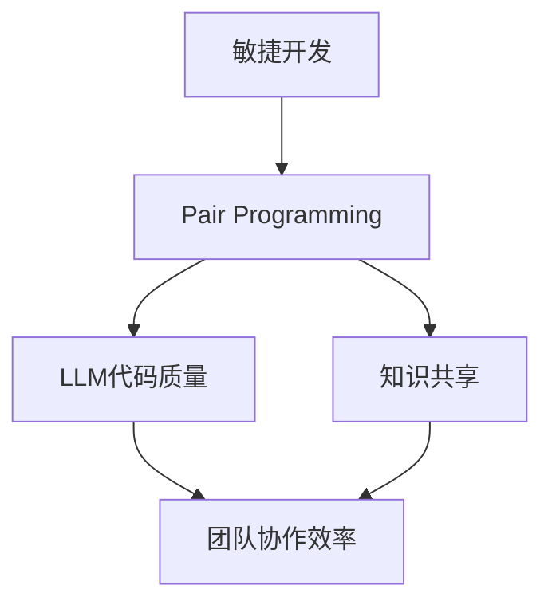

                 

# 引言与核心概念

在当今快速变化的软件开发领域中，敏捷开发已经成为主流的开发方法。它强调灵活应对变化，通过短周期的迭代和持续交付来提升软件质量。敏捷开发的核心价值观包括客户满意、响应变化、个体和互动的重要性、工作的软件、合作的团队和持续的改进。

在敏捷开发中，**Pair Programming（结对编程）**是一种常见的实践方法。它通过两名程序员（一个作为“司机”，一个作为“观察者”）共同编写代码，以提高代码质量和团队协作效率。本文旨在探讨Pair Programming在敏捷开发中的应用，特别是如何通过这一方法提高大型语言模型（LLM）的代码质量和促进知识共享。

## 核心概念联系

为了更好地理解本文的核心概念，我们可以绘制一个简单的Mermaid流程图来展示它们之间的关系：

### 敏捷开发与Pair Programming

敏捷开发强调快速响应变化和持续交付，Pair Programming作为其中的一个实践方法，有助于提升团队协作和代码质量。通过Pair Programming，两名程序员可以互相检查和补充对方的知识和技能，从而提高代码的可读性和可维护性。

### LLM代码质量

随着人工智能技术的发展，大型语言模型（LLM）已经成为许多应用的关键组件。提高LLM代码质量意味着提升模型的可读性、可维护性、性能和可靠性。这对整个软件项目的成功至关重要。

### 知识共享

知识共享是提高团队协作效率的关键因素。通过Pair Programming，团队成员可以实时交流和分享知识，积累宝贵的经验，从而提升整个团队的技能水平。

通过这个流程图，我们可以看到敏捷开发、Pair Programming、LLM代码质量和知识共享之间的紧密联系。接下来，我们将分别深入探讨这些主题，并通过具体案例来展示它们在实际开发中的应用。

## 敏捷开发与Pair Programming概述

### 敏捷开发的核心理念

敏捷开发（Agile Development）起源于20世纪90年代末，是一种应对快速变化的需求的软件开发方法。它的核心理念包括客户满意、响应变化、个体和互动的重要性、工作的软件、协作的团队和持续的改进。

首先，客户满意是敏捷开发的最高宗旨。敏捷开发强调通过快速迭代和持续交付，及时响应客户的需求和反馈，从而确保软件产品始终符合客户的期望。

其次，响应变化是敏捷开发的重要特点。传统的瀑布模型在项目初期就定义了详细的计划和需求，而在敏捷开发中，团队会根据实际情况不断调整计划和需求，以更好地应对市场和技术变化。

个体和互动的重要性强调的是，团队成员之间的协作和沟通比过程、工具和算法更加重要。敏捷开发鼓励团队成员之间的直接交流，以提升团队的创造力和创新能力。

工作的软件被视为交付价值的核心，而不是文档。敏捷开发强调通过实际运行的软件来展示成果，而不是通过文档来证明。

协作的团队指的是，团队成员应该相互信任、共同努力，以实现共同的目标。

最后，持续的改进是敏捷开发的一个重要价值观。敏捷开发鼓励团队成员不断反思和改进他们的工作方式，以提高团队的整体效率和软件质量。

### 敏捷开发的历史背景

敏捷开发的概念最早可以追溯到20世纪80年代末和90年代初。当时，软件开发领域正面临巨大的挑战，包括复杂项目的延迟交付、预算超支和质量问题。这些挑战促使软件开发者们开始探索新的方法来提高软件开发的效率和质量。

1991年，Kent Beck提出了极限编程（Extreme Programming，XP），这是最早的敏捷方法之一。XP强调通过简化的过程和持续反馈来提高软件质量。随后，其他敏捷方法如精益软件开发（Lean Software Development）、Crystal Methodology和Scrum等相继出现。

2001年，17位软件开发者共同签署了《敏捷宣言》（Manifesto for Agile Software Development），明确了敏捷开发的核心理念。这份宣言的发布标志着敏捷开发运动的正式诞生。

### 敏捷开发的核心理念

#### 客户满意

客户满意是敏捷开发的最高宗旨。传统软件开发方法往往在项目初期就定义了详细的需求和计划，但在项目执行过程中，这些需求和计划往往无法完全满足实际需求。敏捷开发通过短周期的迭代和持续交付，使得团队能够及时响应客户的需求和反馈，从而确保软件产品始终符合客户的期望。

在实际项目中，团队会定期与客户进行沟通，了解他们的需求变化和反馈。通过这种持续的互动，团队能够及时调整开发方向，避免开发出不符合客户需求的软件。此外，敏捷开发还鼓励客户参与需求定义和测试过程，以确保最终交付的软件产品能够真正满足客户的需求。

#### 响应变化

响应变化是敏捷开发的核心特点之一。在传统的瀑布模型中，项目需求在项目初期就完全确定，并且后续的修改往往被严格控制。这种方法在需求变化较少的项目中可能有效，但在快速变化的软件开发环境中，这种方法往往无法应对需求的变化。

敏捷开发通过迭代和增量的方式，将整个项目划分为多个短周期的迭代。每个迭代结束后，团队都会进行评审和反思，根据实际情况调整计划和需求。这种方法使得团队能够灵活应对需求变化，确保项目能够及时交付高质量的软件。

在实际项目中，响应变化的具体表现包括以下几点：

1. **需求管理**：敏捷开发强调需求管理的重要性，通过迭代和增量开发，团队能够更好地管理和控制需求。在每次迭代开始前，团队会与客户和利益相关者一起讨论和确认当前的需求，并根据实际情况进行调整。

2. **迭代计划**：敏捷开发团队通常会在每个迭代开始前制定详细的计划，包括要完成的功能、任务和里程碑。这个计划是灵活的，可以根据实际情况进行调整，以应对需求变化。

3. **迭代评审**：在每个迭代结束后，团队都会进行评审，评估项目的进度和质量，并根据评审结果调整后续的迭代计划。

#### 个体和互动的重要性

个体和互动的重要性是敏捷开发的另一个核心理念。传统的软件开发方法往往强调过程、工具和算法，而忽略了团队成员的个性和互动。敏捷开发则认为，团队成员之间的协作和沟通比过程、工具和算法更加重要。

敏捷开发鼓励团队成员之间进行直接的交流，以提升团队的创造力和创新能力。这种方法不仅能够提高软件质量，还能够增强团队的凝聚力和工作效率。

在实际项目中，个体和互动的重要性表现在以下几个方面：

1. **面对面交流**：敏捷开发强调面对面交流的重要性，通过团队会议、代码审查和讨论，团队成员可以更有效地分享知识和经验。

2. **代码审查**：敏捷开发团队通常会进行代码审查，以确保代码的质量和一致性。代码审查不仅有助于发现潜在的问题，还可以促进团队成员之间的知识共享。

3. **团队建设**：敏捷开发团队通过定期的团队建设活动，如团队建设训练、社交活动等，来增强团队凝聚力和信任感。

#### 工作软件

工作的软件被视为交付价值的核心，而不是文档。在传统的软件开发方法中，项目往往强调文档的完整性，而忽略了软件的实际运行效果。敏捷开发则认为，实际运行的软件是交付价值的关键。

敏捷开发团队通过迭代和增量的方式，逐步交付可运行的软件。这种方式不仅能够提高软件质量，还可以确保软件始终符合客户的需求。在实际项目中，工作的软件体现在以下几个方面：

1. **迭代交付**：敏捷开发团队在每个迭代结束后都会交付一个可运行的软件版本。这种方式使得团队能够及时响应需求变化，确保软件始终符合客户的需求。

2. **持续集成**：敏捷开发团队通常采用持续集成（Continuous Integration）的方法，确保每次代码提交后都能自动构建和测试。这种方式不仅提高了软件质量，还可以快速发现和修复问题。

3. **用户反馈**：敏捷开发团队鼓励用户参与测试和反馈过程，通过用户反馈来指导后续的开发工作。

#### 协作的团队

协作的团队是敏捷开发的另一个核心价值观。敏捷开发认为，团队成员之间应该相互信任、共同努力，以实现共同的目标。

在实际项目中，协作的团队体现在以下几个方面：

1. **跨职能团队**：敏捷开发团队通常由不同职能的成员组成，如开发、测试、设计等。这种方式使得团队能够更全面地考虑项目需求，提高项目的整体效率。

2. **自主管理**：敏捷开发团队通常实行自主管理，即团队成员自己决定如何完成工作。这种方式不仅提高了团队的灵活性，还可以激发团队成员的积极性和创造力。

3. **共同目标**：敏捷开发团队强调共同目标的重要性，通过明确的团队目标和定期评估，确保团队成员始终保持专注和动力。

#### 持续的改进

持续的改进是敏捷开发的另一个重要价值观。敏捷开发鼓励团队成员不断反思和改进他们的工作方式，以提高团队的整体效率和软件质量。

在实际项目中，持续的改进体现在以下几个方面：

1. **反思会议**：敏捷开发团队定期进行反思会议，讨论工作中的问题和改进点。这种方式有助于团队成员共同学习和成长。

2. **改进计划**：敏捷开发团队根据反思会议的结果，制定改进计划，并在后续的迭代中实施。这种方式确保了团队持续改进的能力。

3. **知识共享**：敏捷开发团队鼓励知识共享，通过定期的培训、分享会等，提升团队的整体技能水平。

### 敏捷开发与传统开发模式对比

敏捷开发与传统开发模式在多个方面存在显著差异。首先，在开发过程上，敏捷开发强调迭代和增量开发，而传统开发模式通常采用瀑布模型，先进行详细的需求分析，然后进行设计、开发和测试。这种线性过程在需求稳定的情况下可能有效，但在需求变化频繁的情况下，往往难以应对。

其次，在团队协作上，敏捷开发强调个体和互动的重要性，鼓励团队成员之间进行直接的交流和合作，而传统开发模式往往强调个人工作成果，忽略了团队协作。

此外，在项目管理上，敏捷开发采用敏捷方法，如Scrum和Kanban，通过短周期的迭代和持续交付来管理项目，而传统开发模式通常采用严格的项目管理流程，如PMP和Prince2，这些流程在项目初期就定义了详细的项目计划和预算。

总的来说，敏捷开发更灵活、更注重团队协作和客户满意，而传统开发模式更强调过程控制和文档管理。在实际应用中，选择合适的开发方法需要根据项目的具体情况和团队的特点来决定。

## Pair Programming的定义与目的

### 定义

Pair Programming（结对编程）是一种软件开发实践方法，由两名程序员在同一台计算机上进行协作编程。这两个程序员分别扮演“司机”和“观察者”的角色，共同完成代码编写和测试工作。

### 历史与发展

Pair Programming的概念最早由程序员沃伦·麦卡锡（Warren McLaughlin）和雅各布·纽豪斯（Jacob N. Russia）在20世纪90年代提出。他们的研究表明，通过两名程序员协作，可以提高代码质量、减少错误和提高开发效率。此后，Pair Programming逐渐在敏捷开发中得到了广泛应用。

### 优势

1. **代码质量提升**：通过两名程序员相互审查和补充，可以显著提高代码的质量和可读性。
2. **知识共享**：协作过程中，两名程序员可以互相学习、分享知识和经验，从而提升整个团队的技术水平。
3. **错误减少**：由于两名程序员共同编写代码，可以更快速地发现和纠正错误。
4. **团队协作加强**：Pair Programming有助于增强团队成员之间的沟通和合作，提高团队的整体效率。

### 适用场景

Pair Programming适用于多种软件开发场景，包括：

1. **新项目开发**：在项目初期，通过Pair Programming可以确保代码质量，并快速搭建项目框架。
2. **代码重构**：在代码重构过程中，Pair Programming有助于发现潜在的问题，并优化代码结构。
3. **团队技能提升**：通过Pair Programming，团队成员可以相互学习和分享，提高整体技能水平。

总的来说，Pair Programming作为一种高效的软件开发实践方法，已经在敏捷开发中得到了广泛应用。通过协作和知识共享，它不仅提高了代码质量，还增强了团队的协作能力。

### LLM（大语言模型）介绍

#### LLM的基本概念

大型语言模型（Large Language Model，简称LLM）是一种利用深度学习技术训练出的复杂神经网络模型，用于理解和生成自然语言。LLM的核心目标是通过学习大量的文本数据，生成高质量、语义丰富的文本。

#### LLM的发展历程

LLM的发展历程可以追溯到20世纪80年代，当时研究人员开始探索使用神经网络进行自然语言处理（NLP）。然而，由于计算资源和数据量的限制，早期的模型如基于规则的方法和统计模型（如N-gram模型）成为主流。

随着计算能力和数据量的提升，深度学习技术开始应用于NLP领域。2018年，谷歌发布了BERT（Bidirectional Encoder Representations from Transformers），这是一个基于Transformer架构的双向编码器模型，开启了LLM发展的新纪元。此后，OpenAI的GPT-3、微软的Turing-NLG等大规模模型相继发布，进一步推动了LLM的发展。

#### LLM的核心算法原理

1. **词汇嵌入与自注意力机制**：
   - **词汇嵌入（Word Embedding）**：将文本中的词汇转换为固定长度的向量表示，以便神经网络处理。早期的词向量如Word2Vec和GloVe是这一技术的代表。
   - **自注意力机制（Self-Attention）**：自注意力机制是一种在处理序列数据时动态调整各词汇权重的方法，可以更好地捕捉长距离依赖关系。Transformer架构中的多头自注意力是这一机制的典型实现。

2. **Transformer结构与训练**：
   - **Transformer架构**：Transformer是由谷歌在2017年提出的一种基于自注意力机制的序列到序列模型，其核心思想是仅使用自注意力机制和前馈神经网络，而无需循环神经网络（RNN）。
   - **训练过程**：LLM的训练过程通常包括以下步骤：
     1. 数据预处理：将原始文本数据清洗、分词和转换为词汇嵌入向量。
     2. 模型初始化：初始化神经网络权重，通常使用随机初始化或预训练模型权重。
     3. 模型训练：通过优化损失函数（如交叉熵损失），调整模型权重，使其更好地预测下一个词汇。
     4. 验证和调整：通过验证集评估模型性能，并调整模型参数。

#### LLM在实际应用中的案例

LLM在实际应用中具有广泛的应用场景，以下是一些典型案例：

1. **智能助手**：如苹果的Siri、亚马逊的Alexa等，通过LLM实现自然语言理解，为用户提供语音交互服务。
2. **机器翻译**：如谷歌翻译、百度翻译等，LLM通过学习大量双语语料库，实现高精度的机器翻译。
3. **自然语言理解**：如聊天机器人、文本分类、情感分析等，LLM可以理解文本的语义和情感，帮助开发者构建智能应用。

总的来说，LLM作为一种强大的自然语言处理工具，在人工智能领域发挥着越来越重要的作用。随着模型规模和计算能力的不断提升，LLM的应用前景将更加广阔。

### Pair Programming的实践方法

#### Pair Programming的基本模式

Pair Programming有两种基本模式：**Driver-Observer模式**和**Partner Switching策略**。

1. **Driver-Observer模式**：
   - **司机（Driver）**：负责编写代码，负责实现具体的功能和逻辑。
   - **观察者（Observer）**：负责审查代码，监控代码的质量，并提出改进建议。

在Driver-Observer模式中，两名程序员轮流担任司机和观察者，通常一个迭代结束后交换角色。这种模式有助于提高代码质量和团队协作效率。

2. **Partner Switching策略**：
   - **Partner Switching**：指的是在编程过程中，司机和观察者定期交换角色。这种策略可以保持两者的专注力，防止单一角色的疲劳。

#### Pair Programming的常见挑战与解决方案

1. **沟通障碍与解决方法**：
   - **问题**：在协作过程中，司机和观察者可能会因为沟通不畅而影响开发效率。
   - **解决方法**：
     1. **面对面交流**：尽量采用面对面交流，减少信息传递的失真。
     2. **代码注释**：在代码中添加详细的注释，帮助对方理解代码逻辑。

2. **技术水平差异与平衡**：
   - **问题**：在Pair Programming中，司机和观察者的技术水平可能存在差异，这可能导致任务分配不均或代码质量下降。
   - **解决方法**：
     1. **技术轮换**：定期进行技术轮换，让不同水平的程序员互相学习和提升。
     2. **明确职责**：在项目初期，明确司机和观察者的职责，确保两者都能充分发挥作用。

3. **个体工作习惯与团队协作的融合**：
   - **问题**：个体工作习惯的差异可能导致团队协作效率下降。
   - **解决方法**：
     1. **尊重差异**：尊重每位程序员的个体工作习惯，通过沟通和协商找到最佳的工作方式。
     2. **制定协作规范**：制定明确的协作规范，确保团队中的每位成员都能遵循并适应。

#### Pair Programming的最佳实践

1. **持续改进与反思**：
   - **反思会议**：定期举行反思会议，讨论协作过程中的优点和改进点，持续优化协作流程。
   - **反馈机制**：建立有效的反馈机制，鼓励团队成员互相反馈和提出建议。

2. **代码审查与质量保障**：
   - **代码审查**：在代码提交前进行严格的代码审查，确保代码的质量和一致性。
   - **质量保障**：制定质量保障措施，如单元测试、代码覆盖率分析和代码规范检查，确保代码的可维护性和可靠性。

通过以上实践方法，我们可以充分发挥Pair Programming的优势，提高代码质量和团队协作效率，为敏捷开发提供强有力的支持。

### 提高LLM代码质量的Pair Programming策略

#### LLM代码质量的关键指标

在大型语言模型（LLM）的开发过程中，代码质量是确保模型性能和可维护性的关键因素。LLM代码质量的关键指标包括：

1. **可读性与可维护性**：良好的代码结构和高可读性可以降低维护难度，提高开发效率。
2. **性能与效率**：高效且优化的代码可以减少模型训练和推断的时间，提高处理速度。
3. **安全性与可靠性**：代码应具备较高的安全性，防止潜在的安全漏洞和错误，确保模型的可靠性。

#### Pair Programming在提高LLM代码质量中的应用

1. **代码重构与优化**：
   - **代码重构**：通过代码重构，可以优化代码结构，消除冗余和重复代码，提高代码的可读性和可维护性。
   - **优化**：在Pair Programming过程中，两名程序员可以共同分析代码，发现性能瓶颈，并采用高效的算法和数据结构进行优化。

2. **单元测试与代码覆盖率**：
   - **单元测试**：编写单元测试可以确保每个模块的功能正确，提高代码的可靠性和可维护性。
   - **代码覆盖率**：通过代码覆盖率工具，可以检测代码中的漏洞和未覆盖的测试用例，确保代码的全面测试。

3. **代码审查与知识共享**：
   - **代码审查**：在Pair Programming中，观察者负责对代码进行审查，识别潜在的问题并提出改进建议。
   - **知识共享**：通过代码审查和讨论，程序员可以共享知识和经验，提高整体技能水平。

#### 代码重构与优化

在LLM的开发过程中，代码重构和优化是非常重要的一环。以下是一些具体策略：

1. **重构代码结构**：
   - **模块化**：将复杂的代码拆分为多个模块，提高代码的清晰度和可维护性。
   - **分离关注点**：确保代码中的每个部分只关注一个功能点，避免功能耦合。

2. **优化代码性能**：
   - **算法优化**：选择高效的算法和数据结构，降低时间复杂度和空间复杂度。
   - **并行计算**：利用并行计算技术，提高代码的执行效率。

3. **消除冗余与重复代码**：
   - **代码复用**：通过编写可复用的函数和类，减少冗余代码。
   - **模板方法**：使用模板方法模式，将重复的逻辑提取为公共方法，降低代码重复率。

#### 单元测试与代码覆盖率

单元测试是确保LLM代码质量的重要手段。以下是一些关键点：

1. **编写单元测试**：
   - **测试覆盖**：确保每个模块的功能点都有对应的测试用例。
   - **边界测试**：对边界条件进行测试，确保代码能够正确处理特殊情况。

2. **代码覆盖率分析**：
   - **静态分析**：使用静态代码分析工具，检测未覆盖的代码路径。
   - **动态分析**：在实际运行过程中，使用动态分析工具，如JaCoCo，评估代码覆盖率。

#### 代码审查与知识共享

代码审查是Pair Programming的重要组成部分。以下是一些关键点：

1. **代码审查流程**：
   - **定期审查**：设定固定的代码审查周期，确保代码质量。
   - **详细记录**：审查过程中，详细记录审查结果和改进建议。

2. **知识共享**：
   - **经验交流**：在代码审查过程中，程序员可以分享各自的经验和技巧。
   - **技术培训**：定期举办技术分享会，提高团队的整体技能水平。

通过以上策略，Pair Programming在提高LLM代码质量方面发挥了重要作用。通过重构和优化代码、编写单元测试、进行代码审查和知识共享，可以显著提升LLM代码的可读性、可维护性、性能和可靠性，为敏捷开发提供强有力的支持。

### 通过Pair Programming实现知识共享

#### 知识共享的重要性

知识共享在软件开发团队中具有至关重要的意义。它不仅有助于提升团队的整体技能水平，还能增强团队的协作和创新能力。通过知识共享，团队成员可以互相学习和借鉴，从而在项目中取得更好的成果。

#### Pair Programming促进知识共享的机制

1. **实时交流与反馈**：
   - **实时交流**：通过面对面交流，司机和观察者可以实时讨论代码实现和问题解决，确保知识能够及时传递。
   - **反馈机制**：观察者对代码进行审查和反馈，帮助司机识别潜在的问题和改进点，促进知识的深度传递。

2. **共同解决问题的经验积累**：
   - **经验积累**：在Pair Programming过程中，程序员可以共同面对和解决问题，积累宝贵的经验。
   - **问题解决模型**：通过共同解决复杂问题，团队可以建立一套有效的解决问题的模型，提高整体应对问题的能力。

3. **知识共享工具的使用**：
   - **文档工具**：使用如Confluence、GitLab等知识管理工具，记录项目中的重要决策、经验和技巧。
   - **代码库**：通过共享代码库，如GitHub，团队成员可以方便地访问和修改代码，促进知识的流动。

#### 机制的具体应用

1. **实时交流与反馈**：
   - **代码审查会议**：在代码提交前，团队会举行代码审查会议，司机和观察者共同讨论代码实现和改进方案。
   - **日常站会**：在每日的站立会议中，团队成员可以分享当天遇到的问题和解决方案，促进知识传播。

2. **共同解决问题的经验积累**：
   - **技术难题攻克**：在解决复杂的技术难题时，程序员可以相互学习和借鉴，积累宝贵的经验。
   - **团队培训**：定期组织技术培训，让团队成员分享各自的专业知识和经验，提高团队的整体水平。

3. **知识共享工具的使用**：
   - **文档共享**：在项目开始前，团队会制定详细的文档计划，确保项目过程中的所有决策和经验都能被记录下来。
   - **代码库管理**：通过Git等版本控制工具，确保代码库中的代码始终保持最新和最优，方便团队成员随时访问和修改。

通过以上机制，Pair Programming在知识共享方面发挥了重要作用。它不仅促进了团队成员之间的实时交流和反馈，还帮助团队共同解决问题，积累宝贵的经验，并通过知识共享工具，确保知识能够持续流动和传递。

### Pair Programming的实践案例

#### 案例一：某个电商平台的LLM代码优化实践

1. **项目背景**：
   - 项目简介：一个大型电商平台在开发其智能客服系统时，采用了LLM技术来处理用户的查询和提供回答。随着用户量的增加，系统的响应速度和处理质量成为关键挑战。
   - 问题描述：系统的LLM代码在处理大量查询时，性能不佳，并且难以维护。代码的可读性较差，导致新加入的团队成员难以理解和修改。

2. **实施过程与成果**：
   - **引入Pair Programming**：项目团队决定采用Pair Programming方法来优化LLM代码。两名经验丰富的程序员被选为第一对编程搭档，分别担任司机和观察者。
   - **代码审查与重构**：在Pair Programming过程中，观察者对司机的代码进行详细的审查，并提出改进建议。通过反复的审查和重构，代码的可读性和可维护性得到了显著提升。
   - **性能优化**：司机和观察者共同分析代码性能瓶颈，通过优化算法和数据结构，提高了系统的响应速度和处理质量。
   - **知识共享**：在代码重构和优化的过程中，团队成员之间进行了大量的知识共享和经验交流，新加入的成员也通过这一过程快速提升了技术水平。

3. **经验与反思**：
   - **经验**：通过Pair Programming，团队在LLM代码优化方面取得了显著成果。代码质量得到了提升，系统的性能和可维护性得到了增强。
   - **反思**：团队意识到，Pair Programming不仅有助于代码质量的提升，还有助于团队成员之间的知识共享和协作。但在实施过程中，也遇到了一些挑战，如沟通障碍和技术水平差异。团队通过定期的反馈和改进，逐步解决了这些问题。

#### 案例二：某金融科技公司的知识共享实践

1. **项目背景**：
   - 项目简介：某金融科技公司开发了一款基于LLM的智能投资顾问系统，旨在为用户提供个性化的投资建议。随着项目的不断推进，知识共享成为团队高效协作的关键。
   - 问题描述：在开发过程中，团队面临知识分散、经验积累困难等问题，影响了项目的进展和团队成员的个人成长。

2. **实施过程与成果**：
   - **引入知识共享机制**：项目团队决定引入Pair Programming，并结合知识共享工具，如Confluence和GitHub，来促进团队成员之间的知识共享。
   - **实时交流与反馈**：在Pair Programming过程中，程序员通过面对面交流和在线讨论，实时分享开发经验和问题解决方案。观察者对司机的代码进行审查和反馈，帮助其改进。
   - **经验积累**：通过共同解决复杂问题，团队成员积累了大量的技术经验和业务知识。这些经验被记录在知识库中，供团队成员随时查阅和借鉴。
   - **知识共享工具的使用**：团队定期在知识共享工具上更新文档，记录项目中的重要决策、技术细节和业务逻辑。这为团队成员提供了宝贵的学习资源。

3. **经验与反思**：
   - **经验**：通过引入Pair Programming和知识共享工具，团队显著提升了知识共享的效率。团队成员之间的沟通更加顺畅，知识传递更加及时。
   - **反思**：团队认识到，知识共享不仅有助于项目进展，还有助于团队成员的个人成长。但在实际操作中，也遇到了一些挑战，如文档维护的及时性和知识库的更新频率。团队通过定期的反馈和改进，逐步优化了知识共享机制。

通过这两个案例，我们可以看到，Pair Programming不仅有助于提升LLM代码质量，还能促进知识共享和团队协作。这些实践为其他软件开发团队提供了有益的参考和借鉴。

### 总结与展望

#### 敏捷开发与Pair Programming的结合价值

敏捷开发与Pair Programming的结合，极大地提升了软件开发团队的协作效率和代码质量。敏捷开发通过短周期的迭代和持续交付，确保团队能够快速响应需求变化，而Pair Programming通过协作和知识共享，进一步提高了代码的可维护性和可靠性。

具体来说，Pair Programming在敏捷开发中的应用具有以下价值：

1. **提升团队协作效率**：通过两名程序员协作编写代码，可以更快速地发现和解决问题，提高开发效率。
2. **提高代码质量**：Pair Programming中的代码审查和知识共享机制，有助于确保代码的规范性和一致性，提升代码质量。
3. **促进知识共享**：在Pair Programming过程中，程序员可以实时交流和分享经验，积累宝贵的知识，提升团队的整体技能水平。

#### 未来发展展望

未来，敏捷开发与Pair Programming的结合有望在以下几个方面继续发展：

1. **技术趋势**：随着人工智能和机器学习技术的不断发展，LLM等复杂模型的开发将更加普遍。Pair Programming将在这些领域的应用中发挥更加重要的作用，通过协作和知识共享，提高模型的质量和效率。
2. **应用场景拓展**：Pair Programming的应用场景将不再局限于软件开发，可能会扩展到其他领域，如数据科学、人工智能等。通过协作和知识共享，这些领域的团队可以更高效地处理复杂问题。
3. **持续改进与实践创新**：未来的发展将更加注重Pair Programming的持续改进和实践创新。通过不断反思和优化协作流程，团队能够找到更高效的知识共享和代码开发方法，进一步提升团队协作效率和代码质量。

总的来说，敏捷开发与Pair Programming的结合，为软件开发团队提供了强大的支持，未来将继续在技术趋势、应用场景拓展和持续改进方面发挥重要作用。

### 总结

本文详细探讨了敏捷开发与Pair Programming的结合，特别是在提高LLM代码质量和促进知识共享方面的应用。通过本文，我们可以得出以下关键结论：

1. **敏捷开发与Pair Programming的结合**：敏捷开发通过短周期迭代和持续交付，确保团队能够快速响应需求变化。而Pair Programming通过协作和知识共享，提高了代码质量和团队协作效率。

2. **LLM代码质量的关键指标**：提高LLM代码质量的关键指标包括可读性与可维护性、性能与效率、安全性与可靠性。

3. **Pair Programming在代码质量提升中的应用**：通过代码重构、单元测试、代码审查和知识共享，Pair Programming在提高LLM代码质量方面发挥了重要作用。

4. **知识共享的重要性**：知识共享是提高团队协作效率的关键因素。通过Pair Programming，团队成员可以实时交流和分享经验，促进知识的积累和传递。

总之，敏捷开发与Pair Programming的结合为软件开发团队提供了强大的支持，有助于提高代码质量和促进知识共享。未来的研究和实践应继续探索这一结合的潜力，并不断优化协作流程，提升团队的整体效率。

### 作者信息

作者：AI天才研究院/AI Genius Institute & 禅与计算机程序设计艺术 /Zen And The Art of Computer Programming

感谢您阅读本文，希望本文能为您在敏捷开发与Pair Programming领域带来新的启发和思考。作者AI天才研究院专注于人工智能和软件开发领域的深度研究和创新，致力于推动技术的发展和知识的普及。同时，本文也参考了《禅与计算机程序设计艺术》中关于编程哲学和团队协作的深刻见解，以期为读者提供更为全面和深刻的理解。如果您对本文有任何反馈或建议，欢迎随时联系作者，我们将继续为您带来更多优质的技术内容。

