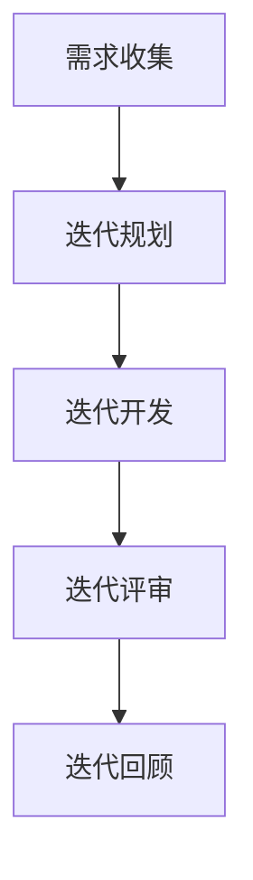

                 

### 敏捷仪式的优化：适应大型新应用的开发需求

> **关键词：** 敏捷开发、敏捷仪式、大型应用、优化策略、团队协作、持续改进

> **摘要：** 本文探讨了敏捷仪式在大型新应用开发中的挑战和优化策略。通过分析敏捷仪式的基础理论、优化原则和实际案例，文章旨在为开发者提供一套系统化的敏捷优化方法，以提高大型新应用项目的开发效率和质量。

---

## 第一部分：敏捷仪式的基础理论

### 1.1 敏捷仪式的概念与演变

#### 1.1.1 敏捷仪式的定义

敏捷仪式是一种软件开发方法论，它起源于2001年的敏捷宣言。宣言的核心思想是强调快速迭代和持续交付，以更好地应对需求变化和不确定性。敏捷仪式不同于传统的瀑布模型，它强调灵活性、响应变化和持续交付。

#### 1.1.2 敏捷仪式的历史背景

敏捷宣言的诞生标志着敏捷运动的开始。随后，一系列敏捷方法如Scrum、Kanban、XP（极限编程）等逐渐兴起，成为软件开发中的重要方法论。

#### 1.1.3 敏捷仪式的核心原则

敏捷仪式的核心原则包括：

- **响应变化重于遵循计划：** 在敏捷开发中，需求的变化被视为常态，开发团队应具备快速适应变化的能力。
- **个体与互动重于过程与工具：** 人的因素在敏捷开发中占据重要地位，团队协作和沟通比流程和工具更为关键。
- **工作的软件重于详细的文档：** 敏捷开发强调软件的实际产出，而非冗长的文档。
- **客户合作重于合同谈判：** 与客户的紧密合作有助于更好地理解需求，提高产品满意度。
- **响应变化重于流程优化：** 敏捷开发强调持续优化流程，以适应不断变化的需求和环境。

### 1.2 敏捷仪式的核心概念

#### 1.2.1 敏捷仪式的工作流程

敏捷仪式的工作流程主要包括以下几个阶段：

1. **需求收集与分析：** 团队与客户沟通，收集需求，分析需求优先级。
2. **迭代规划：** 根据需求优先级，规划迭代内容和目标。
3. **迭代开发：** 团队按照规划进行开发，每个迭代周期通常为2-4周。
4. **迭代评审：** 在每个迭代结束时，进行代码评审和演示，收集反馈。
5. **迭代回顾：** 分析本次迭代的优点和不足，为下一次迭代提供改进建议。

#### 1.2.2 敏捷团队的角色

敏捷团队通常由以下几个角色组成：

- **产品负责人（Product Owner）：** 负责制定需求优先级，确保团队按照正确方向工作。
- **Scrum Master：** 负责确保团队遵循敏捷原则，解决团队遇到的问题。
- **开发人员（Developers）：** 负责实现产品需求，编写代码。

#### 1.2.3 敏捷仪式的衡量指标

敏捷仪式的衡量指标主要包括：

- **速率（Velocity）：** 每个迭代内团队完成的用户故事数量。
- **迭代周期（Iteration Time）：** 从迭代规划到迭代评审的时间。
- **缺陷率（Defect Rate）：** 项目中发现的缺陷数量与总代码量的比率。

### 1.3 敏捷仪式在大型新应用开发中的挑战

#### 1.3.1 项目规模与复杂度

大型新应用项目通常涉及多个子系统、模块和团队，项目规模和复杂度远超小型项目。这给敏捷仪式带来了一系列挑战，如需求管理、进度控制、资源分配等。

#### 1.3.2 需求变化与不确定性

在大型新应用项目中，需求变化和不确定性是常见问题。敏捷仪式需要具备快速适应变化的能力，以保持项目的稳定和持续交付。

#### 1.3.3 团队协作与沟通

大型新应用项目通常涉及多个团队和部门，团队协作和沟通至关重要。敏捷仪式需要建立有效的沟通机制和协作工具，以支持项目顺利推进。

## 第二部分：敏捷仪式的优化策略

### 2.1 敏捷仪式的优化原则

#### 2.1.1 敏捷优化的重要性

敏捷优化在大型新应用开发中具有重要意义。通过优化敏捷仪式，可以提高项目开发效率、降低风险、提升产品质量。

#### 2.1.2 敏捷优化的基本原则

敏捷优化的基本原则包括：

- **持续改进：** 通过定期回顾和反思，不断优化流程和方法。
- **适应变化：** 面对需求变化和不确定性，灵活调整计划和策略。
- **提高交付质量：** 关注代码质量、用户体验和客户满意度。

### 2.2 优化敏捷仪式的方法

#### 2.2.1 敏捷仪式的调整与改进

针对不同项目特点和需求，可以调整和改进敏捷仪式的流程和方法。例如，在大型项目中引入看板（Kanban）方法，以更好地管理任务流程和资源分配。

#### 2.2.2 敏捷团队的成长与赋能

提升团队专业技能和协同效率是敏捷优化的关键。通过培训、经验分享和团队建设活动，增强团队的凝聚力和战斗力。

#### 2.2.3 敏捷仪式工具与技术

敏捷工具和技术如JIRA、Trello等可以辅助敏捷仪式的优化。这些工具可以帮助团队更好地管理任务、跟踪进度和协作沟通。

### 2.3 优化敏捷仪式的案例分析

#### 2.3.1 案例背景

以某大型电商平台项目为例，该项目涉及多个子系统、模块和团队，项目规模庞大，需求复杂多变。

#### 2.3.2 案例分析

在项目开发过程中，团队遇到了以下问题：

- **需求变化频繁：** 项目上线前，客户需求频繁变更，导致项目进度延误。
- **团队协作不畅：** 多个团队之间的沟通协调不畅，影响了项目的推进。

针对这些问题，团队采取了以下优化策略：

- **引入看板方法：** 通过看板方法，明确任务流程和责任人，提高任务管理效率。
- **加强团队协作：** 通过定期团队会议和经验分享，增强团队协作和沟通。

#### 2.3.3 案例启示

通过优化敏捷仪式，项目团队成功解决了需求变化和团队协作问题，项目进度得到有效控制，产品质量得到提升。

## 第三部分：敏捷仪式在大型新应用开发中的应用实践

### 3.1 敏捷仪式在大型新应用开发中的优势

#### 3.1.1 提高开发效率

敏捷仪式通过快速迭代和持续交付，可以显著提高大型新应用项目的开发效率。团队成员可以在每个迭代周期内快速交付可用的功能，减少等待时间和项目延期。

#### 3.1.2 降低项目风险

敏捷仪式强调需求变化和不确定性，通过快速适应和调整，可以降低项目风险。团队可以在早期发现和解决问题，避免项目在后期出现重大缺陷。

#### 3.1.3 提升产品质量

敏捷仪式注重代码质量和用户体验，通过迭代评审和反思，可以不断提升产品的质量和客户满意度。

### 3.2 大型新应用开发中的敏捷仪式实践

#### 3.2.1 敏捷仪式的规划与执行

在大型新应用开发中，敏捷仪式的规划与执行至关重要。团队需要明确项目目标、需求优先级和迭代周期，确保项目按计划推进。

#### 3.2.2 敏捷仪式的团队协作

团队协作是大型新应用开发中的关键。通过建立有效的沟通机制和协作工具，如定期团队会议、即时通讯和协作平台，可以确保团队高效协作。

#### 3.2.3 敏捷仪式的持续改进

敏捷仪式的持续改进是保持项目成功的关键。团队需要定期回顾和反思，分析问题并提出改进措施，以不断提升项目质量和效率。

### 3.3 大型新应用开发中的敏捷仪式挑战与应对

#### 3.3.1 挑战与问题

在大型新应用开发中，敏捷仪式可能面临以下挑战和问题：

- **需求变化频繁：** 客户需求变化可能导致项目进度延误和质量问题。
- **团队协作不畅：** 多个团队之间的沟通协调不畅，影响项目推进。
- **资源分配不均：** 项目资源有限，如何合理分配和调度是挑战之一。

#### 3.3.2 应对策略

针对以上挑战，可以采取以下应对策略：

- **加强需求管理：** 通过与客户的紧密沟通，确保需求明确和稳定。
- **优化团队协作：** 建立有效的沟通机制和协作工具，提高团队协作效率。
- **资源调度优化：** 合理分配项目资源，确保关键任务的优先执行。

## 第四部分：敏捷仪式的未来发展与趋势

### 4.1 敏捷仪式的未来发展趋势

#### 4.1.1 数字化转型的影响

数字化转型对敏捷仪式产生了深远影响。随着人工智能、云计算、大数据等新兴技术的应用，敏捷仪式需要不断适应和变革，以提高项目开发和交付的效率。

#### 4.1.2 新兴技术与敏捷仪式的结合

新兴技术如人工智能、区块链等正在与敏捷仪式结合，为敏捷开发带来新的机遇和挑战。例如，人工智能可以用于需求预测和自动化测试，区块链可以提高项目的透明度和安全性。

### 4.2 敏捷仪式的可持续发展

#### 4.2.1 敏捷文化的建设

敏捷文化的建设是敏捷仪式持续发展的重要保障。通过培养团队协作、持续学习和创新精神，可以推动敏捷仪式在企业内部的广泛应用。

#### 4.2.2 敏捷仪式的国际化

敏捷仪式在全球范围内的应用正在逐渐扩展。随着国际化的深入，敏捷仪式需要适应不同国家和地区的文化、法规和市场需求，实现可持续发展。

### 4.3 敏捷仪式的未来展望

#### 4.3.1 敏捷仪式的发展方向

未来，敏捷仪式将继续向高效、灵活和可持续方向发展。随着技术的进步和市场需求的变化，敏捷仪式将不断创新和进化。

#### 4.3.2 敏捷仪式的潜力与机遇

敏捷仪式在大型新应用开发中具有巨大的潜力和机遇。通过持续优化和改进，敏捷仪式将助力企业应对复杂多变的市场环境，实现持续增长和成功。

### # 附录

#### # 附录A：敏捷仪式相关资源

**A.1 敏捷仪式工具与资源推荐**

- **JIRA:** 项目管理和任务跟踪工具。
- **Trello:** 任务管理工具。
- **Confluence:** 知识库和协作平台。

**A.2 敏捷仪式经典文献与资料**

- 《敏捷宣言》
- 《Scrum 敏捷软件开发指南》
- 《Kanban：成功 implement 敏捷流程》

#### # 附录B：敏捷仪式流程图与伪代码

**B.1 敏捷仪式流程图**



**B.2 敏捷迭代伪代码**

```python
# 定义迭代周期和目标
iteration_period = 2 # 周期（周）
iteration_goals = ["功能A", "功能B", "功能C"]

# 迭代开发
while not all_goals_met(iteration_goals):
    for goal in iteration_goals:
        if not goal_completed(goal):
            execute_task(goal)
            break

# 迭代评审
review_results = perform_review()

# 迭代回顾
perform_retrospective(review_results)
```

### # 参考文献

- Beck, K. (2000). 《极限编程实践》(XP Explained). Addison-Wesley.
- Beedle, M. & Kehayias, J. (2002). 《Scrum 敏捷软件开发指南》(Agile Project Management with Scrum). Pearson.
- Duncum, D. (2014). 《Kanban：成功 implement 敏捷流程》(Kanban: Successful Implementation of an Agile Process). Prentice Hall.

### # 作者信息

**作者：** AI天才研究院/AI Genius Institute & 禅与计算机程序设计艺术 /Zen And The Art of Computer Programming

