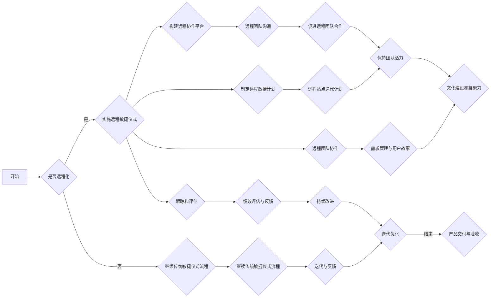

                 

### 文章标题：敏捷仪式的远程化：适应分布式开发团队需求

在数字化转型的浪潮下，远程工作和分布式团队成为现代企业的新常态。敏捷仪式作为一种灵活、高效的软件开发方法，在远程工作环境中面临新的挑战和机遇。本文将深入探讨敏捷仪式远程化的必要性，分析远程化敏捷仪式的优势与挑战，并总结一系列最佳实践，旨在为分布式开发团队提供可行的指导。

### 关键词

- 敏捷开发
- 远程工作
- 分布式团队
- 敏捷仪式
- 协作工具
- 文化建设

### 摘要

本文旨在探讨敏捷仪式在远程化环境中的适应性和最佳实践。通过对敏捷开发的概念、远程化趋势的分析，我们提出了一系列远程敏捷仪式的实施策略和适应策略。文章还通过实际案例展示了远程敏捷仪式的成功实践，并展望了其未来的发展趋势。目标是为分布式开发团队提供实用的指导，帮助他们在远程环境中实现高效的敏捷开发。

## 第一部分：理解敏捷仪式远程化的必要性

### 第1章：敏捷仪式概述

#### 1.1 敏捷开发的概念与起源

敏捷开发（Agile Development）是一种以人为核心、迭代、增量和协作的软件开发方法。它强调响应变化而非遵循计划，通过短周期的迭代和持续交付价值来提高软件开发的灵活性和质量。

敏捷开发的起源可以追溯到2001年，当时一组软件开发专家在犹他州的雪鸟滑雪度假村提出了《敏捷宣言》。宣言强调“个体和互动重于流程与工具”、“工作的软件重于详尽的文档”、“客户合作重于合同谈判”以及“响应变化重于遵循计划”。这一宣言推动了敏捷开发的迅速发展，并形成了多种敏捷实践指南，如Scrum、Kanban、XP（极限编程）等。

#### 1.2 敏捷仪式的核心要素

敏捷仪式的核心要素包括：

1. **用户故事**：用户故事是一种简短、简单、明确的描述，用于定义用户的需求和功能。
2. **迭代**：迭代是敏捷开发中的基本周期，通常持续2-4周。每个迭代都会产生可交付的软件。
3. **站立会议**：每日站立会议是团队沟通的重要机制，旨在快速解决问题、跟踪进度和保持团队同步。
4. **回顾会议**：回顾会议在每个迭代结束时进行，用于总结经验教训、改进流程和提升团队效率。
5. **持续集成**：持续集成是一种实践，通过自动化测试和持续交付，确保代码库中的每个提交都是可集成和可部署的。

#### 1.3 远程化趋势与挑战

远程化已经成为现代企业发展的趋势。根据统计数据，全球远程工作者的数量在过去十年中增长了115%。然而，远程工作带来了一系列挑战：

1. **沟通障碍**：远程团队面临时区、语言和文化差异的挑战，这可能导致沟通效率低下和误解。
2. **协作困难**：远程团队需要有效的工具和流程来保持协作和同步，否则可能导致工作重复和资源浪费。
3. **监控问题**：远程团队的管理和绩效评估需要新的方法和工具，否则可能导致监督不足或过度监督。

## 第2章：远程化敏捷仪式的挑战与机遇

### 2.1 远程工作的现实挑战

远程工作虽然带来了灵活性，但也带来了一系列挑战：

1. **沟通障碍**：远程团队需要克服时区、语言和文化差异，这可能影响沟通效率和团队协作。
2. **协作困难**：远程团队需要依赖在线工具和平台来协作，这可能导致工具使用不当、流程不顺畅。
3. **监控问题**：远程团队的管理和绩效评估需要新的方法和工具，否则可能导致监督不足或过度监督。
4. **孤独感**：远程工作可能导致团队成员感到孤独，影响团队凝聚力和士气。

### 2.2 分布式团队的优势与劣势

分布式团队具有以下优势：

1. **全球人才池**：远程工作可以吸引全球范围内的优秀人才，提高团队的整体能力。
2. **灵活的工作时间**：分布式团队可以灵活安排工作时间，提高工作效率。
3. **降低成本**：远程工作可以减少办公室租金和通勤成本，降低企业的运营成本。

然而，分布式团队也存在以下劣势：

1. **沟通挑战**：远程团队需要克服时区、语言和文化差异，这可能导致沟通效率低下和误解。
2. **协作困难**：远程团队需要依赖在线工具和平台来协作，这可能导致工具使用不当、流程不顺畅。
3. **管理难度**：远程团队的管理和绩效评估需要新的方法和工具，否则可能导致监督不足或过度监督。

### 2.3 远程敏捷仪式的机遇

远程敏捷仪式为分布式团队带来了以下机遇：

1. **提高效率**：远程敏捷仪式通过定期的迭代和反馈，帮助团队更快地响应变化，提高开发效率。
2. **增强协作**：远程敏捷仪式通过站立会议、回顾会议等机制，促进团队沟通和协作，减少误解和重复工作。
3. **降低成本**：远程敏捷仪式通过减少办公室租金和通勤成本，降低企业的运营成本。

## 第二部分：远程敏捷仪式的最佳实践

### 第3章：远程协作工具与技术

#### 3.1 远程会议与沟通工具

远程会议和沟通工具是远程敏捷仪式的基础。以下是一些常用的工具：

1. **Zoom**：Zoom是一款功能强大的视频会议工具，支持多人在线会议、实时聊天和屏幕共享。
2. **Slack**：Slack是一款团队沟通工具，支持实时消息、聊天室、文件共享和集成其他工具。
3. **Microsoft Teams**：Microsoft Teams是一款集视频会议、聊天、文件共享和协作于一体的工具。

#### 3.2 版本控制与代码协作

版本控制和代码协作工具是确保代码质量和团队协作的关键。以下是一些常用的工具：

1. **Git**：Git是一款分布式版本控制系统，支持多分支开发、代码审查和合并请求。
2. **GitHub**：GitHub是基于Git的代码托管平台，支持协作开发、问题跟踪和持续集成。
3. **GitLab**：GitLab是一款自建版本的Git代码托管平台，支持CI/CD和自动化测试。

#### 3.3 敏捷工具的远程应用

远程敏捷仪式需要有效的敏捷工具来支持团队协作和流程管理。以下是一些常用的敏捷工具：

1. **Jira**：Jira是一款功能丰富的敏捷项目管理工具，支持任务跟踪、敏捷板和迭代规划。
2. **Trello**：Trello是一款简单直观的任务管理工具，支持卡片、列表和协作功能。
3. **Asana**：Asana是一款强大的任务管理工具，支持项目管理、团队协作和进度跟踪。

### 第4章：远程敏捷仪式的核心流程

#### 4.1 远程站点的迭代计划

远程站点的迭代计划需要考虑以下几点：

1. **迭代周期**：确定每个迭代的周期，通常为2-4周。
2. **迭代目标**：明确每个迭代的目标和预期成果。
3. **任务分配**：根据团队成员的能力和职责，分配任务。
4. **进度跟踪**：使用敏捷工具和版本控制系统跟踪任务进度。

#### 4.2 远程团队的需求管理

远程团队的需求管理需要注意以下几点：

1. **需求收集**：通过用户故事、问卷调查和访谈等方式收集需求。
2. **需求优先级**：根据需求的紧急程度和重要性，确定需求优先级。
3. **需求变更**：及时记录和跟踪需求变更，确保需求变更得到充分评估和批准。

#### 4.3 远程团队的用户故事

远程团队的用户故事需要注意以下几点：

1. **明确性**：用户故事应该明确、简单、具体，避免模糊和不明确的需求。
2. **可测试性**：用户故事应该具有可测试性，以便团队可以验证故事是否完成。
3. **优先级**：根据需求的紧急程度和重要性，确定用户故事的优先级。

### 第5章：远程敏捷仪式的适应策略

#### 5.1 远程团队的构建与维护

远程团队的构建和维护需要注意以下几点：

1. **团队成员选择**：选择具有远程工作能力和经验的团队成员。
2. **团队沟通**：建立定期的沟通机制，如每日站立会议、周报和视频会议。
3. **团队协作**：使用敏捷工具和协作工具，确保团队协作高效。

#### 5.2 远程敏捷仪式的适应策略

远程敏捷仪式的适应策略包括以下几点：

1. **敏捷工具的选择**：根据团队的需求和特点，选择合适的敏捷工具。
2. **迭代周期的调整**：根据团队的实际情况，调整迭代周期，确保迭代周期合理。
3. **流程优化**：不断优化流程，提高团队效率和软件质量。

#### 5.3 远程团队的绩效评估

远程团队的绩效评估需要注意以下几点：

1. **绩效指标**：确定合理的绩效指标，如任务完成率、代码质量、团队协作等。
2. **评估周期**：确定评估周期，如每个迭代结束时进行评估。
3. **反馈与改进**：及时给予团队成员反馈，并根据反馈进行改进。

## 第6章：远程敏捷仪式的文化建设

#### 6.1 建立透明和信任的文化

远程敏捷仪式的文化建设至关重要，以下是一些建立透明和信任文化的策略：

1. **沟通机制**：建立高效的沟通机制，确保团队成员之间的信息流通。
2. **透明决策**：确保决策过程透明，让团队成员了解决策的原因和影响。
3. **信任建立**：通过开放和诚实的沟通，建立团队成员之间的信任。

#### 6.2 促进远程团队的沟通与合作

以下是一些建立远程团队沟通与合作的策略：

1. **定期会议**：定期举行会议，如每日站立会议、周报会议和迭代回顾会议。
2. **协作工具**：使用协作工具，如Slack、Trello和GitHub，确保团队协作顺畅。
3. **反馈机制**：建立反馈机制，鼓励团队成员提出建议和意见，促进团队改进。

#### 6.3 保持远程团队的活力与凝聚力

以下是一些建立远程团队活力与凝聚力的策略：

1. **团队活动**：定期组织团队活动，如在线游戏、虚拟聚餐和团队建设活动。
2. **个人关怀**：关注团队成员的个人需求，如工作与生活的平衡、职业发展等。
3. **奖励与激励**：为团队成员提供奖励和激励，如奖金、晋升机会和公开表彰。

## 第7章：远程敏捷仪式的实际案例

#### 7.1 案例一：成功实施远程敏捷仪式的团队

以下是一个成功实施远程敏捷仪式的团队案例：

- **团队背景**：该团队是一个跨国的软件开发团队，分布在不同的国家和地区。
- **实施过程**：团队选择了Jira和GitHub作为敏捷工具，使用Zoom进行远程会议，并建立了定期的沟通机制，如每日站立会议和迭代回顾会议。
- **成果**：通过远程敏捷仪式的实施，团队提高了沟通效率、协作能力和软件质量，实现了快速迭代和持续交付。

#### 7.2 案例二：远程敏捷仪式面临的挑战与解决方法

以下是一个远程敏捷仪式面临的挑战和解决方法的案例：

- **挑战**：该团队在远程敏捷仪式实施过程中遇到了沟通障碍和协作困难。
- **解决方法**：
  - **沟通障碍**：团队增加了沟通频率，如每日站立会议和周报会议，并采用了多种沟通工具，如Zoom和Slack。
  - **协作困难**：团队制定了详细的协作流程，并引入了GitLab进行版本控制和代码协作。

#### 7.3 案例三：远程敏捷仪式的改进与实践

以下是一个远程敏捷仪式的改进和实践案例：

- **团队背景**：该团队在实施远程敏捷仪式后，发现流程仍有改进空间。
- **改进措施**：
  - **迭代周期调整**：团队根据实际情况调整了迭代周期，从每周迭代改为每两周迭代。
  - **敏捷工具优化**：团队优化了Jira和GitHub的使用，引入了自动化测试和持续集成，提高了开发效率。
- **实践成果**：通过改进和实践，团队实现了更高效的迭代和持续交付，提高了软件质量。

## 第三部分：远程敏捷仪式的未来趋势

### 第8章：远程敏捷仪式的未来发展与挑战

#### 8.1 技术进步对远程敏捷仪式的影响

随着技术的不断进步，远程敏捷仪式将面临新的机遇和挑战：

1. **人工智能与自动化**：人工智能和自动化技术将提高远程敏捷仪式的效率和准确性，如自动化测试和代码审查。
2. **云计算与边缘计算**：云计算和边缘计算将提供更灵活、更高效的远程工作环境，支持分布式团队的无缝协作。
3. **虚拟现实与增强现实**：虚拟现实和增强现实技术将改善远程团队的工作体验，如虚拟会议和虚拟协作空间。

#### 8.2 远程敏捷仪式在行业中的应用前景

远程敏捷仪式在各个行业中的应用前景广阔：

1. **软件开发**：远程敏捷仪式将帮助软件开发团队提高开发效率、软件质量和客户满意度。
2. **金融科技**：远程敏捷仪式将支持金融科技公司的快速创新和迭代，提高市场竞争力。
3. **医疗健康**：远程敏捷仪式将帮助医疗健康行业的团队更快速地开发和部署医疗应用程序，提高医疗服务的质量。

#### 8.3 远程敏捷仪式的可持续发展路径

远程敏捷仪式的可持续发展路径包括以下几点：

1. **文化建设**：建立透明、信任和协作的文化，提高团队的凝聚力和效率。
2. **技能提升**：持续提升团队成员的技能和知识，以适应远程敏捷仪式的要求。
3. **技术进步**：紧跟技术发展趋势，引入新技术和新工具，提高远程敏捷仪式的效率和效果。

## 第9章：远程敏捷仪式的总结与展望

#### 9.1 远程敏捷仪式的核心原则与价值观

远程敏捷仪式的核心原则和价值观包括：

1. **以人为本**：关注团队成员的需求和感受，提高团队满意度和工作效率。
2. **持续改进**：不断优化流程和工具，提高开发效率和软件质量。
3. **透明与信任**：建立透明、信任和协作的文化，提高团队的凝聚力和效率。

#### 9.2 远程敏捷仪式的未来趋势与挑战

远程敏捷仪式的未来趋势包括：

1. **技术进步**：随着人工智能、云计算和虚拟现实等技术的发展，远程敏捷仪式将更加高效和智能。
2. **行业应用**：远程敏捷仪式将在更多行业中得到应用，支持企业的创新和迭代。

然而，远程敏捷仪式也面临以下挑战：

1. **沟通与协作**：远程团队需要克服时区、语言和文化差异，提高沟通和协作效率。
2. **管理难度**：远程团队的管理和绩效评估需要新的方法和工具，否则可能导致监督不足或过度监督。

#### 9.3 促进远程敏捷仪式的发展策略

为促进远程敏捷仪式的发展，可以采取以下策略：

1. **文化建设**：建立透明、信任和协作的文化，提高团队的凝聚力和效率。
2. **技能提升**：提供培训和学习机会，提升团队成员的技能和知识。
3. **技术引入**：引入新技术和新工具，提高远程敏捷仪式的效率和效果。
4. **实践推广**：通过成功案例和实践，推广远程敏捷仪式的最佳实践和经验。

### 附录

#### 附录A：远程敏捷仪式工具与技术资源汇总

**A.1 常用远程协作工具**

- Zoom：视频会议和在线协作工具
- Slack：实时消息和协作平台
- Microsoft Teams：综合协作平台
- Google Workspace：电子邮件、文档和日历等办公工具

**A.2 敏捷开发框架**

- Scrum：迭代式软件开发框架
- Kanban：可视化工作流程管理工具
- XP（极限编程）：以人为核心的开发方法
- Lean Agile：精益敏捷开发方法

**A.3 版本控制系统**

- Git：分布式版本控制系统
- GitHub：基于Git的代码托管平台
- GitLab：自建版本的Git代码托管平台

#### Mermaid 流程图：敏捷仪式的流程



#### 核心算法原理讲解：远程协作的算法设计（伪代码）

```plaintext
// 远程协作算法设计伪代码
function RemoteCollaborationAlgorithm(teamMembers, tasks, communicationTools) {
    // 初始化
    initializeTeam(teamMembers, communicationTools);
    initializeTasks(tasks);

    // 循环处理任务
    while (!allTasksCompleted(tasks)) {
        // 每个成员选择任务
        for each member in teamMembers {
            selectedTask = selectTask(member, tasks);
            if (selectedTask != null) {
                // 成员开始处理任务
                member.startTask(selectedTask);
                // 成员与其他成员协作
                member协作其他成员(communicationTools);
                // 成员提交任务进度
                member提交任务进度(communicationTools);
            }
        }
        // 更新任务状态
        updateTasksStatus(tasks);
        // 等待下一个迭代
        waitForNextIteration();
    }
    // 迭代结束，进行总结和评估
    总结和评估(teamMembers, tasks, communicationTools);
}
```

### 作者

作者：AI天才研究院/AI Genius Institute & 禅与计算机程序设计艺术 /Zen And The Art of Computer Programming

本文由AI天才研究院和禅与计算机程序设计艺术共同撰写，旨在为分布式开发团队提供关于远程敏捷仪式的深入见解和实践指导。作者拥有丰富的计算机编程和人工智能领域的经验，致力于推动技术创新和软件开发实践。

