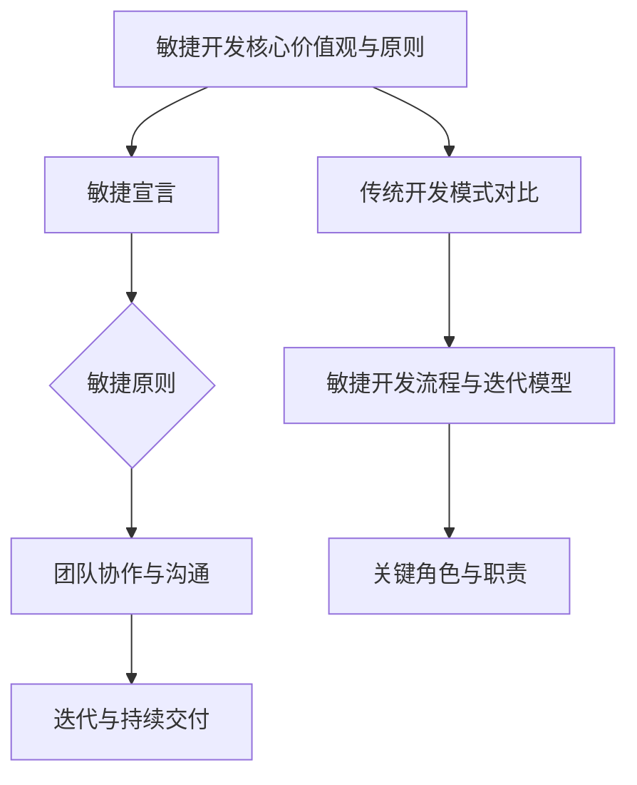

                 


### 敏捷冲刺规划的灵活调整：应对需求变化

#### 关键词

敏捷开发，冲刺规划，需求变化，灵活调整，迭代模型，用户故事，优先级排序，快速反馈，增量开发，技术挑战，工具支持

#### 摘要

本文旨在探讨敏捷冲刺规划中如何灵活调整以应对需求变化。我们将首先介绍敏捷开发的基本概念和冲刺规划的基础，然后深入分析需求变化的原因与影响，探讨应对策略。通过实际案例和技术实践，我们将展示如何在敏捷项目中实现灵活调整，从而保持项目的顺利进行和适应市场变化。

### 第一部分：敏捷开发与冲刺规划基础

#### 第1章：敏捷开发概述

##### 1.1 敏捷开发的核心价值观与原则

敏捷开发起源于2001年，当时一群软件开发专家共同签署了《敏捷宣言》。宣言的核心价值观是：

- **个体和互动**：认为个人与团队的协作比过程和工具更为重要。
- **可工作的软件**：相比于详尽的文档，更重视能够实际运行的软件。
- **客户合作**：强调与客户的紧密合作，确保开发的产品能够满足客户需求。
- **响应变化**：适应变化比遵循计划更为重要。

敏捷开发基于以下12条原则：

1. **个体和互动重于流程和工具**。
2. **可工作的软件重于详尽的文档**。
3. **客户合作重于合同谈判**。
4. **响应变化重于遵循计划**。
5. **鼓励持续交付工作的软件，而非遵循严格进度计划**。
6. **追求技术卓越，同时注重好的设计和对技术的精益求精**。
7. **以简洁著称，而非以速度为优先**。
8. **人员、装备和过程都很重要**。
9. **保持可持续开发速度**。
10. **保持专注于优秀的技术架构**。
11. **简化，最大化工作的透明度**。
12. **从经验中学习，不断调整调整调整调整**。

##### 1.2 敏捷开发与传统开发模式的对比

传统开发模式（如瀑布模型）通常具有以下特点：

1. **线性流程**：工作按照顺序进行，每个阶段完成后才能进入下一个阶段。
2. **详尽的文档**：需要编写大量的文档，如需求规格说明书、设计文档等。
3. **固定计划**：项目开始时制定详细的计划，并在整个项目过程中严格遵循。
4. **客户参与有限**：客户通常只在项目的早期和后期参与。
5. **灵活性较低**：一旦计划确定，就很难进行更改。

相比之下，敏捷开发具有以下特点：

1. **迭代开发**：将项目分为多个迭代，每个迭代都会交付可工作的软件。
2. **频繁客户反馈**：鼓励客户在项目过程中持续提供反馈，确保产品满足需求。
3. **灵活调整**：根据反馈和变化，灵活调整计划和优先级。
4. **简洁文档**：注重实际运行的软件，文档简化。
5. **团队合作**：强调团队合作和沟通，促进知识共享。

##### 1.3 敏捷开发中的关键角色和职责

在敏捷开发中，通常涉及以下关键角色：

1. **产品负责人（Product Owner）**：负责定义产品愿景和优先级，管理产品待办列表。
2. **开发团队（Development Team）**：负责实现产品功能，通常由多学科团队组成。
3. **Scrum Master**：负责推动敏捷实践，帮助团队解决障碍。
4. **团队成员**：负责开发任务的执行。

每个角色都有明确的职责和责任，以确保项目的顺利进行。

##### 1.4 敏捷开发的流程与迭代模型

敏捷开发采用迭代模型，通常包含以下阶段：

1. **产品待办列表（Product Backlog）**：列出所有待完成的任务，按优先级排序。
2. **冲刺（Sprint）**：选择待办列表中的任务，在一个固定的时间周期（通常为2-4周）内完成。
3. **冲刺规划会议（Sprint Planning）**：确定本次冲刺的目标和任务分配。
4. **每日站立会议（Daily Stand-up）**：团队每日汇报进展，解决潜在问题。
5. **冲刺评审会议（Sprint Review）**：展示冲刺成果，获取反馈。
6. **冲刺回顾会议（Sprint Retrospective）**：总结经验教训，持续改进。

通过这些流程，敏捷开发能够确保项目持续交付价值，并适应不断变化的需求。

#### 第2章：冲刺规划的基本概念

##### 2.1 冲刺的周期与节奏

冲刺是敏捷开发中的基本工作周期，通常持续2-4周。在冲刺期间，团队集中精力完成一组预定的任务。每个冲刺结束后，团队会进行评审和回顾，以确保项目进展和不断改进。

冲刺的节奏如下：

1. **冲刺规划会议**：在冲刺开始前，团队会讨论并确定本次冲刺的目标和任务。
2. **每日站立会议**：在冲刺期间，团队每天都会进行一次简短的站立会议，报告进展和解决潜在问题。
3. **冲刺评审会议**：在冲刺结束时，团队会展示本次冲刺的成果，并获取反馈。
4. **冲刺回顾会议**：在冲刺评审之后，团队会进行回顾，总结经验教训，并为下一个冲刺做准备。

通过这种方式，团队能够保持高效的协作和持续改进。

##### 2.2 产品待办列表与用户故事

产品待办列表是敏捷开发中用于管理任务和功能需求的重要工具。它包含所有待完成的任务，并按优先级排序。产品负责人负责维护和更新待办列表。

用户故事是描述产品功能需求的简单表述。它通常遵循以下格式：

```
作为[用户角色]
我想要[功能描述]
以便[业务价值]
```

用户故事有助于明确功能需求，并促进团队成员之间的沟通。

##### 2.3 优先级排序与可燃值

在敏捷开发中，对任务进行优先级排序至关重要。通常使用可燃值（Feeding Value）来衡量任务的优先级，它反映了任务对产品交付的价值。

优先级排序可以基于以下因素：

1. **业务价值**：任务对业务的影响和收益。
2. **风险**：任务完成对项目风险的影响。
3. **用户反馈**：用户对任务的需求和反馈。
4. **时间**：任务的紧急性和截止日期。

通过合理排序，团队可以确保在有限的时间内完成最重要的任务。

##### 2.4 冲刺规划会议

冲刺规划会议是敏捷开发中的重要环节，它决定了本次冲刺的任务和目标。会议通常包括以下步骤：

1. **回顾上一个冲刺**：总结上一个冲刺的成果和问题。
2. **确定本次冲刺的目标**：明确本次冲刺的主要目标。
3. **选择任务**：从产品待办列表中选择任务，进行优先级排序。
4. **任务分配**：根据任务难度和团队成员的能力，进行任务分配。
5. **时间规划**：确定每个任务的时间范围，确保任务在冲刺内完成。

通过精心规划的冲刺规划会议，团队可以确保在冲刺期间高效地完成任务。

### 第二部分：需求变化与灵活调整

#### 第3章：需求变化的原因与影响

##### 3.1 需求变化的原因分析

需求变化是软件开发过程中不可避免的现象，其原因多种多样：

1. **市场变化**：随着市场的变化，客户需求也会发生变化。例如，竞争对手的新功能或市场的热点可能促使客户要求产品更新。
2. **用户反馈**：在产品开发过程中，用户可能会提出新的需求或对现有功能提出改进意见。
3. **技术进步**：技术的发展可能会促使产品功能更新，以提高用户体验或增强产品性能。
4. **业务战略调整**：公司业务战略的调整可能导致产品需求的变化。
5. **法规和标准**：法规和标准的更新可能要求产品进行调整以符合新的规定。

##### 3.2 需求变化对项目的影响

需求变化对项目的影响是多方面的，可能包括：

1. **进度延误**：需求变化可能导致计划中的任务重新安排，从而延误项目进度。
2. **资源浪费**：如果需求变化导致部分工作成果无效，可能会浪费人力、时间和资源。
3. **质量问题**：为了应对需求变化，团队可能需要在短时间内做出调整，这可能导致质量问题。
4. **成本增加**：需求变化可能导致额外的开发成本，如购买新工具、培训新技能等。

##### 3.3 如何应对需求变化

面对需求变化，敏捷开发提供了一系列策略以保持项目的灵活性：

1. **快速反馈与持续改进**：通过频繁的用户反馈和迭代开发，及时了解市场需求并做出调整。
2. **压缩迭代与增量开发**：缩短迭代周期，实现增量开发，使项目能够更快地适应需求变化。
3. **优先级调整**：根据需求变化，重新排序任务优先级，确保最重要的需求得到优先处理。
4. **重构产品待办列表**：定期重构产品待办列表，确保任务与市场需求保持一致。

通过这些策略，敏捷开发团队能够更好地应对需求变化，确保项目顺利进行。

#### 第4章：敏捷冲刺规划的灵活调整策略

##### 4.1 快速反馈与持续改进

敏捷开发强调快速反馈和持续改进，这有助于团队及时了解市场需求并做出调整。快速反馈可以通过以下方式实现：

1. **用户故事地图**：使用用户故事地图来可视化用户需求，帮助团队了解用户行为和期望。
2. **迭代评审会议**：在迭代结束时，团队会进行评审会议，展示成果并获得用户反馈。
3. **用户验收测试**：用户参与测试，确保产品功能满足需求。

通过这些方法，团队可以更快地了解用户需求，及时进行调整。

##### 4.2 压缩迭代与增量开发

压缩迭代和增量开发是敏捷开发中应对需求变化的重要策略。压缩迭代可以通过以下方式实现：

1. **缩短迭代周期**：将迭代周期缩短至1-2周，以便更频繁地进行迭代和交付。
2. **增量交付**：在每个迭代中交付部分功能，而不是等到项目结束才交付完整产品。

这种方式有助于团队更快地适应需求变化，同时减少风险。

##### 4.3 冲刺中的优先级调整

在敏捷冲刺规划中，优先级调整是应对需求变化的关键策略。团队可以通过以下方式调整优先级：

1. **优先级排序**：根据需求变化，重新评估任务优先级，确保最重要的需求得到优先处理。
2. **待办列表重构**：定期重构产品待办列表，确保任务与市场需求保持一致。
3. **快速响应**：在冲刺过程中，及时响应需求变化，调整任务执行顺序。

通过这些方法，团队可以更好地适应需求变化，确保项目顺利进行。

##### 4.4 产品待办列表的重构

产品待办列表的重构是敏捷开发中应对需求变化的重要步骤。团队可以通过以下方式重构待办列表：

1. **更新需求**：根据市场需求和用户反馈，更新产品待办列表中的任务。
2. **优先级排序**：重新评估任务优先级，确保最重要的需求得到优先处理。
3. **任务分解**：将大型任务分解为更小、更可管理的任务，以便更快地实现。
4. **任务合并**：将相关任务合并，以减少任务数量和复杂性。

通过这些方法，团队可以更灵活地应对需求变化，提高项目效率。

#### 第5章：需求变化的实际案例与应用

##### 5.1 案例一：应对紧急需求变化

**背景**：在一个电商项目中，由于竞争对手的新功能上线，市场需求发生变化，需要紧急调整产品特性。

**解决方案**：

1. **识别需求变化**：分析竞争对手的新功能，确定需要增加的新特性。
2. **评估影响**：评估新特性的实现难度和影响范围。
3. **调整计划**：将新特性纳入下一个冲刺计划，并重新排序优先级。

**代码实现**：

```python
# 假设使用Scrum框架，以下为伪代码

# 获取需求列表
需求列表 = 获取需求()

# 确定紧急需求
紧急需求 = 确定紧急需求(需求列表)

# 评估紧急需求的影响
影响 = 评估影响(紧急需求)

# 根据影响调整计划
if (影响 > 风险阈值) then
    调整规划(冲刺计划, 紧急需求)
else
    继续当前冲刺计划
```

##### 5.2 案例二：在多变市场中调整优先级

**背景**：在一个金融科技项目中，市场需求多变，需要不断调整产品优先级以适应市场变化。

**解决方案**：

1. **市场分析**：定期分析市场趋势和用户需求。
2. **优先级排序**：根据市场分析和用户反馈，重新评估任务优先级。
3. **灵活调整**：在冲刺规划过程中，根据需求变化灵活调整任务执行顺序。

**实践步骤**：

1. **收集市场信息**：通过市场调研、用户反馈等渠道收集市场信息。
2. **分析市场变化**：对收集到的市场信息进行分析，识别市场趋势和用户需求。
3. **更新待办列表**：根据市场分析结果，更新产品待办列表中的任务优先级。
4. **执行任务**：根据新的优先级排序，执行任务。

```python
# 假设使用优先级排序算法，以下为伪代码

# 获取市场信息和用户需求
市场信息 = 获取市场信息()
用户需求 = 获取用户需求()

# 分析市场变化
市场趋势 = 分析市场变化(市场信息)
用户需求变化 = 分析用户需求(用户需求)

# 更新任务优先级
任务列表 = 更新优先级(任务列表, 市场趋势, 用户需求变化)

# 执行任务
执行任务(任务列表)
```

##### 5.3 案例三：利用用户反馈优化产品

**背景**：在一个社交媒体项目中，用户反馈显示某些功能不满足用户需求，需要优化产品功能。

**解决方案**：

1. **收集用户反馈**：通过用户调查、在线反馈等方式收集用户反馈。
2. **分析反馈**：分析用户反馈，识别需要优化的问题。
3. **实施优化**：根据用户反馈，制定优化方案并实施。

**实践步骤**：

1. **设计用户调查**：设计用户满意度调查问卷，收集用户反馈。
2. **分析反馈**：对收集到的用户反馈进行分析，识别需要优化的问题。
3. **制定优化方案**：根据用户反馈，制定优化方案。
4. **实施优化**：根据优化方案，实施产品功能优化。

```python
# 假设使用用户反馈分析工具，以下为伪代码

# 收集用户反馈
用户反馈 = 收集用户反馈()

# 分析反馈
问题列表 = 分析反馈(用户反馈)

# 制定优化方案
优化方案 = 制定优化方案(问题列表)

# 实施优化
实施优化(优化方案)
```

#### 第三部分：技术实践与工具支持

##### 第6章：敏捷冲刺规划的工具与应用

敏捷开发依赖于一系列工具来支持项目管理和团队协作。以下是一些常用的敏捷工具及其在冲刺规划中的应用：

1. **JIRA**：用于跟踪任务、项目进度和用户故事。团队成员可以在JIRA中创建任务、分配任务、跟踪进度和报告问题。
2. **Trello**：一个可视化任务管理工具，适合小团队使用。Trello通过卡片和列表的形式展示任务，支持任务的分配、进度跟踪和反馈。
3. **Asana**：一个强大的项目管理工具，支持任务的分配、进度跟踪和协作。Asana提供了丰富的功能，如看板、列表、日历和报告。
4. **GitHub**：用于版本控制和协作开发的工具。团队成员可以在GitHub上创建、克隆和提交代码，并进行代码审查和合并请求。

通过这些工具，团队可以更好地管理项目，提高协作效率。

##### 第6.1 常用敏捷工具介绍

1. **JIRA**：JIRA是Atlassian公司开发的敏捷项目管理系统，广泛应用于软件项目团队。JIRA的核心功能包括：
    - **任务跟踪**：创建、分配和跟踪任务，确保项目按计划进行。
    - **敏捷看板**：可视化项目进度，使用看板板面展示任务状态，支持Scrum和Kanban等敏捷方法。
    - **报表和统计**：生成项目报告，提供详细的统计信息，帮助团队分析项目进度和性能。
    - **集成和插件**：支持与其他工具（如Confluence、Bitbucket等）集成，扩展功能。

2. **Trello**：Trello是一个基于看板模型的任务管理工具，适合小团队和个体开发者使用。Trello的主要功能包括：
    - **卡片和列表**：使用卡片和列表来组织和跟踪任务，每个卡片代表一个任务，可以包含描述、标签、截止日期等。
    - **拖放操作**：通过拖放操作，可以轻松调整任务的优先级和状态。
    - **成员协作**：团队成员可以共同参与任务管理，分配任务、评论任务和进行协作。
    - **插件和集成**：支持与Google Drive、Slack等工具的集成，扩展功能。

3. **Asana**：Asana是一个功能强大的项目管理工具，适用于各种规模的项目团队。Asana的主要功能包括：
    - **任务分配和跟踪**：创建任务，将其分配给团队成员，并跟踪任务进度。
    - **看板和列表**：使用看板和列表来可视化项目进度，支持多种视图（如看板、列表、日历等）。
    - **协作和沟通**：在任务中添加讨论、评论和附件，支持实时协作。
    - **报告和统计**：生成项目报告，提供详细的统计信息，帮助团队分析项目进度和性能。
    - **集成和插件**：支持与JIRA、Slack、Google Drive等工具的集成，扩展功能。

4. **GitHub**：GitHub是一个基于Git的版本控制系统，用于代码托管和协作开发。GitHub的主要功能包括：
    - **代码托管**：用于存储和管理代码，支持多种编程语言和版本控制。
    - **分支和合并**：支持分支和合并请求，便于团队协作和代码管理。
    - **代码审查和合并请求**：团队成员可以审查代码，并提出合并请求，确保代码质量和一致性。
    - **问题跟踪和协作**：在GitHub上创建和跟踪问题，与代码管理和协作无缝集成。

##### 第6.2 敏捷工具在冲刺规划中的使用

在敏捷冲刺规划中，敏捷工具发挥了重要作用，以下为具体应用：

1. **任务跟踪与分配**：
    - 使用JIRA或Asana创建和分配任务，将产品待办列表中的任务分解为具体的开发任务。
    - 分配任务时，考虑团队成员的技能和经验，确保任务与团队成员的能力相匹配。

2. **敏捷看板**：
    - 使用JIRA或Trello创建敏捷看板，将任务分为“待办”、“进行中”、“已完成”等状态。
    - 团队成员可以随时更新任务状态，确保项目进度透明。

3. **进度跟踪与统计**：
    - 使用JIRA或Asana生成项目报告，提供详细的统计信息，如任务完成情况、团队绩效等。
    - 通过报告分析项目进度和性能，及时发现问题并进行调整。

4. **用户故事地图**：
    - 在Trello或Asana中创建用户故事地图，将用户需求可视化，帮助团队了解用户行为和期望。

5. **协作与沟通**：
    - 在任务中添加讨论、评论和附件，支持团队成员之间的协作和沟通。
    - 使用Slack或其他即时通讯工具，实时沟通和解决问题。

##### 第6.3 敏捷工具的集成与优化

在敏捷冲刺规划中，集成和优化敏捷工具可以提高团队协作效率。以下为一些集成与优化策略：

1. **集成与第三方工具**：
    - 将JIRA、Trello、Asana等敏捷工具与Slack、Google Drive、GitHub等第三方工具集成，实现数据同步和资源共享。
    - 通过API接口，实现工具之间的数据交互，提高自动化程度。

2. **自定义与扩展**：
    - 根据团队需求，自定义工具的界面和功能，使其更适合团队使用。
    - 使用插件和扩展功能，增加工具的功能性。

3. **流程优化**：
    - 分析团队协作流程，发现瓶颈和问题，优化工作流程。
    - 制定标准操作流程（SOP），确保团队成员按照统一的规范进行操作。

4. **培训与支持**：
    - 定期为团队成员提供敏捷工具培训，提高使用技能和效率。
    - 建立技术支持团队，解决工具使用中的问题，确保工具的稳定运行。

##### 第7章：敏捷冲刺规划的技术挑战与解决方案

在敏捷冲刺规划中，技术挑战是不可避免的。以下为一些常见的技术挑战及其解决方案：

1. **技术风险评估**：
    - **挑战**：技术风险可能导致项目延误或失败。
    - **解决方案**：在冲刺规划阶段，对潜在技术风险进行评估，制定风险应对策略。例如，增加缓冲时间、分配技术专家等。

2. **技术债务处理**：
    - **挑战**：技术债务可能导致项目质量下降和后期维护成本增加。
    - **解决方案**：定期清理技术债务，通过重构、优化代码等方式提高代码质量。制定技术债务管理策略，确保项目能够持续发展。

3. **交叉团队协作与沟通**：
    - **挑战**：多个团队之间的协作和沟通可能存在障碍。
    - **解决方案**：建立统一的沟通渠道，如定期团队会议、即时通讯工具等。明确团队职责和任务，确保各团队之间的协作顺畅。

通过以上解决方案，团队可以更好地应对技术挑战，确保敏捷冲刺规划的顺利进行。

#### 附录

##### 附录A：敏捷冲刺规划的参考资料与推荐阅读

为了更好地理解和实践敏捷冲刺规划，以下是一些推荐的参考资料：

1. **书籍**：
    - 《敏捷实践指南》
    - 《Scrum精髓：实践中的Scrum与XP》
    - 《敏捷软件开发：原理、实践与模式》

2. **在线资源**：
    - 敏捷联盟（Agile Alliance）：https://www.agilealliance.org/
    - 敏捷实践指南（Agile Practice Guide）：https://www.agilealliance.org/agile101/

3. **社区和论坛**：
    - 敏捷社区（Agile Community）：https://www.agilecommunity.org/
    - 敏捷论坛（Agile Forums）：https://www.agileforums.com/

通过阅读这些参考资料，读者可以更深入地了解敏捷开发的理论和实践，提高敏捷冲刺规划的能力。

### Mermaid 流程图示例（第1章）



### 伪代码示例（第3章）

```pseudo
// 需求变化处理伪代码

// 初始化需求列表
需求列表 = 获取最新需求()

// 分析需求变化原因
原因 = 分析需求变化(需求列表)

// 评估需求变化对项目的影响
影响 = 评估影响(原因)

// 根据影响调整冲刺规划
if (影响 > 风险阈值) then
    调整规划(冲刺计划, 需求列表)
else
    继续当前冲刺计划
```

### 数学公式和讲解（第3章）

#### 需求变化的概率模型

$$
P(需求变化) = f(需求来源, 时间, 变化因素)
$$

- **需求来源**：内部需求（如市场变化）和外部需求（如用户反馈）
- **时间**：需求变化的频率随着时间增加而增加
- **变化因素**：产品复杂性、开发团队稳定性、市场需求等

### 项目实战与代码解读（第5章）

#### 案例一：应对紧急需求变化

**背景**：在一个电商项目中，由于竞争对手的新功能上线，市场需求发生变化，需要紧急调整产品特性。

**解决方案**：

1. **识别需求变化**：分析竞争对手的新功能，确定需要增加的新特性。
2. **评估影响**：评估新特性的实现难度和影响范围。
3. **调整计划**：将新特性纳入下一个冲刺计划，并重新排序优先级。

**代码实现**：

```python
# 假设使用Scrum框架，以下为伪代码

# 获取需求列表
需求列表 = 获取需求()

# 确定紧急需求
紧急需求 = 确定紧急需求(需求列表)

# 评估紧急需求的影响
影响 = 评估影响(紧急需求)

# 根据影响调整计划
if (影响 > 风险阈值) then
    调整规划(冲刺计划, 紧急需求)
else
    继续当前冲刺计划
```

#### 案例二：在多变市场中调整优先级

**背景**：在一个金融科技项目中，市场需求多变，需要不断调整产品优先级以适应市场变化。

**解决方案**：

1. **市场分析**：定期分析市场趋势和用户需求。
2. **优先级排序**：根据市场分析和用户反馈，重新评估任务优先级。
3. **灵活调整**：在冲刺规划过程中，根据需求变化灵活调整任务执行顺序。

**实践步骤**：

1. **收集市场信息**：通过市场调研、用户反馈等渠道收集市场信息。
2. **分析市场变化**：对收集到的市场信息进行分析，识别市场趋势和用户需求。
3. **更新待办列表**：根据市场分析结果，更新产品待办列表中的任务优先级。
4. **执行任务**：根据新的优先级排序，执行任务。

```python
# 假设使用优先级排序算法，以下为伪代码

# 获取市场信息和用户需求
市场信息 = 获取市场信息()
用户需求 = 获取用户需求()

# 分析市场变化
市场趋势 = 分析市场变化(市场信息)
用户需求变化 = 分析用户需求(用户需求)

# 更新任务优先级
任务列表 = 更新优先级(任务列表, 市场趋势, 用户需求变化)

# 执行任务
执行任务(任务列表)
```

#### 案例三：利用用户反馈优化产品

**背景**：在一个社交媒体项目中，用户反馈显示某些功能不满足用户需求，需要优化产品功能。

**解决方案**：

1. **收集用户反馈**：通过用户调查、在线反馈等方式收集用户反馈。
2. **分析反馈**：分析用户反馈，识别需要优化的问题。
3. **实施优化**：根据用户反馈，制定优化方案并实施。

**实践步骤**：

1. **设计用户调查**：设计用户满意度调查问卷，收集用户反馈。
2. **分析反馈**：对收集到的用户反馈进行分析，识别需要优化的问题。
3. **制定优化方案**：根据用户反馈，制定优化方案。
4. **实施优化**：根据优化方案，实施产品功能优化。

```python
# 假设使用用户反馈分析工具，以下为伪代码

# 收集用户反馈
用户反馈 = 收集用户反馈()

# 分析反馈
问题列表 = 分析反馈(用户反馈)

# 制定优化方案
优化方案 = 制定优化方案(问题列表)

# 实施优化
实施优化(优化方案)
```

### 最佳实践 tips

1. **保持沟通**：在敏捷开发过程中，保持团队内部和团队之间的沟通至关重要。定期举行会议，确保信息透明。
2. **用户参与**：鼓励用户参与开发过程，获取实时反馈，确保产品满足用户需求。
3. **自动化测试**：实施自动化测试，确保代码质量，提高开发效率。
4. **持续学习**：团队成员应持续学习新技能和知识，提高团队能力。
5. **保持专注**：在冲刺期间，尽量减少外部干扰，确保团队专注于任务。

### 小结

敏捷冲刺规划是一种灵活的软件开发方法，通过迭代开发和用户反馈，确保项目能够快速适应需求变化。在敏捷冲刺规划中，需求变化是不可避免的，但通过合理的策略和工具支持，团队可以有效地应对需求变化，确保项目的顺利进行。

### 注意事项

1. **需求变化评估**：在处理需求变化时，首先要进行评估，确定需求变化的影响和优先级。
2. **任务优先级排序**：根据需求变化，及时调整任务优先级，确保最重要的需求得到优先处理。
3. **沟通与协作**：在敏捷开发中，保持团队内部和团队之间的沟通和协作至关重要。
4. **工具使用**：选择合适的敏捷工具，提高团队协作效率和项目管理能力。

### 拓展阅读

1. **敏捷开发经典书籍**：
    - 《敏捷软件开发：原则、实践与模式》
    - 《Scrum精髓：实践中的Scrum与XP》
2. **敏捷开发实践案例**：
    - 《谷歌如何管理软件工程》
    - 《微软敏捷实践指南》
3. **在线资源和社区**：
    - 敏捷联盟（Agile Alliance）：https://www.agilealliance.org/
    - 敏捷社区（Agile Community）：https://www.agilecommunity.org/

通过阅读这些书籍和资源，读者可以更深入地了解敏捷开发的理论和实践，提高敏捷冲刺规划的能力。

