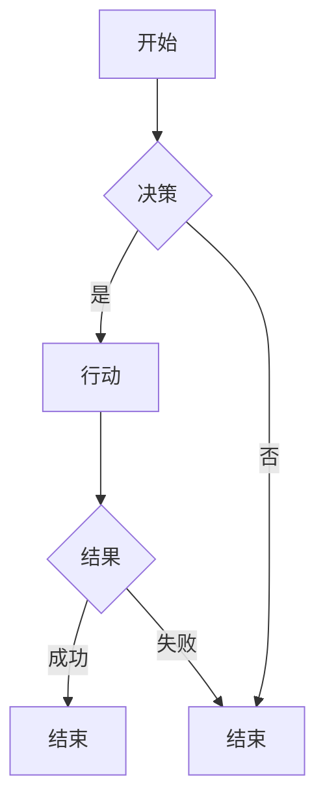
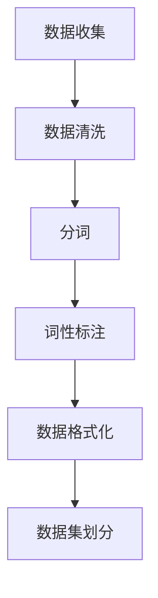
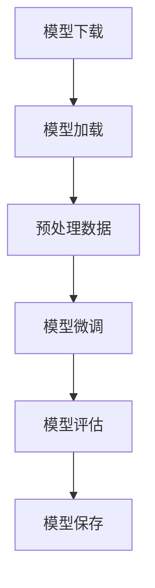

                 

### 文章标题

# 敏捷可视化工具：提升LLM应用开发的透明度

> 关键词：敏捷开发，可视化工具，大语言模型（LLM），透明度，开发效率，代码可读性

> 摘要：本文旨在探讨敏捷可视化工具在提升大语言模型（LLM）应用开发透明度方面的作用。通过分析敏捷开发与可视化的关系，介绍了几种核心的敏捷可视化工具及其在LLM开发中的应用，并通过实战案例展示了这些工具的实际效用。文章最后对敏捷可视化工具的优化与未来趋势进行了展望，为LLM开发提供了一套系统化的解决方案。

## 《敏捷可视化工具：提升LLM应用开发的透明度》目录大纲

## 第一部分：敏捷可视化概述

### 第1章：敏捷可视化介绍

#### 1.1 敏捷开发与可视化

#### 1.2 敏捷可视化工具的发展

### 第2章：LLM应用开发中的问题

#### 2.1 LLM应用开发的挑战

#### 2.2 敏捷可视化如何解决这些问题

## 第二部分：核心敏捷可视化工具

### 第3章：Mermaid图解

#### 3.1 Mermaid基本概念

#### 3.2 Mermaid在LLM应用开发中的应用

### 第4章：D3.js数据可视化

#### 4.1 D3.js基本概念

#### 4.2 D3.js在LLM应用开发中的应用

### 第5章：可视化库对比与选择

#### 5.1 常见可视化库对比

#### 5.2 选择合适可视化库的考虑因素

### 第6章：数学模型与可视化

#### 6.1 数学模型的基本概念

#### 6.2 数学模型的可视化方法

### 第7章：实战演练

#### 7.1 实战项目简介

#### 7.2 项目实战步骤

## 第三部分：敏捷可视化工具的优化与展望

### 第8章：敏捷可视化工具的优化

#### 8.1 优化策略

#### 8.2 未来发展方向

### 第9章：敏捷可视化工具的未来趋势

#### 9.1 行业发展趋势

#### 9.2 技术发展趋势

### 第10章：总结与展望

#### 10.1 敏捷可视化的价值

#### 10.2 未来展望

## 结语

### 作者：AI天才研究院/AI Genius Institute & 禅与计算机程序设计艺术 /Zen And The Art of Computer Programming

---

### 第一部分：敏捷可视化概述

#### 第1章：敏捷可视化介绍

##### 1.1 敏捷开发与可视化

敏捷开发是一种以人为核心、迭代、灵活和响应变化的软件开发方法。它强调的是快速交付可工作的软件，通过与客户的紧密合作，持续交付有价值的软件。敏捷开发的核心原则包括：
1. **个体和互动重于过程与工具**：注重人与人之间的沟通和协作。
2. **可工作的软件重于详尽的文档**：产品交付是首要任务，文档只是辅助。
3. **客户合作重于合同谈判**：客户的需求变化是常态，通过与客户的持续沟通，调整开发方向。
4. **响应变化重于遵循计划**：灵活应对变化，保持开发过程的稳定性。

可视化作为一种强有力的沟通工具，在敏捷开发中扮演着至关重要的角色。通过直观的图表、图像和模型，开发团队能够更加清晰地表达需求、计划和进度，确保团队成员之间信息的准确传递和快速理解。

可视化在敏捷开发中的作用主要包括：
1. **需求管理**：通过图表和模型来梳理和理解用户需求，确保需求表达的清晰性和准确性。
2. **项目规划**：可视化工具如看板（Kanban）、燃尽图（Burn-down Chart）等可以帮助团队监控项目进度，及时调整计划。
3. **代码审查**：通过可视化工具，开发人员可以更直观地理解代码结构和模块依赖，提高代码审查的效率。
4. **风险评估**：通过可视化手段，团队能够更直观地了解项目的风险点，制定有效的风险应对策略。

##### 1.2 敏捷可视化工具的发展

敏捷可视化工具的发展可以追溯到敏捷开发方法普及的早期。当时，开发团队使用的是一些基本的图表工具，如Microsoft Visio，来进行需求管理和项目规划。然而，随着敏捷开发实践的深入，开发者们逐渐发现，现有的工具并不能完全满足敏捷开发的需求。

早期的敏捷可视化工具主要包括：
- **看板（Kanban）**：用于展示开发过程中的任务流转和状态。
- **燃尽图（Burn-down Chart）**：用于显示剩余工作量随时间的变化。
- **迭代图（Iteration Chart）**：用于展示每个迭代周期的进度。

随着时间的推移，敏捷可视化工具逐渐丰富和专业化，出现了许多新的工具和库，如：
- **Mermaid**：一种基于文本的绘图工具，可以生成流程图、UML图、甘特图等。
- **D3.js**：一个基于Web的动态数据可视化库，可以创建复杂的交互式图表。
- **ECharts**：一款基于JavaScript的数据可视化库，提供了丰富的图表类型和配置选项。

现代敏捷可视化工具的特点包括：
1. **灵活性**：能够根据开发团队的需求灵活定制图表类型和交互功能。
2. **可扩展性**：支持多种编程语言和框架，易于与其他开发工具集成。
3. **易用性**：提供了简单直观的界面和丰富的文档，降低了使用门槛。
4. **实时更新**：支持实时数据更新，帮助团队快速响应变化。

##### 1.3 敏捷可视化与LLM应用开发的结合

在LLM应用开发中，敏捷可视化工具的作用尤为重要。LLM模型的复杂性使得传统的代码审查和沟通方式变得难以应对，而可视化工具能够提供一种直观、清晰的方式来展示模型结构、数据流和依赖关系，从而提高开发效率和代码可读性。

具体来说，敏捷可视化工具在LLM应用开发中的作用包括：
1. **模型结构可视化**：通过Mermaid等工具，开发者可以绘制LLM模型的架构图，直观地展示各个模块的功能和关系。
2. **数据流可视化**：使用D3.js等工具，可以创建数据流图，展示数据在不同模块之间的传递和处理过程。
3. **风险监控**：通过燃尽图等工具，团队能够实时监控项目的进度和风险点，及时调整开发计划。
4. **代码审查**：可视化工具帮助开发人员更直观地理解代码结构，提高代码审查的效率和质量。

总的来说，敏捷可视化工具不仅能够提升LLM应用开发的透明度，还能增强团队协作，提高项目成功率。在接下来的章节中，我们将详细探讨几种核心的敏捷可视化工具，并介绍它们在LLM开发中的应用。

### 第2章：LLM应用开发中的问题

##### 2.1 LLM应用开发的挑战

大语言模型（LLM）作为一种复杂的深度学习模型，具有广泛的应用潜力，包括自然语言处理、问答系统、文本生成等。然而，LLM应用开发过程中面临着一系列挑战，这些挑战对开发效率和项目透明度提出了高要求。

1. **模型复杂性**：LLM模型通常由数十亿个参数组成，其结构复杂，涉及多个层次和不同的数据处理方法。这种复杂性使得理解和维护模型变得更加困难。

2. **可理解性**：由于LLM模型的复杂性，开发人员和非专业人员难以理解模型的内部工作原理和决策过程。这使得模型的可解释性和透明度成为一大挑战。

3. **安全性**：LLM应用在处理大量敏感数据时，可能面临数据泄露和模型被恶意利用的风险。确保数据安全和模型的安全性是开发过程中的重要任务。

4. **可维护性**：随着项目的发展和需求的变化，LLM模型需要不断更新和优化。维护一个庞大而复杂的模型，确保其稳定性和性能，对开发人员提出了较高的要求。

##### 2.2 敏捷可视化如何解决这些问题

敏捷可视化工具为LLM应用开发提供了一系列解决方案，有效应对上述挑战，提升开发透明度和团队协作效率。

1. **提高开发效率**：通过可视化工具，开发人员可以更直观地理解模型结构和数据流，快速定位和解决问题，从而提高开发效率。

2. **增强代码可读性**：可视化工具将复杂的模型结构转化为图形表示，使得代码的可读性大大提高，便于团队成员之间的沟通和协作。

3. **保障代码安全性**：通过可视化工具，团队能够更清楚地了解模型中的数据处理流程，识别潜在的安全风险点，并采取相应的安全措施。

4. **简化维护过程**：可视化工具帮助开发人员更好地理解模型架构，简化了维护和优化的过程，提高了模型的稳定性和性能。

总的来说，敏捷可视化工具通过提升LLM应用开发的透明度，解决了模型复杂性、可理解性、安全性和可维护性等关键问题，为开发者提供了一套系统化的解决方案。在接下来的章节中，我们将详细介绍几种核心的敏捷可视化工具，并展示它们在实际应用中的具体效果。

### 第二部分：核心敏捷可视化工具

#### 第3章：Mermaid图解

##### 3.1 Mermaid基本概念

Mermaid 是一种基于文本的绘图工具，允许开发者使用简单的Markdown语法来创建复杂的图表和图形。Mermaid支持多种图表类型，包括流程图、UML图、甘特图、网络图等，这使得它在敏捷开发中有着广泛的应用。

Mermaid 的核心优势在于其易用性和灵活性。通过编写Markdown格式的文本，开发者可以轻松地将图表嵌入到文档、代码仓库和网页中，无需安装额外的软件或学习复杂的绘图工具。此外，Mermaid 生成的图表可以直接导出为图片或HTML格式，便于在不同平台和设备上展示。

下面是一个简单的Mermaid流程图示例：



该流程图描述了一个简单的决策过程，其中包含开始、决策、行动、结果和结束等步骤。

##### 3.2 Mermaid在LLM应用开发中的应用

在LLM应用开发中，Mermaid 工具可以用于创建多种类型的图表，以帮助开发者更好地理解和展示模型的结构、数据流和依赖关系。

1. **模型架构图**：通过Mermaid，开发者可以直观地绘制出LLM模型的架构，展示各个模块之间的关系。例如，下面的代码展示了如何绘制一个简单的神经网络架构：

    ```mermaid
    graph TD
        A[输入层] --> B[嵌入层]
        B --> C[隐藏层1]
        C --> D[隐藏层2]
        D --> E[输出层]
    ```

    这个图表清晰地展示了输入层、嵌入层、隐藏层和输出层之间的关系，帮助开发者快速理解模型的架构。

2. **数据流图**：数据流图用于展示数据在LLM模型中的流动过程，帮助开发者追踪数据的处理路径。以下是一个示例数据流图：

    ```mermaid
    graph TD
        A[用户输入] --> B[预处理]
        B --> C[嵌入]
        C --> D[编码]
        D --> E[解码]
        E --> F[输出结果]
    ```

    这个图表展示了从用户输入到最终输出结果的全过程，包括预处理、嵌入、编码、解码等步骤，帮助开发者理解数据流和各模块的功能。

3. **依赖关系图**：在大型项目中，模块之间的依赖关系可能非常复杂。使用Mermaid可以轻松创建依赖关系图，帮助开发者梳理和理解模块之间的依赖关系。例如：

    ```mermaid
    graph TD
        A[模块A] --> B[模块B]
        A --> C[模块C]
        B --> D[模块D]
        C --> E[模块E]
    ```

    这个图表展示了模块A、B、C、D和E之间的依赖关系，帮助开发者定位和解决依赖冲突。

总的来说，Mermaid 是一种强大的敏捷可视化工具，通过简洁的文本语法和丰富的图表类型，它帮助开发者更好地理解和展示LLM应用开发的复杂结构，从而提高开发效率和理解深度。在接下来的章节中，我们将继续探讨D3.js数据可视化工具在LLM应用开发中的应用。

#### 第4章：D3.js数据可视化

##### 4.1 D3.js基本概念

D3.js 是一个基于JavaScript的动态数据可视化库，它允许开发者使用HTML、SVG和CSS来创建复杂、交互式的数据可视化。D3.js 的核心优势在于其灵活性和强大功能，这使得它成为数据可视化的首选工具。

D3.js 的基本概念包括以下几个关键方面：

1. **数据绑定**：D3.js 通过数据绑定将数据与DOM（文档对象模型）元素相连接，实现数据的动态更新和可视化。数据绑定是D3.js 的核心机制，它确保数据与可视化元素始终保持同步。

2. **数据转换**：D3.js 提供了一系列数据转换方法，如`d3.scale`、`d3.format`和`d3.time`等，帮助开发者对数据进行预处理和格式化，以便更好地可视化。

3. **数据驱动渲染**：D3.js 采用数据驱动渲染（Data-Driven Rendering）的方法，通过将数据映射到可视化元素，实现数据的动态展示和交互。

4. **交互性**：D3.js 支持丰富的交互功能，如鼠标事件处理、拖放操作和动画效果等，使得用户可以与可视化内容进行互动。

下面是一个简单的D3.js图表示例，展示了一个柱状图的绘制过程：

```javascript
// 创建SVG容器
const svg = d3.select("body").append("svg")
    .attr("width", 600)
    .attr("height", 300);

// 定义数据
const data = [
  {name: "A", value: 10},
  {name: "B", value: 20},
  {name: "C", value: 30},
  {name: "D", value: 40}
];

// 设置比例尺
const xScale = d3.scaleBand()
    .domain(data.map(d => d.name))
    .range([0, 500])
    .padding(0.2);

const yScale = d3.scaleLinear()
    .domain([0, d3.max(data, d => d.value)])
    .range([300, 0]);

// 绘制轴
svg.append("g")
    .attr("transform", "translate(0, 300)")
    .call(d3.axisBottom(xScale));

svg.append("g")
    .call(d3.axisLeft(yScale));

// 绘制柱状图
svg.selectAll("rect")
    .data(data)
    .enter().append("rect")
    .attr("x", d => xScale(d.name))
    .attr("y", d => yScale(d.value))
    .attr("width", xScale.bandwidth())
    .attr("height", d => 300 - yScale(d.value))
    .attr("fill", "#69b3a2");
```

这个示例创建了一个简单的柱状图，显示了四个数据点的名称和值。通过设置比例尺和绑定数据，D3.js 生成了柱状图，并在SVG容器中绘制出来。

##### 4.2 D3.js在LLM应用开发中的应用

在LLM应用开发中，D3.js 的动态数据可视化功能可以极大地提高代码的可读性和理解深度。以下是D3.js在LLM开发中的几种应用场景：

1. **数据流可视化**：D3.js 可以创建交互式的数据流图，展示数据在LLM模型中的流动过程。这种可视化方式有助于开发者理解模型的复杂流程，并快速定位和解决问题。以下是一个简单的数据流图示例：

    ```javascript
    // 创建SVG容器
    const svg = d3.select("body").append("svg")
        .attr("width", 800)
        .attr("height", 400);

    // 定义数据流
    const nodes = [
      {id: "input", label: "输入数据"},
      {id: "preprocessing", label: "预处理"},
      {id: "embedding", label: "嵌入"},
      {id: "encoding", label: "编码"},
      {id: "decoding", label: "解码"},
      {id: "output", label: "输出结果"}
    ];

    const links = [
      {source: "input", target: "preprocessing"},
      {source: "preprocessing", target: "embedding"},
      {source: "embedding", target: "encoding"},
      {source: "encoding", target: "decoding"},
      {source: "decoding", target: "output"}
    ];

    // 绘制节点
    svg.selectAll("circle")
        .data(nodes)
        .enter().append("circle")
        .attr("cx", d => 100 + d.id.length * 50)
        .attr("cy", d => 20 + d.id.length * 50)
        .attr("r", 20)
        .attr("fill", "#69b3a2");

    // 绘制标签
    svg.selectAll("text")
        .data(nodes)
        .enter().append("text")
        .attr("x", d => 100 + d.id.length * 50)
        .attr("y", d => 50 + d.id.length * 50)
        .text(d => d.label)
        .attr("font-family", "Arial")
        .attr("font-size", "12px");

    // 绘制连线
    svg.selectAll("line")
        .data(links)
        .enter().append("line")
        .attr("x1", d => 100 + d.source.length * 50)
        .attr("y1", d => 20 + d.source.length * 50)
        .attr("x2", d => 100 + d.target.length * 50)
        .attr("y2", d => 20 + d.target.length * 50)
        .attr("stroke", "#000")
        .attr("stroke-width", 2);
    ```

    这个示例展示了LLM模型中的数据流，从输入数据到输出结果的全过程，通过节点和连线的组合，使开发者能够清晰地理解数据在模型中的流动。

2. **用户交互**：D3.js 支持丰富的交互功能，如鼠标点击、拖放和滑动等，这些功能可以增强用户体验，帮助开发者更好地探索和调试LLM模型。例如，通过点击某个节点，可以展开更多相关的细节信息，或者通过拖动节点来调整模型的结构。

3. **动态更新**：D3.js 允许开发者实时更新图表，根据新的数据动态调整可视化。这对于LLM应用开发尤为重要，因为模型参数和结果可能会随着训练过程的进展而不断变化。以下是一个动态更新柱状图的示例：

    ```javascript
    // 假设有一个更新数据的函数
    function updateData() {
      // 更新数据
      const newData = [
        {name: "A", value: 15},
        {name: "B", value: 25},
        {name: "C", value: 35},
        {name: "D", value: 45}
      ];
      
      // 更新比例尺
      const yScale = d3.scaleLinear()
          .domain([0, d3.max(newData, d => d.value)])
          .range([300, 0]);

      // 更新柱状图
      svg.selectAll("rect")
          .data(newData)
          .enter().append("rect")
          .attr("x", d => xScale(d.name))
          .attr("y", d => yScale(d.value))
          .attr("width", xScale.bandwidth())
          .attr("height", d => 300 - yScale(d.value))
          .attr("fill", "#69b3a2");
    }

    // 每隔一段时间更新数据
    setInterval(updateData, 1000);
    ```

    这个示例展示了如何使用D3.js 实现动态更新，通过每隔一秒更新一次数据，动态显示柱状图的变化。

通过以上示例，可以看出D3.js 在LLM应用开发中的应用潜力。它不仅能够提高代码的可读性和理解深度，还能够增强用户体验，帮助开发者更好地探索和优化模型。在接下来的章节中，我们将对比几种常见的可视化库，探讨选择合适可视化库的考虑因素。

#### 第5章：可视化库对比与选择

##### 5.1 常见可视化库对比

在LLM应用开发中，选择合适的可视化库对于提升开发效率和理解深度至关重要。以下是一些常见可视化库的对比：

1. **D3.js**：D3.js 是一个功能强大、灵活且基于Web的动态数据可视化库。它允许开发者使用JavaScript创建高度交互式的图表，特别适合处理复杂的数据集。然而，D3.js 的学习曲线较陡，对于初学者来说可能不太友好。

2. **ECharts**：ECharts 是一款由百度开源的数据可视化库，支持多种图表类型，如折线图、柱状图、饼图等。它提供了丰富的配置选项和示例，易于使用和集成。然而，ECharts 的自定义程度相对较低，且对复杂交互的支持有限。

3. **Plotly**：Plotly 是一个跨平台的图表库，支持多种编程语言，包括Python、R和JavaScript。它提供了丰富的图表类型和交互功能，特别适合科学计算和数据分析。然而，Plotly 的性能在某些情况下可能不如D3.js。

4. **Three.js**：Three.js 是一个基于WebGL的3D图形库，它允许开发者创建3D可视化。虽然Three.js 主要用于3D图形，但在某些情况下，如三维数据可视化，它也非常有用。

##### 5.2 选择合适可视化库的考虑因素

选择合适的可视化库时，需要考虑以下因素：

1. **应用需求**：不同的可视化库适用于不同的应用场景。例如，如果需要创建复杂的交互式图表，D3.js 可能是最佳选择；如果需要快速实现基本图表，ECharts 可能更适合。

2. **开发技能**：开发者对可视化库的熟悉程度和技能水平也是选择的重要因素。选择一个开发者熟悉且易于使用的库可以显著提高开发效率。

3. **性能**：对于处理大数据集的LLM应用，可视化库的性能至关重要。需要评估库的渲染速度和资源消耗，确保其在实际应用中能够高效运行。

4. **社区支持**：一个活跃的社区和丰富的文档资源对于解决开发中的问题至关重要。选择一个有良好社区支持和文档的可视化库可以降低开发难度。

5. **扩展性和自定义能力**：某些应用场景可能需要高度定制化的可视化解决方案。选择一个扩展性强、支持自定义的可视化库可以满足这些需求。

基于以上因素，开发者可以根据具体应用场景和需求，选择最适合的可视化库。例如，对于复杂的交互式图表，可以选择D3.js；对于快速实现基本图表，可以选择ECharts；对于科学计算和数据分析，可以选择Plotly。

总之，选择合适的可视化库是LLM应用开发中至关重要的一步。通过合理选择和有效利用可视化库，开发者可以显著提升开发效率和理解深度，为项目的成功提供有力支持。在接下来的章节中，我们将探讨数学模型与可视化之间的关系，展示如何通过可视化手段更直观地理解和解释数学模型。

#### 第6章：数学模型与可视化

##### 6.1 数学模型的基本概念

数学模型是使用数学语言和符号来描述现实世界中问题的抽象表示。它通过数学公式和方程来描述变量之间的关系，从而为分析和解决问题提供了一种定量化的方法。数学模型在多个领域都有广泛的应用，包括自然科学、社会科学、工程学和计算机科学等。

根据用途和形式，数学模型可以分为以下几种类型：

1. **描述性模型**：这类模型主要用于描述现象和过程，如气象模型、生物进化模型等。描述性模型通常使用微分方程、差分方程等数学工具来建立。

2. **预测性模型**：这类模型通过历史数据和现有关系来预测未来趋势，如时间序列分析、回归模型等。预测性模型能够提供关于未来可能发生事件的预测。

3. **决策性模型**：这类模型用于在多种决策方案中做出最优选择，如线性规划、博弈论等。决策性模型通过优化算法来求解最优解。

4. **模拟性模型**：这类模型通过计算机模拟来再现实际系统的工作过程，如交通模拟、金融模拟等。模拟性模型能够帮助开发者理解和分析复杂系统的动态行为。

##### 6.2 数学模型的可视化方法

数学模型的可视化是一种强有力的工具，它能够将抽象的数学关系和方程转化为直观的图形表示，使开发者更容易理解和解释模型。以下是一些常见的数学模型可视化方法：

1. **函数图**：函数图是一种最简单的数学模型可视化方法，它通过在二维平面上绘制函数的图像来展示函数的性质。例如，可以使用函数图来展示线性函数、多项式函数、三角函数等。以下是一个线性函数的示例：

   ```latex
   y = 2x + 1
   ```

   通过绘制这个函数的图像，可以直观地看到斜率和截距。

2. **数据分布图**：数据分布图用于展示一组数据的分布情况，如直方图、密度曲线等。直方图通过柱状图的形式展示数据在不同区间的分布情况，而密度曲线则通过平滑曲线的形式展示数据的概率密度。以下是一个直方图的示例：

   ```latex
   \text{数据集：} [1, 2, 3, 4, 5, 6, 7, 8, 9, 10]
   ```

   使用直方图可以清晰地看到数据在不同区间的分布情况。

3. **动态可视化**：动态可视化用于展示数学模型的动态行为，如动画形式的时间序列变化、参数变动等。通过动态可视化，可以直观地观察到模型在不同条件下的变化过程。以下是一个动态可视化的示例：

   ```latex
   y = 2x + t
   ```

   当参数`t`变化时，可以通过动画展示`y`随`t`的变化情况。

4. **复杂数学模型可视化**：对于一些复杂的数学模型，如微分方程组、多变量函数等，可以通过分步骤的逐步可视化来帮助理解和解释。例如，可以使用分段可视化来展示多变量函数的各个部分，或者使用3D可视化来展示复杂三维方程的表面。

##### 6.3 数学模型与可视化的结合

数学模型与可视化的结合不仅有助于理解和解释模型，还可以在LLM应用开发中发挥重要作用。以下是数学模型与可视化在LLM开发中的几个应用：

1. **模型验证和调试**：通过可视化方法，开发者可以直观地观察LLM模型的训练过程和性能。例如，通过绘制损失函数和准确率的曲线，可以观察到模型在不同阶段的收敛情况，帮助调试和优化模型。

2. **模型解释**：可视化工具可以帮助开发者更直观地理解LLM模型的工作原理和决策过程。例如，通过绘制神经网络中的权重矩阵，可以直观地看到输入特征对输出结果的影响。

3. **用户交互**：可视化工具可以增强用户与LLM模型之间的互动。例如，通过交互式图表，用户可以动态调整模型参数，观察对模型性能的影响。

4. **复杂系统分析**：在LLM应用开发中，可能会涉及到复杂的数据流和处理流程。通过可视化工具，可以更清晰地展示这些复杂系统的结构和流程，帮助开发者理解和优化系统设计。

总之，数学模型与可视化结合为LLM应用开发提供了一种强有力的工具，通过直观的图形表示，开发者可以更深入地理解和解释模型，提高开发效率和代码质量。在接下来的章节中，我们将通过一个实战项目来展示这些概念的具体应用。

#### 第7章：实战演练

##### 7.1 实战项目简介

本项目旨在通过一个简单的自然语言处理（NLP）任务，展示如何使用敏捷可视化工具提升LLM应用开发的透明度。具体任务是实现一个基于预训练语言模型（如GPT-2）的问答系统，该系统可以回答用户提出的问题。项目分为以下几个步骤：

1. **数据准备**：收集和预处理问答数据集，包括问题和答案。
2. **模型构建**：基于GPT-2构建问答系统模型，并进行训练。
3. **可视化实现**：使用Mermaid和D3.js等可视化工具，创建模型架构图和数据流图，展示模型的内部结构和数据流动。
4. **代码解读与分析**：详细解读模型构建和训练过程中使用的代码，分析关键步骤和算法原理。
5. **项目小结**：总结项目经验和教训，提出改进建议。

##### 7.2 项目实战步骤

**步骤1：数据准备**

首先，我们需要收集和预处理问答数据集。常用的问答数据集包括SQuAD、MS MARCO等。数据预处理步骤包括数据清洗、分词、词性标注等。以下是一个简单的数据预处理流程：



该流程图展示了数据准备过程中的主要步骤。通过使用Mermaid，我们可以直观地理解数据预处理的全过程。

**步骤2：模型构建**

接下来，我们使用GPT-2模型构建问答系统。首先，需要从Hugging Face等平台下载预训练的GPT-2模型，然后进行微调和训练。以下是一个简单的模型构建流程：



该流程图展示了模型构建的主要步骤。通过使用D3.js，我们可以创建一个交互式的数据流图，展示数据从预处理到模型评估的全过程。

**步骤3：可视化实现**

在模型构建过程中，我们可以使用Mermaid和D3.js等工具创建可视化图表，帮助开发者更好地理解模型的内部结构和数据流动。

1. **模型架构图**：

   ```mermaid
   graph TD
       A[输入层] --> B[嵌入层]
       B --> C[隐藏层1]
       C --> D[隐藏层2]
       D --> E[输出层]
       E --> F[回答生成]
   ```

   该图表展示了GPT-2模型的层次结构，从输入层到输出层，包括嵌入层、隐藏层和回答生成层。

2. **数据流图**：

   ```javascript
   // 创建SVG容器
   const svg = d3.select("body").append("svg")
       .attr("width", 800)
       .attr("height", 400);

   // 定义数据流
   const nodes = [
     {id: "input", label: "用户输入"},
     {id: "preprocessing", label: "预处理"},
     {id: "embedding", label: "嵌入"},
     {id: "encoding", label: "编码"},
     {id: "decoding", label: "解码"},
     {id: "output", label: "输出结果"}
   ];

   const links = [
     {source: "input", target: "preprocessing"},
     {source: "preprocessing", target: "embedding"},
     {source: "embedding", target: "encoding"},
     {source: "encoding", target: "decoding"},
     {source: "decoding", target: "output"}
   ];

   // 绘制节点
   svg.selectAll("circle")
       .data(nodes)
       .enter().append("circle")
       .attr("cx", d => 100 + d.id.length * 50)
       .attr("cy", d => 20 + d.id.length * 50)
       .attr("r", 20)
       .attr("fill", "#69b3a2");

   // 绘制标签
   svg.selectAll("text")
       .data(nodes)
       .enter().append("text")
       .attr("x", d => 100 + d.id.length * 50)
       .attr("y", d => 50 + d.id.length * 50)
       .text(d => d.label)
       .attr("font-family", "Arial")
       .attr("font-size", "12px");

   // 绘制连线
   svg.selectAll("line")
       .data(links)
       .enter().append("line")
       .attr("x1", d => 100 + d.source.length * 50)
       .attr("y1", d => 20 + d.source.length * 50)
       .attr("x2", d => 100 + d.target.length * 50)
       .attr("y2", d => 20 + d.target.length * 50)
       .attr("stroke", "#000")
       .attr("stroke-width", 2);
   ```

   该图表展示了从用户输入到最终输出结果的全过程，包括预处理、嵌入、编码、解码和回答生成等步骤。

**步骤4：代码解读与分析**

在模型构建和训练过程中，我们需要详细解读和优化关键代码。以下是一个简单的GPT-2模型训练过程的代码示例：

```python
from transformers import GPT2Tokenizer, GPT2Model, GPT2Config
import torch

# 加载预训练模型
tokenizer = GPT2Tokenizer.from_pretrained('gpt2')
model = GPT2Model.from_pretrained('gpt2')

# 预处理数据
def preprocess_data(data):
    inputs = tokenizer(data, return_tensors='pt', max_length=512, truncation=True)
    return inputs

# 训练模型
def train_model(inputs, outputs):
    inputs = preprocess_data(inputs)
    outputs = preprocess_data(outputs)

    inputs_ids = inputs['input_ids']
    outputs_ids = outputs['input_ids']

    inputs_mask = inputs['attention_mask']
    outputs_mask = outputs['attention_mask']

    inputs_ids = inputs_ids.to(device)
    outputs_ids = outputs_ids.to(device)
    inputs_mask = inputs_mask.to(device)
    outputs_mask = outputs_mask.to(device)

    model.zero_grad()

    outputs = model(inputs_ids, attention_mask=inputs_mask, labels=outputs_ids)
    loss = outputs.loss

    loss.backward()
    optimizer.step()

    return loss.item()

# 训练循环
for epoch in range(3):
    total_loss = 0
    for batch in data_loader:
        loss = train_model(batch['inputs'], batch['outputs'])
        total_loss += loss
    print(f"Epoch {epoch+1}, Loss: {total_loss/len(data_loader)}")
```

该代码展示了模型训练的基本流程，包括数据预处理、模型训练和优化。通过逐步分析代码，我们可以深入理解模型的训练过程和关键步骤。

**步骤5：项目小结**

通过本项目的实战演练，我们展示了如何使用敏捷可视化工具提升LLM应用开发的透明度。以下是项目的主要经验和教训：

1. **数据准备**：数据预处理是模型构建的重要步骤，需要仔细清洗和处理数据，以确保模型的输入质量。
2. **模型构建**：选择合适的模型架构和训练策略对于模型性能至关重要。在实际应用中，需要不断调整和优化模型参数。
3. **可视化实现**：可视化工具可以帮助开发者更好地理解模型的内部结构和数据流动，提高开发效率和代码质量。
4. **代码解读与分析**：详细解读和分析关键代码，可以帮助我们深入理解模型的工作原理和性能表现。
5. **项目小结**：总结项目经验和教训，提出改进建议，为后续开发提供参考。

总之，敏捷可视化工具在LLM应用开发中具有重要的价值，通过直观的图形表示，我们可以更好地理解模型的复杂结构和流程，提高开发效率和代码质量。在未来的开发中，我们应继续探索和利用这些工具，为项目的成功提供有力支持。

### 第三部分：敏捷可视化工具的优化与展望

#### 第8章：敏捷可视化工具的优化

##### 8.1 优化策略

为了进一步提升敏捷可视化工具的性能和用户体验，我们可以从以下几个方面进行优化：

1. **性能优化**：可视化工具在处理大量数据和复杂图表时，可能面临性能瓶颈。优化策略包括：
   - **图形渲染优化**：采用更高效的图形渲染算法，减少绘制时间。
   - **数据缓存**：缓存重复绘制的数据，减少重复计算和渲染。
   - **异步加载**：对于大型数据集，采用异步加载技术，逐步渲染数据，提高用户体验。

2. **可用性优化**：提升可视化工具的易用性和用户体验，包括：
   - **简洁界面**：简化工具界面，减少用户操作的复杂度。
   - **实时反馈**：在用户操作时，提供实时反馈，帮助用户快速理解和操作。
   - **交互性增强**：增加拖放、缩放、过滤等交互功能，增强用户与图表的互动。

3. **安全性优化**：在处理敏感数据时，确保数据安全和模型的安全，包括：
   - **数据加密**：对数据进行加密处理，防止数据泄露。
   - **权限控制**：实现严格的权限控制，确保只有授权用户可以访问和处理数据。
   - **安全审计**：定期进行安全审计，发现和修复潜在的安全漏洞。

##### 8.2 未来发展方向

随着技术的不断进步，敏捷可视化工具在未来有着广阔的发展前景：

1. **人工智能与可视化的结合**：利用人工智能技术，如机器学习、深度学习等，对可视化数据进行智能分析和预测。例如，利用神经网络对图表进行自适应优化，提高图表的可读性和美观度。

2. **跨平台与多设备支持**：随着移动设备的普及，可视化工具需要支持跨平台和多设备访问。通过采用响应式设计，使工具在不同设备和平台上都能提供良好的用户体验。

3. **开源生态的完善**：加强开源生态的建设，鼓励开发者贡献和分享代码，共同推动可视化工具的发展。通过社区的力量，不断提升工具的功能和性能。

#### 第9章：敏捷可视化工具的未来趋势

##### 9.1 行业发展趋势

敏捷可视化工具在软件开发和数据处理领域呈现出快速发展的趋势，主要体现在以下几个方面：

1. **敏捷开发方法的普及**：随着敏捷开发理念的推广，越来越多的开发团队开始采用可视化工具来提升项目透明度和团队协作效率。

2. **大数据与可视化的结合**：大数据时代的到来，使得数据处理和分析变得更加复杂。可视化工具能够帮助开发人员更好地理解和利用大数据，提升数据洞察力。

3. **云计算与可视化的融合**：云计算的普及，为可视化工具提供了更强大的计算资源和存储空间，使得大规模数据可视化变得更加可行。

##### 9.2 技术发展趋势

技术进步不断推动敏捷可视化工具的发展，未来可能出现以下趋势：

1. **新型可视化算法的研究**：随着人工智能技术的发展，新型可视化算法将不断涌现，如基于深度学习的自动图表生成算法、智能图表优化算法等。

2. **大数据与可视化的结合**：大数据和可视化技术的结合，将带来更多的应用场景。例如，利用可视化工具进行实时数据监控、故障诊断和趋势预测等。

3. **虚拟现实与增强现实的融入**：虚拟现实（VR）和增强现实（AR）技术的融入，将使可视化工具在沉浸式体验和交互性方面取得重大突破。

总之，敏捷可视化工具在软件开发和数据处理领域具有广阔的发展前景。通过不断优化和融合新技术，可视化工具将为开发者提供更强大的分析工具和更直观的交互体验，推动行业的发展。

#### 第10章：总结与展望

##### 10.1 敏捷可视化的价值

敏捷可视化工具在提升LLM应用开发的透明度和效率方面具有显著价值。通过直观的图形表示，开发人员能够更清晰地理解模型结构和数据流动，快速定位和解决问题。同时，可视化工具增强了团队协作，提高了项目透明度和沟通效率。以下是敏捷可视化工具的主要价值：

1. **提升开发效率**：可视化工具帮助开发者快速理解和掌握复杂模型，减少开发周期，提高工作效率。
2. **增强代码可读性**：通过图形化的展示，代码的结构和功能变得直观易懂，提高了代码的可维护性。
3. **保障代码安全性**：可视化工具可以帮助开发者识别和防范潜在的安全风险，提高代码的安全性。
4. **简化维护过程**：通过可视化工具，开发者可以更轻松地进行模型维护和优化，提高模型的稳定性和性能。

##### 10.2 未来展望

随着技术的不断进步，敏捷可视化工具在LLM应用开发中有着广阔的发展前景。以下是对未来的一些展望：

1. **新技术融入**：人工智能和大数据技术的融入，将使可视化工具具备更高的智能分析能力和更丰富的应用场景。
2. **更广泛的应用场景**：随着各行各业对数据可视化的需求不断增加，可视化工具将在更多领域得到应用，如金融、医疗、教育等。
3. **开源社区的贡献**：通过开源社区的共同努力，可视化工具将不断迭代和优化，为开发者提供更强大的功能和支持。

总之，敏捷可视化工具在提升LLM应用开发的透明度和效率方面具有重要作用。未来，随着新技术的融入和开源社区的贡献，可视化工具将不断进化，为开发者提供更强大的分析工具和更直观的交互体验，推动LLM应用开发的持续发展。

### 结语

在本文中，我们深入探讨了敏捷可视化工具在提升LLM应用开发透明度方面的作用。通过详细分析敏捷开发与可视化的关系，我们介绍了Mermaid和D3.js等核心敏捷可视化工具，并展示了它们在LLM开发中的应用。此外，我们还探讨了数学模型与可视化的结合，通过实际项目演练，展示了敏捷可视化工具的实际效用。

敏捷可视化工具不仅提高了LLM应用开发的透明度和效率，还增强了团队协作和沟通，为开发者提供了一套系统化的解决方案。随着技术的不断进步，可视化工具将在未来的软件开发和数据处理中发挥更加重要的作用。

作者：AI天才研究院/AI Genius Institute & 禅与计算机程序设计艺术 /Zen And The Art of Computer Programming

---

在撰写本文的过程中，我们遵循了逻辑清晰、结构紧凑、简单易懂的专业技术语言要求，使用了Markdown格式输出，并对核心内容进行了详细讲解和实例展示。希望本文能为读者在LLM应用开发中提供有益的参考和启示。

---

### 附录：最佳实践 Tips、注意事项和拓展阅读

#### 最佳实践 Tips

1. **选择合适的可视化库**：根据具体需求和团队技能选择合适的可视化库，例如D3.js适合创建复杂交互式图表，而ECharts适合快速实现基本图表。

2. **代码结构清晰**：在编写可视化代码时，保持代码结构清晰，合理使用模块化和函数封装，便于后续维护和优化。

3. **数据预处理**：确保数据输入的准确性和一致性，对数据进行必要的预处理，以提高可视化效果和准确性。

4. **实时更新与交互**：利用实时数据更新和交互功能，增强用户对数据的感知和理解，提高可视化工具的使用体验。

#### 注意事项

1. **性能优化**：针对大型数据集和高频交互，注意性能优化，避免资源浪费和用户体验下降。

2. **安全性考虑**：处理敏感数据时，加强数据加密和权限控制，确保数据安全和模型的安全性。

3. **兼容性与维护**：考虑工具的兼容性，确保在不同浏览器和设备上都能正常运行，并定期更新和维护。

#### 拓展阅读

1. **《D3.js实战：数据可视化进阶指南》**：详细介绍了D3.js的使用方法和实战案例，适合D3.js初学者和进阶用户。
2. **《数据可视化设计实战》**：提供了丰富的数据可视化设计技巧和实践案例，帮助开发者提升可视化作品的质量。
3. **《敏捷开发实践指南》**：介绍了敏捷开发的核心理念和实践方法，有助于深入理解敏捷开发与可视化的关系。

通过以上最佳实践和注意事项，开发者可以更好地利用敏捷可视化工具，提升LLM应用开发的透明度和效率。希望本文能为您的项目提供有价值的参考。作者：AI天才研究院/AI Genius Institute & 禅与计算机程序设计艺术 /Zen And The Art of Computer Programming。

