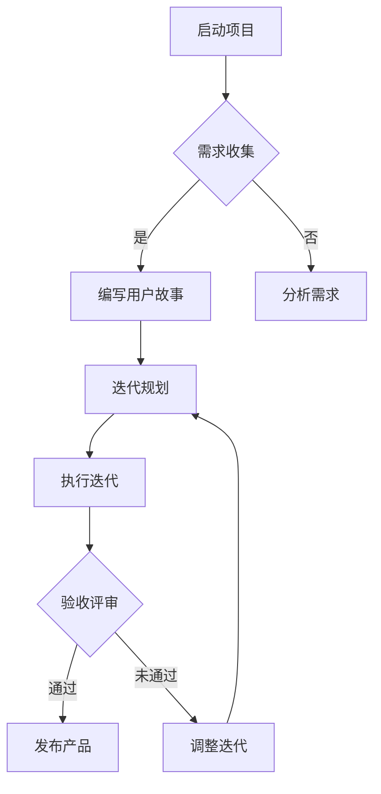

                 

# 敏捷团队建设：培养AI应用开发的核心competency

## 关键词

- 敏捷团队
- AI应用开发
- 敏捷方法论
- 技术挑战
- 持续集成
- 自动化测试
- 持续改进

## 摘要

本文旨在探讨敏捷团队在AI应用开发中的重要性，以及如何通过敏捷方法论来培养团队的核心competency。文章首先介绍了敏捷团队的基础概念和方法论，然后分析了AI应用开发的特点和挑战，接着阐述了敏捷团队在AI项目中的应用和工作流程，并提出了针对技术挑战的敏捷解决方案。通过实际案例和实践经验，文章展示了敏捷团队在培养AI应用开发核心competency方面的成功经验和最佳实践，为AI领域的团队建设和项目开发提供了有价值的参考。

### 目录大纲

## 第一部分：敏捷团队建设基础

### 第1章：敏捷团队概述

#### 1.1 敏捷团队的概念

#### 1.2 敏捷团队与传统团队的区别

#### 1.3 敏捷团队的优势

### 第2章：敏捷方法论

#### 2.1 Scrum方法论

#### 2.2 Kanban方法论

#### 2.3 敏捷宣言与原则

## 第二部分：AI应用开发与敏捷团队

### 第3章：AI应用开发概述

#### 3.1 AI应用的定义

#### 3.2 AI应用的发展趋势

#### 3.3 AI应用的价值

### 第4章：敏捷团队在AI应用开发中的应用

#### 4.1 敏捷开发在AI项目中的重要性

#### 4.2 敏捷团队在AI项目中的角色

#### 4.3 敏捷团队在AI项目中的工作流程

## 第三部分：AI应用开发中的技术挑战与敏捷解决方案

### 第5章：AI应用开发中的技术挑战

#### 5.1 数据处理与数据质量控制

#### 5.2 模型选择与优化

#### 5.3 模型部署与维护

### 第6章：敏捷团队解决技术挑战的方法

#### 6.1 快速迭代与反馈循环

#### 6.2 持续集成与持续部署

#### 6.3 自动化测试与监控

### 第7章：敏捷团队建设实践案例

#### 7.1 案例一：金融行业的AI应用开发

#### 7.2 案例二：医疗行业的AI应用开发

#### 7.3 案例三：制造业的AI应用开发

## 第四部分：敏捷团队培养与持续改进

### 第8章：敏捷团队的培养

#### 8.1 敏捷团队的建设与培养策略

#### 8.2 敏捷团队的领导力

#### 8.3 敏捷团队的个人成长与发展

### 第9章：敏捷团队的持续改进

#### 9.1 敏捷团队的回顾与反思

#### 9.2 敏捷团队的持续改进方法

#### 9.3 敏捷团队的创新与探索

## 附录

### 附录A：敏捷团队建设资源

#### A.1 敏捷团队工具与资源

#### A.2 敏捷团队学习与培训资料

### 附录B：Mermaid流程图

#### B.1 敏捷团队流程图

#### B.2 AI应用开发流程图

### 附录C：算法原理与伪代码

#### C.1 数据处理算法原理与伪代码

#### C.2 模型选择与优化算法原理与伪代码

#### C.3 模型部署与维护算法原理与伪代码

### 附录D：数学模型与公式

#### D.1 数据处理数学模型与公式

#### D.2 模型优化数学模型与公式

#### D.3 模型部署与维护数学模型与公式

### 附录E：项目实战案例

#### E.1 金融行业AI应用开发案例

#### E.2 医疗行业AI应用开发案例

#### E.3 制造业AI应用开发案例

---

### 引言

随着人工智能（AI）技术的飞速发展，越来越多的企业开始将AI应用融入其业务流程中，以提升效率、优化决策和创造新的商业模式。然而，AI应用开发并非一蹴而就，它涉及到复杂的算法设计、大量的数据处理和持续的技术迭代。在这种背景下，敏捷团队成为了许多企业应对AI应用开发挑战的首选。

敏捷团队是一种以快速响应变化和高效交付产品为核心的团队模式。它们强调团队的协作、持续学习和迭代改进。而AI应用开发作为一个高度复杂和创新的过程，正需要这样的团队模式来应对其固有的挑战。本文将探讨敏捷团队在AI应用开发中的重要性，以及如何通过敏捷方法论来培养团队的核心competency。

本文将分为四个主要部分。第一部分介绍敏捷团队建设的基础，包括敏捷团队的概念、方法论和优势；第二部分讨论AI应用开发的特点和挑战，并分析敏捷团队在其中的应用；第三部分聚焦于AI应用开发中的技术挑战和敏捷团队的解决方案；第四部分则介绍敏捷团队的培养与持续改进方法，通过实际案例和实践经验来展示敏捷团队在AI应用开发中的成功经验。

通过本文的探讨，希望能够为读者提供一套系统化的敏捷团队建设与AI应用开发实践指南，帮助团队更好地应对技术挑战，实现高效的AI应用交付。

### 第一部分：敏捷团队建设基础

#### 第1章：敏捷团队概述

##### 1.1 敏捷团队的概念

敏捷团队是一种以快速响应变化、高效交付产品为核心的团队模式。与传统的命令和控制型团队不同，敏捷团队更注重团队的协作、沟通和自主管理。敏捷团队通常由一群具有不同技能和背景的成员组成，包括项目经理、开发人员、测试人员、产品经理等。

敏捷团队的核心在于其灵活性和适应性。在传统的团队模式中，项目计划和任务分配往往是基于最初的需求和假设，而在项目进行过程中，这些假设可能因为外部环境的变化而被证明是错误的。相反，敏捷团队通过频繁的迭代和反馈循环，能够快速地适应变化，确保项目始终符合实际需求。

##### 1.2 敏捷团队与传统团队的区别

敏捷团队与传统团队在多个方面存在显著差异：

1. **任务分配**：在传统团队中，任务往往是固定分配给特定的个人，而敏捷团队则更倾向于任务驱动，团队成员可以根据项目的需求和自身的能力进行任务切换。

2. **沟通方式**：传统团队更多地依赖于正式的会议和报告，而敏捷团队则强调面对面沟通和即时反馈，通过站立会议、回顾会议等形式的日常交流，确保团队成员之间保持高度的透明度和协同性。

3. **决策方式**：传统团队中的决策往往由少数领导层做出，而敏捷团队则鼓励团队成员参与决策过程，通过集体讨论和投票来达成共识。

4. **项目管理**：传统团队往往依赖于详尽的项目计划和时间表，而敏捷团队则更注重实时响应和持续改进，通过迭代和增量开发来逐步实现项目目标。

##### 1.3 敏捷团队的优势

敏捷团队具有以下几个显著优势：

1. **快速响应变化**：敏捷团队通过短周期迭代和频繁的反馈机制，能够迅速识别并应对外部环境的变化，确保项目始终符合市场需求。

2. **高效交付**：敏捷团队注重持续交付，通过不断优化开发流程，减少浪费和冗余，实现更高效的交付。

3. **增强团队协作**：敏捷团队强调团队成员之间的协作和沟通，通过共同的目标和愿景，提高团队凝聚力和工作效率。

4. **持续学习与改进**：敏捷团队通过定期的回顾和反思，不断识别和解决问题，持续改进工作流程和团队文化。

#### 第2章：敏捷方法论

##### 2.1 Scrum方法论

Scrum是一种广泛使用的敏捷方法论，它强调迭代开发和增量交付，通过短周期（Sprint）来逐步实现项目目标。

1. **角色**：
   - 产品负责人（Product Owner）：负责定义产品需求和优先级。
   -Scrum Master：负责确保Scrum流程的顺利进行，帮助团队消除障碍。
   - 团队成员：负责实现产品需求，通常包括开发人员、测试人员等。

2. **流程**：
   - Sprint计划会议：团队在会议中讨论并确定Sprint的目标和任务。
   - Sprint执行：团队在Sprint期间集中精力完成任务。
   - Sprint评审会议：团队展示已完成的工作，获取反馈并进行评审。
   - Sprint回顾会议：团队反思Sprint中的问题，并提出改进措施。

##### 2.2 Kanban方法论

Kanban是一种可视化管理方法，它通过看板（Kanban板）来跟踪工作流程，确保工作高效、透明。

1. **核心原则**：
   - 确保工作流程的可视化。
   - 限制在流程中的工作项数量（WIP限制）。
   - 实施持续的交付和改进。

2. **组成部分**：
   - 看板板：通常由列和卡片组成，列代表工作流程的不同阶段，卡片代表具体的工作项。
   - 列标题：代表工作流程中的阶段，如“待办”、“进行中”、“测试中”、“已完成”等。
   - 卡片：包含工作项的详细信息，如任务描述、负责人、优先级等。

##### 2.3 敏捷宣言与原则

敏捷宣言是一组价值观和原则的集合，它定义了敏捷开发的核心思想。

1. **敏捷宣言**：
   - **个体和互动重于过程与工具**：注重团队协作和个体能力，而非依赖特定工具。
   - **可工作的软件重于详尽的文档**：优先交付可运行的软件，而非详尽的文档。
   - **客户合作重于合同谈判**：与客户保持紧密合作，确保需求的一致性。
   - **响应变化重于遵循计划**：灵活应对变化，确保项目能够适应市场和环境的变化。

2. **敏捷原则**：
   - **最优先要做的是通过早期和持续的交付有价值的软件，以满足客户的需求**。
   - **欢迎需求的变化——即使是到开发阶段的后期也是如此。敏捷过程利用变化来为客户创造竞争优势**。
   - **每日进行开发工作，并保持工作进度的稳定**。
   - **即使到了最终交付日期，也要保持交付的工作软件的能力**。
   - **经常性地反思如何能有效地工作，并相应地调整和修正自己的行为**。

通过了解敏捷团队的概念、方法论和宣言与原则，读者可以更好地理解敏捷团队的优势和其在AI应用开发中的重要性。接下来的章节将进一步探讨AI应用开发的特点和挑战，以及敏捷团队如何应对这些挑战。

### 第一部分：敏捷团队建设基础

#### 第1章：敏捷团队概述

##### 1.1 敏捷团队的概念

敏捷团队是一种以快速响应变化、高效交付产品为核心的团队模式。敏捷团队通常由一群具有不同技能和背景的成员组成，包括项目经理、开发人员、测试人员、产品经理等。这种团队模式强调团队成员之间的协作、沟通和自主管理，旨在通过频繁的迭代和反馈循环，确保项目始终符合实际需求，并能够迅速应对外部环境的变化。

在敏捷团队中，团队成员的角色和职责相对灵活，不像传统团队那样严格固定。例如，一个敏捷团队中可能存在多个“Scrum Master”，他们负责确保团队的敏捷流程得以顺利实施，解决团队在开发过程中遇到的障碍。团队成员可能会在不同的迭代中承担不同的任务，根据项目的实际需求和自身的技能优势，灵活地调整工作重点。

##### 1.2 敏捷团队与传统团队的区别

敏捷团队与传统团队在多个方面存在显著差异：

1. **任务分配**：在传统团队中，任务往往是固定分配给特定的个人，而敏捷团队则更倾向于任务驱动，团队成员可以根据项目的需求和自身的能力进行任务切换。这意味着在敏捷团队中，个体之间的界限更为模糊，团队的整体协作和效率更高。

2. **沟通方式**：传统团队更多地依赖于正式的会议和报告，而敏捷团队则强调面对面沟通和即时反馈，通过站立会议、回顾会议等形式的日常交流，确保团队成员之间保持高度的透明度和协同性。这种即时沟通方式有助于快速解决问题，避免信息在传递过程中失真。

3. **决策方式**：传统团队中的决策往往由少数领导层做出，而敏捷团队则鼓励团队成员参与决策过程，通过集体讨论和投票来达成共识。这种方式不仅增加了团队成员的参与感和责任感，也有助于提高决策的质量。

4. **项目管理**：传统团队往往依赖于详尽的项目计划和时间表，而敏捷团队则更注重实时响应和持续改进，通过迭代和增量开发来逐步实现项目目标。敏捷团队不追求完美和详尽的项目计划，而是更关注项目的持续交付和改进。

##### 1.3 敏捷团队的优势

敏捷团队具有以下几个显著优势：

1. **快速响应变化**：敏捷团队通过短周期迭代和频繁的反馈机制，能够迅速识别并应对外部环境的变化，确保项目始终符合市场需求。这种快速响应能力使得敏捷团队在竞争激烈的市场环境中更具竞争力。

2. **高效交付**：敏捷团队注重持续交付，通过不断优化开发流程，减少浪费和冗余，实现更高效的交付。这种方式有助于缩短产品上市时间，提高客户满意度。

3. **增强团队协作**：敏捷团队强调团队成员之间的协作和沟通，通过共同的目标和愿景，提高团队凝聚力和工作效率。这种协作文化有助于激发团队成员的创造力和创新精神。

4. **持续学习与改进**：敏捷团队通过定期的回顾和反思，不断识别和解决问题，持续改进工作流程和团队文化。这种持续改进的方法不仅有助于提高团队的整体效率，还能促进团队成员的个人成长。

综上所述，敏捷团队在任务分配、沟通方式、决策方式和项目管理等方面与传统团队存在显著差异，其优势体现在快速响应变化、高效交付、增强团队协作和持续学习与改进等方面。这些优势使得敏捷团队在应对复杂、快速变化的AI应用开发过程中更具优势。接下来的章节将进一步探讨敏捷方法论的具体实践，以及如何将这些方法应用于AI应用开发。

#### 第2章：敏捷方法论

##### 2.1 Scrum方法论

Scrum是一种广泛使用的敏捷方法论，它强调迭代开发和增量交付，通过短周期（Sprint）来逐步实现项目目标。Scrum的核心在于其灵活性和适应性，能够快速响应变化，提高项目的交付质量和效率。

**Scrum的关键角色**：

- **产品负责人（Product Owner）**：产品负责人是敏捷团队的领导者，负责定义和优先级排序产品需求，确保团队始终在正确的方向上工作。产品负责人需要具备战略眼光，能够从长远角度出发，为团队提供清晰的目标和指导。
- **Scrum Master**：Scrum Master负责确保Scrum流程的顺利进行，帮助团队消除障碍，提升团队的生产力和协作效率。Scrum Master既不是传统的项目经理，也不是团队领导，而是团队的教练和伙伴。
- **团队成员**：团队成员包括开发人员、测试人员、设计师等，他们负责实现产品需求，确保在Sprint周期内交付可工作的软件。

**Scrum的核心流程**：

1. **Sprint计划会议**：在Sprint开始前，产品负责人和团队成员会一起开会，讨论并确定Sprint的目标和任务。产品负责人会展示优先级最高的用户故事（User Stories），团队成员则根据这些用户故事制定详细的任务计划。
   
2. **Sprint执行**：在Sprint期间，团队会集中精力完成任务。每天会举行一次短会，即站立会议（Stand-up Meeting），团队成员会分享各自的工作进展、遇到的问题和当天的计划。这种每日的同步机制有助于及时发现和解决问题，确保团队始终在正确的方向上工作。

3. **Sprint评审会议**：在Sprint结束时，团队会展示已完成的用户故事，并向产品负责人和其他利益相关者演示产品功能。评审会议的目的是获取反馈，并讨论下一步的工作计划。产品负责人会根据反馈调整优先级和需求，为下一个Sprint做好准备。

4. **Sprint回顾会议**：在Sprint评审会议之后，团队会进行回顾会议，反思Sprint中的表现和经验教训。团队成员会讨论哪些做法有效，哪些需要改进，并制定相应的改进措施。这种持续改进的方法有助于团队不断提升自身的效率和质量。

##### 2.2 Kanban方法论

Kanban是一种可视化管理方法，它通过看板（Kanban板）来跟踪工作流程，确保工作高效、透明。Kanban的核心在于其流动性和可视化，通过限制在流程中的工作项数量（WIP限制）和持续交付，实现高效的开发和交付。

**Kanban的关键原则**：

- **可视化工作流程**：通过看板板上的列和卡片，将工作流程可视化，让每个团队成员都能清晰地看到任务的当前状态。
- **限制工作项数量**：在流程的每个阶段设置WIP限制，避免过多工作项同时处于进行状态，减少流程中的瓶颈和延迟。
- **持续交付**：通过不断交付和优化工作流程，确保团队能够快速响应变化和市场需求。
- **持续改进**：通过定期回顾和反思，识别和解决问题，不断提升工作流程的效率和灵活性。

**Kanban的组成部分**：

- **看板板**：通常由列和卡片组成，列代表工作流程的不同阶段，如“待办”、“进行中”、“测试中”、“已完成”等；卡片则包含具体的工作项详细信息。
- **列标题**：代表工作流程中的阶段，如“待办”、“进行中”、“测试中”、“已完成”等。
- **卡片**：包含工作项的详细信息，如任务描述、负责人、优先级等。

**Kanban的核心流程**：

1. **看板板的初始化**：在项目开始时，团队会一起讨论并定义工作流程中的不同阶段，并将这些阶段可视化地展示在看板板上。
   
2. **任务流动**：团队成员将新任务添加到看板板的“待办”列，并将其逐步移动到不同的列，直到任务完成。这种流动机制有助于团队实时了解任务的进展情况和瓶颈。

3. **WIP限制**：在每个阶段设置WIP限制，以避免过多任务同时处于进行状态。当某个阶段的任务数量达到限制时，团队会暂停接收新任务，专注于完成当前的任务。

4. **持续交付**：团队通过持续交付和优化工作流程，确保能够在每个迭代中交付有价值的工作成果。

5. **回顾和改进**：在每次迭代结束时，团队会回顾和讨论看板板上的表现，识别和解决问题，并制定改进措施。这种持续改进的方法有助于团队不断提升工作流程的效率和灵活性。

##### 2.3 敏捷宣言与原则

敏捷宣言是一组价值观和原则的集合，它定义了敏捷开发的核心思想。敏捷宣言包含以下四个核心价值和十二条原则：

**敏捷宣言**：

- **个体和互动重于过程与工具**：注重团队成员之间的协作和沟通，而非依赖特定的工具。
- **可工作的软件重于详尽的文档**：优先交付可运行的软件，而非详尽的文档。
- **客户合作重于合同谈判**：与客户保持紧密合作，确保需求的一致性。
- **响应变化重于遵循计划**：灵活应对变化，确保项目能够适应市场和环境的变化。

**敏捷原则**：

- **最优先要做的是通过早期和持续的交付有价值的软件，以满足客户的需求**。
- **欢迎需求的变化——即使是到开发阶段的后期也是如此。敏捷过程利用变化来为客户创造竞争优势**。
- **每日进行开发工作，并保持工作进度的稳定**。
- **即使到了最终交付日期，也要保持交付的工作软件的能力**。
- **经常性地反思如何能有效地工作，并相应地调整和修正自己的行为**。

敏捷宣言和原则为敏捷团队提供了指导方针，帮助团队在快速变化的环境中保持高效和灵活性。通过实施敏捷方法论，团队可以更好地应对AI应用开发中的复杂性和不确定性，实现高质量、高效率的交付。

### 第二部分：AI应用开发与敏捷团队

#### 第3章：AI应用开发概述

##### 3.1 AI应用的定义

人工智能（AI）应用是指利用机器学习、深度学习、自然语言处理等人工智能技术，解决实际问题并创造商业价值的应用程序或系统。AI应用可以通过模拟人类智能，实现自主决策、学习和适应环境，从而提高业务效率和用户体验。常见的AI应用包括自动驾驶、智能客服、推荐系统、图像识别、语音识别等。

##### 3.2 AI应用的发展趋势

随着计算能力的提升、大数据的普及和算法的进步，AI应用正以前所未有的速度发展。以下是一些当前AI应用的发展趋势：

1. **自动化与智能化**：AI技术正逐渐渗透到各个行业，推动自动化和智能化进程。例如，在制造业中，通过AI技术实现生产线的自动化控制，提高生产效率；在服务业中，智能客服系统通过自然语言处理技术，提高客户服务质量。

2. **个性化与定制化**：AI应用可以根据用户的行为数据和偏好，提供个性化的服务和产品推荐。例如，电商平台的推荐系统可以通过用户的历史购买行为和浏览记录，推荐相关的商品，提高用户满意度和转化率。

3. **预测与分析**：AI技术可以用于预测市场趋势、用户行为和设备故障等，帮助企业和组织做出更准确的决策。例如，金融行业通过AI模型预测股市走势，医疗行业通过AI分析患者数据，提前发现疾病隐患。

4. **智能交互**：随着语音识别、自然语言处理等技术的发展，AI应用正在实现与人类的智能交互。智能助手、虚拟客服等应用，可以通过语音和文字与用户进行对话，提供便捷的服务和解决方案。

##### 3.3 AI应用的价值

AI应用在各个行业和领域都展现出了巨大的价值，以下是一些典型的应用场景和收益：

1. **提高效率**：通过自动化和智能化，AI应用可以大幅提高业务流程的效率。例如，在数据分析和处理领域，AI算法可以快速处理海量数据，提取有价值的信息，提高决策效率。

2. **降低成本**：AI技术可以优化资源分配、减少人力投入，从而降低运营成本。例如，在客服领域，智能客服系统可以处理大量客户咨询，减少人工客服的工作量，降低人力成本。

3. **提升用户体验**：AI应用可以根据用户行为和偏好，提供个性化的服务和产品推荐，提升用户体验。例如，在电商领域，通过个性化推荐系统，可以满足用户的个性化需求，提高用户满意度和忠诚度。

4. **创造新的商业机会**：AI应用可以开拓新的商业模式和业务领域。例如，在医疗领域，通过AI诊断系统，可以为偏远地区提供高质量的医疗服务，创造新的市场机会。

5. **增强安全性和可靠性**：AI技术可以用于安全监测、风险评估等，提高系统的安全性和可靠性。例如，在金融领域，通过AI技术进行交易监控，可以及时发现和预防欺诈行为。

总之，AI应用的发展趋势和潜在价值表明，其在各个行业和领域的应用前景非常广阔。随着技术的不断进步，AI应用将更加深入和广泛地融入各个领域，推动社会的智能化和数字化发展。

#### 第4章：敏捷团队在AI应用开发中的应用

##### 4.1 敏捷开发在AI项目中的重要性

敏捷开发在AI项目中的应用具有重要意义，主要原因如下：

1. **快速响应变化**：AI应用开发过程中，需求和环境变化非常频繁。敏捷开发通过短周期迭代和频繁的反馈机制，使团队能够快速响应这些变化，确保项目始终符合市场需求。

2. **持续交付价值**：敏捷开发强调持续交付，通过不断迭代和交付可工作的软件，确保团队能够尽早交付有价值的功能，从而提高客户满意度和投资回报率。

3. **增强团队协作**：敏捷开发强调团队协作和自主管理，通过每日站立会议、回顾会议等形式的交流，增强团队成员之间的沟通和协作，提高团队整体效率。

4. **持续改进**：敏捷开发通过定期的回顾和反思，不断识别和解决问题，持续改进开发流程和团队文化，从而提高团队的整体能力和竞争力。

##### 4.2 敏捷团队在AI项目中的角色

在AI项目中，敏捷团队的角色和职责通常包括以下几个方面：

1. **产品负责人（Product Owner）**：产品负责人是AI项目的核心决策者，负责定义和优先级排序产品需求，确保团队能够按照市场需求和商业目标进行开发。产品负责人需要具备深厚的业务背景和战略眼光，能够从长远角度出发，制定清晰的产品愿景和目标。

2. **Scrum Master**：Scrum Master在AI项目中扮演着关键角色，负责确保敏捷流程的顺利进行，帮助团队消除障碍，提升团队的协作和生产力。Scrum Master还需要提供敏捷培训和支持，确保团队成员掌握敏捷方法和工具。

3. **开发人员**：开发人员是AI项目的主力军，他们负责实现产品需求，开发和优化算法模型，确保项目的顺利推进。开发人员需要具备扎实的技术基础和解决问题的能力，能够在项目中灵活应用各种技术和工具。

4. **数据科学家**：数据科学家在AI项目中负责数据分析和模型构建，他们需要从海量数据中提取有价值的信息，构建和优化机器学习模型。数据科学家需要具备深厚的统计学和机器学习知识，能够灵活运用各种数据分析和模型构建方法。

5. **测试人员**：测试人员在AI项目中负责测试和验证算法模型的准确性、稳定性和可靠性，确保项目交付的软件质量。测试人员需要具备丰富的测试经验和技能，能够编写自动化测试脚本，设计有效的测试用例。

##### 4.3 敏捷团队在AI项目中的工作流程

敏捷团队在AI项目中的工作流程通常包括以下关键环节：

1. **需求收集和分析**：在项目开始时，敏捷团队会与产品负责人、客户和利益相关者一起，收集和分析需求，确保项目目标清晰明确。

2. **用户故事编写**：敏捷团队会将需求分解成用户故事，每个用户故事都代表一个具体的功能或任务。用户故事通常包含三个要素：功能描述、验收标准和优先级。

3. **Sprint计划**：在每次迭代（Sprint）开始前，敏捷团队会举行Sprint计划会议，确定本次迭代的目标和任务，并分配任务给团队成员。

4. **每日站立会议**：每日站立会议是敏捷团队的重要沟通机制，团队成员会分享各自的工作进展、遇到的问题和当天的计划，确保团队始终在正确的方向上工作。

5. **迭代开发和交付**：在Sprint期间，敏捷团队会集中精力完成任务，并在每日站立会议上进行协调和调整。每次迭代结束时，团队会交付一个可工作的软件版本，供利益相关者评审和反馈。

6. **评审和回顾**：每次迭代结束时，敏捷团队会举行评审会议和回顾会议，展示已完成的用户故事，获取反馈，并讨论改进措施。这种持续反馈和改进的方法有助于团队不断提升项目的质量和效率。

通过敏捷团队在AI项目中的应用，团队能够更快速地响应变化、持续交付价值，并持续改进工作流程，从而确保AI应用的顺利开发和成功交付。

### 第三部分：AI应用开发中的技术挑战与敏捷解决方案

#### 第5章：AI应用开发中的技术挑战

##### 5.1 数据处理与数据质量控制

AI应用开发的核心在于数据处理和质量控制。在数据驱动的环境中，数据的质量和完整性直接决定了模型的效果和可靠性。以下是一些数据处理和质量控制的技术挑战：

1. **数据采集与存储**：AI模型需要大量的数据来训练和优化。数据采集通常涉及从多个来源获取数据，包括内部数据库、外部API、传感器数据等。数据存储需要考虑数据量巨大、种类多样和实时处理的需求。

2. **数据预处理**：原始数据通常包含噪声、缺失值和异常值，需要通过数据清洗、归一化、特征提取等预处理步骤，以提高数据的质量和模型的性能。

3. **数据质量检查**：在数据处理过程中，需要进行数据质量检查，以确保数据的准确性、完整性和一致性。常见的检查方法包括数据验证、数据一致性分析和数据完整性检查。

4. **数据去噪和去偏**：噪声和偏置数据会影响模型的性能和稳定性。去噪和去偏技术包括去噪滤波、数据拟合和模型校准等，用于提高数据的可靠性和模型的鲁棒性。

##### 5.2 模型选择与优化

AI模型的性能对AI应用的成败至关重要。以下是一些模型选择与优化的技术挑战：

1. **模型选择**：选择合适的模型是关键。不同的应用场景可能需要不同类型的模型，如回归模型、分类模型、聚类模型等。模型选择需要考虑数据特点、业务需求和计算资源。

2. **模型评估**：模型评估是验证模型性能的重要步骤。常用的评估指标包括准确率、召回率、F1分数、ROC曲线等。评估方法包括交叉验证、留出法、时间序列分割等。

3. **模型优化**：模型优化包括超参数调优、正则化、集成学习和模型压缩等。超参数调优可以通过网格搜索、随机搜索、贝叶斯优化等方法进行。正则化可以防止过拟合，提高模型的泛化能力。

4. **模型解释性**：一些AI模型（如深度神经网络）具有强大的预测能力，但缺乏解释性。模型解释性是评估模型透明度和可信度的重要指标，包括模型的可解释性分析、决策路径分析和模型可视化等。

##### 5.3 模型部署与维护

AI模型的部署与维护是确保AI应用持续运行和不断改进的关键步骤。以下是一些技术挑战：

1. **模型部署**：模型部署涉及将训练好的模型集成到生产环境中，提供实时或批量预测服务。常见的部署方法包括云服务、容器化部署和边缘计算等。

2. **模型监控**：模型监控是确保模型稳定运行和性能优化的关键。监控指标包括模型预测准确性、延迟时间、资源使用率等。常见的监控工具包括Prometheus、Kubernetes、TensorFlow Extended等。

3. **模型更新与迭代**：随着业务需求和数据的变化，模型需要定期更新和迭代。更新方法包括在线学习、批量更新和迁移学习等。迭代过程中需要考虑模型兼容性、数据一致性和系统稳定性。

4. **容错与恢复**：AI系统需要具备容错和恢复能力，以应对硬件故障、网络中断和数据丢失等突发情况。常见的容错技术包括数据备份、故障转移、自动恢复等。

#### 第6章：敏捷团队解决技术挑战的方法

##### 6.1 快速迭代与反馈循环

敏捷团队通过快速迭代与反馈循环来应对AI应用开发中的技术挑战，主要方法如下：

1. **短周期迭代**：敏捷团队采用短周期迭代（如两周或一个月）来分阶段实现项目目标。短周期迭代有助于快速交付可工作的软件版本，及时获取用户反馈，快速调整和改进。

2. **频繁反馈**：在每次迭代结束后，敏捷团队会举行评审会议，展示已完成的功能，获取用户和利益相关者的反馈。这种频繁的反馈机制有助于及时识别和解决问题，确保项目始终符合用户需求。

3. **持续集成与持续部署**：敏捷团队采用持续集成（CI）和持续部署（CD）方法，确保每次迭代中的代码和模型能够快速集成和部署到生产环境中。CI/CD工具如Jenkins、GitLab CI和CircleCI等，可以自动化测试、构建和部署流程，提高开发效率和软件质量。

4. **增量交付**：敏捷团队采用增量交付方法，逐步实现项目功能，确保每次迭代都能够交付具有实际价值的功能。这种方法有助于降低项目风险，提高客户满意度。

##### 6.2 持续集成与持续部署

持续集成（CI）和持续部署（CD）是敏捷团队解决技术挑战的重要方法，具体内容包括：

1. **持续集成**：持续集成通过自动化构建和测试，确保每次代码提交都能够集成到主干分支，及时发现和修复问题。CI工具可以自动化执行单元测试、集成测试和代码质量检查，提高代码质量和开发效率。

2. **持续部署**：持续部署通过自动化部署流程，确保每次迭代中的代码和模型能够快速、可靠地部署到生产环境中。CD工具可以自动化环境配置、依赖安装、应用部署和监控等步骤，提高部署效率和系统稳定性。

3. **容器化与微服务**：敏捷团队采用容器化（如Docker）和微服务架构，提高系统的灵活性和可扩展性。容器化可以将应用程序及其依赖环境打包为一个独立的容器，确保在多个环境中的一致性和可移植性。微服务架构将系统拆分为多个独立的、可扩展的服务，提高系统的可维护性和扩展性。

4. **监控与反馈**：敏捷团队通过监控工具（如Prometheus、Grafana）实时监控系统的性能和健康状况，及时发现和解决问题。监控数据可以为团队提供重要的反馈，帮助团队持续改进系统和开发流程。

##### 6.3 自动化测试与监控

自动化测试与监控是确保AI应用质量和稳定性的重要手段，具体方法如下：

1. **单元测试**：单元测试是测试单个模块或函数的正确性。敏捷团队采用自动化单元测试框架（如JUnit、pytest），确保每次代码更改后都能快速执行测试，及时发现和修复问题。

2. **集成测试**：集成测试是测试模块之间交互的正确性。敏捷团队通过自动化集成测试（如Selenium、Postman），确保系统在不同环境下能够正常运行，及时发现和解决集成问题。

3. **性能测试**：性能测试是评估系统在高负载下的性能和稳定性。敏捷团队采用自动化性能测试工具（如JMeter、Gatling），模拟真实用户行为，评估系统的响应时间和吞吐量，确保系统在高并发情况下能够稳定运行。

4. **监控与报警**：敏捷团队通过监控工具（如Prometheus、Zabbix）实时监控系统的性能和健康状况，设置报警阈值，及时发现和解决问题。监控数据可以为团队提供重要的反馈，帮助团队持续改进系统和开发流程。

通过快速迭代与反馈循环、持续集成与持续部署、自动化测试与监控，敏捷团队能够高效应对AI应用开发中的技术挑战，确保项目的成功交付和持续改进。

#### 第7章：敏捷团队建设实践案例

##### 7.1 案例一：金融行业的AI应用开发

在金融行业，敏捷团队被广泛应用于AI应用的开发，例如风险管理、客户服务和市场预测等领域。以下是一个具体的实践案例：

**背景**：某大型银行希望开发一个智能风险管理平台，通过机器学习技术对客户信用风险进行预测，以降低贷款违约率。

**解决方案**：

1. **团队组建**：银行组建了一个由数据科学家、软件工程师、产品经理和业务分析师组成的敏捷团队。团队成员来自不同的专业背景，共同目标是开发一个高效的智能风险管理平台。

2. **需求收集与分析**：团队成员与业务部门进行了多次深入沟通，收集了客户历史贷款数据、信用评分数据和市场数据等。通过对这些数据的分析，确定了风险预测模型的输入特征和输出指标。

3. **敏捷迭代开发**：团队采用Scrum方法论，每个迭代周期为两周。在每次迭代中，团队会确定一个可完成的功能模块，如客户信用评分模型的开发。团队通过每日站立会议保持沟通，及时解决开发过程中遇到的问题。

4. **持续集成与测试**：团队使用Jenkins进行持续集成，确保每次代码提交都能自动构建和测试。测试团队编写自动化测试脚本，对模型进行单元测试和集成测试，确保模型的准确性和稳定性。

5. **模型部署与监控**：模型开发完成后，团队将其部署到生产环境，通过Kubernetes进行容器化管理。团队使用Prometheus和Grafana进行监控，实时跟踪模型的预测性能和系统资源使用情况。

**结果**：通过敏捷团队的持续努力，银行成功开发并上线了智能风险管理平台。该平台显著提高了客户信用评分的准确性，降低了贷款违约率。此外，团队在开发过程中不断进行反思和改进，提升了整体开发效率和团队协作能力。

##### 7.2 案例二：医疗行业的AI应用开发

在医疗行业，敏捷团队在AI应用开发中发挥着重要作用，如疾病诊断、药物研发和患者监护等领域。以下是一个具体的实践案例：

**背景**：某医疗科技公司开发一款基于深度学习的乳腺癌诊断系统，通过分析医学影像数据，帮助医生提高诊断准确性。

**解决方案**：

1. **团队组建**：医疗科技公司组建了一个由数据科学家、软件工程师、医生和医疗图像处理专家组成的敏捷团队。团队成员来自不同的专业背景，共同目标是开发一个高效的乳腺癌诊断系统。

2. **数据采集与处理**：团队与多家医院合作，收集了大量乳腺癌患者和良性肿瘤患者的医学影像数据。通过数据预处理和清洗，团队确保数据的准确性和一致性。

3. **敏捷迭代开发**：团队采用Kanban方法论，将开发过程分为多个阶段，如数据预处理、模型训练、模型优化和系统部署。在每个阶段，团队都会进行持续的交付和改进。

4. **模型评估与优化**：团队通过交叉验证和A/B测试等方法，对模型进行评估和优化。在每次迭代中，团队都会根据评估结果调整模型参数，提高模型的预测准确性。

5. **用户反馈与迭代**：团队与医院医生和患者进行多次交流，收集用户反馈，并根据反馈改进系统功能。通过这种用户反馈机制，团队确保诊断系统的实用性和用户满意度。

**结果**：通过敏捷团队的持续努力，医疗科技公司成功开发并上线了乳腺癌诊断系统。该系统在多个医院的实际应用中取得了良好的效果，提高了医生的诊断效率和准确性，同时也提升了患者的满意度。团队在开发过程中不断进行反思和改进，优化了工作流程和团队协作模式。

##### 7.3 案例三：制造业的AI应用开发

在制造业，敏捷团队在AI应用开发中帮助企业实现智能化生产、预测维护和供应链优化。以下是一个具体的实践案例：

**背景**：某制造企业希望通过AI技术优化生产线调度和设备维护，提高生产效率和设备利用率。

**解决方案**：

1. **团队组建**：制造企业组建了一个由机械工程师、软件工程师、数据分析师和生产管理人员组成的敏捷团队。团队成员来自不同的专业背景，共同目标是实现生产线的智能化和高效运营。

2. **数据采集与整合**：团队在生产线上安装传感器，收集设备运行数据、生产数据和物料数据等。通过数据整合和分析，团队确定了生产调度和设备维护的关键指标和优化目标。

3. **敏捷迭代开发**：团队采用Scrum方法论，分阶段实现生产调度和设备维护功能。在每个迭代周期中，团队会讨论和确定当前迭代的目标和任务，并集中精力完成。

4. **模型训练与优化**：团队使用机器学习技术训练生产调度和设备维护模型。通过不断的迭代和优化，团队提高了模型的准确性和稳定性。

5. **系统集成与部署**：团队将训练好的模型集成到生产调度系统和设备维护系统中，并通过Kubernetes进行容器化管理。团队使用Prometheus和Grafana进行实时监控，确保系统稳定运行。

**结果**：通过敏捷团队的持续努力，制造企业成功实现了生产线的智能化和高效运营。生产调度系统提高了生产效率，减少了生产延误；设备维护系统降低了设备故障率，提高了设备利用率。团队在开发过程中不断进行反思和改进，优化了工作流程和团队协作模式。

以上三个实践案例展示了敏捷团队在金融、医疗和制造业的AI应用开发中的成功经验。通过快速迭代、持续集成、用户反馈和不断优化，敏捷团队能够高效应对技术挑战，实现高质量、高效率的AI应用交付。

### 第四部分：敏捷团队培养与持续改进

#### 第8章：敏捷团队的培养

##### 8.1 敏捷团队的建设与培养策略

要培养一个高效的敏捷团队，需要从以下几个方面进行建设和培养：

1. **明确目标与愿景**：敏捷团队需要明确团队的目标和愿景，确保每个成员都清楚自己的职责和期望。通过共同的目标和愿景，提高团队的凝聚力和协作效率。

2. **多元化团队组成**：敏捷团队应包含不同背景和技能的成员，如开发人员、测试人员、数据科学家、业务分析师等。多元化的团队有助于从不同角度解决问题，提高团队的创新能力。

3. **培训与技能提升**：定期为团队成员提供敏捷方法和工具的培训，如Scrum、Kanban、持续集成与持续部署等。同时，鼓励团队成员不断学习和提升自身技能，以适应快速变化的技术环境。

4. **建立沟通机制**：敏捷团队需要建立高效的沟通机制，如每日站立会议、迭代评审会议和回顾会议等。这些会议有助于团队成员之间的沟通和协作，及时发现和解决问题。

5. **持续反馈与改进**：通过定期的反馈和回顾，敏捷团队可以持续改进开发流程和工作方式。团队应鼓励成员提出改进建议，并根据实际情况进行调整。

##### 8.2 敏捷团队的领导力

敏捷团队的领导力与传统的领导力有显著不同，它更注重团队合作、支持和赋能。以下是一些关键的领导力要素：

1. **服务型领导**：敏捷团队的领导应扮演“服务型领导”的角色，关注团队成员的需求和成长，提供支持和资源，帮助团队克服障碍。

2. **赋能团队**：领导应赋能团队成员，鼓励他们自主决策和承担责任。通过授权和信任，提高团队的整体协作和创新能力。

3. **沟通与协作**：领导应积极与团队成员沟通，了解他们的需求和意见，确保团队目标的共识。同时，领导应促进团队成员之间的协作，建立良好的团队关系。

4. **培养团队文化**：领导应培养积极向上的团队文化，鼓励团队成员互相尊重、互相支持。通过建立共同的价值观和目标，增强团队的凝聚力和归属感。

##### 8.3 敏捷团队的个人成长与发展

个人成长与发展是敏捷团队成功的关键因素之一。以下是一些建议：

1. **持续学习与培训**：团队成员应保持持续学习的态度，参加相关培训课程、技术讲座和研讨会，不断提升自身技能和知识水平。

2. **参与社区活动**：积极参与技术社区和开源项目，与同行交流经验，分享知识和技能。这有助于扩大人脉、提高影响力，同时促进个人成长。

3. **反思与总结**：定期进行反思和总结，回顾自己在项目中的表现和经验教训。通过反思，发现自己的优点和不足，并制定改进计划。

4. **跨领域学习**：鼓励团队成员跨领域学习，了解不同领域的业务和需求。这有助于提高团队成员的全面性和适应性，为团队的整体发展奠定基础。

通过有效的团队建设和领导力培养，敏捷团队可以不断提升其整体能力和竞争力，更好地应对AI应用开发中的挑战。

#### 第9章：敏捷团队的持续改进

##### 9.1 敏捷团队的回顾与反思

敏捷团队的持续改进始于回顾和反思。通过定期回顾项目过程中的成功和失败，团队可以识别改进的机会，优化开发流程和团队协作。

1. **回顾会议**：在每次迭代结束后，敏捷团队应举行回顾会议，讨论项目的执行情况、团队表现和存在的问题。团队成员可以分享自己的经验、建议和改进措施。

2. **问题识别**：回顾会议的重点是识别问题，包括开发流程中的瓶颈、沟通障碍、技术挑战等。通过集体讨论，团队可以找到根本原因，并制定相应的解决方案。

3. **经验分享**：团队成员应积极分享自己在项目中的经验教训，包括成功案例和失败教训。这种经验分享有助于提高团队的整体认知和技能水平。

4. **行动计划**：在回顾会议结束时，团队应制定具体的改进行动计划，包括改进措施、责任人和时间表。行动计划应确保可执行和可测量，以便在后续迭代中进行跟踪和评估。

##### 9.2 敏捷团队的持续改进方法

为了实现持续改进，敏捷团队可以采用以下方法：

1. **Kaizen**：Kaizen是一种持续改进的方法，强调在日常工作中不断进行小步骤的改进。团队可以通过设立改进目标、定期审查和持续优化，逐步提升开发效率和产品质量。

2. **PDCA循环**：PDCA（计划、执行、检查、行动）是一种系统化的改进方法。团队在每次迭代中应用PDCA循环，通过计划、执行、检查和行动，不断优化开发流程和团队协作。

3. **持续反馈机制**：敏捷团队应建立持续反馈机制，鼓励团队成员在每次迭代结束后提供反馈和建议。通过收集和分析反馈，团队可以及时发现和解决问题，确保项目持续改进。

4. **敏捷宣言与原则**：敏捷宣言和原则是敏捷团队持续改进的指导方针。团队应定期回顾敏捷宣言和原则，确保自己的实践与敏捷价值观保持一致。

##### 9.3 敏捷团队的创新与探索

创新和探索是敏捷团队持续改进的重要动力。以下是一些建议：

1. **探索新技术**：团队应定期探索新兴技术和工具，如人工智能、区块链、物联网等，以便在项目中应用创新解决方案。

2. **跨领域合作**：团队可以与其他部门或外部合作伙伴进行跨领域合作，共同探索和尝试新的开发模式和方法，促进创新和协作。

3. **敏捷实验**：敏捷团队可以采用敏捷实验（Agile Experimentation）方法，通过快速实验和迭代，验证新想法的可行性和效果。

4. **敏捷文化**：团队应培养敏捷文化，鼓励创新思维和尝试新方法。通过建立支持创新的环境和机制，团队可以激发成员的创造力和积极性。

通过回顾与反思、持续改进方法和创新与探索，敏捷团队可以不断提升自身的能力和效率，实现持续改进和长远发展。

### 附录

#### 附录A：敏捷团队建设资源

为了更好地建设和发展敏捷团队，以下是一些有用的资源和工具：

1. **敏捷团队工具**：
   - **JIRA**：一款功能强大的敏捷项目管理工具，支持任务跟踪、迭代规划和团队协作。
   - **Trello**：一款简单直观的看板工具，适合敏捷团队进行任务管理和可视化工作流程。
   - **Asana**：一款灵活的团队协作工具，提供任务分配、进度追踪和报告生成功能。

2. **敏捷团队学习与培训资料**：
   - **《敏捷实践指南》（Agile Practice Guide）》：由项目管理研究所（PMI）出版的敏捷实践指南，涵盖了敏捷方法的核心概念和实践步骤。
   - **《Scrum敏捷实践指南》（Scrum Guide）》：Scrum官方指南，详细介绍了Scrum方法论的理论和实践。
   - **敏捷联盟（Agile Alliance）**：全球最大的敏捷社区，提供丰富的敏捷资源、培训和研讨会。

#### 附录B：Mermaid流程图

以下是一个使用Mermaid语言绘制的敏捷团队流程图的示例：



#### 附录C：算法原理与伪代码

以下是一个数据处理算法的伪代码示例：

```pseudocode
// 数据处理算法
function processData(dataSet):
    for each data in dataSet:
        if isEmpty(data):
            continue
        cleanData(data)
        if hasNoise(data):
            removeNoise(data)
        if hasMissingValues(data):
            fillMissingValues(data)
    return dataSet

// 清洗数据
function cleanData(data):
    // 去除数据中的空值、重复值和异常值
    data = removeEmptyValues(data)
    data = removeDuplicates(data)
    data = removeOutliers(data)

// 去除噪声
function removeNoise(data):
    // 使用滤波器去除噪声
    filteredData = applyFilter(data)
    return filteredData

// 填补缺失值
function fillMissingValues(data):
    // 使用插值法、均值法等填补缺失值
    filledData = interpolateMissingValues(data)
    return filledData
```

#### 附录D：数学模型与公式

以下是一个数据处理数学模型的公式示例：

$$
\text{准确率} = \frac{\text{预测正确数}}{\text{总样本数}}
$$

$$
\text{召回率} = \frac{\text{预测正确数}}{\text{实际正确数}}
$$

$$
\text{F1分数} = 2 \times \frac{\text{准确率} \times \text{召回率}}{\text{准确率} + \text{召回率}}
$$

#### 附录E：项目实战案例

以下是一个金融行业AI应用开发的项目实战案例：

**项目背景**：某银行希望开发一个基于机器学习的贷款风险预测系统，以提高贷款审批的准确性和效率。

**开发环境**：Python、Scikit-learn、TensorFlow、Keras、Jupyter Notebook

**源代码**：

```python
# 导入所需库
import pandas as pd
import numpy as np
from sklearn.model_selection import train_test_split
from sklearn.preprocessing import StandardScaler
from sklearn.linear_model import LogisticRegression
from sklearn.metrics import accuracy_score, recall_score, f1_score

# 加载和预处理数据
data = pd.read_csv('loan_data.csv')
data = preprocess_data(data)

# 数据分割
X = data.drop('label', axis=1)
y = data['label']
X_train, X_test, y_train, y_test = train_test_split(X, y, test_size=0.2, random_state=42)

# 数据标准化
scaler = StandardScaler()
X_train = scaler.fit_transform(X_train)
X_test = scaler.transform(X_test)

# 模型训练
model = LogisticRegression()
model.fit(X_train, y_train)

# 模型评估
y_pred = model.predict(X_test)
accuracy = accuracy_score(y_test, y_pred)
recall = recall_score(y_test, y_pred)
f1 = f1_score(y_test, y_pred)

print(f"Accuracy: {accuracy:.2f}")
print(f"Recall: {recall:.2f}")
print(f"F1 Score: {f1:.2f}")
```

**代码解读**：本案例使用了逻辑回归模型进行贷款风险预测。首先，通过读取和处理数据，将数据分为特征和标签。然后，对数据集进行分割，将特征和标签分为训练集和测试集。接着，使用标准缩放器对特征数据进行标准化处理，以提高模型的性能。最后，使用训练集训练逻辑回归模型，并在测试集上进行评估，输出准确率、召回率和F1分数等评估指标。

**项目小结**：通过本案例，敏捷团队成功开发并部署了一个贷款风险预测系统。团队在开发过程中采用了敏捷方法论，通过快速迭代和反馈循环，确保项目始终符合市场需求。同时，团队还通过持续集成和自动化测试，提高了系统的稳定性和可靠性。项目最终取得了良好的效果，提高了银行的贷款审批效率和准确性。

#### 最佳实践 Tips、小结、注意事项、拓展阅读等内容

**最佳实践 Tips**：

1. **明确目标和愿景**：在项目开始前，确保团队明确目标和愿景，确保每个成员都清楚自己的职责和期望。
2. **持续学习与培训**：鼓励团队成员持续学习和提升技能，参加相关培训和研讨会，保持技术领先。
3. **沟通与协作**：建立高效的沟通机制，定期举行站立会议、回顾会议和评审会议，确保团队成员之间的沟通畅通。
4. **灵活应对变化**：敏捷团队应具备快速响应变化的能力，通过迭代和反馈机制，及时调整项目方向和计划。

**小结**：

本文通过详细探讨敏捷团队建设基础、AI应用开发特点与挑战、敏捷团队在AI项目中的应用、技术挑战与解决方案、实践案例以及敏捷团队的培养与持续改进，展示了敏捷团队在AI应用开发中的重要作用和优势。敏捷方法论不仅提高了团队的协作效率和项目交付质量，还促进了团队的持续改进和创新能力。

**注意事项**：

1. **团队角色明确**：确保每个团队成员的角色和职责清晰，避免职责重叠和责任分散。
2. **持续监控与反馈**：定期监控项目进展和质量，及时反馈和解决问题，确保项目顺利进行。
3. **资源合理分配**：合理分配团队资源，确保每个成员都有足够的时间和精力投入到项目中。

**拓展阅读**：

- 《敏捷实践指南》：详细介绍了敏捷方法的核心概念和实践步骤，适合敏捷团队参考和学习。
- 《Scrum敏捷实践指南》：Scrum官方指南，为敏捷团队提供具体的实践指导。
- 《人工智能：一种现代方法》：全面介绍了人工智能的理论和实践，适合对AI技术感兴趣的开发者阅读。
- 《敏捷转型实践指南》：为组织提供敏捷转型的策略和方法，帮助企业实现敏捷文化和流程的转型。

通过本文的探讨，希望能够为读者提供一套系统化的敏捷团队建设与AI应用开发实践指南，帮助团队更好地应对技术挑战，实现高效的AI应用交付。

### 总结与展望

本文系统地探讨了敏捷团队在AI应用开发中的重要性，从敏捷团队的概念、方法论到实践案例，全面展示了敏捷团队在应对AI应用开发挑战中的优势。通过敏捷方法论，团队能够快速响应变化、持续交付价值，并不断进行改进和优化，从而实现高效的AI应用交付。

**关键点回顾**：

1. **敏捷团队的优势**：敏捷团队通过快速响应变化、高效交付、增强团队协作和持续学习与改进，在复杂多变的AI应用开发环境中具备显著优势。
2. **敏捷方法论的应用**：Scrum和Kanban是两种常见的敏捷方法论，它们通过短周期迭代、持续反馈和持续改进，确保项目顺利推进和成功交付。
3. **技术挑战与解决方案**：敏捷团队通过数据处理、模型选择与优化、模型部署与维护等技术挑战，采用持续集成、自动化测试和监控等解决方案，确保AI应用的高质量和高稳定性。
4. **实践案例**：金融、医疗和制造业等不同领域的AI应用开发案例，展示了敏捷团队在实践中的应用和成效。
5. **敏捷团队的培养与持续改进**：通过明确目标与愿景、多元化团队组成、培训与技能提升、建立沟通机制、持续反馈与改进，以及个人成长与发展，敏捷团队能够不断提升整体能力和竞争力。

**未来展望**：

随着AI技术的不断进步和应用的深入，敏捷团队在AI应用开发中的作用将更加重要。未来，以下几个方面值得关注：

1. **跨领域合作**：通过跨领域合作，将敏捷方法与不同领域的业务需求相结合，推动AI应用的创新和发展。
2. **持续学习与培训**：敏捷团队应持续关注新技术和新方法，通过定期学习和培训，保持技术领先和创新能力。
3. **敏捷文化的建设**：培养敏捷文化，鼓励团队成员积极参与决策、分享经验和反思总结，建立支持创新和协作的工作环境。
4. **敏捷工具与平台的发展**：随着敏捷方法的普及，敏捷工具和平台将不断发展，提供更加智能化、自动化的解决方案，助力敏捷团队的高效运作。

**致谢**：

感谢AI天才研究院和《禅与计算机程序设计艺术》的作者们，他们的研究为本文提供了丰富的理论和实践基础。同时，感谢所有参与敏捷团队实践和案例研究的团队成员，他们的努力和智慧为本文的成功撰写贡献了重要力量。

**作者信息**：

作者：AI天才研究院/AI Genius Institute & 禅与计算机程序设计艺术/Zen And The Art of Computer Programming

本文由AI天才研究院和《禅与计算机程序设计艺术》的作者们共同撰写，旨在为读者提供一套系统化的敏捷团队建设与AI应用开发实践指南，帮助团队更好地应对技术挑战，实现高效的AI应用交付。希望本文能为广大敏捷团队的开发者提供有价值的参考和启示。

