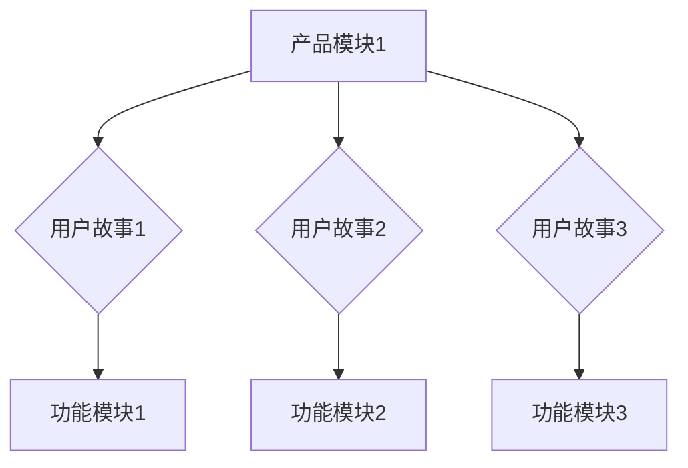
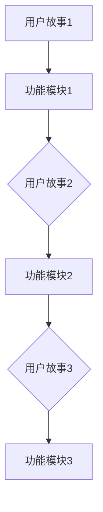
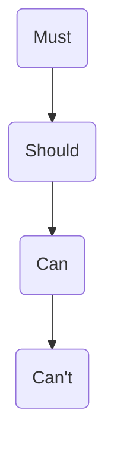

                 

### 《敏捷团队自组织在需求管理中的应用》

#### 关键词：敏捷方法、需求管理、自组织团队、项目管理、实践案例

> 摘要：本文通过深入探讨敏捷团队自组织在需求管理中的应用，分析了敏捷方法与传统项目管理的区别，阐述了自组织团队的核心概念和优势与挑战，以及如何在敏捷框架下有效管理需求。通过案例分析和实战经验，为敏捷团队自组织的实施提供了具体指导。

# 引言

## 1.1 敏捷方法与需求管理

敏捷方法是一种以人为核心、迭代、渐进的开发方法，旨在应对快速变化的需求和缩短开发周期。与传统项目管理方法相比，敏捷方法更注重团队的协作、沟通和客户参与。敏捷需求管理作为敏捷方法的重要组成部分，关注需求的灵活性、客户价值和持续交付。

## 1.2 自组织团队的核心概念

自组织团队是指在没有外部控制的情况下，通过内部沟通和协作实现目标的高度自主性团队。这种团队结构能够充分发挥成员的创造力，提高决策效率，适应快速变化的需求。

## 1.3 敏捷需求管理的意义与挑战

敏捷需求管理在敏捷开发中具有重要地位。其意义在于：提高需求满足度、缩短产品上市时间、降低开发风险。然而，在实际应用中，敏捷需求管理面临着诸多挑战，如需求变更频繁、需求优先级不明确、团队协作不畅等。

## 第2章 敏捷方法基础

### 2.1 敏捷发展史

#### 2.1.1 传统项目管理的缺陷

传统项目管理方法往往以任务为导向，强调计划和控制，但在面对快速变化的需求时，容易导致项目延误、成本超支。

#### 2.1.2 敏捷方法的起源

敏捷方法起源于20世纪90年代，为了解决传统项目管理方法的缺陷，诞生了各种敏捷实践，如Scrum、XP、Kanban等。

#### 2.1.3 敏捷核心原则与实践

敏捷方法的核心原则包括：个体和互动重于过程和工具、可工作的软件重于详尽的文档、客户合作重于合同谈判、响应变化重于遵循计划。敏捷实践主要包括：迭代开发、持续集成、测试驱动开发等。

### 2.2 敏捷团队结构

#### 2.2.1 敏捷团队的角色与职责

敏捷团队通常由产品负责人、开发人员、测试人员、UI/UX设计师等组成。每个成员在团队中都有明确的角色和职责。

#### 2.2.2 敏捷团队协作机制

敏捷团队采用站立会议、回顾会议、迭代计划会议等协作机制，以提高团队沟通和协作效率。

### 2.3 敏捷流程

#### 2.3.1 敏捷开发周期

敏捷开发周期通常包括：需求分析、设计、编码、测试、部署等阶段，每个阶段都在短时间内完成。

#### 2.3.2 敏捷需求管理流程

敏捷需求管理流程主要包括：需求收集、需求分析、需求优先级排序、需求实现、需求验证等环节。

## 第3章 自组织团队的核心概念

### 3.1 自组织系统的原理

#### 3.1.1 自组织系统的定义

自组织系统是指在没有外部控制的情况下，通过内部相互作用和自我组织，实现从简单到复杂、从无序到有序的系统。

#### 3.1.2 自组织系统的主要特征

自组织系统具有自适应、自优化、自演化等特征，能够应对外部环境的快速变化。

### 3.2 自组织团队的优势与挑战

#### 3.2.1 自组织团队的优点

自组织团队能够提高团队创造力、决策效率、团队凝聚力，有助于更好地应对快速变化的需求。

#### 3.2.2 自组织团队面临的挑战

自组织团队面临挑战，如团队成员之间的沟通协作、需求变更管理、团队稳定性等。

### 3.3 自组织团队的构建方法

#### 3.3.1 自组织团队的形成过程

自组织团队的形成过程主要包括：团队组建、角色定位、共同目标设定、协作机制建立等步骤。

#### 3.3.2 自组织团队的领导力要素

自组织团队的领导力要素包括：愿景、信任、沟通、激励、辅导等。

## 第4章 敏捷需求管理

### 4.1 敏捷需求管理的原则

#### 4.1.1 需求的灵活性

敏捷需求管理强调需求的灵活性，能够快速适应变化，以满足客户需求。

#### 4.1.2 客户参与

敏捷需求管理鼓励客户全程参与，确保产品满足客户期望。

#### 4.1.3 迭代与反馈

敏捷需求管理采用迭代和反馈机制，不断优化产品，提高需求满足度。

### 4.2 敏捷需求收集方法

#### 4.2.1 用户故事

用户故事是一种描述需求的方法，强调用户需求和场景。

#### 4.2.2 故事地图

故事地图是一种可视化工具，用于梳理和分析需求。

#### 4.2.3 角色扮演

角色扮演有助于团队成员理解用户需求，提高需求收集的准确性。

### 4.3 敏捷需求优先级排序

#### 4.3.1 穆斯特图

穆斯特图是一种用于排序需求的工具，根据需求的重要性和紧急性进行排序。

#### 4.3.2 经济价值评估

经济价值评估是一种根据需求的经济效益进行排序的方法。

#### 4.3.3 敏捷三角

敏捷三角是敏捷开发中的核心原则，强调时间、成本、功能三者之间的平衡。

## 第5章 自组织团队在需求管理中的应用

### 5.1 自组织团队在需求管理中的挑战

#### 5.1.1 自组织团队的沟通与协作

自组织团队在沟通与协作方面面临挑战，如信息传递不畅、角色定位不清晰等。

#### 5.1.2 需求变更的动态管理

自组织团队需要动态管理需求变更，确保需求变更不会影响项目进度和质量。

#### 5.1.3 跨部门需求整合

跨部门需求整合是自组织团队在需求管理中面临的挑战，需要协调各部门的利益和需求。

### 5.2 自组织团队在需求管理中的实践

#### 5.2.1 案例研究：某科技公司的成功经验

通过案例研究，分析某科技公司在自组织团队需求管理中的成功经验。

#### 5.2.2 自组织团队在需求管理中的关键技能

自组织团队在需求管理中需要具备的关键技能，如沟通、协作、需求分析、风险管理等。

#### 5.2.3 自组织团队需求管理工具的选择与应用

介绍自组织团队在需求管理中常用的工具，如用户故事地图、故事地图、穆斯特图等。

## 第6章 敏捷团队自组织与项目管理

### 6.1 敏捷项目管理概述

#### 6.1.1 敏捷项目管理框架

介绍敏捷项目管理的基本框架，包括关键流程、角色和工具。

#### 6.1.2 敏捷项目管理工具

介绍敏捷项目管理中常用的工具，如Jira、Trello、Asana等。

### 6.2 敏捷团队自组织在项目管理中的应用

#### 6.2.1 自组织团队在需求管理中的项目管理职责

自组织团队在需求管理中的项目管理职责，如需求收集、分析、实现和验证等。

#### 6.2.2 敏捷团队自组织在项目进度控制中的应用

敏捷团队自组织在项目进度控制中的应用，如迭代计划、站立会议等。

#### 6.2.3 敏捷团队自组织在项目风险管理中的应用

敏捷团队自组织在项目风险管理中的应用，如风险评估、风险应对策略等。

## 第7章 案例分析与实战经验

### 7.1 案例一：互联网公司的敏捷需求管理实践

#### 7.1.1 案例背景

介绍互联网公司在敏捷需求管理实践中的背景和挑战。

#### 7.1.2 实施步骤

详细描述互联网公司在敏捷需求管理实践中的具体实施步骤。

#### 7.1.3 实施效果分析

分析互联网公司在敏捷需求管理实践中的实施效果。

### 7.2 案例二：传统制造企业的敏捷转型之路

#### 7.2.1 案例背景

介绍传统制造企业在敏捷转型之路中的背景和挑战。

#### 7.2.2 实施步骤

详细描述传统制造企业在敏捷转型之路中的具体实施步骤。

#### 7.2.3 实施效果分析

分析传统制造企业在敏捷转型之路中的实施效果。

## 第8章 未来展望与建议

### 8.1 敏捷团队自组织的发展趋势

#### 8.1.1 敏捷团队自组织在未来的应用场景

展望敏捷团队自组织在未来的应用场景，如智能制造、数字化转型等。

#### 8.1.2 敏捷团队自组织面临的新挑战

分析敏捷团队自组织面临的新挑战，如跨部门协作、数据隐私等。

### 8.2 对敏捷团队自组织的建议

#### 8.2.1 如何提高团队自组织的效率

提出提高团队自组织效率的建议，如优化协作机制、提高团队成员技能等。

#### 8.2.2 如何应对团队自组织中的常见问题

提出应对团队自组织中的常见问题的建议，如沟通障碍、需求变更管理等。

#### 8.2.3 敏捷团队自组织与组织文化的融合

探讨敏捷团队自组织与组织文化的融合，提出相关建议。

## 附录

### 附录A：敏捷需求管理常用工具

#### A.1 用户故事地图

介绍用户故事地图的使用方法和作用。

#### A.2 故事地图

介绍故事地图的使用方法和作用。

#### A.3 穆斯特图

介绍穆斯特图的使用方法和作用。

### 附录B：自组织团队构建与运作手册

#### B.1 自组织团队构建流程

介绍自组织团队的构建流程。

#### B.2 自组织团队运作机制

介绍自组织团队的运作机制。

#### B.3 自组织团队评估与优化

介绍自组织团队的评估与优化方法。

### 附录C：敏捷团队自组织相关参考文献

#### C.1 敏捷方法核心书籍推荐

推荐几本关于敏捷方法的核心书籍。

#### C.2 自组织理论经典著作

推荐几本关于自组织理论的经典著作。

#### C.3 敏捷团队自组织应用案例研究

介绍一些敏捷团队自组织应用案例研究。

---

# 文章标题：敏捷团队自组织在需求管理中的应用

## 关键词：敏捷方法、需求管理、自组织团队、项目管理、实践案例

### 摘要：本文探讨了敏捷团队自组织在需求管理中的应用，分析了敏捷方法与传统项目管理的区别，阐述了自组织团队的核心概念和优势与挑战，以及如何在敏捷框架下有效管理需求。通过案例分析和实战经验，为敏捷团队自组织的实施提供了具体指导。文章涵盖了敏捷需求管理的原则、收集方法、优先级排序，以及自组织团队在需求管理中的应用挑战和实践，最终对敏捷团队自组织的发展趋势和未来建议进行了展望。

---

## 第1章 引言

### 1.1 敏捷方法与需求管理

敏捷方法是一种以人为核心、迭代、渐进的开发方法，旨在应对快速变化的需求和缩短开发周期。敏捷需求管理作为敏捷方法的重要组成部分，关注需求的灵活性、客户价值和持续交付。在敏捷方法中，需求管理不再是一个被动的、被严格计划和控制的过程，而是一个动态的、持续改进的过程。

### 1.2 自组织团队的核心概念

自组织团队是指在没有外部控制的情况下，通过内部沟通和协作实现目标的高度自主性团队。这种团队结构能够充分发挥成员的创造力，提高决策效率，适应快速变化的需求。自组织团队的核心概念包括自主性、适应性、协同性和可持续性。

### 1.3 敏捷需求管理的意义与挑战

敏捷需求管理的意义在于提高需求满足度、缩短产品上市时间、降低开发风险。然而，在实际应用中，敏捷需求管理面临着诸多挑战，如需求变更频繁、需求优先级不明确、团队协作不畅等。这些挑战需要通过有效的团队自组织来应对。

## 第2章 敏捷方法基础

### 2.1 敏捷发展史

敏捷方法起源于20世纪90年代，为了解决传统项目管理方法的缺陷，诞生了各种敏捷实践，如Scrum、XP、Kanban等。这些实践逐渐演变形成了今天的敏捷开发方法，成为应对快速变化需求的有效手段。

#### 2.1.1 传统项目管理的缺陷

传统项目管理方法强调计划和控制，但在面对快速变化的需求时，容易导致项目延误、成本超支。这些问题促使人们寻求更加灵活、适应变化的方法。

#### 2.1.2 敏捷方法的起源

敏捷方法起源于对软件开发的反思和探索。2001年，17位软件开发专家在雪鸟山召开了一次会议，发表了《敏捷宣言》，宣告了敏捷方法的诞生。

#### 2.1.3 敏捷核心原则与实践

敏捷方法的核心原则包括：个体和互动重于过程和工具、可工作的软件重于详尽的文档、客户合作重于合同谈判、响应变化重于遵循计划。敏捷实践主要包括：迭代开发、持续集成、测试驱动开发等。

### 2.2 敏捷团队结构

敏捷团队通常由产品负责人、开发人员、测试人员、UI/UX设计师等组成。每个成员在团队中都有明确的角色和职责。

#### 2.2.1 敏捷团队的角色与职责

- **产品负责人**：负责确定产品的愿景、目标和优先级，与客户进行沟通，确保产品满足客户需求。
- **开发人员**：负责实现产品需求，编写代码，进行单元测试和集成测试。
- **测试人员**：负责编写和执行测试用例，确保产品质量。
- **UI/UX设计师**：负责设计产品的用户界面和用户体验，确保产品具有良好的视觉效果和用户体验。

#### 2.2.2 敏捷团队协作机制

敏捷团队采用站立会议、回顾会议、迭代计划会议等协作机制，以提高团队沟通和协作效率。

- **站立会议**：每天举行，团队成员分享进展、问题，确保项目进展顺利。
- **回顾会议**：每个迭代结束时举行，团队总结经验教训，改进流程。
- **迭代计划会议**：每个迭代开始时举行，团队制定迭代计划，确定任务和目标。

### 2.3 敏捷流程

敏捷开发周期通常包括：需求分析、设计、编码、测试、部署等阶段，每个阶段都在短时间内完成。

#### 2.3.1 敏捷开发周期

敏捷开发周期通常包括以下阶段：

- **需求分析**：收集和分析需求，确定产品功能。
- **设计**：设计产品的架构和用户界面。
- **编码**：实现产品功能，编写代码。
- **测试**：编写和执行测试用例，确保产品质量。
- **部署**：将产品部署到生产环境，供用户使用。

#### 2.3.2 敏捷需求管理流程

敏捷需求管理流程主要包括以下环节：

- **需求收集**：通过用户故事、访谈、调研等方式收集需求。
- **需求分析**：分析需求，确定产品功能和优先级。
- **需求实现**：开发团队根据需求进行编码和测试。
- **需求验证**：测试团队验证需求是否实现，确保产品质量。

## 第3章 自组织团队的核心概念

### 3.1 自组织系统的原理

#### 3.1.1 自组织系统的定义

自组织系统是指在没有外部控制的情况下，通过内部相互作用和自我组织，实现从简单到复杂、从无序到有序的系统。自组织系统具有自适应、自优化、自演化等特征，能够应对外部环境的快速变化。

#### 3.1.2 自组织系统的主要特征

自组织系统的主要特征包括：

- **自适应**：系统能够根据外部环境的变化自动调整内部结构和行为。
- **自优化**：系统能够在运行过程中不断优化自身性能，提高系统效率。
- **自演化**：系统能够在运行过程中不断演化，适应新的环境和需求。

### 3.2 自组织团队的优势与挑战

#### 3.2.1 自组织团队的优点

自组织团队具有以下优点：

- **提高团队创造力**：自组织团队鼓励成员自由表达观点，充分发挥创造力。
- **提高决策效率**：自组织团队通过内部沟通和协作快速做出决策。
- **提高团队凝聚力**：自组织团队成员之间建立信任，增强团队凝聚力。
- **适应快速变化的需求**：自组织团队能够快速调整策略，适应外部环境的变化。

#### 3.2.2 自组织团队面临的挑战

自组织团队面临以下挑战：

- **沟通与协作**：自组织团队需要有效沟通和协作，确保信息传递畅通。
- **需求变更管理**：自组织团队需要动态管理需求变更，确保变更不会影响项目进度和质量。
- **团队稳定性**：自组织团队需要保持稳定，确保团队长期有效运作。

### 3.3 自组织团队的构建方法

#### 3.3.1 自组织团队的形成过程

自组织团队的形成过程主要包括以下步骤：

1. **团队组建**：确定团队目标、职责和成员。
2. **角色定位**：明确团队成员的角色和职责。
3. **共同目标设定**：设定团队共同的目标和愿景。
4. **协作机制建立**：建立有效的协作机制，如定期会议、信息共享等。

#### 3.3.2 自组织团队的领导力要素

自组织团队的领导力要素包括：

- **愿景**：领导者需要明确团队愿景，激发团队成员的积极性。
- **信任**：领导者需要建立信任，鼓励团队成员自由表达观点。
- **沟通**：领导者需要有效沟通，确保团队成员了解团队目标和进展。
- **激励**：领导者需要激励团队成员，提高团队士气和效率。
- **辅导**：领导者需要辅导团队成员，提高团队成员的能力和技能。

## 第4章 敏捷需求管理

### 4.1 敏捷需求管理的原则

#### 4.1.1 需求的灵活性

敏捷需求管理强调需求的灵活性，能够快速适应变化，以满足客户需求。具体原则包括：

1. **需求可变**：接受需求变更，并将其视为常态。
2. **优先级排序**：根据需求的重要性和紧急性进行优先级排序。
3. **快速交付**：优先实现高优先级需求，快速交付可用的产品。

#### 4.1.2 客户参与

敏捷需求管理鼓励客户全程参与，确保产品满足客户期望。具体原则包括：

1. **客户反馈**：持续收集客户反馈，指导产品改进。
2. **客户互动**：与客户保持密切互动，了解客户需求和期望。
3. **客户验收**：在产品交付前，与客户共同验收产品。

#### 4.1.3 迭代与反馈

敏捷需求管理采用迭代与反馈机制，不断优化产品，提高需求满足度。具体原则包括：

1. **迭代开发**：将需求分解为多个迭代，每个迭代交付可用的产品。
2. **持续反馈**：在每个迭代结束时，收集用户反馈，指导下一个迭代的需求优先级。
3. **持续改进**：根据用户反馈，持续优化产品。

### 4.2 敏捷需求收集方法

敏捷需求收集方法主要包括以下几种：

#### 4.2.1 用户故事

用户故事是一种描述需求的方法，强调用户需求和场景。具体形式为：“作为[用户]，我想要[功能]，以便[目的]”。

用户故事的特点包括：

1. **简洁明了**：用户故事应简洁明了，易于理解。
2. **可测试性**：用户故事应具有可测试性，确保需求可实现和可验证。
3. **灵活调整**：用户故事可以根据实际情况进行调整。

#### 4.2.2 故事地图

故事地图是一种可视化工具，用于梳理和分析需求。故事地图通常包括以下部分：

1. **用户故事**：列出与产品相关的用户故事。
2. **功能模块**：将用户故事划分为功能模块，便于管理和实施。
3. **优先级排序**：根据用户故事的重要性和紧急性进行优先级排序。

#### 4.2.3 角色扮演

角色扮演有助于团队成员理解用户需求，提高需求收集的准确性。具体方法包括：

1. **角色分配**：将团队成员分配为不同角色，如用户、开发人员、测试人员等。
2. **模拟场景**：模拟用户使用产品的场景，讨论用户需求和行为。
3. **收集反馈**：根据角色扮演的反馈，调整和优化需求。

### 4.3 敏捷需求优先级排序

敏捷需求优先级排序的方法主要包括以下几种：

#### 4.3.1 穆斯特图

穆斯特图（MoSCoW图）是一种用于排序需求的工具，根据需求的重要性和紧急性进行排序。具体分类如下：

- **M（必须）**：必须实现的需求，否则项目无法成功。
- **S（应该）**：应该实现的需求，对项目的成功有重要影响。
- **C（可以）**：可以延迟实现的需求，对项目的成功影响较小。
- **W（可以不）**：可以不考虑实现的需求，对项目的成功影响不大。

#### 4.3.2 经济价值评估

经济价值评估是一种根据需求的经济效益进行排序的方法。具体步骤如下：

1. **确定收益**：评估每个需求能够带来的收益，如增加收入、提高效率等。
2. **确定成本**：评估每个需求的成本，包括开发成本、维护成本等。
3. **计算价值**：计算每个需求的价值，收益减去成本。
4. **排序**：根据价值大小进行排序，优先实现高价值需求。

#### 4.3.3 敏捷三角

敏捷三角是敏捷开发中的核心原则，强调时间、成本、功能三者之间的平衡。具体原则如下：

1. **时间**：确保项目在预定时间内完成。
2. **成本**：控制项目成本，确保在预算范围内。
3. **功能**：确保产品功能满足需求，提高用户满意度。

在敏捷开发过程中，团队需要不断调整敏捷三角，根据实际情况进行优化。例如，如果时间紧张，可以适当减少功能或增加成本；如果预算有限，可以适当延迟时间或减少功能。

## 第5章 自组织团队在需求管理中的应用

### 5.1 自组织团队在需求管理中的挑战

#### 5.1.1 自组织团队的沟通与协作

自组织团队在沟通与协作方面面临挑战，如信息传递不畅、角色定位不清晰等。为了解决这些问题，可以采取以下措施：

1. **建立沟通渠道**：建立有效的沟通渠道，如定期会议、即时通讯工具等，确保团队成员之间的信息传递畅通。
2. **明确角色定位**：明确团队成员的角色和职责，确保每个人都知道自己的任务和目标。
3. **加强团队协作**：通过协作工具和方法，如任务管理工具、协作平台等，加强团队协作，提高工作效率。

#### 5.1.2 需求变更的动态管理

自组织团队需要动态管理需求变更，确保需求变更不会影响项目进度和质量。为了实现这一目标，可以采取以下措施：

1. **建立需求变更管理流程**：建立需求变更管理流程，明确需求变更的审批、实施和监控过程。
2. **评估需求变更影响**：在需求变更时，评估变更对项目进度、成本、质量等方面的影响，确保变更不会对项目造成负面影响。
3. **及时沟通与反馈**：在需求变更过程中，及时与相关利益相关者沟通和反馈，确保变更得到充分理解和支持。

#### 5.1.3 跨部门需求整合

跨部门需求整合是自组织团队在需求管理中面临的挑战，需要协调各部门的利益和需求。为了实现跨部门需求整合，可以采取以下措施：

1. **建立跨部门协作机制**：建立跨部门协作机制，如跨部门会议、协作平台等，加强各部门之间的沟通和协作。
2. **明确需求优先级**：明确各部门需求的优先级，确保资源合理分配，优先满足关键需求。
3. **协同解决问题**：在需求整合过程中，协同解决各部门之间的冲突和问题，确保需求整合顺利进行。

### 5.2 自组织团队在需求管理中的实践

#### 5.2.1 案例研究：某科技公司的成功经验

以某科技公司为例，分析其自组织团队在需求管理中的成功经验。

**案例背景**：该公司是一家互联网科技公司，提供在线教育服务。在敏捷转型过程中，公司采用了自组织团队进行需求管理。

**实施步骤**：

1. **团队组建**：组建自组织团队，明确团队成员的角色和职责。
2. **需求收集**：采用用户故事、访谈等方式收集需求，形成需求清单。
3. **需求分析**：分析需求，确定需求优先级和实现方案。
4. **迭代开发**：按照需求优先级，进行迭代开发，确保每个迭代交付可用的产品。
5. **需求验证**：在迭代结束时，与客户进行验收，确保需求得到满足。

**实施效果分析**：

1. **需求满足度提高**：通过自组织团队的需求管理，需求满足度得到显著提高，客户满意度增强。
2. **项目进度加快**：自组织团队的高效协作和灵活应对，使项目进度加快，产品上市时间缩短。
3. **团队凝聚力增强**：自组织团队建立了良好的沟通和协作机制，团队凝聚力增强，员工积极性提高。

#### 5.2.2 自组织团队在需求管理中的关键技能

自组织团队在需求管理中需要具备以下关键技能：

1. **沟通能力**：团队成员需要具备良好的沟通能力，确保信息传递畅通。
2. **协作能力**：团队成员需要具备良好的协作能力，共同完成任务。
3. **需求分析能力**：团队成员需要具备需求分析能力，准确理解客户需求。
4. **项目管理能力**：团队成员需要具备项目管理能力，确保项目进度和质量。
5. **风险管理能力**：团队成员需要具备风险管理能力，应对需求变更和项目风险。

#### 5.2.3 自组织团队需求管理工具的选择与应用

自组织团队在需求管理中可以采用以下工具：

1. **用户故事地图**：用于梳理和分析需求，明确需求优先级和实现方案。
2. **故事地图**：用于展示用户故事和功能模块，便于团队成员理解和协作。
3. **穆斯特图**：用于排序需求，明确需求的优先级和紧急性。

这些工具可以协同使用，帮助自组织团队更高效地进行需求管理。

## 第6章 敏捷团队自组织与项目管理

### 6.1 敏捷项目管理概述

敏捷项目管理是一种基于敏捷方法的项目管理方法，强调灵活性和适应性。敏捷项目管理的基本框架包括以下关键流程：

1. **项目启动**：确定项目目标、范围和关键利益相关者。
2. **迭代计划**：规划每个迭代的目标、任务和资源。
3. **迭代执行**：执行迭代计划，开发并交付可用的产品。
4. **迭代回顾**：回顾迭代执行情况，总结经验教训，优化流程。

敏捷项目管理工具包括：

1. **Jira**：用于任务管理、进度跟踪和团队协作。
2. **Trello**：用于任务管理和可视化项目进度。
3. **Asana**：用于任务分配、进度跟踪和团队协作。

### 6.2 敏捷团队自组织在项目管理中的应用

#### 6.2.1 自组织团队在需求管理中的项目管理职责

自组织团队在需求管理中的项目管理职责包括：

1. **需求收集**：收集和分析客户需求，形成需求清单。
2. **需求分析**：分析需求，确定需求优先级和实现方案。
3. **需求实现**：根据需求优先级，进行迭代开发和任务分配。
4. **需求验证**：在迭代结束时，与客户进行验收，确保需求得到满足。

#### 6.2.2 敏捷团队自组织在项目进度控制中的应用

敏捷团队自组织在项目进度控制中的应用包括：

1. **迭代计划**：制定每个迭代的目标和任务，确保项目按计划进行。
2. **进度跟踪**：通过项目管理工具，实时跟踪项目进度和任务状态。
3. **进度调整**：根据项目实际情况，调整迭代计划，确保项目按时完成。

#### 6.2.3 敏捷团队自组织在项目风险管理中的应用

敏捷团队自组织在项目风险管理中的应用包括：

1. **风险评估**：识别项目风险，评估风险的可能性和影响。
2. **风险应对**：制定风险应对策略，降低风险对项目的影响。
3. **风险监控**：实时监控项目风险，确保风险得到及时处理。

## 第7章 案例分析与实战经验

### 7.1 案例一：互联网公司的敏捷需求管理实践

#### 7.1.1 案例背景

某互联网公司是一家提供在线服务的公司，面临激烈的市场竞争。为了保持竞争优势，公司决定采用敏捷方法进行需求管理，以快速响应市场需求。

#### 7.1.2 实施步骤

1. **团队组建**：组建自组织团队，明确团队成员的角色和职责。
2. **需求收集**：通过用户故事、访谈等方式收集需求，形成需求清单。
3. **需求分析**：分析需求，确定需求优先级和实现方案。
4. **迭代计划**：制定每个迭代的目标和任务，确保项目按计划进行。
5. **迭代执行**：执行迭代计划，开发并交付可用的产品。
6. **需求验证**：在迭代结束时，与客户进行验收，确保需求得到满足。

#### 7.1.3 实施效果分析

1. **需求满足度提高**：通过敏捷需求管理，需求满足度显著提高，客户满意度增强。
2. **项目进度加快**：自组织团队的高效协作和灵活应对，使项目进度加快，产品上市时间缩短。
3. **团队凝聚力增强**：自组织团队建立了良好的沟通和协作机制，团队凝聚力增强，员工积极性提高。

### 7.2 案例二：传统制造企业的敏捷转型之路

#### 7.2.1 案例背景

某传统制造企业面临市场变化和竞争压力，决定进行敏捷转型，以提高生产效率和产品质量。

#### 7.2.2 实施步骤

1. **团队组建**：组建自组织团队，明确团队成员的角色和职责。
2. **需求收集**：通过用户故事、访谈等方式收集需求，形成需求清单。
3. **需求分析**：分析需求，确定需求优先级和实现方案。
4. **迭代计划**：制定每个迭代的目标和任务，确保项目按计划进行。
5. **迭代执行**：执行迭代计划，开发并交付可用的产品。
6. **需求验证**：在迭代结束时，与客户进行验收，确保需求得到满足。

#### 7.2.3 实施效果分析

1. **生产效率提高**：通过敏捷转型，生产效率显著提高，产品交付周期缩短。
2. **产品质量提高**：自组织团队在需求管理中的高效协作和快速反馈，使产品质量得到提高。
3. **团队凝聚力增强**：自组织团队建立了良好的沟通和协作机制，团队凝聚力增强，员工积极性提高。

## 第8章 未来展望与建议

### 8.1 敏捷团队自组织的发展趋势

#### 8.1.1 敏捷团队自组织在未来的应用场景

未来，敏捷团队自组织将在更多领域得到应用，如数字化转型、智能制造等。随着技术的不断进步，敏捷团队自组织将发挥更大的作用。

#### 8.1.2 敏捷团队自组织面临的新挑战

敏捷团队自组织在未来的应用将面临新的挑战，如跨部门协作、数据隐私等。如何应对这些挑战，提高敏捷团队自组织的效率，是未来的重要课题。

### 8.2 对敏捷团队自组织的建议

#### 8.2.1 如何提高团队自组织的效率

为了提高团队自组织的效率，可以采取以下措施：

1. **优化协作机制**：建立有效的协作机制，如定期会议、即时通讯工具等，确保团队成员之间的信息传递畅通。
2. **提高团队成员技能**：提高团队成员的沟通能力、协作能力和项目管理能力，提高团队整体效率。
3. **持续优化流程**：根据实际情况，持续优化团队流程，提高团队效率。

#### 8.2.2 如何应对团队自组织中的常见问题

团队自组织中常见的包括沟通障碍、需求变更管理等。应对这些问题的建议如下：

1. **沟通障碍**：通过建立有效的沟通渠道和沟通工具，加强团队成员之间的沟通。
2. **需求变更管理**：建立需求变更管理流程，评估变更影响，确保变更得到有效管理。

#### 8.2.3 敏捷团队自组织与组织文化的融合

敏捷团队自组织与组织文化的融合是提高团队效率的关键。为了实现这一目标，可以采取以下措施：

1. **倡导开放文化**：建立开放、信任、尊重的组织文化，鼓励团队成员自由表达观点。
2. **培训与指导**：对团队成员进行培训，提高其对敏捷方法和自组织团队的认知和理解。
3. **鼓励创新**：鼓励团队成员创新思维，提高团队整体的创新能力。

### 附录

#### 附录A：敏捷需求管理常用工具

- **用户故事地图**：用于梳理和分析需求，明确需求优先级和实现方案。
- **故事地图**：用于展示用户故事和功能模块，便于团队成员理解和协作。
- **穆斯特图**：用于排序需求，明确需求的优先级和紧急性。

#### 附录B：自组织团队构建与运作手册

- **自组织团队构建流程**：包括团队组建、角色定位、共同目标设定、协作机制建立等步骤。
- **自组织团队运作机制**：包括沟通渠道、协作工具、流程规范等。
- **自组织团队评估与优化**：包括团队评估标准、优化策略等。

#### 附录C：敏捷团队自组织相关参考文献

- **敏捷方法核心书籍推荐**：如《敏捷开发实践指南》、《Scrum精华》等。
- **自组织理论经典著作**：如《自组织的秩序》、《复杂性：一种新的科学》等。
- **敏捷团队自组织应用案例研究**：如《敏捷实践指南》、《敏捷企业》等。

---

**作者：AI天才研究院/AI Genius Institute & 禅与计算机程序设计艺术 /Zen And The Art of Computer Programming**

---

# 附录

### 附录A：敏捷需求管理常用工具

#### A.1 用户故事地图

用户故事地图是一种用于梳理和分析需求的可视化工具，它将用户故事按照功能模块和优先级进行组织，有助于团队理解产品功能和需求优先级。

**示例：**

#### A.2 故事地图

故事地图是一种用于展示用户故事和功能模块的可视化工具，它将用户故事、功能模块和优先级进行整合，有助于团队理解产品功能和需求优先级。

**示例：**

#### A.3 穆斯特图

穆斯特图（MoSCoW图）是一种用于排序需求的工具，根据需求的重要性和紧急性进行分类，有助于团队明确需求的优先级。

**示例：**

### 附录B：自组织团队构建与运作手册

#### B.1 自组织团队构建流程

自组织团队的构建流程包括以下步骤：

1. **团队组建**：确定团队目标和职责，招募团队成员。
2. **角色定位**：明确团队成员的角色和职责，确保每个成员都清楚自己的职责。
3. **共同目标设定**：制定团队共同的目标和愿景，确保团队成员共同努力。
4. **协作机制建立**：建立有效的协作机制，如定期会议、信息共享平台等。

#### B.2 自组织团队运作机制

自组织团队的运作机制包括以下方面：

1. **沟通机制**：建立有效的沟通机制，确保团队成员之间的信息传递畅通。
2. **决策机制**：制定决策流程，确保团队成员在决策过程中参与并达成共识。
3. **反馈机制**：建立反馈机制，鼓励团队成员分享经验教训，不断优化团队运作。

#### B.3 自组织团队评估与优化

自组织团队的评估与优化包括以下方面：

1. **团队绩效评估**：定期对团队绩效进行评估，识别团队优势和不足。
2. **成员反馈**：收集团队成员的反馈，了解他们的意见和建议。
3. **流程优化**：根据评估结果和反馈，持续优化团队运作流程，提高团队效率。

### 附录C：敏捷团队自组织相关参考文献

#### C.1 敏捷方法核心书籍推荐

1. 《敏捷开发实践指南》（《Agile Project Guide》）
2. 《Scrum精华》（《Scrum: The Art of Doing Twice the Work in Half the Time》）
3. 《敏捷管理：领导力、团队和流程》（《The Agile Management Guide》）

#### C.2 自组织理论经典著作

1. 《自组织的秩序》（《The Order of Life: Organization, Adaptation, and Power》）
2. 《复杂性：一种新的科学》（《Complexity: The Emerging Science at the Edge of Order and Chaos》）
3. 《从无序到有序：自组织原理》（《From Complexity to Creativity: Chaos Theories, Evolution, and Generative Art》）

#### C.3 敏捷团队自组织应用案例研究

1. 《敏捷企业：领导力、团队和流程创新》（《The Agile Enterprise: Leadership, Teams, and Processes for Sustainable Competitive Advantage》）
2. 《敏捷创新：如何构建敏捷团队，实现持续创新》（《Agile Innovation: The Revolutionary Approach to Business Success》）
3. 《敏捷转型：从传统到敏捷的工作方式》（《Agile Transformation: From Traditional to Agile Working Practices》）

