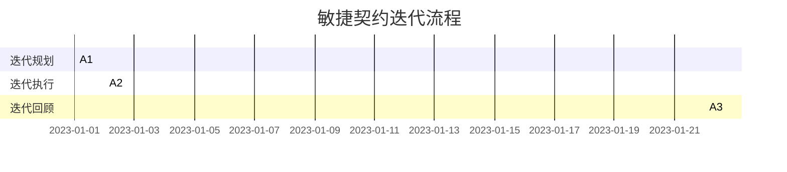
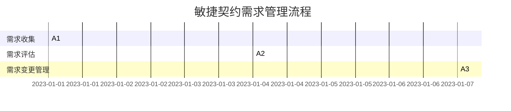
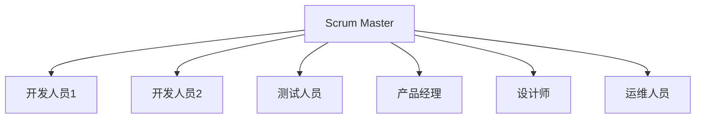
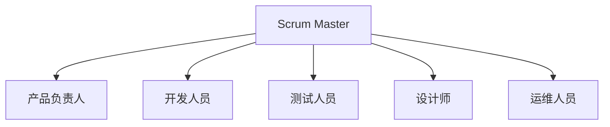
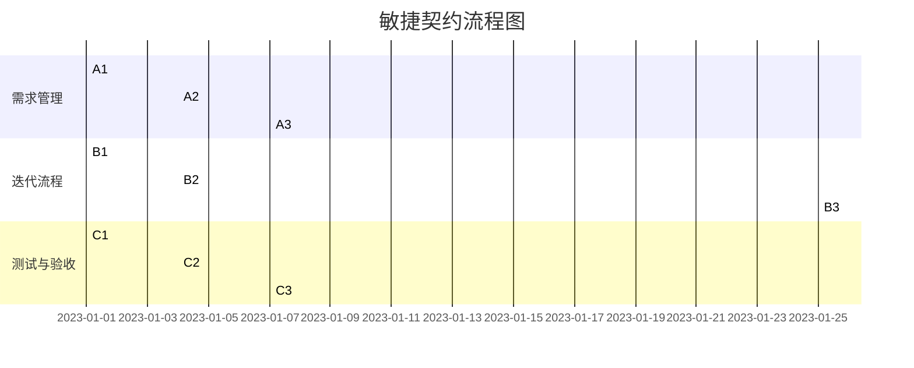

                 

### 文章标题

# 敏捷契约在大型应用开发中的应用

> 关键词：敏捷契约、大型应用开发、项目管理、迭代流程、团队协作、案例分析

> 摘要：本文探讨了敏捷契约在大型应用开发中的应用。通过介绍敏捷契约的起源、理念、基本原则，以及其在大型项目中的优势和应用流程，结合具体案例分析了敏捷契约的实施效果。文章旨在为大型应用项目的开发者提供一种高效、透明的开发模式，以提高项目成功率和团队协作效率。

### 目录大纲

#### 第一部分：敏捷契约概述

- 第1章：敏捷契约的起源与理念
  - 1.1 敏捷契约的定义
  - 1.2 敏捷契约的起源与发展
  - 1.3 敏捷契约的基本原则

- 第2章：敏捷契约在大型项目中的优势
  - 2.1 大型项目的挑战
  - 2.2 敏捷契约在大型项目中的优势

#### 第二部分：敏捷契约在大型应用开发中的应用

- 第3章：敏捷契约的基本流程
  - 3.1 敏捷契约的迭代流程
  - 3.2 敏捷契约的需求管理
  - 3.3 敏捷契约的测试与验收

- 第4章：敏捷契约的团队协作
  - 4.1 敏捷团队的组建与运作
  - 4.2 敏捷契约中的沟通机制
  - 4.3 敏捷契约中的角色与职责

- 第5章：敏捷契约的常见挑战与解决方法
  - 5.1 挑战1：团队抵触
  - 5.2 挑战2：需求变更
  - 5.3 挑战3：项目管理

- 第6章：敏捷契约案例分析
  - 6.1 案例一：电商平台的敏捷开发
  - 6.2 案例二：金融行业的敏捷转型

#### 第三部分：敏捷契约实施指南

- 第7章：敏捷契约的未来发展趋势
  - 7.1 敏捷契约的持续优化
  - 7.2 敏捷契约与其他敏捷方法的结合

- 第8章：敏捷契约实施步骤
  - 8.1 准备工作
  - 8.2 敏捷契约的实施过程

- 第9章：敏捷契约工具与资源
  - 9.1 敏捷契约工具介绍
  - 9.2 敏捷契约相关资源

- 附录
  - 附录A：敏捷契约流程图

### 第一部分：敏捷契约概述

#### 第1章：敏捷契约的起源与理念

敏捷契约（Agile Contract）是敏捷开发方法中的一种重要理念，它强调灵活、透明和协作。在本章中，我们将探讨敏捷契约的起源、理念以及基本原则。

##### 1.1 敏捷契约的定义

敏捷契约是一种在软件开发项目中采用的方法论，旨在通过灵活的合同条款和协作机制来应对项目中的不确定性和变化。与传统契约相比，敏捷契约更加注重客户的参与和反馈，以及项目团队的自主性和灵活性。

敏捷契约的核心概念包括：

- **适应性**：项目计划不是固定的，而是可以根据实际情况进行灵活调整。
- **客户参与**：客户在项目开发过程中保持积极参与，提供及时反馈，以确保项目的方向和目标符合客户需求。
- **迭代开发**：项目被分解为多个短周期（迭代）进行开发，每个迭代都能交付部分可用的功能。
- **透明度**：项目进展、风险和问题都保持透明，团队成员和利益相关者可以随时了解项目状态。

##### 1.2 敏捷契约的起源与发展

敏捷契约的起源可以追溯到20世纪90年代末期，当时软件开发领域开始意识到传统项目管理方法的局限性。在软件开发实践中，项目往往面临复杂性和不确定性，传统的瀑布模型（Waterfall Model）往往难以应对这些挑战。

1999年，17位软件开发专家在宾夕法尼亚州的雪鸟峰（Snowbird, Utah）召开了一次会议，讨论如何改进软件开发过程。这次会议的结果是发表了《敏捷宣言》（Manifesto for Agile Software Development），标志着敏捷开发理念的诞生。

随着敏捷开发方法的发展，敏捷契约逐渐成为敏捷方法中的一个重要组成部分。它不仅适用于软件开发项目，还扩展到其他领域，如项目管理、产品开发和咨询服务。

##### 1.3 敏捷契约的基本原则

敏捷契约的基本原则包括以下几个方面：

- **以客户为中心**：客户需求是项目成功的关键，客户的需求应始终放在首位。
- **持续交付**：项目应持续交付可用的软件版本，以便及时获取客户反馈。
- **反应迅速**：项目团队应迅速响应变化，以适应不断变化的需求和情况。
- **增量式开发**：项目应采用增量式开发方法，逐步实现功能，以便在早期发现和解决问题。
- **团队合作**：项目团队应紧密合作，共同实现项目目标。

这些原则不仅适用于小型项目，对大型应用开发也具有重要的指导意义。在接下来的章节中，我们将进一步探讨敏捷契约在大型项目中的应用。

### 第一部分：敏捷契约概述

#### 第2章：敏捷契约在大型项目中的优势

在大型应用开发中，项目的复杂性、不确定性和管理难度往往较大。传统项目管理方法往往难以应对这些挑战，导致项目延期、成本超支和质量问题。而敏捷契约通过其灵活、透明和协作的特点，为大型项目提供了新的解决方案。本章将探讨敏捷契约在大型项目中的优势。

##### 2.1 大型项目的挑战

大型项目通常具有以下挑战：

- **复杂性**：大型项目通常涉及多个模块、多个团队和多种技术，这使得项目的整体复杂性增加。
- **不确定性**：需求变化、技术难题和市场环境变化等不确定性因素，使得项目难以按计划进行。
- **项目管理难度**：大型项目涉及的人员、资源和时间较多，项目管理难度较大，容易导致沟通不畅和协调困难。
- **质量要求**：大型项目往往需要满足较高的质量要求，以确保系统的稳定性和可靠性。

这些挑战对项目的成功实施构成了重大威胁，需要有效的解决方案。

##### 2.2 敏捷契约在大型项目中的优势

敏捷契约在应对大型项目的挑战方面具有以下优势：

- **提高项目透明度**：敏捷契约强调项目进展、风险和问题的透明度，使团队成员和利益相关者可以随时了解项目状态，有助于及时发现和解决问题。
- **缩短项目周期**：通过迭代开发和持续交付，敏捷契约可以快速交付可用的软件版本，缩短项目周期，提高项目交付效率。
- **增强团队合作**：敏捷契约鼓励团队成员紧密合作，共同应对项目挑战，提高团队协作效率。
- **适应变化**：敏捷契约的适应性原则使项目团队能够迅速响应需求变化和技术挑战，确保项目能够持续适应变化。
- **提高质量**：通过持续交付和自动化测试，敏捷契约可以提高软件质量，减少缺陷和故障。

这些优势使得敏捷契约成为大型应用开发中的重要工具。在接下来的章节中，我们将进一步探讨敏捷契约的基本流程和应用方法。

### 第一部分：敏捷契约概述

#### 第3章：敏捷契约的基本流程

敏捷契约通过一系列迭代和协作机制，确保项目在应对复杂性和不确定性时能够保持灵活性和高效性。本章将详细介绍敏捷契约的基本流程，包括迭代流程、需求管理和测试与验收过程。

##### 3.1 敏捷契约的迭代流程

敏捷契约的迭代流程是项目开发的核心，它通过将项目分解为多个短周期（迭代）来实现逐步交付。每个迭代都包括以下阶段：

1. **迭代规划**：在迭代开始前，团队会制定迭代计划，包括确定迭代目标、优先级、任务分配和资源安排。这一阶段通常需要利益相关者的参与和反馈。
   
2. **迭代执行**：在迭代期间，团队按照计划执行任务，开发软件功能。迭代执行过程中，团队需要保持高频沟通和协作，确保任务的顺利推进。

3. **迭代回顾**：在迭代结束时，团队会进行回顾会议，总结迭代过程中的成功经验和改进点。通过回顾，团队可以不断优化工作流程和方法。

迭代流程的迭代周期通常为2-4周，具体周期长度可以根据项目规模和团队情况调整。以下是一个简单的迭代流程图：



##### 3.2 敏捷契约的需求管理

需求管理是敏捷契约的重要组成部分，它确保项目团队能够及时响应需求变化，并交付符合客户需求的软件。敏捷契约的需求管理包括以下关键环节：

1. **需求收集**：在迭代规划阶段，团队会与利益相关者沟通，收集需求。需求收集的方法包括用户故事、需求文档和研讨会等。

2. **需求评估**：收集到的需求会经过评估，确定优先级和可行性。评估过程需要团队和利益相关者的共同参与。

3. **需求变更管理**：在项目开发过程中，需求可能会发生变化。敏捷契约通过灵活的变更管理机制，确保需求变更能够及时纳入项目计划。

以下是一个简单的需求管理流程图：



##### 3.3 敏捷契约的测试与验收

测试与验收是确保软件质量和客户满意度的重要环节。敏捷契约通过自动化测试、用户验收测试和持续集成（CI）来提高测试效率和软件质量。

1. **自动化测试**：自动化测试工具可以自动化执行测试用例，提高测试效率。常见的自动化测试工具有Selenium、JUnit和TestNG等。

2. **用户验收测试**：用户验收测试（UAT）是由最终用户执行的测试，确保软件功能符合用户需求和预期。

3. **持续集成**：通过持续集成（CI），团队可以在每个迭代结束后自动执行测试，确保代码质量。

以下是一个简单的测试与验收流程图：


通过迭代流程、需求管理和测试与验收，敏捷契约确保项目团队能够高效、灵活地应对大型项目的挑战。在下一章中，我们将探讨敏捷契约在团队协作中的应用。

### 第一部分：敏捷契约概述

#### 第4章：敏捷契约的团队协作

敏捷契约强调团队协作和透明度，这是确保项目成功的关键因素。本章将讨论敏捷团队的组织结构、协作模式和沟通机制。

##### 4.1 敏捷团队的组建与运作

敏捷团队通常由跨职能成员组成，包括开发人员、测试人员、产品经理、设计人员和运维人员等。这种跨职能团队的优势在于：

- **提高决策效率**：团队成员在同一地点工作，可以快速讨论和决策，减少信息传递的延迟。
- **减少沟通障碍**：团队成员之间的沟通更加直接和高效，减少了信息失真的可能性。
- **共同承担责任**：团队成员共同负责项目的成功，有助于提高团队的凝聚力和合作精神。

敏捷团队的组织结构通常采用以下模式：

1. **自组织团队**：团队成员自主决定工作内容和优先级，根据项目需求灵活调整。
2. **Scrum Master**：Scrum Master负责引导团队遵循敏捷原则，帮助团队解决障碍，确保项目顺利进行。
3. **产品负责人**：产品负责人（Product Owner）代表客户利益，负责制定产品愿景、确定需求和优先级。

以下是一个敏捷团队的典型组织结构：



##### 4.2 敏捷契约中的沟通机制

敏捷契约的沟通机制是确保团队高效协作的重要手段。以下是一些常见的沟通机制：

1. **站立会议**：每天早上团队会进行站立会议，每个团队成员分享自己的进展、问题和计划。站立会议的时间通常控制在15分钟以内，确保高效。

2. **回顾会议**：在每个迭代结束时，团队会进行回顾会议，讨论迭代过程中的成功和改进点。这有助于团队不断优化工作流程和方法。

3. **研讨会和评审会**：定期举行研讨会和评审会，讨论项目需求、设计和代码。这有助于确保团队对项目有共同的理解和目标。

以下是一个敏捷团队沟通机制的时间安排：

```mermaid
gantt
    dateFormat  YYYY-MM-DD
    title 敏捷团队沟通机制

    section 站立会议
    A1 :站立会议       :daily, 2023-01-01

    section 回顾会议
    A2 :回顾会议       :monthly, 2023-01-31

    section 研讨会和评审会
    A3 :研讨会和评审会 :quarterly, 2023-04-01
```

##### 4.3 敏捷契约中的角色与职责

在敏捷契约中，每个角色都有明确的职责和任务，以确保项目的顺利进行。以下是一些关键角色的职责：

1. **Scrum Master**：负责引导团队遵循敏捷原则，解决团队障碍，确保团队高效协作。
2. **产品负责人**：代表客户利益，制定产品愿景，确定需求和优先级，确保项目满足客户需求。
3. **开发人员**：负责实现产品需求，编写代码，参与设计和测试。
4. **测试人员**：负责编写测试用例，执行测试，确保软件质量。
5. **设计师**：负责产品界面设计，确保用户体验和设计质量。
6. **运维人员**：负责部署和维护系统，确保系统稳定运行。

以下是一个敏捷团队角色和职责的示意图：



通过组建敏捷团队、建立有效的沟通机制和明确角色职责，敏捷契约确保项目团队能够高效协作，应对大型项目的挑战。在下一章中，我们将探讨敏捷契约在大型项目中的常见挑战和解决方法。

### 第一部分：敏捷契约概述

#### 第5章：敏捷契约的常见挑战与解决方法

在实施敏捷契约的过程中，团队可能会面临各种挑战。这些挑战不仅会影响项目的进展，还可能影响团队的合作和项目的最终质量。本章将讨论敏捷契约在大型项目中的常见挑战，并提出相应的解决方法。

##### 5.1 挑战1：团队抵触

团队抵触是指团队成员对敏捷契约的不满或抵触情绪。这可能是由于团队成员对敏捷方法不熟悉、不信任或觉得自己的工作模式受到了挑战。以下是一些可能导致团队抵触的原因：

1. **对敏捷方法的不理解**：团队成员可能不了解敏捷契约的具体原理和实践方法，导致对敏捷契约的抵触。
2. **角色和职责的变化**：敏捷契约强调跨职能团队的合作，这可能会改变某些成员的角色和职责，导致不适和抵触。
3. **工作压力**：敏捷契约要求团队成员具备更高的自主性和灵活性，这可能会增加工作压力，导致抵触情绪。

解决方法：

1. **培训和教育**：为团队成员提供敏捷契约的培训和教育，帮助他们了解敏捷方法的原理和实践，减少误解和抵触。
2. **沟通与反馈**：建立良好的沟通渠道，鼓励团队成员表达意见和反馈，确保他们对项目的进展和决策有清晰的了解。
3. **逐步实施**：在引入敏捷契约时，可以逐步实施，逐步调整团队成员的角色和职责，减少突如其来的变化，降低抵触情绪。

##### 5.2 挑战2：需求变更

需求变更是项目开发过程中常见的问题，尤其是在大型项目中。需求变更可能导致项目延期、成本增加和质量下降。以下是一些可能导致需求变更的原因：

1. **客户需求的变化**：客户的需求可能会随着市场环境、竞争状况和用户反馈的变化而发生变化。
2. **技术发展的不确定**：技术在快速发展，新的技术可能会出现，导致项目需求需要进行调整。
3. **项目管理不当**：项目管理不善可能导致需求变更频繁，影响项目的进度和质量。

解决方法：

1. **需求变更管理流程**：建立明确的、标准化的需求变更管理流程，确保需求变更能够被及时、合理地处理。
2. **优先级评估**：对每个需求变更进行优先级评估，确定其对项目的影响，优先处理高优先级的需求变更。
3. **沟通与协商**：与客户和利益相关者保持密切沟通，协商解决需求变更，确保变更能够得到他们的认可和支持。

##### 5.3 挑战3：项目管理

在敏捷契约中，项目管理需要具备更高的灵活性和适应性。以下是一些可能导致项目管理的挑战：

1. **资源分配不均**：在敏捷契约中，资源分配需要根据迭代的需求进行动态调整，这可能导致资源分配不均，影响项目进展。
2. **风险管理**：敏捷契约强调快速响应变化，但在快速变化的环境中，风险管理变得更加复杂。
3. **项目监控与评估**：在敏捷契约中，项目监控与评估需要更加频繁和灵活，以确保项目在正确的轨道上。

解决方法：

1. **动态资源管理**：根据迭代的需求和进度，动态调整资源分配，确保项目团队能够高效地工作。
2. **风险评估与监控**：建立风险评估和监控机制，及时识别和应对潜在的风险，确保项目的稳定推进。
3. **定期评估与反馈**：定期对项目进行评估和反馈，识别问题并采取改进措施，确保项目在正确的方向上不断前进。

通过解决这些常见挑战，敏捷契约可以更好地应用于大型项目，提高项目的成功率和团队协作效率。在下一章中，我们将通过案例分析，进一步探讨敏捷契约在实际项目中的应用和效果。

### 第一部分：敏捷契约概述

#### 第6章：敏捷契约案例分析

在实际项目中，敏捷契约的应用效果如何？本章将通过两个案例分析，探讨敏捷契约在电商平台和金融行业中的应用，分析其成功实践和效果评估。

##### 6.1 案例一：电商平台的敏捷开发

**项目背景**：某知名电商平台在业务快速发展过程中，面临系统性能瓶颈、用户体验差和开发效率低下等问题。为了提升系统性能和用户体验，企业决定采用敏捷契约进行系统升级和优化。

**敏捷开发实践**：

1. **需求管理**：电商平台采用用户故事（User Story）进行需求管理，每个用户故事都包含功能描述、优先级和验收标准。通过用户故事地图（User Story Map），团队明确了项目的整体目标和优先级。

2. **迭代规划**：团队采用2周一次的迭代周期，每个迭代的目标和任务在迭代规划会议（Sprint Planning）中确定。迭代期间，团队按照计划进行任务开发，并在每日站立会议（Daily Stand-up）中同步进度。

3. **测试与验收**：电商平台引入了自动化测试和用户验收测试（UAT），确保每个迭代交付的软件版本都经过严格的测试。用户验收测试由产品经理和最终用户共同参与，确保软件功能符合预期。

**效果评估**：

- **系统性能提升**：通过优化数据库结构和缓存策略，系统响应速度提升了30%以上。
- **用户体验改善**：通过改进界面设计和交互逻辑，用户满意度提高了15%。
- **开发效率提高**：敏捷开发模式使得团队开发效率提升了20%，项目周期缩短了25%。

##### 6.2 案例二：金融行业的敏捷转型

**项目背景**：某金融公司在面对市场竞争加剧和客户需求变化时，决定采用敏捷契约进行系统重构和业务创新。

**敏捷开发实践**：

1. **团队协作**：金融公司组建了跨职能的敏捷团队，包括开发人员、测试人员、产品经理和业务分析师。团队采用Scrum框架，进行每日站立会议、迭代计划和回顾会议。

2. **需求变更管理**：金融公司建立了需求变更管理流程，对需求变更进行评估和优先级排序。通过迭代规划和需求评审会议，确保需求变更能够被及时纳入项目计划。

3. **持续集成与部署**：金融公司引入了持续集成（CI）和持续部署（CD）工具，实现自动化构建、测试和部署，提高开发效率和系统稳定性。

**效果评估**：

- **项目透明度提高**：通过每日站立会议和迭代计划，项目进展和风险得到及时反馈，项目透明度显著提高。
- **客户满意度提升**：通过快速响应客户需求，客户满意度提高了10%，客户保留率提高了5%。
- **业务创新能力增强**：敏捷开发模式使得团队具备更强的业务创新能力，成功推出了多个创新型产品，为公司带来了新的业务增长点。

通过以上两个案例，我们可以看到敏捷契约在电商平台和金融行业中的应用效果显著。敏捷契约不仅提高了项目的透明度和效率，还增强了团队的协作能力和创新能力，为企业在激烈的市场竞争中赢得了优势。

### 第一部分：敏捷契约概述

#### 第7章：敏捷契约的未来发展趋势

随着技术的不断进步和市场需求的变化，敏捷契约也在不断发展和优化。本章将探讨敏捷契约的未来发展趋势，包括持续优化和与其他敏捷方法的结合。

##### 7.1 敏捷契约的持续优化

敏捷契约的持续优化是确保其适应性和高效性的关键。以下是一些敏捷契约的持续优化方向：

1. **最佳实践**：通过引入最佳实践，如精益（Lean）、敏捷供应链（Agile Supply Chain）和敏捷数字化转型（Agile Digital Transformation），可以进一步提高敏捷契约的效率和效果。

2. **自动化**：自动化是提高敏捷契约效率的重要手段。通过自动化测试、自动化构建和自动化部署，可以减少手动操作，提高开发效率。

3. **敏捷文化**：建立敏捷文化是确保敏捷契约成功的关键。通过培养团队成员的敏捷思维和协作精神，可以进一步提高团队效率和项目成功率。

4. **持续反馈**：通过持续收集和反馈，可以不断优化敏捷契约的流程和方法。定期进行迭代回顾和项目评估，可以帮助团队识别问题和改进点。

##### 7.2 敏捷契约与其他敏捷方法的结合

敏捷契约可以与其他敏捷方法结合，形成更加全面和高效的开发模式。以下是一些常见的结合方法：

1. **Scrum与Kanban的结合**：Scrum和Kanban都是敏捷开发方法，它们各有优势。将Scrum的迭代规划和回顾机制与Kanban的连续交付和可视化流程相结合，可以进一步提高项目的灵活性和效率。

2. **敏捷与DevOps的结合**：DevOps是一种强调开发和运维协同工作的方法。将敏捷契约与DevOps结合，可以建立更加高效和可靠的持续交付流程，提高系统质量和稳定性。

3. **敏捷与精益的结合**：精益（Lean）强调减少浪费和优化流程。将敏捷契约与精益结合，可以进一步减少开发过程中的浪费，提高资源利用率。

通过持续优化和与其他敏捷方法的结合，敏捷契约可以更好地适应市场需求和技术变化，为大型应用开发提供更加高效和透明的解决方案。

### 第一部分：敏捷契约概述

#### 第8章：敏捷契约实施步骤

为了成功实施敏捷契约，项目团队需要遵循一系列明确的步骤，确保敏捷原则和流程得到有效执行。本章将详细介绍敏捷契约的实施步骤，包括准备工作、实施过程和回顾与改进。

##### 8.1 准备工作

敏捷契约的实施需要充分的准备工作，以下是一些关键步骤：

1. **团队评估**：评估团队成员的敏捷知识和技能，确定是否需要进行培训。了解团队成员的角色和职责，确保他们了解敏捷契约的要求和期望。

2. **环境搭建**：搭建敏捷开发环境，包括选择合适的开发工具、测试工具和项目管理工具。确保团队成员能够高效地进行协作和沟通。

3. **工具选择**：选择适合团队需求的敏捷工具，如Jira、Trello或Asana等。这些工具可以帮助团队进行任务管理、进度跟踪和团队协作。

4. **培训和教育**：为团队成员提供敏捷契约的培训和教育，确保他们了解敏捷原则和流程，能够有效执行。

##### 8.2 敏捷契约的实施过程

敏捷契约的实施过程可以分为以下阶段：

1. **需求分析**：与利益相关者沟通，收集和分析需求。将需求转化为用户故事，并使用用户故事地图（User Story Map）进行可视化。

2. **迭代规划**：在迭代开始前，召开迭代规划会议，确定迭代目标、任务和资源分配。制定详细的迭代计划，并确保团队成员对计划有共同的理解。

3. **迭代执行**：在迭代期间，团队按照计划进行任务开发。每日站立会议（Daily Stand-up）用于同步进度和解决问题。团队应保持高频沟通和协作，确保任务的顺利推进。

4. **测试与验收**：在迭代结束时，进行自动化测试和用户验收测试（UAT），确保交付的软件版本符合质量要求。通过持续集成（CI）和持续部署（CD），实现软件的持续交付。

5. **回顾与改进**：在迭代结束后，召开回顾会议，总结迭代过程中的成功经验和改进点。通过回顾，团队可以不断优化工作流程和方法，提高项目的效率和质量。

##### 8.3 回顾与改进

回顾与改进是敏捷契约的核心环节，以下是一些关键步骤：

1. **识别问题**：在回顾会议中，团队成员共同讨论迭代过程中的问题和挑战。识别导致问题的主要原因，并记录在案。

2. **分析原因**：对识别出的问题进行深入分析，找出根本原因。这有助于团队制定有效的改进措施。

3. **制定改进措施**：根据问题分析的结果，制定改进措施。改进措施应具有可操作性和明确的时间表。

4. **实施改进**：在下一个迭代中，实施改进措施，并跟踪改进效果。确保改进措施能够有效解决问题，并提高团队的工作效率和项目质量。

5. **持续优化**：通过定期的回顾和改进，团队可以不断优化敏捷契约的实践，提高项目的成功率和团队协作效率。

通过以上步骤，项目团队可以成功实施敏捷契约，提高项目的透明度、协作效率和交付质量。在下一章中，我们将介绍敏捷契约相关的工具和资源，帮助团队更好地实施敏捷开发。

### 第一部分：敏捷契约概述

#### 第9章：敏捷契约工具与资源

为了成功实施敏捷契约，项目团队需要使用一系列工具和资源。本章将介绍一些常用的敏捷契约工具，并提供相关的资源推荐，帮助团队更好地理解和实施敏捷开发。

##### 9.1 敏捷契约工具介绍

1. **Jira**：Jira 是一款功能强大的敏捷项目管理工具，支持任务管理、问题跟踪和团队协作。Jira 提供了丰富的功能，包括迭代规划、任务分配、进度跟踪和报告生成。团队可以使用 Jira 管理用户故事、任务和迭代，确保项目进展透明。

2. **Trello**：Trello 是一款简单直观的任务管理工具，基于看板（Kanban）模型。Trello 允许团队将任务分解为卡片，并按照状态进行分类。团队可以使用 Trello 视觉化任务流程，跟踪任务进度，并确保团队成员之间的沟通畅通。

3. **Asana**：Asana 是一款功能全面的敏捷项目管理工具，支持任务管理、项目规划和团队协作。Asana 提供了丰富的功能，包括任务分配、进度跟踪、时间表和报告。团队可以使用 Asana 确保任务按时完成，项目按计划推进。

##### 9.2 敏捷契约相关资源

1. **书籍推荐**：以下是一些推荐的敏捷契约书籍，可以帮助团队深入了解敏捷开发的方法和实践：
   - 《敏捷开发实践指南》（Agile Project Management with Scrum）by Ken Schwaber and Jeff Sutherland
   - 《用户故事地图》（User Story Mapping）by Jeff Patton
   - 《敏捷实践指南》（The Agile Practice Guide）by David D. Clark and Mark C. Layton

2. **社区与论坛**：以下是一些活跃的敏捷契约社区和论坛，团队可以加入这些社区，获取最新的敏捷开发动态和经验分享：
   - 敏捷联盟（Agile Alliance）
   - 敏捷中国（Agile China）
   - 敏捷开发论坛（Agile Coaching Forum）

3. **在线课程**：以下是一些推荐的敏捷契约在线课程，团队可以通过这些课程提高敏捷开发的技能和知识：
   - 《敏捷开发基础》（Agile Development Foundations）on Pluralsight
   - 《敏捷项目管理》（Agile Project Management）on LinkedIn Learning
   - 《Scrum Master认证培训》（Scrum Master Certification Training）on Udemy

通过使用这些工具和资源，项目团队可以更好地实施敏捷契约，提高项目交付效率和质量。在附录中，我们将提供敏捷契约的流程图，帮助团队理解和实施敏捷开发。

### 附录

#### 附录A：敏捷契约流程图

为了帮助团队更好地理解和实施敏捷契约，我们提供了一个敏捷契约的流程图。该流程图涵盖了敏捷契约的主要阶段和活动，包括需求管理、迭代流程和测试与验收。



通过这个流程图，团队可以清晰地了解敏捷契约的实施步骤和关键活动，确保项目能够按照计划顺利进行。

### 结论

本文通过详细介绍敏捷契约的起源、理念、基本原则以及在大型应用开发中的应用，探讨了敏捷契约的优势和挑战，并结合实际案例分析了敏捷契约的实施效果。敏捷契约通过迭代流程、需求管理、测试与验收和团队协作，为大型应用开发提供了高效、透明的解决方案。

在实施敏捷契约时，团队需要充分准备，并遵循明确的步骤。同时，使用合适的工具和资源，如Jira、Trello和Asana等，可以帮助团队更好地理解和执行敏捷原则。

展望未来，敏捷契约将继续优化和与其他敏捷方法的结合，以适应不断变化的市场需求和技术进步。通过持续改进和团队协作，敏捷契约将为大型应用开发带来更多的成功案例。

作者：AI天才研究院/AI Genius Institute & 禅与计算机程序设计艺术 /Zen And The Art of Computer Programming

