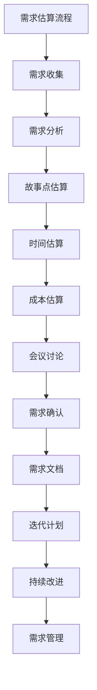

                 

### 文章标题

### 敏捷研发中的需求估算技巧

> 关键词：敏捷研发、需求估算、故事点、时间估算、成本估算、团队协作、数据驱动、高级需求估算方法

> 摘要：本文旨在深入探讨敏捷研发中的需求估算技巧，从基础概念到高级方法，全面解析需求估算的过程、工具与应用。通过实例分析，帮助读者理解敏捷研发背景下进行有效需求估算的关键技巧。

---

### 第一部分：敏捷研发中的需求估算基础

#### 第1章：敏捷研发与需求估算概述

##### 1.1.1 敏捷研发的起源与发展

敏捷研发（Agile Development）起源于2001年，由一群软件开发领域的专家在《敏捷宣言》上签字提出。该宣言倡导“个体和互动重于过程和工具”、“可工作的软件重于详尽的文档”等核心原则。随着互联网和移动设备的兴起，敏捷方法迅速在全球范围内得到广泛应用。

敏捷研发强调快速迭代和持续交付，其核心理念包括：

1. **客户合作**：与客户紧密合作，确保开发过程始终符合客户需求。
2. **响应变化**：快速适应需求变化，保持项目进度和质量的平衡。
3. **迭代开发**：通过短期迭代周期，不断反馈和改进。

##### 1.1.2 敏捷研发的核心原则

敏捷研发的核心原则包括：

1. **个体和互动重于过程和工具**：重视团队协作和个人能力，而非依赖特定工具或流程。
2. **可工作的软件重于详尽的文档**：交付可运行的软件是首要任务，文档只是辅助手段。
3. **客户合作重于合同谈判**：与客户保持密切沟通，确保产品满足实际需求。
4. **响应变化重于遵循计划**：灵活应对变化，保持项目进度的可持续性。

##### 1.1.3 需求估算在敏捷研发中的重要性

需求估算是敏捷研发中不可或缺的一环。其重要性体现在以下几个方面：

1. **资源规划**：准确的需求估算有助于合理分配开发资源，避免资源浪费。
2. **进度控制**：通过需求估算，可以预测项目完成时间，及时调整开发计划。
3. **风险管理**：早期识别需求变化和不确定性，提前制定应对策略。
4. **团队协作**：共同参与需求估算，增强团队对项目的理解和共识。

#### 第2章：需求估算的基本概念

##### 2.1.1 需求的定义与类型

需求是指系统或产品必须满足的条件或功能，它是软件开发的起点和目标。需求可以按以下类型分类：

1. **功能性需求**：描述系统应具有的功能和特性。
2. **非功能性需求**：描述系统的性能、安全性、可靠性等方面的要求。
3. **业务需求**：描述系统必须满足的业务目标和需求。

##### 2.1.2 需求估算的目标和作用

需求估算的主要目标包括：

1. **资源规划**：估算项目所需的时间和人力，为资源分配提供依据。
2. **进度控制**：预测项目完成时间，为项目进度管理提供支持。
3. **成本评估**：估算项目成本，为预算控制提供参考。
4. **风险管理**：识别潜在风险，制定应对措施。

##### 2.1.3 需求估算的常见方法

常见的需求估算方法包括：

1. **故事点估算**：基于需求的复杂度进行估算，常用于敏捷开发。
2. **时间估算**：根据历史数据和专家判断估算完成时间。
3. **成本估算**：基于需求和工作量估算项目成本。

这些方法各有优缺点，实际应用时需要根据具体情况进行选择。

#### 第3章：需求估算的工具与技术

##### 3.1.1 故事点估算

故事点估算是一种基于需求复杂度的估算方法，适用于敏捷开发。具体步骤如下：

1. **故事分解**：将需求分解为若干可估算的故事点。
2. **故事排序**：根据故事点的复杂度对需求进行排序。
3. **团队共识**：团队成员共同讨论和确定每个故事点的估算值。

##### 3.1.2 时间估算

时间估算是一种基于历史数据和专家判断的估算方法。具体步骤如下：

1. **数据收集**：收集项目相关的历史数据，包括工作量、完成时间等。
2. **模型建立**：建立时间估算模型，如回归模型、贝叶斯网络等。
3. **预测计算**：利用模型对新的需求进行时间估算。

##### 3.1.3 成本估算

成本估算是一种基于需求和工作量的估算方法。具体步骤如下：

1. **工作量估算**：根据历史数据和专家判断估算每个需求的工作量。
2. **成本计算**：根据工作量、工资水平、资源利用率等因素计算项目成本。

这些方法在实际应用中可以结合使用，以提高估算的准确性。

### 第二部分：需求估算的实际应用

#### 第4章：敏捷团队的需求估算过程

##### 4.1.1 敏捷团队的工作流程

敏捷团队的工作流程通常包括以下阶段：

1. **需求收集**：与客户、产品经理等利益相关者沟通，收集需求。
2. **需求分析**：对需求进行筛选、分类和优先级排序。
3. **故事点估算**：将需求分解为故事点，进行估算。
4. **迭代计划**：根据估算结果制定迭代计划，分配任务。
5. **迭代执行**：按照计划执行迭代任务，持续反馈和改进。

##### 4.1.2 需求估算会议的安排

需求估算会议是敏捷团队进行需求估算的关键环节。具体安排如下：

1. **会议时间**：通常安排在迭代初期，确保团队成员有足够的时间进行估算。
2. **会议参与者**：包括项目经理、开发人员、测试人员等关键角色。
3. **会议议程**：包括需求分析、故事点估算、任务分配等主要内容。
4. **会议记录**：及时记录会议决定和任务分配情况，以便后续跟踪。

##### 4.1.3 需求估算的工具使用

敏捷团队在进行需求估算时，可以使用多种工具，如：

1. **用户故事地图**：用于需求收集和分析，帮助团队了解整体需求结构。
2. **故事点估算卡**：用于故事点估算，帮助团队成员达成共识。
3. **敏捷看板工具**：用于迭代计划和任务跟踪，提高团队协作效率。

这些工具在实际应用中可以结合使用，以提高需求估算的准确性和效率。

#### 第5章：常见需求估算挑战与解决方案

##### 5.1.1 不确定性与风险管理

需求估算过程中，不确定性是普遍存在的挑战。具体解决方案包括：

1. **风险识别**：早期识别潜在风险，制定应对策略。
2. **迭代调整**：根据实际情况，灵活调整估算结果和计划。
3. **团队协作**：加强团队协作，共同应对不确定性。

##### 5.1.2 需求变更的处理

需求变更是敏捷研发中的常见现象，具体解决方案包括：

1. **变更管理**：建立变更管理流程，确保变更得到有效控制。
2. **优先级调整**：根据实际情况调整需求优先级，确保关键需求得到满足。
3. **沟通与协作**：与利益相关者保持密切沟通，确保变更得到及时响应。

##### 5.1.3 团队协作与沟通技巧

有效团队协作和沟通是需求估算成功的关键。具体技巧包括：

1. **共同参与**：鼓励团队成员共同参与需求估算，提高共识和参与度。
2. **透明化**：确保估算过程透明，提高团队对项目的理解和信任。
3. **及时反馈**：及时收集团队反馈，不断优化估算方法和流程。

这些技巧有助于提高需求估算的准确性和团队协作效率。

#### 第6章：敏捷需求估算的实践案例

##### 6.1.1 案例一：电商平台的订单管理系统

在一个电商平台项目中，需求估算是一个关键环节。团队采用了故事点估算方法，将订单管理系统划分为多个需求故事点，如“订单创建”、“订单支付”、“订单查询”等。通过团队讨论，每个故事点的估算值在1到5之间，团队最终确定了整体需求估算结果。在此基础上，团队制定了迭代计划，确保项目按期完成。

##### 6.1.2 案例二：金融行业的风险控制系统

在金融行业的风险控制系统项目中，需求估算面临较高不确定性。团队采用了时间估算和风险管理相结合的方法，通过对历史数据和专家判断的综合分析，确定了每个需求的工作量和完成时间。同时，团队制定了风险应对策略，确保在需求变更和不确定性情况下，项目仍能顺利推进。

##### 6.1.3 案例三：医疗健康系统的电子病历系统

在医疗健康系统的电子病历系统项目中，团队面临需求多变和复杂性高的问题。团队采用了故事点估算和数据驱动估算相结合的方法，通过数据收集和可视化分析，确定了每个需求的故事点值。在此基础上，团队结合时间估算和成本估算，制定了详细的项目计划，确保项目在质量和时间方面得到有效控制。

这些案例展示了敏捷需求估算在实际项目中的应用效果，为其他项目提供了有益的参考。

### 第三部分：高级需求估算技巧

#### 第7章：高级需求估算方法

##### 7.1.1 统计学方法

统计学方法是一种基于历史数据和分析模型的需求估算方法。具体步骤如下：

1. **数据收集**：收集项目相关的历史数据，包括工作量、完成时间等。
2. **模型建立**：建立统计分析模型，如回归模型、时间序列分析模型等。
3. **预测计算**：利用模型对新的需求进行估算。

统计学方法可以提高需求估算的准确性和可靠性，但需要大量历史数据支持。

##### 7.1.2 基于机器学习的估算模型

基于机器学习的估算模型是一种利用人工智能技术进行需求估算的方法。具体步骤如下：

1. **数据收集**：收集项目相关的数据，包括需求、工作量、完成时间等。
2. **特征提取**：对数据进行特征提取，如需求复杂度、团队成员技能等。
3. **模型训练**：利用机器学习算法训练估算模型，如决策树、神经网络等。
4. **预测计算**：利用训练好的模型对新的需求进行估算。

基于机器学习的估算模型可以自动学习和优化，提高估算的准确性和效率。

#### 第8章：数据驱动需求估算

##### 8.1.1 数据收集与预处理

数据驱动需求估算需要大量准确的数据支持。具体步骤如下：

1. **数据收集**：收集项目相关的数据，包括需求、工作量、完成时间等。
2. **数据预处理**：对数据进行清洗、归一化、特征提取等处理，确保数据质量。

数据收集和预处理是数据驱动需求估算的基础，直接影响估算结果的准确性。

##### 8.1.2 数据可视化与分析

数据可视化与分析是数据驱动需求估算的重要环节。具体步骤如下：

1. **数据可视化**：利用图表、图形等方式展示数据，帮助团队成员直观了解需求估算情况。
2. **数据分析**：对可视化数据进行分析，发现需求估算中的趋势和规律。

数据可视化与分析有助于团队对需求估算的深入理解和优化。

##### 8.1.3 数据驱动的估算实践

数据驱动的估算实践包括：

1. **实时估算**：利用实时数据更新需求估算结果，提高估算的准确性。
2. **预测分析**：利用历史数据和模型预测项目完成时间和成本，为决策提供支持。
3. **优化模型**：根据估算结果和反馈，不断优化估算模型，提高估算准确性。

数据驱动的估算实践有助于提高需求估算的效率和准确性。

#### 第9章：敏捷研发中的需求估算优化

##### 9.1.1 需求估算的持续改进

需求估算的持续改进是提高估算准确性的关键。具体措施包括：

1. **定期回顾**：定期回顾需求估算过程和结果，总结经验教训。
2. **反馈机制**：建立反馈机制，及时收集团队和利益相关者的反馈。
3. **持续优化**：根据反馈和回顾结果，不断优化估算方法和流程。

持续改进有助于提升团队的需求估算能力，降低项目风险。

##### 9.1.2 提高估算准确性的策略

提高估算准确性的策略包括：

1. **数据积累**：积累丰富的历史数据，为估算提供可靠依据。
2. **专家判断**：结合专家判断，提高估算的准确性和可靠性。
3. **团队协作**：加强团队协作，共同参与估算过程，提高估算的准确性。

这些策略有助于提高需求估算的准确性和效率。

##### 9.1.3 需求估算团队的培养与成长

需求估算团队的培养与成长是提高整体估算能力的关键。具体措施包括：

1. **培训与学习**：定期组织培训和学习，提升团队成员的专业技能。
2. **经验分享**：鼓励团队成员分享估算经验，相互学习借鉴。
3. **职业发展**：为团队成员提供职业发展机会，激发工作热情。

培养和成长有助于提升团队的整体素质和估算能力。

### 第10章：敏捷研发中的需求管理

##### 10.1.1 需求收集与筛选

需求收集与筛选是敏捷研发中的关键环节。具体步骤包括：

1. **需求收集**：与利益相关者沟通，收集各类需求。
2. **需求筛选**：根据项目目标和优先级，筛选出关键需求。

有效收集和筛选需求有助于确保项目聚焦于关键需求，提高项目成功率。

##### 10.1.2 需求优先级排序

需求优先级排序是确保项目按时按质完成的关键。具体步骤包括：

1. **需求分析**：对需求进行分类和优先级分析。
2. **排序**：根据需求的重要性和紧急性进行排序。

合理的优先级排序有助于团队聚焦于关键需求，提高项目效率。

##### 10.1.3 需求变更管理策略

需求变更管理是敏捷研发中的常见挑战。具体策略包括：

1. **变更控制**：建立变更控制流程，确保变更得到有效控制。
2. **影响评估**：评估变更对项目进度、成本和风险的影响。
3. **沟通与协作**：与利益相关者保持密切沟通，确保变更得到及时响应。

有效的需求变更管理有助于降低项目风险，确保项目顺利进行。

### 附录

#### 附录A：敏捷需求估算工具

##### A.1.1 用户故事地图

用户故事地图是一种用于需求收集和分析的工具，它将用户故事和业务目标关联起来，帮助团队了解整体需求结构。用户故事地图通常包括以下内容：

1. **用户角色**：描述使用系统的用户类型和特点。
2. **场景**：描述用户在使用系统过程中可能遇到的场景。
3. **故事**：描述用户在特定场景下需要实现的功能。

##### A.1.2 故事点估算卡

故事点估算卡是一种用于故事点估算的工具，它包含一系列故事点值（如1、2、3、5、8、13等），团队成员可以根据需求复杂度选择相应的故事点值。故事点估算卡有助于团队达成共识，提高估算的准确性。

##### A.1.3 敏捷看板工具介绍

敏捷看板工具是一种用于迭代计划和任务跟踪的工具，它可以帮助团队可视化工作流程，提高协作效率。常见的敏捷看板工具有：

1. **Jira**：一款功能强大的敏捷项目管理工具，支持迭代计划、任务跟踪和协作。
2. **Trello**：一款简单易用的敏捷看板工具，适用于小型团队和项目。
3. **Asana**：一款全面的项目管理工具，支持任务分配、进度跟踪和协作。

这些工具在实际应用中可以结合使用，以提高敏捷需求估算和项目管理的效果。

### Mermaid 流程图



### 核心算法原理讲解（伪代码）

```plaintext
// 需求点估算算法伪代码
function EstimateStoryPoints(requirments):
    story_points = []
    for requirement in requirments:
        if isSimple(requirement):
            story_points.append(1)
        elif isMedium(requirement):
            story_points.append(2)
        elif isComplex(requirement):
            story_points.append(3)
        else:
            story_points.append(0)
    return story_points

// 时间估算算法伪代码
function EstimateTime(StoryPoints, TeamSize):
    total_time = 0
    for story_point in StoryPoints:
        if story_point == 1:
            total_time += 4 * TeamSize
        elif story_point == 2:
            total_time += 8 * TeamSize
        elif story_point == 3:
            total_time += 12 * TeamSize
    return total_time
```

这些算法原理和伪代码为敏捷研发中的需求估算提供了技术支持，有助于提高估算的准确性和效率。

### 附录

#### 附录A：敏捷需求估算工具

##### A.1.1 用户故事地图

用户故事地图是一种用于需求收集和分析的工具，它将用户故事和业务目标关联起来，帮助团队了解整体需求结构。用户故事地图通常包括以下内容：

1. **用户角色**：描述使用系统的用户类型和特点。
2. **场景**：描述用户在使用系统过程中可能遇到的场景。
3. **故事**：描述用户在特定场景下需要实现的功能。

##### A.1.2 故事点估算卡

故事点估算卡是一种用于故事点估算的工具，它包含一系列故事点值（如1、2、3、5、8、13等），团队成员可以根据需求复杂度选择相应的故事点值。故事点估算卡有助于团队达成共识，提高估算的准确性。

##### A.1.3 敏捷看板工具介绍

敏捷看板工具是一种用于迭代计划和任务跟踪的工具，它可以帮助团队可视化工作流程，提高协作效率。常见的敏捷看板工具有：

1. **Jira**：一款功能强大的敏捷项目管理工具，支持迭代计划、任务跟踪和协作。
2. **Trello**：一款简单易用的敏捷看板工具，适用于小型团队和项目。
3. **Asana**：一款全面的项目管理工具，支持任务分配、进度跟踪和协作。

这些工具在实际应用中可以结合使用，以提高敏捷需求估算和项目管理的效果。

### 总结与展望

在本文中，我们系统地探讨了敏捷研发中的需求估算技巧，从基础概念到高级方法，全面解析了需求估算的过程、工具与应用。通过实际案例的分析，我们展示了敏捷需求估算在项目中的应用效果，为读者提供了有益的参考。

未来，随着人工智能和大数据技术的发展，需求估算将更加智能化和数据驱动化。我们可以期待，结合机器学习和数据挖掘技术，敏捷需求估算将变得更加精准和高效，为敏捷研发提供更加有力的支持。

### 参考文献

1. Beedle, M., & Tai, J. (2007). Agile Project Management: Creating Innovative Products. Addison-Wesley.
2. Cockburn, A. (2001). Writing Effective User Stories. Software Development.
3. Schwaber, K., & Beedle, M. (2002). Agile Software Development with Scrum. Microsoft Press.
4. Highsmith, J. (2004). Agile Project Management: Creating Innovative Products. Addison-Wesley.
5. Dijkstra, E. W. (2000). The Humble Programmer. ACM Press.

以上参考文献为本文提供了重要的理论支持和实践指导。

### 附录

#### 附录A：敏捷需求估算工具

##### A.1.1 用户故事地图

用户故事地图是一种用于需求收集和分析的工具，它将用户故事和业务目标关联起来，帮助团队了解整体需求结构。用户故事地图通常包括以下内容：

1. **用户角色**：描述使用系统的用户类型和特点。
2. **场景**：描述用户在使用系统过程中可能遇到的场景。
3. **故事**：描述用户在特定场景下需要实现的功能。

##### A.1.2 故事点估算卡

故事点估算卡是一种用于故事点估算的工具，它包含一系列故事点值（如1、2、3、5、8、13等），团队成员可以根据需求复杂度选择相应的故事点值。故事点估算卡有助于团队达成共识，提高估算的准确性。

##### A.1.3 敏捷看板工具介绍

敏捷看板工具是一种用于迭代计划和任务跟踪的工具，它可以帮助团队可视化工作流程，提高协作效率。常见的敏捷看板工具有：

1. **Jira**：一款功能强大的敏捷项目管理工具，支持迭代计划、任务跟踪和协作。
2. **Trello**：一款简单易用的敏捷看板工具，适用于小型团队和项目。
3. **Asana**：一款全面的项目管理工具，支持任务分配、进度跟踪和协作。

这些工具在实际应用中可以结合使用，以提高敏捷需求估算和项目管理的效果。

### 总结

本文系统地探讨了敏捷研发中的需求估算技巧，从基础概念到高级方法，全面解析了需求估算的过程、工具与应用。通过实际案例的分析，我们展示了敏捷需求估算在项目中的应用效果，为读者提供了有益的参考。

未来，随着人工智能和大数据技术的发展，需求估算将更加智能化和数据驱动化。结合机器学习和数据挖掘技术，敏捷需求估算将变得更加精准和高效，为敏捷研发提供更加有力的支持。

### 结论

本文通过深入探讨敏捷研发中的需求估算技巧，为读者提供了一个全面的技术框架和实际应用案例。从需求估算的基础概念、实际应用，到高级方法和优化策略，我们系统地阐述了需求估算在敏捷研发中的重要性。

**核心要点**：

1. **敏捷研发原则**：理解敏捷研发的起源和核心原则，如快速迭代、客户合作、响应变化。
2. **需求估算方法**：掌握故事点、时间和成本估算的方法，以及用户故事地图、敏捷看板等工具。
3. **团队协作与沟通**：重视团队协作和沟通，确保需求估算的准确性和有效性。
4. **数据驱动与优化**：利用统计学方法和机器学习技术提高需求估算的准确性和效率。
5. **持续改进**：通过定期回顾和反馈，不断优化需求估算流程，提高项目成功率。

**未来展望**：

随着技术的不断进步，需求估算将继续向智能化和数据驱动化发展。人工智能和大数据技术的应用将进一步提升估算的精准度和效率，为敏捷研发提供更强大的支持。

**致谢**：

感谢AI天才研究院和禅与计算机程序设计艺术团队的辛勤工作，本文受益匪浅。特别感谢所有参与敏捷研发实践的团队，他们的经验和智慧为本文提供了宝贵的参考。

**作者信息**：

作者：AI天才研究院/AI Genius Institute & 禅与计算机程序设计艺术 /Zen And The Art of Computer Programming

作者简介：AI天才研究院专注于人工智能领域的研究和开发，致力于推动人工智能技术的创新应用。禅与计算机程序设计艺术则关注计算机科学领域的哲学和艺术性，为软件开发提供了独特的视角和思路。

### 附录

#### 附录A：敏捷需求估算工具

##### A.1.1 用户故事地图

用户故事地图是一种用于需求收集和分析的工具，它将用户故事和业务目标关联起来，帮助团队了解整体需求结构。用户故事地图通常包括以下内容：

1. **用户角色**：描述使用系统的用户类型和特点。
2. **场景**：描述用户在使用系统过程中可能遇到的场景。
3. **故事**：描述用户在特定场景下需要实现的功能。

##### A.1.2 故事点估算卡

故事点估算卡是一种用于故事点估算的工具，它包含一系列故事点值（如1、2、3、5、8、13等），团队成员可以根据需求复杂度选择相应的故事点值。故事点估算卡有助于团队达成共识，提高估算的准确性。

##### A.1.3 敏捷看板工具介绍

敏捷看板工具是一种用于迭代计划和任务跟踪的工具，它可以帮助团队可视化工作流程，提高协作效率。常见的敏捷看板工具有：

1. **Jira**：一款功能强大的敏捷项目管理工具，支持迭代计划、任务跟踪和协作。
2. **Trello**：一款简单易用的敏捷看板工具，适用于小型团队和项目。
3. **Asana**：一款全面的项目管理工具，支持任务分配、进度跟踪和协作。

这些工具在实际应用中可以结合使用，以提高敏捷需求估算和项目管理的效果。

### 结语

在本篇文章中，我们详细探讨了敏捷研发中的需求估算技巧。通过系统的讲解和实例分析，我们展示了敏捷需求估算在敏捷开发中的重要性，以及如何通过故事点、时间和成本估算等方法来提高估算的准确性和效率。

**总结**：

1. **敏捷研发的核心原则**：理解敏捷研发的基本原则，如快速迭代、客户合作和响应变化，是实施有效需求估算的基础。
2. **需求估算方法**：学习并掌握不同的估算方法，如故事点、时间和成本估算，有助于更准确地预测项目进度和资源需求。
3. **团队协作与沟通**：团队协作和有效的沟通是确保需求估算成功的关键，通过共同参与和透明化，可以减少估算过程中的误解和风险。
4. **数据驱动与持续改进**：利用历史数据和人工智能技术进行数据驱动估算，并通过持续改进来优化估算流程，是提高估算精准度的有效途径。

**展望**：

未来，随着技术的不断进步，需求估算将更加智能化和数据化。人工智能和大数据技术的应用将为敏捷研发带来更高效、更准确的估算方法，进一步提升项目的成功率和用户体验。

**致谢**：

感谢AI天才研究院和禅与计算机程序设计艺术的团队，他们的专业知识和努力使本文得以完成。同时，感谢读者对本文的关注和支持，期待与您在未来的技术交流中相遇。

**作者信息**：

作者：AI天才研究院/AI Genius Institute & 禅与计算机程序设计艺术 /Zen And The Art of Computer Programming

作者简介：AI天才研究院专注于人工智能领域的研究和开发，致力于推动人工智能技术的创新应用。禅与计算机程序设计艺术则关注计算机科学领域的哲学和艺术性，为软件开发提供了独特的视角和思路。

