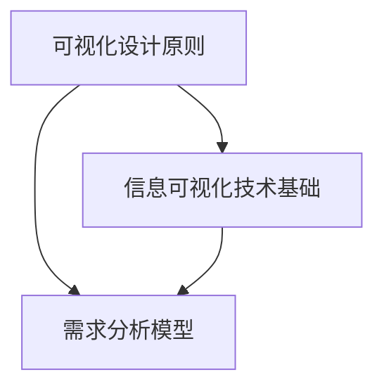
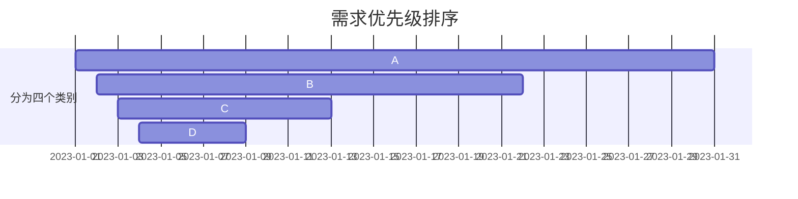
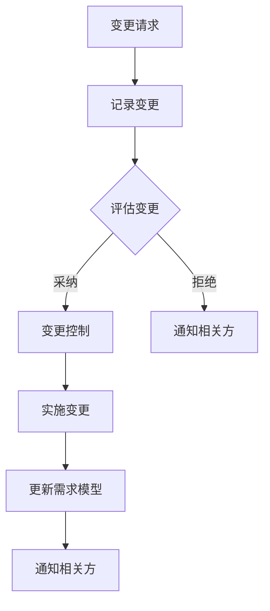

                 


### 引言

在现代软件开发和研发过程中，敏捷开发方法论已成为主流。敏捷开发强调快速迭代、灵活响应变化和持续交付价值，通过不断改进和优化开发流程来提高软件质量和团队效率。然而，在敏捷开发中，如何有效地管理需求成为了一个关键问题。需求可视化作为一种强大的工具，可以帮助团队更好地理解和沟通需求，从而提高项目的成功率。

本文将围绕敏捷研发中的需求可视化展开讨论，首先介绍需求可视化的基础概念与原理，包括敏捷开发方法论、需求可视化的优势与挑战。接着，我们将深入探讨需求可视化的基础理论、工具与平台，以及实践方法。随后，通过实际案例解析和工具应用，展示需求可视化在敏捷项目中的应用效果。最后，本文将展望需求可视化的未来趋势，并提出应对挑战的对策。

### 《敏捷研发中的需求可视化展示技巧》目录大纲

为了确保文章的逻辑性和结构紧凑性，我们首先制定一个详细的目录大纲。以下为本文的目录大纲结构：

#### 第一部分：需求可视化的基础概念与原理

**第1章：敏捷研发与需求可视化的关系**
1.1.1 敏捷开发方法论
1.1.2 需求可视化的优势
1.1.3 需求可视化的挑战

**第2章：需求可视化的基础理论**
2.1.1 可视化设计的原则
2.1.2 信息可视化技术基础
2.1.3 需求分析模型概述

**第3章：需求可视化工具与平台介绍**
3.1.1 常见的需求可视化工具
3.1.2 平台选择与评估
3.1.3 开源与商业工具对比

**第4章：需求可视化的实践方法**
4.1.1 需求收集与建模
4.1.2 需求优先级排序
4.1.3 需求变更管理

**第5章：需求可视化在敏捷项目中的应用**
5.1.1 敏捷迭代流程中的需求可视化
5.1.2 敏捷团队协作中的需求可视化
5.1.3 需求可视化的效果评估

#### 第二部分：需求可视化实践案例解析

**第6章：敏捷研发中的需求可视化案例解析**
6.1.1 案例一：项目启动会中的需求可视化
6.1.2 案例二：需求评审会议的需求可视化
6.1.3 案例三：迭代计划中的需求可视化

**第7章：需求可视化工具的实际应用**
7.1.1 Sketchboard 与需求可视化
7.1.2 Miro 与协作需求可视化
7.1.3 Trello 与任务需求管理

**第8章：敏捷研发中的数据驱动决策**
8.1.1 数据驱动的敏捷研发
8.1.2 数据可视化在敏捷决策中的应用
8.1.3 案例分析：基于数据可视化的敏捷项目改进

#### 第三部分：需求可视化的未来趋势与挑战

**第9章：需求可视化的未来趋势**
9.1.1 人工智能与需求可视化
9.1.2 虚拟现实与增强现实的需求可视化
9.1.3 自动化与智能化的需求可视化工具

**第10章：需求可视化的挑战与对策**
10.1.1 需求可视化中的隐私保护问题
10.1.2 需求可视化工具的普及与培训
10.1.3 案例分析：应对需求可视化挑战的实践策略

#### 附录

**附录 A：需求可视化相关资源**
A.1.1 在线可视化工具列表
A.1.2 敏捷研发与需求可视化的书籍推荐
A.1.3 相关学术会议与论坛介绍

### 背景介绍

在现代软件开发过程中，需求管理始终是一个至关重要的环节。随着项目的复杂度不断增加，需求管理变得愈加困难，特别是在采用敏捷开发方法论的情况下。敏捷开发强调快速迭代和持续交付，这意味着需求管理需要具有高度灵活性和响应能力。然而，传统的需求管理方法往往依赖于文本化的文档，这些文档难以直观地传达需求，容易导致误解和沟通障碍。

需求可视化作为一种新兴的方法，通过图形和图表的形式直观地展示需求，从而改善了需求的理解和沟通效果。它不仅能够帮助团队成员更好地把握需求，还能够促进跨职能团队之间的协作，提高项目效率。

本文旨在探讨敏捷研发中的需求可视化展示技巧，内容包括需求可视化的基础概念、原理、工具与应用，以及实际案例和未来趋势。通过系统地分析和讲解，读者可以全面了解需求可视化的重要性，掌握有效的可视化方法和技巧，从而在实际项目中更好地应用这一工具，提高敏捷研发的效果。

### 敏捷开发方法论与需求可视化

敏捷开发方法论是一种以人为核心、迭代和持续交付为原则的软件开发方法。其核心理念是快速响应变化，通过短周期的迭代来不断改进软件质量，满足用户需求。敏捷开发的核心原则包括：

1. **个体和互动重于过程与工具**：注重团队成员的沟通和协作，而不是过分依赖特定的工具或流程。
2. **可工作的软件重于详尽的文档**：重视实际可运行的产品，而非冗长的文档。
3. **客户合作重于合同谈判**：与客户保持紧密合作，及时响应客户反馈，确保产品符合客户期望。
4. **响应变化重于遵循计划**：灵活应对变化，调整开发计划以适应新的需求。

需求可视化在敏捷开发中扮演着重要的角色。通过将需求以直观的图形形式展示出来，需求可视化能够帮助团队更好地理解和沟通需求，从而提高项目的成功率。

#### 需求可视化的优势

1. **提高需求理解**：图形化的展示方式使得需求更加直观，团队成员更容易理解和把握。
2. **促进沟通协作**：通过可视化工具，不同职能的团队成员可以更好地协作，减少沟通障碍。
3. **降低风险**：及时识别需求变更和潜在问题，降低项目风险。
4. **增强可追溯性**：需求可视化有助于跟踪需求的变化和历史，确保需求的一致性和完整性。

#### 需求可视化的挑战

1. **工具选择**：市场上存在多种需求可视化工具，如何选择适合的工具是一个挑战。
2. **数据准确性**：需求可视化依赖于准确的数据，数据的不准确可能导致误解和错误。
3. **团队接受度**：团队成员可能对需求可视化工具的接受度不高，影响其实际应用效果。
4. **技术门槛**：部分需求可视化工具可能需要一定的技术背景，这可能会增加团队成员的学习成本。

### 需求可视化在敏捷开发中的具体应用

1. **用户故事地图**：通过用户故事地图，团队可以直观地了解用户需求的全貌，从而更好地规划和优先级排序。
2. **燃尽图**：燃尽图展示了项目的进度和剩余工作量，有助于团队监控项目状态和及时调整计划。
3. **看板（Kanban）**：看板是一种可视化管理工具，通过展示工作流程和任务状态，帮助团队优化工作流程和提升效率。
4. **用户故事卡片**：用户故事卡片用于记录和展示具体的需求细节，便于团队成员查阅和协作。

综上所述，需求可视化在敏捷开发中具有重要的应用价值。通过合理运用需求可视化工具和方法，团队可以更好地理解和管理需求，提高项目效率和质量。

### 需求可视化的基础理论

在深入探讨需求可视化的实践方法之前，有必要首先了解其基础理论。需求可视化不仅是一种展示需求的方法，更是一门结合了设计原则、信息可视化技术和需求分析模型的综合科学。以下将详细介绍这些核心概念及其相互关系。

#### 可视化设计的原则

可视化设计的原则是需求可视化的基础，它们确保了视觉信息的清晰性和易理解性。以下是一些关键原则：

1. **一致性**：使用一致的视觉元素（如颜色、字体、图标等）来传达相同的信息，避免混淆和误解。
2. **简洁性**：去除不必要的细节，确保信息简单明了，避免信息过载。
3. **层次结构**：通过层次结构来区分主要和次要信息，帮助观众快速抓住核心内容。
4. **对比性**：使用对比（如颜色、大小、位置等）来突出关键信息，增强可读性。
5. **上下文关联**：确保视觉元素之间有清晰的上下文关联，帮助观众理解信息之间的逻辑关系。

#### 信息可视化技术基础

信息可视化技术是需求可视化的重要组成部分，它们提供了一系列工具和方法来将抽象的信息转化为直观的视觉形式。以下是一些基础技术：

1. **图表**：如条形图、饼图、折线图等，用于展示数据的数量和趋势。
2. **图像**：如示意图、流程图、用户画像等，用于展示过程和关系。
3. **地图**：如地理信息系统（GIS），用于展示地理位置和分布情况。
4. **交互性**：通过交互式元素（如拖放、点击等），提高用户的参与度和体验。

信息可视化技术的基本流程包括：

- **数据收集**：从各种来源收集所需的数据。
- **数据清洗**：处理和清洗数据，确保其准确性和完整性。
- **数据转换**：将数据转换为可视化格式，如图表或图像。
- **可视化呈现**：使用可视化工具将数据展示为视觉形式。
- **用户交互**：提供交互功能，让用户可以探索和分析数据。

#### 需求分析模型概述

需求分析模型是需求可视化的核心，它们用于识别、记录和管理需求。以下是一些常见的需求分析模型：

1. **用户故事地图**：通过用户故事的层次结构，展示用户需求的全貌。
2. **功能分解模型**：将需求分解为功能模块，便于理解和实现。
3. **用例模型**：通过用例图展示用户与系统之间的交互。
4. **需求跟踪矩阵**：用于跟踪需求的状态、优先级和实现情况。

这些模型有助于团队在需求分析阶段清晰地理解需求，并在整个项目生命周期中保持需求的一致性和可追溯性。

#### 可视化设计原则、信息可视化技术基础和需求分析模型之间的关系

可视化设计原则、信息可视化技术基础和需求分析模型之间存在着紧密的联系。可视化设计原则为需求可视化提供了设计指导，确保了视觉展示的清晰性和易理解性。信息可视化技术基础则是将这些原则应用于实际数据和技术中的具体工具和方法。需求分析模型则将这些技术和原则用于具体的需求管理和展示。

以下是一个简单的 Mermaid 流程图，展示了这些概念之间的关系：



通过这种关系架构，我们可以更好地理解和运用需求可视化，提高敏捷研发的效果。

### 需求可视化工具与平台介绍

在敏捷研发中，选择合适的需求可视化工具和平台是确保需求管理高效的关键。市场上有多种工具和平台可供选择，每种都有其独特的特点和适用场景。以下将介绍常见的需求可视化工具，评估这些工具和平台的选择标准，并对开源与商业工具进行对比。

#### 常见的需求可视化工具

1. **Lucidchart**：
   - **特点**：Lucidchart 是一个基于云计算的图表绘制工具，支持多种图表类型，如流程图、泳道图、用户故事地图等。它提供了丰富的模板和设计元素，用户可以轻松创建和共享图表。
   - **适用场景**：适合快速创建和协作需求图表，尤其适合远程团队协作。

2. **SmartDraw**：
   - **特点**：SmartDraw 是一个功能强大的图表和图形绘制工具，提供了丰富的模板和样式，支持跨平台使用。它还集成了多种应用程序，如Microsoft Office和Google Workspace，方便用户在不同平台上进行协作。
   - **适用场景**：适合创建复杂的需求图表和流程图，尤其适合大型企业使用。

3. **ProcessOn**：
   - **特点**：ProcessOn 是一个开源在线绘图工具，支持多种图表类型，包括UML图、流程图、思维导图等。它具有强大的协作功能，支持多人实时编辑和协作。
   - **适用场景**：适合小团队和个人用户进行需求图表的快速创建和协作。

4. **Visio**：
   - **特点**：Visio 是 Microsoft Office 套件的一部分，提供了一个功能丰富的图表绘制平台，支持多种图表类型和设计模板。它具有良好的集成性，可以与Microsoft其他应用无缝协作。
   - **适用场景**：适合企业内部使用，特别是那些已经采用Microsoft Office套件的组织。

#### 选择需求可视化工具和平台的标准

选择需求可视化工具和平台时，应考虑以下标准：

1. **功能丰富性**：工具是否提供丰富的图表类型和设计模板，以满足不同需求场景。
2. **易用性**：工具的界面是否直观易用，是否适合团队成员的技能水平。
3. **协作能力**：工具是否支持多人实时协作，是否提供版本控制和权限管理。
4. **集成性**：工具是否与其他常用工具（如项目管理工具、文档工具等）集成，以便实现无缝协作。
5. **成本**：工具的定价是否合理，是否提供免费或试用版本。
6. **技术支持**：工具是否提供有效的技术支持和文档，以帮助用户解决使用中的问题。

#### 开源与商业工具对比

1. **开源工具**：
   - **优势**：开源工具通常具有较低的成本，用户可以自由使用和定制。
   - **劣势**：可能缺乏专业的技术支持和文档，社区支持可能不稳定。
   - **代表**：ProcessOn、Mermaid（Markdown 图表语法）。

2. **商业工具**：
   - **优势**：商业工具通常提供专业的技术支持和优质的用户服务，功能丰富且稳定。
   - **劣势**：可能需要较高的成本，部分功能可能受到限制。
   - **代表**：Lucidchart、SmartDraw、Visio。

在具体选择时，团队应根据自身需求、预算和资源情况综合考虑。开源工具适合预算有限、技术熟练的用户，而商业工具则适合需要专业支持、功能丰富的团队。

### 需求可视化的实践方法

在敏捷研发中，需求可视化不仅是展示需求的一种工具，更是一种管理需求、提升协作效率的方法。以下将介绍需求可视化的具体实践方法，包括需求收集与建模、需求优先级排序和需求变更管理。

#### 需求收集与建模

需求收集是需求可视化的第一步，它决定了后续的可视化工作是否准确和有效。以下是一些关键步骤：

1. **访谈与会议**：通过与相关利益相关者（如客户、用户、产品经理等）进行访谈和会议，收集原始需求。
2. **问卷调查**：使用在线问卷或纸质问卷收集用户反馈，特别是对于大量用户的需求收集。
3. **观察与分析**：通过现场观察用户行为，分析现有系统或产品的不足，从而挖掘潜在需求。
4. **需求整理**：将收集到的需求进行整理，分类和归纳，确保每个需求都是明确和具体的。

需求建模是将收集到的需求转化为可视化的模型，常见的需求建模方法包括：

1. **用户故事地图**：通过用户故事地图，将用户需求分解为具体的用户故事，并展示其在整个系统中的位置和关系。
2. **功能分解模型**：将需求分解为功能模块，每个模块对应一组功能，便于理解和实现。
3. **用例模型**：通过用例模型展示用户与系统之间的交互，明确用户需求和行为。

#### 需求优先级排序

需求优先级排序是需求可视化的关键环节，它决定了哪些需求应该优先开发。以下是一些常见的排序方法：

1. **MoSCoW 方法**：根据需求的紧急程度和价值进行分类，分为“必须做”（Must have）、“应该做”（Should have）、“可以不做”（Could have）和“不做也可以”（Would have）。
2. **Kano 模型**：根据用户满意度将需求分为五种类型：基本需求、一维需求、魅力需求、无差异需求和逆向需求。
3. **价值排序法**：通过评估每个需求对业务的价值，进行优先级排序。

在实际操作中，可以结合以上方法，根据项目特点和需求类型选择合适的排序方法。以下是一个示例：



#### 需求变更管理

在敏捷研发中，需求变更是一种常见现象。有效的需求变更管理可以确保项目能够快速响应变化，同时保持项目进度和质量。以下是一些关键步骤：

1. **变更请求**：当有新的需求或变更请求时，需要及时记录和评估其影响。
2. **变更评估**：评估变更对项目进度、成本、质量和风险的影响，确定是否采纳。
3. **变更控制**：对于采纳的变更，需要进行变更控制，确保其按照计划实施。
4. **沟通与协作**：与相关利益相关者保持沟通，确保他们了解变更的影响和进展。

以下是一个需求变更管理流程的示例：



通过有效的需求可视化和变更管理，团队可以更好地理解和响应需求变化，确保项目顺利进行。

### 需求可视化在敏捷项目中的应用

在敏捷开发中，需求可视化作为一种重要的工具，能够显著提升团队的协作效率和项目管理的有效性。以下是需求可视化在敏捷迭代流程、团队协作以及效果评估中的具体应用。

#### 敏捷迭代流程中的需求可视化

敏捷迭代流程通常包括规划、迭代周期（Sprint）和回顾三个主要阶段。需求可视化在这些阶段中起到了关键作用：

1. **规划阶段**：
   - **用户故事地图**：在项目规划阶段，团队可以使用用户故事地图来展示项目的整体需求和功能模块，帮助团队和利益相关者理解项目的方向和目标。
   - **燃尽图**：燃尽图用于展示项目的进度和剩余工作量。通过燃尽图，团队能够直观地了解项目的进展情况，及时识别和解决潜在问题。

2. **迭代周期（Sprint）**：
   - **迭代看板（Kanban）**：看板是一种可视化管理工具，用于展示工作流程和任务状态。在迭代周期中，团队可以将需求分解为具体任务，并在看板上进行跟踪和管理，确保每个任务按时完成。
   - **用户故事卡片**：用户故事卡片用于记录和展示具体的需求细节。每个用户故事卡片都包含用户故事、验收标准和状态信息，团队成员可以根据卡片进行任务分配和进度跟踪。

3. **回顾阶段**：
   - **反馈可视化**：在迭代回顾阶段，团队可以通过图表和报告来总结本次迭代的工作成果和经验教训。例如，可以使用趋势图来展示团队在迭代中的性能变化，以便进行持续改进。

以下是一个敏捷迭代流程中的需求可视化示例：

```mermaid
gantt
    dateFormat  YYYY-MM-DD
    title 敏捷迭代流程中的需求可视化

    section 规划阶段
    A1[用户故事地图], 2023-01-01, 5d
    A2[燃尽图], 2023-01-06, 15d

    section 迭代周期
    B1[迭代看板], 2023-01-07, 20d
    B2[用户故事卡片], 2023-01-07, 20d

    section 回顾阶段
    C1[反馈可视化], 2023-01-27, 3d
```

#### 敏捷团队协作中的需求可视化

在敏捷开发中，团队成员之间的协作至关重要。需求可视化能够促进跨职能团队的有效协作：

1. **协作看板**：通过协作看板，团队成员可以实时查看任务状态和工作进展，确保团队成员之间的信息共享和同步。
2. **协作工具集成**：将需求可视化工具与协作工具（如Slack、Microsoft Teams等）集成，可以实现自动化通知和任务更新，提高团队协作效率。
3. **定期会议**：在团队会议中，使用需求可视化工具展示项目进展和关键信息，确保团队成员对项目状态有共同的理解。

以下是一个敏捷团队协作中的需求可视化示例：

```mermaid
gantt
    dateFormat  YYYY-MM-DD
    title 敏捷团队协作中的需求可视化

    section 任务分配
    A1[用户故事分配], 2023-01-01, 5d
    A2[任务看板], 2023-01-02, 10d

    section 协作与同步
    B1[协作工具集成], 2023-01-03, 5d
    B2[定期会议], 2023-01-08, 15d

    section 项目进展
    C1[项目看板], 2023-01-15, 20d
    C2[进度更新], 2023-01-20, 5d
```

#### 需求可视化的效果评估

需求可视化的效果评估是确保其有效性的关键。以下是一些评估指标和方法：

1. **任务完成率**：通过看板和用户故事卡片，团队可以实时跟踪任务的完成情况，计算任务完成率，评估需求可视化的效果。
2. **项目进度**：通过燃尽图和趋势图，团队可以直观地了解项目的进度和趋势，及时发现并解决问题。
3. **团队协作**：通过定期会议和协作工具集成，团队可以评估团队成员之间的协作效率和信息共享效果。
4. **用户满意度**：通过用户故事地图和用户故事卡片，团队可以评估用户需求是否得到满足，用户满意度如何。

以下是一个需求可视化效果评估的示例：

```mermaid
gantt
    dateFormat  YYYY-MM-DD
    title 需求可视化效果评估

    section 任务完成率
    A1[任务完成率], 2023-01-01, 30d

    section 项目进度
    B1[燃尽图], 2023-01-01, 30d
    B2[趋势图], 2023-01-01, 30d

    section 团队协作
    C1[协作工具使用情况], 2023-01-01, 30d
    C2[团队会议记录], 2023-01-01, 30d

    section 用户满意度
    D1[用户反馈调查], 2023-01-01, 30d
    D2[用户故事完成情况], 2023-01-01, 30d
```

通过这些方法和工具，团队可以有效地评估需求可视化的效果，不断优化需求管理流程，提高项目的成功率和团队效率。

### 敏捷研发中的需求可视化案例解析

在敏捷研发中，需求可视化不仅是理论，更是一种实践。通过具体案例，我们可以更直观地了解需求可视化在项目中的应用效果。以下将解析三个典型案例，展示需求可视化在项目启动会、需求评审会议和迭代计划中的实际应用。

#### 案例一：项目启动会中的需求可视化

在项目启动会中，需求可视化能够帮助团队和利益相关者快速了解项目的整体需求和目标，确保项目的方向一致。以下是一个项目启动会中的需求可视化案例：

**项目背景**：某公司计划开发一款企业内部沟通协作平台，以提高员工的工作效率和团队协作能力。

**需求可视化工具**：使用用户故事地图和燃尽图。

**应用过程**：

1. **用户故事地图**：团队首先创建用户故事地图，将需求分解为用户故事，并展示其层次结构和关系。以下是一个示例：

```mermaid
gantt
    dateFormat  YYYY-MM-DD
    title 用户故事地图

    section 用户故事
    A1[员工登录], 2023-01-01, 5d
    A2[消息发送与接收], 2023-01-02, 10d
    A3[团队协作空间], 2023-01-03, 15d
    A4[任务管理], 2023-01-04, 10d
    A5[文件共享与存储], 2023-01-05, 10d
```

2. **燃尽图**：在项目启动会上，团队还展示了燃尽图，以展示项目的进度和剩余工作量。以下是一个燃尽图示例：

```mermaid
gantt
    dateFormat  YYYY-MM-DD
    title 燃尽图

    section S1
    A1[初始化], 2023-01-01, 10d
    B1[开发], 2023-01-02, 30d
    C1[测试与部署], 2023-01-11, 20d

    section S2
    D1[用户故事1], 2023-01-21, 30d
    E1[用户故事2], 2023-02-01, 20d
    F1[用户故事3], 2023-02-10, 10d
    G1[用户故事4], 2023-02-20, 10d
```

通过用户故事地图和燃尽图，团队和利益相关者能够清晰地了解项目的需求、功能模块和进度安排，为项目的启动奠定了基础。

#### 案例二：需求评审会议的需求可视化

需求评审会议是需求管理的重要环节，需求可视化工具能够帮助团队更好地审查和讨论需求。以下是一个需求评审会议中的需求可视化案例：

**项目背景**：某公司计划开发一款客户关系管理系统，以提高客户服务水平和业务效率。

**需求可视化工具**：使用用户故事卡片和看板。

**应用过程**：

1. **用户故事卡片**：团队将每个用户故事分解为具体的任务和验收标准，并在用户故事卡片上记录。以下是一个用户故事卡片示例：

```mermaid
gantt
    dateFormat  YYYY-MM-DD
    title 用户故事卡片

    section 用户故事
    A1[客户登录与注册], 2023-01-01, 5d
    B1[客户信息管理], 2023-01-02, 10d
    C1[客户沟通与互动], 2023-01-03, 15d
    D1[销售管理], 2023-01-04, 10d
```

2. **看板**：在需求评审会议上，团队使用看板展示用户故事的状态和进度，如下所示：

```mermaid
gantt
    dateFormat  YYYY-MM-DD
    title 看板

    section 用户故事
    A1[待开发], 2023-01-01, 15d
    A2[开发中], 2023-01-16, 15d
    A3[测试中], 2023-01-31, 15d
    A4[已完成], 2023-02-15, 5d
```

通过用户故事卡片和看板，团队可以清晰地了解每个用户故事的进展情况，及时发现和解决潜在问题，确保需求评审会议的有效性。

#### 案例三：迭代计划中的需求可视化

在迭代计划中，需求可视化工具能够帮助团队制定和跟踪迭代计划，确保项目的顺利进行。以下是一个迭代计划中的需求可视化案例：

**项目背景**：某公司计划开发一款在线教育平台，提供丰富的课程资源和互动功能。

**需求可视化工具**：使用迭代看板和燃尽图。

**应用过程**：

1. **迭代看板**：团队将每个迭代的需求分解为具体任务，并在看板上进行跟踪。以下是一个迭代看板示例：

```mermaid
gantt
    dateFormat  YYYY-MM-DD
    title 迭代看板

    section 迭代1
    A1[课程内容管理], 2023-01-01, 10d
    B1[用户登录与注册], 2023-01-01, 5d
    C1[课程推荐算法], 2023-01-05, 10d
    D1[用户评价与反馈], 2023-01-10, 10d

    section 迭代2
    E1[在线直播功能], 2023-01-11, 15d
    F1[支付与订单管理], 2023-01-26, 10d
    G1[用户画像与个性化推荐], 2023-02-05, 15d
    H1[测试与部署], 2023-02-15, 10d
```

2. **燃尽图**：团队还使用燃尽图来展示每个迭代的工作量和进度。以下是一个燃尽图示例：

```mermaid
gantt
    dateFormat  YYYY-MM-DD
    title 燃尽图

    section 迭代1
    A1[初始化], 2023-01-01, 10d
    B1[开发], 2023-01-02, 20d
    C1[测试与部署], 2023-01-11, 10d

    section 迭代2
    D1[用户故事1], 2023-01-21, 30d
    E1[用户故事2], 2023-02-01, 20d
    F1[用户故事3], 2023-02-10, 10d
    G1[用户故事4], 2023-02-20, 10d
```

通过迭代看板和燃尽图，团队可以实时监控迭代计划的执行情况，及时调整计划和资源分配，确保项目按计划推进。

### 需求可视化工具的实际应用

在敏捷研发中，需求可视化工具的选择和使用至关重要。以下将详细介绍几个常用的需求可视化工具：Sketchboard、Miro和Trello，探讨它们在实际需求管理中的应用。

#### Sketchboard

**特点与优势**：
- **功能丰富**：Sketchboard 是一款功能强大的在线协作工具，支持多种图表类型，包括流程图、泳道图、思维导图等。
- **实时协作**：支持多人实时协作，方便团队成员共同编辑和讨论。
- **集成性**：与常见的工作流程工具（如JIRA、Trello等）集成，便于数据同步和任务管理。

**应用场景**：
- **需求收集与梳理**：通过Sketchboard创建用户故事地图和需求泳道图，帮助团队梳理和分类需求。
- **需求评审**：使用Sketchboard进行需求评审会议，展示用户故事卡片和需求列表，便于团队成员讨论和决策。

**实际应用示例**：
1. **用户故事地图**：
```mermaid
gantt
    dateFormat  YYYY-MM-DD
    title 用户故事地图

    section 用户故事
    A1[员工登录], 2023-01-01, 5d
    A2[消息发送与接收], 2023-01-02, 10d
    A3[团队协作空间], 2023-01-03, 15d
    A4[任务管理], 2023-01-04, 10d
    A5[文件共享与存储], 2023-01-05, 10d
```
2. **需求列表**：
```mermaid
gantt
    dateFormat  YYYY-MM-DD
    title 需求列表

    section 需求
    A1[用户管理], 2023-01-01, 5d
    A2[内容管理], 2023-01-02, 10d
    A3[权限设置], 2023-01-03, 5d
    A4[数据统计], 2023-01-04, 10d
    A5[用户反馈], 2023-01-05, 5d
```

#### Miro

**特点与优势**：
- **互动性强**：Miro 提供丰富的互动功能，如投票、评论、实时协作等，方便团队进行在线讨论和决策。
- **灵活性高**：支持自定义模板和工具，可以根据具体需求进行调整和扩展。
- **集成性**：与Slack、Trello、JIRA等常用工具集成，实现数据同步和流程优化。

**应用场景**：
- **需求收集与讨论**：通过Miro进行头脑风暴，收集和讨论用户需求。
- **协作规划**：使用Miro进行项目规划和任务分配，展示团队协作的流程和目标。

**实际应用示例**：
1. **头脑风暴**：
```mermaid
gantt
    dateFormat  YYYY-MM-DD
    title 头脑风暴

    section 需求
    A1[需求1], 2023-01-01, 5d
    A2[需求2], 2023-01-02, 5d
    A3[需求3], 2023-01-03, 5d
    A4[需求4], 2023-01-04, 5d
    A5[需求5], 2023-01-05, 5d
```
2. **任务分配**：
```mermaid
gantt
    dateFormat  YYYY-MM-DD
    title 任务分配

    section 任务
    A1[任务1], 2023-01-01, 10d
    A2[任务2], 2023-01-11, 15d
    A3[任务3], 2023-01-21, 10d
    A4[任务4], 2023-02-01, 15d
    A5[任务5], 2023-02-11, 10d
```

#### Trello

**特点与优势**：
- **简单易用**：Trello 的界面简洁直观，易于上手，适用于各种规模的项目。
- **任务管理**：Trello 的主要功能是任务管理，支持创建卡、列表和板，便于团队跟踪任务状态。
- **灵活定制**：可以通过添加标签、成员、截止日期等功能，灵活定制任务管理流程。

**应用场景**：
- **需求管理**：通过Trello创建需求卡片，跟踪需求的进度和状态。
- **任务分配与协作**：使用Trello进行任务分配和协作，确保每个任务都有明确的负责人和截止日期。

**实际应用示例**：
1. **需求卡片**：
```mermaid
gantt
    dateFormat  YYYY-MM-DD
    title 需求卡片

    section 需求
    A1[需求1], 2023-01-01, 5d
    A2[需求2], 2023-01-02, 10d
    A3[需求3], 2023-01-03, 5d
    A4[需求4], 2023-01-04, 10d
    A5[需求5], 2023-01-05, 5d
```
2. **任务分配**：
```mermaid
gantt
    dateFormat  YYYY-MM-DD
    title 任务分配

    section 任务
    A1[任务1], 2023-01-01, 10d
    A2[任务2], 2023-01-11, 15d
    A3[任务3], 2023-01-21, 10d
    A4[任务4], 2023-02-01, 15d
    A5[任务5], 2023-02-11, 10d
```

通过实际应用示例，我们可以看到Sketchboard、Miro和Trello在需求管理、任务分配和协作中的有效应用。这些工具不仅提高了团队的工作效率，还增强了团队成员之间的沟通与协作，为敏捷研发提供了有力支持。

### 数据驱动的敏捷研发与数据可视化

在敏捷研发中，数据驱动的决策已成为提高项目成功率和效率的重要手段。数据驱动的敏捷研发强调通过收集、分析和利用数据来指导项目管理和决策。而数据可视化作为数据分析和展示的关键工具，能够帮助团队更直观地理解和利用数据，从而做出更明智的决策。

#### 数据驱动的敏捷研发

数据驱动的敏捷研发主要包括以下步骤：

1. **数据收集**：从各种渠道（如用户反馈、系统日志、市场调研等）收集相关数据。
2. **数据清洗**：处理和清洗数据，确保数据的准确性和完整性。
3. **数据存储**：将清洗后的数据存储到数据库或数据仓库中，以便后续分析和使用。
4. **数据分析**：使用数据分析工具和技术（如统计学、机器学习等）对数据进行分析，提取有价值的信息。
5. **数据可视化**：通过数据可视化工具将分析结果以图表、仪表板等形式展示，帮助团队直观地理解和利用数据。

#### 数据可视化在敏捷决策中的应用

数据可视化在敏捷决策中具有重要作用，以下是一些关键应用场景：

1. **项目进度监控**：使用燃尽图、趋势图等可视化工具监控项目进度，及时发现和解决问题。
2. **用户行为分析**：通过用户行为数据可视化，分析用户的使用习惯、需求偏好等，指导产品迭代和改进。
3. **团队绩效评估**：使用柱状图、饼图等可视化工具评估团队的绩效，识别优势和劣势，进行持续改进。
4. **风险管理**：通过风险热图、概率树等可视化工具识别和管理项目风险，确保项目顺利进行。

#### 案例分析：基于数据可视化的敏捷项目改进

以下是一个基于数据可视化的敏捷项目改进案例：

**项目背景**：某公司开发一款在线教育平台，希望在迭代过程中通过数据驱动的方式提高项目质量。

**改进步骤**：

1. **数据收集**：收集用户行为数据（如点击率、留存率、使用时长等）和系统性能数据（如响应时间、错误率等）。
2. **数据清洗**：对收集的数据进行清洗和预处理，确保数据质量。
3. **数据存储**：将数据存储到数据仓库中，便于后续分析和查询。
4. **数据分析**：使用数据分析工具对用户行为数据和系统性能数据进行分析，提取有价值的信息。
5. **数据可视化**：

   - **用户行为分析**：通过用户行为热图展示用户在不同页面上的点击行为，发现用户痛点。
   - **系统性能监控**：通过折线图和柱状图展示系统性能指标的变化趋势，识别潜在问题。
   - **团队绩效评估**：通过饼图展示不同团队的绩效指标，识别优势团队和需要改进的团队。

   **改进措施**：

   - 根据用户行为热图，优化页面布局，提高用户体验。
   - 针对系统性能问题，进行代码优化和硬件升级。
   - 针对团队绩效评估结果，制定培训和改进计划，提高整体团队绩效。

通过数据可视化的应用，团队能够更清晰地了解项目现状和问题，从而制定针对性的改进措施，提高项目的成功率和质量。

### 需求可视化的未来趋势

随着技术的不断进步，需求可视化也在不断发展和创新。以下将探讨需求可视化的未来趋势，包括人工智能与需求可视化、虚拟现实与增强现实的需求可视化以及自动化与智能化的需求可视化工具。

#### 人工智能与需求可视化

人工智能（AI）技术在需求可视化中的应用具有巨大潜力。通过机器学习和自然语言处理，AI 可以自动识别和分析需求文档中的关键信息，生成可视化图表和报告。以下是一些应用场景：

1. **自动生成图表**：AI 可以根据需求文档自动生成各种图表，如条形图、饼图、折线图等，节省人工绘制的时间。
2. **智能分析**：AI 可以对需求文档进行深入分析，识别潜在的需求关联和依赖关系，为决策提供数据支持。
3. **个性化推荐**：AI 可以根据用户的历史需求和偏好，提供个性化的需求推荐，帮助团队更高效地管理需求。

#### 虚拟现实与增强现实的需求可视化

虚拟现实（VR）和增强现实（AR）技术的发展为需求可视化带来了新的可能性。通过VR和AR技术，团队可以更直观地展示和体验需求，提高沟通和协作效率。以下是一些应用场景：

1. **虚拟会议**：使用VR技术，团队成员可以在虚拟会议室中面对面讨论需求，打破地域限制。
2. **需求演示**：通过AR技术，团队可以在真实环境中展示需求模型和设计，方便用户和利益相关者进行评审和反馈。
3. **沉浸式体验**：使用VR和AR技术，用户可以沉浸式地体验需求，提出更具体和直观的反馈。

#### 自动化与智能化的需求可视化工具

自动化和智能化的需求可视化工具将进一步提升需求管理的效率。以下是一些发展趋势：

1. **自动化生成和更新**：通过自动化工具，需求可视化可以自动生成和更新图表和报告，减少人为错误和重复工作。
2. **智能协作**：智能协作工具可以实时同步需求变更，提供通知和提醒功能，确保团队成员始终掌握最新需求状态。
3. **智能分析**：智能分析工具可以基于大数据和机器学习技术，提供更深入的洞察和建议，辅助团队做出更明智的决策。

#### 未来趋势的挑战与应对策略

尽管需求可视化未来趋势充满机遇，但也面临一些挑战：

1. **隐私保护**：随着数据量的增加，如何保护用户隐私成为关键问题。应对策略包括使用加密技术、严格的数据访问控制和隐私保护政策。
2. **技术门槛**：自动化和智能化的工具可能需要一定的技术背景，如何降低使用门槛是一个挑战。应对策略包括提供用户友好的界面、详细的文档和培训。
3. **数据准确性**：数据准确性的保障是需求可视化的基础。应对策略包括建立严格的数据质量管理流程，定期进行数据验证和清洗。

通过积极应对这些挑战，需求可视化将进一步提升敏捷研发的效率和质量，为软件项目的成功提供有力支持。

### 需求可视化的挑战与对策

在需求可视化中，隐私保护、工具普及与培训以及应对需求变更管理是三个主要挑战。以下将分别探讨这些挑战，并提供相应的对策。

#### 隐私保护问题

需求可视化过程中，涉及大量的用户数据和敏感信息，隐私保护成为一大挑战。以下是一些具体的隐私保护问题和对策：

**问题**：
- **数据泄露**：需求可视化工具可能存在安全漏洞，导致敏感数据泄露。
- **数据滥用**：未经授权的人员可能滥用数据，对项目造成负面影响。

**对策**：
- **加密技术**：使用加密技术对数据进行加密存储和传输，确保数据在传输和存储过程中的安全性。
- **访问控制**：实施严格的访问控制机制，确保只有授权人员才能访问和操作数据。
- **隐私保护政策**：制定详细的隐私保护政策，明确数据的使用范围和权限，确保用户对数据隐私有充分的了解和掌控。
- **数据匿名化**：在进行数据分析和可视化时，对敏感数据进行匿名化处理，减少隐私泄露的风险。

#### 工具普及与培训

需求可视化工具的普及和培训是团队有效使用工具的关键。以下是一些工具普及和培训的问题和对策：

**问题**：
- **工具选择困难**：市场上存在多种需求可视化工具，如何选择适合的工具成为困扰。
- **技术门槛高**：部分工具可能需要较高的技术背景，使得团队成员难以掌握。

**对策**：
- **评估与推荐**：根据团队的需求和预算，评估和推荐合适的工具，提供详细的使用指南和评价。
- **培训与支持**：提供定期的培训课程和在线支持，帮助团队成员掌握工具的使用方法。
- **实践演练**：通过实践演练和案例分享，提高团队成员对工具的实际操作能力。
- **社区支持**：加入相关的社区和论坛，获取最新的工具信息和最佳实践，促进团队之间的交流与学习。

#### 应对需求变更管理

需求变更管理是敏捷研发中的常见挑战，以下是一些具体问题和对策：

**问题**：
- **变更频繁**：需求变更频繁可能导致项目进度和计划不稳定。
- **变更评估不充分**：未充分评估变更对项目的影响，可能导致项目风险增加。

**对策**：
- **变更管理流程**：建立明确的变更管理流程，包括变更请求、评估、控制和沟通等环节。
- **变更优先级排序**：使用MoSCoW方法或其他优先级排序方法，对变更进行优先级排序，确保重要变更得到及时处理。
- **风险评估**：对每个变更请求进行风险评估，评估其对项目进度、成本和质量的影响。
- **沟通机制**：建立有效的沟通机制，确保变更相关信息及时传达给所有相关利益相关者。

通过有效应对这些挑战，团队可以更好地实施需求可视化，提高项目的成功率和效率。

### 附录 A：需求可视化相关资源

在需求可视化领域，有大量的在线工具、书籍和学术资源可供参考。以下列举一些常见的资源，以供读者进一步学习和探索。

#### 在线可视化工具列表

1. **Lucidchart**：[https://www.lucidchart.com](https://www.lucidchart.com)
   - **特点**：功能强大的在线图表绘制工具，支持多种图表类型，适合协作和项目管理。
   
2. **SmartDraw**：[https://www.smartdraw.com](https://www.smartdraw.com)
   - **特点**：强大的图形和图表绘制工具，提供丰富的模板和设计元素。

3. **ProcessOn**：[https://www.processon.com](https://www.processon.com)
   - **特点**：开源在线绘图工具，支持多种图表类型，适合个人和团队使用。

4. **Visio**：[https://www.microsoft.com/visio](https://www.microsoft.com/visio)
   - **特点**：Microsoft Office 套件的一部分，提供丰富的图表和设计模板。

5. **Miro**：[https://miro.com](https://miro.com)
   - **特点**：互动式协作工具，支持多人实时协作，适合团队头脑风暴和需求讨论。

#### 敏捷研发与需求可视化的书籍推荐

1. **《敏捷软件开发：原则、模式与实践》（Agile Software Development: Principles, Patterns, and Practices）**
   - **作者**：Robert C. Martin
   - **推荐理由**：介绍了敏捷开发的核心原则和方法，对需求可视化的应用也有详细描述。

2. **《需求工程：从用户需求到产品设计的系统方法》（Requirements Engineering: A Systematic Approach to Capturing Requirements）**
   - **作者**：Walter R. Dillinger
   - **推荐理由**：详细阐述了需求工程的方法和过程，涵盖了需求可视化的相关内容。

3. **《信息可视化：交互设计、心理学与认知科学》（Information Visualization: Perception for Design）**
   - **作者**：Gerrit Bleuler, et al.
   - **推荐理由**：探讨了信息可视化设计的原则和技术，有助于理解需求可视化的设计方法。

#### 相关学术会议与论坛介绍

1. **IEEE International Conference on Requirements Engineering (RE)**：[https://re-conference.org](https://re-conference.org)
   - **介绍**：IEEE主办的全球顶级需求工程会议，涵盖需求工程、需求可视化等多个领域。

2. **ACM Conference on Computer Supported Cooperative Work and Social Computing (CSCW)**：[https://cscw.acm.org](https://cscw.acm.org)
   - **介绍**：ACM主办的计算机支持的协作工作和社交计算会议，包括需求可视化与协作等方面的研究。

3. **International Conference on Software and Systems Modeling (SMS)**：[https://sms-conference.org](https://sms-conference.org)
   - **介绍**：专注于软件和系统建模的会议，需求可视化作为其中一个重要主题。

通过这些资源和介绍，读者可以进一步深入了解需求可视化的理论和实践，提升在敏捷研发中的需求管理能力。

