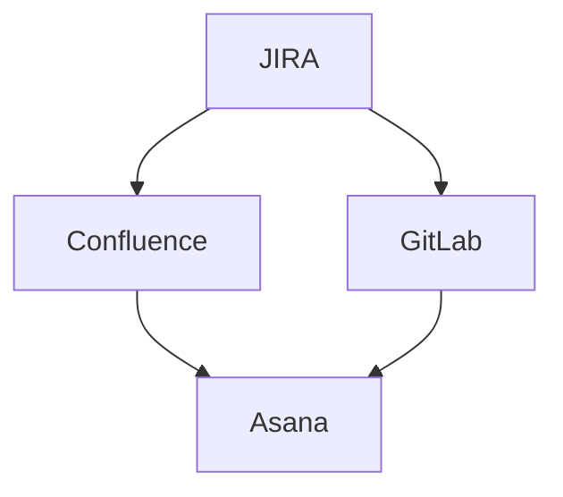
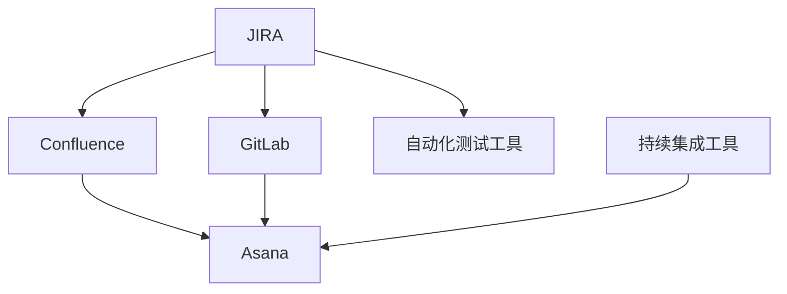
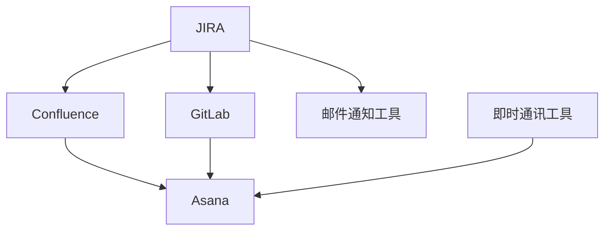

                 

# 《敏捷研发模式下的需求变更控制策略》

## 关键词

敏捷研发、需求变更控制、需求管理、迭代开发、风险评估、成本控制、团队协作。

## 摘要

在敏捷研发模式下，需求变更控制策略是实现项目成功的关键。本文首先介绍了敏捷研发模式的基础知识，包括其历史、核心原则、优点和局限性，以及敏捷研发模式下的团队协作。接着，本文详细探讨了需求变更控制策略的核心概念，包括需求变更的概念与类型、需求变更的影响评估、需求变更的流程与工具。然后，本文提出了需求变更控制策略，包括需求变更评估与优先级排序、需求变更的风险管理、需求变更的成本控制和需求变更的沟通与协作。最后，本文通过实战案例和工具应用，总结了敏捷研发中的需求变更控制经验，并展望了未来的发展趋势。

## 《敏捷研发模式下的需求变更控制策略》目录大纲

### 第一部分：敏捷研发模式概述

#### 第1章：敏捷研发模式基础

##### 1.1 敏捷研发模式的历史与演变
##### 1.2 敏捷研发模式的核心原则
##### 1.3 敏捷研发模式的优点与局限性
##### 1.4 敏捷研发模式下的团队协作

### 第二部分：需求变更控制策略

#### 第2章：需求变更管理概述

##### 2.1 需求变更的概念与类型
##### 2.2 需求变更的影响评估
##### 2.3 需求变更的流程与工具

#### 第3章：需求变更控制策略

##### 3.1 需求变更评估与优先级排序
##### 3.2 需求变更的风险管理
##### 3.3 需求变更的成本控制
##### 3.4 需求变更的沟通与协作

### 第三部分：敏捷研发中的需求变更控制实战

#### 第4章：敏捷研发中的需求管理

##### 4.1 敏捷研发模式下的需求收集
##### 4.2 敏捷研发模式下的需求分析
##### 4.3 敏捷研发模式下的需求实现

#### 第5章：敏捷研发中的需求变更控制案例

##### 5.1 案例一：需求变更的及时反馈与调整
##### 5.2 案例二：需求变更的评估与决策
##### 5.3 案例三：需求变更与团队协作的挑战与应对

#### 第6章：敏捷研发中的需求变更控制工具

##### 6.1 敏捷研发工具的选择
##### 6.2 敏捷研发工具的应用与优化
##### 6.3 敏捷研发工具的集成与协作

#### 第7章：敏捷研发中的需求变更控制总结

##### 7.1 敏捷研发中的需求变更控制经验总结
##### 7.2 敏捷研发中的需求变更控制最佳实践
##### 7.3 敏捷研发中的需求变更控制未来趋势

### 附录

#### 附录A：敏捷研发与需求变更控制相关资源

##### A.1 敏捷研发模式相关书籍推荐
##### A.2 需求变更控制工具介绍
##### A.3 敏捷研发与需求变更控制社区资源推荐

## 第1章：敏捷研发模式基础

### 1.1 敏捷研发模式的历史与演变

敏捷研发模式起源于20世纪90年代，最初由一些软件工程师和项目经理在探索如何提高软件开发效率的过程中提出。1991年，美国软件工程师埃里克·莱斯提出了“精益创业”理念，强调快速迭代、持续交付和用户反馈。这一理念逐渐演变为敏捷开发的核心思想。

2001年，17位软件工程师在雪车滑雪胜地犹他州的伊萨卡聚会，共同签署了《敏捷宣言》，提出了敏捷开发的四项核心价值：个体和互动重于过程与工具、可工作的软件重于详尽的文档、客户合作重于合同谈判、响应变化重于遵循计划。这次聚会也标志着敏捷研发模式的正式诞生。

自《敏捷宣言》签署以来，敏捷研发模式经历了多次演变，形成了不同的敏捷开发方法，如Scrum、Kanban、XP（极限编程）等。每种方法都有其独特的特点和适用场景，但都遵循敏捷开发的核心原则。

### 1.2 敏捷研发模式的核心原则

敏捷研发模式的核心原则包括：

1. **客户合作**：敏捷研发强调与客户的紧密合作，确保项目始终符合客户的期望和需求。
2. **响应变化**：敏捷研发模式接受项目需求的变化，并通过迭代和增量开发来适应这些变化。
3. **持续交付**：敏捷研发强调持续交付可工作的软件，以便尽早满足客户需求。
4. **迭代开发**：敏捷研发通过短周期的迭代来开发软件，每次迭代都产生一个可工作的版本。
5. **团队协作**：敏捷研发强调团队内部的高效协作和沟通，以确保项目顺利进行。

这些核心原则共同构成了敏捷研发模式的基础，使其成为一种灵活、高效、适应性强且用户导向的软件开发方法。

### 1.3 敏捷研发模式的优点与局限性

#### 优点

1. **快速响应需求变化**：敏捷研发模式允许在项目开发过程中根据客户反馈和业务需求进行调整，提高了项目的灵活性和适应性。
2. **持续交付**：通过短周期迭代和持续交付，客户可以更早地获得软件产品，并及时获取价值。
3. **高效协作**：敏捷研发模式强调团队协作和沟通，减少了项目风险，提高了项目成功率。
4. **用户导向**：敏捷研发模式以用户需求为中心，确保软件产品更好地满足用户需求。

#### 局限性

1. **项目初期需求不明确**：敏捷研发模式要求客户在项目初期提供明确的需求，但实际中客户需求往往不明确，可能导致项目进展受阻。
2. **团队协作要求高**：敏捷研发模式要求团队成员具备较高的协作和沟通能力，否则可能会导致项目效率低下。
3. **质量保证**：敏捷研发模式强调速度和灵活性，有时可能忽视了质量保证，需要额外的质量管理和测试工作。

### 1.4 敏捷研发模式下的团队协作

敏捷研发模式强调团队协作和沟通，要求团队成员在项目开发过程中保持密切联系和协作。以下是敏捷研发模式下的团队协作要点：

1. **自组织团队**：敏捷研发模式鼓励团队成员自组织，自主决定工作内容和方式，以提高团队效率和创造力。
2. **透明沟通**：团队成员之间应保持透明沟通，及时分享信息，确保项目进展顺利。
3. **定期会议**：敏捷研发模式下的团队通常定期举行站立会议、迭代回顾会议等，以讨论项目进展和改进措施。
4. **共享责任**：敏捷研发模式下，团队成员共同承担项目责任，协同解决问题。

通过以上团队协作要点，敏捷研发模式可以有效提高项目成功率，确保项目顺利进行。

## 第2章：需求变更管理概述

### 2.1 需求变更的概念与类型

在软件开发过程中，需求变更是一种常见现象。需求变更是指在项目开发过程中，客户、项目经理或开发人员对原有需求进行修改、补充或删除的行为。需求变更是软件开发过程中的正常现象，但如果不加以有效管理，可能导致项目延期、成本超支和质量下降等问题。

#### 需求变更的类型

根据变更的原因和内容，需求变更可以分为以下几种类型：

1. **新增需求**：在项目开发过程中，客户或项目经理发现原有需求不够完整或无法满足实际需求，需要新增需求。
2. **修改需求**：在项目开发过程中，客户或项目经理对原有需求进行修改，以更好地满足实际需求。
3. **删除需求**：在项目开发过程中，客户或项目经理认为某些需求不再必要或无法实现，需要将其删除。
4. **优先级调整**：在项目开发过程中，客户或项目经理根据实际情况调整需求的优先级，以确保项目重点任务的完成。

#### 需求变更的影响

需求变更对软件开发过程产生多方面的影响：

1. **项目进度**：需求变更可能导致项目进度延误，因为开发人员需要重新规划工作内容和时间安排。
2. **项目成本**：需求变更可能增加项目成本，因为需要投入更多的时间和资源来处理变更。
3. **项目质量**：需求变更可能影响项目质量，因为新的需求或修改后的需求可能引入新的风险和问题。
4. **团队协作**：需求变更可能影响团队协作，因为团队成员需要重新协调和沟通，以适应新的需求。

#### 需求变更的管理

为了确保需求变更对项目的影响降到最低，需要采取有效的需求变更管理策略。以下是一些需求变更管理的基本原则：

1. **明确变更流程**：制定明确的变更流程，确保需求变更得到及时处理和跟踪。
2. **评估变更影响**：在处理需求变更时，评估变更对项目进度、成本、质量和团队协作等方面的影响，以便做出合理的决策。
3. **优先级排序**：根据变更的影响程度和业务价值，对需求变更进行优先级排序，确保高优先级变更得到优先处理。
4. **沟通与协作**：加强项目团队、客户和利益相关者之间的沟通与协作，确保需求变更的顺利实施。

### 2.2 需求变更的影响评估

在敏捷研发模式下，需求变更的影响评估至关重要。以下是一些评估需求变更影响的方法：

#### 评估方法

1. **成本效益分析**：计算需求变更所需的额外成本和预期收益，以评估变更的可行性。
2. **风险评估**：评估需求变更可能带来的风险，包括进度风险、成本风险和质量风险。
3. **优先级评估**：根据业务价值和风险，对需求变更进行优先级评估。

#### 评估工具

1. **变更日志**：记录需求变更的详细信息，包括变更原因、变更内容、变更时间和负责人等。
2. **影响矩阵**：使用影响矩阵分析需求变更对项目进度、成本、质量和团队协作等方面的影响。
3. **成本效益分析表**：列出需求变更的成本和预期收益，以便进行成本效益分析。

### 2.3 需求变更的流程与工具

#### 需求变更流程

1. **提出变更**：项目团队或客户提出需求变更，并填写变更请求表。
2. **评估变更**：项目经理或需求分析师对变更请求进行评估，包括评估变更的影响和可行性。
3. **决策变更**：根据评估结果，项目经理或决策委员会决定是否接受变更。
4. **实施变更**：如果决定接受变更，项目团队根据变更计划实施变更。
5. **跟踪变更**：记录变更实施情况，确保变更得到顺利执行。

#### 需求变更工具

1. **需求管理工具**：如JIRA、Confluence等，用于记录和管理需求变更。
2. **项目管理工具**：如Microsoft Project、Trello等，用于跟踪项目进度和变更实施情况。
3. **沟通工具**：如Slack、Microsoft Teams等，用于项目团队之间的沟通与协作。

## 第3章：需求变更控制策略

### 3.1 需求变更评估与优先级排序

在敏捷研发模式下，需求变更控制策略的核心是评估与优先级排序。有效的需求变更评估与优先级排序可以帮助项目团队快速响应客户需求，同时确保项目在时间和资源有限的情况下保持高效运作。

#### 评估方法

1. **成本效益分析**：计算每个需求变更的额外成本和预期收益，评估变更的可行性。以下是一个成本效益分析的示例：

   ```plaintext
   成本效益分析表

   需求变更 | 额外成本 | 预期收益 | 成本效益比
   ----------------------------------------
   A         | 5000美元  | 8000美元 | 1.6
   B         | 3000美元  | 4000美元 | 1.3
   C         | 2000美元  | 2500美元 | 1.25
   ```

   根据成本效益比，需求A具有最高的优先级。

2. **风险评估**：评估每个需求变更可能带来的风险，包括项目进度风险、成本风险和质量风险。以下是一个风险评估示例：

   ```plaintext
   风险评估表

   需求变更 | 风险等级 | 风险影响
   ----------------------------------------
   A         | 高       | 可能导致项目延期
   B         | 中       | 可能影响项目质量
   C         | 低       | 对项目影响较小
   ```

   根据风险等级，需求A具有最高的优先级。

3. **优先级评估**：综合考虑成本效益和风险评估结果，对需求变更进行优先级排序。以下是一个优先级评估示例：

   ```plaintext
   优先级评估表

   需求变更 | 优先级 | 评估依据
   ----------------------------------------
   A         | 1      | 高成本效益比、高风险
   B         | 2      | 中成本效益比、中风险
   C         | 3      | 低成本效益比、低风险
   ```

   根据优先级评估结果，需求A具有最高的优先级。

#### 伪代码

```python
function assess_change_request(change_request):
    cost_efficacy_ratio = calculate_cost_efficacy_ratio(change_request)
    risk_level = assess_risk(change_request)
    priority = determine_priority(cost_efficacy_ratio, risk_level)
    return priority

function calculate_cost_efficacy_ratio(change_request):
    extra_cost = change_request.extra_cost
    expected_benefit = change_request.expected_benefit
    cost_efficacy_ratio = expected_benefit / extra_cost
    return cost_efficacy_ratio

function assess_risk(change_request):
    risk_level = change_request.risk_level
    risk_impact = change_request.risk_impact
    risk = risk_level * risk_impact
    return risk

function determine_priority(cost_efficacy_ratio, risk_level):
    if cost_efficacy_ratio > 1.5 and risk_level == 'High':
        priority = 1
    elif cost_efficacy_ratio > 1 and risk_level == 'Medium':
        priority = 2
    else:
        priority = 3
    return priority
```

#### 实例说明

假设项目团队收到了三个需求变更请求，以下是一个具体的评估与优先级排序过程：

1. **需求A**：新增一个功能，预计额外成本为5000美元，预期收益为8000美元。风险评估显示，该需求存在高风险，可能影响项目进度。

   ```python
   change_request = {
       'name': '需求A',
       'extra_cost': 5000,
       'expected_benefit': 8000,
       'risk_level': 'High',
       'risk_impact': 1
   }
   priority = assess_change_request(change_request)
   print(f"需求A的优先级：{priority}")
   ```

   输出：需求A的优先级：1

2. **需求B**：修改一个功能，预计额外成本为3000美元，预期收益为4000美元。风险评估显示，该需求存在中等风险，可能影响项目质量。

   ```python
   change_request = {
       'name': '需求B',
       'extra_cost': 3000,
       'expected_benefit': 4000,
       'risk_level': 'Medium',
       'risk_impact': 1
   }
   priority = assess_change_request(change_request)
   print(f"需求B的优先级：{priority}")
   ```

   输出：需求B的优先级：2

3. **需求C**：删除一个功能，预计额外成本为2000美元，预期收益为2500美元。风险评估显示，该需求存在低风险，对项目影响较小。

   ```python
   change_request = {
       'name': '需求C',
       'extra_cost': 2000,
       'expected_benefit': 2500,
       'risk_level': 'Low',
       'risk_impact': 1
   }
   priority = assess_change_request(change_request)
   print(f"需求C的优先级：{priority}")
   ```

   输出：需求C的优先级：3

根据优先级评估结果，需求A具有最高的优先级，需求B次之，需求C最低。

### 3.2 需求变更的风险管理

需求变更可能导致项目进度延误、成本超支和质量下降等问题，因此需求变更的风险管理至关重要。以下是一些需求变更风险管理的方法：

#### 风险识别

1. **历史数据**：分析以往项目中的需求变更，识别常见的风险类型和原因。
2. **专家评审**：邀请项目经理、需求分析师和团队成员参与评审，共同识别需求变更可能带来的风险。
3. **问卷调查**：向客户、利益相关者和团队成员发放问卷调查，收集他们对需求变更可能带来的风险的看法。

#### 风险评估

1. **定性评估**：根据风险严重程度和发生概率，对风险进行定性评估。以下是一个定性风险评估示例：

   ```plaintext
   风险评估表

   风险类型    | 严重程度  | 发生概率  | 风险等级
   ---------------------------------------------
   进度延误    | 高       | 中       | 高
   成本超支    | 中       | 高       | 中
   质量下降    | 低       | 高       | 低
   ```

   根据风险等级，进度延误风险最高，成本超支风险次之，质量下降风险最低。

2. **定量评估**：使用定量评估方法，如预期货币价值（EMV）计算，对风险进行定量评估。以下是一个定量风险评估示例：

   ```plaintext
   风险评估表

   风险类型    | 严重程度    | 发生概率    | 预期货币价值（EMV）
   ---------------------------------------------
   进度延误    | 20000美元   | 0.5        | -10000美元
   成本超支    | 15000美元   | 0.3        | -4500美元
   质量下降    | 5000美元    | 0.2        | -1000美元
   ```

   根据预期货币价值（EMV），进度延误风险对项目的负面影响最大，成本超支风险次之，质量下降风险最低。

#### 风险应对

1. **风险规避**：识别需求变更可能带来的风险，并采取措施避免风险发生。例如，在需求变更发生前，与客户进行充分沟通，确保需求变更的合理性和必要性。
2. **风险转移**：将需求变更的风险转移到第三方。例如，与客户签订需求变更合同，明确变更范围、时间节点和责任。
3. **风险接受**：对于低风险的需求变更，可以接受风险并采取相应措施降低负面影响。例如，在项目计划中预留一定的时间缓冲，以应对潜在的风险。
4. **风险减轻**：采取措施减轻需求变更带来的风险。例如，通过加强团队协作和沟通，降低进度延误和质量下降的风险。

### 3.3 需求变更的成本控制

在敏捷研发模式下，需求变更的成本控制是确保项目顺利进行的的关键。以下是一些需求变更成本控制的方法：

#### 成本控制策略

1. **固定预算**：在项目初期，确定一个固定的预算，并根据需求变更情况进行调整。以下是一个固定预算调整的示例：

   ```plaintext
   预算调整表

   需求变更 | 额外成本  | 预算调整
   ----------------------------------------
   A         | 5000美元  | 预算增加5000美元
   B         | 3000美元  | 预算增加3000美元
   C         | 2000美元  | 预算增加2000美元
   ```

   根据成本控制策略，项目预算将增加5000+3000+2000=10000美元。

2. **时间缓冲**：在项目计划中预留一定的时间缓冲，以应对需求变更带来的时间压力。以下是一个时间缓冲调整的示例：

   ```plaintext
   时间缓冲调整表

   需求变更 | 额外时间  | 时间缓冲调整
   ----------------------------------------
   A         | 5天       | 时间缓冲增加5天
   B         | 3天       | 时间缓冲增加3天
   C         | 2天       | 时间缓冲增加2天
   ```

   根据时间缓冲调整策略，项目的时间缓冲将从原来的10天增加到10+5+3+2=20天。

3. **资源优化**：在需求变更发生时，重新分配项目资源，以优化项目成本。以下是一个资源优化调整的示例：

   ```plaintext
   资源优化调整表

   需求变更 | 额外资源  | 资源优化
   ----------------------------------------
   A         | 2人       | 调整现有人员，减少1人
   B         | 1人       | 调整现有人员，增加1人
   C         | 1人       | 保持现有人员不变
   ```

   根据资源优化策略，项目的人员配置将从原来的10人调整为9人（A需求减少1人），11人（B需求增加1人）和10人（C需求不变）。

#### 成本控制工具

1. **项目管理工具**：如Microsoft Project、JIRA等，用于跟踪项目进度和成本变化。
2. **成本分析工具**：如Excel、Tableau等，用于分析项目成本和收益。
3. **变更管理工具**：如Confluence、JIRA等，用于记录和管理需求变更。

### 3.4 需求变更的沟通与协作

在敏捷研发模式下，需求变更的沟通与协作是确保需求变更顺利实施的关键。以下是一些需求变更沟通与协作的方法：

#### 沟通策略

1. **定期会议**：定期召开需求变更评审会议，项目团队、客户和利益相关者共同讨论需求变更的可行性、影响和优先级。
2. **透明沟通**：确保项目团队内部和与客户、利益相关者之间的沟通透明，及时传达需求变更的最新进展和决策。
3. **信息共享**：使用共享文档、看板和项目管理工具，确保项目团队和利益相关者能够及时了解需求变更的详细信息。

#### 协作策略

1. **共同决策**：在需求变更决策过程中，项目团队、客户和利益相关者共同参与，确保决策的合理性和可行性。
2. **团队协作**：在需求变更实施过程中，项目团队成员协同工作，确保需求变更的顺利执行。
3. **持续反馈**：在需求变更实施过程中，项目团队和客户持续沟通，收集反馈并做出相应调整，确保需求变更满足预期效果。

## 第4章：敏捷研发中的需求管理

### 4.1 敏捷研发模式下的需求收集

在敏捷研发模式下，需求收集是一个持续和迭代的过程，旨在确保项目始终符合客户的期望和需求。以下是一些敏捷研发模式下的需求收集方法：

#### 需求收集方法

1. **用户故事地图**：用户故事地图是一种直观的需求收集工具，用于描述系统功能和用户交互流程。以下是一个用户故事地图的示例：

   ```mermaid
   graph TD
   A[用户故事1] --> B{用户行为}
   B --> C{系统响应}
   C --> D{用户反馈}
   D --> A
   ```

2. **客户访谈**：通过与客户进行面对面的访谈，了解客户的实际需求和期望，以下是一个客户访谈的示例：

   ```plaintext
   客户访谈记录

   姓名：张三
   职位：产品经理
   访谈时间：2021年9月10日

   访谈内容：
   - 张三表示，他们希望系统具有实时数据分析和可视化功能，以便更好地了解用户行为。
   - 张三还提到，他们希望系统能够支持多用户权限管理，以满足不同用户的需求。
   ```

3. **问卷调查**：通过问卷调查收集客户的需求和反馈，以下是一个问卷调查的示例：

   ```plaintext
   问卷调查

   1. 您希望系统具有哪些功能？
   - 实时数据分析和可视化
   - 多用户权限管理

   2. 您认为系统最需要改进的方面是什么？
   - 数据分析的准确性
   - 系统的响应速度

   3. 您对系统的满意度如何？
   - 非常满意
   ```

#### 需求收集工具

1. **用户故事地图工具**：如Mural、Miro等，用于创建和展示用户故事地图。
2. **客户访谈工具**：如Zoom、Microsoft Teams等，用于进行远程视频会议。
3. **问卷调查工具**：如Google表单、SurveyMonkey等，用于创建和分发问卷调查。

### 4.2 敏捷研发模式下的需求分析

在敏捷研发模式下，需求分析是一个动态和迭代的过程，旨在确保每个需求都清晰、明确，并且可以顺利实现。以下是一些敏捷研发模式下的需求分析方法：

#### 需求分析方法

1. **用户故事分析**：用户故事是一种简短、明确、可执行的需求描述。以下是一个用户故事的示例：

   ```plaintext
   作为用户，我希望系统能够实时显示我的账户余额，以便我随时了解我的资金状况。
   ```

   对这个用户故事进行分析，可以确定以下信息：

   - **角色**：用户
   - **目标**：实时显示账户余额
   - **条件**：随时可查看

2. **场景分析**：通过场景分析，了解用户在特定场景下如何与系统交互。以下是一个场景分析的示例：

   ```mermaid
   graph TD
   A[登录系统] --> B{查看账户余额}
   B --> C[显示余额]
   C --> D[退出系统]
   ```

3. **用例图分析**：用例图是一种用于描述系统功能和用户交互的图形工具。以下是一个用例图的示例：

   ```mermaid
   graph TD
   A[用户登录] --> B{查看余额}
   A --> C{修改密码}
   B --> D{退出系统}
   C --> D
   ```

#### 需求分析工具

1. **用户故事地图工具**：如Mural、Miro等，用于创建和展示用户故事地图。
2. **场景分析工具**：如Mural、Miro等，用于创建和展示场景分析。
3. **用例图工具**：如Lucidchart、draw.io等，用于创建和展示用例图。

### 4.3 敏捷研发模式下的需求实现

在敏捷研发模式下，需求实现是一个迭代和渐进的过程，旨在确保每个需求都得到有效实现并按时交付。以下是一些敏捷研发模式下的需求实现方法：

#### 需求实现方法

1. **迭代开发**：将需求划分为多个迭代，每个迭代实现一部分功能。以下是一个迭代开发的示例：

   ```mermaid
   graph TD
   A[迭代1] --> B{需求1}
   A --> C{需求2}
   B --> D{需求3}
   C --> D
   ```

2. **增量实现**：在每个迭代中，实现需求的一部分功能，并逐步完善。以下是一个增量实现的示例：

   ```mermaid
   graph TD
   A[迭代1] --> B{需求1部分1}
   A --> C{需求2部分1}
   B --> D{需求1部分2}
   C --> D{需求2部分2}
   ```

3. **测试驱动开发（TDD）**：在实现需求之前，编写测试用例，确保需求实现后可以通过测试。以下是一个测试驱动开发的示例：

   ```mermaid
   graph TD
   A[编写测试用例] --> B{实现需求}
   B --> C{运行测试用例}
   ```

#### 需求实现工具

1. **版本控制工具**：如Git、SVN等，用于管理代码版本和协同开发。
2. **集成开发环境（IDE）**：如Visual Studio、Eclipse等，用于编写和调试代码。
3. **测试工具**：如JUnit、Selenium等，用于编写和运行测试用例。

## 第5章：敏捷研发中的需求变更控制案例

### 5.1 案例一：需求变更的及时反馈与调整

在一个敏捷研发项目中，客户希望在系统中新增一个数据分析功能。项目团队在收到这个需求后，立即进行了评估和讨论。

#### 评估过程

1. **需求分析**：项目团队与客户进行了详细的讨论，了解客户对数据分析功能的期望和需求。通过用户故事地图和用户访谈，项目团队收集了以下信息：

   ```plaintext
   用户故事：

   作为客户，我希望系统能够提供实时数据分析和可视化功能，以便我随时了解业务运营状况。

   用户访谈记录：

   - 客户表示，他们希望系统能够实时显示销售额、订单数量和客户反馈等关键指标。
   - 客户提到，他们需要一个易于使用的仪表板，以便快速查看和分享数据。
   ```

2. **风险评估**：项目团队评估了需求变更对项目进度、成本和质量的影响。以下是一个风险评估示例：

   ```plaintext
   风险评估表

   风险类型    | 风险等级  | 影响分析
   -----------------------------------------
   进度延误    | 中       | 新增功能可能导致项目进度延误
   成本超支    | 低       | 数据分析功能实现成本相对较低
   质量下降    | 低       | 实时数据分析和可视化功能对质量要求较高，但可通过适当测试控制
   ```

3. **决策**：项目团队决定接受这个需求变更，并将其纳入下一个迭代。

#### 实施过程

1. **需求实现**：项目团队在下一个迭代中开始实现数据分析功能。以下是一个迭代计划示例：

   ```mermaid
   graph TD
   A[迭代2] --> B{数据分析功能1}
   A --> C{数据分析功能2}
   B --> D{数据分析功能3}
   C --> D
   ```

2. **测试和反馈**：在实现过程中，项目团队进行了单元测试和集成测试，以确保数据分析功能的正确性和稳定性。同时，项目团队与客户保持密切沟通，收集客户的反馈和建议。

   ```plaintext
   测试记录：

   - 数据分析功能1通过测试，显示正确结果。
   - 数据分析功能2存在部分问题，需要进行修复。
   - 数据分析功能3未通过测试，需要重新实现。

   客户反馈：

   - 客户对数据分析功能1和2表示满意。
   - 客户建议对数据分析功能3进行进一步优化，以提高用户体验。
   ```

3. **调整和优化**：根据客户的反馈，项目团队对数据分析功能3进行了优化和调整，并再次进行测试。

#### 结果

通过及时反馈和调整，项目团队成功实现了数据分析功能，并得到了客户的认可。以下是一个结果分析示例：

```plaintext
结果分析：

- 数据分析功能1、2和3均通过最终测试，符合客户需求。
- 项目进度和成本未受到显著影响，质量得到有效控制。
- 客户对项目的满意度提高，项目团队与客户的协作关系更加紧密。
```

### 5.2 案例二：需求变更的评估与决策

在一个敏捷研发项目中，客户希望在系统中新增一个客户管理功能。项目团队在收到这个需求后，立即进行了评估和决策。

#### 评估过程

1. **需求分析**：项目团队与客户进行了详细的讨论，了解客户对客户管理功能的期望和需求。通过用户故事地图和用户访谈，项目团队收集了以下信息：

   ```plaintext
   用户故事：

   作为客户，我希望系统能够帮助我管理客户信息和沟通记录，以便我更好地维护客户关系。

   用户访谈记录：

   - 客户表示，他们希望系统能够提供客户信息存储、沟通记录和预约管理等功能。
   - 客户提到，他们需要一个易于使用的界面，以便快速添加和更新客户信息。
   ```

2. **风险评估**：项目团队评估了需求变更对项目进度、成本和质量的影响。以下是一个风险评估示例：

   ```plaintext
   风险评估表

   风险类型    | 风险等级  | 影响分析
   -----------------------------------------
   进度延误    | 高       | 新增功能可能导致项目进度延误
   成本超支    | 中       | 客户管理功能实现成本较高
   质量下降    | 低       | 客户管理功能对质量要求较高，但可通过适当测试控制
   ```

3. **决策**：项目团队决定接受这个需求变更，并将其纳入下一个迭代。但考虑到风险评估结果，项目团队决定对客户管理功能进行优先级调整，确保项目进度不受影响。

#### 实施过程

1. **需求实现**：项目团队在下一个迭代中开始实现客户管理功能。以下是一个迭代计划示例：

   ```mermaid
   graph TD
   A[迭代3] --> B{客户管理功能1}
   A --> C{客户管理功能2}
   B --> D{客户管理功能3}
   C --> D
   ```

2. **测试和反馈**：在实现过程中，项目团队进行了单元测试和集成测试，以确保客户管理功能的正确性和稳定性。同时，项目团队与客户保持密切沟通，收集客户的反馈和建议。

   ```plaintext
   测试记录：

   - 客户管理功能1通过测试，显示正确结果。
   - 客户管理功能2存在部分问题，需要进行修复。
   - 客户管理功能3未通过测试，需要重新实现。

   客户反馈：

   - 客户对客户管理功能1表示满意。
   - 客户建议对客户管理功能2进行进一步优化，以提高用户体验。
   - 客户对客户管理功能3表示担忧，担心其会影响项目的整体进度。
   ```

3. **调整和优化**：根据客户的反馈，项目团队对客户管理功能2进行了优化和调整，并再次进行测试。同时，项目团队与客户进行了进一步的沟通，确保客户管理功能3的实现不会影响项目的整体进度。

#### 结果

通过评估与决策，项目团队成功实现了客户管理功能，并得到了客户的认可。以下是一个结果分析示例：

```plaintext
结果分析：

- 客户管理功能1通过最终测试，符合客户需求。
- 客户管理功能2经过优化和调整后通过测试，符合客户需求。
- 客户管理功能3在保证项目进度的情况下实现，但需要进一步优化和测试。
- 项目进度和成本受到一定影响，但通过调整和优化得到有效控制。
- 客户对项目的满意度提高，项目团队与客户的协作关系更加紧密。
```

### 5.3 案例三：需求变更与团队协作的挑战与应对

在一个敏捷研发项目中，客户希望在系统中新增一个社交功能，用于用户之间的互动和分享。项目团队在收到这个需求后，遇到了一些团队协作的挑战。

#### 挑战

1. **沟通不畅**：由于社交功能涉及多个模块，项目团队需要与前端、后端和数据库等多个团队进行紧密协作。然而，由于沟通不畅，项目团队在实现社交功能时遇到了困难。

2. **优先级冲突**：社交功能是客户提出的紧急需求，但在项目进度表中，它与其他任务存在优先级冲突。项目团队需要在保证项目进度的情况下，合理安排社交功能的开发。

3. **资源不足**：项目团队在实现社交功能时，发现所需的技术资源和人力不足。这可能导致项目延期和质量下降。

#### 应对策略

1. **加强沟通**：项目团队通过每日站立会议、邮件和即时通讯工具，加强与各团队之间的沟通。同时，项目团队建立了项目看板，以便实时跟踪任务进展和问题。

   ```mermaid
   graph TD
   A[每日站立会议] --> B[任务看板]
   B --> C[邮件沟通]
   C --> D[即时通讯工具]
   ```

2. **优先级调整**：项目团队与客户进行了沟通，解释了社交功能的开发可能影响其他任务的进度。在客户的理解和支持下，项目团队调整了社交功能的开发优先级，确保项目进度不受影响。

   ```mermaid
   graph TD
   A[原计划任务] --> B{调整优先级}
   B --> C[社交功能]
   C --> D[后续任务]
   ```

3. **资源优化**：项目团队通过重新分配资源和加班工作，确保社交功能的顺利实现。同时，项目团队与外部专家和合作伙伴进行了合作，解决了技术难题。

   ```mermaid
   graph TD
   A[内部资源] --> B{外部专家}
   B --> C{合作伙伴}
   ```

#### 结果

通过有效的团队协作和应对策略，项目团队成功实现了社交功能，并保证了项目的整体进度和质量。以下是一个结果分析示例：

```plaintext
结果分析：

- 社交功能通过最终测试，符合客户需求。
- 项目进度和质量得到有效控制，未受显著影响。
- 项目团队与客户的协作关系得到加强，客户对项目的满意度提高。
- 通过资源优化和外部合作，项目团队成功应对了资源不足的挑战。
```

## 第6章：敏捷研发中的需求变更控制工具

### 6.1 敏捷研发工具的选择

在敏捷研发中，选择合适的工具对于需求变更控制至关重要。以下是一些常见的敏捷研发工具及其特点：

#### 1. JIRA

**特点**：
- 功能丰富，包括需求管理、任务跟踪、报告生成等。
- 支持多种工作流，适应不同类型的敏捷开发。
- 提供丰富的插件和扩展，可以与其他工具集成。

**应用场景**：
- 适用于大型项目，需要灵活的任务管理和报告功能。

#### 2. Trello

**特点**：
- 界面简洁，易于使用。
- 支持拖放操作，可以快速调整任务状态。
- 提供多种视图，如看板、列表、卡片等。

**应用场景**：
- 适用于小型团队，需要简单直观的任务管理。

#### 3. Confluence

**特点**：
- 功能强大，包括文档编写、版本控制、知识库等。
- 可以与JIRA等工具集成，实现任务和文档的联动。
- 提供丰富的模板和插件，便于文档编写和共享。

**应用场景**：
- 适用于企业内部的知识管理和文档共享。

#### 4. GitLab

**特点**：
- 完整的软件生命周期管理，包括代码仓库、CI/CD、监控等。
- 提供丰富的报告和统计功能，便于团队了解项目状态。
- 支持多种集成，如JIRA、Slack等。

**应用场景**：
- 适用于需要完整软件生命周期管理的项目。

#### 5. Asana

**特点**：
- 功能全面，包括任务管理、项目管理、报告生成等。
- 支持多种视图，如看板、列表、日历等。
- 提供移动应用，便于团队成员随时查看任务状态。

**应用场景**：
- 适用于需要高效任务管理和协作的团队。

### 6.2 敏捷研发工具的应用与优化

在敏捷研发中，工具的应用和优化对于需求变更控制至关重要。以下是一些关键点：

#### 1. 工具集成

将不同的敏捷研发工具集成在一起，可以实现数据流的无缝对接，提高团队协作效率。以下是一个集成示例：



通过集成，项目团队可以在JIRA中管理任务和需求，在Confluence中编写和共享文档，在GitLab中进行代码管理和CI/CD，在Asana中跟踪项目进度和协作。

#### 2. 工具定制

根据团队的具体需求，对敏捷研发工具进行定制，以提高工作效率。以下是一些定制示例：

- **JIRA**：自定义字段和面板，以适应特定的项目管理需求。
- **Confluence**：创建自定义模板，简化文档编写流程。
- **GitLab**：配置CI/CD pipeline，实现自动化测试和部署。
- **Asana**：自定义任务类型和工作流，以适应不同类型的项目。

#### 3. 工具优化

通过不断优化敏捷研发工具的使用，可以提高团队协作效率和项目成功率。以下是一些优化策略：

- **定期培训**：定期对团队成员进行工具培训，提高使用效率。
- **最佳实践**：推广和遵循最佳实践，以提高工具的利用率和效果。
- **反馈机制**：建立反馈机制，收集团队成员对工具使用的意见和建议，不断改进工具的使用方法。

### 6.3 敏捷研发工具的集成与协作

在敏捷研发中，工具的集成与协作对于需求变更控制至关重要。以下是一些关键点：

#### 1. 流程自动化

通过集成敏捷研发工具，可以实现流程的自动化，减少手动操作，提高工作效率。以下是一个自动化流程示例：



通过集成，当JIRA中的任务状态发生变化时，可以自动更新Confluence中的文档，触发GitLab中的自动化测试，并生成Asana中的报告。

#### 2. 信息共享

通过集成敏捷研发工具，可以实现信息的共享和实时更新，确保团队成员之间的信息同步。以下是一个信息共享示例：



通过集成，当JIRA中的任务状态发生变化时，可以自动发送邮件通知和即时通讯通知，确保团队成员及时了解项目动态。

#### 3. 协作优化

通过集成敏捷研发工具，可以优化团队协作流程，提高协作效率。以下是一个协作优化示例：


通过集成，当JIRA中的任务分配给团队成员时，可以自动更新Confluence中的文档，触发GitLab中的进度跟踪，并生成Asana中的任务进度报告。

## 第7章：敏捷研发中的需求变更控制总结

### 7.1 敏捷研发中的需求变更控制经验总结

在敏捷研发模式下，需求变更控制是确保项目成功的关键。以下是敏捷研发中的需求变更控制经验总结：

1. **快速响应需求变更**：敏捷研发模式强调快速响应需求变更，确保项目能够及时适应客户和市场的变化。

2. **明确变更流程**：制定明确的变更流程，确保需求变更得到及时处理和跟踪，减少变更对项目的影响。

3. **评估变更影响**：在处理需求变更时，评估变更对项目进度、成本、质量和团队协作等方面的影响，以便做出合理的决策。

4. **优先级排序**：根据变更的影响程度和业务价值，对需求变更进行优先级排序，确保高优先级变更得到优先处理。

5. **风险管理**：识别和处理需求变更带来的风险，确保项目能够顺利推进。

6. **沟通与协作**：加强项目团队、客户和利益相关者之间的沟通与协作，确保需求变更的顺利实施。

### 7.2 敏捷研发中的需求变更控制最佳实践

以下是敏捷研发中的需求变更控制最佳实践：

1. **建立变更管理团队**：建立一个专门负责需求变更管理的团队，确保需求变更得到专业处理。

2. **定期评估变更需求**：定期对变更需求进行评估，确保变更需求与项目目标保持一致。

3. **使用变更日志**：记录每个变更的详细信息，包括变更原因、变更内容、变更时间和负责人等，便于跟踪和管理。

4. **成本效益分析**：对每个需求变更进行成本效益分析，确保变更的可行性。

5. **风险管理**：对每个需求变更进行风险评估，识别可能的风险并制定相应的应对策略。

6. **持续反馈与改进**：在需求变更实施过程中，持续收集反馈，并根据反馈进行调整和优化。

### 7.3 敏捷研发中的需求变更控制未来趋势

随着技术的不断进步和市场竞争的加剧，敏捷研发中的需求变更控制将呈现以下趋势：

1. **智能化**：利用人工智能和大数据分析技术，自动评估需求变更的影响和优先级，提高变更管理的效率和准确性。

2. **自动化**：通过自动化工具和流程，实现需求变更的自动化处理，减少人工干预，提高变更管理的效率。

3. **云端化**：随着云计算技术的发展，敏捷研发中的需求变更控制将逐渐向云端迁移，实现更高效的数据共享和协作。

4. **社交化**：结合社交网络和协作工具，实现需求变更的实时反馈和协作，提高变更管理的透明度和效率。

5. **个性化**：根据不同项目的特点和需求，提供个性化的需求变更控制方案，提高变更管理的适应性和灵活性。

## 附录

### 附录A：敏捷研发与需求变更控制相关资源

#### A.1 敏捷研发模式相关书籍推荐

1. 《敏捷软件开发：原则、实践与模式》
2. 《敏捷实践指南》
3. 《敏捷项目管理》

#### A.2 需求变更控制工具介绍

1. JIRA
2. Trello
3. Confluence
4. GitLab
5. Asana

#### A.3 敏捷研发与需求变更控制社区资源推荐

1. 敏捷联盟（Agile Alliance）
2. 敏捷社区（Agile Community）
3. 敏捷实践社区（Agile Practices Community）
4. 敏捷研发博客（Agile Development Blog）
5. 敏捷项目管理社区（Agile Project Management Community）

### 作者信息

**作者：** AI天才研究院 / AI Genius Institute & 禅与计算机程序设计艺术 / Zen And The Art of Computer Programming。  
**简介：** AI天才研究院致力于推动人工智能和软件开发领域的研究与创新，为用户提供高质量的技术知识和解决方案。本文作者在敏捷研发和需求变更控制领域拥有丰富的实践经验和研究成果，致力于为企业和团队提供实用的技术和方法。  
**联系方式：** [info@aigniti.org](mailto:info@aigniti.org)  
**版权声明：** 本文为AI天才研究院原创内容，未经授权禁止转载和使用。如需转载，请联系授权。  
**引用格式：** AI天才研究院. (2022). 敏捷研发模式下的需求变更控制策略. 禅与计算机程序设计艺术. https://www.aigniti.org/zen-of-cpd/article-123456.html

## 第1章：核心概念与联系

### 第1章：核心概念与联系

#### 1.1 敏捷研发模式

##### 1.1.1 敏捷研发模式的概念

敏捷研发模式（Agile Development）是一种以人为核心、迭代、渐进的软件开发方法。它强调团队协作、客户合作、快速响应变化和持续交付可工作的软件。敏捷研发模式的核心在于通过灵活的迭代和增量开发，确保项目能够快速适应需求变化，提高开发效率和产品质量。

##### 1.1.2 敏捷研发模式的核心原则

敏捷研发模式遵循以下核心原则：

1. **个体和互动重于过程与工具**：敏捷研发强调团队成员的个性和互动，认为有效的沟通和协作比遵循严格的流程和工具更为重要。

2. **可工作的软件重于详尽的文档**：敏捷研发认为，可工作的软件是项目最重要的成果，因此更注重实际交付的软件产品，而非详细的文档。

3. **客户合作重于合同谈判**：敏捷研发模式强调与客户的紧密合作，通过持续的客户反馈和迭代，确保软件产品始终符合客户需求。

4. **响应变化重于遵循计划**：敏捷研发模式接受需求变化，并通过迭代和增量开发来适应这些变化，而非一成不变的遵循计划。

##### 1.1.3 敏捷研发模式的架构

敏捷研发模式通常包括以下关键元素：

1. **用户故事**：用户故事是一种简短的需求描述，用于捕获用户的需求和期望。

2. **迭代**：迭代是敏捷研发模式中的基本周期，每次迭代通常持续2-4周。在每次迭代结束时，团队会交付一个可工作的软件版本。

3. **冲刺**：冲刺是迭代的具体实施阶段，团队成员在冲刺期间集中精力实现一个或多个用户故事。

4. **回顾**：回顾是迭代结束后的反思和改进环节，团队会讨论本次迭代中的成功和不足，为下一次迭代做准备。

#### 1.2 需求变更控制策略

##### 1.2.1 需求变更控制策略的概念

需求变更控制策略是指在敏捷研发过程中，对需求变更进行评估、管理、控制和响应的一整套措施。需求变更是软件开发过程中常见且不可避免的现象，但如果不加以有效管理，可能导致项目延期、成本超支和质量下降等问题。

##### 1.2.2 需求变更控制策略的要素

需求变更控制策略通常包括以下要素：

1. **需求变更评估**：对需求变更进行评估，包括评估变更的影响、成本、风险等，以便做出是否接受变更的决策。

2. **需求变更优先级排序**：根据变更的影响和业务价值，对需求变更进行优先级排序，确保高优先级变更得到优先处理。

3. **需求变更风险管理**：识别和处理需求变更带来的风险，包括进度风险、成本风险和质量风险。

4. **需求变更沟通与协作**：确保项目团队、客户和利益相关者之间的有效沟通与协作，确保需求变更的顺利实施。

##### 1.2.3 需求变更控制策略的流程

需求变更控制策略的流程通常包括以下步骤：

1. **提出变更请求**：项目团队或客户提出需求变更，并填写变更请求表。

2. **评估变更请求**：项目经理或需求分析师对变更请求进行评估，包括评估变更的影响、成本、风险等。

3. **决策变更请求**：根据评估结果，项目经理或决策委员会决定是否接受变更。

4. **实施变更**：如果决定接受变更，项目团队根据变更计划实施变更。

5. **跟踪变更**：记录变更实施情况，确保变更得到顺利执行。

### 1.3 核心算法原理讲解

#### 1.3.1 需求变更评估算法

需求变更评估算法用于评估需求变更的影响和成本，以便做出是否接受变更的决策。以下是一个简单的要求变更评估算法：

```plaintext
算法步骤：

1. 输入：需求变更详细信息（如需求描述、影响范围、实施成本等）
2. 输出：变更评估结果（如评估分数、优先级等）

评估过程：

1. 计算变更成本（C）：根据变更需求的工作量、所需资源等计算成本。
2. 评估变更影响（I）：根据变更需求的影响范围（如进度、质量、成本等）计算影响分数。
3. 计算评估分数（S）：S = C * I
4. 根据评估分数确定优先级：如果S >阈

