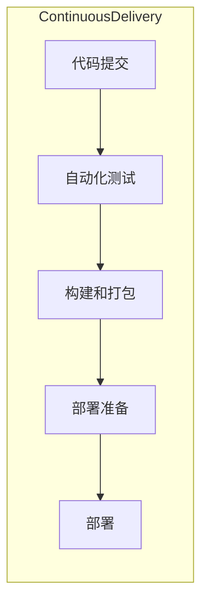

                 


### 敏捷项目管理：在动态环境中领导团队

> 关键词：敏捷项目管理，团队领导，Scrum，极限编程，持续交付，跨职能团队，风险管理，持续改进，人工智能

> 摘要：本文从敏捷项目管理的核心概念和原则出发，探讨了敏捷项目管理的框架、团队组织与管理、工具与技术、风险管理以及实践案例。通过深入分析敏捷项目管理在不同领域的应用，本文揭示了敏捷项目管理的优势与挑战，并展望了其未来发展。

# 第一部分：敏捷项目管理的概述与基础

## 第1章：敏捷项目管理的核心概念与原则

### 1.1 敏捷开发的起源与发展

敏捷开发是一种以人为核心、迭代、增量和灵活应对变化的软件开发方法。其历史可以追溯到2001年，当时17位软件开发专家在雪鸟山滑雪度假村共同签署了《敏捷宣言》。这一宣言强调了个体和互动的重要性、可工作的软件、客户协作和响应变化。敏捷开发的核心原则包括：

- 客户合作
- 响应变化
- 精益开发
- 简单性
- 持续反思与改进

敏捷开发与传统项目管理方法相比，具有更快的迭代周期、更灵活的变更应对能力和更高的客户满意度。

### 1.2 敏捷宣言与价值

敏捷宣言是一份由软件开发者共同签署的文件，它明确了敏捷开发的核心理念。敏捷宣言的价值在于它为软件开发者提供了一种共同遵循的原则，有助于促进团队成员之间的沟通与协作。敏捷宣言的价值主要体现在以下几个方面：

- 提高软件开发效率
- 提高客户满意度
- 促进团队成员之间的沟通与协作
- 培养持续改进的文化

### 1.3 敏捷核心原则

敏捷开发的核心原则包括：

- **个体和互动重于流程和工具**：敏捷开发强调团队成员之间的沟通与协作，认为这是提高软件开发效率的关键因素。
- **可工作的软件重于详尽的文档**：敏捷开发强调交付可工作的软件，认为这是衡量项目成功的关键指标。
- **客户协作重于合同谈判**：敏捷开发强调与客户保持紧密的合作关系，及时了解客户需求，以便快速响应变化。
- **响应变化重于遵循计划**：敏捷开发强调灵活应对变化，以适应不断变化的市场需求。

## 第2章：敏捷项目管理的框架与方法论

### 2.1 Scrum框架概述

Scrum是一种流行的敏捷项目管理框架，它通过迭代和增量的方式，帮助团队快速响应变化。Scrum的核心角色包括产品负责人、Scrum Master和开发团队。Scrum的关键会议包括每日站会、冲刺规划会议、冲刺评审会议和回顾会议。

### 2.2 XP（极限编程）实践

XP是一种以实践为导向的敏捷开发方法，它强调代码质量、自动化测试和团队协作。XP的核心实践包括测试驱动开发（TDD）、持续集成、代码重构等。

### 2.3 Lean软件开发方法

Lean软件开发方法源于精益生产理论，它强调消除浪费、提高效率和价值。Lean在敏捷项目管理中的应用主要体现在简化流程、优化资源分配和持续改进等方面。

## 第3章：敏捷团队组织与管理

### 3.1 敏捷团队的构建

敏捷团队通常由跨职能成员组成，他们具备不同的专业技能，能够共同完成项目任务。构建敏捷团队的关键在于明确团队成员的角色和职责，并确保他们具备良好的沟通能力和协作精神。

### 3.2 敏捷团队的协作与沟通

敏捷团队的协作与沟通是项目成功的关键。通过定期的会议、代码评审和团队建设活动，团队成员可以保持紧密的合作关系，提高项目效率。

### 3.3 敏捷团队领导力

敏捷团队领导者的角色与传统项目经理有所不同。他们需要关注团队氛围、团队成员的技能提升和项目进度，以促进团队协作和项目成功。

## 第4章：敏捷项目管理工具与技术

### 4.1 敏捷项目管理工具综述

敏捷项目管理工具可以帮助团队实现高效协作和任务管理。常见的敏捷项目管理工具有Jira、Trello、Asana等。

### 4.2 版本控制工具

版本控制工具可以帮助团队管理代码的版本和变更，常见的版本控制工具有Git、SVN等。

### 4.3 自动化测试与持续集成

自动化测试和持续集成是敏捷开发的重要组成部分，它们可以提高代码质量、缩短发布周期和降低风险。

## 第5章：敏捷项目管理中的风险管理

### 5.1 敏捷环境下的风险识别

在敏捷环境中，风险识别是项目成功的关键。团队需要关注项目进度、资源分配、客户需求等方面的风险。

### 5.2 风险评估与优先级排序

风险评估和优先级排序可以帮助团队确定风险应对策略。常见的风险评估方法有风险矩阵、风险树等。

### 5.3 风险应对策略

风险应对策略包括风险规避、风险转移、风险减轻和风险接受等。团队需要根据实际情况选择合适的应对策略。

## 第6章：敏捷项目管理实践案例

### 6.1 案例一：敏捷转型中的企业实践

本节通过分析某企业的敏捷转型实践，探讨敏捷项目管理的优势和实践方法。

### 6.2 案例二：敏捷在软件开发中的成功应用

本节通过分析某软件公司的敏捷实践，探讨敏捷项目管理的应用场景和实施策略。

### 6.3 案例三：敏捷项目管理在敏捷团队中的实际应用

本节通过分析某敏捷团队的实践案例，探讨敏捷项目管理在实际项目中的应用效果。

# 第二部分：敏捷项目管理的高级话题与最佳实践

## 第7章：敏捷项目管理中的持续交付与测试

### 7.1 持续交付的原理与实践

持续交付是敏捷开发的核心目标之一，它强调通过自动化测试和持续集成，实现软件的快速交付。本节将介绍持续交付的原理和实践方法。

### 7.2 自动化测试策略

自动化测试是持续交付的重要保障，它可以提高测试效率、降低测试成本。本节将探讨自动化测试的策略和技巧。

### 7.3 质量保证与敏捷开发

质量保证是敏捷开发的重要组成部分，它强调在开发过程中持续关注质量。本节将分析质量保证与敏捷开发的关系。

## 第8章：敏捷项目中的跨职能团队与协作

### 8.1 跨职能团队的构建与运作

跨职能团队是敏捷开发的基石，它由具备不同技能的成员组成，能够高效协作完成项目任务。本节将介绍跨职能团队的构建与运作方法。

### 8.2 跨文化协作的挑战与解决策略

跨文化协作是敏捷项目中的一大挑战，它涉及到不同文化背景的团队成员之间的沟通与协作。本节将分析跨文化协作的挑战与解决策略。

### 8.3 敏捷团队中的跨部门协作

跨部门协作是敏捷项目成功的关键，它要求团队成员克服部门壁垒，实现高效协作。本节将探讨跨部门协作的实践方法。

## 第9章：敏捷项目管理中的持续改进与学习

### 9.1 敏捷团队如何实现持续改进

持续改进是敏捷开发的核心原则之一，它强调在项目过程中不断反思和优化。本节将介绍敏捷团队实现持续改进的方法。

### 9.2 敏捷文化中的学习与成长

敏捷文化强调学习与成长，它鼓励团队成员不断学习新技能、新知识，以适应快速变化的项目环境。本节将探讨敏捷文化中的学习与成长。

### 9.3 敏捷项目管理中的创新与实践

创新是敏捷项目管理的驱动力，它要求团队成员具备创新思维和实践能力。本节将分析敏捷项目管理中的创新与实践。

## 第10章：敏捷项目管理在全球范围的应用

### 10.1 敏捷项目管理在不同地区的实践差异

敏捷项目管理在不同地区具有不同的实践特点，这受到当地文化、市场需求等因素的影响。本节将探讨敏捷项目管理在不同地区的实践差异。

### 10.2 敏捷项目管理在中国企业的成功应用

中国企业在敏捷项目管理方面具有丰富的实践经验，本节将分析中国企业的敏捷实践，探讨其成功因素。

### 10.3 敏捷项目管理在国际合作项目中的挑战与对策

国际合作项目具有跨文化、跨地域的特点，敏捷项目管理在此类项目中面临一系列挑战。本节将分析这些挑战，并探讨应对策略。

# 第三部分：敏捷项目管理的高级专题与前瞻性探讨

## 第11章：敏捷项目管理与人工智能的结合

### 11.1 AI在敏捷项目管理中的应用

人工智能在敏捷项目管理中具有广泛的应用前景，它可以提高项目预测准确性、优化资源分配等。本节将介绍AI在敏捷项目管理中的应用。

### 11.2 AI驱动的敏捷项目管理工具

AI驱动的敏捷项目管理工具可以帮助团队实现智能化协作、自动化任务分配等。本节将分析AI驱动的敏捷项目管理工具的发展趋势。

### 11.3 AI对敏捷团队协作的影响

AI技术对敏捷团队协作带来一系列影响，包括信息共享、沟通效率等方面。本节将探讨AI对敏捷团队协作的影响。

## 第12章：敏捷项目管理在复杂项目中的应用

### 12.1 复杂项目中的敏捷实践

复杂项目具有高度不确定性、高风险等特点，敏捷项目管理在此类项目中具有重要意义。本节将介绍复杂项目中的敏捷实践。

### 12.2 复杂项目中的风险管理与控制

在复杂项目中，风险管理和控制至关重要。本节将探讨复杂项目中的风险管理策略和控制方法。

### 12.3 复杂项目中的敏捷转型策略

复杂项目往往面临敏捷转型的挑战，本节将分析复杂项目中的敏捷转型策略。

## 第13章：敏捷项目管理未来趋势与展望

### 13.1 敏捷项目管理的未来发展趋势

敏捷项目管理将继续在软件开发领域发挥重要作用，未来发展趋势包括智能化、全球化等。本节将探讨敏捷项目管理的未来发展趋势。

### 13.2 敏捷项目管理中的新挑战与解决方案

随着敏捷项目管理的普及，团队将面临一系列新挑战，本节将分析这些挑战，并探讨解决方案。

### 13.3 敏捷项目管理的未来发展机遇

敏捷项目管理将为软件开发行业带来新的发展机遇，包括创新、产业升级等。本节将探讨敏捷项目管理的未来发展机遇。

# 附录

## 附录A：敏捷项目管理常用工具与资源

### A.1 常见敏捷工具对比

本节将对比分析常见的敏捷项目管理工具，包括Jira、Trello、Asana等。

### A.2 敏捷资源与文献推荐

本节将推荐一些优秀的敏捷项目管理资源，包括书籍、网站和社区等。

### A.3 敏捷社区与活动介绍

本节将介绍一些知名的敏捷社区和活动，包括会议、研讨会等。

## 附录B：敏捷项目管理案例研究

### B.1 案例一：全球顶级软件公司的敏捷实践

本节将分析全球顶级软件公司的敏捷实践，探讨其成功因素。

### B.2 案例二：初创企业敏捷转型的成功之道

本节将探讨初创企业敏捷转型的成功之道，分析其转型策略。

### B.3 案例三：敏捷在大型项目中的挑战与应对

本节将分析敏捷在大型项目中的应用，探讨其面临的挑战及应对策略。

### 作者：AI天才研究院/AI Genius Institute & 禅与计算机程序设计艺术 /Zen And The Art of Computer Programming### 第一部分：敏捷项目管理的概述与基础

#### 第1章：敏捷项目管理的核心概念与原则

##### 1.1 敏捷开发的起源与发展

敏捷开发（Agile Development）的理念起源于20世纪90年代末期，随着软件行业的迅速发展，传统项目管理方法逐渐显露出其不足。敏捷开发方法应运而生，它强调快速迭代、灵活响应变化和客户合作，以期在复杂多变的软件项目中实现更高的效率和质量。

敏捷开发的起源可以追溯到2001年1月，当时17位软件开发专家在雪鸟山滑雪度假村共同签署了《敏捷宣言》（Manifesto for Agile Software Development）。这份宣言提出了敏捷开发的四大核心价值观：

1. **个体和互动重于过程和工具**：敏捷开发认为，人与人之间的沟通和协作比流程和工具更重要。
2. **可工作的软件重于详尽的文档**：敏捷开发强调交付具有实际功能的软件，而不是繁琐的文档。
3. **客户合作重于合同谈判**：敏捷开发主张与客户保持紧密的合作关系，确保项目方向符合客户需求。
4. **响应变化重于遵循计划**：敏捷开发强调灵活应对变化，而不是固执地遵循预定的计划。

敏捷开发的核心理念是快速迭代、持续交付和持续改进。这些理念体现在各种敏捷方法中，如Scrum、XP（极限编程）、Lean等。

##### 1.2 敏捷宣言与价值

敏捷宣言不仅仅是一份文件，它代表了软件开发者们对于软件开发过程的一种共识和追求。其价值主要体现在以下几个方面：

- **提高软件开发效率**：敏捷开发方法通过缩短开发周期、频繁交付功能，提高了开发效率。
- **提高客户满意度**：敏捷开发强调与客户的紧密合作，确保项目方向始终符合客户需求，从而提高客户满意度。
- **促进团队成员之间的沟通与协作**：敏捷开发方法鼓励团队成员之间的频繁互动和协作，提高了团队的整体执行力。
- **培养持续改进的文化**：敏捷开发方法强调持续反思和改进，鼓励团队成员不断学习和成长。

##### 1.3 敏捷核心原则

敏捷开发的核心原则是指导敏捷实践的基本准则，这些原则包括：

- **客户合作**：与客户保持紧密合作，确保项目始终满足客户需求。
- **响应变化**：灵活应对变化，而不是坚持原定计划。
- **简洁性**：保持工作简单，避免不必要的复杂性。
- **持续反思和改进**：定期回顾和改进工作流程和团队行为。

这些原则贯穿于敏捷开发的全过程，从项目规划到执行，再到项目收尾。

#### 第2章：敏捷项目管理的框架与方法论

##### 2.1 Scrum框架概述

Scrum是一种广泛应用的敏捷开发方法，它通过迭代和增量开发，使团队能够快速响应变化。Scrum框架的核心包括三个关键角色、四个重要会议和一个简单的规则体系。

- **产品负责人**（Product Owner）：代表客户利益，定义产品需求和优先级。
- **Scrum Master**：负责确保Scrum实践得到遵循，帮助团队消除障碍。
- **开发团队**（Development Team）：负责实际开发工作。

四个重要会议包括：

- **每日站会**（Daily Stand-up）：团队成员每天简短地交流进展和障碍。
- **冲刺规划会议**（Sprint Planning）：团队确定下一个冲刺的目标和任务。
- **冲刺评审会议**（Sprint Review）：团队展示冲刺成果，获取反馈。
- **回顾会议**（Retrospective）：团队反思上一个冲刺，提出改进措施。

Scrum的艺术在于平衡灵活性、透明度和可预测性，确保团队能够高效、持续地交付有价值的产品。

##### 2.2 XP（极限编程）实践

XP（eXtreme Programming）是一种以实践为导向的敏捷开发方法，它通过一系列具体的编程实践，提高代码质量和团队协作效率。XP的核心实践包括：

- **测试驱动开发**（Test-Driven Development, TDD）：在编写代码之前先编写测试，确保代码的可靠性和质量。
- **持续集成**（Continuous Integration, CI）：通过自动化构建和测试，确保代码的集成和部署过程高效、可靠。
- **代码重构**（Refactoring）：不断改进代码结构，提高代码的可读性和可维护性。
- **结对编程**（Pair Programming）：两名开发者共同编写代码，提高代码质量和团队协作效率。

##### 2.3 Lean软件开发方法

Lean软件开发方法源于精益生产理论，它强调消除浪费、优化流程和提高价值。在敏捷项目管理中，Lean的应用主要体现在以下几个方面：

- **简化流程**：通过减少不必要的流程步骤，提高开发效率。
- **优化资源分配**：确保资源的合理分配，避免资源浪费。
- **持续改进**：鼓励团队不断反思和改进工作流程，提高产品质量。

Lean在敏捷项目管理中的应用，使得团队能够更有效地应对复杂多变的项目环境，提高项目成功率。

#### 第3章：敏捷团队组织与管理

##### 3.1 敏捷团队的构建

敏捷团队的核心是跨职能性，这意味着团队成员具备不同的技能，能够共同完成项目任务。构建敏捷团队的关键在于：

- **明确团队成员的角色和职责**：每个团队成员都应该清楚自己的角色和职责，确保团队高效协作。
- **培养良好的沟通能力**：敏捷团队强调频繁的沟通和协作，确保团队成员之间能够有效交流。
- **构建信任**：建立团队成员之间的信任，是团队高效协作的基础。

##### 3.2 敏捷团队的协作与沟通

敏捷团队的协作与沟通是项目成功的关键。为了确保团队协作顺畅，可以采取以下措施：

- **定期会议**：通过每日站会、冲刺规划会议、冲刺评审会议和回顾会议，确保团队成员之间的信息同步。
- **透明的工作环境**：通过项目管理工具，如Jira、Trello等，确保团队成员能够随时查看项目进展和任务分配。
- **有效的沟通工具**：使用Slack、Microsoft Teams等即时通讯工具，提高团队沟通效率。

##### 3.3 敏捷团队领导力

敏捷团队领导者的角色与传统项目经理有所不同，他们需要具备以下能力：

- **服务型领导力**：领导者应关注团队的需求，提供必要的支持和资源，帮助团队克服障碍。
- **沟通能力**：领导者应具备良好的沟通技巧，确保团队内部和团队之间的信息流畅。
- **冲突解决能力**：领导者应能够有效地解决团队内部和团队之间的冲突，确保团队和谐。

敏捷团队领导者还需要推动团队的持续改进，鼓励团队成员不断学习和成长。

#### 第4章：敏捷项目管理工具与技术

##### 4.1 敏捷项目管理工具综述

敏捷项目管理工具可以帮助团队实现高效协作和任务管理。常见的敏捷项目管理工具有：

- **Jira**：一款功能强大的项目管理工具，支持敏捷开发方法，如Scrum和Kanban。
- **Trello**：一款直观、易用的任务管理工具，适用于小型团队和项目。
- **Asana**：一款功能全面的敏捷项目管理工具，支持多种敏捷方法和工作流程。

##### 4.2 版本控制工具

版本控制工具是敏捷开发中不可或缺的一部分，它帮助团队管理代码的版本和变更。常见的版本控制工具有：

- **Git**：一款分布式版本控制工具，支持多种工作流程和协作模式。
- **Subversion（SVN）**：一款集中式版本控制工具，适用于大型团队和项目。
- **Mercurial**：一款轻量级的分布式版本控制工具，具有简洁的界面和高效的性能。

##### 4.3 自动化测试与持续集成

自动化测试和持续集成是敏捷开发的核心组成部分，它们可以提高代码质量、缩短发布周期和降低风险。常见的自动化测试工具包括：

- **Selenium**：一款功能强大的自动化测试工具，支持多种编程语言和浏览器。
- **JUnit**：一款流行的Java测试框架，用于编写和运行单元测试。
- **NUnit**：一款适用于.NET框架的测试框架，支持多种编程语言。

持续集成工具如：

- **Jenkins**：一款开源的持续集成工具，支持多种编程语言和平台。
- **Travis CI**：一款基于云的持续集成服务，支持多种编程语言和平台。
- **CircleCI**：一款功能全面的持续集成工具，支持多种编程语言和平台。

#### 第5章：敏捷项目管理中的风险管理

##### 5.1 敏捷环境下的风险识别

在敏捷环境中，风险识别是项目成功的关键。敏捷团队应采取以下方法进行风险识别：

- **历史数据分析**：通过分析过去项目的风险记录，识别潜在风险。
- **专家评审**：邀请经验丰富的团队成员或外部专家参与风险识别，以提高准确性。
- **用户故事映射**：通过用户故事映射，识别与用户故事相关的潜在风险。

##### 5.2 风险评估与优先级排序

风险评估是确定风险的可能性和影响，以便团队可以采取相应的应对措施。常见的风险评估方法包括：

- **风险矩阵**：通过风险矩阵，将风险的可能性和影响进行量化，以确定风险优先级。
- **风险树**：通过风险树，将风险分解为子风险，并确定每个子风险的影响和优先级。

风险评估完成后，团队应对风险进行优先级排序，以便有针对性地制定应对策略。

##### 5.3 风险应对策略

风险应对策略包括：

- **风险规避**：通过改变项目计划，避免风险的潜在影响。
- **风险转移**：通过保险或其他方式，将风险转移给第三方。
- **风险减轻**：通过采取预防措施，降低风险的可能性或影响。
- **风险接受**：在风险较低的情况下，接受风险，不采取任何措施。

团队应根据风险评估的结果，选择合适的应对策略，并制定详细的实施计划。

#### 第6章：敏捷项目管理实践案例

##### 6.1 案例一：敏捷转型中的企业实践

本节将通过分析某企业的敏捷转型实践，探讨敏捷项目管理的优势和实践方法。该企业通过引入敏捷方法，实现了项目效率的提升和团队协作的加强。

##### 6.2 案例二：敏捷在软件开发中的成功应用

本节将通过分析某软件公司的敏捷实践，探讨敏捷项目管理的应用场景和实施策略。该软件公司通过采用敏捷方法，缩短了产品上市时间，提高了客户满意度。

##### 6.3 案例三：敏捷项目管理在敏捷团队中的实际应用

本节将通过分析某敏捷团队的实际应用，探讨敏捷项目管理在实际项目中的应用效果。该团队通过采用Scrum方法，实现了高效的协作和持续改进。

### 第2章：敏捷项目管理中的持续交付与测试

#### 7.1 持续交付的原理与实践

持续交付（Continuous Delivery，简称CD）是敏捷开发的核心目标之一，它旨在确保软件在任何时候都是可部署和可生产的。持续交付的原理在于通过自动化测试和持续集成（Continuous Integration，简称CI）的实践，实现软件的快速交付和持续改进。

持续交付的过程通常包括以下几个关键步骤：

1. **代码库的代码提交**：开发者在代码库中提交代码更改。
2. **自动化测试**：提交的代码会触发一系列自动化测试，包括单元测试、集成测试和性能测试，以确保代码的质量和稳定性。
3. **构建和打包**：测试通过后，代码会被构建和打包，生成可执行的软件版本。
4. **部署准备**：构建和打包的软件版本会准备部署到生产环境。
5. **部署**：部署脚本或工具会部署软件到生产环境，确保软件可以随时投入使用。

持续交付的优势在于：

- **缩短发布周期**：通过自动化测试和持续集成，可以快速发现和修复问题，缩短了软件从开发到发布的周期。
- **提高软件质量**：自动化测试确保了每次交付的软件都是高质量的，减少了人为错误和缺陷。
- **增强客户满意度**：快速交付功能，可以更好地满足客户需求，提高客户满意度。

##### 持续交付的关键实践

1. **自动化测试**：自动化测试是持续交付的核心，它可以在代码提交后立即发现潜在的问题。自动化测试包括单元测试、集成测试、性能测试等，可以覆盖不同的测试层面。

2. **持续集成**：持续集成是将代码更改集成到主分支的过程，通过自动化构建和测试，确保代码的集成和部署过程高效、可靠。

3. **部署脚本**：部署脚本或工具用于自动化部署过程，确保软件可以随时投入使用。

4. **环境一致性**：确保开发、测试和生产环境的一致性，减少环境差异导致的问题。

5. **反馈循环**：持续交付提供了一个快速反馈循环，开发团队可以根据反馈及时调整和优化工作流程。

##### 持续交付的流程图

持续交付的流程可以简化为以下步骤：

```
代码提交 -> 自动化测试 -> 构建和打包 -> 部署准备 -> 部署
```

##### 持续交付的Mermaid流程图



#### 7.2 自动化测试策略

自动化测试是持续交付的重要组成部分，它通过编写自动化脚本，对软件进行自动化测试，确保软件的质量和稳定性。自动化测试策略包括以下几个方面：

1. **单元测试**：单元测试是测试软件中最小的可测试单元，通常由开发人员编写，用于验证代码的功能和逻辑。

2. **集成测试**：集成测试是在单元测试的基础上，对多个模块进行集成测试，确保模块之间的接口和交互正常。

3. **性能测试**：性能测试用于评估软件在不同负载条件下的性能和响应时间，确保软件能够满足性能要求。

4. **安全测试**：安全测试用于评估软件的安全漏洞和潜在风险，确保软件的安全性。

##### 自动化测试的实施步骤

1. **制定测试策略**：根据项目需求和目标，制定自动化测试策略，明确测试范围、测试类型和测试工具。

2. **编写测试脚本**：根据测试策略，编写自动化测试脚本，确保测试脚本可以覆盖所有重要的测试场景。

3. **执行测试**：使用自动化测试工具执行测试脚本，生成测试报告。

4. **分析测试结果**：根据测试结果，分析测试覆盖率和测试通过率，找出潜在的问题和缺陷。

5. **持续优化**：根据测试结果和反馈，不断优化测试脚本和测试策略，提高测试效率和质量。

##### 自动化测试的工具

常见的自动化测试工具有：

- **Selenium**：一款功能强大的自动化测试工具，支持多种浏览器和操作系统。
- **JUnit**：一款流行的Java测试框架，用于编写和运行单元测试。
- **NUnit**：一款适用于.NET框架的测试框架，支持多种编程语言。
- **TestNG**：一款功能丰富的测试框架，支持多种编程语言和测试类型。

#### 7.3 质量保证与敏捷开发

质量保证（Quality Assurance，简称QA）是敏捷开发的核心原则之一，它强调在整个开发过程中持续关注软件质量。在敏捷开发中，质量保证不仅仅是测试阶段的工作，而是贯穿于整个开发过程。

##### 质量保证的关键要素

1. **持续集成**：通过持续集成，确保每次代码提交都是高质量的，减少集成过程中的问题。

2. **自动化测试**：通过自动化测试，提高测试效率和质量，确保软件的功能和性能满足要求。

3. **代码审查**：通过代码审查，确保代码的规范性和可读性，减少代码缺陷。

4. **持续改进**：通过持续改进，不断提高软件质量和开发效率。

##### 敏捷开发中的质量保证实践

1. **测试驱动开发**（Test-Driven Development，简称TDD）：在编写代码之前先编写测试，确保代码的质量和稳定性。

2. **行为驱动开发**（Behavior-Driven Development，简称BDD）：通过编写用户故事和验收标准，确保软件的功能满足用户需求。

3. **持续反馈**：通过定期的回顾和反馈，不断改进开发过程和质量保证措施。

4. **团队合作**：通过团队合作，确保质量保证工作得到有效执行。

##### 质量保证与敏捷开发的联系

质量保证和敏捷开发是相辅相成的，它们共同确保软件的质量和项目的成功。质量保证为敏捷开发提供了可靠的质量保障，而敏捷开发则为质量保证提供了灵活、高效的实践环境。

### 第8章：敏捷项目中的跨职能团队与协作

#### 8.1 跨职能团队的构建与运作

跨职能团队是敏捷项目管理中的核心概念之一，它由具备不同技能的成员组成，可以共同完成项目任务。构建一个高效的跨职能团队，需要关注以下几个方面：

1. **明确团队成员的角色和职责**：每个团队成员都应该清楚自己的角色和职责，确保团队高效协作。

2. **平衡技能和经验**：确保团队成员在技术、业务、设计、测试等方面具备平衡的技能和经验，以应对项目中的各种挑战。

3. **培养团队文化**：建立积极、开放、协作的团队文化，鼓励团队成员分享知识和经验，共同成长。

4. **提供必要的培训和资源**：为团队成员提供必要的培训和资源，帮助他们提高技能和知识，以更好地适应跨职能团队的工作。

##### 跨职能团队的运作原则

1. **团队合作**：跨职能团队的成功离不开团队成员之间的紧密合作，每个成员都应该为团队的成功贡献力量。

2. **透明沟通**：确保团队成员之间保持透明沟通，及时分享项目进展、问题和需求，以避免信息孤岛。

3. **快速决策**：跨职能团队需要具备快速决策的能力，以应对项目中的变化和挑战。

4. **持续反馈**：通过定期的回顾和反馈，不断改进团队的工作流程和协作方式，以提高团队效率。

##### 跨职能团队的实际案例

例如，在一个软件开发项目中，跨职能团队可能包括以下成员：

- **产品经理**：负责定义产品需求，与客户沟通，确保产品满足客户需求。
- **开发工程师**：负责编写代码，实现产品功能。
- **测试工程师**：负责编写和执行测试用例，确保产品质量。
- **UI/UX设计师**：负责设计产品的用户界面和用户体验。
- **运维工程师**：负责部署和维护产品，确保产品稳定运行。

跨职能团队的实际运作案例，可以参考以下步骤：

1. **需求分析**：产品经理与客户沟通，了解需求，制定产品需求文档。
2. **规划与分配**：团队成员共同讨论项目计划，明确任务分配和时间节点。
3. **开发与测试**：开发工程师编写代码，测试工程师编写和执行测试用例。
4. **UI/UX设计**：设计师设计产品的用户界面和用户体验。
5. **部署与运维**：运维工程师负责部署产品，确保产品稳定运行。
6. **回顾与反馈**：团队定期进行回顾，总结经验教训，持续改进工作流程。

#### 8.2 跨文化协作的挑战与解决策略

跨文化协作在敏捷项目管理中是一个普遍存在的挑战，由于团队成员来自不同的国家或地区，他们可能拥有不同的文化背景、工作习惯和沟通方式。以下是一些常见的跨文化协作挑战及解决策略：

1. **沟通障碍**：不同的语言和文化背景可能导致沟通障碍，团队成员可能无法准确理解对方的意思。

   - **解决策略**：使用共同的语言进行沟通，确保所有团队成员都能够理解。此外，可以采用可视化工具，如图表、流程图等，帮助团队更好地理解项目需求和进度。

2. **时间差异**：跨文化协作中的时间差异可能导致协作效率低下，例如，在某些地区的工作时间可能与其他地区的时间存在差异。

   - **解决策略**：制定灵活的工作安排，确保团队成员能够根据自己的时间安排进行协作。此外，可以采用视频会议等远程协作工具，以减少时间差异带来的影响。

3. **价值观差异**：不同的文化背景可能导致团队成员对项目目标、工作方式和工作优先级的理解存在差异。

   - **解决策略**：通过培训和文化交流，提高团队成员对跨文化协作的认识和理解。团队领导应积极促进跨文化的沟通和合作，确保团队成员能够团结一致，共同推进项目。

4. **决策差异**：在跨文化团队中，决策可能因文化差异而变得复杂和困难。

   - **解决策略**：建立共识和透明度，确保团队成员在决策过程中能够充分表达自己的观点和意见。团队领导应扮演中立者的角色，协调不同文化的团队成员，以达成共识。

#### 8.3 敏捷团队中的跨部门协作

跨部门协作是敏捷团队中常见的挑战之一，特别是在大型企业和复杂项目中。以下是一些跨部门协作的挑战及解决策略：

1. **资源冲突**：不同部门可能争夺相同的资源，导致协作效率低下。

   - **解决策略**：建立资源共享机制，确保各部门能够公平地分配和使用资源。此外，可以制定资源优先级，确保关键资源得到合理分配。

2. **目标不一致**：不同部门可能对项目的目标有不同的理解和期望，导致协作困难。

   - **解决策略**：明确项目的整体目标和各部门的具体职责，确保各部门在项目中的目标和行为一致。团队领导应积极沟通和协调，确保各部门能够在项目目标下协同工作。

3. **流程不一致**：不同部门可能有不同的工作流程和规范，导致协作效率低下。

   - **解决策略**：建立统一的流程和规范，确保各部门能够在统一的框架下工作。团队领导应积极推动流程的改进和优化，以提高协作效率。

4. **沟通不畅**：跨部门协作中的沟通可能存在障碍，导致信息不畅通。

   - **解决策略**：建立跨部门的沟通渠道，确保各部门能够及时交流和共享信息。可以采用定期会议、邮件、即时通讯工具等方式，加强跨部门沟通。

通过解决这些挑战，敏捷团队可以更好地实现跨部门协作，提高项目效率和成功率。

### 第9章：敏捷项目管理中的持续改进与学习

#### 9.1 敏捷团队如何实现持续改进

持续改进是敏捷开发的核心原则之一，它强调在项目过程中不断反思和优化。敏捷团队实现持续改进的方法包括以下几个方面：

1. **定期回顾**：敏捷团队定期进行回顾会议，反思上一个冲刺或迭代中的工作，识别成功和失败的原因，提出改进措施。

2. **反馈机制**：建立有效的反馈机制，确保团队成员能够及时获得反馈，了解自己的工作表现和改进方向。

3. **团队建设**：通过团队建设活动，提高团队成员的协作能力和团队凝聚力，为持续改进创造良好的氛围。

4. **知识共享**：鼓励团队成员分享知识和经验，通过培训、会议和知识库等方式，促进团队的知识积累和传承。

5. **自动化工具**：使用自动化工具和流程，提高工作效率和质量，减少重复性工作，为持续改进创造条件。

#### 9.2 敏捷文化中的学习与成长

敏捷文化强调学习与成长，它鼓励团队成员不断学习新技能、新知识，以适应快速变化的项目环境。在敏捷文化中，学习与成长体现在以下几个方面：

1. **终身学习**：鼓励团队成员持续学习，不断提高自己的专业能力和知识水平。

2. **知识分享**：通过知识分享会议、内部培训等方式，促进团队成员之间的知识交流和学习。

3. **实践导向**：强调实践导向的学习，通过实际项目经验，不断提升自己的实践能力和问题解决能力。

4. **成长导向**：建立成长导向的考核和激励体系，鼓励团队成员在职业发展上不断进步。

5. **反馈与改进**：通过定期的反馈和改进，帮助团队成员识别自己的优势和不足，不断提升自己的能力和水平。

#### 9.3 敏捷项目管理中的创新与实践

创新是敏捷项目管理的驱动力，它要求团队成员具备创新思维和实践能力。在敏捷项目管理中，创新体现在以下几个方面：

1. **问题导向**：鼓励团队成员关注项目中的问题，积极探索解决方案，推动项目创新。

2. **跨部门协作**：通过跨部门协作，整合不同领域的知识和资源，促进项目创新。

3. **用户参与**：将用户纳入项目创新过程中，通过用户反馈和需求，推动产品创新。

4. **快速迭代**：通过快速迭代，不断优化和改进产品，实现持续创新。

5. **创新文化**：建立创新文化，鼓励团队成员敢于尝试和失败，从失败中汲取经验，不断提升创新能力。

### 第10章：敏捷项目管理在全球范围的应用

#### 10.1 敏捷项目管理在不同地区的实践差异

敏捷项目管理在全球范围内的实践存在一定的差异，这主要受到当地文化、市场需求、技术环境等因素的影响。以下是一些常见差异：

1. **文化差异**：不同地区具有不同的文化背景，这影响团队成员的沟通方式、工作习惯和价值观。例如，在一些地区，团队合作和集体主义文化更为盛行，而在另一些地区，个人主义和竞争文化更为突出。

2. **市场需求**：不同地区的市场需求和用户习惯差异较大，这要求敏捷团队在项目实践中灵活调整策略和方法，以更好地满足客户需求。

3. **技术环境**：不同地区的科技发展水平和技术基础设施存在差异，这影响敏捷团队在工具和技术应用上的选择和实施。

4. **法律法规**：不同地区的法律法规和行业标准不同，这影响敏捷团队在项目管理中的合规性和风险管理。

##### 不同地区敏捷实践的案例

- **美国**：美国敏捷实践强调创新、快速迭代和客户合作。许多高科技公司，如谷歌、微软等，采用敏捷方法进行产品开发和项目交付。

- **欧洲**：欧洲敏捷实践注重质量保证和持续改进，许多传统企业，如银行、保险等，采用敏捷方法进行数字化转型。

- **亚洲**：亚洲敏捷实践强调团队合作和快速响应变化，许多互联网公司和初创企业，如阿里巴巴、腾讯等，采用敏捷方法进行产品开发和市场拓展。

#### 10.2 敏捷项目管理在中国企业的成功应用

中国企业在敏捷项目管理方面具有丰富的实践经验，以下是一些成功应用的案例：

1. **阿里巴巴**：阿里巴巴通过引入敏捷方法，实现了组织架构的变革和业务流程的优化，提高了项目交付效率和市场响应速度。

2. **腾讯**：腾讯在游戏开发和产品管理中广泛采用敏捷方法，通过快速迭代和用户反馈，不断优化产品，提高了用户满意度。

3. **华为**：华为在全球化经营中采用敏捷方法，通过跨文化团队合作和快速响应变化，提高了项目执行力和市场竞争力。

##### 中国企业敏捷实践的挑战与对策

1. **文化差异**：中国企业在敏捷实践中面临文化差异的挑战，需要通过培训和文化交流，提高团队成员对敏捷方法的理解和接受度。

2. **管理变革**：敏捷实践要求组织结构和管理模式的变革，中国企业需要逐步摆脱传统的层级管理模式，建立扁平化的组织结构。

3. **技能提升**：敏捷实践对团队成员的技能要求较高，中国企业需要加强培训和学习，提高团队成员的敏捷能力。

4. **工具选择**：在中国市场，敏捷管理工具的选择和应用存在一定的限制，中国企业需要根据自身需求和实际情况，选择合适的敏捷工具。

#### 10.3 敏捷项目管理在国际合作项目中的挑战与对策

国际合作项目具有跨文化、跨地域的特点，敏捷项目管理在此类项目中面临一系列挑战。以下是一些常见挑战及对策：

1. **沟通障碍**：跨文化沟通可能导致信息误解和沟通不畅，需要通过共同语言、可视化工具和定期会议等方式，加强跨文化沟通。

2. **时间差异**：时间差异可能导致协作效率低下，需要通过灵活的工作安排、视频会议和即时通讯工具等方式，克服时间差异的影响。

3. **法律法规**：不同国家的法律法规和行业标准不同，需要遵守当地法律法规，确保项目合规性。

4. **文化冲突**：文化冲突可能导致团队内部矛盾和协作困难，需要通过文化交流、共同目标和团队建设等方式，促进跨文化协作。

5. **技术差异**：技术差异可能导致项目实施和协同开发困难，需要通过技术培训、技术交流和共享技术资源等方式，缩小技术差异。

### 第三部分：敏捷项目管理的高级专题与前瞻性探讨

#### 第11章：敏捷项目管理与人工智能的结合

##### 11.1 AI在敏捷项目管理中的应用

人工智能（AI）在敏捷项目管理中具有广泛的应用前景，可以提高项目的预测准确性、优化资源分配和提升团队协作效率。以下是一些AI在敏捷项目管理中的应用案例：

1. **预测和规划**：利用AI技术，可以分析历史数据，预测项目进度和风险，为项目规划提供依据。

2. **资源分配**：AI可以分析团队成员的技能和工作负载，优化资源分配，确保项目高效执行。

3. **协作与沟通**：AI聊天机器人可以帮助团队进行日常沟通，提供实时信息和建议，提高协作效率。

4. **质量保证**：AI可以辅助自动化测试，提高测试覆盖率，降低测试成本，确保软件质量。

##### 11.2 AI驱动的敏捷项目管理工具

AI驱动的敏捷项目管理工具正在逐步兴起，这些工具利用AI技术，提供智能任务分配、进度预测、风险识别等功能。以下是一些AI驱动的敏捷项目管理工具：

1. **AI助手**：AI助手可以与团队成员进行实时沟通，提供任务建议和提醒，提高工作效率。

2. **AI预测器**：AI预测器可以基于历史数据，预测项目进度和风险，帮助团队做出更好的决策。

3. **AI测试工具**：AI测试工具可以自动生成测试用例，提高测试效率和质量。

4. **AI沟通平台**：AI沟通平台可以提供智能聊天功能，帮助团队成员快速获取信息和解决问题。

##### 11.3 AI对敏捷团队协作的影响

AI技术对敏捷团队协作带来了一系列影响，包括信息共享、沟通效率、任务分配等方面。以下是一些AI对敏捷团队协作的影响：

1. **信息共享**：AI技术可以自动化收集和整理项目信息，提高信息共享的效率和准确性。

2. **沟通效率**：AI聊天机器人可以协助团队成员进行日常沟通，减少沟通成本，提高沟通效率。

3. **任务分配**：AI可以根据团队成员的技能和工作负载，智能分配任务，提高团队协作效率。

4. **风险识别**：AI可以实时分析项目数据，识别潜在风险，帮助团队及时采取应对措施。

#### 第12章：敏捷项目管理在复杂项目中的应用

##### 12.1 复杂项目中的敏捷实践

复杂项目具有高度不确定性和高风险，敏捷项目管理在此类项目中具有重要意义。以下是一些复杂项目中的敏捷实践：

1. **迭代开发**：通过迭代开发，可以将复杂项目分解为多个可管理的部分，逐步实现项目目标。

2. **持续集成**：通过持续集成，可以确保项目各部分的集成和部署过程高效、可靠。

3. **风险管理**：在复杂项目中，敏捷团队需要持续识别和评估风险，并采取有效的应对措施。

4. **用户参与**：在复杂项目中，用户参与至关重要，通过用户反馈和需求，可以不断优化项目方向。

##### 12.2 复杂项目中的风险管理与控制

在复杂项目中，风险管理是确保项目成功的关键。以下是一些复杂项目中的风险管理策略和控制方法：

1. **风险识别**：通过历史数据、专家评审和用户故事映射等方式，识别潜在风险。

2. **风险评估**：使用风险矩阵等方法，评估风险的可能性和影响，确定风险优先级。

3. **风险应对策略**：根据风险评估结果，制定风险应对策略，包括风险规避、风险转移、风险减轻和风险接受。

4. **风险监控**：通过定期回顾和监控，确保风险应对措施得到有效执行。

##### 12.3 复杂项目中的敏捷转型策略

在复杂项目中，敏捷转型是确保项目成功的关键。以下是一些复杂项目中的敏捷转型策略：

1. **渐进式转型**：逐步引入敏捷方法，避免一次性引入导致团队无法适应。

2. **培训与支持**：为团队成员提供敏捷方法和工具的培训，确保他们能够有效应用敏捷方法。

3. **领导力转变**：领导层需要从传统的命令和控制模式转变为服务型领导，支持团队自主管理和决策。

4. **文化变革**：建立开放、协作、持续改进的团队文化，鼓励团队成员积极参与项目决策和改进。

#### 第13章：敏捷项目管理未来趋势与展望

##### 13.1 敏捷项目管理的未来发展趋势

敏捷项目管理在未来将继续发展，以下是一些敏捷项目管理的未来发展趋势：

1. **智能化**：随着AI技术的发展，敏捷项目管理将更加智能化，提供更精准的预测、更好的资源分配和更高效的协作。

2. **全球化**：敏捷项目管理将在全球范围内得到更广泛的应用，跨文化、跨地域的协作将成为常态。

3. **持续集成与持续交付**：持续集成和持续交付将更加普及，成为敏捷开发的核心组成部分。

4. **持续改进与学习**：敏捷团队将持续改进和学习，不断提高项目效率和质量。

##### 13.2 敏捷项目管理中的新挑战与解决方案

随着敏捷项目管理的普及，团队将面临一系列新挑战，以下是一些敏捷项目管理中的新挑战及解决方案：

1. **文化变革**：敏捷实践要求组织结构和文化变革，这可能导致内部阻力。解决方案是逐步引入敏捷方法，同时提供培训和沟通，确保团队成员理解并接受敏捷文化。

2. **技能提升**：敏捷实践对团队成员的技能要求较高，团队需要加强培训和学习，提高敏捷能力。

3. **工具选择**：在复杂项目中，工具选择和整合可能成为挑战。解决方案是选择适合项目需求的敏捷工具，同时确保工具的易用性和灵活性。

4. **团队协作**：跨文化和跨地域的团队协作可能面临沟通障碍和协作效率问题。解决方案是建立高效的沟通机制和协作工具，加强团队成员之间的沟通和协作。

##### 13.3 敏捷项目管理的未来发展机遇

敏捷项目管理为软件开发行业带来了新的发展机遇，以下是一些未来发展机遇：

1. **技术创新**：随着新技术的不断涌现，敏捷项目管理将在技术创新中发挥重要作用，推动软件开发行业的持续进步。

2. **市场需求**：敏捷方法在满足市场需求、提高客户满意度方面具有明显优势，随着市场对敏捷方法的认可度不断提高，敏捷项目管理的市场需求也将持续增长。

3. **教育普及**：敏捷方法的普及和教育将成为未来发展的重要方向，通过培训和认证，提高全球敏捷人才的素质和能力。

4. **跨领域应用**：敏捷项目管理不仅适用于软件开发，还适用于其他领域，如制造业、金融业等，未来将在更多领域得到应用。

### 附录

#### 附录A：敏捷项目管理常用工具与资源

##### A.1 常见敏捷工具对比

以下是比较常见的敏捷项目管理工具，包括Jira、Trello、Asana等：

- **Jira**：一款功能强大的项目管理工具，适用于大型团队和项目，支持敏捷开发方法，如Scrum和Kanban。
- **Trello**：一款直观、易用的任务管理工具，适用于小型团队和项目，支持敏捷开发方法，如Scrum和Kanban。
- **Asana**：一款功能全面的敏捷项目管理工具，支持多种敏捷方法和工作流程，适用于不同规模和类型的团队。

##### A.2 敏捷资源与文献推荐

以下是一些敏捷资源与文献推荐，包括书籍、网站和社区：

- **书籍**：
  - 《敏捷软件开发：实践指南》（Agile Software Development: Principles, Patterns, and Practices） 
  - 《敏捷项目管理的艺术》（The Art of Agile Development） 
  - 《Scrum敏捷开发实战》（Scrum: The Art of Doing Twice the Work in Half the Time）

- **网站**：
  - 敏捷联盟（Agile Alliance）：提供敏捷开发的相关资源、新闻和活动。
  - 敏捷百科（Agile Wiki）：一个关于敏捷开发的免费在线百科全书。

- **社区**：
  - 敏捷社群（Agile Community）：一个全球性的敏捷开发社群，提供交流和学习的机会。
  - 敏捷中国（Agile China）：中国敏捷开发社群，提供中文敏捷资源和学习机会。

##### A.3 敏捷社区与活动介绍

以下是一些敏捷社区和活动：

- **敏捷联盟会议**（Agile Alliance Conference）：全球最大的敏捷开发会议，每年在不同的国家和地区举办。
- **敏捷中国峰会**（Agile China Summit）：中国最大的敏捷开发会议，每年在北京举办。
- **敏捷实践者社区**（Agile Practitioners Community）：一个全球性的敏捷开发社区，提供在线讨论和学习资源。

#### 附录B：敏捷项目管理案例研究

##### B.1 案例一：全球顶级软件公司的敏捷实践

本案例研究将分析全球顶级软件公司（如谷歌、微软等）的敏捷实践，探讨其成功因素和经验，为其他企业提供参考。

##### B.2 案例二：初创企业敏捷转型的成功之道

本案例研究将分析某初创企业的敏捷转型过程，探讨其成功因素和转型策略，为其他初创企业提供参考。

##### B.3 案例三：敏捷在大型项目中的挑战与应对

本案例研究将分析敏捷在大型项目中的应用，探讨其面临的挑战及应对策略，为大型项目团队提供参考。

