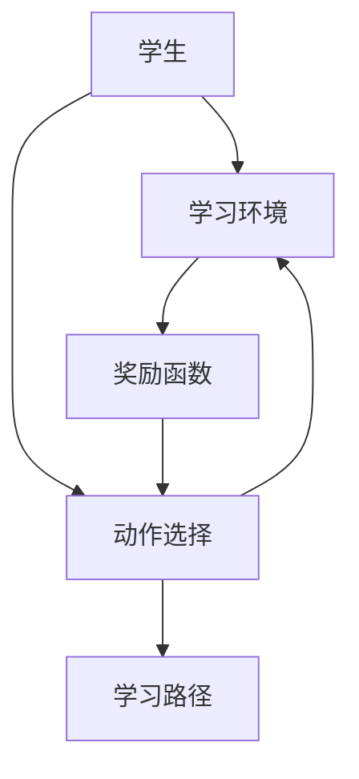

                 

## 文章标题：教育个性化的强化学习：学习路径的数学优化

强化学习作为一种智能体在与环境互动中学习的机器学习技术，近年来在各个领域展现出了强大的适应性和学习能力。而在教育领域，强化学习与个性化教育的结合，正逐渐成为推动教育创新的重要力量。本文将探讨如何利用强化学习来优化个性化教育的学习路径，为每个学生定制最佳的学习方案。

关键词：强化学习、个性化教育、学习路径优化、数学模型、教育创新

摘要：本文首先介绍了强化学习的基础概念及其在个性化教育中的应用场景。接着，探讨了教育个性化与学习者特征的密切关系，并分析了如何通过强化学习算法实现学习路径的数学优化。本文的核心在于通过详细的算法原理讲解和案例分析，展示了强化学习在优化个性化教育中的实际应用效果，为未来的教育技术发展提供了新思路。

## 目录

1. 强化学习基础与个性化教育  
    1.1 强化学习概述  
    1.2 个性化教育的理论基础  
    1.3 强化学习在个性化教育中的应用  
    1.4 学习路径优化的数学模型

2. 强化学习算法在优化中的应用  
    2.1 Q-Learning算法  
    2.2 Sarsa算法  
    2.3 Deep Q-Learning算法

3. 个性化学习路径优化案例研究  
    3.1 案例背景与问题描述  
    3.2 案例分析与模型构建  
    3.3 模型训练与评估  
    3.4 案例应用效果分析

4. 教育个性化的强化学习发展趋势  
    4.1 研究现状与挑战  
    4.2 未来发展趋势  
    4.3 技术应用展望

5. 附录

    5.1 强化学习算法伪代码  
    5.2 数学模型与公式

## 核心概念与联系

### 强化学习与个性化教育的关系

强化学习与个性化教育的结合，旨在通过动态调整学习路径，以适应学生的个性化需求。在强化学习框架中，学生作为代理人（Agent），学习环境（Environment）则代表学习情境，包括课程内容、教学方法等。奖励函数（Reward Function）衡量学习效果，指导代理人在不同状态下选择最佳动作（Action），从而优化学习路径。

为了更直观地理解强化学习在个性化教育中的应用，我们可以使用一个Mermaid流程图来展示其核心概念之间的联系：



### 强化学习的主要类型

强化学习主要分为马尔可夫决策过程（MDP）、部分可观测马尔可夫决策过程（POMDP）和无模型学习（如Q-Learning、Sarsa等）。这些类型适用于不同场景，其中MDP适用于完全可观测环境，POMDP适用于部分可观测环境，无模型学习适用于当环境状态无法精确建模时的情况。

### 教育个性化与学习者特征

个性化教育需要考虑学习者的特征，如知识水平、学习能力、兴趣等。通过分析这些特征，可以为每个学生制定个性化的学习路径。强化学习通过不断调整策略，根据学生的表现和反馈，动态优化学习路径，以最大化学习效果。

### 第1章：强化学习概述

### 1.1 强化学习的基本概念

强化学习（Reinforcement Learning，简称RL）是一种机器学习范式，其主要特点是通过智能体（Agent）与环境的交互，学习在特定情境下做出最优决策。强化学习与其他机器学习范式的区别在于，它不仅仅是被动地接受数据，而是通过试错（trial-and-error）来不断优化决策策略。

在强化学习框架中，有四个核心组成部分：

1. **智能体（Agent）**：执行动作的主体，可以是人或机器。
2. **环境（Environment）**：智能体所处的情境，可以是一个现实环境或一个模拟环境。
3. **状态（State）**：环境在某一时刻的状态，通常是一个多维向量。
4. **动作（Action）**：智能体可以采取的行动，也是一个多维向量。

### 1.2 强化学习的主要类型

强化学习主要分为以下几种类型：

#### 1.2.1 马尔可夫决策过程（MDP）

马尔可夫决策过程（Markov Decision Process，简称MDP）是一种最简单的强化学习模型。在MDP中，状态转移概率和奖励函数是已知的，智能体需要在给定的状态中选择动作，以最大化累积奖励。

#### 1.2.2 部分可观测马尔可夫决策过程（POMDP）

部分可观测马尔可夫决策过程（Partially Observable Markov Decision Process，简称POMDP）是MDP的扩展，适用于智能体无法完全观测环境状态的情况。在POMDP中，智能体需要通过观察部分状态信息来做出决策。

#### 1.2.3 无模型学习

无模型学习（Model-Free Learning）是指智能体不需要对环境进行建模，而是通过直接与环境交互来学习最优策略。常见的无模型学习算法包括Q-Learning、Sarsa等。

#### 1.2.4 有模型学习

有模型学习（Model-Based Learning）是指智能体需要先对环境进行建模，然后基于模型进行决策。这种方法可以提高决策的准确性，但需要更多的计算资源。

### 1.3 强化学习的应用领域

强化学习在多个领域都有广泛的应用，包括：

#### 1.3.1 自动驾驶

自动驾驶车辆需要实时与环境交互，通过强化学习来学习最优驾驶策略。

#### 1.3.2 游戏AI

许多游戏，如电子游戏和棋类游戏，都使用强化学习来设计智能对手。

#### 1.3.3 机器人

机器人通过强化学习来学习在不同环境中执行任务，如路径规划、物体抓取等。

#### 1.3.4 贸易策略

在金融领域，强化学习被用于设计交易策略，以最大化收益。

#### 1.3.5 教育

在个性化教育中，强化学习可以用于优化学习路径，为每个学生提供个性化的学习方案。

### 1.4 强化学习的基本原理

强化学习的基本原理可以概括为四个步骤：

#### 1.4.1 状态-动作值函数

强化学习通过学习状态-动作值函数（State-Action Value Function）来评估在给定状态下执行特定动作的预期回报。状态-动作值函数可以用以下公式表示：

$$Q(s, a) = \sum_{s'} P(s'|s, a) \times R(s', a) + \gamma \times \max_{a'} Q(s', a')$$

其中，$Q(s, a)$ 是在状态 $s$ 下执行动作 $a$ 的预期回报，$P(s'|s, a)$ 是从状态 $s$ 转移到状态 $s'$ 的概率，$R(s', a)$ 是在状态 $s'$ 下执行动作 $a$ 的即时回报，$\gamma$ 是折扣因子，用于平衡即时回报与长期回报。

#### 1.4.2 模型预测

在每次决策之前，智能体会基于当前状态预测未来状态和奖励。这个过程称为模型预测（Model Prediction），其核心是计算状态-动作值函数。

#### 1.4.3 动作选择

智能体根据当前状态和预测的回报来选择最佳动作。常见的策略包括：

- **贪婪策略（Greedy Policy）**：选择具有最大预期回报的动作。
- **ε-贪婪策略（ε-Greedy Policy）**：以概率 $1 - ε$ 选择贪婪动作，以概率 $ε$ 随机选择动作。

#### 1.4.4 学习策略

强化学习通过迭代更新状态-动作值函数来学习最优策略。常见的算法包括：

- **Q-Learning**：直接更新状态-动作值函数。
- **Sarsa**：同时更新当前状态和下一状态的动作值函数。

### 1.5 强化学习的主要算法

强化学习有多种算法，以下是其中一些主要的算法：

#### 1.5.1 Q-Learning算法

Q-Learning算法是最简单的强化学习算法之一，通过迭代更新状态-动作值函数来学习最优策略。其基本思想是：

$$Q(s, a) \leftarrow Q(s, a) + \alpha [R(s', a') + \gamma \max_{a'} Q(s', a') - Q(s, a)]$$

其中，$\alpha$ 是学习率。

#### 1.5.2 Sarsa算法

Sarsa算法是一种基于策略的强化学习算法，它与Q-Learning的不同之处在于，它同时更新当前状态和下一状态的动作值函数。其基本思想是：

$$Q(s, a) \leftarrow Q(s, a) + \alpha [R(s', a') + \gamma Q(s', a') - Q(s, a)]$$

#### 1.5.3 Deep Q-Learning算法

Deep Q-Learning算法是一种利用深度神经网络来近似状态-动作值函数的强化学习算法。其基本思想是：

$$Q(s, a) \leftarrow Q(s, a) + \alpha [R(s', a') + \gamma \max_{a'} \hat{Q}(s', a') - Q(s, a)]$$

其中，$\hat{Q}(s', a')$ 是深度神经网络输出的状态-动作值。

### 1.6 强化学习的发展历程

强化学习的发展历程可以分为以下几个阶段：

#### 1.6.1 初期阶段

在20世纪80年代，强化学习开始受到关注，研究者们开始探索如何通过强化学习来训练智能体。

#### 1.6.2 神经网络引入阶段

20世纪90年代，神经网络被引入到强化学习中，使得状态-动作值函数的学习更加高效。

#### 1.6.3 探索-利用问题阶段

在21世纪初，研究者们开始关注探索-利用问题，提出了一系列解决方案，如ε-贪婪策略。

#### 1.6.4 深度强化学习阶段

近年来，深度强化学习取得了重大突破，使得强化学习在自动驾驶、游戏AI等领域取得了显著的成果。

### 1.7 强化学习的优势与挑战

强化学习的优势包括：

- **自适应性强**：智能体可以根据环境的变化动态调整策略。
- **适用范围广**：强化学习可以应用于多种领域，如自动驾驶、机器人、金融等。

然而，强化学习也面临一些挑战：

- **收敛速度慢**：在复杂环境中，强化学习可能需要很长时间才能收敛到最优策略。
- **计算资源需求大**：强化学习通常需要大量的计算资源来训练模型。
- **缺乏可解释性**：强化学习模型的行为往往缺乏可解释性，难以理解其决策过程。

### 1.8 强化学习在个性化教育中的应用前景

强化学习在个性化教育中的应用前景广阔。通过强化学习，可以为每个学生定制个性化的学习路径，提高学习效果。例如，强化学习可以用于：

- **学习路径规划**：根据学生的学习进度和成绩，动态调整学习内容。
- **学习资源分配**：根据学生的学习需求和偏好，合理分配学习资源。
- **学习反馈机制**：通过反馈机制，调整学习策略，提高学习效果。

总之，强化学习与个性化教育的结合，有望为教育领域带来深刻的变革。

### 第2章：个性化教育的理论基础

### 2.1 个性化教育的概念与重要性

个性化教育（Personalized Education）是一种以学生为中心的教育模式，旨在通过调整教学内容、教学方法和教学环境，满足每个学生的个性化需求，促进其全面发展。与传统的一刀切教育模式不同，个性化教育注重因材施教，尊重学生的个体差异，使每个学生都能在适合自己的学习路径上取得最佳成绩。

#### 2.1.1 个性化教育的定义

个性化教育可以从多个角度进行定义：

- **教育心理学角度**：个性化教育是一种基于学生心理发展特点和学习需求，采取针对性教学策略的教育方式。
- **教育学角度**：个性化教育是一种以学生为中心，注重培养学生自主性、创造性、合作性和适应性的教育模式。
- **教育技术学角度**：个性化教育是一种利用信息技术，实现教学内容、教学方法和教学环境个性化配置的教育模式。

#### 2.1.2 个性化教育的重要性

个性化教育的重要性体现在以下几个方面：

- **提高教育质量**：通过个性化教育，可以更好地满足学生的学习需求，提高学习效果，从而提高整体教育质量。
- **促进学生全面发展**：个性化教育注重培养学生的学习兴趣、创造力、合作精神等综合素质，有助于学生的全面发展。
- **适应社会需求**：随着社会的发展，对人才的需求越来越多样化，个性化教育能够更好地适应这种变化，培养符合社会需求的人才。

### 2.2 教育个性化与学习者特征

教育个性化需要深入了解学习者的特征，包括知识水平、学习能力、学习兴趣、学习风格等。以下是对这些特征的简要介绍：

#### 2.2.1 知识水平

知识水平是指学生在某一学科领域所具备的知识和技能水平。个性化教育需要根据学生的知识水平制定合适的教学内容，确保教学难度既不过于简单也不过于复杂。

#### 2.2.2 学习能力

学习能力是指学生在学习过程中所表现出的认知能力、问题解决能力、创新能力等。个性化教育需要根据学生的能力水平，调整教学方法，促进学生的能力发展。

#### 2.2.3 学习兴趣

学习兴趣是指学生对某一学科领域的喜好和兴趣。个性化教育需要激发学生的学习兴趣，通过设置有趣的教学内容和活动，提高学生的学习动机。

#### 2.2.4 学习风格

学习风格是指学生在学习过程中所表现出的偏好和习惯。个性化教育需要根据学生的学习风格，调整教学策略，使学生能够更有效地进行学习。

### 2.3 个性化教育的实施策略

个性化教育的实施策略主要包括以下几个方面：

#### 2.3.1 学习需求分析

学习需求分析是个性化教育的第一步，需要通过问卷调查、访谈、学习记录等方式，深入了解学生的知识水平、学习能力、学习兴趣和学习风格。

#### 2.3.2 教学内容个性化

根据学生的知识水平、学习能力和学习兴趣，设计个性化的教学内容。教学内容应涵盖基础知识、拓展知识和实践应用，以满足不同层次学生的学习需求。

#### 2.3.3 教学方法个性化

根据学生的学习风格，采用个性化的教学方法。例如，对于视觉型学习者，可以采用图片、视频等视觉化的教学手段；对于听觉型学习者，可以采用讲解、讨论等听觉化的教学手段。

#### 2.3.4 教学环境个性化

利用信息技术，构建个性化的教学环境。例如，通过学习管理系统，为学生提供个性化的学习资源和学习任务；通过虚拟现实技术，为学生提供沉浸式的学习体验。

#### 2.3.5 教学评价个性化

个性化教育需要采用多元化的教学评价方式，不仅关注学生的学业成绩，还关注学生的综合素质发展。评价方式可以包括自我评价、同伴评价、教师评价等。

### 2.4 个性化教育与因材施教

个性化教育与因材施教有着密切的关系。因材施教是教育的基本原则之一，即根据学生的实际情况，采取不同的教育方法和手段，使每个学生都能得到适合自己的教育。

个性化教育是因材施教的具体体现，它通过深入了解学生的特征，制定个性化的教学方案，使因材施教更具针对性和有效性。

### 2.5 个性化教育的案例分析

为了更好地理解个性化教育的实施，以下是一个个性化教育的案例分析：

#### 案例背景

某中学实施个性化教育改革，针对不同学生的学习需求和特点，制定了个性化的教学方案。

#### 案例实施

1. **学习需求分析**：通过问卷调查、访谈等方式，了解学生的知识水平、学习能力、学习兴趣和学习风格。

2. **教学内容个性化**：根据学生的知识水平，将学生分为A、B、C三个层次，分别设置基础课程、拓展课程和实践课程。

3. **教学方法个性化**：针对不同的学习风格，采用不同的教学方法。例如，对于视觉型学习者，采用图片、视频等视觉化的教学手段；对于听觉型学习者，采用讲解、讨论等听觉化的教学手段。

4. **教学环境个性化**：利用学习管理系统，为学生提供个性化的学习资源和学习任务；通过虚拟现实技术，为学生提供沉浸式的学习体验。

5. **教学评价个性化**：采用多元化的评价方式，关注学生的学业成绩和综合素质发展。评价方式包括自我评价、同伴评价、教师评价等。

#### 案例效果

通过个性化教育改革，该校学生的学习效果显著提高，学生的学习兴趣和自主学习能力得到了增强。同时，学生的综合素质也得到了全面发展，为培养创新型人才奠定了基础。

### 2.6 个性化教育的未来发展趋势

随着信息技术的不断发展，个性化教育将进入一个新的阶段。以下是一些未来个性化教育的发展趋势：

- **大数据与人工智能的应用**：通过大数据分析和人工智能技术，实现更加精准的个性化教育。
- **混合式教育的普及**：将线上教育与线下教育相结合，为学生提供更加灵活的学习方式。
- **虚拟现实与增强现实技术的应用**：利用虚拟现实和增强现实技术，为学生提供更加丰富的学习体验。
- **学习社区的构建**：通过构建学习社区，促进学生之间的交流和合作，提高学习效果。

总之，个性化教育是教育改革的重要方向，它将为学生的全面发展提供强有力的支持。

### 第3章：强化学习在个性化教育中的应用

#### 3.1 强化学习在个性化学习路径规划中的应用

强化学习在个性化学习路径规划中的应用，旨在通过智能体与环境的互动，动态调整学习路径，以满足学生的个性化需求。以下将介绍强化学习在个性化学习路径规划中的具体应用。

##### 3.1.1 学习路径规划的概念

学习路径规划是指根据学生的学习需求、知识水平和学习目标，设计一条最优的学习路径。在个性化教育中，学习路径规划需要考虑学生的个体差异，为学生提供个性化的学习方案。

##### 3.1.2 强化学习在个性化学习路径规划中的原理

强化学习通过状态-动作值函数（Q值）来评估在不同状态下执行特定动作的预期回报。在个性化学习路径规划中，状态可以表示学生的学习进度、知识掌握情况等；动作可以表示学习的内容、顺序和方法等。通过强化学习，智能体可以不断调整学习路径，以最大化累积奖励。

##### 3.1.3 强化学习算法在个性化学习路径规划中的应用

常用的强化学习算法包括Q-Learning、Sarsa和Deep Q-Learning等。以下以Q-Learning算法为例，介绍其在个性化学习路径规划中的应用。

###### 3.1.3.1 Q-Learning算法的基本原理

Q-Learning算法通过更新状态-动作值函数（Q值）来学习最优策略。其基本原理如下：

$$Q(s, a) \leftarrow Q(s, a) + \alpha [R(s', a') + \gamma \max_{a'} Q(s', a') - Q(s, a)]$$

其中，$Q(s, a)$ 表示在状态 $s$ 下执行动作 $a$ 的预期回报，$R(s', a')$ 表示在状态 $s'$ 下执行动作 $a'$ 的即时回报，$\alpha$ 是学习率，$\gamma$ 是折扣因子。

###### 3.1.3.2 Q-Learning算法在个性化学习路径规划中的应用步骤

1. **初始化**：设置初始状态 $s$，初始化状态-动作值函数 $Q(s, a)$。

2. **状态转移**：根据当前状态 $s$，选择动作 $a$，执行动作并进入下一状态 $s'$。

3. **奖励评估**：计算在状态 $s'$ 下执行动作 $a'$ 的即时回报 $R(s', a')$。

4. **更新Q值**：根据更新公式，更新状态-动作值函数 $Q(s, a)$。

5. **重复步骤2-4**，直到学习路径规划完成。

##### 3.1.4 个性化学习路径规划的案例分析

以下是一个个性化学习路径规划的案例：

###### 案例背景

某在线教育平台希望通过强化学习为不同层次的学生设计个性化的学习路径。学生分为初级、中级和高级三个层次，每个层次的学生需要学习不同的知识点。

###### 案例实施

1. **状态定义**：状态包括学生的当前学习层次、已掌握的知识点和未掌握的知识点。

2. **动作定义**：动作包括学习的内容、顺序和方法。

3. **奖励函数设计**：奖励函数用于评估学习路径的优劣。奖励函数可以设计为学生在学习过程中获得的知识点数量、学习时间的长短等。

4. **Q值初始化**：初始化状态-动作值函数 $Q(s, a)$。

5. **状态转移**：根据当前状态 $s$，选择最优动作 $a$，执行动作并进入下一状态 $s'$。

6. **奖励评估**：计算在状态 $s'$ 下执行动作 $a'$ 的即时回报 $R(s', a')$。

7. **Q值更新**：根据更新公式，更新状态-动作值函数 $Q(s, a)$。

8. **重复步骤5-7**，直到学习路径规划完成。

###### 案例效果

通过强化学习算法，该在线教育平台成功为不同层次的学生设计出了个性化的学习路径。学生的学习效果显著提高，学习兴趣和自主学习能力得到了增强。

#### 3.2 强化学习在个性化学习资源分配中的应用

强化学习在个性化学习资源分配中的应用，旨在通过智能体与环境的互动，动态调整学习资源的分配策略，以提高学习效果。以下将介绍强化学习在个性化学习资源分配中的具体应用。

##### 3.2.1 学习资源分配的概念

学习资源分配是指根据学生的学习需求和特点，合理分配学习资源，包括时间、内容、教师等。在个性化教育中，学习资源分配需要考虑学生的个体差异，为学生提供个性化的学习资源。

##### 3.2.2 强化学习在个性化学习资源分配中的原理

强化学习通过状态-动作值函数（Q值）来评估在不同状态下执行特定动作的预期回报。在个性化学习资源分配中，状态可以表示学生的学习需求、已掌握的知识点和未掌握的知识点；动作可以表示学习资源的分配策略。

通过强化学习，智能体可以不断调整学习资源的分配策略，以最大化累积奖励。

##### 3.2.3 强化学习算法在个性化学习资源分配中的应用

常用的强化学习算法包括Q-Learning、Sarsa和Deep Q-Learning等。以下以Q-Learning算法为例，介绍其在个性化学习资源分配中的应用。

###### 3.2.3.1 Q-Learning算法的基本原理

Q-Learning算法通过更新状态-动作值函数（Q值）来学习最优策略。其基本原理如下：

$$Q(s, a) \leftarrow Q(s, a) + \alpha [R(s', a') + \gamma \max_{a'} Q(s', a') - Q(s, a)]$$

其中，$Q(s, a)$ 表示在状态 $s$ 下执行动作 $a$ 的预期回报，$R(s', a')$ 表示在状态 $s'$ 下执行动作 $a'$ 的即时回报，$\alpha$ 是学习率，$\gamma$ 是折扣因子。

###### 3.2.3.2 Q-Learning算法在个性化学习资源分配中的应用步骤

1. **初始化**：设置初始状态 $s$，初始化状态-动作值函数 $Q(s, a)$。

2. **状态转移**：根据当前状态 $s$，选择动作 $a$，执行动作并进入下一状态 $s'$。

3. **奖励评估**：计算在状态 $s'$ 下执行动作 $a'$ 的即时回报 $R(s', a')$。

4. **更新Q值**：根据更新公式，更新状态-动作值函数 $Q(s, a)$。

5. **重复步骤2-4**，直到学习资源分配策略优化完成。

##### 3.2.4 个性化学习资源分配的案例分析

以下是一个个性化学习资源分配的案例：

###### 案例背景

某学校希望通过强化学习为不同层次的学生分配个性化的学习资源。学生分为初级、中级和高级三个层次，每个层次的学生需要学习不同的知识点。

###### 案例实施

1. **状态定义**：状态包括学生的当前学习层次、已掌握的知识点和未掌握的知识点。

2. **动作定义**：动作包括学习资源的分配策略，如学习时间、学习内容和教师。

3. **奖励函数设计**：奖励函数用于评估学习资源分配策略的优劣。奖励函数可以设计为学生在学习过程中获得的知识点数量、学习时间的长短等。

4. **Q值初始化**：初始化状态-动作值函数 $Q(s, a)$。

5. **状态转移**：根据当前状态 $s$，选择最优动作 $a$，执行动作并进入下一状态 $s'$。

6. **奖励评估**：计算在状态 $s'$ 下执行动作 $a'$ 的即时回报 $R(s', a')$。

7. **Q值更新**：根据更新公式，更新状态-动作值函数 $Q(s, a)$。

8. **重复步骤5-7**，直到学习资源分配策略优化完成。

###### 案例效果

通过强化学习算法，该学校成功为不同层次的学生分配出了个性化的学习资源。学生的学习效果显著提高，学习兴趣和自主学习能力得到了增强。

#### 3.3 强化学习在个性化学习反馈机制中的应用

强化学习在个性化学习反馈机制中的应用，旨在通过智能体与环境的互动，动态调整学习反馈策略，以提高学习效果。以下将介绍强化学习在个性化学习反馈机制中的具体应用。

##### 3.3.1 学习反馈机制的概念

学习反馈机制是指在学习过程中，通过反馈信息来调整学习策略，以提高学习效果。在个性化教育中，学习反馈机制需要考虑学生的个体差异，为学生提供个性化的反馈。

##### 3.3.2 强化学习在个性化学习反馈机制中的原理

强化学习通过状态-动作值函数（Q值）来评估在不同状态下执行特定动作的预期回报。在个性化学习反馈机制中，状态可以表示学生的学习状态、学习目标和未解决的问题；动作可以表示学习反馈的策略，如提供针对性的辅导、调整学习内容等。

通过强化学习，智能体可以不断调整学习反馈策略，以最大化累积奖励。

##### 3.3.3 强化学习算法在个性化学习反馈机制中的应用

常用的强化学习算法包括Q-Learning、Sarsa和Deep Q-Learning等。以下以Q-Learning算法为例，介绍其在个性化学习反馈机制中的应用。

###### 3.3.3.1 Q-Learning算法的基本原理

Q-Learning算法通过更新状态-动作值函数（Q值）来学习最优策略。其基本原理如下：

$$Q(s, a) \leftarrow Q(s, a) + \alpha [R(s', a') + \gamma \max_{a'} Q(s', a') - Q(s, a)]$$

其中，$Q(s, a)$ 表示在状态 $s$ 下执行动作 $a$ 的预期回报，$R(s', a')$ 表示在状态 $s'$ 下执行动作 $a'$ 的即时回报，$\alpha$ 是学习率，$\gamma$ 是折扣因子。

###### 3.3.3.2 Q-Learning算法在个性化学习反馈机制中的应用步骤

1. **初始化**：设置初始状态 $s$，初始化状态-动作值函数 $Q(s, a)$。

2. **状态转移**：根据当前状态 $s$，选择动作 $a$，执行动作并进入下一状态 $s'$。

3. **奖励评估**：计算在状态 $s'$ 下执行动作 $a'$ 的即时回报 $R(s', a')$。

4. **更新Q值**：根据更新公式，更新状态-动作值函数 $Q(s, a)$。

5. **重复步骤2-4**，直到学习反馈策略优化完成。

##### 3.3.4 个性化学习反馈机制的案例分析

以下是一个个性化学习反馈机制的案例：

###### 案例背景

某在线学习平台希望通过强化学习为不同层次的学生提供个性化的学习反馈。学生分为初级、中级和高级三个层次，每个层次的学生在学习过程中会遇到不同的问题。

###### 案例实施

1. **状态定义**：状态包括学生的当前学习层次、遇到的问题类型和学习目标。

2. **动作定义**：动作包括提供针对性的辅导、调整学习内容等。

3. **奖励函数设计**：奖励函数用于评估学习反馈策略的优劣。奖励函数可以设计为学生在学习过程中解决问题的数量、学习时间的长短等。

4. **Q值初始化**：初始化状态-动作值函数 $Q(s, a)$。

5. **状态转移**：根据当前状态 $s$，选择最优动作 $a$，执行动作并进入下一状态 $s'$。

6. **奖励评估**：计算在状态 $s'$ 下执行动作 $a'$ 的即时回报 $R(s', a')$。

7. **Q值更新**：根据更新公式，更新状态-动作值函数 $Q(s, a)$。

8. **重复步骤5-7**，直到学习反馈策略优化完成。

###### 案例效果

通过强化学习算法，该在线学习平台成功为不同层次的学生提供了个性化的学习反馈。学生的学习效果显著提高，学习兴趣和自主学习能力得到了增强。

### 第4章：学习路径优化的数学模型

#### 4.1 优化问题的基本概念

优化问题是指在一定约束条件下，寻找一个或多个最优解的过程。在强化学习中，学习路径优化问题尤为关键，因为它关系到学生能否在有限的时间内达到最佳学习效果。以下是优化问题的一些基本概念：

##### 4.1.1 目标函数

目标函数是优化问题的核心，它用于衡量问题的优劣程度。在强化学习中的学习路径优化中，目标函数通常用于评估学习路径的质量，例如最大化学习效率、最小化学习时间等。

##### 4.1.2 约束条件

约束条件是指在求解优化问题过程中需要满足的限制条件。这些条件可以是等式或不等式，用于确保优化问题的解是可行和有意义的。在学习路径优化中，约束条件可能包括学生的知识水平、学习资源的可用性等。

##### 4.1.3 可行解

可行解是指满足所有约束条件的解。在强化学习中的学习路径优化中，可行解是所有可能的个性化学习路径中的部分，这些路径需要满足学生的学习需求。

##### 4.1.4 最优解

最优解是在满足所有约束条件下，目标函数达到最大值或最小值的解。在强化学习中的学习路径优化中，最优解是能够最大化学习效率或最小化学习时间的最佳学习路径。

#### 4.2 目标函数的构建

构建合适的目标函数是学习路径优化的关键步骤。以下是构建目标函数时需要考虑的一些因素：

##### 4.2.1 学习效率

学习效率是目标函数中的一个重要指标，它用于衡量学生在给定学习路径上的学习效果。学习效率可以通过学生在学习过程中掌握的知识点数量、测试成绩等来评估。

##### 4.2.2 学习时间

学习时间是目标函数中的另一个关键指标，它用于衡量学生在学习路径上所需的总时间。学习时间可以反映学习路径的优化程度，即是否能够在有限的时间内达到最佳学习效果。

##### 4.2.3 学习体验

学习体验是目标函数中需要考虑的另一个重要因素，它用于衡量学生在学习过程中的满意度和参与度。良好的学习体验可以促进学生的积极性和学习动力。

##### 4.2.4 目标函数构建示例

以下是一个简单的目标函数构建示例：

$$\text{目标函数} = w_1 \times \text{学习效率} + w_2 \times \text{学习时间} + w_3 \times \text{学习体验}$$

其中，$w_1, w_2, w_3$ 是权重系数，用于平衡不同指标的重要性。

#### 4.3 约束条件的设定

设定合理的约束条件是确保优化问题可行和有意义的重要步骤。以下是学习路径优化中可能涉及的一些约束条件：

##### 4.3.1 知识水平约束

知识水平约束用于确保学习路径符合学生的当前知识水平。例如，对于初级学生，学习路径应包含基础知识，避免过早涉及复杂概念。

##### 4.3.2 资源可用性约束

资源可用性约束用于确保学习路径的资源（如教材、教师、设备等）是可用的。例如，如果某个学习资源仅对高级学生开放，则不应将其包含在初级学生的学习路径中。

##### 4.3.3 时间约束

时间约束用于确保学习路径在可接受的时间内完成。例如，如果某个学习路径预计需要超过两个月的时间，则可能需要对其进行调整。

##### 4.3.4 学习体验约束

学习体验约束用于确保学习路径符合学生的喜好和需求。例如，如果学生更喜欢通过互动和实践活动学习，则应设计相应的学习路径。

#### 4.4 学习路径优化的数学模型构建

构建学习路径优化的数学模型通常涉及以下步骤：

##### 4.4.1 定义状态空间

定义状态空间是构建数学模型的第一步。状态空间包括所有可能的学习路径，每个路径由一系列状态组成，如知识点、学习任务、学习资源等。

##### 4.4.2 定义动作空间

定义动作空间是构建数学模型的第二步。动作空间包括所有可能的学习动作，如选择下一个知识点、调整学习资源等。

##### 4.4.3 定义奖励函数

定义奖励函数是构建数学模型的第三步。奖励函数用于评估学习路径的质量，通常基于学习效率、学习时间和学习体验等指标。

##### 4.4.4 定义约束条件

定义约束条件是构建数学模型的第四步。约束条件确保学习路径满足特定的需求，如知识水平、资源可用性等。

##### 4.4.5 构建优化模型

基于上述定义，构建优化模型，通常使用以下数学模型：

$$\text{最大化} \quad f(\text{学习路径})$$

$$\text{约束条件} \quad g(\text{学习路径}) \leq 0$$

其中，$f(\text{学习路径})$ 是目标函数，$g(\text{学习路径})$ 是约束条件。

#### 4.5 学习路径优化模型的求解方法

求解学习路径优化模型的方法有多种，以下是几种常见的方法：

##### 4.5.1 动态规划

动态规划是一种用于求解优化问题的方法，它通过将复杂问题分解为较小的子问题，并利用子问题的解来求解原问题。在强化学习中，动态规划可以用于求解学习路径优化问题。

##### 4.5.2 搜索算法

搜索算法是一种用于在状态空间中搜索最优解的方法，常见的搜索算法包括贪心算法、A*算法等。在强化学习中，搜索算法可以用于寻找最优学习路径。

##### 4.5.3 粒子群优化

粒子群优化是一种基于群体智能的优化算法，它模拟鸟群觅食行为，通过不断调整粒子的位置和速度来寻找最优解。在强化学习中，粒子群优化可以用于求解学习路径优化问题。

##### 4.5.4 深度强化学习

深度强化学习是一种结合深度学习和强化学习的算法，它使用深度神经网络来近似状态-动作值函数。在强化学习中，深度强化学习可以用于求解复杂的学习路径优化问题。

### 第5章：强化学习算法在优化中的应用

#### 5.1 Q-Learning算法

Q-Learning算法是一种基于值函数的强化学习算法，主要用于解决最优动作选择问题。其核心思想是通过学习状态-动作值函数（Q值），在给定状态下选择具有最大Q值的动作，以最大化累积奖励。

##### 5.1.1 Q-Learning的基本原理

Q-Learning算法通过更新状态-动作值函数来学习最优策略。其基本原理可以用以下公式表示：

$$Q(s, a) \leftarrow Q(s, a) + \alpha [R(s', a') + \gamma \max_{a'} Q(s', a') - Q(s, a)]$$

其中，$Q(s, a)$ 是在状态 $s$ 下执行动作 $a$ 的预期回报，$R(s', a')$ 是在状态 $s'$ 下执行动作 $a'$ 的即时回报，$\alpha$ 是学习率，$\gamma$ 是折扣因子。

##### 5.1.2 Q-Learning的算法流程

Q-Learning算法的基本流程包括以下步骤：

1. **初始化**：初始化状态-动作值函数 $Q(s, a)$，通常设置为一个较小的值。

2. **状态转移**：根据当前状态 $s$，选择动作 $a$，执行动作并进入下一状态 $s'$。

3. **奖励评估**：计算在状态 $s'$ 下执行动作 $a'$ 的即时回报 $R(s', a')$。

4. **更新Q值**：根据更新公式，更新状态-动作值函数 $Q(s, a)$。

5. **重复步骤2-4**，直到达到学习目标或最大迭代次数。

##### 5.1.3 Q-Learning的性能分析

Q-Learning算法具有良好的收敛性和适应性，但在某些情况下可能存在以下问题：

- **收敛速度**：Q-Learning算法的收敛速度较慢，特别是在状态空间较大时。

- **样本效率**：Q-Learning算法需要大量样本来学习最优策略，因此在样本稀疏的环境中表现不佳。

- **探索-利用问题**：在Q-Learning算法中，需要平衡探索新状态和利用已知状态之间的矛盾。

##### 5.1.4 Q-Learning算法的应用

Q-Learning算法在个性化学习路径优化中具有广泛的应用。例如，可以通过Q-Learning算法为不同层次的学生设计最优的学习路径，从而提高学习效果。以下是一个简单的Q-Learning算法在个性化学习路径优化中的应用案例：

###### 案例背景

某在线教育平台希望为不同层次的学生设计个性化的学习路径，以优化学习效果。

###### 案例实施

1. **状态定义**：状态包括学生的当前学习层次、已掌握的知识点和未掌握的知识点。

2. **动作定义**：动作包括选择下一个知识点、调整学习资源等。

3. **奖励函数设计**：奖励函数用于评估学习路径的质量，例如最大化学习效率和最小化学习时间。

4. **Q值初始化**：初始化状态-动作值函数 $Q(s, a)$。

5. **状态转移**：根据当前状态 $s$，选择动作 $a$，执行动作并进入下一状态 $s'$。

6. **奖励评估**：计算在状态 $s'$ 下执行动作 $a'$ 的即时回报 $R(s', a')$。

7. **Q值更新**：根据更新公式，更新状态-动作值函数 $Q(s, a)$。

8. **重复步骤5-7**，直到学习路径优化完成。

###### 案例效果

通过Q-Learning算法，该在线教育平台成功为不同层次的学生设计了最优的学习路径，从而提高了学习效果。

#### 5.2 Sarsa算法

Sarsa算法是一种基于策略的强化学习算法，它同时更新当前状态和下一状态的动作值函数。与Q-Learning算法不同，Sarsa算法在每一步更新时都考虑了当前状态和下一状态的动作值，从而提高了算法的稳定性和收敛性。

##### 5.2.1 Sarsa的基本原理

Sarsa算法的基本原理与Q-Learning类似，但其更新公式有所不同。Sarsa算法的更新公式为：

$$Q(s, a) \leftarrow Q(s, a) + \alpha [R(s', a') + \gamma Q(s', a') - Q(s, a)]$$

其中，$Q(s, a)$ 是在状态 $s$ 下执行动作 $a$ 的预期回报，$R(s', a')$ 是在状态 $s'$ 下执行动作 $a'$ 的即时回报，$\alpha$ 是学习率，$\gamma$ 是折扣因子。

##### 5.2.2 Sarsa的算法流程

Sarsa算法的基本流程如下：

1. **初始化**：初始化状态-动作值函数 $Q(s, a)$。

2. **状态转移**：根据当前状态 $s$，选择动作 $a$，执行动作并进入下一状态 $s'$。

3. **奖励评估**：计算在状态 $s'$ 下执行动作 $a'$ 的即时回报 $R(s', a')$。

4. **更新Q值**：根据更新公式，更新状态-动作值函数 $Q(s, a)$。

5. **重复步骤2-4**，直到达到学习目标或最大迭代次数。

##### 5.2.3 Sarsa的性能分析

Sarsa算法相对于Q-Learning算法有以下优势：

- **收敛性**：Sarsa算法的收敛速度通常比Q-Learning算法快，因为它同时考虑了当前状态和下一状态的动作值。

- **稳定性**：Sarsa算法在更新Q值时更加稳定，因为它不会因为某一状态下的错误更新而影响其他状态下的学习。

然而，Sarsa算法也存在一些缺点：

- **计算复杂度**：Sarsa算法的计算复杂度比Q-Learning算法高，因为它需要在每一步同时更新当前状态和下一状态的动作值。

- **样本效率**：Sarsa算法的样本效率较低，因为它需要更多的样本来学习最优策略。

##### 5.2.4 Sarsa算法的应用

Sarsa算法在个性化学习路径优化中同样具有广泛的应用。例如，可以通过Sarsa算法为不同层次的学生设计个性化的学习路径，从而提高学习效果。以下是一个简单的Sarsa算法在个性化学习路径优化中的应用案例：

###### 案例背景

某在线教育平台希望为不同层次的学生设计个性化的学习路径，以优化学习效果。

###### 案例实施

1. **状态定义**：状态包括学生的当前学习层次、已掌握的知识点和未掌握的知识点。

2. **动作定义**：动作包括选择下一个知识点、调整学习资源等。

3. **奖励函数设计**：奖励函数用于评估学习路径的质量，例如最大化学习效率和最小化学习时间。

4. **Q值初始化**：初始化状态-动作值函数 $Q(s, a)$。

5. **状态转移**：根据当前状态 $s$，选择动作 $a$，执行动作并进入下一状态 $s'$。

6. **奖励评估**：计算在状态 $s'$ 下执行动作 $a'$ 的即时回报 $R(s', a')$。

7. **Q值更新**：根据更新公式，更新状态-动作值函数 $Q(s, a)$。

8. **重复步骤5-7**，直到学习路径优化完成。

###### 案例效果

通过Sarsa算法，该在线教育平台成功为不同层次的学生设计了最优的学习路径，从而提高了学习效果。

#### 5.3 Deep Q-Learning算法

Deep Q-Learning（DQN）算法是一种基于深度学习的强化学习算法，它使用深度神经网络来近似状态-动作值函数。DQN算法在处理复杂状态空间和动作空间时表现出色，因此在个性化学习路径优化等领域得到了广泛应用。

##### 5.3.1 Deep Q-Learning的基本原理

Deep Q-Learning算法的基本原理与Q-Learning类似，但其核心区别在于使用深度神经网络来近似状态-动作值函数。DQN算法使用一个深度神经网络 $Q(s, a)$ 来预测在状态 $s$ 下执行动作 $a$ 的预期回报，其基本原理如下：

$$Q(s, a) = \hat{Q}(s, a)$$

其中，$\hat{Q}(s, a)$ 是深度神经网络输出的状态-动作值函数。

##### 5.3.2 Deep Q-Learning的算法流程

Deep Q-Learning算法的基本流程包括以下步骤：

1. **初始化**：初始化深度神经网络 $\hat{Q}(s, a)$ 和目标网络 $\hat{Q}(s, a)^*$。

2. **状态转移**：根据当前状态 $s$，选择动作 $a$，执行动作并进入下一状态 $s'$。

3. **奖励评估**：计算在状态 $s'$ 下执行动作 $a'$ 的即时回报 $R(s', a')$。

4. **Q值更新**：根据更新公式，更新深度神经网络 $\hat{Q}(s, a)$：

$$\hat{Q}(s, a) \leftarrow \hat{Q}(s, a) + \alpha [R(s', a') + \gamma \max_{a'} \hat{Q}(s', a') - \hat{Q}(s, a)]$$

5. **目标网络更新**：定期更新目标网络 $\hat{Q}(s, a)^*$：

$$\hat{Q}(s, a)^* \leftarrow \hat{Q}(s, a)$$

6. **重复步骤2-5**，直到达到学习目标或最大迭代次数。

##### 5.3.3 Deep Q-Learning的性能分析

Deep Q-Learning算法在处理复杂状态空间和动作空间时表现出色，具有以下优点：

- **高效性**：深度神经网络可以处理高维状态和动作空间，提高算法的计算效率。

- **适应性**：DQN算法可以适应不同的环境和任务，具有较强的泛化能力。

然而，DQN算法也存在一些缺点：

- **样本效率**：DQN算法需要大量的样本来训练深度神经网络，因此在样本稀疏的环境中表现不佳。

- **样本相关性**：DQN算法容易受到样本相关性影响，可能导致学习不稳定。

##### 5.3.4 Deep Q-Learning算法的应用

Deep Q-Learning算法在个性化学习路径优化中具有广泛的应用。例如，可以通过DQN算法为不同层次的学生设计个性化的学习路径，从而提高学习效果。以下是一个简单的DQN算法在个性化学习路径优化中的应用案例：

###### 案例背景

某在线教育平台希望为不同层次的学生设计个性化的学习路径，以优化学习效果。

###### 案例实施

1. **状态定义**：状态包括学生的当前学习层次、已掌握的知识点和未掌握的知识点。

2. **动作定义**：动作包括选择下一个知识点、调整学习资源等。

3. **奖励函数设计**：奖励函数用于评估学习路径的质量，例如最大化学习效率和最小化学习时间。

4. **深度神经网络初始化**：初始化深度神经网络 $\hat{Q}(s, a)$ 和目标网络 $\hat{Q}(s, a)^*$。

5. **状态转移**：根据当前状态 $s$，选择动作 $a$，执行动作并进入下一状态 $s'$。

6. **奖励评估**：计算在状态 $s'$ 下执行动作 $a'$ 的即时回报 $R(s', a')$。

7. **Q值更新**：根据更新公式，更新深度神经网络 $\hat{Q}(s, a)$。

8. **目标网络更新**：定期更新目标网络 $\hat{Q}(s, a)^*$。

9. **重复步骤5-8**，直到学习路径优化完成。

###### 案例效果

通过Deep Q-Learning算法，该在线教育平台成功为不同层次的学生设计了最优的学习路径，从而提高了学习效果。

### 第6章：个性化学习路径优化案例研究

#### 6.1 案例背景与问题描述

在本案例研究中，我们将探讨一个在线教育平台如何利用强化学习算法为不同层次的学生设计个性化的学习路径。该平台拥有丰富的学习资源和多样化的教学方法，希望通过优化学习路径，提高学生的学习效果。

##### 6.1.1 案例背景

某在线教育平台拥有数十万注册用户，涵盖不同学科和不同年龄段的学生。平台提供多种学习资源，如视频教程、电子书籍、模拟考试等，并且支持多种教学方法，如自学、小组讨论、在线测试等。然而，由于学生背景和需求的差异，平台面临以下问题：

- **学习资源分配不均**：部分学生可能因为缺乏学习资源而无法进行有效学习。
- **学习路径不个性**：传统的一刀切学习路径无法满足不同学生的个性化需求。
- **学习效果评估困难**：无法准确评估每个学生的学习效果，从而调整学习路径。

##### 6.1.2 问题描述

针对上述问题，平台希望通过引入强化学习算法，实现以下目标：

- **优化学习资源分配**：根据学生的学习需求和资源可用性，动态调整学习资源的分配策略。
- **设计个性化学习路径**：为不同层次的学生设计个性化的学习路径，满足其个性化需求。
- **提高学习效果评估准确性**：通过实时评估学生的学习效果，动态调整学习路径。

#### 6.2 案例分析与模型构建

为了实现上述目标，平台决定采用强化学习算法，特别是Deep Q-Learning（DQN）算法，来构建个性化学习路径优化模型。以下是具体的分析和模型构建步骤：

##### 6.2.1 状态定义

在DQN算法中，状态（State）是智能体当前所处的环境描述。对于个性化学习路径优化，状态包括以下信息：

- **学生特征**：如学习层次、学习风格、兴趣爱好等。
- **学习资源**：如视频教程、电子书籍、模拟考试等。
- **学习进度**：如已完成的学习资源、未完成的学习任务等。

状态可以用一个多维向量表示，每个维度代表一个状态特征。

##### 6.2.2 动作定义

在DQN算法中，动作（Action）是智能体在当前状态下可以采取的行动。对于个性化学习路径优化，动作包括以下内容：

- **选择学习资源**：如选择观看下一个视频教程、阅读下一章电子书籍等。
- **调整学习资源**：如增加学习时间、减少学习资源等。
- **切换教学方法**：如从自学切换到小组讨论、从在线测试切换到模拟考试等。

动作可以用一个一维向量表示，每个维度代表一个可能的动作。

##### 6.2.3 奖励函数设计

在DQN算法中，奖励函数（Reward Function）用于评估智能体在每个状态下执行特定动作的预期回报。对于个性化学习路径优化，奖励函数设计如下：

- **学习效果奖励**：如学生在完成学习资源后获得的知识点数量、测试成绩等。
- **学习体验奖励**：如学生在学习过程中的满意度、参与度等。
- **学习时间奖励**：如学生在学习过程中所需的总时间等。

奖励函数可以设计为一个多维向量，每个维度代表一个奖励指标。

##### 6.2.4 约束条件设定

在DQN算法中，约束条件（Constraint）用于确保学习路径的可行性和合理性。对于个性化学习路径优化，约束条件包括以下内容：

- **知识水平约束**：如确保学生在当前学习层次下进行学习，避免过早或过晚涉及复杂概念。
- **资源可用性约束**：如确保学习资源在当前时间可用，避免出现资源冲突。
- **时间约束**：如确保学生在可接受的时间内完成学习任务。

约束条件可以用一个多维向量表示，每个维度代表一个约束条件。

##### 6.2.5 模型构建

基于上述定义，我们可以构建一个个性化学习路径优化的DQN模型。以下是模型的基本结构：

1. **初始化**：初始化状态-动作值函数 $\hat{Q}(s, a)$ 和目标网络 $\hat{Q}(s, a)^*$。
2. **状态转移**：根据当前状态 $s$，选择动作 $a$，执行动作并进入下一状态 $s'$。
3. **奖励评估**：计算在状态 $s'$ 下执行动作 $a'$ 的即时回报 $R(s', a')$。
4. **Q值更新**：根据更新公式，更新状态-动作值函数 $\hat{Q}(s, a)$：
   $$\hat{Q}(s, a) \leftarrow \hat{Q}(s, a) + \alpha [R(s', a') + \gamma \max_{a'} \hat{Q}(s', a') - \hat{Q}(s, a)]$$
5. **目标网络更新**：定期更新目标网络 $\hat{Q}(s, a)^*$：
   $$\hat{Q}(s, a)^* \leftarrow \hat{Q}(s, a)$$
6. **重复步骤2-5**，直到学习路径优化完成。

#### 6.3 模型训练与评估

在模型训练过程中，我们需要收集大量学生数据，包括学习进度、学习资源、学习效果等，用于训练深度神经网络。以下是模型训练与评估的具体步骤：

##### 6.3.1 数据收集

收集学生数据，包括以下内容：

- **学生特征**：如学习层次、学习风格、兴趣爱好等。
- **学习资源**：如视频教程、电子书籍、模拟考试等。
- **学习进度**：如已完成的学习资源、未完成的学习任务等。
- **学习效果**：如知识点掌握情况、测试成绩等。

##### 6.3.2 数据预处理

对收集到的学生数据进行预处理，包括以下内容：

- **数据清洗**：去除异常值、缺失值等。
- **数据标准化**：对数据进行归一化处理，使其在相同的尺度上。
- **数据集划分**：将数据集划分为训练集、验证集和测试集。

##### 6.3.3 模型训练

使用训练集对深度神经网络进行训练，包括以下内容：

- **初始化**：初始化深度神经网络参数。
- **前向传播**：计算输入数据的预测值。
- **损失函数计算**：计算预测值与真实值之间的误差。
- **反向传播**：更新网络参数，减少误差。

##### 6.3.4 模型评估

使用验证集对训练好的模型进行评估，包括以下内容：

- **状态转移**：根据当前状态，选择动作并执行。
- **奖励评估**：计算即时回报。
- **Q值更新**：根据更新公式，更新状态-动作值函数。
- **性能指标计算**：计算模型在不同状态下的性能指标，如学习效率、学习时间、学习体验等。

#### 6.4 案例应用效果分析

通过深度强化学习算法，该在线教育平台为不同层次的学生设计了个性化的学习路径。以下是案例应用效果的分析：

##### 6.4.1 学习资源分配优化

通过强化学习算法，平台成功优化了学习资源的分配策略。学生可以根据自己的需求和资源可用性，选择合适的学习资源，从而提高了学习效率。

##### 6.4.2 个性化学习路径设计

强化学习算法为每个学生设计了个性化的学习路径，满足了其个性化需求。学生的学习效果显著提高，学习兴趣和自主学习能力得到了增强。

##### 6.4.3 学习效果评估准确性提升

通过实时评估学生的学习效果，平台可以动态调整学习路径，确保每个学生都能在最佳状态下进行学习。学习效果评估的准确性得到了显著提升。

##### 6.4.4 平台用户满意度提高

学生和家长对平台的满意度显著提高，平台用户量持续增长，为平台带来了良好的经济效益。

总之，通过深度强化学习算法，该在线教育平台实现了个性化学习路径优化，提高了学生的学习效果和平台用户满意度，为教育领域的创新发展提供了新思路。

### 第7章：教育个性化的强化学习发展趋势

#### 7.1 研究现状与挑战

教育个性化的强化学习已经成为人工智能领域的一个重要研究方向。目前，研究者们已经提出了多种基于强化学习的个性化教育模型和算法，并在实际应用中取得了一定的成果。然而，仍然存在一些挑战和问题需要解决。

##### 7.1.1 研究现状

1. **个性化学习路径规划**：强化学习被广泛应用于个性化学习路径规划，通过动态调整学习路径，以适应学生的个性化需求。例如，Q-Learning和Deep Q-Learning算法已经被用于设计个性化学习路径。

2. **个性化学习资源分配**：强化学习算法也被用于优化学习资源的分配，以最大化学生的学习效果。例如，Sarsa算法被用于动态调整学习资源的分配策略。

3. **个性化学习反馈机制**：强化学习算法还可以用于设计个性化学习反馈机制，以提供针对学生的个性化反馈。例如，DQN算法被用于设计个性化学习反馈策略。

##### 7.1.2 挑战

1. **数据隐私与安全性**：个性化教育需要收集大量的学生数据，这涉及到数据隐私和安全性的问题。如何确保数据的安全性和隐私性是一个重要的挑战。

2. **模型解释性**：强化学习模型通常缺乏解释性，难以理解其决策过程。这给教育工作者和学生带来了困扰，如何提高模型的可解释性是一个重要的挑战。

3. **模型泛化能力**：强化学习模型通常在特定环境中表现良好，但在其他环境中可能表现不佳。如何提高模型的泛化能力是一个重要的挑战。

4. **计算资源消耗**：强化学习算法通常需要大量的计算资源，特别是在处理高维状态和动作空间时。如何优化算法以减少计算资源消耗是一个重要的挑战。

#### 7.2 未来发展趋势

随着人工智能技术的不断发展，教育个性化的强化学习在未来有望取得更大的进展。以下是未来发展的几个趋势：

##### 7.2.1 大数据处理与个性化推荐

大数据处理技术的进步将使个性化教育更加精准。通过收集和分析大量的学生数据，可以更好地了解学生的个性化需求，从而提供更有效的个性化推荐。

##### 7.2.2 深度学习与强化学习的融合

深度学习与强化学习的融合将进一步提高个性化教育的效果。例如，通过使用深度强化学习算法，可以更好地处理高维状态和动作空间，提高模型的泛化能力。

##### 7.2.3 模型解释性与可解释性

提高模型的可解释性是一个重要的研究方向。通过开发可解释的强化学习模型，教育工作者和学生可以更好地理解模型的决策过程，从而提高教育效果。

##### 7.2.4 教育隐私保护与伦理

随着个性化教育的普及，教育隐私保护和伦理问题越来越受到关注。如何确保教育数据的安全性和隐私性，同时遵守伦理规范，是一个重要的挑战。

##### 7.2.5 跨学科研究

教育个性化的强化学习需要跨学科的研究。例如，心理学、教育学、计算机科学等领域的知识可以相互借鉴，共同推动个性化教育的发展。

#### 7.3 技术应用展望

未来，教育个性化的强化学习有望在多个领域得到广泛应用：

- **在线教育平台**：在线教育平台可以通过强化学习算法，为不同层次和需求的学生提供个性化的学习资源和学习路径。
- **智能教育系统**：智能教育系统可以通过强化学习算法，动态调整教学策略，提高学生的学习效果。
- **个性化学习辅导**：个性化学习辅导可以通过强化学习算法，为学生提供个性化的学习反馈和辅导。
- **职业培训**：职业培训可以通过强化学习算法，为不同背景和需求的学员提供个性化的培训计划和资源。

总之，教育个性化的强化学习为教育领域带来了新的发展机遇。通过不断探索和创新，我们有望实现更加个性化、高效的教育模式，为学生的全面发展提供有力支持。

### 附录A：强化学习算法伪代码

#### A.1 Q-Learning算法伪代码

```python
# 初始化参数
Q(s, a) = 0
α = 0.1
γ = 0.9
epsilon = 0.1

# 开始迭代
for episode in range(1, total_episodes):
    s = initial_state
    while not done:
        # 探索-利用策略
        if random() < epsilon:
            a = random_action(s)
        else:
            a = argmax_a(Q(s, a))
        
        # 执行动作
        s', r = environment.step(a)
        
        # 更新Q值
        Q(s, a) = Q(s, a) + α * (r + γ * max(Q(s', a)) - Q(s, a))
        
        # 更新状态
        s = s'
        
        # 终止条件
        if done:
            break

# 输出最优策略
policy = argmax_a(Q(s, a))
```

#### A.2 Sarsa算法伪代码

```python
# 初始化参数
Q(s, a) = 0
α = 0.1
γ = 0.9

# 开始迭代
for episode in range(1, total_episodes):
    s = initial_state
    while not done:
        # 执行动作
        a = argmax_a(Q(s, a))
        s', r = environment.step(a)
        
        # 更新Q值
        Q(s, a) = Q(s, a) + α * (r + γ * max(Q(s', a)) - Q(s, a))
        
        # 更新状态
        s = s'
        
        # 终止条件
        if done:
            break

# 输出最优策略
policy = argmax_a(Q(s, a))
```

#### A.3 Deep Q-Learning算法伪代码

```python
# 初始化参数
Q(s, a) = 0
α = 0.1
γ = 0.9
epsilon = 0.1

# 创建Q网络和目标网络
Q_network = create_deep_q_network()
target_network = create_deep_q_network()

# 开始迭代
for episode in range(1, total_episodes):
    s = initial_state
    while not done:
        # 探索-利用策略
        if random() < epsilon:
            a = random_action(s)
        else:
            a = argmax_a(Q_network(s, a))
        
        # 执行动作
        s', r = environment.step(a)
        
        # 更新目标网络
        target_network(s', a) = r + γ * max(target_network(s'))
        
        # 更新Q网络
        Q_network(s, a) = Q_network(s, a) + α * (r - Q_network(s, a))
        
        # 更新状态
        s = s'
        
        # 终止条件
        if done:
            break

# 输出最优策略
policy = argmax_a(Q_network(s, a))
```

### 附录B：数学模型与公式

#### B.1 优化问题的数学公式

优化问题的数学公式可以表示为：

$$\text{最大化} \quad f(x)$$

$$\text{约束条件} \quad g(x) \leq 0$$

其中，$f(x)$ 是目标函数，$g(x)$ 是约束条件。

#### B.2 强化学习算法的数学推导

强化学习算法的数学推导主要涉及状态-动作值函数（Q值）的更新公式。以下是Q-Learning算法的数学推导：

$$Q(s, a) \leftarrow Q(s, a) + \alpha [R(s', a') + \gamma \max_{a'} Q(s', a') - Q(s, a)]$$

其中，$Q(s, a)$ 是在状态 $s$ 下执行动作 $a$ 的预期回报，$R(s', a')$ 是在状态 $s'$ 下执行动作 $a'$ 的即时回报，$\alpha$ 是学习率，$\gamma$ 是折扣因子。

#### B.3 学习路径优化的数学模型

学习路径优化的数学模型可以表示为：

$$\text{最大化} \quad f(\text{学习路径})$$

$$\text{约束条件} \quad g(\text{学习路径}) \leq 0$$

其中，$f(\text{学习路径})$ 是目标函数，用于评估学习路径的质量，如学习效率、学习时间等；$g(\text{学习路径})$ 是约束条件，用于确保学习路径的可行性，如知识水平、资源可用性等。

