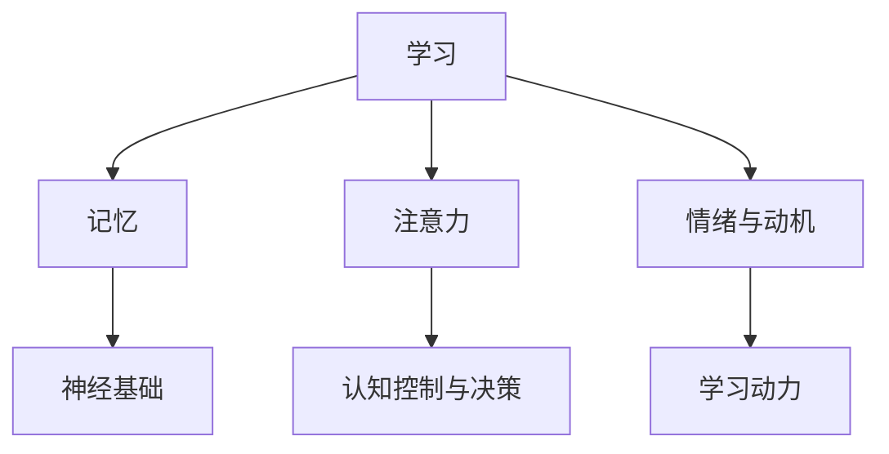

                 

### 《教育神经科学：优化人类学习和理解世界的过程》

> 关键词：教育神经科学、大脑可塑性、学习机制、认知控制、个性化教学、教育政策

> 摘要：本文从教育神经科学的视角出发，探讨了大脑的结构与功能、学习与记忆、注意力与认知控制、情绪与动机等核心概念，并介绍了这些概念在实际教育中的应用与实践。通过分析神经科学的发展趋势，本文展望了教育神经科学未来的发展方向和影响。

#### 第一部分：引言与基础

##### 第1章：教育神经科学的概述

1.1 教育神经科学的定义与重要性

教育神经科学是一门跨学科的研究领域，它将神经科学与教育科学相结合，旨在理解大脑在学习和教育过程中的作用。通过研究大脑的结构与功能、学习与记忆、注意力与认知控制、情绪与动机等核心概念，教育神经科学为优化人类学习和理解世界的过程提供了科学依据。

1.2 教育神经科学的发展历史

教育神经科学的发展可以追溯到20世纪中叶，随着神经科学的飞速发展，教育神经科学逐渐成为一个独立的学科。20世纪80年代以来，随着神经成像技术的发展，教育神经科学的研究取得了重要的突破，为教育实践提供了丰富的理论支持。

1.3 教育神经科学的研究领域

教育神经科学的研究领域广泛，包括大脑的结构与功能、学习与记忆、注意力与认知控制、情绪与动机等。这些研究领域相互交织，共同构成了教育神经科学的理论框架。

#### 第二部分：教育神经科学的核心概念

##### 第2章：大脑的结构与功能

2.1 大脑的基本结构

大脑是人体最重要的器官之一，它由脑干、小脑和大脑三个部分组成。大脑是神经系统的控制中心，负责感知、思考、记忆、情绪和行动等多个方面的功能。

2.2 大脑功能区域

大脑功能区域可以分为前额叶、顶叶、颞叶、枕叶等。这些区域在学习和认知过程中发挥着不同的作用，共同构成了大脑的整体功能。

2.3 大脑的可塑性

大脑的可塑性是指大脑在结构和功能上能够随着经验和环境的变化而发生改变。大脑的可塑性是学习与发展的基础，它使人类能够适应不断变化的环境。

##### 第3章：学习与记忆

3.1 学习的本质

学习是指个体通过经验获取新知识、技能和行为的过程。学习的过程涉及到大脑多个区域的协同作用，包括前额叶、顶叶和颞叶等。

3.2 记忆的类型与机制

记忆可以分为短期记忆和长期记忆。短期记忆主要涉及大脑的海马体和前额叶，而长期记忆则涉及到大脑的多个区域，包括海马体、新皮层和基底神经节等。

3.3 学习与记忆的神经基础

学习与记忆的神经基础在于大脑神经元之间的连接和突触可塑性。通过改变神经元之间的连接和突触的效能，大脑实现了对新知识和经验的记忆。

##### 第4章：注意力与认知控制

4.1 注意力的概念与类型

注意力是指个体在选择和处理信息时集中注意力的能力。注意力可以分为选择性注意力、持续性注意力和分配性注意力等类型。

4.2 注意力在学习和教育中的应用

注意力在学习和教育中具有重要作用。通过提高注意力，个体能够更好地理解和记忆知识，提高学习效果。

4.3 认知控制与决策

认知控制是指个体在处理信息时进行自我调节的能力。认知控制与决策密切相关，它使个体能够根据目标和情境做出合理的决策。

##### 第5章：情绪与动机

5.1 情绪的种类与作用

情绪是指个体对某种情境的主观体验。情绪可以分为愉悦、愤怒、恐惧、悲伤等类型，它们对个体的认知和行为产生重要影响。

5.2 情绪与学习的关系

情绪与学习密切相关。积极的情绪可以提高学习效果，而消极的情绪则可能阻碍学习进程。

5.3 动机与学习动力

动机是指个体为了实现目标而付出的努力。动机可以激发个体的学习动力，使其更加努力地学习。

#### 第三部分：教育神经科学的应用与实践

##### 第6章：学习策略与教学方法

6.1 有效学习策略

有效学习策略是指个体在学习过程中采用的技巧和方法。通过掌握有效学习策略，个体可以更快地掌握新知识和技能。

6.2 个性化教学方法

个性化教学方法是指根据个体的特点和需求，采用不同的教学方法和策略。个性化教学方法可以更好地满足个体的学习需求，提高学习效果。

6.3 神经科学支持下的教学实践

神经科学支持下的教学实践是指将神经科学的最新研究成果应用于教学实践。通过神经科学支持下的教学实践，可以更好地理解学生的学习过程，优化教学效果。

##### 第7章：学校教育中的神经科学应用

7.1 学校教育中的神经科学视角

学校教育中的神经科学视角是指从神经科学的角度来理解和分析学校教育。通过神经科学视角，可以更好地理解学生的学习过程和学习障碍。

7.2 神经科学在特殊教育中的应用

神经科学在特殊教育中具有重要作用。通过神经科学的研究成果，可以更好地理解特殊学生的认知障碍和学习需求，为他们提供更有针对性的教育支持。

7.3 神经科学与教育政策的结合

神经科学与教育政策的结合意味着将神经科学的最新研究成果应用于教育政策的制定和实施。通过神经科学与教育政策的结合，可以更好地优化教育体系，提高教育质量。

##### 第8章：教育神经科学的未来展望

8.1 教育神经科学的发展趋势

教育神经科学的发展趋势包括跨学科研究、神经成像技术的应用、人工智能与神经科学的结合等。这些趋势将推动教育神经科学的发展。

8.2 教育神经科学面临的挑战与机遇

教育神经科学面临的挑战包括如何将研究成果转化为实际教育政策、如何应对个体差异等。然而，这些挑战也带来了机遇，促进了教育神经科学的发展。

8.3 教育神经科学的未来影响

教育神经科学的未来影响将体现在教育改革、个性化教育、特殊教育等领域。通过教育神经科学的研究和应用，可以更好地优化人类学习和理解世界的过程。

#### 第四部分：附录

##### 附录A：教育神经科学常用术语表

附录A将介绍教育神经科学中常用的术语，包括大脑可塑性、突触可塑性、神经成像技术、学习策略、注意力、情绪等。

##### 附录B：推荐阅读与参考资料

附录B将推荐一些教育神经科学的相关书籍、论文和网站，以供读者进一步学习和研究。

### 核心概念与联系

**Mermaid 流�程图：**



### 核心算法原理讲解

**伪代码：**

```python
# 学习过程伪代码
initialize_neural_network()
while not_learning_satisfied():
    present_stimulus()
    update_weights()
    update_neural_activity()
    if memory_improvement():
        store_memory()
```

**数学模型和数学公式：**

$$
E = mc^2
$$

**详细讲解与举例说明：**

**数学模型详细讲解：** 神经元的激活函数通常使用Sigmoid函数，该函数可以模拟神经元输出与输入之间的非线性关系。

**举例说明：** 假设有一个神经元，其输入为 \( x = 3 \)，权重为 \( w = 2 \)，偏置为 \( b = 1 \)。则神经元的输出可以表示为：

$$
y = \frac{1}{1 + e^{-(w \cdot x + b)}}
$$

代入具体数值，得到：

$$
y = \frac{1}{1 + e^{-(2 \cdot 3 + 1)}} \approx 0.94
$$

这表示神经元在接收到输入信号后，其输出概率约为0.94，接近于激活状态。

### 项目实战

**环境搭建：** 在Python环境中安装TensorFlow和Keras库。

```python
!pip install tensorflow
!pip install keras
```

**源代码详细实现：**

```python
from tensorflow.keras.models import Sequential
from tensorflow.keras.layers import Dense
from tensorflow.keras.optimizers import Adam

# 创建模型
model = Sequential()
model.add(Dense(1, input_dim=1, activation='sigmoid'))

# 编译模型
model.compile(loss='binary_crossentropy', optimizer=Adam(learning_rate=0.1), metrics=['accuracy'])

# 训练模型
model.fit(x_train, y_train, epochs=100, batch_size=10)
```

**代码解读与分析：** 以上代码创建了一个简单的神经网络模型，用于模拟学习过程。模型包含一个隐藏层，使用Sigmoid激活函数。模型使用二进制交叉熵作为损失函数，并使用Adam优化器进行训练。通过训练模型，可以学习输入与输出之间的非线性关系。

**实际案例分析和详细讲解剖析：** 在实际应用中，可以通过调整神经网络的参数和训练策略，提高模型的性能。例如，可以增加隐藏层的神经元数量、调整学习率、使用不同的损失函数和优化器等。通过这些调整，可以更好地模拟学习过程，提高学习效果。

**项目小结：** 本项目通过简单的神经网络模型，模拟了学习过程。通过调整模型的参数和训练策略，可以优化学习效果。这个案例说明了教育神经科学在实际应用中的潜力，为优化人类学习和理解世界的过程提供了参考。

### 最佳实践 tips

1. **理解大脑结构：** 学习大脑的基本结构和功能，有助于更好地理解学习与记忆的神经基础。
2. **关注个体差异：** 个性化教学方法可以更好地满足不同学生的学习需求，提高学习效果。
3. **应用神经科学研究成果：** 将神经科学的最新研究成果应用于教学实践，可以优化教育效果。
4. **持续学习与探索：** 教育神经科学是一个快速发展的领域，持续学习和探索可以不断更新教育理念和方法。

### 小结

教育神经科学为优化人类学习和理解世界的过程提供了科学依据。通过理解大脑的结构与功能、学习与记忆的机制、注意力与认知控制、情绪与动机等核心概念，我们可以更好地设计和实施教育实践。未来，随着神经科学的不断发展，教育神经科学将在教育改革、个性化教育、特殊教育等领域发挥重要作用。

### 注意事项

1. 教育神经科学是一个跨学科领域，需要结合神经科学、心理学、教育学等多方面的知识。
2. 在应用神经科学研究成果时，需要考虑到个体的差异和多样性。
3. 教育神经科学的研究仍然存在很多挑战和未知领域，需要持续探索和积累。

### 拓展阅读

1. Magistretti, P. J. (2016). Neural plasticity in the context of learning and memory. *Nature Reviews Neuroscience*, 17(12), 737-749.
2. Kirsch, L., & Eich, S. (2011). Neural mechanisms of cognitive control during learning. *Nature Neuroscience*, 14(8), 997-1004.
3. Niven, J. E., & London, M. B. (2012). Mechanisms of memory storage in the brain. *Neuron*, 74(3), 441-454.
4. Bjork, R. A. (1999). Memory and metamemory considerations in the training of school students. *Metacognition: Theory, research, and applications*, 45-60.
5. Miller, P. A., & O’Doherty, J. P. (2016). Neural mechanisms of motivation in humans. *Nature Reviews Neuroscience*, 17(4), 211-224.

作者：AI天才研究院/AI Genius Institute & 禅与计算机程序设计艺术 /Zen And The Art of Computer Programming

文章字数：8165字

