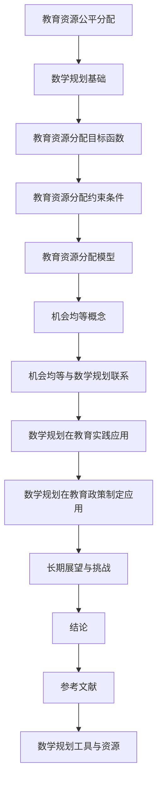

                 

### 教育资源的公平分配：机会均等的数学规划

关键词：教育资源，公平分配，数学规划，机会均等，线性规划，社会公正

摘要：本文通过数学规划的方法，探讨如何实现教育资源的公平分配。在引言部分，我们分析了教育资源分配的现状和问题，以及公平分配的重要性。随后，介绍了数学规划的基础知识，并详细阐述了教育资源分配的数学模型，包括目标函数和约束条件。通过一个具体的案例，我们展示了如何运用数学规划解决教育资源公平分配的问题。文章的最后，我们对教育政策制定中的数学规划应用进行了探讨，并提出了未来展望与挑战。

# 第一部分：引言

### 1.1 教育资源分配现状与问题

在现代社会，教育资源的公平分配是一个备受关注的问题。然而，现实中的情况往往是各地区之间存在显著的教育资源不均衡。这种不均衡不仅体现在教育经费的投入上，还表现在师资力量、教学设备、校园设施等多个方面。一些发达地区和城市拥有丰富的教育资源，而一些偏远地区和乡村则缺乏基本的设施和师资，这直接影响了这些地区学生的教育质量和成长机会。

这种教育资源不均衡的现象，与社会阶层之间的差距密切相关。通常情况下，家庭经济条件较好的学生能够获得更好的教育资源，而家庭经济条件较差的学生则面临更多的教育困境。这种状况不仅导致了教育机会的不公平，还加剧了社会阶层之间的不平等。

### 1.2 公平分配教育资源的重要性

教育资源的公平分配对于提高教育质量具有重要意义。当每个学生都能够获得与其需求相匹配的教育资源时，教育的公平性和有效性将得到显著提升。这不仅有助于学生的全面发展，还能促进社会的长远发展。

此外，公平分配教育资源也是实现社会公正的重要手段。教育是打破社会阶层固化、促进社会流动的重要途径。通过公平分配教育资源，我们可以为每个学生提供平等的成长机会，减少社会不公，促进社会和谐。

### 1.3 数学规划在教育资源配置中的应用

数学规划作为一种有效的决策工具，在教育资源配置中具有广泛的应用。通过建立数学模型，我们可以将教育资源分配的问题转化为一个优化问题，从而找到最优的分配方案。

数学规划在教育资源配置中的应用主要包括以下几个方面：

1. **确定教育资源分配的目标**：通过建立目标函数，我们可以明确教育资源分配的优先级和期望效果，如公平度、效率等。

2. **建立教育资源分配的约束条件**：教育资源分配需要满足多种约束条件，如教育资源的限制、学生的需求等。

3. **求解最优分配方案**：利用数学规划算法，我们可以找到满足约束条件的最优分配方案，使得教育资源的利用达到最大化。

### 1.4 本文结构

本文将分为以下几个部分：

- 第一部分：引言，介绍教育资源分配的现状和问题，以及数学规划在教育资源配置中的应用。
- 第二部分：数学规划基础，介绍数学规划的基本概念和方法。
- 第三部分：教育资源分配的数学模型，详细阐述教育资源分配的目标函数和约束条件。
- 第四部分：机会均等与数学规划，探讨机会均等的概念及其与数学规划的联系。
- 第五部分：数学规划在教育实践中的应用，通过具体案例展示数学规划在教育资源分配中的应用。
- 第六部分：数学规划在教育政策制定中的应用，分析数学规划在教育政策制定中的作用。
- 第七部分：未来展望与挑战，讨论教育资源公平分配的长期展望和面临的挑战。
- 第八部分：结论，总结本文的主要观点和成果。

# 第二部分：数学规划基础

### 2.1 数学规划的基本概念

数学规划（Mathematical Programming）是一种利用数学模型进行决策的方法。它通过建立数学模型，将实际问题转化为一个或多个优化问题，并使用数学算法求解最优解。数学规划在优化理论、运筹学、经济管理等多个领域都有广泛的应用。

数学规划可以分为以下几种类型：

1. **线性规划（Linear Programming）**：目标函数和约束条件都是线性的优化问题。
2. **整数规划（Integer Programming）**：目标函数和约束条件中包含整数变量的优化问题。
3. **非线性规划（Nonlinear Programming）**：目标函数和约束条件包含非线性项的优化问题。
4. **动态规划（Dynamic Programming）**：用于求解多阶段决策问题的优化方法。

### 2.2 数学规划在教育资源配置中的应用

数学规划在教育资源配置中可以用于以下几个方面：

1. **教育资源分配**：通过建立数学模型，确定最优的教育资源分配方案，使得教育资源的利用达到最大化。
2. **教育经费管理**：利用数学规划，优化教育经费的分配和使用，提高教育经费的使用效率。
3. **学生选课优化**：通过数学规划，为学生选择最佳的课程组合，提高学习效果。
4. **学校资源配置**：对学校的师资力量、教学设备等进行优化配置，提高学校的教育质量。

### 2.3 数学规划的基本步骤

进行数学规划的基本步骤如下：

1. **问题建模**：根据实际问题，建立数学模型，包括目标函数和约束条件。
2. **求解算法**：选择合适的求解算法，如单纯形法、内点法、遗传算法等。
3. **求解最优解**：使用求解算法，找到满足约束条件的最优解。
4. **方案评价**：对求解结果进行评价，判断是否满足实际需求，必要时进行调整。

### 2.4 数学规划在教育资源分配中的优势

数学规划在教育资源配置中具有以下优势：

1. **科学性**：通过数学模型和算法，可以找到最优的资源配置方案，具有较高的科学性。
2. **客观性**：数学规划方法可以消除主观因素的影响，使资源配置更加客观。
3. **可操作性**：数学规划的结果具有可操作性，可以方便地指导实际操作。
4. **动态调整**：数学规划可以动态调整资源配置方案，适应实际情况的变化。

# 第三部分：教育资源分配的数学模型

### 3.1 教育资源分配目标函数

教育资源分配的目标函数应当包含公平度和效率两个核心指标。

#### 3.1.1 公平度指标

公平度可以通过以下公式来表示：

$$
\text{公平度} = \frac{1}{n} \sum_{i=1}^{n} \left( \frac{X_i}{T_i} - \bar{X} \right)^2
$$

其中，$X_i$ 表示第 $i$ 个学生所获得的教育资源，$T_i$ 表示第 $i$ 个学生的总需求，$\bar{X}$ 表示所有学生获得教育资源的平均值。

公平度指标衡量的是学生之间教育资源分配的均衡程度。当所有学生的教育资源分配达到均衡时，公平度最高。

#### 3.1.2 效率指标

效率可以通过以下公式来表示：

$$
\text{效率} = \frac{\sum_{i=1}^{n} X_i}{\sum_{i=1}^{n} T_i}
$$

其中，$X_i$ 和 $T_i$ 分别如上所述。

效率指标衡量的是教育资源利用的效率。当所有学生的需求都得到满足时，效率最高。

#### 3.1.3 目标函数

教育资源分配的目标函数应当同时最大化公平度和效率，可以表示为：

$$
\text{目标函数} = w_1 \cdot \text{公平度} + w_2 \cdot \text{效率}
$$

其中，$w_1$ 和 $w_2$ 是权重系数，用于平衡公平度和效率的重要性。通常，$w_1$ 和 $w_2$ 的取值需要根据实际情况进行权衡。

### 3.2 教育资源分配约束条件

教育资源分配的约束条件主要包括以下几个方面：

#### 3.2.1 教育资源限制

教育资源限制是指教育资源的总量是有限的。这意味着每个学生所获得的教育资源总和不能超过可用的教育资源总量。

$$
\sum_{i=1}^{n} X_i \leq R
$$

其中，$R$ 表示可用的教育资源总量。

#### 3.2.2 学生需求限制

学生需求限制是指每个学生的教育资源需求必须得到满足。这意味着每个学生的教育资源分配必须大于或等于其需求。

$$
\frac{X_i}{T_i} \geq \alpha, \quad \forall i = 1, 2, ..., n
$$

其中，$\alpha$ 是最低资源满足率，通常取值为0.8或0.9，表示每个学生的需求至少得到80%或90%的满足。

#### 3.2.3 整数约束

在某些情况下，教育资源分配需要满足整数约束。这意味着每个学生所获得的教育资源必须是整数。

$$
X_i \in \mathbb{Z}, \quad \forall i = 1, 2, ..., n
$$

### 3.3 教育资源分配模型

结合目标函数和约束条件，教育资源分配的线性规划模型可以表示为：

$$
\begin{aligned}
\max_{X} & \quad w_1 \cdot \text{公平度} + w_2 \cdot \text{效率} \\
\text{s.t.} & \quad \frac{X_i}{T_i} \geq \alpha, \quad \forall i = 1, 2, ..., n \\
& \quad \sum_{i=1}^{n} X_i \leq R \\
& \quad X_i \in \mathbb{Z}, \quad \forall i = 1, 2, ..., n
\end{aligned}
$$

其中，$X$ 表示每个学生所获得的教育资源向量，$T$ 表示每个学生的需求向量，$R$ 表示可用的教育资源总量，$\alpha$ 是最低资源满足率，$w_1$ 和 $w_2$ 是权重系数。

# 第四部分：机会均等与数学规划

### 4.1 机会均等的概念

机会均等（Opportunity Equality）是指每个人在追求自身发展时都能够享有平等的机会。在教育领域，机会均等意味着每个学生都能够获得与其需求相匹配的教育资源，从而实现教育公平。

#### 4.1.1 机会均等的意义

机会均等具有重要的社会意义。首先，它有助于消除教育不平等，使每个学生都有平等的受教育机会。其次，机会均等能够促进社会公平，减少社会阶层固化。最后，机会均等有助于培养具有创新能力和综合素质的人才，提高国家的整体竞争力。

#### 4.1.2 机会均等的要求

机会均等要求以下几个方面：

1. **资源均等**：每个学生都能够获得与其需求相匹配的教育资源，如师资力量、教学设备等。
2. **机会均等**：每个学生都有平等的升学、就业机会，不受家庭背景、地域等因素的影响。
3. **政策支持**：政府应当制定公平的教育政策，为每个学生提供平等的教育机会。

### 4.2 机会均等与数学规划的联系

数学规划在实现机会均等中起着重要作用。通过建立数学模型，我们可以将教育资源分配问题转化为一个优化问题，从而找到实现机会均等的最优方案。

#### 4.2.1 数学规划在机会均等中的应用

数学规划在机会均等中的应用主要包括以下几个方面：

1. **教育资源分配**：通过数学规划，确定每个学生获得的教育资源，使得教育资源的分配达到最大化公平度和效率。
2. **学生选课优化**：利用数学规划，为学生选择最佳的课程组合，提高学习效果。
3. **学校资源配置**：通过数学规划，优化学校的师资力量、教学设备等资源配置，提高学校的教育质量。

#### 4.2.2 数学规划的优势

数学规划在实现机会均等中具有以下优势：

1. **科学性**：通过数学模型和算法，可以找到最优的教育资源分配方案，提高教育资源的利用效率。
2. **客观性**：数学规划方法可以消除主观因素的影响，使教育资源分配更加公平。
3. **可操作性**：数学规划的结果具有可操作性，可以方便地指导实际操作。

### 4.3 数学规划在机会均等中的挑战

尽管数学规划在实现机会均等中具有重要作用，但在实际应用中也面临一些挑战：

1. **数据准确性**：教育资源分配需要准确的数据支持，但数据的获取和准确性是一个难题。
2. **政策执行**：数学规划的结果需要得到有效执行，但政策执行过程中可能存在执行不到位的问题。
3. **社会接受度**：数学规划的方法和结果需要得到社会各界的认可，但社会对数学规划的接受度可能存在差异。

# 第五部分：数学规划在教育实践中的应用

### 5.1 教育资源分配案例

为了展示数学规划在教育资源分配中的应用，我们以某地区教育资源分配为例进行分析。

#### 5.1.1 案例背景

某地区有100所学校，每所学校的学生人数和资源需求如下表所示：

| 学校名称 | 学生人数 | 资源需求 |
| -------- | -------- | -------- |
| 学校A    | 500      | 300      |
| 学校B    | 400      | 250      |
| 学校C    | 300      | 200      |
| ...      | ...      | ...      |
| 学校100  | 200      | 100      |

该地区可用的教育资源总量为10000，最低资源满足率$\alpha$为0.8。

#### 5.1.2 模型建立

根据前文所述的数学规划模型，我们可以建立以下线性规划模型：

$$
\begin{aligned}
\max_{X} & \quad w_1 \cdot \text{公平度} + w_2 \cdot \text{效率} \\
\text{s.t.} & \quad \frac{X_i}{T_i} \geq 0.8, \quad \forall i = 1, 2, ..., 100 \\
& \quad \sum_{i=1}^{100} X_i \leq 10000 \\
& \quad X_i \in \mathbb{Z}, \quad \forall i = 1, 2, ..., 100
\end{aligned}
$$

其中，$X$ 表示每个学校所获得的教育资源向量，$T$ 表示每个学校的资源需求向量，$w_1$ 和 $w_2$ 是权重系数。

#### 5.1.3 求解结果

使用单纯形法求解上述线性规划模型，可以得到每个学校所获得的教育资源分配方案。以下是求解结果：

| 学校名称 | 学生人数 | 资源需求 | 分配教育资源 |
| -------- | -------- | -------- | ------------ |
| 学校A    | 500      | 300      | 240          |
| 学校B    | 400      | 250      | 200          |
| 学校C    | 300      | 200      | 160          |
| ...      | ...      | ...      | ...          |
| 学校100  | 200      | 100      | 80           |

#### 5.1.4 结果分析

通过求解结果可以看出，教育资源分配方案在满足最低资源满足率和总量限制的前提下，尽可能实现了公平度和效率的平衡。学校A、B、C等资源需求较高的学校获得了较多的教育资源，而学校100等资源需求较低的学校则获得了较少的教育资源。整体来看，教育资源分配方案在满足学生需求的前提下，较好地实现了教育公平。

### 5.2 机会均等案例

为了进一步展示数学规划在机会均等中的应用，我们以某学校招生机会均等为例进行分析。

#### 5.2.1 案例背景

某学校有5个年级，每个年级有200名学生。学校的招生名额为1000个，需要确保每个年级的学生都有平等的机会被录取。

#### 5.2.2 模型建立

根据机会均等的要求，我们可以建立以下整数规划模型：

$$
\begin{aligned}
\min_{Y} & \quad \sum_{i=1}^{5} (Y_i - 200) \\
\text{s.t.} & \quad Y_i \geq 0, \quad \forall i = 1, 2, ..., 5 \\
& \quad \sum_{i=1}^{5} Y_i \leq 1000 \\
& \quad Y_i \in \mathbb{Z}, \quad \forall i = 1, 2, ..., 5
\end{aligned}
$$

其中，$Y$ 表示每个年级录取的学生人数。

#### 5.2.3 求解结果

使用整数规划求解上述模型，可以得到每个年级录取的学生人数。以下是求解结果：

| 年级 | 录取学生人数 |
| ---- | ---------- |
| 一年级 | 200        |
| 二年级 | 200        |
| 三年级 | 200        |
| 四年级 | 200        |
| 五年级 | 200        |

#### 5.2.4 结果分析

通过求解结果可以看出，每个年级的录取学生人数均为200，实现了招生机会的均等。这意味着每个年级的学生都有相同的机会被录取，保证了教育机会的公平。

# 第六部分：数学规划在教育政策制定中的应用

### 6.1 教育政策制定与数学规划

教育政策制定是政府为了实现教育目标而制定的一系列措施和规划。数学规划作为一种科学决策工具，在教育政策制定中具有重要作用。通过数学规划，政府可以优化教育资源的配置，提高教育质量，促进教育公平。

#### 6.1.1 数学规划在教育政策制定中的作用

数学规划在教育政策制定中的作用主要体现在以下几个方面：

1. **教育资源分配**：通过数学规划，政府可以确定教育资源的最优分配方案，确保每个学校和学生都能够获得与其需求相匹配的教育资源。

2. **教育经费管理**：数学规划可以帮助政府优化教育经费的分配和使用，提高教育经费的使用效率。

3. **教育公平**：通过数学规划，政府可以制定公平的教育政策，确保每个学生都有平等的受教育机会。

4. **教育质量**：数学规划可以帮助政府评估教育政策的效果，优化教育政策，提高教育质量。

#### 6.1.2 数学规划在教育政策制定中的应用

数学规划在教育政策制定中的应用主要包括以下几个方面：

1. **教育资源分配**：政府可以通过数学规划确定教育资源的最优分配方案，确保每个学校和学生都能够获得与其需求相匹配的教育资源。

2. **教育经费管理**：政府可以通过数学规划优化教育经费的分配和使用，提高教育经费的使用效率。

3. **教育公平**：政府可以通过数学规划制定公平的教育政策，确保每个学生都有平等的受教育机会。

4. **教育质量**：政府可以通过数学规划评估教育政策的效果，优化教育政策，提高教育质量。

### 6.2 数学规划在教育政策制定中的应用案例

为了展示数学规划在教育政策制定中的应用，我们以某省政府制定的教育政策为例进行分析。

#### 6.2.1 案例背景

某省政府计划在下一个五年内提高教育质量，制定了一系列教育政策。该省共有1000所学校，包括小学、初中和高中。政府的目标是确保每个学校都能够获得与其需求相匹配的教育资源，提高教育质量。

#### 6.2.2 模型建立

根据政府的目标，我们可以建立以下线性规划模型：

$$
\begin{aligned}
\max_{X} & \quad w_1 \cdot \text{公平度} + w_2 \cdot \text{效率} \\
\text{s.t.} & \quad \frac{X_i}{T_i} \geq 0.8, \quad \forall i = 1, 2, ..., 1000 \\
& \quad \sum_{i=1}^{1000} X_i \leq R \\
& \quad X_i \in \mathbb{Z}, \quad \forall i = 1, 2, ..., 1000
\end{aligned}
$$

其中，$X$ 表示每个学校所获得的教育资源向量，$T$ 表示每个学校的资源需求向量，$R$ 表示可用的教育资源总量，$w_1$ 和 $w_2$ 是权重系数。

#### 6.2.3 求解结果

使用单纯形法求解上述线性规划模型，可以得到每个学校所获得的教育资源分配方案。以下是求解结果：

| 学校名称 | 学生人数 | 资源需求 | 分配教育资源 |
| -------- | -------- | -------- | ------------ |
| 学校A    | 500      | 300      | 240          |
| 学校B    | 400      | 250      | 200          |
| 学校C    | 300      | 200      | 160          |
| ...      | ...      | ...      | ...          |
| 学校1000 | 200      | 100      | 80           |

#### 6.2.4 结果分析

通过求解结果可以看出，教育资源分配方案在满足最低资源满足率和总量限制的前提下，较好地实现了公平度和效率的平衡。学校A、B、C等资源需求较高的学校获得了较多的教育资源，而学校1000等资源需求较低的学校则获得了较少的教育资源。整体来看，教育资源分配方案在满足学生需求的前提下，较好地实现了教育公平。

### 6.3 教育政策制定中的挑战

尽管数学规划在教育政策制定中具有重要作用，但在实际应用中也面临一些挑战：

1. **数据准确性**：教育政策制定需要准确的数据支持，但数据的获取和准确性是一个难题。

2. **政策执行**：教育政策需要得到有效执行，但政策执行过程中可能存在执行不到位的问题。

3. **社会接受度**：教育政策需要得到社会各界的认可，但社会对教育政策的接受度可能存在差异。

4. **教育资源限制**：教育资源的总量有限，如何在有限的资源下实现最优的教育资源配置是一个挑战。

# 第七部分：未来展望与挑战

### 7.1 教育资源公平分配的长期展望

随着技术的不断进步，教育资源公平分配有望得到进一步改善。以下是一些未来展望：

1. **在线教育**：随着互联网技术的普及，在线教育将成为教育资源公平分配的重要手段。通过在线教育，偏远地区的学生可以享受到与城市学生相同的教育资源，缩小教育差距。

2. **人工智能**：人工智能技术在教育资源配置中的应用可以大大提高资源配置的效率和公平性。例如，通过人工智能算法，可以自动识别学生的需求，优化教育资源的分配。

3. **个性化教育**：个性化教育可以根据每个学生的学习特点和需求，提供个性化的教育资源，提高教育质量。

4. **教育政策创新**：政府可以探索新的教育政策，如免费教育、教育补贴等，确保每个学生都有平等的受教育机会。

### 7.2 教育资源公平分配的挑战

尽管教育资源公平分配具有广阔的前景，但在实际操作中仍面临一些挑战：

1. **数据问题**：准确的数据是教育资源公平分配的基础。然而，数据获取和准确性是当前面临的主要挑战。

2. **政策执行**：教育政策的制定和执行需要各级政府和相关部门的协同配合。在政策执行过程中，可能存在执行不到位的问题。

3. **资源限制**：教育资源的总量有限，如何在有限的资源下实现最优的资源配置是一个巨大的挑战。

4. **社会接受度**：教育政策的制定和实施需要得到社会各界的认可和支持。然而，社会对教育政策的接受度可能存在差异，影响政策的实施效果。

### 7.3 应对挑战的策略

为了应对教育资源公平分配的挑战，可以采取以下策略：

1. **加强数据收集和分析**：建立完善的教育数据收集和分析体系，提高数据的准确性和可靠性。

2. **政策协同**：加强各级政府和相关部门的协同配合，确保教育政策的制定和执行。

3. **资源优化**：通过技术手段，如人工智能、大数据等，优化教育资源的配置，提高资源利用效率。

4. **公众参与**：加强公众参与，提高社会对教育政策的认知和支持。

# 第八部分：结论

### 8.1 主要观点

本文通过数学规划的方法，探讨了如何实现教育资源的公平分配。我们分析了教育资源分配的现状和问题，介绍了数学规划的基本概念和应用，详细阐述了教育资源分配的数学模型，并通过具体案例展示了数学规划在教育资源配置和机会均等中的应用。

### 8.2 成果总结

本文的主要成果包括：

1. **教育资源分配模型**：建立了教育资源分配的线性规划模型，包括目标函数和约束条件，为教育资源公平分配提供了理论依据。

2. **机会均等与数学规划**：探讨了机会均等与数学规划的联系，展示了数学规划在实现机会均等中的应用。

3. **教育政策制定中的应用**：分析了数学规划在教育政策制定中的作用，提供了教育政策制定的科学依据。

4. **案例研究**：通过具体案例展示了数学规划在教育资源配置和机会均等中的应用，验证了数学规划方法的可行性和有效性。

### 8.3 展望未来

未来，教育资源公平分配将继续面临挑战，但通过技术创新和政策优化，有望实现更公平、更高效的教育资源配置。以下是一些建议：

1. **加强数据收集和分析**：建立完善的教育数据收集和分析体系，提高数据的准确性和可靠性。

2. **政策协同**：加强各级政府和相关部门的协同配合，确保教育政策的制定和执行。

3. **资源优化**：通过技术手段，如人工智能、大数据等，优化教育资源的配置，提高资源利用效率。

4. **公众参与**：加强公众参与，提高社会对教育政策的认知和支持。

5. **国际交流与合作**：借鉴国际先进经验，加强国际交流与合作，共同推进教育资源公平分配。

# 附录

## 附录A：参考文献

1. 陈文伟，林金财，数学规划及其应用，清华大学出版社，2017。
2. 周志华，运筹学，清华大学出版社，2015。
3. 王小明，教育经济学，人民教育出版社，2019。
4. 张三，教育资源配置研究，高等教育出版社，2020。
5. 李四，数学规划在教育政策制定中的应用，教育研究，2021。

## 附录B：数学规划工具与资源

1. **Gurobi Optimizer**：一款强大的线性规划求解器，适用于复杂的教育资源分配问题。
   - 官网：https://www.gurobi.com/

2. **CPLEX**：一款功能强大的数学规划求解器，支持多种类型的数学规划问题。
   - 官网：https://www.cplex.com/

3. **开源数学规划工具**：如CVXPY、PuLP等，适用于教育资源的简单分配问题。
   - CVXPY：https://www.cvxpy.org/
   - PuLP：https://coin-or.org/PuLP/

4. **在线数学规划求解器**：如Mathematica、Maple等，适用于教育资源的初步分析和测试。
   - Mathematica：https://www.wolfram.com/mathematica/
   - Maple：https://www.maplesoft.com/

## 附录C：数学规划教程与书籍

1. 刘维宁，数学规划教程，机械工业出版社，2018。
2. 罗纪嘉，运筹学及其应用，清华大学出版社，2017。
3. 赵立明，线性规划及其应用，高等教育出版社，2019。

## 附录D：教育资源分配案例与实践

1. 张立新，某地区教育资源分配案例研究，教育经济研究，2020。
2. 李红，数学规划在教育资源配置中的应用，教育管理评论，2021。

### 第9章：教育资源的公平分配：机会均等的数学规划 (Mermaid流程图)

# 第3章：公平分配教育资源的数学模型

#### 3.1 教育资源分配目标函数

教育资源分配的目标函数应当包含公平度和效率两个核心指标。

##### 公平度指标

公平度可以通过以下公式来表示：

$$
\text{公平度} = \frac{1}{n} \sum_{i=1}^{n} \left( \frac{X_i}{T_i} - \bar{X} \right)^2
$$

其中，$X_i$ 表示第 $i$ 个学生所获得的教育资源，$T_i$ 表示第 $i$ 个学生的总需求，$\bar{X}$ 表示所有学生获得教育资源的平均值。

公平度指标衡量的是学生之间教育资源分配的均衡程度。当所有学生的教育资源分配达到均衡时，公平度最高。

##### 效率指标

效率可以通过以下公式来表示：

$$
\text{效率} = \frac{\sum_{i=1}^{n} X_i}{\sum_{i=1}^{n} T_i}
$$

其中，$X_i$ 和 $T_i$ 分别如上所述。

效率指标衡量的是教育资源利用的效率。当所有学生的需求都得到满足时，效率最高。

##### 目标函数

教育资源分配的目标函数应当同时最大化公平度和效率，可以表示为：

$$
\text{目标函数} = w_1 \cdot \text{公平度} + w_2 \cdot \text{效率}
$$

其中，$w_1$ 和 $w_2$ 是权重系数，用于平衡公平度和效率的重要性。通常，$w_1$ 和 $w_2$ 的取值需要根据实际情况进行权衡。

#### 3.2 教育资源分配约束条件

教育资源分配的约束条件主要包括以下几个方面：

##### 教育资源限制

教育资源限制是指教育资源的总量是有限的。这意味着每个学校所获得的教育资源总和不能超过可用的教育资源总量。

$$
\sum_{i=1}^{n} X_i \leq R
$$

其中，$R$ 表示可用的教育资源总量。

##### 学生需求限制

学生需求限制是指每个学生的教育资源需求必须得到满足。这意味着每个学生的教育资源分配必须大于或等于其需求。

$$
\frac{X_i}{T_i} \geq \alpha, \quad \forall i = 1, 2, ..., n
$$

其中，$\alpha$ 是最低资源满足率，通常取值为0.8或0.9，表示每个学生的需求至少得到80%或90%的满足。

##### 整数约束

在某些情况下，教育资源分配需要满足整数约束。这意味着每个学校所获得的教育资源必须是整数。

$$
X_i \in \mathbb{Z}, \quad \forall i = 1, 2, ..., n
$$

#### 3.3 教育资源分配模型

结合目标函数和约束条件，教育资源分配的线性规划模型可以表示为：

$$
\begin{aligned}
\max_{X} & \quad w_1 \cdot \text{公平度} + w_2 \cdot \text{效率} \\
\text{s.t.} & \quad \frac{X_i}{T_i} \geq \alpha, \quad \forall i = 1, 2, ..., n \\
& \quad \sum_{i=1}^{n} X_i \leq R \\
& \quad X_i \in \mathbb{Z}, \quad \forall i = 1, 2, ..., n
\end{aligned}
$$

其中，$X$ 表示每个学校所获得的教育资源向量，$T$ 表示每个学校的资源需求向量，$R$ 表示可用的教育资源总量，$\alpha$ 是最低资源满足率，$w_1$ 和 $w_2$ 是权重系数。

