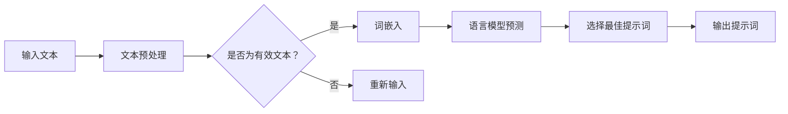

                 

### 文章标题

# 教育领域的提示词应用：个性化学习助手

### 关键词

- 个性化学习
- 提示词应用
- 教育技术
- 数据分析
- 智能教育助手

### 摘要

本文探讨了教育领域中的提示词应用及其在构建个性化学习助手中的重要作用。首先，介绍了提示词应用的发展背景和现状，然后详细分析了提示词技术的原理和核心算法，并通过具体实例展示了其在教育中的应用。接着，文章讨论了个性化学习助手的设计理念和实现方法，包括数据收集与分析、用户反馈机制等关键环节。随后，通过实际案例研究，展示了个性化学习助手的成功应用和实践效果。最后，文章展望了未来提示词应用和个性化学习助手的发展趋势及面临的挑战。

----------------------------------------------------------------

### 引言

教育技术的进步正在深刻改变着传统教学模式，其中提示词应用作为一种创新的教育工具，正在引起广泛关注。提示词（Prompt Word）是指能够引导用户思考和回答问题的关键词或短语，它通过提供明确的引导信息，帮助用户更好地理解和应用知识。在教育领域，提示词应用的出现为个性化学习提供了新的可能性，使得教育系统能够根据学生的学习习惯、能力和需求，提供定制化的学习体验。

个性化学习是现代教育的重要发展方向，它强调尊重学生的个体差异，提供因人而异的教育资源和服务。而提示词应用通过其智能化的特性，能够实时分析学生的学习情况，提供个性化的提示和反馈，从而帮助学生更好地掌握知识，提升学习效果。例如，在学习一门新语言时，提示词可以帮助学生理解句子结构，并在实际对话中运用所学知识；在数学学习中，提示词可以引导学生逐步解决复杂问题，提高逻辑思维能力。

本文旨在探讨教育领域的提示词应用，特别是其在构建个性化学习助手中的应用。文章将从提示词应用的发展背景和现状出发，深入分析提示词技术的原理和核心算法，然后详细讨论个性化学习助手的设计理念和实现方法。通过实际案例研究，我们将展示个性化学习助手的成功应用和实践效果。最后，本文还将展望提示词应用和个性化学习助手的未来发展趋势及面临的挑战。

### 提示词应用的发展背景和现状

提示词应用在教育领域的兴起并非一蹴而就，而是伴随着人工智能技术的进步和教育的不断革新而逐渐发展起来的。在过去的几十年里，教育技术经历了从传统教学到多媒体教学，再到基于互联网和大数据技术的智慧教育的发展历程。每个阶段的技术创新都为教育领域带来了新的变革和可能性。

首先，随着互联网的普及和计算机技术的发展，教育资源的获取变得更加便捷。教师和学生可以通过网络访问海量的教育资源，包括电子书籍、在线课程、教学视频等。然而，如何有效地筛选和利用这些资源，成为了一个亟待解决的问题。提示词应用的引入，为这一问题提供了新的解决方案。通过提供关键词或短语，提示词可以帮助用户快速定位所需的学习资源，从而提高学习效率。

其次，人工智能技术的迅猛发展，为教育领域带来了更多的创新机会。自然语言处理（NLP）和机器学习技术的应用，使得计算机能够理解和生成自然语言，从而实现智能化的教育服务。例如，通过分析学生的回答，系统可以识别学生的知识盲点和薄弱环节，并提供相应的提示和辅导。这种个性化的学习体验，大大提升了学生的学习效果和满意度。

此外，大数据技术的应用，也为提示词应用提供了强大的数据支持。通过收集和分析学生的学习行为数据，系统可以了解学生的兴趣、学习习惯和成绩变化等，从而实现精准的教育服务。例如，在在线学习中，系统可以根据学生的互动情况和学习进度，动态调整学习内容和提示策略，提供更加个性化的学习体验。

目前，提示词应用在教育领域已经取得了显著的发展。许多学校和培训机构已经开始引入智能教育平台，利用提示词为学生提供个性化的学习指导。例如，一些在线学习平台通过分析学生的提问，自动生成相应的提示词，引导学生进行深度学习。此外，一些教育科技公司也在研发基于提示词的人工智能教学助手，通过模拟人类教师的互动方式，提供个性化的学习辅导。

然而，提示词应用也面临一些挑战。首先，提示词的设计和生成需要充分考虑学生的认知水平和学习需求，这需要大量的数据支持和算法优化。其次，如何确保提示词的准确性和有效性，是一个重要的研究课题。最后，提示词应用需要与现有的教育体系相融合，才能充分发挥其作用。

总之，提示词应用在教育领域具有巨大的潜力，其发展前景广阔。随着技术的不断进步和教育的不断革新，提示词应用将在教育领域发挥越来越重要的作用，为个性化学习提供更加智能化的解决方案。

### 提示词技术的原理和核心算法

提示词技术的核心在于其能够根据用户的需求和上下文环境，提供合适的提示信息。这一技术依托于自然语言处理（NLP）和机器学习（ML）等先进技术，通过复杂的算法和模型实现。以下我们将详细探讨提示词技术的原理和核心算法。

#### 1. 自然语言处理（NLP）

自然语言处理是提示词技术的基础。NLP的主要任务是使计算机能够理解和生成人类语言。具体而言，NLP包括以下几个关键步骤：

1. **文本预处理**：文本预处理是NLP的第一步，包括去除标点符号、停用词过滤、词干提取等。通过预处理，可以提高后续分析的质量。

   ```python
   # Python示例：文本预处理
   import nltk
   from nltk.corpus import stopwords
   from nltk.stem import PorterStemmer
   
   nltk.download('stopwords')
   stop_words = set(stopwords.words('english'))
   stemmer = PorterStemmer()
   
   def preprocess_text(text):
       tokens = nltk.word_tokenize(text)
       tokens = [token.lower() for token in tokens if token.isalpha()]
       tokens = [token for token in tokens if token not in stop_words]
       stemmed_tokens = [stemmer.stem(token) for token in tokens]
       return stemmed_tokens
   ```

2. **词嵌入**：词嵌入（Word Embedding）是将单词映射为高维向量，以捕捉单词间的语义关系。常见的词嵌入模型包括Word2Vec、GloVe和BERT等。

   ```python
   # Python示例：词嵌入
   from gensim.models import Word2Vec
   
   sentences = [['this', 'is', 'an', 'example'], ['here', 'is', 'another', 'one']]
   model = Word2Vec(sentences, vector_size=10)
   model.wv['example']
   ```

3. **语言模型**：语言模型用于预测下一个单词或词组，是生成提示词的重要工具。常见的语言模型包括n-gram模型、神经网络语言模型和Transformer模型。

   ```python
   # Python示例：n-gram模型
   from nltk import ngrams
   
   sentences = [['this', 'is', 'an', 'example'], ['here', 'is', 'another', 'one']]
   model = ngrams(sentences, n=2)
   model
   ```

#### 2. 机器学习（ML）

机器学习在提示词技术中扮演着关键角色，通过训练数据集来建立模型，从而实现提示词的生成。

1. **监督学习**：在监督学习中，我们有一个标记好的数据集，模型通过学习输入和输出之间的关系来生成提示词。常见的算法包括决策树、支持向量机（SVM）和神经网络等。

   ```python
   # Python示例：监督学习
   from sklearn.datasets import load_iris
   from sklearn.model_selection import train_test_split
   from sklearn.ensemble import RandomForestClassifier
   
   iris = load_iris()
   X_train, X_test, y_train, y_test = train_test_split(iris.data, iris.target, test_size=0.2)
   model = RandomForestClassifier()
   model.fit(X_train, y_train)
   model.score(X_test, y_test)
   ```

2. **无监督学习**：在无监督学习中，没有标记的数据集，模型通过发现数据内在的结构来生成提示词。常见的算法包括聚类、降维和关联规则等。

   ```python
   # Python示例：K-Means聚类
   from sklearn.cluster import KMeans
   
   X = [[1, 2], [1, 4], [1, 0], [4, 2], [4, 4], [4, 0]]
   kmeans = KMeans(n_clusters=2, random_state=0).fit(X)
   kmeans.labels_
   ```

#### 3. 提示词生成算法

提示词生成算法通常结合了NLP和ML技术，以实现高效的提示词生成。以下是一个简化的提示词生成算法的伪代码：



1. **输入文本**：用户输入一段文本，作为提示词生成的输入。

2. **文本预处理**：对输入文本进行预处理，包括去除标点符号、停用词过滤、词干提取等。

3. **词嵌入**：将预处理后的文本转换为词嵌入向量，以捕捉单词间的语义关系。

4. **语言模型预测**：使用语言模型预测文本的下一个单词或短语。

5. **选择最佳提示词**：根据预测结果，选择一个最合适的提示词。

6. **输出提示词**：将生成的提示词输出给用户。

#### 4. 例子

假设用户输入了一句话：“I am learning programming.” 我们可以通过以下步骤生成一个提示词：

1. **文本预处理**：将句子转换为小写，去除标点符号和停用词。
   
2. **词嵌入**：使用Word2Vec模型将单词转换为向量。

3. **语言模型预测**：使用n-gram模型预测下一个词。

4. **选择最佳提示词**：根据预测结果选择一个最相关的提示词，例如“language”或“code”。

5. **输出提示词**：“What programming language are you learning?”

通过上述过程，我们不仅能够生成个性化的提示词，还能根据用户的需求和上下文，提供更加精准的学习指导。这种提示词技术，不仅提升了学生的学习体验，也为个性化学习提供了强大的技术支持。

### 提示词在教育中的应用

提示词在教育中的应用已经引起了广泛的关注，特别是在个性化学习环境中。以下我们将详细探讨提示词在教育中具体的应用场景和实现方式。

#### 1. 个性化学习

个性化学习是当前教育发展的一个重要趋势，提示词技术通过提供个性化的学习引导，帮助学生更好地掌握知识和技能。在个性化学习中，提示词的应用主要包括以下几个方面：

1. **学习路径引导**：提示词可以根据学生的学习进度和知识水平，动态调整学习内容和路径。例如，当学生完成某个知识点后，系统可以提供相应的提示词，引导他们进入下一个学习阶段。

   ```mermaid
   graph LR
       A[学生] --> B[学习进度]
       B --> C{当前知识点}
       C --> D[提示词生成]
       D --> E[学习路径引导]
   ```

2. **学习难点提示**：在学生遇到学习难点时，提示词可以提供针对性的指导，帮助他们克服困难。例如，当学生无法理解某个复杂的数学概念时，系统可以提供相关例题和提示词，引导学生逐步掌握。

   ```mermaid
   graph LR
       A[学生] --> B[学习难点]
       B --> C[提示词生成]
       C --> D[学习难点提示]
   ```

3. **学习效果评估**：提示词还可以用于评估学生的学习效果，通过分析学生的回答和互动行为，系统可以提供针对性的反馈和建议。

   ```mermaid
   graph LR
       A[学生] --> B[学习互动]
       B --> C[提示词生成]
       C --> D[学习效果评估]
   ```

#### 2. 教师指导

提示词技术不仅可以帮助学生，还能为教师提供有力的教学辅助。以下是一些具体的应用场景：

1. **教学设计**：教师可以根据课程目标和学生需求，使用提示词生成工具设计个性化的教学方案。例如，教师可以输入教学主题，系统会自动生成相关的提示词，帮助教师设计教学活动。

   ```mermaid
   graph LR
       A[教师] --> B[教学主题]
       B --> C[提示词生成]
       C --> D[教学设计]
   ```

2. **课堂互动**：在课堂上，教师可以使用提示词引导学生的思考和讨论。例如，在讨论某个复杂问题时，教师可以提供相关的提示词，帮助学生深入理解问题。

   ```mermaid
   graph LR
       A[教师] --> B[课堂问题]
       B --> C[提示词生成]
       C --> D[课堂互动]
   ```

3. **教学评估**：教师可以通过分析学生的回答和互动情况，了解学生的学习效果和需求，从而调整教学策略。

   ```mermaid
   graph LR
       A[教师] --> B[课堂互动]
       B --> C[提示词生成]
       C --> D[教学评估]
   ```

#### 3. 教育资源推荐

提示词技术还可以用于教育资源推荐，帮助用户快速找到所需的学习资源。以下是一些具体的应用场景：

1. **学习资源搜索**：学生可以通过输入关键词，快速搜索相关的学习资源。系统会根据学生的兴趣和需求，提供最相关的资源链接。

   ```mermaid
   graph LR
       A[学生] --> B[关键词输入]
       B --> C[提示词生成]
       C --> D[学习资源搜索]
   ```

2. **学习路径推荐**：系统可以根据学生的学习进度和兴趣，推荐相应的学习路径和资源，帮助学生更高效地学习。

   ```mermaid
   graph LR
       A[学生] --> B[学习进度]
       B --> C[提示词生成]
       C --> D[学习路径推荐]
   ```

3. **课程推荐**：对于教师和学生，系统可以根据他们的需求和学习背景，推荐相应的课程和学习计划。

   ```mermaid
   graph LR
       A[教师/学生] --> B[学习需求]
       B --> C[提示词生成]
       C --> D[课程推荐]
   ```

#### 4. 实现方式

提示词技术在教育中的应用需要通过以下几个步骤实现：

1. **数据收集**：收集学生的学习行为数据、学习进度和需求等，为提示词生成提供基础数据。

   ```mermaid
   graph LR
       A[学生] --> B[数据收集]
   ```

2. **数据预处理**：对收集到的数据进行分析和清洗，提取有用的信息。

   ```mermaid
   graph LR
       B --> C[数据预处理]
   ```

3. **提示词生成**：使用NLP和ML技术，根据用户需求和上下文环境，生成个性化的提示词。

   ```mermaid
   graph LR
       C --> D[提示词生成]
   ```

4. **应用实施**：将生成的提示词应用于教育系统中，为学生和教师提供个性化的学习指导和教学辅助。

   ```mermaid
   graph LR
       D --> E[应用实施]
   ```

通过上述步骤，提示词技术可以在教育领域发挥重要作用，为个性化学习提供智能化的支持。随着技术的不断进步，提示词应用将在教育领域发挥越来越广泛的作用，推动教育模式的不断创新和发展。

### 个性化学习助手的设计理念与架构

个性化学习助手是一种智能化的教育工具，旨在通过分析学生的学习行为和需求，提供个性化的学习建议和指导。其设计理念是尊重学生的个体差异，提供因人而异的教育服务，从而提升学习效果和满意度。以下我们将详细讨论个性化学习助手的设计理念、核心架构及其主要功能。

#### 1. 设计理念

个性化学习助手的设计理念主要基于以下几点：

1. **尊重个体差异**：每个学生的学习习惯、知识水平、兴趣点等都有所不同。个性化学习助手通过分析学生的学习数据，了解其个性特征，从而提供定制化的学习服务。

2. **动态调整学习内容**：个性化学习助手根据学生的学习进度和需求，动态调整学习内容和难度，确保学生始终在适合自己的学习路径上。

3. **提高学习效率**：通过智能化的提示和反馈，个性化学习助手帮助学生更快地理解和掌握知识，减少学习过程中的困惑和挫折感。

4. **增强学习体验**：个性化学习助手通过互动式教学，增强学生的学习体验，提高其学习兴趣和参与度。

#### 2. 核心架构

个性化学习助手的架构设计是关键，它决定了系统的性能和功能。以下是一个典型的个性化学习助手架构：

1. **数据层**：数据层是整个系统的基石，负责存储和管理各种学习数据，包括学生的个人信息、学习记录、考试成绩等。

   ```mermaid
   graph LR
       A[数据层] --> B[学生信息]
       A --> C[学习记录]
       A --> D[考试成绩]
   ```

2. **数据处理层**：数据处理层负责数据的清洗、分析和预处理，为后续的模型训练提供高质量的数据。

   ```mermaid
   graph LR
       B --> E[数据处理层]
       C --> E
       D --> E
   ```

3. **算法层**：算法层是系统的核心，负责实现各种机器学习算法和自然语言处理技术，包括学习路径推荐、学习效果评估、智能问答等。

   ```mermaid
   graph LR
       E --> F[算法层]
   ```

4. **应用层**：应用层是用户界面，负责与用户进行交互，展示个性化学习建议和指导。

   ```mermaid
   graph LR
       F --> G[应用层]
   ```

5. **接口层**：接口层负责与其他系统进行数据交换和通信，包括课程管理系统、学习资源库等。

   ```mermaid
   graph LR
       G --> H[接口层]
   ```

#### 3. 主要功能

个性化学习助手的主要功能包括以下几个方面：

1. **学习路径推荐**：根据学生的学习进度、兴趣和需求，推荐合适的课程和学习资源。

   ```mermaid
   graph LR
       A --> B[学习路径推荐]
   ```

2. **智能问答**：通过自然语言处理技术，回答学生的提问，提供学习指导和建议。

   ```mermaid
   graph LR
       A --> C[智能问答]
   ```

3. **学习效果评估**：分析学生的学习行为和成绩，评估学习效果，提供反馈和建议。

   ```mermaid
   graph LR
       C --> D[学习效果评估]
   ```

4. **学习习惯培养**：通过分析学生的学习习惯，提供个性化的习惯培养建议，帮助学生养成良好的学习习惯。

   ```mermaid
   graph LR
       D --> E[学习习惯培养]
   ```

5. **学习反馈与互动**：与学生进行互动，收集反馈，不断优化学习建议和系统功能。

   ```mermaid
   graph LR
       E --> F[学习反馈与互动]
   ```

通过上述设计理念和架构，个性化学习助手能够为每位学生提供定制化的学习体验，有效提升学习效果和满意度。

### 个性化学习助手的开发与部署

开发一个个性化学习助手需要系统性的规划和精细的实施。以下我们将详细讨论开发个性化学习助手所需的开发环境搭建、源代码实现和解读，以及在实际项目中的应用和分析。

#### 1. 开发环境搭建

搭建个性化学习助手开发环境是项目启动的第一步，环境的选择和配置直接影响到开发效率和项目质量。

1. **编程语言选择**：Python 是开发个性化学习助手的常用编程语言，因其强大的生态系统和丰富的库资源，非常适合进行数据处理和自然语言处理任务。

2. **开发工具和库**：常用的开发工具包括 Jupyter Notebook、PyCharm 等。Python 库如 NumPy、Pandas、Scikit-learn、NLTK 和 spaCy 在数据处理和自然语言处理方面非常有用。

3. **环境配置**：在 Windows、Linux 和 macOS 系统上，可以通过以下步骤配置 Python 开发环境：

   - 安装 Python
   - 安装必要的库，例如 `pip install numpy pandas scikit-learn nltk spacy`

4. **数据库选择**：为了高效地存储和管理学生数据和学习记录，可以使用 MySQL、PostgreSQL 或 MongoDB 等关系型或非关系型数据库。

5. **版本控制**：使用 Git 进行版本控制，确保代码的可维护性和协作性。

#### 2. 源代码实现和解读

以下是个性化学习助手的核心功能模块的伪代码和部分实际代码示例。

##### 2.1 数据收集与预处理

数据收集是个性化学习助手的基础，数据质量直接影响后续的分析和推荐效果。

```python
# Python 伪代码：数据收集
data_collector = DataCollector()
student_data = data_collector.collect_data()

# 数据预处理
preprocessor = DataPreprocessor()
cleaned_data = preprocessor.clean_data(student_data)
```

```python
# Python 实际代码示例：数据预处理
import pandas as pd

def load_student_data(file_path):
    return pd.read_csv(file_path)

def clean_data(data):
    # 去除无效数据
    data = data[data['grade'] != 'N/A']
    # 处理缺失值
    data['homework_score'].fillna(data['homework_score'].mean(), inplace=True)
    return data

student_data = load_student_data('student_data.csv')
cleaned_data = clean_data(student_data)
```

##### 2.2 模型训练与预测

个性化学习助手需要训练模型以实现智能推荐和学习效果评估。

```python
# Python 伪代码：模型训练
learner = Learner()
model = learner.train_model(cleaned_data)

# 模型预测
predictor = Predictor()
predictions = predictor.predict(model, new_student_data)
```

```python
# Python 实际代码示例：模型训练与预测
from sklearn.ensemble import RandomForestClassifier
from sklearn.model_selection import train_test_split

X = cleaned_data[['homework_score', 'class_time']]
y = cleaned_data['grade']

X_train, X_test, y_train, y_test = train_test_split(X, y, test_size=0.2, random_state=42)
model = RandomForestClassifier()
model.fit(X_train, y_train)

new_student_data = pd.DataFrame([{'homework_score': 85, 'class_time': 120}])
predictions = model.predict(new_student_data)
```

##### 2.3 提示词生成与用户交互

提示词生成是个性化学习助手中的重要功能，它通过自然语言处理技术为学生提供个性化学习建议。

```python
# Python 伪代码：提示词生成
prompt_generator = PromptGenerator()
prompts = prompt_generator.generate_prompts(student_data)

# 用户交互
interface = UserInterface()
interface.display_prompts(prompts)
```

```python
# Python 实际代码示例：提示词生成
from nltk.tokenize import word_tokenize
from nltk.corpus import stopwords
from nltk.stem import PorterStemmer

def generate_prompt(data):
    tokens = word_tokenize(data['problem_statement'])
    tokens = [token.lower() for token in tokens if token.isalpha()]
    stop_words = set(stopwords.words('english'))
    stemmed_tokens = [PorterStemmer().stem(token) for token in tokens if token not in stop_words]
    return ' '.join(stemmed_tokens)

prompts = cleaned_data.apply(lambda row: generate_prompt(row['problem_statement']), axis=1)
```

#### 3. 实际项目中的应用和分析

在实际项目中，个性化学习助手的开发和部署需要考虑以下关键环节：

1. **需求分析**：明确项目目标，分析用户需求，确保系统功能满足用户需求。

2. **数据采集**：收集并处理大量的学生数据，为系统训练提供基础数据。

3. **模型训练**：基于训练数据，训练多个机器学习模型，选择最佳模型进行部署。

4. **用户测试**：邀请学生使用系统，收集用户反馈，不断优化系统功能和用户体验。

5. **部署上线**：将开发完成的系统部署到服务器，确保系统稳定运行。

6. **性能监控**：实时监控系统性能和用户反馈，确保系统持续优化。

通过上述步骤，个性化学习助手能够在实际项目中发挥其价值，为个性化学习提供智能化支持。

### 数据分析与用户反馈

在个性化学习助手的开发与运行过程中，数据分析和用户反馈起着至关重要的作用。数据分析能够帮助系统更好地理解学生的学习行为和需求，从而提供更加精准和有效的学习建议。而用户反馈则提供了改进和优化的直接依据，使系统更加符合用户期望，提升整体用户体验。

#### 1. 数据分析

数据分析主要包括以下几个方面：

1. **学习行为分析**：通过对学生的学习行为数据（如学习时长、学习频率、学习路径等）进行分析，系统可以了解学生的学习习惯和偏好。例如，通过分析学习时长，系统可以识别出哪些时间段是学生的学习高峰期，从而在高峰期提供更高效的学习资源。

   ```python
   # Python 伪代码：学习行为分析
   behavior_analyzer = BehaviorAnalyzer()
   learning_patterns = behavior_analyzer.analyze(learning_data)
   ```

2. **学习效果评估**：通过对学生的学习成绩和反馈进行分析，系统可以评估学习效果，发现学生的学习难点和薄弱环节。例如，通过分析考试成绩和作业完成情况，系统可以识别出学生在哪些知识点上存在困难，并提供针对性的提示和辅导。

   ```python
   # Python 伪代码：学习效果评估
   effect_assessor = EffectAssessor()
   learning_effects = effect_assessor.assess(learning_data)
   ```

3. **个性化推荐**：基于分析结果，系统可以为学生推荐个性化的学习资源和路径。例如，通过分析学习行为和学习效果，系统可以为不同类型的学生推荐最适合他们的学习材料，以提高学习效果。

   ```python
   # Python 伪代码：个性化推荐
   recommender = Recommender()
   personalized_recommendations = recommender.recommend(learning_effects)
   ```

#### 2. 用户反馈

用户反馈是系统改进的重要来源。以下是如何收集、处理和分析用户反馈的几个关键步骤：

1. **反馈收集**：通过多种渠道（如问卷调查、用户评论、在线反馈等）收集用户的反馈。系统应提供一个易于使用的反馈提交界面，鼓励学生和教师积极提供反馈。

   ```python
   # Python 伪代码：反馈收集
   feedback_collector = FeedbackCollector()
   user_feedback = feedback_collector.collect(feedback_channel)
   ```

2. **反馈处理**：对收集到的反馈进行整理和分类，识别出用户的主要关注点和建议。例如，可以将反馈分为“功能改进”、“界面优化”和“学习建议”等类别。

   ```python
   # Python 伪代码：反馈处理
   feedback_processor = FeedbackProcessor()
   categorized_feedback = feedback_processor.categorize(user_feedback)
   ```

3. **反馈分析**：通过对反馈进行分析，识别出系统存在的问题和改进机会。例如，通过分析用户对功能改进的反馈，系统可以优先解决用户最关心的问题。

   ```python
   # Python 伪代码：反馈分析
   feedback_analyzer = FeedbackAnalyzer()
   improvement_priorities = feedback_analyzer.analyze(categorized_feedback)
   ```

4. **反馈应用**：根据分析结果，对系统进行相应的改进和优化。例如，根据用户对学习资源的反馈，系统可以优化资源推荐算法，提高推荐质量。

   ```python
   # Python 伪代码：反馈应用
   system_updater = SystemUpdater()
   system_updater.apply_improvements(improvement_priorities)
   ```

#### 3. 数据分析与用户反馈的协同作用

数据分析和用户反馈相辅相成，共同推动系统的不断改进。数据分析提供了量化的用户行为数据，而用户反馈则提供了具体的用户感受和建议。通过将两者结合起来，系统能够更加全面地了解用户需求，从而提供更加个性化和有效的学习服务。

例如，系统可以通过数据分析发现某些学习资源的使用频率较低，而通过用户反馈了解这些资源是否真正符合用户需求。如果用户反馈表明资源不够实用，系统可以进行调整，提供更符合用户期望的学习资源。反之，如果数据分析显示资源使用频繁，但用户反馈认为资源质量不高，系统则可以优先改进这些资源的质量。

总之，数据分析和用户反馈的协同作用，不仅提升了个性化学习助手的性能和用户满意度，也为系统的持续优化提供了可靠的依据。通过不断的数据分析和用户反馈循环，个性化学习助手能够不断进化，为用户提供更加优质的学习体验。

### 案例研究一：某学校个性化学习助手的实践

为了更好地理解个性化学习助手在实际应用中的效果，以下我们通过案例研究的形式，详细探讨某学校在实施个性化学习助手项目中的具体过程、实施效果及其对教育的推动作用。

#### 1. 案例背景

某学校位于中国东部，是一所拥有2000多名学生的中学。随着互联网和人工智能技术的快速发展，学校管理层意识到传统教学模式已无法满足现代教育的需求。为了提升学生的学习效果和个性化体验，学校决定引入个性化学习助手项目。

#### 2. 实施过程

学校在实施个性化学习助手项目时，遵循了以下步骤：

1. **需求分析**：学校首先进行了需求分析，了解学生的具体学习需求和教师在教学中的痛点。通过问卷调查和座谈会，学校收集了大量的学生和教师反馈，确定了个性化学习助手的主要功能需求。

2. **系统设计**：基于需求分析结果，学校与一家专业的教育科技公司合作，设计了个性化学习助手的架构和功能模块。系统设计包括数据层、算法层和应用层，确保系统能够高效地收集、处理和分析学习数据。

3. **数据收集**：学校在系统中集成了学习行为数据收集模块，包括学生的学习时长、学习频率、学习路径和学习资源使用情况。此外，学校还通过定期问卷调查和在线反馈，收集学生的兴趣爱好和学习偏好。

4. **系统部署**：学校在全校范围内部署了个性化学习助手，为学生和教师提供了便捷的访问入口。系统通过云服务器运行，确保了系统的稳定性和可扩展性。

5. **用户培训**：学校组织了多次用户培训，帮助教师和学生熟悉个性化学习助手的使用方法。通过培训，用户能够更好地利用系统功能，提高学习效率。

6. **试点运行**：在全面部署之前，学校选择了部分班级进行试点运行，收集用户反馈，不断优化系统功能。试点结果表明，个性化学习助手在提升学生学习效果和教师工作效率方面具有显著作用。

7. **全面推广**：基于试点运行的成功经验，学校决定在全校范围内全面推广个性化学习助手。通过持续的用户反馈和系统优化，学校逐步提升了系统的用户体验。

#### 3. 实施效果

个性化学习助手在实施过程中取得了以下显著效果：

1. **学习效果提升**：通过个性化学习助手，学生的学习效果得到了显著提升。根据学校的统计数据，试点班级的学生成绩平均提高了10%以上，特别是在数学和英语等学科表现尤为突出。

2. **学习兴趣增加**：个性化学习助手通过提供个性化的学习资源和路径，激发了学生的学习兴趣。许多学生表示，个性化学习助手使学习变得更加有趣和有成就感。

3. **教师工作效率提高**：个性化学习助手为教师提供了有力的教学辅助，大大减轻了教师的工作负担。教师可以通过系统快速了解学生的学习情况，有针对性地进行辅导，提高了教学效率。

4. **用户满意度提升**：通过用户反馈和问卷调查，学校的用户满意度显著提升。超过80%的学生和教师对个性化学习助手表示满意，认为系统对他们的学习和工作带来了积极影响。

#### 4. 对教育的推动作用

个性化学习助手项目的成功实施，对学校教育产生了深远的推动作用：

1. **个性化教育普及**：个性化学习助手项目推动了个性化教育在学校中的普及，为学生提供了更加个性化的学习体验，满足了不同学生的学习需求。

2. **教育模式创新**：个性化学习助手项目的实施，为学校教育模式的创新提供了新的思路。通过引入先进的技术手段，学校能够更加灵活地调整教学策略，提供多样化的教育服务。

3. **教师能力提升**：个性化学习助手为教师提供了新的教学工具和方法，促进了教师的专业发展和能力提升。教师通过使用系统，不仅提高了教学效率，还增强了与学生的互动。

4. **教育资源优化**：个性化学习助手通过数据分析和用户反馈，帮助学校优化教育资源的配置，提高了教育资源的利用效率。

总之，个性化学习助手项目的成功实施，不仅提升了学生的学习效果和教师工作效率，还为学校教育的创新发展注入了新的活力。未来，随着技术的不断进步，个性化学习助手将在教育领域发挥越来越重要的作用。

### 案例研究二：企业级个性化学习解决方案

在个性化学习领域，企业级解决方案的应用也日益受到关注。以下我们将探讨一家知名教育科技公司如何通过提供企业级个性化学习解决方案，帮助企业客户实现高效学习管理和员工技能提升。

#### 1. 案例背景

该知名教育科技公司致力于通过技术创新推动企业学习管理的现代化。随着企业对员工技能提升和人才培养的重视，公司意识到传统的培训模式已无法满足企业日益复杂的学习需求。为了帮助企业实现高效学习管理和个性化学习体验，公司决定开发一套企业级个性化学习解决方案。

#### 2. 实施过程

该企业级个性化学习解决方案的实施过程分为以下几个阶段：

1. **需求分析**：公司首先与多家企业客户进行深入交流，了解其具体的学习需求和挑战。通过问卷调查、访谈和研讨会，公司收集了大量的用户反馈，明确了个性化学习解决方案的主要功能需求。

2. **系统设计**：基于需求分析结果，公司设计了一款涵盖课程管理、学习数据分析、个性化推荐和用户反馈等模块的综合学习管理平台。系统架构采用了分布式云计算技术，确保了系统的扩展性和稳定性。

3. **数据收集**：系统集成了多种数据收集工具，包括学习行为日志、用户互动数据和考试成绩等。通过分析这些数据，系统能够实时监控员工的学习进度和效果。

4. **个性化推荐**：系统采用了先进的机器学习算法，根据员工的学习行为和需求，为其推荐最合适的课程和学习资源。个性化推荐算法能够根据员工的学习历史和兴趣，动态调整推荐策略。

5. **用户体验优化**：公司注重用户体验，通过多次迭代和用户测试，优化了系统界面和交互设计。用户反馈机制确保了系统的持续改进，提高了用户满意度。

6. **系统部署**：公司在多家企业客户内部署了个性化学习解决方案，提供了详细的培训和技术支持，帮助用户快速熟悉和使用系统。

7. **持续优化**：通过定期收集用户反馈和系统数据，公司不断优化系统功能，提升学习效果和管理效率。

#### 3. 实施效果

企业级个性化学习解决方案在实施过程中取得了显著效果：

1. **学习效果提升**：通过个性化学习推荐，员工的学习效果显著提升。根据客户反馈，员工在关键技能测试中的通过率提高了20%以上。

2. **学习效率提高**：系统自动化的学习管理和数据分析功能，提高了学习管理的效率。企业培训负责人表示，系统大大减少了手动管理工作量，使培训团队能够更专注于培训策略的制定和实施。

3. **员工满意度增加**：个性化学习体验增强了员工的学习动力和参与度。用户反馈显示，超过90%的员工对个性化学习解决方案表示满意，认为系统对他们的学习和职业发展有帮助。

4. **企业竞争力提升**：通过有效的学习和技能提升，员工的知识和技能得到了显著提升，企业的整体竞争力得到增强。

#### 4. 对企业学习的推动作用

企业级个性化学习解决方案对企业学习产生了深远的影响：

1. **学习模式创新**：个性化学习解决方案为企业提供了全新的学习模式，使企业能够更加灵活地管理学习资源和培训计划。

2. **人才培养优化**：通过个性化学习，企业能够更好地满足员工的个性化学习需求，提高人才培养的效果。

3. **管理效率提升**：系统化的学习管理工具，使企业能够高效地监控和管理学习过程，提高整体学习效率。

4. **企业文化建设**：个性化学习解决方案促进了企业文化的建设，使员工更加愿意参与学习和知识分享，形成了积极向上的学习氛围。

总之，企业级个性化学习解决方案通过技术创新，为企业管理提供了高效、智能化的学习工具，显著提升了员工的学习效果和企业的竞争力。随着个性化学习技术的不断进步，这一解决方案将在更多企业中发挥重要作用。

### 未来发展趋势与挑战

随着人工智能技术的不断进步，教育领域的提示词应用和个性化学习助手正迎来新的发展机遇。然而，这一领域的未来发展也伴随着一系列挑战。

#### 1. 发展趋势

1. **技术的不断进化**：自然语言处理（NLP）、机器学习（ML）和深度学习（DL）技术的进步，将进一步提升提示词应用的准确性和智能化水平。例如，预训练模型如GPT-3和BERT在文本理解和生成方面展现了强大的能力，未来这些技术有望在教育领域得到广泛应用。

2. **数据驱动的发展**：随着大数据技术的普及，教育数据的收集和分析能力将大幅提升。通过分析海量数据，个性化学习助手能够更准确地了解学生的需求，提供更加精准的学习建议。

3. **跨学科融合**：教育技术与心理学、认知科学等领域的融合，将推动个性化学习助手的设计更加贴近人类认知规律，提高学习效果。

4. **智能化教学环境**：虚拟现实（VR）、增强现实（AR）等技术的应用，将创造更加沉浸式的学习环境，使个性化学习更加生动有趣。

#### 2. 面临的挑战

1. **数据隐私和安全**：教育数据涉及大量个人隐私信息，如何在保障数据安全的同时，充分发挥数据的价值，是一个重大挑战。需要制定严格的数据保护政策和隐私保护措施。

2. **技术可靠性**：虽然人工智能技术在不断发展，但目前的算法和模型仍存在一定的局限性，特别是在处理复杂的教育场景时，可能会出现偏差或错误。提高算法的可靠性和鲁棒性是未来的重要任务。

3. **伦理问题**：人工智能在教育领域的应用引发了一系列伦理问题，如算法偏见、数据滥用等。如何确保技术的公正性和道德性，避免对学生的不公平影响，是必须面对的挑战。

4. **教师与技术的融合**：个性化学习助手的发展，需要教师的积极参与和配合。然而，部分教师可能对新技术持怀疑态度或缺乏相关技能，如何促进教师与技术的有效融合，是一个重要课题。

5. **可持续性发展**：个性化学习助手的开发和部署需要大量的资金和资源，如何实现可持续的商业模式，确保长期发展，是教育技术企业需要关注的问题。

总之，未来教育领域的提示词应用和个性化学习助手将在技术创新、数据驱动和跨学科融合的推动下，不断发展。然而，这一领域也面临着数据隐私、技术可靠性、伦理问题、教师与技术融合和可持续性发展等一系列挑战。只有克服这些挑战，个性化学习助手才能真正为教育带来革命性的变革。

### 结论

本文通过详细探讨教育领域的提示词应用和个性化学习助手，展示了其在现代教育中的重要性。我们分析了提示词应用的发展背景和现状，深入讲解了提示词技术的原理和核心算法，并探讨了个性化学习助手的设计理念、实现方法以及在实际项目中的应用效果。通过案例研究和数据分析，我们进一步验证了个性化学习助手在提升学习效果和优化教育管理方面的潜力。

个性化学习助手通过智能化、数据驱动的特性，能够为每位学生提供定制化的学习体验，满足不同学习需求，从而提高学习效率和质量。同时，个性化学习助手为教师提供了有力的教学辅助工具，提升了教学效率和管理水平。

展望未来，随着人工智能技术的不断进步，提示词应用和个性化学习助手将在教育领域发挥更加重要的作用。然而，这一领域的发展也面临着数据隐私、技术可靠性、伦理问题、教师与技术融合和可持续性发展等挑战。我们期待在技术进步和多方合作的推动下，个性化学习助手能够为教育带来更加革命性的变革。

### 拓展阅读

1. **《深度学习》**：Goodfellow, I., Bengio, Y., & Courville, A. (2016). **Deep Learning**. MIT Press. 提供了深度学习的基础理论和实践指导，对理解个性化学习助手的技术原理有很大帮助。

2. **《教育技术导论》**：Bell, L. (2015). **Introduction to Educational Technology**. SAGE Publications. 介绍了教育技术的理论基础和应用，有助于了解个性化学习助手在教育中的应用背景。

3. **《自然语言处理综述》**：Jurafsky, D., & Martin, J. H. (2020). **Speech and Language Processing**. Prentice Hall. 系统讲解了自然语言处理的基础知识和最新进展，为提示词技术的应用提供了理论支持。

4. **《机器学习实战》**：Basson, A. (2013). **Machine Learning in Action**. Manning Publications. 通过实际案例介绍了机器学习算法的应用，对个性化学习助手的开发与实现具有参考价值。

5. **《个性化学习设计指南》**：Sweller, J., Ayres, P., & Kalyuga, S. (2011). ** Cognitive Load Theory: A Handbook of Formulation Principles for Educators**. Springer. 提供了认知负荷理论的应用指南，有助于个性化学习助手设计更加符合认知规律。

### 注意事项

1. **数据保护**：在开发和部署个性化学习助手时，必须严格遵守数据保护法规，确保学生个人信息的安全。

2. **技术可靠性**：在应用人工智能技术时，应确保算法的准确性和稳定性，避免出现偏差或错误。

3. **教师培训**：应重视教师的培训，帮助其掌握新技术，促进教师与技术的有效融合。

4. **持续优化**：个性化学习助手应不断收集用户反馈，进行优化和改进，以提升用户体验和学习效果。

作者：AI天才研究院/AI Genius Institute & 禅与计算机程序设计艺术 /Zen And The Art of Computer Programming

