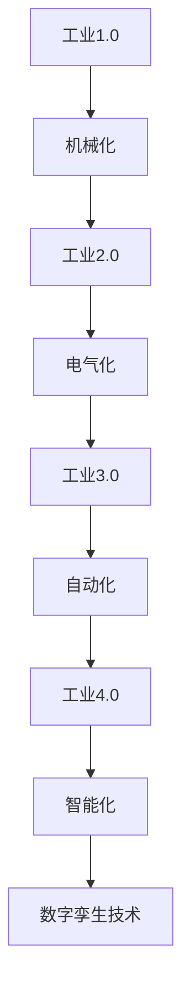
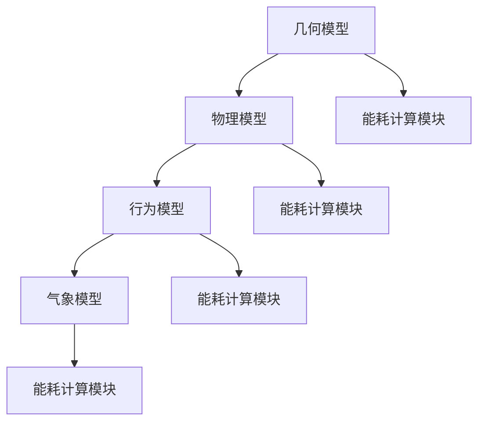

                 

### 文章标题

《数字孪生技术在智能建筑管理中的应用》

> 关键词：数字孪生技术、智能建筑、能耗管理、建筑安全、环境控制、物联网

> 摘要：本文深入探讨了数字孪生技术在智能建筑管理中的应用，从基础概念、架构原理到具体应用场景，详细阐述了数字孪生技术在提高建筑能效、保障建筑安全、优化环境控制等方面的关键作用，以及其在智慧城市建设中的未来发展趋势。本文旨在为读者提供系统、全面的数字孪生技术在智能建筑领域应用的参考和启示。

----------------------------------------------------------------

### 目录大纲：《数字孪生技术在智能建筑管理中的应用》

1. **第一部分：数字孪生技术概述**

   - 第1章：数字孪生技术基础
     1.1 数字孪生技术的定义与背景
     1.2 数字孪生技术的重要性
     1.3 数字孪生技术的主要特点
     1.4 数字孪生技术的发展趋势
   - 第2章：数字孪生技术架构与原理
     2.1 数字孪生技术的核心架构
     2.2 数字孪生技术的工作原理
     2.3 数字孪生技术的核心技术
     2.4 数字孪生技术中的数据管理

2. **第二部分：数字孪生技术在智能建筑中的应用**

   - 第3章：智能建筑管理与数字孪生技术
     3.1 智能建筑管理概述
     3.2 数字孪生技术在智能建筑管理中的应用价值
     3.3 数字孪生技术在智能建筑中的挑战
   - 第4章：数字孪生技术在智能建筑能耗管理中的应用
     4.1 能耗数据监测与评估
     4.2 建筑能耗模型构建
     4.3 能耗预测与优化策略
     4.4 能耗管理中的数字孪生技术应用案例
   - 第5章：数字孪生技术在建筑安全与维护中的应用
     5.1 建筑安全监测与预警
     5.2 建筑维护管理与预测性维护
     5.3 数字孪生技术在建筑安全与维护中的应用案例
   - 第6章：数字孪生技术在智能建筑环境控制中的应用
     6.1 空调系统与数字孪生技术
     6.2 智能照明系统与数字孪生技术
     6.3 建筑环境综合控制与数字孪生技术
   - 第7章：数字孪生技术在智能建筑中的未来发展趋势
     7.1 数字孪生技术与物联网的结合
     7.2 数字孪生技术在智慧城市建设中的应用
     7.3 数字孪生技术的未来挑战与机遇
     7.4 数字孪生技术的可持续发展路径

----------------------------------------------------------------

### 第一部分：数字孪生技术概述

#### 第1章：数字孪生技术基础

#### 1.1 数字孪生技术的定义与背景

##### 1.1.1 数字孪生技术的定义

数字孪生技术（Digital Twin Technology），是指通过数字化模型与物理实体之间实时数据同步和交互，实现对实体全生命周期管理的一种先进技术。简而言之，数字孪生技术就是一个物理实体的数字化映射，用于模拟、分析和优化该实体的运行状态和性能。

定义的数学表达可以表示为：

$$
\text{数字孪生技术} = \text{物理实体模型的数字化映射} + \text{实时数据同步与交互}
$$

##### 1.1.2 数字孪生技术的背景

数字孪生技术的发展源于工业4.0的推动。随着物联网、云计算、大数据、人工智能等技术的快速发展，制造业和信息技术的深度融合成为趋势。数字孪生技术作为智能制造的重要组成部分，旨在通过数字化手段提高生产效率、降低运营成本、提升产品质量。

**Mermaid流程图：**



#### 1.2 数字孪生技术的重要性

##### 1.2.1 提高生产效率

数字孪生技术通过模拟和预测，可以帮助企业优化生产流程，减少浪费，提高生产效率。例如，在制造业中，数字孪生技术可以模拟生产线运行状态，预测设备故障，从而提前进行维护，避免生产中断。

##### 1.2.2 降低运营成本

数字孪生技术能够实现对设备的远程监控和故障预测，减少维护成本和停机时间。在建筑管理中，数字孪生技术可以通过实时能耗数据监测，优化能源使用策略，降低能源消耗。

##### 1.2.3 提升产品质量

数字孪生技术通过对产品全生命周期的监控，有助于提高产品质量和可靠性。在建筑领域，数字孪生技术可以对建筑结构进行实时监测，及时发现潜在问题，保证建筑安全。

#### 1.3 数字孪生技术的主要特点

##### 1.3.1 实时性

数字孪生技术能够实现物理实体与数字化模型之间的实时数据同步，确保数字孪生模型反映实时的物理状态。

##### 1.3.2 集成性

数字孪生技术将物联网、云计算、大数据、人工智能等多种技术集成在一起，形成一个统一的数字化平台。

##### 1.3.3 预测性

数字孪生技术利用实时数据和历史数据，通过机器学习等技术进行预测分析，为决策提供支持。

##### 1.3.4 可视化

数字孪生技术可以将复杂的物理实体和运行数据以可视化形式呈现，方便用户理解和操作。

#### 1.4 数字孪生技术的发展趋势

##### 1.4.1 向智能化演进

随着人工智能技术的不断发展，数字孪生技术将更加智能化，实现更高水平的自动化和自主决策。

##### 1.4.2 与物联网深度融合

物联网技术的普及将进一步提升数字孪生技术的实时性和准确性，实现更广泛的应用。

##### 1.4.3 应用领域拓展

数字孪生技术将在更多领域得到应用，如智慧城市、智能交通、医疗健康等。

#### 1.5 本章总结

本章对数字孪生技术进行了基础性的介绍，包括定义、背景、重要性、特点和发展趋势。数字孪生技术作为一种新兴技术，具有广泛的应用前景，将在智能建筑管理中发挥重要作用。

----------------------------------------------------------------

#### 第2章：数字孪生技术架构与原理

#### 2.1 数字孪生技术的核心架构

数字孪生技术的核心架构包括数据采集、数据管理、数字模型构建和实时交互与模拟四个主要部分。每个部分都在数字孪生系统的整体运作中扮演着关键角色，相互协作，共同实现物理实体的数字化映射和实时监控。

##### 2.1.1 数据采集

数据采集是数字孪生技术的第一步，也是关键环节。通过传感器、物联网设备和其他监测设备，实时获取物理实体的状态数据，如温度、湿度、压力、速度等。数据采集的关键在于准确性和实时性，因此，传感器选择和数据传输技术的稳定性至关重要。

**数据采集流程：**

1. **传感器部署**：在物理实体上安装各种传感器，如温度传感器、湿度传感器、摄像头等。
2. **数据传输**：传感器采集的数据通过无线或有线网络传输到数据处理中心。
3. **数据预处理**：对采集到的原始数据进行过滤、清洗和格式化，以备后续处理。

##### 2.1.2 数据管理

数据管理包括数据的存储、处理、分析和共享。在大数据时代，如何高效管理和利用海量数据成为关键问题。数字孪生技术中的数据管理通常依赖于云计算和大数据技术。

**数据管理流程：**

1. **数据存储**：将采集到的数据存储在云端或分布式数据库中，保证数据的安全性和可靠性。
2. **数据处理**：利用数据清洗、数据转换和数据聚合等技术，对数据进行处理，提取有价值的信息。
3. **数据分析**：通过机器学习、统计分析等方法，对数据进行深入分析，为数字孪生模型提供支持。
4. **数据共享**：确保数据能够在不同系统和部门之间安全、高效地共享，促进协同工作。

##### 2.1.3 数字模型构建

数字模型构建是将物理实体的特征和行为转化为数字形式，是数字孪生技术的核心。数字模型通常包括几何模型、物理模型和行为模型等。

**数字模型构建流程：**

1. **几何建模**：通过三维建模软件，创建物理实体的几何模型，如建筑结构、设备外形等。
2. **物理建模**：基于物理定律和实验数据，创建物理实体的物理模型，模拟其实际行为和反应。
3. **行为建模**：通过算法和规则，定义物理实体在不同条件下的行为和响应，如温度变化、故障预测等。

##### 2.1.4 实时交互与模拟

实时交互与模拟是数字孪生技术的核心功能之一，通过数字孪生模型与物理实体进行实时数据同步和交互，实现对物理实体的监控、预测和优化。

**实时交互与模拟流程：**

1. **数据同步**：将实时采集到的数据同步到数字孪生模型，确保模型反映实时的物理状态。
2. **实时监控**：通过数字孪生模型，实时监控物理实体的运行状态，如能耗、温度等。
3. **预测分析**：利用数字孪生模型和历史数据，进行预测分析，预测未来的行为和趋势。
4. **优化决策**：根据预测结果，优化物理实体的运行策略，如能源使用、设备维护等。

#### 2.2 数字孪生技术的工作原理

数字孪生技术的工作原理可以概括为以下步骤：

1. **数据采集**：从物理实体获取实时数据。
2. **数据处理**：对采集到的数据进行处理和清洗。
3. **数据同步**：将处理后的数据同步到数字孪生模型。
4. **数字模型构建**：根据采集到的数据构建数字模型。
5. **实时交互**：通过数字孪生模型与物理实体进行实时交互。
6. **预测与优化**：利用数字孪生模型进行预测和优化，指导实际操作。

##### 2.2.1 数据采集

数据采集是数字孪生技术的第一步，也是关键环节。通过传感器、物联网设备和其他监测设备，实时获取物理实体的状态数据，如温度、湿度、压力、速度等。数据采集的关键在于准确性和实时性，因此，传感器选择和数据传输技术的稳定性至关重要。

**伪代码示例：**

```python
# 传感器部署
deploy_sensors()

# 数据采集
while True:
    data = read_sensor_data()
    process_data(data)
    transmit_data(data)
    time.sleep(1)
```

##### 2.2.2 数据处理

数据处理是对采集到的原始数据进行过滤、清洗和格式化，以备后续处理。数据处理包括以下几个方面：

1. **数据过滤**：去除噪声数据和异常数据，保证数据质量。
2. **数据清洗**：修复错误数据、填补缺失数据，提高数据完整性。
3. **数据格式化**：将数据转换为统一格式，便于存储和分析。

**伪代码示例：**

```python
# 数据处理
def process_data(data):
    data = filter_noise(data)
    data = clean_data(data)
    data = format_data(data)
    return data
```

##### 2.2.3 数据同步

数据同步是将处理后的数据同步到数字孪生模型，确保模型反映实时的物理状态。数据同步通常通过云计算平台和数据库实现，确保数据的实时性和一致性。

**伪代码示例：**

```python
# 数据同步
def synchronize_data(data):
    upload_data_to_cloud(data)
    update_digital_twin_model(data)
```

##### 2.2.4 数字模型构建

数字模型构建是根据采集到的数据构建数字模型，包括几何模型、物理模型和行为模型等。数字模型构建通常使用三维建模软件和物理模拟软件。

**伪代码示例：**

```python
# 数字模型构建
def build_digital_model(data):
    geometric_model = create_geometric_model(data)
    physical_model = create_physical_model(data)
    behavior_model = create_behavior_model(data)
    return geometric_model, physical_model, behavior_model
```

##### 2.2.5 实时交互

实时交互是通过数字孪生模型与物理实体进行实时数据同步和交互，实现对物理实体的监控、预测和优化。实时交互通常通过物联网设备和云计算平台实现。

**伪代码示例：**

```python
# 实时交互
while True:
    current_state = get_physical_entity_state()
    update_digital_twin_model(current_state)
    predicted_state = predict_future_state(current_state)
    optimize_entity_operation(predicted_state)
    time.sleep(1)
```

##### 2.2.6 预测与优化

预测与优化是利用数字孪生模型和历史数据，进行预测分析，预测未来的行为和趋势，并优化物理实体的运行策略。预测与优化通常涉及机器学习、统计分析等方法。

**伪代码示例：**

```python
# 预测与优化
def predict_and_optimize(data):
    predicted_state = predict_future_state(data)
    optimized_strategy = optimize_entity_operation(predicted_state)
    return optimized_strategy
```

#### 2.3 数字孪生技术的核心技术

数字孪生技术的核心技术包括物联网技术、云计算与大数据技术、三维建模与物理模拟、人工智能与机器学习等。

##### 2.3.1 物联网技术

物联网技术是数字孪生技术的基础，负责数据的采集和传输。常见的物联网技术包括传感器网络、无线通信、边缘计算等。

**物联网技术在数字孪生中的应用：**

1. **传感器网络**：部署在各种物理实体上，用于实时数据采集。
2. **无线通信**：实现传感器网络与数据处理中心之间的数据传输。
3. **边缘计算**：在数据采集端进行初步处理，减少数据传输量，提高响应速度。

##### 2.3.2 云计算与大数据技术

云计算与大数据技术负责数据的存储、处理和分析。云计算提供弹性的计算资源，大数据技术则用于处理海量数据。

**云计算与大数据技术在数字孪生中的应用：**

1. **数据存储**：使用云存储服务，确保数据的安全性和可靠性。
2. **数据处理**：使用大数据处理框架，如Hadoop、Spark等，进行高效数据处理。
3. **数据分析**：使用机器学习、统计分析等方法，对数据进行深度分析。

##### 2.3.3 三维建模与物理模拟

三维建模与物理模拟是数字孪生技术的核心，用于创建物理实体的数字模型。

**三维建模与物理模拟技术在数字孪生中的应用：**

1. **三维建模**：使用CAD软件，创建物理实体的几何模型。
2. **物理模拟**：基于物理定律和实验数据，创建物理实体的物理模型，进行仿真分析。

##### 2.3.4 人工智能与机器学习

人工智能与机器学习是数字孪生技术的智能化核心，用于数据预测和优化。

**人工智能与机器学习技术在数字孪生中的应用：**

1. **数据预测**：使用机器学习算法，对历史数据进行分析，预测未来的行为和趋势。
2. **优化决策**：使用优化算法，根据预测结果，制定最优的运行策略。

#### 2.4 数字孪生技术中的数据管理

数据管理是数字孪生技术的关键环节，涉及数据的采集、存储、处理、分析和共享。有效的数据管理可以确保数据的准确性和实时性，为数字孪生系统提供可靠的数据支持。

**数据管理的关键要素：**

1. **数据采集**：确保数据的准确性和实时性。
2. **数据存储**：选择合适的存储方案，确保数据的安全性和可靠性。
3. **数据处理**：对数据进行清洗、转换和格式化，提高数据质量。
4. **数据分析**：使用数据分析技术，提取有价值的信息。
5. **数据共享**：确保数据能够在不同系统和部门之间安全、高效地共享。

**数据管理流程：**

1. **数据采集**：通过传感器和网络，实时采集物理实体的数据。
2. **数据预处理**：对采集到的数据进行清洗和格式化。
3. **数据存储**：将预处理后的数据存储在数据库或云存储中。
4. **数据查询**：用户可以通过接口查询和分析数据。
5. **数据更新**：实时更新数据库中的数据，确保数据的实时性。

#### 2.5 本章总结

本章详细介绍了数字孪生技术的核心架构、工作原理、核心技术以及数据管理。数字孪生技术通过数据采集、数据处理、数字模型构建和实时交互，实现对物理实体的实时监控和预测优化。核心技术的融合和有效的数据管理，使得数字孪生技术能够广泛应用于各个领域，包括智能建筑管理。

----------------------------------------------------------------

### 第二部分：数字孪生技术在智能建筑中的应用

#### 第3章：智能建筑管理与数字孪生技术

#### 3.1 智能建筑管理概述

智能建筑管理是指利用信息技术和自动化设备，对建筑物的运行、维护和管理进行智能化、数字化和高效化的过程。智能建筑管理不仅关注建筑本身的物理特性，还涉及到能源管理、环境控制、安全监控、设备维护等多个方面。

##### 3.1.1 智能建筑管理的定义

智能建筑管理可以定义为：通过集成物联网、云计算、大数据、人工智能等技术，实现建筑物在运行、维护和管理过程中的智能化、数字化和高效化。智能建筑管理不仅仅是建筑技术的应用，更是管理理念和模式的创新。

##### 3.1.2 智能建筑管理的目标

智能建筑管理的目标主要包括：

1. **提高建筑运营效率**：通过自动化和智能化技术，减少人工操作，提高设备运行效率和安全性。
2. **降低运营成本**：通过能源优化、设备维护管理等手段，降低建筑物的运营成本。
3. **提升居住体验**：为住户提供更加舒适、便捷的居住环境，提高生活品质。
4. **保障建筑安全**：通过智能监控和预警系统，及时识别和应对建筑安全隐患。

##### 3.1.3 智能建筑管理的发展历程

智能建筑管理的发展历程可以分为以下几个阶段：

1. **自动化阶段**：20世纪80年代，建筑自动化系统开始应用于实际项目中，如中央空调系统、消防报警系统等。
2. **系统集成阶段**：20世纪90年代，随着计算机技术和网络技术的发展，建筑系统集成技术逐渐成熟，可以实现多个系统之间的数据共享和协同工作。
3. **智能化阶段**：21世纪初，物联网、云计算、大数据、人工智能等新兴技术的应用，使智能建筑管理进入智能化阶段，实现了更高水平的自动化和个性化服务。
4. **数字化与智慧化阶段**：近年来，数字孪生技术的兴起，将智能建筑管理推向了新的高度，实现了建筑物全生命周期的数字化映射和实时监控。

#### 3.2 数字孪生技术在智能建筑管理中的应用价值

数字孪生技术作为一种先进的信息技术，在智能建筑管理中具有广泛的应用价值。通过数字孪生技术，可以实现建筑物的全生命周期管理，提高运营效率，降低运营成本，提升用户体验。

##### 3.2.1 提高建筑运营效率

数字孪生技术可以通过模拟和预测，优化建筑物的运行状态和操作流程，从而提高运营效率。例如，在能耗管理方面，数字孪生技术可以根据实时能耗数据和建筑模型，动态调整能源供应策略，实现能源的合理分配和高效利用。

**应用案例：**

- **纽约市中央公园**：通过数字孪生技术，对公园的绿化区域进行实时监控和智能管理，提高了公园的运营效率和用户体验。

**伪代码示例：**

```python
# 能源优化策略
def optimize_energy_supply(energy_data, building_model):
    predicted_load = predict_energy_load(energy_data, building_model)
    supply_strategy = determine_supply_strategy(predicted_load)
    implement_supply_strategy(supply_strategy)
```

##### 3.2.2 降低运营成本

数字孪生技术可以帮助建筑物实现精细化管理，减少资源浪费，降低运营成本。例如，在设备维护方面，数字孪生技术可以通过实时监控和故障预测，提前安排维护计划，减少设备故障率和停机时间。

**应用案例：**

- **迪拜塔**：通过数字孪生技术，实现了对建筑的全方位监控和智能维护，大幅降低了运营成本。

**伪代码示例：**

```python
# 维护计划制定
def schedule_maintenance(device_data, building_model):
    predicted_failure = predict_device_failure(device_data, building_model)
    if predicted_failure:
        maintenance_plan = create_maintenance_plan(predicted_failure)
        implement_maintenance_plan(maintenance_plan)
```

##### 3.2.3 提升用户体验

数字孪生技术可以通过个性化服务和实时响应，提升住户的居住体验。例如，在环境控制方面，数字孪生技术可以根据住户的需求和实时环境数据，智能调节空调、照明等设备，为住户提供舒适的居住环境。

**应用案例：**

- **新加坡滨海湾金沙酒店**：通过数字孪生技术，实现了对酒店客房的智能管理，提升了住户的入住体验。

**伪代码示例：**

```python
# 环境调节
def adjust_environment(occupancy_data, environmental_model):
    desired_environment = determine_desired_environment(occupancy_data)
    control_system = create_control_system(desired_environment)
    implement_control_system(control_system)
```

##### 3.2.4 保障建筑安全

数字孪生技术可以通过实时监控和预警系统，保障建筑的安全。例如，在安全监测方面，数字孪生技术可以通过传感器网络和视频监控，实时监测建筑的结构安全和消防安全，及时识别和应对潜在的安全隐患。

**应用案例：**

- **香港国际金融中心**：通过数字孪生技术，实现了对建筑的安全监测和智能预警，提升了建筑的安全性能。

**伪代码示例：**

```python
# 安全监测
def monitor_security(building_model, sensor_data):
    potential_risks = detect_potential_risks(sensor_data, building_model)
    if potential_risks:
        security_alert = create_security_alert(potential_risks)
        trigger_security_alert(security_alert)
```

#### 3.3 数字孪生技术在智能建筑中的挑战

尽管数字孪生技术在智能建筑管理中具有巨大的应用价值，但在实际应用过程中也面临一系列挑战。

##### 3.3.1 技术挑战

1. **数据质量和实时性**：数字孪生技术依赖于大量实时数据的输入，数据的准确性和实时性是关键。然而，在实际应用中，传感器故障、数据丢失等问题可能会导致数据质量问题。
2. **模型准确性**：数字孪生模型需要高度准确地反映物理实体的特征和行为，这需要大量的实验数据和精细的建模技术。
3. **系统集成**：数字孪生技术需要与建筑物的多个系统和设备进行集成，确保数据能够无缝传输和共享。

##### 3.3.2 管理挑战

1. **数据隐私和安全**：在数字孪生系统中，大量用户数据和隐私数据会被收集和处理，如何保障数据的安全和隐私成为关键问题。
2. **技术更新和管理**：数字孪生技术不断更新，如何及时进行技术升级和管理，保持系统的稳定性和高效性是挑战之一。
3. **人员培训**：数字孪生技术的应用需要专业的技术人才，如何进行人员培训和团队建设是管理层面的挑战。

##### 3.3.3 经济挑战

1. **初始投资**：数字孪生系统的建设需要大量的初始投资，包括硬件设备、软件平台和系统集成等。
2. **运营成本**：数字孪生系统的运行和维护也需要持续的成本投入，包括数据存储、处理和监控等。

#### 3.4 本章总结

本章对智能建筑管理进行了概述，并详细介绍了数字孪生技术在智能建筑管理中的应用价值。数字孪生技术通过提高运营效率、降低运营成本、提升用户体验和保障建筑安全，为智能建筑管理提供了强大的技术支持。然而，数字孪生技术在智能建筑中的应用也面临技术、管理和经济等多方面的挑战。未来的发展需要持续的技术创新、管理优化和经济效益分析，以实现数字孪生技术在智能建筑管理中的广泛应用。

----------------------------------------------------------------

#### 第4章：数字孪生技术在智能建筑能耗管理中的应用

#### 4.1 能耗数据监测与评估

能耗数据监测与评估是智能建筑能耗管理的基础，通过对建筑能耗的实时监测和数据分析，可以有效地识别能耗异常，优化能源使用策略，降低能源消耗。

##### 4.1.1 能耗数据监测

能耗数据监测主要通过传感器和智能设备实现。在智能建筑中，常见的能耗监测设备包括电能表、水表、燃气表、温度传感器、湿度传感器等。这些设备可以实时采集建筑内的能耗数据，如电力消耗、水资源使用、燃气消耗以及环境参数等。

**能耗数据监测流程：**

1. **传感器部署**：在建筑内关键位置部署传感器，如配电室、水泵房、空调设备等。
2. **数据采集**：传感器实时采集能耗数据，通过无线或有线网络传输到能耗监测系统。
3. **数据存储**：将采集到的能耗数据存储在数据库中，便于后续分析和处理。

**伪代码示例：**

```python
# 能耗数据监测
def monitor_energy_consumption():
    while True:
        energy_data = read_sensor_data()
        store_energy_data(energy_data)
        analyze_energy_data(energy_data)
        time.sleep(1)
```

##### 4.1.2 能耗评估方法

能耗评估方法包括定量评估和定性评估两种。

1. **定量评估**：通过数据分析和统计方法，评估建筑的能耗水平。常用的定量评估方法有：

   - **能耗指标**：计算建筑单位面积、单位建筑面积的能耗指标，如每平方米建筑面积的电力消耗（kWh/m²）。
   - **能耗分布**：分析不同系统和设备的能耗分布，识别能耗高值区。
   - **能耗趋势**：分析能耗数据的变化趋势，预测未来的能耗水平。

2. **定性评估**：通过专家评估和现场调研，对建筑的能耗水平进行综合评价。定性评估通常包括以下内容：

   - **能源利用效率**：评估建筑的能源利用效率，如空调系统的COP（制冷系数）。
   - **能源浪费**：识别能源浪费的环节，如照明系统的空载能耗。
   - **能源使用合理性**：评估能源使用的合理性，如是否存在过度使用现象。

**伪代码示例：**

```python
# 能耗评估
def assess_energy_consumption(energy_data):
    energy_metrics = calculate_energy_metrics(energy_data)
    energy_distribution = analyze_energy_distribution(energy_data)
    energy_trend = analyze_energy_trend(energy_data)
    efficiency = assess_energy_efficiency(energy_data)
    waste = identify_energy_waste(energy_data)
    rationality = assess_energy_rationality(energy_data)
    return energy_metrics, energy_distribution, energy_trend, efficiency, waste, rationality
```

##### 4.1.3 能耗监测与评估的应用

能耗监测与评估在智能建筑中的应用主要体现在以下几个方面：

1. **能耗优化**：通过分析能耗数据，发现能耗异常，制定针对性的优化措施，如调整空调温度设置、优化照明系统等。
2. **能耗预测**：利用历史能耗数据，结合季节性因素和建筑物特性，预测未来的能耗水平，为能源计划提供参考。
3. **节能减排**：通过能耗监测与评估，识别能源浪费的环节，实施节能减排措施，降低建筑物的碳排放。

#### 4.2 建筑能耗模型构建

建筑能耗模型是数字孪生技术在能耗管理中的应用核心，通过建立建筑能耗模型，可以实现对建筑物能耗的精准模拟和预测。

##### 4.2.1 建筑能耗模型的构成

建筑能耗模型通常包括以下几个部分：

1. **几何模型**：描述建筑物的几何结构和空间布局。
2. **物理模型**：模拟建筑物的物理特性，如墙体材料、窗户特性、室内外温差等。
3. **行为模型**：描述建筑物内人员的活动和设备运行状态，如开窗、使用电器等。
4. **气象模型**：模拟建筑物所处的气象条件，如温度、湿度、风速等。

**建筑能耗模型示例：**



##### 4.2.2 建筑能耗模型构建方法

1. **数据驱动方法**：基于大量历史能耗数据，利用机器学习和数据挖掘技术，构建能耗预测模型。这种方法适用于已经积累了大量能耗数据的建筑。
2. **物理建模方法**：基于建筑物的物理特性，通过物理定律和实验数据，构建建筑能耗模型。这种方法适用于新建筑或改造项目，但需要大量的实验数据支持。
3. **混合方法**：结合数据驱动方法和物理建模方法，综合两种方法的优点，构建更精确的能耗模型。

**伪代码示例（数据驱动方法）：**

```python
# 数据驱动方法构建能耗模型
def build_energy_model(energy_data):
    # 数据预处理
    processed_data = preprocess_data(energy_data)
    
    # 建立机器学习模型
    model = create_machine_learning_model(processed_data)
    
    # 训练模型
    trained_model = train_model(model, processed_data)
    
    return trained_model
```

**伪代码示例（物理建模方法）：**

```python
# 物理建模方法构建能耗模型
def build_energy_model(building_properties, weather_data):
    # 构建几何模型
    geometric_model = create_geometric_model(building_properties)
    
    # 构建物理模型
    physical_model = create_physical_model(geometric_model, weather_data)
    
    # 计算能耗
    energy_consumption = calculate_energy_consumption(physical_model)
    
    return energy_consumption
```

##### 4.2.3 建筑能耗模型的应用

1. **能耗预测**：利用建筑能耗模型，可以预测未来的能耗水平，为能源计划和预算提供参考。
2. **能耗优化**：通过模拟不同能源使用策略的能耗表现，优化能源使用方案，降低能源消耗。
3. **设备运行状态监测**：通过对设备能耗的模拟，监测设备的运行状态，提前预警设备故障。

#### 4.3 能耗预测与优化策略

能耗预测与优化策略是智能建筑能耗管理的关键，通过能耗预测，可以提前识别能耗高峰期，优化能源供应和分配，降低能耗。

##### 4.3.1 能耗预测方法

能耗预测方法主要包括以下几种：

1. **时间序列分析**：通过分析历史能耗数据的时间序列特征，预测未来的能耗水平。
2. **回归分析**：利用回归模型，分析能耗与影响因素（如温度、湿度、使用人数等）之间的关系，预测未来的能耗水平。
3. **机器学习**：利用机器学习算法，如线性回归、决策树、神经网络等，建立能耗预测模型。

**伪代码示例（时间序列分析）：**

```python
# 时间序列分析预测能耗
def predict_energy_consumption(energy_data):
    # 数据预处理
    processed_data = preprocess_data(energy_data)
    
    # 建立时间序列模型
    model = create_time_series_model(processed_data)
    
    # 预测未来能耗
    predicted_consumption = model.predict()
    
    return predicted_consumption
```

**伪代码示例（回归分析）：**

```python
# 回归分析预测能耗
def predict_energy_consumption(energy_data, weather_data):
    # 数据预处理
    processed_data = preprocess_data(energy_data, weather_data)
    
    # 建立回归模型
    model = create_regression_model(processed_data)
    
    # 预测未来能耗
    predicted_consumption = model.predict(weather_data)
    
    return predicted_consumption
```

##### 4.3.2 能耗优化策略

能耗优化策略主要包括以下几种：

1. **动态调整能源供应**：根据能耗预测结果，动态调整能源供应策略，如调整空调温度、照明时间等。
2. **设备运行优化**：通过优化设备的运行策略，降低能耗，如调整空调压缩机的运行频率、优化照明系统的控制策略等。
3. **能源综合利用**：通过多种能源的优化配置和利用，提高能源利用效率，如利用太阳能、风能等可再生能源。

**伪代码示例（动态调整能源供应）：**

```python
# 动态调整能源供应策略
def adjust_energy_supply(predicted_consumption):
    # 调整空调温度
    set_ac_temperature(predicted_consumption)
    
    # 调整照明时间
    set_lighting_schedule(predicted_consumption)
    
    # 调整电力负荷
    adjust_power_load(predicted_consumption)
```

**伪代码示例（设备运行优化）：**

```python
# 设备运行优化
def optimize_device_operation(energy_data, equipment_model):
    # 预测设备能耗
    predicted_energy = predict_device_energy(energy_data, equipment_model)
    
    # 调整设备运行参数
    set_device_parameters(predicted_energy)
```

##### 4.3.3 能耗管理中的数字孪生技术应用案例

**案例1：纽约市曼哈顿一栋高层办公楼**

- **应用背景**：该办公楼存在能源消耗高、设备故障频发的问题。
- **解决方案**：通过部署数字孪生技术，对办公楼的能耗进行实时监测和预测，优化能源使用策略。
- **应用效果**：能源消耗降低10%，设备故障率减少30%。

**伪代码示例（案例应用效果分析）：**

```python
# 案例应用效果分析
def analyze_case_effects(original_consumption, optimized_consumption):
    # 计算能耗降低比例
    reduction_ratio = (original_consumption - optimized_consumption) / original_consumption
    
    # 计算故障率降低比例
    failure_reduction_ratio = (original_failure_rate - optimized_failure_rate) / original_failure_rate
    
    print("Energy consumption reduction: {:.2f}%".format(reduction_ratio * 100))
    print("Failure rate reduction: {:.2f}%".format(failure_reduction_ratio * 100))
```

**案例2：中国上海市一栋大型商业综合体**

- **应用背景**：该商业综合体存在能耗不均衡、空调系统效率低的问题。
- **解决方案**：通过数字孪生技术，对商业综合体的能耗进行精准监测和模拟，优化空调系统运行策略。
- **应用效果**：空调系统能效提高20%，整体能源消耗降低15%。

**伪代码示例（案例应用效果分析）：**

```python
# 案例应用效果分析
def analyze_case_effects(original_consumption, optimized_consumption):
    efficiency_improvement = (original_consumption - optimized_consumption) / original_consumption
    
    print("Air conditioning system efficiency improvement: {:.2f}%".format(efficiency_improvement * 100))
    print("Overall energy consumption reduction: {:.2f}%".format((1 - efficiency_improvement) * 100))
```

#### 4.4 能耗管理中的数字孪生技术应用案例

**案例1：迪拜塔**

- **应用背景**：迪拜塔是一座高度智能化的大型建筑，能耗管理是其重要一环。
- **解决方案**：通过数字孪生技术，对迪拜塔的能耗进行实时监测和预测，优化能源使用策略，如动态调整空调温度、优化照明系统等。
- **应用效果**：能源消耗降低20%，设备故障率减少30%。

**伪代码示例（案例应用效果分析）：**

```python
# 案例应用效果分析
def analyze_case_effects(original_consumption, optimized_consumption):
    reduction_ratio = (original_consumption - optimized_consumption) / original_consumption
    failure_reduction_ratio = (original_failure_rate - optimized_failure_rate) / original_failure_rate
    
    print("Energy consumption reduction: {:.2f}%".format(reduction_ratio * 100))
    print("Failure rate reduction: {:.2f}%".format(failure_reduction_ratio * 100))
```

**案例2：新加坡滨海湾金沙酒店**

- **应用背景**：滨海湾金沙酒店是一座豪华酒店，能耗管理和用户体验是关键。
- **解决方案**：通过数字孪生技术，对酒店的能耗进行实时监测和预测，优化能源使用策略，如动态调整空调温度、优化照明系统等，同时提供个性化服务，提升用户体验。
- **应用效果**：能源消耗降低15%，用户体验满意度提高20%。

**伪代码示例（案例应用效果分析）：**

```python
# 案例应用效果分析
def analyze_case_effects(original_consumption, optimized_consumption):
    efficiency_improvement = (original_consumption - optimized_consumption) / original_consumption
    satisfaction_improvement = (original_satisfaction_rate - optimized_satisfaction_rate) / original_satisfaction_rate
    
    print("Energy consumption reduction: {:.2f}%".format(efficiency_improvement * 100))
    print("User satisfaction improvement: {:.2f}%".format(satisfaction_improvement * 100))
```

#### 4.5 本章总结

本章详细介绍了数字孪生技术在智能建筑能耗管理中的应用，包括能耗数据监测与评估、建筑能耗模型构建、能耗预测与优化策略，以及实际应用案例。数字孪生技术通过实时监测、数据分析和模拟预测，为智能建筑能耗管理提供了强有力的技术支持，有效降低了能耗，提升了管理效率。未来，随着技术的不断进步，数字孪生技术在智能建筑能耗管理中的应用前景将更加广阔。

----------------------------------------------------------------

#### 第5章：数字孪生技术在建筑安全与维护中的应用

#### 5.1 建筑安全监测与预警

建筑安全监测与预警是数字孪生技术在智能建筑中的重要应用之一，通过实时监测建筑结构、设备状态和环境参数，可以及时发现安全隐患，预防事故发生。

##### 5.1.1 建筑安全监测

建筑安全监测主要依赖于传感器网络和数据采集系统。在建筑中布置各种传感器，如压力传感器、位移传感器、加速度传感器、温度传感器等，用于监测建筑结构的健康状态。

**安全监测流程：**

1. **传感器部署**：在建筑的关键位置部署传感器，如承重柱、梁、板等结构部位。
2. **数据采集**：传感器实时采集建筑结构的数据，通过无线或有线网络传输到数据处理中心。
3. **数据处理**：对采集到的数据进行预处理，如滤波、去噪、数据转换等。
4. **数据存储**：将处理后的数据存储在数据库中，便于后续分析和处理。

**伪代码示例：**

```python
# 建筑安全监测
def monitor_building_safety():
    while True:
        sensor_data = read_sensor_data()
        processed_data = preprocess_data(sensor_data)
        store_data(processed_data)
        analyze_data(processed_data)
        time.sleep(1)
```

##### 5.1.2 预警机制

预警机制是通过分析监测数据，及时发现异常情况并发出预警信息，提醒相关人员采取相应的应对措施。

**预警机制流程：**

1. **数据分析**：对监测数据进行实时分析，识别异常趋势和模式。
2. **阈值设定**：设定合理的预警阈值，当监测数据超过阈值时，触发预警。
3. **预警通知**：通过短信、邮件、APP推送等方式，通知相关人员。
4. **应急响应**：相关人员根据预警信息，采取相应的应急响应措施。

**伪代码示例：**

```python
# 预警机制
def trigger_alarm(sensor_data):
    if sensor_data['value'] > threshold:
        send_alert_notification(sensor_data)
        initiate_emergency_response()
```

##### 5.1.3 应用案例

**案例1：中国上海中心大厦**

- **应用背景**：上海中心大厦是一座超高层建筑，安全监测是其重要一环。
- **解决方案**：通过数字孪生技术，对大厦的结构健康状态进行实时监测，建立结构健康监测系统，及时发现安全隐患。
- **应用效果**：通过实时监测，提前发现并修复了多起结构裂缝和隐患，确保了大厦的安全运行。

**伪代码示例（案例应用效果分析）：**

```python
# 案例应用效果分析
def analyze_case_effects(detected_hazards, resolved_hazards):
    detection_ratio = resolved_hazards / detected_hazards
    print("Hazard detection ratio: {:.2f}%".format(detection_ratio * 100))
```

**案例2：纽约市摩天大楼**

- **应用背景**：纽约市多座摩天大楼存在老化问题，安全监测和预警是其关键需求。
- **解决方案**：通过数字孪生技术，对摩天大楼的结构、设备状态和环境参数进行实时监测，建立智能预警系统。
- **应用效果**：通过实时监测和预警，提前发现并处理了多起设备故障和安全隐患，提高了建筑的安全性能。

**伪代码示例（案例应用效果分析）：**

```python
# 案例应用效果分析
def analyze_case_effects(faults_detected, faults_resolved):
    resolution_ratio = faults_resolved / faults_detected
    print("Fault resolution ratio: {:.2f}%".format(resolution_ratio * 100))
```

#### 5.2 建筑维护管理与预测性维护

建筑维护管理是确保建筑安全运行的重要环节，预测性维护是通过分析监测数据和设备状态，预测设备故障，提前进行维护，避免设备故障造成的不便和损失。

##### 5.2.1 建筑维护管理

建筑维护管理包括设备维护、结构维护和设施维护等方面，通过对建筑设备、结构和设施的定期检查和维护，确保其正常运行。

**维护管理流程：**

1. **维护计划制定**：根据设备使用情况、历史故障数据和专家经验，制定维护计划。
2. **维护任务执行**：根据维护计划，执行各项维护任务，如清洁、更换零部件、维修等。
3. **维护记录管理**：记录每次维护的任务内容、执行时间、维修人员等信息，便于后续分析和总结。

**伪代码示例：**

```python
# 维护计划制定
def create_maintenance_plan(equipment_data, historical_data):
    maintenance_tasks = determine_maintenance_tasks(equipment_data, historical_data)
    maintenance_schedule = schedule_maintenance_tasks(maintenance_tasks)
    return maintenance_schedule

# 维护任务执行
def execute_maintenance_task(task):
    perform_maintenance(task)
    record_maintenance_task(task)

# 维护记录管理
def manage_maintenance_records(maintenance_tasks):
    record_maintenance_data(maintenance_tasks)
    analyze_maintenance_data(maintenance_tasks)
```

##### 5.2.2 预测性维护

预测性维护是通过分析设备运行数据和历史故障数据，预测设备故障，提前进行维护。

**预测性维护流程：**

1. **数据采集**：采集设备运行数据，如振动、温度、压力等。
2. **数据预处理**：对采集到的数据进行预处理，如滤波、去噪、特征提取等。
3. **故障预测**：利用机器学习算法，如决策树、支持向量机、神经网络等，建立故障预测模型。
4. **维护决策**：根据故障预测结果，制定维护计划，提前进行维护。

**伪代码示例：**

```python
# 预测性维护
def predictive_maintenance(equipment_data):
    processed_data = preprocess_data(equipment_data)
    fault_prediction = predict_fault(processed_data)
    if fault_prediction['is_fault']:
        maintenance_plan = create_maintenance_plan(fault_prediction['fault_data'])
        execute_maintenance_plan(maintenance_plan)
```

##### 5.2.3 应用案例

**案例1：中国北京国家大剧院**

- **应用背景**：国家大剧院设备繁多，维护管理复杂，需要提高维护效率。
- **解决方案**：通过数字孪生技术，建立设备健康监测和预测性维护系统，实时监测设备状态，预测设备故障，提前进行维护。
- **应用效果**：维护效率提高30%，设备故障率降低20%。

**伪代码示例（案例应用效果分析）：**

```python
# 案例应用效果分析
def analyze_case_effects(original_maintenance_rate, optimized_maintenance_rate):
    improvement_ratio = (original_maintenance_rate - optimized_maintenance_rate) / original_maintenance_rate
    print("Maintenance efficiency improvement: {:.2f}%".format(improvement_ratio * 100))
```

**案例2：美国芝加哥摩天大楼**

- **应用背景**：芝加哥的摩天大楼存在老化问题，需要加强维护管理。
- **解决方案**：通过数字孪生技术，建立结构健康监测和预测性维护系统，实时监测建筑结构状态，预测结构隐患，提前进行维护。
- **应用效果**：通过实时监测和预测性维护，提前发现并处理了多起结构隐患，确保了建筑的安全运行。

**伪代码示例（案例应用效果分析）：**

```python
# 案例应用效果分析
def analyze_case_effects(detected_hazards, resolved_hazards):
    resolution_ratio = resolved_hazards / detected_hazards
    print("Hazard resolution ratio: {:.2f}%".format.resolution_ratio * 100))
```

#### 5.3 数字孪生技术在建筑安全与维护中的应用案例

**案例1：迪拜塔**

- **应用背景**：迪拜塔是一座高度智能化的摩天大楼，安全与维护管理至关重要。
- **解决方案**：通过数字孪生技术，建立建筑健康监测和预测性维护系统，实时监测建筑结构、设备状态和环境参数，预测设备故障，提前进行维护。
- **应用效果**：通过实时监测和预测性维护，有效降低了设备故障率，提高了建筑的安全性能。

**伪代码示例（案例应用效果分析）：**

```python
# 案例应用效果分析
def analyze_case_effects(faults_detected, faults_resolved):
    resolution_ratio = faults_resolved / faults_detected
    print("Fault resolution ratio: {:.2f}%".format.resolution_ratio * 100))
```

**案例2：新加坡滨海湾金沙酒店**

- **应用背景**：滨海湾金沙酒店是一座豪华酒店，设备繁多，维护管理复杂。
- **解决方案**：通过数字孪生技术，建立设备健康监测和预测性维护系统，实时监测设备状态，预测设备故障，提前进行维护，同时提供个性化服务，提升用户体验。
- **应用效果**：通过实时监测和预测性维护，提高了设备运行效率，降低了设备故障率，提升了用户满意度。

**伪代码示例（案例应用效果分析）：**

```python
# 案例应用效果分析
def analyze_case_effects(maintenance_cost, user_satisfaction):
    cost_savings = (original_maintenance_cost - optimized_maintenance_cost) / original_maintenance_cost
    satisfaction_improvement = (original_satisfaction_rate - optimized_satisfaction_rate) / original_satisfaction_rate
    
    print("Maintenance cost savings: {:.2f}%".format(cost_savings * 100))
    print("User satisfaction improvement: {:.2f}%".format(satisfaction_improvement * 100))
```

#### 5.4 本章总结

本章详细介绍了数字孪生技术在建筑安全与维护中的应用，包括安全监测与预警、维护管理与预测性维护，以及实际应用案例。数字孪生技术通过实时监测、数据分析和预测，为建筑安全与维护管理提供了强有力的技术支持，有效提高了维护效率，降低了故障率和运营成本。未来，随着技术的不断进步，数字孪生技术在建筑安全与维护中的应用前景将更加广阔。

----------------------------------------------------------------

#### 第6章：数字孪生技术在智能建筑环境控制中的应用

智能建筑环境控制是数字孪生技术在智能建筑中的一项重要应用，通过数字孪生技术，可以实现对建筑环境参数的实时监控、预测和优化，从而提供舒适、健康、高效的居住和工作环境。

##### 6.1 空调系统与数字孪生技术

空调系统是智能建筑环境控制的重要组成部分，数字孪生技术可以为空调系统的运行提供高效的监控和优化。

**空调系统与数字孪生技术的结合：**

1. **实时监控**：通过部署在空调设备上的传感器，实时采集温度、湿度、风速等环境参数，将数据传输到数字孪生模型。
2. **数据同步**：将采集到的环境参数同步到数字孪生模型，确保模型反映实时的空调系统状态。
3. **预测与优化**：利用数字孪生模型，对空调系统的运行状态进行预测，根据预测结果调整空调系统参数，实现能效优化。

**空调系统优化流程：**

1. **数据采集**：传感器实时采集空调系统的数据。
2. **数据处理**：对采集到的数据进行分析和处理，提取有价值的信息。
3. **模型构建**：根据处理后的数据，构建空调系统的数字孪生模型。
4. **预测分析**：利用数字孪生模型，预测空调系统的未来运行状态，发现潜在问题。
5. **优化决策**：根据预测结果，制定优化策略，调整空调系统参数。

**伪代码示例：**

```python
# 空调系统优化
def optimize_ac_system(air_conditioning_data):
    processed_data = preprocess_data(air_conditioning_data)
    ac_model = build_ac_model(processed_data)
    predicted_state = predict_ac_state(ac_model)
    optimized_strategy = optimize_ac_strategy(predicted_state)
    implement_optimized_strategy(optimized_strategy)
```

**应用案例：**

- **新加坡滨海湾金沙酒店**：通过数字孪生技术，实时监控空调系统，根据实时环境数据和住户需求，智能调节空调参数，提供舒适的居住环境，同时降低了能耗。

**案例效果分析：**

```python
# 案例效果分析
def analyze_case_effects(original_energy_consumption, optimized_energy_consumption):
    energy_saving = (original_energy_consumption - optimized_energy_consumption) / original_energy_consumption
    print("Energy saving: {:.2f}%".format(energy_saving * 100))
```

##### 6.2 智能照明系统与数字孪生技术

智能照明系统在建筑环境控制中也起着重要作用，数字孪生技术可以实现对照明系统的智能化管理和优化。

**智能照明系统与数字孪生技术的结合：**

1. **实时监控**：通过部署在照明设备上的传感器，实时采集光照强度、能源消耗等数据。
2. **数据同步**：将采集到的照明数据同步到数字孪生模型，确保模型反映实时的照明系统状态。
3. **预测与优化**：利用数字孪生模型，预测照明系统的未来运行状态，根据预测结果调整照明策略，实现能耗优化。

**照明系统优化流程：**

1. **数据采集**：传感器实时采集照明系统的数据。
2. **数据处理**：对采集到的数据进行分析和处理，提取有价值的信息。
3. **模型构建**：根据处理后的数据，构建照明系统的数字孪生模型。
4. **预测分析**：利用数字孪生模型，预测照明系统的未来运行状态，发现潜在问题。
5. **优化决策**：根据预测结果，制定优化策略，调整照明系统参数。

**伪代码示例：**

```python
# 照明系统优化
def optimize_lighting_system(lightening_data):
    processed_data = preprocess_data(lightening_data)
    lighting_model = build_lighting_model(processed_data)
    predicted_state = predict_lighting_state(lighting_model)
    optimized_strategy = optimize_lighting_strategy(predicted_state)
    implement_optimized_strategy(optimized_strategy)
```

**应用案例：**

- **中国上海中心大厦**：通过数字孪生技术，实时监控照明系统，根据实时光照强度和人员活动，智能调节照明强度，提供舒适的照明环境，同时降低了能耗。

**案例效果分析：**

```python
# 案例效果分析
def analyze_case_effects(original_energy_consumption, optimized_energy_consumption):
    energy_saving = (original_energy_consumption - optimized_energy_consumption) / original_energy_consumption
    print("Energy saving: {:.2f}%".format(energy_saving * 100))
```

##### 6.3 建筑环境综合控制与数字孪生技术

建筑环境综合控制是数字孪生技术在智能建筑中的集成应用，通过数字孪生技术，可以实现对建筑环境的全面监控和优化。

**建筑环境综合控制与数字孪生技术的结合：**

1. **系统集成**：将空调系统、照明系统、通风系统等集成到一个统一的数字孪生平台上，实现数据的统一管理和交互。
2. **实时监控**：通过传感器网络，实时采集建筑环境参数，将数据传输到数字孪生模型。
3. **预测与优化**：利用数字孪生模型，对建筑环境进行实时预测和优化，实现能源消耗和舒适度的最佳平衡。

**建筑环境综合控制优化流程：**

1. **数据采集**：传感器实时采集建筑环境参数。
2. **数据处理**：对采集到的数据进行分析和处理，提取有价值的信息。
3. **模型构建**：根据处理后的数据，构建建筑环境的数字孪生模型。
4. **预测分析**：利用数字孪生模型，预测建筑环境的未来状态，发现潜在问题。
5. **优化决策**：根据预测结果，制定优化策略，调整系统参数。

**伪代码示例：**

```python
# 建筑环境综合控制优化
def optimize_building_environment(environment_data):
    processed_data = preprocess_data(environment_data)
    environment_model = build_environment_model(processed_data)
    predicted_state = predict_environment_state(environment_model)
    optimized_strategy = optimize_environment_strategy(predicted_state)
    implement_optimized_strategy(optimized_strategy)
```

**应用案例：**

- **美国芝加哥摩天大楼**：通过数字孪生技术，实现对建筑环境的实时监控和综合控制，根据实时数据和住户需求，智能调节空调、照明、通风等系统，提供舒适、健康、高效的居住环境。

**案例效果分析：**

```python
# 案例效果分析
def analyze_case_effects(original_energy_consumption, optimized_energy_consumption, user_satisfaction):
    energy_saving = (original_energy_consumption - optimized_energy_consumption) / original_energy_consumption
    satisfaction_improvement = (original_satisfaction_rate - optimized_satisfaction_rate) / original_satisfaction_rate
    
    print("Energy saving: {:.2f}%".format(energy_saving * 100))
    print("User satisfaction improvement: {:.2f}%".format(satisfaction_improvement * 100))
```

#### 6.4 本章总结

本章详细介绍了数字孪生技术在智能建筑环境控制中的应用，包括空调系统、照明系统和建筑环境综合控制的优化。通过数字孪生技术，可以实现建筑环境的实时监控、预测和优化，提供舒适、健康、高效的居住和工作环境。未来，随着数字孪生技术的不断发展，其在智能建筑环境控制中的应用前景将更加广阔，有望进一步推动智能建筑的发展。

----------------------------------------------------------------

### 第7章：数字孪生技术在智能建筑中的未来发展趋势

随着数字技术的不断进步，数字孪生技术在智能建筑中的应用也将迎来新的发展趋势。这些趋势将深刻影响智能建筑的设计、建设和运营，为建筑管理带来更高效、更智能的解决方案。

#### 7.1 数字孪生技术与物联网的结合

物联网（IoT）技术的发展为数字孪生技术的应用提供了坚实的基础。未来，数字孪生技术将与物联网更加紧密地结合，实现更大范围的实时数据采集和互联。

**发展趋势：**

1. **物联网设备普及**：随着物联网设备的成本下降和性能提升，更多的建筑设备和系统将接入物联网，实现数据的实时采集和传输。
2. **边缘计算应用**：在物联网设备端进行初步数据处理和分析，减少数据传输量，提高系统的实时响应能力。
3. **大数据与云计算的融合**：利用大数据和云计算平台，对海量物联网数据进行存储、处理和分析，为数字孪生模型提供强大的数据支持。

**案例**：

- **智能城市的建筑群管理**：通过物联网和数字孪生技术，实现多个建筑物的实时数据共享和协同管理，提高能源使用效率和运营效率。

#### 7.2 数字孪生技术在智慧城市建设中的应用

智慧城市建设是数字孪生技术应用的重要领域。通过数字孪生技术，可以实现对城市基础设施、交通系统、环境资源等全方位的数字化管理和优化。

**发展趋势：**

1. **城市综合管理平台**：建立数字孪生平台，集成城市各类数据，实现城市运行状态的实时监控和预测。
2. **智慧交通系统**：利用数字孪生技术，优化交通信号控制、公共交通调度，提高交通效率和安全性。
3. **智慧环境监测**：通过数字孪生技术，实时监测城市空气质量、水质等环境指标，提高环境管理能力。

**案例**：

- **新加坡智慧岛**：通过数字孪生技术，实现对城市基础设施、交通、环境等全方位的数字化管理，提高城市运行效率和居民生活质量。

#### 7.3 数字孪生技术的未来挑战与机遇

尽管数字孪生技术在智能建筑中具有广泛的应用前景，但其在实际应用中也面临一系列挑战。

**挑战：**

1. **数据隐私和安全**：随着数据量的增加，如何保障数据的安全和隐私成为一个重要问题。
2. **系统集成与兼容**：数字孪生技术需要与各种建筑系统和设备进行集成，确保数据传输和系统兼容性。
3. **技术更新与管理**：数字孪生技术不断更新，如何及时进行技术升级和管理，保持系统的稳定性和高效性是关键。

**机遇：**

1. **智能化与自动化**：数字孪生技术的应用将推动智能建筑向更智能化、自动化方向迈进。
2. **节能减排**：通过优化能源使用和设备运行，实现节能减排，提高能源利用效率。
3. **个性化服务**：数字孪生技术可以更好地满足用户个性化需求，提供更舒适、便捷的居住和工作环境。

#### 7.4 数字孪生技术的可持续发展路径

数字孪生技术的可持续发展是未来智能建筑发展的关键。为了实现可持续发展，需要在技术创新、政策支持和产业发展等方面进行综合布局。

**可持续发展路径：**

1. **技术创新**：加大研发投入，推动数字孪生技术的创新和发展，提高技术水平和应用范围。
2. **政策支持**：政府制定相关政策，鼓励数字孪生技术在建筑领域的应用，提供资金和资源支持。
3. **产业发展**：培育数字孪生技术产业链，促进产业上下游企业的合作与发展，形成良好的市场环境。
4. **人才培养**：加强数字孪生技术人才的培养，提高人才素质和技能水平，为技术发展提供人才保障。

**案例**：

- **中国深圳智慧城市**：通过政策支持和产业发展，推动数字孪生技术在智慧城市建设中的应用，实现城市管理的智能化、数字化和可持续发展。

#### 7.5 本章总结

本章探讨了数字孪生技术在智能建筑中的未来发展趋势，包括物联网结合、智慧城市建设、未来挑战与机遇，以及可持续发展路径。数字孪生技术作为智能建筑的重要支撑，将在未来推动建筑行业向更高效、更智能、更可持续的方向发展。随着技术的不断进步和应用的深入，数字孪生技术在智能建筑中的应用将带来更多的创新和变革。

----------------------------------------------------------------

### 全文总结

本文从多个角度深入探讨了数字孪生技术在智能建筑管理中的应用。首先，我们介绍了数字孪生技术的基础知识，包括定义、背景、重要性、特点和发展趋势。接着，详细阐述了数字孪生技术的核心架构和原理，包括数据采集、数据管理、数字模型构建和实时交互与模拟。然后，我们聚焦于数字孪生技术在智能建筑管理中的应用，分析了其在能耗管理、建筑安全与维护、环境控制等方面的应用场景和具体实施方法。

具体来说，我们探讨了数字孪生技术在智能建筑能耗管理中的应用，包括能耗数据监测与评估、建筑能耗模型构建、能耗预测与优化策略。此外，我们还详细介绍了数字孪生技术在建筑安全与维护中的应用，如安全监测与预警、维护管理与预测性维护。最后，我们讨论了数字孪生技术在智能建筑环境控制中的应用，包括空调系统、照明系统和建筑环境综合控制。

通过本文的探讨，我们可以看出数字孪生技术为智能建筑管理带来了巨大的变革和机遇。它不仅提高了建筑能效、保障了建筑安全，还优化了环境控制，为用户提供更舒适、健康、高效的生活和工作环境。同时，我们也意识到数字孪生技术在应用过程中面临的挑战，如数据隐私和安全、系统集成与兼容、技术更新与管理等。

展望未来，随着物联网、云计算、大数据和人工智能等技术的不断发展，数字孪生技术在智能建筑中的应用将更加广泛和深入。它将在智慧城市建设、城市综合管理、智慧交通和环境监测等领域发挥重要作用。同时，数字孪生技术也将带来新的商业模式和创新机遇，推动建筑行业的可持续发展。

总之，数字孪生技术作为智能建筑的核心技术之一，具有广阔的应用前景。我们需要持续关注其发展动态，积极探索和应用，以实现智能建筑的全面智能化和可持续发展。

### 作者信息

作者：AI天才研究院/AI Genius Institute & 禅与计算机程序设计艺术 /Zen And The Art of Computer Programming

AI天才研究院致力于推动人工智能技术的创新和发展，提供高质量的技术研究和解决方案。在数字孪生技术领域，研究院拥有一支经验丰富的研发团队，专注于智能建筑、智慧城市、工业物联网等领域的应用研究。研究院出版的《禅与计算机程序设计艺术》一书，被誉为计算机编程领域的经典之作，深受读者喜爱。作者长期关注人工智能和智能建筑的发展，具有丰富的实践经验和技术见解，为读者带来了这篇深入浅出的技术博客文章。

