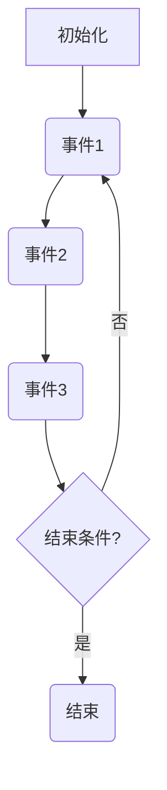
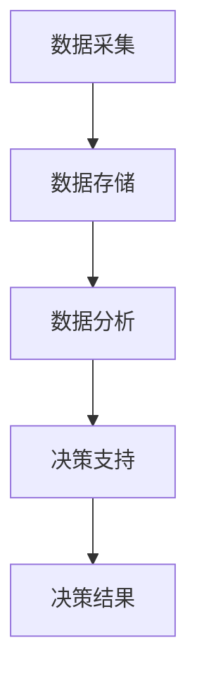
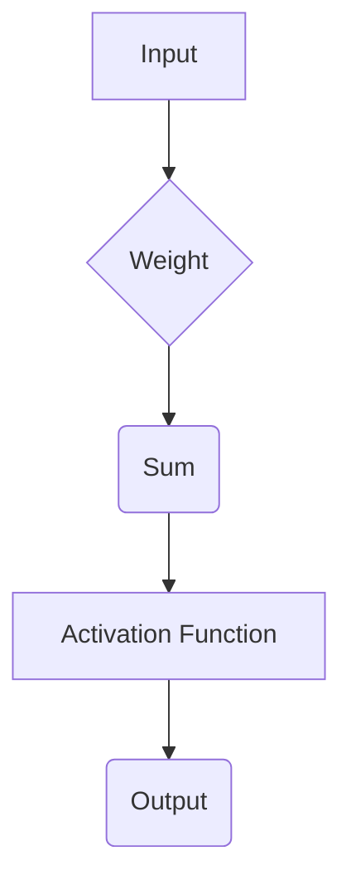
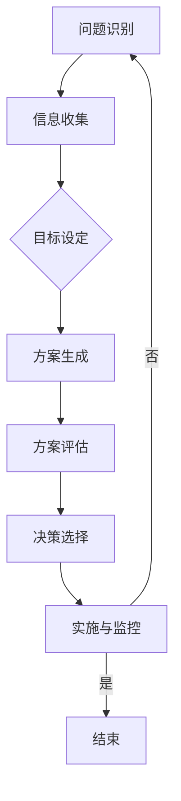

                 

### 《数学与决策科学：决策过程的数学建模》

> 关键词：决策科学、数学建模、优化模型、概率模型、博弈理论、人工智能

> 摘要：本文从决策科学的基础出发，深入探讨了决策过程中的数学建模方法。通过对经典和现代数学建模方法的详细介绍，并结合优化模型、概率模型、博弈理论和人工智能等实际应用场景，展示了数学建模在决策科学中的重要作用。文章旨在为广大读者提供一本系统而实用的决策科学数学建模指南。

#### # 第一部分：决策科学基础

#### 第1章：决策科学与数学建模概述

##### 1.1 决策科学与数学建模的重要性

决策科学是研究如何做出有效决策的一门跨学科科学。它涉及心理学、经济学、社会学、计算机科学等多个领域。数学建模则是利用数学语言和工具来描述现实问题，以帮助决策者更好地理解和解决问题。在决策科学中，数学建模起着至关重要的作用，它不仅可以精确描述问题，还可以提供量化的分析结果，从而辅助决策者做出更加合理和科学的决策。

首先，数学建模有助于提高决策的科学性。通过数学建模，可以将复杂的问题转化为数学问题，利用数学工具进行求解和分析，从而提高决策的精度和可靠性。其次，数学建模可以提高决策的效率。在处理大规模数据和复杂问题时，传统的分析方法往往效率低下，而数学建模可以提供高效的方法和算法，大大缩短决策过程的时间。

此外，数学建模还有助于提高决策的透明度。数学模型通常包括明确的假设和参数，这使得决策过程更加透明，决策者可以清晰地了解决策背后的逻辑和依据。最后，数学建模还可以提高决策的适应性。随着环境和条件的变化，数学模型可以根据新的数据和信息进行调整和优化，从而适应新的决策需求。

##### 1.2 决策过程的概述

决策过程通常包括以下几个基本步骤：

1. **问题识别**：识别需要解决的问题或机会。这一步是决策过程的基础，只有明确问题，才能有针对性地进行后续的决策。
   
2. **信息收集**：收集与问题相关的信息，包括数据、知识和观点。这一步决定了决策的质量，信息越全面、准确，决策越有可能成功。

3. **目标设定**：根据问题识别和信息收集的结果，设定明确的目标。目标应具体、可行，并能反映问题的重要性和紧迫性。

4. **方案生成**：在目标设定的基础上，提出可能的解决方案。这一步通常需要创新思维和专业知识，以产生多样化的方案。

5. **方案评估**：对每个方案进行分析和评估，包括其可行性、成本、风险和预期效果等。评估过程应客观、公正，以确保选择的方案最优。

6. **决策选择**：根据评估结果，选择最佳的方案。这一步是决策过程的核心，决策者应基于数据和评估结果，进行理性的选择。

7. **实施与监控**：选择方案后，将其付诸实施，并持续监控实施过程和结果。这一步有助于确保决策的有效性和适应性。

##### 1.3 数学建模的基本概念

数学建模是指运用数学语言和工具，对现实世界中的问题进行抽象和描述，以建立数学模型。数学模型通常包括以下几个基本要素：

1. **变量**：变量是数学模型中的基本元素，用来表示问题中的数量关系和状态。变量可以是连续的（如时间、温度）或离散的（如人口、商品数量）。

2. **参数**：参数是模型中固定的数值，它们通常由实际问题的数据或经验确定。参数值的变化可以影响模型的输出。

3. **方程**：方程是数学模型中的核心部分，它用数学关系描述变量和参数之间的相互作用。常见的方程有线性方程、非线性方程、微分方程等。

4. **目标函数**：目标函数是模型中的输出，它反映了决策者对问题优化的目标。目标函数可以是最大化或最小化的。

5. **约束条件**：约束条件是模型中的限制条件，它描述了变量和参数之间的关系，以确保模型的有效性和可行性。常见的约束条件有线性约束、非线性约束、等式约束、不等式约束等。

通过数学建模，可以将现实问题转化为数学问题，从而利用数学工具和方法进行求解和分析，为决策提供科学依据。数学建模的方法和技术将在后续章节中详细介绍。

#### # 第二部分：数学建模方法与技术

#### 第2章：数学建模方法与技术

数学建模是决策科学中不可或缺的一部分，它通过数学语言和工具，对现实问题进行抽象和描述，从而为决策提供科学依据。数学建模的方法和技术多种多样，本文将介绍经典和现代常用的数学建模方法。

##### 2.1 经典数学建模方法

经典数学建模方法主要包括优化模型、概率模型和博弈理论。这些方法在决策科学中有着广泛的应用，并且已经形成了较为完善的理论体系。

###### 2.1.1 优化模型

优化模型是一种用于求解最优解的数学模型，它通常包括目标函数和约束条件。目标函数描述了决策者希望优化的目标，如成本最小化、利润最大化等。约束条件则描述了问题的限制条件，如资源限制、时间限制等。

优化模型可以分为线性规划和非线性规划。线性规划（Linear Programming，LP）是优化模型中最简单和最常用的一种，它假设目标函数和约束条件都是线性的。线性规划的求解方法包括单纯形法、对偶法等。

非线性规划（Nonlinear Programming，NLP）则处理目标函数和约束条件非线性的情况。非线性规划的求解方法包括梯度法、牛顿法、序列二次规划法等。

优化模型广泛应用于生产计划、资源分配、库存控制、交通规划等领域。

```latex
\text{目标函数：} \min c^T x
\text{约束条件：} Ax \leq b, x \geq 0
```

###### 2.1.2 概率模型

概率模型用于描述和预测随机事件的发生概率。概率模型在决策科学中有着广泛的应用，如风险评估、投资组合优化、可靠性分析等。

概率模型主要包括概率分布、条件概率和贝叶斯推理。概率分布描述了随机变量的概率分布情况，如正态分布、二项分布等。条件概率描述了在已知某个事件发生的情况下，另一个事件发生的概率。贝叶斯推理则是一种基于概率的推理方法，它通过已知数据和先验概率，计算后验概率，从而做出决策。

```latex
P(A|B) = \frac{P(B|A)P(A)}{P(B)}
```

###### 2.1.3 游戏理论

游戏理论是一种研究决策者在相互竞争或合作情况下的最优策略的数学模型。游戏理论广泛应用于市场竞争、谈判策略、博弈决策等领域。

游戏理论的基本概念包括博弈矩阵、纳什均衡和策略迭代法。博弈矩阵是描述参与者策略和收益的二维表格。纳什均衡是指在一个博弈中，每个参与者选择最优策略，使得其他参与者无法通过改变策略获得更大收益的情况。策略迭代法是一种求解纳什均衡的方法，它通过不断迭代策略，逐步逼近纳什均衡。

```latex
\text{博弈矩阵：}
\begin{array}{c|c}
 & A & B \\
\hline
A & 2, 1 & 0, 0 \\
B & 1, 0 & 3, 3 \\
\end{array}
```

##### 2.2 现代数学建模方法

随着计算机科学和人工智能技术的发展，现代数学建模方法在决策科学中得到了广泛应用。现代数学建模方法主要包括人工智能与机器学习、模拟与仿真等。

###### 2.2.1 人工智能与机器学习

人工智能与机器学习是现代数学建模方法的重要组成部分，它们通过训练模型，从数据中自动发现规律和模式，从而为决策提供支持。

人工智能与机器学习包括多种算法和技术，如神经网络、集成学习方法、聚类分析等。神经网络是一种模拟人脑神经元连接的算法，广泛应用于图像识别、语音识别等领域。集成学习方法是一种结合多种模型，提高预测准确性的方法，如随机森林、梯度提升树等。聚类分析是一种无监督学习方法，用于将相似的数据分组，广泛应用于数据挖掘、市场细分等领域。

```python
# 神经网络示例代码
import tensorflow as tf

model = tf.keras.Sequential([
    tf.keras.layers.Dense(128, activation='relu', input_shape=[784]),
    tf.keras.layers.Dense(10, activation='softmax')
])

model.compile(optimizer='adam',
              loss='categorical_crossentropy',
              metrics=['accuracy'])

# 训练模型
model.fit(x_train, y_train, epochs=5)
```

###### 2.2.2 模拟与仿真

模拟与仿真是一种通过模拟现实世界的运行过程，预测和评估系统行为的方法。模拟与仿真在决策科学中有着广泛的应用，如供应链管理、金融风险管理、环境保护等。

模拟与仿真的基本方法包括事件模拟、过程模拟和系统动力学等。事件模拟通过模拟事件的发生和影响，预测系统的行为。过程模拟通过模拟系统的运行过程，预测系统的性能和效果。系统动力学通过建立系统动态模型，分析系统在不同条件下的行为。



##### 2.3 决策支持系统

决策支持系统（Decision Support System，DSS）是一种利用计算机技术和数学建模方法，为决策者提供信息和分析工具的系统。决策支持系统通常包括数据采集、数据存储、数据分析和决策支持等功能。

决策支持系统的应用非常广泛，如企业资源计划（ERP）、客户关系管理（CRM）、供应链管理（SCM）等。决策支持系统通过集成多种数学建模方法和技术，为决策者提供全面、准确、及时的信息和分析，从而辅助决策者做出更加科学和合理的决策。



#### 第3章：决策支持系统

##### 3.1 决策支持系统的组成

决策支持系统通常由以下几个基本组成部分：

1. **数据源**：数据源是决策支持系统的基础，包括内部数据（如企业数据库、ERP系统）和外部数据（如市场数据、经济数据）。

2. **数据仓库**：数据仓库是一个集中存储和管理数据的系统，它将来自多个数据源的数据进行整合、清洗和存储，以便进行进一步的分析和处理。

3. **数据挖掘**：数据挖掘是一种通过发现数据中的隐含模式和规律，为决策提供支持的方法。数据挖掘技术包括分类、聚类、关联规则挖掘等。

4. **模型库**：模型库是一个存储和管理各种数学建模方法、算法和模型的系统。模型库中的模型可以用于数据分析和决策支持。

5. **用户界面**：用户界面是决策支持系统与用户交互的接口，它提供了数据输入、模型选择、结果展示等功能。

6. **分析工具**：分析工具是一组用于进行数据分析和模型评估的工具，如统计分析、机器学习、优化算法等。

##### 3.2 决策支持系统的应用

决策支持系统在各个领域都有着广泛的应用，以下是几个典型的应用场景：

1. **企业管理**：决策支持系统可以帮助企业管理者进行销售预测、库存管理、财务分析等，从而优化企业的运营和管理。

2. **金融分析**：决策支持系统可以用于金融市场的分析，如股票投资组合优化、风险评估、市场预测等。

3. **供应链管理**：决策支持系统可以用于供应链的优化，如库存优化、运输优化、采购策略优化等。

4. **城市规划**：决策支持系统可以用于城市规划，如交通流量预测、土地利用规划、环境影响评估等。

5. **环境保护**：决策支持系统可以用于环境保护，如污染源识别、环境质量预测、环境治理策略优化等。

##### 3.3 决策支持系统的设计与实现

决策支持系统的设计与实现包括以下几个关键步骤：

1. **需求分析**：需求分析是决策支持系统设计的第一步，它包括确定系统的目标、功能、用户需求等。

2. **系统设计**：系统设计是根据需求分析的结果，设计系统的架构、模块划分、数据流等。

3. **数据采集与处理**：数据采集与处理包括数据源的选择、数据的采集、数据的清洗和整合等。

4. **模型库建设**：模型库建设包括模型的选取、模型的训练、模型的评估等。

5. **用户界面开发**：用户界面开发包括界面的设计、界面的实现、界面的测试等。

6. **系统测试与部署**：系统测试与部署包括对系统的功能、性能、安全性等各个方面的测试，以及系统的部署和上线。

#### 第4章：优化模型在决策中的应用

##### 4.1 优化模型的基本概念

优化模型是决策科学中一种重要的数学模型，它用于求解在给定约束条件下最优解的问题。优化模型通常包括目标函数和约束条件，目标函数描述了决策者希望优化的目标，如成本最小化、利润最大化等。约束条件描述了问题的限制条件，如资源限制、时间限制等。

优化模型可以分为线性规划和非线性规划。线性规划是最简单的优化模型，它假设目标函数和约束条件都是线性的。非线性规划则处理目标函数和约束条件非线性的情况。

```latex
\text{目标函数：} \min c^T x
\text{约束条件：} Ax \leq b, x \geq 0
```

在线性规划中，目标函数和约束条件都是线性的，这使线性规划问题相对容易求解。线性规划的求解方法包括单纯形法、对偶法等。

非线性规划的求解方法包括梯度法、牛顿法、序列二次规划法等。非线性规划的求解通常比线性规划更复杂，但通过合理的建模和求解方法，仍然可以找到最优解。

##### 4.2 优化模型的求解方法

优化模型的求解方法可以分为数值方法和解析方法。数值方法通过迭代过程逐步逼近最优解，如梯度法、牛顿法、序列二次规划法等。解析方法则通过建立解析解的公式，直接求解最优解，如拉格朗日乘数法、KKT条件等。

###### 4.2.1 线性规划

线性规划的求解方法包括单纯形法和对偶法。

单纯形法是一种迭代方法，它通过逐步改进当前解，直到找到最优解。单纯形法的步骤如下：

1. **初始化**：选择初始基本可行解，通常选择所有变量都为0的解。
2. **判断最优性**：计算当前解的目标函数值和约束条件值，判断是否满足最优性条件。
3. **寻找入基变量**：如果当前解不是最优的，则需要寻找一个入基变量，使得目标函数值增加或约束条件值减少。
4. **寻找出基变量**：确定一个出基变量，将其替换为入基变量，更新基本可行解。
5. **迭代**：重复步骤2-4，直到找到最优解。

对偶法是另一种求解线性规划的方法，它通过求解对偶问题来找到原问题的最优解。对偶问题的目标函数和约束条件与原问题相反，但具有相同的解。

对偶法的步骤如下：

1. **初始化**：选择初始对偶可行解，通常选择所有对偶变量都为0的解。
2. **判断最优性**：计算当前对偶解的目标函数值和约束条件值，判断是否满足最优性条件。
3. **寻找入基变量**：如果当前对偶解不是最优的，则需要寻找一个入基变量，使得目标函数值增加或约束条件值减少。
4. **寻找出基变量**：确定一个出基变量，将其替换为入基变量，更新对偶可行解。
5. **迭代**：重复步骤2-4，直到找到最优解。

###### 4.2.2 非线性规划

非线性规划的求解方法包括梯度法、牛顿法和序列二次规划法等。

梯度法是一种基于目标函数梯度的迭代方法，它通过沿着目标函数梯度的反方向迭代，逐步逼近最优解。梯度法的步骤如下：

1. **初始化**：选择初始解，计算目标函数值和梯度。
2. **更新解**：根据当前梯度，更新解的位置。
3. **判断收敛**：判断解的更新是否满足收敛条件，如梯度接近0。
4. **迭代**：重复步骤2-3，直到找到最优解或达到最大迭代次数。

牛顿法是一种基于目标函数二阶导数的迭代方法，它通过计算目标函数的二阶导数，构建牛顿方程，求解最优解。牛顿法的步骤如下：

1. **初始化**：选择初始解，计算目标函数值和梯度、二阶导数。
2. **求解牛顿方程**：根据牛顿方程，求解最优解的更新方向。
3. **更新解**：根据牛顿方程的解，更新解的位置。
4. **判断收敛**：判断解的更新是否满足收敛条件，如梯度接近0。
5. **迭代**：重复步骤2-4，直到找到最优解或达到最大迭代次数。

序列二次规划法（Sequential Quadratic Programming，SQP）是一种处理非线性约束规划的方法，它通过将非线性约束规划转化为二次规划问题，逐步逼近最优解。SQP法的步骤如下：

1. **初始化**：选择初始解，构建二次规划问题。
2. **求解二次规划**：使用二次规划求解器求解当前二次规划问题。
3. **更新解**：根据二次规划问题的解，更新解的位置。
4. **判断收敛**：判断解的更新是否满足收敛条件，如残差接近0。
5. **迭代**：重复步骤2-4，直到找到最优解或达到最大迭代次数。

##### 4.3 优化模型的应用实例

优化模型在决策科学中有着广泛的应用，以下是几个典型的应用实例：

###### 4.3.1 生产计划

生产计划是企业运营的重要环节，优化模型可以用于求解生产计划的最优解。生产计划问题可以建模为一个线性规划问题，目标函数可以是成本最小化或利润最大化，约束条件包括生产能力限制、原材料限制、人力资源限制等。

以下是一个简单的生产计划问题的线性规划模型：

```latex
\text{目标函数：} \min z = c_1x_1 + c_2x_2
\text{约束条件：}
\begin{align*}
a_1x_1 + a_2x_2 &\leq b_1 \\
b_1x_1 + b_2x_2 &\leq b_2 \\
x_1, x_2 &\geq 0
\end{align*}
```

其中，$x_1$ 和 $x_2$ 分别表示产品1和产品2的生产量，$c_1$ 和 $c_2$ 分别表示产品1和产品2的利润，$a_1$ 和 $a_2$ 分别表示生产产品1和产品2所需的资源1和资源2，$b_1$ 和 $b_2$ 分别表示资源1和资源2的可用量。

通过求解这个线性规划问题，企业可以确定生产计划，以最大化利润或最小化成本。

###### 4.3.2 资源分配

资源分配是优化模型应用的重要领域，如人力资源分配、物资分配、电力分配等。资源分配问题可以建模为一个线性规划问题，目标函数可以是资源利用最大化或成本最小化，约束条件包括资源限制、时间限制、任务要求等。

以下是一个简单的人力资源分配问题的线性规划模型：

```latex
\text{目标函数：} \max z = x_1 + x_2 + x_3
\text{约束条件：}
\begin{align*}
x_1 + x_2 + x_3 &\leq 10 \\
2x_1 + x_2 + x_3 &\leq 15 \\
x_1, x_2, x_3 &\geq 0
\end{align*}
```

其中，$x_1$、$x_2$ 和 $x_3$ 分别表示三种不同类型的人力资源的分配量，约束条件分别表示总资源量限制、总时间限制和任务要求。

通过求解这个线性规划问题，企业可以确定人力资源的最优分配方案，以满足任务要求并在资源有限的情况下最大化资源利用。

#### 第5章：概率模型在决策中的应用

概率模型是决策科学中的一种重要数学模型，它通过描述随机事件的发生概率，帮助决策者评估风险、制定策略和做出决策。在决策过程中，概率模型可以用于预测事件的可能性、评估风险和不确定性，为决策提供科学依据。

##### 5.1 概率模型的基本概念

概率模型主要包括概率分布、条件概率和贝叶斯推理等基本概念。

###### 5.1.1 概率分布

概率分布是描述随机变量概率分布情况的数学模型。常见的概率分布包括正态分布、二项分布、泊松分布等。

- **正态分布**：正态分布是最常见和最重要的概率分布之一，它用于描述连续随机变量的概率分布。正态分布的概率密度函数为：
  $$ f(x|\mu,\sigma^2) = \frac{1}{\sqrt{2\pi\sigma^2}} e^{-\frac{(x-\mu)^2}{2\sigma^2}} $$
  其中，$\mu$ 是均值，$\sigma^2$ 是方差。

- **二项分布**：二项分布用于描述离散随机变量的概率分布，它表示在固定试验次数下，成功次数的概率。二项分布的概率质量函数为：
  $$ P(X=k) = C_n^k p^k (1-p)^{n-k} $$
  其中，$n$ 是试验次数，$p$ 是成功概率，$k$ 是成功次数。

- **泊松分布**：泊松分布用于描述在固定时间段内，事件发生的次数的概率分布。泊松分布的概率质量函数为：
  $$ P(X=k) = \frac{\lambda^k e^{-\lambda}}{k!} $$
  其中，$\lambda$ 是事件发生的平均次数。

###### 5.1.2 条件概率

条件概率是指在某事件发生的条件下，另一事件发生的概率。条件概率可以表示为：
$$ P(A|B) = \frac{P(A \cap B)}{P(B)} $$
其中，$P(A|B)$ 表示在事件 $B$ 发生的条件下，事件 $A$ 发生的概率，$P(A \cap B)$ 表示事件 $A$ 和事件 $B$ 同时发生的概率，$P(B)$ 表示事件 $B$ 发生的概率。

条件概率在决策过程中非常重要，它可以用来更新我们的信念和做出更好的决策。

###### 5.1.3 贝叶斯推理

贝叶斯推理是一种基于概率的推理方法，它通过已知数据和先验概率，计算后验概率，从而做出决策。贝叶斯推理的基本公式为：
$$ P(A|B) = \frac{P(B|A)P(A)}{P(B)} $$
其中，$P(A|B)$ 表示在事件 $B$ 发生的条件下，事件 $A$ 发生的概率，$P(B|A)$ 表示在事件 $A$ 发生的条件下，事件 $B$ 发生的概率，$P(A)$ 表示事件 $A$ 发生的概率，$P(B)$ 表示事件 $B$ 发生的概率。

贝叶斯推理在决策科学中有着广泛的应用，如风险评估、投资组合优化、医疗诊断等。

##### 5.2 概率模型的求解方法

概率模型的求解方法主要包括贝叶斯推理、决策树和蒙特卡罗模拟等。

###### 5.2.1 贝叶斯推理

贝叶斯推理是一种基于概率的推理方法，它通过已知数据和先验概率，计算后验概率，从而做出决策。贝叶斯推理的基本步骤如下：

1. **设定先验概率**：根据已有知识和经验，设定事件 $A$ 和事件 $B$ 的先验概率 $P(A)$ 和 $P(B)$。
2. **收集数据**：观察事件 $A$ 和事件 $B$ 的发生情况，收集相关数据。
3. **计算条件概率**：根据条件概率公式，计算事件 $A$ 和事件 $B$ 的条件概率 $P(A|B)$ 和 $P(B|A)$。
4. **计算后验概率**：根据贝叶斯公式，计算事件 $A$ 和事件 $B$ 的后验概率 $P(A|B)$ 和 $P(B|A)$。
5. **做出决策**：根据后验概率，做出最优决策。

贝叶斯推理在决策过程中可以帮助我们更新信念，提高决策的准确性。

###### 5.2.2 决策树

决策树是一种基于概率的决策模型，它通过一系列的判断节点和结果节点，将决策过程表示为树形结构。决策树的基本步骤如下：

1. **构建树形结构**：根据问题的特征和决策规则，构建决策树。决策树包括根节点、内部节点和叶子节点。
2. **计算概率**：为每个内部节点计算对应的概率值，表示在当前条件下，下一个节点的概率分布。
3. **选择最优路径**：根据概率值，选择最优的路径，即概率最大的路径。
4. **做出决策**：根据最优路径，做出最终的决策。

决策树在决策过程中可以帮助我们清晰地表示和分析决策过程，提高决策的透明度和可解释性。

###### 5.2.3 蒙特卡罗模拟

蒙特卡罗模拟是一种基于随机抽样的模拟方法，它通过大量随机抽样，模拟事件的多次发生，从而估计事件的概率和期望值。蒙特卡罗模拟的基本步骤如下：

1. **初始化**：设定模拟参数，如随机数生成器、抽样次数等。
2. **抽样**：使用随机数生成器，进行随机抽样，生成随机样本。
3. **计算概率**：根据抽样结果，计算事件发生的概率。
4. **计算期望值**：根据抽样结果，计算事件的期望值。
5. **重复模拟**：重复步骤2-4，多次模拟，提高估计的准确性。
6. **做出决策**：根据概率和期望值，做出最优决策。

蒙特卡罗模拟在决策过程中可以用于估计不确定事件的概率和期望值，提高决策的准确性和可靠性。

##### 5.3 概率模型的应用实例

概率模型在决策科学中有着广泛的应用，以下是几个典型的应用实例：

###### 5.3.1 风险评估

风险评估是决策过程中重要的一环，它通过评估风险事件发生的概率和损失，帮助决策者制定风险管理策略。以下是一个简单的风险评估实例：

假设一个企业在未来一年内可能会发生两种风险事件：市场风险和信用风险。

- **市场风险**：市场风险表示由于市场波动导致企业收益损失的概率。根据历史数据，市场风险的概率为 $P(A) = 0.3$。
- **信用风险**：信用风险表示由于客户违约导致企业损失的概率。根据历史数据，信用风险的概率为 $P(B) = 0.2$。

为了评估整体风险，可以使用概率模型计算市场风险和信用风险同时发生的概率，即：
$$ P(A \cap B) = P(A)P(B) = 0.3 \times 0.2 = 0.06 $$

通过风险评估，企业可以了解整体风险水平，并采取相应的风险管理措施，如增加保险、调整投资策略等。

###### 5.3.2 投资组合优化

投资组合优化是金融决策中常见的任务，它通过选择最优的投资组合，最大化投资回报或最小化风险。以下是一个简单的投资组合优化实例：

假设一个投资者有两个投资选项：股票和债券。股票的预期收益率为 $20\%$，风险为 $30\%$；债券的预期收益率为 $10\%$，风险为 $5\%$。投资者希望构建一个投资组合，使风险最小化或回报最大化。

- **风险最小化**：假设投资者希望最小化投资组合的风险，可以使用概率模型计算投资组合的风险，即：
  $$ \text{风险} = w_1 \times \text{股票风险} + w_2 \times \text{债券风险} $$
  其中，$w_1$ 和 $w_2$ 分别为投资于股票和债券的比例。

  为了最小化风险，可以设置以下目标函数：
  $$ \min \text{风险} = w_1 \times 0.3 + w_2 \times 0.05 $$

  约束条件为：
  $$ \begin{align*}
  w_1 + w_2 &= 1 \\
  w_1 &\geq 0 \\
  w_2 &\geq 0
  \end{align*} $$

  通过求解这个线性规划问题，可以得到最优的投资组合比例，从而最小化风险。

- **回报最大化**：假设投资者希望最大化投资组合的回报，可以使用概率模型计算投资组合的回报，即：
  $$ \text{回报} = w_1 \times \text{股票回报} + w_2 \times \text{债券回报} $$
  其中，$w_1$ 和 $w_2$ 分别为投资于股票和债券的比例。

  为了最大化回报，可以设置以下目标函数：
  $$ \max \text{回报} = w_1 \times 0.2 + w_2 \times 0.1 $$

  约束条件为：
  $$ \begin{align*}
  w_1 + w_2 &= 1 \\
  w_1 &\geq 0 \\
  w_2 &\geq 0
  \end{align*} $$

  通过求解这个线性规划问题，可以得到最优的投资组合比例，从而最大化回报。

通过概率模型，投资者可以了解投资组合的风险和回报，并制定最优的投资策略。

#### 第6章：博弈理论在决策中的应用

博弈理论是一种研究决策者相互竞争或合作行为的数学模型，它广泛应用于经济学、政治学、心理学等领域。博弈理论通过分析参与者的策略选择和收益分配，帮助决策者制定合理的决策策略。本节将介绍博弈理论的基本概念、求解方法以及其在决策中的应用。

##### 6.1 博弈理论的基本概念

博弈理论的基本概念包括博弈矩阵、纳什均衡和策略迭代法。

###### 6.1.1 博弈矩阵

博弈矩阵是描述参与者策略和收益的二维表格。在一个博弈矩阵中，每个参与者可以选择多种策略，而每种策略组合对应着不同的收益。博弈矩阵通常表示为：

```
                  参与者2的策略
          |  A     B
参与者1 |      |      
         |------|------
         |  C     D
```

其中，$A$、$B$、$C$ 和 $D$ 分别代表参与者1和参与者2的策略，而对应的数值表示每个参与者选择特定策略组合时的收益。

###### 6.1.2 纳什均衡

纳什均衡是指在一个博弈中，每个参与者都选择最优策略，并且其他参与者不会改变其策略的情况下，没有参与者能够通过单方面改变策略获得更大的收益。纳什均衡是博弈理论中的核心概念，它反映了参与者在博弈中的稳定状态。

在博弈矩阵中，纳什均衡通常用括号表示，例如，如果参与者1选择策略$A$，参与者2选择策略$B$，并且这对策略组合使得两者都不能通过单方面改变策略获得更大的收益，那么$(A, B)$就是一个纳什均衡。

###### 6.1.3 策略迭代法

策略迭代法是一种求解纳什均衡的方法，它通过逐步迭代策略，逐步逼近纳什均衡。策略迭代法的步骤如下：

1. **初始化**：选择初始策略组合，通常可以选择任意策略组合。
2. **评估**：计算当前策略组合的收益，并根据收益评估每个参与者的策略。
3. **更新策略**：根据评估结果，更新参与者的策略，选择最优策略。
4. **重复**：重复步骤2-3，直到找到纳什均衡。

##### 6.2 博弈理论的求解方法

博弈理论的求解方法主要包括策略迭代法、混合策略和贝叶斯纳什均衡等。

###### 6.2.1 策略迭代法

策略迭代法是求解博弈理论中纳什均衡的一种简单而有效的方法。通过策略迭代法，可以逐步优化参与者的策略，找到纳什均衡。

以下是一个简单的博弈矩阵示例：

```
                  参与者2的策略
          |  A     B
参与者1 |      |      
         |------|------
         |  C     D
```

在这个博弈矩阵中，如果参与者1选择策略$A$，参与者2选择策略$B$，则两者收益分别为2和2。如果参与者1选择策略$A$，参与者2选择策略$C$，则参与者1的收益为0，参与者2的收益为1。同样，其他策略组合的收益也可以通过类似的方式计算。

通过策略迭代法，可以逐步优化参与者的策略。例如，如果参与者1初始选择策略$A$，参与者2初始选择策略$B$，则可以计算当前策略组合的收益。然后，参与者1可以选择策略$C$，因为选择$C$可以使参与者1的收益从2增加到3。参与者2可以观察到参与者1的选择，并选择策略$A$，因为选择$A$可以使参与者2的收益从2增加到3。这个过程可以继续迭代，直到找到纳什均衡。

###### 6.2.2 混合策略

在博弈理论中，混合策略是指参与者以一定的概率选择多种策略。混合策略可以用于应对对手的不确定性，提高策略的鲁棒性。在混合策略中，每个参与者选择每种策略的概率，使得对手无法通过单方面改变策略获得更大的收益。

以下是一个简单的博弈矩阵示例，假设参与者1可以选择策略$A$和策略$B$，参与者2可以选择策略$C$和策略$D$：

```
                  参与者2的策略
          |  C     D
参与者1 |  A | (2, 1) | (0, 0) |
         | B | (1, 2) | (0, 0) |
```

在这个博弈矩阵中，如果参与者1选择策略$A$，参与者2选择策略$C$，则两者收益分别为2和1。如果参与者1选择策略$B$，参与者2选择策略$D$，则两者收益分别为0和0。其他策略组合的收益也可以通过类似的方式计算。

通过混合策略，参与者1可以选择以概率$p$选择策略$A$，以概率$1-p$选择策略$B$。参与者2可以选择以概率$q$选择策略$C$，以概率$1-q$选择策略$D$。为了找到混合策略，可以设置以下目标函数：

$$ \max_p \min_q (2p + 0(1-p)) = 2p $$

约束条件为：

$$ 0 \leq p \leq 1 $$

$$ 0 \leq q \leq 1 $$

通过求解这个线性规划问题，可以找到最优的混合策略。例如，如果参与者1选择以概率$\frac{2}{3}$选择策略$A$，以概率$\frac{1}{3}$选择策略$B$，参与者2选择以概率$\frac{1}{2}$选择策略$C$，以概率$\frac{1}{2}$选择策略$D$，则两者收益分别为$\frac{4}{3}$和$\frac{1}{2}$，这是一个纳什均衡。

###### 6.2.3 贝叶斯纳什均衡

贝叶斯纳什均衡是博弈理论中的一种扩展，它考虑了参与者的不确定性和先验概率。贝叶斯纳什均衡是指在给定先验概率和条件概率的情况下，每个参与者选择的最优策略组合。

贝叶斯纳什均衡的求解方法与纳什均衡类似，但需要考虑先验概率和条件概率。以下是一个简单的博弈矩阵示例：

```
                  参与者2的策略
          |  C     D
参与者1 |  A | (2, 1) | (0, 0) |
         | B | (1, 2) | (0, 0) |
```

假设参与者1和参与者2都拥有先验概率$p$，表示选择策略$A$的概率。同时，给定参与者2选择策略$C$的概率$q$，则参与者1选择策略$A$的条件概率为：

$$ P(A|C) = \frac{p}{p + 1 - p} = \frac{p}{1} = p $$

参与者1选择策略$B$的条件概率为：

$$ P(B|C) = \frac{1 - p}{p + 1 - p} = \frac{1 - p}{1} = 1 - p $$

通过类似的计算，可以计算出参与者1选择策略$A$和参与者2选择策略$C$的条件概率。然后，可以根据贝叶斯推理计算出参与者1选择策略$A$和参与者2选择策略$C$的后验概率。

通过贝叶斯纳什均衡，可以找到每个参与者选择的最优策略组合。例如，如果参与者1选择以概率$p$选择策略$A$，参与者2选择以概率$q$选择策略$C$，则两者收益分别为$2p$和$q$。为了找到最优的$p$和$q$，可以设置以下目标函数：

$$ \max_p \min_q (2p + 0(1 - p)) = 2p $$

约束条件为：

$$ 0 \leq p \leq 1 $$

$$ 0 \leq q \leq 1 $$

通过求解这个线性规划问题，可以找到最优的$p$和$q$，从而找到贝叶斯纳什均衡。

##### 6.3 博弈理论的应用实例

博弈理论在决策科学中有着广泛的应用，以下是几个典型的应用实例：

###### 6.3.1 资源共享

资源共享是指多个参与者共同使用有限的资源，如网络带宽、电力供应等。在资源共享中，参与者需要通过博弈来确定最优的资源分配策略。

以下是一个简单的资源共享博弈矩阵示例：

```
                  参与者2的策略
          |  共享     独占
参与者1 |  共享 | (5, 5) | (0, 0) |
         | 独占 | (10, 0) | (0, 10) |
```

在这个博弈矩阵中，如果参与者1和参与者2都选择共享资源，则两者的收益分别为5和5。如果参与者1选择共享资源，参与者2选择独占资源，则参与者1的收益为0，参与者2的收益为10。其他策略组合的收益也可以通过类似的方式计算。

通过博弈理论，可以找到共享资源的纳什均衡。例如，如果参与者1选择共享资源，参与者2选择独占资源，则这是一个纳什均衡，因为参与者1无法通过单方面改变策略获得更大的收益。

在实际应用中，可以通过策略迭代法或混合策略找到最优的资源共享策略。例如，参与者1可以选择以概率$p$选择共享资源，以概率$1-p$选择独占资源。参与者2可以选择以概率$q$选择共享资源，以概率$1-q$选择独占资源。为了找到最优的$p$和$q$，可以设置以下目标函数：

$$ \max_p \min_q (5p + 0(1 - p)) = 5p $$

约束条件为：

$$ 0 \leq p \leq 1 $$

$$ 0 \leq q \leq 1 $$

通过求解这个线性规划问题，可以找到最优的$p$和$q$，从而找到共享资源的最优策略。

###### 6.3.2 谈判策略

谈判是决策过程中常见的一种活动，多个参与者通过协商和谈判来达成共识。在谈判中，参与者需要通过博弈来确定最优的谈判策略。

以下是一个简单的谈判博弈矩阵示例：

```
                  参与者2的提议
          |  提议1    提议2
参与者1 |  提议1 | (10, 10) | (5, 15) |
         | 提议2 | (15, 5)  | (10, 10) |
```

在这个博弈矩阵中，如果参与者1和参与者2都选择提议1，则两者的收益分别为10和10。如果参与者1选择提议1，参与者2选择提议2，则参与者1的收益为5，参与者2的收益为15。其他策略组合的收益也可以通过类似的方式计算。

通过博弈理论，可以找到谈判的纳什均衡。例如，如果参与者1选择提议1，参与者2选择提议2，则这是一个纳什均衡，因为参与者1无法通过单方面改变策略获得更大的收益。

在实际应用中，可以通过策略迭代法或混合策略找到最优的谈判策略。例如，参与者1可以选择以概率$p$选择提议1，以概率$1-p$选择提议2。参与者2可以选择以概率$q$选择提议1，以概率$1-q$选择提议2。为了找到最优的$p$和$q$，可以设置以下目标函数：

$$ \max_p \min_q (10p + 5(1 - p)) = 10p + 5 - 5p = 5p + 5 $$

约束条件为：

$$ 0 \leq p \leq 1 $$

$$ 0 \leq q \leq 1 $$

通过求解这个线性规划问题，可以找到最优的$p$和$q$，从而找到谈判的最优策略。

#### 第7章：人工智能与机器学习在决策中的应用

随着人工智能与机器学习的迅猛发展，这些技术已经成为决策科学中的重要工具。人工智能与机器学习通过从数据中自动发现规律和模式，为决策提供了强大的支持。本章将介绍人工智能与机器学习的基本概念，以及它们在决策中的应用。

##### 7.1 人工智能与机器学习的基本概念

人工智能（Artificial Intelligence，AI）是模拟人类智能行为的计算机系统。它包括多个子领域，如机器学习、自然语言处理、计算机视觉、专家系统等。机器学习（Machine Learning，ML）是人工智能的一个子领域，它专注于开发算法，使计算机系统能够从数据中学习并做出决策。

###### 7.1.1 神经网络

神经网络（Neural Networks，NN）是一种模拟人脑神经元连接的算法，广泛应用于图像识别、语音识别、自然语言处理等领域。神经网络由多个神经元（或称为节点）组成，每个神经元都与其他神经元相连。神经元的输出通过权重进行加权求和，并通过激活函数转换为输出值。

以下是一个简单的单层神经网络示例：



在神经网络中，权重和激活函数是关键参数。权重决定了神经元之间的连接强度，而激活函数用于引入非线性，使神经网络能够学习复杂的模式。

###### 7.1.2 集成学习方法

集成学习方法（Ensemble Learning）是一种通过结合多个模型来提高预测准确性和鲁棒性的方法。常见的集成学习方法包括随机森林（Random Forest）、梯度提升树（Gradient Boosting Trees）等。

随机森林通过构建多个决策树，并对每个决策树的结果进行投票，得到最终的预测结果。这种方法可以有效地减少过拟合，提高模型的泛化能力。

梯度提升树（Gradient Boosting Tree，GBT）通过迭代训练多个决策树，每次迭代都根据前一次迭代的结果调整树的权重，从而提高预测准确率。GBT在处理大规模数据和高维特征方面表现出色。

##### 7.2 人工智能与机器学习在决策中的应用

人工智能与机器学习在决策科学中有着广泛的应用，包括预测分析、聚类分析和客户细分等。

###### 7.2.1 预测分析

预测分析是利用历史数据来预测未来事件的方法。在决策过程中，预测分析可以帮助企业预测销售量、市场需求、财务状况等关键指标。以下是一个简单的线性回归预测示例：

```python
import numpy as np
import matplotlib.pyplot as plt

# 假设我们有以下数据
x = np.array([1, 2, 3, 4, 5])
y = np.array([2, 4, 5, 4, 5])

# 计算斜率和截距
slope, intercept = np.polyfit(x, y, 1)

# 构建预测模型
model = np.poly1d([slope, intercept])

# 预测未来值
x_future = np.array([6, 7, 8])
y_future = model(x_future)

# 绘制结果
plt.scatter(x, y)
plt.plot(x_future, y_future, color='red')
plt.xlabel('X')
plt.ylabel('Y')
plt.show()
```

通过预测分析，企业可以提前了解市场趋势，制定相应的营销策略和运营计划。

###### 7.2.2 聚类分析

聚类分析是一种无监督学习方法，用于将相似的数据分组。在决策过程中，聚类分析可以帮助企业发现数据中的隐含模式，优化资源分配和市场营销策略。以下是一个简单的K-均值聚类示例：

```python
import numpy as np
import matplotlib.pyplot as plt

# 假设我们有以下数据
x = np.array([1, 2, 3, 4, 5])
y = np.array([2, 4, 5, 4, 5])

# 初始化聚类中心
centers = np.array([[1, 2], [4, 5]])

# 计算距离
def euclidean_distance(x, y):
    return np.sqrt(np.sum((x - y)**2))

# 计算聚类结果
def k_means(x, y, centers, max_iterations):
    for _ in range(max_iterations):
        # 计算每个点属于哪个聚类中心
        labels = []
        for i in range(len(x)):
            distances = [euclidean_distance([x[i], y[i]], center) for center in centers]
            labels.append(np.argmin(distances))
        
        # 更新聚类中心
        new_centers = []
        for i in range(len(centers)):
            points = [x[i] for i in range(len(x)) if labels[i] == i]
            new_center = np.mean(points, axis=0)
            new_centers.append(new_center)
        
        centers = new_centers
    
    return labels

# 运行K-均值聚类
labels = k_means(x, y, centers, 100)

# 绘制结果
plt.scatter(x, y)
for i in range(len(centers)):
    plt.scatter(*centers[i], color='red')
plt.show()
```

通过聚类分析，企业可以了解不同客户群体的特征和需求，从而制定更有针对性的市场营销策略。

###### 7.2.3 客户细分

客户细分是利用聚类分析将客户分为不同群体，以便于企业制定不同的营销策略。以下是一个简单的客户细分示例：

```python
import pandas as pd
import matplotlib.pyplot as plt

# 假设我们有以下客户数据
data = pd.DataFrame({
    'Age': [25, 35, 45, 55, 60],
    'Income': [50000, 80000, 100000, 150000, 200000],
    'Spending': [2000, 5000, 7000, 9000, 12000]
})

# 进行K-均值聚类
from sklearn.cluster import KMeans
kmeans = KMeans(n_clusters=3)
data['Cluster'] = kmeans.fit_predict(data[['Age', 'Income', 'Spending']])

# 绘制客户细分结果
plt.scatter(data['Age'], data['Income'])
for i in range(3):
    plt.scatter(*data[data['Cluster'] == i][['Age', 'Income']].mean(), s=100, c='red', marker='s')
plt.xlabel('Age')
plt.ylabel('Income')
plt.show()
```

通过客户细分，企业可以更好地了解不同客户群体的特征，从而制定更有针对性的服务和营销策略。

##### 7.3 人工智能与机器学习的应用实例

人工智能与机器学习在决策科学中有着广泛的应用，以下是几个典型的应用实例：

###### 7.3.1 客户细分

客户细分是市场营销中常见的一项任务，通过将客户分为不同的群体，企业可以针对不同群体制定更有针对性的营销策略。以下是一个简单的客户细分实例：

```python
import pandas as pd
import matplotlib.pyplot as plt
from sklearn.cluster import KMeans

# 假设我们有以下客户数据
data = pd.DataFrame({
    'Age': [25, 35, 45, 55, 60],
    'Income': [50000, 80000, 100000, 150000, 200000],
    'Spending': [2000, 5000, 7000, 9000, 12000]
})

# 进行K-均值聚类
kmeans = KMeans(n_clusters=3)
data['Cluster'] = kmeans.fit_predict(data[['Age', 'Income', 'Spending']])

# 绘制客户细分结果
plt.scatter(data['Age'], data['Income'])
for i in range(3):
    plt.scatter(*data[data['Cluster'] == i][['Age', 'Income']].mean(), s=100, c='red', marker='s')
plt.xlabel('Age')
plt.ylabel('Income')
plt.show()
```

在这个实例中，我们使用K-均值聚类将客户分为三个群体。通过绘制客户细分结果，企业可以直观地了解不同客户群体的特征，从而制定更有针对性的营销策略。

###### 7.3.2 销售预测

销售预测是企业管理中的一项重要任务，通过预测未来的销售量，企业可以制定相应的生产和营销计划。以下是一个简单的线性回归销售预测实例：

```python
import pandas as pd
import matplotlib.pyplot as plt
from sklearn.linear_model import LinearRegression

# 假设我们有以下销售数据
data = pd.DataFrame({
    'Month': [1, 2, 3, 4, 5],
    'Sales': [100, 120, 130, 110, 150]
})

# 进行线性回归
model = LinearRegression()
model.fit(data[['Month']], data['Sales'])

# 预测未来销售
x_future = np.array([6, 7, 8])
y_future = model.predict(x_future.reshape(-1, 1))

# 绘制结果
plt.scatter(data['Month'], data['Sales'])
plt.plot(x_future, y_future, color='red')
plt.xlabel('Month')
plt.ylabel('Sales')
plt.show()
```

在这个实例中，我们使用线性回归模型预测未来的销售量。通过绘制预测结果，企业可以提前了解市场趋势，从而制定相应的生产和营销计划。

通过这些实例，我们可以看到人工智能与机器学习在决策科学中的应用。这些技术可以帮助企业更好地了解客户需求、预测市场趋势，从而制定更科学的决策策略。

#### 第8章：多目标决策与模糊数学

多目标决策和模糊数学是决策科学中的重要分支，它们在处理复杂、多目标和不确定性的决策问题时发挥着重要作用。本章将介绍多目标决策和模糊数学的基本概念、求解方法以及应用。

##### 8.1 多目标决策的基本概念

多目标决策是指决策者面临多个相互冲突的目标，需要在这些目标之间进行权衡和优化。与单目标决策不同，多目标决策需要考虑多个目标之间的关系，找到一个或多个满足所有目标的解。

###### 8.1.1 多目标规划的数学模型

多目标规划的数学模型包括目标函数和约束条件。目标函数通常表示为多个相互冲突的目标，如成本最小化、利润最大化等。约束条件描述了问题的限制条件，如资源限制、时间限制等。

以下是一个简单的多目标规划模型：

```latex
\text{目标函数：}
\begin{align*}
\min \quad f_1(x) \\
\min \quad f_2(x) \\
\quad \text{约束条件：} \\
g_i(x) \leq 0, \quad i = 1, 2, \ldots, m \\
h_j(x) = 0, \quad j = 1, 2, \ldots, n
\end{align*}
```

其中，$x$ 是决策变量，$f_1(x)$ 和 $f_2(x)$ 是目标函数，$g_i(x)$ 是不等式约束条件，$h_j(x)$ 是等式约束条件。

###### 8.1.2 多目标决策的求解方法

多目标决策的求解方法主要包括线性加权法、多目标规划法、偏好排序法等。

- **线性加权法**：线性加权法是一种简单而常用的多目标决策方法，它通过为每个目标函数分配权重，将多目标问题转化为单目标问题。权重反映了决策者对不同目标的重视程度。以下是一个简单的线性加权法模型：

  ```latex
  \min \quad w_1 f_1(x) + w_2 f_2(x)
  \text{约束条件：}
  g_i(x) \leq 0, \quad i = 1, 2, \ldots, m \\
  h_j(x) = 0, \quad j = 1, 2, \ldots, n
  ```

  其中，$w_1$ 和 $w_2$ 是目标函数的权重。

- **多目标规划法**：多目标规划法是一种基于数学规划的方法，它通过构建多个目标函数和约束条件，求解最优解。多目标规划法可以采用线性规划、非线性规划等方法。以下是一个简单多目标规划模型：

  ```latex
  \text{目标函数：}
  \begin{align*}
  \min \quad f_1(x) \\
  \min \quad f_2(x) \\
  \quad \text{约束条件：} \\
  g_i(x) \leq 0, \quad i = 1, 2, \ldots, m \\
  h_j(x) = 0, \quad j = 1, 2, \ldots, n
  \end{align*}
  ```

- **偏好排序法**：偏好排序法是一种基于决策者偏好的方法，它通过将决策者的偏好转化为数学模型，求解最优解。偏好排序法可以采用线性加权法、目标规划法等方法。以下是一个简单偏好排序模型：

  ```latex
  \text{目标函数：}
  \min \quad w_1 f_1(x) + w_2 f_2(x)
  \text{约束条件：}
  g_i(x) \leq 0, \quad i = 1, 2, \ldots, m \\
  h_j(x) = 0, \quad j = 1, 2, \ldots, n
  ```

  其中，$w_1$ 和 $w_2$ 是目标函数的权重，反映了决策者的偏好。

##### 8.2 模糊数学在决策中的应用

模糊数学是处理不确定性和模糊性的数学工具，它通过引入模糊集合和模糊逻辑，描述和处理模糊概念和模糊关系。在决策科学中，模糊数学广泛应用于多目标决策、模糊评估、模糊推理等领域。

###### 8.2.1 模糊集合

模糊集合是模糊数学的基本概念，它用于描述和处理模糊概念。与经典集合不同，模糊集合中的元素具有不同的隶属度，表示元素属于集合的程度。

以下是一个简单的模糊集合示例：

```latex
A = \{x | \mu_A(x) \geq 0.5\}
```

其中，$\mu_A(x)$ 是元素 $x$ 属于集合 $A$ 的隶属度，取值范围在 $[0, 1]$ 之间。

###### 8.2.2 模糊逻辑

模糊逻辑是模糊数学的核心概念，它用于处理模糊条件和模糊推理。模糊逻辑通过引入模糊条件语句和模糊推理规则，描述和处理模糊关系。

以下是一个简单的模糊逻辑示例：

```latex
\text{如果天气很好，那么就出去散步。}
```

在这个示例中，"天气很好" 是模糊条件，"出去散步" 是模糊结论。通过模糊逻辑，可以推导出如下模糊推理：

```latex
\text{如果天气很好的隶属度大于0.5，那么出去散步的隶属度大于0.7。}
```

模糊逻辑在决策科学中的应用非常广泛，如模糊评估、模糊决策、模糊规划等。

##### 8.3 多目标决策与模糊数学的结合

多目标决策和模糊数学在处理复杂、多目标和不确定性的决策问题时具有独特的优势。将多目标决策与模糊数学相结合，可以更好地应对现实世界的复杂决策问题。

以下是一个简单的多目标决策与模糊数学结合的示例：

```python
import numpy as np
import matplotlib.pyplot as plt

# 假设我们有以下多目标规划问题
# 目标函数：
f1 = lambda x: x[0]**2 + x[1]**2
f2 = lambda x: (x[0]-5)**2 + (x[1]-5)**2
# 约束条件：
g1 = lambda x: 2*x[0] + 3*x[1] - 20
g2 = lambda x: x[0] + 2*x[1] - 10

# 定义模糊集合
A = np.array([[0, 0], [10, 10]])
B = np.array([[5, 5], [15, 15]])

# 计算隶属度
def membership(x, A, B):
    return 1 - (np.linalg.norm(x-A)/np.linalg.norm(B-A))

# 计算模糊目标函数
def fuzzy_f1(x):
    return membership(x, A, B) * f1(x)

def fuzzy_f2(x):
    return membership(x, A, B) * f2(x)

# 求解多目标规划问题
x = np.array([x for x in np.linspace(0, 10, 1000)])

# 绘制模糊目标函数
plt.plot(x, fuzzy_f1(x), label='Fuzzy f1')
plt.plot(x, fuzzy_f2(x), label='Fuzzy f2')
plt.xlabel('x')
plt.ylabel('f(x)')
plt.legend()
plt.show()
```

在这个示例中，我们使用模糊集合描述约束条件，并计算模糊目标函数。通过求解多目标规划问题，可以得到最优解。

多目标决策与模糊数学的结合在处理复杂、多目标和不确定性的决策问题时具有广泛的应用前景。

#### 第9章：决策过程与复杂系统

决策过程与复杂系统之间存在紧密的联系。复杂系统通常包含大量的相互作用的组成部分，这些部分之间存在着复杂的动态关系。理解复杂系统对决策过程至关重要，因为决策者的决策会直接影响系统的行为和性能。本章将探讨决策过程与复杂系统之间的关系，以及如何利用系统动力学和网络科学等工具对复杂系统进行建模和分析。

##### 9.1 决策过程与复杂系统的关系

决策过程和复杂系统之间的关系可以从多个角度来理解：

1. **相互作用**：在复杂系统中，各个组成部分（如个体、组织、子系统等）之间相互影响和相互作用。决策过程会影响这些组成部分的行为，而组成部分的行为又会反过来影响决策过程。例如，企业内部的决策会影响到供应链的运作，而供应链的反馈又会影响企业的决策。

2. **动态性**：复杂系统通常处于动态变化中，这意味着系统的状态和性能会随着时间的推移而变化。决策过程也具有动态性，因为决策者需要根据最新的信息进行调整和优化。这种动态性要求决策者具备快速响应和适应变化的能力。

3. **反馈循环**：复杂系统中的反馈循环是决策过程的一个重要因素。反馈循环可以是正反馈（增强系统状态）或负反馈（稳定系统状态）。在决策过程中，正反馈可能导致系统的不稳定和过度增长，而负反馈则有助于维持系统的稳定性和可持续性。

4. **不确定性**：复杂系统通常面临大量的不确定性，包括外部环境的不可预测性、内部系统的不确定性等。决策过程必须考虑到这些不确定性，并采取相应的策略来应对潜在的风险和挑战。

##### 9.2 复杂系统的建模方法

为了更好地理解复杂系统，我们需要使用适当的建模方法。以下介绍几种常用的复杂系统建模方法：

###### 9.2.1 系统动力学

系统动力学是一种用于分析复杂系统动态行为的建模方法。它通过建立系统的状态方程，描述系统在不同时间点的状态变化。系统动力学模型通常包括以下基本要素：

- **状态变量**：描述系统状态的变量，如库存水平、生产率、人口数量等。
- **流率**：描述状态变量随时间变化的速率，如收入流、库存流入和流出等。
- **反馈循环**：描述状态变量之间的相互关系和反馈机制。

以下是一个简单的系统动力学模型的伪代码：

```python
# 初始化状态变量
state = {'inventory': 0, 'production': 0, 'demand': 0}

# 定义状态方程
def update_state(state, time_step):
    # 更新库存水平
    state['inventory'] += state['production'] - state['demand']
    # 更新生产率
    state['production'] += time_step * (state['inventory'] > 0)
    # 更新需求
    state['demand'] += time_step * (state['inventory'] < 100)
    return state

# 运行系统动力学模型
for t in range(1, 100):
    state = update_state(state, t)
    print(f"Time: {t}, Inventory: {state['inventory']}, Production: {state['production']}, Demand: {state['demand']}")
```

通过运行系统动力学模型，我们可以观察系统状态随时间的变化，并分析系统的动态行为。

###### 9.2.2 网络科学

网络科学是一种用于分析复杂系统中网络结构和动态行为的跨学科方法。网络科学关注网络的结构特性（如节点度、聚类系数、路径长度等）和动态行为（如网络演化、传播过程等）。以下是一个简单的网络科学模型：

- **网络结构模型**：描述网络的节点和边，以及节点之间的关系。
- **网络演化模型**：描述网络随时间的变化过程。
- **传播模型**：描述信息、疾病、流行等在网络中的传播过程。

以下是一个简单的网络科学模型的伪代码：

```python
import networkx as nx

# 创建网络
G = nx.Graph()

# 添加节点和边
G.add_nodes_from([1, 2, 3, 4, 5])
G.add_edges_from([(1, 2), (2, 3), (3, 4), (4, 5)])

# 计算网络结构特性
degree = nx.degree(G)
clustering = nx.clustering(G)
path_length = nx.average_shortest_path_length(G)

# 显示网络结构特性
print(f"Degree: {degree}")
print(f"Clustering: {clustering}")
print(f"Path Length: {path_length}")

# 分析网络演化过程
def evolve_network(G, steps):
    for _ in range(steps):
        # 更新网络结构
        G = nx.ego_graph(G, 2)
        # 计算新网络结构特性
        degree = nx.degree(G)
        clustering = nx.clustering(G)
        path_length = nx.average_shortest_path_length(G)
        print(f"Step: {_}, Degree: {degree}, Clustering: {clustering}, Path Length: {path_length}")

# 运行网络演化模型
evolve_network(G, 10)
```

通过分析网络结构和动态行为，我们可以更好地理解复杂系统的特性，并制定相应的决策策略。

##### 9.3 决策过程与复杂系统的应用

决策过程与复杂系统的结合在多个领域都有广泛的应用，以下是几个典型的应用实例：

###### 9.3.1 灾害管理

在灾害管理中，决策过程与复杂系统的结合可以有效地应对突发灾害。以下是一个简单的灾害管理应用实例：

- **系统建模**：建立灾害管理系统，包括气象数据、地形数据、人口分布数据等。
- **风险评估**：利用系统动力学模型，评估不同灾害情景下的风险和损失。
- **决策支持**：利用网络科学模型，分析应急资源的分配和调度，优化救援路线。

以下是一个简单的灾害管理模型的伪代码：

```python
import pandas as pd
import networkx as nx

# 读取灾害数据
data = pd.read_csv('disaster_data.csv')

# 创建网络
G = nx.Graph()

# 添加节点和边
G.add_nodes_from(data['location'])
G.add_edges_from(data['location'].values.T)

# 计算网络结构特性
degree = nx.degree(G)
clustering = nx.clustering(G)
path_length = nx.average_shortest_path_length(G)

# 风险评估
def risk_assessment(G, location):
    # 计算风险得分
    risk_score = 0
    for neighbor in nx.neighbors(G, location):
        risk_score += degree[neighbor]
    return risk_score

# 决策支持
def decision_support(G, location):
    # 计算最优救援路线
    optimal_route = nx.shortest_path(G, location, weight='risk_score')
    return optimal_route

# 运行灾害管理模型
location = 'A'
optimal_route = decision_support(G, location)
print(f"Optimal Rescue Route: {optimal_route}")
```

通过这个模型，我们可以快速响应灾害，优化救援资源分配，提高救援效率。

###### 9.3.2 金融市场分析

在金融市场分析中，决策过程与复杂系统的结合可以帮助投资者更好地理解市场动态，制定有效的投资策略。以下是一个简单的金融市场分析应用实例：

- **系统建模**：建立金融市场模型，包括股票价格、交易量、市场情绪等。
- **风险评估**：利用系统动力学模型，评估不同市场情景下的风险和收益。
- **决策支持**：利用网络科学模型，分析市场信息传播和投资者行为，优化投资组合。

以下是一个简单的金融市场分析模型的伪代码：

```python
import pandas as pd
import networkx as nx

# 读取金融市场数据
data = pd.read_csv('market_data.csv')

# 创建网络
G = nx.Graph()

# 添加节点和边
G.add_nodes_from(data['stock'])
G.add_edges_from(data['stock'].values.T)

# 计算网络结构特性
degree = nx.degree(G)
clustering = nx.clustering(G)
path_length = nx.average_shortest_path_length(G)

# 风险评估
def risk_assessment(G, stock):
    # 计算风险得分
    risk_score = 0
    for neighbor in nx.neighbors(G, stock):
        risk_score += degree[neighbor]
    return risk_score

# 决策支持
def decision_support(G, stock):
    # 计算最优投资组合
    optimal_portfolio = nx.shortest_path(G, stock, weight='risk_score')
    return optimal_portfolio

# 运行金融市场分析模型
stock = 'AAPL'
optimal_portfolio = decision_support(G, stock)
print(f"Optimal Portfolio: {optimal_portfolio}")
```

通过这个模型，投资者可以更好地了解市场动态，优化投资组合，降低风险。

通过上述应用实例，我们可以看到决策过程与复杂系统在多个领域的实际应用。结合系统动力学和网络科学等工具，我们可以更深入地理解复杂系统的行为，制定更加科学和有效的决策策略。

#### 第10章：决策过程与可持续性

在现代社会，可持续发展已经成为决策过程中不可忽视的重要因素。可持续发展涉及环境保护、社会公正和经济增长等多个方面，它要求决策者在制定政策、规划和项目时，综合考虑短期利益和长期影响。本章将探讨决策过程中的可持续性考虑，以及如何通过环境影响评估、社会责任等手段实现可持续发展。

##### 10.1 可持续发展的基本概念

可持续发展是指在满足当前需求的同时，不损害子孙后代满足其需求的能力。它包括以下几个核心要素：

1. **环境保护**：环境保护是可持续发展的核心，它涉及减少污染、保护自然资源和生态系统等。环境保护的目标是确保自然资源的可持续利用，维持生态平衡。
2. **经济增长**：经济增长是可持续发展的基础，它通过提高生产力、创造就业机会和增加社会福利，推动社会进步。然而，经济增长必须与环境保护相结合，避免过度开发和资源枯竭。
3. **社会公正**：社会公正是可持续发展的关键，它关注社会公平、减少贫困和促进社会包容。社会公正的目标是实现社会各阶层的共同繁荣，减少贫富差距。
4. **经济、社会和环境平衡**：可持续发展要求经济、社会和环境之间保持平衡，任何一个方面的过度发展都会对其他方面产生负面影响。

##### 10.2 决策过程中的可持续性考虑

在决策过程中，可持续性考虑是确保决策长期可行和有益于社会的重要环节。以下是一些关键的可持续性考虑因素：

1. **环境影响评估**：环境影响评估（Environmental Impact Assessment，EIA）是决策过程中评估项目对环境影响的常用方法。EIA旨在识别项目可能对环境造成的影响，并提出减轻或避免这些影响的措施。以下是一个简单的环境影响评估流程：

   - **识别环境影响**：通过收集和分析项目数据，识别项目可能对环境造成的影响，包括大气污染、水污染、噪声污染等。
   - **评估环境影响**：评估项目对环境的影响程度，包括直接和间接影响，短期和长期影响。
   - **提出减缓措施**：根据评估结果，提出减轻或避免环境影响的具体措施，如采用环保技术、建设生态保护设施等。
   - **监测和反馈**：在项目实施过程中，持续监测环境影响，并根据反馈进行调整和改进。

   环境影响评估有助于决策者在项目规划和实施过程中，充分考虑环境因素，确保项目对环境的影响最小化。

2. **社会责任**：社会责任是指企业或组织在经营过程中，对员工、客户、社区和环境等利益相关者负责的态度和行动。在决策过程中，社会责任考虑包括以下几个方面：

   - **员工权益**：确保员工获得公平的工资、良好的工作条件和安全的工作环境。
   - **客户权益**：提供高质量的产品和服务，满足客户需求，维护客户权益。
   - **社区发展**：积极参与社区建设，支持社区教育、卫生和经济发展，促进社区繁荣。
   - **环境保护**：采取措施减少污染、节约资源、保护环境，实现可持续发展。

   社会责任考虑有助于企业在实现经济效益的同时，履行社会责任，树立良好的企业形象。

3. **经济、社会和环境综合评估**：在决策过程中，应综合考虑经济、社会和环境三个方面的因素，制定综合评估指标，评估项目对经济、社会和环境的综合影响。以下是一个简单的综合评估指标体系：

   - **经济效益**：项目对经济增长、就业、税收等方面的贡献。
   - **社会效益**：项目对教育、卫生、社会公正等方面的贡献。
   - **环境效益**：项目对环境保护、资源节约、生态平衡等方面的贡献。

   综合评估指标有助于决策者全面考虑项目的影响，制定科学、合理的决策。

##### 10.3 可持续决策的应用实例

以下是一些可持续决策的应用实例，展示如何在实际项目中考虑可持续性：

###### 10.3.1 能源管理

能源管理是可持续发展的重要领域。以下是一个简单的能源管理应用实例：

- **目标**：通过优化能源使用，减少能源消耗，降低碳排放。
- **策略**：采用节能技术、提高能源利用效率、采用可再生能源等。
- **实施**：在建筑中安装节能灯具、使用太阳能热水系统、采用智能控制系统等。
- **评估**：监测能源消耗、碳排放量等指标，评估项目效果。

以下是一个简单的能源管理模型的伪代码：

```python
import pandas as pd

# 读取能源数据
energy_data = pd.read_csv('energy_data.csv')

# 计算能源消耗和碳排放量
energy_consumption = energy_data['electricity'] + energy_data['gas']
carbon_emission = energy_consumption * 0.5  # 假设每单位能源消耗产生0.5单位碳排放

# 评估项目效果
def evaluate_project(energy_consumption, carbon_emission):
    # 计算能源节约和碳排放减少量
    energy_saving = energy_data['electricity'] - energy_consumption
    carbon_reduction = energy_data['electricity'] * 0.5 - carbon_emission
    return energy_saving, carbon_reduction

# 运行能源管理模型
energy_saving, carbon_reduction = evaluate_project(energy_consumption, carbon_emission)
print(f"Energy Saving: {energy_saving}, Carbon Reduction: {carbon_reduction}")
```

通过这个模型，我们可以评估能源管理项目的效果，优化能源使用，减少碳排放。

###### 10.3.2 城市规划

城市规划是可持续发展的重要方面。以下是一个简单的城市规划应用实例：

- **目标**：建设绿色、宜居、可持续的城市，提高居民生活质量。
- **策略**：采用低碳交通、绿色建筑、生态城市等理念，优化城市布局。
- **实施**：建设公共交通系统、推广电动汽车、建设绿色建筑等。
- **评估**：评估城市碳排放、居民满意度、生态环境等指标。

以下是一个简单的城市规划模型的伪代码：

```python
import pandas as pd
import networkx as nx

# 读取城市规划数据
planning_data = pd.read_csv('planning_data.csv')

# 创建城市网络
G = nx.Graph()

# 添加节点和边
G.add_nodes_from(planning_data['location'])
G.add_edges_from(planning_data['location'].values.T)

# 计算城市碳排放
def calculate_carbon_emission(G, location):
    # 计算交通碳排放
    carbon_emission = 0
    for neighbor in nx.neighbors(G, location):
        carbon_emission += 0.1  # 假设每单位距离产生0.1单位碳排放
    return carbon_emission

# 评估城市规划效果
def evaluate_planning(G, location):
    # 计算城市碳排放
    carbon_emission = calculate_carbon_emission(G, location)
    # 计算居民满意度
    satisfaction = 1 - carbon_emission / 1000  # 假设每单位碳排放减少1%的居民满意度
    return satisfaction

# 运行城市规划模型
location = 'A'
satisfaction = evaluate_planning(G, location)
print(f"Satisfaction: {satisfaction}")
```

通过这个模型，我们可以评估城市规划的效果，优化城市布局，提高居民生活质量。

通过这些应用实例，我们可以看到可持续决策在能源管理、城市规划等领域的实际应用。通过综合考虑经济、社会和环境因素，我们可以制定科学、合理的决策，推动可持续发展。

#### 附录A：数学建模工具与应用

数学建模工具是进行数学建模和分析的重要辅助手段，以下将介绍几种常用的数学建模工具及其应用案例。

##### A.1 数学建模常用工具

###### A.1.1 MATLAB

MATLAB（Matrix Laboratory）是一种高性能的数值计算和科学计算软件，广泛应用于工程计算、数据分析、图像处理等领域。MATLAB提供了丰富的数学函数库和工具箱，方便用户进行数学建模和计算。

以下是一个简单的MATLAB代码示例，用于求解线性规划问题：

```matlab
% 创建线性规划问题
x = optimvar('x',1,'LowerBound',0);
c = [1 2];
A = [1 2; 2 1];
b = [1 2];
Aeq = [];
beq = [3 4];

% 求解线性规划问题
[x,fval] = linprog(c,x,A,b,Aeq,beq);

% 输出最优解和目标函数值
disp(['最优解：', mat2str(x)]);
disp(['目标函数值：', num2str(fval)]);
```

通过这个示例，我们可以看到如何使用MATLAB求解线性规划问题，并获得最优解和目标函数值。

###### A.1.2 Python

Python是一种通用编程语言，因其简单易学、功能强大而受到广大开发者的喜爱。Python在数学建模中有着广泛的应用，特别是在数据处理、分析和可视化方面。

以下是一个简单的Python代码示例，用于求解线性回归问题：

```python
import numpy as np
from sklearn.linear_model import LinearRegression

# 创建数据
X = np.array([[1, 1], [1, 2], [2, 2], [2, 3]])
y = np.array([2, 4, 4, 5])

# 创建线性回归模型
model = LinearRegression()
model.fit(X, y)

# 求解模型参数
theta = model.coef_
intercept = model.intercept_

# 输出模型参数
print(f"模型参数：{theta}，截距：{intercept}")

# 预测新数据
X_new = np.array([[3, 3]])
y_pred = model.predict(X_new)
print(f"预测结果：{y_pred}")
```

通过这个示例，我们可以看到如何使用Python和scikit-learn库求解线性回归问题，并获得模型参数和预测结果。

##### A.2 数学建模应用案例

###### A.2.1 优化模型案例分析

以下是一个简单的优化模型案例分析，用于求解生产计划问题。

**问题背景**：一家制造公司需要制定生产计划，以最大化利润。公司有两个产品，每个产品的生产成本和利润如下表所示：

| 产品 | 生产成本（元） | 利润（元） |
|------|--------------|-----------|
| A    | 100          | 200       |
| B    | 150          | 250       |

**约束条件**：公司每天最多能生产100单位产品，且每个产品的生产时间分别为2小时和3小时。

**目标函数**：最大化总利润。

```python
import numpy as np
from scipy.optimize import linprog

# 定义变量
x = np.array([x_a, x_b])

# 定义目标函数
c = np.array([-200, -250])

# 定义约束条件
A = np.array([[-1, -1], [1/2, 1/3]])
b = np.array([100, 2])

# 求解线性规划问题
res = linprog(c, x, A, b)

# 输出最优解和目标函数值
print(f"最优解：{res.x}")
print(f"目标函数值：{-res.fun}")
```

通过这个案例，我们可以看到如何使用Python和scipy.optimize库求解线性规划问题，并获得最优解和目标函数值。

###### A.2.2 概率模型案例分析

以下是一个简单的概率模型案例分析，用于求解风险评估问题。

**问题背景**：一家金融机构需要评估其投资组合的风险，以确定合理的风险控制策略。投资组合包括两种资产，资产A和资产B，其预期收益率和风险如下表所示：

| 资产 | 预期收益率（%） | 风险（%） |
|------|--------------|-----------|
| A    | 10           | 20        |
| B    | 15           | 25        |

**目标函数**：最小化投资组合的总风险。

```python
import numpy as np
import pandas as pd
from scipy.stats import norm

# 创建数据
data = pd.DataFrame({
    '收益率': [0.1, 0.15],
    '风险': [0.2, 0.25],
    '权重': [0.5, 0.5]
})

# 计算投资组合的预期收益率和风险
预期收益率 = data['收益率'].dot(data['权重'])
风险 = data['风险'].dot(data['权重'])

# 计算投资组合的标准差
标准差 = np.sqrt(风险)

# 计算投资组合的贝塔值
贝塔 = 预期收益率 / 标准差

# 输出投资组合的预期收益率、风险和贝塔值
print(f"预期收益率：{预期收益率}%")
print(f"风险：{风险}%")
print(f"贝塔值：{贝塔}")
```

通过这个案例，我们可以看到如何使用Python和pandas库计算投资组合的预期收益率、风险和贝塔值，从而评估投资组合的风险。

通过这些案例，我们可以看到如何使用常用的数学建模工具解决实际问题，为决策提供科学依据。

### Mermaid 流程图示例

以下是一个简单的Mermaid流程图示例，用于描述决策过程的各个步骤：



通过这个流程图，我们可以清晰地看到决策过程中的各个步骤，从而更好地理解和执行决策过程。

### 作者

作者：AI天才研究院/AI Genius Institute & 禅与计算机程序设计艺术 /Zen And The Art of Computer Programming

感谢您的阅读，希望本文对您在决策科学和数学建模领域的探索有所帮助。在未来的学习和实践中，不断探索和创新，相信您会在决策科学和数学建模领域取得更大的成就。

