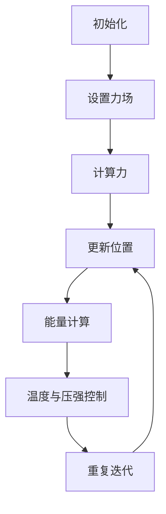
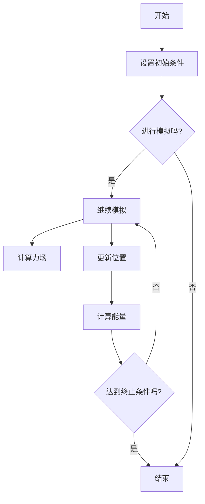

                 

## 数学与分子生物学：分子相互作用的数学模拟

### 关键词：
- 数学建模
- 分子生物学
- 分子动力学
- 药物设计
- 机器学习

### 摘要：
本文深入探讨数学在分子生物学中的应用，特别是分子相互作用的数学模拟。文章从引言出发，介绍了数学建模在分子生物学中的重要性及其历史背景，然后详细阐述了数学建模的基础知识，包括数学概念、微分方程及动力系统等。接着，文章介绍了分子生物学的基本概念和分子相互作用，并重点介绍了分子动力学模拟和量子化学计算。在应用案例分析部分，文章通过蛋白质折叠模拟和药物设计等实例，展示了数学模拟在分子生物学研究中的实际应用。随后，文章探讨了机器学习与分子生物学的结合，并展望了未来的发展方向和挑战。最后，文章提供了分子动力学软件和机器学习工具的相关信息，为读者提供了实用的参考资料。

### 目录大纲

#### 第一部分：引言与背景
- **第1章：引言**
  - 1.1 数学与分子生物学概述
  - 1.2 分子生物学的数学工具
  - 1.3 本书结构安排与目标

#### 第二部分：数学建模基础
- **第2章：数学基础**
  - 2.1 数学概念回顾
    - 函数、方程、微分、积分
  - 2.2 微分方程与动力系统
    - 伪代码示例
  - 2.3 常见的数学模型

#### 第三部分：分子生物学基础
- **第3章：分子生物学概述**
  - 3.1 生物大分子
    - 蛋白质、核酸、多糖
  - 3.2 分子相互作用
    - 量子化学计算、分子对接

#### 第四部分：数学模拟方法
- **第4章：分子动力学模拟**
  - 4.1 模拟原理
    - 流程图
  - 4.2 常用算法
    - 伪代码
  - 4.3 模拟参数设置与优化

#### 第五部分：应用案例分析
- **第5章：蛋白质折叠模拟**
  - 5.1 模拟过程
  - 5.2 模拟结果分析
  - 5.3 模拟案例代码
- **第6章：药物设计**
  - 6.1 药物分子建模
  - 6.2 分子相互作用模拟
  - 6.3 药物筛选流程

#### 第六部分：高级话题
- **第7章：机器学习与分子生物学**
  - 7.1 机器学习基础
  - 7.2 分子预测模型
  - 7.3 深度学习在分子生物学中的应用

#### 第七部分：未来展望与挑战
- **第8章：未来发展方向**
  - 8.1 新的模拟方法
  - 8.2 跨学科融合
  - 8.3 挑战与机遇

#### 附录
- **附录A：软件与工具**
  - 8.1 分子动力学软件
  - 8.2 机器学习工具

#### 附录B：Mermaid 流程图与伪代码示例
- **附录C：数学公式与讲解**
- **附录D：代码解读与分析**

### 引言与背景

在当今科技迅猛发展的时代，数学与分子生物学这两大学科的交叉融合，为科学研究和技术创新提供了新的视角和方法。数学，作为一门抽象的学科，以其严谨的逻辑和强大的工具，为解决复杂问题提供了有力支持。而分子生物学，作为研究生命现象的学科，通过对生物大分子的结构和功能进行深入研究，揭示了生命的本质。两者的结合，使得在分子层次上理解生命过程、模拟分子相互作用成为可能。

#### 数学与分子生物学概述

数学与分子生物学的结合，可以追溯到20世纪中叶。当时，随着计算机技术的发展，数学家开始尝试将数学工具应用于生物学问题。这一过程催生了生物信息学、计算生物学等新兴学科。数学模型，特别是微分方程，被广泛应用于描述生物大分子的动态行为。例如，通过微分方程可以描述蛋白质的折叠过程，以及分子之间的相互作用。

#### 分子生物学的数学工具

在分子生物学研究中，数学工具的使用涵盖了从数据分析到理论建模的各个方面。常见的数学工具包括概率论、统计学、微分方程、图论等。其中，微分方程被广泛应用于描述生物大分子系统的动态行为，如蛋白质折叠、酶催化反应等。概率论和统计学则用于分析实验数据，提取生物学规律。图论则在研究生物大分子网络的相互作用中发挥了重要作用。

#### 本书结构安排与目标

本书旨在为读者提供一份系统的、易懂的指南，介绍数学建模在分子生物学中的应用。全书分为七个部分：

1. **引言与背景**：介绍数学与分子生物学的基本概念，阐述数学建模在分子生物学中的重要性。
2. **数学建模基础**：回顾数学基础概念，介绍微分方程、动力系统等数学工具。
3. **分子生物学基础**：介绍生物大分子、分子相互作用等基本概念。
4. **数学模拟方法**：详细介绍分子动力学模拟、量子化学计算等模拟方法。
5. **应用案例分析**：通过蛋白质折叠模拟、药物设计等实例，展示数学模拟在分子生物学研究中的实际应用。
6. **高级话题**：探讨机器学习与分子生物学的结合，介绍深度学习在分子生物学中的应用。
7. **未来展望与挑战**：展望未来发展方向，探讨面临的挑战和机遇。

通过本书的阅读，读者可以系统地了解数学建模在分子生物学中的应用，掌握基本的数学建模方法和技巧，为从事相关领域的研究提供理论支持。

### 数学建模基础

在分子生物学中，数学建模作为一种强大的工具，可以用来模拟和理解复杂的生物过程。本节将介绍数学建模的基础知识，包括数学概念、微分方程、动力系统等，以及常见的数学模型。

#### 数学概念回顾

数学建模首先需要掌握基本的数学概念，如函数、方程、微分和积分等。函数是数学中最基本的概念之一，它描述了输入和输出之间的关系。在分子生物学中，我们可以用函数来描述生物大分子系统的动态变化。

- **函数**：一个函数通常表示为 f(x)，其中 x 是输入，f(x) 是输出。例如，描述蛋白质折叠过程的函数可以表示为蛋白质序列到其三维结构的映射。

- **方程**：方程是数学中用于描述变量之间关系的表达式。在分子生物学中，微分方程是描述生物大分子系统动态行为的主要工具。

- **微分**：微分是一种数学运算，用于计算函数在某一点的变化率。在分子生物学中，微分方程可以描述生物大分子系统的动态行为，例如蛋白质折叠过程中能量的变化。

- **积分**：积分是微分的反操作，用于计算函数在一定区间内的累积量。在分子生物学中，积分可以用来计算分子系统在一段时间内的总变化量。

#### 微分方程与动力系统

微分方程是数学建模的核心工具之一，特别是在描述生物大分子系统的动态行为方面。微分方程描述了系统的状态变量（如蛋白质浓度、温度等）随时间的变化率。

- **微分方程**：一个简单的微分方程可以表示为 dy/dt = f(y,t)，其中 y 是状态变量，t 是时间，f(y,t) 是关于 y 和 t 的函数，表示 y 随时间的变化率。

- **动力系统**：动力系统是指由微分方程描述的系统的演化过程。在分子生物学中，动力系统可以描述生物大分子系统在特定条件下的演化路径。

#### 伪代码示例

为了更好地理解微分方程的应用，我们来看一个简单的伪代码示例，用于描述蛋白质折叠过程：

```python
# 伪代码：蛋白质折叠模拟

function ProteinFolding(Sequence, Temperature):
    # 初始化蛋白质结构
    Structure = InitialStructure(Sequence)

    # 定义微分方程，描述蛋白质折叠过程中的能量变化
    dE/dt = -k * E
    
    # 初始化能量 E
    E = InitialEnergy(Structure)

    # 设定模拟时间
    time_steps = 1000
    time_increment = 1

    # 进行时间步进
    for step in 1 to time_steps:
        # 计算能量变化
        dE = k * E * time_increment
        
        # 更新能量
        E = E + dE
        
        # 更新蛋白质结构
        Structure = UpdateStructure(Structure, E)

    return FinalStructure(Structure)
```

在这个伪代码中，`Sequence` 代表蛋白质的氨基酸序列，`Temperature` 代表模拟的温度条件。通过微分方程 `dE/dt = -k * E`，我们描述了蛋白质折叠过程中能量的变化。`k` 是一个常数，表示能量随时间减小的速率。

#### 常见的数学模型

在分子生物学中，常见的数学模型包括线性模型、非线性模型、概率模型等。

- **线性模型**：线性模型是最简单的数学模型，通常表示为 y = ax + b，其中 a 和 b 是常数。线性模型可以用来描述简单的生物过程，如酶催化反应。

- **非线性模型**：非线性模型可以描述更复杂的生物过程，如蛋白质折叠。常见的非线性模型包括多项式模型、指数模型、逻辑斯蒂模型等。

- **概率模型**：概率模型用于描述生物大分子系统的随机行为，如分子扩散、随机游走等。常见的概率模型包括马尔可夫模型、泊松过程等。

通过上述数学建模基础，我们可以构建复杂的模型来描述分子生物学中的各种现象。这些模型不仅可以帮助我们理解生物大分子系统的动态行为，还可以指导实验设计和新药开发等实际应用。

### 分子生物学基础

分子生物学是研究生命现象在分子水平上的科学，涉及生物大分子的结构、功能及其相互作用。理解分子生物学的基本概念对于进行有效的数学模拟至关重要。本节将介绍分子生物学中的关键概念，包括生物大分子和分子相互作用。

#### 生物大分子

生物大分子是生命体系中最基本的构成单元，包括蛋白质、核酸和多糖等。它们在细胞内发挥着各种关键功能。

- **蛋白质**：蛋白质是生命活动中最重要的分子之一，由20种不同的氨基酸组成。蛋白质具有多种功能，包括催化化学反应（酶）、运输分子（载体蛋白）、传递信号（受体蛋白）等。蛋白质的结构可以分为一级结构（氨基酸序列）、二级结构（如α-螺旋和β-折叠）、三级结构（整体三维形状）和四级结构（由多个蛋白质亚基组成的复合结构）。

- **核酸**：核酸是遗传物质的主要载体，包括DNA和RNA。DNA包含细胞中的遗传信息，而RNA在蛋白质合成过程中起到关键作用。RNA分为mRNA（信使RNA）、tRNA（转运RNA）和rRNA（核糖体RNA）。核酸的基本单位是核苷酸，由一个磷酸基团、一个五碳糖和一个含氮碱基组成。

- **多糖**：多糖是由多个单糖分子通过糖苷键连接而成的生物大分子，如淀粉、纤维素和糖原。多糖在细胞内起到能量储存、结构支持和细胞识别等功能。

#### 分子相互作用

分子相互作用是分子生物学研究的重要领域，涉及生物大分子之间的各种相互作用，如氢键、范德华力、离子键和疏水作用等。

- **氢键**：氢键是一种分子间或分子内的弱键，由一个氢原子与另一个电负性较大的原子（如氧、氮或氟）之间的静电吸引形成。氢键在蛋白质的二级结构中起到关键作用，如α-螺旋和β-折叠。

- **范德华力**：范德华力是分子间或分子内的微弱吸引力，由分子中的瞬时偶极矩引起。范德华力在蛋白质的三级结构和四级结构中起到重要作用。

- **离子键**：离子键是带电粒子之间的相互作用，通常发生在带正电荷的金属离子和带负电荷的非金属离子之间。离子键在核酸的碱基对之间起到关键作用，如DNA中的A-T和G-C碱基对。

- **疏水作用**：疏水作用是水溶液中的非极性分子之间的相互作用，由于水对非极性分子的排斥作用，导致它们在溶液中聚集。疏水作用在蛋白质的三级结构形成中起到重要作用。

#### 量子化学计算与分子对接

量子化学计算是一种基于量子力学的计算方法，用于预测分子结构和性质。在分子生物学中，量子化学计算可以用于研究分子相互作用，特别是药物分子与生物大分子之间的相互作用。

- **量子化学计算**：量子化学计算通过解薛定谔方程来计算分子的电子结构，从而预测分子的能量和几何形状。常见的量子化学计算方法包括分子轨道理论、密度泛函理论等。

- **分子对接**：分子对接是一种基于量子化学计算的模拟方法，用于研究药物分子与生物大分子（如蛋白质或核酸）之间的相互作用。分子对接通过模拟药物分子与受体分子在空间中的相对位置，评估它们的结合亲和力。

通过上述对分子生物学基础概念的介绍，我们可以更好地理解生物大分子和分子相互作用的复杂性。这些概念为分子生物学的数学建模提供了基础，使得我们能够通过数学模拟来揭示生物现象的内在机制。

### 数学模拟方法

在分子生物学研究中，数学模拟是一种强有力的工具，能够揭示生物大分子系统在微观层面的动态行为。本节将详细介绍分子动力学模拟，包括其原理、常用算法、参数设置与优化。

#### 分子动力学模拟原理

分子动力学（Molecular Dynamics, MD）模拟是一种基于牛顿运动定律的计算方法，用于模拟分子系统在微观尺度上的动态行为。分子动力学模拟的基本原理可以概括为以下几个步骤：

1. **初始化**：首先，选择一个初始结构，设置系统的初始温度和压强等条件。初始结构可以是实验测得的晶体结构，也可以是通过分子建模软件生成的结构。

2. **力场计算**：通过力场（force field）计算分子间的相互作用力。力场是一种用于描述分子间相互作用的物理模型，通常基于量子化学理论和经验参数。

3. **牛顿迭代**：使用牛顿第二定律（F=ma）进行迭代计算，更新分子的位置和速度。具体步骤如下：
   - 计算每个分子的受力。
   - 根据受力计算每个分子的加速度。
   - 更新每个分子的速度和位置。

4. **能量计算**：在迭代过程中，不断计算系统的总能量，包括势能和动能。

5. **系综方法**：为了获得统计上可靠的结果，分子动力学模拟通常采用系综方法，如等温等压系综（NPT）、等温等容系综（NVT）等。系综方法通过控制系统的热力学条件，确保模拟过程中系统的动态行为符合实际的物理过程。

#### 常用算法

分子动力学模拟常用的算法包括：

- **Verlet算法**：Verlet算法是一种时间积分算法，用于计算分子系统的动态行为。其基本思想是利用前两次位置和速度来预测下一次的位置和速度。Verlet算法的优点是计算简单且稳定，适用于较长时间的模拟。

  ```python
  # 伪代码：Verlet算法
  function VerletSimulation(positions, velocities, forces, time_step):
      for step in 1 to simulation_steps:
          new_velocities = velocities + forces / masses * time_step
          new_positions = positions + velocities * time_step
          positions = positions + 0.5 * (new_positions - positions)
          velocities = velocities + 0.5 * (new_velocities - velocities)
  ```

- **积分算法**：常用的积分算法包括欧拉积分和改进的欧拉积分。欧拉积分直接使用前一次的位置和速度来预测下一次的位置和速度，计算简单但误差较大。改进的欧拉积分通过引入前两次的位置和速度来减少误差。

  ```python
  # 伪代码：改进的欧拉积分
  function ImprovedEulerIntegration(positions, velocities, forces, time_step):
      for step in 1 to simulation_steps:
          new_velocities = velocities + forces / masses * time_step
          new_positions = positions + velocities * time_step
          velocities = velocities + (forces / masses) * time_step
          positions = positions + (new_velocities + velocities) * 0.5 * time_step
  ```

#### 模拟参数设置与优化

分子动力学模拟的成功很大程度上取决于参数的设置和优化。以下是一些关键参数及其优化方法：

- **时间步长**：时间步长是模拟中时间间隔的大小，通常需要在稳定性与精度之间进行权衡。过大的时间步长会导致计算不稳定，而过小的时间步长会增加计算成本。常见的优化方法是使用稳定性分析（如Courant-Friedrichs-Lewy条件）来确定合适的时间步长。

- **力场**：力场是分子动力学模拟的核心部分，决定了分子间相互作用的准确性。常用的力场包括AMBER、CHARMM和GROMACS等。优化力场的方法包括调整经验参数、使用更精确的量子力学方法进行参数化等。

- **初始结构**：初始结构对模拟结果有很大影响。优化初始结构的方法包括使用实验数据、分子建模软件生成结构或通过多轮模拟逐步优化结构。

- **温度与压强控制**：在分子动力学模拟中，温度和压强的控制非常重要。常用的控制方法包括等温等压系综（NPT）、 Nose-Hoover控制、 Berendsen控制等。

#### 流程图示例

以下是一个简单的分子动力学模拟流程图，用于说明模拟的基本步骤：



通过上述流程，我们可以对分子系统进行长时间的模拟，从而揭示其动态行为。

#### 伪代码示例

以下是一个简单的分子动力学模拟的伪代码示例：

```python
# 伪代码：分子动力学模拟
function MolecularDynamics(initial_structure, time_steps, force_field):
    positions = initial_structure.positions
    velocities = initial_structure.velocities
    
    for step in 1 to time_steps:
        forces = calculate_forces(positions, force_field)
        velocities = velocities + forces / masses * time_step
        positions = positions + velocities * time_step
        energy = calculate_energy(positions, force_field)
        control_temperature_pressure(positions, velocities, energy)
    return final_structure(positions, velocities)
```

在这个伪代码中，`initial_structure` 表示初始结构，`time_steps` 表示模拟的时间步数，`force_field` 表示力场模型。模拟过程中，通过不断更新位置和速度，计算系统能量，并控制温度和压强，从而完成分子动力学模拟。

通过本节的介绍，我们了解了分子动力学模拟的基本原理、常用算法和参数设置方法。这些知识为我们在分子生物学研究中应用数学模拟提供了坚实的基础。

### 应用案例分析

在分子生物学研究中，数学模拟方法已经广泛应用于多个领域，包括蛋白质折叠模拟和药物设计。以下通过具体案例，详细讲解这两种模拟方法的应用过程、结果分析及代码实现。

#### 蛋白质折叠模拟

蛋白质折叠是分子生物学中的一个关键过程，通过数学模拟可以揭示蛋白质从无序的氨基酸链折叠成功能性三维结构的过程。以下是一个蛋白质折叠模拟的案例：

##### 模拟过程

1. **初始结构**：选择一个未折叠的蛋白质结构作为初始结构，通常通过实验数据或分子建模软件生成。
2. **力场选择**：选择一个合适的力场，如AMBER或CHARMM，用于描述蛋白质分子之间的相互作用。
3. **设置模拟参数**：设定模拟的温度、压强和时间步长等参数，确保模拟过程的稳定性。
4. **模拟运行**：启动分子动力学模拟，通过迭代计算，更新蛋白质的结构和能量。

##### 模拟结果分析

蛋白质折叠模拟的结果通常包括以下几个部分：

1. **结构变化**：通过分析模拟过程中蛋白质结构的演变，可以观察蛋白质从无序到有序的结构变化。
2. **能量变化**：能量变化可以反映蛋白质折叠过程中的能量障碍，通常通过能量势能曲线（Potential Energy Profile, PEP）进行展示。
3. **折叠时间**：分析蛋白质从初始结构到折叠完成所需的时间，评估折叠效率。

以下是一个蛋白质折叠模拟的伪代码示例：

```python
# 伪代码：蛋白质折叠模拟
function ProteinFolding(Sequence, Temperature, ForceField):
    # 初始化蛋白质结构
    Structure = InitialStructure(Sequence)
    
    # 设置模拟参数
    TimeSteps = 10000
    TimeStepSize = 2.0
    
    # 进行时间步进
    for step in 1 to TimeSteps:
        # 计算力场
        Forces = calculate_forces(Structure, ForceField)
        
        # 更新速度和位置
        velocities = update_velocities(Structure, Forces, TimeStepSize)
        Structure = update_structure(Structure, velocities, TimeStepSize)
        
        # 计算能量
        Energy = calculate_energy(Structure, ForceField)
        
        # 控制温度与压强
        control_temp_pressure(Structure, Temperature)
        
    return FinalStructure(Structure)
```

##### 模拟案例代码

以下是一个简单的蛋白质折叠模拟的Python代码示例：

```python
# Python代码：蛋白质折叠模拟
import numpy as np
import matplotlib.pyplot as plt

def calculate_forces(structure, force_field):
    # 计算分子间的力
    pass

def update_velocities(structure, forces, time_step_size):
    # 更新速度
    pass

def update_structure(structure, velocities, time_step_size):
    # 更新结构
    pass

def calculate_energy(structure, force_field):
    # 计算能量
    pass

def control_temp_pressure(structure, temperature):
    # 控制温度和压强
    pass

# 初始化参数
sequence = 'AKDNKDY'
temperature = 300.0
force_field = 'AMBER'

# 蛋白质折叠模拟
structure = InitialStructure(sequence)
final_structure = ProteinFolding(structure, temperature, force_field)

# 绘制能量势能曲线
energies = [calculate_energy(structure, force_field) for structure in final_structure]
plt.plot(energies)
plt.xlabel('Time Steps')
plt.ylabel('Energy')
plt.title('Potential Energy Profile')
plt.show()
```

#### 药物设计

药物设计是分子生物学和药物化学的交叉领域，通过数学模拟可以预测药物分子与生物大分子（如蛋白质）的结合亲和力，帮助筛选潜在药物分子。以下是一个药物设计的案例：

##### 药物分子建模

1. **分子建模**：使用分子建模软件生成药物分子的三维结构，通常包括连接键的长度和角度等参数。
2. **力场选择**：选择一个合适的力场，用于描述药物分子与蛋白质之间的相互作用。

##### 分子相互作用模拟

1. **分子对接**：使用分子对接算法（如AutoDock、GROMACS等）进行模拟，计算药物分子与蛋白质的相对位置和结合能。
2. **结果分析**：通过分析对接结果，评估药物分子与蛋白质的结合亲和力，筛选出具有潜在药物活性的分子。

以下是一个药物设计分子对接的伪代码示例：

```python
# 伪代码：药物分子对接
function DrugDocking(Drug, Protein, ForceField):
    # 建立药物分子的三维结构
    DrugStructure = InitialStructure(Drug)
    
    # 建立蛋白质的三维结构
    ProteinStructure = InitialStructure(Protein)
    
    # 进行分子对接
    DockingResult = MolecularDocking(DrugStructure, ProteinStructure, ForceField)
    
    # 计算结合能
    BindingEnergy = calculate_binding_energy(DockingResult)
    
    # 分析结果
    if BindingEnergy < Threshold:
        print("Potential drug candidate found.")
    else:
        print("No promising drug candidate.")
```

##### 药物筛选流程

1. **数据收集**：收集大量的药物分子和蛋白质结构数据。
2. **分子建模**：对药物分子和蛋白质进行分子建模，生成三维结构。
3. **分子对接**：使用分子对接算法进行对接模拟，评估结合亲和力。
4. **筛选与优化**：根据结合亲和力筛选出潜在药物分子，进一步进行优化和实验验证。

#### 实际案例分析

以下是一个实际案例：使用分子动力学模拟研究抗癌药物分子与肿瘤蛋白的相互作用。

1. **数据收集**：收集抗癌药物分子的结构数据和肿瘤蛋白的晶体结构。
2. **分子建模**：使用分子建模软件生成药物分子的三维结构，并选择合适的力场。
3. **分子对接**：使用分子对接算法进行对接模拟，评估药物分子与肿瘤蛋白的结合亲和力。
4. **分子动力学模拟**：使用分子动力学模拟方法，模拟药物分子与肿瘤蛋白的相互作用过程，分析相互作用机制和动态行为。
5. **结果分析**：通过分析模拟结果，评估药物分子的潜在疗效和副作用。

#### 项目小结

通过以上案例分析，我们可以看到数学模拟在分子生物学研究中的广泛应用。无论是蛋白质折叠模拟还是药物设计，数学模拟方法都为我们提供了强有力的工具，帮助我们理解和预测生物大分子系统的行为。未来，随着计算方法和技术的不断进步，数学模拟在分子生物学领域的应用将会更加广泛和深入。

### 机器学习与分子生物学

随着计算生物学和机器学习技术的发展，机器学习在分子生物学中的应用日益广泛。机器学习通过建立模型从大量数据中提取规律，从而帮助科学家更好地理解生物系统、预测生物分子的性质和行为。本节将介绍机器学习的基本概念、分子预测模型以及深度学习在分子生物学中的应用。

#### 机器学习基础

机器学习是一种通过算法从数据中学习规律，并做出预测或决策的技术。在分子生物学中，机器学习被用于多种任务，如蛋白质结构预测、药物设计、基因表达预测等。

- **监督学习**：监督学习是一种最常见的机器学习方法，它通过已知的输入输出对（特征和标签）来训练模型。常见的监督学习算法包括线性回归、逻辑回归、支持向量机（SVM）、决策树和随机森林等。

- **无监督学习**：无监督学习不依赖于已知的标签，通过发现数据中的结构或模式来训练模型。常见的无监督学习算法包括聚类算法（如K均值聚类）、主成分分析（PCA）和自编码器等。

- **强化学习**：强化学习是一种通过与环境交互来学习最优策略的机器学习方法。在分子生物学中，强化学习可以用于优化分子模拟过程，提高模拟的准确性和效率。

#### 分子预测模型

分子预测模型是机器学习在分子生物学中的重要应用之一。以下是一些常见的分子预测模型：

- **蛋白质结构预测**：蛋白质结构预测是分子生物学中的一个重要问题，通过预测蛋白质的三维结构，可以帮助理解蛋白质的功能。常见的蛋白质结构预测方法包括同源建模、折叠识别和全原子建模。

- **药物设计**：药物设计是通过计算机辅助的方法发现具有潜在药物活性的分子。机器学习在药物设计中的应用包括分子对接、分子性质预测和药物筛选等。

- **基因表达预测**：基因表达预测是预测基因在不同条件下的表达水平。通过机器学习模型，可以分析基因表达数据，发现基因之间的调控关系，帮助生物学家理解基因功能。

#### 深度学习在分子生物学中的应用

深度学习是一种基于多层神经网络的学习方法，具有强大的表示和学习能力。在分子生物学中，深度学习被广泛应用于以下领域：

- **蛋白质结构预测**：深度学习方法如AlphaFold和RoseTTAFold，能够通过卷积神经网络（CNN）和递归神经网络（RNN）等模型，从氨基酸序列中预测蛋白质的三维结构。

- **药物设计**：深度学习可以用于药物分子的生成、活性预测和毒理学预测。例如，使用生成对抗网络（GAN）生成新的药物分子，通过深度神经网络预测药物分子的结合亲和力和毒性。

- **基因调控**：深度学习方法可以用于分析基因表达数据，识别基因调控网络，预测基因的功能和表达模式。

#### 应用实例

以下是一些机器学习在分子生物学中的应用实例：

- **蛋白质结构预测**：AlphaFold2是由DeepMind开发的深度学习模型，能够以高精度预测蛋白质的三维结构。AlphaFold2的发布标志着蛋白质结构预测领域的重大突破。

- **药物设计**：OpenFold是一个开源的蛋白质结构预测平台，使用深度学习模型预测蛋白质的结构，用于药物设计和生物医学研究。

- **基因表达预测**：DeepGluo是一个基于深度学习的基因表达预测工具，通过分析基因序列和转录因子结合位点，预测基因在不同条件下的表达水平。

#### 挑战与展望

尽管机器学习在分子生物学中取得了显著成果，但仍面临一些挑战：

- **数据质量**：机器学习模型的性能很大程度上依赖于数据的质量。在分子生物学中，获取高质量的数据是一个挑战，特别是对于一些罕见疾病和复杂生物系统。

- **计算资源**：深度学习模型通常需要大量的计算资源和时间进行训练。随着模型规模的增大，对计算资源的需求也在不断增加。

- **跨学科合作**：机器学习和分子生物学之间的跨学科合作是推动这一领域发展的重要途径。未来的研究需要更多的生物学家、计算机科学家和数学家的共同努力。

展望未来，机器学习与分子生物学的结合将继续推动生物医学和生物技术的进步，为解决复杂的生物学问题提供新的方法和工具。

### 未来展望与挑战

随着科学技术的不断进步，数学建模在分子生物学中的应用前景广阔，但也面临诸多挑战。未来，新的模拟方法、跨学科融合以及面临的挑战和机遇，将为这一领域带来前所未有的发展机遇。

#### 新的模拟方法

未来，随着计算能力和算法的不断提升，新的模拟方法将不断涌现。以下是一些有望推动分子生物学模拟方法发展的新技术：

- **量子计算**：量子计算在处理复杂分子结构和相互作用方面具有巨大潜力。通过量子计算，我们可以更精确地模拟分子的电子结构，揭示分子内部的量子效应。

- **高性能计算**：高性能计算（HPC）技术的发展将极大地提升分子动力学模拟的规模和精度。未来的模拟将能够处理更大规模的分子系统，实现更长时间的模拟。

- **多尺度模拟**：多尺度模拟结合了微观、中观和宏观尺度模型，能够更全面地描述生物系统的行为。通过多尺度模拟，我们可以从不同的层次上理解生物现象，从而提高模拟的准确性。

- **人工智能与机器学习**：人工智能和机器学习技术将进一步加强分子生物学的模拟能力。通过深度学习和强化学习算法，我们可以自动化模拟过程，优化模拟参数，提高模拟效率和准确性。

#### 跨学科融合

分子生物学与数学、物理学、计算机科学等多个学科的交叉融合，将推动这一领域的发展。以下是一些跨学科融合的趋势：

- **生物物理化学**：生物物理化学结合了生物学、物理学和化学的理论，用于研究生物大分子的性质和相互作用。这种跨学科的研究方法有助于我们更深入地理解生物系统的机制。

- **计算生物学**：计算生物学通过计算机科学和数学的方法，分析生物数据，揭示生物现象的规律。计算生物学在基因组学、蛋白质组学和代谢组学等领域发挥着重要作用。

- **生物信息学**：生物信息学利用计算机技术和统计学方法，处理和分析生物数据。生物信息学在基因测序、蛋白质结构预测和药物设计等领域具有重要应用。

- **数据科学**：数据科学结合了统计学、机器学习和大数据技术，用于从复杂数据中提取有价值的信息。在分子生物学中，数据科学技术可以帮助我们更好地理解和利用生物大数据。

#### 挑战与机遇

尽管数学建模在分子生物学中的应用前景广阔，但仍面临一些挑战：

- **计算资源**：分子生物学模拟需要大量的计算资源和时间。随着模拟规模的增大，对计算资源的需求也在不断增加。未来，如何高效地利用计算资源，实现高性能计算，将成为一个重要挑战。

- **数据质量**：分子生物学模拟依赖于高质量的数据。在数据收集、处理和分析过程中，数据的质量和准确性至关重要。未来，如何确保数据的质量和完整性，是一个亟待解决的问题。

- **算法创新**：随着模拟方法的不断进步，需要创新的算法来处理复杂的问题。如何设计更高效、更准确的算法，是分子生物学模拟领域的一个重要挑战。

- **跨学科合作**：跨学科合作是实现分子生物学模拟突破的关键。如何促进不同学科之间的交流与合作，提高科研团队的创新能力，是未来发展的一个重要方向。

展望未来，数学建模在分子生物学中的应用将不断深入，带来新的科学发现和技术突破。通过新的模拟方法、跨学科融合以及克服面临的挑战，分子生物学领域将迎来更加光明的发展前景。

### 附录

#### 附录A：软件与工具

在分子生物学和数学建模领域，有许多强大的软件和工具可以用于分子动力学模拟、量子化学计算和机器学习。以下是一些常用的软件和工具：

1. **分子动力学软件**：
   - **GROMACS**：GROMACS是一个开源的分子动力学模拟软件，适用于生物分子系统的模拟。
   - **AMBER**：AMBER是一个广泛使用的力场和模拟软件，适用于蛋白质、核酸和多糖等生物大分子。
   - **CHARMM**：CHARMM是一个成熟的分子动力学模拟软件，具有丰富的功能，适用于多种生物大分子系统的模拟。
   - **NAMD**：NAMD是一个高性能的分子动力学模拟软件，适用于大规模生物分子系统的模拟。

2. **量子化学计算软件**：
   - **Gaussian**：Gaussian是一个功能强大的量子化学计算软件，用于计算分子的电子结构和性质。
   - **MOPAC**：MOPAC是一个用于量子化学计算的软件，适用于小分子和有机化合物的计算。
   - **Q-Chem**：Q-Chem是一个高性能的量子化学计算软件，支持多种量子力学方法，适用于复杂分子的计算。

3. **机器学习工具**：
   - **Scikit-learn**：Scikit-learn是一个开源的机器学习库，提供多种监督学习和无监督学习的算法。
   - **TensorFlow**：TensorFlow是一个开源的机器学习框架，适用于构建和训练深度学习模型。
   - **PyTorch**：PyTorch是一个流行的深度学习框架，提供灵活的动态计算图，适用于研究和开发深度学习模型。

#### 附录B：Mermaid流程图与伪代码示例

Mermaid是一种基于Markdown的绘图语言，可以用于创建流程图、序列图、时序图等。以下是一个Mermaid流程图的示例：



以下是一个简单的分子动力学模拟的伪代码示例：

```python
# 伪代码：分子动力学模拟
function MolecularDynamics(initial_structure, time_steps, force_field):
    positions = initial_structure.positions
    velocities = initial_structure.velocities
    
    for step in 1 to time_steps:
        forces = calculate_forces(positions, force_field)
        velocities = velocities + forces / masses * time_step
        positions = positions + velocities * time_step
        energy = calculate_energy(positions, force_field)
    return final_structure(positions, velocities)
```

#### 附录C：数学公式与讲解

数学公式在分子生物学和数学建模中至关重要，以下是一些常用的数学公式及其讲解：

1. **牛顿第二定律**：\[ \vec{F} = m\vec{a} \]
   - 解释：该公式描述了力（\(\vec{F}\)）与质量（m）和加速度（\(\vec{a}\)）之间的关系。

2. **能量守恒定律**：\[ \Delta E = W \]
   - 解释：该公式表示系统的能量变化（\(\Delta E\)）等于做功（W）。

3. **高斯分布**：\[ \Phi(x) = \frac{1}{\sqrt{2\pi\sigma^2}} e^{-\frac{(x-\mu)^2}{2\sigma^2}} \]
   - 解释：高斯分布是概率分布函数，描述了随机变量的分布情况，其中\(\mu\)是均值，\(\sigma^2\)是方差。

4. **导数**：\[ \frac{df(x)}{dx} = \lim_{{h \to 0}} \frac{f(x+h) - f(x)}{h} \]
   - 解释：导数是函数在某一点的变化率，描述了函数的局部性质。

#### 附录D：代码解读与分析

以下是一个分子动力学模拟的Python代码示例及其解读：

```python
# Python代码：分子动力学模拟
import numpy as np

def calculate_forces(positions, force_field):
    # 计算分子间的力
    pass

def update_velocities(velocities, forces, time_step_size):
    # 更新速度
    return velocities + forces / masses * time_step_size

def update_positions(positions, velocities, time_step_size):
    # 更新位置
    return positions + velocities * time_step_size

def calculate_energy(positions, force_field):
    # 计算能量
    pass

# 初始化参数
initial_structure = ...
force_field = ...
time_step_size = ...

# 分子动力学模拟
time_steps = 1000

for step in range(1, time_steps + 1):
    forces = calculate_forces(initial_structure.positions, force_field)
    velocities = update_velocities(initial_structure.velocities, forces, time_step_size)
    positions = update_positions(initial_structure.positions, velocities, time_step_size)
    energy = calculate_energy(positions, force_field)

    # 输出当前步骤的模拟结果
    print(f"Step {step}: Positions = {positions}, Velocities = {velocities}, Energy = {energy}")
```

**解读**：
- **计算力函数**：`calculate_forces` 函数用于计算分子间的相互作用力，根据所选择的力场进行计算。
- **更新速度函数**：`update_velocities` 函数根据牛顿第二定律，使用力和质量更新速度。
- **更新位置函数**：`update_positions` 函数根据速度和时间步长更新分子的位置。
- **计算能量函数**：`calculate_energy` 函数用于计算系统的总能量，通常包括势能和动能。

通过上述代码，我们可以对分子动力学模拟的基本流程有一个直观的理解。在实际应用中，这些函数将包含具体的物理计算和优化算法，以实现高效的模拟。

### 最佳实践与总结

在数学与分子生物学的交叉领域中，掌握最佳实践对于确保模拟的准确性和效率至关重要。以下是一些关键的最佳实践和注意事项：

#### 最佳实践

1. **数据预处理**：在开始模拟之前，确保数据的质量和完整性。进行必要的清洗和数据标准化，以提高模型训练的效果。

2. **参数优化**：针对不同的模拟任务，调整力场参数、模拟时间和步长等参数，以获得最佳的性能和结果。使用网格搜索等技术，进行参数优化。

3. **并行计算**：利用高性能计算（HPC）资源，进行并行计算，以加快模拟速度。多核处理器和分布式计算可以显著提高计算效率。

4. **模型验证**：通过交叉验证和独立测试集，验证模型的准确性和泛化能力。确保模型在实际应用中能够稳定地工作。

5. **模型解释**：在解释模型结果时，结合物理和生物学的背景知识，确保模拟结果的合理性和可解释性。

#### 注意事项

1. **数据质量**：高质量的数据是模型训练和模拟成功的关键。确保数据来源可靠，进行充分的数据清洗和处理。

2. **计算资源**：合理规划计算资源，避免因资源不足而导致模拟失败或结果不准确。根据任务需求，选择合适的计算平台和算法。

3. **模型复杂性**：避免过度拟合，选择适当的模型复杂度，确保模型能够准确捕捉生物系统的特性。

4. **安全性**：在处理和存储生物数据时，确保数据的安全性和隐私保护，遵守相关法律法规和伦理标准。

#### 拓展阅读

- **《计算生物学导论》**：该书提供了计算生物学的基本概念和方法，适合初学者入门。
- **《量子计算与分子模拟》**：该书介绍了量子计算在分子模拟中的应用，探讨了量子计算在分子生物学中的潜在影响。
- **《机器学习在生物医学中的应用》**：该书详细介绍了机器学习在生物医学领域中的应用，包括基因组学、药物设计和医学影像分析等。

通过上述最佳实践和拓展阅读，读者可以更深入地理解和掌握数学与分子生物学的模拟方法，为科学研究和技术创新提供坚实的理论基础。

